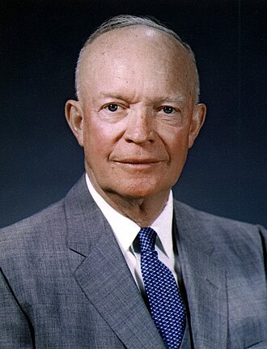

Use the dropdown menus below to select an administration and compare ratings over time: **Public Approval**, **Congressional Approval**, and **Party Favorability**. Click **▶ Play Trend** to animate the ratings month-by-month over the president's term, or use the filter menu to toggle individual trends.


::: {.cell}
::: {.cell-output-display}

```{=html}
<div style="display: flex; flex-wrap: wrap; gap: 20px; margin-bottom: 25px;">
<div style="min-width: 260px; max-width: 320px;">
<label for="presSelect" style="font-weight: 600; margin-bottom: 6px; display: block;">Select President:</label>
<select id="presSelect" class="form-select" onchange="switchPresident(this.value)">
<option value="pres-plot-1">Harry Truman (1945–1953)</option>
<option value="pres-plot-2">Dwight Eisenhower (1953–1961)</option>
<option value="pres-plot-3">John F. Kennedy (1961–1963)</option>
<option value="pres-plot-4">Lyndon Johnson (1963–1969)</option>
<option value="pres-plot-5">Richard Nixon (1969–1974)</option>
<option value="pres-plot-6">Gerald Ford (1974–1977)</option>
<option value="pres-plot-7">Jimmy Carter (1977–1981)</option>
<option value="pres-plot-8">Ronald Reagan (1981–1989)</option>
<option value="pres-plot-9">George H.W. Bush (1989–1993)</option>
<option value="pres-plot-10">Bill Clinton (1993–2001)</option>
<option value="pres-plot-11">George W. Bush (2001–2009)</option>
<option value="pres-plot-12">Barack Obama (2009–2017)</option>
<option value="pres-plot-13">Donald Trump (2017–2021)</option>
<option value="pres-plot-14">Joe Biden (2021–2025)</option>
</select>
</div>
<div style="min-width: 260px; max-width: 320px;">
<label for="metricSelect" style="font-weight: 600; margin-bottom: 6px; display: block;">Select Trend to Play:</label>
<select id="metricSelect" class="form-select" onchange="filterMetric(this.value)">
<option value="all">All Ratings (Public, Congress, Party)</option>
<option value="public">Public Approval</option>
<option value="congress">Congressional Approval</option>
<option value="party">Party Favorability</option>
</select>
</div>
</div>
<div id="pres-plot-1" class="president-plot-container" style="display: block;">
<div style="display: flex; align-items: center; gap: 18px; margin: 10px 0 20px 0; padding: 14px 20px; background: rgba(255, 255, 255, 0.05); border: 1px solid rgba(255, 255, 255, 0.12); border-left: 6px solid #2E74C0; border-radius: 10px; box-shadow: 0 4px 15px rgba(0,0,0,0.3); backdrop-filter: blur(8px);">

<div>
<h3 style="margin: 0 0 6px 0; font-size: 1.35rem; font-weight: 700; color: #ffffff;">Harry Truman (1945–1953)</h3>
<div style="display: flex; align-items: center; gap: 10px; flex-wrap: wrap;">
<span style="display: inline-block; padding: 3px 12px; font-size: 0.85rem; font-weight: 600; color: #fff; background-color: #2E74C0; border-radius: 12px; box-shadow: 0 2px 6px rgba(0,0,0,0.3);">Democrat</span>
<span style="color: #94a3b8; font-size: 0.95rem; font-weight: 500;">Term: (1945–1953)</span>
</div>
</div>
</div>
<div class="plotly html-widget html-fill-item" id="htmlwidget-8a3efc8b83811af13537" style="width:100%;height:400px;"></div>
<script type="application/json" data-for="htmlwidget-8a3efc8b83811af13537">{"x":{"visdat":{"244a8d911d9":["function () ","plotlyVisDat"]},"cur_data":"244a8d911d9","attrs":{"244a8d911d9":{"x":{},"y":{},"mode":"lines+markers","connectgaps":true,"color":{},"frame":{},"colors":["#2E74C0","#8338EC","#2E7D32"],"alpha_stroke":1,"sizes":[10,100],"spans":[1,20],"type":"scatter"}},"layout":{"margin":{"b":60,"l":60,"t":75,"r":10},"title":{"text":"Ratings During Administration of Harry Truman (1945–1953) (Democrat)<br><sup>Congressional and Party favorability polling had not yet begun during this administration<\/sup>","x":0.5,"xanchor":"center","y":0.95999999999999996,"font":{"size":17}},"xaxis":{"domain":[0,1],"automargin":true,"title":"Date","range":["1945-05-01","1952-12-01"]},"yaxis":{"domain":[0,1],"automargin":true,"title":"Rating (%)","range":[0,100]},"shapes":[{"type":"line","y0":50,"y1":50,"x0":0,"x1":1,"xref":"paper","line":{"color":"grey60","dash":"dash","width":1}}],"legend":{"orientation":"h","x":0.050000000000000003,"y":-0.20000000000000001},"hovermode":"closest","showlegend":false,"sliders":[{"currentvalue":{"prefix":"Date: ","xanchor":"right","font":{"size":16,"color":"rgba(204,204,204,1)"}},"steps":[{"method":"animate","args":[["1945-05-01"],{"transition":{"duration":40,"easing":"linear"},"frame":{"duration":80,"redraw":true},"mode":"immediate"}],"label":"1945-05-01","value":"1945-05-01"},{"method":"animate","args":[["1945-08-01"],{"transition":{"duration":40,"easing":"linear"},"frame":{"duration":80,"redraw":true},"mode":"immediate"}],"label":"1945-08-01","value":"1945-08-01"},{"method":"animate","args":[["1945-10-01"],{"transition":{"duration":40,"easing":"linear"},"frame":{"duration":80,"redraw":true},"mode":"immediate"}],"label":"1945-10-01","value":"1945-10-01"},{"method":"animate","args":[["1946-01-01"],{"transition":{"duration":40,"easing":"linear"},"frame":{"duration":80,"redraw":true},"mode":"immediate"}],"label":"1946-01-01","value":"1946-01-01"},{"method":"animate","args":[["1946-02-01"],{"transition":{"duration":40,"easing":"linear"},"frame":{"duration":80,"redraw":true},"mode":"immediate"}],"label":"1946-02-01","value":"1946-02-01"},{"method":"animate","args":[["1946-03-01"],{"transition":{"duration":40,"easing":"linear"},"frame":{"duration":80,"redraw":true},"mode":"immediate"}],"label":"1946-03-01","value":"1946-03-01"},{"method":"animate","args":[["1946-05-01"],{"transition":{"duration":40,"easing":"linear"},"frame":{"duration":80,"redraw":true},"mode":"immediate"}],"label":"1946-05-01","value":"1946-05-01"},{"method":"animate","args":[["1946-06-01"],{"transition":{"duration":40,"easing":"linear"},"frame":{"duration":80,"redraw":true},"mode":"immediate"}],"label":"1946-06-01","value":"1946-06-01"},{"method":"animate","args":[["1946-09-01"],{"transition":{"duration":40,"easing":"linear"},"frame":{"duration":80,"redraw":true},"mode":"immediate"}],"label":"1946-09-01","value":"1946-09-01"},{"method":"animate","args":[["1946-10-01"],{"transition":{"duration":40,"easing":"linear"},"frame":{"duration":80,"redraw":true},"mode":"immediate"}],"label":"1946-10-01","value":"1946-10-01"},{"method":"animate","args":[["1946-11-01"],{"transition":{"duration":40,"easing":"linear"},"frame":{"duration":80,"redraw":true},"mode":"immediate"}],"label":"1946-11-01","value":"1946-11-01"},{"method":"animate","args":[["1947-01-01"],{"transition":{"duration":40,"easing":"linear"},"frame":{"duration":80,"redraw":true},"mode":"immediate"}],"label":"1947-01-01","value":"1947-01-01"},{"method":"animate","args":[["1947-03-01"],{"transition":{"duration":40,"easing":"linear"},"frame":{"duration":80,"redraw":true},"mode":"immediate"}],"label":"1947-03-01","value":"1947-03-01"},{"method":"animate","args":[["1947-04-01"],{"transition":{"duration":40,"easing":"linear"},"frame":{"duration":80,"redraw":true},"mode":"immediate"}],"label":"1947-04-01","value":"1947-04-01"},{"method":"animate","args":[["1947-05-01"],{"transition":{"duration":40,"easing":"linear"},"frame":{"duration":80,"redraw":true},"mode":"immediate"}],"label":"1947-05-01","value":"1947-05-01"},{"method":"animate","args":[["1947-06-01"],{"transition":{"duration":40,"easing":"linear"},"frame":{"duration":80,"redraw":true},"mode":"immediate"}],"label":"1947-06-01","value":"1947-06-01"},{"method":"animate","args":[["1947-07-01"],{"transition":{"duration":40,"easing":"linear"},"frame":{"duration":80,"redraw":true},"mode":"immediate"}],"label":"1947-07-01","value":"1947-07-01"},{"method":"animate","args":[["1947-09-01"],{"transition":{"duration":40,"easing":"linear"},"frame":{"duration":80,"redraw":true},"mode":"immediate"}],"label":"1947-09-01","value":"1947-09-01"},{"method":"animate","args":[["1947-12-01"],{"transition":{"duration":40,"easing":"linear"},"frame":{"duration":80,"redraw":true},"mode":"immediate"}],"label":"1947-12-01","value":"1947-12-01"},{"method":"animate","args":[["1948-04-01"],{"transition":{"duration":40,"easing":"linear"},"frame":{"duration":80,"redraw":true},"mode":"immediate"}],"label":"1948-04-01","value":"1948-04-01"},{"method":"animate","args":[["1948-06-01"],{"transition":{"duration":40,"easing":"linear"},"frame":{"duration":80,"redraw":true},"mode":"immediate"}],"label":"1948-06-01","value":"1948-06-01"},{"method":"animate","args":[["1949-01-01"],{"transition":{"duration":40,"easing":"linear"},"frame":{"duration":80,"redraw":true},"mode":"immediate"}],"label":"1949-01-01","value":"1949-01-01"},{"method":"animate","args":[["1949-03-01"],{"transition":{"duration":40,"easing":"linear"},"frame":{"duration":80,"redraw":true},"mode":"immediate"}],"label":"1949-03-01","value":"1949-03-01"},{"method":"animate","args":[["1949-04-01"],{"transition":{"duration":40,"easing":"linear"},"frame":{"duration":80,"redraw":true},"mode":"immediate"}],"label":"1949-04-01","value":"1949-04-01"},{"method":"animate","args":[["1949-06-01"],{"transition":{"duration":40,"easing":"linear"},"frame":{"duration":80,"redraw":true},"mode":"immediate"}],"label":"1949-06-01","value":"1949-06-01"},{"method":"animate","args":[["1949-10-01"],{"transition":{"duration":40,"easing":"linear"},"frame":{"duration":80,"redraw":true},"mode":"immediate"}],"label":"1949-10-01","value":"1949-10-01"},{"method":"animate","args":[["1950-01-01"],{"transition":{"duration":40,"easing":"linear"},"frame":{"duration":80,"redraw":true},"mode":"immediate"}],"label":"1950-01-01","value":"1950-01-01"},{"method":"animate","args":[["1950-02-01"],{"transition":{"duration":40,"easing":"linear"},"frame":{"duration":80,"redraw":true},"mode":"immediate"}],"label":"1950-02-01","value":"1950-02-01"},{"method":"animate","args":[["1950-04-01"],{"transition":{"duration":40,"easing":"linear"},"frame":{"duration":80,"redraw":true},"mode":"immediate"}],"label":"1950-04-01","value":"1950-04-01"},{"method":"animate","args":[["1950-05-01"],{"transition":{"duration":40,"easing":"linear"},"frame":{"duration":80,"redraw":true},"mode":"immediate"}],"label":"1950-05-01","value":"1950-05-01"},{"method":"animate","args":[["1950-06-01"],{"transition":{"duration":40,"easing":"linear"},"frame":{"duration":80,"redraw":true},"mode":"immediate"}],"label":"1950-06-01","value":"1950-06-01"},{"method":"animate","args":[["1950-07-01"],{"transition":{"duration":40,"easing":"linear"},"frame":{"duration":80,"redraw":true},"mode":"immediate"}],"label":"1950-07-01","value":"1950-07-01"},{"method":"animate","args":[["1950-08-01"],{"transition":{"duration":40,"easing":"linear"},"frame":{"duration":80,"redraw":true},"mode":"immediate"}],"label":"1950-08-01","value":"1950-08-01"},{"method":"animate","args":[["1950-09-01"],{"transition":{"duration":40,"easing":"linear"},"frame":{"duration":80,"redraw":true},"mode":"immediate"}],"label":"1950-09-01","value":"1950-09-01"},{"method":"animate","args":[["1950-10-01"],{"transition":{"duration":40,"easing":"linear"},"frame":{"duration":80,"redraw":true},"mode":"immediate"}],"label":"1950-10-01","value":"1950-10-01"},{"method":"animate","args":[["1950-12-01"],{"transition":{"duration":40,"easing":"linear"},"frame":{"duration":80,"redraw":true},"mode":"immediate"}],"label":"1950-12-01","value":"1950-12-01"},{"method":"animate","args":[["1951-02-01"],{"transition":{"duration":40,"easing":"linear"},"frame":{"duration":80,"redraw":true},"mode":"immediate"}],"label":"1951-02-01","value":"1951-02-01"},{"method":"animate","args":[["1951-03-01"],{"transition":{"duration":40,"easing":"linear"},"frame":{"duration":80,"redraw":true},"mode":"immediate"}],"label":"1951-03-01","value":"1951-03-01"},{"method":"animate","args":[["1951-04-01"],{"transition":{"duration":40,"easing":"linear"},"frame":{"duration":80,"redraw":true},"mode":"immediate"}],"label":"1951-04-01","value":"1951-04-01"},{"method":"animate","args":[["1951-05-01"],{"transition":{"duration":40,"easing":"linear"},"frame":{"duration":80,"redraw":true},"mode":"immediate"}],"label":"1951-05-01","value":"1951-05-01"},{"method":"animate","args":[["1951-06-01"],{"transition":{"duration":40,"easing":"linear"},"frame":{"duration":80,"redraw":true},"mode":"immediate"}],"label":"1951-06-01","value":"1951-06-01"},{"method":"animate","args":[["1951-07-01"],{"transition":{"duration":40,"easing":"linear"},"frame":{"duration":80,"redraw":true},"mode":"immediate"}],"label":"1951-07-01","value":"1951-07-01"},{"method":"animate","args":[["1951-08-01"],{"transition":{"duration":40,"easing":"linear"},"frame":{"duration":80,"redraw":true},"mode":"immediate"}],"label":"1951-08-01","value":"1951-08-01"},{"method":"animate","args":[["1951-10-01"],{"transition":{"duration":40,"easing":"linear"},"frame":{"duration":80,"redraw":true},"mode":"immediate"}],"label":"1951-10-01","value":"1951-10-01"},{"method":"animate","args":[["1951-11-01"],{"transition":{"duration":40,"easing":"linear"},"frame":{"duration":80,"redraw":true},"mode":"immediate"}],"label":"1951-11-01","value":"1951-11-01"},{"method":"animate","args":[["1952-01-01"],{"transition":{"duration":40,"easing":"linear"},"frame":{"duration":80,"redraw":true},"mode":"immediate"}],"label":"1952-01-01","value":"1952-01-01"},{"method":"animate","args":[["1952-02-01"],{"transition":{"duration":40,"easing":"linear"},"frame":{"duration":80,"redraw":true},"mode":"immediate"}],"label":"1952-02-01","value":"1952-02-01"},{"method":"animate","args":[["1952-04-01"],{"transition":{"duration":40,"easing":"linear"},"frame":{"duration":80,"redraw":true},"mode":"immediate"}],"label":"1952-04-01","value":"1952-04-01"},{"method":"animate","args":[["1952-05-01"],{"transition":{"duration":40,"easing":"linear"},"frame":{"duration":80,"redraw":true},"mode":"immediate"}],"label":"1952-05-01","value":"1952-05-01"},{"method":"animate","args":[["1952-07-01"],{"transition":{"duration":40,"easing":"linear"},"frame":{"duration":80,"redraw":true},"mode":"immediate"}],"label":"1952-07-01","value":"1952-07-01"},{"method":"animate","args":[["1952-10-01"],{"transition":{"duration":40,"easing":"linear"},"frame":{"duration":80,"redraw":true},"mode":"immediate"}],"label":"1952-10-01","value":"1952-10-01"},{"method":"animate","args":[["1952-12-01"],{"transition":{"duration":40,"easing":"linear"},"frame":{"duration":80,"redraw":true},"mode":"immediate"}],"label":"1952-12-01","value":"1952-12-01"}],"visible":true,"pad":{"t":40}}],"updatemenus":[{"type":"buttons","direction":"right","showactive":false,"y":-0.14999999999999999,"x":0,"yanchor":"top","xanchor":"right","pad":{"t":60,"r":5},"buttons":[{"label":"▶ Play Trend","method":"animate","args":[null,{"fromcurrent":false,"mode":"immediate","transition":{"duration":40,"easing":"linear"},"frame":{"duration":80,"redraw":true}}]}]}]},"source":"A","config":{"modeBarButtonsToAdd":["hoverclosest","hovercompare"],"showSendToCloud":false,"displayModeBar":false},"data":[{"x":["1945-05-01","1945-08-01","1945-10-01","1946-01-01","1946-02-01","1946-03-01","1946-05-01","1946-06-01","1946-09-01","1946-10-01","1946-11-01","1947-01-01","1947-03-01","1947-04-01","1947-05-01","1947-06-01","1947-07-01","1947-09-01","1947-12-01","1948-04-01","1948-06-01","1949-01-01","1949-03-01","1949-04-01","1949-06-01","1949-10-01","1950-01-01","1950-02-01","1950-04-01","1950-05-01","1950-06-01","1950-07-01","1950-08-01","1950-09-01","1950-10-01","1950-12-01","1951-02-01","1951-03-01","1951-04-01","1951-05-01","1951-06-01","1951-07-01","1951-08-01","1951-10-01","1951-11-01","1952-01-01","1952-02-01","1952-04-01","1952-05-01","1952-07-01","1952-10-01","1952-12-01"],"y":[86,91,77.5,63,48,50,45,45,33,27,34,49,60.5,57,64,55,59,55,53,36,38,67,56,50,56,48,44,35,39,40,36,42,42,34,39.299999999999997,33,25,26.5,24,23,24,28,29,27,22,23,22,28,28,28,31.300000000000001,32],"mode":"lines+markers","connectgaps":true,"frame":"1952-12-01","type":"scatter","name":"Public Approval","marker":{"color":"rgba(46,116,192,1)","line":{"color":"rgba(46,116,192,1)"}},"textfont":{"color":"rgba(46,116,192,1)"},"error_y":{"color":"rgba(46,116,192,1)"},"error_x":{"color":"rgba(46,116,192,1)"},"line":{"color":"rgba(46,116,192,1)"},"xaxis":"x","yaxis":"y","visible":true}],"highlight":{"on":"plotly_click","persistent":false,"dynamic":false,"selectize":false,"opacityDim":0.20000000000000001,"selected":{"opacity":1},"debounce":0},"frames":[{"name":"1945-05-01","data":[{"x":["1945-05-01"],"y":[86],"mode":"lines+markers","connectgaps":true,"frame":"1945-05-01","type":"scatter","name":"Public Approval","marker":{"color":"rgba(46,116,192,1)","line":{"color":"rgba(46,116,192,1)"}},"textfont":{"color":"rgba(46,116,192,1)"},"error_y":{"color":"rgba(46,116,192,1)"},"error_x":{"color":"rgba(46,116,192,1)"},"line":{"color":"rgba(46,116,192,1)"},"xaxis":"x","yaxis":"y","visible":true}],"traces":0},{"name":"1945-08-01","data":[{"x":["1945-05-01","1945-08-01"],"y":[86,91],"mode":"lines+markers","connectgaps":true,"frame":"1945-08-01","type":"scatter","name":"Public Approval","marker":{"color":"rgba(46,116,192,1)","line":{"color":"rgba(46,116,192,1)"}},"textfont":{"color":"rgba(46,116,192,1)"},"error_y":{"color":"rgba(46,116,192,1)"},"error_x":{"color":"rgba(46,116,192,1)"},"line":{"color":"rgba(46,116,192,1)"},"xaxis":"x","yaxis":"y","visible":true}],"traces":0},{"name":"1945-10-01","data":[{"x":["1945-05-01","1945-08-01","1945-10-01"],"y":[86,91,77.5],"mode":"lines+markers","connectgaps":true,"frame":"1945-10-01","type":"scatter","name":"Public Approval","marker":{"color":"rgba(46,116,192,1)","line":{"color":"rgba(46,116,192,1)"}},"textfont":{"color":"rgba(46,116,192,1)"},"error_y":{"color":"rgba(46,116,192,1)"},"error_x":{"color":"rgba(46,116,192,1)"},"line":{"color":"rgba(46,116,192,1)"},"xaxis":"x","yaxis":"y","visible":true}],"traces":0},{"name":"1946-01-01","data":[{"x":["1945-05-01","1945-08-01","1945-10-01","1946-01-01"],"y":[86,91,77.5,63],"mode":"lines+markers","connectgaps":true,"frame":"1946-01-01","type":"scatter","name":"Public Approval","marker":{"color":"rgba(46,116,192,1)","line":{"color":"rgba(46,116,192,1)"}},"textfont":{"color":"rgba(46,116,192,1)"},"error_y":{"color":"rgba(46,116,192,1)"},"error_x":{"color":"rgba(46,116,192,1)"},"line":{"color":"rgba(46,116,192,1)"},"xaxis":"x","yaxis":"y","visible":true}],"traces":0},{"name":"1946-02-01","data":[{"x":["1945-05-01","1945-08-01","1945-10-01","1946-01-01","1946-02-01"],"y":[86,91,77.5,63,48],"mode":"lines+markers","connectgaps":true,"frame":"1946-02-01","type":"scatter","name":"Public Approval","marker":{"color":"rgba(46,116,192,1)","line":{"color":"rgba(46,116,192,1)"}},"textfont":{"color":"rgba(46,116,192,1)"},"error_y":{"color":"rgba(46,116,192,1)"},"error_x":{"color":"rgba(46,116,192,1)"},"line":{"color":"rgba(46,116,192,1)"},"xaxis":"x","yaxis":"y","visible":true}],"traces":0},{"name":"1946-03-01","data":[{"x":["1945-05-01","1945-08-01","1945-10-01","1946-01-01","1946-02-01","1946-03-01"],"y":[86,91,77.5,63,48,50],"mode":"lines+markers","connectgaps":true,"frame":"1946-03-01","type":"scatter","name":"Public Approval","marker":{"color":"rgba(46,116,192,1)","line":{"color":"rgba(46,116,192,1)"}},"textfont":{"color":"rgba(46,116,192,1)"},"error_y":{"color":"rgba(46,116,192,1)"},"error_x":{"color":"rgba(46,116,192,1)"},"line":{"color":"rgba(46,116,192,1)"},"xaxis":"x","yaxis":"y","visible":true}],"traces":0},{"name":"1946-05-01","data":[{"x":["1945-05-01","1945-08-01","1945-10-01","1946-01-01","1946-02-01","1946-03-01","1946-05-01"],"y":[86,91,77.5,63,48,50,45],"mode":"lines+markers","connectgaps":true,"frame":"1946-05-01","type":"scatter","name":"Public Approval","marker":{"color":"rgba(46,116,192,1)","line":{"color":"rgba(46,116,192,1)"}},"textfont":{"color":"rgba(46,116,192,1)"},"error_y":{"color":"rgba(46,116,192,1)"},"error_x":{"color":"rgba(46,116,192,1)"},"line":{"color":"rgba(46,116,192,1)"},"xaxis":"x","yaxis":"y","visible":true}],"traces":0},{"name":"1946-06-01","data":[{"x":["1945-05-01","1945-08-01","1945-10-01","1946-01-01","1946-02-01","1946-03-01","1946-05-01","1946-06-01"],"y":[86,91,77.5,63,48,50,45,45],"mode":"lines+markers","connectgaps":true,"frame":"1946-06-01","type":"scatter","name":"Public Approval","marker":{"color":"rgba(46,116,192,1)","line":{"color":"rgba(46,116,192,1)"}},"textfont":{"color":"rgba(46,116,192,1)"},"error_y":{"color":"rgba(46,116,192,1)"},"error_x":{"color":"rgba(46,116,192,1)"},"line":{"color":"rgba(46,116,192,1)"},"xaxis":"x","yaxis":"y","visible":true}],"traces":0},{"name":"1946-09-01","data":[{"x":["1945-05-01","1945-08-01","1945-10-01","1946-01-01","1946-02-01","1946-03-01","1946-05-01","1946-06-01","1946-09-01"],"y":[86,91,77.5,63,48,50,45,45,33],"mode":"lines+markers","connectgaps":true,"frame":"1946-09-01","type":"scatter","name":"Public Approval","marker":{"color":"rgba(46,116,192,1)","line":{"color":"rgba(46,116,192,1)"}},"textfont":{"color":"rgba(46,116,192,1)"},"error_y":{"color":"rgba(46,116,192,1)"},"error_x":{"color":"rgba(46,116,192,1)"},"line":{"color":"rgba(46,116,192,1)"},"xaxis":"x","yaxis":"y","visible":true}],"traces":0},{"name":"1946-10-01","data":[{"x":["1945-05-01","1945-08-01","1945-10-01","1946-01-01","1946-02-01","1946-03-01","1946-05-01","1946-06-01","1946-09-01","1946-10-01"],"y":[86,91,77.5,63,48,50,45,45,33,27],"mode":"lines+markers","connectgaps":true,"frame":"1946-10-01","type":"scatter","name":"Public Approval","marker":{"color":"rgba(46,116,192,1)","line":{"color":"rgba(46,116,192,1)"}},"textfont":{"color":"rgba(46,116,192,1)"},"error_y":{"color":"rgba(46,116,192,1)"},"error_x":{"color":"rgba(46,116,192,1)"},"line":{"color":"rgba(46,116,192,1)"},"xaxis":"x","yaxis":"y","visible":true}],"traces":0},{"name":"1946-11-01","data":[{"x":["1945-05-01","1945-08-01","1945-10-01","1946-01-01","1946-02-01","1946-03-01","1946-05-01","1946-06-01","1946-09-01","1946-10-01","1946-11-01"],"y":[86,91,77.5,63,48,50,45,45,33,27,34],"mode":"lines+markers","connectgaps":true,"frame":"1946-11-01","type":"scatter","name":"Public Approval","marker":{"color":"rgba(46,116,192,1)","line":{"color":"rgba(46,116,192,1)"}},"textfont":{"color":"rgba(46,116,192,1)"},"error_y":{"color":"rgba(46,116,192,1)"},"error_x":{"color":"rgba(46,116,192,1)"},"line":{"color":"rgba(46,116,192,1)"},"xaxis":"x","yaxis":"y","visible":true}],"traces":0},{"name":"1947-01-01","data":[{"x":["1945-05-01","1945-08-01","1945-10-01","1946-01-01","1946-02-01","1946-03-01","1946-05-01","1946-06-01","1946-09-01","1946-10-01","1946-11-01","1947-01-01"],"y":[86,91,77.5,63,48,50,45,45,33,27,34,49],"mode":"lines+markers","connectgaps":true,"frame":"1947-01-01","type":"scatter","name":"Public Approval","marker":{"color":"rgba(46,116,192,1)","line":{"color":"rgba(46,116,192,1)"}},"textfont":{"color":"rgba(46,116,192,1)"},"error_y":{"color":"rgba(46,116,192,1)"},"error_x":{"color":"rgba(46,116,192,1)"},"line":{"color":"rgba(46,116,192,1)"},"xaxis":"x","yaxis":"y","visible":true}],"traces":0},{"name":"1947-03-01","data":[{"x":["1945-05-01","1945-08-01","1945-10-01","1946-01-01","1946-02-01","1946-03-01","1946-05-01","1946-06-01","1946-09-01","1946-10-01","1946-11-01","1947-01-01","1947-03-01"],"y":[86,91,77.5,63,48,50,45,45,33,27,34,49,60.5],"mode":"lines+markers","connectgaps":true,"frame":"1947-03-01","type":"scatter","name":"Public Approval","marker":{"color":"rgba(46,116,192,1)","line":{"color":"rgba(46,116,192,1)"}},"textfont":{"color":"rgba(46,116,192,1)"},"error_y":{"color":"rgba(46,116,192,1)"},"error_x":{"color":"rgba(46,116,192,1)"},"line":{"color":"rgba(46,116,192,1)"},"xaxis":"x","yaxis":"y","visible":true}],"traces":0},{"name":"1947-04-01","data":[{"x":["1945-05-01","1945-08-01","1945-10-01","1946-01-01","1946-02-01","1946-03-01","1946-05-01","1946-06-01","1946-09-01","1946-10-01","1946-11-01","1947-01-01","1947-03-01","1947-04-01"],"y":[86,91,77.5,63,48,50,45,45,33,27,34,49,60.5,57],"mode":"lines+markers","connectgaps":true,"frame":"1947-04-01","type":"scatter","name":"Public Approval","marker":{"color":"rgba(46,116,192,1)","line":{"color":"rgba(46,116,192,1)"}},"textfont":{"color":"rgba(46,116,192,1)"},"error_y":{"color":"rgba(46,116,192,1)"},"error_x":{"color":"rgba(46,116,192,1)"},"line":{"color":"rgba(46,116,192,1)"},"xaxis":"x","yaxis":"y","visible":true}],"traces":0},{"name":"1947-05-01","data":[{"x":["1945-05-01","1945-08-01","1945-10-01","1946-01-01","1946-02-01","1946-03-01","1946-05-01","1946-06-01","1946-09-01","1946-10-01","1946-11-01","1947-01-01","1947-03-01","1947-04-01","1947-05-01"],"y":[86,91,77.5,63,48,50,45,45,33,27,34,49,60.5,57,64],"mode":"lines+markers","connectgaps":true,"frame":"1947-05-01","type":"scatter","name":"Public Approval","marker":{"color":"rgba(46,116,192,1)","line":{"color":"rgba(46,116,192,1)"}},"textfont":{"color":"rgba(46,116,192,1)"},"error_y":{"color":"rgba(46,116,192,1)"},"error_x":{"color":"rgba(46,116,192,1)"},"line":{"color":"rgba(46,116,192,1)"},"xaxis":"x","yaxis":"y","visible":true}],"traces":0},{"name":"1947-06-01","data":[{"x":["1945-05-01","1945-08-01","1945-10-01","1946-01-01","1946-02-01","1946-03-01","1946-05-01","1946-06-01","1946-09-01","1946-10-01","1946-11-01","1947-01-01","1947-03-01","1947-04-01","1947-05-01","1947-06-01"],"y":[86,91,77.5,63,48,50,45,45,33,27,34,49,60.5,57,64,55],"mode":"lines+markers","connectgaps":true,"frame":"1947-06-01","type":"scatter","name":"Public Approval","marker":{"color":"rgba(46,116,192,1)","line":{"color":"rgba(46,116,192,1)"}},"textfont":{"color":"rgba(46,116,192,1)"},"error_y":{"color":"rgba(46,116,192,1)"},"error_x":{"color":"rgba(46,116,192,1)"},"line":{"color":"rgba(46,116,192,1)"},"xaxis":"x","yaxis":"y","visible":true}],"traces":0},{"name":"1947-07-01","data":[{"x":["1945-05-01","1945-08-01","1945-10-01","1946-01-01","1946-02-01","1946-03-01","1946-05-01","1946-06-01","1946-09-01","1946-10-01","1946-11-01","1947-01-01","1947-03-01","1947-04-01","1947-05-01","1947-06-01","1947-07-01"],"y":[86,91,77.5,63,48,50,45,45,33,27,34,49,60.5,57,64,55,59],"mode":"lines+markers","connectgaps":true,"frame":"1947-07-01","type":"scatter","name":"Public Approval","marker":{"color":"rgba(46,116,192,1)","line":{"color":"rgba(46,116,192,1)"}},"textfont":{"color":"rgba(46,116,192,1)"},"error_y":{"color":"rgba(46,116,192,1)"},"error_x":{"color":"rgba(46,116,192,1)"},"line":{"color":"rgba(46,116,192,1)"},"xaxis":"x","yaxis":"y","visible":true}],"traces":0},{"name":"1947-09-01","data":[{"x":["1945-05-01","1945-08-01","1945-10-01","1946-01-01","1946-02-01","1946-03-01","1946-05-01","1946-06-01","1946-09-01","1946-10-01","1946-11-01","1947-01-01","1947-03-01","1947-04-01","1947-05-01","1947-06-01","1947-07-01","1947-09-01"],"y":[86,91,77.5,63,48,50,45,45,33,27,34,49,60.5,57,64,55,59,55],"mode":"lines+markers","connectgaps":true,"frame":"1947-09-01","type":"scatter","name":"Public Approval","marker":{"color":"rgba(46,116,192,1)","line":{"color":"rgba(46,116,192,1)"}},"textfont":{"color":"rgba(46,116,192,1)"},"error_y":{"color":"rgba(46,116,192,1)"},"error_x":{"color":"rgba(46,116,192,1)"},"line":{"color":"rgba(46,116,192,1)"},"xaxis":"x","yaxis":"y","visible":true}],"traces":0},{"name":"1947-12-01","data":[{"x":["1945-05-01","1945-08-01","1945-10-01","1946-01-01","1946-02-01","1946-03-01","1946-05-01","1946-06-01","1946-09-01","1946-10-01","1946-11-01","1947-01-01","1947-03-01","1947-04-01","1947-05-01","1947-06-01","1947-07-01","1947-09-01","1947-12-01"],"y":[86,91,77.5,63,48,50,45,45,33,27,34,49,60.5,57,64,55,59,55,53],"mode":"lines+markers","connectgaps":true,"frame":"1947-12-01","type":"scatter","name":"Public Approval","marker":{"color":"rgba(46,116,192,1)","line":{"color":"rgba(46,116,192,1)"}},"textfont":{"color":"rgba(46,116,192,1)"},"error_y":{"color":"rgba(46,116,192,1)"},"error_x":{"color":"rgba(46,116,192,1)"},"line":{"color":"rgba(46,116,192,1)"},"xaxis":"x","yaxis":"y","visible":true}],"traces":0},{"name":"1948-04-01","data":[{"x":["1945-05-01","1945-08-01","1945-10-01","1946-01-01","1946-02-01","1946-03-01","1946-05-01","1946-06-01","1946-09-01","1946-10-01","1946-11-01","1947-01-01","1947-03-01","1947-04-01","1947-05-01","1947-06-01","1947-07-01","1947-09-01","1947-12-01","1948-04-01"],"y":[86,91,77.5,63,48,50,45,45,33,27,34,49,60.5,57,64,55,59,55,53,36],"mode":"lines+markers","connectgaps":true,"frame":"1948-04-01","type":"scatter","name":"Public Approval","marker":{"color":"rgba(46,116,192,1)","line":{"color":"rgba(46,116,192,1)"}},"textfont":{"color":"rgba(46,116,192,1)"},"error_y":{"color":"rgba(46,116,192,1)"},"error_x":{"color":"rgba(46,116,192,1)"},"line":{"color":"rgba(46,116,192,1)"},"xaxis":"x","yaxis":"y","visible":true}],"traces":0},{"name":"1948-06-01","data":[{"x":["1945-05-01","1945-08-01","1945-10-01","1946-01-01","1946-02-01","1946-03-01","1946-05-01","1946-06-01","1946-09-01","1946-10-01","1946-11-01","1947-01-01","1947-03-01","1947-04-01","1947-05-01","1947-06-01","1947-07-01","1947-09-01","1947-12-01","1948-04-01","1948-06-01"],"y":[86,91,77.5,63,48,50,45,45,33,27,34,49,60.5,57,64,55,59,55,53,36,38],"mode":"lines+markers","connectgaps":true,"frame":"1948-06-01","type":"scatter","name":"Public Approval","marker":{"color":"rgba(46,116,192,1)","line":{"color":"rgba(46,116,192,1)"}},"textfont":{"color":"rgba(46,116,192,1)"},"error_y":{"color":"rgba(46,116,192,1)"},"error_x":{"color":"rgba(46,116,192,1)"},"line":{"color":"rgba(46,116,192,1)"},"xaxis":"x","yaxis":"y","visible":true}],"traces":0},{"name":"1949-01-01","data":[{"x":["1945-05-01","1945-08-01","1945-10-01","1946-01-01","1946-02-01","1946-03-01","1946-05-01","1946-06-01","1946-09-01","1946-10-01","1946-11-01","1947-01-01","1947-03-01","1947-04-01","1947-05-01","1947-06-01","1947-07-01","1947-09-01","1947-12-01","1948-04-01","1948-06-01","1949-01-01"],"y":[86,91,77.5,63,48,50,45,45,33,27,34,49,60.5,57,64,55,59,55,53,36,38,67],"mode":"lines+markers","connectgaps":true,"frame":"1949-01-01","type":"scatter","name":"Public Approval","marker":{"color":"rgba(46,116,192,1)","line":{"color":"rgba(46,116,192,1)"}},"textfont":{"color":"rgba(46,116,192,1)"},"error_y":{"color":"rgba(46,116,192,1)"},"error_x":{"color":"rgba(46,116,192,1)"},"line":{"color":"rgba(46,116,192,1)"},"xaxis":"x","yaxis":"y","visible":true}],"traces":0},{"name":"1949-03-01","data":[{"x":["1945-05-01","1945-08-01","1945-10-01","1946-01-01","1946-02-01","1946-03-01","1946-05-01","1946-06-01","1946-09-01","1946-10-01","1946-11-01","1947-01-01","1947-03-01","1947-04-01","1947-05-01","1947-06-01","1947-07-01","1947-09-01","1947-12-01","1948-04-01","1948-06-01","1949-01-01","1949-03-01"],"y":[86,91,77.5,63,48,50,45,45,33,27,34,49,60.5,57,64,55,59,55,53,36,38,67,56],"mode":"lines+markers","connectgaps":true,"frame":"1949-03-01","type":"scatter","name":"Public Approval","marker":{"color":"rgba(46,116,192,1)","line":{"color":"rgba(46,116,192,1)"}},"textfont":{"color":"rgba(46,116,192,1)"},"error_y":{"color":"rgba(46,116,192,1)"},"error_x":{"color":"rgba(46,116,192,1)"},"line":{"color":"rgba(46,116,192,1)"},"xaxis":"x","yaxis":"y","visible":true}],"traces":0},{"name":"1949-04-01","data":[{"x":["1945-05-01","1945-08-01","1945-10-01","1946-01-01","1946-02-01","1946-03-01","1946-05-01","1946-06-01","1946-09-01","1946-10-01","1946-11-01","1947-01-01","1947-03-01","1947-04-01","1947-05-01","1947-06-01","1947-07-01","1947-09-01","1947-12-01","1948-04-01","1948-06-01","1949-01-01","1949-03-01","1949-04-01"],"y":[86,91,77.5,63,48,50,45,45,33,27,34,49,60.5,57,64,55,59,55,53,36,38,67,56,50],"mode":"lines+markers","connectgaps":true,"frame":"1949-04-01","type":"scatter","name":"Public Approval","marker":{"color":"rgba(46,116,192,1)","line":{"color":"rgba(46,116,192,1)"}},"textfont":{"color":"rgba(46,116,192,1)"},"error_y":{"color":"rgba(46,116,192,1)"},"error_x":{"color":"rgba(46,116,192,1)"},"line":{"color":"rgba(46,116,192,1)"},"xaxis":"x","yaxis":"y","visible":true}],"traces":0},{"name":"1949-06-01","data":[{"x":["1945-05-01","1945-08-01","1945-10-01","1946-01-01","1946-02-01","1946-03-01","1946-05-01","1946-06-01","1946-09-01","1946-10-01","1946-11-01","1947-01-01","1947-03-01","1947-04-01","1947-05-01","1947-06-01","1947-07-01","1947-09-01","1947-12-01","1948-04-01","1948-06-01","1949-01-01","1949-03-01","1949-04-01","1949-06-01"],"y":[86,91,77.5,63,48,50,45,45,33,27,34,49,60.5,57,64,55,59,55,53,36,38,67,56,50,56],"mode":"lines+markers","connectgaps":true,"frame":"1949-06-01","type":"scatter","name":"Public Approval","marker":{"color":"rgba(46,116,192,1)","line":{"color":"rgba(46,116,192,1)"}},"textfont":{"color":"rgba(46,116,192,1)"},"error_y":{"color":"rgba(46,116,192,1)"},"error_x":{"color":"rgba(46,116,192,1)"},"line":{"color":"rgba(46,116,192,1)"},"xaxis":"x","yaxis":"y","visible":true}],"traces":0},{"name":"1949-10-01","data":[{"x":["1945-05-01","1945-08-01","1945-10-01","1946-01-01","1946-02-01","1946-03-01","1946-05-01","1946-06-01","1946-09-01","1946-10-01","1946-11-01","1947-01-01","1947-03-01","1947-04-01","1947-05-01","1947-06-01","1947-07-01","1947-09-01","1947-12-01","1948-04-01","1948-06-01","1949-01-01","1949-03-01","1949-04-01","1949-06-01","1949-10-01"],"y":[86,91,77.5,63,48,50,45,45,33,27,34,49,60.5,57,64,55,59,55,53,36,38,67,56,50,56,48],"mode":"lines+markers","connectgaps":true,"frame":"1949-10-01","type":"scatter","name":"Public Approval","marker":{"color":"rgba(46,116,192,1)","line":{"color":"rgba(46,116,192,1)"}},"textfont":{"color":"rgba(46,116,192,1)"},"error_y":{"color":"rgba(46,116,192,1)"},"error_x":{"color":"rgba(46,116,192,1)"},"line":{"color":"rgba(46,116,192,1)"},"xaxis":"x","yaxis":"y","visible":true}],"traces":0},{"name":"1950-01-01","data":[{"x":["1945-05-01","1945-08-01","1945-10-01","1946-01-01","1946-02-01","1946-03-01","1946-05-01","1946-06-01","1946-09-01","1946-10-01","1946-11-01","1947-01-01","1947-03-01","1947-04-01","1947-05-01","1947-06-01","1947-07-01","1947-09-01","1947-12-01","1948-04-01","1948-06-01","1949-01-01","1949-03-01","1949-04-01","1949-06-01","1949-10-01","1950-01-01"],"y":[86,91,77.5,63,48,50,45,45,33,27,34,49,60.5,57,64,55,59,55,53,36,38,67,56,50,56,48,44],"mode":"lines+markers","connectgaps":true,"frame":"1950-01-01","type":"scatter","name":"Public Approval","marker":{"color":"rgba(46,116,192,1)","line":{"color":"rgba(46,116,192,1)"}},"textfont":{"color":"rgba(46,116,192,1)"},"error_y":{"color":"rgba(46,116,192,1)"},"error_x":{"color":"rgba(46,116,192,1)"},"line":{"color":"rgba(46,116,192,1)"},"xaxis":"x","yaxis":"y","visible":true}],"traces":0},{"name":"1950-02-01","data":[{"x":["1945-05-01","1945-08-01","1945-10-01","1946-01-01","1946-02-01","1946-03-01","1946-05-01","1946-06-01","1946-09-01","1946-10-01","1946-11-01","1947-01-01","1947-03-01","1947-04-01","1947-05-01","1947-06-01","1947-07-01","1947-09-01","1947-12-01","1948-04-01","1948-06-01","1949-01-01","1949-03-01","1949-04-01","1949-06-01","1949-10-01","1950-01-01","1950-02-01"],"y":[86,91,77.5,63,48,50,45,45,33,27,34,49,60.5,57,64,55,59,55,53,36,38,67,56,50,56,48,44,35],"mode":"lines+markers","connectgaps":true,"frame":"1950-02-01","type":"scatter","name":"Public Approval","marker":{"color":"rgba(46,116,192,1)","line":{"color":"rgba(46,116,192,1)"}},"textfont":{"color":"rgba(46,116,192,1)"},"error_y":{"color":"rgba(46,116,192,1)"},"error_x":{"color":"rgba(46,116,192,1)"},"line":{"color":"rgba(46,116,192,1)"},"xaxis":"x","yaxis":"y","visible":true}],"traces":0},{"name":"1950-04-01","data":[{"x":["1945-05-01","1945-08-01","1945-10-01","1946-01-01","1946-02-01","1946-03-01","1946-05-01","1946-06-01","1946-09-01","1946-10-01","1946-11-01","1947-01-01","1947-03-01","1947-04-01","1947-05-01","1947-06-01","1947-07-01","1947-09-01","1947-12-01","1948-04-01","1948-06-01","1949-01-01","1949-03-01","1949-04-01","1949-06-01","1949-10-01","1950-01-01","1950-02-01","1950-04-01"],"y":[86,91,77.5,63,48,50,45,45,33,27,34,49,60.5,57,64,55,59,55,53,36,38,67,56,50,56,48,44,35,39],"mode":"lines+markers","connectgaps":true,"frame":"1950-04-01","type":"scatter","name":"Public Approval","marker":{"color":"rgba(46,116,192,1)","line":{"color":"rgba(46,116,192,1)"}},"textfont":{"color":"rgba(46,116,192,1)"},"error_y":{"color":"rgba(46,116,192,1)"},"error_x":{"color":"rgba(46,116,192,1)"},"line":{"color":"rgba(46,116,192,1)"},"xaxis":"x","yaxis":"y","visible":true}],"traces":0},{"name":"1950-05-01","data":[{"x":["1945-05-01","1945-08-01","1945-10-01","1946-01-01","1946-02-01","1946-03-01","1946-05-01","1946-06-01","1946-09-01","1946-10-01","1946-11-01","1947-01-01","1947-03-01","1947-04-01","1947-05-01","1947-06-01","1947-07-01","1947-09-01","1947-12-01","1948-04-01","1948-06-01","1949-01-01","1949-03-01","1949-04-01","1949-06-01","1949-10-01","1950-01-01","1950-02-01","1950-04-01","1950-05-01"],"y":[86,91,77.5,63,48,50,45,45,33,27,34,49,60.5,57,64,55,59,55,53,36,38,67,56,50,56,48,44,35,39,40],"mode":"lines+markers","connectgaps":true,"frame":"1950-05-01","type":"scatter","name":"Public Approval","marker":{"color":"rgba(46,116,192,1)","line":{"color":"rgba(46,116,192,1)"}},"textfont":{"color":"rgba(46,116,192,1)"},"error_y":{"color":"rgba(46,116,192,1)"},"error_x":{"color":"rgba(46,116,192,1)"},"line":{"color":"rgba(46,116,192,1)"},"xaxis":"x","yaxis":"y","visible":true}],"traces":0},{"name":"1950-06-01","data":[{"x":["1945-05-01","1945-08-01","1945-10-01","1946-01-01","1946-02-01","1946-03-01","1946-05-01","1946-06-01","1946-09-01","1946-10-01","1946-11-01","1947-01-01","1947-03-01","1947-04-01","1947-05-01","1947-06-01","1947-07-01","1947-09-01","1947-12-01","1948-04-01","1948-06-01","1949-01-01","1949-03-01","1949-04-01","1949-06-01","1949-10-01","1950-01-01","1950-02-01","1950-04-01","1950-05-01","1950-06-01"],"y":[86,91,77.5,63,48,50,45,45,33,27,34,49,60.5,57,64,55,59,55,53,36,38,67,56,50,56,48,44,35,39,40,36],"mode":"lines+markers","connectgaps":true,"frame":"1950-06-01","type":"scatter","name":"Public Approval","marker":{"color":"rgba(46,116,192,1)","line":{"color":"rgba(46,116,192,1)"}},"textfont":{"color":"rgba(46,116,192,1)"},"error_y":{"color":"rgba(46,116,192,1)"},"error_x":{"color":"rgba(46,116,192,1)"},"line":{"color":"rgba(46,116,192,1)"},"xaxis":"x","yaxis":"y","visible":true}],"traces":0},{"name":"1950-07-01","data":[{"x":["1945-05-01","1945-08-01","1945-10-01","1946-01-01","1946-02-01","1946-03-01","1946-05-01","1946-06-01","1946-09-01","1946-10-01","1946-11-01","1947-01-01","1947-03-01","1947-04-01","1947-05-01","1947-06-01","1947-07-01","1947-09-01","1947-12-01","1948-04-01","1948-06-01","1949-01-01","1949-03-01","1949-04-01","1949-06-01","1949-10-01","1950-01-01","1950-02-01","1950-04-01","1950-05-01","1950-06-01","1950-07-01"],"y":[86,91,77.5,63,48,50,45,45,33,27,34,49,60.5,57,64,55,59,55,53,36,38,67,56,50,56,48,44,35,39,40,36,42],"mode":"lines+markers","connectgaps":true,"frame":"1950-07-01","type":"scatter","name":"Public Approval","marker":{"color":"rgba(46,116,192,1)","line":{"color":"rgba(46,116,192,1)"}},"textfont":{"color":"rgba(46,116,192,1)"},"error_y":{"color":"rgba(46,116,192,1)"},"error_x":{"color":"rgba(46,116,192,1)"},"line":{"color":"rgba(46,116,192,1)"},"xaxis":"x","yaxis":"y","visible":true}],"traces":0},{"name":"1950-08-01","data":[{"x":["1945-05-01","1945-08-01","1945-10-01","1946-01-01","1946-02-01","1946-03-01","1946-05-01","1946-06-01","1946-09-01","1946-10-01","1946-11-01","1947-01-01","1947-03-01","1947-04-01","1947-05-01","1947-06-01","1947-07-01","1947-09-01","1947-12-01","1948-04-01","1948-06-01","1949-01-01","1949-03-01","1949-04-01","1949-06-01","1949-10-01","1950-01-01","1950-02-01","1950-04-01","1950-05-01","1950-06-01","1950-07-01","1950-08-01"],"y":[86,91,77.5,63,48,50,45,45,33,27,34,49,60.5,57,64,55,59,55,53,36,38,67,56,50,56,48,44,35,39,40,36,42,42],"mode":"lines+markers","connectgaps":true,"frame":"1950-08-01","type":"scatter","name":"Public Approval","marker":{"color":"rgba(46,116,192,1)","line":{"color":"rgba(46,116,192,1)"}},"textfont":{"color":"rgba(46,116,192,1)"},"error_y":{"color":"rgba(46,116,192,1)"},"error_x":{"color":"rgba(46,116,192,1)"},"line":{"color":"rgba(46,116,192,1)"},"xaxis":"x","yaxis":"y","visible":true}],"traces":0},{"name":"1950-09-01","data":[{"x":["1945-05-01","1945-08-01","1945-10-01","1946-01-01","1946-02-01","1946-03-01","1946-05-01","1946-06-01","1946-09-01","1946-10-01","1946-11-01","1947-01-01","1947-03-01","1947-04-01","1947-05-01","1947-06-01","1947-07-01","1947-09-01","1947-12-01","1948-04-01","1948-06-01","1949-01-01","1949-03-01","1949-04-01","1949-06-01","1949-10-01","1950-01-01","1950-02-01","1950-04-01","1950-05-01","1950-06-01","1950-07-01","1950-08-01","1950-09-01"],"y":[86,91,77.5,63,48,50,45,45,33,27,34,49,60.5,57,64,55,59,55,53,36,38,67,56,50,56,48,44,35,39,40,36,42,42,34],"mode":"lines+markers","connectgaps":true,"frame":"1950-09-01","type":"scatter","name":"Public Approval","marker":{"color":"rgba(46,116,192,1)","line":{"color":"rgba(46,116,192,1)"}},"textfont":{"color":"rgba(46,116,192,1)"},"error_y":{"color":"rgba(46,116,192,1)"},"error_x":{"color":"rgba(46,116,192,1)"},"line":{"color":"rgba(46,116,192,1)"},"xaxis":"x","yaxis":"y","visible":true}],"traces":0},{"name":"1950-10-01","data":[{"x":["1945-05-01","1945-08-01","1945-10-01","1946-01-01","1946-02-01","1946-03-01","1946-05-01","1946-06-01","1946-09-01","1946-10-01","1946-11-01","1947-01-01","1947-03-01","1947-04-01","1947-05-01","1947-06-01","1947-07-01","1947-09-01","1947-12-01","1948-04-01","1948-06-01","1949-01-01","1949-03-01","1949-04-01","1949-06-01","1949-10-01","1950-01-01","1950-02-01","1950-04-01","1950-05-01","1950-06-01","1950-07-01","1950-08-01","1950-09-01","1950-10-01"],"y":[86,91,77.5,63,48,50,45,45,33,27,34,49,60.5,57,64,55,59,55,53,36,38,67,56,50,56,48,44,35,39,40,36,42,42,34,39.299999999999997],"mode":"lines+markers","connectgaps":true,"frame":"1950-10-01","type":"scatter","name":"Public Approval","marker":{"color":"rgba(46,116,192,1)","line":{"color":"rgba(46,116,192,1)"}},"textfont":{"color":"rgba(46,116,192,1)"},"error_y":{"color":"rgba(46,116,192,1)"},"error_x":{"color":"rgba(46,116,192,1)"},"line":{"color":"rgba(46,116,192,1)"},"xaxis":"x","yaxis":"y","visible":true}],"traces":0},{"name":"1950-12-01","data":[{"x":["1945-05-01","1945-08-01","1945-10-01","1946-01-01","1946-02-01","1946-03-01","1946-05-01","1946-06-01","1946-09-01","1946-10-01","1946-11-01","1947-01-01","1947-03-01","1947-04-01","1947-05-01","1947-06-01","1947-07-01","1947-09-01","1947-12-01","1948-04-01","1948-06-01","1949-01-01","1949-03-01","1949-04-01","1949-06-01","1949-10-01","1950-01-01","1950-02-01","1950-04-01","1950-05-01","1950-06-01","1950-07-01","1950-08-01","1950-09-01","1950-10-01","1950-12-01"],"y":[86,91,77.5,63,48,50,45,45,33,27,34,49,60.5,57,64,55,59,55,53,36,38,67,56,50,56,48,44,35,39,40,36,42,42,34,39.299999999999997,33],"mode":"lines+markers","connectgaps":true,"frame":"1950-12-01","type":"scatter","name":"Public Approval","marker":{"color":"rgba(46,116,192,1)","line":{"color":"rgba(46,116,192,1)"}},"textfont":{"color":"rgba(46,116,192,1)"},"error_y":{"color":"rgba(46,116,192,1)"},"error_x":{"color":"rgba(46,116,192,1)"},"line":{"color":"rgba(46,116,192,1)"},"xaxis":"x","yaxis":"y","visible":true}],"traces":0},{"name":"1951-02-01","data":[{"x":["1945-05-01","1945-08-01","1945-10-01","1946-01-01","1946-02-01","1946-03-01","1946-05-01","1946-06-01","1946-09-01","1946-10-01","1946-11-01","1947-01-01","1947-03-01","1947-04-01","1947-05-01","1947-06-01","1947-07-01","1947-09-01","1947-12-01","1948-04-01","1948-06-01","1949-01-01","1949-03-01","1949-04-01","1949-06-01","1949-10-01","1950-01-01","1950-02-01","1950-04-01","1950-05-01","1950-06-01","1950-07-01","1950-08-01","1950-09-01","1950-10-01","1950-12-01","1951-02-01"],"y":[86,91,77.5,63,48,50,45,45,33,27,34,49,60.5,57,64,55,59,55,53,36,38,67,56,50,56,48,44,35,39,40,36,42,42,34,39.299999999999997,33,25],"mode":"lines+markers","connectgaps":true,"frame":"1951-02-01","type":"scatter","name":"Public Approval","marker":{"color":"rgba(46,116,192,1)","line":{"color":"rgba(46,116,192,1)"}},"textfont":{"color":"rgba(46,116,192,1)"},"error_y":{"color":"rgba(46,116,192,1)"},"error_x":{"color":"rgba(46,116,192,1)"},"line":{"color":"rgba(46,116,192,1)"},"xaxis":"x","yaxis":"y","visible":true}],"traces":0},{"name":"1951-03-01","data":[{"x":["1945-05-01","1945-08-01","1945-10-01","1946-01-01","1946-02-01","1946-03-01","1946-05-01","1946-06-01","1946-09-01","1946-10-01","1946-11-01","1947-01-01","1947-03-01","1947-04-01","1947-05-01","1947-06-01","1947-07-01","1947-09-01","1947-12-01","1948-04-01","1948-06-01","1949-01-01","1949-03-01","1949-04-01","1949-06-01","1949-10-01","1950-01-01","1950-02-01","1950-04-01","1950-05-01","1950-06-01","1950-07-01","1950-08-01","1950-09-01","1950-10-01","1950-12-01","1951-02-01","1951-03-01"],"y":[86,91,77.5,63,48,50,45,45,33,27,34,49,60.5,57,64,55,59,55,53,36,38,67,56,50,56,48,44,35,39,40,36,42,42,34,39.299999999999997,33,25,26.5],"mode":"lines+markers","connectgaps":true,"frame":"1951-03-01","type":"scatter","name":"Public Approval","marker":{"color":"rgba(46,116,192,1)","line":{"color":"rgba(46,116,192,1)"}},"textfont":{"color":"rgba(46,116,192,1)"},"error_y":{"color":"rgba(46,116,192,1)"},"error_x":{"color":"rgba(46,116,192,1)"},"line":{"color":"rgba(46,116,192,1)"},"xaxis":"x","yaxis":"y","visible":true}],"traces":0},{"name":"1951-04-01","data":[{"x":["1945-05-01","1945-08-01","1945-10-01","1946-01-01","1946-02-01","1946-03-01","1946-05-01","1946-06-01","1946-09-01","1946-10-01","1946-11-01","1947-01-01","1947-03-01","1947-04-01","1947-05-01","1947-06-01","1947-07-01","1947-09-01","1947-12-01","1948-04-01","1948-06-01","1949-01-01","1949-03-01","1949-04-01","1949-06-01","1949-10-01","1950-01-01","1950-02-01","1950-04-01","1950-05-01","1950-06-01","1950-07-01","1950-08-01","1950-09-01","1950-10-01","1950-12-01","1951-02-01","1951-03-01","1951-04-01"],"y":[86,91,77.5,63,48,50,45,45,33,27,34,49,60.5,57,64,55,59,55,53,36,38,67,56,50,56,48,44,35,39,40,36,42,42,34,39.299999999999997,33,25,26.5,24],"mode":"lines+markers","connectgaps":true,"frame":"1951-04-01","type":"scatter","name":"Public Approval","marker":{"color":"rgba(46,116,192,1)","line":{"color":"rgba(46,116,192,1)"}},"textfont":{"color":"rgba(46,116,192,1)"},"error_y":{"color":"rgba(46,116,192,1)"},"error_x":{"color":"rgba(46,116,192,1)"},"line":{"color":"rgba(46,116,192,1)"},"xaxis":"x","yaxis":"y","visible":true}],"traces":0},{"name":"1951-05-01","data":[{"x":["1945-05-01","1945-08-01","1945-10-01","1946-01-01","1946-02-01","1946-03-01","1946-05-01","1946-06-01","1946-09-01","1946-10-01","1946-11-01","1947-01-01","1947-03-01","1947-04-01","1947-05-01","1947-06-01","1947-07-01","1947-09-01","1947-12-01","1948-04-01","1948-06-01","1949-01-01","1949-03-01","1949-04-01","1949-06-01","1949-10-01","1950-01-01","1950-02-01","1950-04-01","1950-05-01","1950-06-01","1950-07-01","1950-08-01","1950-09-01","1950-10-01","1950-12-01","1951-02-01","1951-03-01","1951-04-01","1951-05-01"],"y":[86,91,77.5,63,48,50,45,45,33,27,34,49,60.5,57,64,55,59,55,53,36,38,67,56,50,56,48,44,35,39,40,36,42,42,34,39.299999999999997,33,25,26.5,24,23],"mode":"lines+markers","connectgaps":true,"frame":"1951-05-01","type":"scatter","name":"Public Approval","marker":{"color":"rgba(46,116,192,1)","line":{"color":"rgba(46,116,192,1)"}},"textfont":{"color":"rgba(46,116,192,1)"},"error_y":{"color":"rgba(46,116,192,1)"},"error_x":{"color":"rgba(46,116,192,1)"},"line":{"color":"rgba(46,116,192,1)"},"xaxis":"x","yaxis":"y","visible":true}],"traces":0},{"name":"1951-06-01","data":[{"x":["1945-05-01","1945-08-01","1945-10-01","1946-01-01","1946-02-01","1946-03-01","1946-05-01","1946-06-01","1946-09-01","1946-10-01","1946-11-01","1947-01-01","1947-03-01","1947-04-01","1947-05-01","1947-06-01","1947-07-01","1947-09-01","1947-12-01","1948-04-01","1948-06-01","1949-01-01","1949-03-01","1949-04-01","1949-06-01","1949-10-01","1950-01-01","1950-02-01","1950-04-01","1950-05-01","1950-06-01","1950-07-01","1950-08-01","1950-09-01","1950-10-01","1950-12-01","1951-02-01","1951-03-01","1951-04-01","1951-05-01","1951-06-01"],"y":[86,91,77.5,63,48,50,45,45,33,27,34,49,60.5,57,64,55,59,55,53,36,38,67,56,50,56,48,44,35,39,40,36,42,42,34,39.299999999999997,33,25,26.5,24,23,24],"mode":"lines+markers","connectgaps":true,"frame":"1951-06-01","type":"scatter","name":"Public Approval","marker":{"color":"rgba(46,116,192,1)","line":{"color":"rgba(46,116,192,1)"}},"textfont":{"color":"rgba(46,116,192,1)"},"error_y":{"color":"rgba(46,116,192,1)"},"error_x":{"color":"rgba(46,116,192,1)"},"line":{"color":"rgba(46,116,192,1)"},"xaxis":"x","yaxis":"y","visible":true}],"traces":0},{"name":"1951-07-01","data":[{"x":["1945-05-01","1945-08-01","1945-10-01","1946-01-01","1946-02-01","1946-03-01","1946-05-01","1946-06-01","1946-09-01","1946-10-01","1946-11-01","1947-01-01","1947-03-01","1947-04-01","1947-05-01","1947-06-01","1947-07-01","1947-09-01","1947-12-01","1948-04-01","1948-06-01","1949-01-01","1949-03-01","1949-04-01","1949-06-01","1949-10-01","1950-01-01","1950-02-01","1950-04-01","1950-05-01","1950-06-01","1950-07-01","1950-08-01","1950-09-01","1950-10-01","1950-12-01","1951-02-01","1951-03-01","1951-04-01","1951-05-01","1951-06-01","1951-07-01"],"y":[86,91,77.5,63,48,50,45,45,33,27,34,49,60.5,57,64,55,59,55,53,36,38,67,56,50,56,48,44,35,39,40,36,42,42,34,39.299999999999997,33,25,26.5,24,23,24,28],"mode":"lines+markers","connectgaps":true,"frame":"1951-07-01","type":"scatter","name":"Public Approval","marker":{"color":"rgba(46,116,192,1)","line":{"color":"rgba(46,116,192,1)"}},"textfont":{"color":"rgba(46,116,192,1)"},"error_y":{"color":"rgba(46,116,192,1)"},"error_x":{"color":"rgba(46,116,192,1)"},"line":{"color":"rgba(46,116,192,1)"},"xaxis":"x","yaxis":"y","visible":true}],"traces":0},{"name":"1951-08-01","data":[{"x":["1945-05-01","1945-08-01","1945-10-01","1946-01-01","1946-02-01","1946-03-01","1946-05-01","1946-06-01","1946-09-01","1946-10-01","1946-11-01","1947-01-01","1947-03-01","1947-04-01","1947-05-01","1947-06-01","1947-07-01","1947-09-01","1947-12-01","1948-04-01","1948-06-01","1949-01-01","1949-03-01","1949-04-01","1949-06-01","1949-10-01","1950-01-01","1950-02-01","1950-04-01","1950-05-01","1950-06-01","1950-07-01","1950-08-01","1950-09-01","1950-10-01","1950-12-01","1951-02-01","1951-03-01","1951-04-01","1951-05-01","1951-06-01","1951-07-01","1951-08-01"],"y":[86,91,77.5,63,48,50,45,45,33,27,34,49,60.5,57,64,55,59,55,53,36,38,67,56,50,56,48,44,35,39,40,36,42,42,34,39.299999999999997,33,25,26.5,24,23,24,28,29],"mode":"lines+markers","connectgaps":true,"frame":"1951-08-01","type":"scatter","name":"Public Approval","marker":{"color":"rgba(46,116,192,1)","line":{"color":"rgba(46,116,192,1)"}},"textfont":{"color":"rgba(46,116,192,1)"},"error_y":{"color":"rgba(46,116,192,1)"},"error_x":{"color":"rgba(46,116,192,1)"},"line":{"color":"rgba(46,116,192,1)"},"xaxis":"x","yaxis":"y","visible":true}],"traces":0},{"name":"1951-10-01","data":[{"x":["1945-05-01","1945-08-01","1945-10-01","1946-01-01","1946-02-01","1946-03-01","1946-05-01","1946-06-01","1946-09-01","1946-10-01","1946-11-01","1947-01-01","1947-03-01","1947-04-01","1947-05-01","1947-06-01","1947-07-01","1947-09-01","1947-12-01","1948-04-01","1948-06-01","1949-01-01","1949-03-01","1949-04-01","1949-06-01","1949-10-01","1950-01-01","1950-02-01","1950-04-01","1950-05-01","1950-06-01","1950-07-01","1950-08-01","1950-09-01","1950-10-01","1950-12-01","1951-02-01","1951-03-01","1951-04-01","1951-05-01","1951-06-01","1951-07-01","1951-08-01","1951-10-01"],"y":[86,91,77.5,63,48,50,45,45,33,27,34,49,60.5,57,64,55,59,55,53,36,38,67,56,50,56,48,44,35,39,40,36,42,42,34,39.299999999999997,33,25,26.5,24,23,24,28,29,27],"mode":"lines+markers","connectgaps":true,"frame":"1951-10-01","type":"scatter","name":"Public Approval","marker":{"color":"rgba(46,116,192,1)","line":{"color":"rgba(46,116,192,1)"}},"textfont":{"color":"rgba(46,116,192,1)"},"error_y":{"color":"rgba(46,116,192,1)"},"error_x":{"color":"rgba(46,116,192,1)"},"line":{"color":"rgba(46,116,192,1)"},"xaxis":"x","yaxis":"y","visible":true}],"traces":0},{"name":"1951-11-01","data":[{"x":["1945-05-01","1945-08-01","1945-10-01","1946-01-01","1946-02-01","1946-03-01","1946-05-01","1946-06-01","1946-09-01","1946-10-01","1946-11-01","1947-01-01","1947-03-01","1947-04-01","1947-05-01","1947-06-01","1947-07-01","1947-09-01","1947-12-01","1948-04-01","1948-06-01","1949-01-01","1949-03-01","1949-04-01","1949-06-01","1949-10-01","1950-01-01","1950-02-01","1950-04-01","1950-05-01","1950-06-01","1950-07-01","1950-08-01","1950-09-01","1950-10-01","1950-12-01","1951-02-01","1951-03-01","1951-04-01","1951-05-01","1951-06-01","1951-07-01","1951-08-01","1951-10-01","1951-11-01"],"y":[86,91,77.5,63,48,50,45,45,33,27,34,49,60.5,57,64,55,59,55,53,36,38,67,56,50,56,48,44,35,39,40,36,42,42,34,39.299999999999997,33,25,26.5,24,23,24,28,29,27,22],"mode":"lines+markers","connectgaps":true,"frame":"1951-11-01","type":"scatter","name":"Public Approval","marker":{"color":"rgba(46,116,192,1)","line":{"color":"rgba(46,116,192,1)"}},"textfont":{"color":"rgba(46,116,192,1)"},"error_y":{"color":"rgba(46,116,192,1)"},"error_x":{"color":"rgba(46,116,192,1)"},"line":{"color":"rgba(46,116,192,1)"},"xaxis":"x","yaxis":"y","visible":true}],"traces":0},{"name":"1952-01-01","data":[{"x":["1945-05-01","1945-08-01","1945-10-01","1946-01-01","1946-02-01","1946-03-01","1946-05-01","1946-06-01","1946-09-01","1946-10-01","1946-11-01","1947-01-01","1947-03-01","1947-04-01","1947-05-01","1947-06-01","1947-07-01","1947-09-01","1947-12-01","1948-04-01","1948-06-01","1949-01-01","1949-03-01","1949-04-01","1949-06-01","1949-10-01","1950-01-01","1950-02-01","1950-04-01","1950-05-01","1950-06-01","1950-07-01","1950-08-01","1950-09-01","1950-10-01","1950-12-01","1951-02-01","1951-03-01","1951-04-01","1951-05-01","1951-06-01","1951-07-01","1951-08-01","1951-10-01","1951-11-01","1952-01-01"],"y":[86,91,77.5,63,48,50,45,45,33,27,34,49,60.5,57,64,55,59,55,53,36,38,67,56,50,56,48,44,35,39,40,36,42,42,34,39.299999999999997,33,25,26.5,24,23,24,28,29,27,22,23],"mode":"lines+markers","connectgaps":true,"frame":"1952-01-01","type":"scatter","name":"Public Approval","marker":{"color":"rgba(46,116,192,1)","line":{"color":"rgba(46,116,192,1)"}},"textfont":{"color":"rgba(46,116,192,1)"},"error_y":{"color":"rgba(46,116,192,1)"},"error_x":{"color":"rgba(46,116,192,1)"},"line":{"color":"rgba(46,116,192,1)"},"xaxis":"x","yaxis":"y","visible":true}],"traces":0},{"name":"1952-02-01","data":[{"x":["1945-05-01","1945-08-01","1945-10-01","1946-01-01","1946-02-01","1946-03-01","1946-05-01","1946-06-01","1946-09-01","1946-10-01","1946-11-01","1947-01-01","1947-03-01","1947-04-01","1947-05-01","1947-06-01","1947-07-01","1947-09-01","1947-12-01","1948-04-01","1948-06-01","1949-01-01","1949-03-01","1949-04-01","1949-06-01","1949-10-01","1950-01-01","1950-02-01","1950-04-01","1950-05-01","1950-06-01","1950-07-01","1950-08-01","1950-09-01","1950-10-01","1950-12-01","1951-02-01","1951-03-01","1951-04-01","1951-05-01","1951-06-01","1951-07-01","1951-08-01","1951-10-01","1951-11-01","1952-01-01","1952-02-01"],"y":[86,91,77.5,63,48,50,45,45,33,27,34,49,60.5,57,64,55,59,55,53,36,38,67,56,50,56,48,44,35,39,40,36,42,42,34,39.299999999999997,33,25,26.5,24,23,24,28,29,27,22,23,22],"mode":"lines+markers","connectgaps":true,"frame":"1952-02-01","type":"scatter","name":"Public Approval","marker":{"color":"rgba(46,116,192,1)","line":{"color":"rgba(46,116,192,1)"}},"textfont":{"color":"rgba(46,116,192,1)"},"error_y":{"color":"rgba(46,116,192,1)"},"error_x":{"color":"rgba(46,116,192,1)"},"line":{"color":"rgba(46,116,192,1)"},"xaxis":"x","yaxis":"y","visible":true}],"traces":0},{"name":"1952-04-01","data":[{"x":["1945-05-01","1945-08-01","1945-10-01","1946-01-01","1946-02-01","1946-03-01","1946-05-01","1946-06-01","1946-09-01","1946-10-01","1946-11-01","1947-01-01","1947-03-01","1947-04-01","1947-05-01","1947-06-01","1947-07-01","1947-09-01","1947-12-01","1948-04-01","1948-06-01","1949-01-01","1949-03-01","1949-04-01","1949-06-01","1949-10-01","1950-01-01","1950-02-01","1950-04-01","1950-05-01","1950-06-01","1950-07-01","1950-08-01","1950-09-01","1950-10-01","1950-12-01","1951-02-01","1951-03-01","1951-04-01","1951-05-01","1951-06-01","1951-07-01","1951-08-01","1951-10-01","1951-11-01","1952-01-01","1952-02-01","1952-04-01"],"y":[86,91,77.5,63,48,50,45,45,33,27,34,49,60.5,57,64,55,59,55,53,36,38,67,56,50,56,48,44,35,39,40,36,42,42,34,39.299999999999997,33,25,26.5,24,23,24,28,29,27,22,23,22,28],"mode":"lines+markers","connectgaps":true,"frame":"1952-04-01","type":"scatter","name":"Public Approval","marker":{"color":"rgba(46,116,192,1)","line":{"color":"rgba(46,116,192,1)"}},"textfont":{"color":"rgba(46,116,192,1)"},"error_y":{"color":"rgba(46,116,192,1)"},"error_x":{"color":"rgba(46,116,192,1)"},"line":{"color":"rgba(46,116,192,1)"},"xaxis":"x","yaxis":"y","visible":true}],"traces":0},{"name":"1952-05-01","data":[{"x":["1945-05-01","1945-08-01","1945-10-01","1946-01-01","1946-02-01","1946-03-01","1946-05-01","1946-06-01","1946-09-01","1946-10-01","1946-11-01","1947-01-01","1947-03-01","1947-04-01","1947-05-01","1947-06-01","1947-07-01","1947-09-01","1947-12-01","1948-04-01","1948-06-01","1949-01-01","1949-03-01","1949-04-01","1949-06-01","1949-10-01","1950-01-01","1950-02-01","1950-04-01","1950-05-01","1950-06-01","1950-07-01","1950-08-01","1950-09-01","1950-10-01","1950-12-01","1951-02-01","1951-03-01","1951-04-01","1951-05-01","1951-06-01","1951-07-01","1951-08-01","1951-10-01","1951-11-01","1952-01-01","1952-02-01","1952-04-01","1952-05-01"],"y":[86,91,77.5,63,48,50,45,45,33,27,34,49,60.5,57,64,55,59,55,53,36,38,67,56,50,56,48,44,35,39,40,36,42,42,34,39.299999999999997,33,25,26.5,24,23,24,28,29,27,22,23,22,28,28],"mode":"lines+markers","connectgaps":true,"frame":"1952-05-01","type":"scatter","name":"Public Approval","marker":{"color":"rgba(46,116,192,1)","line":{"color":"rgba(46,116,192,1)"}},"textfont":{"color":"rgba(46,116,192,1)"},"error_y":{"color":"rgba(46,116,192,1)"},"error_x":{"color":"rgba(46,116,192,1)"},"line":{"color":"rgba(46,116,192,1)"},"xaxis":"x","yaxis":"y","visible":true}],"traces":0},{"name":"1952-07-01","data":[{"x":["1945-05-01","1945-08-01","1945-10-01","1946-01-01","1946-02-01","1946-03-01","1946-05-01","1946-06-01","1946-09-01","1946-10-01","1946-11-01","1947-01-01","1947-03-01","1947-04-01","1947-05-01","1947-06-01","1947-07-01","1947-09-01","1947-12-01","1948-04-01","1948-06-01","1949-01-01","1949-03-01","1949-04-01","1949-06-01","1949-10-01","1950-01-01","1950-02-01","1950-04-01","1950-05-01","1950-06-01","1950-07-01","1950-08-01","1950-09-01","1950-10-01","1950-12-01","1951-02-01","1951-03-01","1951-04-01","1951-05-01","1951-06-01","1951-07-01","1951-08-01","1951-10-01","1951-11-01","1952-01-01","1952-02-01","1952-04-01","1952-05-01","1952-07-01"],"y":[86,91,77.5,63,48,50,45,45,33,27,34,49,60.5,57,64,55,59,55,53,36,38,67,56,50,56,48,44,35,39,40,36,42,42,34,39.299999999999997,33,25,26.5,24,23,24,28,29,27,22,23,22,28,28,28],"mode":"lines+markers","connectgaps":true,"frame":"1952-07-01","type":"scatter","name":"Public Approval","marker":{"color":"rgba(46,116,192,1)","line":{"color":"rgba(46,116,192,1)"}},"textfont":{"color":"rgba(46,116,192,1)"},"error_y":{"color":"rgba(46,116,192,1)"},"error_x":{"color":"rgba(46,116,192,1)"},"line":{"color":"rgba(46,116,192,1)"},"xaxis":"x","yaxis":"y","visible":true}],"traces":0},{"name":"1952-10-01","data":[{"x":["1945-05-01","1945-08-01","1945-10-01","1946-01-01","1946-02-01","1946-03-01","1946-05-01","1946-06-01","1946-09-01","1946-10-01","1946-11-01","1947-01-01","1947-03-01","1947-04-01","1947-05-01","1947-06-01","1947-07-01","1947-09-01","1947-12-01","1948-04-01","1948-06-01","1949-01-01","1949-03-01","1949-04-01","1949-06-01","1949-10-01","1950-01-01","1950-02-01","1950-04-01","1950-05-01","1950-06-01","1950-07-01","1950-08-01","1950-09-01","1950-10-01","1950-12-01","1951-02-01","1951-03-01","1951-04-01","1951-05-01","1951-06-01","1951-07-01","1951-08-01","1951-10-01","1951-11-01","1952-01-01","1952-02-01","1952-04-01","1952-05-01","1952-07-01","1952-10-01"],"y":[86,91,77.5,63,48,50,45,45,33,27,34,49,60.5,57,64,55,59,55,53,36,38,67,56,50,56,48,44,35,39,40,36,42,42,34,39.299999999999997,33,25,26.5,24,23,24,28,29,27,22,23,22,28,28,28,31.300000000000001],"mode":"lines+markers","connectgaps":true,"frame":"1952-10-01","type":"scatter","name":"Public Approval","marker":{"color":"rgba(46,116,192,1)","line":{"color":"rgba(46,116,192,1)"}},"textfont":{"color":"rgba(46,116,192,1)"},"error_y":{"color":"rgba(46,116,192,1)"},"error_x":{"color":"rgba(46,116,192,1)"},"line":{"color":"rgba(46,116,192,1)"},"xaxis":"x","yaxis":"y","visible":true}],"traces":0},{"name":"1952-12-01","data":[{"x":["1945-05-01","1945-08-01","1945-10-01","1946-01-01","1946-02-01","1946-03-01","1946-05-01","1946-06-01","1946-09-01","1946-10-01","1946-11-01","1947-01-01","1947-03-01","1947-04-01","1947-05-01","1947-06-01","1947-07-01","1947-09-01","1947-12-01","1948-04-01","1948-06-01","1949-01-01","1949-03-01","1949-04-01","1949-06-01","1949-10-01","1950-01-01","1950-02-01","1950-04-01","1950-05-01","1950-06-01","1950-07-01","1950-08-01","1950-09-01","1950-10-01","1950-12-01","1951-02-01","1951-03-01","1951-04-01","1951-05-01","1951-06-01","1951-07-01","1951-08-01","1951-10-01","1951-11-01","1952-01-01","1952-02-01","1952-04-01","1952-05-01","1952-07-01","1952-10-01","1952-12-01"],"y":[86,91,77.5,63,48,50,45,45,33,27,34,49,60.5,57,64,55,59,55,53,36,38,67,56,50,56,48,44,35,39,40,36,42,42,34,39.299999999999997,33,25,26.5,24,23,24,28,29,27,22,23,22,28,28,28,31.300000000000001,32],"mode":"lines+markers","connectgaps":true,"frame":"1952-12-01","type":"scatter","name":"Public Approval","marker":{"color":"rgba(46,116,192,1)","line":{"color":"rgba(46,116,192,1)"}},"textfont":{"color":"rgba(46,116,192,1)"},"error_y":{"color":"rgba(46,116,192,1)"},"error_x":{"color":"rgba(46,116,192,1)"},"line":{"color":"rgba(46,116,192,1)"},"xaxis":"x","yaxis":"y","visible":true}],"traces":0}],"shinyEvents":["plotly_hover","plotly_click","plotly_selected","plotly_relayout","plotly_brushed","plotly_brushing","plotly_clickannotation","plotly_doubleclick","plotly_deselect","plotly_afterplot","plotly_sunburstclick"],"base_url":"https://plot.ly"},"evals":[],"jsHooks":[]}</script>
</div>
<div id="pres-plot-2" class="president-plot-container" style="display: none;">
<div style="display: flex; align-items: center; gap: 18px; margin: 10px 0 20px 0; padding: 14px 20px; background: rgba(255, 255, 255, 0.05); border: 1px solid rgba(255, 255, 255, 0.12); border-left: 6px solid #D9381E; border-radius: 10px; box-shadow: 0 4px 15px rgba(0,0,0,0.3); backdrop-filter: blur(8px);">

<div>
<h3 style="margin: 0 0 6px 0; font-size: 1.35rem; font-weight: 700; color: #ffffff;">Dwight Eisenhower (1953–1961)</h3>
<div style="display: flex; align-items: center; gap: 10px; flex-wrap: wrap;">
<span style="display: inline-block; padding: 3px 12px; font-size: 0.85rem; font-weight: 600; color: #fff; background-color: #D9381E; border-radius: 12px; box-shadow: 0 2px 6px rgba(0,0,0,0.3);">Republican</span>
<span style="color: #94a3b8; font-size: 0.95rem; font-weight: 500;">Term: (1953–1961)</span>
</div>
</div>
</div>
<div class="plotly html-widget html-fill-item" id="htmlwidget-5ba292038089d3a5a851" style="width:100%;height:400px;"></div>
<script type="application/json" data-for="htmlwidget-5ba292038089d3a5a851">{"x":{"visdat":{"244a72846f35":["function () ","plotlyVisDat"]},"cur_data":"244a72846f35","attrs":{"244a72846f35":{"x":{},"y":{},"mode":"lines+markers","connectgaps":true,"color":{},"frame":{},"colors":["#D9381E","#8338EC","#2E7D32"],"alpha_stroke":1,"sizes":[10,100],"spans":[1,20],"type":"scatter"}},"layout":{"margin":{"b":60,"l":60,"t":75,"r":10},"title":{"text":"Ratings During Administration of Dwight Eisenhower (1953–1961) (Republican)<br><sup>Congressional and Party favorability polling had not yet begun during this administration<\/sup>","x":0.5,"xanchor":"center","y":0.95999999999999996,"font":{"size":17}},"xaxis":{"domain":[0,1],"automargin":true,"title":"Date","range":["1953-02-01","1960-12-01"]},"yaxis":{"domain":[0,1],"automargin":true,"title":"Rating (%)","range":[0,100]},"shapes":[{"type":"line","y0":50,"y1":50,"x0":0,"x1":1,"xref":"paper","line":{"color":"grey60","dash":"dash","width":1}}],"legend":{"orientation":"h","x":0.050000000000000003,"y":-0.20000000000000001},"hovermode":"closest","showlegend":false,"sliders":[{"currentvalue":{"prefix":"Date: ","xanchor":"right","font":{"size":16,"color":"rgba(204,204,204,1)"}},"steps":[{"method":"animate","args":[["1953-02-01"],{"transition":{"duration":40,"easing":"linear"},"frame":{"duration":80,"redraw":true},"mode":"immediate"}],"label":"1953-02-01","value":"1953-02-01"},{"method":"animate","args":[["1953-04-01"],{"transition":{"duration":40,"easing":"linear"},"frame":{"duration":80,"redraw":true},"mode":"immediate"}],"label":"1953-04-01","value":"1953-04-01"},{"method":"animate","args":[["1953-05-01"],{"transition":{"duration":40,"easing":"linear"},"frame":{"duration":80,"redraw":true},"mode":"immediate"}],"label":"1953-05-01","value":"1953-05-01"},{"method":"animate","args":[["1953-07-01"],{"transition":{"duration":40,"easing":"linear"},"frame":{"duration":80,"redraw":true},"mode":"immediate"}],"label":"1953-07-01","value":"1953-07-01"},{"method":"animate","args":[["1953-08-01"],{"transition":{"duration":40,"easing":"linear"},"frame":{"duration":80,"redraw":true},"mode":"immediate"}],"label":"1953-08-01","value":"1953-08-01"},{"method":"animate","args":[["1953-09-01"],{"transition":{"duration":40,"easing":"linear"},"frame":{"duration":80,"redraw":true},"mode":"immediate"}],"label":"1953-09-01","value":"1953-09-01"},{"method":"animate","args":[["1953-10-01"],{"transition":{"duration":40,"easing":"linear"},"frame":{"duration":80,"redraw":true},"mode":"immediate"}],"label":"1953-10-01","value":"1953-10-01"},{"method":"animate","args":[["1953-11-01"],{"transition":{"duration":40,"easing":"linear"},"frame":{"duration":80,"redraw":true},"mode":"immediate"}],"label":"1953-11-01","value":"1953-11-01"},{"method":"animate","args":[["1953-12-01"],{"transition":{"duration":40,"easing":"linear"},"frame":{"duration":80,"redraw":true},"mode":"immediate"}],"label":"1953-12-01","value":"1953-12-01"},{"method":"animate","args":[["1954-01-01"],{"transition":{"duration":40,"easing":"linear"},"frame":{"duration":80,"redraw":true},"mode":"immediate"}],"label":"1954-01-01","value":"1954-01-01"},{"method":"animate","args":[["1954-02-01"],{"transition":{"duration":40,"easing":"linear"},"frame":{"duration":80,"redraw":true},"mode":"immediate"}],"label":"1954-02-01","value":"1954-02-01"},{"method":"animate","args":[["1954-03-01"],{"transition":{"duration":40,"easing":"linear"},"frame":{"duration":80,"redraw":true},"mode":"immediate"}],"label":"1954-03-01","value":"1954-03-01"},{"method":"animate","args":[["1954-04-01"],{"transition":{"duration":40,"easing":"linear"},"frame":{"duration":80,"redraw":true},"mode":"immediate"}],"label":"1954-04-01","value":"1954-04-01"},{"method":"animate","args":[["1954-05-01"],{"transition":{"duration":40,"easing":"linear"},"frame":{"duration":80,"redraw":true},"mode":"immediate"}],"label":"1954-05-01","value":"1954-05-01"},{"method":"animate","args":[["1954-06-01"],{"transition":{"duration":40,"easing":"linear"},"frame":{"duration":80,"redraw":true},"mode":"immediate"}],"label":"1954-06-01","value":"1954-06-01"},{"method":"animate","args":[["1954-07-01"],{"transition":{"duration":40,"easing":"linear"},"frame":{"duration":80,"redraw":true},"mode":"immediate"}],"label":"1954-07-01","value":"1954-07-01"},{"method":"animate","args":[["1954-08-01"],{"transition":{"duration":40,"easing":"linear"},"frame":{"duration":80,"redraw":true},"mode":"immediate"}],"label":"1954-08-01","value":"1954-08-01"},{"method":"animate","args":[["1954-09-01"],{"transition":{"duration":40,"easing":"linear"},"frame":{"duration":80,"redraw":true},"mode":"immediate"}],"label":"1954-09-01","value":"1954-09-01"},{"method":"animate","args":[["1954-10-01"],{"transition":{"duration":40,"easing":"linear"},"frame":{"duration":80,"redraw":true},"mode":"immediate"}],"label":"1954-10-01","value":"1954-10-01"},{"method":"animate","args":[["1954-11-01"],{"transition":{"duration":40,"easing":"linear"},"frame":{"duration":80,"redraw":true},"mode":"immediate"}],"label":"1954-11-01","value":"1954-11-01"},{"method":"animate","args":[["1955-01-01"],{"transition":{"duration":40,"easing":"linear"},"frame":{"duration":80,"redraw":true},"mode":"immediate"}],"label":"1955-01-01","value":"1955-01-01"},{"method":"animate","args":[["1955-02-01"],{"transition":{"duration":40,"easing":"linear"},"frame":{"duration":80,"redraw":true},"mode":"immediate"}],"label":"1955-02-01","value":"1955-02-01"},{"method":"animate","args":[["1955-03-01"],{"transition":{"duration":40,"easing":"linear"},"frame":{"duration":80,"redraw":true},"mode":"immediate"}],"label":"1955-03-01","value":"1955-03-01"},{"method":"animate","args":[["1955-04-01"],{"transition":{"duration":40,"easing":"linear"},"frame":{"duration":80,"redraw":true},"mode":"immediate"}],"label":"1955-04-01","value":"1955-04-01"},{"method":"animate","args":[["1955-05-01"],{"transition":{"duration":40,"easing":"linear"},"frame":{"duration":80,"redraw":true},"mode":"immediate"}],"label":"1955-05-01","value":"1955-05-01"},{"method":"animate","args":[["1955-06-01"],{"transition":{"duration":40,"easing":"linear"},"frame":{"duration":80,"redraw":true},"mode":"immediate"}],"label":"1955-06-01","value":"1955-06-01"},{"method":"animate","args":[["1955-07-01"],{"transition":{"duration":40,"easing":"linear"},"frame":{"duration":80,"redraw":true},"mode":"immediate"}],"label":"1955-07-01","value":"1955-07-01"},{"method":"animate","args":[["1955-08-01"],{"transition":{"duration":40,"easing":"linear"},"frame":{"duration":80,"redraw":true},"mode":"immediate"}],"label":"1955-08-01","value":"1955-08-01"},{"method":"animate","args":[["1955-09-01"],{"transition":{"duration":40,"easing":"linear"},"frame":{"duration":80,"redraw":true},"mode":"immediate"}],"label":"1955-09-01","value":"1955-09-01"},{"method":"animate","args":[["1955-11-01"],{"transition":{"duration":40,"easing":"linear"},"frame":{"duration":80,"redraw":true},"mode":"immediate"}],"label":"1955-11-01","value":"1955-11-01"},{"method":"animate","args":[["1955-12-01"],{"transition":{"duration":40,"easing":"linear"},"frame":{"duration":80,"redraw":true},"mode":"immediate"}],"label":"1955-12-01","value":"1955-12-01"},{"method":"animate","args":[["1956-01-01"],{"transition":{"duration":40,"easing":"linear"},"frame":{"duration":80,"redraw":true},"mode":"immediate"}],"label":"1956-01-01","value":"1956-01-01"},{"method":"animate","args":[["1956-02-01"],{"transition":{"duration":40,"easing":"linear"},"frame":{"duration":80,"redraw":true},"mode":"immediate"}],"label":"1956-02-01","value":"1956-02-01"},{"method":"animate","args":[["1956-03-01"],{"transition":{"duration":40,"easing":"linear"},"frame":{"duration":80,"redraw":true},"mode":"immediate"}],"label":"1956-03-01","value":"1956-03-01"},{"method":"animate","args":[["1956-04-01"],{"transition":{"duration":40,"easing":"linear"},"frame":{"duration":80,"redraw":true},"mode":"immediate"}],"label":"1956-04-01","value":"1956-04-01"},{"method":"animate","args":[["1956-05-01"],{"transition":{"duration":40,"easing":"linear"},"frame":{"duration":80,"redraw":true},"mode":"immediate"}],"label":"1956-05-01","value":"1956-05-01"},{"method":"animate","args":[["1956-06-01"],{"transition":{"duration":40,"easing":"linear"},"frame":{"duration":80,"redraw":true},"mode":"immediate"}],"label":"1956-06-01","value":"1956-06-01"},{"method":"animate","args":[["1956-07-01"],{"transition":{"duration":40,"easing":"linear"},"frame":{"duration":80,"redraw":true},"mode":"immediate"}],"label":"1956-07-01","value":"1956-07-01"},{"method":"animate","args":[["1956-08-01"],{"transition":{"duration":40,"easing":"linear"},"frame":{"duration":80,"redraw":true},"mode":"immediate"}],"label":"1956-08-01","value":"1956-08-01"},{"method":"animate","args":[["1956-11-01"],{"transition":{"duration":40,"easing":"linear"},"frame":{"duration":80,"redraw":true},"mode":"immediate"}],"label":"1956-11-01","value":"1956-11-01"},{"method":"animate","args":[["1956-12-01"],{"transition":{"duration":40,"easing":"linear"},"frame":{"duration":80,"redraw":true},"mode":"immediate"}],"label":"1956-12-01","value":"1956-12-01"},{"method":"animate","args":[["1957-01-01"],{"transition":{"duration":40,"easing":"linear"},"frame":{"duration":80,"redraw":true},"mode":"immediate"}],"label":"1957-01-01","value":"1957-01-01"},{"method":"animate","args":[["1957-02-01"],{"transition":{"duration":40,"easing":"linear"},"frame":{"duration":80,"redraw":true},"mode":"immediate"}],"label":"1957-02-01","value":"1957-02-01"},{"method":"animate","args":[["1957-03-01"],{"transition":{"duration":40,"easing":"linear"},"frame":{"duration":80,"redraw":true},"mode":"immediate"}],"label":"1957-03-01","value":"1957-03-01"},{"method":"animate","args":[["1957-04-01"],{"transition":{"duration":40,"easing":"linear"},"frame":{"duration":80,"redraw":true},"mode":"immediate"}],"label":"1957-04-01","value":"1957-04-01"},{"method":"animate","args":[["1957-05-01"],{"transition":{"duration":40,"easing":"linear"},"frame":{"duration":80,"redraw":true},"mode":"immediate"}],"label":"1957-05-01","value":"1957-05-01"},{"method":"animate","args":[["1957-06-01"],{"transition":{"duration":40,"easing":"linear"},"frame":{"duration":80,"redraw":true},"mode":"immediate"}],"label":"1957-06-01","value":"1957-06-01"},{"method":"animate","args":[["1957-07-01"],{"transition":{"duration":40,"easing":"linear"},"frame":{"duration":80,"redraw":true},"mode":"immediate"}],"label":"1957-07-01","value":"1957-07-01"},{"method":"animate","args":[["1957-08-01"],{"transition":{"duration":40,"easing":"linear"},"frame":{"duration":80,"redraw":true},"mode":"immediate"}],"label":"1957-08-01","value":"1957-08-01"},{"method":"animate","args":[["1957-09-01"],{"transition":{"duration":40,"easing":"linear"},"frame":{"duration":80,"redraw":true},"mode":"immediate"}],"label":"1957-09-01","value":"1957-09-01"},{"method":"animate","args":[["1957-10-01"],{"transition":{"duration":40,"easing":"linear"},"frame":{"duration":80,"redraw":true},"mode":"immediate"}],"label":"1957-10-01","value":"1957-10-01"},{"method":"animate","args":[["1957-11-01"],{"transition":{"duration":40,"easing":"linear"},"frame":{"duration":80,"redraw":true},"mode":"immediate"}],"label":"1957-11-01","value":"1957-11-01"},{"method":"animate","args":[["1957-12-01"],{"transition":{"duration":40,"easing":"linear"},"frame":{"duration":80,"redraw":true},"mode":"immediate"}],"label":"1957-12-01","value":"1957-12-01"},{"method":"animate","args":[["1958-01-01"],{"transition":{"duration":40,"easing":"linear"},"frame":{"duration":80,"redraw":true},"mode":"immediate"}],"label":"1958-01-01","value":"1958-01-01"},{"method":"animate","args":[["1958-02-01"],{"transition":{"duration":40,"easing":"linear"},"frame":{"duration":80,"redraw":true},"mode":"immediate"}],"label":"1958-02-01","value":"1958-02-01"},{"method":"animate","args":[["1958-03-01"],{"transition":{"duration":40,"easing":"linear"},"frame":{"duration":80,"redraw":true},"mode":"immediate"}],"label":"1958-03-01","value":"1958-03-01"},{"method":"animate","args":[["1958-04-01"],{"transition":{"duration":40,"easing":"linear"},"frame":{"duration":80,"redraw":true},"mode":"immediate"}],"label":"1958-04-01","value":"1958-04-01"},{"method":"animate","args":[["1958-05-01"],{"transition":{"duration":40,"easing":"linear"},"frame":{"duration":80,"redraw":true},"mode":"immediate"}],"label":"1958-05-01","value":"1958-05-01"},{"method":"animate","args":[["1958-07-01"],{"transition":{"duration":40,"easing":"linear"},"frame":{"duration":80,"redraw":true},"mode":"immediate"}],"label":"1958-07-01","value":"1958-07-01"},{"method":"animate","args":[["1958-08-01"],{"transition":{"duration":40,"easing":"linear"},"frame":{"duration":80,"redraw":true},"mode":"immediate"}],"label":"1958-08-01","value":"1958-08-01"},{"method":"animate","args":[["1958-09-01"],{"transition":{"duration":40,"easing":"linear"},"frame":{"duration":80,"redraw":true},"mode":"immediate"}],"label":"1958-09-01","value":"1958-09-01"},{"method":"animate","args":[["1958-10-01"],{"transition":{"duration":40,"easing":"linear"},"frame":{"duration":80,"redraw":true},"mode":"immediate"}],"label":"1958-10-01","value":"1958-10-01"},{"method":"animate","args":[["1958-11-01"],{"transition":{"duration":40,"easing":"linear"},"frame":{"duration":80,"redraw":true},"mode":"immediate"}],"label":"1958-11-01","value":"1958-11-01"},{"method":"animate","args":[["1958-12-01"],{"transition":{"duration":40,"easing":"linear"},"frame":{"duration":80,"redraw":true},"mode":"immediate"}],"label":"1958-12-01","value":"1958-12-01"},{"method":"animate","args":[["1959-01-01"],{"transition":{"duration":40,"easing":"linear"},"frame":{"duration":80,"redraw":true},"mode":"immediate"}],"label":"1959-01-01","value":"1959-01-01"},{"method":"animate","args":[["1959-02-01"],{"transition":{"duration":40,"easing":"linear"},"frame":{"duration":80,"redraw":true},"mode":"immediate"}],"label":"1959-02-01","value":"1959-02-01"},{"method":"animate","args":[["1959-03-01"],{"transition":{"duration":40,"easing":"linear"},"frame":{"duration":80,"redraw":true},"mode":"immediate"}],"label":"1959-03-01","value":"1959-03-01"},{"method":"animate","args":[["1959-04-01"],{"transition":{"duration":40,"easing":"linear"},"frame":{"duration":80,"redraw":true},"mode":"immediate"}],"label":"1959-04-01","value":"1959-04-01"},{"method":"animate","args":[["1959-06-01"],{"transition":{"duration":40,"easing":"linear"},"frame":{"duration":80,"redraw":true},"mode":"immediate"}],"label":"1959-06-01","value":"1959-06-01"},{"method":"animate","args":[["1959-07-01"],{"transition":{"duration":40,"easing":"linear"},"frame":{"duration":80,"redraw":true},"mode":"immediate"}],"label":"1959-07-01","value":"1959-07-01"},{"method":"animate","args":[["1959-09-01"],{"transition":{"duration":40,"easing":"linear"},"frame":{"duration":80,"redraw":true},"mode":"immediate"}],"label":"1959-09-01","value":"1959-09-01"},{"method":"animate","args":[["1959-10-01"],{"transition":{"duration":40,"easing":"linear"},"frame":{"duration":80,"redraw":true},"mode":"immediate"}],"label":"1959-10-01","value":"1959-10-01"},{"method":"animate","args":[["1959-11-01"],{"transition":{"duration":40,"easing":"linear"},"frame":{"duration":80,"redraw":true},"mode":"immediate"}],"label":"1959-11-01","value":"1959-11-01"},{"method":"animate","args":[["1959-12-01"],{"transition":{"duration":40,"easing":"linear"},"frame":{"duration":80,"redraw":true},"mode":"immediate"}],"label":"1959-12-01","value":"1959-12-01"},{"method":"animate","args":[["1960-01-01"],{"transition":{"duration":40,"easing":"linear"},"frame":{"duration":80,"redraw":true},"mode":"immediate"}],"label":"1960-01-01","value":"1960-01-01"},{"method":"animate","args":[["1960-02-01"],{"transition":{"duration":40,"easing":"linear"},"frame":{"duration":80,"redraw":true},"mode":"immediate"}],"label":"1960-02-01","value":"1960-02-01"},{"method":"animate","args":[["1960-03-01"],{"transition":{"duration":40,"easing":"linear"},"frame":{"duration":80,"redraw":true},"mode":"immediate"}],"label":"1960-03-01","value":"1960-03-01"},{"method":"animate","args":[["1960-04-01"],{"transition":{"duration":40,"easing":"linear"},"frame":{"duration":80,"redraw":true},"mode":"immediate"}],"label":"1960-04-01","value":"1960-04-01"},{"method":"animate","args":[["1960-05-01"],{"transition":{"duration":40,"easing":"linear"},"frame":{"duration":80,"redraw":true},"mode":"immediate"}],"label":"1960-05-01","value":"1960-05-01"},{"method":"animate","args":[["1960-06-01"],{"transition":{"duration":40,"easing":"linear"},"frame":{"duration":80,"redraw":true},"mode":"immediate"}],"label":"1960-06-01","value":"1960-06-01"},{"method":"animate","args":[["1960-07-01"],{"transition":{"duration":40,"easing":"linear"},"frame":{"duration":80,"redraw":true},"mode":"immediate"}],"label":"1960-07-01","value":"1960-07-01"},{"method":"animate","args":[["1960-08-01"],{"transition":{"duration":40,"easing":"linear"},"frame":{"duration":80,"redraw":true},"mode":"immediate"}],"label":"1960-08-01","value":"1960-08-01"},{"method":"animate","args":[["1960-09-01"],{"transition":{"duration":40,"easing":"linear"},"frame":{"duration":80,"redraw":true},"mode":"immediate"}],"label":"1960-09-01","value":"1960-09-01"},{"method":"animate","args":[["1960-10-01"],{"transition":{"duration":40,"easing":"linear"},"frame":{"duration":80,"redraw":true},"mode":"immediate"}],"label":"1960-10-01","value":"1960-10-01"},{"method":"animate","args":[["1960-11-01"],{"transition":{"duration":40,"easing":"linear"},"frame":{"duration":80,"redraw":true},"mode":"immediate"}],"label":"1960-11-01","value":"1960-11-01"},{"method":"animate","args":[["1960-12-01"],{"transition":{"duration":40,"easing":"linear"},"frame":{"duration":80,"redraw":true},"mode":"immediate"}],"label":"1960-12-01","value":"1960-12-01"}],"visible":true,"pad":{"t":40}}],"updatemenus":[{"type":"buttons","direction":"right","showactive":false,"y":-0.14999999999999999,"x":0,"yanchor":"top","xanchor":"right","pad":{"t":60,"r":5},"buttons":[{"label":"▶ Play Trend","method":"animate","args":[null,{"fromcurrent":false,"mode":"immediate","transition":{"duration":40,"easing":"linear"},"frame":{"duration":80,"redraw":true}}]}]}]},"source":"A","config":{"modeBarButtonsToAdd":["hoverclosest","hovercompare"],"showSendToCloud":false,"displayModeBar":false},"data":[{"x":["1953-02-01","1953-04-01","1953-05-01","1953-07-01","1953-08-01","1953-09-01","1953-10-01","1953-11-01","1953-12-01","1954-01-01","1954-02-01","1954-03-01","1954-04-01","1954-05-01","1954-06-01","1954-07-01","1954-08-01","1954-09-01","1954-10-01","1954-11-01","1955-01-01","1955-02-01","1955-03-01","1955-04-01","1955-05-01","1955-06-01","1955-07-01","1955-08-01","1955-09-01","1955-11-01","1955-12-01","1956-01-01","1956-02-01","1956-03-01","1956-04-01","1956-05-01","1956-06-01","1956-07-01","1956-08-01","1956-11-01","1956-12-01","1957-01-01","1957-02-01","1957-03-01","1957-04-01","1957-05-01","1957-06-01","1957-07-01","1957-08-01","1957-09-01","1957-10-01","1957-11-01","1957-12-01","1958-01-01","1958-02-01","1958-03-01","1958-04-01","1958-05-01","1958-07-01","1958-08-01","1958-09-01","1958-10-01","1958-11-01","1958-12-01","1959-01-01","1959-02-01","1959-03-01","1959-04-01","1959-06-01","1959-07-01","1959-09-01","1959-10-01","1959-11-01","1959-12-01","1960-01-01","1960-02-01","1960-03-01","1960-04-01","1960-05-01","1960-06-01","1960-07-01","1960-08-01","1960-09-01","1960-10-01","1960-11-01","1960-12-01"],"y":[67,73,73,72,73,60,64,61,68,70,66,64,64,61,62.5,74,64,65,61,62.5,69,72,67,69,67,68,72,72.5,70,77,74,76,74,72,72,70,72,69,67,74,77,73,72,68,64,61,63,64,62,57,56,57,60,57,54,48.5,54,52,52,56,54.5,56,51,56,56,58,60,59,62.5,60,66,66,64,71,66,63,64,61,64,58.5,55.5,61.5,61,57,59,63.5],"mode":"lines+markers","connectgaps":true,"frame":"1960-12-01","type":"scatter","name":"Public Approval","marker":{"color":"rgba(217,56,30,1)","line":{"color":"rgba(217,56,30,1)"}},"textfont":{"color":"rgba(217,56,30,1)"},"error_y":{"color":"rgba(217,56,30,1)"},"error_x":{"color":"rgba(217,56,30,1)"},"line":{"color":"rgba(217,56,30,1)"},"xaxis":"x","yaxis":"y","visible":true}],"highlight":{"on":"plotly_click","persistent":false,"dynamic":false,"selectize":false,"opacityDim":0.20000000000000001,"selected":{"opacity":1},"debounce":0},"frames":[{"name":"1953-02-01","data":[{"x":["1953-02-01"],"y":[67],"mode":"lines+markers","connectgaps":true,"frame":"1953-02-01","type":"scatter","name":"Public Approval","marker":{"color":"rgba(217,56,30,1)","line":{"color":"rgba(217,56,30,1)"}},"textfont":{"color":"rgba(217,56,30,1)"},"error_y":{"color":"rgba(217,56,30,1)"},"error_x":{"color":"rgba(217,56,30,1)"},"line":{"color":"rgba(217,56,30,1)"},"xaxis":"x","yaxis":"y","visible":true}],"traces":0},{"name":"1953-04-01","data":[{"x":["1953-02-01","1953-04-01"],"y":[67,73],"mode":"lines+markers","connectgaps":true,"frame":"1953-04-01","type":"scatter","name":"Public Approval","marker":{"color":"rgba(217,56,30,1)","line":{"color":"rgba(217,56,30,1)"}},"textfont":{"color":"rgba(217,56,30,1)"},"error_y":{"color":"rgba(217,56,30,1)"},"error_x":{"color":"rgba(217,56,30,1)"},"line":{"color":"rgba(217,56,30,1)"},"xaxis":"x","yaxis":"y","visible":true}],"traces":0},{"name":"1953-05-01","data":[{"x":["1953-02-01","1953-04-01","1953-05-01"],"y":[67,73,73],"mode":"lines+markers","connectgaps":true,"frame":"1953-05-01","type":"scatter","name":"Public Approval","marker":{"color":"rgba(217,56,30,1)","line":{"color":"rgba(217,56,30,1)"}},"textfont":{"color":"rgba(217,56,30,1)"},"error_y":{"color":"rgba(217,56,30,1)"},"error_x":{"color":"rgba(217,56,30,1)"},"line":{"color":"rgba(217,56,30,1)"},"xaxis":"x","yaxis":"y","visible":true}],"traces":0},{"name":"1953-07-01","data":[{"x":["1953-02-01","1953-04-01","1953-05-01","1953-07-01"],"y":[67,73,73,72],"mode":"lines+markers","connectgaps":true,"frame":"1953-07-01","type":"scatter","name":"Public Approval","marker":{"color":"rgba(217,56,30,1)","line":{"color":"rgba(217,56,30,1)"}},"textfont":{"color":"rgba(217,56,30,1)"},"error_y":{"color":"rgba(217,56,30,1)"},"error_x":{"color":"rgba(217,56,30,1)"},"line":{"color":"rgba(217,56,30,1)"},"xaxis":"x","yaxis":"y","visible":true}],"traces":0},{"name":"1953-08-01","data":[{"x":["1953-02-01","1953-04-01","1953-05-01","1953-07-01","1953-08-01"],"y":[67,73,73,72,73],"mode":"lines+markers","connectgaps":true,"frame":"1953-08-01","type":"scatter","name":"Public Approval","marker":{"color":"rgba(217,56,30,1)","line":{"color":"rgba(217,56,30,1)"}},"textfont":{"color":"rgba(217,56,30,1)"},"error_y":{"color":"rgba(217,56,30,1)"},"error_x":{"color":"rgba(217,56,30,1)"},"line":{"color":"rgba(217,56,30,1)"},"xaxis":"x","yaxis":"y","visible":true}],"traces":0},{"name":"1953-09-01","data":[{"x":["1953-02-01","1953-04-01","1953-05-01","1953-07-01","1953-08-01","1953-09-01"],"y":[67,73,73,72,73,60],"mode":"lines+markers","connectgaps":true,"frame":"1953-09-01","type":"scatter","name":"Public Approval","marker":{"color":"rgba(217,56,30,1)","line":{"color":"rgba(217,56,30,1)"}},"textfont":{"color":"rgba(217,56,30,1)"},"error_y":{"color":"rgba(217,56,30,1)"},"error_x":{"color":"rgba(217,56,30,1)"},"line":{"color":"rgba(217,56,30,1)"},"xaxis":"x","yaxis":"y","visible":true}],"traces":0},{"name":"1953-10-01","data":[{"x":["1953-02-01","1953-04-01","1953-05-01","1953-07-01","1953-08-01","1953-09-01","1953-10-01"],"y":[67,73,73,72,73,60,64],"mode":"lines+markers","connectgaps":true,"frame":"1953-10-01","type":"scatter","name":"Public Approval","marker":{"color":"rgba(217,56,30,1)","line":{"color":"rgba(217,56,30,1)"}},"textfont":{"color":"rgba(217,56,30,1)"},"error_y":{"color":"rgba(217,56,30,1)"},"error_x":{"color":"rgba(217,56,30,1)"},"line":{"color":"rgba(217,56,30,1)"},"xaxis":"x","yaxis":"y","visible":true}],"traces":0},{"name":"1953-11-01","data":[{"x":["1953-02-01","1953-04-01","1953-05-01","1953-07-01","1953-08-01","1953-09-01","1953-10-01","1953-11-01"],"y":[67,73,73,72,73,60,64,61],"mode":"lines+markers","connectgaps":true,"frame":"1953-11-01","type":"scatter","name":"Public Approval","marker":{"color":"rgba(217,56,30,1)","line":{"color":"rgba(217,56,30,1)"}},"textfont":{"color":"rgba(217,56,30,1)"},"error_y":{"color":"rgba(217,56,30,1)"},"error_x":{"color":"rgba(217,56,30,1)"},"line":{"color":"rgba(217,56,30,1)"},"xaxis":"x","yaxis":"y","visible":true}],"traces":0},{"name":"1953-12-01","data":[{"x":["1953-02-01","1953-04-01","1953-05-01","1953-07-01","1953-08-01","1953-09-01","1953-10-01","1953-11-01","1953-12-01"],"y":[67,73,73,72,73,60,64,61,68],"mode":"lines+markers","connectgaps":true,"frame":"1953-12-01","type":"scatter","name":"Public Approval","marker":{"color":"rgba(217,56,30,1)","line":{"color":"rgba(217,56,30,1)"}},"textfont":{"color":"rgba(217,56,30,1)"},"error_y":{"color":"rgba(217,56,30,1)"},"error_x":{"color":"rgba(217,56,30,1)"},"line":{"color":"rgba(217,56,30,1)"},"xaxis":"x","yaxis":"y","visible":true}],"traces":0},{"name":"1954-01-01","data":[{"x":["1953-02-01","1953-04-01","1953-05-01","1953-07-01","1953-08-01","1953-09-01","1953-10-01","1953-11-01","1953-12-01","1954-01-01"],"y":[67,73,73,72,73,60,64,61,68,70],"mode":"lines+markers","connectgaps":true,"frame":"1954-01-01","type":"scatter","name":"Public Approval","marker":{"color":"rgba(217,56,30,1)","line":{"color":"rgba(217,56,30,1)"}},"textfont":{"color":"rgba(217,56,30,1)"},"error_y":{"color":"rgba(217,56,30,1)"},"error_x":{"color":"rgba(217,56,30,1)"},"line":{"color":"rgba(217,56,30,1)"},"xaxis":"x","yaxis":"y","visible":true}],"traces":0},{"name":"1954-02-01","data":[{"x":["1953-02-01","1953-04-01","1953-05-01","1953-07-01","1953-08-01","1953-09-01","1953-10-01","1953-11-01","1953-12-01","1954-01-01","1954-02-01"],"y":[67,73,73,72,73,60,64,61,68,70,66],"mode":"lines+markers","connectgaps":true,"frame":"1954-02-01","type":"scatter","name":"Public Approval","marker":{"color":"rgba(217,56,30,1)","line":{"color":"rgba(217,56,30,1)"}},"textfont":{"color":"rgba(217,56,30,1)"},"error_y":{"color":"rgba(217,56,30,1)"},"error_x":{"color":"rgba(217,56,30,1)"},"line":{"color":"rgba(217,56,30,1)"},"xaxis":"x","yaxis":"y","visible":true}],"traces":0},{"name":"1954-03-01","data":[{"x":["1953-02-01","1953-04-01","1953-05-01","1953-07-01","1953-08-01","1953-09-01","1953-10-01","1953-11-01","1953-12-01","1954-01-01","1954-02-01","1954-03-01"],"y":[67,73,73,72,73,60,64,61,68,70,66,64],"mode":"lines+markers","connectgaps":true,"frame":"1954-03-01","type":"scatter","name":"Public Approval","marker":{"color":"rgba(217,56,30,1)","line":{"color":"rgba(217,56,30,1)"}},"textfont":{"color":"rgba(217,56,30,1)"},"error_y":{"color":"rgba(217,56,30,1)"},"error_x":{"color":"rgba(217,56,30,1)"},"line":{"color":"rgba(217,56,30,1)"},"xaxis":"x","yaxis":"y","visible":true}],"traces":0},{"name":"1954-04-01","data":[{"x":["1953-02-01","1953-04-01","1953-05-01","1953-07-01","1953-08-01","1953-09-01","1953-10-01","1953-11-01","1953-12-01","1954-01-01","1954-02-01","1954-03-01","1954-04-01"],"y":[67,73,73,72,73,60,64,61,68,70,66,64,64],"mode":"lines+markers","connectgaps":true,"frame":"1954-04-01","type":"scatter","name":"Public Approval","marker":{"color":"rgba(217,56,30,1)","line":{"color":"rgba(217,56,30,1)"}},"textfont":{"color":"rgba(217,56,30,1)"},"error_y":{"color":"rgba(217,56,30,1)"},"error_x":{"color":"rgba(217,56,30,1)"},"line":{"color":"rgba(217,56,30,1)"},"xaxis":"x","yaxis":"y","visible":true}],"traces":0},{"name":"1954-05-01","data":[{"x":["1953-02-01","1953-04-01","1953-05-01","1953-07-01","1953-08-01","1953-09-01","1953-10-01","1953-11-01","1953-12-01","1954-01-01","1954-02-01","1954-03-01","1954-04-01","1954-05-01"],"y":[67,73,73,72,73,60,64,61,68,70,66,64,64,61],"mode":"lines+markers","connectgaps":true,"frame":"1954-05-01","type":"scatter","name":"Public Approval","marker":{"color":"rgba(217,56,30,1)","line":{"color":"rgba(217,56,30,1)"}},"textfont":{"color":"rgba(217,56,30,1)"},"error_y":{"color":"rgba(217,56,30,1)"},"error_x":{"color":"rgba(217,56,30,1)"},"line":{"color":"rgba(217,56,30,1)"},"xaxis":"x","yaxis":"y","visible":true}],"traces":0},{"name":"1954-06-01","data":[{"x":["1953-02-01","1953-04-01","1953-05-01","1953-07-01","1953-08-01","1953-09-01","1953-10-01","1953-11-01","1953-12-01","1954-01-01","1954-02-01","1954-03-01","1954-04-01","1954-05-01","1954-06-01"],"y":[67,73,73,72,73,60,64,61,68,70,66,64,64,61,62.5],"mode":"lines+markers","connectgaps":true,"frame":"1954-06-01","type":"scatter","name":"Public Approval","marker":{"color":"rgba(217,56,30,1)","line":{"color":"rgba(217,56,30,1)"}},"textfont":{"color":"rgba(217,56,30,1)"},"error_y":{"color":"rgba(217,56,30,1)"},"error_x":{"color":"rgba(217,56,30,1)"},"line":{"color":"rgba(217,56,30,1)"},"xaxis":"x","yaxis":"y","visible":true}],"traces":0},{"name":"1954-07-01","data":[{"x":["1953-02-01","1953-04-01","1953-05-01","1953-07-01","1953-08-01","1953-09-01","1953-10-01","1953-11-01","1953-12-01","1954-01-01","1954-02-01","1954-03-01","1954-04-01","1954-05-01","1954-06-01","1954-07-01"],"y":[67,73,73,72,73,60,64,61,68,70,66,64,64,61,62.5,74],"mode":"lines+markers","connectgaps":true,"frame":"1954-07-01","type":"scatter","name":"Public Approval","marker":{"color":"rgba(217,56,30,1)","line":{"color":"rgba(217,56,30,1)"}},"textfont":{"color":"rgba(217,56,30,1)"},"error_y":{"color":"rgba(217,56,30,1)"},"error_x":{"color":"rgba(217,56,30,1)"},"line":{"color":"rgba(217,56,30,1)"},"xaxis":"x","yaxis":"y","visible":true}],"traces":0},{"name":"1954-08-01","data":[{"x":["1953-02-01","1953-04-01","1953-05-01","1953-07-01","1953-08-01","1953-09-01","1953-10-01","1953-11-01","1953-12-01","1954-01-01","1954-02-01","1954-03-01","1954-04-01","1954-05-01","1954-06-01","1954-07-01","1954-08-01"],"y":[67,73,73,72,73,60,64,61,68,70,66,64,64,61,62.5,74,64],"mode":"lines+markers","connectgaps":true,"frame":"1954-08-01","type":"scatter","name":"Public Approval","marker":{"color":"rgba(217,56,30,1)","line":{"color":"rgba(217,56,30,1)"}},"textfont":{"color":"rgba(217,56,30,1)"},"error_y":{"color":"rgba(217,56,30,1)"},"error_x":{"color":"rgba(217,56,30,1)"},"line":{"color":"rgba(217,56,30,1)"},"xaxis":"x","yaxis":"y","visible":true}],"traces":0},{"name":"1954-09-01","data":[{"x":["1953-02-01","1953-04-01","1953-05-01","1953-07-01","1953-08-01","1953-09-01","1953-10-01","1953-11-01","1953-12-01","1954-01-01","1954-02-01","1954-03-01","1954-04-01","1954-05-01","1954-06-01","1954-07-01","1954-08-01","1954-09-01"],"y":[67,73,73,72,73,60,64,61,68,70,66,64,64,61,62.5,74,64,65],"mode":"lines+markers","connectgaps":true,"frame":"1954-09-01","type":"scatter","name":"Public Approval","marker":{"color":"rgba(217,56,30,1)","line":{"color":"rgba(217,56,30,1)"}},"textfont":{"color":"rgba(217,56,30,1)"},"error_y":{"color":"rgba(217,56,30,1)"},"error_x":{"color":"rgba(217,56,30,1)"},"line":{"color":"rgba(217,56,30,1)"},"xaxis":"x","yaxis":"y","visible":true}],"traces":0},{"name":"1954-10-01","data":[{"x":["1953-02-01","1953-04-01","1953-05-01","1953-07-01","1953-08-01","1953-09-01","1953-10-01","1953-11-01","1953-12-01","1954-01-01","1954-02-01","1954-03-01","1954-04-01","1954-05-01","1954-06-01","1954-07-01","1954-08-01","1954-09-01","1954-10-01"],"y":[67,73,73,72,73,60,64,61,68,70,66,64,64,61,62.5,74,64,65,61],"mode":"lines+markers","connectgaps":true,"frame":"1954-10-01","type":"scatter","name":"Public Approval","marker":{"color":"rgba(217,56,30,1)","line":{"color":"rgba(217,56,30,1)"}},"textfont":{"color":"rgba(217,56,30,1)"},"error_y":{"color":"rgba(217,56,30,1)"},"error_x":{"color":"rgba(217,56,30,1)"},"line":{"color":"rgba(217,56,30,1)"},"xaxis":"x","yaxis":"y","visible":true}],"traces":0},{"name":"1954-11-01","data":[{"x":["1953-02-01","1953-04-01","1953-05-01","1953-07-01","1953-08-01","1953-09-01","1953-10-01","1953-11-01","1953-12-01","1954-01-01","1954-02-01","1954-03-01","1954-04-01","1954-05-01","1954-06-01","1954-07-01","1954-08-01","1954-09-01","1954-10-01","1954-11-01"],"y":[67,73,73,72,73,60,64,61,68,70,66,64,64,61,62.5,74,64,65,61,62.5],"mode":"lines+markers","connectgaps":true,"frame":"1954-11-01","type":"scatter","name":"Public Approval","marker":{"color":"rgba(217,56,30,1)","line":{"color":"rgba(217,56,30,1)"}},"textfont":{"color":"rgba(217,56,30,1)"},"error_y":{"color":"rgba(217,56,30,1)"},"error_x":{"color":"rgba(217,56,30,1)"},"line":{"color":"rgba(217,56,30,1)"},"xaxis":"x","yaxis":"y","visible":true}],"traces":0},{"name":"1955-01-01","data":[{"x":["1953-02-01","1953-04-01","1953-05-01","1953-07-01","1953-08-01","1953-09-01","1953-10-01","1953-11-01","1953-12-01","1954-01-01","1954-02-01","1954-03-01","1954-04-01","1954-05-01","1954-06-01","1954-07-01","1954-08-01","1954-09-01","1954-10-01","1954-11-01","1955-01-01"],"y":[67,73,73,72,73,60,64,61,68,70,66,64,64,61,62.5,74,64,65,61,62.5,69],"mode":"lines+markers","connectgaps":true,"frame":"1955-01-01","type":"scatter","name":"Public Approval","marker":{"color":"rgba(217,56,30,1)","line":{"color":"rgba(217,56,30,1)"}},"textfont":{"color":"rgba(217,56,30,1)"},"error_y":{"color":"rgba(217,56,30,1)"},"error_x":{"color":"rgba(217,56,30,1)"},"line":{"color":"rgba(217,56,30,1)"},"xaxis":"x","yaxis":"y","visible":true}],"traces":0},{"name":"1955-02-01","data":[{"x":["1953-02-01","1953-04-01","1953-05-01","1953-07-01","1953-08-01","1953-09-01","1953-10-01","1953-11-01","1953-12-01","1954-01-01","1954-02-01","1954-03-01","1954-04-01","1954-05-01","1954-06-01","1954-07-01","1954-08-01","1954-09-01","1954-10-01","1954-11-01","1955-01-01","1955-02-01"],"y":[67,73,73,72,73,60,64,61,68,70,66,64,64,61,62.5,74,64,65,61,62.5,69,72],"mode":"lines+markers","connectgaps":true,"frame":"1955-02-01","type":"scatter","name":"Public Approval","marker":{"color":"rgba(217,56,30,1)","line":{"color":"rgba(217,56,30,1)"}},"textfont":{"color":"rgba(217,56,30,1)"},"error_y":{"color":"rgba(217,56,30,1)"},"error_x":{"color":"rgba(217,56,30,1)"},"line":{"color":"rgba(217,56,30,1)"},"xaxis":"x","yaxis":"y","visible":true}],"traces":0},{"name":"1955-03-01","data":[{"x":["1953-02-01","1953-04-01","1953-05-01","1953-07-01","1953-08-01","1953-09-01","1953-10-01","1953-11-01","1953-12-01","1954-01-01","1954-02-01","1954-03-01","1954-04-01","1954-05-01","1954-06-01","1954-07-01","1954-08-01","1954-09-01","1954-10-01","1954-11-01","1955-01-01","1955-02-01","1955-03-01"],"y":[67,73,73,72,73,60,64,61,68,70,66,64,64,61,62.5,74,64,65,61,62.5,69,72,67],"mode":"lines+markers","connectgaps":true,"frame":"1955-03-01","type":"scatter","name":"Public Approval","marker":{"color":"rgba(217,56,30,1)","line":{"color":"rgba(217,56,30,1)"}},"textfont":{"color":"rgba(217,56,30,1)"},"error_y":{"color":"rgba(217,56,30,1)"},"error_x":{"color":"rgba(217,56,30,1)"},"line":{"color":"rgba(217,56,30,1)"},"xaxis":"x","yaxis":"y","visible":true}],"traces":0},{"name":"1955-04-01","data":[{"x":["1953-02-01","1953-04-01","1953-05-01","1953-07-01","1953-08-01","1953-09-01","1953-10-01","1953-11-01","1953-12-01","1954-01-01","1954-02-01","1954-03-01","1954-04-01","1954-05-01","1954-06-01","1954-07-01","1954-08-01","1954-09-01","1954-10-01","1954-11-01","1955-01-01","1955-02-01","1955-03-01","1955-04-01"],"y":[67,73,73,72,73,60,64,61,68,70,66,64,64,61,62.5,74,64,65,61,62.5,69,72,67,69],"mode":"lines+markers","connectgaps":true,"frame":"1955-04-01","type":"scatter","name":"Public Approval","marker":{"color":"rgba(217,56,30,1)","line":{"color":"rgba(217,56,30,1)"}},"textfont":{"color":"rgba(217,56,30,1)"},"error_y":{"color":"rgba(217,56,30,1)"},"error_x":{"color":"rgba(217,56,30,1)"},"line":{"color":"rgba(217,56,30,1)"},"xaxis":"x","yaxis":"y","visible":true}],"traces":0},{"name":"1955-05-01","data":[{"x":["1953-02-01","1953-04-01","1953-05-01","1953-07-01","1953-08-01","1953-09-01","1953-10-01","1953-11-01","1953-12-01","1954-01-01","1954-02-01","1954-03-01","1954-04-01","1954-05-01","1954-06-01","1954-07-01","1954-08-01","1954-09-01","1954-10-01","1954-11-01","1955-01-01","1955-02-01","1955-03-01","1955-04-01","1955-05-01"],"y":[67,73,73,72,73,60,64,61,68,70,66,64,64,61,62.5,74,64,65,61,62.5,69,72,67,69,67],"mode":"lines+markers","connectgaps":true,"frame":"1955-05-01","type":"scatter","name":"Public Approval","marker":{"color":"rgba(217,56,30,1)","line":{"color":"rgba(217,56,30,1)"}},"textfont":{"color":"rgba(217,56,30,1)"},"error_y":{"color":"rgba(217,56,30,1)"},"error_x":{"color":"rgba(217,56,30,1)"},"line":{"color":"rgba(217,56,30,1)"},"xaxis":"x","yaxis":"y","visible":true}],"traces":0},{"name":"1955-06-01","data":[{"x":["1953-02-01","1953-04-01","1953-05-01","1953-07-01","1953-08-01","1953-09-01","1953-10-01","1953-11-01","1953-12-01","1954-01-01","1954-02-01","1954-03-01","1954-04-01","1954-05-01","1954-06-01","1954-07-01","1954-08-01","1954-09-01","1954-10-01","1954-11-01","1955-01-01","1955-02-01","1955-03-01","1955-04-01","1955-05-01","1955-06-01"],"y":[67,73,73,72,73,60,64,61,68,70,66,64,64,61,62.5,74,64,65,61,62.5,69,72,67,69,67,68],"mode":"lines+markers","connectgaps":true,"frame":"1955-06-01","type":"scatter","name":"Public Approval","marker":{"color":"rgba(217,56,30,1)","line":{"color":"rgba(217,56,30,1)"}},"textfont":{"color":"rgba(217,56,30,1)"},"error_y":{"color":"rgba(217,56,30,1)"},"error_x":{"color":"rgba(217,56,30,1)"},"line":{"color":"rgba(217,56,30,1)"},"xaxis":"x","yaxis":"y","visible":true}],"traces":0},{"name":"1955-07-01","data":[{"x":["1953-02-01","1953-04-01","1953-05-01","1953-07-01","1953-08-01","1953-09-01","1953-10-01","1953-11-01","1953-12-01","1954-01-01","1954-02-01","1954-03-01","1954-04-01","1954-05-01","1954-06-01","1954-07-01","1954-08-01","1954-09-01","1954-10-01","1954-11-01","1955-01-01","1955-02-01","1955-03-01","1955-04-01","1955-05-01","1955-06-01","1955-07-01"],"y":[67,73,73,72,73,60,64,61,68,70,66,64,64,61,62.5,74,64,65,61,62.5,69,72,67,69,67,68,72],"mode":"lines+markers","connectgaps":true,"frame":"1955-07-01","type":"scatter","name":"Public Approval","marker":{"color":"rgba(217,56,30,1)","line":{"color":"rgba(217,56,30,1)"}},"textfont":{"color":"rgba(217,56,30,1)"},"error_y":{"color":"rgba(217,56,30,1)"},"error_x":{"color":"rgba(217,56,30,1)"},"line":{"color":"rgba(217,56,30,1)"},"xaxis":"x","yaxis":"y","visible":true}],"traces":0},{"name":"1955-08-01","data":[{"x":["1953-02-01","1953-04-01","1953-05-01","1953-07-01","1953-08-01","1953-09-01","1953-10-01","1953-11-01","1953-12-01","1954-01-01","1954-02-01","1954-03-01","1954-04-01","1954-05-01","1954-06-01","1954-07-01","1954-08-01","1954-09-01","1954-10-01","1954-11-01","1955-01-01","1955-02-01","1955-03-01","1955-04-01","1955-05-01","1955-06-01","1955-07-01","1955-08-01"],"y":[67,73,73,72,73,60,64,61,68,70,66,64,64,61,62.5,74,64,65,61,62.5,69,72,67,69,67,68,72,72.5],"mode":"lines+markers","connectgaps":true,"frame":"1955-08-01","type":"scatter","name":"Public Approval","marker":{"color":"rgba(217,56,30,1)","line":{"color":"rgba(217,56,30,1)"}},"textfont":{"color":"rgba(217,56,30,1)"},"error_y":{"color":"rgba(217,56,30,1)"},"error_x":{"color":"rgba(217,56,30,1)"},"line":{"color":"rgba(217,56,30,1)"},"xaxis":"x","yaxis":"y","visible":true}],"traces":0},{"name":"1955-09-01","data":[{"x":["1953-02-01","1953-04-01","1953-05-01","1953-07-01","1953-08-01","1953-09-01","1953-10-01","1953-11-01","1953-12-01","1954-01-01","1954-02-01","1954-03-01","1954-04-01","1954-05-01","1954-06-01","1954-07-01","1954-08-01","1954-09-01","1954-10-01","1954-11-01","1955-01-01","1955-02-01","1955-03-01","1955-04-01","1955-05-01","1955-06-01","1955-07-01","1955-08-01","1955-09-01"],"y":[67,73,73,72,73,60,64,61,68,70,66,64,64,61,62.5,74,64,65,61,62.5,69,72,67,69,67,68,72,72.5,70],"mode":"lines+markers","connectgaps":true,"frame":"1955-09-01","type":"scatter","name":"Public Approval","marker":{"color":"rgba(217,56,30,1)","line":{"color":"rgba(217,56,30,1)"}},"textfont":{"color":"rgba(217,56,30,1)"},"error_y":{"color":"rgba(217,56,30,1)"},"error_x":{"color":"rgba(217,56,30,1)"},"line":{"color":"rgba(217,56,30,1)"},"xaxis":"x","yaxis":"y","visible":true}],"traces":0},{"name":"1955-11-01","data":[{"x":["1953-02-01","1953-04-01","1953-05-01","1953-07-01","1953-08-01","1953-09-01","1953-10-01","1953-11-01","1953-12-01","1954-01-01","1954-02-01","1954-03-01","1954-04-01","1954-05-01","1954-06-01","1954-07-01","1954-08-01","1954-09-01","1954-10-01","1954-11-01","1955-01-01","1955-02-01","1955-03-01","1955-04-01","1955-05-01","1955-06-01","1955-07-01","1955-08-01","1955-09-01","1955-11-01"],"y":[67,73,73,72,73,60,64,61,68,70,66,64,64,61,62.5,74,64,65,61,62.5,69,72,67,69,67,68,72,72.5,70,77],"mode":"lines+markers","connectgaps":true,"frame":"1955-11-01","type":"scatter","name":"Public Approval","marker":{"color":"rgba(217,56,30,1)","line":{"color":"rgba(217,56,30,1)"}},"textfont":{"color":"rgba(217,56,30,1)"},"error_y":{"color":"rgba(217,56,30,1)"},"error_x":{"color":"rgba(217,56,30,1)"},"line":{"color":"rgba(217,56,30,1)"},"xaxis":"x","yaxis":"y","visible":true}],"traces":0},{"name":"1955-12-01","data":[{"x":["1953-02-01","1953-04-01","1953-05-01","1953-07-01","1953-08-01","1953-09-01","1953-10-01","1953-11-01","1953-12-01","1954-01-01","1954-02-01","1954-03-01","1954-04-01","1954-05-01","1954-06-01","1954-07-01","1954-08-01","1954-09-01","1954-10-01","1954-11-01","1955-01-01","1955-02-01","1955-03-01","1955-04-01","1955-05-01","1955-06-01","1955-07-01","1955-08-01","1955-09-01","1955-11-01","1955-12-01"],"y":[67,73,73,72,73,60,64,61,68,70,66,64,64,61,62.5,74,64,65,61,62.5,69,72,67,69,67,68,72,72.5,70,77,74],"mode":"lines+markers","connectgaps":true,"frame":"1955-12-01","type":"scatter","name":"Public Approval","marker":{"color":"rgba(217,56,30,1)","line":{"color":"rgba(217,56,30,1)"}},"textfont":{"color":"rgba(217,56,30,1)"},"error_y":{"color":"rgba(217,56,30,1)"},"error_x":{"color":"rgba(217,56,30,1)"},"line":{"color":"rgba(217,56,30,1)"},"xaxis":"x","yaxis":"y","visible":true}],"traces":0},{"name":"1956-01-01","data":[{"x":["1953-02-01","1953-04-01","1953-05-01","1953-07-01","1953-08-01","1953-09-01","1953-10-01","1953-11-01","1953-12-01","1954-01-01","1954-02-01","1954-03-01","1954-04-01","1954-05-01","1954-06-01","1954-07-01","1954-08-01","1954-09-01","1954-10-01","1954-11-01","1955-01-01","1955-02-01","1955-03-01","1955-04-01","1955-05-01","1955-06-01","1955-07-01","1955-08-01","1955-09-01","1955-11-01","1955-12-01","1956-01-01"],"y":[67,73,73,72,73,60,64,61,68,70,66,64,64,61,62.5,74,64,65,61,62.5,69,72,67,69,67,68,72,72.5,70,77,74,76],"mode":"lines+markers","connectgaps":true,"frame":"1956-01-01","type":"scatter","name":"Public Approval","marker":{"color":"rgba(217,56,30,1)","line":{"color":"rgba(217,56,30,1)"}},"textfont":{"color":"rgba(217,56,30,1)"},"error_y":{"color":"rgba(217,56,30,1)"},"error_x":{"color":"rgba(217,56,30,1)"},"line":{"color":"rgba(217,56,30,1)"},"xaxis":"x","yaxis":"y","visible":true}],"traces":0},{"name":"1956-02-01","data":[{"x":["1953-02-01","1953-04-01","1953-05-01","1953-07-01","1953-08-01","1953-09-01","1953-10-01","1953-11-01","1953-12-01","1954-01-01","1954-02-01","1954-03-01","1954-04-01","1954-05-01","1954-06-01","1954-07-01","1954-08-01","1954-09-01","1954-10-01","1954-11-01","1955-01-01","1955-02-01","1955-03-01","1955-04-01","1955-05-01","1955-06-01","1955-07-01","1955-08-01","1955-09-01","1955-11-01","1955-12-01","1956-01-01","1956-02-01"],"y":[67,73,73,72,73,60,64,61,68,70,66,64,64,61,62.5,74,64,65,61,62.5,69,72,67,69,67,68,72,72.5,70,77,74,76,74],"mode":"lines+markers","connectgaps":true,"frame":"1956-02-01","type":"scatter","name":"Public Approval","marker":{"color":"rgba(217,56,30,1)","line":{"color":"rgba(217,56,30,1)"}},"textfont":{"color":"rgba(217,56,30,1)"},"error_y":{"color":"rgba(217,56,30,1)"},"error_x":{"color":"rgba(217,56,30,1)"},"line":{"color":"rgba(217,56,30,1)"},"xaxis":"x","yaxis":"y","visible":true}],"traces":0},{"name":"1956-03-01","data":[{"x":["1953-02-01","1953-04-01","1953-05-01","1953-07-01","1953-08-01","1953-09-01","1953-10-01","1953-11-01","1953-12-01","1954-01-01","1954-02-01","1954-03-01","1954-04-01","1954-05-01","1954-06-01","1954-07-01","1954-08-01","1954-09-01","1954-10-01","1954-11-01","1955-01-01","1955-02-01","1955-03-01","1955-04-01","1955-05-01","1955-06-01","1955-07-01","1955-08-01","1955-09-01","1955-11-01","1955-12-01","1956-01-01","1956-02-01","1956-03-01"],"y":[67,73,73,72,73,60,64,61,68,70,66,64,64,61,62.5,74,64,65,61,62.5,69,72,67,69,67,68,72,72.5,70,77,74,76,74,72],"mode":"lines+markers","connectgaps":true,"frame":"1956-03-01","type":"scatter","name":"Public Approval","marker":{"color":"rgba(217,56,30,1)","line":{"color":"rgba(217,56,30,1)"}},"textfont":{"color":"rgba(217,56,30,1)"},"error_y":{"color":"rgba(217,56,30,1)"},"error_x":{"color":"rgba(217,56,30,1)"},"line":{"color":"rgba(217,56,30,1)"},"xaxis":"x","yaxis":"y","visible":true}],"traces":0},{"name":"1956-04-01","data":[{"x":["1953-02-01","1953-04-01","1953-05-01","1953-07-01","1953-08-01","1953-09-01","1953-10-01","1953-11-01","1953-12-01","1954-01-01","1954-02-01","1954-03-01","1954-04-01","1954-05-01","1954-06-01","1954-07-01","1954-08-01","1954-09-01","1954-10-01","1954-11-01","1955-01-01","1955-02-01","1955-03-01","1955-04-01","1955-05-01","1955-06-01","1955-07-01","1955-08-01","1955-09-01","1955-11-01","1955-12-01","1956-01-01","1956-02-01","1956-03-01","1956-04-01"],"y":[67,73,73,72,73,60,64,61,68,70,66,64,64,61,62.5,74,64,65,61,62.5,69,72,67,69,67,68,72,72.5,70,77,74,76,74,72,72],"mode":"lines+markers","connectgaps":true,"frame":"1956-04-01","type":"scatter","name":"Public Approval","marker":{"color":"rgba(217,56,30,1)","line":{"color":"rgba(217,56,30,1)"}},"textfont":{"color":"rgba(217,56,30,1)"},"error_y":{"color":"rgba(217,56,30,1)"},"error_x":{"color":"rgba(217,56,30,1)"},"line":{"color":"rgba(217,56,30,1)"},"xaxis":"x","yaxis":"y","visible":true}],"traces":0},{"name":"1956-05-01","data":[{"x":["1953-02-01","1953-04-01","1953-05-01","1953-07-01","1953-08-01","1953-09-01","1953-10-01","1953-11-01","1953-12-01","1954-01-01","1954-02-01","1954-03-01","1954-04-01","1954-05-01","1954-06-01","1954-07-01","1954-08-01","1954-09-01","1954-10-01","1954-11-01","1955-01-01","1955-02-01","1955-03-01","1955-04-01","1955-05-01","1955-06-01","1955-07-01","1955-08-01","1955-09-01","1955-11-01","1955-12-01","1956-01-01","1956-02-01","1956-03-01","1956-04-01","1956-05-01"],"y":[67,73,73,72,73,60,64,61,68,70,66,64,64,61,62.5,74,64,65,61,62.5,69,72,67,69,67,68,72,72.5,70,77,74,76,74,72,72,70],"mode":"lines+markers","connectgaps":true,"frame":"1956-05-01","type":"scatter","name":"Public Approval","marker":{"color":"rgba(217,56,30,1)","line":{"color":"rgba(217,56,30,1)"}},"textfont":{"color":"rgba(217,56,30,1)"},"error_y":{"color":"rgba(217,56,30,1)"},"error_x":{"color":"rgba(217,56,30,1)"},"line":{"color":"rgba(217,56,30,1)"},"xaxis":"x","yaxis":"y","visible":true}],"traces":0},{"name":"1956-06-01","data":[{"x":["1953-02-01","1953-04-01","1953-05-01","1953-07-01","1953-08-01","1953-09-01","1953-10-01","1953-11-01","1953-12-01","1954-01-01","1954-02-01","1954-03-01","1954-04-01","1954-05-01","1954-06-01","1954-07-01","1954-08-01","1954-09-01","1954-10-01","1954-11-01","1955-01-01","1955-02-01","1955-03-01","1955-04-01","1955-05-01","1955-06-01","1955-07-01","1955-08-01","1955-09-01","1955-11-01","1955-12-01","1956-01-01","1956-02-01","1956-03-01","1956-04-01","1956-05-01","1956-06-01"],"y":[67,73,73,72,73,60,64,61,68,70,66,64,64,61,62.5,74,64,65,61,62.5,69,72,67,69,67,68,72,72.5,70,77,74,76,74,72,72,70,72],"mode":"lines+markers","connectgaps":true,"frame":"1956-06-01","type":"scatter","name":"Public Approval","marker":{"color":"rgba(217,56,30,1)","line":{"color":"rgba(217,56,30,1)"}},"textfont":{"color":"rgba(217,56,30,1)"},"error_y":{"color":"rgba(217,56,30,1)"},"error_x":{"color":"rgba(217,56,30,1)"},"line":{"color":"rgba(217,56,30,1)"},"xaxis":"x","yaxis":"y","visible":true}],"traces":0},{"name":"1956-07-01","data":[{"x":["1953-02-01","1953-04-01","1953-05-01","1953-07-01","1953-08-01","1953-09-01","1953-10-01","1953-11-01","1953-12-01","1954-01-01","1954-02-01","1954-03-01","1954-04-01","1954-05-01","1954-06-01","1954-07-01","1954-08-01","1954-09-01","1954-10-01","1954-11-01","1955-01-01","1955-02-01","1955-03-01","1955-04-01","1955-05-01","1955-06-01","1955-07-01","1955-08-01","1955-09-01","1955-11-01","1955-12-01","1956-01-01","1956-02-01","1956-03-01","1956-04-01","1956-05-01","1956-06-01","1956-07-01"],"y":[67,73,73,72,73,60,64,61,68,70,66,64,64,61,62.5,74,64,65,61,62.5,69,72,67,69,67,68,72,72.5,70,77,74,76,74,72,72,70,72,69],"mode":"lines+markers","connectgaps":true,"frame":"1956-07-01","type":"scatter","name":"Public Approval","marker":{"color":"rgba(217,56,30,1)","line":{"color":"rgba(217,56,30,1)"}},"textfont":{"color":"rgba(217,56,30,1)"},"error_y":{"color":"rgba(217,56,30,1)"},"error_x":{"color":"rgba(217,56,30,1)"},"line":{"color":"rgba(217,56,30,1)"},"xaxis":"x","yaxis":"y","visible":true}],"traces":0},{"name":"1956-08-01","data":[{"x":["1953-02-01","1953-04-01","1953-05-01","1953-07-01","1953-08-01","1953-09-01","1953-10-01","1953-11-01","1953-12-01","1954-01-01","1954-02-01","1954-03-01","1954-04-01","1954-05-01","1954-06-01","1954-07-01","1954-08-01","1954-09-01","1954-10-01","1954-11-01","1955-01-01","1955-02-01","1955-03-01","1955-04-01","1955-05-01","1955-06-01","1955-07-01","1955-08-01","1955-09-01","1955-11-01","1955-12-01","1956-01-01","1956-02-01","1956-03-01","1956-04-01","1956-05-01","1956-06-01","1956-07-01","1956-08-01"],"y":[67,73,73,72,73,60,64,61,68,70,66,64,64,61,62.5,74,64,65,61,62.5,69,72,67,69,67,68,72,72.5,70,77,74,76,74,72,72,70,72,69,67],"mode":"lines+markers","connectgaps":true,"frame":"1956-08-01","type":"scatter","name":"Public Approval","marker":{"color":"rgba(217,56,30,1)","line":{"color":"rgba(217,56,30,1)"}},"textfont":{"color":"rgba(217,56,30,1)"},"error_y":{"color":"rgba(217,56,30,1)"},"error_x":{"color":"rgba(217,56,30,1)"},"line":{"color":"rgba(217,56,30,1)"},"xaxis":"x","yaxis":"y","visible":true}],"traces":0},{"name":"1956-11-01","data":[{"x":["1953-02-01","1953-04-01","1953-05-01","1953-07-01","1953-08-01","1953-09-01","1953-10-01","1953-11-01","1953-12-01","1954-01-01","1954-02-01","1954-03-01","1954-04-01","1954-05-01","1954-06-01","1954-07-01","1954-08-01","1954-09-01","1954-10-01","1954-11-01","1955-01-01","1955-02-01","1955-03-01","1955-04-01","1955-05-01","1955-06-01","1955-07-01","1955-08-01","1955-09-01","1955-11-01","1955-12-01","1956-01-01","1956-02-01","1956-03-01","1956-04-01","1956-05-01","1956-06-01","1956-07-01","1956-08-01","1956-11-01"],"y":[67,73,73,72,73,60,64,61,68,70,66,64,64,61,62.5,74,64,65,61,62.5,69,72,67,69,67,68,72,72.5,70,77,74,76,74,72,72,70,72,69,67,74],"mode":"lines+markers","connectgaps":true,"frame":"1956-11-01","type":"scatter","name":"Public Approval","marker":{"color":"rgba(217,56,30,1)","line":{"color":"rgba(217,56,30,1)"}},"textfont":{"color":"rgba(217,56,30,1)"},"error_y":{"color":"rgba(217,56,30,1)"},"error_x":{"color":"rgba(217,56,30,1)"},"line":{"color":"rgba(217,56,30,1)"},"xaxis":"x","yaxis":"y","visible":true}],"traces":0},{"name":"1956-12-01","data":[{"x":["1953-02-01","1953-04-01","1953-05-01","1953-07-01","1953-08-01","1953-09-01","1953-10-01","1953-11-01","1953-12-01","1954-01-01","1954-02-01","1954-03-01","1954-04-01","1954-05-01","1954-06-01","1954-07-01","1954-08-01","1954-09-01","1954-10-01","1954-11-01","1955-01-01","1955-02-01","1955-03-01","1955-04-01","1955-05-01","1955-06-01","1955-07-01","1955-08-01","1955-09-01","1955-11-01","1955-12-01","1956-01-01","1956-02-01","1956-03-01","1956-04-01","1956-05-01","1956-06-01","1956-07-01","1956-08-01","1956-11-01","1956-12-01"],"y":[67,73,73,72,73,60,64,61,68,70,66,64,64,61,62.5,74,64,65,61,62.5,69,72,67,69,67,68,72,72.5,70,77,74,76,74,72,72,70,72,69,67,74,77],"mode":"lines+markers","connectgaps":true,"frame":"1956-12-01","type":"scatter","name":"Public Approval","marker":{"color":"rgba(217,56,30,1)","line":{"color":"rgba(217,56,30,1)"}},"textfont":{"color":"rgba(217,56,30,1)"},"error_y":{"color":"rgba(217,56,30,1)"},"error_x":{"color":"rgba(217,56,30,1)"},"line":{"color":"rgba(217,56,30,1)"},"xaxis":"x","yaxis":"y","visible":true}],"traces":0},{"name":"1957-01-01","data":[{"x":["1953-02-01","1953-04-01","1953-05-01","1953-07-01","1953-08-01","1953-09-01","1953-10-01","1953-11-01","1953-12-01","1954-01-01","1954-02-01","1954-03-01","1954-04-01","1954-05-01","1954-06-01","1954-07-01","1954-08-01","1954-09-01","1954-10-01","1954-11-01","1955-01-01","1955-02-01","1955-03-01","1955-04-01","1955-05-01","1955-06-01","1955-07-01","1955-08-01","1955-09-01","1955-11-01","1955-12-01","1956-01-01","1956-02-01","1956-03-01","1956-04-01","1956-05-01","1956-06-01","1956-07-01","1956-08-01","1956-11-01","1956-12-01","1957-01-01"],"y":[67,73,73,72,73,60,64,61,68,70,66,64,64,61,62.5,74,64,65,61,62.5,69,72,67,69,67,68,72,72.5,70,77,74,76,74,72,72,70,72,69,67,74,77,73],"mode":"lines+markers","connectgaps":true,"frame":"1957-01-01","type":"scatter","name":"Public Approval","marker":{"color":"rgba(217,56,30,1)","line":{"color":"rgba(217,56,30,1)"}},"textfont":{"color":"rgba(217,56,30,1)"},"error_y":{"color":"rgba(217,56,30,1)"},"error_x":{"color":"rgba(217,56,30,1)"},"line":{"color":"rgba(217,56,30,1)"},"xaxis":"x","yaxis":"y","visible":true}],"traces":0},{"name":"1957-02-01","data":[{"x":["1953-02-01","1953-04-01","1953-05-01","1953-07-01","1953-08-01","1953-09-01","1953-10-01","1953-11-01","1953-12-01","1954-01-01","1954-02-01","1954-03-01","1954-04-01","1954-05-01","1954-06-01","1954-07-01","1954-08-01","1954-09-01","1954-10-01","1954-11-01","1955-01-01","1955-02-01","1955-03-01","1955-04-01","1955-05-01","1955-06-01","1955-07-01","1955-08-01","1955-09-01","1955-11-01","1955-12-01","1956-01-01","1956-02-01","1956-03-01","1956-04-01","1956-05-01","1956-06-01","1956-07-01","1956-08-01","1956-11-01","1956-12-01","1957-01-01","1957-02-01"],"y":[67,73,73,72,73,60,64,61,68,70,66,64,64,61,62.5,74,64,65,61,62.5,69,72,67,69,67,68,72,72.5,70,77,74,76,74,72,72,70,72,69,67,74,77,73,72],"mode":"lines+markers","connectgaps":true,"frame":"1957-02-01","type":"scatter","name":"Public Approval","marker":{"color":"rgba(217,56,30,1)","line":{"color":"rgba(217,56,30,1)"}},"textfont":{"color":"rgba(217,56,30,1)"},"error_y":{"color":"rgba(217,56,30,1)"},"error_x":{"color":"rgba(217,56,30,1)"},"line":{"color":"rgba(217,56,30,1)"},"xaxis":"x","yaxis":"y","visible":true}],"traces":0},{"name":"1957-03-01","data":[{"x":["1953-02-01","1953-04-01","1953-05-01","1953-07-01","1953-08-01","1953-09-01","1953-10-01","1953-11-01","1953-12-01","1954-01-01","1954-02-01","1954-03-01","1954-04-01","1954-05-01","1954-06-01","1954-07-01","1954-08-01","1954-09-01","1954-10-01","1954-11-01","1955-01-01","1955-02-01","1955-03-01","1955-04-01","1955-05-01","1955-06-01","1955-07-01","1955-08-01","1955-09-01","1955-11-01","1955-12-01","1956-01-01","1956-02-01","1956-03-01","1956-04-01","1956-05-01","1956-06-01","1956-07-01","1956-08-01","1956-11-01","1956-12-01","1957-01-01","1957-02-01","1957-03-01"],"y":[67,73,73,72,73,60,64,61,68,70,66,64,64,61,62.5,74,64,65,61,62.5,69,72,67,69,67,68,72,72.5,70,77,74,76,74,72,72,70,72,69,67,74,77,73,72,68],"mode":"lines+markers","connectgaps":true,"frame":"1957-03-01","type":"scatter","name":"Public Approval","marker":{"color":"rgba(217,56,30,1)","line":{"color":"rgba(217,56,30,1)"}},"textfont":{"color":"rgba(217,56,30,1)"},"error_y":{"color":"rgba(217,56,30,1)"},"error_x":{"color":"rgba(217,56,30,1)"},"line":{"color":"rgba(217,56,30,1)"},"xaxis":"x","yaxis":"y","visible":true}],"traces":0},{"name":"1957-04-01","data":[{"x":["1953-02-01","1953-04-01","1953-05-01","1953-07-01","1953-08-01","1953-09-01","1953-10-01","1953-11-01","1953-12-01","1954-01-01","1954-02-01","1954-03-01","1954-04-01","1954-05-01","1954-06-01","1954-07-01","1954-08-01","1954-09-01","1954-10-01","1954-11-01","1955-01-01","1955-02-01","1955-03-01","1955-04-01","1955-05-01","1955-06-01","1955-07-01","1955-08-01","1955-09-01","1955-11-01","1955-12-01","1956-01-01","1956-02-01","1956-03-01","1956-04-01","1956-05-01","1956-06-01","1956-07-01","1956-08-01","1956-11-01","1956-12-01","1957-01-01","1957-02-01","1957-03-01","1957-04-01"],"y":[67,73,73,72,73,60,64,61,68,70,66,64,64,61,62.5,74,64,65,61,62.5,69,72,67,69,67,68,72,72.5,70,77,74,76,74,72,72,70,72,69,67,74,77,73,72,68,64],"mode":"lines+markers","connectgaps":true,"frame":"1957-04-01","type":"scatter","name":"Public Approval","marker":{"color":"rgba(217,56,30,1)","line":{"color":"rgba(217,56,30,1)"}},"textfont":{"color":"rgba(217,56,30,1)"},"error_y":{"color":"rgba(217,56,30,1)"},"error_x":{"color":"rgba(217,56,30,1)"},"line":{"color":"rgba(217,56,30,1)"},"xaxis":"x","yaxis":"y","visible":true}],"traces":0},{"name":"1957-05-01","data":[{"x":["1953-02-01","1953-04-01","1953-05-01","1953-07-01","1953-08-01","1953-09-01","1953-10-01","1953-11-01","1953-12-01","1954-01-01","1954-02-01","1954-03-01","1954-04-01","1954-05-01","1954-06-01","1954-07-01","1954-08-01","1954-09-01","1954-10-01","1954-11-01","1955-01-01","1955-02-01","1955-03-01","1955-04-01","1955-05-01","1955-06-01","1955-07-01","1955-08-01","1955-09-01","1955-11-01","1955-12-01","1956-01-01","1956-02-01","1956-03-01","1956-04-01","1956-05-01","1956-06-01","1956-07-01","1956-08-01","1956-11-01","1956-12-01","1957-01-01","1957-02-01","1957-03-01","1957-04-01","1957-05-01"],"y":[67,73,73,72,73,60,64,61,68,70,66,64,64,61,62.5,74,64,65,61,62.5,69,72,67,69,67,68,72,72.5,70,77,74,76,74,72,72,70,72,69,67,74,77,73,72,68,64,61],"mode":"lines+markers","connectgaps":true,"frame":"1957-05-01","type":"scatter","name":"Public Approval","marker":{"color":"rgba(217,56,30,1)","line":{"color":"rgba(217,56,30,1)"}},"textfont":{"color":"rgba(217,56,30,1)"},"error_y":{"color":"rgba(217,56,30,1)"},"error_x":{"color":"rgba(217,56,30,1)"},"line":{"color":"rgba(217,56,30,1)"},"xaxis":"x","yaxis":"y","visible":true}],"traces":0},{"name":"1957-06-01","data":[{"x":["1953-02-01","1953-04-01","1953-05-01","1953-07-01","1953-08-01","1953-09-01","1953-10-01","1953-11-01","1953-12-01","1954-01-01","1954-02-01","1954-03-01","1954-04-01","1954-05-01","1954-06-01","1954-07-01","1954-08-01","1954-09-01","1954-10-01","1954-11-01","1955-01-01","1955-02-01","1955-03-01","1955-04-01","1955-05-01","1955-06-01","1955-07-01","1955-08-01","1955-09-01","1955-11-01","1955-12-01","1956-01-01","1956-02-01","1956-03-01","1956-04-01","1956-05-01","1956-06-01","1956-07-01","1956-08-01","1956-11-01","1956-12-01","1957-01-01","1957-02-01","1957-03-01","1957-04-01","1957-05-01","1957-06-01"],"y":[67,73,73,72,73,60,64,61,68,70,66,64,64,61,62.5,74,64,65,61,62.5,69,72,67,69,67,68,72,72.5,70,77,74,76,74,72,72,70,72,69,67,74,77,73,72,68,64,61,63],"mode":"lines+markers","connectgaps":true,"frame":"1957-06-01","type":"scatter","name":"Public Approval","marker":{"color":"rgba(217,56,30,1)","line":{"color":"rgba(217,56,30,1)"}},"textfont":{"color":"rgba(217,56,30,1)"},"error_y":{"color":"rgba(217,56,30,1)"},"error_x":{"color":"rgba(217,56,30,1)"},"line":{"color":"rgba(217,56,30,1)"},"xaxis":"x","yaxis":"y","visible":true}],"traces":0},{"name":"1957-07-01","data":[{"x":["1953-02-01","1953-04-01","1953-05-01","1953-07-01","1953-08-01","1953-09-01","1953-10-01","1953-11-01","1953-12-01","1954-01-01","1954-02-01","1954-03-01","1954-04-01","1954-05-01","1954-06-01","1954-07-01","1954-08-01","1954-09-01","1954-10-01","1954-11-01","1955-01-01","1955-02-01","1955-03-01","1955-04-01","1955-05-01","1955-06-01","1955-07-01","1955-08-01","1955-09-01","1955-11-01","1955-12-01","1956-01-01","1956-02-01","1956-03-01","1956-04-01","1956-05-01","1956-06-01","1956-07-01","1956-08-01","1956-11-01","1956-12-01","1957-01-01","1957-02-01","1957-03-01","1957-04-01","1957-05-01","1957-06-01","1957-07-01"],"y":[67,73,73,72,73,60,64,61,68,70,66,64,64,61,62.5,74,64,65,61,62.5,69,72,67,69,67,68,72,72.5,70,77,74,76,74,72,72,70,72,69,67,74,77,73,72,68,64,61,63,64],"mode":"lines+markers","connectgaps":true,"frame":"1957-07-01","type":"scatter","name":"Public Approval","marker":{"color":"rgba(217,56,30,1)","line":{"color":"rgba(217,56,30,1)"}},"textfont":{"color":"rgba(217,56,30,1)"},"error_y":{"color":"rgba(217,56,30,1)"},"error_x":{"color":"rgba(217,56,30,1)"},"line":{"color":"rgba(217,56,30,1)"},"xaxis":"x","yaxis":"y","visible":true}],"traces":0},{"name":"1957-08-01","data":[{"x":["1953-02-01","1953-04-01","1953-05-01","1953-07-01","1953-08-01","1953-09-01","1953-10-01","1953-11-01","1953-12-01","1954-01-01","1954-02-01","1954-03-01","1954-04-01","1954-05-01","1954-06-01","1954-07-01","1954-08-01","1954-09-01","1954-10-01","1954-11-01","1955-01-01","1955-02-01","1955-03-01","1955-04-01","1955-05-01","1955-06-01","1955-07-01","1955-08-01","1955-09-01","1955-11-01","1955-12-01","1956-01-01","1956-02-01","1956-03-01","1956-04-01","1956-05-01","1956-06-01","1956-07-01","1956-08-01","1956-11-01","1956-12-01","1957-01-01","1957-02-01","1957-03-01","1957-04-01","1957-05-01","1957-06-01","1957-07-01","1957-08-01"],"y":[67,73,73,72,73,60,64,61,68,70,66,64,64,61,62.5,74,64,65,61,62.5,69,72,67,69,67,68,72,72.5,70,77,74,76,74,72,72,70,72,69,67,74,77,73,72,68,64,61,63,64,62],"mode":"lines+markers","connectgaps":true,"frame":"1957-08-01","type":"scatter","name":"Public Approval","marker":{"color":"rgba(217,56,30,1)","line":{"color":"rgba(217,56,30,1)"}},"textfont":{"color":"rgba(217,56,30,1)"},"error_y":{"color":"rgba(217,56,30,1)"},"error_x":{"color":"rgba(217,56,30,1)"},"line":{"color":"rgba(217,56,30,1)"},"xaxis":"x","yaxis":"y","visible":true}],"traces":0},{"name":"1957-09-01","data":[{"x":["1953-02-01","1953-04-01","1953-05-01","1953-07-01","1953-08-01","1953-09-01","1953-10-01","1953-11-01","1953-12-01","1954-01-01","1954-02-01","1954-03-01","1954-04-01","1954-05-01","1954-06-01","1954-07-01","1954-08-01","1954-09-01","1954-10-01","1954-11-01","1955-01-01","1955-02-01","1955-03-01","1955-04-01","1955-05-01","1955-06-01","1955-07-01","1955-08-01","1955-09-01","1955-11-01","1955-12-01","1956-01-01","1956-02-01","1956-03-01","1956-04-01","1956-05-01","1956-06-01","1956-07-01","1956-08-01","1956-11-01","1956-12-01","1957-01-01","1957-02-01","1957-03-01","1957-04-01","1957-05-01","1957-06-01","1957-07-01","1957-08-01","1957-09-01"],"y":[67,73,73,72,73,60,64,61,68,70,66,64,64,61,62.5,74,64,65,61,62.5,69,72,67,69,67,68,72,72.5,70,77,74,76,74,72,72,70,72,69,67,74,77,73,72,68,64,61,63,64,62,57],"mode":"lines+markers","connectgaps":true,"frame":"1957-09-01","type":"scatter","name":"Public Approval","marker":{"color":"rgba(217,56,30,1)","line":{"color":"rgba(217,56,30,1)"}},"textfont":{"color":"rgba(217,56,30,1)"},"error_y":{"color":"rgba(217,56,30,1)"},"error_x":{"color":"rgba(217,56,30,1)"},"line":{"color":"rgba(217,56,30,1)"},"xaxis":"x","yaxis":"y","visible":true}],"traces":0},{"name":"1957-10-01","data":[{"x":["1953-02-01","1953-04-01","1953-05-01","1953-07-01","1953-08-01","1953-09-01","1953-10-01","1953-11-01","1953-12-01","1954-01-01","1954-02-01","1954-03-01","1954-04-01","1954-05-01","1954-06-01","1954-07-01","1954-08-01","1954-09-01","1954-10-01","1954-11-01","1955-01-01","1955-02-01","1955-03-01","1955-04-01","1955-05-01","1955-06-01","1955-07-01","1955-08-01","1955-09-01","1955-11-01","1955-12-01","1956-01-01","1956-02-01","1956-03-01","1956-04-01","1956-05-01","1956-06-01","1956-07-01","1956-08-01","1956-11-01","1956-12-01","1957-01-01","1957-02-01","1957-03-01","1957-04-01","1957-05-01","1957-06-01","1957-07-01","1957-08-01","1957-09-01","1957-10-01"],"y":[67,73,73,72,73,60,64,61,68,70,66,64,64,61,62.5,74,64,65,61,62.5,69,72,67,69,67,68,72,72.5,70,77,74,76,74,72,72,70,72,69,67,74,77,73,72,68,64,61,63,64,62,57,56],"mode":"lines+markers","connectgaps":true,"frame":"1957-10-01","type":"scatter","name":"Public Approval","marker":{"color":"rgba(217,56,30,1)","line":{"color":"rgba(217,56,30,1)"}},"textfont":{"color":"rgba(217,56,30,1)"},"error_y":{"color":"rgba(217,56,30,1)"},"error_x":{"color":"rgba(217,56,30,1)"},"line":{"color":"rgba(217,56,30,1)"},"xaxis":"x","yaxis":"y","visible":true}],"traces":0},{"name":"1957-11-01","data":[{"x":["1953-02-01","1953-04-01","1953-05-01","1953-07-01","1953-08-01","1953-09-01","1953-10-01","1953-11-01","1953-12-01","1954-01-01","1954-02-01","1954-03-01","1954-04-01","1954-05-01","1954-06-01","1954-07-01","1954-08-01","1954-09-01","1954-10-01","1954-11-01","1955-01-01","1955-02-01","1955-03-01","1955-04-01","1955-05-01","1955-06-01","1955-07-01","1955-08-01","1955-09-01","1955-11-01","1955-12-01","1956-01-01","1956-02-01","1956-03-01","1956-04-01","1956-05-01","1956-06-01","1956-07-01","1956-08-01","1956-11-01","1956-12-01","1957-01-01","1957-02-01","1957-03-01","1957-04-01","1957-05-01","1957-06-01","1957-07-01","1957-08-01","1957-09-01","1957-10-01","1957-11-01"],"y":[67,73,73,72,73,60,64,61,68,70,66,64,64,61,62.5,74,64,65,61,62.5,69,72,67,69,67,68,72,72.5,70,77,74,76,74,72,72,70,72,69,67,74,77,73,72,68,64,61,63,64,62,57,56,57],"mode":"lines+markers","connectgaps":true,"frame":"1957-11-01","type":"scatter","name":"Public Approval","marker":{"color":"rgba(217,56,30,1)","line":{"color":"rgba(217,56,30,1)"}},"textfont":{"color":"rgba(217,56,30,1)"},"error_y":{"color":"rgba(217,56,30,1)"},"error_x":{"color":"rgba(217,56,30,1)"},"line":{"color":"rgba(217,56,30,1)"},"xaxis":"x","yaxis":"y","visible":true}],"traces":0},{"name":"1957-12-01","data":[{"x":["1953-02-01","1953-04-01","1953-05-01","1953-07-01","1953-08-01","1953-09-01","1953-10-01","1953-11-01","1953-12-01","1954-01-01","1954-02-01","1954-03-01","1954-04-01","1954-05-01","1954-06-01","1954-07-01","1954-08-01","1954-09-01","1954-10-01","1954-11-01","1955-01-01","1955-02-01","1955-03-01","1955-04-01","1955-05-01","1955-06-01","1955-07-01","1955-08-01","1955-09-01","1955-11-01","1955-12-01","1956-01-01","1956-02-01","1956-03-01","1956-04-01","1956-05-01","1956-06-01","1956-07-01","1956-08-01","1956-11-01","1956-12-01","1957-01-01","1957-02-01","1957-03-01","1957-04-01","1957-05-01","1957-06-01","1957-07-01","1957-08-01","1957-09-01","1957-10-01","1957-11-01","1957-12-01"],"y":[67,73,73,72,73,60,64,61,68,70,66,64,64,61,62.5,74,64,65,61,62.5,69,72,67,69,67,68,72,72.5,70,77,74,76,74,72,72,70,72,69,67,74,77,73,72,68,64,61,63,64,62,57,56,57,60],"mode":"lines+markers","connectgaps":true,"frame":"1957-12-01","type":"scatter","name":"Public Approval","marker":{"color":"rgba(217,56,30,1)","line":{"color":"rgba(217,56,30,1)"}},"textfont":{"color":"rgba(217,56,30,1)"},"error_y":{"color":"rgba(217,56,30,1)"},"error_x":{"color":"rgba(217,56,30,1)"},"line":{"color":"rgba(217,56,30,1)"},"xaxis":"x","yaxis":"y","visible":true}],"traces":0},{"name":"1958-01-01","data":[{"x":["1953-02-01","1953-04-01","1953-05-01","1953-07-01","1953-08-01","1953-09-01","1953-10-01","1953-11-01","1953-12-01","1954-01-01","1954-02-01","1954-03-01","1954-04-01","1954-05-01","1954-06-01","1954-07-01","1954-08-01","1954-09-01","1954-10-01","1954-11-01","1955-01-01","1955-02-01","1955-03-01","1955-04-01","1955-05-01","1955-06-01","1955-07-01","1955-08-01","1955-09-01","1955-11-01","1955-12-01","1956-01-01","1956-02-01","1956-03-01","1956-04-01","1956-05-01","1956-06-01","1956-07-01","1956-08-01","1956-11-01","1956-12-01","1957-01-01","1957-02-01","1957-03-01","1957-04-01","1957-05-01","1957-06-01","1957-07-01","1957-08-01","1957-09-01","1957-10-01","1957-11-01","1957-12-01","1958-01-01"],"y":[67,73,73,72,73,60,64,61,68,70,66,64,64,61,62.5,74,64,65,61,62.5,69,72,67,69,67,68,72,72.5,70,77,74,76,74,72,72,70,72,69,67,74,77,73,72,68,64,61,63,64,62,57,56,57,60,57],"mode":"lines+markers","connectgaps":true,"frame":"1958-01-01","type":"scatter","name":"Public Approval","marker":{"color":"rgba(217,56,30,1)","line":{"color":"rgba(217,56,30,1)"}},"textfont":{"color":"rgba(217,56,30,1)"},"error_y":{"color":"rgba(217,56,30,1)"},"error_x":{"color":"rgba(217,56,30,1)"},"line":{"color":"rgba(217,56,30,1)"},"xaxis":"x","yaxis":"y","visible":true}],"traces":0},{"name":"1958-02-01","data":[{"x":["1953-02-01","1953-04-01","1953-05-01","1953-07-01","1953-08-01","1953-09-01","1953-10-01","1953-11-01","1953-12-01","1954-01-01","1954-02-01","1954-03-01","1954-04-01","1954-05-01","1954-06-01","1954-07-01","1954-08-01","1954-09-01","1954-10-01","1954-11-01","1955-01-01","1955-02-01","1955-03-01","1955-04-01","1955-05-01","1955-06-01","1955-07-01","1955-08-01","1955-09-01","1955-11-01","1955-12-01","1956-01-01","1956-02-01","1956-03-01","1956-04-01","1956-05-01","1956-06-01","1956-07-01","1956-08-01","1956-11-01","1956-12-01","1957-01-01","1957-02-01","1957-03-01","1957-04-01","1957-05-01","1957-06-01","1957-07-01","1957-08-01","1957-09-01","1957-10-01","1957-11-01","1957-12-01","1958-01-01","1958-02-01"],"y":[67,73,73,72,73,60,64,61,68,70,66,64,64,61,62.5,74,64,65,61,62.5,69,72,67,69,67,68,72,72.5,70,77,74,76,74,72,72,70,72,69,67,74,77,73,72,68,64,61,63,64,62,57,56,57,60,57,54],"mode":"lines+markers","connectgaps":true,"frame":"1958-02-01","type":"scatter","name":"Public Approval","marker":{"color":"rgba(217,56,30,1)","line":{"color":"rgba(217,56,30,1)"}},"textfont":{"color":"rgba(217,56,30,1)"},"error_y":{"color":"rgba(217,56,30,1)"},"error_x":{"color":"rgba(217,56,30,1)"},"line":{"color":"rgba(217,56,30,1)"},"xaxis":"x","yaxis":"y","visible":true}],"traces":0},{"name":"1958-03-01","data":[{"x":["1953-02-01","1953-04-01","1953-05-01","1953-07-01","1953-08-01","1953-09-01","1953-10-01","1953-11-01","1953-12-01","1954-01-01","1954-02-01","1954-03-01","1954-04-01","1954-05-01","1954-06-01","1954-07-01","1954-08-01","1954-09-01","1954-10-01","1954-11-01","1955-01-01","1955-02-01","1955-03-01","1955-04-01","1955-05-01","1955-06-01","1955-07-01","1955-08-01","1955-09-01","1955-11-01","1955-12-01","1956-01-01","1956-02-01","1956-03-01","1956-04-01","1956-05-01","1956-06-01","1956-07-01","1956-08-01","1956-11-01","1956-12-01","1957-01-01","1957-02-01","1957-03-01","1957-04-01","1957-05-01","1957-06-01","1957-07-01","1957-08-01","1957-09-01","1957-10-01","1957-11-01","1957-12-01","1958-01-01","1958-02-01","1958-03-01"],"y":[67,73,73,72,73,60,64,61,68,70,66,64,64,61,62.5,74,64,65,61,62.5,69,72,67,69,67,68,72,72.5,70,77,74,76,74,72,72,70,72,69,67,74,77,73,72,68,64,61,63,64,62,57,56,57,60,57,54,48.5],"mode":"lines+markers","connectgaps":true,"frame":"1958-03-01","type":"scatter","name":"Public Approval","marker":{"color":"rgba(217,56,30,1)","line":{"color":"rgba(217,56,30,1)"}},"textfont":{"color":"rgba(217,56,30,1)"},"error_y":{"color":"rgba(217,56,30,1)"},"error_x":{"color":"rgba(217,56,30,1)"},"line":{"color":"rgba(217,56,30,1)"},"xaxis":"x","yaxis":"y","visible":true}],"traces":0},{"name":"1958-04-01","data":[{"x":["1953-02-01","1953-04-01","1953-05-01","1953-07-01","1953-08-01","1953-09-01","1953-10-01","1953-11-01","1953-12-01","1954-01-01","1954-02-01","1954-03-01","1954-04-01","1954-05-01","1954-06-01","1954-07-01","1954-08-01","1954-09-01","1954-10-01","1954-11-01","1955-01-01","1955-02-01","1955-03-01","1955-04-01","1955-05-01","1955-06-01","1955-07-01","1955-08-01","1955-09-01","1955-11-01","1955-12-01","1956-01-01","1956-02-01","1956-03-01","1956-04-01","1956-05-01","1956-06-01","1956-07-01","1956-08-01","1956-11-01","1956-12-01","1957-01-01","1957-02-01","1957-03-01","1957-04-01","1957-05-01","1957-06-01","1957-07-01","1957-08-01","1957-09-01","1957-10-01","1957-11-01","1957-12-01","1958-01-01","1958-02-01","1958-03-01","1958-04-01"],"y":[67,73,73,72,73,60,64,61,68,70,66,64,64,61,62.5,74,64,65,61,62.5,69,72,67,69,67,68,72,72.5,70,77,74,76,74,72,72,70,72,69,67,74,77,73,72,68,64,61,63,64,62,57,56,57,60,57,54,48.5,54],"mode":"lines+markers","connectgaps":true,"frame":"1958-04-01","type":"scatter","name":"Public Approval","marker":{"color":"rgba(217,56,30,1)","line":{"color":"rgba(217,56,30,1)"}},"textfont":{"color":"rgba(217,56,30,1)"},"error_y":{"color":"rgba(217,56,30,1)"},"error_x":{"color":"rgba(217,56,30,1)"},"line":{"color":"rgba(217,56,30,1)"},"xaxis":"x","yaxis":"y","visible":true}],"traces":0},{"name":"1958-05-01","data":[{"x":["1953-02-01","1953-04-01","1953-05-01","1953-07-01","1953-08-01","1953-09-01","1953-10-01","1953-11-01","1953-12-01","1954-01-01","1954-02-01","1954-03-01","1954-04-01","1954-05-01","1954-06-01","1954-07-01","1954-08-01","1954-09-01","1954-10-01","1954-11-01","1955-01-01","1955-02-01","1955-03-01","1955-04-01","1955-05-01","1955-06-01","1955-07-01","1955-08-01","1955-09-01","1955-11-01","1955-12-01","1956-01-01","1956-02-01","1956-03-01","1956-04-01","1956-05-01","1956-06-01","1956-07-01","1956-08-01","1956-11-01","1956-12-01","1957-01-01","1957-02-01","1957-03-01","1957-04-01","1957-05-01","1957-06-01","1957-07-01","1957-08-01","1957-09-01","1957-10-01","1957-11-01","1957-12-01","1958-01-01","1958-02-01","1958-03-01","1958-04-01","1958-05-01"],"y":[67,73,73,72,73,60,64,61,68,70,66,64,64,61,62.5,74,64,65,61,62.5,69,72,67,69,67,68,72,72.5,70,77,74,76,74,72,72,70,72,69,67,74,77,73,72,68,64,61,63,64,62,57,56,57,60,57,54,48.5,54,52],"mode":"lines+markers","connectgaps":true,"frame":"1958-05-01","type":"scatter","name":"Public Approval","marker":{"color":"rgba(217,56,30,1)","line":{"color":"rgba(217,56,30,1)"}},"textfont":{"color":"rgba(217,56,30,1)"},"error_y":{"color":"rgba(217,56,30,1)"},"error_x":{"color":"rgba(217,56,30,1)"},"line":{"color":"rgba(217,56,30,1)"},"xaxis":"x","yaxis":"y","visible":true}],"traces":0},{"name":"1958-07-01","data":[{"x":["1953-02-01","1953-04-01","1953-05-01","1953-07-01","1953-08-01","1953-09-01","1953-10-01","1953-11-01","1953-12-01","1954-01-01","1954-02-01","1954-03-01","1954-04-01","1954-05-01","1954-06-01","1954-07-01","1954-08-01","1954-09-01","1954-10-01","1954-11-01","1955-01-01","1955-02-01","1955-03-01","1955-04-01","1955-05-01","1955-06-01","1955-07-01","1955-08-01","1955-09-01","1955-11-01","1955-12-01","1956-01-01","1956-02-01","1956-03-01","1956-04-01","1956-05-01","1956-06-01","1956-07-01","1956-08-01","1956-11-01","1956-12-01","1957-01-01","1957-02-01","1957-03-01","1957-04-01","1957-05-01","1957-06-01","1957-07-01","1957-08-01","1957-09-01","1957-10-01","1957-11-01","1957-12-01","1958-01-01","1958-02-01","1958-03-01","1958-04-01","1958-05-01","1958-07-01"],"y":[67,73,73,72,73,60,64,61,68,70,66,64,64,61,62.5,74,64,65,61,62.5,69,72,67,69,67,68,72,72.5,70,77,74,76,74,72,72,70,72,69,67,74,77,73,72,68,64,61,63,64,62,57,56,57,60,57,54,48.5,54,52,52],"mode":"lines+markers","connectgaps":true,"frame":"1958-07-01","type":"scatter","name":"Public Approval","marker":{"color":"rgba(217,56,30,1)","line":{"color":"rgba(217,56,30,1)"}},"textfont":{"color":"rgba(217,56,30,1)"},"error_y":{"color":"rgba(217,56,30,1)"},"error_x":{"color":"rgba(217,56,30,1)"},"line":{"color":"rgba(217,56,30,1)"},"xaxis":"x","yaxis":"y","visible":true}],"traces":0},{"name":"1958-08-01","data":[{"x":["1953-02-01","1953-04-01","1953-05-01","1953-07-01","1953-08-01","1953-09-01","1953-10-01","1953-11-01","1953-12-01","1954-01-01","1954-02-01","1954-03-01","1954-04-01","1954-05-01","1954-06-01","1954-07-01","1954-08-01","1954-09-01","1954-10-01","1954-11-01","1955-01-01","1955-02-01","1955-03-01","1955-04-01","1955-05-01","1955-06-01","1955-07-01","1955-08-01","1955-09-01","1955-11-01","1955-12-01","1956-01-01","1956-02-01","1956-03-01","1956-04-01","1956-05-01","1956-06-01","1956-07-01","1956-08-01","1956-11-01","1956-12-01","1957-01-01","1957-02-01","1957-03-01","1957-04-01","1957-05-01","1957-06-01","1957-07-01","1957-08-01","1957-09-01","1957-10-01","1957-11-01","1957-12-01","1958-01-01","1958-02-01","1958-03-01","1958-04-01","1958-05-01","1958-07-01","1958-08-01"],"y":[67,73,73,72,73,60,64,61,68,70,66,64,64,61,62.5,74,64,65,61,62.5,69,72,67,69,67,68,72,72.5,70,77,74,76,74,72,72,70,72,69,67,74,77,73,72,68,64,61,63,64,62,57,56,57,60,57,54,48.5,54,52,52,56],"mode":"lines+markers","connectgaps":true,"frame":"1958-08-01","type":"scatter","name":"Public Approval","marker":{"color":"rgba(217,56,30,1)","line":{"color":"rgba(217,56,30,1)"}},"textfont":{"color":"rgba(217,56,30,1)"},"error_y":{"color":"rgba(217,56,30,1)"},"error_x":{"color":"rgba(217,56,30,1)"},"line":{"color":"rgba(217,56,30,1)"},"xaxis":"x","yaxis":"y","visible":true}],"traces":0},{"name":"1958-09-01","data":[{"x":["1953-02-01","1953-04-01","1953-05-01","1953-07-01","1953-08-01","1953-09-01","1953-10-01","1953-11-01","1953-12-01","1954-01-01","1954-02-01","1954-03-01","1954-04-01","1954-05-01","1954-06-01","1954-07-01","1954-08-01","1954-09-01","1954-10-01","1954-11-01","1955-01-01","1955-02-01","1955-03-01","1955-04-01","1955-05-01","1955-06-01","1955-07-01","1955-08-01","1955-09-01","1955-11-01","1955-12-01","1956-01-01","1956-02-01","1956-03-01","1956-04-01","1956-05-01","1956-06-01","1956-07-01","1956-08-01","1956-11-01","1956-12-01","1957-01-01","1957-02-01","1957-03-01","1957-04-01","1957-05-01","1957-06-01","1957-07-01","1957-08-01","1957-09-01","1957-10-01","1957-11-01","1957-12-01","1958-01-01","1958-02-01","1958-03-01","1958-04-01","1958-05-01","1958-07-01","1958-08-01","1958-09-01"],"y":[67,73,73,72,73,60,64,61,68,70,66,64,64,61,62.5,74,64,65,61,62.5,69,72,67,69,67,68,72,72.5,70,77,74,76,74,72,72,70,72,69,67,74,77,73,72,68,64,61,63,64,62,57,56,57,60,57,54,48.5,54,52,52,56,54.5],"mode":"lines+markers","connectgaps":true,"frame":"1958-09-01","type":"scatter","name":"Public Approval","marker":{"color":"rgba(217,56,30,1)","line":{"color":"rgba(217,56,30,1)"}},"textfont":{"color":"rgba(217,56,30,1)"},"error_y":{"color":"rgba(217,56,30,1)"},"error_x":{"color":"rgba(217,56,30,1)"},"line":{"color":"rgba(217,56,30,1)"},"xaxis":"x","yaxis":"y","visible":true}],"traces":0},{"name":"1958-10-01","data":[{"x":["1953-02-01","1953-04-01","1953-05-01","1953-07-01","1953-08-01","1953-09-01","1953-10-01","1953-11-01","1953-12-01","1954-01-01","1954-02-01","1954-03-01","1954-04-01","1954-05-01","1954-06-01","1954-07-01","1954-08-01","1954-09-01","1954-10-01","1954-11-01","1955-01-01","1955-02-01","1955-03-01","1955-04-01","1955-05-01","1955-06-01","1955-07-01","1955-08-01","1955-09-01","1955-11-01","1955-12-01","1956-01-01","1956-02-01","1956-03-01","1956-04-01","1956-05-01","1956-06-01","1956-07-01","1956-08-01","1956-11-01","1956-12-01","1957-01-01","1957-02-01","1957-03-01","1957-04-01","1957-05-01","1957-06-01","1957-07-01","1957-08-01","1957-09-01","1957-10-01","1957-11-01","1957-12-01","1958-01-01","1958-02-01","1958-03-01","1958-04-01","1958-05-01","1958-07-01","1958-08-01","1958-09-01","1958-10-01"],"y":[67,73,73,72,73,60,64,61,68,70,66,64,64,61,62.5,74,64,65,61,62.5,69,72,67,69,67,68,72,72.5,70,77,74,76,74,72,72,70,72,69,67,74,77,73,72,68,64,61,63,64,62,57,56,57,60,57,54,48.5,54,52,52,56,54.5,56],"mode":"lines+markers","connectgaps":true,"frame":"1958-10-01","type":"scatter","name":"Public Approval","marker":{"color":"rgba(217,56,30,1)","line":{"color":"rgba(217,56,30,1)"}},"textfont":{"color":"rgba(217,56,30,1)"},"error_y":{"color":"rgba(217,56,30,1)"},"error_x":{"color":"rgba(217,56,30,1)"},"line":{"color":"rgba(217,56,30,1)"},"xaxis":"x","yaxis":"y","visible":true}],"traces":0},{"name":"1958-11-01","data":[{"x":["1953-02-01","1953-04-01","1953-05-01","1953-07-01","1953-08-01","1953-09-01","1953-10-01","1953-11-01","1953-12-01","1954-01-01","1954-02-01","1954-03-01","1954-04-01","1954-05-01","1954-06-01","1954-07-01","1954-08-01","1954-09-01","1954-10-01","1954-11-01","1955-01-01","1955-02-01","1955-03-01","1955-04-01","1955-05-01","1955-06-01","1955-07-01","1955-08-01","1955-09-01","1955-11-01","1955-12-01","1956-01-01","1956-02-01","1956-03-01","1956-04-01","1956-05-01","1956-06-01","1956-07-01","1956-08-01","1956-11-01","1956-12-01","1957-01-01","1957-02-01","1957-03-01","1957-04-01","1957-05-01","1957-06-01","1957-07-01","1957-08-01","1957-09-01","1957-10-01","1957-11-01","1957-12-01","1958-01-01","1958-02-01","1958-03-01","1958-04-01","1958-05-01","1958-07-01","1958-08-01","1958-09-01","1958-10-01","1958-11-01"],"y":[67,73,73,72,73,60,64,61,68,70,66,64,64,61,62.5,74,64,65,61,62.5,69,72,67,69,67,68,72,72.5,70,77,74,76,74,72,72,70,72,69,67,74,77,73,72,68,64,61,63,64,62,57,56,57,60,57,54,48.5,54,52,52,56,54.5,56,51],"mode":"lines+markers","connectgaps":true,"frame":"1958-11-01","type":"scatter","name":"Public Approval","marker":{"color":"rgba(217,56,30,1)","line":{"color":"rgba(217,56,30,1)"}},"textfont":{"color":"rgba(217,56,30,1)"},"error_y":{"color":"rgba(217,56,30,1)"},"error_x":{"color":"rgba(217,56,30,1)"},"line":{"color":"rgba(217,56,30,1)"},"xaxis":"x","yaxis":"y","visible":true}],"traces":0},{"name":"1958-12-01","data":[{"x":["1953-02-01","1953-04-01","1953-05-01","1953-07-01","1953-08-01","1953-09-01","1953-10-01","1953-11-01","1953-12-01","1954-01-01","1954-02-01","1954-03-01","1954-04-01","1954-05-01","1954-06-01","1954-07-01","1954-08-01","1954-09-01","1954-10-01","1954-11-01","1955-01-01","1955-02-01","1955-03-01","1955-04-01","1955-05-01","1955-06-01","1955-07-01","1955-08-01","1955-09-01","1955-11-01","1955-12-01","1956-01-01","1956-02-01","1956-03-01","1956-04-01","1956-05-01","1956-06-01","1956-07-01","1956-08-01","1956-11-01","1956-12-01","1957-01-01","1957-02-01","1957-03-01","1957-04-01","1957-05-01","1957-06-01","1957-07-01","1957-08-01","1957-09-01","1957-10-01","1957-11-01","1957-12-01","1958-01-01","1958-02-01","1958-03-01","1958-04-01","1958-05-01","1958-07-01","1958-08-01","1958-09-01","1958-10-01","1958-11-01","1958-12-01"],"y":[67,73,73,72,73,60,64,61,68,70,66,64,64,61,62.5,74,64,65,61,62.5,69,72,67,69,67,68,72,72.5,70,77,74,76,74,72,72,70,72,69,67,74,77,73,72,68,64,61,63,64,62,57,56,57,60,57,54,48.5,54,52,52,56,54.5,56,51,56],"mode":"lines+markers","connectgaps":true,"frame":"1958-12-01","type":"scatter","name":"Public Approval","marker":{"color":"rgba(217,56,30,1)","line":{"color":"rgba(217,56,30,1)"}},"textfont":{"color":"rgba(217,56,30,1)"},"error_y":{"color":"rgba(217,56,30,1)"},"error_x":{"color":"rgba(217,56,30,1)"},"line":{"color":"rgba(217,56,30,1)"},"xaxis":"x","yaxis":"y","visible":true}],"traces":0},{"name":"1959-01-01","data":[{"x":["1953-02-01","1953-04-01","1953-05-01","1953-07-01","1953-08-01","1953-09-01","1953-10-01","1953-11-01","1953-12-01","1954-01-01","1954-02-01","1954-03-01","1954-04-01","1954-05-01","1954-06-01","1954-07-01","1954-08-01","1954-09-01","1954-10-01","1954-11-01","1955-01-01","1955-02-01","1955-03-01","1955-04-01","1955-05-01","1955-06-01","1955-07-01","1955-08-01","1955-09-01","1955-11-01","1955-12-01","1956-01-01","1956-02-01","1956-03-01","1956-04-01","1956-05-01","1956-06-01","1956-07-01","1956-08-01","1956-11-01","1956-12-01","1957-01-01","1957-02-01","1957-03-01","1957-04-01","1957-05-01","1957-06-01","1957-07-01","1957-08-01","1957-09-01","1957-10-01","1957-11-01","1957-12-01","1958-01-01","1958-02-01","1958-03-01","1958-04-01","1958-05-01","1958-07-01","1958-08-01","1958-09-01","1958-10-01","1958-11-01","1958-12-01","1959-01-01"],"y":[67,73,73,72,73,60,64,61,68,70,66,64,64,61,62.5,74,64,65,61,62.5,69,72,67,69,67,68,72,72.5,70,77,74,76,74,72,72,70,72,69,67,74,77,73,72,68,64,61,63,64,62,57,56,57,60,57,54,48.5,54,52,52,56,54.5,56,51,56,56],"mode":"lines+markers","connectgaps":true,"frame":"1959-01-01","type":"scatter","name":"Public Approval","marker":{"color":"rgba(217,56,30,1)","line":{"color":"rgba(217,56,30,1)"}},"textfont":{"color":"rgba(217,56,30,1)"},"error_y":{"color":"rgba(217,56,30,1)"},"error_x":{"color":"rgba(217,56,30,1)"},"line":{"color":"rgba(217,56,30,1)"},"xaxis":"x","yaxis":"y","visible":true}],"traces":0},{"name":"1959-02-01","data":[{"x":["1953-02-01","1953-04-01","1953-05-01","1953-07-01","1953-08-01","1953-09-01","1953-10-01","1953-11-01","1953-12-01","1954-01-01","1954-02-01","1954-03-01","1954-04-01","1954-05-01","1954-06-01","1954-07-01","1954-08-01","1954-09-01","1954-10-01","1954-11-01","1955-01-01","1955-02-01","1955-03-01","1955-04-01","1955-05-01","1955-06-01","1955-07-01","1955-08-01","1955-09-01","1955-11-01","1955-12-01","1956-01-01","1956-02-01","1956-03-01","1956-04-01","1956-05-01","1956-06-01","1956-07-01","1956-08-01","1956-11-01","1956-12-01","1957-01-01","1957-02-01","1957-03-01","1957-04-01","1957-05-01","1957-06-01","1957-07-01","1957-08-01","1957-09-01","1957-10-01","1957-11-01","1957-12-01","1958-01-01","1958-02-01","1958-03-01","1958-04-01","1958-05-01","1958-07-01","1958-08-01","1958-09-01","1958-10-01","1958-11-01","1958-12-01","1959-01-01","1959-02-01"],"y":[67,73,73,72,73,60,64,61,68,70,66,64,64,61,62.5,74,64,65,61,62.5,69,72,67,69,67,68,72,72.5,70,77,74,76,74,72,72,70,72,69,67,74,77,73,72,68,64,61,63,64,62,57,56,57,60,57,54,48.5,54,52,52,56,54.5,56,51,56,56,58],"mode":"lines+markers","connectgaps":true,"frame":"1959-02-01","type":"scatter","name":"Public Approval","marker":{"color":"rgba(217,56,30,1)","line":{"color":"rgba(217,56,30,1)"}},"textfont":{"color":"rgba(217,56,30,1)"},"error_y":{"color":"rgba(217,56,30,1)"},"error_x":{"color":"rgba(217,56,30,1)"},"line":{"color":"rgba(217,56,30,1)"},"xaxis":"x","yaxis":"y","visible":true}],"traces":0},{"name":"1959-03-01","data":[{"x":["1953-02-01","1953-04-01","1953-05-01","1953-07-01","1953-08-01","1953-09-01","1953-10-01","1953-11-01","1953-12-01","1954-01-01","1954-02-01","1954-03-01","1954-04-01","1954-05-01","1954-06-01","1954-07-01","1954-08-01","1954-09-01","1954-10-01","1954-11-01","1955-01-01","1955-02-01","1955-03-01","1955-04-01","1955-05-01","1955-06-01","1955-07-01","1955-08-01","1955-09-01","1955-11-01","1955-12-01","1956-01-01","1956-02-01","1956-03-01","1956-04-01","1956-05-01","1956-06-01","1956-07-01","1956-08-01","1956-11-01","1956-12-01","1957-01-01","1957-02-01","1957-03-01","1957-04-01","1957-05-01","1957-06-01","1957-07-01","1957-08-01","1957-09-01","1957-10-01","1957-11-01","1957-12-01","1958-01-01","1958-02-01","1958-03-01","1958-04-01","1958-05-01","1958-07-01","1958-08-01","1958-09-01","1958-10-01","1958-11-01","1958-12-01","1959-01-01","1959-02-01","1959-03-01"],"y":[67,73,73,72,73,60,64,61,68,70,66,64,64,61,62.5,74,64,65,61,62.5,69,72,67,69,67,68,72,72.5,70,77,74,76,74,72,72,70,72,69,67,74,77,73,72,68,64,61,63,64,62,57,56,57,60,57,54,48.5,54,52,52,56,54.5,56,51,56,56,58,60],"mode":"lines+markers","connectgaps":true,"frame":"1959-03-01","type":"scatter","name":"Public Approval","marker":{"color":"rgba(217,56,30,1)","line":{"color":"rgba(217,56,30,1)"}},"textfont":{"color":"rgba(217,56,30,1)"},"error_y":{"color":"rgba(217,56,30,1)"},"error_x":{"color":"rgba(217,56,30,1)"},"line":{"color":"rgba(217,56,30,1)"},"xaxis":"x","yaxis":"y","visible":true}],"traces":0},{"name":"1959-04-01","data":[{"x":["1953-02-01","1953-04-01","1953-05-01","1953-07-01","1953-08-01","1953-09-01","1953-10-01","1953-11-01","1953-12-01","1954-01-01","1954-02-01","1954-03-01","1954-04-01","1954-05-01","1954-06-01","1954-07-01","1954-08-01","1954-09-01","1954-10-01","1954-11-01","1955-01-01","1955-02-01","1955-03-01","1955-04-01","1955-05-01","1955-06-01","1955-07-01","1955-08-01","1955-09-01","1955-11-01","1955-12-01","1956-01-01","1956-02-01","1956-03-01","1956-04-01","1956-05-01","1956-06-01","1956-07-01","1956-08-01","1956-11-01","1956-12-01","1957-01-01","1957-02-01","1957-03-01","1957-04-01","1957-05-01","1957-06-01","1957-07-01","1957-08-01","1957-09-01","1957-10-01","1957-11-01","1957-12-01","1958-01-01","1958-02-01","1958-03-01","1958-04-01","1958-05-01","1958-07-01","1958-08-01","1958-09-01","1958-10-01","1958-11-01","1958-12-01","1959-01-01","1959-02-01","1959-03-01","1959-04-01"],"y":[67,73,73,72,73,60,64,61,68,70,66,64,64,61,62.5,74,64,65,61,62.5,69,72,67,69,67,68,72,72.5,70,77,74,76,74,72,72,70,72,69,67,74,77,73,72,68,64,61,63,64,62,57,56,57,60,57,54,48.5,54,52,52,56,54.5,56,51,56,56,58,60,59],"mode":"lines+markers","connectgaps":true,"frame":"1959-04-01","type":"scatter","name":"Public Approval","marker":{"color":"rgba(217,56,30,1)","line":{"color":"rgba(217,56,30,1)"}},"textfont":{"color":"rgba(217,56,30,1)"},"error_y":{"color":"rgba(217,56,30,1)"},"error_x":{"color":"rgba(217,56,30,1)"},"line":{"color":"rgba(217,56,30,1)"},"xaxis":"x","yaxis":"y","visible":true}],"traces":0},{"name":"1959-06-01","data":[{"x":["1953-02-01","1953-04-01","1953-05-01","1953-07-01","1953-08-01","1953-09-01","1953-10-01","1953-11-01","1953-12-01","1954-01-01","1954-02-01","1954-03-01","1954-04-01","1954-05-01","1954-06-01","1954-07-01","1954-08-01","1954-09-01","1954-10-01","1954-11-01","1955-01-01","1955-02-01","1955-03-01","1955-04-01","1955-05-01","1955-06-01","1955-07-01","1955-08-01","1955-09-01","1955-11-01","1955-12-01","1956-01-01","1956-02-01","1956-03-01","1956-04-01","1956-05-01","1956-06-01","1956-07-01","1956-08-01","1956-11-01","1956-12-01","1957-01-01","1957-02-01","1957-03-01","1957-04-01","1957-05-01","1957-06-01","1957-07-01","1957-08-01","1957-09-01","1957-10-01","1957-11-01","1957-12-01","1958-01-01","1958-02-01","1958-03-01","1958-04-01","1958-05-01","1958-07-01","1958-08-01","1958-09-01","1958-10-01","1958-11-01","1958-12-01","1959-01-01","1959-02-01","1959-03-01","1959-04-01","1959-06-01"],"y":[67,73,73,72,73,60,64,61,68,70,66,64,64,61,62.5,74,64,65,61,62.5,69,72,67,69,67,68,72,72.5,70,77,74,76,74,72,72,70,72,69,67,74,77,73,72,68,64,61,63,64,62,57,56,57,60,57,54,48.5,54,52,52,56,54.5,56,51,56,56,58,60,59,62.5],"mode":"lines+markers","connectgaps":true,"frame":"1959-06-01","type":"scatter","name":"Public Approval","marker":{"color":"rgba(217,56,30,1)","line":{"color":"rgba(217,56,30,1)"}},"textfont":{"color":"rgba(217,56,30,1)"},"error_y":{"color":"rgba(217,56,30,1)"},"error_x":{"color":"rgba(217,56,30,1)"},"line":{"color":"rgba(217,56,30,1)"},"xaxis":"x","yaxis":"y","visible":true}],"traces":0},{"name":"1959-07-01","data":[{"x":["1953-02-01","1953-04-01","1953-05-01","1953-07-01","1953-08-01","1953-09-01","1953-10-01","1953-11-01","1953-12-01","1954-01-01","1954-02-01","1954-03-01","1954-04-01","1954-05-01","1954-06-01","1954-07-01","1954-08-01","1954-09-01","1954-10-01","1954-11-01","1955-01-01","1955-02-01","1955-03-01","1955-04-01","1955-05-01","1955-06-01","1955-07-01","1955-08-01","1955-09-01","1955-11-01","1955-12-01","1956-01-01","1956-02-01","1956-03-01","1956-04-01","1956-05-01","1956-06-01","1956-07-01","1956-08-01","1956-11-01","1956-12-01","1957-01-01","1957-02-01","1957-03-01","1957-04-01","1957-05-01","1957-06-01","1957-07-01","1957-08-01","1957-09-01","1957-10-01","1957-11-01","1957-12-01","1958-01-01","1958-02-01","1958-03-01","1958-04-01","1958-05-01","1958-07-01","1958-08-01","1958-09-01","1958-10-01","1958-11-01","1958-12-01","1959-01-01","1959-02-01","1959-03-01","1959-04-01","1959-06-01","1959-07-01"],"y":[67,73,73,72,73,60,64,61,68,70,66,64,64,61,62.5,74,64,65,61,62.5,69,72,67,69,67,68,72,72.5,70,77,74,76,74,72,72,70,72,69,67,74,77,73,72,68,64,61,63,64,62,57,56,57,60,57,54,48.5,54,52,52,56,54.5,56,51,56,56,58,60,59,62.5,60],"mode":"lines+markers","connectgaps":true,"frame":"1959-07-01","type":"scatter","name":"Public Approval","marker":{"color":"rgba(217,56,30,1)","line":{"color":"rgba(217,56,30,1)"}},"textfont":{"color":"rgba(217,56,30,1)"},"error_y":{"color":"rgba(217,56,30,1)"},"error_x":{"color":"rgba(217,56,30,1)"},"line":{"color":"rgba(217,56,30,1)"},"xaxis":"x","yaxis":"y","visible":true}],"traces":0},{"name":"1959-09-01","data":[{"x":["1953-02-01","1953-04-01","1953-05-01","1953-07-01","1953-08-01","1953-09-01","1953-10-01","1953-11-01","1953-12-01","1954-01-01","1954-02-01","1954-03-01","1954-04-01","1954-05-01","1954-06-01","1954-07-01","1954-08-01","1954-09-01","1954-10-01","1954-11-01","1955-01-01","1955-02-01","1955-03-01","1955-04-01","1955-05-01","1955-06-01","1955-07-01","1955-08-01","1955-09-01","1955-11-01","1955-12-01","1956-01-01","1956-02-01","1956-03-01","1956-04-01","1956-05-01","1956-06-01","1956-07-01","1956-08-01","1956-11-01","1956-12-01","1957-01-01","1957-02-01","1957-03-01","1957-04-01","1957-05-01","1957-06-01","1957-07-01","1957-08-01","1957-09-01","1957-10-01","1957-11-01","1957-12-01","1958-01-01","1958-02-01","1958-03-01","1958-04-01","1958-05-01","1958-07-01","1958-08-01","1958-09-01","1958-10-01","1958-11-01","1958-12-01","1959-01-01","1959-02-01","1959-03-01","1959-04-01","1959-06-01","1959-07-01","1959-09-01"],"y":[67,73,73,72,73,60,64,61,68,70,66,64,64,61,62.5,74,64,65,61,62.5,69,72,67,69,67,68,72,72.5,70,77,74,76,74,72,72,70,72,69,67,74,77,73,72,68,64,61,63,64,62,57,56,57,60,57,54,48.5,54,52,52,56,54.5,56,51,56,56,58,60,59,62.5,60,66],"mode":"lines+markers","connectgaps":true,"frame":"1959-09-01","type":"scatter","name":"Public Approval","marker":{"color":"rgba(217,56,30,1)","line":{"color":"rgba(217,56,30,1)"}},"textfont":{"color":"rgba(217,56,30,1)"},"error_y":{"color":"rgba(217,56,30,1)"},"error_x":{"color":"rgba(217,56,30,1)"},"line":{"color":"rgba(217,56,30,1)"},"xaxis":"x","yaxis":"y","visible":true}],"traces":0},{"name":"1959-10-01","data":[{"x":["1953-02-01","1953-04-01","1953-05-01","1953-07-01","1953-08-01","1953-09-01","1953-10-01","1953-11-01","1953-12-01","1954-01-01","1954-02-01","1954-03-01","1954-04-01","1954-05-01","1954-06-01","1954-07-01","1954-08-01","1954-09-01","1954-10-01","1954-11-01","1955-01-01","1955-02-01","1955-03-01","1955-04-01","1955-05-01","1955-06-01","1955-07-01","1955-08-01","1955-09-01","1955-11-01","1955-12-01","1956-01-01","1956-02-01","1956-03-01","1956-04-01","1956-05-01","1956-06-01","1956-07-01","1956-08-01","1956-11-01","1956-12-01","1957-01-01","1957-02-01","1957-03-01","1957-04-01","1957-05-01","1957-06-01","1957-07-01","1957-08-01","1957-09-01","1957-10-01","1957-11-01","1957-12-01","1958-01-01","1958-02-01","1958-03-01","1958-04-01","1958-05-01","1958-07-01","1958-08-01","1958-09-01","1958-10-01","1958-11-01","1958-12-01","1959-01-01","1959-02-01","1959-03-01","1959-04-01","1959-06-01","1959-07-01","1959-09-01","1959-10-01"],"y":[67,73,73,72,73,60,64,61,68,70,66,64,64,61,62.5,74,64,65,61,62.5,69,72,67,69,67,68,72,72.5,70,77,74,76,74,72,72,70,72,69,67,74,77,73,72,68,64,61,63,64,62,57,56,57,60,57,54,48.5,54,52,52,56,54.5,56,51,56,56,58,60,59,62.5,60,66,66],"mode":"lines+markers","connectgaps":true,"frame":"1959-10-01","type":"scatter","name":"Public Approval","marker":{"color":"rgba(217,56,30,1)","line":{"color":"rgba(217,56,30,1)"}},"textfont":{"color":"rgba(217,56,30,1)"},"error_y":{"color":"rgba(217,56,30,1)"},"error_x":{"color":"rgba(217,56,30,1)"},"line":{"color":"rgba(217,56,30,1)"},"xaxis":"x","yaxis":"y","visible":true}],"traces":0},{"name":"1959-11-01","data":[{"x":["1953-02-01","1953-04-01","1953-05-01","1953-07-01","1953-08-01","1953-09-01","1953-10-01","1953-11-01","1953-12-01","1954-01-01","1954-02-01","1954-03-01","1954-04-01","1954-05-01","1954-06-01","1954-07-01","1954-08-01","1954-09-01","1954-10-01","1954-11-01","1955-01-01","1955-02-01","1955-03-01","1955-04-01","1955-05-01","1955-06-01","1955-07-01","1955-08-01","1955-09-01","1955-11-01","1955-12-01","1956-01-01","1956-02-01","1956-03-01","1956-04-01","1956-05-01","1956-06-01","1956-07-01","1956-08-01","1956-11-01","1956-12-01","1957-01-01","1957-02-01","1957-03-01","1957-04-01","1957-05-01","1957-06-01","1957-07-01","1957-08-01","1957-09-01","1957-10-01","1957-11-01","1957-12-01","1958-01-01","1958-02-01","1958-03-01","1958-04-01","1958-05-01","1958-07-01","1958-08-01","1958-09-01","1958-10-01","1958-11-01","1958-12-01","1959-01-01","1959-02-01","1959-03-01","1959-04-01","1959-06-01","1959-07-01","1959-09-01","1959-10-01","1959-11-01"],"y":[67,73,73,72,73,60,64,61,68,70,66,64,64,61,62.5,74,64,65,61,62.5,69,72,67,69,67,68,72,72.5,70,77,74,76,74,72,72,70,72,69,67,74,77,73,72,68,64,61,63,64,62,57,56,57,60,57,54,48.5,54,52,52,56,54.5,56,51,56,56,58,60,59,62.5,60,66,66,64],"mode":"lines+markers","connectgaps":true,"frame":"1959-11-01","type":"scatter","name":"Public Approval","marker":{"color":"rgba(217,56,30,1)","line":{"color":"rgba(217,56,30,1)"}},"textfont":{"color":"rgba(217,56,30,1)"},"error_y":{"color":"rgba(217,56,30,1)"},"error_x":{"color":"rgba(217,56,30,1)"},"line":{"color":"rgba(217,56,30,1)"},"xaxis":"x","yaxis":"y","visible":true}],"traces":0},{"name":"1959-12-01","data":[{"x":["1953-02-01","1953-04-01","1953-05-01","1953-07-01","1953-08-01","1953-09-01","1953-10-01","1953-11-01","1953-12-01","1954-01-01","1954-02-01","1954-03-01","1954-04-01","1954-05-01","1954-06-01","1954-07-01","1954-08-01","1954-09-01","1954-10-01","1954-11-01","1955-01-01","1955-02-01","1955-03-01","1955-04-01","1955-05-01","1955-06-01","1955-07-01","1955-08-01","1955-09-01","1955-11-01","1955-12-01","1956-01-01","1956-02-01","1956-03-01","1956-04-01","1956-05-01","1956-06-01","1956-07-01","1956-08-01","1956-11-01","1956-12-01","1957-01-01","1957-02-01","1957-03-01","1957-04-01","1957-05-01","1957-06-01","1957-07-01","1957-08-01","1957-09-01","1957-10-01","1957-11-01","1957-12-01","1958-01-01","1958-02-01","1958-03-01","1958-04-01","1958-05-01","1958-07-01","1958-08-01","1958-09-01","1958-10-01","1958-11-01","1958-12-01","1959-01-01","1959-02-01","1959-03-01","1959-04-01","1959-06-01","1959-07-01","1959-09-01","1959-10-01","1959-11-01","1959-12-01"],"y":[67,73,73,72,73,60,64,61,68,70,66,64,64,61,62.5,74,64,65,61,62.5,69,72,67,69,67,68,72,72.5,70,77,74,76,74,72,72,70,72,69,67,74,77,73,72,68,64,61,63,64,62,57,56,57,60,57,54,48.5,54,52,52,56,54.5,56,51,56,56,58,60,59,62.5,60,66,66,64,71],"mode":"lines+markers","connectgaps":true,"frame":"1959-12-01","type":"scatter","name":"Public Approval","marker":{"color":"rgba(217,56,30,1)","line":{"color":"rgba(217,56,30,1)"}},"textfont":{"color":"rgba(217,56,30,1)"},"error_y":{"color":"rgba(217,56,30,1)"},"error_x":{"color":"rgba(217,56,30,1)"},"line":{"color":"rgba(217,56,30,1)"},"xaxis":"x","yaxis":"y","visible":true}],"traces":0},{"name":"1960-01-01","data":[{"x":["1953-02-01","1953-04-01","1953-05-01","1953-07-01","1953-08-01","1953-09-01","1953-10-01","1953-11-01","1953-12-01","1954-01-01","1954-02-01","1954-03-01","1954-04-01","1954-05-01","1954-06-01","1954-07-01","1954-08-01","1954-09-01","1954-10-01","1954-11-01","1955-01-01","1955-02-01","1955-03-01","1955-04-01","1955-05-01","1955-06-01","1955-07-01","1955-08-01","1955-09-01","1955-11-01","1955-12-01","1956-01-01","1956-02-01","1956-03-01","1956-04-01","1956-05-01","1956-06-01","1956-07-01","1956-08-01","1956-11-01","1956-12-01","1957-01-01","1957-02-01","1957-03-01","1957-04-01","1957-05-01","1957-06-01","1957-07-01","1957-08-01","1957-09-01","1957-10-01","1957-11-01","1957-12-01","1958-01-01","1958-02-01","1958-03-01","1958-04-01","1958-05-01","1958-07-01","1958-08-01","1958-09-01","1958-10-01","1958-11-01","1958-12-01","1959-01-01","1959-02-01","1959-03-01","1959-04-01","1959-06-01","1959-07-01","1959-09-01","1959-10-01","1959-11-01","1959-12-01","1960-01-01"],"y":[67,73,73,72,73,60,64,61,68,70,66,64,64,61,62.5,74,64,65,61,62.5,69,72,67,69,67,68,72,72.5,70,77,74,76,74,72,72,70,72,69,67,74,77,73,72,68,64,61,63,64,62,57,56,57,60,57,54,48.5,54,52,52,56,54.5,56,51,56,56,58,60,59,62.5,60,66,66,64,71,66],"mode":"lines+markers","connectgaps":true,"frame":"1960-01-01","type":"scatter","name":"Public Approval","marker":{"color":"rgba(217,56,30,1)","line":{"color":"rgba(217,56,30,1)"}},"textfont":{"color":"rgba(217,56,30,1)"},"error_y":{"color":"rgba(217,56,30,1)"},"error_x":{"color":"rgba(217,56,30,1)"},"line":{"color":"rgba(217,56,30,1)"},"xaxis":"x","yaxis":"y","visible":true}],"traces":0},{"name":"1960-02-01","data":[{"x":["1953-02-01","1953-04-01","1953-05-01","1953-07-01","1953-08-01","1953-09-01","1953-10-01","1953-11-01","1953-12-01","1954-01-01","1954-02-01","1954-03-01","1954-04-01","1954-05-01","1954-06-01","1954-07-01","1954-08-01","1954-09-01","1954-10-01","1954-11-01","1955-01-01","1955-02-01","1955-03-01","1955-04-01","1955-05-01","1955-06-01","1955-07-01","1955-08-01","1955-09-01","1955-11-01","1955-12-01","1956-01-01","1956-02-01","1956-03-01","1956-04-01","1956-05-01","1956-06-01","1956-07-01","1956-08-01","1956-11-01","1956-12-01","1957-01-01","1957-02-01","1957-03-01","1957-04-01","1957-05-01","1957-06-01","1957-07-01","1957-08-01","1957-09-01","1957-10-01","1957-11-01","1957-12-01","1958-01-01","1958-02-01","1958-03-01","1958-04-01","1958-05-01","1958-07-01","1958-08-01","1958-09-01","1958-10-01","1958-11-01","1958-12-01","1959-01-01","1959-02-01","1959-03-01","1959-04-01","1959-06-01","1959-07-01","1959-09-01","1959-10-01","1959-11-01","1959-12-01","1960-01-01","1960-02-01"],"y":[67,73,73,72,73,60,64,61,68,70,66,64,64,61,62.5,74,64,65,61,62.5,69,72,67,69,67,68,72,72.5,70,77,74,76,74,72,72,70,72,69,67,74,77,73,72,68,64,61,63,64,62,57,56,57,60,57,54,48.5,54,52,52,56,54.5,56,51,56,56,58,60,59,62.5,60,66,66,64,71,66,63],"mode":"lines+markers","connectgaps":true,"frame":"1960-02-01","type":"scatter","name":"Public Approval","marker":{"color":"rgba(217,56,30,1)","line":{"color":"rgba(217,56,30,1)"}},"textfont":{"color":"rgba(217,56,30,1)"},"error_y":{"color":"rgba(217,56,30,1)"},"error_x":{"color":"rgba(217,56,30,1)"},"line":{"color":"rgba(217,56,30,1)"},"xaxis":"x","yaxis":"y","visible":true}],"traces":0},{"name":"1960-03-01","data":[{"x":["1953-02-01","1953-04-01","1953-05-01","1953-07-01","1953-08-01","1953-09-01","1953-10-01","1953-11-01","1953-12-01","1954-01-01","1954-02-01","1954-03-01","1954-04-01","1954-05-01","1954-06-01","1954-07-01","1954-08-01","1954-09-01","1954-10-01","1954-11-01","1955-01-01","1955-02-01","1955-03-01","1955-04-01","1955-05-01","1955-06-01","1955-07-01","1955-08-01","1955-09-01","1955-11-01","1955-12-01","1956-01-01","1956-02-01","1956-03-01","1956-04-01","1956-05-01","1956-06-01","1956-07-01","1956-08-01","1956-11-01","1956-12-01","1957-01-01","1957-02-01","1957-03-01","1957-04-01","1957-05-01","1957-06-01","1957-07-01","1957-08-01","1957-09-01","1957-10-01","1957-11-01","1957-12-01","1958-01-01","1958-02-01","1958-03-01","1958-04-01","1958-05-01","1958-07-01","1958-08-01","1958-09-01","1958-10-01","1958-11-01","1958-12-01","1959-01-01","1959-02-01","1959-03-01","1959-04-01","1959-06-01","1959-07-01","1959-09-01","1959-10-01","1959-11-01","1959-12-01","1960-01-01","1960-02-01","1960-03-01"],"y":[67,73,73,72,73,60,64,61,68,70,66,64,64,61,62.5,74,64,65,61,62.5,69,72,67,69,67,68,72,72.5,70,77,74,76,74,72,72,70,72,69,67,74,77,73,72,68,64,61,63,64,62,57,56,57,60,57,54,48.5,54,52,52,56,54.5,56,51,56,56,58,60,59,62.5,60,66,66,64,71,66,63,64],"mode":"lines+markers","connectgaps":true,"frame":"1960-03-01","type":"scatter","name":"Public Approval","marker":{"color":"rgba(217,56,30,1)","line":{"color":"rgba(217,56,30,1)"}},"textfont":{"color":"rgba(217,56,30,1)"},"error_y":{"color":"rgba(217,56,30,1)"},"error_x":{"color":"rgba(217,56,30,1)"},"line":{"color":"rgba(217,56,30,1)"},"xaxis":"x","yaxis":"y","visible":true}],"traces":0},{"name":"1960-04-01","data":[{"x":["1953-02-01","1953-04-01","1953-05-01","1953-07-01","1953-08-01","1953-09-01","1953-10-01","1953-11-01","1953-12-01","1954-01-01","1954-02-01","1954-03-01","1954-04-01","1954-05-01","1954-06-01","1954-07-01","1954-08-01","1954-09-01","1954-10-01","1954-11-01","1955-01-01","1955-02-01","1955-03-01","1955-04-01","1955-05-01","1955-06-01","1955-07-01","1955-08-01","1955-09-01","1955-11-01","1955-12-01","1956-01-01","1956-02-01","1956-03-01","1956-04-01","1956-05-01","1956-06-01","1956-07-01","1956-08-01","1956-11-01","1956-12-01","1957-01-01","1957-02-01","1957-03-01","1957-04-01","1957-05-01","1957-06-01","1957-07-01","1957-08-01","1957-09-01","1957-10-01","1957-11-01","1957-12-01","1958-01-01","1958-02-01","1958-03-01","1958-04-01","1958-05-01","1958-07-01","1958-08-01","1958-09-01","1958-10-01","1958-11-01","1958-12-01","1959-01-01","1959-02-01","1959-03-01","1959-04-01","1959-06-01","1959-07-01","1959-09-01","1959-10-01","1959-11-01","1959-12-01","1960-01-01","1960-02-01","1960-03-01","1960-04-01"],"y":[67,73,73,72,73,60,64,61,68,70,66,64,64,61,62.5,74,64,65,61,62.5,69,72,67,69,67,68,72,72.5,70,77,74,76,74,72,72,70,72,69,67,74,77,73,72,68,64,61,63,64,62,57,56,57,60,57,54,48.5,54,52,52,56,54.5,56,51,56,56,58,60,59,62.5,60,66,66,64,71,66,63,64,61],"mode":"lines+markers","connectgaps":true,"frame":"1960-04-01","type":"scatter","name":"Public Approval","marker":{"color":"rgba(217,56,30,1)","line":{"color":"rgba(217,56,30,1)"}},"textfont":{"color":"rgba(217,56,30,1)"},"error_y":{"color":"rgba(217,56,30,1)"},"error_x":{"color":"rgba(217,56,30,1)"},"line":{"color":"rgba(217,56,30,1)"},"xaxis":"x","yaxis":"y","visible":true}],"traces":0},{"name":"1960-05-01","data":[{"x":["1953-02-01","1953-04-01","1953-05-01","1953-07-01","1953-08-01","1953-09-01","1953-10-01","1953-11-01","1953-12-01","1954-01-01","1954-02-01","1954-03-01","1954-04-01","1954-05-01","1954-06-01","1954-07-01","1954-08-01","1954-09-01","1954-10-01","1954-11-01","1955-01-01","1955-02-01","1955-03-01","1955-04-01","1955-05-01","1955-06-01","1955-07-01","1955-08-01","1955-09-01","1955-11-01","1955-12-01","1956-01-01","1956-02-01","1956-03-01","1956-04-01","1956-05-01","1956-06-01","1956-07-01","1956-08-01","1956-11-01","1956-12-01","1957-01-01","1957-02-01","1957-03-01","1957-04-01","1957-05-01","1957-06-01","1957-07-01","1957-08-01","1957-09-01","1957-10-01","1957-11-01","1957-12-01","1958-01-01","1958-02-01","1958-03-01","1958-04-01","1958-05-01","1958-07-01","1958-08-01","1958-09-01","1958-10-01","1958-11-01","1958-12-01","1959-01-01","1959-02-01","1959-03-01","1959-04-01","1959-06-01","1959-07-01","1959-09-01","1959-10-01","1959-11-01","1959-12-01","1960-01-01","1960-02-01","1960-03-01","1960-04-01","1960-05-01"],"y":[67,73,73,72,73,60,64,61,68,70,66,64,64,61,62.5,74,64,65,61,62.5,69,72,67,69,67,68,72,72.5,70,77,74,76,74,72,72,70,72,69,67,74,77,73,72,68,64,61,63,64,62,57,56,57,60,57,54,48.5,54,52,52,56,54.5,56,51,56,56,58,60,59,62.5,60,66,66,64,71,66,63,64,61,64],"mode":"lines+markers","connectgaps":true,"frame":"1960-05-01","type":"scatter","name":"Public Approval","marker":{"color":"rgba(217,56,30,1)","line":{"color":"rgba(217,56,30,1)"}},"textfont":{"color":"rgba(217,56,30,1)"},"error_y":{"color":"rgba(217,56,30,1)"},"error_x":{"color":"rgba(217,56,30,1)"},"line":{"color":"rgba(217,56,30,1)"},"xaxis":"x","yaxis":"y","visible":true}],"traces":0},{"name":"1960-06-01","data":[{"x":["1953-02-01","1953-04-01","1953-05-01","1953-07-01","1953-08-01","1953-09-01","1953-10-01","1953-11-01","1953-12-01","1954-01-01","1954-02-01","1954-03-01","1954-04-01","1954-05-01","1954-06-01","1954-07-01","1954-08-01","1954-09-01","1954-10-01","1954-11-01","1955-01-01","1955-02-01","1955-03-01","1955-04-01","1955-05-01","1955-06-01","1955-07-01","1955-08-01","1955-09-01","1955-11-01","1955-12-01","1956-01-01","1956-02-01","1956-03-01","1956-04-01","1956-05-01","1956-06-01","1956-07-01","1956-08-01","1956-11-01","1956-12-01","1957-01-01","1957-02-01","1957-03-01","1957-04-01","1957-05-01","1957-06-01","1957-07-01","1957-08-01","1957-09-01","1957-10-01","1957-11-01","1957-12-01","1958-01-01","1958-02-01","1958-03-01","1958-04-01","1958-05-01","1958-07-01","1958-08-01","1958-09-01","1958-10-01","1958-11-01","1958-12-01","1959-01-01","1959-02-01","1959-03-01","1959-04-01","1959-06-01","1959-07-01","1959-09-01","1959-10-01","1959-11-01","1959-12-01","1960-01-01","1960-02-01","1960-03-01","1960-04-01","1960-05-01","1960-06-01"],"y":[67,73,73,72,73,60,64,61,68,70,66,64,64,61,62.5,74,64,65,61,62.5,69,72,67,69,67,68,72,72.5,70,77,74,76,74,72,72,70,72,69,67,74,77,73,72,68,64,61,63,64,62,57,56,57,60,57,54,48.5,54,52,52,56,54.5,56,51,56,56,58,60,59,62.5,60,66,66,64,71,66,63,64,61,64,58.5],"mode":"lines+markers","connectgaps":true,"frame":"1960-06-01","type":"scatter","name":"Public Approval","marker":{"color":"rgba(217,56,30,1)","line":{"color":"rgba(217,56,30,1)"}},"textfont":{"color":"rgba(217,56,30,1)"},"error_y":{"color":"rgba(217,56,30,1)"},"error_x":{"color":"rgba(217,56,30,1)"},"line":{"color":"rgba(217,56,30,1)"},"xaxis":"x","yaxis":"y","visible":true}],"traces":0},{"name":"1960-07-01","data":[{"x":["1953-02-01","1953-04-01","1953-05-01","1953-07-01","1953-08-01","1953-09-01","1953-10-01","1953-11-01","1953-12-01","1954-01-01","1954-02-01","1954-03-01","1954-04-01","1954-05-01","1954-06-01","1954-07-01","1954-08-01","1954-09-01","1954-10-01","1954-11-01","1955-01-01","1955-02-01","1955-03-01","1955-04-01","1955-05-01","1955-06-01","1955-07-01","1955-08-01","1955-09-01","1955-11-01","1955-12-01","1956-01-01","1956-02-01","1956-03-01","1956-04-01","1956-05-01","1956-06-01","1956-07-01","1956-08-01","1956-11-01","1956-12-01","1957-01-01","1957-02-01","1957-03-01","1957-04-01","1957-05-01","1957-06-01","1957-07-01","1957-08-01","1957-09-01","1957-10-01","1957-11-01","1957-12-01","1958-01-01","1958-02-01","1958-03-01","1958-04-01","1958-05-01","1958-07-01","1958-08-01","1958-09-01","1958-10-01","1958-11-01","1958-12-01","1959-01-01","1959-02-01","1959-03-01","1959-04-01","1959-06-01","1959-07-01","1959-09-01","1959-10-01","1959-11-01","1959-12-01","1960-01-01","1960-02-01","1960-03-01","1960-04-01","1960-05-01","1960-06-01","1960-07-01"],"y":[67,73,73,72,73,60,64,61,68,70,66,64,64,61,62.5,74,64,65,61,62.5,69,72,67,69,67,68,72,72.5,70,77,74,76,74,72,72,70,72,69,67,74,77,73,72,68,64,61,63,64,62,57,56,57,60,57,54,48.5,54,52,52,56,54.5,56,51,56,56,58,60,59,62.5,60,66,66,64,71,66,63,64,61,64,58.5,55.5],"mode":"lines+markers","connectgaps":true,"frame":"1960-07-01","type":"scatter","name":"Public Approval","marker":{"color":"rgba(217,56,30,1)","line":{"color":"rgba(217,56,30,1)"}},"textfont":{"color":"rgba(217,56,30,1)"},"error_y":{"color":"rgba(217,56,30,1)"},"error_x":{"color":"rgba(217,56,30,1)"},"line":{"color":"rgba(217,56,30,1)"},"xaxis":"x","yaxis":"y","visible":true}],"traces":0},{"name":"1960-08-01","data":[{"x":["1953-02-01","1953-04-01","1953-05-01","1953-07-01","1953-08-01","1953-09-01","1953-10-01","1953-11-01","1953-12-01","1954-01-01","1954-02-01","1954-03-01","1954-04-01","1954-05-01","1954-06-01","1954-07-01","1954-08-01","1954-09-01","1954-10-01","1954-11-01","1955-01-01","1955-02-01","1955-03-01","1955-04-01","1955-05-01","1955-06-01","1955-07-01","1955-08-01","1955-09-01","1955-11-01","1955-12-01","1956-01-01","1956-02-01","1956-03-01","1956-04-01","1956-05-01","1956-06-01","1956-07-01","1956-08-01","1956-11-01","1956-12-01","1957-01-01","1957-02-01","1957-03-01","1957-04-01","1957-05-01","1957-06-01","1957-07-01","1957-08-01","1957-09-01","1957-10-01","1957-11-01","1957-12-01","1958-01-01","1958-02-01","1958-03-01","1958-04-01","1958-05-01","1958-07-01","1958-08-01","1958-09-01","1958-10-01","1958-11-01","1958-12-01","1959-01-01","1959-02-01","1959-03-01","1959-04-01","1959-06-01","1959-07-01","1959-09-01","1959-10-01","1959-11-01","1959-12-01","1960-01-01","1960-02-01","1960-03-01","1960-04-01","1960-05-01","1960-06-01","1960-07-01","1960-08-01"],"y":[67,73,73,72,73,60,64,61,68,70,66,64,64,61,62.5,74,64,65,61,62.5,69,72,67,69,67,68,72,72.5,70,77,74,76,74,72,72,70,72,69,67,74,77,73,72,68,64,61,63,64,62,57,56,57,60,57,54,48.5,54,52,52,56,54.5,56,51,56,56,58,60,59,62.5,60,66,66,64,71,66,63,64,61,64,58.5,55.5,61.5],"mode":"lines+markers","connectgaps":true,"frame":"1960-08-01","type":"scatter","name":"Public Approval","marker":{"color":"rgba(217,56,30,1)","line":{"color":"rgba(217,56,30,1)"}},"textfont":{"color":"rgba(217,56,30,1)"},"error_y":{"color":"rgba(217,56,30,1)"},"error_x":{"color":"rgba(217,56,30,1)"},"line":{"color":"rgba(217,56,30,1)"},"xaxis":"x","yaxis":"y","visible":true}],"traces":0},{"name":"1960-09-01","data":[{"x":["1953-02-01","1953-04-01","1953-05-01","1953-07-01","1953-08-01","1953-09-01","1953-10-01","1953-11-01","1953-12-01","1954-01-01","1954-02-01","1954-03-01","1954-04-01","1954-05-01","1954-06-01","1954-07-01","1954-08-01","1954-09-01","1954-10-01","1954-11-01","1955-01-01","1955-02-01","1955-03-01","1955-04-01","1955-05-01","1955-06-01","1955-07-01","1955-08-01","1955-09-01","1955-11-01","1955-12-01","1956-01-01","1956-02-01","1956-03-01","1956-04-01","1956-05-01","1956-06-01","1956-07-01","1956-08-01","1956-11-01","1956-12-01","1957-01-01","1957-02-01","1957-03-01","1957-04-01","1957-05-01","1957-06-01","1957-07-01","1957-08-01","1957-09-01","1957-10-01","1957-11-01","1957-12-01","1958-01-01","1958-02-01","1958-03-01","1958-04-01","1958-05-01","1958-07-01","1958-08-01","1958-09-01","1958-10-01","1958-11-01","1958-12-01","1959-01-01","1959-02-01","1959-03-01","1959-04-01","1959-06-01","1959-07-01","1959-09-01","1959-10-01","1959-11-01","1959-12-01","1960-01-01","1960-02-01","1960-03-01","1960-04-01","1960-05-01","1960-06-01","1960-07-01","1960-08-01","1960-09-01"],"y":[67,73,73,72,73,60,64,61,68,70,66,64,64,61,62.5,74,64,65,61,62.5,69,72,67,69,67,68,72,72.5,70,77,74,76,74,72,72,70,72,69,67,74,77,73,72,68,64,61,63,64,62,57,56,57,60,57,54,48.5,54,52,52,56,54.5,56,51,56,56,58,60,59,62.5,60,66,66,64,71,66,63,64,61,64,58.5,55.5,61.5,61],"mode":"lines+markers","connectgaps":true,"frame":"1960-09-01","type":"scatter","name":"Public Approval","marker":{"color":"rgba(217,56,30,1)","line":{"color":"rgba(217,56,30,1)"}},"textfont":{"color":"rgba(217,56,30,1)"},"error_y":{"color":"rgba(217,56,30,1)"},"error_x":{"color":"rgba(217,56,30,1)"},"line":{"color":"rgba(217,56,30,1)"},"xaxis":"x","yaxis":"y","visible":true}],"traces":0},{"name":"1960-10-01","data":[{"x":["1953-02-01","1953-04-01","1953-05-01","1953-07-01","1953-08-01","1953-09-01","1953-10-01","1953-11-01","1953-12-01","1954-01-01","1954-02-01","1954-03-01","1954-04-01","1954-05-01","1954-06-01","1954-07-01","1954-08-01","1954-09-01","1954-10-01","1954-11-01","1955-01-01","1955-02-01","1955-03-01","1955-04-01","1955-05-01","1955-06-01","1955-07-01","1955-08-01","1955-09-01","1955-11-01","1955-12-01","1956-01-01","1956-02-01","1956-03-01","1956-04-01","1956-05-01","1956-06-01","1956-07-01","1956-08-01","1956-11-01","1956-12-01","1957-01-01","1957-02-01","1957-03-01","1957-04-01","1957-05-01","1957-06-01","1957-07-01","1957-08-01","1957-09-01","1957-10-01","1957-11-01","1957-12-01","1958-01-01","1958-02-01","1958-03-01","1958-04-01","1958-05-01","1958-07-01","1958-08-01","1958-09-01","1958-10-01","1958-11-01","1958-12-01","1959-01-01","1959-02-01","1959-03-01","1959-04-01","1959-06-01","1959-07-01","1959-09-01","1959-10-01","1959-11-01","1959-12-01","1960-01-01","1960-02-01","1960-03-01","1960-04-01","1960-05-01","1960-06-01","1960-07-01","1960-08-01","1960-09-01","1960-10-01"],"y":[67,73,73,72,73,60,64,61,68,70,66,64,64,61,62.5,74,64,65,61,62.5,69,72,67,69,67,68,72,72.5,70,77,74,76,74,72,72,70,72,69,67,74,77,73,72,68,64,61,63,64,62,57,56,57,60,57,54,48.5,54,52,52,56,54.5,56,51,56,56,58,60,59,62.5,60,66,66,64,71,66,63,64,61,64,58.5,55.5,61.5,61,57],"mode":"lines+markers","connectgaps":true,"frame":"1960-10-01","type":"scatter","name":"Public Approval","marker":{"color":"rgba(217,56,30,1)","line":{"color":"rgba(217,56,30,1)"}},"textfont":{"color":"rgba(217,56,30,1)"},"error_y":{"color":"rgba(217,56,30,1)"},"error_x":{"color":"rgba(217,56,30,1)"},"line":{"color":"rgba(217,56,30,1)"},"xaxis":"x","yaxis":"y","visible":true}],"traces":0},{"name":"1960-11-01","data":[{"x":["1953-02-01","1953-04-01","1953-05-01","1953-07-01","1953-08-01","1953-09-01","1953-10-01","1953-11-01","1953-12-01","1954-01-01","1954-02-01","1954-03-01","1954-04-01","1954-05-01","1954-06-01","1954-07-01","1954-08-01","1954-09-01","1954-10-01","1954-11-01","1955-01-01","1955-02-01","1955-03-01","1955-04-01","1955-05-01","1955-06-01","1955-07-01","1955-08-01","1955-09-01","1955-11-01","1955-12-01","1956-01-01","1956-02-01","1956-03-01","1956-04-01","1956-05-01","1956-06-01","1956-07-01","1956-08-01","1956-11-01","1956-12-01","1957-01-01","1957-02-01","1957-03-01","1957-04-01","1957-05-01","1957-06-01","1957-07-01","1957-08-01","1957-09-01","1957-10-01","1957-11-01","1957-12-01","1958-01-01","1958-02-01","1958-03-01","1958-04-01","1958-05-01","1958-07-01","1958-08-01","1958-09-01","1958-10-01","1958-11-01","1958-12-01","1959-01-01","1959-02-01","1959-03-01","1959-04-01","1959-06-01","1959-07-01","1959-09-01","1959-10-01","1959-11-01","1959-12-01","1960-01-01","1960-02-01","1960-03-01","1960-04-01","1960-05-01","1960-06-01","1960-07-01","1960-08-01","1960-09-01","1960-10-01","1960-11-01"],"y":[67,73,73,72,73,60,64,61,68,70,66,64,64,61,62.5,74,64,65,61,62.5,69,72,67,69,67,68,72,72.5,70,77,74,76,74,72,72,70,72,69,67,74,77,73,72,68,64,61,63,64,62,57,56,57,60,57,54,48.5,54,52,52,56,54.5,56,51,56,56,58,60,59,62.5,60,66,66,64,71,66,63,64,61,64,58.5,55.5,61.5,61,57,59],"mode":"lines+markers","connectgaps":true,"frame":"1960-11-01","type":"scatter","name":"Public Approval","marker":{"color":"rgba(217,56,30,1)","line":{"color":"rgba(217,56,30,1)"}},"textfont":{"color":"rgba(217,56,30,1)"},"error_y":{"color":"rgba(217,56,30,1)"},"error_x":{"color":"rgba(217,56,30,1)"},"line":{"color":"rgba(217,56,30,1)"},"xaxis":"x","yaxis":"y","visible":true}],"traces":0},{"name":"1960-12-01","data":[{"x":["1953-02-01","1953-04-01","1953-05-01","1953-07-01","1953-08-01","1953-09-01","1953-10-01","1953-11-01","1953-12-01","1954-01-01","1954-02-01","1954-03-01","1954-04-01","1954-05-01","1954-06-01","1954-07-01","1954-08-01","1954-09-01","1954-10-01","1954-11-01","1955-01-01","1955-02-01","1955-03-01","1955-04-01","1955-05-01","1955-06-01","1955-07-01","1955-08-01","1955-09-01","1955-11-01","1955-12-01","1956-01-01","1956-02-01","1956-03-01","1956-04-01","1956-05-01","1956-06-01","1956-07-01","1956-08-01","1956-11-01","1956-12-01","1957-01-01","1957-02-01","1957-03-01","1957-04-01","1957-05-01","1957-06-01","1957-07-01","1957-08-01","1957-09-01","1957-10-01","1957-11-01","1957-12-01","1958-01-01","1958-02-01","1958-03-01","1958-04-01","1958-05-01","1958-07-01","1958-08-01","1958-09-01","1958-10-01","1958-11-01","1958-12-01","1959-01-01","1959-02-01","1959-03-01","1959-04-01","1959-06-01","1959-07-01","1959-09-01","1959-10-01","1959-11-01","1959-12-01","1960-01-01","1960-02-01","1960-03-01","1960-04-01","1960-05-01","1960-06-01","1960-07-01","1960-08-01","1960-09-01","1960-10-01","1960-11-01","1960-12-01"],"y":[67,73,73,72,73,60,64,61,68,70,66,64,64,61,62.5,74,64,65,61,62.5,69,72,67,69,67,68,72,72.5,70,77,74,76,74,72,72,70,72,69,67,74,77,73,72,68,64,61,63,64,62,57,56,57,60,57,54,48.5,54,52,52,56,54.5,56,51,56,56,58,60,59,62.5,60,66,66,64,71,66,63,64,61,64,58.5,55.5,61.5,61,57,59,63.5],"mode":"lines+markers","connectgaps":true,"frame":"1960-12-01","type":"scatter","name":"Public Approval","marker":{"color":"rgba(217,56,30,1)","line":{"color":"rgba(217,56,30,1)"}},"textfont":{"color":"rgba(217,56,30,1)"},"error_y":{"color":"rgba(217,56,30,1)"},"error_x":{"color":"rgba(217,56,30,1)"},"line":{"color":"rgba(217,56,30,1)"},"xaxis":"x","yaxis":"y","visible":true}],"traces":0}],"shinyEvents":["plotly_hover","plotly_click","plotly_selected","plotly_relayout","plotly_brushed","plotly_brushing","plotly_clickannotation","plotly_doubleclick","plotly_deselect","plotly_afterplot","plotly_sunburstclick"],"base_url":"https://plot.ly"},"evals":[],"jsHooks":[]}</script>
</div>
<div id="pres-plot-3" class="president-plot-container" style="display: none;">
<div style="display: flex; align-items: center; gap: 18px; margin: 10px 0 20px 0; padding: 14px 20px; background: rgba(255, 255, 255, 0.05); border: 1px solid rgba(255, 255, 255, 0.12); border-left: 6px solid #2E74C0; border-radius: 10px; box-shadow: 0 4px 15px rgba(0,0,0,0.3); backdrop-filter: blur(8px);">

<div>
<h3 style="margin: 0 0 6px 0; font-size: 1.35rem; font-weight: 700; color: #ffffff;">John F. Kennedy (1961–1963)</h3>
<div style="display: flex; align-items: center; gap: 10px; flex-wrap: wrap;">
<span style="display: inline-block; padding: 3px 12px; font-size: 0.85rem; font-weight: 600; color: #fff; background-color: #2E74C0; border-radius: 12px; box-shadow: 0 2px 6px rgba(0,0,0,0.3);">Democrat</span>
<span style="color: #94a3b8; font-size: 0.95rem; font-weight: 500;">Term: (1961–1963)</span>
</div>
</div>
</div>
<div class="plotly html-widget html-fill-item" id="htmlwidget-811fcf7dbec294c78485" style="width:100%;height:400px;"></div>
<script type="application/json" data-for="htmlwidget-811fcf7dbec294c78485">{"x":{"visdat":{"244aaebc89":["function () ","plotlyVisDat"]},"cur_data":"244aaebc89","attrs":{"244aaebc89":{"x":{},"y":{},"mode":"lines+markers","connectgaps":true,"color":{},"frame":{},"colors":["#2E74C0","#8338EC","#2E7D32"],"alpha_stroke":1,"sizes":[10,100],"spans":[1,20],"type":"scatter"}},"layout":{"margin":{"b":60,"l":60,"t":75,"r":10},"title":{"text":"Ratings During Administration of John F. Kennedy (1961–1963) (Democrat)<br><sup>Congressional and Party favorability polling had not yet begun during this administration<\/sup>","x":0.5,"xanchor":"center","y":0.95999999999999996,"font":{"size":17}},"xaxis":{"domain":[0,1],"automargin":true,"title":"Date","range":["1961-02-01","1963-11-01"]},"yaxis":{"domain":[0,1],"automargin":true,"title":"Rating (%)","range":[0,100]},"shapes":[{"type":"line","y0":50,"y1":50,"x0":0,"x1":1,"xref":"paper","line":{"color":"grey60","dash":"dash","width":1}}],"legend":{"orientation":"h","x":0.050000000000000003,"y":-0.20000000000000001},"hovermode":"closest","showlegend":false,"sliders":[{"currentvalue":{"prefix":"Date: ","xanchor":"right","font":{"size":16,"color":"rgba(204,204,204,1)"}},"steps":[{"method":"animate","args":[["1961-02-01"],{"transition":{"duration":40,"easing":"linear"},"frame":{"duration":80,"redraw":true},"mode":"immediate"}],"label":"1961-02-01","value":"1961-02-01"},{"method":"animate","args":[["1961-03-01"],{"transition":{"duration":40,"easing":"linear"},"frame":{"duration":80,"redraw":true},"mode":"immediate"}],"label":"1961-03-01","value":"1961-03-01"},{"method":"animate","args":[["1961-04-01"],{"transition":{"duration":40,"easing":"linear"},"frame":{"duration":80,"redraw":true},"mode":"immediate"}],"label":"1961-04-01","value":"1961-04-01"},{"method":"animate","args":[["1961-05-01"],{"transition":{"duration":40,"easing":"linear"},"frame":{"duration":80,"redraw":true},"mode":"immediate"}],"label":"1961-05-01","value":"1961-05-01"},{"method":"animate","args":[["1961-06-01"],{"transition":{"duration":40,"easing":"linear"},"frame":{"duration":80,"redraw":true},"mode":"immediate"}],"label":"1961-06-01","value":"1961-06-01"},{"method":"animate","args":[["1961-07-01"],{"transition":{"duration":40,"easing":"linear"},"frame":{"duration":80,"redraw":true},"mode":"immediate"}],"label":"1961-07-01","value":"1961-07-01"},{"method":"animate","args":[["1961-08-01"],{"transition":{"duration":40,"easing":"linear"},"frame":{"duration":80,"redraw":true},"mode":"immediate"}],"label":"1961-08-01","value":"1961-08-01"},{"method":"animate","args":[["1961-09-01"],{"transition":{"duration":40,"easing":"linear"},"frame":{"duration":80,"redraw":true},"mode":"immediate"}],"label":"1961-09-01","value":"1961-09-01"},{"method":"animate","args":[["1961-10-01"],{"transition":{"duration":40,"easing":"linear"},"frame":{"duration":80,"redraw":true},"mode":"immediate"}],"label":"1961-10-01","value":"1961-10-01"},{"method":"animate","args":[["1961-11-01"],{"transition":{"duration":40,"easing":"linear"},"frame":{"duration":80,"redraw":true},"mode":"immediate"}],"label":"1961-11-01","value":"1961-11-01"},{"method":"animate","args":[["1961-12-01"],{"transition":{"duration":40,"easing":"linear"},"frame":{"duration":80,"redraw":true},"mode":"immediate"}],"label":"1961-12-01","value":"1961-12-01"},{"method":"animate","args":[["1962-01-01"],{"transition":{"duration":40,"easing":"linear"},"frame":{"duration":80,"redraw":true},"mode":"immediate"}],"label":"1962-01-01","value":"1962-01-01"},{"method":"animate","args":[["1962-02-01"],{"transition":{"duration":40,"easing":"linear"},"frame":{"duration":80,"redraw":true},"mode":"immediate"}],"label":"1962-02-01","value":"1962-02-01"},{"method":"animate","args":[["1962-03-01"],{"transition":{"duration":40,"easing":"linear"},"frame":{"duration":80,"redraw":true},"mode":"immediate"}],"label":"1962-03-01","value":"1962-03-01"},{"method":"animate","args":[["1962-04-01"],{"transition":{"duration":40,"easing":"linear"},"frame":{"duration":80,"redraw":true},"mode":"immediate"}],"label":"1962-04-01","value":"1962-04-01"},{"method":"animate","args":[["1962-05-01"],{"transition":{"duration":40,"easing":"linear"},"frame":{"duration":80,"redraw":true},"mode":"immediate"}],"label":"1962-05-01","value":"1962-05-01"},{"method":"animate","args":[["1962-07-01"],{"transition":{"duration":40,"easing":"linear"},"frame":{"duration":80,"redraw":true},"mode":"immediate"}],"label":"1962-07-01","value":"1962-07-01"},{"method":"animate","args":[["1962-08-01"],{"transition":{"duration":40,"easing":"linear"},"frame":{"duration":80,"redraw":true},"mode":"immediate"}],"label":"1962-08-01","value":"1962-08-01"},{"method":"animate","args":[["1962-09-01"],{"transition":{"duration":40,"easing":"linear"},"frame":{"duration":80,"redraw":true},"mode":"immediate"}],"label":"1962-09-01","value":"1962-09-01"},{"method":"animate","args":[["1962-10-01"],{"transition":{"duration":40,"easing":"linear"},"frame":{"duration":80,"redraw":true},"mode":"immediate"}],"label":"1962-10-01","value":"1962-10-01"},{"method":"animate","args":[["1962-11-01"],{"transition":{"duration":40,"easing":"linear"},"frame":{"duration":80,"redraw":true},"mode":"immediate"}],"label":"1962-11-01","value":"1962-11-01"},{"method":"animate","args":[["1962-12-01"],{"transition":{"duration":40,"easing":"linear"},"frame":{"duration":80,"redraw":true},"mode":"immediate"}],"label":"1962-12-01","value":"1962-12-01"},{"method":"animate","args":[["1963-01-01"],{"transition":{"duration":40,"easing":"linear"},"frame":{"duration":80,"redraw":true},"mode":"immediate"}],"label":"1963-01-01","value":"1963-01-01"},{"method":"animate","args":[["1963-02-01"],{"transition":{"duration":40,"easing":"linear"},"frame":{"duration":80,"redraw":true},"mode":"immediate"}],"label":"1963-02-01","value":"1963-02-01"},{"method":"animate","args":[["1963-03-01"],{"transition":{"duration":40,"easing":"linear"},"frame":{"duration":80,"redraw":true},"mode":"immediate"}],"label":"1963-03-01","value":"1963-03-01"},{"method":"animate","args":[["1963-04-01"],{"transition":{"duration":40,"easing":"linear"},"frame":{"duration":80,"redraw":true},"mode":"immediate"}],"label":"1963-04-01","value":"1963-04-01"},{"method":"animate","args":[["1963-05-01"],{"transition":{"duration":40,"easing":"linear"},"frame":{"duration":80,"redraw":true},"mode":"immediate"}],"label":"1963-05-01","value":"1963-05-01"},{"method":"animate","args":[["1963-07-01"],{"transition":{"duration":40,"easing":"linear"},"frame":{"duration":80,"redraw":true},"mode":"immediate"}],"label":"1963-07-01","value":"1963-07-01"},{"method":"animate","args":[["1963-08-01"],{"transition":{"duration":40,"easing":"linear"},"frame":{"duration":80,"redraw":true},"mode":"immediate"}],"label":"1963-08-01","value":"1963-08-01"},{"method":"animate","args":[["1963-09-01"],{"transition":{"duration":40,"easing":"linear"},"frame":{"duration":80,"redraw":true},"mode":"immediate"}],"label":"1963-09-01","value":"1963-09-01"},{"method":"animate","args":[["1963-10-01"],{"transition":{"duration":40,"easing":"linear"},"frame":{"duration":80,"redraw":true},"mode":"immediate"}],"label":"1963-10-01","value":"1963-10-01"},{"method":"animate","args":[["1963-11-01"],{"transition":{"duration":40,"easing":"linear"},"frame":{"duration":80,"redraw":true},"mode":"immediate"}],"label":"1963-11-01","value":"1963-11-01"}],"visible":true,"pad":{"t":40}}],"updatemenus":[{"type":"buttons","direction":"right","showactive":false,"y":-0.14999999999999999,"x":0,"yanchor":"top","xanchor":"right","pad":{"t":60,"r":5},"buttons":[{"label":"▶ Play Trend","method":"animate","args":[null,{"fromcurrent":false,"mode":"immediate","transition":{"duration":40,"easing":"linear"},"frame":{"duration":80,"redraw":true}}]}]}]},"source":"A","config":{"modeBarButtonsToAdd":["hoverclosest","hovercompare"],"showSendToCloud":false,"displayModeBar":false},"data":[{"x":["1961-02-01","1961-03-01","1961-04-01","1961-05-01","1961-06-01","1961-07-01","1961-08-01","1961-09-01","1961-10-01","1961-11-01","1961-12-01","1962-01-01","1962-02-01","1962-03-01","1962-04-01","1962-05-01","1962-07-01","1962-08-01","1962-09-01","1962-10-01","1962-11-01","1962-12-01","1963-01-01","1963-02-01","1963-03-01","1963-04-01","1963-05-01","1963-07-01","1963-08-01","1963-09-01","1963-10-01","1963-11-01"],"y":[72,72,78,78,72,74,75,78,76,79,76,78,77,79,77,71.5,66.5,67,62,60,72,75,73,70,66,65,63.299999999999997,60,62,56,58,58],"mode":"lines+markers","connectgaps":true,"frame":"1963-11-01","type":"scatter","name":"Public Approval","marker":{"color":"rgba(46,116,192,1)","line":{"color":"rgba(46,116,192,1)"}},"textfont":{"color":"rgba(46,116,192,1)"},"error_y":{"color":"rgba(46,116,192,1)"},"error_x":{"color":"rgba(46,116,192,1)"},"line":{"color":"rgba(46,116,192,1)"},"xaxis":"x","yaxis":"y","visible":true}],"highlight":{"on":"plotly_click","persistent":false,"dynamic":false,"selectize":false,"opacityDim":0.20000000000000001,"selected":{"opacity":1},"debounce":0},"frames":[{"name":"1961-02-01","data":[{"x":["1961-02-01"],"y":[72],"mode":"lines+markers","connectgaps":true,"frame":"1961-02-01","type":"scatter","name":"Public Approval","marker":{"color":"rgba(46,116,192,1)","line":{"color":"rgba(46,116,192,1)"}},"textfont":{"color":"rgba(46,116,192,1)"},"error_y":{"color":"rgba(46,116,192,1)"},"error_x":{"color":"rgba(46,116,192,1)"},"line":{"color":"rgba(46,116,192,1)"},"xaxis":"x","yaxis":"y","visible":true}],"traces":0},{"name":"1961-03-01","data":[{"x":["1961-02-01","1961-03-01"],"y":[72,72],"mode":"lines+markers","connectgaps":true,"frame":"1961-03-01","type":"scatter","name":"Public Approval","marker":{"color":"rgba(46,116,192,1)","line":{"color":"rgba(46,116,192,1)"}},"textfont":{"color":"rgba(46,116,192,1)"},"error_y":{"color":"rgba(46,116,192,1)"},"error_x":{"color":"rgba(46,116,192,1)"},"line":{"color":"rgba(46,116,192,1)"},"xaxis":"x","yaxis":"y","visible":true}],"traces":0},{"name":"1961-04-01","data":[{"x":["1961-02-01","1961-03-01","1961-04-01"],"y":[72,72,78],"mode":"lines+markers","connectgaps":true,"frame":"1961-04-01","type":"scatter","name":"Public Approval","marker":{"color":"rgba(46,116,192,1)","line":{"color":"rgba(46,116,192,1)"}},"textfont":{"color":"rgba(46,116,192,1)"},"error_y":{"color":"rgba(46,116,192,1)"},"error_x":{"color":"rgba(46,116,192,1)"},"line":{"color":"rgba(46,116,192,1)"},"xaxis":"x","yaxis":"y","visible":true}],"traces":0},{"name":"1961-05-01","data":[{"x":["1961-02-01","1961-03-01","1961-04-01","1961-05-01"],"y":[72,72,78,78],"mode":"lines+markers","connectgaps":true,"frame":"1961-05-01","type":"scatter","name":"Public Approval","marker":{"color":"rgba(46,116,192,1)","line":{"color":"rgba(46,116,192,1)"}},"textfont":{"color":"rgba(46,116,192,1)"},"error_y":{"color":"rgba(46,116,192,1)"},"error_x":{"color":"rgba(46,116,192,1)"},"line":{"color":"rgba(46,116,192,1)"},"xaxis":"x","yaxis":"y","visible":true}],"traces":0},{"name":"1961-06-01","data":[{"x":["1961-02-01","1961-03-01","1961-04-01","1961-05-01","1961-06-01"],"y":[72,72,78,78,72],"mode":"lines+markers","connectgaps":true,"frame":"1961-06-01","type":"scatter","name":"Public Approval","marker":{"color":"rgba(46,116,192,1)","line":{"color":"rgba(46,116,192,1)"}},"textfont":{"color":"rgba(46,116,192,1)"},"error_y":{"color":"rgba(46,116,192,1)"},"error_x":{"color":"rgba(46,116,192,1)"},"line":{"color":"rgba(46,116,192,1)"},"xaxis":"x","yaxis":"y","visible":true}],"traces":0},{"name":"1961-07-01","data":[{"x":["1961-02-01","1961-03-01","1961-04-01","1961-05-01","1961-06-01","1961-07-01"],"y":[72,72,78,78,72,74],"mode":"lines+markers","connectgaps":true,"frame":"1961-07-01","type":"scatter","name":"Public Approval","marker":{"color":"rgba(46,116,192,1)","line":{"color":"rgba(46,116,192,1)"}},"textfont":{"color":"rgba(46,116,192,1)"},"error_y":{"color":"rgba(46,116,192,1)"},"error_x":{"color":"rgba(46,116,192,1)"},"line":{"color":"rgba(46,116,192,1)"},"xaxis":"x","yaxis":"y","visible":true}],"traces":0},{"name":"1961-08-01","data":[{"x":["1961-02-01","1961-03-01","1961-04-01","1961-05-01","1961-06-01","1961-07-01","1961-08-01"],"y":[72,72,78,78,72,74,75],"mode":"lines+markers","connectgaps":true,"frame":"1961-08-01","type":"scatter","name":"Public Approval","marker":{"color":"rgba(46,116,192,1)","line":{"color":"rgba(46,116,192,1)"}},"textfont":{"color":"rgba(46,116,192,1)"},"error_y":{"color":"rgba(46,116,192,1)"},"error_x":{"color":"rgba(46,116,192,1)"},"line":{"color":"rgba(46,116,192,1)"},"xaxis":"x","yaxis":"y","visible":true}],"traces":0},{"name":"1961-09-01","data":[{"x":["1961-02-01","1961-03-01","1961-04-01","1961-05-01","1961-06-01","1961-07-01","1961-08-01","1961-09-01"],"y":[72,72,78,78,72,74,75,78],"mode":"lines+markers","connectgaps":true,"frame":"1961-09-01","type":"scatter","name":"Public Approval","marker":{"color":"rgba(46,116,192,1)","line":{"color":"rgba(46,116,192,1)"}},"textfont":{"color":"rgba(46,116,192,1)"},"error_y":{"color":"rgba(46,116,192,1)"},"error_x":{"color":"rgba(46,116,192,1)"},"line":{"color":"rgba(46,116,192,1)"},"xaxis":"x","yaxis":"y","visible":true}],"traces":0},{"name":"1961-10-01","data":[{"x":["1961-02-01","1961-03-01","1961-04-01","1961-05-01","1961-06-01","1961-07-01","1961-08-01","1961-09-01","1961-10-01"],"y":[72,72,78,78,72,74,75,78,76],"mode":"lines+markers","connectgaps":true,"frame":"1961-10-01","type":"scatter","name":"Public Approval","marker":{"color":"rgba(46,116,192,1)","line":{"color":"rgba(46,116,192,1)"}},"textfont":{"color":"rgba(46,116,192,1)"},"error_y":{"color":"rgba(46,116,192,1)"},"error_x":{"color":"rgba(46,116,192,1)"},"line":{"color":"rgba(46,116,192,1)"},"xaxis":"x","yaxis":"y","visible":true}],"traces":0},{"name":"1961-11-01","data":[{"x":["1961-02-01","1961-03-01","1961-04-01","1961-05-01","1961-06-01","1961-07-01","1961-08-01","1961-09-01","1961-10-01","1961-11-01"],"y":[72,72,78,78,72,74,75,78,76,79],"mode":"lines+markers","connectgaps":true,"frame":"1961-11-01","type":"scatter","name":"Public Approval","marker":{"color":"rgba(46,116,192,1)","line":{"color":"rgba(46,116,192,1)"}},"textfont":{"color":"rgba(46,116,192,1)"},"error_y":{"color":"rgba(46,116,192,1)"},"error_x":{"color":"rgba(46,116,192,1)"},"line":{"color":"rgba(46,116,192,1)"},"xaxis":"x","yaxis":"y","visible":true}],"traces":0},{"name":"1961-12-01","data":[{"x":["1961-02-01","1961-03-01","1961-04-01","1961-05-01","1961-06-01","1961-07-01","1961-08-01","1961-09-01","1961-10-01","1961-11-01","1961-12-01"],"y":[72,72,78,78,72,74,75,78,76,79,76],"mode":"lines+markers","connectgaps":true,"frame":"1961-12-01","type":"scatter","name":"Public Approval","marker":{"color":"rgba(46,116,192,1)","line":{"color":"rgba(46,116,192,1)"}},"textfont":{"color":"rgba(46,116,192,1)"},"error_y":{"color":"rgba(46,116,192,1)"},"error_x":{"color":"rgba(46,116,192,1)"},"line":{"color":"rgba(46,116,192,1)"},"xaxis":"x","yaxis":"y","visible":true}],"traces":0},{"name":"1962-01-01","data":[{"x":["1961-02-01","1961-03-01","1961-04-01","1961-05-01","1961-06-01","1961-07-01","1961-08-01","1961-09-01","1961-10-01","1961-11-01","1961-12-01","1962-01-01"],"y":[72,72,78,78,72,74,75,78,76,79,76,78],"mode":"lines+markers","connectgaps":true,"frame":"1962-01-01","type":"scatter","name":"Public Approval","marker":{"color":"rgba(46,116,192,1)","line":{"color":"rgba(46,116,192,1)"}},"textfont":{"color":"rgba(46,116,192,1)"},"error_y":{"color":"rgba(46,116,192,1)"},"error_x":{"color":"rgba(46,116,192,1)"},"line":{"color":"rgba(46,116,192,1)"},"xaxis":"x","yaxis":"y","visible":true}],"traces":0},{"name":"1962-02-01","data":[{"x":["1961-02-01","1961-03-01","1961-04-01","1961-05-01","1961-06-01","1961-07-01","1961-08-01","1961-09-01","1961-10-01","1961-11-01","1961-12-01","1962-01-01","1962-02-01"],"y":[72,72,78,78,72,74,75,78,76,79,76,78,77],"mode":"lines+markers","connectgaps":true,"frame":"1962-02-01","type":"scatter","name":"Public Approval","marker":{"color":"rgba(46,116,192,1)","line":{"color":"rgba(46,116,192,1)"}},"textfont":{"color":"rgba(46,116,192,1)"},"error_y":{"color":"rgba(46,116,192,1)"},"error_x":{"color":"rgba(46,116,192,1)"},"line":{"color":"rgba(46,116,192,1)"},"xaxis":"x","yaxis":"y","visible":true}],"traces":0},{"name":"1962-03-01","data":[{"x":["1961-02-01","1961-03-01","1961-04-01","1961-05-01","1961-06-01","1961-07-01","1961-08-01","1961-09-01","1961-10-01","1961-11-01","1961-12-01","1962-01-01","1962-02-01","1962-03-01"],"y":[72,72,78,78,72,74,75,78,76,79,76,78,77,79],"mode":"lines+markers","connectgaps":true,"frame":"1962-03-01","type":"scatter","name":"Public Approval","marker":{"color":"rgba(46,116,192,1)","line":{"color":"rgba(46,116,192,1)"}},"textfont":{"color":"rgba(46,116,192,1)"},"error_y":{"color":"rgba(46,116,192,1)"},"error_x":{"color":"rgba(46,116,192,1)"},"line":{"color":"rgba(46,116,192,1)"},"xaxis":"x","yaxis":"y","visible":true}],"traces":0},{"name":"1962-04-01","data":[{"x":["1961-02-01","1961-03-01","1961-04-01","1961-05-01","1961-06-01","1961-07-01","1961-08-01","1961-09-01","1961-10-01","1961-11-01","1961-12-01","1962-01-01","1962-02-01","1962-03-01","1962-04-01"],"y":[72,72,78,78,72,74,75,78,76,79,76,78,77,79,77],"mode":"lines+markers","connectgaps":true,"frame":"1962-04-01","type":"scatter","name":"Public Approval","marker":{"color":"rgba(46,116,192,1)","line":{"color":"rgba(46,116,192,1)"}},"textfont":{"color":"rgba(46,116,192,1)"},"error_y":{"color":"rgba(46,116,192,1)"},"error_x":{"color":"rgba(46,116,192,1)"},"line":{"color":"rgba(46,116,192,1)"},"xaxis":"x","yaxis":"y","visible":true}],"traces":0},{"name":"1962-05-01","data":[{"x":["1961-02-01","1961-03-01","1961-04-01","1961-05-01","1961-06-01","1961-07-01","1961-08-01","1961-09-01","1961-10-01","1961-11-01","1961-12-01","1962-01-01","1962-02-01","1962-03-01","1962-04-01","1962-05-01"],"y":[72,72,78,78,72,74,75,78,76,79,76,78,77,79,77,71.5],"mode":"lines+markers","connectgaps":true,"frame":"1962-05-01","type":"scatter","name":"Public Approval","marker":{"color":"rgba(46,116,192,1)","line":{"color":"rgba(46,116,192,1)"}},"textfont":{"color":"rgba(46,116,192,1)"},"error_y":{"color":"rgba(46,116,192,1)"},"error_x":{"color":"rgba(46,116,192,1)"},"line":{"color":"rgba(46,116,192,1)"},"xaxis":"x","yaxis":"y","visible":true}],"traces":0},{"name":"1962-07-01","data":[{"x":["1961-02-01","1961-03-01","1961-04-01","1961-05-01","1961-06-01","1961-07-01","1961-08-01","1961-09-01","1961-10-01","1961-11-01","1961-12-01","1962-01-01","1962-02-01","1962-03-01","1962-04-01","1962-05-01","1962-07-01"],"y":[72,72,78,78,72,74,75,78,76,79,76,78,77,79,77,71.5,66.5],"mode":"lines+markers","connectgaps":true,"frame":"1962-07-01","type":"scatter","name":"Public Approval","marker":{"color":"rgba(46,116,192,1)","line":{"color":"rgba(46,116,192,1)"}},"textfont":{"color":"rgba(46,116,192,1)"},"error_y":{"color":"rgba(46,116,192,1)"},"error_x":{"color":"rgba(46,116,192,1)"},"line":{"color":"rgba(46,116,192,1)"},"xaxis":"x","yaxis":"y","visible":true}],"traces":0},{"name":"1962-08-01","data":[{"x":["1961-02-01","1961-03-01","1961-04-01","1961-05-01","1961-06-01","1961-07-01","1961-08-01","1961-09-01","1961-10-01","1961-11-01","1961-12-01","1962-01-01","1962-02-01","1962-03-01","1962-04-01","1962-05-01","1962-07-01","1962-08-01"],"y":[72,72,78,78,72,74,75,78,76,79,76,78,77,79,77,71.5,66.5,67],"mode":"lines+markers","connectgaps":true,"frame":"1962-08-01","type":"scatter","name":"Public Approval","marker":{"color":"rgba(46,116,192,1)","line":{"color":"rgba(46,116,192,1)"}},"textfont":{"color":"rgba(46,116,192,1)"},"error_y":{"color":"rgba(46,116,192,1)"},"error_x":{"color":"rgba(46,116,192,1)"},"line":{"color":"rgba(46,116,192,1)"},"xaxis":"x","yaxis":"y","visible":true}],"traces":0},{"name":"1962-09-01","data":[{"x":["1961-02-01","1961-03-01","1961-04-01","1961-05-01","1961-06-01","1961-07-01","1961-08-01","1961-09-01","1961-10-01","1961-11-01","1961-12-01","1962-01-01","1962-02-01","1962-03-01","1962-04-01","1962-05-01","1962-07-01","1962-08-01","1962-09-01"],"y":[72,72,78,78,72,74,75,78,76,79,76,78,77,79,77,71.5,66.5,67,62],"mode":"lines+markers","connectgaps":true,"frame":"1962-09-01","type":"scatter","name":"Public Approval","marker":{"color":"rgba(46,116,192,1)","line":{"color":"rgba(46,116,192,1)"}},"textfont":{"color":"rgba(46,116,192,1)"},"error_y":{"color":"rgba(46,116,192,1)"},"error_x":{"color":"rgba(46,116,192,1)"},"line":{"color":"rgba(46,116,192,1)"},"xaxis":"x","yaxis":"y","visible":true}],"traces":0},{"name":"1962-10-01","data":[{"x":["1961-02-01","1961-03-01","1961-04-01","1961-05-01","1961-06-01","1961-07-01","1961-08-01","1961-09-01","1961-10-01","1961-11-01","1961-12-01","1962-01-01","1962-02-01","1962-03-01","1962-04-01","1962-05-01","1962-07-01","1962-08-01","1962-09-01","1962-10-01"],"y":[72,72,78,78,72,74,75,78,76,79,76,78,77,79,77,71.5,66.5,67,62,60],"mode":"lines+markers","connectgaps":true,"frame":"1962-10-01","type":"scatter","name":"Public Approval","marker":{"color":"rgba(46,116,192,1)","line":{"color":"rgba(46,116,192,1)"}},"textfont":{"color":"rgba(46,116,192,1)"},"error_y":{"color":"rgba(46,116,192,1)"},"error_x":{"color":"rgba(46,116,192,1)"},"line":{"color":"rgba(46,116,192,1)"},"xaxis":"x","yaxis":"y","visible":true}],"traces":0},{"name":"1962-11-01","data":[{"x":["1961-02-01","1961-03-01","1961-04-01","1961-05-01","1961-06-01","1961-07-01","1961-08-01","1961-09-01","1961-10-01","1961-11-01","1961-12-01","1962-01-01","1962-02-01","1962-03-01","1962-04-01","1962-05-01","1962-07-01","1962-08-01","1962-09-01","1962-10-01","1962-11-01"],"y":[72,72,78,78,72,74,75,78,76,79,76,78,77,79,77,71.5,66.5,67,62,60,72],"mode":"lines+markers","connectgaps":true,"frame":"1962-11-01","type":"scatter","name":"Public Approval","marker":{"color":"rgba(46,116,192,1)","line":{"color":"rgba(46,116,192,1)"}},"textfont":{"color":"rgba(46,116,192,1)"},"error_y":{"color":"rgba(46,116,192,1)"},"error_x":{"color":"rgba(46,116,192,1)"},"line":{"color":"rgba(46,116,192,1)"},"xaxis":"x","yaxis":"y","visible":true}],"traces":0},{"name":"1962-12-01","data":[{"x":["1961-02-01","1961-03-01","1961-04-01","1961-05-01","1961-06-01","1961-07-01","1961-08-01","1961-09-01","1961-10-01","1961-11-01","1961-12-01","1962-01-01","1962-02-01","1962-03-01","1962-04-01","1962-05-01","1962-07-01","1962-08-01","1962-09-01","1962-10-01","1962-11-01","1962-12-01"],"y":[72,72,78,78,72,74,75,78,76,79,76,78,77,79,77,71.5,66.5,67,62,60,72,75],"mode":"lines+markers","connectgaps":true,"frame":"1962-12-01","type":"scatter","name":"Public Approval","marker":{"color":"rgba(46,116,192,1)","line":{"color":"rgba(46,116,192,1)"}},"textfont":{"color":"rgba(46,116,192,1)"},"error_y":{"color":"rgba(46,116,192,1)"},"error_x":{"color":"rgba(46,116,192,1)"},"line":{"color":"rgba(46,116,192,1)"},"xaxis":"x","yaxis":"y","visible":true}],"traces":0},{"name":"1963-01-01","data":[{"x":["1961-02-01","1961-03-01","1961-04-01","1961-05-01","1961-06-01","1961-07-01","1961-08-01","1961-09-01","1961-10-01","1961-11-01","1961-12-01","1962-01-01","1962-02-01","1962-03-01","1962-04-01","1962-05-01","1962-07-01","1962-08-01","1962-09-01","1962-10-01","1962-11-01","1962-12-01","1963-01-01"],"y":[72,72,78,78,72,74,75,78,76,79,76,78,77,79,77,71.5,66.5,67,62,60,72,75,73],"mode":"lines+markers","connectgaps":true,"frame":"1963-01-01","type":"scatter","name":"Public Approval","marker":{"color":"rgba(46,116,192,1)","line":{"color":"rgba(46,116,192,1)"}},"textfont":{"color":"rgba(46,116,192,1)"},"error_y":{"color":"rgba(46,116,192,1)"},"error_x":{"color":"rgba(46,116,192,1)"},"line":{"color":"rgba(46,116,192,1)"},"xaxis":"x","yaxis":"y","visible":true}],"traces":0},{"name":"1963-02-01","data":[{"x":["1961-02-01","1961-03-01","1961-04-01","1961-05-01","1961-06-01","1961-07-01","1961-08-01","1961-09-01","1961-10-01","1961-11-01","1961-12-01","1962-01-01","1962-02-01","1962-03-01","1962-04-01","1962-05-01","1962-07-01","1962-08-01","1962-09-01","1962-10-01","1962-11-01","1962-12-01","1963-01-01","1963-02-01"],"y":[72,72,78,78,72,74,75,78,76,79,76,78,77,79,77,71.5,66.5,67,62,60,72,75,73,70],"mode":"lines+markers","connectgaps":true,"frame":"1963-02-01","type":"scatter","name":"Public Approval","marker":{"color":"rgba(46,116,192,1)","line":{"color":"rgba(46,116,192,1)"}},"textfont":{"color":"rgba(46,116,192,1)"},"error_y":{"color":"rgba(46,116,192,1)"},"error_x":{"color":"rgba(46,116,192,1)"},"line":{"color":"rgba(46,116,192,1)"},"xaxis":"x","yaxis":"y","visible":true}],"traces":0},{"name":"1963-03-01","data":[{"x":["1961-02-01","1961-03-01","1961-04-01","1961-05-01","1961-06-01","1961-07-01","1961-08-01","1961-09-01","1961-10-01","1961-11-01","1961-12-01","1962-01-01","1962-02-01","1962-03-01","1962-04-01","1962-05-01","1962-07-01","1962-08-01","1962-09-01","1962-10-01","1962-11-01","1962-12-01","1963-01-01","1963-02-01","1963-03-01"],"y":[72,72,78,78,72,74,75,78,76,79,76,78,77,79,77,71.5,66.5,67,62,60,72,75,73,70,66],"mode":"lines+markers","connectgaps":true,"frame":"1963-03-01","type":"scatter","name":"Public Approval","marker":{"color":"rgba(46,116,192,1)","line":{"color":"rgba(46,116,192,1)"}},"textfont":{"color":"rgba(46,116,192,1)"},"error_y":{"color":"rgba(46,116,192,1)"},"error_x":{"color":"rgba(46,116,192,1)"},"line":{"color":"rgba(46,116,192,1)"},"xaxis":"x","yaxis":"y","visible":true}],"traces":0},{"name":"1963-04-01","data":[{"x":["1961-02-01","1961-03-01","1961-04-01","1961-05-01","1961-06-01","1961-07-01","1961-08-01","1961-09-01","1961-10-01","1961-11-01","1961-12-01","1962-01-01","1962-02-01","1962-03-01","1962-04-01","1962-05-01","1962-07-01","1962-08-01","1962-09-01","1962-10-01","1962-11-01","1962-12-01","1963-01-01","1963-02-01","1963-03-01","1963-04-01"],"y":[72,72,78,78,72,74,75,78,76,79,76,78,77,79,77,71.5,66.5,67,62,60,72,75,73,70,66,65],"mode":"lines+markers","connectgaps":true,"frame":"1963-04-01","type":"scatter","name":"Public Approval","marker":{"color":"rgba(46,116,192,1)","line":{"color":"rgba(46,116,192,1)"}},"textfont":{"color":"rgba(46,116,192,1)"},"error_y":{"color":"rgba(46,116,192,1)"},"error_x":{"color":"rgba(46,116,192,1)"},"line":{"color":"rgba(46,116,192,1)"},"xaxis":"x","yaxis":"y","visible":true}],"traces":0},{"name":"1963-05-01","data":[{"x":["1961-02-01","1961-03-01","1961-04-01","1961-05-01","1961-06-01","1961-07-01","1961-08-01","1961-09-01","1961-10-01","1961-11-01","1961-12-01","1962-01-01","1962-02-01","1962-03-01","1962-04-01","1962-05-01","1962-07-01","1962-08-01","1962-09-01","1962-10-01","1962-11-01","1962-12-01","1963-01-01","1963-02-01","1963-03-01","1963-04-01","1963-05-01"],"y":[72,72,78,78,72,74,75,78,76,79,76,78,77,79,77,71.5,66.5,67,62,60,72,75,73,70,66,65,63.299999999999997],"mode":"lines+markers","connectgaps":true,"frame":"1963-05-01","type":"scatter","name":"Public Approval","marker":{"color":"rgba(46,116,192,1)","line":{"color":"rgba(46,116,192,1)"}},"textfont":{"color":"rgba(46,116,192,1)"},"error_y":{"color":"rgba(46,116,192,1)"},"error_x":{"color":"rgba(46,116,192,1)"},"line":{"color":"rgba(46,116,192,1)"},"xaxis":"x","yaxis":"y","visible":true}],"traces":0},{"name":"1963-07-01","data":[{"x":["1961-02-01","1961-03-01","1961-04-01","1961-05-01","1961-06-01","1961-07-01","1961-08-01","1961-09-01","1961-10-01","1961-11-01","1961-12-01","1962-01-01","1962-02-01","1962-03-01","1962-04-01","1962-05-01","1962-07-01","1962-08-01","1962-09-01","1962-10-01","1962-11-01","1962-12-01","1963-01-01","1963-02-01","1963-03-01","1963-04-01","1963-05-01","1963-07-01"],"y":[72,72,78,78,72,74,75,78,76,79,76,78,77,79,77,71.5,66.5,67,62,60,72,75,73,70,66,65,63.299999999999997,60],"mode":"lines+markers","connectgaps":true,"frame":"1963-07-01","type":"scatter","name":"Public Approval","marker":{"color":"rgba(46,116,192,1)","line":{"color":"rgba(46,116,192,1)"}},"textfont":{"color":"rgba(46,116,192,1)"},"error_y":{"color":"rgba(46,116,192,1)"},"error_x":{"color":"rgba(46,116,192,1)"},"line":{"color":"rgba(46,116,192,1)"},"xaxis":"x","yaxis":"y","visible":true}],"traces":0},{"name":"1963-08-01","data":[{"x":["1961-02-01","1961-03-01","1961-04-01","1961-05-01","1961-06-01","1961-07-01","1961-08-01","1961-09-01","1961-10-01","1961-11-01","1961-12-01","1962-01-01","1962-02-01","1962-03-01","1962-04-01","1962-05-01","1962-07-01","1962-08-01","1962-09-01","1962-10-01","1962-11-01","1962-12-01","1963-01-01","1963-02-01","1963-03-01","1963-04-01","1963-05-01","1963-07-01","1963-08-01"],"y":[72,72,78,78,72,74,75,78,76,79,76,78,77,79,77,71.5,66.5,67,62,60,72,75,73,70,66,65,63.299999999999997,60,62],"mode":"lines+markers","connectgaps":true,"frame":"1963-08-01","type":"scatter","name":"Public Approval","marker":{"color":"rgba(46,116,192,1)","line":{"color":"rgba(46,116,192,1)"}},"textfont":{"color":"rgba(46,116,192,1)"},"error_y":{"color":"rgba(46,116,192,1)"},"error_x":{"color":"rgba(46,116,192,1)"},"line":{"color":"rgba(46,116,192,1)"},"xaxis":"x","yaxis":"y","visible":true}],"traces":0},{"name":"1963-09-01","data":[{"x":["1961-02-01","1961-03-01","1961-04-01","1961-05-01","1961-06-01","1961-07-01","1961-08-01","1961-09-01","1961-10-01","1961-11-01","1961-12-01","1962-01-01","1962-02-01","1962-03-01","1962-04-01","1962-05-01","1962-07-01","1962-08-01","1962-09-01","1962-10-01","1962-11-01","1962-12-01","1963-01-01","1963-02-01","1963-03-01","1963-04-01","1963-05-01","1963-07-01","1963-08-01","1963-09-01"],"y":[72,72,78,78,72,74,75,78,76,79,76,78,77,79,77,71.5,66.5,67,62,60,72,75,73,70,66,65,63.299999999999997,60,62,56],"mode":"lines+markers","connectgaps":true,"frame":"1963-09-01","type":"scatter","name":"Public Approval","marker":{"color":"rgba(46,116,192,1)","line":{"color":"rgba(46,116,192,1)"}},"textfont":{"color":"rgba(46,116,192,1)"},"error_y":{"color":"rgba(46,116,192,1)"},"error_x":{"color":"rgba(46,116,192,1)"},"line":{"color":"rgba(46,116,192,1)"},"xaxis":"x","yaxis":"y","visible":true}],"traces":0},{"name":"1963-10-01","data":[{"x":["1961-02-01","1961-03-01","1961-04-01","1961-05-01","1961-06-01","1961-07-01","1961-08-01","1961-09-01","1961-10-01","1961-11-01","1961-12-01","1962-01-01","1962-02-01","1962-03-01","1962-04-01","1962-05-01","1962-07-01","1962-08-01","1962-09-01","1962-10-01","1962-11-01","1962-12-01","1963-01-01","1963-02-01","1963-03-01","1963-04-01","1963-05-01","1963-07-01","1963-08-01","1963-09-01","1963-10-01"],"y":[72,72,78,78,72,74,75,78,76,79,76,78,77,79,77,71.5,66.5,67,62,60,72,75,73,70,66,65,63.299999999999997,60,62,56,58],"mode":"lines+markers","connectgaps":true,"frame":"1963-10-01","type":"scatter","name":"Public Approval","marker":{"color":"rgba(46,116,192,1)","line":{"color":"rgba(46,116,192,1)"}},"textfont":{"color":"rgba(46,116,192,1)"},"error_y":{"color":"rgba(46,116,192,1)"},"error_x":{"color":"rgba(46,116,192,1)"},"line":{"color":"rgba(46,116,192,1)"},"xaxis":"x","yaxis":"y","visible":true}],"traces":0},{"name":"1963-11-01","data":[{"x":["1961-02-01","1961-03-01","1961-04-01","1961-05-01","1961-06-01","1961-07-01","1961-08-01","1961-09-01","1961-10-01","1961-11-01","1961-12-01","1962-01-01","1962-02-01","1962-03-01","1962-04-01","1962-05-01","1962-07-01","1962-08-01","1962-09-01","1962-10-01","1962-11-01","1962-12-01","1963-01-01","1963-02-01","1963-03-01","1963-04-01","1963-05-01","1963-07-01","1963-08-01","1963-09-01","1963-10-01","1963-11-01"],"y":[72,72,78,78,72,74,75,78,76,79,76,78,77,79,77,71.5,66.5,67,62,60,72,75,73,70,66,65,63.299999999999997,60,62,56,58,58],"mode":"lines+markers","connectgaps":true,"frame":"1963-11-01","type":"scatter","name":"Public Approval","marker":{"color":"rgba(46,116,192,1)","line":{"color":"rgba(46,116,192,1)"}},"textfont":{"color":"rgba(46,116,192,1)"},"error_y":{"color":"rgba(46,116,192,1)"},"error_x":{"color":"rgba(46,116,192,1)"},"line":{"color":"rgba(46,116,192,1)"},"xaxis":"x","yaxis":"y","visible":true}],"traces":0}],"shinyEvents":["plotly_hover","plotly_click","plotly_selected","plotly_relayout","plotly_brushed","plotly_brushing","plotly_clickannotation","plotly_doubleclick","plotly_deselect","plotly_afterplot","plotly_sunburstclick"],"base_url":"https://plot.ly"},"evals":[],"jsHooks":[]}</script>
</div>
<div id="pres-plot-4" class="president-plot-container" style="display: none;">
<div style="display: flex; align-items: center; gap: 18px; margin: 10px 0 20px 0; padding: 14px 20px; background: rgba(255, 255, 255, 0.05); border: 1px solid rgba(255, 255, 255, 0.12); border-left: 6px solid #2E74C0; border-radius: 10px; box-shadow: 0 4px 15px rgba(0,0,0,0.3); backdrop-filter: blur(8px);">

<div>
<h3 style="margin: 0 0 6px 0; font-size: 1.35rem; font-weight: 700; color: #ffffff;">Lyndon Johnson (1963–1969)</h3>
<div style="display: flex; align-items: center; gap: 10px; flex-wrap: wrap;">
<span style="display: inline-block; padding: 3px 12px; font-size: 0.85rem; font-weight: 600; color: #fff; background-color: #2E74C0; border-radius: 12px; box-shadow: 0 2px 6px rgba(0,0,0,0.3);">Democrat</span>
<span style="color: #94a3b8; font-size: 0.95rem; font-weight: 500;">Term: (1963–1969)</span>
</div>
</div>
</div>
<div class="plotly html-widget html-fill-item" id="htmlwidget-f597387004ddd76003da" style="width:100%;height:400px;"></div>
<script type="application/json" data-for="htmlwidget-f597387004ddd76003da">{"x":{"visdat":{"244a47d811b2":["function () ","plotlyVisDat"]},"cur_data":"244a47d811b2","attrs":{"244a47d811b2":{"x":{},"y":{},"mode":"lines+markers","connectgaps":true,"color":{},"frame":{},"colors":["#2E74C0","#8338EC","#2E7D32"],"alpha_stroke":1,"sizes":[10,100],"spans":[1,20],"type":"scatter"}},"layout":{"margin":{"b":60,"l":60,"t":75,"r":10},"title":{"text":"Ratings During Administration of Lyndon Johnson (1963–1969) (Democrat)<br><sup>Congressional and Party favorability polling had not yet begun during this administration<\/sup>","x":0.5,"xanchor":"center","y":0.95999999999999996,"font":{"size":17}},"xaxis":{"domain":[0,1],"automargin":true,"title":"Date","range":["1963-12-01","1969-01-01"]},"yaxis":{"domain":[0,1],"automargin":true,"title":"Rating (%)","range":[0,100]},"shapes":[{"type":"line","y0":50,"y1":50,"x0":0,"x1":1,"xref":"paper","line":{"color":"grey60","dash":"dash","width":1}}],"legend":{"orientation":"h","x":0.050000000000000003,"y":-0.20000000000000001},"hovermode":"closest","showlegend":false,"sliders":[{"currentvalue":{"prefix":"Date: ","xanchor":"right","font":{"size":16,"color":"rgba(204,204,204,1)"}},"steps":[{"method":"animate","args":[["1963-12-01"],{"transition":{"duration":40,"easing":"linear"},"frame":{"duration":80,"redraw":true},"mode":"immediate"}],"label":"1963-12-01","value":"1963-12-01"},{"method":"animate","args":[["1964-01-01"],{"transition":{"duration":40,"easing":"linear"},"frame":{"duration":80,"redraw":true},"mode":"immediate"}],"label":"1964-01-01","value":"1964-01-01"},{"method":"animate","args":[["1964-02-01"],{"transition":{"duration":40,"easing":"linear"},"frame":{"duration":80,"redraw":true},"mode":"immediate"}],"label":"1964-02-01","value":"1964-02-01"},{"method":"animate","args":[["1964-03-01"],{"transition":{"duration":40,"easing":"linear"},"frame":{"duration":80,"redraw":true},"mode":"immediate"}],"label":"1964-03-01","value":"1964-03-01"},{"method":"animate","args":[["1964-04-01"],{"transition":{"duration":40,"easing":"linear"},"frame":{"duration":80,"redraw":true},"mode":"immediate"}],"label":"1964-04-01","value":"1964-04-01"},{"method":"animate","args":[["1964-05-01"],{"transition":{"duration":40,"easing":"linear"},"frame":{"duration":80,"redraw":true},"mode":"immediate"}],"label":"1964-05-01","value":"1964-05-01"},{"method":"animate","args":[["1964-06-01"],{"transition":{"duration":40,"easing":"linear"},"frame":{"duration":80,"redraw":true},"mode":"immediate"}],"label":"1964-06-01","value":"1964-06-01"},{"method":"animate","args":[["1964-11-01"],{"transition":{"duration":40,"easing":"linear"},"frame":{"duration":80,"redraw":true},"mode":"immediate"}],"label":"1964-11-01","value":"1964-11-01"},{"method":"animate","args":[["1965-01-01"],{"transition":{"duration":40,"easing":"linear"},"frame":{"duration":80,"redraw":true},"mode":"immediate"}],"label":"1965-01-01","value":"1965-01-01"},{"method":"animate","args":[["1965-02-01"],{"transition":{"duration":40,"easing":"linear"},"frame":{"duration":80,"redraw":true},"mode":"immediate"}],"label":"1965-02-01","value":"1965-02-01"},{"method":"animate","args":[["1965-03-01"],{"transition":{"duration":40,"easing":"linear"},"frame":{"duration":80,"redraw":true},"mode":"immediate"}],"label":"1965-03-01","value":"1965-03-01"},{"method":"animate","args":[["1965-04-01"],{"transition":{"duration":40,"easing":"linear"},"frame":{"duration":80,"redraw":true},"mode":"immediate"}],"label":"1965-04-01","value":"1965-04-01"},{"method":"animate","args":[["1965-05-01"],{"transition":{"duration":40,"easing":"linear"},"frame":{"duration":80,"redraw":true},"mode":"immediate"}],"label":"1965-05-01","value":"1965-05-01"},{"method":"animate","args":[["1965-06-01"],{"transition":{"duration":40,"easing":"linear"},"frame":{"duration":80,"redraw":true},"mode":"immediate"}],"label":"1965-06-01","value":"1965-06-01"},{"method":"animate","args":[["1965-07-01"],{"transition":{"duration":40,"easing":"linear"},"frame":{"duration":80,"redraw":true},"mode":"immediate"}],"label":"1965-07-01","value":"1965-07-01"},{"method":"animate","args":[["1965-08-01"],{"transition":{"duration":40,"easing":"linear"},"frame":{"duration":80,"redraw":true},"mode":"immediate"}],"label":"1965-08-01","value":"1965-08-01"},{"method":"animate","args":[["1965-09-01"],{"transition":{"duration":40,"easing":"linear"},"frame":{"duration":80,"redraw":true},"mode":"immediate"}],"label":"1965-09-01","value":"1965-09-01"},{"method":"animate","args":[["1965-10-01"],{"transition":{"duration":40,"easing":"linear"},"frame":{"duration":80,"redraw":true},"mode":"immediate"}],"label":"1965-10-01","value":"1965-10-01"},{"method":"animate","args":[["1965-11-01"],{"transition":{"duration":40,"easing":"linear"},"frame":{"duration":80,"redraw":true},"mode":"immediate"}],"label":"1965-11-01","value":"1965-11-01"},{"method":"animate","args":[["1965-12-01"],{"transition":{"duration":40,"easing":"linear"},"frame":{"duration":80,"redraw":true},"mode":"immediate"}],"label":"1965-12-01","value":"1965-12-01"},{"method":"animate","args":[["1966-01-01"],{"transition":{"duration":40,"easing":"linear"},"frame":{"duration":80,"redraw":true},"mode":"immediate"}],"label":"1966-01-01","value":"1966-01-01"},{"method":"animate","args":[["1966-02-01"],{"transition":{"duration":40,"easing":"linear"},"frame":{"duration":80,"redraw":true},"mode":"immediate"}],"label":"1966-02-01","value":"1966-02-01"},{"method":"animate","args":[["1966-03-01"],{"transition":{"duration":40,"easing":"linear"},"frame":{"duration":80,"redraw":true},"mode":"immediate"}],"label":"1966-03-01","value":"1966-03-01"},{"method":"animate","args":[["1966-04-01"],{"transition":{"duration":40,"easing":"linear"},"frame":{"duration":80,"redraw":true},"mode":"immediate"}],"label":"1966-04-01","value":"1966-04-01"},{"method":"animate","args":[["1966-05-01"],{"transition":{"duration":40,"easing":"linear"},"frame":{"duration":80,"redraw":true},"mode":"immediate"}],"label":"1966-05-01","value":"1966-05-01"},{"method":"animate","args":[["1966-06-01"],{"transition":{"duration":40,"easing":"linear"},"frame":{"duration":80,"redraw":true},"mode":"immediate"}],"label":"1966-06-01","value":"1966-06-01"},{"method":"animate","args":[["1966-07-01"],{"transition":{"duration":40,"easing":"linear"},"frame":{"duration":80,"redraw":true},"mode":"immediate"}],"label":"1966-07-01","value":"1966-07-01"},{"method":"animate","args":[["1966-08-01"],{"transition":{"duration":40,"easing":"linear"},"frame":{"duration":80,"redraw":true},"mode":"immediate"}],"label":"1966-08-01","value":"1966-08-01"},{"method":"animate","args":[["1966-10-01"],{"transition":{"duration":40,"easing":"linear"},"frame":{"duration":80,"redraw":true},"mode":"immediate"}],"label":"1966-10-01","value":"1966-10-01"},{"method":"animate","args":[["1966-11-01"],{"transition":{"duration":40,"easing":"linear"},"frame":{"duration":80,"redraw":true},"mode":"immediate"}],"label":"1966-11-01","value":"1966-11-01"},{"method":"animate","args":[["1966-12-01"],{"transition":{"duration":40,"easing":"linear"},"frame":{"duration":80,"redraw":true},"mode":"immediate"}],"label":"1966-12-01","value":"1966-12-01"},{"method":"animate","args":[["1967-01-01"],{"transition":{"duration":40,"easing":"linear"},"frame":{"duration":80,"redraw":true},"mode":"immediate"}],"label":"1967-01-01","value":"1967-01-01"},{"method":"animate","args":[["1967-02-01"],{"transition":{"duration":40,"easing":"linear"},"frame":{"duration":80,"redraw":true},"mode":"immediate"}],"label":"1967-02-01","value":"1967-02-01"},{"method":"animate","args":[["1967-03-01"],{"transition":{"duration":40,"easing":"linear"},"frame":{"duration":80,"redraw":true},"mode":"immediate"}],"label":"1967-03-01","value":"1967-03-01"},{"method":"animate","args":[["1967-04-01"],{"transition":{"duration":40,"easing":"linear"},"frame":{"duration":80,"redraw":true},"mode":"immediate"}],"label":"1967-04-01","value":"1967-04-01"},{"method":"animate","args":[["1967-05-01"],{"transition":{"duration":40,"easing":"linear"},"frame":{"duration":80,"redraw":true},"mode":"immediate"}],"label":"1967-05-01","value":"1967-05-01"},{"method":"animate","args":[["1967-06-01"],{"transition":{"duration":40,"easing":"linear"},"frame":{"duration":80,"redraw":true},"mode":"immediate"}],"label":"1967-06-01","value":"1967-06-01"},{"method":"animate","args":[["1967-07-01"],{"transition":{"duration":40,"easing":"linear"},"frame":{"duration":80,"redraw":true},"mode":"immediate"}],"label":"1967-07-01","value":"1967-07-01"},{"method":"animate","args":[["1967-08-01"],{"transition":{"duration":40,"easing":"linear"},"frame":{"duration":80,"redraw":true},"mode":"immediate"}],"label":"1967-08-01","value":"1967-08-01"},{"method":"animate","args":[["1967-09-01"],{"transition":{"duration":40,"easing":"linear"},"frame":{"duration":80,"redraw":true},"mode":"immediate"}],"label":"1967-09-01","value":"1967-09-01"},{"method":"animate","args":[["1967-10-01"],{"transition":{"duration":40,"easing":"linear"},"frame":{"duration":80,"redraw":true},"mode":"immediate"}],"label":"1967-10-01","value":"1967-10-01"},{"method":"animate","args":[["1967-11-01"],{"transition":{"duration":40,"easing":"linear"},"frame":{"duration":80,"redraw":true},"mode":"immediate"}],"label":"1967-11-01","value":"1967-11-01"},{"method":"animate","args":[["1967-12-01"],{"transition":{"duration":40,"easing":"linear"},"frame":{"duration":80,"redraw":true},"mode":"immediate"}],"label":"1967-12-01","value":"1967-12-01"},{"method":"animate","args":[["1968-01-01"],{"transition":{"duration":40,"easing":"linear"},"frame":{"duration":80,"redraw":true},"mode":"immediate"}],"label":"1968-01-01","value":"1968-01-01"},{"method":"animate","args":[["1968-02-01"],{"transition":{"duration":40,"easing":"linear"},"frame":{"duration":80,"redraw":true},"mode":"immediate"}],"label":"1968-02-01","value":"1968-02-01"},{"method":"animate","args":[["1968-04-01"],{"transition":{"duration":40,"easing":"linear"},"frame":{"duration":80,"redraw":true},"mode":"immediate"}],"label":"1968-04-01","value":"1968-04-01"},{"method":"animate","args":[["1968-05-01"],{"transition":{"duration":40,"easing":"linear"},"frame":{"duration":80,"redraw":true},"mode":"immediate"}],"label":"1968-05-01","value":"1968-05-01"},{"method":"animate","args":[["1968-06-01"],{"transition":{"duration":40,"easing":"linear"},"frame":{"duration":80,"redraw":true},"mode":"immediate"}],"label":"1968-06-01","value":"1968-06-01"},{"method":"animate","args":[["1968-07-01"],{"transition":{"duration":40,"easing":"linear"},"frame":{"duration":80,"redraw":true},"mode":"immediate"}],"label":"1968-07-01","value":"1968-07-01"},{"method":"animate","args":[["1968-08-01"],{"transition":{"duration":40,"easing":"linear"},"frame":{"duration":80,"redraw":true},"mode":"immediate"}],"label":"1968-08-01","value":"1968-08-01"},{"method":"animate","args":[["1968-10-01"],{"transition":{"duration":40,"easing":"linear"},"frame":{"duration":80,"redraw":true},"mode":"immediate"}],"label":"1968-10-01","value":"1968-10-01"},{"method":"animate","args":[["1968-11-01"],{"transition":{"duration":40,"easing":"linear"},"frame":{"duration":80,"redraw":true},"mode":"immediate"}],"label":"1968-11-01","value":"1968-11-01"},{"method":"animate","args":[["1968-12-01"],{"transition":{"duration":40,"easing":"linear"},"frame":{"duration":80,"redraw":true},"mode":"immediate"}],"label":"1968-12-01","value":"1968-12-01"},{"method":"animate","args":[["1969-01-01"],{"transition":{"duration":40,"easing":"linear"},"frame":{"duration":80,"redraw":true},"mode":"immediate"}],"label":"1969-01-01","value":"1969-01-01"}],"visible":true,"pad":{"t":40}}],"updatemenus":[{"type":"buttons","direction":"right","showactive":false,"y":-0.14999999999999999,"x":0,"yanchor":"top","xanchor":"right","pad":{"t":60,"r":5},"buttons":[{"label":"▶ Play Trend","method":"animate","args":[null,{"fromcurrent":false,"mode":"immediate","transition":{"duration":40,"easing":"linear"},"frame":{"duration":80,"redraw":true}}]}]}]},"source":"A","config":{"modeBarButtonsToAdd":["hoverclosest","hovercompare"],"showSendToCloud":false,"displayModeBar":false},"data":[{"x":["1963-12-01","1964-01-01","1964-02-01","1964-03-01","1964-04-01","1964-05-01","1964-06-01","1964-11-01","1965-01-01","1965-02-01","1965-03-01","1965-04-01","1965-05-01","1965-06-01","1965-07-01","1965-08-01","1965-09-01","1965-10-01","1965-11-01","1965-12-01","1966-01-01","1966-02-01","1966-03-01","1966-04-01","1966-05-01","1966-06-01","1966-07-01","1966-08-01","1966-10-01","1966-11-01","1966-12-01","1967-01-01","1967-02-01","1967-03-01","1967-04-01","1967-05-01","1967-06-01","1967-07-01","1967-08-01","1967-09-01","1967-10-01","1967-11-01","1967-12-01","1968-01-01","1968-02-01","1968-04-01","1968-05-01","1968-06-01","1968-07-01","1968-08-01","1968-10-01","1968-11-01","1968-12-01","1969-01-01"],"y":[75,76,74,78,74.5,74,73.299999999999997,68,70,69,69,64.5,70,66.5,65,65,63,65,63,63,60,55,56.5,53,48,48,55,48.5,44,48,43,45.5,44,44,46.5,41,46.5,46,38.5,37,37,40.5,44,48,40.5,50,43,42,39,34,41,43,44,49],"mode":"lines+markers","connectgaps":true,"frame":"1969-01-01","type":"scatter","name":"Public Approval","marker":{"color":"rgba(46,116,192,1)","line":{"color":"rgba(46,116,192,1)"}},"textfont":{"color":"rgba(46,116,192,1)"},"error_y":{"color":"rgba(46,116,192,1)"},"error_x":{"color":"rgba(46,116,192,1)"},"line":{"color":"rgba(46,116,192,1)"},"xaxis":"x","yaxis":"y","visible":true}],"highlight":{"on":"plotly_click","persistent":false,"dynamic":false,"selectize":false,"opacityDim":0.20000000000000001,"selected":{"opacity":1},"debounce":0},"frames":[{"name":"1963-12-01","data":[{"x":["1963-12-01"],"y":[75],"mode":"lines+markers","connectgaps":true,"frame":"1963-12-01","type":"scatter","name":"Public Approval","marker":{"color":"rgba(46,116,192,1)","line":{"color":"rgba(46,116,192,1)"}},"textfont":{"color":"rgba(46,116,192,1)"},"error_y":{"color":"rgba(46,116,192,1)"},"error_x":{"color":"rgba(46,116,192,1)"},"line":{"color":"rgba(46,116,192,1)"},"xaxis":"x","yaxis":"y","visible":true}],"traces":0},{"name":"1964-01-01","data":[{"x":["1963-12-01","1964-01-01"],"y":[75,76],"mode":"lines+markers","connectgaps":true,"frame":"1964-01-01","type":"scatter","name":"Public Approval","marker":{"color":"rgba(46,116,192,1)","line":{"color":"rgba(46,116,192,1)"}},"textfont":{"color":"rgba(46,116,192,1)"},"error_y":{"color":"rgba(46,116,192,1)"},"error_x":{"color":"rgba(46,116,192,1)"},"line":{"color":"rgba(46,116,192,1)"},"xaxis":"x","yaxis":"y","visible":true}],"traces":0},{"name":"1964-02-01","data":[{"x":["1963-12-01","1964-01-01","1964-02-01"],"y":[75,76,74],"mode":"lines+markers","connectgaps":true,"frame":"1964-02-01","type":"scatter","name":"Public Approval","marker":{"color":"rgba(46,116,192,1)","line":{"color":"rgba(46,116,192,1)"}},"textfont":{"color":"rgba(46,116,192,1)"},"error_y":{"color":"rgba(46,116,192,1)"},"error_x":{"color":"rgba(46,116,192,1)"},"line":{"color":"rgba(46,116,192,1)"},"xaxis":"x","yaxis":"y","visible":true}],"traces":0},{"name":"1964-03-01","data":[{"x":["1963-12-01","1964-01-01","1964-02-01","1964-03-01"],"y":[75,76,74,78],"mode":"lines+markers","connectgaps":true,"frame":"1964-03-01","type":"scatter","name":"Public Approval","marker":{"color":"rgba(46,116,192,1)","line":{"color":"rgba(46,116,192,1)"}},"textfont":{"color":"rgba(46,116,192,1)"},"error_y":{"color":"rgba(46,116,192,1)"},"error_x":{"color":"rgba(46,116,192,1)"},"line":{"color":"rgba(46,116,192,1)"},"xaxis":"x","yaxis":"y","visible":true}],"traces":0},{"name":"1964-04-01","data":[{"x":["1963-12-01","1964-01-01","1964-02-01","1964-03-01","1964-04-01"],"y":[75,76,74,78,74.5],"mode":"lines+markers","connectgaps":true,"frame":"1964-04-01","type":"scatter","name":"Public Approval","marker":{"color":"rgba(46,116,192,1)","line":{"color":"rgba(46,116,192,1)"}},"textfont":{"color":"rgba(46,116,192,1)"},"error_y":{"color":"rgba(46,116,192,1)"},"error_x":{"color":"rgba(46,116,192,1)"},"line":{"color":"rgba(46,116,192,1)"},"xaxis":"x","yaxis":"y","visible":true}],"traces":0},{"name":"1964-05-01","data":[{"x":["1963-12-01","1964-01-01","1964-02-01","1964-03-01","1964-04-01","1964-05-01"],"y":[75,76,74,78,74.5,74],"mode":"lines+markers","connectgaps":true,"frame":"1964-05-01","type":"scatter","name":"Public Approval","marker":{"color":"rgba(46,116,192,1)","line":{"color":"rgba(46,116,192,1)"}},"textfont":{"color":"rgba(46,116,192,1)"},"error_y":{"color":"rgba(46,116,192,1)"},"error_x":{"color":"rgba(46,116,192,1)"},"line":{"color":"rgba(46,116,192,1)"},"xaxis":"x","yaxis":"y","visible":true}],"traces":0},{"name":"1964-06-01","data":[{"x":["1963-12-01","1964-01-01","1964-02-01","1964-03-01","1964-04-01","1964-05-01","1964-06-01"],"y":[75,76,74,78,74.5,74,73.299999999999997],"mode":"lines+markers","connectgaps":true,"frame":"1964-06-01","type":"scatter","name":"Public Approval","marker":{"color":"rgba(46,116,192,1)","line":{"color":"rgba(46,116,192,1)"}},"textfont":{"color":"rgba(46,116,192,1)"},"error_y":{"color":"rgba(46,116,192,1)"},"error_x":{"color":"rgba(46,116,192,1)"},"line":{"color":"rgba(46,116,192,1)"},"xaxis":"x","yaxis":"y","visible":true}],"traces":0},{"name":"1964-11-01","data":[{"x":["1963-12-01","1964-01-01","1964-02-01","1964-03-01","1964-04-01","1964-05-01","1964-06-01","1964-11-01"],"y":[75,76,74,78,74.5,74,73.299999999999997,68],"mode":"lines+markers","connectgaps":true,"frame":"1964-11-01","type":"scatter","name":"Public Approval","marker":{"color":"rgba(46,116,192,1)","line":{"color":"rgba(46,116,192,1)"}},"textfont":{"color":"rgba(46,116,192,1)"},"error_y":{"color":"rgba(46,116,192,1)"},"error_x":{"color":"rgba(46,116,192,1)"},"line":{"color":"rgba(46,116,192,1)"},"xaxis":"x","yaxis":"y","visible":true}],"traces":0},{"name":"1965-01-01","data":[{"x":["1963-12-01","1964-01-01","1964-02-01","1964-03-01","1964-04-01","1964-05-01","1964-06-01","1964-11-01","1965-01-01"],"y":[75,76,74,78,74.5,74,73.299999999999997,68,70],"mode":"lines+markers","connectgaps":true,"frame":"1965-01-01","type":"scatter","name":"Public Approval","marker":{"color":"rgba(46,116,192,1)","line":{"color":"rgba(46,116,192,1)"}},"textfont":{"color":"rgba(46,116,192,1)"},"error_y":{"color":"rgba(46,116,192,1)"},"error_x":{"color":"rgba(46,116,192,1)"},"line":{"color":"rgba(46,116,192,1)"},"xaxis":"x","yaxis":"y","visible":true}],"traces":0},{"name":"1965-02-01","data":[{"x":["1963-12-01","1964-01-01","1964-02-01","1964-03-01","1964-04-01","1964-05-01","1964-06-01","1964-11-01","1965-01-01","1965-02-01"],"y":[75,76,74,78,74.5,74,73.299999999999997,68,70,69],"mode":"lines+markers","connectgaps":true,"frame":"1965-02-01","type":"scatter","name":"Public Approval","marker":{"color":"rgba(46,116,192,1)","line":{"color":"rgba(46,116,192,1)"}},"textfont":{"color":"rgba(46,116,192,1)"},"error_y":{"color":"rgba(46,116,192,1)"},"error_x":{"color":"rgba(46,116,192,1)"},"line":{"color":"rgba(46,116,192,1)"},"xaxis":"x","yaxis":"y","visible":true}],"traces":0},{"name":"1965-03-01","data":[{"x":["1963-12-01","1964-01-01","1964-02-01","1964-03-01","1964-04-01","1964-05-01","1964-06-01","1964-11-01","1965-01-01","1965-02-01","1965-03-01"],"y":[75,76,74,78,74.5,74,73.299999999999997,68,70,69,69],"mode":"lines+markers","connectgaps":true,"frame":"1965-03-01","type":"scatter","name":"Public Approval","marker":{"color":"rgba(46,116,192,1)","line":{"color":"rgba(46,116,192,1)"}},"textfont":{"color":"rgba(46,116,192,1)"},"error_y":{"color":"rgba(46,116,192,1)"},"error_x":{"color":"rgba(46,116,192,1)"},"line":{"color":"rgba(46,116,192,1)"},"xaxis":"x","yaxis":"y","visible":true}],"traces":0},{"name":"1965-04-01","data":[{"x":["1963-12-01","1964-01-01","1964-02-01","1964-03-01","1964-04-01","1964-05-01","1964-06-01","1964-11-01","1965-01-01","1965-02-01","1965-03-01","1965-04-01"],"y":[75,76,74,78,74.5,74,73.299999999999997,68,70,69,69,64.5],"mode":"lines+markers","connectgaps":true,"frame":"1965-04-01","type":"scatter","name":"Public Approval","marker":{"color":"rgba(46,116,192,1)","line":{"color":"rgba(46,116,192,1)"}},"textfont":{"color":"rgba(46,116,192,1)"},"error_y":{"color":"rgba(46,116,192,1)"},"error_x":{"color":"rgba(46,116,192,1)"},"line":{"color":"rgba(46,116,192,1)"},"xaxis":"x","yaxis":"y","visible":true}],"traces":0},{"name":"1965-05-01","data":[{"x":["1963-12-01","1964-01-01","1964-02-01","1964-03-01","1964-04-01","1964-05-01","1964-06-01","1964-11-01","1965-01-01","1965-02-01","1965-03-01","1965-04-01","1965-05-01"],"y":[75,76,74,78,74.5,74,73.299999999999997,68,70,69,69,64.5,70],"mode":"lines+markers","connectgaps":true,"frame":"1965-05-01","type":"scatter","name":"Public Approval","marker":{"color":"rgba(46,116,192,1)","line":{"color":"rgba(46,116,192,1)"}},"textfont":{"color":"rgba(46,116,192,1)"},"error_y":{"color":"rgba(46,116,192,1)"},"error_x":{"color":"rgba(46,116,192,1)"},"line":{"color":"rgba(46,116,192,1)"},"xaxis":"x","yaxis":"y","visible":true}],"traces":0},{"name":"1965-06-01","data":[{"x":["1963-12-01","1964-01-01","1964-02-01","1964-03-01","1964-04-01","1964-05-01","1964-06-01","1964-11-01","1965-01-01","1965-02-01","1965-03-01","1965-04-01","1965-05-01","1965-06-01"],"y":[75,76,74,78,74.5,74,73.299999999999997,68,70,69,69,64.5,70,66.5],"mode":"lines+markers","connectgaps":true,"frame":"1965-06-01","type":"scatter","name":"Public Approval","marker":{"color":"rgba(46,116,192,1)","line":{"color":"rgba(46,116,192,1)"}},"textfont":{"color":"rgba(46,116,192,1)"},"error_y":{"color":"rgba(46,116,192,1)"},"error_x":{"color":"rgba(46,116,192,1)"},"line":{"color":"rgba(46,116,192,1)"},"xaxis":"x","yaxis":"y","visible":true}],"traces":0},{"name":"1965-07-01","data":[{"x":["1963-12-01","1964-01-01","1964-02-01","1964-03-01","1964-04-01","1964-05-01","1964-06-01","1964-11-01","1965-01-01","1965-02-01","1965-03-01","1965-04-01","1965-05-01","1965-06-01","1965-07-01"],"y":[75,76,74,78,74.5,74,73.299999999999997,68,70,69,69,64.5,70,66.5,65],"mode":"lines+markers","connectgaps":true,"frame":"1965-07-01","type":"scatter","name":"Public Approval","marker":{"color":"rgba(46,116,192,1)","line":{"color":"rgba(46,116,192,1)"}},"textfont":{"color":"rgba(46,116,192,1)"},"error_y":{"color":"rgba(46,116,192,1)"},"error_x":{"color":"rgba(46,116,192,1)"},"line":{"color":"rgba(46,116,192,1)"},"xaxis":"x","yaxis":"y","visible":true}],"traces":0},{"name":"1965-08-01","data":[{"x":["1963-12-01","1964-01-01","1964-02-01","1964-03-01","1964-04-01","1964-05-01","1964-06-01","1964-11-01","1965-01-01","1965-02-01","1965-03-01","1965-04-01","1965-05-01","1965-06-01","1965-07-01","1965-08-01"],"y":[75,76,74,78,74.5,74,73.299999999999997,68,70,69,69,64.5,70,66.5,65,65],"mode":"lines+markers","connectgaps":true,"frame":"1965-08-01","type":"scatter","name":"Public Approval","marker":{"color":"rgba(46,116,192,1)","line":{"color":"rgba(46,116,192,1)"}},"textfont":{"color":"rgba(46,116,192,1)"},"error_y":{"color":"rgba(46,116,192,1)"},"error_x":{"color":"rgba(46,116,192,1)"},"line":{"color":"rgba(46,116,192,1)"},"xaxis":"x","yaxis":"y","visible":true}],"traces":0},{"name":"1965-09-01","data":[{"x":["1963-12-01","1964-01-01","1964-02-01","1964-03-01","1964-04-01","1964-05-01","1964-06-01","1964-11-01","1965-01-01","1965-02-01","1965-03-01","1965-04-01","1965-05-01","1965-06-01","1965-07-01","1965-08-01","1965-09-01"],"y":[75,76,74,78,74.5,74,73.299999999999997,68,70,69,69,64.5,70,66.5,65,65,63],"mode":"lines+markers","connectgaps":true,"frame":"1965-09-01","type":"scatter","name":"Public Approval","marker":{"color":"rgba(46,116,192,1)","line":{"color":"rgba(46,116,192,1)"}},"textfont":{"color":"rgba(46,116,192,1)"},"error_y":{"color":"rgba(46,116,192,1)"},"error_x":{"color":"rgba(46,116,192,1)"},"line":{"color":"rgba(46,116,192,1)"},"xaxis":"x","yaxis":"y","visible":true}],"traces":0},{"name":"1965-10-01","data":[{"x":["1963-12-01","1964-01-01","1964-02-01","1964-03-01","1964-04-01","1964-05-01","1964-06-01","1964-11-01","1965-01-01","1965-02-01","1965-03-01","1965-04-01","1965-05-01","1965-06-01","1965-07-01","1965-08-01","1965-09-01","1965-10-01"],"y":[75,76,74,78,74.5,74,73.299999999999997,68,70,69,69,64.5,70,66.5,65,65,63,65],"mode":"lines+markers","connectgaps":true,"frame":"1965-10-01","type":"scatter","name":"Public Approval","marker":{"color":"rgba(46,116,192,1)","line":{"color":"rgba(46,116,192,1)"}},"textfont":{"color":"rgba(46,116,192,1)"},"error_y":{"color":"rgba(46,116,192,1)"},"error_x":{"color":"rgba(46,116,192,1)"},"line":{"color":"rgba(46,116,192,1)"},"xaxis":"x","yaxis":"y","visible":true}],"traces":0},{"name":"1965-11-01","data":[{"x":["1963-12-01","1964-01-01","1964-02-01","1964-03-01","1964-04-01","1964-05-01","1964-06-01","1964-11-01","1965-01-01","1965-02-01","1965-03-01","1965-04-01","1965-05-01","1965-06-01","1965-07-01","1965-08-01","1965-09-01","1965-10-01","1965-11-01"],"y":[75,76,74,78,74.5,74,73.299999999999997,68,70,69,69,64.5,70,66.5,65,65,63,65,63],"mode":"lines+markers","connectgaps":true,"frame":"1965-11-01","type":"scatter","name":"Public Approval","marker":{"color":"rgba(46,116,192,1)","line":{"color":"rgba(46,116,192,1)"}},"textfont":{"color":"rgba(46,116,192,1)"},"error_y":{"color":"rgba(46,116,192,1)"},"error_x":{"color":"rgba(46,116,192,1)"},"line":{"color":"rgba(46,116,192,1)"},"xaxis":"x","yaxis":"y","visible":true}],"traces":0},{"name":"1965-12-01","data":[{"x":["1963-12-01","1964-01-01","1964-02-01","1964-03-01","1964-04-01","1964-05-01","1964-06-01","1964-11-01","1965-01-01","1965-02-01","1965-03-01","1965-04-01","1965-05-01","1965-06-01","1965-07-01","1965-08-01","1965-09-01","1965-10-01","1965-11-01","1965-12-01"],"y":[75,76,74,78,74.5,74,73.299999999999997,68,70,69,69,64.5,70,66.5,65,65,63,65,63,63],"mode":"lines+markers","connectgaps":true,"frame":"1965-12-01","type":"scatter","name":"Public Approval","marker":{"color":"rgba(46,116,192,1)","line":{"color":"rgba(46,116,192,1)"}},"textfont":{"color":"rgba(46,116,192,1)"},"error_y":{"color":"rgba(46,116,192,1)"},"error_x":{"color":"rgba(46,116,192,1)"},"line":{"color":"rgba(46,116,192,1)"},"xaxis":"x","yaxis":"y","visible":true}],"traces":0},{"name":"1966-01-01","data":[{"x":["1963-12-01","1964-01-01","1964-02-01","1964-03-01","1964-04-01","1964-05-01","1964-06-01","1964-11-01","1965-01-01","1965-02-01","1965-03-01","1965-04-01","1965-05-01","1965-06-01","1965-07-01","1965-08-01","1965-09-01","1965-10-01","1965-11-01","1965-12-01","1966-01-01"],"y":[75,76,74,78,74.5,74,73.299999999999997,68,70,69,69,64.5,70,66.5,65,65,63,65,63,63,60],"mode":"lines+markers","connectgaps":true,"frame":"1966-01-01","type":"scatter","name":"Public Approval","marker":{"color":"rgba(46,116,192,1)","line":{"color":"rgba(46,116,192,1)"}},"textfont":{"color":"rgba(46,116,192,1)"},"error_y":{"color":"rgba(46,116,192,1)"},"error_x":{"color":"rgba(46,116,192,1)"},"line":{"color":"rgba(46,116,192,1)"},"xaxis":"x","yaxis":"y","visible":true}],"traces":0},{"name":"1966-02-01","data":[{"x":["1963-12-01","1964-01-01","1964-02-01","1964-03-01","1964-04-01","1964-05-01","1964-06-01","1964-11-01","1965-01-01","1965-02-01","1965-03-01","1965-04-01","1965-05-01","1965-06-01","1965-07-01","1965-08-01","1965-09-01","1965-10-01","1965-11-01","1965-12-01","1966-01-01","1966-02-01"],"y":[75,76,74,78,74.5,74,73.299999999999997,68,70,69,69,64.5,70,66.5,65,65,63,65,63,63,60,55],"mode":"lines+markers","connectgaps":true,"frame":"1966-02-01","type":"scatter","name":"Public Approval","marker":{"color":"rgba(46,116,192,1)","line":{"color":"rgba(46,116,192,1)"}},"textfont":{"color":"rgba(46,116,192,1)"},"error_y":{"color":"rgba(46,116,192,1)"},"error_x":{"color":"rgba(46,116,192,1)"},"line":{"color":"rgba(46,116,192,1)"},"xaxis":"x","yaxis":"y","visible":true}],"traces":0},{"name":"1966-03-01","data":[{"x":["1963-12-01","1964-01-01","1964-02-01","1964-03-01","1964-04-01","1964-05-01","1964-06-01","1964-11-01","1965-01-01","1965-02-01","1965-03-01","1965-04-01","1965-05-01","1965-06-01","1965-07-01","1965-08-01","1965-09-01","1965-10-01","1965-11-01","1965-12-01","1966-01-01","1966-02-01","1966-03-01"],"y":[75,76,74,78,74.5,74,73.299999999999997,68,70,69,69,64.5,70,66.5,65,65,63,65,63,63,60,55,56.5],"mode":"lines+markers","connectgaps":true,"frame":"1966-03-01","type":"scatter","name":"Public Approval","marker":{"color":"rgba(46,116,192,1)","line":{"color":"rgba(46,116,192,1)"}},"textfont":{"color":"rgba(46,116,192,1)"},"error_y":{"color":"rgba(46,116,192,1)"},"error_x":{"color":"rgba(46,116,192,1)"},"line":{"color":"rgba(46,116,192,1)"},"xaxis":"x","yaxis":"y","visible":true}],"traces":0},{"name":"1966-04-01","data":[{"x":["1963-12-01","1964-01-01","1964-02-01","1964-03-01","1964-04-01","1964-05-01","1964-06-01","1964-11-01","1965-01-01","1965-02-01","1965-03-01","1965-04-01","1965-05-01","1965-06-01","1965-07-01","1965-08-01","1965-09-01","1965-10-01","1965-11-01","1965-12-01","1966-01-01","1966-02-01","1966-03-01","1966-04-01"],"y":[75,76,74,78,74.5,74,73.299999999999997,68,70,69,69,64.5,70,66.5,65,65,63,65,63,63,60,55,56.5,53],"mode":"lines+markers","connectgaps":true,"frame":"1966-04-01","type":"scatter","name":"Public Approval","marker":{"color":"rgba(46,116,192,1)","line":{"color":"rgba(46,116,192,1)"}},"textfont":{"color":"rgba(46,116,192,1)"},"error_y":{"color":"rgba(46,116,192,1)"},"error_x":{"color":"rgba(46,116,192,1)"},"line":{"color":"rgba(46,116,192,1)"},"xaxis":"x","yaxis":"y","visible":true}],"traces":0},{"name":"1966-05-01","data":[{"x":["1963-12-01","1964-01-01","1964-02-01","1964-03-01","1964-04-01","1964-05-01","1964-06-01","1964-11-01","1965-01-01","1965-02-01","1965-03-01","1965-04-01","1965-05-01","1965-06-01","1965-07-01","1965-08-01","1965-09-01","1965-10-01","1965-11-01","1965-12-01","1966-01-01","1966-02-01","1966-03-01","1966-04-01","1966-05-01"],"y":[75,76,74,78,74.5,74,73.299999999999997,68,70,69,69,64.5,70,66.5,65,65,63,65,63,63,60,55,56.5,53,48],"mode":"lines+markers","connectgaps":true,"frame":"1966-05-01","type":"scatter","name":"Public Approval","marker":{"color":"rgba(46,116,192,1)","line":{"color":"rgba(46,116,192,1)"}},"textfont":{"color":"rgba(46,116,192,1)"},"error_y":{"color":"rgba(46,116,192,1)"},"error_x":{"color":"rgba(46,116,192,1)"},"line":{"color":"rgba(46,116,192,1)"},"xaxis":"x","yaxis":"y","visible":true}],"traces":0},{"name":"1966-06-01","data":[{"x":["1963-12-01","1964-01-01","1964-02-01","1964-03-01","1964-04-01","1964-05-01","1964-06-01","1964-11-01","1965-01-01","1965-02-01","1965-03-01","1965-04-01","1965-05-01","1965-06-01","1965-07-01","1965-08-01","1965-09-01","1965-10-01","1965-11-01","1965-12-01","1966-01-01","1966-02-01","1966-03-01","1966-04-01","1966-05-01","1966-06-01"],"y":[75,76,74,78,74.5,74,73.299999999999997,68,70,69,69,64.5,70,66.5,65,65,63,65,63,63,60,55,56.5,53,48,48],"mode":"lines+markers","connectgaps":true,"frame":"1966-06-01","type":"scatter","name":"Public Approval","marker":{"color":"rgba(46,116,192,1)","line":{"color":"rgba(46,116,192,1)"}},"textfont":{"color":"rgba(46,116,192,1)"},"error_y":{"color":"rgba(46,116,192,1)"},"error_x":{"color":"rgba(46,116,192,1)"},"line":{"color":"rgba(46,116,192,1)"},"xaxis":"x","yaxis":"y","visible":true}],"traces":0},{"name":"1966-07-01","data":[{"x":["1963-12-01","1964-01-01","1964-02-01","1964-03-01","1964-04-01","1964-05-01","1964-06-01","1964-11-01","1965-01-01","1965-02-01","1965-03-01","1965-04-01","1965-05-01","1965-06-01","1965-07-01","1965-08-01","1965-09-01","1965-10-01","1965-11-01","1965-12-01","1966-01-01","1966-02-01","1966-03-01","1966-04-01","1966-05-01","1966-06-01","1966-07-01"],"y":[75,76,74,78,74.5,74,73.299999999999997,68,70,69,69,64.5,70,66.5,65,65,63,65,63,63,60,55,56.5,53,48,48,55],"mode":"lines+markers","connectgaps":true,"frame":"1966-07-01","type":"scatter","name":"Public Approval","marker":{"color":"rgba(46,116,192,1)","line":{"color":"rgba(46,116,192,1)"}},"textfont":{"color":"rgba(46,116,192,1)"},"error_y":{"color":"rgba(46,116,192,1)"},"error_x":{"color":"rgba(46,116,192,1)"},"line":{"color":"rgba(46,116,192,1)"},"xaxis":"x","yaxis":"y","visible":true}],"traces":0},{"name":"1966-08-01","data":[{"x":["1963-12-01","1964-01-01","1964-02-01","1964-03-01","1964-04-01","1964-05-01","1964-06-01","1964-11-01","1965-01-01","1965-02-01","1965-03-01","1965-04-01","1965-05-01","1965-06-01","1965-07-01","1965-08-01","1965-09-01","1965-10-01","1965-11-01","1965-12-01","1966-01-01","1966-02-01","1966-03-01","1966-04-01","1966-05-01","1966-06-01","1966-07-01","1966-08-01"],"y":[75,76,74,78,74.5,74,73.299999999999997,68,70,69,69,64.5,70,66.5,65,65,63,65,63,63,60,55,56.5,53,48,48,55,48.5],"mode":"lines+markers","connectgaps":true,"frame":"1966-08-01","type":"scatter","name":"Public Approval","marker":{"color":"rgba(46,116,192,1)","line":{"color":"rgba(46,116,192,1)"}},"textfont":{"color":"rgba(46,116,192,1)"},"error_y":{"color":"rgba(46,116,192,1)"},"error_x":{"color":"rgba(46,116,192,1)"},"line":{"color":"rgba(46,116,192,1)"},"xaxis":"x","yaxis":"y","visible":true}],"traces":0},{"name":"1966-10-01","data":[{"x":["1963-12-01","1964-01-01","1964-02-01","1964-03-01","1964-04-01","1964-05-01","1964-06-01","1964-11-01","1965-01-01","1965-02-01","1965-03-01","1965-04-01","1965-05-01","1965-06-01","1965-07-01","1965-08-01","1965-09-01","1965-10-01","1965-11-01","1965-12-01","1966-01-01","1966-02-01","1966-03-01","1966-04-01","1966-05-01","1966-06-01","1966-07-01","1966-08-01","1966-10-01"],"y":[75,76,74,78,74.5,74,73.299999999999997,68,70,69,69,64.5,70,66.5,65,65,63,65,63,63,60,55,56.5,53,48,48,55,48.5,44],"mode":"lines+markers","connectgaps":true,"frame":"1966-10-01","type":"scatter","name":"Public Approval","marker":{"color":"rgba(46,116,192,1)","line":{"color":"rgba(46,116,192,1)"}},"textfont":{"color":"rgba(46,116,192,1)"},"error_y":{"color":"rgba(46,116,192,1)"},"error_x":{"color":"rgba(46,116,192,1)"},"line":{"color":"rgba(46,116,192,1)"},"xaxis":"x","yaxis":"y","visible":true}],"traces":0},{"name":"1966-11-01","data":[{"x":["1963-12-01","1964-01-01","1964-02-01","1964-03-01","1964-04-01","1964-05-01","1964-06-01","1964-11-01","1965-01-01","1965-02-01","1965-03-01","1965-04-01","1965-05-01","1965-06-01","1965-07-01","1965-08-01","1965-09-01","1965-10-01","1965-11-01","1965-12-01","1966-01-01","1966-02-01","1966-03-01","1966-04-01","1966-05-01","1966-06-01","1966-07-01","1966-08-01","1966-10-01","1966-11-01"],"y":[75,76,74,78,74.5,74,73.299999999999997,68,70,69,69,64.5,70,66.5,65,65,63,65,63,63,60,55,56.5,53,48,48,55,48.5,44,48],"mode":"lines+markers","connectgaps":true,"frame":"1966-11-01","type":"scatter","name":"Public Approval","marker":{"color":"rgba(46,116,192,1)","line":{"color":"rgba(46,116,192,1)"}},"textfont":{"color":"rgba(46,116,192,1)"},"error_y":{"color":"rgba(46,116,192,1)"},"error_x":{"color":"rgba(46,116,192,1)"},"line":{"color":"rgba(46,116,192,1)"},"xaxis":"x","yaxis":"y","visible":true}],"traces":0},{"name":"1966-12-01","data":[{"x":["1963-12-01","1964-01-01","1964-02-01","1964-03-01","1964-04-01","1964-05-01","1964-06-01","1964-11-01","1965-01-01","1965-02-01","1965-03-01","1965-04-01","1965-05-01","1965-06-01","1965-07-01","1965-08-01","1965-09-01","1965-10-01","1965-11-01","1965-12-01","1966-01-01","1966-02-01","1966-03-01","1966-04-01","1966-05-01","1966-06-01","1966-07-01","1966-08-01","1966-10-01","1966-11-01","1966-12-01"],"y":[75,76,74,78,74.5,74,73.299999999999997,68,70,69,69,64.5,70,66.5,65,65,63,65,63,63,60,55,56.5,53,48,48,55,48.5,44,48,43],"mode":"lines+markers","connectgaps":true,"frame":"1966-12-01","type":"scatter","name":"Public Approval","marker":{"color":"rgba(46,116,192,1)","line":{"color":"rgba(46,116,192,1)"}},"textfont":{"color":"rgba(46,116,192,1)"},"error_y":{"color":"rgba(46,116,192,1)"},"error_x":{"color":"rgba(46,116,192,1)"},"line":{"color":"rgba(46,116,192,1)"},"xaxis":"x","yaxis":"y","visible":true}],"traces":0},{"name":"1967-01-01","data":[{"x":["1963-12-01","1964-01-01","1964-02-01","1964-03-01","1964-04-01","1964-05-01","1964-06-01","1964-11-01","1965-01-01","1965-02-01","1965-03-01","1965-04-01","1965-05-01","1965-06-01","1965-07-01","1965-08-01","1965-09-01","1965-10-01","1965-11-01","1965-12-01","1966-01-01","1966-02-01","1966-03-01","1966-04-01","1966-05-01","1966-06-01","1966-07-01","1966-08-01","1966-10-01","1966-11-01","1966-12-01","1967-01-01"],"y":[75,76,74,78,74.5,74,73.299999999999997,68,70,69,69,64.5,70,66.5,65,65,63,65,63,63,60,55,56.5,53,48,48,55,48.5,44,48,43,45.5],"mode":"lines+markers","connectgaps":true,"frame":"1967-01-01","type":"scatter","name":"Public Approval","marker":{"color":"rgba(46,116,192,1)","line":{"color":"rgba(46,116,192,1)"}},"textfont":{"color":"rgba(46,116,192,1)"},"error_y":{"color":"rgba(46,116,192,1)"},"error_x":{"color":"rgba(46,116,192,1)"},"line":{"color":"rgba(46,116,192,1)"},"xaxis":"x","yaxis":"y","visible":true}],"traces":0},{"name":"1967-02-01","data":[{"x":["1963-12-01","1964-01-01","1964-02-01","1964-03-01","1964-04-01","1964-05-01","1964-06-01","1964-11-01","1965-01-01","1965-02-01","1965-03-01","1965-04-01","1965-05-01","1965-06-01","1965-07-01","1965-08-01","1965-09-01","1965-10-01","1965-11-01","1965-12-01","1966-01-01","1966-02-01","1966-03-01","1966-04-01","1966-05-01","1966-06-01","1966-07-01","1966-08-01","1966-10-01","1966-11-01","1966-12-01","1967-01-01","1967-02-01"],"y":[75,76,74,78,74.5,74,73.299999999999997,68,70,69,69,64.5,70,66.5,65,65,63,65,63,63,60,55,56.5,53,48,48,55,48.5,44,48,43,45.5,44],"mode":"lines+markers","connectgaps":true,"frame":"1967-02-01","type":"scatter","name":"Public Approval","marker":{"color":"rgba(46,116,192,1)","line":{"color":"rgba(46,116,192,1)"}},"textfont":{"color":"rgba(46,116,192,1)"},"error_y":{"color":"rgba(46,116,192,1)"},"error_x":{"color":"rgba(46,116,192,1)"},"line":{"color":"rgba(46,116,192,1)"},"xaxis":"x","yaxis":"y","visible":true}],"traces":0},{"name":"1967-03-01","data":[{"x":["1963-12-01","1964-01-01","1964-02-01","1964-03-01","1964-04-01","1964-05-01","1964-06-01","1964-11-01","1965-01-01","1965-02-01","1965-03-01","1965-04-01","1965-05-01","1965-06-01","1965-07-01","1965-08-01","1965-09-01","1965-10-01","1965-11-01","1965-12-01","1966-01-01","1966-02-01","1966-03-01","1966-04-01","1966-05-01","1966-06-01","1966-07-01","1966-08-01","1966-10-01","1966-11-01","1966-12-01","1967-01-01","1967-02-01","1967-03-01"],"y":[75,76,74,78,74.5,74,73.299999999999997,68,70,69,69,64.5,70,66.5,65,65,63,65,63,63,60,55,56.5,53,48,48,55,48.5,44,48,43,45.5,44,44],"mode":"lines+markers","connectgaps":true,"frame":"1967-03-01","type":"scatter","name":"Public Approval","marker":{"color":"rgba(46,116,192,1)","line":{"color":"rgba(46,116,192,1)"}},"textfont":{"color":"rgba(46,116,192,1)"},"error_y":{"color":"rgba(46,116,192,1)"},"error_x":{"color":"rgba(46,116,192,1)"},"line":{"color":"rgba(46,116,192,1)"},"xaxis":"x","yaxis":"y","visible":true}],"traces":0},{"name":"1967-04-01","data":[{"x":["1963-12-01","1964-01-01","1964-02-01","1964-03-01","1964-04-01","1964-05-01","1964-06-01","1964-11-01","1965-01-01","1965-02-01","1965-03-01","1965-04-01","1965-05-01","1965-06-01","1965-07-01","1965-08-01","1965-09-01","1965-10-01","1965-11-01","1965-12-01","1966-01-01","1966-02-01","1966-03-01","1966-04-01","1966-05-01","1966-06-01","1966-07-01","1966-08-01","1966-10-01","1966-11-01","1966-12-01","1967-01-01","1967-02-01","1967-03-01","1967-04-01"],"y":[75,76,74,78,74.5,74,73.299999999999997,68,70,69,69,64.5,70,66.5,65,65,63,65,63,63,60,55,56.5,53,48,48,55,48.5,44,48,43,45.5,44,44,46.5],"mode":"lines+markers","connectgaps":true,"frame":"1967-04-01","type":"scatter","name":"Public Approval","marker":{"color":"rgba(46,116,192,1)","line":{"color":"rgba(46,116,192,1)"}},"textfont":{"color":"rgba(46,116,192,1)"},"error_y":{"color":"rgba(46,116,192,1)"},"error_x":{"color":"rgba(46,116,192,1)"},"line":{"color":"rgba(46,116,192,1)"},"xaxis":"x","yaxis":"y","visible":true}],"traces":0},{"name":"1967-05-01","data":[{"x":["1963-12-01","1964-01-01","1964-02-01","1964-03-01","1964-04-01","1964-05-01","1964-06-01","1964-11-01","1965-01-01","1965-02-01","1965-03-01","1965-04-01","1965-05-01","1965-06-01","1965-07-01","1965-08-01","1965-09-01","1965-10-01","1965-11-01","1965-12-01","1966-01-01","1966-02-01","1966-03-01","1966-04-01","1966-05-01","1966-06-01","1966-07-01","1966-08-01","1966-10-01","1966-11-01","1966-12-01","1967-01-01","1967-02-01","1967-03-01","1967-04-01","1967-05-01"],"y":[75,76,74,78,74.5,74,73.299999999999997,68,70,69,69,64.5,70,66.5,65,65,63,65,63,63,60,55,56.5,53,48,48,55,48.5,44,48,43,45.5,44,44,46.5,41],"mode":"lines+markers","connectgaps":true,"frame":"1967-05-01","type":"scatter","name":"Public Approval","marker":{"color":"rgba(46,116,192,1)","line":{"color":"rgba(46,116,192,1)"}},"textfont":{"color":"rgba(46,116,192,1)"},"error_y":{"color":"rgba(46,116,192,1)"},"error_x":{"color":"rgba(46,116,192,1)"},"line":{"color":"rgba(46,116,192,1)"},"xaxis":"x","yaxis":"y","visible":true}],"traces":0},{"name":"1967-06-01","data":[{"x":["1963-12-01","1964-01-01","1964-02-01","1964-03-01","1964-04-01","1964-05-01","1964-06-01","1964-11-01","1965-01-01","1965-02-01","1965-03-01","1965-04-01","1965-05-01","1965-06-01","1965-07-01","1965-08-01","1965-09-01","1965-10-01","1965-11-01","1965-12-01","1966-01-01","1966-02-01","1966-03-01","1966-04-01","1966-05-01","1966-06-01","1966-07-01","1966-08-01","1966-10-01","1966-11-01","1966-12-01","1967-01-01","1967-02-01","1967-03-01","1967-04-01","1967-05-01","1967-06-01"],"y":[75,76,74,78,74.5,74,73.299999999999997,68,70,69,69,64.5,70,66.5,65,65,63,65,63,63,60,55,56.5,53,48,48,55,48.5,44,48,43,45.5,44,44,46.5,41,46.5],"mode":"lines+markers","connectgaps":true,"frame":"1967-06-01","type":"scatter","name":"Public Approval","marker":{"color":"rgba(46,116,192,1)","line":{"color":"rgba(46,116,192,1)"}},"textfont":{"color":"rgba(46,116,192,1)"},"error_y":{"color":"rgba(46,116,192,1)"},"error_x":{"color":"rgba(46,116,192,1)"},"line":{"color":"rgba(46,116,192,1)"},"xaxis":"x","yaxis":"y","visible":true}],"traces":0},{"name":"1967-07-01","data":[{"x":["1963-12-01","1964-01-01","1964-02-01","1964-03-01","1964-04-01","1964-05-01","1964-06-01","1964-11-01","1965-01-01","1965-02-01","1965-03-01","1965-04-01","1965-05-01","1965-06-01","1965-07-01","1965-08-01","1965-09-01","1965-10-01","1965-11-01","1965-12-01","1966-01-01","1966-02-01","1966-03-01","1966-04-01","1966-05-01","1966-06-01","1966-07-01","1966-08-01","1966-10-01","1966-11-01","1966-12-01","1967-01-01","1967-02-01","1967-03-01","1967-04-01","1967-05-01","1967-06-01","1967-07-01"],"y":[75,76,74,78,74.5,74,73.299999999999997,68,70,69,69,64.5,70,66.5,65,65,63,65,63,63,60,55,56.5,53,48,48,55,48.5,44,48,43,45.5,44,44,46.5,41,46.5,46],"mode":"lines+markers","connectgaps":true,"frame":"1967-07-01","type":"scatter","name":"Public Approval","marker":{"color":"rgba(46,116,192,1)","line":{"color":"rgba(46,116,192,1)"}},"textfont":{"color":"rgba(46,116,192,1)"},"error_y":{"color":"rgba(46,116,192,1)"},"error_x":{"color":"rgba(46,116,192,1)"},"line":{"color":"rgba(46,116,192,1)"},"xaxis":"x","yaxis":"y","visible":true}],"traces":0},{"name":"1967-08-01","data":[{"x":["1963-12-01","1964-01-01","1964-02-01","1964-03-01","1964-04-01","1964-05-01","1964-06-01","1964-11-01","1965-01-01","1965-02-01","1965-03-01","1965-04-01","1965-05-01","1965-06-01","1965-07-01","1965-08-01","1965-09-01","1965-10-01","1965-11-01","1965-12-01","1966-01-01","1966-02-01","1966-03-01","1966-04-01","1966-05-01","1966-06-01","1966-07-01","1966-08-01","1966-10-01","1966-11-01","1966-12-01","1967-01-01","1967-02-01","1967-03-01","1967-04-01","1967-05-01","1967-06-01","1967-07-01","1967-08-01"],"y":[75,76,74,78,74.5,74,73.299999999999997,68,70,69,69,64.5,70,66.5,65,65,63,65,63,63,60,55,56.5,53,48,48,55,48.5,44,48,43,45.5,44,44,46.5,41,46.5,46,38.5],"mode":"lines+markers","connectgaps":true,"frame":"1967-08-01","type":"scatter","name":"Public Approval","marker":{"color":"rgba(46,116,192,1)","line":{"color":"rgba(46,116,192,1)"}},"textfont":{"color":"rgba(46,116,192,1)"},"error_y":{"color":"rgba(46,116,192,1)"},"error_x":{"color":"rgba(46,116,192,1)"},"line":{"color":"rgba(46,116,192,1)"},"xaxis":"x","yaxis":"y","visible":true}],"traces":0},{"name":"1967-09-01","data":[{"x":["1963-12-01","1964-01-01","1964-02-01","1964-03-01","1964-04-01","1964-05-01","1964-06-01","1964-11-01","1965-01-01","1965-02-01","1965-03-01","1965-04-01","1965-05-01","1965-06-01","1965-07-01","1965-08-01","1965-09-01","1965-10-01","1965-11-01","1965-12-01","1966-01-01","1966-02-01","1966-03-01","1966-04-01","1966-05-01","1966-06-01","1966-07-01","1966-08-01","1966-10-01","1966-11-01","1966-12-01","1967-01-01","1967-02-01","1967-03-01","1967-04-01","1967-05-01","1967-06-01","1967-07-01","1967-08-01","1967-09-01"],"y":[75,76,74,78,74.5,74,73.299999999999997,68,70,69,69,64.5,70,66.5,65,65,63,65,63,63,60,55,56.5,53,48,48,55,48.5,44,48,43,45.5,44,44,46.5,41,46.5,46,38.5,37],"mode":"lines+markers","connectgaps":true,"frame":"1967-09-01","type":"scatter","name":"Public Approval","marker":{"color":"rgba(46,116,192,1)","line":{"color":"rgba(46,116,192,1)"}},"textfont":{"color":"rgba(46,116,192,1)"},"error_y":{"color":"rgba(46,116,192,1)"},"error_x":{"color":"rgba(46,116,192,1)"},"line":{"color":"rgba(46,116,192,1)"},"xaxis":"x","yaxis":"y","visible":true}],"traces":0},{"name":"1967-10-01","data":[{"x":["1963-12-01","1964-01-01","1964-02-01","1964-03-01","1964-04-01","1964-05-01","1964-06-01","1964-11-01","1965-01-01","1965-02-01","1965-03-01","1965-04-01","1965-05-01","1965-06-01","1965-07-01","1965-08-01","1965-09-01","1965-10-01","1965-11-01","1965-12-01","1966-01-01","1966-02-01","1966-03-01","1966-04-01","1966-05-01","1966-06-01","1966-07-01","1966-08-01","1966-10-01","1966-11-01","1966-12-01","1967-01-01","1967-02-01","1967-03-01","1967-04-01","1967-05-01","1967-06-01","1967-07-01","1967-08-01","1967-09-01","1967-10-01"],"y":[75,76,74,78,74.5,74,73.299999999999997,68,70,69,69,64.5,70,66.5,65,65,63,65,63,63,60,55,56.5,53,48,48,55,48.5,44,48,43,45.5,44,44,46.5,41,46.5,46,38.5,37,37],"mode":"lines+markers","connectgaps":true,"frame":"1967-10-01","type":"scatter","name":"Public Approval","marker":{"color":"rgba(46,116,192,1)","line":{"color":"rgba(46,116,192,1)"}},"textfont":{"color":"rgba(46,116,192,1)"},"error_y":{"color":"rgba(46,116,192,1)"},"error_x":{"color":"rgba(46,116,192,1)"},"line":{"color":"rgba(46,116,192,1)"},"xaxis":"x","yaxis":"y","visible":true}],"traces":0},{"name":"1967-11-01","data":[{"x":["1963-12-01","1964-01-01","1964-02-01","1964-03-01","1964-04-01","1964-05-01","1964-06-01","1964-11-01","1965-01-01","1965-02-01","1965-03-01","1965-04-01","1965-05-01","1965-06-01","1965-07-01","1965-08-01","1965-09-01","1965-10-01","1965-11-01","1965-12-01","1966-01-01","1966-02-01","1966-03-01","1966-04-01","1966-05-01","1966-06-01","1966-07-01","1966-08-01","1966-10-01","1966-11-01","1966-12-01","1967-01-01","1967-02-01","1967-03-01","1967-04-01","1967-05-01","1967-06-01","1967-07-01","1967-08-01","1967-09-01","1967-10-01","1967-11-01"],"y":[75,76,74,78,74.5,74,73.299999999999997,68,70,69,69,64.5,70,66.5,65,65,63,65,63,63,60,55,56.5,53,48,48,55,48.5,44,48,43,45.5,44,44,46.5,41,46.5,46,38.5,37,37,40.5],"mode":"lines+markers","connectgaps":true,"frame":"1967-11-01","type":"scatter","name":"Public Approval","marker":{"color":"rgba(46,116,192,1)","line":{"color":"rgba(46,116,192,1)"}},"textfont":{"color":"rgba(46,116,192,1)"},"error_y":{"color":"rgba(46,116,192,1)"},"error_x":{"color":"rgba(46,116,192,1)"},"line":{"color":"rgba(46,116,192,1)"},"xaxis":"x","yaxis":"y","visible":true}],"traces":0},{"name":"1967-12-01","data":[{"x":["1963-12-01","1964-01-01","1964-02-01","1964-03-01","1964-04-01","1964-05-01","1964-06-01","1964-11-01","1965-01-01","1965-02-01","1965-03-01","1965-04-01","1965-05-01","1965-06-01","1965-07-01","1965-08-01","1965-09-01","1965-10-01","1965-11-01","1965-12-01","1966-01-01","1966-02-01","1966-03-01","1966-04-01","1966-05-01","1966-06-01","1966-07-01","1966-08-01","1966-10-01","1966-11-01","1966-12-01","1967-01-01","1967-02-01","1967-03-01","1967-04-01","1967-05-01","1967-06-01","1967-07-01","1967-08-01","1967-09-01","1967-10-01","1967-11-01","1967-12-01"],"y":[75,76,74,78,74.5,74,73.299999999999997,68,70,69,69,64.5,70,66.5,65,65,63,65,63,63,60,55,56.5,53,48,48,55,48.5,44,48,43,45.5,44,44,46.5,41,46.5,46,38.5,37,37,40.5,44],"mode":"lines+markers","connectgaps":true,"frame":"1967-12-01","type":"scatter","name":"Public Approval","marker":{"color":"rgba(46,116,192,1)","line":{"color":"rgba(46,116,192,1)"}},"textfont":{"color":"rgba(46,116,192,1)"},"error_y":{"color":"rgba(46,116,192,1)"},"error_x":{"color":"rgba(46,116,192,1)"},"line":{"color":"rgba(46,116,192,1)"},"xaxis":"x","yaxis":"y","visible":true}],"traces":0},{"name":"1968-01-01","data":[{"x":["1963-12-01","1964-01-01","1964-02-01","1964-03-01","1964-04-01","1964-05-01","1964-06-01","1964-11-01","1965-01-01","1965-02-01","1965-03-01","1965-04-01","1965-05-01","1965-06-01","1965-07-01","1965-08-01","1965-09-01","1965-10-01","1965-11-01","1965-12-01","1966-01-01","1966-02-01","1966-03-01","1966-04-01","1966-05-01","1966-06-01","1966-07-01","1966-08-01","1966-10-01","1966-11-01","1966-12-01","1967-01-01","1967-02-01","1967-03-01","1967-04-01","1967-05-01","1967-06-01","1967-07-01","1967-08-01","1967-09-01","1967-10-01","1967-11-01","1967-12-01","1968-01-01"],"y":[75,76,74,78,74.5,74,73.299999999999997,68,70,69,69,64.5,70,66.5,65,65,63,65,63,63,60,55,56.5,53,48,48,55,48.5,44,48,43,45.5,44,44,46.5,41,46.5,46,38.5,37,37,40.5,44,48],"mode":"lines+markers","connectgaps":true,"frame":"1968-01-01","type":"scatter","name":"Public Approval","marker":{"color":"rgba(46,116,192,1)","line":{"color":"rgba(46,116,192,1)"}},"textfont":{"color":"rgba(46,116,192,1)"},"error_y":{"color":"rgba(46,116,192,1)"},"error_x":{"color":"rgba(46,116,192,1)"},"line":{"color":"rgba(46,116,192,1)"},"xaxis":"x","yaxis":"y","visible":true}],"traces":0},{"name":"1968-02-01","data":[{"x":["1963-12-01","1964-01-01","1964-02-01","1964-03-01","1964-04-01","1964-05-01","1964-06-01","1964-11-01","1965-01-01","1965-02-01","1965-03-01","1965-04-01","1965-05-01","1965-06-01","1965-07-01","1965-08-01","1965-09-01","1965-10-01","1965-11-01","1965-12-01","1966-01-01","1966-02-01","1966-03-01","1966-04-01","1966-05-01","1966-06-01","1966-07-01","1966-08-01","1966-10-01","1966-11-01","1966-12-01","1967-01-01","1967-02-01","1967-03-01","1967-04-01","1967-05-01","1967-06-01","1967-07-01","1967-08-01","1967-09-01","1967-10-01","1967-11-01","1967-12-01","1968-01-01","1968-02-01"],"y":[75,76,74,78,74.5,74,73.299999999999997,68,70,69,69,64.5,70,66.5,65,65,63,65,63,63,60,55,56.5,53,48,48,55,48.5,44,48,43,45.5,44,44,46.5,41,46.5,46,38.5,37,37,40.5,44,48,40.5],"mode":"lines+markers","connectgaps":true,"frame":"1968-02-01","type":"scatter","name":"Public Approval","marker":{"color":"rgba(46,116,192,1)","line":{"color":"rgba(46,116,192,1)"}},"textfont":{"color":"rgba(46,116,192,1)"},"error_y":{"color":"rgba(46,116,192,1)"},"error_x":{"color":"rgba(46,116,192,1)"},"line":{"color":"rgba(46,116,192,1)"},"xaxis":"x","yaxis":"y","visible":true}],"traces":0},{"name":"1968-04-01","data":[{"x":["1963-12-01","1964-01-01","1964-02-01","1964-03-01","1964-04-01","1964-05-01","1964-06-01","1964-11-01","1965-01-01","1965-02-01","1965-03-01","1965-04-01","1965-05-01","1965-06-01","1965-07-01","1965-08-01","1965-09-01","1965-10-01","1965-11-01","1965-12-01","1966-01-01","1966-02-01","1966-03-01","1966-04-01","1966-05-01","1966-06-01","1966-07-01","1966-08-01","1966-10-01","1966-11-01","1966-12-01","1967-01-01","1967-02-01","1967-03-01","1967-04-01","1967-05-01","1967-06-01","1967-07-01","1967-08-01","1967-09-01","1967-10-01","1967-11-01","1967-12-01","1968-01-01","1968-02-01","1968-04-01"],"y":[75,76,74,78,74.5,74,73.299999999999997,68,70,69,69,64.5,70,66.5,65,65,63,65,63,63,60,55,56.5,53,48,48,55,48.5,44,48,43,45.5,44,44,46.5,41,46.5,46,38.5,37,37,40.5,44,48,40.5,50],"mode":"lines+markers","connectgaps":true,"frame":"1968-04-01","type":"scatter","name":"Public Approval","marker":{"color":"rgba(46,116,192,1)","line":{"color":"rgba(46,116,192,1)"}},"textfont":{"color":"rgba(46,116,192,1)"},"error_y":{"color":"rgba(46,116,192,1)"},"error_x":{"color":"rgba(46,116,192,1)"},"line":{"color":"rgba(46,116,192,1)"},"xaxis":"x","yaxis":"y","visible":true}],"traces":0},{"name":"1968-05-01","data":[{"x":["1963-12-01","1964-01-01","1964-02-01","1964-03-01","1964-04-01","1964-05-01","1964-06-01","1964-11-01","1965-01-01","1965-02-01","1965-03-01","1965-04-01","1965-05-01","1965-06-01","1965-07-01","1965-08-01","1965-09-01","1965-10-01","1965-11-01","1965-12-01","1966-01-01","1966-02-01","1966-03-01","1966-04-01","1966-05-01","1966-06-01","1966-07-01","1966-08-01","1966-10-01","1966-11-01","1966-12-01","1967-01-01","1967-02-01","1967-03-01","1967-04-01","1967-05-01","1967-06-01","1967-07-01","1967-08-01","1967-09-01","1967-10-01","1967-11-01","1967-12-01","1968-01-01","1968-02-01","1968-04-01","1968-05-01"],"y":[75,76,74,78,74.5,74,73.299999999999997,68,70,69,69,64.5,70,66.5,65,65,63,65,63,63,60,55,56.5,53,48,48,55,48.5,44,48,43,45.5,44,44,46.5,41,46.5,46,38.5,37,37,40.5,44,48,40.5,50,43],"mode":"lines+markers","connectgaps":true,"frame":"1968-05-01","type":"scatter","name":"Public Approval","marker":{"color":"rgba(46,116,192,1)","line":{"color":"rgba(46,116,192,1)"}},"textfont":{"color":"rgba(46,116,192,1)"},"error_y":{"color":"rgba(46,116,192,1)"},"error_x":{"color":"rgba(46,116,192,1)"},"line":{"color":"rgba(46,116,192,1)"},"xaxis":"x","yaxis":"y","visible":true}],"traces":0},{"name":"1968-06-01","data":[{"x":["1963-12-01","1964-01-01","1964-02-01","1964-03-01","1964-04-01","1964-05-01","1964-06-01","1964-11-01","1965-01-01","1965-02-01","1965-03-01","1965-04-01","1965-05-01","1965-06-01","1965-07-01","1965-08-01","1965-09-01","1965-10-01","1965-11-01","1965-12-01","1966-01-01","1966-02-01","1966-03-01","1966-04-01","1966-05-01","1966-06-01","1966-07-01","1966-08-01","1966-10-01","1966-11-01","1966-12-01","1967-01-01","1967-02-01","1967-03-01","1967-04-01","1967-05-01","1967-06-01","1967-07-01","1967-08-01","1967-09-01","1967-10-01","1967-11-01","1967-12-01","1968-01-01","1968-02-01","1968-04-01","1968-05-01","1968-06-01"],"y":[75,76,74,78,74.5,74,73.299999999999997,68,70,69,69,64.5,70,66.5,65,65,63,65,63,63,60,55,56.5,53,48,48,55,48.5,44,48,43,45.5,44,44,46.5,41,46.5,46,38.5,37,37,40.5,44,48,40.5,50,43,42],"mode":"lines+markers","connectgaps":true,"frame":"1968-06-01","type":"scatter","name":"Public Approval","marker":{"color":"rgba(46,116,192,1)","line":{"color":"rgba(46,116,192,1)"}},"textfont":{"color":"rgba(46,116,192,1)"},"error_y":{"color":"rgba(46,116,192,1)"},"error_x":{"color":"rgba(46,116,192,1)"},"line":{"color":"rgba(46,116,192,1)"},"xaxis":"x","yaxis":"y","visible":true}],"traces":0},{"name":"1968-07-01","data":[{"x":["1963-12-01","1964-01-01","1964-02-01","1964-03-01","1964-04-01","1964-05-01","1964-06-01","1964-11-01","1965-01-01","1965-02-01","1965-03-01","1965-04-01","1965-05-01","1965-06-01","1965-07-01","1965-08-01","1965-09-01","1965-10-01","1965-11-01","1965-12-01","1966-01-01","1966-02-01","1966-03-01","1966-04-01","1966-05-01","1966-06-01","1966-07-01","1966-08-01","1966-10-01","1966-11-01","1966-12-01","1967-01-01","1967-02-01","1967-03-01","1967-04-01","1967-05-01","1967-06-01","1967-07-01","1967-08-01","1967-09-01","1967-10-01","1967-11-01","1967-12-01","1968-01-01","1968-02-01","1968-04-01","1968-05-01","1968-06-01","1968-07-01"],"y":[75,76,74,78,74.5,74,73.299999999999997,68,70,69,69,64.5,70,66.5,65,65,63,65,63,63,60,55,56.5,53,48,48,55,48.5,44,48,43,45.5,44,44,46.5,41,46.5,46,38.5,37,37,40.5,44,48,40.5,50,43,42,39],"mode":"lines+markers","connectgaps":true,"frame":"1968-07-01","type":"scatter","name":"Public Approval","marker":{"color":"rgba(46,116,192,1)","line":{"color":"rgba(46,116,192,1)"}},"textfont":{"color":"rgba(46,116,192,1)"},"error_y":{"color":"rgba(46,116,192,1)"},"error_x":{"color":"rgba(46,116,192,1)"},"line":{"color":"rgba(46,116,192,1)"},"xaxis":"x","yaxis":"y","visible":true}],"traces":0},{"name":"1968-08-01","data":[{"x":["1963-12-01","1964-01-01","1964-02-01","1964-03-01","1964-04-01","1964-05-01","1964-06-01","1964-11-01","1965-01-01","1965-02-01","1965-03-01","1965-04-01","1965-05-01","1965-06-01","1965-07-01","1965-08-01","1965-09-01","1965-10-01","1965-11-01","1965-12-01","1966-01-01","1966-02-01","1966-03-01","1966-04-01","1966-05-01","1966-06-01","1966-07-01","1966-08-01","1966-10-01","1966-11-01","1966-12-01","1967-01-01","1967-02-01","1967-03-01","1967-04-01","1967-05-01","1967-06-01","1967-07-01","1967-08-01","1967-09-01","1967-10-01","1967-11-01","1967-12-01","1968-01-01","1968-02-01","1968-04-01","1968-05-01","1968-06-01","1968-07-01","1968-08-01"],"y":[75,76,74,78,74.5,74,73.299999999999997,68,70,69,69,64.5,70,66.5,65,65,63,65,63,63,60,55,56.5,53,48,48,55,48.5,44,48,43,45.5,44,44,46.5,41,46.5,46,38.5,37,37,40.5,44,48,40.5,50,43,42,39,34],"mode":"lines+markers","connectgaps":true,"frame":"1968-08-01","type":"scatter","name":"Public Approval","marker":{"color":"rgba(46,116,192,1)","line":{"color":"rgba(46,116,192,1)"}},"textfont":{"color":"rgba(46,116,192,1)"},"error_y":{"color":"rgba(46,116,192,1)"},"error_x":{"color":"rgba(46,116,192,1)"},"line":{"color":"rgba(46,116,192,1)"},"xaxis":"x","yaxis":"y","visible":true}],"traces":0},{"name":"1968-10-01","data":[{"x":["1963-12-01","1964-01-01","1964-02-01","1964-03-01","1964-04-01","1964-05-01","1964-06-01","1964-11-01","1965-01-01","1965-02-01","1965-03-01","1965-04-01","1965-05-01","1965-06-01","1965-07-01","1965-08-01","1965-09-01","1965-10-01","1965-11-01","1965-12-01","1966-01-01","1966-02-01","1966-03-01","1966-04-01","1966-05-01","1966-06-01","1966-07-01","1966-08-01","1966-10-01","1966-11-01","1966-12-01","1967-01-01","1967-02-01","1967-03-01","1967-04-01","1967-05-01","1967-06-01","1967-07-01","1967-08-01","1967-09-01","1967-10-01","1967-11-01","1967-12-01","1968-01-01","1968-02-01","1968-04-01","1968-05-01","1968-06-01","1968-07-01","1968-08-01","1968-10-01"],"y":[75,76,74,78,74.5,74,73.299999999999997,68,70,69,69,64.5,70,66.5,65,65,63,65,63,63,60,55,56.5,53,48,48,55,48.5,44,48,43,45.5,44,44,46.5,41,46.5,46,38.5,37,37,40.5,44,48,40.5,50,43,42,39,34,41],"mode":"lines+markers","connectgaps":true,"frame":"1968-10-01","type":"scatter","name":"Public Approval","marker":{"color":"rgba(46,116,192,1)","line":{"color":"rgba(46,116,192,1)"}},"textfont":{"color":"rgba(46,116,192,1)"},"error_y":{"color":"rgba(46,116,192,1)"},"error_x":{"color":"rgba(46,116,192,1)"},"line":{"color":"rgba(46,116,192,1)"},"xaxis":"x","yaxis":"y","visible":true}],"traces":0},{"name":"1968-11-01","data":[{"x":["1963-12-01","1964-01-01","1964-02-01","1964-03-01","1964-04-01","1964-05-01","1964-06-01","1964-11-01","1965-01-01","1965-02-01","1965-03-01","1965-04-01","1965-05-01","1965-06-01","1965-07-01","1965-08-01","1965-09-01","1965-10-01","1965-11-01","1965-12-01","1966-01-01","1966-02-01","1966-03-01","1966-04-01","1966-05-01","1966-06-01","1966-07-01","1966-08-01","1966-10-01","1966-11-01","1966-12-01","1967-01-01","1967-02-01","1967-03-01","1967-04-01","1967-05-01","1967-06-01","1967-07-01","1967-08-01","1967-09-01","1967-10-01","1967-11-01","1967-12-01","1968-01-01","1968-02-01","1968-04-01","1968-05-01","1968-06-01","1968-07-01","1968-08-01","1968-10-01","1968-11-01"],"y":[75,76,74,78,74.5,74,73.299999999999997,68,70,69,69,64.5,70,66.5,65,65,63,65,63,63,60,55,56.5,53,48,48,55,48.5,44,48,43,45.5,44,44,46.5,41,46.5,46,38.5,37,37,40.5,44,48,40.5,50,43,42,39,34,41,43],"mode":"lines+markers","connectgaps":true,"frame":"1968-11-01","type":"scatter","name":"Public Approval","marker":{"color":"rgba(46,116,192,1)","line":{"color":"rgba(46,116,192,1)"}},"textfont":{"color":"rgba(46,116,192,1)"},"error_y":{"color":"rgba(46,116,192,1)"},"error_x":{"color":"rgba(46,116,192,1)"},"line":{"color":"rgba(46,116,192,1)"},"xaxis":"x","yaxis":"y","visible":true}],"traces":0},{"name":"1968-12-01","data":[{"x":["1963-12-01","1964-01-01","1964-02-01","1964-03-01","1964-04-01","1964-05-01","1964-06-01","1964-11-01","1965-01-01","1965-02-01","1965-03-01","1965-04-01","1965-05-01","1965-06-01","1965-07-01","1965-08-01","1965-09-01","1965-10-01","1965-11-01","1965-12-01","1966-01-01","1966-02-01","1966-03-01","1966-04-01","1966-05-01","1966-06-01","1966-07-01","1966-08-01","1966-10-01","1966-11-01","1966-12-01","1967-01-01","1967-02-01","1967-03-01","1967-04-01","1967-05-01","1967-06-01","1967-07-01","1967-08-01","1967-09-01","1967-10-01","1967-11-01","1967-12-01","1968-01-01","1968-02-01","1968-04-01","1968-05-01","1968-06-01","1968-07-01","1968-08-01","1968-10-01","1968-11-01","1968-12-01"],"y":[75,76,74,78,74.5,74,73.299999999999997,68,70,69,69,64.5,70,66.5,65,65,63,65,63,63,60,55,56.5,53,48,48,55,48.5,44,48,43,45.5,44,44,46.5,41,46.5,46,38.5,37,37,40.5,44,48,40.5,50,43,42,39,34,41,43,44],"mode":"lines+markers","connectgaps":true,"frame":"1968-12-01","type":"scatter","name":"Public Approval","marker":{"color":"rgba(46,116,192,1)","line":{"color":"rgba(46,116,192,1)"}},"textfont":{"color":"rgba(46,116,192,1)"},"error_y":{"color":"rgba(46,116,192,1)"},"error_x":{"color":"rgba(46,116,192,1)"},"line":{"color":"rgba(46,116,192,1)"},"xaxis":"x","yaxis":"y","visible":true}],"traces":0},{"name":"1969-01-01","data":[{"x":["1963-12-01","1964-01-01","1964-02-01","1964-03-01","1964-04-01","1964-05-01","1964-06-01","1964-11-01","1965-01-01","1965-02-01","1965-03-01","1965-04-01","1965-05-01","1965-06-01","1965-07-01","1965-08-01","1965-09-01","1965-10-01","1965-11-01","1965-12-01","1966-01-01","1966-02-01","1966-03-01","1966-04-01","1966-05-01","1966-06-01","1966-07-01","1966-08-01","1966-10-01","1966-11-01","1966-12-01","1967-01-01","1967-02-01","1967-03-01","1967-04-01","1967-05-01","1967-06-01","1967-07-01","1967-08-01","1967-09-01","1967-10-01","1967-11-01","1967-12-01","1968-01-01","1968-02-01","1968-04-01","1968-05-01","1968-06-01","1968-07-01","1968-08-01","1968-10-01","1968-11-01","1968-12-01","1969-01-01"],"y":[75,76,74,78,74.5,74,73.299999999999997,68,70,69,69,64.5,70,66.5,65,65,63,65,63,63,60,55,56.5,53,48,48,55,48.5,44,48,43,45.5,44,44,46.5,41,46.5,46,38.5,37,37,40.5,44,48,40.5,50,43,42,39,34,41,43,44,49],"mode":"lines+markers","connectgaps":true,"frame":"1969-01-01","type":"scatter","name":"Public Approval","marker":{"color":"rgba(46,116,192,1)","line":{"color":"rgba(46,116,192,1)"}},"textfont":{"color":"rgba(46,116,192,1)"},"error_y":{"color":"rgba(46,116,192,1)"},"error_x":{"color":"rgba(46,116,192,1)"},"line":{"color":"rgba(46,116,192,1)"},"xaxis":"x","yaxis":"y","visible":true}],"traces":0}],"shinyEvents":["plotly_hover","plotly_click","plotly_selected","plotly_relayout","plotly_brushed","plotly_brushing","plotly_clickannotation","plotly_doubleclick","plotly_deselect","plotly_afterplot","plotly_sunburstclick"],"base_url":"https://plot.ly"},"evals":[],"jsHooks":[]}</script>
</div>
<div id="pres-plot-5" class="president-plot-container" style="display: none;">
<div style="display: flex; align-items: center; gap: 18px; margin: 10px 0 20px 0; padding: 14px 20px; background: rgba(255, 255, 255, 0.05); border: 1px solid rgba(255, 255, 255, 0.12); border-left: 6px solid #D9381E; border-radius: 10px; box-shadow: 0 4px 15px rgba(0,0,0,0.3); backdrop-filter: blur(8px);">

<div>
<h3 style="margin: 0 0 6px 0; font-size: 1.35rem; font-weight: 700; color: #ffffff;">Richard Nixon (1969–1974)</h3>
<div style="display: flex; align-items: center; gap: 10px; flex-wrap: wrap;">
<span style="display: inline-block; padding: 3px 12px; font-size: 0.85rem; font-weight: 600; color: #fff; background-color: #D9381E; border-radius: 12px; box-shadow: 0 2px 6px rgba(0,0,0,0.3);">Republican</span>
<span style="color: #94a3b8; font-size: 0.95rem; font-weight: 500;">Term: (1969–1974)</span>
</div>
</div>
</div>
<div class="plotly html-widget html-fill-item" id="htmlwidget-56f65c15b10b66b6c654" style="width:100%;height:400px;"></div>
<script type="application/json" data-for="htmlwidget-56f65c15b10b66b6c654">{"x":{"visdat":{"244a237d4565":["function () ","plotlyVisDat"]},"cur_data":"244a237d4565","attrs":{"244a237d4565":{"x":{},"y":{},"mode":"lines+markers","connectgaps":true,"color":{},"frame":{},"colors":["#D9381E","#8338EC","#2E7D32"],"alpha_stroke":1,"sizes":[10,100],"spans":[1,20],"type":"scatter"}},"layout":{"margin":{"b":60,"l":60,"t":75,"r":10},"title":{"text":"Ratings During Administration of Richard Nixon (1969–1974) (Republican)<br><sup>Party favorability polling began in 1992<\/sup>","x":0.5,"xanchor":"center","y":0.95999999999999996,"font":{"size":17}},"xaxis":{"domain":[0,1],"automargin":true,"title":"Date","range":["1969-01-01","1974-08-01"]},"yaxis":{"domain":[0,1],"automargin":true,"title":"Rating (%)","range":[0,100]},"shapes":[{"type":"line","y0":50,"y1":50,"x0":0,"x1":1,"xref":"paper","line":{"color":"grey60","dash":"dash","width":1}}],"legend":{"orientation":"h","x":0.050000000000000003,"y":-0.20000000000000001},"hovermode":"closest","showlegend":false,"sliders":[{"currentvalue":{"prefix":"Date: ","xanchor":"right","font":{"size":16,"color":"rgba(204,204,204,1)"}},"steps":[{"method":"animate","args":[["1969-01-01"],{"transition":{"duration":40,"easing":"linear"},"frame":{"duration":80,"redraw":true},"mode":"immediate"}],"label":"1969-01-01","value":"1969-01-01"},{"method":"animate","args":[["1969-02-01"],{"transition":{"duration":40,"easing":"linear"},"frame":{"duration":80,"redraw":true},"mode":"immediate"}],"label":"1969-02-01","value":"1969-02-01"},{"method":"animate","args":[["1969-03-01"],{"transition":{"duration":40,"easing":"linear"},"frame":{"duration":80,"redraw":true},"mode":"immediate"}],"label":"1969-03-01","value":"1969-03-01"},{"method":"animate","args":[["1969-04-01"],{"transition":{"duration":40,"easing":"linear"},"frame":{"duration":80,"redraw":true},"mode":"immediate"}],"label":"1969-04-01","value":"1969-04-01"},{"method":"animate","args":[["1969-05-01"],{"transition":{"duration":40,"easing":"linear"},"frame":{"duration":80,"redraw":true},"mode":"immediate"}],"label":"1969-05-01","value":"1969-05-01"},{"method":"animate","args":[["1969-06-01"],{"transition":{"duration":40,"easing":"linear"},"frame":{"duration":80,"redraw":true},"mode":"immediate"}],"label":"1969-06-01","value":"1969-06-01"},{"method":"animate","args":[["1969-07-01"],{"transition":{"duration":40,"easing":"linear"},"frame":{"duration":80,"redraw":true},"mode":"immediate"}],"label":"1969-07-01","value":"1969-07-01"},{"method":"animate","args":[["1969-08-01"],{"transition":{"duration":40,"easing":"linear"},"frame":{"duration":80,"redraw":true},"mode":"immediate"}],"label":"1969-08-01","value":"1969-08-01"},{"method":"animate","args":[["1969-09-01"],{"transition":{"duration":40,"easing":"linear"},"frame":{"duration":80,"redraw":true},"mode":"immediate"}],"label":"1969-09-01","value":"1969-09-01"},{"method":"animate","args":[["1969-10-01"],{"transition":{"duration":40,"easing":"linear"},"frame":{"duration":80,"redraw":true},"mode":"immediate"}],"label":"1969-10-01","value":"1969-10-01"},{"method":"animate","args":[["1969-11-01"],{"transition":{"duration":40,"easing":"linear"},"frame":{"duration":80,"redraw":true},"mode":"immediate"}],"label":"1969-11-01","value":"1969-11-01"},{"method":"animate","args":[["1969-12-01"],{"transition":{"duration":40,"easing":"linear"},"frame":{"duration":80,"redraw":true},"mode":"immediate"}],"label":"1969-12-01","value":"1969-12-01"},{"method":"animate","args":[["1970-01-01"],{"transition":{"duration":40,"easing":"linear"},"frame":{"duration":80,"redraw":true},"mode":"immediate"}],"label":"1970-01-01","value":"1970-01-01"},{"method":"animate","args":[["1970-02-01"],{"transition":{"duration":40,"easing":"linear"},"frame":{"duration":80,"redraw":true},"mode":"immediate"}],"label":"1970-02-01","value":"1970-02-01"},{"method":"animate","args":[["1970-03-01"],{"transition":{"duration":40,"easing":"linear"},"frame":{"duration":80,"redraw":true},"mode":"immediate"}],"label":"1970-03-01","value":"1970-03-01"},{"method":"animate","args":[["1970-04-01"],{"transition":{"duration":40,"easing":"linear"},"frame":{"duration":80,"redraw":true},"mode":"immediate"}],"label":"1970-04-01","value":"1970-04-01"},{"method":"animate","args":[["1970-05-01"],{"transition":{"duration":40,"easing":"linear"},"frame":{"duration":80,"redraw":true},"mode":"immediate"}],"label":"1970-05-01","value":"1970-05-01"},{"method":"animate","args":[["1970-06-01"],{"transition":{"duration":40,"easing":"linear"},"frame":{"duration":80,"redraw":true},"mode":"immediate"}],"label":"1970-06-01","value":"1970-06-01"},{"method":"animate","args":[["1970-07-01"],{"transition":{"duration":40,"easing":"linear"},"frame":{"duration":80,"redraw":true},"mode":"immediate"}],"label":"1970-07-01","value":"1970-07-01"},{"method":"animate","args":[["1970-08-01"],{"transition":{"duration":40,"easing":"linear"},"frame":{"duration":80,"redraw":true},"mode":"immediate"}],"label":"1970-08-01","value":"1970-08-01"},{"method":"animate","args":[["1970-09-01"],{"transition":{"duration":40,"easing":"linear"},"frame":{"duration":80,"redraw":true},"mode":"immediate"}],"label":"1970-09-01","value":"1970-09-01"},{"method":"animate","args":[["1970-10-01"],{"transition":{"duration":40,"easing":"linear"},"frame":{"duration":80,"redraw":true},"mode":"immediate"}],"label":"1970-10-01","value":"1970-10-01"},{"method":"animate","args":[["1970-11-01"],{"transition":{"duration":40,"easing":"linear"},"frame":{"duration":80,"redraw":true},"mode":"immediate"}],"label":"1970-11-01","value":"1970-11-01"},{"method":"animate","args":[["1970-12-01"],{"transition":{"duration":40,"easing":"linear"},"frame":{"duration":80,"redraw":true},"mode":"immediate"}],"label":"1970-12-01","value":"1970-12-01"},{"method":"animate","args":[["1971-01-01"],{"transition":{"duration":40,"easing":"linear"},"frame":{"duration":80,"redraw":true},"mode":"immediate"}],"label":"1971-01-01","value":"1971-01-01"},{"method":"animate","args":[["1971-02-01"],{"transition":{"duration":40,"easing":"linear"},"frame":{"duration":80,"redraw":true},"mode":"immediate"}],"label":"1971-02-01","value":"1971-02-01"},{"method":"animate","args":[["1971-03-01"],{"transition":{"duration":40,"easing":"linear"},"frame":{"duration":80,"redraw":true},"mode":"immediate"}],"label":"1971-03-01","value":"1971-03-01"},{"method":"animate","args":[["1971-04-01"],{"transition":{"duration":40,"easing":"linear"},"frame":{"duration":80,"redraw":true},"mode":"immediate"}],"label":"1971-04-01","value":"1971-04-01"},{"method":"animate","args":[["1971-05-01"],{"transition":{"duration":40,"easing":"linear"},"frame":{"duration":80,"redraw":true},"mode":"immediate"}],"label":"1971-05-01","value":"1971-05-01"},{"method":"animate","args":[["1971-06-01"],{"transition":{"duration":40,"easing":"linear"},"frame":{"duration":80,"redraw":true},"mode":"immediate"}],"label":"1971-06-01","value":"1971-06-01"},{"method":"animate","args":[["1971-07-01"],{"transition":{"duration":40,"easing":"linear"},"frame":{"duration":80,"redraw":true},"mode":"immediate"}],"label":"1971-07-01","value":"1971-07-01"},{"method":"animate","args":[["1971-08-01"],{"transition":{"duration":40,"easing":"linear"},"frame":{"duration":80,"redraw":true},"mode":"immediate"}],"label":"1971-08-01","value":"1971-08-01"},{"method":"animate","args":[["1971-10-01"],{"transition":{"duration":40,"easing":"linear"},"frame":{"duration":80,"redraw":true},"mode":"immediate"}],"label":"1971-10-01","value":"1971-10-01"},{"method":"animate","args":[["1971-11-01"],{"transition":{"duration":40,"easing":"linear"},"frame":{"duration":80,"redraw":true},"mode":"immediate"}],"label":"1971-11-01","value":"1971-11-01"},{"method":"animate","args":[["1971-12-01"],{"transition":{"duration":40,"easing":"linear"},"frame":{"duration":80,"redraw":true},"mode":"immediate"}],"label":"1971-12-01","value":"1971-12-01"},{"method":"animate","args":[["1972-01-01"],{"transition":{"duration":40,"easing":"linear"},"frame":{"duration":80,"redraw":true},"mode":"immediate"}],"label":"1972-01-01","value":"1972-01-01"},{"method":"animate","args":[["1972-02-01"],{"transition":{"duration":40,"easing":"linear"},"frame":{"duration":80,"redraw":true},"mode":"immediate"}],"label":"1972-02-01","value":"1972-02-01"},{"method":"animate","args":[["1972-03-01"],{"transition":{"duration":40,"easing":"linear"},"frame":{"duration":80,"redraw":true},"mode":"immediate"}],"label":"1972-03-01","value":"1972-03-01"},{"method":"animate","args":[["1972-04-01"],{"transition":{"duration":40,"easing":"linear"},"frame":{"duration":80,"redraw":true},"mode":"immediate"}],"label":"1972-04-01","value":"1972-04-01"},{"method":"animate","args":[["1972-05-01"],{"transition":{"duration":40,"easing":"linear"},"frame":{"duration":80,"redraw":true},"mode":"immediate"}],"label":"1972-05-01","value":"1972-05-01"},{"method":"animate","args":[["1972-06-01"],{"transition":{"duration":40,"easing":"linear"},"frame":{"duration":80,"redraw":true},"mode":"immediate"}],"label":"1972-06-01","value":"1972-06-01"},{"method":"animate","args":[["1972-11-01"],{"transition":{"duration":40,"easing":"linear"},"frame":{"duration":80,"redraw":true},"mode":"immediate"}],"label":"1972-11-01","value":"1972-11-01"},{"method":"animate","args":[["1972-12-01"],{"transition":{"duration":40,"easing":"linear"},"frame":{"duration":80,"redraw":true},"mode":"immediate"}],"label":"1972-12-01","value":"1972-12-01"},{"method":"animate","args":[["1973-01-01"],{"transition":{"duration":40,"easing":"linear"},"frame":{"duration":80,"redraw":true},"mode":"immediate"}],"label":"1973-01-01","value":"1973-01-01"},{"method":"animate","args":[["1973-02-01"],{"transition":{"duration":40,"easing":"linear"},"frame":{"duration":80,"redraw":true},"mode":"immediate"}],"label":"1973-02-01","value":"1973-02-01"},{"method":"animate","args":[["1973-03-01"],{"transition":{"duration":40,"easing":"linear"},"frame":{"duration":80,"redraw":true},"mode":"immediate"}],"label":"1973-03-01","value":"1973-03-01"},{"method":"animate","args":[["1973-04-01"],{"transition":{"duration":40,"easing":"linear"},"frame":{"duration":80,"redraw":true},"mode":"immediate"}],"label":"1973-04-01","value":"1973-04-01"},{"method":"animate","args":[["1973-05-01"],{"transition":{"duration":40,"easing":"linear"},"frame":{"duration":80,"redraw":true},"mode":"immediate"}],"label":"1973-05-01","value":"1973-05-01"},{"method":"animate","args":[["1973-07-01"],{"transition":{"duration":40,"easing":"linear"},"frame":{"duration":80,"redraw":true},"mode":"immediate"}],"label":"1973-07-01","value":"1973-07-01"},{"method":"animate","args":[["1973-08-01"],{"transition":{"duration":40,"easing":"linear"},"frame":{"duration":80,"redraw":true},"mode":"immediate"}],"label":"1973-08-01","value":"1973-08-01"},{"method":"animate","args":[["1973-09-01"],{"transition":{"duration":40,"easing":"linear"},"frame":{"duration":80,"redraw":true},"mode":"immediate"}],"label":"1973-09-01","value":"1973-09-01"},{"method":"animate","args":[["1973-10-01"],{"transition":{"duration":40,"easing":"linear"},"frame":{"duration":80,"redraw":true},"mode":"immediate"}],"label":"1973-10-01","value":"1973-10-01"},{"method":"animate","args":[["1973-11-01"],{"transition":{"duration":40,"easing":"linear"},"frame":{"duration":80,"redraw":true},"mode":"immediate"}],"label":"1973-11-01","value":"1973-11-01"},{"method":"animate","args":[["1973-12-01"],{"transition":{"duration":40,"easing":"linear"},"frame":{"duration":80,"redraw":true},"mode":"immediate"}],"label":"1973-12-01","value":"1973-12-01"},{"method":"animate","args":[["1974-01-01"],{"transition":{"duration":40,"easing":"linear"},"frame":{"duration":80,"redraw":true},"mode":"immediate"}],"label":"1974-01-01","value":"1974-01-01"},{"method":"animate","args":[["1974-02-01"],{"transition":{"duration":40,"easing":"linear"},"frame":{"duration":80,"redraw":true},"mode":"immediate"}],"label":"1974-02-01","value":"1974-02-01"},{"method":"animate","args":[["1974-03-01"],{"transition":{"duration":40,"easing":"linear"},"frame":{"duration":80,"redraw":true},"mode":"immediate"}],"label":"1974-03-01","value":"1974-03-01"},{"method":"animate","args":[["1974-04-01"],{"transition":{"duration":40,"easing":"linear"},"frame":{"duration":80,"redraw":true},"mode":"immediate"}],"label":"1974-04-01","value":"1974-04-01"},{"method":"animate","args":[["1974-05-01"],{"transition":{"duration":40,"easing":"linear"},"frame":{"duration":80,"redraw":true},"mode":"immediate"}],"label":"1974-05-01","value":"1974-05-01"},{"method":"animate","args":[["1974-06-01"],{"transition":{"duration":40,"easing":"linear"},"frame":{"duration":80,"redraw":true},"mode":"immediate"}],"label":"1974-06-01","value":"1974-06-01"},{"method":"animate","args":[["1974-07-01"],{"transition":{"duration":40,"easing":"linear"},"frame":{"duration":80,"redraw":true},"mode":"immediate"}],"label":"1974-07-01","value":"1974-07-01"},{"method":"animate","args":[["1974-08-01"],{"transition":{"duration":40,"easing":"linear"},"frame":{"duration":80,"redraw":true},"mode":"immediate"}],"label":"1974-08-01","value":"1974-08-01"}],"visible":true,"pad":{"t":40}}],"updatemenus":[{"type":"buttons","direction":"right","showactive":false,"y":-0.14999999999999999,"x":0,"yanchor":"top","xanchor":"right","pad":{"t":60,"r":5},"buttons":[{"label":"▶ Play Trend","method":"animate","args":[null,{"fromcurrent":false,"mode":"immediate","transition":{"duration":40,"easing":"linear"},"frame":{"duration":80,"redraw":true}}]}]}]},"source":"A","config":{"modeBarButtonsToAdd":["hoverclosest","hovercompare"],"showSendToCloud":false,"displayModeBar":false},"data":[{"x":["1969-01-01","1969-02-01","1969-03-01","1969-04-01","1969-05-01","1969-06-01","1969-07-01","1969-08-01","1969-09-01","1969-10-01","1969-11-01","1969-12-01","1970-01-01","1970-02-01","1970-03-01","1970-04-01","1970-05-01","1970-06-01","1970-07-01","1970-08-01","1970-09-01","1970-10-01","1970-11-01","1970-12-01","1971-01-01","1971-02-01","1971-03-01","1971-04-01","1971-05-01","1971-06-01","1971-07-01","1971-08-01","1971-10-01","1971-11-01","1971-12-01","1972-01-01","1972-02-01","1972-03-01","1972-04-01","1972-05-01","1972-06-01","1972-11-01","1972-12-01","1973-01-01","1973-02-01","1973-03-01","1973-04-01","1973-05-01","1973-07-01","1973-08-01","1973-09-01","1973-10-01","1973-11-01","1973-12-01","1974-01-01","1974-02-01","1974-03-01","1974-04-01","1974-05-01","1974-06-01","1974-07-01","1974-08-01"],"y":[59,59,65,59,61,63,59.5,58,55,54,64,54.5,57,60,54,56,58,54,60,54,54,57,56,48,55,49,48.5,47,40,43.5,47,47,50,49,49,49,53,52,53,61,57.5,62,59,58.5,65,57,50,43.5,39,36,32.5,27.300000000000001,30,28,25.300000000000001,25.5,25.5,25.300000000000001,25.699999999999999,26,23,24],"mode":"lines+markers","connectgaps":true,"frame":"1974-08-01","type":"scatter","name":"Public Approval","marker":{"color":"rgba(217,56,30,1)","line":{"color":"rgba(217,56,30,1)"}},"textfont":{"color":"rgba(217,56,30,1)"},"error_y":{"color":"rgba(217,56,30,1)"},"error_x":{"color":"rgba(217,56,30,1)"},"line":{"color":"rgba(217,56,30,1)"},"xaxis":"x","yaxis":"y","visible":true},{"x":["1974-04-01","1974-08-01"],"y":[30,47],"mode":"lines+markers","connectgaps":true,"frame":"1974-08-01","type":"scatter","name":"Congressional Approval","marker":{"color":"rgba(131,56,236,1)","line":{"color":"rgba(131,56,236,1)"}},"textfont":{"color":"rgba(131,56,236,1)"},"error_y":{"color":"rgba(131,56,236,1)"},"error_x":{"color":"rgba(131,56,236,1)"},"line":{"color":"rgba(131,56,236,1)"},"xaxis":"x","yaxis":"y","visible":true}],"highlight":{"on":"plotly_click","persistent":false,"dynamic":false,"selectize":false,"opacityDim":0.20000000000000001,"selected":{"opacity":1},"debounce":0},"frames":[{"name":"1969-01-01","data":[{"x":["1969-01-01"],"y":[59],"mode":"lines+markers","connectgaps":true,"frame":"1969-01-01","type":"scatter","name":"Public Approval","marker":{"color":"rgba(217,56,30,1)","line":{"color":"rgba(217,56,30,1)"}},"textfont":{"color":"rgba(217,56,30,1)"},"error_y":{"color":"rgba(217,56,30,1)"},"error_x":{"color":"rgba(217,56,30,1)"},"line":{"color":"rgba(217,56,30,1)"},"xaxis":"x","yaxis":"y","visible":true},{"x":["1974-04-01"],"y":[30],"mode":"lines+markers","connectgaps":true,"frame":"1974-04-01","type":"scatter","name":"Congressional Approval","marker":{"color":"rgba(131,56,236,1)","line":{"color":"rgba(131,56,236,1)"}},"textfont":{"color":"rgba(131,56,236,1)"},"error_y":{"color":"rgba(131,56,236,1)"},"error_x":{"color":"rgba(131,56,236,1)"},"line":{"color":"rgba(131,56,236,1)"},"xaxis":"x","yaxis":"y","visible":false}],"traces":[0,1]},{"name":"1969-02-01","data":[{"x":["1969-01-01","1969-02-01"],"y":[59,59],"mode":"lines+markers","connectgaps":true,"frame":"1969-02-01","type":"scatter","name":"Public Approval","marker":{"color":"rgba(217,56,30,1)","line":{"color":"rgba(217,56,30,1)"}},"textfont":{"color":"rgba(217,56,30,1)"},"error_y":{"color":"rgba(217,56,30,1)"},"error_x":{"color":"rgba(217,56,30,1)"},"line":{"color":"rgba(217,56,30,1)"},"xaxis":"x","yaxis":"y","visible":true},{"x":["1974-04-01"],"y":[30],"mode":"lines+markers","connectgaps":true,"frame":"1974-04-01","type":"scatter","name":"Congressional Approval","marker":{"color":"rgba(131,56,236,1)","line":{"color":"rgba(131,56,236,1)"}},"textfont":{"color":"rgba(131,56,236,1)"},"error_y":{"color":"rgba(131,56,236,1)"},"error_x":{"color":"rgba(131,56,236,1)"},"line":{"color":"rgba(131,56,236,1)"},"xaxis":"x","yaxis":"y","visible":false}],"traces":[0,1]},{"name":"1969-03-01","data":[{"x":["1969-01-01","1969-02-01","1969-03-01"],"y":[59,59,65],"mode":"lines+markers","connectgaps":true,"frame":"1969-03-01","type":"scatter","name":"Public Approval","marker":{"color":"rgba(217,56,30,1)","line":{"color":"rgba(217,56,30,1)"}},"textfont":{"color":"rgba(217,56,30,1)"},"error_y":{"color":"rgba(217,56,30,1)"},"error_x":{"color":"rgba(217,56,30,1)"},"line":{"color":"rgba(217,56,30,1)"},"xaxis":"x","yaxis":"y","visible":true},{"x":["1974-04-01"],"y":[30],"mode":"lines+markers","connectgaps":true,"frame":"1974-04-01","type":"scatter","name":"Congressional Approval","marker":{"color":"rgba(131,56,236,1)","line":{"color":"rgba(131,56,236,1)"}},"textfont":{"color":"rgba(131,56,236,1)"},"error_y":{"color":"rgba(131,56,236,1)"},"error_x":{"color":"rgba(131,56,236,1)"},"line":{"color":"rgba(131,56,236,1)"},"xaxis":"x","yaxis":"y","visible":false}],"traces":[0,1]},{"name":"1969-04-01","data":[{"x":["1969-01-01","1969-02-01","1969-03-01","1969-04-01"],"y":[59,59,65,59],"mode":"lines+markers","connectgaps":true,"frame":"1969-04-01","type":"scatter","name":"Public Approval","marker":{"color":"rgba(217,56,30,1)","line":{"color":"rgba(217,56,30,1)"}},"textfont":{"color":"rgba(217,56,30,1)"},"error_y":{"color":"rgba(217,56,30,1)"},"error_x":{"color":"rgba(217,56,30,1)"},"line":{"color":"rgba(217,56,30,1)"},"xaxis":"x","yaxis":"y","visible":true},{"x":["1974-04-01"],"y":[30],"mode":"lines+markers","connectgaps":true,"frame":"1974-04-01","type":"scatter","name":"Congressional Approval","marker":{"color":"rgba(131,56,236,1)","line":{"color":"rgba(131,56,236,1)"}},"textfont":{"color":"rgba(131,56,236,1)"},"error_y":{"color":"rgba(131,56,236,1)"},"error_x":{"color":"rgba(131,56,236,1)"},"line":{"color":"rgba(131,56,236,1)"},"xaxis":"x","yaxis":"y","visible":false}],"traces":[0,1]},{"name":"1969-05-01","data":[{"x":["1969-01-01","1969-02-01","1969-03-01","1969-04-01","1969-05-01"],"y":[59,59,65,59,61],"mode":"lines+markers","connectgaps":true,"frame":"1969-05-01","type":"scatter","name":"Public Approval","marker":{"color":"rgba(217,56,30,1)","line":{"color":"rgba(217,56,30,1)"}},"textfont":{"color":"rgba(217,56,30,1)"},"error_y":{"color":"rgba(217,56,30,1)"},"error_x":{"color":"rgba(217,56,30,1)"},"line":{"color":"rgba(217,56,30,1)"},"xaxis":"x","yaxis":"y","visible":true},{"x":["1974-04-01"],"y":[30],"mode":"lines+markers","connectgaps":true,"frame":"1974-04-01","type":"scatter","name":"Congressional Approval","marker":{"color":"rgba(131,56,236,1)","line":{"color":"rgba(131,56,236,1)"}},"textfont":{"color":"rgba(131,56,236,1)"},"error_y":{"color":"rgba(131,56,236,1)"},"error_x":{"color":"rgba(131,56,236,1)"},"line":{"color":"rgba(131,56,236,1)"},"xaxis":"x","yaxis":"y","visible":false}],"traces":[0,1]},{"name":"1969-06-01","data":[{"x":["1969-01-01","1969-02-01","1969-03-01","1969-04-01","1969-05-01","1969-06-01"],"y":[59,59,65,59,61,63],"mode":"lines+markers","connectgaps":true,"frame":"1969-06-01","type":"scatter","name":"Public Approval","marker":{"color":"rgba(217,56,30,1)","line":{"color":"rgba(217,56,30,1)"}},"textfont":{"color":"rgba(217,56,30,1)"},"error_y":{"color":"rgba(217,56,30,1)"},"error_x":{"color":"rgba(217,56,30,1)"},"line":{"color":"rgba(217,56,30,1)"},"xaxis":"x","yaxis":"y","visible":true},{"x":["1974-04-01"],"y":[30],"mode":"lines+markers","connectgaps":true,"frame":"1974-04-01","type":"scatter","name":"Congressional Approval","marker":{"color":"rgba(131,56,236,1)","line":{"color":"rgba(131,56,236,1)"}},"textfont":{"color":"rgba(131,56,236,1)"},"error_y":{"color":"rgba(131,56,236,1)"},"error_x":{"color":"rgba(131,56,236,1)"},"line":{"color":"rgba(131,56,236,1)"},"xaxis":"x","yaxis":"y","visible":false}],"traces":[0,1]},{"name":"1969-07-01","data":[{"x":["1969-01-01","1969-02-01","1969-03-01","1969-04-01","1969-05-01","1969-06-01","1969-07-01"],"y":[59,59,65,59,61,63,59.5],"mode":"lines+markers","connectgaps":true,"frame":"1969-07-01","type":"scatter","name":"Public Approval","marker":{"color":"rgba(217,56,30,1)","line":{"color":"rgba(217,56,30,1)"}},"textfont":{"color":"rgba(217,56,30,1)"},"error_y":{"color":"rgba(217,56,30,1)"},"error_x":{"color":"rgba(217,56,30,1)"},"line":{"color":"rgba(217,56,30,1)"},"xaxis":"x","yaxis":"y","visible":true},{"x":["1974-04-01"],"y":[30],"mode":"lines+markers","connectgaps":true,"frame":"1974-04-01","type":"scatter","name":"Congressional Approval","marker":{"color":"rgba(131,56,236,1)","line":{"color":"rgba(131,56,236,1)"}},"textfont":{"color":"rgba(131,56,236,1)"},"error_y":{"color":"rgba(131,56,236,1)"},"error_x":{"color":"rgba(131,56,236,1)"},"line":{"color":"rgba(131,56,236,1)"},"xaxis":"x","yaxis":"y","visible":false}],"traces":[0,1]},{"name":"1969-08-01","data":[{"x":["1969-01-01","1969-02-01","1969-03-01","1969-04-01","1969-05-01","1969-06-01","1969-07-01","1969-08-01"],"y":[59,59,65,59,61,63,59.5,58],"mode":"lines+markers","connectgaps":true,"frame":"1969-08-01","type":"scatter","name":"Public Approval","marker":{"color":"rgba(217,56,30,1)","line":{"color":"rgba(217,56,30,1)"}},"textfont":{"color":"rgba(217,56,30,1)"},"error_y":{"color":"rgba(217,56,30,1)"},"error_x":{"color":"rgba(217,56,30,1)"},"line":{"color":"rgba(217,56,30,1)"},"xaxis":"x","yaxis":"y","visible":true},{"x":["1974-04-01"],"y":[30],"mode":"lines+markers","connectgaps":true,"frame":"1974-04-01","type":"scatter","name":"Congressional Approval","marker":{"color":"rgba(131,56,236,1)","line":{"color":"rgba(131,56,236,1)"}},"textfont":{"color":"rgba(131,56,236,1)"},"error_y":{"color":"rgba(131,56,236,1)"},"error_x":{"color":"rgba(131,56,236,1)"},"line":{"color":"rgba(131,56,236,1)"},"xaxis":"x","yaxis":"y","visible":false}],"traces":[0,1]},{"name":"1969-09-01","data":[{"x":["1969-01-01","1969-02-01","1969-03-01","1969-04-01","1969-05-01","1969-06-01","1969-07-01","1969-08-01","1969-09-01"],"y":[59,59,65,59,61,63,59.5,58,55],"mode":"lines+markers","connectgaps":true,"frame":"1969-09-01","type":"scatter","name":"Public Approval","marker":{"color":"rgba(217,56,30,1)","line":{"color":"rgba(217,56,30,1)"}},"textfont":{"color":"rgba(217,56,30,1)"},"error_y":{"color":"rgba(217,56,30,1)"},"error_x":{"color":"rgba(217,56,30,1)"},"line":{"color":"rgba(217,56,30,1)"},"xaxis":"x","yaxis":"y","visible":true},{"x":["1974-04-01"],"y":[30],"mode":"lines+markers","connectgaps":true,"frame":"1974-04-01","type":"scatter","name":"Congressional Approval","marker":{"color":"rgba(131,56,236,1)","line":{"color":"rgba(131,56,236,1)"}},"textfont":{"color":"rgba(131,56,236,1)"},"error_y":{"color":"rgba(131,56,236,1)"},"error_x":{"color":"rgba(131,56,236,1)"},"line":{"color":"rgba(131,56,236,1)"},"xaxis":"x","yaxis":"y","visible":false}],"traces":[0,1]},{"name":"1969-10-01","data":[{"x":["1969-01-01","1969-02-01","1969-03-01","1969-04-01","1969-05-01","1969-06-01","1969-07-01","1969-08-01","1969-09-01","1969-10-01"],"y":[59,59,65,59,61,63,59.5,58,55,54],"mode":"lines+markers","connectgaps":true,"frame":"1969-10-01","type":"scatter","name":"Public Approval","marker":{"color":"rgba(217,56,30,1)","line":{"color":"rgba(217,56,30,1)"}},"textfont":{"color":"rgba(217,56,30,1)"},"error_y":{"color":"rgba(217,56,30,1)"},"error_x":{"color":"rgba(217,56,30,1)"},"line":{"color":"rgba(217,56,30,1)"},"xaxis":"x","yaxis":"y","visible":true},{"x":["1974-04-01"],"y":[30],"mode":"lines+markers","connectgaps":true,"frame":"1974-04-01","type":"scatter","name":"Congressional Approval","marker":{"color":"rgba(131,56,236,1)","line":{"color":"rgba(131,56,236,1)"}},"textfont":{"color":"rgba(131,56,236,1)"},"error_y":{"color":"rgba(131,56,236,1)"},"error_x":{"color":"rgba(131,56,236,1)"},"line":{"color":"rgba(131,56,236,1)"},"xaxis":"x","yaxis":"y","visible":false}],"traces":[0,1]},{"name":"1969-11-01","data":[{"x":["1969-01-01","1969-02-01","1969-03-01","1969-04-01","1969-05-01","1969-06-01","1969-07-01","1969-08-01","1969-09-01","1969-10-01","1969-11-01"],"y":[59,59,65,59,61,63,59.5,58,55,54,64],"mode":"lines+markers","connectgaps":true,"frame":"1969-11-01","type":"scatter","name":"Public Approval","marker":{"color":"rgba(217,56,30,1)","line":{"color":"rgba(217,56,30,1)"}},"textfont":{"color":"rgba(217,56,30,1)"},"error_y":{"color":"rgba(217,56,30,1)"},"error_x":{"color":"rgba(217,56,30,1)"},"line":{"color":"rgba(217,56,30,1)"},"xaxis":"x","yaxis":"y","visible":true},{"x":["1974-04-01"],"y":[30],"mode":"lines+markers","connectgaps":true,"frame":"1974-04-01","type":"scatter","name":"Congressional Approval","marker":{"color":"rgba(131,56,236,1)","line":{"color":"rgba(131,56,236,1)"}},"textfont":{"color":"rgba(131,56,236,1)"},"error_y":{"color":"rgba(131,56,236,1)"},"error_x":{"color":"rgba(131,56,236,1)"},"line":{"color":"rgba(131,56,236,1)"},"xaxis":"x","yaxis":"y","visible":false}],"traces":[0,1]},{"name":"1969-12-01","data":[{"x":["1969-01-01","1969-02-01","1969-03-01","1969-04-01","1969-05-01","1969-06-01","1969-07-01","1969-08-01","1969-09-01","1969-10-01","1969-11-01","1969-12-01"],"y":[59,59,65,59,61,63,59.5,58,55,54,64,54.5],"mode":"lines+markers","connectgaps":true,"frame":"1969-12-01","type":"scatter","name":"Public Approval","marker":{"color":"rgba(217,56,30,1)","line":{"color":"rgba(217,56,30,1)"}},"textfont":{"color":"rgba(217,56,30,1)"},"error_y":{"color":"rgba(217,56,30,1)"},"error_x":{"color":"rgba(217,56,30,1)"},"line":{"color":"rgba(217,56,30,1)"},"xaxis":"x","yaxis":"y","visible":true},{"x":["1974-04-01"],"y":[30],"mode":"lines+markers","connectgaps":true,"frame":"1974-04-01","type":"scatter","name":"Congressional Approval","marker":{"color":"rgba(131,56,236,1)","line":{"color":"rgba(131,56,236,1)"}},"textfont":{"color":"rgba(131,56,236,1)"},"error_y":{"color":"rgba(131,56,236,1)"},"error_x":{"color":"rgba(131,56,236,1)"},"line":{"color":"rgba(131,56,236,1)"},"xaxis":"x","yaxis":"y","visible":false}],"traces":[0,1]},{"name":"1970-01-01","data":[{"x":["1969-01-01","1969-02-01","1969-03-01","1969-04-01","1969-05-01","1969-06-01","1969-07-01","1969-08-01","1969-09-01","1969-10-01","1969-11-01","1969-12-01","1970-01-01"],"y":[59,59,65,59,61,63,59.5,58,55,54,64,54.5,57],"mode":"lines+markers","connectgaps":true,"frame":"1970-01-01","type":"scatter","name":"Public Approval","marker":{"color":"rgba(217,56,30,1)","line":{"color":"rgba(217,56,30,1)"}},"textfont":{"color":"rgba(217,56,30,1)"},"error_y":{"color":"rgba(217,56,30,1)"},"error_x":{"color":"rgba(217,56,30,1)"},"line":{"color":"rgba(217,56,30,1)"},"xaxis":"x","yaxis":"y","visible":true},{"x":["1974-04-01"],"y":[30],"mode":"lines+markers","connectgaps":true,"frame":"1974-04-01","type":"scatter","name":"Congressional Approval","marker":{"color":"rgba(131,56,236,1)","line":{"color":"rgba(131,56,236,1)"}},"textfont":{"color":"rgba(131,56,236,1)"},"error_y":{"color":"rgba(131,56,236,1)"},"error_x":{"color":"rgba(131,56,236,1)"},"line":{"color":"rgba(131,56,236,1)"},"xaxis":"x","yaxis":"y","visible":false}],"traces":[0,1]},{"name":"1970-02-01","data":[{"x":["1969-01-01","1969-02-01","1969-03-01","1969-04-01","1969-05-01","1969-06-01","1969-07-01","1969-08-01","1969-09-01","1969-10-01","1969-11-01","1969-12-01","1970-01-01","1970-02-01"],"y":[59,59,65,59,61,63,59.5,58,55,54,64,54.5,57,60],"mode":"lines+markers","connectgaps":true,"frame":"1970-02-01","type":"scatter","name":"Public Approval","marker":{"color":"rgba(217,56,30,1)","line":{"color":"rgba(217,56,30,1)"}},"textfont":{"color":"rgba(217,56,30,1)"},"error_y":{"color":"rgba(217,56,30,1)"},"error_x":{"color":"rgba(217,56,30,1)"},"line":{"color":"rgba(217,56,30,1)"},"xaxis":"x","yaxis":"y","visible":true},{"x":["1974-04-01"],"y":[30],"mode":"lines+markers","connectgaps":true,"frame":"1974-04-01","type":"scatter","name":"Congressional Approval","marker":{"color":"rgba(131,56,236,1)","line":{"color":"rgba(131,56,236,1)"}},"textfont":{"color":"rgba(131,56,236,1)"},"error_y":{"color":"rgba(131,56,236,1)"},"error_x":{"color":"rgba(131,56,236,1)"},"line":{"color":"rgba(131,56,236,1)"},"xaxis":"x","yaxis":"y","visible":false}],"traces":[0,1]},{"name":"1970-03-01","data":[{"x":["1969-01-01","1969-02-01","1969-03-01","1969-04-01","1969-05-01","1969-06-01","1969-07-01","1969-08-01","1969-09-01","1969-10-01","1969-11-01","1969-12-01","1970-01-01","1970-02-01","1970-03-01"],"y":[59,59,65,59,61,63,59.5,58,55,54,64,54.5,57,60,54],"mode":"lines+markers","connectgaps":true,"frame":"1970-03-01","type":"scatter","name":"Public Approval","marker":{"color":"rgba(217,56,30,1)","line":{"color":"rgba(217,56,30,1)"}},"textfont":{"color":"rgba(217,56,30,1)"},"error_y":{"color":"rgba(217,56,30,1)"},"error_x":{"color":"rgba(217,56,30,1)"},"line":{"color":"rgba(217,56,30,1)"},"xaxis":"x","yaxis":"y","visible":true},{"x":["1974-04-01"],"y":[30],"mode":"lines+markers","connectgaps":true,"frame":"1974-04-01","type":"scatter","name":"Congressional Approval","marker":{"color":"rgba(131,56,236,1)","line":{"color":"rgba(131,56,236,1)"}},"textfont":{"color":"rgba(131,56,236,1)"},"error_y":{"color":"rgba(131,56,236,1)"},"error_x":{"color":"rgba(131,56,236,1)"},"line":{"color":"rgba(131,56,236,1)"},"xaxis":"x","yaxis":"y","visible":false}],"traces":[0,1]},{"name":"1970-04-01","data":[{"x":["1969-01-01","1969-02-01","1969-03-01","1969-04-01","1969-05-01","1969-06-01","1969-07-01","1969-08-01","1969-09-01","1969-10-01","1969-11-01","1969-12-01","1970-01-01","1970-02-01","1970-03-01","1970-04-01"],"y":[59,59,65,59,61,63,59.5,58,55,54,64,54.5,57,60,54,56],"mode":"lines+markers","connectgaps":true,"frame":"1970-04-01","type":"scatter","name":"Public Approval","marker":{"color":"rgba(217,56,30,1)","line":{"color":"rgba(217,56,30,1)"}},"textfont":{"color":"rgba(217,56,30,1)"},"error_y":{"color":"rgba(217,56,30,1)"},"error_x":{"color":"rgba(217,56,30,1)"},"line":{"color":"rgba(217,56,30,1)"},"xaxis":"x","yaxis":"y","visible":true},{"x":["1974-04-01"],"y":[30],"mode":"lines+markers","connectgaps":true,"frame":"1974-04-01","type":"scatter","name":"Congressional Approval","marker":{"color":"rgba(131,56,236,1)","line":{"color":"rgba(131,56,236,1)"}},"textfont":{"color":"rgba(131,56,236,1)"},"error_y":{"color":"rgba(131,56,236,1)"},"error_x":{"color":"rgba(131,56,236,1)"},"line":{"color":"rgba(131,56,236,1)"},"xaxis":"x","yaxis":"y","visible":false}],"traces":[0,1]},{"name":"1970-05-01","data":[{"x":["1969-01-01","1969-02-01","1969-03-01","1969-04-01","1969-05-01","1969-06-01","1969-07-01","1969-08-01","1969-09-01","1969-10-01","1969-11-01","1969-12-01","1970-01-01","1970-02-01","1970-03-01","1970-04-01","1970-05-01"],"y":[59,59,65,59,61,63,59.5,58,55,54,64,54.5,57,60,54,56,58],"mode":"lines+markers","connectgaps":true,"frame":"1970-05-01","type":"scatter","name":"Public Approval","marker":{"color":"rgba(217,56,30,1)","line":{"color":"rgba(217,56,30,1)"}},"textfont":{"color":"rgba(217,56,30,1)"},"error_y":{"color":"rgba(217,56,30,1)"},"error_x":{"color":"rgba(217,56,30,1)"},"line":{"color":"rgba(217,56,30,1)"},"xaxis":"x","yaxis":"y","visible":true},{"x":["1974-04-01"],"y":[30],"mode":"lines+markers","connectgaps":true,"frame":"1974-04-01","type":"scatter","name":"Congressional Approval","marker":{"color":"rgba(131,56,236,1)","line":{"color":"rgba(131,56,236,1)"}},"textfont":{"color":"rgba(131,56,236,1)"},"error_y":{"color":"rgba(131,56,236,1)"},"error_x":{"color":"rgba(131,56,236,1)"},"line":{"color":"rgba(131,56,236,1)"},"xaxis":"x","yaxis":"y","visible":false}],"traces":[0,1]},{"name":"1970-06-01","data":[{"x":["1969-01-01","1969-02-01","1969-03-01","1969-04-01","1969-05-01","1969-06-01","1969-07-01","1969-08-01","1969-09-01","1969-10-01","1969-11-01","1969-12-01","1970-01-01","1970-02-01","1970-03-01","1970-04-01","1970-05-01","1970-06-01"],"y":[59,59,65,59,61,63,59.5,58,55,54,64,54.5,57,60,54,56,58,54],"mode":"lines+markers","connectgaps":true,"frame":"1970-06-01","type":"scatter","name":"Public Approval","marker":{"color":"rgba(217,56,30,1)","line":{"color":"rgba(217,56,30,1)"}},"textfont":{"color":"rgba(217,56,30,1)"},"error_y":{"color":"rgba(217,56,30,1)"},"error_x":{"color":"rgba(217,56,30,1)"},"line":{"color":"rgba(217,56,30,1)"},"xaxis":"x","yaxis":"y","visible":true},{"x":["1974-04-01"],"y":[30],"mode":"lines+markers","connectgaps":true,"frame":"1974-04-01","type":"scatter","name":"Congressional Approval","marker":{"color":"rgba(131,56,236,1)","line":{"color":"rgba(131,56,236,1)"}},"textfont":{"color":"rgba(131,56,236,1)"},"error_y":{"color":"rgba(131,56,236,1)"},"error_x":{"color":"rgba(131,56,236,1)"},"line":{"color":"rgba(131,56,236,1)"},"xaxis":"x","yaxis":"y","visible":false}],"traces":[0,1]},{"name":"1970-07-01","data":[{"x":["1969-01-01","1969-02-01","1969-03-01","1969-04-01","1969-05-01","1969-06-01","1969-07-01","1969-08-01","1969-09-01","1969-10-01","1969-11-01","1969-12-01","1970-01-01","1970-02-01","1970-03-01","1970-04-01","1970-05-01","1970-06-01","1970-07-01"],"y":[59,59,65,59,61,63,59.5,58,55,54,64,54.5,57,60,54,56,58,54,60],"mode":"lines+markers","connectgaps":true,"frame":"1970-07-01","type":"scatter","name":"Public Approval","marker":{"color":"rgba(217,56,30,1)","line":{"color":"rgba(217,56,30,1)"}},"textfont":{"color":"rgba(217,56,30,1)"},"error_y":{"color":"rgba(217,56,30,1)"},"error_x":{"color":"rgba(217,56,30,1)"},"line":{"color":"rgba(217,56,30,1)"},"xaxis":"x","yaxis":"y","visible":true},{"x":["1974-04-01"],"y":[30],"mode":"lines+markers","connectgaps":true,"frame":"1974-04-01","type":"scatter","name":"Congressional Approval","marker":{"color":"rgba(131,56,236,1)","line":{"color":"rgba(131,56,236,1)"}},"textfont":{"color":"rgba(131,56,236,1)"},"error_y":{"color":"rgba(131,56,236,1)"},"error_x":{"color":"rgba(131,56,236,1)"},"line":{"color":"rgba(131,56,236,1)"},"xaxis":"x","yaxis":"y","visible":false}],"traces":[0,1]},{"name":"1970-08-01","data":[{"x":["1969-01-01","1969-02-01","1969-03-01","1969-04-01","1969-05-01","1969-06-01","1969-07-01","1969-08-01","1969-09-01","1969-10-01","1969-11-01","1969-12-01","1970-01-01","1970-02-01","1970-03-01","1970-04-01","1970-05-01","1970-06-01","1970-07-01","1970-08-01"],"y":[59,59,65,59,61,63,59.5,58,55,54,64,54.5,57,60,54,56,58,54,60,54],"mode":"lines+markers","connectgaps":true,"frame":"1970-08-01","type":"scatter","name":"Public Approval","marker":{"color":"rgba(217,56,30,1)","line":{"color":"rgba(217,56,30,1)"}},"textfont":{"color":"rgba(217,56,30,1)"},"error_y":{"color":"rgba(217,56,30,1)"},"error_x":{"color":"rgba(217,56,30,1)"},"line":{"color":"rgba(217,56,30,1)"},"xaxis":"x","yaxis":"y","visible":true},{"x":["1974-04-01"],"y":[30],"mode":"lines+markers","connectgaps":true,"frame":"1974-04-01","type":"scatter","name":"Congressional Approval","marker":{"color":"rgba(131,56,236,1)","line":{"color":"rgba(131,56,236,1)"}},"textfont":{"color":"rgba(131,56,236,1)"},"error_y":{"color":"rgba(131,56,236,1)"},"error_x":{"color":"rgba(131,56,236,1)"},"line":{"color":"rgba(131,56,236,1)"},"xaxis":"x","yaxis":"y","visible":false}],"traces":[0,1]},{"name":"1970-09-01","data":[{"x":["1969-01-01","1969-02-01","1969-03-01","1969-04-01","1969-05-01","1969-06-01","1969-07-01","1969-08-01","1969-09-01","1969-10-01","1969-11-01","1969-12-01","1970-01-01","1970-02-01","1970-03-01","1970-04-01","1970-05-01","1970-06-01","1970-07-01","1970-08-01","1970-09-01"],"y":[59,59,65,59,61,63,59.5,58,55,54,64,54.5,57,60,54,56,58,54,60,54,54],"mode":"lines+markers","connectgaps":true,"frame":"1970-09-01","type":"scatter","name":"Public Approval","marker":{"color":"rgba(217,56,30,1)","line":{"color":"rgba(217,56,30,1)"}},"textfont":{"color":"rgba(217,56,30,1)"},"error_y":{"color":"rgba(217,56,30,1)"},"error_x":{"color":"rgba(217,56,30,1)"},"line":{"color":"rgba(217,56,30,1)"},"xaxis":"x","yaxis":"y","visible":true},{"x":["1974-04-01"],"y":[30],"mode":"lines+markers","connectgaps":true,"frame":"1974-04-01","type":"scatter","name":"Congressional Approval","marker":{"color":"rgba(131,56,236,1)","line":{"color":"rgba(131,56,236,1)"}},"textfont":{"color":"rgba(131,56,236,1)"},"error_y":{"color":"rgba(131,56,236,1)"},"error_x":{"color":"rgba(131,56,236,1)"},"line":{"color":"rgba(131,56,236,1)"},"xaxis":"x","yaxis":"y","visible":false}],"traces":[0,1]},{"name":"1970-10-01","data":[{"x":["1969-01-01","1969-02-01","1969-03-01","1969-04-01","1969-05-01","1969-06-01","1969-07-01","1969-08-01","1969-09-01","1969-10-01","1969-11-01","1969-12-01","1970-01-01","1970-02-01","1970-03-01","1970-04-01","1970-05-01","1970-06-01","1970-07-01","1970-08-01","1970-09-01","1970-10-01"],"y":[59,59,65,59,61,63,59.5,58,55,54,64,54.5,57,60,54,56,58,54,60,54,54,57],"mode":"lines+markers","connectgaps":true,"frame":"1970-10-01","type":"scatter","name":"Public Approval","marker":{"color":"rgba(217,56,30,1)","line":{"color":"rgba(217,56,30,1)"}},"textfont":{"color":"rgba(217,56,30,1)"},"error_y":{"color":"rgba(217,56,30,1)"},"error_x":{"color":"rgba(217,56,30,1)"},"line":{"color":"rgba(217,56,30,1)"},"xaxis":"x","yaxis":"y","visible":true},{"x":["1974-04-01"],"y":[30],"mode":"lines+markers","connectgaps":true,"frame":"1974-04-01","type":"scatter","name":"Congressional Approval","marker":{"color":"rgba(131,56,236,1)","line":{"color":"rgba(131,56,236,1)"}},"textfont":{"color":"rgba(131,56,236,1)"},"error_y":{"color":"rgba(131,56,236,1)"},"error_x":{"color":"rgba(131,56,236,1)"},"line":{"color":"rgba(131,56,236,1)"},"xaxis":"x","yaxis":"y","visible":false}],"traces":[0,1]},{"name":"1970-11-01","data":[{"x":["1969-01-01","1969-02-01","1969-03-01","1969-04-01","1969-05-01","1969-06-01","1969-07-01","1969-08-01","1969-09-01","1969-10-01","1969-11-01","1969-12-01","1970-01-01","1970-02-01","1970-03-01","1970-04-01","1970-05-01","1970-06-01","1970-07-01","1970-08-01","1970-09-01","1970-10-01","1970-11-01"],"y":[59,59,65,59,61,63,59.5,58,55,54,64,54.5,57,60,54,56,58,54,60,54,54,57,56],"mode":"lines+markers","connectgaps":true,"frame":"1970-11-01","type":"scatter","name":"Public Approval","marker":{"color":"rgba(217,56,30,1)","line":{"color":"rgba(217,56,30,1)"}},"textfont":{"color":"rgba(217,56,30,1)"},"error_y":{"color":"rgba(217,56,30,1)"},"error_x":{"color":"rgba(217,56,30,1)"},"line":{"color":"rgba(217,56,30,1)"},"xaxis":"x","yaxis":"y","visible":true},{"x":["1974-04-01"],"y":[30],"mode":"lines+markers","connectgaps":true,"frame":"1974-04-01","type":"scatter","name":"Congressional Approval","marker":{"color":"rgba(131,56,236,1)","line":{"color":"rgba(131,56,236,1)"}},"textfont":{"color":"rgba(131,56,236,1)"},"error_y":{"color":"rgba(131,56,236,1)"},"error_x":{"color":"rgba(131,56,236,1)"},"line":{"color":"rgba(131,56,236,1)"},"xaxis":"x","yaxis":"y","visible":false}],"traces":[0,1]},{"name":"1970-12-01","data":[{"x":["1969-01-01","1969-02-01","1969-03-01","1969-04-01","1969-05-01","1969-06-01","1969-07-01","1969-08-01","1969-09-01","1969-10-01","1969-11-01","1969-12-01","1970-01-01","1970-02-01","1970-03-01","1970-04-01","1970-05-01","1970-06-01","1970-07-01","1970-08-01","1970-09-01","1970-10-01","1970-11-01","1970-12-01"],"y":[59,59,65,59,61,63,59.5,58,55,54,64,54.5,57,60,54,56,58,54,60,54,54,57,56,48],"mode":"lines+markers","connectgaps":true,"frame":"1970-12-01","type":"scatter","name":"Public Approval","marker":{"color":"rgba(217,56,30,1)","line":{"color":"rgba(217,56,30,1)"}},"textfont":{"color":"rgba(217,56,30,1)"},"error_y":{"color":"rgba(217,56,30,1)"},"error_x":{"color":"rgba(217,56,30,1)"},"line":{"color":"rgba(217,56,30,1)"},"xaxis":"x","yaxis":"y","visible":true},{"x":["1974-04-01"],"y":[30],"mode":"lines+markers","connectgaps":true,"frame":"1974-04-01","type":"scatter","name":"Congressional Approval","marker":{"color":"rgba(131,56,236,1)","line":{"color":"rgba(131,56,236,1)"}},"textfont":{"color":"rgba(131,56,236,1)"},"error_y":{"color":"rgba(131,56,236,1)"},"error_x":{"color":"rgba(131,56,236,1)"},"line":{"color":"rgba(131,56,236,1)"},"xaxis":"x","yaxis":"y","visible":false}],"traces":[0,1]},{"name":"1971-01-01","data":[{"x":["1969-01-01","1969-02-01","1969-03-01","1969-04-01","1969-05-01","1969-06-01","1969-07-01","1969-08-01","1969-09-01","1969-10-01","1969-11-01","1969-12-01","1970-01-01","1970-02-01","1970-03-01","1970-04-01","1970-05-01","1970-06-01","1970-07-01","1970-08-01","1970-09-01","1970-10-01","1970-11-01","1970-12-01","1971-01-01"],"y":[59,59,65,59,61,63,59.5,58,55,54,64,54.5,57,60,54,56,58,54,60,54,54,57,56,48,55],"mode":"lines+markers","connectgaps":true,"frame":"1971-01-01","type":"scatter","name":"Public Approval","marker":{"color":"rgba(217,56,30,1)","line":{"color":"rgba(217,56,30,1)"}},"textfont":{"color":"rgba(217,56,30,1)"},"error_y":{"color":"rgba(217,56,30,1)"},"error_x":{"color":"rgba(217,56,30,1)"},"line":{"color":"rgba(217,56,30,1)"},"xaxis":"x","yaxis":"y","visible":true},{"x":["1974-04-01"],"y":[30],"mode":"lines+markers","connectgaps":true,"frame":"1974-04-01","type":"scatter","name":"Congressional Approval","marker":{"color":"rgba(131,56,236,1)","line":{"color":"rgba(131,56,236,1)"}},"textfont":{"color":"rgba(131,56,236,1)"},"error_y":{"color":"rgba(131,56,236,1)"},"error_x":{"color":"rgba(131,56,236,1)"},"line":{"color":"rgba(131,56,236,1)"},"xaxis":"x","yaxis":"y","visible":false}],"traces":[0,1]},{"name":"1971-02-01","data":[{"x":["1969-01-01","1969-02-01","1969-03-01","1969-04-01","1969-05-01","1969-06-01","1969-07-01","1969-08-01","1969-09-01","1969-10-01","1969-11-01","1969-12-01","1970-01-01","1970-02-01","1970-03-01","1970-04-01","1970-05-01","1970-06-01","1970-07-01","1970-08-01","1970-09-01","1970-10-01","1970-11-01","1970-12-01","1971-01-01","1971-02-01"],"y":[59,59,65,59,61,63,59.5,58,55,54,64,54.5,57,60,54,56,58,54,60,54,54,57,56,48,55,49],"mode":"lines+markers","connectgaps":true,"frame":"1971-02-01","type":"scatter","name":"Public Approval","marker":{"color":"rgba(217,56,30,1)","line":{"color":"rgba(217,56,30,1)"}},"textfont":{"color":"rgba(217,56,30,1)"},"error_y":{"color":"rgba(217,56,30,1)"},"error_x":{"color":"rgba(217,56,30,1)"},"line":{"color":"rgba(217,56,30,1)"},"xaxis":"x","yaxis":"y","visible":true},{"x":["1974-04-01"],"y":[30],"mode":"lines+markers","connectgaps":true,"frame":"1974-04-01","type":"scatter","name":"Congressional Approval","marker":{"color":"rgba(131,56,236,1)","line":{"color":"rgba(131,56,236,1)"}},"textfont":{"color":"rgba(131,56,236,1)"},"error_y":{"color":"rgba(131,56,236,1)"},"error_x":{"color":"rgba(131,56,236,1)"},"line":{"color":"rgba(131,56,236,1)"},"xaxis":"x","yaxis":"y","visible":false}],"traces":[0,1]},{"name":"1971-03-01","data":[{"x":["1969-01-01","1969-02-01","1969-03-01","1969-04-01","1969-05-01","1969-06-01","1969-07-01","1969-08-01","1969-09-01","1969-10-01","1969-11-01","1969-12-01","1970-01-01","1970-02-01","1970-03-01","1970-04-01","1970-05-01","1970-06-01","1970-07-01","1970-08-01","1970-09-01","1970-10-01","1970-11-01","1970-12-01","1971-01-01","1971-02-01","1971-03-01"],"y":[59,59,65,59,61,63,59.5,58,55,54,64,54.5,57,60,54,56,58,54,60,54,54,57,56,48,55,49,48.5],"mode":"lines+markers","connectgaps":true,"frame":"1971-03-01","type":"scatter","name":"Public Approval","marker":{"color":"rgba(217,56,30,1)","line":{"color":"rgba(217,56,30,1)"}},"textfont":{"color":"rgba(217,56,30,1)"},"error_y":{"color":"rgba(217,56,30,1)"},"error_x":{"color":"rgba(217,56,30,1)"},"line":{"color":"rgba(217,56,30,1)"},"xaxis":"x","yaxis":"y","visible":true},{"x":["1974-04-01"],"y":[30],"mode":"lines+markers","connectgaps":true,"frame":"1974-04-01","type":"scatter","name":"Congressional Approval","marker":{"color":"rgba(131,56,236,1)","line":{"color":"rgba(131,56,236,1)"}},"textfont":{"color":"rgba(131,56,236,1)"},"error_y":{"color":"rgba(131,56,236,1)"},"error_x":{"color":"rgba(131,56,236,1)"},"line":{"color":"rgba(131,56,236,1)"},"xaxis":"x","yaxis":"y","visible":false}],"traces":[0,1]},{"name":"1971-04-01","data":[{"x":["1969-01-01","1969-02-01","1969-03-01","1969-04-01","1969-05-01","1969-06-01","1969-07-01","1969-08-01","1969-09-01","1969-10-01","1969-11-01","1969-12-01","1970-01-01","1970-02-01","1970-03-01","1970-04-01","1970-05-01","1970-06-01","1970-07-01","1970-08-01","1970-09-01","1970-10-01","1970-11-01","1970-12-01","1971-01-01","1971-02-01","1971-03-01","1971-04-01"],"y":[59,59,65,59,61,63,59.5,58,55,54,64,54.5,57,60,54,56,58,54,60,54,54,57,56,48,55,49,48.5,47],"mode":"lines+markers","connectgaps":true,"frame":"1971-04-01","type":"scatter","name":"Public Approval","marker":{"color":"rgba(217,56,30,1)","line":{"color":"rgba(217,56,30,1)"}},"textfont":{"color":"rgba(217,56,30,1)"},"error_y":{"color":"rgba(217,56,30,1)"},"error_x":{"color":"rgba(217,56,30,1)"},"line":{"color":"rgba(217,56,30,1)"},"xaxis":"x","yaxis":"y","visible":true},{"x":["1974-04-01"],"y":[30],"mode":"lines+markers","connectgaps":true,"frame":"1974-04-01","type":"scatter","name":"Congressional Approval","marker":{"color":"rgba(131,56,236,1)","line":{"color":"rgba(131,56,236,1)"}},"textfont":{"color":"rgba(131,56,236,1)"},"error_y":{"color":"rgba(131,56,236,1)"},"error_x":{"color":"rgba(131,56,236,1)"},"line":{"color":"rgba(131,56,236,1)"},"xaxis":"x","yaxis":"y","visible":false}],"traces":[0,1]},{"name":"1971-05-01","data":[{"x":["1969-01-01","1969-02-01","1969-03-01","1969-04-01","1969-05-01","1969-06-01","1969-07-01","1969-08-01","1969-09-01","1969-10-01","1969-11-01","1969-12-01","1970-01-01","1970-02-01","1970-03-01","1970-04-01","1970-05-01","1970-06-01","1970-07-01","1970-08-01","1970-09-01","1970-10-01","1970-11-01","1970-12-01","1971-01-01","1971-02-01","1971-03-01","1971-04-01","1971-05-01"],"y":[59,59,65,59,61,63,59.5,58,55,54,64,54.5,57,60,54,56,58,54,60,54,54,57,56,48,55,49,48.5,47,40],"mode":"lines+markers","connectgaps":true,"frame":"1971-05-01","type":"scatter","name":"Public Approval","marker":{"color":"rgba(217,56,30,1)","line":{"color":"rgba(217,56,30,1)"}},"textfont":{"color":"rgba(217,56,30,1)"},"error_y":{"color":"rgba(217,56,30,1)"},"error_x":{"color":"rgba(217,56,30,1)"},"line":{"color":"rgba(217,56,30,1)"},"xaxis":"x","yaxis":"y","visible":true},{"x":["1974-04-01"],"y":[30],"mode":"lines+markers","connectgaps":true,"frame":"1974-04-01","type":"scatter","name":"Congressional Approval","marker":{"color":"rgba(131,56,236,1)","line":{"color":"rgba(131,56,236,1)"}},"textfont":{"color":"rgba(131,56,236,1)"},"error_y":{"color":"rgba(131,56,236,1)"},"error_x":{"color":"rgba(131,56,236,1)"},"line":{"color":"rgba(131,56,236,1)"},"xaxis":"x","yaxis":"y","visible":false}],"traces":[0,1]},{"name":"1971-06-01","data":[{"x":["1969-01-01","1969-02-01","1969-03-01","1969-04-01","1969-05-01","1969-06-01","1969-07-01","1969-08-01","1969-09-01","1969-10-01","1969-11-01","1969-12-01","1970-01-01","1970-02-01","1970-03-01","1970-04-01","1970-05-01","1970-06-01","1970-07-01","1970-08-01","1970-09-01","1970-10-01","1970-11-01","1970-12-01","1971-01-01","1971-02-01","1971-03-01","1971-04-01","1971-05-01","1971-06-01"],"y":[59,59,65,59,61,63,59.5,58,55,54,64,54.5,57,60,54,56,58,54,60,54,54,57,56,48,55,49,48.5,47,40,43.5],"mode":"lines+markers","connectgaps":true,"frame":"1971-06-01","type":"scatter","name":"Public Approval","marker":{"color":"rgba(217,56,30,1)","line":{"color":"rgba(217,56,30,1)"}},"textfont":{"color":"rgba(217,56,30,1)"},"error_y":{"color":"rgba(217,56,30,1)"},"error_x":{"color":"rgba(217,56,30,1)"},"line":{"color":"rgba(217,56,30,1)"},"xaxis":"x","yaxis":"y","visible":true},{"x":["1974-04-01"],"y":[30],"mode":"lines+markers","connectgaps":true,"frame":"1974-04-01","type":"scatter","name":"Congressional Approval","marker":{"color":"rgba(131,56,236,1)","line":{"color":"rgba(131,56,236,1)"}},"textfont":{"color":"rgba(131,56,236,1)"},"error_y":{"color":"rgba(131,56,236,1)"},"error_x":{"color":"rgba(131,56,236,1)"},"line":{"color":"rgba(131,56,236,1)"},"xaxis":"x","yaxis":"y","visible":false}],"traces":[0,1]},{"name":"1971-07-01","data":[{"x":["1969-01-01","1969-02-01","1969-03-01","1969-04-01","1969-05-01","1969-06-01","1969-07-01","1969-08-01","1969-09-01","1969-10-01","1969-11-01","1969-12-01","1970-01-01","1970-02-01","1970-03-01","1970-04-01","1970-05-01","1970-06-01","1970-07-01","1970-08-01","1970-09-01","1970-10-01","1970-11-01","1970-12-01","1971-01-01","1971-02-01","1971-03-01","1971-04-01","1971-05-01","1971-06-01","1971-07-01"],"y":[59,59,65,59,61,63,59.5,58,55,54,64,54.5,57,60,54,56,58,54,60,54,54,57,56,48,55,49,48.5,47,40,43.5,47],"mode":"lines+markers","connectgaps":true,"frame":"1971-07-01","type":"scatter","name":"Public Approval","marker":{"color":"rgba(217,56,30,1)","line":{"color":"rgba(217,56,30,1)"}},"textfont":{"color":"rgba(217,56,30,1)"},"error_y":{"color":"rgba(217,56,30,1)"},"error_x":{"color":"rgba(217,56,30,1)"},"line":{"color":"rgba(217,56,30,1)"},"xaxis":"x","yaxis":"y","visible":true},{"x":["1974-04-01"],"y":[30],"mode":"lines+markers","connectgaps":true,"frame":"1974-04-01","type":"scatter","name":"Congressional Approval","marker":{"color":"rgba(131,56,236,1)","line":{"color":"rgba(131,56,236,1)"}},"textfont":{"color":"rgba(131,56,236,1)"},"error_y":{"color":"rgba(131,56,236,1)"},"error_x":{"color":"rgba(131,56,236,1)"},"line":{"color":"rgba(131,56,236,1)"},"xaxis":"x","yaxis":"y","visible":false}],"traces":[0,1]},{"name":"1971-08-01","data":[{"x":["1969-01-01","1969-02-01","1969-03-01","1969-04-01","1969-05-01","1969-06-01","1969-07-01","1969-08-01","1969-09-01","1969-10-01","1969-11-01","1969-12-01","1970-01-01","1970-02-01","1970-03-01","1970-04-01","1970-05-01","1970-06-01","1970-07-01","1970-08-01","1970-09-01","1970-10-01","1970-11-01","1970-12-01","1971-01-01","1971-02-01","1971-03-01","1971-04-01","1971-05-01","1971-06-01","1971-07-01","1971-08-01"],"y":[59,59,65,59,61,63,59.5,58,55,54,64,54.5,57,60,54,56,58,54,60,54,54,57,56,48,55,49,48.5,47,40,43.5,47,47],"mode":"lines+markers","connectgaps":true,"frame":"1971-08-01","type":"scatter","name":"Public Approval","marker":{"color":"rgba(217,56,30,1)","line":{"color":"rgba(217,56,30,1)"}},"textfont":{"color":"rgba(217,56,30,1)"},"error_y":{"color":"rgba(217,56,30,1)"},"error_x":{"color":"rgba(217,56,30,1)"},"line":{"color":"rgba(217,56,30,1)"},"xaxis":"x","yaxis":"y","visible":true},{"x":["1974-04-01"],"y":[30],"mode":"lines+markers","connectgaps":true,"frame":"1974-04-01","type":"scatter","name":"Congressional Approval","marker":{"color":"rgba(131,56,236,1)","line":{"color":"rgba(131,56,236,1)"}},"textfont":{"color":"rgba(131,56,236,1)"},"error_y":{"color":"rgba(131,56,236,1)"},"error_x":{"color":"rgba(131,56,236,1)"},"line":{"color":"rgba(131,56,236,1)"},"xaxis":"x","yaxis":"y","visible":false}],"traces":[0,1]},{"name":"1971-10-01","data":[{"x":["1969-01-01","1969-02-01","1969-03-01","1969-04-01","1969-05-01","1969-06-01","1969-07-01","1969-08-01","1969-09-01","1969-10-01","1969-11-01","1969-12-01","1970-01-01","1970-02-01","1970-03-01","1970-04-01","1970-05-01","1970-06-01","1970-07-01","1970-08-01","1970-09-01","1970-10-01","1970-11-01","1970-12-01","1971-01-01","1971-02-01","1971-03-01","1971-04-01","1971-05-01","1971-06-01","1971-07-01","1971-08-01","1971-10-01"],"y":[59,59,65,59,61,63,59.5,58,55,54,64,54.5,57,60,54,56,58,54,60,54,54,57,56,48,55,49,48.5,47,40,43.5,47,47,50],"mode":"lines+markers","connectgaps":true,"frame":"1971-10-01","type":"scatter","name":"Public Approval","marker":{"color":"rgba(217,56,30,1)","line":{"color":"rgba(217,56,30,1)"}},"textfont":{"color":"rgba(217,56,30,1)"},"error_y":{"color":"rgba(217,56,30,1)"},"error_x":{"color":"rgba(217,56,30,1)"},"line":{"color":"rgba(217,56,30,1)"},"xaxis":"x","yaxis":"y","visible":true},{"x":["1974-04-01"],"y":[30],"mode":"lines+markers","connectgaps":true,"frame":"1974-04-01","type":"scatter","name":"Congressional Approval","marker":{"color":"rgba(131,56,236,1)","line":{"color":"rgba(131,56,236,1)"}},"textfont":{"color":"rgba(131,56,236,1)"},"error_y":{"color":"rgba(131,56,236,1)"},"error_x":{"color":"rgba(131,56,236,1)"},"line":{"color":"rgba(131,56,236,1)"},"xaxis":"x","yaxis":"y","visible":false}],"traces":[0,1]},{"name":"1971-11-01","data":[{"x":["1969-01-01","1969-02-01","1969-03-01","1969-04-01","1969-05-01","1969-06-01","1969-07-01","1969-08-01","1969-09-01","1969-10-01","1969-11-01","1969-12-01","1970-01-01","1970-02-01","1970-03-01","1970-04-01","1970-05-01","1970-06-01","1970-07-01","1970-08-01","1970-09-01","1970-10-01","1970-11-01","1970-12-01","1971-01-01","1971-02-01","1971-03-01","1971-04-01","1971-05-01","1971-06-01","1971-07-01","1971-08-01","1971-10-01","1971-11-01"],"y":[59,59,65,59,61,63,59.5,58,55,54,64,54.5,57,60,54,56,58,54,60,54,54,57,56,48,55,49,48.5,47,40,43.5,47,47,50,49],"mode":"lines+markers","connectgaps":true,"frame":"1971-11-01","type":"scatter","name":"Public Approval","marker":{"color":"rgba(217,56,30,1)","line":{"color":"rgba(217,56,30,1)"}},"textfont":{"color":"rgba(217,56,30,1)"},"error_y":{"color":"rgba(217,56,30,1)"},"error_x":{"color":"rgba(217,56,30,1)"},"line":{"color":"rgba(217,56,30,1)"},"xaxis":"x","yaxis":"y","visible":true},{"x":["1974-04-01"],"y":[30],"mode":"lines+markers","connectgaps":true,"frame":"1974-04-01","type":"scatter","name":"Congressional Approval","marker":{"color":"rgba(131,56,236,1)","line":{"color":"rgba(131,56,236,1)"}},"textfont":{"color":"rgba(131,56,236,1)"},"error_y":{"color":"rgba(131,56,236,1)"},"error_x":{"color":"rgba(131,56,236,1)"},"line":{"color":"rgba(131,56,236,1)"},"xaxis":"x","yaxis":"y","visible":false}],"traces":[0,1]},{"name":"1971-12-01","data":[{"x":["1969-01-01","1969-02-01","1969-03-01","1969-04-01","1969-05-01","1969-06-01","1969-07-01","1969-08-01","1969-09-01","1969-10-01","1969-11-01","1969-12-01","1970-01-01","1970-02-01","1970-03-01","1970-04-01","1970-05-01","1970-06-01","1970-07-01","1970-08-01","1970-09-01","1970-10-01","1970-11-01","1970-12-01","1971-01-01","1971-02-01","1971-03-01","1971-04-01","1971-05-01","1971-06-01","1971-07-01","1971-08-01","1971-10-01","1971-11-01","1971-12-01"],"y":[59,59,65,59,61,63,59.5,58,55,54,64,54.5,57,60,54,56,58,54,60,54,54,57,56,48,55,49,48.5,47,40,43.5,47,47,50,49,49],"mode":"lines+markers","connectgaps":true,"frame":"1971-12-01","type":"scatter","name":"Public Approval","marker":{"color":"rgba(217,56,30,1)","line":{"color":"rgba(217,56,30,1)"}},"textfont":{"color":"rgba(217,56,30,1)"},"error_y":{"color":"rgba(217,56,30,1)"},"error_x":{"color":"rgba(217,56,30,1)"},"line":{"color":"rgba(217,56,30,1)"},"xaxis":"x","yaxis":"y","visible":true},{"x":["1974-04-01"],"y":[30],"mode":"lines+markers","connectgaps":true,"frame":"1974-04-01","type":"scatter","name":"Congressional Approval","marker":{"color":"rgba(131,56,236,1)","line":{"color":"rgba(131,56,236,1)"}},"textfont":{"color":"rgba(131,56,236,1)"},"error_y":{"color":"rgba(131,56,236,1)"},"error_x":{"color":"rgba(131,56,236,1)"},"line":{"color":"rgba(131,56,236,1)"},"xaxis":"x","yaxis":"y","visible":false}],"traces":[0,1]},{"name":"1972-01-01","data":[{"x":["1969-01-01","1969-02-01","1969-03-01","1969-04-01","1969-05-01","1969-06-01","1969-07-01","1969-08-01","1969-09-01","1969-10-01","1969-11-01","1969-12-01","1970-01-01","1970-02-01","1970-03-01","1970-04-01","1970-05-01","1970-06-01","1970-07-01","1970-08-01","1970-09-01","1970-10-01","1970-11-01","1970-12-01","1971-01-01","1971-02-01","1971-03-01","1971-04-01","1971-05-01","1971-06-01","1971-07-01","1971-08-01","1971-10-01","1971-11-01","1971-12-01","1972-01-01"],"y":[59,59,65,59,61,63,59.5,58,55,54,64,54.5,57,60,54,56,58,54,60,54,54,57,56,48,55,49,48.5,47,40,43.5,47,47,50,49,49,49],"mode":"lines+markers","connectgaps":true,"frame":"1972-01-01","type":"scatter","name":"Public Approval","marker":{"color":"rgba(217,56,30,1)","line":{"color":"rgba(217,56,30,1)"}},"textfont":{"color":"rgba(217,56,30,1)"},"error_y":{"color":"rgba(217,56,30,1)"},"error_x":{"color":"rgba(217,56,30,1)"},"line":{"color":"rgba(217,56,30,1)"},"xaxis":"x","yaxis":"y","visible":true},{"x":["1974-04-01"],"y":[30],"mode":"lines+markers","connectgaps":true,"frame":"1974-04-01","type":"scatter","name":"Congressional Approval","marker":{"color":"rgba(131,56,236,1)","line":{"color":"rgba(131,56,236,1)"}},"textfont":{"color":"rgba(131,56,236,1)"},"error_y":{"color":"rgba(131,56,236,1)"},"error_x":{"color":"rgba(131,56,236,1)"},"line":{"color":"rgba(131,56,236,1)"},"xaxis":"x","yaxis":"y","visible":false}],"traces":[0,1]},{"name":"1972-02-01","data":[{"x":["1969-01-01","1969-02-01","1969-03-01","1969-04-01","1969-05-01","1969-06-01","1969-07-01","1969-08-01","1969-09-01","1969-10-01","1969-11-01","1969-12-01","1970-01-01","1970-02-01","1970-03-01","1970-04-01","1970-05-01","1970-06-01","1970-07-01","1970-08-01","1970-09-01","1970-10-01","1970-11-01","1970-12-01","1971-01-01","1971-02-01","1971-03-01","1971-04-01","1971-05-01","1971-06-01","1971-07-01","1971-08-01","1971-10-01","1971-11-01","1971-12-01","1972-01-01","1972-02-01"],"y":[59,59,65,59,61,63,59.5,58,55,54,64,54.5,57,60,54,56,58,54,60,54,54,57,56,48,55,49,48.5,47,40,43.5,47,47,50,49,49,49,53],"mode":"lines+markers","connectgaps":true,"frame":"1972-02-01","type":"scatter","name":"Public Approval","marker":{"color":"rgba(217,56,30,1)","line":{"color":"rgba(217,56,30,1)"}},"textfont":{"color":"rgba(217,56,30,1)"},"error_y":{"color":"rgba(217,56,30,1)"},"error_x":{"color":"rgba(217,56,30,1)"},"line":{"color":"rgba(217,56,30,1)"},"xaxis":"x","yaxis":"y","visible":true},{"x":["1974-04-01"],"y":[30],"mode":"lines+markers","connectgaps":true,"frame":"1974-04-01","type":"scatter","name":"Congressional Approval","marker":{"color":"rgba(131,56,236,1)","line":{"color":"rgba(131,56,236,1)"}},"textfont":{"color":"rgba(131,56,236,1)"},"error_y":{"color":"rgba(131,56,236,1)"},"error_x":{"color":"rgba(131,56,236,1)"},"line":{"color":"rgba(131,56,236,1)"},"xaxis":"x","yaxis":"y","visible":false}],"traces":[0,1]},{"name":"1972-03-01","data":[{"x":["1969-01-01","1969-02-01","1969-03-01","1969-04-01","1969-05-01","1969-06-01","1969-07-01","1969-08-01","1969-09-01","1969-10-01","1969-11-01","1969-12-01","1970-01-01","1970-02-01","1970-03-01","1970-04-01","1970-05-01","1970-06-01","1970-07-01","1970-08-01","1970-09-01","1970-10-01","1970-11-01","1970-12-01","1971-01-01","1971-02-01","1971-03-01","1971-04-01","1971-05-01","1971-06-01","1971-07-01","1971-08-01","1971-10-01","1971-11-01","1971-12-01","1972-01-01","1972-02-01","1972-03-01"],"y":[59,59,65,59,61,63,59.5,58,55,54,64,54.5,57,60,54,56,58,54,60,54,54,57,56,48,55,49,48.5,47,40,43.5,47,47,50,49,49,49,53,52],"mode":"lines+markers","connectgaps":true,"frame":"1972-03-01","type":"scatter","name":"Public Approval","marker":{"color":"rgba(217,56,30,1)","line":{"color":"rgba(217,56,30,1)"}},"textfont":{"color":"rgba(217,56,30,1)"},"error_y":{"color":"rgba(217,56,30,1)"},"error_x":{"color":"rgba(217,56,30,1)"},"line":{"color":"rgba(217,56,30,1)"},"xaxis":"x","yaxis":"y","visible":true},{"x":["1974-04-01"],"y":[30],"mode":"lines+markers","connectgaps":true,"frame":"1974-04-01","type":"scatter","name":"Congressional Approval","marker":{"color":"rgba(131,56,236,1)","line":{"color":"rgba(131,56,236,1)"}},"textfont":{"color":"rgba(131,56,236,1)"},"error_y":{"color":"rgba(131,56,236,1)"},"error_x":{"color":"rgba(131,56,236,1)"},"line":{"color":"rgba(131,56,236,1)"},"xaxis":"x","yaxis":"y","visible":false}],"traces":[0,1]},{"name":"1972-04-01","data":[{"x":["1969-01-01","1969-02-01","1969-03-01","1969-04-01","1969-05-01","1969-06-01","1969-07-01","1969-08-01","1969-09-01","1969-10-01","1969-11-01","1969-12-01","1970-01-01","1970-02-01","1970-03-01","1970-04-01","1970-05-01","1970-06-01","1970-07-01","1970-08-01","1970-09-01","1970-10-01","1970-11-01","1970-12-01","1971-01-01","1971-02-01","1971-03-01","1971-04-01","1971-05-01","1971-06-01","1971-07-01","1971-08-01","1971-10-01","1971-11-01","1971-12-01","1972-01-01","1972-02-01","1972-03-01","1972-04-01"],"y":[59,59,65,59,61,63,59.5,58,55,54,64,54.5,57,60,54,56,58,54,60,54,54,57,56,48,55,49,48.5,47,40,43.5,47,47,50,49,49,49,53,52,53],"mode":"lines+markers","connectgaps":true,"frame":"1972-04-01","type":"scatter","name":"Public Approval","marker":{"color":"rgba(217,56,30,1)","line":{"color":"rgba(217,56,30,1)"}},"textfont":{"color":"rgba(217,56,30,1)"},"error_y":{"color":"rgba(217,56,30,1)"},"error_x":{"color":"rgba(217,56,30,1)"},"line":{"color":"rgba(217,56,30,1)"},"xaxis":"x","yaxis":"y","visible":true},{"x":["1974-04-01"],"y":[30],"mode":"lines+markers","connectgaps":true,"frame":"1974-04-01","type":"scatter","name":"Congressional Approval","marker":{"color":"rgba(131,56,236,1)","line":{"color":"rgba(131,56,236,1)"}},"textfont":{"color":"rgba(131,56,236,1)"},"error_y":{"color":"rgba(131,56,236,1)"},"error_x":{"color":"rgba(131,56,236,1)"},"line":{"color":"rgba(131,56,236,1)"},"xaxis":"x","yaxis":"y","visible":false}],"traces":[0,1]},{"name":"1972-05-01","data":[{"x":["1969-01-01","1969-02-01","1969-03-01","1969-04-01","1969-05-01","1969-06-01","1969-07-01","1969-08-01","1969-09-01","1969-10-01","1969-11-01","1969-12-01","1970-01-01","1970-02-01","1970-03-01","1970-04-01","1970-05-01","1970-06-01","1970-07-01","1970-08-01","1970-09-01","1970-10-01","1970-11-01","1970-12-01","1971-01-01","1971-02-01","1971-03-01","1971-04-01","1971-05-01","1971-06-01","1971-07-01","1971-08-01","1971-10-01","1971-11-01","1971-12-01","1972-01-01","1972-02-01","1972-03-01","1972-04-01","1972-05-01"],"y":[59,59,65,59,61,63,59.5,58,55,54,64,54.5,57,60,54,56,58,54,60,54,54,57,56,48,55,49,48.5,47,40,43.5,47,47,50,49,49,49,53,52,53,61],"mode":"lines+markers","connectgaps":true,"frame":"1972-05-01","type":"scatter","name":"Public Approval","marker":{"color":"rgba(217,56,30,1)","line":{"color":"rgba(217,56,30,1)"}},"textfont":{"color":"rgba(217,56,30,1)"},"error_y":{"color":"rgba(217,56,30,1)"},"error_x":{"color":"rgba(217,56,30,1)"},"line":{"color":"rgba(217,56,30,1)"},"xaxis":"x","yaxis":"y","visible":true},{"x":["1974-04-01"],"y":[30],"mode":"lines+markers","connectgaps":true,"frame":"1974-04-01","type":"scatter","name":"Congressional Approval","marker":{"color":"rgba(131,56,236,1)","line":{"color":"rgba(131,56,236,1)"}},"textfont":{"color":"rgba(131,56,236,1)"},"error_y":{"color":"rgba(131,56,236,1)"},"error_x":{"color":"rgba(131,56,236,1)"},"line":{"color":"rgba(131,56,236,1)"},"xaxis":"x","yaxis":"y","visible":false}],"traces":[0,1]},{"name":"1972-06-01","data":[{"x":["1969-01-01","1969-02-01","1969-03-01","1969-04-01","1969-05-01","1969-06-01","1969-07-01","1969-08-01","1969-09-01","1969-10-01","1969-11-01","1969-12-01","1970-01-01","1970-02-01","1970-03-01","1970-04-01","1970-05-01","1970-06-01","1970-07-01","1970-08-01","1970-09-01","1970-10-01","1970-11-01","1970-12-01","1971-01-01","1971-02-01","1971-03-01","1971-04-01","1971-05-01","1971-06-01","1971-07-01","1971-08-01","1971-10-01","1971-11-01","1971-12-01","1972-01-01","1972-02-01","1972-03-01","1972-04-01","1972-05-01","1972-06-01"],"y":[59,59,65,59,61,63,59.5,58,55,54,64,54.5,57,60,54,56,58,54,60,54,54,57,56,48,55,49,48.5,47,40,43.5,47,47,50,49,49,49,53,52,53,61,57.5],"mode":"lines+markers","connectgaps":true,"frame":"1972-06-01","type":"scatter","name":"Public Approval","marker":{"color":"rgba(217,56,30,1)","line":{"color":"rgba(217,56,30,1)"}},"textfont":{"color":"rgba(217,56,30,1)"},"error_y":{"color":"rgba(217,56,30,1)"},"error_x":{"color":"rgba(217,56,30,1)"},"line":{"color":"rgba(217,56,30,1)"},"xaxis":"x","yaxis":"y","visible":true},{"x":["1974-04-01"],"y":[30],"mode":"lines+markers","connectgaps":true,"frame":"1974-04-01","type":"scatter","name":"Congressional Approval","marker":{"color":"rgba(131,56,236,1)","line":{"color":"rgba(131,56,236,1)"}},"textfont":{"color":"rgba(131,56,236,1)"},"error_y":{"color":"rgba(131,56,236,1)"},"error_x":{"color":"rgba(131,56,236,1)"},"line":{"color":"rgba(131,56,236,1)"},"xaxis":"x","yaxis":"y","visible":false}],"traces":[0,1]},{"name":"1972-11-01","data":[{"x":["1969-01-01","1969-02-01","1969-03-01","1969-04-01","1969-05-01","1969-06-01","1969-07-01","1969-08-01","1969-09-01","1969-10-01","1969-11-01","1969-12-01","1970-01-01","1970-02-01","1970-03-01","1970-04-01","1970-05-01","1970-06-01","1970-07-01","1970-08-01","1970-09-01","1970-10-01","1970-11-01","1970-12-01","1971-01-01","1971-02-01","1971-03-01","1971-04-01","1971-05-01","1971-06-01","1971-07-01","1971-08-01","1971-10-01","1971-11-01","1971-12-01","1972-01-01","1972-02-01","1972-03-01","1972-04-01","1972-05-01","1972-06-01","1972-11-01"],"y":[59,59,65,59,61,63,59.5,58,55,54,64,54.5,57,60,54,56,58,54,60,54,54,57,56,48,55,49,48.5,47,40,43.5,47,47,50,49,49,49,53,52,53,61,57.5,62],"mode":"lines+markers","connectgaps":true,"frame":"1972-11-01","type":"scatter","name":"Public Approval","marker":{"color":"rgba(217,56,30,1)","line":{"color":"rgba(217,56,30,1)"}},"textfont":{"color":"rgba(217,56,30,1)"},"error_y":{"color":"rgba(217,56,30,1)"},"error_x":{"color":"rgba(217,56,30,1)"},"line":{"color":"rgba(217,56,30,1)"},"xaxis":"x","yaxis":"y","visible":true},{"x":["1974-04-01"],"y":[30],"mode":"lines+markers","connectgaps":true,"frame":"1974-04-01","type":"scatter","name":"Congressional Approval","marker":{"color":"rgba(131,56,236,1)","line":{"color":"rgba(131,56,236,1)"}},"textfont":{"color":"rgba(131,56,236,1)"},"error_y":{"color":"rgba(131,56,236,1)"},"error_x":{"color":"rgba(131,56,236,1)"},"line":{"color":"rgba(131,56,236,1)"},"xaxis":"x","yaxis":"y","visible":false}],"traces":[0,1]},{"name":"1972-12-01","data":[{"x":["1969-01-01","1969-02-01","1969-03-01","1969-04-01","1969-05-01","1969-06-01","1969-07-01","1969-08-01","1969-09-01","1969-10-01","1969-11-01","1969-12-01","1970-01-01","1970-02-01","1970-03-01","1970-04-01","1970-05-01","1970-06-01","1970-07-01","1970-08-01","1970-09-01","1970-10-01","1970-11-01","1970-12-01","1971-01-01","1971-02-01","1971-03-01","1971-04-01","1971-05-01","1971-06-01","1971-07-01","1971-08-01","1971-10-01","1971-11-01","1971-12-01","1972-01-01","1972-02-01","1972-03-01","1972-04-01","1972-05-01","1972-06-01","1972-11-01","1972-12-01"],"y":[59,59,65,59,61,63,59.5,58,55,54,64,54.5,57,60,54,56,58,54,60,54,54,57,56,48,55,49,48.5,47,40,43.5,47,47,50,49,49,49,53,52,53,61,57.5,62,59],"mode":"lines+markers","connectgaps":true,"frame":"1972-12-01","type":"scatter","name":"Public Approval","marker":{"color":"rgba(217,56,30,1)","line":{"color":"rgba(217,56,30,1)"}},"textfont":{"color":"rgba(217,56,30,1)"},"error_y":{"color":"rgba(217,56,30,1)"},"error_x":{"color":"rgba(217,56,30,1)"},"line":{"color":"rgba(217,56,30,1)"},"xaxis":"x","yaxis":"y","visible":true},{"x":["1974-04-01"],"y":[30],"mode":"lines+markers","connectgaps":true,"frame":"1974-04-01","type":"scatter","name":"Congressional Approval","marker":{"color":"rgba(131,56,236,1)","line":{"color":"rgba(131,56,236,1)"}},"textfont":{"color":"rgba(131,56,236,1)"},"error_y":{"color":"rgba(131,56,236,1)"},"error_x":{"color":"rgba(131,56,236,1)"},"line":{"color":"rgba(131,56,236,1)"},"xaxis":"x","yaxis":"y","visible":false}],"traces":[0,1]},{"name":"1973-01-01","data":[{"x":["1969-01-01","1969-02-01","1969-03-01","1969-04-01","1969-05-01","1969-06-01","1969-07-01","1969-08-01","1969-09-01","1969-10-01","1969-11-01","1969-12-01","1970-01-01","1970-02-01","1970-03-01","1970-04-01","1970-05-01","1970-06-01","1970-07-01","1970-08-01","1970-09-01","1970-10-01","1970-11-01","1970-12-01","1971-01-01","1971-02-01","1971-03-01","1971-04-01","1971-05-01","1971-06-01","1971-07-01","1971-08-01","1971-10-01","1971-11-01","1971-12-01","1972-01-01","1972-02-01","1972-03-01","1972-04-01","1972-05-01","1972-06-01","1972-11-01","1972-12-01","1973-01-01"],"y":[59,59,65,59,61,63,59.5,58,55,54,64,54.5,57,60,54,56,58,54,60,54,54,57,56,48,55,49,48.5,47,40,43.5,47,47,50,49,49,49,53,52,53,61,57.5,62,59,58.5],"mode":"lines+markers","connectgaps":true,"frame":"1973-01-01","type":"scatter","name":"Public Approval","marker":{"color":"rgba(217,56,30,1)","line":{"color":"rgba(217,56,30,1)"}},"textfont":{"color":"rgba(217,56,30,1)"},"error_y":{"color":"rgba(217,56,30,1)"},"error_x":{"color":"rgba(217,56,30,1)"},"line":{"color":"rgba(217,56,30,1)"},"xaxis":"x","yaxis":"y","visible":true},{"x":["1974-04-01"],"y":[30],"mode":"lines+markers","connectgaps":true,"frame":"1974-04-01","type":"scatter","name":"Congressional Approval","marker":{"color":"rgba(131,56,236,1)","line":{"color":"rgba(131,56,236,1)"}},"textfont":{"color":"rgba(131,56,236,1)"},"error_y":{"color":"rgba(131,56,236,1)"},"error_x":{"color":"rgba(131,56,236,1)"},"line":{"color":"rgba(131,56,236,1)"},"xaxis":"x","yaxis":"y","visible":false}],"traces":[0,1]},{"name":"1973-02-01","data":[{"x":["1969-01-01","1969-02-01","1969-03-01","1969-04-01","1969-05-01","1969-06-01","1969-07-01","1969-08-01","1969-09-01","1969-10-01","1969-11-01","1969-12-01","1970-01-01","1970-02-01","1970-03-01","1970-04-01","1970-05-01","1970-06-01","1970-07-01","1970-08-01","1970-09-01","1970-10-01","1970-11-01","1970-12-01","1971-01-01","1971-02-01","1971-03-01","1971-04-01","1971-05-01","1971-06-01","1971-07-01","1971-08-01","1971-10-01","1971-11-01","1971-12-01","1972-01-01","1972-02-01","1972-03-01","1972-04-01","1972-05-01","1972-06-01","1972-11-01","1972-12-01","1973-01-01","1973-02-01"],"y":[59,59,65,59,61,63,59.5,58,55,54,64,54.5,57,60,54,56,58,54,60,54,54,57,56,48,55,49,48.5,47,40,43.5,47,47,50,49,49,49,53,52,53,61,57.5,62,59,58.5,65],"mode":"lines+markers","connectgaps":true,"frame":"1973-02-01","type":"scatter","name":"Public Approval","marker":{"color":"rgba(217,56,30,1)","line":{"color":"rgba(217,56,30,1)"}},"textfont":{"color":"rgba(217,56,30,1)"},"error_y":{"color":"rgba(217,56,30,1)"},"error_x":{"color":"rgba(217,56,30,1)"},"line":{"color":"rgba(217,56,30,1)"},"xaxis":"x","yaxis":"y","visible":true},{"x":["1974-04-01"],"y":[30],"mode":"lines+markers","connectgaps":true,"frame":"1974-04-01","type":"scatter","name":"Congressional Approval","marker":{"color":"rgba(131,56,236,1)","line":{"color":"rgba(131,56,236,1)"}},"textfont":{"color":"rgba(131,56,236,1)"},"error_y":{"color":"rgba(131,56,236,1)"},"error_x":{"color":"rgba(131,56,236,1)"},"line":{"color":"rgba(131,56,236,1)"},"xaxis":"x","yaxis":"y","visible":false}],"traces":[0,1]},{"name":"1973-03-01","data":[{"x":["1969-01-01","1969-02-01","1969-03-01","1969-04-01","1969-05-01","1969-06-01","1969-07-01","1969-08-01","1969-09-01","1969-10-01","1969-11-01","1969-12-01","1970-01-01","1970-02-01","1970-03-01","1970-04-01","1970-05-01","1970-06-01","1970-07-01","1970-08-01","1970-09-01","1970-10-01","1970-11-01","1970-12-01","1971-01-01","1971-02-01","1971-03-01","1971-04-01","1971-05-01","1971-06-01","1971-07-01","1971-08-01","1971-10-01","1971-11-01","1971-12-01","1972-01-01","1972-02-01","1972-03-01","1972-04-01","1972-05-01","1972-06-01","1972-11-01","1972-12-01","1973-01-01","1973-02-01","1973-03-01"],"y":[59,59,65,59,61,63,59.5,58,55,54,64,54.5,57,60,54,56,58,54,60,54,54,57,56,48,55,49,48.5,47,40,43.5,47,47,50,49,49,49,53,52,53,61,57.5,62,59,58.5,65,57],"mode":"lines+markers","connectgaps":true,"frame":"1973-03-01","type":"scatter","name":"Public Approval","marker":{"color":"rgba(217,56,30,1)","line":{"color":"rgba(217,56,30,1)"}},"textfont":{"color":"rgba(217,56,30,1)"},"error_y":{"color":"rgba(217,56,30,1)"},"error_x":{"color":"rgba(217,56,30,1)"},"line":{"color":"rgba(217,56,30,1)"},"xaxis":"x","yaxis":"y","visible":true},{"x":["1974-04-01"],"y":[30],"mode":"lines+markers","connectgaps":true,"frame":"1974-04-01","type":"scatter","name":"Congressional Approval","marker":{"color":"rgba(131,56,236,1)","line":{"color":"rgba(131,56,236,1)"}},"textfont":{"color":"rgba(131,56,236,1)"},"error_y":{"color":"rgba(131,56,236,1)"},"error_x":{"color":"rgba(131,56,236,1)"},"line":{"color":"rgba(131,56,236,1)"},"xaxis":"x","yaxis":"y","visible":false}],"traces":[0,1]},{"name":"1973-04-01","data":[{"x":["1969-01-01","1969-02-01","1969-03-01","1969-04-01","1969-05-01","1969-06-01","1969-07-01","1969-08-01","1969-09-01","1969-10-01","1969-11-01","1969-12-01","1970-01-01","1970-02-01","1970-03-01","1970-04-01","1970-05-01","1970-06-01","1970-07-01","1970-08-01","1970-09-01","1970-10-01","1970-11-01","1970-12-01","1971-01-01","1971-02-01","1971-03-01","1971-04-01","1971-05-01","1971-06-01","1971-07-01","1971-08-01","1971-10-01","1971-11-01","1971-12-01","1972-01-01","1972-02-01","1972-03-01","1972-04-01","1972-05-01","1972-06-01","1972-11-01","1972-12-01","1973-01-01","1973-02-01","1973-03-01","1973-04-01"],"y":[59,59,65,59,61,63,59.5,58,55,54,64,54.5,57,60,54,56,58,54,60,54,54,57,56,48,55,49,48.5,47,40,43.5,47,47,50,49,49,49,53,52,53,61,57.5,62,59,58.5,65,57,50],"mode":"lines+markers","connectgaps":true,"frame":"1973-04-01","type":"scatter","name":"Public Approval","marker":{"color":"rgba(217,56,30,1)","line":{"color":"rgba(217,56,30,1)"}},"textfont":{"color":"rgba(217,56,30,1)"},"error_y":{"color":"rgba(217,56,30,1)"},"error_x":{"color":"rgba(217,56,30,1)"},"line":{"color":"rgba(217,56,30,1)"},"xaxis":"x","yaxis":"y","visible":true},{"x":["1974-04-01"],"y":[30],"mode":"lines+markers","connectgaps":true,"frame":"1974-04-01","type":"scatter","name":"Congressional Approval","marker":{"color":"rgba(131,56,236,1)","line":{"color":"rgba(131,56,236,1)"}},"textfont":{"color":"rgba(131,56,236,1)"},"error_y":{"color":"rgba(131,56,236,1)"},"error_x":{"color":"rgba(131,56,236,1)"},"line":{"color":"rgba(131,56,236,1)"},"xaxis":"x","yaxis":"y","visible":false}],"traces":[0,1]},{"name":"1973-05-01","data":[{"x":["1969-01-01","1969-02-01","1969-03-01","1969-04-01","1969-05-01","1969-06-01","1969-07-01","1969-08-01","1969-09-01","1969-10-01","1969-11-01","1969-12-01","1970-01-01","1970-02-01","1970-03-01","1970-04-01","1970-05-01","1970-06-01","1970-07-01","1970-08-01","1970-09-01","1970-10-01","1970-11-01","1970-12-01","1971-01-01","1971-02-01","1971-03-01","1971-04-01","1971-05-01","1971-06-01","1971-07-01","1971-08-01","1971-10-01","1971-11-01","1971-12-01","1972-01-01","1972-02-01","1972-03-01","1972-04-01","1972-05-01","1972-06-01","1972-11-01","1972-12-01","1973-01-01","1973-02-01","1973-03-01","1973-04-01","1973-05-01"],"y":[59,59,65,59,61,63,59.5,58,55,54,64,54.5,57,60,54,56,58,54,60,54,54,57,56,48,55,49,48.5,47,40,43.5,47,47,50,49,49,49,53,52,53,61,57.5,62,59,58.5,65,57,50,43.5],"mode":"lines+markers","connectgaps":true,"frame":"1973-05-01","type":"scatter","name":"Public Approval","marker":{"color":"rgba(217,56,30,1)","line":{"color":"rgba(217,56,30,1)"}},"textfont":{"color":"rgba(217,56,30,1)"},"error_y":{"color":"rgba(217,56,30,1)"},"error_x":{"color":"rgba(217,56,30,1)"},"line":{"color":"rgba(217,56,30,1)"},"xaxis":"x","yaxis":"y","visible":true},{"x":["1974-04-01"],"y":[30],"mode":"lines+markers","connectgaps":true,"frame":"1974-04-01","type":"scatter","name":"Congressional Approval","marker":{"color":"rgba(131,56,236,1)","line":{"color":"rgba(131,56,236,1)"}},"textfont":{"color":"rgba(131,56,236,1)"},"error_y":{"color":"rgba(131,56,236,1)"},"error_x":{"color":"rgba(131,56,236,1)"},"line":{"color":"rgba(131,56,236,1)"},"xaxis":"x","yaxis":"y","visible":false}],"traces":[0,1]},{"name":"1973-07-01","data":[{"x":["1969-01-01","1969-02-01","1969-03-01","1969-04-01","1969-05-01","1969-06-01","1969-07-01","1969-08-01","1969-09-01","1969-10-01","1969-11-01","1969-12-01","1970-01-01","1970-02-01","1970-03-01","1970-04-01","1970-05-01","1970-06-01","1970-07-01","1970-08-01","1970-09-01","1970-10-01","1970-11-01","1970-12-01","1971-01-01","1971-02-01","1971-03-01","1971-04-01","1971-05-01","1971-06-01","1971-07-01","1971-08-01","1971-10-01","1971-11-01","1971-12-01","1972-01-01","1972-02-01","1972-03-01","1972-04-01","1972-05-01","1972-06-01","1972-11-01","1972-12-01","1973-01-01","1973-02-01","1973-03-01","1973-04-01","1973-05-01","1973-07-01"],"y":[59,59,65,59,61,63,59.5,58,55,54,64,54.5,57,60,54,56,58,54,60,54,54,57,56,48,55,49,48.5,47,40,43.5,47,47,50,49,49,49,53,52,53,61,57.5,62,59,58.5,65,57,50,43.5,39],"mode":"lines+markers","connectgaps":true,"frame":"1973-07-01","type":"scatter","name":"Public Approval","marker":{"color":"rgba(217,56,30,1)","line":{"color":"rgba(217,56,30,1)"}},"textfont":{"color":"rgba(217,56,30,1)"},"error_y":{"color":"rgba(217,56,30,1)"},"error_x":{"color":"rgba(217,56,30,1)"},"line":{"color":"rgba(217,56,30,1)"},"xaxis":"x","yaxis":"y","visible":true},{"x":["1974-04-01"],"y":[30],"mode":"lines+markers","connectgaps":true,"frame":"1974-04-01","type":"scatter","name":"Congressional Approval","marker":{"color":"rgba(131,56,236,1)","line":{"color":"rgba(131,56,236,1)"}},"textfont":{"color":"rgba(131,56,236,1)"},"error_y":{"color":"rgba(131,56,236,1)"},"error_x":{"color":"rgba(131,56,236,1)"},"line":{"color":"rgba(131,56,236,1)"},"xaxis":"x","yaxis":"y","visible":false}],"traces":[0,1]},{"name":"1973-08-01","data":[{"x":["1969-01-01","1969-02-01","1969-03-01","1969-04-01","1969-05-01","1969-06-01","1969-07-01","1969-08-01","1969-09-01","1969-10-01","1969-11-01","1969-12-01","1970-01-01","1970-02-01","1970-03-01","1970-04-01","1970-05-01","1970-06-01","1970-07-01","1970-08-01","1970-09-01","1970-10-01","1970-11-01","1970-12-01","1971-01-01","1971-02-01","1971-03-01","1971-04-01","1971-05-01","1971-06-01","1971-07-01","1971-08-01","1971-10-01","1971-11-01","1971-12-01","1972-01-01","1972-02-01","1972-03-01","1972-04-01","1972-05-01","1972-06-01","1972-11-01","1972-12-01","1973-01-01","1973-02-01","1973-03-01","1973-04-01","1973-05-01","1973-07-01","1973-08-01"],"y":[59,59,65,59,61,63,59.5,58,55,54,64,54.5,57,60,54,56,58,54,60,54,54,57,56,48,55,49,48.5,47,40,43.5,47,47,50,49,49,49,53,52,53,61,57.5,62,59,58.5,65,57,50,43.5,39,36],"mode":"lines+markers","connectgaps":true,"frame":"1973-08-01","type":"scatter","name":"Public Approval","marker":{"color":"rgba(217,56,30,1)","line":{"color":"rgba(217,56,30,1)"}},"textfont":{"color":"rgba(217,56,30,1)"},"error_y":{"color":"rgba(217,56,30,1)"},"error_x":{"color":"rgba(217,56,30,1)"},"line":{"color":"rgba(217,56,30,1)"},"xaxis":"x","yaxis":"y","visible":true},{"x":["1974-04-01"],"y":[30],"mode":"lines+markers","connectgaps":true,"frame":"1974-04-01","type":"scatter","name":"Congressional Approval","marker":{"color":"rgba(131,56,236,1)","line":{"color":"rgba(131,56,236,1)"}},"textfont":{"color":"rgba(131,56,236,1)"},"error_y":{"color":"rgba(131,56,236,1)"},"error_x":{"color":"rgba(131,56,236,1)"},"line":{"color":"rgba(131,56,236,1)"},"xaxis":"x","yaxis":"y","visible":false}],"traces":[0,1]},{"name":"1973-09-01","data":[{"x":["1969-01-01","1969-02-01","1969-03-01","1969-04-01","1969-05-01","1969-06-01","1969-07-01","1969-08-01","1969-09-01","1969-10-01","1969-11-01","1969-12-01","1970-01-01","1970-02-01","1970-03-01","1970-04-01","1970-05-01","1970-06-01","1970-07-01","1970-08-01","1970-09-01","1970-10-01","1970-11-01","1970-12-01","1971-01-01","1971-02-01","1971-03-01","1971-04-01","1971-05-01","1971-06-01","1971-07-01","1971-08-01","1971-10-01","1971-11-01","1971-12-01","1972-01-01","1972-02-01","1972-03-01","1972-04-01","1972-05-01","1972-06-01","1972-11-01","1972-12-01","1973-01-01","1973-02-01","1973-03-01","1973-04-01","1973-05-01","1973-07-01","1973-08-01","1973-09-01"],"y":[59,59,65,59,61,63,59.5,58,55,54,64,54.5,57,60,54,56,58,54,60,54,54,57,56,48,55,49,48.5,47,40,43.5,47,47,50,49,49,49,53,52,53,61,57.5,62,59,58.5,65,57,50,43.5,39,36,32.5],"mode":"lines+markers","connectgaps":true,"frame":"1973-09-01","type":"scatter","name":"Public Approval","marker":{"color":"rgba(217,56,30,1)","line":{"color":"rgba(217,56,30,1)"}},"textfont":{"color":"rgba(217,56,30,1)"},"error_y":{"color":"rgba(217,56,30,1)"},"error_x":{"color":"rgba(217,56,30,1)"},"line":{"color":"rgba(217,56,30,1)"},"xaxis":"x","yaxis":"y","visible":true},{"x":["1974-04-01"],"y":[30],"mode":"lines+markers","connectgaps":true,"frame":"1974-04-01","type":"scatter","name":"Congressional Approval","marker":{"color":"rgba(131,56,236,1)","line":{"color":"rgba(131,56,236,1)"}},"textfont":{"color":"rgba(131,56,236,1)"},"error_y":{"color":"rgba(131,56,236,1)"},"error_x":{"color":"rgba(131,56,236,1)"},"line":{"color":"rgba(131,56,236,1)"},"xaxis":"x","yaxis":"y","visible":false}],"traces":[0,1]},{"name":"1973-10-01","data":[{"x":["1969-01-01","1969-02-01","1969-03-01","1969-04-01","1969-05-01","1969-06-01","1969-07-01","1969-08-01","1969-09-01","1969-10-01","1969-11-01","1969-12-01","1970-01-01","1970-02-01","1970-03-01","1970-04-01","1970-05-01","1970-06-01","1970-07-01","1970-08-01","1970-09-01","1970-10-01","1970-11-01","1970-12-01","1971-01-01","1971-02-01","1971-03-01","1971-04-01","1971-05-01","1971-06-01","1971-07-01","1971-08-01","1971-10-01","1971-11-01","1971-12-01","1972-01-01","1972-02-01","1972-03-01","1972-04-01","1972-05-01","1972-06-01","1972-11-01","1972-12-01","1973-01-01","1973-02-01","1973-03-01","1973-04-01","1973-05-01","1973-07-01","1973-08-01","1973-09-01","1973-10-01"],"y":[59,59,65,59,61,63,59.5,58,55,54,64,54.5,57,60,54,56,58,54,60,54,54,57,56,48,55,49,48.5,47,40,43.5,47,47,50,49,49,49,53,52,53,61,57.5,62,59,58.5,65,57,50,43.5,39,36,32.5,27.300000000000001],"mode":"lines+markers","connectgaps":true,"frame":"1973-10-01","type":"scatter","name":"Public Approval","marker":{"color":"rgba(217,56,30,1)","line":{"color":"rgba(217,56,30,1)"}},"textfont":{"color":"rgba(217,56,30,1)"},"error_y":{"color":"rgba(217,56,30,1)"},"error_x":{"color":"rgba(217,56,30,1)"},"line":{"color":"rgba(217,56,30,1)"},"xaxis":"x","yaxis":"y","visible":true},{"x":["1974-04-01"],"y":[30],"mode":"lines+markers","connectgaps":true,"frame":"1974-04-01","type":"scatter","name":"Congressional Approval","marker":{"color":"rgba(131,56,236,1)","line":{"color":"rgba(131,56,236,1)"}},"textfont":{"color":"rgba(131,56,236,1)"},"error_y":{"color":"rgba(131,56,236,1)"},"error_x":{"color":"rgba(131,56,236,1)"},"line":{"color":"rgba(131,56,236,1)"},"xaxis":"x","yaxis":"y","visible":false}],"traces":[0,1]},{"name":"1973-11-01","data":[{"x":["1969-01-01","1969-02-01","1969-03-01","1969-04-01","1969-05-01","1969-06-01","1969-07-01","1969-08-01","1969-09-01","1969-10-01","1969-11-01","1969-12-01","1970-01-01","1970-02-01","1970-03-01","1970-04-01","1970-05-01","1970-06-01","1970-07-01","1970-08-01","1970-09-01","1970-10-01","1970-11-01","1970-12-01","1971-01-01","1971-02-01","1971-03-01","1971-04-01","1971-05-01","1971-06-01","1971-07-01","1971-08-01","1971-10-01","1971-11-01","1971-12-01","1972-01-01","1972-02-01","1972-03-01","1972-04-01","1972-05-01","1972-06-01","1972-11-01","1972-12-01","1973-01-01","1973-02-01","1973-03-01","1973-04-01","1973-05-01","1973-07-01","1973-08-01","1973-09-01","1973-10-01","1973-11-01"],"y":[59,59,65,59,61,63,59.5,58,55,54,64,54.5,57,60,54,56,58,54,60,54,54,57,56,48,55,49,48.5,47,40,43.5,47,47,50,49,49,49,53,52,53,61,57.5,62,59,58.5,65,57,50,43.5,39,36,32.5,27.300000000000001,30],"mode":"lines+markers","connectgaps":true,"frame":"1973-11-01","type":"scatter","name":"Public Approval","marker":{"color":"rgba(217,56,30,1)","line":{"color":"rgba(217,56,30,1)"}},"textfont":{"color":"rgba(217,56,30,1)"},"error_y":{"color":"rgba(217,56,30,1)"},"error_x":{"color":"rgba(217,56,30,1)"},"line":{"color":"rgba(217,56,30,1)"},"xaxis":"x","yaxis":"y","visible":true},{"x":["1974-04-01"],"y":[30],"mode":"lines+markers","connectgaps":true,"frame":"1974-04-01","type":"scatter","name":"Congressional Approval","marker":{"color":"rgba(131,56,236,1)","line":{"color":"rgba(131,56,236,1)"}},"textfont":{"color":"rgba(131,56,236,1)"},"error_y":{"color":"rgba(131,56,236,1)"},"error_x":{"color":"rgba(131,56,236,1)"},"line":{"color":"rgba(131,56,236,1)"},"xaxis":"x","yaxis":"y","visible":false}],"traces":[0,1]},{"name":"1973-12-01","data":[{"x":["1969-01-01","1969-02-01","1969-03-01","1969-04-01","1969-05-01","1969-06-01","1969-07-01","1969-08-01","1969-09-01","1969-10-01","1969-11-01","1969-12-01","1970-01-01","1970-02-01","1970-03-01","1970-04-01","1970-05-01","1970-06-01","1970-07-01","1970-08-01","1970-09-01","1970-10-01","1970-11-01","1970-12-01","1971-01-01","1971-02-01","1971-03-01","1971-04-01","1971-05-01","1971-06-01","1971-07-01","1971-08-01","1971-10-01","1971-11-01","1971-12-01","1972-01-01","1972-02-01","1972-03-01","1972-04-01","1972-05-01","1972-06-01","1972-11-01","1972-12-01","1973-01-01","1973-02-01","1973-03-01","1973-04-01","1973-05-01","1973-07-01","1973-08-01","1973-09-01","1973-10-01","1973-11-01","1973-12-01"],"y":[59,59,65,59,61,63,59.5,58,55,54,64,54.5,57,60,54,56,58,54,60,54,54,57,56,48,55,49,48.5,47,40,43.5,47,47,50,49,49,49,53,52,53,61,57.5,62,59,58.5,65,57,50,43.5,39,36,32.5,27.300000000000001,30,28],"mode":"lines+markers","connectgaps":true,"frame":"1973-12-01","type":"scatter","name":"Public Approval","marker":{"color":"rgba(217,56,30,1)","line":{"color":"rgba(217,56,30,1)"}},"textfont":{"color":"rgba(217,56,30,1)"},"error_y":{"color":"rgba(217,56,30,1)"},"error_x":{"color":"rgba(217,56,30,1)"},"line":{"color":"rgba(217,56,30,1)"},"xaxis":"x","yaxis":"y","visible":true},{"x":["1974-04-01"],"y":[30],"mode":"lines+markers","connectgaps":true,"frame":"1974-04-01","type":"scatter","name":"Congressional Approval","marker":{"color":"rgba(131,56,236,1)","line":{"color":"rgba(131,56,236,1)"}},"textfont":{"color":"rgba(131,56,236,1)"},"error_y":{"color":"rgba(131,56,236,1)"},"error_x":{"color":"rgba(131,56,236,1)"},"line":{"color":"rgba(131,56,236,1)"},"xaxis":"x","yaxis":"y","visible":false}],"traces":[0,1]},{"name":"1974-01-01","data":[{"x":["1969-01-01","1969-02-01","1969-03-01","1969-04-01","1969-05-01","1969-06-01","1969-07-01","1969-08-01","1969-09-01","1969-10-01","1969-11-01","1969-12-01","1970-01-01","1970-02-01","1970-03-01","1970-04-01","1970-05-01","1970-06-01","1970-07-01","1970-08-01","1970-09-01","1970-10-01","1970-11-01","1970-12-01","1971-01-01","1971-02-01","1971-03-01","1971-04-01","1971-05-01","1971-06-01","1971-07-01","1971-08-01","1971-10-01","1971-11-01","1971-12-01","1972-01-01","1972-02-01","1972-03-01","1972-04-01","1972-05-01","1972-06-01","1972-11-01","1972-12-01","1973-01-01","1973-02-01","1973-03-01","1973-04-01","1973-05-01","1973-07-01","1973-08-01","1973-09-01","1973-10-01","1973-11-01","1973-12-01","1974-01-01"],"y":[59,59,65,59,61,63,59.5,58,55,54,64,54.5,57,60,54,56,58,54,60,54,54,57,56,48,55,49,48.5,47,40,43.5,47,47,50,49,49,49,53,52,53,61,57.5,62,59,58.5,65,57,50,43.5,39,36,32.5,27.300000000000001,30,28,25.300000000000001],"mode":"lines+markers","connectgaps":true,"frame":"1974-01-01","type":"scatter","name":"Public Approval","marker":{"color":"rgba(217,56,30,1)","line":{"color":"rgba(217,56,30,1)"}},"textfont":{"color":"rgba(217,56,30,1)"},"error_y":{"color":"rgba(217,56,30,1)"},"error_x":{"color":"rgba(217,56,30,1)"},"line":{"color":"rgba(217,56,30,1)"},"xaxis":"x","yaxis":"y","visible":true},{"x":["1974-04-01"],"y":[30],"mode":"lines+markers","connectgaps":true,"frame":"1974-04-01","type":"scatter","name":"Congressional Approval","marker":{"color":"rgba(131,56,236,1)","line":{"color":"rgba(131,56,236,1)"}},"textfont":{"color":"rgba(131,56,236,1)"},"error_y":{"color":"rgba(131,56,236,1)"},"error_x":{"color":"rgba(131,56,236,1)"},"line":{"color":"rgba(131,56,236,1)"},"xaxis":"x","yaxis":"y","visible":false}],"traces":[0,1]},{"name":"1974-02-01","data":[{"x":["1969-01-01","1969-02-01","1969-03-01","1969-04-01","1969-05-01","1969-06-01","1969-07-01","1969-08-01","1969-09-01","1969-10-01","1969-11-01","1969-12-01","1970-01-01","1970-02-01","1970-03-01","1970-04-01","1970-05-01","1970-06-01","1970-07-01","1970-08-01","1970-09-01","1970-10-01","1970-11-01","1970-12-01","1971-01-01","1971-02-01","1971-03-01","1971-04-01","1971-05-01","1971-06-01","1971-07-01","1971-08-01","1971-10-01","1971-11-01","1971-12-01","1972-01-01","1972-02-01","1972-03-01","1972-04-01","1972-05-01","1972-06-01","1972-11-01","1972-12-01","1973-01-01","1973-02-01","1973-03-01","1973-04-01","1973-05-01","1973-07-01","1973-08-01","1973-09-01","1973-10-01","1973-11-01","1973-12-01","1974-01-01","1974-02-01"],"y":[59,59,65,59,61,63,59.5,58,55,54,64,54.5,57,60,54,56,58,54,60,54,54,57,56,48,55,49,48.5,47,40,43.5,47,47,50,49,49,49,53,52,53,61,57.5,62,59,58.5,65,57,50,43.5,39,36,32.5,27.300000000000001,30,28,25.300000000000001,25.5],"mode":"lines+markers","connectgaps":true,"frame":"1974-02-01","type":"scatter","name":"Public Approval","marker":{"color":"rgba(217,56,30,1)","line":{"color":"rgba(217,56,30,1)"}},"textfont":{"color":"rgba(217,56,30,1)"},"error_y":{"color":"rgba(217,56,30,1)"},"error_x":{"color":"rgba(217,56,30,1)"},"line":{"color":"rgba(217,56,30,1)"},"xaxis":"x","yaxis":"y","visible":true},{"x":["1974-04-01"],"y":[30],"mode":"lines+markers","connectgaps":true,"frame":"1974-04-01","type":"scatter","name":"Congressional Approval","marker":{"color":"rgba(131,56,236,1)","line":{"color":"rgba(131,56,236,1)"}},"textfont":{"color":"rgba(131,56,236,1)"},"error_y":{"color":"rgba(131,56,236,1)"},"error_x":{"color":"rgba(131,56,236,1)"},"line":{"color":"rgba(131,56,236,1)"},"xaxis":"x","yaxis":"y","visible":false}],"traces":[0,1]},{"name":"1974-03-01","data":[{"x":["1969-01-01","1969-02-01","1969-03-01","1969-04-01","1969-05-01","1969-06-01","1969-07-01","1969-08-01","1969-09-01","1969-10-01","1969-11-01","1969-12-01","1970-01-01","1970-02-01","1970-03-01","1970-04-01","1970-05-01","1970-06-01","1970-07-01","1970-08-01","1970-09-01","1970-10-01","1970-11-01","1970-12-01","1971-01-01","1971-02-01","1971-03-01","1971-04-01","1971-05-01","1971-06-01","1971-07-01","1971-08-01","1971-10-01","1971-11-01","1971-12-01","1972-01-01","1972-02-01","1972-03-01","1972-04-01","1972-05-01","1972-06-01","1972-11-01","1972-12-01","1973-01-01","1973-02-01","1973-03-01","1973-04-01","1973-05-01","1973-07-01","1973-08-01","1973-09-01","1973-10-01","1973-11-01","1973-12-01","1974-01-01","1974-02-01","1974-03-01"],"y":[59,59,65,59,61,63,59.5,58,55,54,64,54.5,57,60,54,56,58,54,60,54,54,57,56,48,55,49,48.5,47,40,43.5,47,47,50,49,49,49,53,52,53,61,57.5,62,59,58.5,65,57,50,43.5,39,36,32.5,27.300000000000001,30,28,25.300000000000001,25.5,25.5],"mode":"lines+markers","connectgaps":true,"frame":"1974-03-01","type":"scatter","name":"Public Approval","marker":{"color":"rgba(217,56,30,1)","line":{"color":"rgba(217,56,30,1)"}},"textfont":{"color":"rgba(217,56,30,1)"},"error_y":{"color":"rgba(217,56,30,1)"},"error_x":{"color":"rgba(217,56,30,1)"},"line":{"color":"rgba(217,56,30,1)"},"xaxis":"x","yaxis":"y","visible":true},{"x":["1974-04-01"],"y":[30],"mode":"lines+markers","connectgaps":true,"frame":"1974-04-01","type":"scatter","name":"Congressional Approval","marker":{"color":"rgba(131,56,236,1)","line":{"color":"rgba(131,56,236,1)"}},"textfont":{"color":"rgba(131,56,236,1)"},"error_y":{"color":"rgba(131,56,236,1)"},"error_x":{"color":"rgba(131,56,236,1)"},"line":{"color":"rgba(131,56,236,1)"},"xaxis":"x","yaxis":"y","visible":false}],"traces":[0,1]},{"name":"1974-04-01","data":[{"x":["1969-01-01","1969-02-01","1969-03-01","1969-04-01","1969-05-01","1969-06-01","1969-07-01","1969-08-01","1969-09-01","1969-10-01","1969-11-01","1969-12-01","1970-01-01","1970-02-01","1970-03-01","1970-04-01","1970-05-01","1970-06-01","1970-07-01","1970-08-01","1970-09-01","1970-10-01","1970-11-01","1970-12-01","1971-01-01","1971-02-01","1971-03-01","1971-04-01","1971-05-01","1971-06-01","1971-07-01","1971-08-01","1971-10-01","1971-11-01","1971-12-01","1972-01-01","1972-02-01","1972-03-01","1972-04-01","1972-05-01","1972-06-01","1972-11-01","1972-12-01","1973-01-01","1973-02-01","1973-03-01","1973-04-01","1973-05-01","1973-07-01","1973-08-01","1973-09-01","1973-10-01","1973-11-01","1973-12-01","1974-01-01","1974-02-01","1974-03-01","1974-04-01"],"y":[59,59,65,59,61,63,59.5,58,55,54,64,54.5,57,60,54,56,58,54,60,54,54,57,56,48,55,49,48.5,47,40,43.5,47,47,50,49,49,49,53,52,53,61,57.5,62,59,58.5,65,57,50,43.5,39,36,32.5,27.300000000000001,30,28,25.300000000000001,25.5,25.5,25.300000000000001],"mode":"lines+markers","connectgaps":true,"frame":"1974-04-01","type":"scatter","name":"Public Approval","marker":{"color":"rgba(217,56,30,1)","line":{"color":"rgba(217,56,30,1)"}},"textfont":{"color":"rgba(217,56,30,1)"},"error_y":{"color":"rgba(217,56,30,1)"},"error_x":{"color":"rgba(217,56,30,1)"},"line":{"color":"rgba(217,56,30,1)"},"xaxis":"x","yaxis":"y","visible":true},{"x":["1974-04-01"],"y":[30],"mode":"lines+markers","connectgaps":true,"frame":"1974-04-01","type":"scatter","name":"Congressional Approval","marker":{"color":"rgba(131,56,236,1)","line":{"color":"rgba(131,56,236,1)"}},"textfont":{"color":"rgba(131,56,236,1)"},"error_y":{"color":"rgba(131,56,236,1)"},"error_x":{"color":"rgba(131,56,236,1)"},"line":{"color":"rgba(131,56,236,1)"},"xaxis":"x","yaxis":"y","visible":true}],"traces":[0,1]},{"name":"1974-05-01","data":[{"x":["1969-01-01","1969-02-01","1969-03-01","1969-04-01","1969-05-01","1969-06-01","1969-07-01","1969-08-01","1969-09-01","1969-10-01","1969-11-01","1969-12-01","1970-01-01","1970-02-01","1970-03-01","1970-04-01","1970-05-01","1970-06-01","1970-07-01","1970-08-01","1970-09-01","1970-10-01","1970-11-01","1970-12-01","1971-01-01","1971-02-01","1971-03-01","1971-04-01","1971-05-01","1971-06-01","1971-07-01","1971-08-01","1971-10-01","1971-11-01","1971-12-01","1972-01-01","1972-02-01","1972-03-01","1972-04-01","1972-05-01","1972-06-01","1972-11-01","1972-12-01","1973-01-01","1973-02-01","1973-03-01","1973-04-01","1973-05-01","1973-07-01","1973-08-01","1973-09-01","1973-10-01","1973-11-01","1973-12-01","1974-01-01","1974-02-01","1974-03-01","1974-04-01","1974-05-01"],"y":[59,59,65,59,61,63,59.5,58,55,54,64,54.5,57,60,54,56,58,54,60,54,54,57,56,48,55,49,48.5,47,40,43.5,47,47,50,49,49,49,53,52,53,61,57.5,62,59,58.5,65,57,50,43.5,39,36,32.5,27.300000000000001,30,28,25.300000000000001,25.5,25.5,25.300000000000001,25.699999999999999],"mode":"lines+markers","connectgaps":true,"frame":"1974-05-01","type":"scatter","name":"Public Approval","marker":{"color":"rgba(217,56,30,1)","line":{"color":"rgba(217,56,30,1)"}},"textfont":{"color":"rgba(217,56,30,1)"},"error_y":{"color":"rgba(217,56,30,1)"},"error_x":{"color":"rgba(217,56,30,1)"},"line":{"color":"rgba(217,56,30,1)"},"xaxis":"x","yaxis":"y","visible":true},{"x":["1974-04-01"],"y":[30],"mode":"lines+markers","connectgaps":true,"frame":"1974-05-01","type":"scatter","name":"Congressional Approval","marker":{"color":"rgba(131,56,236,1)","line":{"color":"rgba(131,56,236,1)"}},"textfont":{"color":"rgba(131,56,236,1)"},"error_y":{"color":"rgba(131,56,236,1)"},"error_x":{"color":"rgba(131,56,236,1)"},"line":{"color":"rgba(131,56,236,1)"},"xaxis":"x","yaxis":"y","visible":true}],"traces":[0,1]},{"name":"1974-06-01","data":[{"x":["1969-01-01","1969-02-01","1969-03-01","1969-04-01","1969-05-01","1969-06-01","1969-07-01","1969-08-01","1969-09-01","1969-10-01","1969-11-01","1969-12-01","1970-01-01","1970-02-01","1970-03-01","1970-04-01","1970-05-01","1970-06-01","1970-07-01","1970-08-01","1970-09-01","1970-10-01","1970-11-01","1970-12-01","1971-01-01","1971-02-01","1971-03-01","1971-04-01","1971-05-01","1971-06-01","1971-07-01","1971-08-01","1971-10-01","1971-11-01","1971-12-01","1972-01-01","1972-02-01","1972-03-01","1972-04-01","1972-05-01","1972-06-01","1972-11-01","1972-12-01","1973-01-01","1973-02-01","1973-03-01","1973-04-01","1973-05-01","1973-07-01","1973-08-01","1973-09-01","1973-10-01","1973-11-01","1973-12-01","1974-01-01","1974-02-01","1974-03-01","1974-04-01","1974-05-01","1974-06-01"],"y":[59,59,65,59,61,63,59.5,58,55,54,64,54.5,57,60,54,56,58,54,60,54,54,57,56,48,55,49,48.5,47,40,43.5,47,47,50,49,49,49,53,52,53,61,57.5,62,59,58.5,65,57,50,43.5,39,36,32.5,27.300000000000001,30,28,25.300000000000001,25.5,25.5,25.300000000000001,25.699999999999999,26],"mode":"lines+markers","connectgaps":true,"frame":"1974-06-01","type":"scatter","name":"Public Approval","marker":{"color":"rgba(217,56,30,1)","line":{"color":"rgba(217,56,30,1)"}},"textfont":{"color":"rgba(217,56,30,1)"},"error_y":{"color":"rgba(217,56,30,1)"},"error_x":{"color":"rgba(217,56,30,1)"},"line":{"color":"rgba(217,56,30,1)"},"xaxis":"x","yaxis":"y","visible":true},{"x":["1974-04-01"],"y":[30],"mode":"lines+markers","connectgaps":true,"frame":"1974-06-01","type":"scatter","name":"Congressional Approval","marker":{"color":"rgba(131,56,236,1)","line":{"color":"rgba(131,56,236,1)"}},"textfont":{"color":"rgba(131,56,236,1)"},"error_y":{"color":"rgba(131,56,236,1)"},"error_x":{"color":"rgba(131,56,236,1)"},"line":{"color":"rgba(131,56,236,1)"},"xaxis":"x","yaxis":"y","visible":true}],"traces":[0,1]},{"name":"1974-07-01","data":[{"x":["1969-01-01","1969-02-01","1969-03-01","1969-04-01","1969-05-01","1969-06-01","1969-07-01","1969-08-01","1969-09-01","1969-10-01","1969-11-01","1969-12-01","1970-01-01","1970-02-01","1970-03-01","1970-04-01","1970-05-01","1970-06-01","1970-07-01","1970-08-01","1970-09-01","1970-10-01","1970-11-01","1970-12-01","1971-01-01","1971-02-01","1971-03-01","1971-04-01","1971-05-01","1971-06-01","1971-07-01","1971-08-01","1971-10-01","1971-11-01","1971-12-01","1972-01-01","1972-02-01","1972-03-01","1972-04-01","1972-05-01","1972-06-01","1972-11-01","1972-12-01","1973-01-01","1973-02-01","1973-03-01","1973-04-01","1973-05-01","1973-07-01","1973-08-01","1973-09-01","1973-10-01","1973-11-01","1973-12-01","1974-01-01","1974-02-01","1974-03-01","1974-04-01","1974-05-01","1974-06-01","1974-07-01"],"y":[59,59,65,59,61,63,59.5,58,55,54,64,54.5,57,60,54,56,58,54,60,54,54,57,56,48,55,49,48.5,47,40,43.5,47,47,50,49,49,49,53,52,53,61,57.5,62,59,58.5,65,57,50,43.5,39,36,32.5,27.300000000000001,30,28,25.300000000000001,25.5,25.5,25.300000000000001,25.699999999999999,26,23],"mode":"lines+markers","connectgaps":true,"frame":"1974-07-01","type":"scatter","name":"Public Approval","marker":{"color":"rgba(217,56,30,1)","line":{"color":"rgba(217,56,30,1)"}},"textfont":{"color":"rgba(217,56,30,1)"},"error_y":{"color":"rgba(217,56,30,1)"},"error_x":{"color":"rgba(217,56,30,1)"},"line":{"color":"rgba(217,56,30,1)"},"xaxis":"x","yaxis":"y","visible":true},{"x":["1974-04-01"],"y":[30],"mode":"lines+markers","connectgaps":true,"frame":"1974-07-01","type":"scatter","name":"Congressional Approval","marker":{"color":"rgba(131,56,236,1)","line":{"color":"rgba(131,56,236,1)"}},"textfont":{"color":"rgba(131,56,236,1)"},"error_y":{"color":"rgba(131,56,236,1)"},"error_x":{"color":"rgba(131,56,236,1)"},"line":{"color":"rgba(131,56,236,1)"},"xaxis":"x","yaxis":"y","visible":true}],"traces":[0,1]},{"name":"1974-08-01","data":[{"x":["1969-01-01","1969-02-01","1969-03-01","1969-04-01","1969-05-01","1969-06-01","1969-07-01","1969-08-01","1969-09-01","1969-10-01","1969-11-01","1969-12-01","1970-01-01","1970-02-01","1970-03-01","1970-04-01","1970-05-01","1970-06-01","1970-07-01","1970-08-01","1970-09-01","1970-10-01","1970-11-01","1970-12-01","1971-01-01","1971-02-01","1971-03-01","1971-04-01","1971-05-01","1971-06-01","1971-07-01","1971-08-01","1971-10-01","1971-11-01","1971-12-01","1972-01-01","1972-02-01","1972-03-01","1972-04-01","1972-05-01","1972-06-01","1972-11-01","1972-12-01","1973-01-01","1973-02-01","1973-03-01","1973-04-01","1973-05-01","1973-07-01","1973-08-01","1973-09-01","1973-10-01","1973-11-01","1973-12-01","1974-01-01","1974-02-01","1974-03-01","1974-04-01","1974-05-01","1974-06-01","1974-07-01","1974-08-01"],"y":[59,59,65,59,61,63,59.5,58,55,54,64,54.5,57,60,54,56,58,54,60,54,54,57,56,48,55,49,48.5,47,40,43.5,47,47,50,49,49,49,53,52,53,61,57.5,62,59,58.5,65,57,50,43.5,39,36,32.5,27.300000000000001,30,28,25.300000000000001,25.5,25.5,25.300000000000001,25.699999999999999,26,23,24],"mode":"lines+markers","connectgaps":true,"frame":"1974-08-01","type":"scatter","name":"Public Approval","marker":{"color":"rgba(217,56,30,1)","line":{"color":"rgba(217,56,30,1)"}},"textfont":{"color":"rgba(217,56,30,1)"},"error_y":{"color":"rgba(217,56,30,1)"},"error_x":{"color":"rgba(217,56,30,1)"},"line":{"color":"rgba(217,56,30,1)"},"xaxis":"x","yaxis":"y","visible":true},{"x":["1974-04-01","1974-08-01"],"y":[30,47],"mode":"lines+markers","connectgaps":true,"frame":"1974-08-01","type":"scatter","name":"Congressional Approval","marker":{"color":"rgba(131,56,236,1)","line":{"color":"rgba(131,56,236,1)"}},"textfont":{"color":"rgba(131,56,236,1)"},"error_y":{"color":"rgba(131,56,236,1)"},"error_x":{"color":"rgba(131,56,236,1)"},"line":{"color":"rgba(131,56,236,1)"},"xaxis":"x","yaxis":"y","visible":true}],"traces":[0,1]}],"shinyEvents":["plotly_hover","plotly_click","plotly_selected","plotly_relayout","plotly_brushed","plotly_brushing","plotly_clickannotation","plotly_doubleclick","plotly_deselect","plotly_afterplot","plotly_sunburstclick"],"base_url":"https://plot.ly"},"evals":[],"jsHooks":[]}</script>
</div>
<div id="pres-plot-6" class="president-plot-container" style="display: none;">
<div style="display: flex; align-items: center; gap: 18px; margin: 10px 0 20px 0; padding: 14px 20px; background: rgba(255, 255, 255, 0.05); border: 1px solid rgba(255, 255, 255, 0.12); border-left: 6px solid #D9381E; border-radius: 10px; box-shadow: 0 4px 15px rgba(0,0,0,0.3); backdrop-filter: blur(8px);">

<div>
<h3 style="margin: 0 0 6px 0; font-size: 1.35rem; font-weight: 700; color: #ffffff;">Gerald Ford (1974–1977)</h3>
<div style="display: flex; align-items: center; gap: 10px; flex-wrap: wrap;">
<span style="display: inline-block; padding: 3px 12px; font-size: 0.85rem; font-weight: 600; color: #fff; background-color: #D9381E; border-radius: 12px; box-shadow: 0 2px 6px rgba(0,0,0,0.3);">Republican</span>
<span style="color: #94a3b8; font-size: 0.95rem; font-weight: 500;">Term: (1974–1977)</span>
</div>
</div>
</div>
<div class="plotly html-widget html-fill-item" id="htmlwidget-451e76fd79e1c62cade7" style="width:100%;height:400px;"></div>
<script type="application/json" data-for="htmlwidget-451e76fd79e1c62cade7">{"x":{"visdat":{"244a19b2bea2":["function () ","plotlyVisDat"]},"cur_data":"244a19b2bea2","attrs":{"244a19b2bea2":{"x":{},"y":{},"mode":"lines+markers","connectgaps":true,"color":{},"frame":{},"colors":["#D9381E","#8338EC","#2E7D32"],"alpha_stroke":1,"sizes":[10,100],"spans":[1,20],"type":"scatter"}},"layout":{"margin":{"b":60,"l":60,"t":75,"r":10},"title":{"text":"Ratings During Administration of Gerald Ford (1974–1977) (Republican)<br><sup>Party favorability polling began in 1992<\/sup>","x":0.5,"xanchor":"center","y":0.95999999999999996,"font":{"size":17}},"xaxis":{"domain":[0,1],"automargin":true,"title":"Date","range":["1974-08-01","1977-01-01"]},"yaxis":{"domain":[0,1],"automargin":true,"title":"Rating (%)","range":[0,100]},"shapes":[{"type":"line","y0":50,"y1":50,"x0":0,"x1":1,"xref":"paper","line":{"color":"grey60","dash":"dash","width":1}}],"legend":{"orientation":"h","x":0.050000000000000003,"y":-0.20000000000000001},"hovermode":"closest","showlegend":false,"sliders":[{"currentvalue":{"prefix":"Date: ","xanchor":"right","font":{"size":16,"color":"rgba(204,204,204,1)"}},"steps":[{"method":"animate","args":[["1974-08-01"],{"transition":{"duration":40,"easing":"linear"},"frame":{"duration":80,"redraw":true},"mode":"immediate"}],"label":"1974-08-01","value":"1974-08-01"},{"method":"animate","args":[["1974-09-01"],{"transition":{"duration":40,"easing":"linear"},"frame":{"duration":80,"redraw":true},"mode":"immediate"}],"label":"1974-09-01","value":"1974-09-01"},{"method":"animate","args":[["1974-10-01"],{"transition":{"duration":40,"easing":"linear"},"frame":{"duration":80,"redraw":true},"mode":"immediate"}],"label":"1974-10-01","value":"1974-10-01"},{"method":"animate","args":[["1974-11-01"],{"transition":{"duration":40,"easing":"linear"},"frame":{"duration":80,"redraw":true},"mode":"immediate"}],"label":"1974-11-01","value":"1974-11-01"},{"method":"animate","args":[["1974-12-01"],{"transition":{"duration":40,"easing":"linear"},"frame":{"duration":80,"redraw":true},"mode":"immediate"}],"label":"1974-12-01","value":"1974-12-01"},{"method":"animate","args":[["1975-01-01"],{"transition":{"duration":40,"easing":"linear"},"frame":{"duration":80,"redraw":true},"mode":"immediate"}],"label":"1975-01-01","value":"1975-01-01"},{"method":"animate","args":[["1975-02-01"],{"transition":{"duration":40,"easing":"linear"},"frame":{"duration":80,"redraw":true},"mode":"immediate"}],"label":"1975-02-01","value":"1975-02-01"},{"method":"animate","args":[["1975-03-01"],{"transition":{"duration":40,"easing":"linear"},"frame":{"duration":80,"redraw":true},"mode":"immediate"}],"label":"1975-03-01","value":"1975-03-01"},{"method":"animate","args":[["1975-04-01"],{"transition":{"duration":40,"easing":"linear"},"frame":{"duration":80,"redraw":true},"mode":"immediate"}],"label":"1975-04-01","value":"1975-04-01"},{"method":"animate","args":[["1975-05-01"],{"transition":{"duration":40,"easing":"linear"},"frame":{"duration":80,"redraw":true},"mode":"immediate"}],"label":"1975-05-01","value":"1975-05-01"},{"method":"animate","args":[["1975-06-01"],{"transition":{"duration":40,"easing":"linear"},"frame":{"duration":80,"redraw":true},"mode":"immediate"}],"label":"1975-06-01","value":"1975-06-01"},{"method":"animate","args":[["1975-07-01"],{"transition":{"duration":40,"easing":"linear"},"frame":{"duration":80,"redraw":true},"mode":"immediate"}],"label":"1975-07-01","value":"1975-07-01"},{"method":"animate","args":[["1975-08-01"],{"transition":{"duration":40,"easing":"linear"},"frame":{"duration":80,"redraw":true},"mode":"immediate"}],"label":"1975-08-01","value":"1975-08-01"},{"method":"animate","args":[["1975-09-01"],{"transition":{"duration":40,"easing":"linear"},"frame":{"duration":80,"redraw":true},"mode":"immediate"}],"label":"1975-09-01","value":"1975-09-01"},{"method":"animate","args":[["1975-10-01"],{"transition":{"duration":40,"easing":"linear"},"frame":{"duration":80,"redraw":true},"mode":"immediate"}],"label":"1975-10-01","value":"1975-10-01"},{"method":"animate","args":[["1975-11-01"],{"transition":{"duration":40,"easing":"linear"},"frame":{"duration":80,"redraw":true},"mode":"immediate"}],"label":"1975-11-01","value":"1975-11-01"},{"method":"animate","args":[["1975-12-01"],{"transition":{"duration":40,"easing":"linear"},"frame":{"duration":80,"redraw":true},"mode":"immediate"}],"label":"1975-12-01","value":"1975-12-01"},{"method":"animate","args":[["1976-01-01"],{"transition":{"duration":40,"easing":"linear"},"frame":{"duration":80,"redraw":true},"mode":"immediate"}],"label":"1976-01-01","value":"1976-01-01"},{"method":"animate","args":[["1976-03-01"],{"transition":{"duration":40,"easing":"linear"},"frame":{"duration":80,"redraw":true},"mode":"immediate"}],"label":"1976-03-01","value":"1976-03-01"},{"method":"animate","args":[["1976-04-01"],{"transition":{"duration":40,"easing":"linear"},"frame":{"duration":80,"redraw":true},"mode":"immediate"}],"label":"1976-04-01","value":"1976-04-01"},{"method":"animate","args":[["1976-05-01"],{"transition":{"duration":40,"easing":"linear"},"frame":{"duration":80,"redraw":true},"mode":"immediate"}],"label":"1976-05-01","value":"1976-05-01"},{"method":"animate","args":[["1976-06-01"],{"transition":{"duration":40,"easing":"linear"},"frame":{"duration":80,"redraw":true},"mode":"immediate"}],"label":"1976-06-01","value":"1976-06-01"},{"method":"animate","args":[["1977-01-01"],{"transition":{"duration":40,"easing":"linear"},"frame":{"duration":80,"redraw":true},"mode":"immediate"}],"label":"1977-01-01","value":"1977-01-01"}],"visible":true,"pad":{"t":40}}],"updatemenus":[{"type":"buttons","direction":"right","showactive":false,"y":-0.14999999999999999,"x":0,"yanchor":"top","xanchor":"right","pad":{"t":60,"r":5},"buttons":[{"label":"▶ Play Trend","method":"animate","args":[null,{"fromcurrent":false,"mode":"immediate","transition":{"duration":40,"easing":"linear"},"frame":{"duration":80,"redraw":true}}]}]}]},"source":"A","config":{"modeBarButtonsToAdd":["hoverclosest","hovercompare"],"showSendToCloud":false,"displayModeBar":false},"data":[{"x":["1974-08-01","1974-09-01","1974-10-01","1974-11-01","1974-12-01","1975-01-01","1975-02-01","1975-03-01","1975-04-01","1975-05-01","1975-06-01","1975-07-01","1975-08-01","1975-09-01","1975-10-01","1975-11-01","1975-12-01","1976-01-01","1976-03-01","1976-04-01","1976-05-01","1976-06-01","1977-01-01"],"y":[70,57.5,52.5,47.5,42,37.5,38,37,41,44.5,51,45,46,44,45.700000000000003,41,43,46,50,48,47,45,44],"mode":"lines+markers","connectgaps":true,"frame":"1977-01-01","type":"scatter","name":"Public Approval","marker":{"color":"rgba(217,56,30,1)","line":{"color":"rgba(217,56,30,1)"}},"textfont":{"color":"rgba(217,56,30,1)"},"error_y":{"color":"rgba(217,56,30,1)"},"error_x":{"color":"rgba(217,56,30,1)"},"line":{"color":"rgba(217,56,30,1)"},"xaxis":"x","yaxis":"y","visible":true},{"x":["1974-10-01","1975-02-01","1975-04-01","1975-06-01","1975-10-01","1976-01-01"],"y":[35,32,38,29,28,24],"mode":"lines+markers","connectgaps":true,"frame":"1977-01-01","type":"scatter","name":"Congressional Approval","marker":{"color":"rgba(131,56,236,1)","line":{"color":"rgba(131,56,236,1)"}},"textfont":{"color":"rgba(131,56,236,1)"},"error_y":{"color":"rgba(131,56,236,1)"},"error_x":{"color":"rgba(131,56,236,1)"},"line":{"color":"rgba(131,56,236,1)"},"xaxis":"x","yaxis":"y","visible":true}],"highlight":{"on":"plotly_click","persistent":false,"dynamic":false,"selectize":false,"opacityDim":0.20000000000000001,"selected":{"opacity":1},"debounce":0},"frames":[{"name":"1974-08-01","data":[{"x":["1974-08-01"],"y":[70],"mode":"lines+markers","connectgaps":true,"frame":"1974-08-01","type":"scatter","name":"Public Approval","marker":{"color":"rgba(217,56,30,1)","line":{"color":"rgba(217,56,30,1)"}},"textfont":{"color":"rgba(217,56,30,1)"},"error_y":{"color":"rgba(217,56,30,1)"},"error_x":{"color":"rgba(217,56,30,1)"},"line":{"color":"rgba(217,56,30,1)"},"xaxis":"x","yaxis":"y","visible":true},{"x":["1974-10-01"],"y":[35],"mode":"lines+markers","connectgaps":true,"frame":"1974-10-01","type":"scatter","name":"Congressional Approval","marker":{"color":"rgba(131,56,236,1)","line":{"color":"rgba(131,56,236,1)"}},"textfont":{"color":"rgba(131,56,236,1)"},"error_y":{"color":"rgba(131,56,236,1)"},"error_x":{"color":"rgba(131,56,236,1)"},"line":{"color":"rgba(131,56,236,1)"},"xaxis":"x","yaxis":"y","visible":false}],"traces":[0,1]},{"name":"1974-09-01","data":[{"x":["1974-08-01","1974-09-01"],"y":[70,57.5],"mode":"lines+markers","connectgaps":true,"frame":"1974-09-01","type":"scatter","name":"Public Approval","marker":{"color":"rgba(217,56,30,1)","line":{"color":"rgba(217,56,30,1)"}},"textfont":{"color":"rgba(217,56,30,1)"},"error_y":{"color":"rgba(217,56,30,1)"},"error_x":{"color":"rgba(217,56,30,1)"},"line":{"color":"rgba(217,56,30,1)"},"xaxis":"x","yaxis":"y","visible":true},{"x":["1974-10-01"],"y":[35],"mode":"lines+markers","connectgaps":true,"frame":"1974-10-01","type":"scatter","name":"Congressional Approval","marker":{"color":"rgba(131,56,236,1)","line":{"color":"rgba(131,56,236,1)"}},"textfont":{"color":"rgba(131,56,236,1)"},"error_y":{"color":"rgba(131,56,236,1)"},"error_x":{"color":"rgba(131,56,236,1)"},"line":{"color":"rgba(131,56,236,1)"},"xaxis":"x","yaxis":"y","visible":false}],"traces":[0,1]},{"name":"1974-10-01","data":[{"x":["1974-08-01","1974-09-01","1974-10-01"],"y":[70,57.5,52.5],"mode":"lines+markers","connectgaps":true,"frame":"1974-10-01","type":"scatter","name":"Public Approval","marker":{"color":"rgba(217,56,30,1)","line":{"color":"rgba(217,56,30,1)"}},"textfont":{"color":"rgba(217,56,30,1)"},"error_y":{"color":"rgba(217,56,30,1)"},"error_x":{"color":"rgba(217,56,30,1)"},"line":{"color":"rgba(217,56,30,1)"},"xaxis":"x","yaxis":"y","visible":true},{"x":["1974-10-01"],"y":[35],"mode":"lines+markers","connectgaps":true,"frame":"1974-10-01","type":"scatter","name":"Congressional Approval","marker":{"color":"rgba(131,56,236,1)","line":{"color":"rgba(131,56,236,1)"}},"textfont":{"color":"rgba(131,56,236,1)"},"error_y":{"color":"rgba(131,56,236,1)"},"error_x":{"color":"rgba(131,56,236,1)"},"line":{"color":"rgba(131,56,236,1)"},"xaxis":"x","yaxis":"y","visible":true}],"traces":[0,1]},{"name":"1974-11-01","data":[{"x":["1974-08-01","1974-09-01","1974-10-01","1974-11-01"],"y":[70,57.5,52.5,47.5],"mode":"lines+markers","connectgaps":true,"frame":"1974-11-01","type":"scatter","name":"Public Approval","marker":{"color":"rgba(217,56,30,1)","line":{"color":"rgba(217,56,30,1)"}},"textfont":{"color":"rgba(217,56,30,1)"},"error_y":{"color":"rgba(217,56,30,1)"},"error_x":{"color":"rgba(217,56,30,1)"},"line":{"color":"rgba(217,56,30,1)"},"xaxis":"x","yaxis":"y","visible":true},{"x":["1974-10-01"],"y":[35],"mode":"lines+markers","connectgaps":true,"frame":"1974-11-01","type":"scatter","name":"Congressional Approval","marker":{"color":"rgba(131,56,236,1)","line":{"color":"rgba(131,56,236,1)"}},"textfont":{"color":"rgba(131,56,236,1)"},"error_y":{"color":"rgba(131,56,236,1)"},"error_x":{"color":"rgba(131,56,236,1)"},"line":{"color":"rgba(131,56,236,1)"},"xaxis":"x","yaxis":"y","visible":true}],"traces":[0,1]},{"name":"1974-12-01","data":[{"x":["1974-08-01","1974-09-01","1974-10-01","1974-11-01","1974-12-01"],"y":[70,57.5,52.5,47.5,42],"mode":"lines+markers","connectgaps":true,"frame":"1974-12-01","type":"scatter","name":"Public Approval","marker":{"color":"rgba(217,56,30,1)","line":{"color":"rgba(217,56,30,1)"}},"textfont":{"color":"rgba(217,56,30,1)"},"error_y":{"color":"rgba(217,56,30,1)"},"error_x":{"color":"rgba(217,56,30,1)"},"line":{"color":"rgba(217,56,30,1)"},"xaxis":"x","yaxis":"y","visible":true},{"x":["1974-10-01"],"y":[35],"mode":"lines+markers","connectgaps":true,"frame":"1974-12-01","type":"scatter","name":"Congressional Approval","marker":{"color":"rgba(131,56,236,1)","line":{"color":"rgba(131,56,236,1)"}},"textfont":{"color":"rgba(131,56,236,1)"},"error_y":{"color":"rgba(131,56,236,1)"},"error_x":{"color":"rgba(131,56,236,1)"},"line":{"color":"rgba(131,56,236,1)"},"xaxis":"x","yaxis":"y","visible":true}],"traces":[0,1]},{"name":"1975-01-01","data":[{"x":["1974-08-01","1974-09-01","1974-10-01","1974-11-01","1974-12-01","1975-01-01"],"y":[70,57.5,52.5,47.5,42,37.5],"mode":"lines+markers","connectgaps":true,"frame":"1975-01-01","type":"scatter","name":"Public Approval","marker":{"color":"rgba(217,56,30,1)","line":{"color":"rgba(217,56,30,1)"}},"textfont":{"color":"rgba(217,56,30,1)"},"error_y":{"color":"rgba(217,56,30,1)"},"error_x":{"color":"rgba(217,56,30,1)"},"line":{"color":"rgba(217,56,30,1)"},"xaxis":"x","yaxis":"y","visible":true},{"x":["1974-10-01"],"y":[35],"mode":"lines+markers","connectgaps":true,"frame":"1975-01-01","type":"scatter","name":"Congressional Approval","marker":{"color":"rgba(131,56,236,1)","line":{"color":"rgba(131,56,236,1)"}},"textfont":{"color":"rgba(131,56,236,1)"},"error_y":{"color":"rgba(131,56,236,1)"},"error_x":{"color":"rgba(131,56,236,1)"},"line":{"color":"rgba(131,56,236,1)"},"xaxis":"x","yaxis":"y","visible":true}],"traces":[0,1]},{"name":"1975-02-01","data":[{"x":["1974-08-01","1974-09-01","1974-10-01","1974-11-01","1974-12-01","1975-01-01","1975-02-01"],"y":[70,57.5,52.5,47.5,42,37.5,38],"mode":"lines+markers","connectgaps":true,"frame":"1975-02-01","type":"scatter","name":"Public Approval","marker":{"color":"rgba(217,56,30,1)","line":{"color":"rgba(217,56,30,1)"}},"textfont":{"color":"rgba(217,56,30,1)"},"error_y":{"color":"rgba(217,56,30,1)"},"error_x":{"color":"rgba(217,56,30,1)"},"line":{"color":"rgba(217,56,30,1)"},"xaxis":"x","yaxis":"y","visible":true},{"x":["1974-10-01","1975-02-01"],"y":[35,32],"mode":"lines+markers","connectgaps":true,"frame":"1975-02-01","type":"scatter","name":"Congressional Approval","marker":{"color":"rgba(131,56,236,1)","line":{"color":"rgba(131,56,236,1)"}},"textfont":{"color":"rgba(131,56,236,1)"},"error_y":{"color":"rgba(131,56,236,1)"},"error_x":{"color":"rgba(131,56,236,1)"},"line":{"color":"rgba(131,56,236,1)"},"xaxis":"x","yaxis":"y","visible":true}],"traces":[0,1]},{"name":"1975-03-01","data":[{"x":["1974-08-01","1974-09-01","1974-10-01","1974-11-01","1974-12-01","1975-01-01","1975-02-01","1975-03-01"],"y":[70,57.5,52.5,47.5,42,37.5,38,37],"mode":"lines+markers","connectgaps":true,"frame":"1975-03-01","type":"scatter","name":"Public Approval","marker":{"color":"rgba(217,56,30,1)","line":{"color":"rgba(217,56,30,1)"}},"textfont":{"color":"rgba(217,56,30,1)"},"error_y":{"color":"rgba(217,56,30,1)"},"error_x":{"color":"rgba(217,56,30,1)"},"line":{"color":"rgba(217,56,30,1)"},"xaxis":"x","yaxis":"y","visible":true},{"x":["1974-10-01","1975-02-01"],"y":[35,32],"mode":"lines+markers","connectgaps":true,"frame":"1975-03-01","type":"scatter","name":"Congressional Approval","marker":{"color":"rgba(131,56,236,1)","line":{"color":"rgba(131,56,236,1)"}},"textfont":{"color":"rgba(131,56,236,1)"},"error_y":{"color":"rgba(131,56,236,1)"},"error_x":{"color":"rgba(131,56,236,1)"},"line":{"color":"rgba(131,56,236,1)"},"xaxis":"x","yaxis":"y","visible":true}],"traces":[0,1]},{"name":"1975-04-01","data":[{"x":["1974-08-01","1974-09-01","1974-10-01","1974-11-01","1974-12-01","1975-01-01","1975-02-01","1975-03-01","1975-04-01"],"y":[70,57.5,52.5,47.5,42,37.5,38,37,41],"mode":"lines+markers","connectgaps":true,"frame":"1975-04-01","type":"scatter","name":"Public Approval","marker":{"color":"rgba(217,56,30,1)","line":{"color":"rgba(217,56,30,1)"}},"textfont":{"color":"rgba(217,56,30,1)"},"error_y":{"color":"rgba(217,56,30,1)"},"error_x":{"color":"rgba(217,56,30,1)"},"line":{"color":"rgba(217,56,30,1)"},"xaxis":"x","yaxis":"y","visible":true},{"x":["1974-10-01","1975-02-01","1975-04-01"],"y":[35,32,38],"mode":"lines+markers","connectgaps":true,"frame":"1975-04-01","type":"scatter","name":"Congressional Approval","marker":{"color":"rgba(131,56,236,1)","line":{"color":"rgba(131,56,236,1)"}},"textfont":{"color":"rgba(131,56,236,1)"},"error_y":{"color":"rgba(131,56,236,1)"},"error_x":{"color":"rgba(131,56,236,1)"},"line":{"color":"rgba(131,56,236,1)"},"xaxis":"x","yaxis":"y","visible":true}],"traces":[0,1]},{"name":"1975-05-01","data":[{"x":["1974-08-01","1974-09-01","1974-10-01","1974-11-01","1974-12-01","1975-01-01","1975-02-01","1975-03-01","1975-04-01","1975-05-01"],"y":[70,57.5,52.5,47.5,42,37.5,38,37,41,44.5],"mode":"lines+markers","connectgaps":true,"frame":"1975-05-01","type":"scatter","name":"Public Approval","marker":{"color":"rgba(217,56,30,1)","line":{"color":"rgba(217,56,30,1)"}},"textfont":{"color":"rgba(217,56,30,1)"},"error_y":{"color":"rgba(217,56,30,1)"},"error_x":{"color":"rgba(217,56,30,1)"},"line":{"color":"rgba(217,56,30,1)"},"xaxis":"x","yaxis":"y","visible":true},{"x":["1974-10-01","1975-02-01","1975-04-01"],"y":[35,32,38],"mode":"lines+markers","connectgaps":true,"frame":"1975-05-01","type":"scatter","name":"Congressional Approval","marker":{"color":"rgba(131,56,236,1)","line":{"color":"rgba(131,56,236,1)"}},"textfont":{"color":"rgba(131,56,236,1)"},"error_y":{"color":"rgba(131,56,236,1)"},"error_x":{"color":"rgba(131,56,236,1)"},"line":{"color":"rgba(131,56,236,1)"},"xaxis":"x","yaxis":"y","visible":true}],"traces":[0,1]},{"name":"1975-06-01","data":[{"x":["1974-08-01","1974-09-01","1974-10-01","1974-11-01","1974-12-01","1975-01-01","1975-02-01","1975-03-01","1975-04-01","1975-05-01","1975-06-01"],"y":[70,57.5,52.5,47.5,42,37.5,38,37,41,44.5,51],"mode":"lines+markers","connectgaps":true,"frame":"1975-06-01","type":"scatter","name":"Public Approval","marker":{"color":"rgba(217,56,30,1)","line":{"color":"rgba(217,56,30,1)"}},"textfont":{"color":"rgba(217,56,30,1)"},"error_y":{"color":"rgba(217,56,30,1)"},"error_x":{"color":"rgba(217,56,30,1)"},"line":{"color":"rgba(217,56,30,1)"},"xaxis":"x","yaxis":"y","visible":true},{"x":["1974-10-01","1975-02-01","1975-04-01","1975-06-01"],"y":[35,32,38,29],"mode":"lines+markers","connectgaps":true,"frame":"1975-06-01","type":"scatter","name":"Congressional Approval","marker":{"color":"rgba(131,56,236,1)","line":{"color":"rgba(131,56,236,1)"}},"textfont":{"color":"rgba(131,56,236,1)"},"error_y":{"color":"rgba(131,56,236,1)"},"error_x":{"color":"rgba(131,56,236,1)"},"line":{"color":"rgba(131,56,236,1)"},"xaxis":"x","yaxis":"y","visible":true}],"traces":[0,1]},{"name":"1975-07-01","data":[{"x":["1974-08-01","1974-09-01","1974-10-01","1974-11-01","1974-12-01","1975-01-01","1975-02-01","1975-03-01","1975-04-01","1975-05-01","1975-06-01","1975-07-01"],"y":[70,57.5,52.5,47.5,42,37.5,38,37,41,44.5,51,45],"mode":"lines+markers","connectgaps":true,"frame":"1975-07-01","type":"scatter","name":"Public Approval","marker":{"color":"rgba(217,56,30,1)","line":{"color":"rgba(217,56,30,1)"}},"textfont":{"color":"rgba(217,56,30,1)"},"error_y":{"color":"rgba(217,56,30,1)"},"error_x":{"color":"rgba(217,56,30,1)"},"line":{"color":"rgba(217,56,30,1)"},"xaxis":"x","yaxis":"y","visible":true},{"x":["1974-10-01","1975-02-01","1975-04-01","1975-06-01"],"y":[35,32,38,29],"mode":"lines+markers","connectgaps":true,"frame":"1975-07-01","type":"scatter","name":"Congressional Approval","marker":{"color":"rgba(131,56,236,1)","line":{"color":"rgba(131,56,236,1)"}},"textfont":{"color":"rgba(131,56,236,1)"},"error_y":{"color":"rgba(131,56,236,1)"},"error_x":{"color":"rgba(131,56,236,1)"},"line":{"color":"rgba(131,56,236,1)"},"xaxis":"x","yaxis":"y","visible":true}],"traces":[0,1]},{"name":"1975-08-01","data":[{"x":["1974-08-01","1974-09-01","1974-10-01","1974-11-01","1974-12-01","1975-01-01","1975-02-01","1975-03-01","1975-04-01","1975-05-01","1975-06-01","1975-07-01","1975-08-01"],"y":[70,57.5,52.5,47.5,42,37.5,38,37,41,44.5,51,45,46],"mode":"lines+markers","connectgaps":true,"frame":"1975-08-01","type":"scatter","name":"Public Approval","marker":{"color":"rgba(217,56,30,1)","line":{"color":"rgba(217,56,30,1)"}},"textfont":{"color":"rgba(217,56,30,1)"},"error_y":{"color":"rgba(217,56,30,1)"},"error_x":{"color":"rgba(217,56,30,1)"},"line":{"color":"rgba(217,56,30,1)"},"xaxis":"x","yaxis":"y","visible":true},{"x":["1974-10-01","1975-02-01","1975-04-01","1975-06-01"],"y":[35,32,38,29],"mode":"lines+markers","connectgaps":true,"frame":"1975-08-01","type":"scatter","name":"Congressional Approval","marker":{"color":"rgba(131,56,236,1)","line":{"color":"rgba(131,56,236,1)"}},"textfont":{"color":"rgba(131,56,236,1)"},"error_y":{"color":"rgba(131,56,236,1)"},"error_x":{"color":"rgba(131,56,236,1)"},"line":{"color":"rgba(131,56,236,1)"},"xaxis":"x","yaxis":"y","visible":true}],"traces":[0,1]},{"name":"1975-09-01","data":[{"x":["1974-08-01","1974-09-01","1974-10-01","1974-11-01","1974-12-01","1975-01-01","1975-02-01","1975-03-01","1975-04-01","1975-05-01","1975-06-01","1975-07-01","1975-08-01","1975-09-01"],"y":[70,57.5,52.5,47.5,42,37.5,38,37,41,44.5,51,45,46,44],"mode":"lines+markers","connectgaps":true,"frame":"1975-09-01","type":"scatter","name":"Public Approval","marker":{"color":"rgba(217,56,30,1)","line":{"color":"rgba(217,56,30,1)"}},"textfont":{"color":"rgba(217,56,30,1)"},"error_y":{"color":"rgba(217,56,30,1)"},"error_x":{"color":"rgba(217,56,30,1)"},"line":{"color":"rgba(217,56,30,1)"},"xaxis":"x","yaxis":"y","visible":true},{"x":["1974-10-01","1975-02-01","1975-04-01","1975-06-01"],"y":[35,32,38,29],"mode":"lines+markers","connectgaps":true,"frame":"1975-09-01","type":"scatter","name":"Congressional Approval","marker":{"color":"rgba(131,56,236,1)","line":{"color":"rgba(131,56,236,1)"}},"textfont":{"color":"rgba(131,56,236,1)"},"error_y":{"color":"rgba(131,56,236,1)"},"error_x":{"color":"rgba(131,56,236,1)"},"line":{"color":"rgba(131,56,236,1)"},"xaxis":"x","yaxis":"y","visible":true}],"traces":[0,1]},{"name":"1975-10-01","data":[{"x":["1974-08-01","1974-09-01","1974-10-01","1974-11-01","1974-12-01","1975-01-01","1975-02-01","1975-03-01","1975-04-01","1975-05-01","1975-06-01","1975-07-01","1975-08-01","1975-09-01","1975-10-01"],"y":[70,57.5,52.5,47.5,42,37.5,38,37,41,44.5,51,45,46,44,45.700000000000003],"mode":"lines+markers","connectgaps":true,"frame":"1975-10-01","type":"scatter","name":"Public Approval","marker":{"color":"rgba(217,56,30,1)","line":{"color":"rgba(217,56,30,1)"}},"textfont":{"color":"rgba(217,56,30,1)"},"error_y":{"color":"rgba(217,56,30,1)"},"error_x":{"color":"rgba(217,56,30,1)"},"line":{"color":"rgba(217,56,30,1)"},"xaxis":"x","yaxis":"y","visible":true},{"x":["1974-10-01","1975-02-01","1975-04-01","1975-06-01","1975-10-01"],"y":[35,32,38,29,28],"mode":"lines+markers","connectgaps":true,"frame":"1975-10-01","type":"scatter","name":"Congressional Approval","marker":{"color":"rgba(131,56,236,1)","line":{"color":"rgba(131,56,236,1)"}},"textfont":{"color":"rgba(131,56,236,1)"},"error_y":{"color":"rgba(131,56,236,1)"},"error_x":{"color":"rgba(131,56,236,1)"},"line":{"color":"rgba(131,56,236,1)"},"xaxis":"x","yaxis":"y","visible":true}],"traces":[0,1]},{"name":"1975-11-01","data":[{"x":["1974-08-01","1974-09-01","1974-10-01","1974-11-01","1974-12-01","1975-01-01","1975-02-01","1975-03-01","1975-04-01","1975-05-01","1975-06-01","1975-07-01","1975-08-01","1975-09-01","1975-10-01","1975-11-01"],"y":[70,57.5,52.5,47.5,42,37.5,38,37,41,44.5,51,45,46,44,45.700000000000003,41],"mode":"lines+markers","connectgaps":true,"frame":"1975-11-01","type":"scatter","name":"Public Approval","marker":{"color":"rgba(217,56,30,1)","line":{"color":"rgba(217,56,30,1)"}},"textfont":{"color":"rgba(217,56,30,1)"},"error_y":{"color":"rgba(217,56,30,1)"},"error_x":{"color":"rgba(217,56,30,1)"},"line":{"color":"rgba(217,56,30,1)"},"xaxis":"x","yaxis":"y","visible":true},{"x":["1974-10-01","1975-02-01","1975-04-01","1975-06-01","1975-10-01"],"y":[35,32,38,29,28],"mode":"lines+markers","connectgaps":true,"frame":"1975-11-01","type":"scatter","name":"Congressional Approval","marker":{"color":"rgba(131,56,236,1)","line":{"color":"rgba(131,56,236,1)"}},"textfont":{"color":"rgba(131,56,236,1)"},"error_y":{"color":"rgba(131,56,236,1)"},"error_x":{"color":"rgba(131,56,236,1)"},"line":{"color":"rgba(131,56,236,1)"},"xaxis":"x","yaxis":"y","visible":true}],"traces":[0,1]},{"name":"1975-12-01","data":[{"x":["1974-08-01","1974-09-01","1974-10-01","1974-11-01","1974-12-01","1975-01-01","1975-02-01","1975-03-01","1975-04-01","1975-05-01","1975-06-01","1975-07-01","1975-08-01","1975-09-01","1975-10-01","1975-11-01","1975-12-01"],"y":[70,57.5,52.5,47.5,42,37.5,38,37,41,44.5,51,45,46,44,45.700000000000003,41,43],"mode":"lines+markers","connectgaps":true,"frame":"1975-12-01","type":"scatter","name":"Public Approval","marker":{"color":"rgba(217,56,30,1)","line":{"color":"rgba(217,56,30,1)"}},"textfont":{"color":"rgba(217,56,30,1)"},"error_y":{"color":"rgba(217,56,30,1)"},"error_x":{"color":"rgba(217,56,30,1)"},"line":{"color":"rgba(217,56,30,1)"},"xaxis":"x","yaxis":"y","visible":true},{"x":["1974-10-01","1975-02-01","1975-04-01","1975-06-01","1975-10-01"],"y":[35,32,38,29,28],"mode":"lines+markers","connectgaps":true,"frame":"1975-12-01","type":"scatter","name":"Congressional Approval","marker":{"color":"rgba(131,56,236,1)","line":{"color":"rgba(131,56,236,1)"}},"textfont":{"color":"rgba(131,56,236,1)"},"error_y":{"color":"rgba(131,56,236,1)"},"error_x":{"color":"rgba(131,56,236,1)"},"line":{"color":"rgba(131,56,236,1)"},"xaxis":"x","yaxis":"y","visible":true}],"traces":[0,1]},{"name":"1976-01-01","data":[{"x":["1974-08-01","1974-09-01","1974-10-01","1974-11-01","1974-12-01","1975-01-01","1975-02-01","1975-03-01","1975-04-01","1975-05-01","1975-06-01","1975-07-01","1975-08-01","1975-09-01","1975-10-01","1975-11-01","1975-12-01","1976-01-01"],"y":[70,57.5,52.5,47.5,42,37.5,38,37,41,44.5,51,45,46,44,45.700000000000003,41,43,46],"mode":"lines+markers","connectgaps":true,"frame":"1976-01-01","type":"scatter","name":"Public Approval","marker":{"color":"rgba(217,56,30,1)","line":{"color":"rgba(217,56,30,1)"}},"textfont":{"color":"rgba(217,56,30,1)"},"error_y":{"color":"rgba(217,56,30,1)"},"error_x":{"color":"rgba(217,56,30,1)"},"line":{"color":"rgba(217,56,30,1)"},"xaxis":"x","yaxis":"y","visible":true},{"x":["1974-10-01","1975-02-01","1975-04-01","1975-06-01","1975-10-01","1976-01-01"],"y":[35,32,38,29,28,24],"mode":"lines+markers","connectgaps":true,"frame":"1976-01-01","type":"scatter","name":"Congressional Approval","marker":{"color":"rgba(131,56,236,1)","line":{"color":"rgba(131,56,236,1)"}},"textfont":{"color":"rgba(131,56,236,1)"},"error_y":{"color":"rgba(131,56,236,1)"},"error_x":{"color":"rgba(131,56,236,1)"},"line":{"color":"rgba(131,56,236,1)"},"xaxis":"x","yaxis":"y","visible":true}],"traces":[0,1]},{"name":"1976-03-01","data":[{"x":["1974-08-01","1974-09-01","1974-10-01","1974-11-01","1974-12-01","1975-01-01","1975-02-01","1975-03-01","1975-04-01","1975-05-01","1975-06-01","1975-07-01","1975-08-01","1975-09-01","1975-10-01","1975-11-01","1975-12-01","1976-01-01","1976-03-01"],"y":[70,57.5,52.5,47.5,42,37.5,38,37,41,44.5,51,45,46,44,45.700000000000003,41,43,46,50],"mode":"lines+markers","connectgaps":true,"frame":"1976-03-01","type":"scatter","name":"Public Approval","marker":{"color":"rgba(217,56,30,1)","line":{"color":"rgba(217,56,30,1)"}},"textfont":{"color":"rgba(217,56,30,1)"},"error_y":{"color":"rgba(217,56,30,1)"},"error_x":{"color":"rgba(217,56,30,1)"},"line":{"color":"rgba(217,56,30,1)"},"xaxis":"x","yaxis":"y","visible":true},{"x":["1974-10-01","1975-02-01","1975-04-01","1975-06-01","1975-10-01","1976-01-01"],"y":[35,32,38,29,28,24],"mode":"lines+markers","connectgaps":true,"frame":"1976-03-01","type":"scatter","name":"Congressional Approval","marker":{"color":"rgba(131,56,236,1)","line":{"color":"rgba(131,56,236,1)"}},"textfont":{"color":"rgba(131,56,236,1)"},"error_y":{"color":"rgba(131,56,236,1)"},"error_x":{"color":"rgba(131,56,236,1)"},"line":{"color":"rgba(131,56,236,1)"},"xaxis":"x","yaxis":"y","visible":true}],"traces":[0,1]},{"name":"1976-04-01","data":[{"x":["1974-08-01","1974-09-01","1974-10-01","1974-11-01","1974-12-01","1975-01-01","1975-02-01","1975-03-01","1975-04-01","1975-05-01","1975-06-01","1975-07-01","1975-08-01","1975-09-01","1975-10-01","1975-11-01","1975-12-01","1976-01-01","1976-03-01","1976-04-01"],"y":[70,57.5,52.5,47.5,42,37.5,38,37,41,44.5,51,45,46,44,45.700000000000003,41,43,46,50,48],"mode":"lines+markers","connectgaps":true,"frame":"1976-04-01","type":"scatter","name":"Public Approval","marker":{"color":"rgba(217,56,30,1)","line":{"color":"rgba(217,56,30,1)"}},"textfont":{"color":"rgba(217,56,30,1)"},"error_y":{"color":"rgba(217,56,30,1)"},"error_x":{"color":"rgba(217,56,30,1)"},"line":{"color":"rgba(217,56,30,1)"},"xaxis":"x","yaxis":"y","visible":true},{"x":["1974-10-01","1975-02-01","1975-04-01","1975-06-01","1975-10-01","1976-01-01"],"y":[35,32,38,29,28,24],"mode":"lines+markers","connectgaps":true,"frame":"1976-04-01","type":"scatter","name":"Congressional Approval","marker":{"color":"rgba(131,56,236,1)","line":{"color":"rgba(131,56,236,1)"}},"textfont":{"color":"rgba(131,56,236,1)"},"error_y":{"color":"rgba(131,56,236,1)"},"error_x":{"color":"rgba(131,56,236,1)"},"line":{"color":"rgba(131,56,236,1)"},"xaxis":"x","yaxis":"y","visible":true}],"traces":[0,1]},{"name":"1976-05-01","data":[{"x":["1974-08-01","1974-09-01","1974-10-01","1974-11-01","1974-12-01","1975-01-01","1975-02-01","1975-03-01","1975-04-01","1975-05-01","1975-06-01","1975-07-01","1975-08-01","1975-09-01","1975-10-01","1975-11-01","1975-12-01","1976-01-01","1976-03-01","1976-04-01","1976-05-01"],"y":[70,57.5,52.5,47.5,42,37.5,38,37,41,44.5,51,45,46,44,45.700000000000003,41,43,46,50,48,47],"mode":"lines+markers","connectgaps":true,"frame":"1976-05-01","type":"scatter","name":"Public Approval","marker":{"color":"rgba(217,56,30,1)","line":{"color":"rgba(217,56,30,1)"}},"textfont":{"color":"rgba(217,56,30,1)"},"error_y":{"color":"rgba(217,56,30,1)"},"error_x":{"color":"rgba(217,56,30,1)"},"line":{"color":"rgba(217,56,30,1)"},"xaxis":"x","yaxis":"y","visible":true},{"x":["1974-10-01","1975-02-01","1975-04-01","1975-06-01","1975-10-01","1976-01-01"],"y":[35,32,38,29,28,24],"mode":"lines+markers","connectgaps":true,"frame":"1976-05-01","type":"scatter","name":"Congressional Approval","marker":{"color":"rgba(131,56,236,1)","line":{"color":"rgba(131,56,236,1)"}},"textfont":{"color":"rgba(131,56,236,1)"},"error_y":{"color":"rgba(131,56,236,1)"},"error_x":{"color":"rgba(131,56,236,1)"},"line":{"color":"rgba(131,56,236,1)"},"xaxis":"x","yaxis":"y","visible":true}],"traces":[0,1]},{"name":"1976-06-01","data":[{"x":["1974-08-01","1974-09-01","1974-10-01","1974-11-01","1974-12-01","1975-01-01","1975-02-01","1975-03-01","1975-04-01","1975-05-01","1975-06-01","1975-07-01","1975-08-01","1975-09-01","1975-10-01","1975-11-01","1975-12-01","1976-01-01","1976-03-01","1976-04-01","1976-05-01","1976-06-01"],"y":[70,57.5,52.5,47.5,42,37.5,38,37,41,44.5,51,45,46,44,45.700000000000003,41,43,46,50,48,47,45],"mode":"lines+markers","connectgaps":true,"frame":"1976-06-01","type":"scatter","name":"Public Approval","marker":{"color":"rgba(217,56,30,1)","line":{"color":"rgba(217,56,30,1)"}},"textfont":{"color":"rgba(217,56,30,1)"},"error_y":{"color":"rgba(217,56,30,1)"},"error_x":{"color":"rgba(217,56,30,1)"},"line":{"color":"rgba(217,56,30,1)"},"xaxis":"x","yaxis":"y","visible":true},{"x":["1974-10-01","1975-02-01","1975-04-01","1975-06-01","1975-10-01","1976-01-01"],"y":[35,32,38,29,28,24],"mode":"lines+markers","connectgaps":true,"frame":"1976-06-01","type":"scatter","name":"Congressional Approval","marker":{"color":"rgba(131,56,236,1)","line":{"color":"rgba(131,56,236,1)"}},"textfont":{"color":"rgba(131,56,236,1)"},"error_y":{"color":"rgba(131,56,236,1)"},"error_x":{"color":"rgba(131,56,236,1)"},"line":{"color":"rgba(131,56,236,1)"},"xaxis":"x","yaxis":"y","visible":true}],"traces":[0,1]},{"name":"1977-01-01","data":[{"x":["1974-08-01","1974-09-01","1974-10-01","1974-11-01","1974-12-01","1975-01-01","1975-02-01","1975-03-01","1975-04-01","1975-05-01","1975-06-01","1975-07-01","1975-08-01","1975-09-01","1975-10-01","1975-11-01","1975-12-01","1976-01-01","1976-03-01","1976-04-01","1976-05-01","1976-06-01","1977-01-01"],"y":[70,57.5,52.5,47.5,42,37.5,38,37,41,44.5,51,45,46,44,45.700000000000003,41,43,46,50,48,47,45,44],"mode":"lines+markers","connectgaps":true,"frame":"1977-01-01","type":"scatter","name":"Public Approval","marker":{"color":"rgba(217,56,30,1)","line":{"color":"rgba(217,56,30,1)"}},"textfont":{"color":"rgba(217,56,30,1)"},"error_y":{"color":"rgba(217,56,30,1)"},"error_x":{"color":"rgba(217,56,30,1)"},"line":{"color":"rgba(217,56,30,1)"},"xaxis":"x","yaxis":"y","visible":true},{"x":["1974-10-01","1975-02-01","1975-04-01","1975-06-01","1975-10-01","1976-01-01"],"y":[35,32,38,29,28,24],"mode":"lines+markers","connectgaps":true,"frame":"1977-01-01","type":"scatter","name":"Congressional Approval","marker":{"color":"rgba(131,56,236,1)","line":{"color":"rgba(131,56,236,1)"}},"textfont":{"color":"rgba(131,56,236,1)"},"error_y":{"color":"rgba(131,56,236,1)"},"error_x":{"color":"rgba(131,56,236,1)"},"line":{"color":"rgba(131,56,236,1)"},"xaxis":"x","yaxis":"y","visible":true}],"traces":[0,1]}],"shinyEvents":["plotly_hover","plotly_click","plotly_selected","plotly_relayout","plotly_brushed","plotly_brushing","plotly_clickannotation","plotly_doubleclick","plotly_deselect","plotly_afterplot","plotly_sunburstclick"],"base_url":"https://plot.ly"},"evals":[],"jsHooks":[]}</script>
</div>
<div id="pres-plot-7" class="president-plot-container" style="display: none;">
<div style="display: flex; align-items: center; gap: 18px; margin: 10px 0 20px 0; padding: 14px 20px; background: rgba(255, 255, 255, 0.05); border: 1px solid rgba(255, 255, 255, 0.12); border-left: 6px solid #2E74C0; border-radius: 10px; box-shadow: 0 4px 15px rgba(0,0,0,0.3); backdrop-filter: blur(8px);">

<div>
<h3 style="margin: 0 0 6px 0; font-size: 1.35rem; font-weight: 700; color: #ffffff;">Jimmy Carter (1977–1981)</h3>
<div style="display: flex; align-items: center; gap: 10px; flex-wrap: wrap;">
<span style="display: inline-block; padding: 3px 12px; font-size: 0.85rem; font-weight: 600; color: #fff; background-color: #2E74C0; border-radius: 12px; box-shadow: 0 2px 6px rgba(0,0,0,0.3);">Democrat</span>
<span style="color: #94a3b8; font-size: 0.95rem; font-weight: 500;">Term: (1977–1981)</span>
</div>
</div>
</div>
<div class="plotly html-widget html-fill-item" id="htmlwidget-84b2c65c712a4f891c4b" style="width:100%;height:400px;"></div>
<script type="application/json" data-for="htmlwidget-84b2c65c712a4f891c4b">{"x":{"visdat":{"244a56715848":["function () ","plotlyVisDat"]},"cur_data":"244a56715848","attrs":{"244a56715848":{"x":{},"y":{},"mode":"lines+markers","connectgaps":true,"color":{},"frame":{},"colors":["#2E74C0","#8338EC","#2E7D32"],"alpha_stroke":1,"sizes":[10,100],"spans":[1,20],"type":"scatter"}},"layout":{"margin":{"b":60,"l":60,"t":75,"r":10},"title":{"text":"Ratings During Administration of Jimmy Carter (1977–1981) (Democrat)<br><sup>Party favorability polling began in 1992<\/sup>","x":0.5,"xanchor":"center","y":0.95999999999999996,"font":{"size":17}},"xaxis":{"domain":[0,1],"automargin":true,"title":"Date","range":["1977-02-01","1980-12-01"]},"yaxis":{"domain":[0,1],"automargin":true,"title":"Rating (%)","range":[0,100]},"shapes":[{"type":"line","y0":50,"y1":50,"x0":0,"x1":1,"xref":"paper","line":{"color":"grey60","dash":"dash","width":1}}],"legend":{"orientation":"h","x":0.050000000000000003,"y":-0.20000000000000001},"hovermode":"closest","showlegend":false,"sliders":[{"currentvalue":{"prefix":"Date: ","xanchor":"right","font":{"size":16,"color":"rgba(204,204,204,1)"}},"steps":[{"method":"animate","args":[["1977-02-01"],{"transition":{"duration":40,"easing":"linear"},"frame":{"duration":80,"redraw":true},"mode":"immediate"}],"label":"1977-02-01","value":"1977-02-01"},{"method":"animate","args":[["1977-03-01"],{"transition":{"duration":40,"easing":"linear"},"frame":{"duration":80,"redraw":true},"mode":"immediate"}],"label":"1977-03-01","value":"1977-03-01"},{"method":"animate","args":[["1977-04-01"],{"transition":{"duration":40,"easing":"linear"},"frame":{"duration":80,"redraw":true},"mode":"immediate"}],"label":"1977-04-01","value":"1977-04-01"},{"method":"animate","args":[["1977-05-01"],{"transition":{"duration":40,"easing":"linear"},"frame":{"duration":80,"redraw":true},"mode":"immediate"}],"label":"1977-05-01","value":"1977-05-01"},{"method":"animate","args":[["1977-06-01"],{"transition":{"duration":40,"easing":"linear"},"frame":{"duration":80,"redraw":true},"mode":"immediate"}],"label":"1977-06-01","value":"1977-06-01"},{"method":"animate","args":[["1977-07-01"],{"transition":{"duration":40,"easing":"linear"},"frame":{"duration":80,"redraw":true},"mode":"immediate"}],"label":"1977-07-01","value":"1977-07-01"},{"method":"animate","args":[["1977-08-01"],{"transition":{"duration":40,"easing":"linear"},"frame":{"duration":80,"redraw":true},"mode":"immediate"}],"label":"1977-08-01","value":"1977-08-01"},{"method":"animate","args":[["1977-09-01"],{"transition":{"duration":40,"easing":"linear"},"frame":{"duration":80,"redraw":true},"mode":"immediate"}],"label":"1977-09-01","value":"1977-09-01"},{"method":"animate","args":[["1977-10-01"],{"transition":{"duration":40,"easing":"linear"},"frame":{"duration":80,"redraw":true},"mode":"immediate"}],"label":"1977-10-01","value":"1977-10-01"},{"method":"animate","args":[["1977-11-01"],{"transition":{"duration":40,"easing":"linear"},"frame":{"duration":80,"redraw":true},"mode":"immediate"}],"label":"1977-11-01","value":"1977-11-01"},{"method":"animate","args":[["1977-12-01"],{"transition":{"duration":40,"easing":"linear"},"frame":{"duration":80,"redraw":true},"mode":"immediate"}],"label":"1977-12-01","value":"1977-12-01"},{"method":"animate","args":[["1978-01-01"],{"transition":{"duration":40,"easing":"linear"},"frame":{"duration":80,"redraw":true},"mode":"immediate"}],"label":"1978-01-01","value":"1978-01-01"},{"method":"animate","args":[["1978-02-01"],{"transition":{"duration":40,"easing":"linear"},"frame":{"duration":80,"redraw":true},"mode":"immediate"}],"label":"1978-02-01","value":"1978-02-01"},{"method":"animate","args":[["1978-03-01"],{"transition":{"duration":40,"easing":"linear"},"frame":{"duration":80,"redraw":true},"mode":"immediate"}],"label":"1978-03-01","value":"1978-03-01"},{"method":"animate","args":[["1978-04-01"],{"transition":{"duration":40,"easing":"linear"},"frame":{"duration":80,"redraw":true},"mode":"immediate"}],"label":"1978-04-01","value":"1978-04-01"},{"method":"animate","args":[["1978-05-01"],{"transition":{"duration":40,"easing":"linear"},"frame":{"duration":80,"redraw":true},"mode":"immediate"}],"label":"1978-05-01","value":"1978-05-01"},{"method":"animate","args":[["1978-06-01"],{"transition":{"duration":40,"easing":"linear"},"frame":{"duration":80,"redraw":true},"mode":"immediate"}],"label":"1978-06-01","value":"1978-06-01"},{"method":"animate","args":[["1978-07-01"],{"transition":{"duration":40,"easing":"linear"},"frame":{"duration":80,"redraw":true},"mode":"immediate"}],"label":"1978-07-01","value":"1978-07-01"},{"method":"animate","args":[["1978-08-01"],{"transition":{"duration":40,"easing":"linear"},"frame":{"duration":80,"redraw":true},"mode":"immediate"}],"label":"1978-08-01","value":"1978-08-01"},{"method":"animate","args":[["1978-09-01"],{"transition":{"duration":40,"easing":"linear"},"frame":{"duration":80,"redraw":true},"mode":"immediate"}],"label":"1978-09-01","value":"1978-09-01"},{"method":"animate","args":[["1978-10-01"],{"transition":{"duration":40,"easing":"linear"},"frame":{"duration":80,"redraw":true},"mode":"immediate"}],"label":"1978-10-01","value":"1978-10-01"},{"method":"animate","args":[["1978-11-01"],{"transition":{"duration":40,"easing":"linear"},"frame":{"duration":80,"redraw":true},"mode":"immediate"}],"label":"1978-11-01","value":"1978-11-01"},{"method":"animate","args":[["1978-12-01"],{"transition":{"duration":40,"easing":"linear"},"frame":{"duration":80,"redraw":true},"mode":"immediate"}],"label":"1978-12-01","value":"1978-12-01"},{"method":"animate","args":[["1979-01-01"],{"transition":{"duration":40,"easing":"linear"},"frame":{"duration":80,"redraw":true},"mode":"immediate"}],"label":"1979-01-01","value":"1979-01-01"},{"method":"animate","args":[["1979-02-01"],{"transition":{"duration":40,"easing":"linear"},"frame":{"duration":80,"redraw":true},"mode":"immediate"}],"label":"1979-02-01","value":"1979-02-01"},{"method":"animate","args":[["1979-03-01"],{"transition":{"duration":40,"easing":"linear"},"frame":{"duration":80,"redraw":true},"mode":"immediate"}],"label":"1979-03-01","value":"1979-03-01"},{"method":"animate","args":[["1979-04-01"],{"transition":{"duration":40,"easing":"linear"},"frame":{"duration":80,"redraw":true},"mode":"immediate"}],"label":"1979-04-01","value":"1979-04-01"},{"method":"animate","args":[["1979-05-01"],{"transition":{"duration":40,"easing":"linear"},"frame":{"duration":80,"redraw":true},"mode":"immediate"}],"label":"1979-05-01","value":"1979-05-01"},{"method":"animate","args":[["1979-06-01"],{"transition":{"duration":40,"easing":"linear"},"frame":{"duration":80,"redraw":true},"mode":"immediate"}],"label":"1979-06-01","value":"1979-06-01"},{"method":"animate","args":[["1979-07-01"],{"transition":{"duration":40,"easing":"linear"},"frame":{"duration":80,"redraw":true},"mode":"immediate"}],"label":"1979-07-01","value":"1979-07-01"},{"method":"animate","args":[["1979-08-01"],{"transition":{"duration":40,"easing":"linear"},"frame":{"duration":80,"redraw":true},"mode":"immediate"}],"label":"1979-08-01","value":"1979-08-01"},{"method":"animate","args":[["1979-09-01"],{"transition":{"duration":40,"easing":"linear"},"frame":{"duration":80,"redraw":true},"mode":"immediate"}],"label":"1979-09-01","value":"1979-09-01"},{"method":"animate","args":[["1979-10-01"],{"transition":{"duration":40,"easing":"linear"},"frame":{"duration":80,"redraw":true},"mode":"immediate"}],"label":"1979-10-01","value":"1979-10-01"},{"method":"animate","args":[["1979-11-01"],{"transition":{"duration":40,"easing":"linear"},"frame":{"duration":80,"redraw":true},"mode":"immediate"}],"label":"1979-11-01","value":"1979-11-01"},{"method":"animate","args":[["1979-12-01"],{"transition":{"duration":40,"easing":"linear"},"frame":{"duration":80,"redraw":true},"mode":"immediate"}],"label":"1979-12-01","value":"1979-12-01"},{"method":"animate","args":[["1980-01-01"],{"transition":{"duration":40,"easing":"linear"},"frame":{"duration":80,"redraw":true},"mode":"immediate"}],"label":"1980-01-01","value":"1980-01-01"},{"method":"animate","args":[["1980-02-01"],{"transition":{"duration":40,"easing":"linear"},"frame":{"duration":80,"redraw":true},"mode":"immediate"}],"label":"1980-02-01","value":"1980-02-01"},{"method":"animate","args":[["1980-03-01"],{"transition":{"duration":40,"easing":"linear"},"frame":{"duration":80,"redraw":true},"mode":"immediate"}],"label":"1980-03-01","value":"1980-03-01"},{"method":"animate","args":[["1980-04-01"],{"transition":{"duration":40,"easing":"linear"},"frame":{"duration":80,"redraw":true},"mode":"immediate"}],"label":"1980-04-01","value":"1980-04-01"},{"method":"animate","args":[["1980-05-01"],{"transition":{"duration":40,"easing":"linear"},"frame":{"duration":80,"redraw":true},"mode":"immediate"}],"label":"1980-05-01","value":"1980-05-01"},{"method":"animate","args":[["1980-06-01"],{"transition":{"duration":40,"easing":"linear"},"frame":{"duration":80,"redraw":true},"mode":"immediate"}],"label":"1980-06-01","value":"1980-06-01"},{"method":"animate","args":[["1980-07-01"],{"transition":{"duration":40,"easing":"linear"},"frame":{"duration":80,"redraw":true},"mode":"immediate"}],"label":"1980-07-01","value":"1980-07-01"},{"method":"animate","args":[["1980-08-01"],{"transition":{"duration":40,"easing":"linear"},"frame":{"duration":80,"redraw":true},"mode":"immediate"}],"label":"1980-08-01","value":"1980-08-01"},{"method":"animate","args":[["1980-09-01"],{"transition":{"duration":40,"easing":"linear"},"frame":{"duration":80,"redraw":true},"mode":"immediate"}],"label":"1980-09-01","value":"1980-09-01"},{"method":"animate","args":[["1980-11-01"],{"transition":{"duration":40,"easing":"linear"},"frame":{"duration":80,"redraw":true},"mode":"immediate"}],"label":"1980-11-01","value":"1980-11-01"},{"method":"animate","args":[["1980-12-01"],{"transition":{"duration":40,"easing":"linear"},"frame":{"duration":80,"redraw":true},"mode":"immediate"}],"label":"1980-12-01","value":"1980-12-01"}],"visible":true,"pad":{"t":40}}],"updatemenus":[{"type":"buttons","direction":"right","showactive":false,"y":-0.14999999999999999,"x":0,"yanchor":"top","xanchor":"right","pad":{"t":60,"r":5},"buttons":[{"label":"▶ Play Trend","method":"animate","args":[null,{"fromcurrent":false,"mode":"immediate","transition":{"duration":40,"easing":"linear"},"frame":{"duration":80,"redraw":true}}]}]}]},"source":"A","config":{"modeBarButtonsToAdd":["hoverclosest","hovercompare"],"showSendToCloud":false,"displayModeBar":false},"data":[{"x":["1977-02-01","1977-03-01","1977-04-01","1977-05-01","1977-06-01","1977-07-01","1977-08-01","1977-09-01","1977-10-01","1977-11-01","1977-12-01","1978-01-01","1978-02-01","1978-03-01","1978-04-01","1978-05-01","1978-06-01","1978-07-01","1978-08-01","1978-09-01","1978-10-01","1978-11-01","1978-12-01","1979-01-01","1979-02-01","1979-03-01","1979-04-01","1979-05-01","1979-06-01","1979-07-01","1979-08-01","1979-09-01","1979-10-01","1979-11-01","1979-12-01","1980-01-01","1980-02-01","1980-03-01","1980-04-01","1980-05-01","1980-06-01","1980-07-01","1980-08-01","1980-09-01","1980-11-01","1980-12-01"],"y":[68.5,70.5,63,63.200000000000003,63,64,62.5,56,53,54.5,56,52.5,48,48,40.5,42,42,39,40.299999999999997,44.299999999999997,49,50,51,45,38,44,40,32.700000000000003,28.5,31,32.5,30.5,30,44,54,56,51,40.5,40,38,31,32,32,37,31,34],"mode":"lines+markers","connectgaps":true,"frame":"1980-12-01","type":"scatter","name":"Public Approval","marker":{"color":"rgba(46,116,192,1)","line":{"color":"rgba(46,116,192,1)"}},"textfont":{"color":"rgba(46,116,192,1)"},"error_y":{"color":"rgba(46,116,192,1)"},"error_x":{"color":"rgba(46,116,192,1)"},"line":{"color":"rgba(46,116,192,1)"},"xaxis":"x","yaxis":"y","visible":true},{"x":["1977-03-01","1977-05-01","1977-06-01","1977-08-01","1977-09-01","1978-09-01","1979-06-01","1980-06-01"],"y":[36,40,34,36,35,29,19,25],"mode":"lines+markers","connectgaps":true,"frame":"1980-12-01","type":"scatter","name":"Congressional Approval","marker":{"color":"rgba(131,56,236,1)","line":{"color":"rgba(131,56,236,1)"}},"textfont":{"color":"rgba(131,56,236,1)"},"error_y":{"color":"rgba(131,56,236,1)"},"error_x":{"color":"rgba(131,56,236,1)"},"line":{"color":"rgba(131,56,236,1)"},"xaxis":"x","yaxis":"y","visible":true}],"highlight":{"on":"plotly_click","persistent":false,"dynamic":false,"selectize":false,"opacityDim":0.20000000000000001,"selected":{"opacity":1},"debounce":0},"frames":[{"name":"1977-02-01","data":[{"x":["1977-02-01"],"y":[68.5],"mode":"lines+markers","connectgaps":true,"frame":"1977-02-01","type":"scatter","name":"Public Approval","marker":{"color":"rgba(46,116,192,1)","line":{"color":"rgba(46,116,192,1)"}},"textfont":{"color":"rgba(46,116,192,1)"},"error_y":{"color":"rgba(46,116,192,1)"},"error_x":{"color":"rgba(46,116,192,1)"},"line":{"color":"rgba(46,116,192,1)"},"xaxis":"x","yaxis":"y","visible":true},{"x":["1977-03-01"],"y":[36],"mode":"lines+markers","connectgaps":true,"frame":"1977-03-01","type":"scatter","name":"Congressional Approval","marker":{"color":"rgba(131,56,236,1)","line":{"color":"rgba(131,56,236,1)"}},"textfont":{"color":"rgba(131,56,236,1)"},"error_y":{"color":"rgba(131,56,236,1)"},"error_x":{"color":"rgba(131,56,236,1)"},"line":{"color":"rgba(131,56,236,1)"},"xaxis":"x","yaxis":"y","visible":false}],"traces":[0,1]},{"name":"1977-03-01","data":[{"x":["1977-02-01","1977-03-01"],"y":[68.5,70.5],"mode":"lines+markers","connectgaps":true,"frame":"1977-03-01","type":"scatter","name":"Public Approval","marker":{"color":"rgba(46,116,192,1)","line":{"color":"rgba(46,116,192,1)"}},"textfont":{"color":"rgba(46,116,192,1)"},"error_y":{"color":"rgba(46,116,192,1)"},"error_x":{"color":"rgba(46,116,192,1)"},"line":{"color":"rgba(46,116,192,1)"},"xaxis":"x","yaxis":"y","visible":true},{"x":["1977-03-01"],"y":[36],"mode":"lines+markers","connectgaps":true,"frame":"1977-03-01","type":"scatter","name":"Congressional Approval","marker":{"color":"rgba(131,56,236,1)","line":{"color":"rgba(131,56,236,1)"}},"textfont":{"color":"rgba(131,56,236,1)"},"error_y":{"color":"rgba(131,56,236,1)"},"error_x":{"color":"rgba(131,56,236,1)"},"line":{"color":"rgba(131,56,236,1)"},"xaxis":"x","yaxis":"y","visible":true}],"traces":[0,1]},{"name":"1977-04-01","data":[{"x":["1977-02-01","1977-03-01","1977-04-01"],"y":[68.5,70.5,63],"mode":"lines+markers","connectgaps":true,"frame":"1977-04-01","type":"scatter","name":"Public Approval","marker":{"color":"rgba(46,116,192,1)","line":{"color":"rgba(46,116,192,1)"}},"textfont":{"color":"rgba(46,116,192,1)"},"error_y":{"color":"rgba(46,116,192,1)"},"error_x":{"color":"rgba(46,116,192,1)"},"line":{"color":"rgba(46,116,192,1)"},"xaxis":"x","yaxis":"y","visible":true},{"x":["1977-03-01"],"y":[36],"mode":"lines+markers","connectgaps":true,"frame":"1977-04-01","type":"scatter","name":"Congressional Approval","marker":{"color":"rgba(131,56,236,1)","line":{"color":"rgba(131,56,236,1)"}},"textfont":{"color":"rgba(131,56,236,1)"},"error_y":{"color":"rgba(131,56,236,1)"},"error_x":{"color":"rgba(131,56,236,1)"},"line":{"color":"rgba(131,56,236,1)"},"xaxis":"x","yaxis":"y","visible":true}],"traces":[0,1]},{"name":"1977-05-01","data":[{"x":["1977-02-01","1977-03-01","1977-04-01","1977-05-01"],"y":[68.5,70.5,63,63.200000000000003],"mode":"lines+markers","connectgaps":true,"frame":"1977-05-01","type":"scatter","name":"Public Approval","marker":{"color":"rgba(46,116,192,1)","line":{"color":"rgba(46,116,192,1)"}},"textfont":{"color":"rgba(46,116,192,1)"},"error_y":{"color":"rgba(46,116,192,1)"},"error_x":{"color":"rgba(46,116,192,1)"},"line":{"color":"rgba(46,116,192,1)"},"xaxis":"x","yaxis":"y","visible":true},{"x":["1977-03-01","1977-05-01"],"y":[36,40],"mode":"lines+markers","connectgaps":true,"frame":"1977-05-01","type":"scatter","name":"Congressional Approval","marker":{"color":"rgba(131,56,236,1)","line":{"color":"rgba(131,56,236,1)"}},"textfont":{"color":"rgba(131,56,236,1)"},"error_y":{"color":"rgba(131,56,236,1)"},"error_x":{"color":"rgba(131,56,236,1)"},"line":{"color":"rgba(131,56,236,1)"},"xaxis":"x","yaxis":"y","visible":true}],"traces":[0,1]},{"name":"1977-06-01","data":[{"x":["1977-02-01","1977-03-01","1977-04-01","1977-05-01","1977-06-01"],"y":[68.5,70.5,63,63.200000000000003,63],"mode":"lines+markers","connectgaps":true,"frame":"1977-06-01","type":"scatter","name":"Public Approval","marker":{"color":"rgba(46,116,192,1)","line":{"color":"rgba(46,116,192,1)"}},"textfont":{"color":"rgba(46,116,192,1)"},"error_y":{"color":"rgba(46,116,192,1)"},"error_x":{"color":"rgba(46,116,192,1)"},"line":{"color":"rgba(46,116,192,1)"},"xaxis":"x","yaxis":"y","visible":true},{"x":["1977-03-01","1977-05-01","1977-06-01"],"y":[36,40,34],"mode":"lines+markers","connectgaps":true,"frame":"1977-06-01","type":"scatter","name":"Congressional Approval","marker":{"color":"rgba(131,56,236,1)","line":{"color":"rgba(131,56,236,1)"}},"textfont":{"color":"rgba(131,56,236,1)"},"error_y":{"color":"rgba(131,56,236,1)"},"error_x":{"color":"rgba(131,56,236,1)"},"line":{"color":"rgba(131,56,236,1)"},"xaxis":"x","yaxis":"y","visible":true}],"traces":[0,1]},{"name":"1977-07-01","data":[{"x":["1977-02-01","1977-03-01","1977-04-01","1977-05-01","1977-06-01","1977-07-01"],"y":[68.5,70.5,63,63.200000000000003,63,64],"mode":"lines+markers","connectgaps":true,"frame":"1977-07-01","type":"scatter","name":"Public Approval","marker":{"color":"rgba(46,116,192,1)","line":{"color":"rgba(46,116,192,1)"}},"textfont":{"color":"rgba(46,116,192,1)"},"error_y":{"color":"rgba(46,116,192,1)"},"error_x":{"color":"rgba(46,116,192,1)"},"line":{"color":"rgba(46,116,192,1)"},"xaxis":"x","yaxis":"y","visible":true},{"x":["1977-03-01","1977-05-01","1977-06-01"],"y":[36,40,34],"mode":"lines+markers","connectgaps":true,"frame":"1977-07-01","type":"scatter","name":"Congressional Approval","marker":{"color":"rgba(131,56,236,1)","line":{"color":"rgba(131,56,236,1)"}},"textfont":{"color":"rgba(131,56,236,1)"},"error_y":{"color":"rgba(131,56,236,1)"},"error_x":{"color":"rgba(131,56,236,1)"},"line":{"color":"rgba(131,56,236,1)"},"xaxis":"x","yaxis":"y","visible":true}],"traces":[0,1]},{"name":"1977-08-01","data":[{"x":["1977-02-01","1977-03-01","1977-04-01","1977-05-01","1977-06-01","1977-07-01","1977-08-01"],"y":[68.5,70.5,63,63.200000000000003,63,64,62.5],"mode":"lines+markers","connectgaps":true,"frame":"1977-08-01","type":"scatter","name":"Public Approval","marker":{"color":"rgba(46,116,192,1)","line":{"color":"rgba(46,116,192,1)"}},"textfont":{"color":"rgba(46,116,192,1)"},"error_y":{"color":"rgba(46,116,192,1)"},"error_x":{"color":"rgba(46,116,192,1)"},"line":{"color":"rgba(46,116,192,1)"},"xaxis":"x","yaxis":"y","visible":true},{"x":["1977-03-01","1977-05-01","1977-06-01","1977-08-01"],"y":[36,40,34,36],"mode":"lines+markers","connectgaps":true,"frame":"1977-08-01","type":"scatter","name":"Congressional Approval","marker":{"color":"rgba(131,56,236,1)","line":{"color":"rgba(131,56,236,1)"}},"textfont":{"color":"rgba(131,56,236,1)"},"error_y":{"color":"rgba(131,56,236,1)"},"error_x":{"color":"rgba(131,56,236,1)"},"line":{"color":"rgba(131,56,236,1)"},"xaxis":"x","yaxis":"y","visible":true}],"traces":[0,1]},{"name":"1977-09-01","data":[{"x":["1977-02-01","1977-03-01","1977-04-01","1977-05-01","1977-06-01","1977-07-01","1977-08-01","1977-09-01"],"y":[68.5,70.5,63,63.200000000000003,63,64,62.5,56],"mode":"lines+markers","connectgaps":true,"frame":"1977-09-01","type":"scatter","name":"Public Approval","marker":{"color":"rgba(46,116,192,1)","line":{"color":"rgba(46,116,192,1)"}},"textfont":{"color":"rgba(46,116,192,1)"},"error_y":{"color":"rgba(46,116,192,1)"},"error_x":{"color":"rgba(46,116,192,1)"},"line":{"color":"rgba(46,116,192,1)"},"xaxis":"x","yaxis":"y","visible":true},{"x":["1977-03-01","1977-05-01","1977-06-01","1977-08-01","1977-09-01"],"y":[36,40,34,36,35],"mode":"lines+markers","connectgaps":true,"frame":"1977-09-01","type":"scatter","name":"Congressional Approval","marker":{"color":"rgba(131,56,236,1)","line":{"color":"rgba(131,56,236,1)"}},"textfont":{"color":"rgba(131,56,236,1)"},"error_y":{"color":"rgba(131,56,236,1)"},"error_x":{"color":"rgba(131,56,236,1)"},"line":{"color":"rgba(131,56,236,1)"},"xaxis":"x","yaxis":"y","visible":true}],"traces":[0,1]},{"name":"1977-10-01","data":[{"x":["1977-02-01","1977-03-01","1977-04-01","1977-05-01","1977-06-01","1977-07-01","1977-08-01","1977-09-01","1977-10-01"],"y":[68.5,70.5,63,63.200000000000003,63,64,62.5,56,53],"mode":"lines+markers","connectgaps":true,"frame":"1977-10-01","type":"scatter","name":"Public Approval","marker":{"color":"rgba(46,116,192,1)","line":{"color":"rgba(46,116,192,1)"}},"textfont":{"color":"rgba(46,116,192,1)"},"error_y":{"color":"rgba(46,116,192,1)"},"error_x":{"color":"rgba(46,116,192,1)"},"line":{"color":"rgba(46,116,192,1)"},"xaxis":"x","yaxis":"y","visible":true},{"x":["1977-03-01","1977-05-01","1977-06-01","1977-08-01","1977-09-01"],"y":[36,40,34,36,35],"mode":"lines+markers","connectgaps":true,"frame":"1977-10-01","type":"scatter","name":"Congressional Approval","marker":{"color":"rgba(131,56,236,1)","line":{"color":"rgba(131,56,236,1)"}},"textfont":{"color":"rgba(131,56,236,1)"},"error_y":{"color":"rgba(131,56,236,1)"},"error_x":{"color":"rgba(131,56,236,1)"},"line":{"color":"rgba(131,56,236,1)"},"xaxis":"x","yaxis":"y","visible":true}],"traces":[0,1]},{"name":"1977-11-01","data":[{"x":["1977-02-01","1977-03-01","1977-04-01","1977-05-01","1977-06-01","1977-07-01","1977-08-01","1977-09-01","1977-10-01","1977-11-01"],"y":[68.5,70.5,63,63.200000000000003,63,64,62.5,56,53,54.5],"mode":"lines+markers","connectgaps":true,"frame":"1977-11-01","type":"scatter","name":"Public Approval","marker":{"color":"rgba(46,116,192,1)","line":{"color":"rgba(46,116,192,1)"}},"textfont":{"color":"rgba(46,116,192,1)"},"error_y":{"color":"rgba(46,116,192,1)"},"error_x":{"color":"rgba(46,116,192,1)"},"line":{"color":"rgba(46,116,192,1)"},"xaxis":"x","yaxis":"y","visible":true},{"x":["1977-03-01","1977-05-01","1977-06-01","1977-08-01","1977-09-01"],"y":[36,40,34,36,35],"mode":"lines+markers","connectgaps":true,"frame":"1977-11-01","type":"scatter","name":"Congressional Approval","marker":{"color":"rgba(131,56,236,1)","line":{"color":"rgba(131,56,236,1)"}},"textfont":{"color":"rgba(131,56,236,1)"},"error_y":{"color":"rgba(131,56,236,1)"},"error_x":{"color":"rgba(131,56,236,1)"},"line":{"color":"rgba(131,56,236,1)"},"xaxis":"x","yaxis":"y","visible":true}],"traces":[0,1]},{"name":"1977-12-01","data":[{"x":["1977-02-01","1977-03-01","1977-04-01","1977-05-01","1977-06-01","1977-07-01","1977-08-01","1977-09-01","1977-10-01","1977-11-01","1977-12-01"],"y":[68.5,70.5,63,63.200000000000003,63,64,62.5,56,53,54.5,56],"mode":"lines+markers","connectgaps":true,"frame":"1977-12-01","type":"scatter","name":"Public Approval","marker":{"color":"rgba(46,116,192,1)","line":{"color":"rgba(46,116,192,1)"}},"textfont":{"color":"rgba(46,116,192,1)"},"error_y":{"color":"rgba(46,116,192,1)"},"error_x":{"color":"rgba(46,116,192,1)"},"line":{"color":"rgba(46,116,192,1)"},"xaxis":"x","yaxis":"y","visible":true},{"x":["1977-03-01","1977-05-01","1977-06-01","1977-08-01","1977-09-01"],"y":[36,40,34,36,35],"mode":"lines+markers","connectgaps":true,"frame":"1977-12-01","type":"scatter","name":"Congressional Approval","marker":{"color":"rgba(131,56,236,1)","line":{"color":"rgba(131,56,236,1)"}},"textfont":{"color":"rgba(131,56,236,1)"},"error_y":{"color":"rgba(131,56,236,1)"},"error_x":{"color":"rgba(131,56,236,1)"},"line":{"color":"rgba(131,56,236,1)"},"xaxis":"x","yaxis":"y","visible":true}],"traces":[0,1]},{"name":"1978-01-01","data":[{"x":["1977-02-01","1977-03-01","1977-04-01","1977-05-01","1977-06-01","1977-07-01","1977-08-01","1977-09-01","1977-10-01","1977-11-01","1977-12-01","1978-01-01"],"y":[68.5,70.5,63,63.200000000000003,63,64,62.5,56,53,54.5,56,52.5],"mode":"lines+markers","connectgaps":true,"frame":"1978-01-01","type":"scatter","name":"Public Approval","marker":{"color":"rgba(46,116,192,1)","line":{"color":"rgba(46,116,192,1)"}},"textfont":{"color":"rgba(46,116,192,1)"},"error_y":{"color":"rgba(46,116,192,1)"},"error_x":{"color":"rgba(46,116,192,1)"},"line":{"color":"rgba(46,116,192,1)"},"xaxis":"x","yaxis":"y","visible":true},{"x":["1977-03-01","1977-05-01","1977-06-01","1977-08-01","1977-09-01"],"y":[36,40,34,36,35],"mode":"lines+markers","connectgaps":true,"frame":"1978-01-01","type":"scatter","name":"Congressional Approval","marker":{"color":"rgba(131,56,236,1)","line":{"color":"rgba(131,56,236,1)"}},"textfont":{"color":"rgba(131,56,236,1)"},"error_y":{"color":"rgba(131,56,236,1)"},"error_x":{"color":"rgba(131,56,236,1)"},"line":{"color":"rgba(131,56,236,1)"},"xaxis":"x","yaxis":"y","visible":true}],"traces":[0,1]},{"name":"1978-02-01","data":[{"x":["1977-02-01","1977-03-01","1977-04-01","1977-05-01","1977-06-01","1977-07-01","1977-08-01","1977-09-01","1977-10-01","1977-11-01","1977-12-01","1978-01-01","1978-02-01"],"y":[68.5,70.5,63,63.200000000000003,63,64,62.5,56,53,54.5,56,52.5,48],"mode":"lines+markers","connectgaps":true,"frame":"1978-02-01","type":"scatter","name":"Public Approval","marker":{"color":"rgba(46,116,192,1)","line":{"color":"rgba(46,116,192,1)"}},"textfont":{"color":"rgba(46,116,192,1)"},"error_y":{"color":"rgba(46,116,192,1)"},"error_x":{"color":"rgba(46,116,192,1)"},"line":{"color":"rgba(46,116,192,1)"},"xaxis":"x","yaxis":"y","visible":true},{"x":["1977-03-01","1977-05-01","1977-06-01","1977-08-01","1977-09-01"],"y":[36,40,34,36,35],"mode":"lines+markers","connectgaps":true,"frame":"1978-02-01","type":"scatter","name":"Congressional Approval","marker":{"color":"rgba(131,56,236,1)","line":{"color":"rgba(131,56,236,1)"}},"textfont":{"color":"rgba(131,56,236,1)"},"error_y":{"color":"rgba(131,56,236,1)"},"error_x":{"color":"rgba(131,56,236,1)"},"line":{"color":"rgba(131,56,236,1)"},"xaxis":"x","yaxis":"y","visible":true}],"traces":[0,1]},{"name":"1978-03-01","data":[{"x":["1977-02-01","1977-03-01","1977-04-01","1977-05-01","1977-06-01","1977-07-01","1977-08-01","1977-09-01","1977-10-01","1977-11-01","1977-12-01","1978-01-01","1978-02-01","1978-03-01"],"y":[68.5,70.5,63,63.200000000000003,63,64,62.5,56,53,54.5,56,52.5,48,48],"mode":"lines+markers","connectgaps":true,"frame":"1978-03-01","type":"scatter","name":"Public Approval","marker":{"color":"rgba(46,116,192,1)","line":{"color":"rgba(46,116,192,1)"}},"textfont":{"color":"rgba(46,116,192,1)"},"error_y":{"color":"rgba(46,116,192,1)"},"error_x":{"color":"rgba(46,116,192,1)"},"line":{"color":"rgba(46,116,192,1)"},"xaxis":"x","yaxis":"y","visible":true},{"x":["1977-03-01","1977-05-01","1977-06-01","1977-08-01","1977-09-01"],"y":[36,40,34,36,35],"mode":"lines+markers","connectgaps":true,"frame":"1978-03-01","type":"scatter","name":"Congressional Approval","marker":{"color":"rgba(131,56,236,1)","line":{"color":"rgba(131,56,236,1)"}},"textfont":{"color":"rgba(131,56,236,1)"},"error_y":{"color":"rgba(131,56,236,1)"},"error_x":{"color":"rgba(131,56,236,1)"},"line":{"color":"rgba(131,56,236,1)"},"xaxis":"x","yaxis":"y","visible":true}],"traces":[0,1]},{"name":"1978-04-01","data":[{"x":["1977-02-01","1977-03-01","1977-04-01","1977-05-01","1977-06-01","1977-07-01","1977-08-01","1977-09-01","1977-10-01","1977-11-01","1977-12-01","1978-01-01","1978-02-01","1978-03-01","1978-04-01"],"y":[68.5,70.5,63,63.200000000000003,63,64,62.5,56,53,54.5,56,52.5,48,48,40.5],"mode":"lines+markers","connectgaps":true,"frame":"1978-04-01","type":"scatter","name":"Public Approval","marker":{"color":"rgba(46,116,192,1)","line":{"color":"rgba(46,116,192,1)"}},"textfont":{"color":"rgba(46,116,192,1)"},"error_y":{"color":"rgba(46,116,192,1)"},"error_x":{"color":"rgba(46,116,192,1)"},"line":{"color":"rgba(46,116,192,1)"},"xaxis":"x","yaxis":"y","visible":true},{"x":["1977-03-01","1977-05-01","1977-06-01","1977-08-01","1977-09-01"],"y":[36,40,34,36,35],"mode":"lines+markers","connectgaps":true,"frame":"1978-04-01","type":"scatter","name":"Congressional Approval","marker":{"color":"rgba(131,56,236,1)","line":{"color":"rgba(131,56,236,1)"}},"textfont":{"color":"rgba(131,56,236,1)"},"error_y":{"color":"rgba(131,56,236,1)"},"error_x":{"color":"rgba(131,56,236,1)"},"line":{"color":"rgba(131,56,236,1)"},"xaxis":"x","yaxis":"y","visible":true}],"traces":[0,1]},{"name":"1978-05-01","data":[{"x":["1977-02-01","1977-03-01","1977-04-01","1977-05-01","1977-06-01","1977-07-01","1977-08-01","1977-09-01","1977-10-01","1977-11-01","1977-12-01","1978-01-01","1978-02-01","1978-03-01","1978-04-01","1978-05-01"],"y":[68.5,70.5,63,63.200000000000003,63,64,62.5,56,53,54.5,56,52.5,48,48,40.5,42],"mode":"lines+markers","connectgaps":true,"frame":"1978-05-01","type":"scatter","name":"Public Approval","marker":{"color":"rgba(46,116,192,1)","line":{"color":"rgba(46,116,192,1)"}},"textfont":{"color":"rgba(46,116,192,1)"},"error_y":{"color":"rgba(46,116,192,1)"},"error_x":{"color":"rgba(46,116,192,1)"},"line":{"color":"rgba(46,116,192,1)"},"xaxis":"x","yaxis":"y","visible":true},{"x":["1977-03-01","1977-05-01","1977-06-01","1977-08-01","1977-09-01"],"y":[36,40,34,36,35],"mode":"lines+markers","connectgaps":true,"frame":"1978-05-01","type":"scatter","name":"Congressional Approval","marker":{"color":"rgba(131,56,236,1)","line":{"color":"rgba(131,56,236,1)"}},"textfont":{"color":"rgba(131,56,236,1)"},"error_y":{"color":"rgba(131,56,236,1)"},"error_x":{"color":"rgba(131,56,236,1)"},"line":{"color":"rgba(131,56,236,1)"},"xaxis":"x","yaxis":"y","visible":true}],"traces":[0,1]},{"name":"1978-06-01","data":[{"x":["1977-02-01","1977-03-01","1977-04-01","1977-05-01","1977-06-01","1977-07-01","1977-08-01","1977-09-01","1977-10-01","1977-11-01","1977-12-01","1978-01-01","1978-02-01","1978-03-01","1978-04-01","1978-05-01","1978-06-01"],"y":[68.5,70.5,63,63.200000000000003,63,64,62.5,56,53,54.5,56,52.5,48,48,40.5,42,42],"mode":"lines+markers","connectgaps":true,"frame":"1978-06-01","type":"scatter","name":"Public Approval","marker":{"color":"rgba(46,116,192,1)","line":{"color":"rgba(46,116,192,1)"}},"textfont":{"color":"rgba(46,116,192,1)"},"error_y":{"color":"rgba(46,116,192,1)"},"error_x":{"color":"rgba(46,116,192,1)"},"line":{"color":"rgba(46,116,192,1)"},"xaxis":"x","yaxis":"y","visible":true},{"x":["1977-03-01","1977-05-01","1977-06-01","1977-08-01","1977-09-01"],"y":[36,40,34,36,35],"mode":"lines+markers","connectgaps":true,"frame":"1978-06-01","type":"scatter","name":"Congressional Approval","marker":{"color":"rgba(131,56,236,1)","line":{"color":"rgba(131,56,236,1)"}},"textfont":{"color":"rgba(131,56,236,1)"},"error_y":{"color":"rgba(131,56,236,1)"},"error_x":{"color":"rgba(131,56,236,1)"},"line":{"color":"rgba(131,56,236,1)"},"xaxis":"x","yaxis":"y","visible":true}],"traces":[0,1]},{"name":"1978-07-01","data":[{"x":["1977-02-01","1977-03-01","1977-04-01","1977-05-01","1977-06-01","1977-07-01","1977-08-01","1977-09-01","1977-10-01","1977-11-01","1977-12-01","1978-01-01","1978-02-01","1978-03-01","1978-04-01","1978-05-01","1978-06-01","1978-07-01"],"y":[68.5,70.5,63,63.200000000000003,63,64,62.5,56,53,54.5,56,52.5,48,48,40.5,42,42,39],"mode":"lines+markers","connectgaps":true,"frame":"1978-07-01","type":"scatter","name":"Public Approval","marker":{"color":"rgba(46,116,192,1)","line":{"color":"rgba(46,116,192,1)"}},"textfont":{"color":"rgba(46,116,192,1)"},"error_y":{"color":"rgba(46,116,192,1)"},"error_x":{"color":"rgba(46,116,192,1)"},"line":{"color":"rgba(46,116,192,1)"},"xaxis":"x","yaxis":"y","visible":true},{"x":["1977-03-01","1977-05-01","1977-06-01","1977-08-01","1977-09-01"],"y":[36,40,34,36,35],"mode":"lines+markers","connectgaps":true,"frame":"1978-07-01","type":"scatter","name":"Congressional Approval","marker":{"color":"rgba(131,56,236,1)","line":{"color":"rgba(131,56,236,1)"}},"textfont":{"color":"rgba(131,56,236,1)"},"error_y":{"color":"rgba(131,56,236,1)"},"error_x":{"color":"rgba(131,56,236,1)"},"line":{"color":"rgba(131,56,236,1)"},"xaxis":"x","yaxis":"y","visible":true}],"traces":[0,1]},{"name":"1978-08-01","data":[{"x":["1977-02-01","1977-03-01","1977-04-01","1977-05-01","1977-06-01","1977-07-01","1977-08-01","1977-09-01","1977-10-01","1977-11-01","1977-12-01","1978-01-01","1978-02-01","1978-03-01","1978-04-01","1978-05-01","1978-06-01","1978-07-01","1978-08-01"],"y":[68.5,70.5,63,63.200000000000003,63,64,62.5,56,53,54.5,56,52.5,48,48,40.5,42,42,39,40.299999999999997],"mode":"lines+markers","connectgaps":true,"frame":"1978-08-01","type":"scatter","name":"Public Approval","marker":{"color":"rgba(46,116,192,1)","line":{"color":"rgba(46,116,192,1)"}},"textfont":{"color":"rgba(46,116,192,1)"},"error_y":{"color":"rgba(46,116,192,1)"},"error_x":{"color":"rgba(46,116,192,1)"},"line":{"color":"rgba(46,116,192,1)"},"xaxis":"x","yaxis":"y","visible":true},{"x":["1977-03-01","1977-05-01","1977-06-01","1977-08-01","1977-09-01"],"y":[36,40,34,36,35],"mode":"lines+markers","connectgaps":true,"frame":"1978-08-01","type":"scatter","name":"Congressional Approval","marker":{"color":"rgba(131,56,236,1)","line":{"color":"rgba(131,56,236,1)"}},"textfont":{"color":"rgba(131,56,236,1)"},"error_y":{"color":"rgba(131,56,236,1)"},"error_x":{"color":"rgba(131,56,236,1)"},"line":{"color":"rgba(131,56,236,1)"},"xaxis":"x","yaxis":"y","visible":true}],"traces":[0,1]},{"name":"1978-09-01","data":[{"x":["1977-02-01","1977-03-01","1977-04-01","1977-05-01","1977-06-01","1977-07-01","1977-08-01","1977-09-01","1977-10-01","1977-11-01","1977-12-01","1978-01-01","1978-02-01","1978-03-01","1978-04-01","1978-05-01","1978-06-01","1978-07-01","1978-08-01","1978-09-01"],"y":[68.5,70.5,63,63.200000000000003,63,64,62.5,56,53,54.5,56,52.5,48,48,40.5,42,42,39,40.299999999999997,44.299999999999997],"mode":"lines+markers","connectgaps":true,"frame":"1978-09-01","type":"scatter","name":"Public Approval","marker":{"color":"rgba(46,116,192,1)","line":{"color":"rgba(46,116,192,1)"}},"textfont":{"color":"rgba(46,116,192,1)"},"error_y":{"color":"rgba(46,116,192,1)"},"error_x":{"color":"rgba(46,116,192,1)"},"line":{"color":"rgba(46,116,192,1)"},"xaxis":"x","yaxis":"y","visible":true},{"x":["1977-03-01","1977-05-01","1977-06-01","1977-08-01","1977-09-01","1978-09-01"],"y":[36,40,34,36,35,29],"mode":"lines+markers","connectgaps":true,"frame":"1978-09-01","type":"scatter","name":"Congressional Approval","marker":{"color":"rgba(131,56,236,1)","line":{"color":"rgba(131,56,236,1)"}},"textfont":{"color":"rgba(131,56,236,1)"},"error_y":{"color":"rgba(131,56,236,1)"},"error_x":{"color":"rgba(131,56,236,1)"},"line":{"color":"rgba(131,56,236,1)"},"xaxis":"x","yaxis":"y","visible":true}],"traces":[0,1]},{"name":"1978-10-01","data":[{"x":["1977-02-01","1977-03-01","1977-04-01","1977-05-01","1977-06-01","1977-07-01","1977-08-01","1977-09-01","1977-10-01","1977-11-01","1977-12-01","1978-01-01","1978-02-01","1978-03-01","1978-04-01","1978-05-01","1978-06-01","1978-07-01","1978-08-01","1978-09-01","1978-10-01"],"y":[68.5,70.5,63,63.200000000000003,63,64,62.5,56,53,54.5,56,52.5,48,48,40.5,42,42,39,40.299999999999997,44.299999999999997,49],"mode":"lines+markers","connectgaps":true,"frame":"1978-10-01","type":"scatter","name":"Public Approval","marker":{"color":"rgba(46,116,192,1)","line":{"color":"rgba(46,116,192,1)"}},"textfont":{"color":"rgba(46,116,192,1)"},"error_y":{"color":"rgba(46,116,192,1)"},"error_x":{"color":"rgba(46,116,192,1)"},"line":{"color":"rgba(46,116,192,1)"},"xaxis":"x","yaxis":"y","visible":true},{"x":["1977-03-01","1977-05-01","1977-06-01","1977-08-01","1977-09-01","1978-09-01"],"y":[36,40,34,36,35,29],"mode":"lines+markers","connectgaps":true,"frame":"1978-10-01","type":"scatter","name":"Congressional Approval","marker":{"color":"rgba(131,56,236,1)","line":{"color":"rgba(131,56,236,1)"}},"textfont":{"color":"rgba(131,56,236,1)"},"error_y":{"color":"rgba(131,56,236,1)"},"error_x":{"color":"rgba(131,56,236,1)"},"line":{"color":"rgba(131,56,236,1)"},"xaxis":"x","yaxis":"y","visible":true}],"traces":[0,1]},{"name":"1978-11-01","data":[{"x":["1977-02-01","1977-03-01","1977-04-01","1977-05-01","1977-06-01","1977-07-01","1977-08-01","1977-09-01","1977-10-01","1977-11-01","1977-12-01","1978-01-01","1978-02-01","1978-03-01","1978-04-01","1978-05-01","1978-06-01","1978-07-01","1978-08-01","1978-09-01","1978-10-01","1978-11-01"],"y":[68.5,70.5,63,63.200000000000003,63,64,62.5,56,53,54.5,56,52.5,48,48,40.5,42,42,39,40.299999999999997,44.299999999999997,49,50],"mode":"lines+markers","connectgaps":true,"frame":"1978-11-01","type":"scatter","name":"Public Approval","marker":{"color":"rgba(46,116,192,1)","line":{"color":"rgba(46,116,192,1)"}},"textfont":{"color":"rgba(46,116,192,1)"},"error_y":{"color":"rgba(46,116,192,1)"},"error_x":{"color":"rgba(46,116,192,1)"},"line":{"color":"rgba(46,116,192,1)"},"xaxis":"x","yaxis":"y","visible":true},{"x":["1977-03-01","1977-05-01","1977-06-01","1977-08-01","1977-09-01","1978-09-01"],"y":[36,40,34,36,35,29],"mode":"lines+markers","connectgaps":true,"frame":"1978-11-01","type":"scatter","name":"Congressional Approval","marker":{"color":"rgba(131,56,236,1)","line":{"color":"rgba(131,56,236,1)"}},"textfont":{"color":"rgba(131,56,236,1)"},"error_y":{"color":"rgba(131,56,236,1)"},"error_x":{"color":"rgba(131,56,236,1)"},"line":{"color":"rgba(131,56,236,1)"},"xaxis":"x","yaxis":"y","visible":true}],"traces":[0,1]},{"name":"1978-12-01","data":[{"x":["1977-02-01","1977-03-01","1977-04-01","1977-05-01","1977-06-01","1977-07-01","1977-08-01","1977-09-01","1977-10-01","1977-11-01","1977-12-01","1978-01-01","1978-02-01","1978-03-01","1978-04-01","1978-05-01","1978-06-01","1978-07-01","1978-08-01","1978-09-01","1978-10-01","1978-11-01","1978-12-01"],"y":[68.5,70.5,63,63.200000000000003,63,64,62.5,56,53,54.5,56,52.5,48,48,40.5,42,42,39,40.299999999999997,44.299999999999997,49,50,51],"mode":"lines+markers","connectgaps":true,"frame":"1978-12-01","type":"scatter","name":"Public Approval","marker":{"color":"rgba(46,116,192,1)","line":{"color":"rgba(46,116,192,1)"}},"textfont":{"color":"rgba(46,116,192,1)"},"error_y":{"color":"rgba(46,116,192,1)"},"error_x":{"color":"rgba(46,116,192,1)"},"line":{"color":"rgba(46,116,192,1)"},"xaxis":"x","yaxis":"y","visible":true},{"x":["1977-03-01","1977-05-01","1977-06-01","1977-08-01","1977-09-01","1978-09-01"],"y":[36,40,34,36,35,29],"mode":"lines+markers","connectgaps":true,"frame":"1978-12-01","type":"scatter","name":"Congressional Approval","marker":{"color":"rgba(131,56,236,1)","line":{"color":"rgba(131,56,236,1)"}},"textfont":{"color":"rgba(131,56,236,1)"},"error_y":{"color":"rgba(131,56,236,1)"},"error_x":{"color":"rgba(131,56,236,1)"},"line":{"color":"rgba(131,56,236,1)"},"xaxis":"x","yaxis":"y","visible":true}],"traces":[0,1]},{"name":"1979-01-01","data":[{"x":["1977-02-01","1977-03-01","1977-04-01","1977-05-01","1977-06-01","1977-07-01","1977-08-01","1977-09-01","1977-10-01","1977-11-01","1977-12-01","1978-01-01","1978-02-01","1978-03-01","1978-04-01","1978-05-01","1978-06-01","1978-07-01","1978-08-01","1978-09-01","1978-10-01","1978-11-01","1978-12-01","1979-01-01"],"y":[68.5,70.5,63,63.200000000000003,63,64,62.5,56,53,54.5,56,52.5,48,48,40.5,42,42,39,40.299999999999997,44.299999999999997,49,50,51,45],"mode":"lines+markers","connectgaps":true,"frame":"1979-01-01","type":"scatter","name":"Public Approval","marker":{"color":"rgba(46,116,192,1)","line":{"color":"rgba(46,116,192,1)"}},"textfont":{"color":"rgba(46,116,192,1)"},"error_y":{"color":"rgba(46,116,192,1)"},"error_x":{"color":"rgba(46,116,192,1)"},"line":{"color":"rgba(46,116,192,1)"},"xaxis":"x","yaxis":"y","visible":true},{"x":["1977-03-01","1977-05-01","1977-06-01","1977-08-01","1977-09-01","1978-09-01"],"y":[36,40,34,36,35,29],"mode":"lines+markers","connectgaps":true,"frame":"1979-01-01","type":"scatter","name":"Congressional Approval","marker":{"color":"rgba(131,56,236,1)","line":{"color":"rgba(131,56,236,1)"}},"textfont":{"color":"rgba(131,56,236,1)"},"error_y":{"color":"rgba(131,56,236,1)"},"error_x":{"color":"rgba(131,56,236,1)"},"line":{"color":"rgba(131,56,236,1)"},"xaxis":"x","yaxis":"y","visible":true}],"traces":[0,1]},{"name":"1979-02-01","data":[{"x":["1977-02-01","1977-03-01","1977-04-01","1977-05-01","1977-06-01","1977-07-01","1977-08-01","1977-09-01","1977-10-01","1977-11-01","1977-12-01","1978-01-01","1978-02-01","1978-03-01","1978-04-01","1978-05-01","1978-06-01","1978-07-01","1978-08-01","1978-09-01","1978-10-01","1978-11-01","1978-12-01","1979-01-01","1979-02-01"],"y":[68.5,70.5,63,63.200000000000003,63,64,62.5,56,53,54.5,56,52.5,48,48,40.5,42,42,39,40.299999999999997,44.299999999999997,49,50,51,45,38],"mode":"lines+markers","connectgaps":true,"frame":"1979-02-01","type":"scatter","name":"Public Approval","marker":{"color":"rgba(46,116,192,1)","line":{"color":"rgba(46,116,192,1)"}},"textfont":{"color":"rgba(46,116,192,1)"},"error_y":{"color":"rgba(46,116,192,1)"},"error_x":{"color":"rgba(46,116,192,1)"},"line":{"color":"rgba(46,116,192,1)"},"xaxis":"x","yaxis":"y","visible":true},{"x":["1977-03-01","1977-05-01","1977-06-01","1977-08-01","1977-09-01","1978-09-01"],"y":[36,40,34,36,35,29],"mode":"lines+markers","connectgaps":true,"frame":"1979-02-01","type":"scatter","name":"Congressional Approval","marker":{"color":"rgba(131,56,236,1)","line":{"color":"rgba(131,56,236,1)"}},"textfont":{"color":"rgba(131,56,236,1)"},"error_y":{"color":"rgba(131,56,236,1)"},"error_x":{"color":"rgba(131,56,236,1)"},"line":{"color":"rgba(131,56,236,1)"},"xaxis":"x","yaxis":"y","visible":true}],"traces":[0,1]},{"name":"1979-03-01","data":[{"x":["1977-02-01","1977-03-01","1977-04-01","1977-05-01","1977-06-01","1977-07-01","1977-08-01","1977-09-01","1977-10-01","1977-11-01","1977-12-01","1978-01-01","1978-02-01","1978-03-01","1978-04-01","1978-05-01","1978-06-01","1978-07-01","1978-08-01","1978-09-01","1978-10-01","1978-11-01","1978-12-01","1979-01-01","1979-02-01","1979-03-01"],"y":[68.5,70.5,63,63.200000000000003,63,64,62.5,56,53,54.5,56,52.5,48,48,40.5,42,42,39,40.299999999999997,44.299999999999997,49,50,51,45,38,44],"mode":"lines+markers","connectgaps":true,"frame":"1979-03-01","type":"scatter","name":"Public Approval","marker":{"color":"rgba(46,116,192,1)","line":{"color":"rgba(46,116,192,1)"}},"textfont":{"color":"rgba(46,116,192,1)"},"error_y":{"color":"rgba(46,116,192,1)"},"error_x":{"color":"rgba(46,116,192,1)"},"line":{"color":"rgba(46,116,192,1)"},"xaxis":"x","yaxis":"y","visible":true},{"x":["1977-03-01","1977-05-01","1977-06-01","1977-08-01","1977-09-01","1978-09-01"],"y":[36,40,34,36,35,29],"mode":"lines+markers","connectgaps":true,"frame":"1979-03-01","type":"scatter","name":"Congressional Approval","marker":{"color":"rgba(131,56,236,1)","line":{"color":"rgba(131,56,236,1)"}},"textfont":{"color":"rgba(131,56,236,1)"},"error_y":{"color":"rgba(131,56,236,1)"},"error_x":{"color":"rgba(131,56,236,1)"},"line":{"color":"rgba(131,56,236,1)"},"xaxis":"x","yaxis":"y","visible":true}],"traces":[0,1]},{"name":"1979-04-01","data":[{"x":["1977-02-01","1977-03-01","1977-04-01","1977-05-01","1977-06-01","1977-07-01","1977-08-01","1977-09-01","1977-10-01","1977-11-01","1977-12-01","1978-01-01","1978-02-01","1978-03-01","1978-04-01","1978-05-01","1978-06-01","1978-07-01","1978-08-01","1978-09-01","1978-10-01","1978-11-01","1978-12-01","1979-01-01","1979-02-01","1979-03-01","1979-04-01"],"y":[68.5,70.5,63,63.200000000000003,63,64,62.5,56,53,54.5,56,52.5,48,48,40.5,42,42,39,40.299999999999997,44.299999999999997,49,50,51,45,38,44,40],"mode":"lines+markers","connectgaps":true,"frame":"1979-04-01","type":"scatter","name":"Public Approval","marker":{"color":"rgba(46,116,192,1)","line":{"color":"rgba(46,116,192,1)"}},"textfont":{"color":"rgba(46,116,192,1)"},"error_y":{"color":"rgba(46,116,192,1)"},"error_x":{"color":"rgba(46,116,192,1)"},"line":{"color":"rgba(46,116,192,1)"},"xaxis":"x","yaxis":"y","visible":true},{"x":["1977-03-01","1977-05-01","1977-06-01","1977-08-01","1977-09-01","1978-09-01"],"y":[36,40,34,36,35,29],"mode":"lines+markers","connectgaps":true,"frame":"1979-04-01","type":"scatter","name":"Congressional Approval","marker":{"color":"rgba(131,56,236,1)","line":{"color":"rgba(131,56,236,1)"}},"textfont":{"color":"rgba(131,56,236,1)"},"error_y":{"color":"rgba(131,56,236,1)"},"error_x":{"color":"rgba(131,56,236,1)"},"line":{"color":"rgba(131,56,236,1)"},"xaxis":"x","yaxis":"y","visible":true}],"traces":[0,1]},{"name":"1979-05-01","data":[{"x":["1977-02-01","1977-03-01","1977-04-01","1977-05-01","1977-06-01","1977-07-01","1977-08-01","1977-09-01","1977-10-01","1977-11-01","1977-12-01","1978-01-01","1978-02-01","1978-03-01","1978-04-01","1978-05-01","1978-06-01","1978-07-01","1978-08-01","1978-09-01","1978-10-01","1978-11-01","1978-12-01","1979-01-01","1979-02-01","1979-03-01","1979-04-01","1979-05-01"],"y":[68.5,70.5,63,63.200000000000003,63,64,62.5,56,53,54.5,56,52.5,48,48,40.5,42,42,39,40.299999999999997,44.299999999999997,49,50,51,45,38,44,40,32.700000000000003],"mode":"lines+markers","connectgaps":true,"frame":"1979-05-01","type":"scatter","name":"Public Approval","marker":{"color":"rgba(46,116,192,1)","line":{"color":"rgba(46,116,192,1)"}},"textfont":{"color":"rgba(46,116,192,1)"},"error_y":{"color":"rgba(46,116,192,1)"},"error_x":{"color":"rgba(46,116,192,1)"},"line":{"color":"rgba(46,116,192,1)"},"xaxis":"x","yaxis":"y","visible":true},{"x":["1977-03-01","1977-05-01","1977-06-01","1977-08-01","1977-09-01","1978-09-01"],"y":[36,40,34,36,35,29],"mode":"lines+markers","connectgaps":true,"frame":"1979-05-01","type":"scatter","name":"Congressional Approval","marker":{"color":"rgba(131,56,236,1)","line":{"color":"rgba(131,56,236,1)"}},"textfont":{"color":"rgba(131,56,236,1)"},"error_y":{"color":"rgba(131,56,236,1)"},"error_x":{"color":"rgba(131,56,236,1)"},"line":{"color":"rgba(131,56,236,1)"},"xaxis":"x","yaxis":"y","visible":true}],"traces":[0,1]},{"name":"1979-06-01","data":[{"x":["1977-02-01","1977-03-01","1977-04-01","1977-05-01","1977-06-01","1977-07-01","1977-08-01","1977-09-01","1977-10-01","1977-11-01","1977-12-01","1978-01-01","1978-02-01","1978-03-01","1978-04-01","1978-05-01","1978-06-01","1978-07-01","1978-08-01","1978-09-01","1978-10-01","1978-11-01","1978-12-01","1979-01-01","1979-02-01","1979-03-01","1979-04-01","1979-05-01","1979-06-01"],"y":[68.5,70.5,63,63.200000000000003,63,64,62.5,56,53,54.5,56,52.5,48,48,40.5,42,42,39,40.299999999999997,44.299999999999997,49,50,51,45,38,44,40,32.700000000000003,28.5],"mode":"lines+markers","connectgaps":true,"frame":"1979-06-01","type":"scatter","name":"Public Approval","marker":{"color":"rgba(46,116,192,1)","line":{"color":"rgba(46,116,192,1)"}},"textfont":{"color":"rgba(46,116,192,1)"},"error_y":{"color":"rgba(46,116,192,1)"},"error_x":{"color":"rgba(46,116,192,1)"},"line":{"color":"rgba(46,116,192,1)"},"xaxis":"x","yaxis":"y","visible":true},{"x":["1977-03-01","1977-05-01","1977-06-01","1977-08-01","1977-09-01","1978-09-01","1979-06-01"],"y":[36,40,34,36,35,29,19],"mode":"lines+markers","connectgaps":true,"frame":"1979-06-01","type":"scatter","name":"Congressional Approval","marker":{"color":"rgba(131,56,236,1)","line":{"color":"rgba(131,56,236,1)"}},"textfont":{"color":"rgba(131,56,236,1)"},"error_y":{"color":"rgba(131,56,236,1)"},"error_x":{"color":"rgba(131,56,236,1)"},"line":{"color":"rgba(131,56,236,1)"},"xaxis":"x","yaxis":"y","visible":true}],"traces":[0,1]},{"name":"1979-07-01","data":[{"x":["1977-02-01","1977-03-01","1977-04-01","1977-05-01","1977-06-01","1977-07-01","1977-08-01","1977-09-01","1977-10-01","1977-11-01","1977-12-01","1978-01-01","1978-02-01","1978-03-01","1978-04-01","1978-05-01","1978-06-01","1978-07-01","1978-08-01","1978-09-01","1978-10-01","1978-11-01","1978-12-01","1979-01-01","1979-02-01","1979-03-01","1979-04-01","1979-05-01","1979-06-01","1979-07-01"],"y":[68.5,70.5,63,63.200000000000003,63,64,62.5,56,53,54.5,56,52.5,48,48,40.5,42,42,39,40.299999999999997,44.299999999999997,49,50,51,45,38,44,40,32.700000000000003,28.5,31],"mode":"lines+markers","connectgaps":true,"frame":"1979-07-01","type":"scatter","name":"Public Approval","marker":{"color":"rgba(46,116,192,1)","line":{"color":"rgba(46,116,192,1)"}},"textfont":{"color":"rgba(46,116,192,1)"},"error_y":{"color":"rgba(46,116,192,1)"},"error_x":{"color":"rgba(46,116,192,1)"},"line":{"color":"rgba(46,116,192,1)"},"xaxis":"x","yaxis":"y","visible":true},{"x":["1977-03-01","1977-05-01","1977-06-01","1977-08-01","1977-09-01","1978-09-01","1979-06-01"],"y":[36,40,34,36,35,29,19],"mode":"lines+markers","connectgaps":true,"frame":"1979-07-01","type":"scatter","name":"Congressional Approval","marker":{"color":"rgba(131,56,236,1)","line":{"color":"rgba(131,56,236,1)"}},"textfont":{"color":"rgba(131,56,236,1)"},"error_y":{"color":"rgba(131,56,236,1)"},"error_x":{"color":"rgba(131,56,236,1)"},"line":{"color":"rgba(131,56,236,1)"},"xaxis":"x","yaxis":"y","visible":true}],"traces":[0,1]},{"name":"1979-08-01","data":[{"x":["1977-02-01","1977-03-01","1977-04-01","1977-05-01","1977-06-01","1977-07-01","1977-08-01","1977-09-01","1977-10-01","1977-11-01","1977-12-01","1978-01-01","1978-02-01","1978-03-01","1978-04-01","1978-05-01","1978-06-01","1978-07-01","1978-08-01","1978-09-01","1978-10-01","1978-11-01","1978-12-01","1979-01-01","1979-02-01","1979-03-01","1979-04-01","1979-05-01","1979-06-01","1979-07-01","1979-08-01"],"y":[68.5,70.5,63,63.200000000000003,63,64,62.5,56,53,54.5,56,52.5,48,48,40.5,42,42,39,40.299999999999997,44.299999999999997,49,50,51,45,38,44,40,32.700000000000003,28.5,31,32.5],"mode":"lines+markers","connectgaps":true,"frame":"1979-08-01","type":"scatter","name":"Public Approval","marker":{"color":"rgba(46,116,192,1)","line":{"color":"rgba(46,116,192,1)"}},"textfont":{"color":"rgba(46,116,192,1)"},"error_y":{"color":"rgba(46,116,192,1)"},"error_x":{"color":"rgba(46,116,192,1)"},"line":{"color":"rgba(46,116,192,1)"},"xaxis":"x","yaxis":"y","visible":true},{"x":["1977-03-01","1977-05-01","1977-06-01","1977-08-01","1977-09-01","1978-09-01","1979-06-01"],"y":[36,40,34,36,35,29,19],"mode":"lines+markers","connectgaps":true,"frame":"1979-08-01","type":"scatter","name":"Congressional Approval","marker":{"color":"rgba(131,56,236,1)","line":{"color":"rgba(131,56,236,1)"}},"textfont":{"color":"rgba(131,56,236,1)"},"error_y":{"color":"rgba(131,56,236,1)"},"error_x":{"color":"rgba(131,56,236,1)"},"line":{"color":"rgba(131,56,236,1)"},"xaxis":"x","yaxis":"y","visible":true}],"traces":[0,1]},{"name":"1979-09-01","data":[{"x":["1977-02-01","1977-03-01","1977-04-01","1977-05-01","1977-06-01","1977-07-01","1977-08-01","1977-09-01","1977-10-01","1977-11-01","1977-12-01","1978-01-01","1978-02-01","1978-03-01","1978-04-01","1978-05-01","1978-06-01","1978-07-01","1978-08-01","1978-09-01","1978-10-01","1978-11-01","1978-12-01","1979-01-01","1979-02-01","1979-03-01","1979-04-01","1979-05-01","1979-06-01","1979-07-01","1979-08-01","1979-09-01"],"y":[68.5,70.5,63,63.200000000000003,63,64,62.5,56,53,54.5,56,52.5,48,48,40.5,42,42,39,40.299999999999997,44.299999999999997,49,50,51,45,38,44,40,32.700000000000003,28.5,31,32.5,30.5],"mode":"lines+markers","connectgaps":true,"frame":"1979-09-01","type":"scatter","name":"Public Approval","marker":{"color":"rgba(46,116,192,1)","line":{"color":"rgba(46,116,192,1)"}},"textfont":{"color":"rgba(46,116,192,1)"},"error_y":{"color":"rgba(46,116,192,1)"},"error_x":{"color":"rgba(46,116,192,1)"},"line":{"color":"rgba(46,116,192,1)"},"xaxis":"x","yaxis":"y","visible":true},{"x":["1977-03-01","1977-05-01","1977-06-01","1977-08-01","1977-09-01","1978-09-01","1979-06-01"],"y":[36,40,34,36,35,29,19],"mode":"lines+markers","connectgaps":true,"frame":"1979-09-01","type":"scatter","name":"Congressional Approval","marker":{"color":"rgba(131,56,236,1)","line":{"color":"rgba(131,56,236,1)"}},"textfont":{"color":"rgba(131,56,236,1)"},"error_y":{"color":"rgba(131,56,236,1)"},"error_x":{"color":"rgba(131,56,236,1)"},"line":{"color":"rgba(131,56,236,1)"},"xaxis":"x","yaxis":"y","visible":true}],"traces":[0,1]},{"name":"1979-10-01","data":[{"x":["1977-02-01","1977-03-01","1977-04-01","1977-05-01","1977-06-01","1977-07-01","1977-08-01","1977-09-01","1977-10-01","1977-11-01","1977-12-01","1978-01-01","1978-02-01","1978-03-01","1978-04-01","1978-05-01","1978-06-01","1978-07-01","1978-08-01","1978-09-01","1978-10-01","1978-11-01","1978-12-01","1979-01-01","1979-02-01","1979-03-01","1979-04-01","1979-05-01","1979-06-01","1979-07-01","1979-08-01","1979-09-01","1979-10-01"],"y":[68.5,70.5,63,63.200000000000003,63,64,62.5,56,53,54.5,56,52.5,48,48,40.5,42,42,39,40.299999999999997,44.299999999999997,49,50,51,45,38,44,40,32.700000000000003,28.5,31,32.5,30.5,30],"mode":"lines+markers","connectgaps":true,"frame":"1979-10-01","type":"scatter","name":"Public Approval","marker":{"color":"rgba(46,116,192,1)","line":{"color":"rgba(46,116,192,1)"}},"textfont":{"color":"rgba(46,116,192,1)"},"error_y":{"color":"rgba(46,116,192,1)"},"error_x":{"color":"rgba(46,116,192,1)"},"line":{"color":"rgba(46,116,192,1)"},"xaxis":"x","yaxis":"y","visible":true},{"x":["1977-03-01","1977-05-01","1977-06-01","1977-08-01","1977-09-01","1978-09-01","1979-06-01"],"y":[36,40,34,36,35,29,19],"mode":"lines+markers","connectgaps":true,"frame":"1979-10-01","type":"scatter","name":"Congressional Approval","marker":{"color":"rgba(131,56,236,1)","line":{"color":"rgba(131,56,236,1)"}},"textfont":{"color":"rgba(131,56,236,1)"},"error_y":{"color":"rgba(131,56,236,1)"},"error_x":{"color":"rgba(131,56,236,1)"},"line":{"color":"rgba(131,56,236,1)"},"xaxis":"x","yaxis":"y","visible":true}],"traces":[0,1]},{"name":"1979-11-01","data":[{"x":["1977-02-01","1977-03-01","1977-04-01","1977-05-01","1977-06-01","1977-07-01","1977-08-01","1977-09-01","1977-10-01","1977-11-01","1977-12-01","1978-01-01","1978-02-01","1978-03-01","1978-04-01","1978-05-01","1978-06-01","1978-07-01","1978-08-01","1978-09-01","1978-10-01","1978-11-01","1978-12-01","1979-01-01","1979-02-01","1979-03-01","1979-04-01","1979-05-01","1979-06-01","1979-07-01","1979-08-01","1979-09-01","1979-10-01","1979-11-01"],"y":[68.5,70.5,63,63.200000000000003,63,64,62.5,56,53,54.5,56,52.5,48,48,40.5,42,42,39,40.299999999999997,44.299999999999997,49,50,51,45,38,44,40,32.700000000000003,28.5,31,32.5,30.5,30,44],"mode":"lines+markers","connectgaps":true,"frame":"1979-11-01","type":"scatter","name":"Public Approval","marker":{"color":"rgba(46,116,192,1)","line":{"color":"rgba(46,116,192,1)"}},"textfont":{"color":"rgba(46,116,192,1)"},"error_y":{"color":"rgba(46,116,192,1)"},"error_x":{"color":"rgba(46,116,192,1)"},"line":{"color":"rgba(46,116,192,1)"},"xaxis":"x","yaxis":"y","visible":true},{"x":["1977-03-01","1977-05-01","1977-06-01","1977-08-01","1977-09-01","1978-09-01","1979-06-01"],"y":[36,40,34,36,35,29,19],"mode":"lines+markers","connectgaps":true,"frame":"1979-11-01","type":"scatter","name":"Congressional Approval","marker":{"color":"rgba(131,56,236,1)","line":{"color":"rgba(131,56,236,1)"}},"textfont":{"color":"rgba(131,56,236,1)"},"error_y":{"color":"rgba(131,56,236,1)"},"error_x":{"color":"rgba(131,56,236,1)"},"line":{"color":"rgba(131,56,236,1)"},"xaxis":"x","yaxis":"y","visible":true}],"traces":[0,1]},{"name":"1979-12-01","data":[{"x":["1977-02-01","1977-03-01","1977-04-01","1977-05-01","1977-06-01","1977-07-01","1977-08-01","1977-09-01","1977-10-01","1977-11-01","1977-12-01","1978-01-01","1978-02-01","1978-03-01","1978-04-01","1978-05-01","1978-06-01","1978-07-01","1978-08-01","1978-09-01","1978-10-01","1978-11-01","1978-12-01","1979-01-01","1979-02-01","1979-03-01","1979-04-01","1979-05-01","1979-06-01","1979-07-01","1979-08-01","1979-09-01","1979-10-01","1979-11-01","1979-12-01"],"y":[68.5,70.5,63,63.200000000000003,63,64,62.5,56,53,54.5,56,52.5,48,48,40.5,42,42,39,40.299999999999997,44.299999999999997,49,50,51,45,38,44,40,32.700000000000003,28.5,31,32.5,30.5,30,44,54],"mode":"lines+markers","connectgaps":true,"frame":"1979-12-01","type":"scatter","name":"Public Approval","marker":{"color":"rgba(46,116,192,1)","line":{"color":"rgba(46,116,192,1)"}},"textfont":{"color":"rgba(46,116,192,1)"},"error_y":{"color":"rgba(46,116,192,1)"},"error_x":{"color":"rgba(46,116,192,1)"},"line":{"color":"rgba(46,116,192,1)"},"xaxis":"x","yaxis":"y","visible":true},{"x":["1977-03-01","1977-05-01","1977-06-01","1977-08-01","1977-09-01","1978-09-01","1979-06-01"],"y":[36,40,34,36,35,29,19],"mode":"lines+markers","connectgaps":true,"frame":"1979-12-01","type":"scatter","name":"Congressional Approval","marker":{"color":"rgba(131,56,236,1)","line":{"color":"rgba(131,56,236,1)"}},"textfont":{"color":"rgba(131,56,236,1)"},"error_y":{"color":"rgba(131,56,236,1)"},"error_x":{"color":"rgba(131,56,236,1)"},"line":{"color":"rgba(131,56,236,1)"},"xaxis":"x","yaxis":"y","visible":true}],"traces":[0,1]},{"name":"1980-01-01","data":[{"x":["1977-02-01","1977-03-01","1977-04-01","1977-05-01","1977-06-01","1977-07-01","1977-08-01","1977-09-01","1977-10-01","1977-11-01","1977-12-01","1978-01-01","1978-02-01","1978-03-01","1978-04-01","1978-05-01","1978-06-01","1978-07-01","1978-08-01","1978-09-01","1978-10-01","1978-11-01","1978-12-01","1979-01-01","1979-02-01","1979-03-01","1979-04-01","1979-05-01","1979-06-01","1979-07-01","1979-08-01","1979-09-01","1979-10-01","1979-11-01","1979-12-01","1980-01-01"],"y":[68.5,70.5,63,63.200000000000003,63,64,62.5,56,53,54.5,56,52.5,48,48,40.5,42,42,39,40.299999999999997,44.299999999999997,49,50,51,45,38,44,40,32.700000000000003,28.5,31,32.5,30.5,30,44,54,56],"mode":"lines+markers","connectgaps":true,"frame":"1980-01-01","type":"scatter","name":"Public Approval","marker":{"color":"rgba(46,116,192,1)","line":{"color":"rgba(46,116,192,1)"}},"textfont":{"color":"rgba(46,116,192,1)"},"error_y":{"color":"rgba(46,116,192,1)"},"error_x":{"color":"rgba(46,116,192,1)"},"line":{"color":"rgba(46,116,192,1)"},"xaxis":"x","yaxis":"y","visible":true},{"x":["1977-03-01","1977-05-01","1977-06-01","1977-08-01","1977-09-01","1978-09-01","1979-06-01"],"y":[36,40,34,36,35,29,19],"mode":"lines+markers","connectgaps":true,"frame":"1980-01-01","type":"scatter","name":"Congressional Approval","marker":{"color":"rgba(131,56,236,1)","line":{"color":"rgba(131,56,236,1)"}},"textfont":{"color":"rgba(131,56,236,1)"},"error_y":{"color":"rgba(131,56,236,1)"},"error_x":{"color":"rgba(131,56,236,1)"},"line":{"color":"rgba(131,56,236,1)"},"xaxis":"x","yaxis":"y","visible":true}],"traces":[0,1]},{"name":"1980-02-01","data":[{"x":["1977-02-01","1977-03-01","1977-04-01","1977-05-01","1977-06-01","1977-07-01","1977-08-01","1977-09-01","1977-10-01","1977-11-01","1977-12-01","1978-01-01","1978-02-01","1978-03-01","1978-04-01","1978-05-01","1978-06-01","1978-07-01","1978-08-01","1978-09-01","1978-10-01","1978-11-01","1978-12-01","1979-01-01","1979-02-01","1979-03-01","1979-04-01","1979-05-01","1979-06-01","1979-07-01","1979-08-01","1979-09-01","1979-10-01","1979-11-01","1979-12-01","1980-01-01","1980-02-01"],"y":[68.5,70.5,63,63.200000000000003,63,64,62.5,56,53,54.5,56,52.5,48,48,40.5,42,42,39,40.299999999999997,44.299999999999997,49,50,51,45,38,44,40,32.700000000000003,28.5,31,32.5,30.5,30,44,54,56,51],"mode":"lines+markers","connectgaps":true,"frame":"1980-02-01","type":"scatter","name":"Public Approval","marker":{"color":"rgba(46,116,192,1)","line":{"color":"rgba(46,116,192,1)"}},"textfont":{"color":"rgba(46,116,192,1)"},"error_y":{"color":"rgba(46,116,192,1)"},"error_x":{"color":"rgba(46,116,192,1)"},"line":{"color":"rgba(46,116,192,1)"},"xaxis":"x","yaxis":"y","visible":true},{"x":["1977-03-01","1977-05-01","1977-06-01","1977-08-01","1977-09-01","1978-09-01","1979-06-01"],"y":[36,40,34,36,35,29,19],"mode":"lines+markers","connectgaps":true,"frame":"1980-02-01","type":"scatter","name":"Congressional Approval","marker":{"color":"rgba(131,56,236,1)","line":{"color":"rgba(131,56,236,1)"}},"textfont":{"color":"rgba(131,56,236,1)"},"error_y":{"color":"rgba(131,56,236,1)"},"error_x":{"color":"rgba(131,56,236,1)"},"line":{"color":"rgba(131,56,236,1)"},"xaxis":"x","yaxis":"y","visible":true}],"traces":[0,1]},{"name":"1980-03-01","data":[{"x":["1977-02-01","1977-03-01","1977-04-01","1977-05-01","1977-06-01","1977-07-01","1977-08-01","1977-09-01","1977-10-01","1977-11-01","1977-12-01","1978-01-01","1978-02-01","1978-03-01","1978-04-01","1978-05-01","1978-06-01","1978-07-01","1978-08-01","1978-09-01","1978-10-01","1978-11-01","1978-12-01","1979-01-01","1979-02-01","1979-03-01","1979-04-01","1979-05-01","1979-06-01","1979-07-01","1979-08-01","1979-09-01","1979-10-01","1979-11-01","1979-12-01","1980-01-01","1980-02-01","1980-03-01"],"y":[68.5,70.5,63,63.200000000000003,63,64,62.5,56,53,54.5,56,52.5,48,48,40.5,42,42,39,40.299999999999997,44.299999999999997,49,50,51,45,38,44,40,32.700000000000003,28.5,31,32.5,30.5,30,44,54,56,51,40.5],"mode":"lines+markers","connectgaps":true,"frame":"1980-03-01","type":"scatter","name":"Public Approval","marker":{"color":"rgba(46,116,192,1)","line":{"color":"rgba(46,116,192,1)"}},"textfont":{"color":"rgba(46,116,192,1)"},"error_y":{"color":"rgba(46,116,192,1)"},"error_x":{"color":"rgba(46,116,192,1)"},"line":{"color":"rgba(46,116,192,1)"},"xaxis":"x","yaxis":"y","visible":true},{"x":["1977-03-01","1977-05-01","1977-06-01","1977-08-01","1977-09-01","1978-09-01","1979-06-01"],"y":[36,40,34,36,35,29,19],"mode":"lines+markers","connectgaps":true,"frame":"1980-03-01","type":"scatter","name":"Congressional Approval","marker":{"color":"rgba(131,56,236,1)","line":{"color":"rgba(131,56,236,1)"}},"textfont":{"color":"rgba(131,56,236,1)"},"error_y":{"color":"rgba(131,56,236,1)"},"error_x":{"color":"rgba(131,56,236,1)"},"line":{"color":"rgba(131,56,236,1)"},"xaxis":"x","yaxis":"y","visible":true}],"traces":[0,1]},{"name":"1980-04-01","data":[{"x":["1977-02-01","1977-03-01","1977-04-01","1977-05-01","1977-06-01","1977-07-01","1977-08-01","1977-09-01","1977-10-01","1977-11-01","1977-12-01","1978-01-01","1978-02-01","1978-03-01","1978-04-01","1978-05-01","1978-06-01","1978-07-01","1978-08-01","1978-09-01","1978-10-01","1978-11-01","1978-12-01","1979-01-01","1979-02-01","1979-03-01","1979-04-01","1979-05-01","1979-06-01","1979-07-01","1979-08-01","1979-09-01","1979-10-01","1979-11-01","1979-12-01","1980-01-01","1980-02-01","1980-03-01","1980-04-01"],"y":[68.5,70.5,63,63.200000000000003,63,64,62.5,56,53,54.5,56,52.5,48,48,40.5,42,42,39,40.299999999999997,44.299999999999997,49,50,51,45,38,44,40,32.700000000000003,28.5,31,32.5,30.5,30,44,54,56,51,40.5,40],"mode":"lines+markers","connectgaps":true,"frame":"1980-04-01","type":"scatter","name":"Public Approval","marker":{"color":"rgba(46,116,192,1)","line":{"color":"rgba(46,116,192,1)"}},"textfont":{"color":"rgba(46,116,192,1)"},"error_y":{"color":"rgba(46,116,192,1)"},"error_x":{"color":"rgba(46,116,192,1)"},"line":{"color":"rgba(46,116,192,1)"},"xaxis":"x","yaxis":"y","visible":true},{"x":["1977-03-01","1977-05-01","1977-06-01","1977-08-01","1977-09-01","1978-09-01","1979-06-01"],"y":[36,40,34,36,35,29,19],"mode":"lines+markers","connectgaps":true,"frame":"1980-04-01","type":"scatter","name":"Congressional Approval","marker":{"color":"rgba(131,56,236,1)","line":{"color":"rgba(131,56,236,1)"}},"textfont":{"color":"rgba(131,56,236,1)"},"error_y":{"color":"rgba(131,56,236,1)"},"error_x":{"color":"rgba(131,56,236,1)"},"line":{"color":"rgba(131,56,236,1)"},"xaxis":"x","yaxis":"y","visible":true}],"traces":[0,1]},{"name":"1980-05-01","data":[{"x":["1977-02-01","1977-03-01","1977-04-01","1977-05-01","1977-06-01","1977-07-01","1977-08-01","1977-09-01","1977-10-01","1977-11-01","1977-12-01","1978-01-01","1978-02-01","1978-03-01","1978-04-01","1978-05-01","1978-06-01","1978-07-01","1978-08-01","1978-09-01","1978-10-01","1978-11-01","1978-12-01","1979-01-01","1979-02-01","1979-03-01","1979-04-01","1979-05-01","1979-06-01","1979-07-01","1979-08-01","1979-09-01","1979-10-01","1979-11-01","1979-12-01","1980-01-01","1980-02-01","1980-03-01","1980-04-01","1980-05-01"],"y":[68.5,70.5,63,63.200000000000003,63,64,62.5,56,53,54.5,56,52.5,48,48,40.5,42,42,39,40.299999999999997,44.299999999999997,49,50,51,45,38,44,40,32.700000000000003,28.5,31,32.5,30.5,30,44,54,56,51,40.5,40,38],"mode":"lines+markers","connectgaps":true,"frame":"1980-05-01","type":"scatter","name":"Public Approval","marker":{"color":"rgba(46,116,192,1)","line":{"color":"rgba(46,116,192,1)"}},"textfont":{"color":"rgba(46,116,192,1)"},"error_y":{"color":"rgba(46,116,192,1)"},"error_x":{"color":"rgba(46,116,192,1)"},"line":{"color":"rgba(46,116,192,1)"},"xaxis":"x","yaxis":"y","visible":true},{"x":["1977-03-01","1977-05-01","1977-06-01","1977-08-01","1977-09-01","1978-09-01","1979-06-01"],"y":[36,40,34,36,35,29,19],"mode":"lines+markers","connectgaps":true,"frame":"1980-05-01","type":"scatter","name":"Congressional Approval","marker":{"color":"rgba(131,56,236,1)","line":{"color":"rgba(131,56,236,1)"}},"textfont":{"color":"rgba(131,56,236,1)"},"error_y":{"color":"rgba(131,56,236,1)"},"error_x":{"color":"rgba(131,56,236,1)"},"line":{"color":"rgba(131,56,236,1)"},"xaxis":"x","yaxis":"y","visible":true}],"traces":[0,1]},{"name":"1980-06-01","data":[{"x":["1977-02-01","1977-03-01","1977-04-01","1977-05-01","1977-06-01","1977-07-01","1977-08-01","1977-09-01","1977-10-01","1977-11-01","1977-12-01","1978-01-01","1978-02-01","1978-03-01","1978-04-01","1978-05-01","1978-06-01","1978-07-01","1978-08-01","1978-09-01","1978-10-01","1978-11-01","1978-12-01","1979-01-01","1979-02-01","1979-03-01","1979-04-01","1979-05-01","1979-06-01","1979-07-01","1979-08-01","1979-09-01","1979-10-01","1979-11-01","1979-12-01","1980-01-01","1980-02-01","1980-03-01","1980-04-01","1980-05-01","1980-06-01"],"y":[68.5,70.5,63,63.200000000000003,63,64,62.5,56,53,54.5,56,52.5,48,48,40.5,42,42,39,40.299999999999997,44.299999999999997,49,50,51,45,38,44,40,32.700000000000003,28.5,31,32.5,30.5,30,44,54,56,51,40.5,40,38,31],"mode":"lines+markers","connectgaps":true,"frame":"1980-06-01","type":"scatter","name":"Public Approval","marker":{"color":"rgba(46,116,192,1)","line":{"color":"rgba(46,116,192,1)"}},"textfont":{"color":"rgba(46,116,192,1)"},"error_y":{"color":"rgba(46,116,192,1)"},"error_x":{"color":"rgba(46,116,192,1)"},"line":{"color":"rgba(46,116,192,1)"},"xaxis":"x","yaxis":"y","visible":true},{"x":["1977-03-01","1977-05-01","1977-06-01","1977-08-01","1977-09-01","1978-09-01","1979-06-01","1980-06-01"],"y":[36,40,34,36,35,29,19,25],"mode":"lines+markers","connectgaps":true,"frame":"1980-06-01","type":"scatter","name":"Congressional Approval","marker":{"color":"rgba(131,56,236,1)","line":{"color":"rgba(131,56,236,1)"}},"textfont":{"color":"rgba(131,56,236,1)"},"error_y":{"color":"rgba(131,56,236,1)"},"error_x":{"color":"rgba(131,56,236,1)"},"line":{"color":"rgba(131,56,236,1)"},"xaxis":"x","yaxis":"y","visible":true}],"traces":[0,1]},{"name":"1980-07-01","data":[{"x":["1977-02-01","1977-03-01","1977-04-01","1977-05-01","1977-06-01","1977-07-01","1977-08-01","1977-09-01","1977-10-01","1977-11-01","1977-12-01","1978-01-01","1978-02-01","1978-03-01","1978-04-01","1978-05-01","1978-06-01","1978-07-01","1978-08-01","1978-09-01","1978-10-01","1978-11-01","1978-12-01","1979-01-01","1979-02-01","1979-03-01","1979-04-01","1979-05-01","1979-06-01","1979-07-01","1979-08-01","1979-09-01","1979-10-01","1979-11-01","1979-12-01","1980-01-01","1980-02-01","1980-03-01","1980-04-01","1980-05-01","1980-06-01","1980-07-01"],"y":[68.5,70.5,63,63.200000000000003,63,64,62.5,56,53,54.5,56,52.5,48,48,40.5,42,42,39,40.299999999999997,44.299999999999997,49,50,51,45,38,44,40,32.700000000000003,28.5,31,32.5,30.5,30,44,54,56,51,40.5,40,38,31,32],"mode":"lines+markers","connectgaps":true,"frame":"1980-07-01","type":"scatter","name":"Public Approval","marker":{"color":"rgba(46,116,192,1)","line":{"color":"rgba(46,116,192,1)"}},"textfont":{"color":"rgba(46,116,192,1)"},"error_y":{"color":"rgba(46,116,192,1)"},"error_x":{"color":"rgba(46,116,192,1)"},"line":{"color":"rgba(46,116,192,1)"},"xaxis":"x","yaxis":"y","visible":true},{"x":["1977-03-01","1977-05-01","1977-06-01","1977-08-01","1977-09-01","1978-09-01","1979-06-01","1980-06-01"],"y":[36,40,34,36,35,29,19,25],"mode":"lines+markers","connectgaps":true,"frame":"1980-07-01","type":"scatter","name":"Congressional Approval","marker":{"color":"rgba(131,56,236,1)","line":{"color":"rgba(131,56,236,1)"}},"textfont":{"color":"rgba(131,56,236,1)"},"error_y":{"color":"rgba(131,56,236,1)"},"error_x":{"color":"rgba(131,56,236,1)"},"line":{"color":"rgba(131,56,236,1)"},"xaxis":"x","yaxis":"y","visible":true}],"traces":[0,1]},{"name":"1980-08-01","data":[{"x":["1977-02-01","1977-03-01","1977-04-01","1977-05-01","1977-06-01","1977-07-01","1977-08-01","1977-09-01","1977-10-01","1977-11-01","1977-12-01","1978-01-01","1978-02-01","1978-03-01","1978-04-01","1978-05-01","1978-06-01","1978-07-01","1978-08-01","1978-09-01","1978-10-01","1978-11-01","1978-12-01","1979-01-01","1979-02-01","1979-03-01","1979-04-01","1979-05-01","1979-06-01","1979-07-01","1979-08-01","1979-09-01","1979-10-01","1979-11-01","1979-12-01","1980-01-01","1980-02-01","1980-03-01","1980-04-01","1980-05-01","1980-06-01","1980-07-01","1980-08-01"],"y":[68.5,70.5,63,63.200000000000003,63,64,62.5,56,53,54.5,56,52.5,48,48,40.5,42,42,39,40.299999999999997,44.299999999999997,49,50,51,45,38,44,40,32.700000000000003,28.5,31,32.5,30.5,30,44,54,56,51,40.5,40,38,31,32,32],"mode":"lines+markers","connectgaps":true,"frame":"1980-08-01","type":"scatter","name":"Public Approval","marker":{"color":"rgba(46,116,192,1)","line":{"color":"rgba(46,116,192,1)"}},"textfont":{"color":"rgba(46,116,192,1)"},"error_y":{"color":"rgba(46,116,192,1)"},"error_x":{"color":"rgba(46,116,192,1)"},"line":{"color":"rgba(46,116,192,1)"},"xaxis":"x","yaxis":"y","visible":true},{"x":["1977-03-01","1977-05-01","1977-06-01","1977-08-01","1977-09-01","1978-09-01","1979-06-01","1980-06-01"],"y":[36,40,34,36,35,29,19,25],"mode":"lines+markers","connectgaps":true,"frame":"1980-08-01","type":"scatter","name":"Congressional Approval","marker":{"color":"rgba(131,56,236,1)","line":{"color":"rgba(131,56,236,1)"}},"textfont":{"color":"rgba(131,56,236,1)"},"error_y":{"color":"rgba(131,56,236,1)"},"error_x":{"color":"rgba(131,56,236,1)"},"line":{"color":"rgba(131,56,236,1)"},"xaxis":"x","yaxis":"y","visible":true}],"traces":[0,1]},{"name":"1980-09-01","data":[{"x":["1977-02-01","1977-03-01","1977-04-01","1977-05-01","1977-06-01","1977-07-01","1977-08-01","1977-09-01","1977-10-01","1977-11-01","1977-12-01","1978-01-01","1978-02-01","1978-03-01","1978-04-01","1978-05-01","1978-06-01","1978-07-01","1978-08-01","1978-09-01","1978-10-01","1978-11-01","1978-12-01","1979-01-01","1979-02-01","1979-03-01","1979-04-01","1979-05-01","1979-06-01","1979-07-01","1979-08-01","1979-09-01","1979-10-01","1979-11-01","1979-12-01","1980-01-01","1980-02-01","1980-03-01","1980-04-01","1980-05-01","1980-06-01","1980-07-01","1980-08-01","1980-09-01"],"y":[68.5,70.5,63,63.200000000000003,63,64,62.5,56,53,54.5,56,52.5,48,48,40.5,42,42,39,40.299999999999997,44.299999999999997,49,50,51,45,38,44,40,32.700000000000003,28.5,31,32.5,30.5,30,44,54,56,51,40.5,40,38,31,32,32,37],"mode":"lines+markers","connectgaps":true,"frame":"1980-09-01","type":"scatter","name":"Public Approval","marker":{"color":"rgba(46,116,192,1)","line":{"color":"rgba(46,116,192,1)"}},"textfont":{"color":"rgba(46,116,192,1)"},"error_y":{"color":"rgba(46,116,192,1)"},"error_x":{"color":"rgba(46,116,192,1)"},"line":{"color":"rgba(46,116,192,1)"},"xaxis":"x","yaxis":"y","visible":true},{"x":["1977-03-01","1977-05-01","1977-06-01","1977-08-01","1977-09-01","1978-09-01","1979-06-01","1980-06-01"],"y":[36,40,34,36,35,29,19,25],"mode":"lines+markers","connectgaps":true,"frame":"1980-09-01","type":"scatter","name":"Congressional Approval","marker":{"color":"rgba(131,56,236,1)","line":{"color":"rgba(131,56,236,1)"}},"textfont":{"color":"rgba(131,56,236,1)"},"error_y":{"color":"rgba(131,56,236,1)"},"error_x":{"color":"rgba(131,56,236,1)"},"line":{"color":"rgba(131,56,236,1)"},"xaxis":"x","yaxis":"y","visible":true}],"traces":[0,1]},{"name":"1980-11-01","data":[{"x":["1977-02-01","1977-03-01","1977-04-01","1977-05-01","1977-06-01","1977-07-01","1977-08-01","1977-09-01","1977-10-01","1977-11-01","1977-12-01","1978-01-01","1978-02-01","1978-03-01","1978-04-01","1978-05-01","1978-06-01","1978-07-01","1978-08-01","1978-09-01","1978-10-01","1978-11-01","1978-12-01","1979-01-01","1979-02-01","1979-03-01","1979-04-01","1979-05-01","1979-06-01","1979-07-01","1979-08-01","1979-09-01","1979-10-01","1979-11-01","1979-12-01","1980-01-01","1980-02-01","1980-03-01","1980-04-01","1980-05-01","1980-06-01","1980-07-01","1980-08-01","1980-09-01","1980-11-01"],"y":[68.5,70.5,63,63.200000000000003,63,64,62.5,56,53,54.5,56,52.5,48,48,40.5,42,42,39,40.299999999999997,44.299999999999997,49,50,51,45,38,44,40,32.700000000000003,28.5,31,32.5,30.5,30,44,54,56,51,40.5,40,38,31,32,32,37,31],"mode":"lines+markers","connectgaps":true,"frame":"1980-11-01","type":"scatter","name":"Public Approval","marker":{"color":"rgba(46,116,192,1)","line":{"color":"rgba(46,116,192,1)"}},"textfont":{"color":"rgba(46,116,192,1)"},"error_y":{"color":"rgba(46,116,192,1)"},"error_x":{"color":"rgba(46,116,192,1)"},"line":{"color":"rgba(46,116,192,1)"},"xaxis":"x","yaxis":"y","visible":true},{"x":["1977-03-01","1977-05-01","1977-06-01","1977-08-01","1977-09-01","1978-09-01","1979-06-01","1980-06-01"],"y":[36,40,34,36,35,29,19,25],"mode":"lines+markers","connectgaps":true,"frame":"1980-11-01","type":"scatter","name":"Congressional Approval","marker":{"color":"rgba(131,56,236,1)","line":{"color":"rgba(131,56,236,1)"}},"textfont":{"color":"rgba(131,56,236,1)"},"error_y":{"color":"rgba(131,56,236,1)"},"error_x":{"color":"rgba(131,56,236,1)"},"line":{"color":"rgba(131,56,236,1)"},"xaxis":"x","yaxis":"y","visible":true}],"traces":[0,1]},{"name":"1980-12-01","data":[{"x":["1977-02-01","1977-03-01","1977-04-01","1977-05-01","1977-06-01","1977-07-01","1977-08-01","1977-09-01","1977-10-01","1977-11-01","1977-12-01","1978-01-01","1978-02-01","1978-03-01","1978-04-01","1978-05-01","1978-06-01","1978-07-01","1978-08-01","1978-09-01","1978-10-01","1978-11-01","1978-12-01","1979-01-01","1979-02-01","1979-03-01","1979-04-01","1979-05-01","1979-06-01","1979-07-01","1979-08-01","1979-09-01","1979-10-01","1979-11-01","1979-12-01","1980-01-01","1980-02-01","1980-03-01","1980-04-01","1980-05-01","1980-06-01","1980-07-01","1980-08-01","1980-09-01","1980-11-01","1980-12-01"],"y":[68.5,70.5,63,63.200000000000003,63,64,62.5,56,53,54.5,56,52.5,48,48,40.5,42,42,39,40.299999999999997,44.299999999999997,49,50,51,45,38,44,40,32.700000000000003,28.5,31,32.5,30.5,30,44,54,56,51,40.5,40,38,31,32,32,37,31,34],"mode":"lines+markers","connectgaps":true,"frame":"1980-12-01","type":"scatter","name":"Public Approval","marker":{"color":"rgba(46,116,192,1)","line":{"color":"rgba(46,116,192,1)"}},"textfont":{"color":"rgba(46,116,192,1)"},"error_y":{"color":"rgba(46,116,192,1)"},"error_x":{"color":"rgba(46,116,192,1)"},"line":{"color":"rgba(46,116,192,1)"},"xaxis":"x","yaxis":"y","visible":true},{"x":["1977-03-01","1977-05-01","1977-06-01","1977-08-01","1977-09-01","1978-09-01","1979-06-01","1980-06-01"],"y":[36,40,34,36,35,29,19,25],"mode":"lines+markers","connectgaps":true,"frame":"1980-12-01","type":"scatter","name":"Congressional Approval","marker":{"color":"rgba(131,56,236,1)","line":{"color":"rgba(131,56,236,1)"}},"textfont":{"color":"rgba(131,56,236,1)"},"error_y":{"color":"rgba(131,56,236,1)"},"error_x":{"color":"rgba(131,56,236,1)"},"line":{"color":"rgba(131,56,236,1)"},"xaxis":"x","yaxis":"y","visible":true}],"traces":[0,1]}],"shinyEvents":["plotly_hover","plotly_click","plotly_selected","plotly_relayout","plotly_brushed","plotly_brushing","plotly_clickannotation","plotly_doubleclick","plotly_deselect","plotly_afterplot","plotly_sunburstclick"],"base_url":"https://plot.ly"},"evals":[],"jsHooks":[]}</script>
</div>
<div id="pres-plot-8" class="president-plot-container" style="display: none;">
<div style="display: flex; align-items: center; gap: 18px; margin: 10px 0 20px 0; padding: 14px 20px; background: rgba(255, 255, 255, 0.05); border: 1px solid rgba(255, 255, 255, 0.12); border-left: 6px solid #D9381E; border-radius: 10px; box-shadow: 0 4px 15px rgba(0,0,0,0.3); backdrop-filter: blur(8px);">

<div>
<h3 style="margin: 0 0 6px 0; font-size: 1.35rem; font-weight: 700; color: #ffffff;">Ronald Reagan (1981–1989)</h3>
<div style="display: flex; align-items: center; gap: 10px; flex-wrap: wrap;">
<span style="display: inline-block; padding: 3px 12px; font-size: 0.85rem; font-weight: 600; color: #fff; background-color: #D9381E; border-radius: 12px; box-shadow: 0 2px 6px rgba(0,0,0,0.3);">Republican</span>
<span style="color: #94a3b8; font-size: 0.95rem; font-weight: 500;">Term: (1981–1989)</span>
</div>
</div>
</div>
<div class="plotly html-widget html-fill-item" id="htmlwidget-1c5997488ba4c1f90067" style="width:100%;height:400px;"></div>
<script type="application/json" data-for="htmlwidget-1c5997488ba4c1f90067">{"x":{"visdat":{"244a6becbdbe":["function () ","plotlyVisDat"]},"cur_data":"244a6becbdbe","attrs":{"244a6becbdbe":{"x":{},"y":{},"mode":"lines+markers","connectgaps":true,"color":{},"frame":{},"colors":["#D9381E","#8338EC","#2E7D32"],"alpha_stroke":1,"sizes":[10,100],"spans":[1,20],"type":"scatter"}},"layout":{"margin":{"b":60,"l":60,"t":75,"r":10},"title":{"text":"Ratings During Administration of Ronald Reagan (1981–1989) (Republican)<br><sup>Party favorability polling began in 1992<\/sup>","x":0.5,"xanchor":"center","y":0.95999999999999996,"font":{"size":17}},"xaxis":{"domain":[0,1],"automargin":true,"title":"Date","range":["1981-02-01","1988-12-01"]},"yaxis":{"domain":[0,1],"automargin":true,"title":"Rating (%)","range":[0,100]},"shapes":[{"type":"line","y0":50,"y1":50,"x0":0,"x1":1,"xref":"paper","line":{"color":"grey60","dash":"dash","width":1}}],"legend":{"orientation":"h","x":0.050000000000000003,"y":-0.20000000000000001},"hovermode":"closest","showlegend":false,"sliders":[{"currentvalue":{"prefix":"Date: ","xanchor":"right","font":{"size":16,"color":"rgba(204,204,204,1)"}},"steps":[{"method":"animate","args":[["1981-02-01"],{"transition":{"duration":40,"easing":"linear"},"frame":{"duration":80,"redraw":true},"mode":"immediate"}],"label":"1981-02-01","value":"1981-02-01"},{"method":"animate","args":[["1981-03-01"],{"transition":{"duration":40,"easing":"linear"},"frame":{"duration":80,"redraw":true},"mode":"immediate"}],"label":"1981-03-01","value":"1981-03-01"},{"method":"animate","args":[["1981-04-01"],{"transition":{"duration":40,"easing":"linear"},"frame":{"duration":80,"redraw":true},"mode":"immediate"}],"label":"1981-04-01","value":"1981-04-01"},{"method":"animate","args":[["1981-05-01"],{"transition":{"duration":40,"easing":"linear"},"frame":{"duration":80,"redraw":true},"mode":"immediate"}],"label":"1981-05-01","value":"1981-05-01"},{"method":"animate","args":[["1981-06-01"],{"transition":{"duration":40,"easing":"linear"},"frame":{"duration":80,"redraw":true},"mode":"immediate"}],"label":"1981-06-01","value":"1981-06-01"},{"method":"animate","args":[["1981-07-01"],{"transition":{"duration":40,"easing":"linear"},"frame":{"duration":80,"redraw":true},"mode":"immediate"}],"label":"1981-07-01","value":"1981-07-01"},{"method":"animate","args":[["1981-08-01"],{"transition":{"duration":40,"easing":"linear"},"frame":{"duration":80,"redraw":true},"mode":"immediate"}],"label":"1981-08-01","value":"1981-08-01"},{"method":"animate","args":[["1981-09-01"],{"transition":{"duration":40,"easing":"linear"},"frame":{"duration":80,"redraw":true},"mode":"immediate"}],"label":"1981-09-01","value":"1981-09-01"},{"method":"animate","args":[["1981-11-01"],{"transition":{"duration":40,"easing":"linear"},"frame":{"duration":80,"redraw":true},"mode":"immediate"}],"label":"1981-11-01","value":"1981-11-01"},{"method":"animate","args":[["1981-12-01"],{"transition":{"duration":40,"easing":"linear"},"frame":{"duration":80,"redraw":true},"mode":"immediate"}],"label":"1981-12-01","value":"1981-12-01"},{"method":"animate","args":[["1982-01-01"],{"transition":{"duration":40,"easing":"linear"},"frame":{"duration":80,"redraw":true},"mode":"immediate"}],"label":"1982-01-01","value":"1982-01-01"},{"method":"animate","args":[["1982-02-01"],{"transition":{"duration":40,"easing":"linear"},"frame":{"duration":80,"redraw":true},"mode":"immediate"}],"label":"1982-02-01","value":"1982-02-01"},{"method":"animate","args":[["1982-03-01"],{"transition":{"duration":40,"easing":"linear"},"frame":{"duration":80,"redraw":true},"mode":"immediate"}],"label":"1982-03-01","value":"1982-03-01"},{"method":"animate","args":[["1982-04-01"],{"transition":{"duration":40,"easing":"linear"},"frame":{"duration":80,"redraw":true},"mode":"immediate"}],"label":"1982-04-01","value":"1982-04-01"},{"method":"animate","args":[["1982-05-01"],{"transition":{"duration":40,"easing":"linear"},"frame":{"duration":80,"redraw":true},"mode":"immediate"}],"label":"1982-05-01","value":"1982-05-01"},{"method":"animate","args":[["1982-06-01"],{"transition":{"duration":40,"easing":"linear"},"frame":{"duration":80,"redraw":true},"mode":"immediate"}],"label":"1982-06-01","value":"1982-06-01"},{"method":"animate","args":[["1982-07-01"],{"transition":{"duration":40,"easing":"linear"},"frame":{"duration":80,"redraw":true},"mode":"immediate"}],"label":"1982-07-01","value":"1982-07-01"},{"method":"animate","args":[["1982-08-01"],{"transition":{"duration":40,"easing":"linear"},"frame":{"duration":80,"redraw":true},"mode":"immediate"}],"label":"1982-08-01","value":"1982-08-01"},{"method":"animate","args":[["1982-09-01"],{"transition":{"duration":40,"easing":"linear"},"frame":{"duration":80,"redraw":true},"mode":"immediate"}],"label":"1982-09-01","value":"1982-09-01"},{"method":"animate","args":[["1982-10-01"],{"transition":{"duration":40,"easing":"linear"},"frame":{"duration":80,"redraw":true},"mode":"immediate"}],"label":"1982-10-01","value":"1982-10-01"},{"method":"animate","args":[["1982-11-01"],{"transition":{"duration":40,"easing":"linear"},"frame":{"duration":80,"redraw":true},"mode":"immediate"}],"label":"1982-11-01","value":"1982-11-01"},{"method":"animate","args":[["1982-12-01"],{"transition":{"duration":40,"easing":"linear"},"frame":{"duration":80,"redraw":true},"mode":"immediate"}],"label":"1982-12-01","value":"1982-12-01"},{"method":"animate","args":[["1983-01-01"],{"transition":{"duration":40,"easing":"linear"},"frame":{"duration":80,"redraw":true},"mode":"immediate"}],"label":"1983-01-01","value":"1983-01-01"},{"method":"animate","args":[["1983-03-01"],{"transition":{"duration":40,"easing":"linear"},"frame":{"duration":80,"redraw":true},"mode":"immediate"}],"label":"1983-03-01","value":"1983-03-01"},{"method":"animate","args":[["1983-04-01"],{"transition":{"duration":40,"easing":"linear"},"frame":{"duration":80,"redraw":true},"mode":"immediate"}],"label":"1983-04-01","value":"1983-04-01"},{"method":"animate","args":[["1983-05-01"],{"transition":{"duration":40,"easing":"linear"},"frame":{"duration":80,"redraw":true},"mode":"immediate"}],"label":"1983-05-01","value":"1983-05-01"},{"method":"animate","args":[["1983-06-01"],{"transition":{"duration":40,"easing":"linear"},"frame":{"duration":80,"redraw":true},"mode":"immediate"}],"label":"1983-06-01","value":"1983-06-01"},{"method":"animate","args":[["1983-07-01"],{"transition":{"duration":40,"easing":"linear"},"frame":{"duration":80,"redraw":true},"mode":"immediate"}],"label":"1983-07-01","value":"1983-07-01"},{"method":"animate","args":[["1983-08-01"],{"transition":{"duration":40,"easing":"linear"},"frame":{"duration":80,"redraw":true},"mode":"immediate"}],"label":"1983-08-01","value":"1983-08-01"},{"method":"animate","args":[["1983-09-01"],{"transition":{"duration":40,"easing":"linear"},"frame":{"duration":80,"redraw":true},"mode":"immediate"}],"label":"1983-09-01","value":"1983-09-01"},{"method":"animate","args":[["1983-10-01"],{"transition":{"duration":40,"easing":"linear"},"frame":{"duration":80,"redraw":true},"mode":"immediate"}],"label":"1983-10-01","value":"1983-10-01"},{"method":"animate","args":[["1983-11-01"],{"transition":{"duration":40,"easing":"linear"},"frame":{"duration":80,"redraw":true},"mode":"immediate"}],"label":"1983-11-01","value":"1983-11-01"},{"method":"animate","args":[["1983-12-01"],{"transition":{"duration":40,"easing":"linear"},"frame":{"duration":80,"redraw":true},"mode":"immediate"}],"label":"1983-12-01","value":"1983-12-01"},{"method":"animate","args":[["1984-01-01"],{"transition":{"duration":40,"easing":"linear"},"frame":{"duration":80,"redraw":true},"mode":"immediate"}],"label":"1984-01-01","value":"1984-01-01"},{"method":"animate","args":[["1984-02-01"],{"transition":{"duration":40,"easing":"linear"},"frame":{"duration":80,"redraw":true},"mode":"immediate"}],"label":"1984-02-01","value":"1984-02-01"},{"method":"animate","args":[["1984-03-01"],{"transition":{"duration":40,"easing":"linear"},"frame":{"duration":80,"redraw":true},"mode":"immediate"}],"label":"1984-03-01","value":"1984-03-01"},{"method":"animate","args":[["1984-04-01"],{"transition":{"duration":40,"easing":"linear"},"frame":{"duration":80,"redraw":true},"mode":"immediate"}],"label":"1984-04-01","value":"1984-04-01"},{"method":"animate","args":[["1984-05-01"],{"transition":{"duration":40,"easing":"linear"},"frame":{"duration":80,"redraw":true},"mode":"immediate"}],"label":"1984-05-01","value":"1984-05-01"},{"method":"animate","args":[["1984-06-01"],{"transition":{"duration":40,"easing":"linear"},"frame":{"duration":80,"redraw":true},"mode":"immediate"}],"label":"1984-06-01","value":"1984-06-01"},{"method":"animate","args":[["1984-07-01"],{"transition":{"duration":40,"easing":"linear"},"frame":{"duration":80,"redraw":true},"mode":"immediate"}],"label":"1984-07-01","value":"1984-07-01"},{"method":"animate","args":[["1984-08-01"],{"transition":{"duration":40,"easing":"linear"},"frame":{"duration":80,"redraw":true},"mode":"immediate"}],"label":"1984-08-01","value":"1984-08-01"},{"method":"animate","args":[["1984-09-01"],{"transition":{"duration":40,"easing":"linear"},"frame":{"duration":80,"redraw":true},"mode":"immediate"}],"label":"1984-09-01","value":"1984-09-01"},{"method":"animate","args":[["1984-10-01"],{"transition":{"duration":40,"easing":"linear"},"frame":{"duration":80,"redraw":true},"mode":"immediate"}],"label":"1984-10-01","value":"1984-10-01"},{"method":"animate","args":[["1984-11-01"],{"transition":{"duration":40,"easing":"linear"},"frame":{"duration":80,"redraw":true},"mode":"immediate"}],"label":"1984-11-01","value":"1984-11-01"},{"method":"animate","args":[["1984-12-01"],{"transition":{"duration":40,"easing":"linear"},"frame":{"duration":80,"redraw":true},"mode":"immediate"}],"label":"1984-12-01","value":"1984-12-01"},{"method":"animate","args":[["1985-01-01"],{"transition":{"duration":40,"easing":"linear"},"frame":{"duration":80,"redraw":true},"mode":"immediate"}],"label":"1985-01-01","value":"1985-01-01"},{"method":"animate","args":[["1985-02-01"],{"transition":{"duration":40,"easing":"linear"},"frame":{"duration":80,"redraw":true},"mode":"immediate"}],"label":"1985-02-01","value":"1985-02-01"},{"method":"animate","args":[["1985-03-01"],{"transition":{"duration":40,"easing":"linear"},"frame":{"duration":80,"redraw":true},"mode":"immediate"}],"label":"1985-03-01","value":"1985-03-01"},{"method":"animate","args":[["1985-04-01"],{"transition":{"duration":40,"easing":"linear"},"frame":{"duration":80,"redraw":true},"mode":"immediate"}],"label":"1985-04-01","value":"1985-04-01"},{"method":"animate","args":[["1985-05-01"],{"transition":{"duration":40,"easing":"linear"},"frame":{"duration":80,"redraw":true},"mode":"immediate"}],"label":"1985-05-01","value":"1985-05-01"},{"method":"animate","args":[["1985-06-01"],{"transition":{"duration":40,"easing":"linear"},"frame":{"duration":80,"redraw":true},"mode":"immediate"}],"label":"1985-06-01","value":"1985-06-01"},{"method":"animate","args":[["1985-07-01"],{"transition":{"duration":40,"easing":"linear"},"frame":{"duration":80,"redraw":true},"mode":"immediate"}],"label":"1985-07-01","value":"1985-07-01"},{"method":"animate","args":[["1985-08-01"],{"transition":{"duration":40,"easing":"linear"},"frame":{"duration":80,"redraw":true},"mode":"immediate"}],"label":"1985-08-01","value":"1985-08-01"},{"method":"animate","args":[["1985-10-01"],{"transition":{"duration":40,"easing":"linear"},"frame":{"duration":80,"redraw":true},"mode":"immediate"}],"label":"1985-10-01","value":"1985-10-01"},{"method":"animate","args":[["1985-11-01"],{"transition":{"duration":40,"easing":"linear"},"frame":{"duration":80,"redraw":true},"mode":"immediate"}],"label":"1985-11-01","value":"1985-11-01"},{"method":"animate","args":[["1986-01-01"],{"transition":{"duration":40,"easing":"linear"},"frame":{"duration":80,"redraw":true},"mode":"immediate"}],"label":"1986-01-01","value":"1986-01-01"},{"method":"animate","args":[["1986-03-01"],{"transition":{"duration":40,"easing":"linear"},"frame":{"duration":80,"redraw":true},"mode":"immediate"}],"label":"1986-03-01","value":"1986-03-01"},{"method":"animate","args":[["1986-04-01"],{"transition":{"duration":40,"easing":"linear"},"frame":{"duration":80,"redraw":true},"mode":"immediate"}],"label":"1986-04-01","value":"1986-04-01"},{"method":"animate","args":[["1986-05-01"],{"transition":{"duration":40,"easing":"linear"},"frame":{"duration":80,"redraw":true},"mode":"immediate"}],"label":"1986-05-01","value":"1986-05-01"},{"method":"animate","args":[["1986-06-01"],{"transition":{"duration":40,"easing":"linear"},"frame":{"duration":80,"redraw":true},"mode":"immediate"}],"label":"1986-06-01","value":"1986-06-01"},{"method":"animate","args":[["1986-07-01"],{"transition":{"duration":40,"easing":"linear"},"frame":{"duration":80,"redraw":true},"mode":"immediate"}],"label":"1986-07-01","value":"1986-07-01"},{"method":"animate","args":[["1986-08-01"],{"transition":{"duration":40,"easing":"linear"},"frame":{"duration":80,"redraw":true},"mode":"immediate"}],"label":"1986-08-01","value":"1986-08-01"},{"method":"animate","args":[["1986-09-01"],{"transition":{"duration":40,"easing":"linear"},"frame":{"duration":80,"redraw":true},"mode":"immediate"}],"label":"1986-09-01","value":"1986-09-01"},{"method":"animate","args":[["1986-10-01"],{"transition":{"duration":40,"easing":"linear"},"frame":{"duration":80,"redraw":true},"mode":"immediate"}],"label":"1986-10-01","value":"1986-10-01"},{"method":"animate","args":[["1986-12-01"],{"transition":{"duration":40,"easing":"linear"},"frame":{"duration":80,"redraw":true},"mode":"immediate"}],"label":"1986-12-01","value":"1986-12-01"},{"method":"animate","args":[["1987-01-01"],{"transition":{"duration":40,"easing":"linear"},"frame":{"duration":80,"redraw":true},"mode":"immediate"}],"label":"1987-01-01","value":"1987-01-01"},{"method":"animate","args":[["1987-02-01"],{"transition":{"duration":40,"easing":"linear"},"frame":{"duration":80,"redraw":true},"mode":"immediate"}],"label":"1987-02-01","value":"1987-02-01"},{"method":"animate","args":[["1987-03-01"],{"transition":{"duration":40,"easing":"linear"},"frame":{"duration":80,"redraw":true},"mode":"immediate"}],"label":"1987-03-01","value":"1987-03-01"},{"method":"animate","args":[["1987-04-01"],{"transition":{"duration":40,"easing":"linear"},"frame":{"duration":80,"redraw":true},"mode":"immediate"}],"label":"1987-04-01","value":"1987-04-01"},{"method":"animate","args":[["1987-05-01"],{"transition":{"duration":40,"easing":"linear"},"frame":{"duration":80,"redraw":true},"mode":"immediate"}],"label":"1987-05-01","value":"1987-05-01"},{"method":"animate","args":[["1987-06-01"],{"transition":{"duration":40,"easing":"linear"},"frame":{"duration":80,"redraw":true},"mode":"immediate"}],"label":"1987-06-01","value":"1987-06-01"},{"method":"animate","args":[["1987-07-01"],{"transition":{"duration":40,"easing":"linear"},"frame":{"duration":80,"redraw":true},"mode":"immediate"}],"label":"1987-07-01","value":"1987-07-01"},{"method":"animate","args":[["1987-09-01"],{"transition":{"duration":40,"easing":"linear"},"frame":{"duration":80,"redraw":true},"mode":"immediate"}],"label":"1987-09-01","value":"1987-09-01"},{"method":"animate","args":[["1987-10-01"],{"transition":{"duration":40,"easing":"linear"},"frame":{"duration":80,"redraw":true},"mode":"immediate"}],"label":"1987-10-01","value":"1987-10-01"},{"method":"animate","args":[["1987-11-01"],{"transition":{"duration":40,"easing":"linear"},"frame":{"duration":80,"redraw":true},"mode":"immediate"}],"label":"1987-11-01","value":"1987-11-01"},{"method":"animate","args":[["1987-12-01"],{"transition":{"duration":40,"easing":"linear"},"frame":{"duration":80,"redraw":true},"mode":"immediate"}],"label":"1987-12-01","value":"1987-12-01"},{"method":"animate","args":[["1988-02-01"],{"transition":{"duration":40,"easing":"linear"},"frame":{"duration":80,"redraw":true},"mode":"immediate"}],"label":"1988-02-01","value":"1988-02-01"},{"method":"animate","args":[["1988-03-01"],{"transition":{"duration":40,"easing":"linear"},"frame":{"duration":80,"redraw":true},"mode":"immediate"}],"label":"1988-03-01","value":"1988-03-01"},{"method":"animate","args":[["1988-05-01"],{"transition":{"duration":40,"easing":"linear"},"frame":{"duration":80,"redraw":true},"mode":"immediate"}],"label":"1988-05-01","value":"1988-05-01"},{"method":"animate","args":[["1988-07-01"],{"transition":{"duration":40,"easing":"linear"},"frame":{"duration":80,"redraw":true},"mode":"immediate"}],"label":"1988-07-01","value":"1988-07-01"},{"method":"animate","args":[["1988-09-01"],{"transition":{"duration":40,"easing":"linear"},"frame":{"duration":80,"redraw":true},"mode":"immediate"}],"label":"1988-09-01","value":"1988-09-01"},{"method":"animate","args":[["1988-11-01"],{"transition":{"duration":40,"easing":"linear"},"frame":{"duration":80,"redraw":true},"mode":"immediate"}],"label":"1988-11-01","value":"1988-11-01"},{"method":"animate","args":[["1988-12-01"],{"transition":{"duration":40,"easing":"linear"},"frame":{"duration":80,"redraw":true},"mode":"immediate"}],"label":"1988-12-01","value":"1988-12-01"}],"visible":true,"pad":{"t":40}}],"updatemenus":[{"type":"buttons","direction":"right","showactive":false,"y":-0.14999999999999999,"x":0,"yanchor":"top","xanchor":"right","pad":{"t":60,"r":5},"buttons":[{"label":"▶ Play Trend","method":"animate","args":[null,{"fromcurrent":false,"mode":"immediate","transition":{"duration":40,"easing":"linear"},"frame":{"duration":80,"redraw":true}}]}]}]},"source":"A","config":{"modeBarButtonsToAdd":["hoverclosest","hovercompare"],"showSendToCloud":false,"displayModeBar":false},"data":[{"x":["1981-02-01","1981-03-01","1981-04-01","1981-05-01","1981-06-01","1981-07-01","1981-08-01","1981-09-01","1981-11-01","1981-12-01","1982-01-01","1982-02-01","1982-03-01","1982-04-01","1982-05-01","1982-06-01","1982-07-01","1982-08-01","1982-09-01","1982-10-01","1982-11-01","1982-12-01","1983-01-01","1983-03-01","1983-04-01","1983-05-01","1983-06-01","1983-07-01","1983-08-01","1983-09-01","1983-10-01","1983-11-01","1983-12-01","1984-01-01","1984-02-01","1984-03-01","1984-04-01","1984-05-01","1984-06-01","1984-07-01","1984-08-01","1984-09-01","1984-10-01","1984-11-01","1984-12-01","1985-01-01","1985-02-01","1985-03-01","1985-04-01","1985-05-01","1985-06-01","1985-07-01","1985-08-01","1985-10-01","1985-11-01","1986-01-01","1986-03-01","1986-04-01","1986-05-01","1986-06-01","1986-07-01","1986-08-01","1986-09-01","1986-10-01","1986-12-01","1987-01-01","1987-02-01","1987-03-01","1987-04-01","1987-05-01","1987-06-01","1987-07-01","1987-09-01","1987-10-01","1987-11-01","1987-12-01","1988-02-01","1988-03-01","1988-05-01","1988-07-01","1988-09-01","1988-11-01","1988-12-01"],"y":[53,66,66,68,57.700000000000003,57,59,51,52,48,48,46,46,44,44,44,42,40.299999999999997,42,41,42.5,41,36,40,40,43.299999999999997,44.5,42,43,47,45,52,53,53.5,53.5,52.5,51,51,53,52.600000000000001,53,56,55.5,61,60,61,59,56,53,55,61,64.5,62.700000000000003,62,66.700000000000003,67,63,63,67,67,63,63,62,64,47,49.700000000000003,40,46,47.5,49,45,49,49.5,49.200000000000003,52,56,52,51,49,50,53,56,63],"mode":"lines+markers","connectgaps":true,"frame":"1988-12-01","type":"scatter","name":"Public Approval","marker":{"color":"rgba(217,56,30,1)","line":{"color":"rgba(217,56,30,1)"}},"textfont":{"color":"rgba(217,56,30,1)"},"error_y":{"color":"rgba(217,56,30,1)"},"error_x":{"color":"rgba(217,56,30,1)"},"line":{"color":"rgba(217,56,30,1)"},"xaxis":"x","yaxis":"y","visible":true},{"x":["1981-06-01","1982-06-01","1983-04-01","1986-04-01","1987-08-01","1988-09-01"],"y":[38,29,33,42,42,42],"mode":"lines+markers","connectgaps":true,"frame":"1988-12-01","type":"scatter","name":"Congressional Approval","marker":{"color":"rgba(131,56,236,1)","line":{"color":"rgba(131,56,236,1)"}},"textfont":{"color":"rgba(131,56,236,1)"},"error_y":{"color":"rgba(131,56,236,1)"},"error_x":{"color":"rgba(131,56,236,1)"},"line":{"color":"rgba(131,56,236,1)"},"xaxis":"x","yaxis":"y","visible":true}],"highlight":{"on":"plotly_click","persistent":false,"dynamic":false,"selectize":false,"opacityDim":0.20000000000000001,"selected":{"opacity":1},"debounce":0},"frames":[{"name":"1981-02-01","data":[{"x":["1981-02-01"],"y":[53],"mode":"lines+markers","connectgaps":true,"frame":"1981-02-01","type":"scatter","name":"Public Approval","marker":{"color":"rgba(217,56,30,1)","line":{"color":"rgba(217,56,30,1)"}},"textfont":{"color":"rgba(217,56,30,1)"},"error_y":{"color":"rgba(217,56,30,1)"},"error_x":{"color":"rgba(217,56,30,1)"},"line":{"color":"rgba(217,56,30,1)"},"xaxis":"x","yaxis":"y","visible":true},{"x":["1981-06-01"],"y":[38],"mode":"lines+markers","connectgaps":true,"frame":"1981-06-01","type":"scatter","name":"Congressional Approval","marker":{"color":"rgba(131,56,236,1)","line":{"color":"rgba(131,56,236,1)"}},"textfont":{"color":"rgba(131,56,236,1)"},"error_y":{"color":"rgba(131,56,236,1)"},"error_x":{"color":"rgba(131,56,236,1)"},"line":{"color":"rgba(131,56,236,1)"},"xaxis":"x","yaxis":"y","visible":false}],"traces":[0,1]},{"name":"1981-03-01","data":[{"x":["1981-02-01","1981-03-01"],"y":[53,66],"mode":"lines+markers","connectgaps":true,"frame":"1981-03-01","type":"scatter","name":"Public Approval","marker":{"color":"rgba(217,56,30,1)","line":{"color":"rgba(217,56,30,1)"}},"textfont":{"color":"rgba(217,56,30,1)"},"error_y":{"color":"rgba(217,56,30,1)"},"error_x":{"color":"rgba(217,56,30,1)"},"line":{"color":"rgba(217,56,30,1)"},"xaxis":"x","yaxis":"y","visible":true},{"x":["1981-06-01"],"y":[38],"mode":"lines+markers","connectgaps":true,"frame":"1981-06-01","type":"scatter","name":"Congressional Approval","marker":{"color":"rgba(131,56,236,1)","line":{"color":"rgba(131,56,236,1)"}},"textfont":{"color":"rgba(131,56,236,1)"},"error_y":{"color":"rgba(131,56,236,1)"},"error_x":{"color":"rgba(131,56,236,1)"},"line":{"color":"rgba(131,56,236,1)"},"xaxis":"x","yaxis":"y","visible":false}],"traces":[0,1]},{"name":"1981-04-01","data":[{"x":["1981-02-01","1981-03-01","1981-04-01"],"y":[53,66,66],"mode":"lines+markers","connectgaps":true,"frame":"1981-04-01","type":"scatter","name":"Public Approval","marker":{"color":"rgba(217,56,30,1)","line":{"color":"rgba(217,56,30,1)"}},"textfont":{"color":"rgba(217,56,30,1)"},"error_y":{"color":"rgba(217,56,30,1)"},"error_x":{"color":"rgba(217,56,30,1)"},"line":{"color":"rgba(217,56,30,1)"},"xaxis":"x","yaxis":"y","visible":true},{"x":["1981-06-01"],"y":[38],"mode":"lines+markers","connectgaps":true,"frame":"1981-06-01","type":"scatter","name":"Congressional Approval","marker":{"color":"rgba(131,56,236,1)","line":{"color":"rgba(131,56,236,1)"}},"textfont":{"color":"rgba(131,56,236,1)"},"error_y":{"color":"rgba(131,56,236,1)"},"error_x":{"color":"rgba(131,56,236,1)"},"line":{"color":"rgba(131,56,236,1)"},"xaxis":"x","yaxis":"y","visible":false}],"traces":[0,1]},{"name":"1981-05-01","data":[{"x":["1981-02-01","1981-03-01","1981-04-01","1981-05-01"],"y":[53,66,66,68],"mode":"lines+markers","connectgaps":true,"frame":"1981-05-01","type":"scatter","name":"Public Approval","marker":{"color":"rgba(217,56,30,1)","line":{"color":"rgba(217,56,30,1)"}},"textfont":{"color":"rgba(217,56,30,1)"},"error_y":{"color":"rgba(217,56,30,1)"},"error_x":{"color":"rgba(217,56,30,1)"},"line":{"color":"rgba(217,56,30,1)"},"xaxis":"x","yaxis":"y","visible":true},{"x":["1981-06-01"],"y":[38],"mode":"lines+markers","connectgaps":true,"frame":"1981-06-01","type":"scatter","name":"Congressional Approval","marker":{"color":"rgba(131,56,236,1)","line":{"color":"rgba(131,56,236,1)"}},"textfont":{"color":"rgba(131,56,236,1)"},"error_y":{"color":"rgba(131,56,236,1)"},"error_x":{"color":"rgba(131,56,236,1)"},"line":{"color":"rgba(131,56,236,1)"},"xaxis":"x","yaxis":"y","visible":false}],"traces":[0,1]},{"name":"1981-06-01","data":[{"x":["1981-02-01","1981-03-01","1981-04-01","1981-05-01","1981-06-01"],"y":[53,66,66,68,57.700000000000003],"mode":"lines+markers","connectgaps":true,"frame":"1981-06-01","type":"scatter","name":"Public Approval","marker":{"color":"rgba(217,56,30,1)","line":{"color":"rgba(217,56,30,1)"}},"textfont":{"color":"rgba(217,56,30,1)"},"error_y":{"color":"rgba(217,56,30,1)"},"error_x":{"color":"rgba(217,56,30,1)"},"line":{"color":"rgba(217,56,30,1)"},"xaxis":"x","yaxis":"y","visible":true},{"x":["1981-06-01"],"y":[38],"mode":"lines+markers","connectgaps":true,"frame":"1981-06-01","type":"scatter","name":"Congressional Approval","marker":{"color":"rgba(131,56,236,1)","line":{"color":"rgba(131,56,236,1)"}},"textfont":{"color":"rgba(131,56,236,1)"},"error_y":{"color":"rgba(131,56,236,1)"},"error_x":{"color":"rgba(131,56,236,1)"},"line":{"color":"rgba(131,56,236,1)"},"xaxis":"x","yaxis":"y","visible":true}],"traces":[0,1]},{"name":"1981-07-01","data":[{"x":["1981-02-01","1981-03-01","1981-04-01","1981-05-01","1981-06-01","1981-07-01"],"y":[53,66,66,68,57.700000000000003,57],"mode":"lines+markers","connectgaps":true,"frame":"1981-07-01","type":"scatter","name":"Public Approval","marker":{"color":"rgba(217,56,30,1)","line":{"color":"rgba(217,56,30,1)"}},"textfont":{"color":"rgba(217,56,30,1)"},"error_y":{"color":"rgba(217,56,30,1)"},"error_x":{"color":"rgba(217,56,30,1)"},"line":{"color":"rgba(217,56,30,1)"},"xaxis":"x","yaxis":"y","visible":true},{"x":["1981-06-01"],"y":[38],"mode":"lines+markers","connectgaps":true,"frame":"1981-07-01","type":"scatter","name":"Congressional Approval","marker":{"color":"rgba(131,56,236,1)","line":{"color":"rgba(131,56,236,1)"}},"textfont":{"color":"rgba(131,56,236,1)"},"error_y":{"color":"rgba(131,56,236,1)"},"error_x":{"color":"rgba(131,56,236,1)"},"line":{"color":"rgba(131,56,236,1)"},"xaxis":"x","yaxis":"y","visible":true}],"traces":[0,1]},{"name":"1981-08-01","data":[{"x":["1981-02-01","1981-03-01","1981-04-01","1981-05-01","1981-06-01","1981-07-01","1981-08-01"],"y":[53,66,66,68,57.700000000000003,57,59],"mode":"lines+markers","connectgaps":true,"frame":"1981-08-01","type":"scatter","name":"Public Approval","marker":{"color":"rgba(217,56,30,1)","line":{"color":"rgba(217,56,30,1)"}},"textfont":{"color":"rgba(217,56,30,1)"},"error_y":{"color":"rgba(217,56,30,1)"},"error_x":{"color":"rgba(217,56,30,1)"},"line":{"color":"rgba(217,56,30,1)"},"xaxis":"x","yaxis":"y","visible":true},{"x":["1981-06-01"],"y":[38],"mode":"lines+markers","connectgaps":true,"frame":"1981-08-01","type":"scatter","name":"Congressional Approval","marker":{"color":"rgba(131,56,236,1)","line":{"color":"rgba(131,56,236,1)"}},"textfont":{"color":"rgba(131,56,236,1)"},"error_y":{"color":"rgba(131,56,236,1)"},"error_x":{"color":"rgba(131,56,236,1)"},"line":{"color":"rgba(131,56,236,1)"},"xaxis":"x","yaxis":"y","visible":true}],"traces":[0,1]},{"name":"1981-09-01","data":[{"x":["1981-02-01","1981-03-01","1981-04-01","1981-05-01","1981-06-01","1981-07-01","1981-08-01","1981-09-01"],"y":[53,66,66,68,57.700000000000003,57,59,51],"mode":"lines+markers","connectgaps":true,"frame":"1981-09-01","type":"scatter","name":"Public Approval","marker":{"color":"rgba(217,56,30,1)","line":{"color":"rgba(217,56,30,1)"}},"textfont":{"color":"rgba(217,56,30,1)"},"error_y":{"color":"rgba(217,56,30,1)"},"error_x":{"color":"rgba(217,56,30,1)"},"line":{"color":"rgba(217,56,30,1)"},"xaxis":"x","yaxis":"y","visible":true},{"x":["1981-06-01"],"y":[38],"mode":"lines+markers","connectgaps":true,"frame":"1981-09-01","type":"scatter","name":"Congressional Approval","marker":{"color":"rgba(131,56,236,1)","line":{"color":"rgba(131,56,236,1)"}},"textfont":{"color":"rgba(131,56,236,1)"},"error_y":{"color":"rgba(131,56,236,1)"},"error_x":{"color":"rgba(131,56,236,1)"},"line":{"color":"rgba(131,56,236,1)"},"xaxis":"x","yaxis":"y","visible":true}],"traces":[0,1]},{"name":"1981-11-01","data":[{"x":["1981-02-01","1981-03-01","1981-04-01","1981-05-01","1981-06-01","1981-07-01","1981-08-01","1981-09-01","1981-11-01"],"y":[53,66,66,68,57.700000000000003,57,59,51,52],"mode":"lines+markers","connectgaps":true,"frame":"1981-11-01","type":"scatter","name":"Public Approval","marker":{"color":"rgba(217,56,30,1)","line":{"color":"rgba(217,56,30,1)"}},"textfont":{"color":"rgba(217,56,30,1)"},"error_y":{"color":"rgba(217,56,30,1)"},"error_x":{"color":"rgba(217,56,30,1)"},"line":{"color":"rgba(217,56,30,1)"},"xaxis":"x","yaxis":"y","visible":true},{"x":["1981-06-01"],"y":[38],"mode":"lines+markers","connectgaps":true,"frame":"1981-11-01","type":"scatter","name":"Congressional Approval","marker":{"color":"rgba(131,56,236,1)","line":{"color":"rgba(131,56,236,1)"}},"textfont":{"color":"rgba(131,56,236,1)"},"error_y":{"color":"rgba(131,56,236,1)"},"error_x":{"color":"rgba(131,56,236,1)"},"line":{"color":"rgba(131,56,236,1)"},"xaxis":"x","yaxis":"y","visible":true}],"traces":[0,1]},{"name":"1981-12-01","data":[{"x":["1981-02-01","1981-03-01","1981-04-01","1981-05-01","1981-06-01","1981-07-01","1981-08-01","1981-09-01","1981-11-01","1981-12-01"],"y":[53,66,66,68,57.700000000000003,57,59,51,52,48],"mode":"lines+markers","connectgaps":true,"frame":"1981-12-01","type":"scatter","name":"Public Approval","marker":{"color":"rgba(217,56,30,1)","line":{"color":"rgba(217,56,30,1)"}},"textfont":{"color":"rgba(217,56,30,1)"},"error_y":{"color":"rgba(217,56,30,1)"},"error_x":{"color":"rgba(217,56,30,1)"},"line":{"color":"rgba(217,56,30,1)"},"xaxis":"x","yaxis":"y","visible":true},{"x":["1981-06-01"],"y":[38],"mode":"lines+markers","connectgaps":true,"frame":"1981-12-01","type":"scatter","name":"Congressional Approval","marker":{"color":"rgba(131,56,236,1)","line":{"color":"rgba(131,56,236,1)"}},"textfont":{"color":"rgba(131,56,236,1)"},"error_y":{"color":"rgba(131,56,236,1)"},"error_x":{"color":"rgba(131,56,236,1)"},"line":{"color":"rgba(131,56,236,1)"},"xaxis":"x","yaxis":"y","visible":true}],"traces":[0,1]},{"name":"1982-01-01","data":[{"x":["1981-02-01","1981-03-01","1981-04-01","1981-05-01","1981-06-01","1981-07-01","1981-08-01","1981-09-01","1981-11-01","1981-12-01","1982-01-01"],"y":[53,66,66,68,57.700000000000003,57,59,51,52,48,48],"mode":"lines+markers","connectgaps":true,"frame":"1982-01-01","type":"scatter","name":"Public Approval","marker":{"color":"rgba(217,56,30,1)","line":{"color":"rgba(217,56,30,1)"}},"textfont":{"color":"rgba(217,56,30,1)"},"error_y":{"color":"rgba(217,56,30,1)"},"error_x":{"color":"rgba(217,56,30,1)"},"line":{"color":"rgba(217,56,30,1)"},"xaxis":"x","yaxis":"y","visible":true},{"x":["1981-06-01"],"y":[38],"mode":"lines+markers","connectgaps":true,"frame":"1982-01-01","type":"scatter","name":"Congressional Approval","marker":{"color":"rgba(131,56,236,1)","line":{"color":"rgba(131,56,236,1)"}},"textfont":{"color":"rgba(131,56,236,1)"},"error_y":{"color":"rgba(131,56,236,1)"},"error_x":{"color":"rgba(131,56,236,1)"},"line":{"color":"rgba(131,56,236,1)"},"xaxis":"x","yaxis":"y","visible":true}],"traces":[0,1]},{"name":"1982-02-01","data":[{"x":["1981-02-01","1981-03-01","1981-04-01","1981-05-01","1981-06-01","1981-07-01","1981-08-01","1981-09-01","1981-11-01","1981-12-01","1982-01-01","1982-02-01"],"y":[53,66,66,68,57.700000000000003,57,59,51,52,48,48,46],"mode":"lines+markers","connectgaps":true,"frame":"1982-02-01","type":"scatter","name":"Public Approval","marker":{"color":"rgba(217,56,30,1)","line":{"color":"rgba(217,56,30,1)"}},"textfont":{"color":"rgba(217,56,30,1)"},"error_y":{"color":"rgba(217,56,30,1)"},"error_x":{"color":"rgba(217,56,30,1)"},"line":{"color":"rgba(217,56,30,1)"},"xaxis":"x","yaxis":"y","visible":true},{"x":["1981-06-01"],"y":[38],"mode":"lines+markers","connectgaps":true,"frame":"1982-02-01","type":"scatter","name":"Congressional Approval","marker":{"color":"rgba(131,56,236,1)","line":{"color":"rgba(131,56,236,1)"}},"textfont":{"color":"rgba(131,56,236,1)"},"error_y":{"color":"rgba(131,56,236,1)"},"error_x":{"color":"rgba(131,56,236,1)"},"line":{"color":"rgba(131,56,236,1)"},"xaxis":"x","yaxis":"y","visible":true}],"traces":[0,1]},{"name":"1982-03-01","data":[{"x":["1981-02-01","1981-03-01","1981-04-01","1981-05-01","1981-06-01","1981-07-01","1981-08-01","1981-09-01","1981-11-01","1981-12-01","1982-01-01","1982-02-01","1982-03-01"],"y":[53,66,66,68,57.700000000000003,57,59,51,52,48,48,46,46],"mode":"lines+markers","connectgaps":true,"frame":"1982-03-01","type":"scatter","name":"Public Approval","marker":{"color":"rgba(217,56,30,1)","line":{"color":"rgba(217,56,30,1)"}},"textfont":{"color":"rgba(217,56,30,1)"},"error_y":{"color":"rgba(217,56,30,1)"},"error_x":{"color":"rgba(217,56,30,1)"},"line":{"color":"rgba(217,56,30,1)"},"xaxis":"x","yaxis":"y","visible":true},{"x":["1981-06-01"],"y":[38],"mode":"lines+markers","connectgaps":true,"frame":"1982-03-01","type":"scatter","name":"Congressional Approval","marker":{"color":"rgba(131,56,236,1)","line":{"color":"rgba(131,56,236,1)"}},"textfont":{"color":"rgba(131,56,236,1)"},"error_y":{"color":"rgba(131,56,236,1)"},"error_x":{"color":"rgba(131,56,236,1)"},"line":{"color":"rgba(131,56,236,1)"},"xaxis":"x","yaxis":"y","visible":true}],"traces":[0,1]},{"name":"1982-04-01","data":[{"x":["1981-02-01","1981-03-01","1981-04-01","1981-05-01","1981-06-01","1981-07-01","1981-08-01","1981-09-01","1981-11-01","1981-12-01","1982-01-01","1982-02-01","1982-03-01","1982-04-01"],"y":[53,66,66,68,57.700000000000003,57,59,51,52,48,48,46,46,44],"mode":"lines+markers","connectgaps":true,"frame":"1982-04-01","type":"scatter","name":"Public Approval","marker":{"color":"rgba(217,56,30,1)","line":{"color":"rgba(217,56,30,1)"}},"textfont":{"color":"rgba(217,56,30,1)"},"error_y":{"color":"rgba(217,56,30,1)"},"error_x":{"color":"rgba(217,56,30,1)"},"line":{"color":"rgba(217,56,30,1)"},"xaxis":"x","yaxis":"y","visible":true},{"x":["1981-06-01"],"y":[38],"mode":"lines+markers","connectgaps":true,"frame":"1982-04-01","type":"scatter","name":"Congressional Approval","marker":{"color":"rgba(131,56,236,1)","line":{"color":"rgba(131,56,236,1)"}},"textfont":{"color":"rgba(131,56,236,1)"},"error_y":{"color":"rgba(131,56,236,1)"},"error_x":{"color":"rgba(131,56,236,1)"},"line":{"color":"rgba(131,56,236,1)"},"xaxis":"x","yaxis":"y","visible":true}],"traces":[0,1]},{"name":"1982-05-01","data":[{"x":["1981-02-01","1981-03-01","1981-04-01","1981-05-01","1981-06-01","1981-07-01","1981-08-01","1981-09-01","1981-11-01","1981-12-01","1982-01-01","1982-02-01","1982-03-01","1982-04-01","1982-05-01"],"y":[53,66,66,68,57.700000000000003,57,59,51,52,48,48,46,46,44,44],"mode":"lines+markers","connectgaps":true,"frame":"1982-05-01","type":"scatter","name":"Public Approval","marker":{"color":"rgba(217,56,30,1)","line":{"color":"rgba(217,56,30,1)"}},"textfont":{"color":"rgba(217,56,30,1)"},"error_y":{"color":"rgba(217,56,30,1)"},"error_x":{"color":"rgba(217,56,30,1)"},"line":{"color":"rgba(217,56,30,1)"},"xaxis":"x","yaxis":"y","visible":true},{"x":["1981-06-01"],"y":[38],"mode":"lines+markers","connectgaps":true,"frame":"1982-05-01","type":"scatter","name":"Congressional Approval","marker":{"color":"rgba(131,56,236,1)","line":{"color":"rgba(131,56,236,1)"}},"textfont":{"color":"rgba(131,56,236,1)"},"error_y":{"color":"rgba(131,56,236,1)"},"error_x":{"color":"rgba(131,56,236,1)"},"line":{"color":"rgba(131,56,236,1)"},"xaxis":"x","yaxis":"y","visible":true}],"traces":[0,1]},{"name":"1982-06-01","data":[{"x":["1981-02-01","1981-03-01","1981-04-01","1981-05-01","1981-06-01","1981-07-01","1981-08-01","1981-09-01","1981-11-01","1981-12-01","1982-01-01","1982-02-01","1982-03-01","1982-04-01","1982-05-01","1982-06-01"],"y":[53,66,66,68,57.700000000000003,57,59,51,52,48,48,46,46,44,44,44],"mode":"lines+markers","connectgaps":true,"frame":"1982-06-01","type":"scatter","name":"Public Approval","marker":{"color":"rgba(217,56,30,1)","line":{"color":"rgba(217,56,30,1)"}},"textfont":{"color":"rgba(217,56,30,1)"},"error_y":{"color":"rgba(217,56,30,1)"},"error_x":{"color":"rgba(217,56,30,1)"},"line":{"color":"rgba(217,56,30,1)"},"xaxis":"x","yaxis":"y","visible":true},{"x":["1981-06-01","1982-06-01"],"y":[38,29],"mode":"lines+markers","connectgaps":true,"frame":"1982-06-01","type":"scatter","name":"Congressional Approval","marker":{"color":"rgba(131,56,236,1)","line":{"color":"rgba(131,56,236,1)"}},"textfont":{"color":"rgba(131,56,236,1)"},"error_y":{"color":"rgba(131,56,236,1)"},"error_x":{"color":"rgba(131,56,236,1)"},"line":{"color":"rgba(131,56,236,1)"},"xaxis":"x","yaxis":"y","visible":true}],"traces":[0,1]},{"name":"1982-07-01","data":[{"x":["1981-02-01","1981-03-01","1981-04-01","1981-05-01","1981-06-01","1981-07-01","1981-08-01","1981-09-01","1981-11-01","1981-12-01","1982-01-01","1982-02-01","1982-03-01","1982-04-01","1982-05-01","1982-06-01","1982-07-01"],"y":[53,66,66,68,57.700000000000003,57,59,51,52,48,48,46,46,44,44,44,42],"mode":"lines+markers","connectgaps":true,"frame":"1982-07-01","type":"scatter","name":"Public Approval","marker":{"color":"rgba(217,56,30,1)","line":{"color":"rgba(217,56,30,1)"}},"textfont":{"color":"rgba(217,56,30,1)"},"error_y":{"color":"rgba(217,56,30,1)"},"error_x":{"color":"rgba(217,56,30,1)"},"line":{"color":"rgba(217,56,30,1)"},"xaxis":"x","yaxis":"y","visible":true},{"x":["1981-06-01","1982-06-01"],"y":[38,29],"mode":"lines+markers","connectgaps":true,"frame":"1982-07-01","type":"scatter","name":"Congressional Approval","marker":{"color":"rgba(131,56,236,1)","line":{"color":"rgba(131,56,236,1)"}},"textfont":{"color":"rgba(131,56,236,1)"},"error_y":{"color":"rgba(131,56,236,1)"},"error_x":{"color":"rgba(131,56,236,1)"},"line":{"color":"rgba(131,56,236,1)"},"xaxis":"x","yaxis":"y","visible":true}],"traces":[0,1]},{"name":"1982-08-01","data":[{"x":["1981-02-01","1981-03-01","1981-04-01","1981-05-01","1981-06-01","1981-07-01","1981-08-01","1981-09-01","1981-11-01","1981-12-01","1982-01-01","1982-02-01","1982-03-01","1982-04-01","1982-05-01","1982-06-01","1982-07-01","1982-08-01"],"y":[53,66,66,68,57.700000000000003,57,59,51,52,48,48,46,46,44,44,44,42,40.299999999999997],"mode":"lines+markers","connectgaps":true,"frame":"1982-08-01","type":"scatter","name":"Public Approval","marker":{"color":"rgba(217,56,30,1)","line":{"color":"rgba(217,56,30,1)"}},"textfont":{"color":"rgba(217,56,30,1)"},"error_y":{"color":"rgba(217,56,30,1)"},"error_x":{"color":"rgba(217,56,30,1)"},"line":{"color":"rgba(217,56,30,1)"},"xaxis":"x","yaxis":"y","visible":true},{"x":["1981-06-01","1982-06-01"],"y":[38,29],"mode":"lines+markers","connectgaps":true,"frame":"1982-08-01","type":"scatter","name":"Congressional Approval","marker":{"color":"rgba(131,56,236,1)","line":{"color":"rgba(131,56,236,1)"}},"textfont":{"color":"rgba(131,56,236,1)"},"error_y":{"color":"rgba(131,56,236,1)"},"error_x":{"color":"rgba(131,56,236,1)"},"line":{"color":"rgba(131,56,236,1)"},"xaxis":"x","yaxis":"y","visible":true}],"traces":[0,1]},{"name":"1982-09-01","data":[{"x":["1981-02-01","1981-03-01","1981-04-01","1981-05-01","1981-06-01","1981-07-01","1981-08-01","1981-09-01","1981-11-01","1981-12-01","1982-01-01","1982-02-01","1982-03-01","1982-04-01","1982-05-01","1982-06-01","1982-07-01","1982-08-01","1982-09-01"],"y":[53,66,66,68,57.700000000000003,57,59,51,52,48,48,46,46,44,44,44,42,40.299999999999997,42],"mode":"lines+markers","connectgaps":true,"frame":"1982-09-01","type":"scatter","name":"Public Approval","marker":{"color":"rgba(217,56,30,1)","line":{"color":"rgba(217,56,30,1)"}},"textfont":{"color":"rgba(217,56,30,1)"},"error_y":{"color":"rgba(217,56,30,1)"},"error_x":{"color":"rgba(217,56,30,1)"},"line":{"color":"rgba(217,56,30,1)"},"xaxis":"x","yaxis":"y","visible":true},{"x":["1981-06-01","1982-06-01"],"y":[38,29],"mode":"lines+markers","connectgaps":true,"frame":"1982-09-01","type":"scatter","name":"Congressional Approval","marker":{"color":"rgba(131,56,236,1)","line":{"color":"rgba(131,56,236,1)"}},"textfont":{"color":"rgba(131,56,236,1)"},"error_y":{"color":"rgba(131,56,236,1)"},"error_x":{"color":"rgba(131,56,236,1)"},"line":{"color":"rgba(131,56,236,1)"},"xaxis":"x","yaxis":"y","visible":true}],"traces":[0,1]},{"name":"1982-10-01","data":[{"x":["1981-02-01","1981-03-01","1981-04-01","1981-05-01","1981-06-01","1981-07-01","1981-08-01","1981-09-01","1981-11-01","1981-12-01","1982-01-01","1982-02-01","1982-03-01","1982-04-01","1982-05-01","1982-06-01","1982-07-01","1982-08-01","1982-09-01","1982-10-01"],"y":[53,66,66,68,57.700000000000003,57,59,51,52,48,48,46,46,44,44,44,42,40.299999999999997,42,41],"mode":"lines+markers","connectgaps":true,"frame":"1982-10-01","type":"scatter","name":"Public Approval","marker":{"color":"rgba(217,56,30,1)","line":{"color":"rgba(217,56,30,1)"}},"textfont":{"color":"rgba(217,56,30,1)"},"error_y":{"color":"rgba(217,56,30,1)"},"error_x":{"color":"rgba(217,56,30,1)"},"line":{"color":"rgba(217,56,30,1)"},"xaxis":"x","yaxis":"y","visible":true},{"x":["1981-06-01","1982-06-01"],"y":[38,29],"mode":"lines+markers","connectgaps":true,"frame":"1982-10-01","type":"scatter","name":"Congressional Approval","marker":{"color":"rgba(131,56,236,1)","line":{"color":"rgba(131,56,236,1)"}},"textfont":{"color":"rgba(131,56,236,1)"},"error_y":{"color":"rgba(131,56,236,1)"},"error_x":{"color":"rgba(131,56,236,1)"},"line":{"color":"rgba(131,56,236,1)"},"xaxis":"x","yaxis":"y","visible":true}],"traces":[0,1]},{"name":"1982-11-01","data":[{"x":["1981-02-01","1981-03-01","1981-04-01","1981-05-01","1981-06-01","1981-07-01","1981-08-01","1981-09-01","1981-11-01","1981-12-01","1982-01-01","1982-02-01","1982-03-01","1982-04-01","1982-05-01","1982-06-01","1982-07-01","1982-08-01","1982-09-01","1982-10-01","1982-11-01"],"y":[53,66,66,68,57.700000000000003,57,59,51,52,48,48,46,46,44,44,44,42,40.299999999999997,42,41,42.5],"mode":"lines+markers","connectgaps":true,"frame":"1982-11-01","type":"scatter","name":"Public Approval","marker":{"color":"rgba(217,56,30,1)","line":{"color":"rgba(217,56,30,1)"}},"textfont":{"color":"rgba(217,56,30,1)"},"error_y":{"color":"rgba(217,56,30,1)"},"error_x":{"color":"rgba(217,56,30,1)"},"line":{"color":"rgba(217,56,30,1)"},"xaxis":"x","yaxis":"y","visible":true},{"x":["1981-06-01","1982-06-01"],"y":[38,29],"mode":"lines+markers","connectgaps":true,"frame":"1982-11-01","type":"scatter","name":"Congressional Approval","marker":{"color":"rgba(131,56,236,1)","line":{"color":"rgba(131,56,236,1)"}},"textfont":{"color":"rgba(131,56,236,1)"},"error_y":{"color":"rgba(131,56,236,1)"},"error_x":{"color":"rgba(131,56,236,1)"},"line":{"color":"rgba(131,56,236,1)"},"xaxis":"x","yaxis":"y","visible":true}],"traces":[0,1]},{"name":"1982-12-01","data":[{"x":["1981-02-01","1981-03-01","1981-04-01","1981-05-01","1981-06-01","1981-07-01","1981-08-01","1981-09-01","1981-11-01","1981-12-01","1982-01-01","1982-02-01","1982-03-01","1982-04-01","1982-05-01","1982-06-01","1982-07-01","1982-08-01","1982-09-01","1982-10-01","1982-11-01","1982-12-01"],"y":[53,66,66,68,57.700000000000003,57,59,51,52,48,48,46,46,44,44,44,42,40.299999999999997,42,41,42.5,41],"mode":"lines+markers","connectgaps":true,"frame":"1982-12-01","type":"scatter","name":"Public Approval","marker":{"color":"rgba(217,56,30,1)","line":{"color":"rgba(217,56,30,1)"}},"textfont":{"color":"rgba(217,56,30,1)"},"error_y":{"color":"rgba(217,56,30,1)"},"error_x":{"color":"rgba(217,56,30,1)"},"line":{"color":"rgba(217,56,30,1)"},"xaxis":"x","yaxis":"y","visible":true},{"x":["1981-06-01","1982-06-01"],"y":[38,29],"mode":"lines+markers","connectgaps":true,"frame":"1982-12-01","type":"scatter","name":"Congressional Approval","marker":{"color":"rgba(131,56,236,1)","line":{"color":"rgba(131,56,236,1)"}},"textfont":{"color":"rgba(131,56,236,1)"},"error_y":{"color":"rgba(131,56,236,1)"},"error_x":{"color":"rgba(131,56,236,1)"},"line":{"color":"rgba(131,56,236,1)"},"xaxis":"x","yaxis":"y","visible":true}],"traces":[0,1]},{"name":"1983-01-01","data":[{"x":["1981-02-01","1981-03-01","1981-04-01","1981-05-01","1981-06-01","1981-07-01","1981-08-01","1981-09-01","1981-11-01","1981-12-01","1982-01-01","1982-02-01","1982-03-01","1982-04-01","1982-05-01","1982-06-01","1982-07-01","1982-08-01","1982-09-01","1982-10-01","1982-11-01","1982-12-01","1983-01-01"],"y":[53,66,66,68,57.700000000000003,57,59,51,52,48,48,46,46,44,44,44,42,40.299999999999997,42,41,42.5,41,36],"mode":"lines+markers","connectgaps":true,"frame":"1983-01-01","type":"scatter","name":"Public Approval","marker":{"color":"rgba(217,56,30,1)","line":{"color":"rgba(217,56,30,1)"}},"textfont":{"color":"rgba(217,56,30,1)"},"error_y":{"color":"rgba(217,56,30,1)"},"error_x":{"color":"rgba(217,56,30,1)"},"line":{"color":"rgba(217,56,30,1)"},"xaxis":"x","yaxis":"y","visible":true},{"x":["1981-06-01","1982-06-01"],"y":[38,29],"mode":"lines+markers","connectgaps":true,"frame":"1983-01-01","type":"scatter","name":"Congressional Approval","marker":{"color":"rgba(131,56,236,1)","line":{"color":"rgba(131,56,236,1)"}},"textfont":{"color":"rgba(131,56,236,1)"},"error_y":{"color":"rgba(131,56,236,1)"},"error_x":{"color":"rgba(131,56,236,1)"},"line":{"color":"rgba(131,56,236,1)"},"xaxis":"x","yaxis":"y","visible":true}],"traces":[0,1]},{"name":"1983-03-01","data":[{"x":["1981-02-01","1981-03-01","1981-04-01","1981-05-01","1981-06-01","1981-07-01","1981-08-01","1981-09-01","1981-11-01","1981-12-01","1982-01-01","1982-02-01","1982-03-01","1982-04-01","1982-05-01","1982-06-01","1982-07-01","1982-08-01","1982-09-01","1982-10-01","1982-11-01","1982-12-01","1983-01-01","1983-03-01"],"y":[53,66,66,68,57.700000000000003,57,59,51,52,48,48,46,46,44,44,44,42,40.299999999999997,42,41,42.5,41,36,40],"mode":"lines+markers","connectgaps":true,"frame":"1983-03-01","type":"scatter","name":"Public Approval","marker":{"color":"rgba(217,56,30,1)","line":{"color":"rgba(217,56,30,1)"}},"textfont":{"color":"rgba(217,56,30,1)"},"error_y":{"color":"rgba(217,56,30,1)"},"error_x":{"color":"rgba(217,56,30,1)"},"line":{"color":"rgba(217,56,30,1)"},"xaxis":"x","yaxis":"y","visible":true},{"x":["1981-06-01","1982-06-01"],"y":[38,29],"mode":"lines+markers","connectgaps":true,"frame":"1983-03-01","type":"scatter","name":"Congressional Approval","marker":{"color":"rgba(131,56,236,1)","line":{"color":"rgba(131,56,236,1)"}},"textfont":{"color":"rgba(131,56,236,1)"},"error_y":{"color":"rgba(131,56,236,1)"},"error_x":{"color":"rgba(131,56,236,1)"},"line":{"color":"rgba(131,56,236,1)"},"xaxis":"x","yaxis":"y","visible":true}],"traces":[0,1]},{"name":"1983-04-01","data":[{"x":["1981-02-01","1981-03-01","1981-04-01","1981-05-01","1981-06-01","1981-07-01","1981-08-01","1981-09-01","1981-11-01","1981-12-01","1982-01-01","1982-02-01","1982-03-01","1982-04-01","1982-05-01","1982-06-01","1982-07-01","1982-08-01","1982-09-01","1982-10-01","1982-11-01","1982-12-01","1983-01-01","1983-03-01","1983-04-01"],"y":[53,66,66,68,57.700000000000003,57,59,51,52,48,48,46,46,44,44,44,42,40.299999999999997,42,41,42.5,41,36,40,40],"mode":"lines+markers","connectgaps":true,"frame":"1983-04-01","type":"scatter","name":"Public Approval","marker":{"color":"rgba(217,56,30,1)","line":{"color":"rgba(217,56,30,1)"}},"textfont":{"color":"rgba(217,56,30,1)"},"error_y":{"color":"rgba(217,56,30,1)"},"error_x":{"color":"rgba(217,56,30,1)"},"line":{"color":"rgba(217,56,30,1)"},"xaxis":"x","yaxis":"y","visible":true},{"x":["1981-06-01","1982-06-01","1983-04-01"],"y":[38,29,33],"mode":"lines+markers","connectgaps":true,"frame":"1983-04-01","type":"scatter","name":"Congressional Approval","marker":{"color":"rgba(131,56,236,1)","line":{"color":"rgba(131,56,236,1)"}},"textfont":{"color":"rgba(131,56,236,1)"},"error_y":{"color":"rgba(131,56,236,1)"},"error_x":{"color":"rgba(131,56,236,1)"},"line":{"color":"rgba(131,56,236,1)"},"xaxis":"x","yaxis":"y","visible":true}],"traces":[0,1]},{"name":"1983-05-01","data":[{"x":["1981-02-01","1981-03-01","1981-04-01","1981-05-01","1981-06-01","1981-07-01","1981-08-01","1981-09-01","1981-11-01","1981-12-01","1982-01-01","1982-02-01","1982-03-01","1982-04-01","1982-05-01","1982-06-01","1982-07-01","1982-08-01","1982-09-01","1982-10-01","1982-11-01","1982-12-01","1983-01-01","1983-03-01","1983-04-01","1983-05-01"],"y":[53,66,66,68,57.700000000000003,57,59,51,52,48,48,46,46,44,44,44,42,40.299999999999997,42,41,42.5,41,36,40,40,43.299999999999997],"mode":"lines+markers","connectgaps":true,"frame":"1983-05-01","type":"scatter","name":"Public Approval","marker":{"color":"rgba(217,56,30,1)","line":{"color":"rgba(217,56,30,1)"}},"textfont":{"color":"rgba(217,56,30,1)"},"error_y":{"color":"rgba(217,56,30,1)"},"error_x":{"color":"rgba(217,56,30,1)"},"line":{"color":"rgba(217,56,30,1)"},"xaxis":"x","yaxis":"y","visible":true},{"x":["1981-06-01","1982-06-01","1983-04-01"],"y":[38,29,33],"mode":"lines+markers","connectgaps":true,"frame":"1983-05-01","type":"scatter","name":"Congressional Approval","marker":{"color":"rgba(131,56,236,1)","line":{"color":"rgba(131,56,236,1)"}},"textfont":{"color":"rgba(131,56,236,1)"},"error_y":{"color":"rgba(131,56,236,1)"},"error_x":{"color":"rgba(131,56,236,1)"},"line":{"color":"rgba(131,56,236,1)"},"xaxis":"x","yaxis":"y","visible":true}],"traces":[0,1]},{"name":"1983-06-01","data":[{"x":["1981-02-01","1981-03-01","1981-04-01","1981-05-01","1981-06-01","1981-07-01","1981-08-01","1981-09-01","1981-11-01","1981-12-01","1982-01-01","1982-02-01","1982-03-01","1982-04-01","1982-05-01","1982-06-01","1982-07-01","1982-08-01","1982-09-01","1982-10-01","1982-11-01","1982-12-01","1983-01-01","1983-03-01","1983-04-01","1983-05-01","1983-06-01"],"y":[53,66,66,68,57.700000000000003,57,59,51,52,48,48,46,46,44,44,44,42,40.299999999999997,42,41,42.5,41,36,40,40,43.299999999999997,44.5],"mode":"lines+markers","connectgaps":true,"frame":"1983-06-01","type":"scatter","name":"Public Approval","marker":{"color":"rgba(217,56,30,1)","line":{"color":"rgba(217,56,30,1)"}},"textfont":{"color":"rgba(217,56,30,1)"},"error_y":{"color":"rgba(217,56,30,1)"},"error_x":{"color":"rgba(217,56,30,1)"},"line":{"color":"rgba(217,56,30,1)"},"xaxis":"x","yaxis":"y","visible":true},{"x":["1981-06-01","1982-06-01","1983-04-01"],"y":[38,29,33],"mode":"lines+markers","connectgaps":true,"frame":"1983-06-01","type":"scatter","name":"Congressional Approval","marker":{"color":"rgba(131,56,236,1)","line":{"color":"rgba(131,56,236,1)"}},"textfont":{"color":"rgba(131,56,236,1)"},"error_y":{"color":"rgba(131,56,236,1)"},"error_x":{"color":"rgba(131,56,236,1)"},"line":{"color":"rgba(131,56,236,1)"},"xaxis":"x","yaxis":"y","visible":true}],"traces":[0,1]},{"name":"1983-07-01","data":[{"x":["1981-02-01","1981-03-01","1981-04-01","1981-05-01","1981-06-01","1981-07-01","1981-08-01","1981-09-01","1981-11-01","1981-12-01","1982-01-01","1982-02-01","1982-03-01","1982-04-01","1982-05-01","1982-06-01","1982-07-01","1982-08-01","1982-09-01","1982-10-01","1982-11-01","1982-12-01","1983-01-01","1983-03-01","1983-04-01","1983-05-01","1983-06-01","1983-07-01"],"y":[53,66,66,68,57.700000000000003,57,59,51,52,48,48,46,46,44,44,44,42,40.299999999999997,42,41,42.5,41,36,40,40,43.299999999999997,44.5,42],"mode":"lines+markers","connectgaps":true,"frame":"1983-07-01","type":"scatter","name":"Public Approval","marker":{"color":"rgba(217,56,30,1)","line":{"color":"rgba(217,56,30,1)"}},"textfont":{"color":"rgba(217,56,30,1)"},"error_y":{"color":"rgba(217,56,30,1)"},"error_x":{"color":"rgba(217,56,30,1)"},"line":{"color":"rgba(217,56,30,1)"},"xaxis":"x","yaxis":"y","visible":true},{"x":["1981-06-01","1982-06-01","1983-04-01"],"y":[38,29,33],"mode":"lines+markers","connectgaps":true,"frame":"1983-07-01","type":"scatter","name":"Congressional Approval","marker":{"color":"rgba(131,56,236,1)","line":{"color":"rgba(131,56,236,1)"}},"textfont":{"color":"rgba(131,56,236,1)"},"error_y":{"color":"rgba(131,56,236,1)"},"error_x":{"color":"rgba(131,56,236,1)"},"line":{"color":"rgba(131,56,236,1)"},"xaxis":"x","yaxis":"y","visible":true}],"traces":[0,1]},{"name":"1983-08-01","data":[{"x":["1981-02-01","1981-03-01","1981-04-01","1981-05-01","1981-06-01","1981-07-01","1981-08-01","1981-09-01","1981-11-01","1981-12-01","1982-01-01","1982-02-01","1982-03-01","1982-04-01","1982-05-01","1982-06-01","1982-07-01","1982-08-01","1982-09-01","1982-10-01","1982-11-01","1982-12-01","1983-01-01","1983-03-01","1983-04-01","1983-05-01","1983-06-01","1983-07-01","1983-08-01"],"y":[53,66,66,68,57.700000000000003,57,59,51,52,48,48,46,46,44,44,44,42,40.299999999999997,42,41,42.5,41,36,40,40,43.299999999999997,44.5,42,43],"mode":"lines+markers","connectgaps":true,"frame":"1983-08-01","type":"scatter","name":"Public Approval","marker":{"color":"rgba(217,56,30,1)","line":{"color":"rgba(217,56,30,1)"}},"textfont":{"color":"rgba(217,56,30,1)"},"error_y":{"color":"rgba(217,56,30,1)"},"error_x":{"color":"rgba(217,56,30,1)"},"line":{"color":"rgba(217,56,30,1)"},"xaxis":"x","yaxis":"y","visible":true},{"x":["1981-06-01","1982-06-01","1983-04-01"],"y":[38,29,33],"mode":"lines+markers","connectgaps":true,"frame":"1983-08-01","type":"scatter","name":"Congressional Approval","marker":{"color":"rgba(131,56,236,1)","line":{"color":"rgba(131,56,236,1)"}},"textfont":{"color":"rgba(131,56,236,1)"},"error_y":{"color":"rgba(131,56,236,1)"},"error_x":{"color":"rgba(131,56,236,1)"},"line":{"color":"rgba(131,56,236,1)"},"xaxis":"x","yaxis":"y","visible":true}],"traces":[0,1]},{"name":"1983-09-01","data":[{"x":["1981-02-01","1981-03-01","1981-04-01","1981-05-01","1981-06-01","1981-07-01","1981-08-01","1981-09-01","1981-11-01","1981-12-01","1982-01-01","1982-02-01","1982-03-01","1982-04-01","1982-05-01","1982-06-01","1982-07-01","1982-08-01","1982-09-01","1982-10-01","1982-11-01","1982-12-01","1983-01-01","1983-03-01","1983-04-01","1983-05-01","1983-06-01","1983-07-01","1983-08-01","1983-09-01"],"y":[53,66,66,68,57.700000000000003,57,59,51,52,48,48,46,46,44,44,44,42,40.299999999999997,42,41,42.5,41,36,40,40,43.299999999999997,44.5,42,43,47],"mode":"lines+markers","connectgaps":true,"frame":"1983-09-01","type":"scatter","name":"Public Approval","marker":{"color":"rgba(217,56,30,1)","line":{"color":"rgba(217,56,30,1)"}},"textfont":{"color":"rgba(217,56,30,1)"},"error_y":{"color":"rgba(217,56,30,1)"},"error_x":{"color":"rgba(217,56,30,1)"},"line":{"color":"rgba(217,56,30,1)"},"xaxis":"x","yaxis":"y","visible":true},{"x":["1981-06-01","1982-06-01","1983-04-01"],"y":[38,29,33],"mode":"lines+markers","connectgaps":true,"frame":"1983-09-01","type":"scatter","name":"Congressional Approval","marker":{"color":"rgba(131,56,236,1)","line":{"color":"rgba(131,56,236,1)"}},"textfont":{"color":"rgba(131,56,236,1)"},"error_y":{"color":"rgba(131,56,236,1)"},"error_x":{"color":"rgba(131,56,236,1)"},"line":{"color":"rgba(131,56,236,1)"},"xaxis":"x","yaxis":"y","visible":true}],"traces":[0,1]},{"name":"1983-10-01","data":[{"x":["1981-02-01","1981-03-01","1981-04-01","1981-05-01","1981-06-01","1981-07-01","1981-08-01","1981-09-01","1981-11-01","1981-12-01","1982-01-01","1982-02-01","1982-03-01","1982-04-01","1982-05-01","1982-06-01","1982-07-01","1982-08-01","1982-09-01","1982-10-01","1982-11-01","1982-12-01","1983-01-01","1983-03-01","1983-04-01","1983-05-01","1983-06-01","1983-07-01","1983-08-01","1983-09-01","1983-10-01"],"y":[53,66,66,68,57.700000000000003,57,59,51,52,48,48,46,46,44,44,44,42,40.299999999999997,42,41,42.5,41,36,40,40,43.299999999999997,44.5,42,43,47,45],"mode":"lines+markers","connectgaps":true,"frame":"1983-10-01","type":"scatter","name":"Public Approval","marker":{"color":"rgba(217,56,30,1)","line":{"color":"rgba(217,56,30,1)"}},"textfont":{"color":"rgba(217,56,30,1)"},"error_y":{"color":"rgba(217,56,30,1)"},"error_x":{"color":"rgba(217,56,30,1)"},"line":{"color":"rgba(217,56,30,1)"},"xaxis":"x","yaxis":"y","visible":true},{"x":["1981-06-01","1982-06-01","1983-04-01"],"y":[38,29,33],"mode":"lines+markers","connectgaps":true,"frame":"1983-10-01","type":"scatter","name":"Congressional Approval","marker":{"color":"rgba(131,56,236,1)","line":{"color":"rgba(131,56,236,1)"}},"textfont":{"color":"rgba(131,56,236,1)"},"error_y":{"color":"rgba(131,56,236,1)"},"error_x":{"color":"rgba(131,56,236,1)"},"line":{"color":"rgba(131,56,236,1)"},"xaxis":"x","yaxis":"y","visible":true}],"traces":[0,1]},{"name":"1983-11-01","data":[{"x":["1981-02-01","1981-03-01","1981-04-01","1981-05-01","1981-06-01","1981-07-01","1981-08-01","1981-09-01","1981-11-01","1981-12-01","1982-01-01","1982-02-01","1982-03-01","1982-04-01","1982-05-01","1982-06-01","1982-07-01","1982-08-01","1982-09-01","1982-10-01","1982-11-01","1982-12-01","1983-01-01","1983-03-01","1983-04-01","1983-05-01","1983-06-01","1983-07-01","1983-08-01","1983-09-01","1983-10-01","1983-11-01"],"y":[53,66,66,68,57.700000000000003,57,59,51,52,48,48,46,46,44,44,44,42,40.299999999999997,42,41,42.5,41,36,40,40,43.299999999999997,44.5,42,43,47,45,52],"mode":"lines+markers","connectgaps":true,"frame":"1983-11-01","type":"scatter","name":"Public Approval","marker":{"color":"rgba(217,56,30,1)","line":{"color":"rgba(217,56,30,1)"}},"textfont":{"color":"rgba(217,56,30,1)"},"error_y":{"color":"rgba(217,56,30,1)"},"error_x":{"color":"rgba(217,56,30,1)"},"line":{"color":"rgba(217,56,30,1)"},"xaxis":"x","yaxis":"y","visible":true},{"x":["1981-06-01","1982-06-01","1983-04-01"],"y":[38,29,33],"mode":"lines+markers","connectgaps":true,"frame":"1983-11-01","type":"scatter","name":"Congressional Approval","marker":{"color":"rgba(131,56,236,1)","line":{"color":"rgba(131,56,236,1)"}},"textfont":{"color":"rgba(131,56,236,1)"},"error_y":{"color":"rgba(131,56,236,1)"},"error_x":{"color":"rgba(131,56,236,1)"},"line":{"color":"rgba(131,56,236,1)"},"xaxis":"x","yaxis":"y","visible":true}],"traces":[0,1]},{"name":"1983-12-01","data":[{"x":["1981-02-01","1981-03-01","1981-04-01","1981-05-01","1981-06-01","1981-07-01","1981-08-01","1981-09-01","1981-11-01","1981-12-01","1982-01-01","1982-02-01","1982-03-01","1982-04-01","1982-05-01","1982-06-01","1982-07-01","1982-08-01","1982-09-01","1982-10-01","1982-11-01","1982-12-01","1983-01-01","1983-03-01","1983-04-01","1983-05-01","1983-06-01","1983-07-01","1983-08-01","1983-09-01","1983-10-01","1983-11-01","1983-12-01"],"y":[53,66,66,68,57.700000000000003,57,59,51,52,48,48,46,46,44,44,44,42,40.299999999999997,42,41,42.5,41,36,40,40,43.299999999999997,44.5,42,43,47,45,52,53],"mode":"lines+markers","connectgaps":true,"frame":"1983-12-01","type":"scatter","name":"Public Approval","marker":{"color":"rgba(217,56,30,1)","line":{"color":"rgba(217,56,30,1)"}},"textfont":{"color":"rgba(217,56,30,1)"},"error_y":{"color":"rgba(217,56,30,1)"},"error_x":{"color":"rgba(217,56,30,1)"},"line":{"color":"rgba(217,56,30,1)"},"xaxis":"x","yaxis":"y","visible":true},{"x":["1981-06-01","1982-06-01","1983-04-01"],"y":[38,29,33],"mode":"lines+markers","connectgaps":true,"frame":"1983-12-01","type":"scatter","name":"Congressional Approval","marker":{"color":"rgba(131,56,236,1)","line":{"color":"rgba(131,56,236,1)"}},"textfont":{"color":"rgba(131,56,236,1)"},"error_y":{"color":"rgba(131,56,236,1)"},"error_x":{"color":"rgba(131,56,236,1)"},"line":{"color":"rgba(131,56,236,1)"},"xaxis":"x","yaxis":"y","visible":true}],"traces":[0,1]},{"name":"1984-01-01","data":[{"x":["1981-02-01","1981-03-01","1981-04-01","1981-05-01","1981-06-01","1981-07-01","1981-08-01","1981-09-01","1981-11-01","1981-12-01","1982-01-01","1982-02-01","1982-03-01","1982-04-01","1982-05-01","1982-06-01","1982-07-01","1982-08-01","1982-09-01","1982-10-01","1982-11-01","1982-12-01","1983-01-01","1983-03-01","1983-04-01","1983-05-01","1983-06-01","1983-07-01","1983-08-01","1983-09-01","1983-10-01","1983-11-01","1983-12-01","1984-01-01"],"y":[53,66,66,68,57.700000000000003,57,59,51,52,48,48,46,46,44,44,44,42,40.299999999999997,42,41,42.5,41,36,40,40,43.299999999999997,44.5,42,43,47,45,52,53,53.5],"mode":"lines+markers","connectgaps":true,"frame":"1984-01-01","type":"scatter","name":"Public Approval","marker":{"color":"rgba(217,56,30,1)","line":{"color":"rgba(217,56,30,1)"}},"textfont":{"color":"rgba(217,56,30,1)"},"error_y":{"color":"rgba(217,56,30,1)"},"error_x":{"color":"rgba(217,56,30,1)"},"line":{"color":"rgba(217,56,30,1)"},"xaxis":"x","yaxis":"y","visible":true},{"x":["1981-06-01","1982-06-01","1983-04-01"],"y":[38,29,33],"mode":"lines+markers","connectgaps":true,"frame":"1984-01-01","type":"scatter","name":"Congressional Approval","marker":{"color":"rgba(131,56,236,1)","line":{"color":"rgba(131,56,236,1)"}},"textfont":{"color":"rgba(131,56,236,1)"},"error_y":{"color":"rgba(131,56,236,1)"},"error_x":{"color":"rgba(131,56,236,1)"},"line":{"color":"rgba(131,56,236,1)"},"xaxis":"x","yaxis":"y","visible":true}],"traces":[0,1]},{"name":"1984-02-01","data":[{"x":["1981-02-01","1981-03-01","1981-04-01","1981-05-01","1981-06-01","1981-07-01","1981-08-01","1981-09-01","1981-11-01","1981-12-01","1982-01-01","1982-02-01","1982-03-01","1982-04-01","1982-05-01","1982-06-01","1982-07-01","1982-08-01","1982-09-01","1982-10-01","1982-11-01","1982-12-01","1983-01-01","1983-03-01","1983-04-01","1983-05-01","1983-06-01","1983-07-01","1983-08-01","1983-09-01","1983-10-01","1983-11-01","1983-12-01","1984-01-01","1984-02-01"],"y":[53,66,66,68,57.700000000000003,57,59,51,52,48,48,46,46,44,44,44,42,40.299999999999997,42,41,42.5,41,36,40,40,43.299999999999997,44.5,42,43,47,45,52,53,53.5,53.5],"mode":"lines+markers","connectgaps":true,"frame":"1984-02-01","type":"scatter","name":"Public Approval","marker":{"color":"rgba(217,56,30,1)","line":{"color":"rgba(217,56,30,1)"}},"textfont":{"color":"rgba(217,56,30,1)"},"error_y":{"color":"rgba(217,56,30,1)"},"error_x":{"color":"rgba(217,56,30,1)"},"line":{"color":"rgba(217,56,30,1)"},"xaxis":"x","yaxis":"y","visible":true},{"x":["1981-06-01","1982-06-01","1983-04-01"],"y":[38,29,33],"mode":"lines+markers","connectgaps":true,"frame":"1984-02-01","type":"scatter","name":"Congressional Approval","marker":{"color":"rgba(131,56,236,1)","line":{"color":"rgba(131,56,236,1)"}},"textfont":{"color":"rgba(131,56,236,1)"},"error_y":{"color":"rgba(131,56,236,1)"},"error_x":{"color":"rgba(131,56,236,1)"},"line":{"color":"rgba(131,56,236,1)"},"xaxis":"x","yaxis":"y","visible":true}],"traces":[0,1]},{"name":"1984-03-01","data":[{"x":["1981-02-01","1981-03-01","1981-04-01","1981-05-01","1981-06-01","1981-07-01","1981-08-01","1981-09-01","1981-11-01","1981-12-01","1982-01-01","1982-02-01","1982-03-01","1982-04-01","1982-05-01","1982-06-01","1982-07-01","1982-08-01","1982-09-01","1982-10-01","1982-11-01","1982-12-01","1983-01-01","1983-03-01","1983-04-01","1983-05-01","1983-06-01","1983-07-01","1983-08-01","1983-09-01","1983-10-01","1983-11-01","1983-12-01","1984-01-01","1984-02-01","1984-03-01"],"y":[53,66,66,68,57.700000000000003,57,59,51,52,48,48,46,46,44,44,44,42,40.299999999999997,42,41,42.5,41,36,40,40,43.299999999999997,44.5,42,43,47,45,52,53,53.5,53.5,52.5],"mode":"lines+markers","connectgaps":true,"frame":"1984-03-01","type":"scatter","name":"Public Approval","marker":{"color":"rgba(217,56,30,1)","line":{"color":"rgba(217,56,30,1)"}},"textfont":{"color":"rgba(217,56,30,1)"},"error_y":{"color":"rgba(217,56,30,1)"},"error_x":{"color":"rgba(217,56,30,1)"},"line":{"color":"rgba(217,56,30,1)"},"xaxis":"x","yaxis":"y","visible":true},{"x":["1981-06-01","1982-06-01","1983-04-01"],"y":[38,29,33],"mode":"lines+markers","connectgaps":true,"frame":"1984-03-01","type":"scatter","name":"Congressional Approval","marker":{"color":"rgba(131,56,236,1)","line":{"color":"rgba(131,56,236,1)"}},"textfont":{"color":"rgba(131,56,236,1)"},"error_y":{"color":"rgba(131,56,236,1)"},"error_x":{"color":"rgba(131,56,236,1)"},"line":{"color":"rgba(131,56,236,1)"},"xaxis":"x","yaxis":"y","visible":true}],"traces":[0,1]},{"name":"1984-04-01","data":[{"x":["1981-02-01","1981-03-01","1981-04-01","1981-05-01","1981-06-01","1981-07-01","1981-08-01","1981-09-01","1981-11-01","1981-12-01","1982-01-01","1982-02-01","1982-03-01","1982-04-01","1982-05-01","1982-06-01","1982-07-01","1982-08-01","1982-09-01","1982-10-01","1982-11-01","1982-12-01","1983-01-01","1983-03-01","1983-04-01","1983-05-01","1983-06-01","1983-07-01","1983-08-01","1983-09-01","1983-10-01","1983-11-01","1983-12-01","1984-01-01","1984-02-01","1984-03-01","1984-04-01"],"y":[53,66,66,68,57.700000000000003,57,59,51,52,48,48,46,46,44,44,44,42,40.299999999999997,42,41,42.5,41,36,40,40,43.299999999999997,44.5,42,43,47,45,52,53,53.5,53.5,52.5,51],"mode":"lines+markers","connectgaps":true,"frame":"1984-04-01","type":"scatter","name":"Public Approval","marker":{"color":"rgba(217,56,30,1)","line":{"color":"rgba(217,56,30,1)"}},"textfont":{"color":"rgba(217,56,30,1)"},"error_y":{"color":"rgba(217,56,30,1)"},"error_x":{"color":"rgba(217,56,30,1)"},"line":{"color":"rgba(217,56,30,1)"},"xaxis":"x","yaxis":"y","visible":true},{"x":["1981-06-01","1982-06-01","1983-04-01"],"y":[38,29,33],"mode":"lines+markers","connectgaps":true,"frame":"1984-04-01","type":"scatter","name":"Congressional Approval","marker":{"color":"rgba(131,56,236,1)","line":{"color":"rgba(131,56,236,1)"}},"textfont":{"color":"rgba(131,56,236,1)"},"error_y":{"color":"rgba(131,56,236,1)"},"error_x":{"color":"rgba(131,56,236,1)"},"line":{"color":"rgba(131,56,236,1)"},"xaxis":"x","yaxis":"y","visible":true}],"traces":[0,1]},{"name":"1984-05-01","data":[{"x":["1981-02-01","1981-03-01","1981-04-01","1981-05-01","1981-06-01","1981-07-01","1981-08-01","1981-09-01","1981-11-01","1981-12-01","1982-01-01","1982-02-01","1982-03-01","1982-04-01","1982-05-01","1982-06-01","1982-07-01","1982-08-01","1982-09-01","1982-10-01","1982-11-01","1982-12-01","1983-01-01","1983-03-01","1983-04-01","1983-05-01","1983-06-01","1983-07-01","1983-08-01","1983-09-01","1983-10-01","1983-11-01","1983-12-01","1984-01-01","1984-02-01","1984-03-01","1984-04-01","1984-05-01"],"y":[53,66,66,68,57.700000000000003,57,59,51,52,48,48,46,46,44,44,44,42,40.299999999999997,42,41,42.5,41,36,40,40,43.299999999999997,44.5,42,43,47,45,52,53,53.5,53.5,52.5,51,51],"mode":"lines+markers","connectgaps":true,"frame":"1984-05-01","type":"scatter","name":"Public Approval","marker":{"color":"rgba(217,56,30,1)","line":{"color":"rgba(217,56,30,1)"}},"textfont":{"color":"rgba(217,56,30,1)"},"error_y":{"color":"rgba(217,56,30,1)"},"error_x":{"color":"rgba(217,56,30,1)"},"line":{"color":"rgba(217,56,30,1)"},"xaxis":"x","yaxis":"y","visible":true},{"x":["1981-06-01","1982-06-01","1983-04-01"],"y":[38,29,33],"mode":"lines+markers","connectgaps":true,"frame":"1984-05-01","type":"scatter","name":"Congressional Approval","marker":{"color":"rgba(131,56,236,1)","line":{"color":"rgba(131,56,236,1)"}},"textfont":{"color":"rgba(131,56,236,1)"},"error_y":{"color":"rgba(131,56,236,1)"},"error_x":{"color":"rgba(131,56,236,1)"},"line":{"color":"rgba(131,56,236,1)"},"xaxis":"x","yaxis":"y","visible":true}],"traces":[0,1]},{"name":"1984-06-01","data":[{"x":["1981-02-01","1981-03-01","1981-04-01","1981-05-01","1981-06-01","1981-07-01","1981-08-01","1981-09-01","1981-11-01","1981-12-01","1982-01-01","1982-02-01","1982-03-01","1982-04-01","1982-05-01","1982-06-01","1982-07-01","1982-08-01","1982-09-01","1982-10-01","1982-11-01","1982-12-01","1983-01-01","1983-03-01","1983-04-01","1983-05-01","1983-06-01","1983-07-01","1983-08-01","1983-09-01","1983-10-01","1983-11-01","1983-12-01","1984-01-01","1984-02-01","1984-03-01","1984-04-01","1984-05-01","1984-06-01"],"y":[53,66,66,68,57.700000000000003,57,59,51,52,48,48,46,46,44,44,44,42,40.299999999999997,42,41,42.5,41,36,40,40,43.299999999999997,44.5,42,43,47,45,52,53,53.5,53.5,52.5,51,51,53],"mode":"lines+markers","connectgaps":true,"frame":"1984-06-01","type":"scatter","name":"Public Approval","marker":{"color":"rgba(217,56,30,1)","line":{"color":"rgba(217,56,30,1)"}},"textfont":{"color":"rgba(217,56,30,1)"},"error_y":{"color":"rgba(217,56,30,1)"},"error_x":{"color":"rgba(217,56,30,1)"},"line":{"color":"rgba(217,56,30,1)"},"xaxis":"x","yaxis":"y","visible":true},{"x":["1981-06-01","1982-06-01","1983-04-01"],"y":[38,29,33],"mode":"lines+markers","connectgaps":true,"frame":"1984-06-01","type":"scatter","name":"Congressional Approval","marker":{"color":"rgba(131,56,236,1)","line":{"color":"rgba(131,56,236,1)"}},"textfont":{"color":"rgba(131,56,236,1)"},"error_y":{"color":"rgba(131,56,236,1)"},"error_x":{"color":"rgba(131,56,236,1)"},"line":{"color":"rgba(131,56,236,1)"},"xaxis":"x","yaxis":"y","visible":true}],"traces":[0,1]},{"name":"1984-07-01","data":[{"x":["1981-02-01","1981-03-01","1981-04-01","1981-05-01","1981-06-01","1981-07-01","1981-08-01","1981-09-01","1981-11-01","1981-12-01","1982-01-01","1982-02-01","1982-03-01","1982-04-01","1982-05-01","1982-06-01","1982-07-01","1982-08-01","1982-09-01","1982-10-01","1982-11-01","1982-12-01","1983-01-01","1983-03-01","1983-04-01","1983-05-01","1983-06-01","1983-07-01","1983-08-01","1983-09-01","1983-10-01","1983-11-01","1983-12-01","1984-01-01","1984-02-01","1984-03-01","1984-04-01","1984-05-01","1984-06-01","1984-07-01"],"y":[53,66,66,68,57.700000000000003,57,59,51,52,48,48,46,46,44,44,44,42,40.299999999999997,42,41,42.5,41,36,40,40,43.299999999999997,44.5,42,43,47,45,52,53,53.5,53.5,52.5,51,51,53,52.600000000000001],"mode":"lines+markers","connectgaps":true,"frame":"1984-07-01","type":"scatter","name":"Public Approval","marker":{"color":"rgba(217,56,30,1)","line":{"color":"rgba(217,56,30,1)"}},"textfont":{"color":"rgba(217,56,30,1)"},"error_y":{"color":"rgba(217,56,30,1)"},"error_x":{"color":"rgba(217,56,30,1)"},"line":{"color":"rgba(217,56,30,1)"},"xaxis":"x","yaxis":"y","visible":true},{"x":["1981-06-01","1982-06-01","1983-04-01"],"y":[38,29,33],"mode":"lines+markers","connectgaps":true,"frame":"1984-07-01","type":"scatter","name":"Congressional Approval","marker":{"color":"rgba(131,56,236,1)","line":{"color":"rgba(131,56,236,1)"}},"textfont":{"color":"rgba(131,56,236,1)"},"error_y":{"color":"rgba(131,56,236,1)"},"error_x":{"color":"rgba(131,56,236,1)"},"line":{"color":"rgba(131,56,236,1)"},"xaxis":"x","yaxis":"y","visible":true}],"traces":[0,1]},{"name":"1984-08-01","data":[{"x":["1981-02-01","1981-03-01","1981-04-01","1981-05-01","1981-06-01","1981-07-01","1981-08-01","1981-09-01","1981-11-01","1981-12-01","1982-01-01","1982-02-01","1982-03-01","1982-04-01","1982-05-01","1982-06-01","1982-07-01","1982-08-01","1982-09-01","1982-10-01","1982-11-01","1982-12-01","1983-01-01","1983-03-01","1983-04-01","1983-05-01","1983-06-01","1983-07-01","1983-08-01","1983-09-01","1983-10-01","1983-11-01","1983-12-01","1984-01-01","1984-02-01","1984-03-01","1984-04-01","1984-05-01","1984-06-01","1984-07-01","1984-08-01"],"y":[53,66,66,68,57.700000000000003,57,59,51,52,48,48,46,46,44,44,44,42,40.299999999999997,42,41,42.5,41,36,40,40,43.299999999999997,44.5,42,43,47,45,52,53,53.5,53.5,52.5,51,51,53,52.600000000000001,53],"mode":"lines+markers","connectgaps":true,"frame":"1984-08-01","type":"scatter","name":"Public Approval","marker":{"color":"rgba(217,56,30,1)","line":{"color":"rgba(217,56,30,1)"}},"textfont":{"color":"rgba(217,56,30,1)"},"error_y":{"color":"rgba(217,56,30,1)"},"error_x":{"color":"rgba(217,56,30,1)"},"line":{"color":"rgba(217,56,30,1)"},"xaxis":"x","yaxis":"y","visible":true},{"x":["1981-06-01","1982-06-01","1983-04-01"],"y":[38,29,33],"mode":"lines+markers","connectgaps":true,"frame":"1984-08-01","type":"scatter","name":"Congressional Approval","marker":{"color":"rgba(131,56,236,1)","line":{"color":"rgba(131,56,236,1)"}},"textfont":{"color":"rgba(131,56,236,1)"},"error_y":{"color":"rgba(131,56,236,1)"},"error_x":{"color":"rgba(131,56,236,1)"},"line":{"color":"rgba(131,56,236,1)"},"xaxis":"x","yaxis":"y","visible":true}],"traces":[0,1]},{"name":"1984-09-01","data":[{"x":["1981-02-01","1981-03-01","1981-04-01","1981-05-01","1981-06-01","1981-07-01","1981-08-01","1981-09-01","1981-11-01","1981-12-01","1982-01-01","1982-02-01","1982-03-01","1982-04-01","1982-05-01","1982-06-01","1982-07-01","1982-08-01","1982-09-01","1982-10-01","1982-11-01","1982-12-01","1983-01-01","1983-03-01","1983-04-01","1983-05-01","1983-06-01","1983-07-01","1983-08-01","1983-09-01","1983-10-01","1983-11-01","1983-12-01","1984-01-01","1984-02-01","1984-03-01","1984-04-01","1984-05-01","1984-06-01","1984-07-01","1984-08-01","1984-09-01"],"y":[53,66,66,68,57.700000000000003,57,59,51,52,48,48,46,46,44,44,44,42,40.299999999999997,42,41,42.5,41,36,40,40,43.299999999999997,44.5,42,43,47,45,52,53,53.5,53.5,52.5,51,51,53,52.600000000000001,53,56],"mode":"lines+markers","connectgaps":true,"frame":"1984-09-01","type":"scatter","name":"Public Approval","marker":{"color":"rgba(217,56,30,1)","line":{"color":"rgba(217,56,30,1)"}},"textfont":{"color":"rgba(217,56,30,1)"},"error_y":{"color":"rgba(217,56,30,1)"},"error_x":{"color":"rgba(217,56,30,1)"},"line":{"color":"rgba(217,56,30,1)"},"xaxis":"x","yaxis":"y","visible":true},{"x":["1981-06-01","1982-06-01","1983-04-01"],"y":[38,29,33],"mode":"lines+markers","connectgaps":true,"frame":"1984-09-01","type":"scatter","name":"Congressional Approval","marker":{"color":"rgba(131,56,236,1)","line":{"color":"rgba(131,56,236,1)"}},"textfont":{"color":"rgba(131,56,236,1)"},"error_y":{"color":"rgba(131,56,236,1)"},"error_x":{"color":"rgba(131,56,236,1)"},"line":{"color":"rgba(131,56,236,1)"},"xaxis":"x","yaxis":"y","visible":true}],"traces":[0,1]},{"name":"1984-10-01","data":[{"x":["1981-02-01","1981-03-01","1981-04-01","1981-05-01","1981-06-01","1981-07-01","1981-08-01","1981-09-01","1981-11-01","1981-12-01","1982-01-01","1982-02-01","1982-03-01","1982-04-01","1982-05-01","1982-06-01","1982-07-01","1982-08-01","1982-09-01","1982-10-01","1982-11-01","1982-12-01","1983-01-01","1983-03-01","1983-04-01","1983-05-01","1983-06-01","1983-07-01","1983-08-01","1983-09-01","1983-10-01","1983-11-01","1983-12-01","1984-01-01","1984-02-01","1984-03-01","1984-04-01","1984-05-01","1984-06-01","1984-07-01","1984-08-01","1984-09-01","1984-10-01"],"y":[53,66,66,68,57.700000000000003,57,59,51,52,48,48,46,46,44,44,44,42,40.299999999999997,42,41,42.5,41,36,40,40,43.299999999999997,44.5,42,43,47,45,52,53,53.5,53.5,52.5,51,51,53,52.600000000000001,53,56,55.5],"mode":"lines+markers","connectgaps":true,"frame":"1984-10-01","type":"scatter","name":"Public Approval","marker":{"color":"rgba(217,56,30,1)","line":{"color":"rgba(217,56,30,1)"}},"textfont":{"color":"rgba(217,56,30,1)"},"error_y":{"color":"rgba(217,56,30,1)"},"error_x":{"color":"rgba(217,56,30,1)"},"line":{"color":"rgba(217,56,30,1)"},"xaxis":"x","yaxis":"y","visible":true},{"x":["1981-06-01","1982-06-01","1983-04-01"],"y":[38,29,33],"mode":"lines+markers","connectgaps":true,"frame":"1984-10-01","type":"scatter","name":"Congressional Approval","marker":{"color":"rgba(131,56,236,1)","line":{"color":"rgba(131,56,236,1)"}},"textfont":{"color":"rgba(131,56,236,1)"},"error_y":{"color":"rgba(131,56,236,1)"},"error_x":{"color":"rgba(131,56,236,1)"},"line":{"color":"rgba(131,56,236,1)"},"xaxis":"x","yaxis":"y","visible":true}],"traces":[0,1]},{"name":"1984-11-01","data":[{"x":["1981-02-01","1981-03-01","1981-04-01","1981-05-01","1981-06-01","1981-07-01","1981-08-01","1981-09-01","1981-11-01","1981-12-01","1982-01-01","1982-02-01","1982-03-01","1982-04-01","1982-05-01","1982-06-01","1982-07-01","1982-08-01","1982-09-01","1982-10-01","1982-11-01","1982-12-01","1983-01-01","1983-03-01","1983-04-01","1983-05-01","1983-06-01","1983-07-01","1983-08-01","1983-09-01","1983-10-01","1983-11-01","1983-12-01","1984-01-01","1984-02-01","1984-03-01","1984-04-01","1984-05-01","1984-06-01","1984-07-01","1984-08-01","1984-09-01","1984-10-01","1984-11-01"],"y":[53,66,66,68,57.700000000000003,57,59,51,52,48,48,46,46,44,44,44,42,40.299999999999997,42,41,42.5,41,36,40,40,43.299999999999997,44.5,42,43,47,45,52,53,53.5,53.5,52.5,51,51,53,52.600000000000001,53,56,55.5,61],"mode":"lines+markers","connectgaps":true,"frame":"1984-11-01","type":"scatter","name":"Public Approval","marker":{"color":"rgba(217,56,30,1)","line":{"color":"rgba(217,56,30,1)"}},"textfont":{"color":"rgba(217,56,30,1)"},"error_y":{"color":"rgba(217,56,30,1)"},"error_x":{"color":"rgba(217,56,30,1)"},"line":{"color":"rgba(217,56,30,1)"},"xaxis":"x","yaxis":"y","visible":true},{"x":["1981-06-01","1982-06-01","1983-04-01"],"y":[38,29,33],"mode":"lines+markers","connectgaps":true,"frame":"1984-11-01","type":"scatter","name":"Congressional Approval","marker":{"color":"rgba(131,56,236,1)","line":{"color":"rgba(131,56,236,1)"}},"textfont":{"color":"rgba(131,56,236,1)"},"error_y":{"color":"rgba(131,56,236,1)"},"error_x":{"color":"rgba(131,56,236,1)"},"line":{"color":"rgba(131,56,236,1)"},"xaxis":"x","yaxis":"y","visible":true}],"traces":[0,1]},{"name":"1984-12-01","data":[{"x":["1981-02-01","1981-03-01","1981-04-01","1981-05-01","1981-06-01","1981-07-01","1981-08-01","1981-09-01","1981-11-01","1981-12-01","1982-01-01","1982-02-01","1982-03-01","1982-04-01","1982-05-01","1982-06-01","1982-07-01","1982-08-01","1982-09-01","1982-10-01","1982-11-01","1982-12-01","1983-01-01","1983-03-01","1983-04-01","1983-05-01","1983-06-01","1983-07-01","1983-08-01","1983-09-01","1983-10-01","1983-11-01","1983-12-01","1984-01-01","1984-02-01","1984-03-01","1984-04-01","1984-05-01","1984-06-01","1984-07-01","1984-08-01","1984-09-01","1984-10-01","1984-11-01","1984-12-01"],"y":[53,66,66,68,57.700000000000003,57,59,51,52,48,48,46,46,44,44,44,42,40.299999999999997,42,41,42.5,41,36,40,40,43.299999999999997,44.5,42,43,47,45,52,53,53.5,53.5,52.5,51,51,53,52.600000000000001,53,56,55.5,61,60],"mode":"lines+markers","connectgaps":true,"frame":"1984-12-01","type":"scatter","name":"Public Approval","marker":{"color":"rgba(217,56,30,1)","line":{"color":"rgba(217,56,30,1)"}},"textfont":{"color":"rgba(217,56,30,1)"},"error_y":{"color":"rgba(217,56,30,1)"},"error_x":{"color":"rgba(217,56,30,1)"},"line":{"color":"rgba(217,56,30,1)"},"xaxis":"x","yaxis":"y","visible":true},{"x":["1981-06-01","1982-06-01","1983-04-01"],"y":[38,29,33],"mode":"lines+markers","connectgaps":true,"frame":"1984-12-01","type":"scatter","name":"Congressional Approval","marker":{"color":"rgba(131,56,236,1)","line":{"color":"rgba(131,56,236,1)"}},"textfont":{"color":"rgba(131,56,236,1)"},"error_y":{"color":"rgba(131,56,236,1)"},"error_x":{"color":"rgba(131,56,236,1)"},"line":{"color":"rgba(131,56,236,1)"},"xaxis":"x","yaxis":"y","visible":true}],"traces":[0,1]},{"name":"1985-01-01","data":[{"x":["1981-02-01","1981-03-01","1981-04-01","1981-05-01","1981-06-01","1981-07-01","1981-08-01","1981-09-01","1981-11-01","1981-12-01","1982-01-01","1982-02-01","1982-03-01","1982-04-01","1982-05-01","1982-06-01","1982-07-01","1982-08-01","1982-09-01","1982-10-01","1982-11-01","1982-12-01","1983-01-01","1983-03-01","1983-04-01","1983-05-01","1983-06-01","1983-07-01","1983-08-01","1983-09-01","1983-10-01","1983-11-01","1983-12-01","1984-01-01","1984-02-01","1984-03-01","1984-04-01","1984-05-01","1984-06-01","1984-07-01","1984-08-01","1984-09-01","1984-10-01","1984-11-01","1984-12-01","1985-01-01"],"y":[53,66,66,68,57.700000000000003,57,59,51,52,48,48,46,46,44,44,44,42,40.299999999999997,42,41,42.5,41,36,40,40,43.299999999999997,44.5,42,43,47,45,52,53,53.5,53.5,52.5,51,51,53,52.600000000000001,53,56,55.5,61,60,61],"mode":"lines+markers","connectgaps":true,"frame":"1985-01-01","type":"scatter","name":"Public Approval","marker":{"color":"rgba(217,56,30,1)","line":{"color":"rgba(217,56,30,1)"}},"textfont":{"color":"rgba(217,56,30,1)"},"error_y":{"color":"rgba(217,56,30,1)"},"error_x":{"color":"rgba(217,56,30,1)"},"line":{"color":"rgba(217,56,30,1)"},"xaxis":"x","yaxis":"y","visible":true},{"x":["1981-06-01","1982-06-01","1983-04-01"],"y":[38,29,33],"mode":"lines+markers","connectgaps":true,"frame":"1985-01-01","type":"scatter","name":"Congressional Approval","marker":{"color":"rgba(131,56,236,1)","line":{"color":"rgba(131,56,236,1)"}},"textfont":{"color":"rgba(131,56,236,1)"},"error_y":{"color":"rgba(131,56,236,1)"},"error_x":{"color":"rgba(131,56,236,1)"},"line":{"color":"rgba(131,56,236,1)"},"xaxis":"x","yaxis":"y","visible":true}],"traces":[0,1]},{"name":"1985-02-01","data":[{"x":["1981-02-01","1981-03-01","1981-04-01","1981-05-01","1981-06-01","1981-07-01","1981-08-01","1981-09-01","1981-11-01","1981-12-01","1982-01-01","1982-02-01","1982-03-01","1982-04-01","1982-05-01","1982-06-01","1982-07-01","1982-08-01","1982-09-01","1982-10-01","1982-11-01","1982-12-01","1983-01-01","1983-03-01","1983-04-01","1983-05-01","1983-06-01","1983-07-01","1983-08-01","1983-09-01","1983-10-01","1983-11-01","1983-12-01","1984-01-01","1984-02-01","1984-03-01","1984-04-01","1984-05-01","1984-06-01","1984-07-01","1984-08-01","1984-09-01","1984-10-01","1984-11-01","1984-12-01","1985-01-01","1985-02-01"],"y":[53,66,66,68,57.700000000000003,57,59,51,52,48,48,46,46,44,44,44,42,40.299999999999997,42,41,42.5,41,36,40,40,43.299999999999997,44.5,42,43,47,45,52,53,53.5,53.5,52.5,51,51,53,52.600000000000001,53,56,55.5,61,60,61,59],"mode":"lines+markers","connectgaps":true,"frame":"1985-02-01","type":"scatter","name":"Public Approval","marker":{"color":"rgba(217,56,30,1)","line":{"color":"rgba(217,56,30,1)"}},"textfont":{"color":"rgba(217,56,30,1)"},"error_y":{"color":"rgba(217,56,30,1)"},"error_x":{"color":"rgba(217,56,30,1)"},"line":{"color":"rgba(217,56,30,1)"},"xaxis":"x","yaxis":"y","visible":true},{"x":["1981-06-01","1982-06-01","1983-04-01"],"y":[38,29,33],"mode":"lines+markers","connectgaps":true,"frame":"1985-02-01","type":"scatter","name":"Congressional Approval","marker":{"color":"rgba(131,56,236,1)","line":{"color":"rgba(131,56,236,1)"}},"textfont":{"color":"rgba(131,56,236,1)"},"error_y":{"color":"rgba(131,56,236,1)"},"error_x":{"color":"rgba(131,56,236,1)"},"line":{"color":"rgba(131,56,236,1)"},"xaxis":"x","yaxis":"y","visible":true}],"traces":[0,1]},{"name":"1985-03-01","data":[{"x":["1981-02-01","1981-03-01","1981-04-01","1981-05-01","1981-06-01","1981-07-01","1981-08-01","1981-09-01","1981-11-01","1981-12-01","1982-01-01","1982-02-01","1982-03-01","1982-04-01","1982-05-01","1982-06-01","1982-07-01","1982-08-01","1982-09-01","1982-10-01","1982-11-01","1982-12-01","1983-01-01","1983-03-01","1983-04-01","1983-05-01","1983-06-01","1983-07-01","1983-08-01","1983-09-01","1983-10-01","1983-11-01","1983-12-01","1984-01-01","1984-02-01","1984-03-01","1984-04-01","1984-05-01","1984-06-01","1984-07-01","1984-08-01","1984-09-01","1984-10-01","1984-11-01","1984-12-01","1985-01-01","1985-02-01","1985-03-01"],"y":[53,66,66,68,57.700000000000003,57,59,51,52,48,48,46,46,44,44,44,42,40.299999999999997,42,41,42.5,41,36,40,40,43.299999999999997,44.5,42,43,47,45,52,53,53.5,53.5,52.5,51,51,53,52.600000000000001,53,56,55.5,61,60,61,59,56],"mode":"lines+markers","connectgaps":true,"frame":"1985-03-01","type":"scatter","name":"Public Approval","marker":{"color":"rgba(217,56,30,1)","line":{"color":"rgba(217,56,30,1)"}},"textfont":{"color":"rgba(217,56,30,1)"},"error_y":{"color":"rgba(217,56,30,1)"},"error_x":{"color":"rgba(217,56,30,1)"},"line":{"color":"rgba(217,56,30,1)"},"xaxis":"x","yaxis":"y","visible":true},{"x":["1981-06-01","1982-06-01","1983-04-01"],"y":[38,29,33],"mode":"lines+markers","connectgaps":true,"frame":"1985-03-01","type":"scatter","name":"Congressional Approval","marker":{"color":"rgba(131,56,236,1)","line":{"color":"rgba(131,56,236,1)"}},"textfont":{"color":"rgba(131,56,236,1)"},"error_y":{"color":"rgba(131,56,236,1)"},"error_x":{"color":"rgba(131,56,236,1)"},"line":{"color":"rgba(131,56,236,1)"},"xaxis":"x","yaxis":"y","visible":true}],"traces":[0,1]},{"name":"1985-04-01","data":[{"x":["1981-02-01","1981-03-01","1981-04-01","1981-05-01","1981-06-01","1981-07-01","1981-08-01","1981-09-01","1981-11-01","1981-12-01","1982-01-01","1982-02-01","1982-03-01","1982-04-01","1982-05-01","1982-06-01","1982-07-01","1982-08-01","1982-09-01","1982-10-01","1982-11-01","1982-12-01","1983-01-01","1983-03-01","1983-04-01","1983-05-01","1983-06-01","1983-07-01","1983-08-01","1983-09-01","1983-10-01","1983-11-01","1983-12-01","1984-01-01","1984-02-01","1984-03-01","1984-04-01","1984-05-01","1984-06-01","1984-07-01","1984-08-01","1984-09-01","1984-10-01","1984-11-01","1984-12-01","1985-01-01","1985-02-01","1985-03-01","1985-04-01"],"y":[53,66,66,68,57.700000000000003,57,59,51,52,48,48,46,46,44,44,44,42,40.299999999999997,42,41,42.5,41,36,40,40,43.299999999999997,44.5,42,43,47,45,52,53,53.5,53.5,52.5,51,51,53,52.600000000000001,53,56,55.5,61,60,61,59,56,53],"mode":"lines+markers","connectgaps":true,"frame":"1985-04-01","type":"scatter","name":"Public Approval","marker":{"color":"rgba(217,56,30,1)","line":{"color":"rgba(217,56,30,1)"}},"textfont":{"color":"rgba(217,56,30,1)"},"error_y":{"color":"rgba(217,56,30,1)"},"error_x":{"color":"rgba(217,56,30,1)"},"line":{"color":"rgba(217,56,30,1)"},"xaxis":"x","yaxis":"y","visible":true},{"x":["1981-06-01","1982-06-01","1983-04-01"],"y":[38,29,33],"mode":"lines+markers","connectgaps":true,"frame":"1985-04-01","type":"scatter","name":"Congressional Approval","marker":{"color":"rgba(131,56,236,1)","line":{"color":"rgba(131,56,236,1)"}},"textfont":{"color":"rgba(131,56,236,1)"},"error_y":{"color":"rgba(131,56,236,1)"},"error_x":{"color":"rgba(131,56,236,1)"},"line":{"color":"rgba(131,56,236,1)"},"xaxis":"x","yaxis":"y","visible":true}],"traces":[0,1]},{"name":"1985-05-01","data":[{"x":["1981-02-01","1981-03-01","1981-04-01","1981-05-01","1981-06-01","1981-07-01","1981-08-01","1981-09-01","1981-11-01","1981-12-01","1982-01-01","1982-02-01","1982-03-01","1982-04-01","1982-05-01","1982-06-01","1982-07-01","1982-08-01","1982-09-01","1982-10-01","1982-11-01","1982-12-01","1983-01-01","1983-03-01","1983-04-01","1983-05-01","1983-06-01","1983-07-01","1983-08-01","1983-09-01","1983-10-01","1983-11-01","1983-12-01","1984-01-01","1984-02-01","1984-03-01","1984-04-01","1984-05-01","1984-06-01","1984-07-01","1984-08-01","1984-09-01","1984-10-01","1984-11-01","1984-12-01","1985-01-01","1985-02-01","1985-03-01","1985-04-01","1985-05-01"],"y":[53,66,66,68,57.700000000000003,57,59,51,52,48,48,46,46,44,44,44,42,40.299999999999997,42,41,42.5,41,36,40,40,43.299999999999997,44.5,42,43,47,45,52,53,53.5,53.5,52.5,51,51,53,52.600000000000001,53,56,55.5,61,60,61,59,56,53,55],"mode":"lines+markers","connectgaps":true,"frame":"1985-05-01","type":"scatter","name":"Public Approval","marker":{"color":"rgba(217,56,30,1)","line":{"color":"rgba(217,56,30,1)"}},"textfont":{"color":"rgba(217,56,30,1)"},"error_y":{"color":"rgba(217,56,30,1)"},"error_x":{"color":"rgba(217,56,30,1)"},"line":{"color":"rgba(217,56,30,1)"},"xaxis":"x","yaxis":"y","visible":true},{"x":["1981-06-01","1982-06-01","1983-04-01"],"y":[38,29,33],"mode":"lines+markers","connectgaps":true,"frame":"1985-05-01","type":"scatter","name":"Congressional Approval","marker":{"color":"rgba(131,56,236,1)","line":{"color":"rgba(131,56,236,1)"}},"textfont":{"color":"rgba(131,56,236,1)"},"error_y":{"color":"rgba(131,56,236,1)"},"error_x":{"color":"rgba(131,56,236,1)"},"line":{"color":"rgba(131,56,236,1)"},"xaxis":"x","yaxis":"y","visible":true}],"traces":[0,1]},{"name":"1985-06-01","data":[{"x":["1981-02-01","1981-03-01","1981-04-01","1981-05-01","1981-06-01","1981-07-01","1981-08-01","1981-09-01","1981-11-01","1981-12-01","1982-01-01","1982-02-01","1982-03-01","1982-04-01","1982-05-01","1982-06-01","1982-07-01","1982-08-01","1982-09-01","1982-10-01","1982-11-01","1982-12-01","1983-01-01","1983-03-01","1983-04-01","1983-05-01","1983-06-01","1983-07-01","1983-08-01","1983-09-01","1983-10-01","1983-11-01","1983-12-01","1984-01-01","1984-02-01","1984-03-01","1984-04-01","1984-05-01","1984-06-01","1984-07-01","1984-08-01","1984-09-01","1984-10-01","1984-11-01","1984-12-01","1985-01-01","1985-02-01","1985-03-01","1985-04-01","1985-05-01","1985-06-01"],"y":[53,66,66,68,57.700000000000003,57,59,51,52,48,48,46,46,44,44,44,42,40.299999999999997,42,41,42.5,41,36,40,40,43.299999999999997,44.5,42,43,47,45,52,53,53.5,53.5,52.5,51,51,53,52.600000000000001,53,56,55.5,61,60,61,59,56,53,55,61],"mode":"lines+markers","connectgaps":true,"frame":"1985-06-01","type":"scatter","name":"Public Approval","marker":{"color":"rgba(217,56,30,1)","line":{"color":"rgba(217,56,30,1)"}},"textfont":{"color":"rgba(217,56,30,1)"},"error_y":{"color":"rgba(217,56,30,1)"},"error_x":{"color":"rgba(217,56,30,1)"},"line":{"color":"rgba(217,56,30,1)"},"xaxis":"x","yaxis":"y","visible":true},{"x":["1981-06-01","1982-06-01","1983-04-01"],"y":[38,29,33],"mode":"lines+markers","connectgaps":true,"frame":"1985-06-01","type":"scatter","name":"Congressional Approval","marker":{"color":"rgba(131,56,236,1)","line":{"color":"rgba(131,56,236,1)"}},"textfont":{"color":"rgba(131,56,236,1)"},"error_y":{"color":"rgba(131,56,236,1)"},"error_x":{"color":"rgba(131,56,236,1)"},"line":{"color":"rgba(131,56,236,1)"},"xaxis":"x","yaxis":"y","visible":true}],"traces":[0,1]},{"name":"1985-07-01","data":[{"x":["1981-02-01","1981-03-01","1981-04-01","1981-05-01","1981-06-01","1981-07-01","1981-08-01","1981-09-01","1981-11-01","1981-12-01","1982-01-01","1982-02-01","1982-03-01","1982-04-01","1982-05-01","1982-06-01","1982-07-01","1982-08-01","1982-09-01","1982-10-01","1982-11-01","1982-12-01","1983-01-01","1983-03-01","1983-04-01","1983-05-01","1983-06-01","1983-07-01","1983-08-01","1983-09-01","1983-10-01","1983-11-01","1983-12-01","1984-01-01","1984-02-01","1984-03-01","1984-04-01","1984-05-01","1984-06-01","1984-07-01","1984-08-01","1984-09-01","1984-10-01","1984-11-01","1984-12-01","1985-01-01","1985-02-01","1985-03-01","1985-04-01","1985-05-01","1985-06-01","1985-07-01"],"y":[53,66,66,68,57.700000000000003,57,59,51,52,48,48,46,46,44,44,44,42,40.299999999999997,42,41,42.5,41,36,40,40,43.299999999999997,44.5,42,43,47,45,52,53,53.5,53.5,52.5,51,51,53,52.600000000000001,53,56,55.5,61,60,61,59,56,53,55,61,64.5],"mode":"lines+markers","connectgaps":true,"frame":"1985-07-01","type":"scatter","name":"Public Approval","marker":{"color":"rgba(217,56,30,1)","line":{"color":"rgba(217,56,30,1)"}},"textfont":{"color":"rgba(217,56,30,1)"},"error_y":{"color":"rgba(217,56,30,1)"},"error_x":{"color":"rgba(217,56,30,1)"},"line":{"color":"rgba(217,56,30,1)"},"xaxis":"x","yaxis":"y","visible":true},{"x":["1981-06-01","1982-06-01","1983-04-01"],"y":[38,29,33],"mode":"lines+markers","connectgaps":true,"frame":"1985-07-01","type":"scatter","name":"Congressional Approval","marker":{"color":"rgba(131,56,236,1)","line":{"color":"rgba(131,56,236,1)"}},"textfont":{"color":"rgba(131,56,236,1)"},"error_y":{"color":"rgba(131,56,236,1)"},"error_x":{"color":"rgba(131,56,236,1)"},"line":{"color":"rgba(131,56,236,1)"},"xaxis":"x","yaxis":"y","visible":true}],"traces":[0,1]},{"name":"1985-08-01","data":[{"x":["1981-02-01","1981-03-01","1981-04-01","1981-05-01","1981-06-01","1981-07-01","1981-08-01","1981-09-01","1981-11-01","1981-12-01","1982-01-01","1982-02-01","1982-03-01","1982-04-01","1982-05-01","1982-06-01","1982-07-01","1982-08-01","1982-09-01","1982-10-01","1982-11-01","1982-12-01","1983-01-01","1983-03-01","1983-04-01","1983-05-01","1983-06-01","1983-07-01","1983-08-01","1983-09-01","1983-10-01","1983-11-01","1983-12-01","1984-01-01","1984-02-01","1984-03-01","1984-04-01","1984-05-01","1984-06-01","1984-07-01","1984-08-01","1984-09-01","1984-10-01","1984-11-01","1984-12-01","1985-01-01","1985-02-01","1985-03-01","1985-04-01","1985-05-01","1985-06-01","1985-07-01","1985-08-01"],"y":[53,66,66,68,57.700000000000003,57,59,51,52,48,48,46,46,44,44,44,42,40.299999999999997,42,41,42.5,41,36,40,40,43.299999999999997,44.5,42,43,47,45,52,53,53.5,53.5,52.5,51,51,53,52.600000000000001,53,56,55.5,61,60,61,59,56,53,55,61,64.5,62.700000000000003],"mode":"lines+markers","connectgaps":true,"frame":"1985-08-01","type":"scatter","name":"Public Approval","marker":{"color":"rgba(217,56,30,1)","line":{"color":"rgba(217,56,30,1)"}},"textfont":{"color":"rgba(217,56,30,1)"},"error_y":{"color":"rgba(217,56,30,1)"},"error_x":{"color":"rgba(217,56,30,1)"},"line":{"color":"rgba(217,56,30,1)"},"xaxis":"x","yaxis":"y","visible":true},{"x":["1981-06-01","1982-06-01","1983-04-01"],"y":[38,29,33],"mode":"lines+markers","connectgaps":true,"frame":"1985-08-01","type":"scatter","name":"Congressional Approval","marker":{"color":"rgba(131,56,236,1)","line":{"color":"rgba(131,56,236,1)"}},"textfont":{"color":"rgba(131,56,236,1)"},"error_y":{"color":"rgba(131,56,236,1)"},"error_x":{"color":"rgba(131,56,236,1)"},"line":{"color":"rgba(131,56,236,1)"},"xaxis":"x","yaxis":"y","visible":true}],"traces":[0,1]},{"name":"1985-10-01","data":[{"x":["1981-02-01","1981-03-01","1981-04-01","1981-05-01","1981-06-01","1981-07-01","1981-08-01","1981-09-01","1981-11-01","1981-12-01","1982-01-01","1982-02-01","1982-03-01","1982-04-01","1982-05-01","1982-06-01","1982-07-01","1982-08-01","1982-09-01","1982-10-01","1982-11-01","1982-12-01","1983-01-01","1983-03-01","1983-04-01","1983-05-01","1983-06-01","1983-07-01","1983-08-01","1983-09-01","1983-10-01","1983-11-01","1983-12-01","1984-01-01","1984-02-01","1984-03-01","1984-04-01","1984-05-01","1984-06-01","1984-07-01","1984-08-01","1984-09-01","1984-10-01","1984-11-01","1984-12-01","1985-01-01","1985-02-01","1985-03-01","1985-04-01","1985-05-01","1985-06-01","1985-07-01","1985-08-01","1985-10-01"],"y":[53,66,66,68,57.700000000000003,57,59,51,52,48,48,46,46,44,44,44,42,40.299999999999997,42,41,42.5,41,36,40,40,43.299999999999997,44.5,42,43,47,45,52,53,53.5,53.5,52.5,51,51,53,52.600000000000001,53,56,55.5,61,60,61,59,56,53,55,61,64.5,62.700000000000003,62],"mode":"lines+markers","connectgaps":true,"frame":"1985-10-01","type":"scatter","name":"Public Approval","marker":{"color":"rgba(217,56,30,1)","line":{"color":"rgba(217,56,30,1)"}},"textfont":{"color":"rgba(217,56,30,1)"},"error_y":{"color":"rgba(217,56,30,1)"},"error_x":{"color":"rgba(217,56,30,1)"},"line":{"color":"rgba(217,56,30,1)"},"xaxis":"x","yaxis":"y","visible":true},{"x":["1981-06-01","1982-06-01","1983-04-01"],"y":[38,29,33],"mode":"lines+markers","connectgaps":true,"frame":"1985-10-01","type":"scatter","name":"Congressional Approval","marker":{"color":"rgba(131,56,236,1)","line":{"color":"rgba(131,56,236,1)"}},"textfont":{"color":"rgba(131,56,236,1)"},"error_y":{"color":"rgba(131,56,236,1)"},"error_x":{"color":"rgba(131,56,236,1)"},"line":{"color":"rgba(131,56,236,1)"},"xaxis":"x","yaxis":"y","visible":true}],"traces":[0,1]},{"name":"1985-11-01","data":[{"x":["1981-02-01","1981-03-01","1981-04-01","1981-05-01","1981-06-01","1981-07-01","1981-08-01","1981-09-01","1981-11-01","1981-12-01","1982-01-01","1982-02-01","1982-03-01","1982-04-01","1982-05-01","1982-06-01","1982-07-01","1982-08-01","1982-09-01","1982-10-01","1982-11-01","1982-12-01","1983-01-01","1983-03-01","1983-04-01","1983-05-01","1983-06-01","1983-07-01","1983-08-01","1983-09-01","1983-10-01","1983-11-01","1983-12-01","1984-01-01","1984-02-01","1984-03-01","1984-04-01","1984-05-01","1984-06-01","1984-07-01","1984-08-01","1984-09-01","1984-10-01","1984-11-01","1984-12-01","1985-01-01","1985-02-01","1985-03-01","1985-04-01","1985-05-01","1985-06-01","1985-07-01","1985-08-01","1985-10-01","1985-11-01"],"y":[53,66,66,68,57.700000000000003,57,59,51,52,48,48,46,46,44,44,44,42,40.299999999999997,42,41,42.5,41,36,40,40,43.299999999999997,44.5,42,43,47,45,52,53,53.5,53.5,52.5,51,51,53,52.600000000000001,53,56,55.5,61,60,61,59,56,53,55,61,64.5,62.700000000000003,62,66.700000000000003],"mode":"lines+markers","connectgaps":true,"frame":"1985-11-01","type":"scatter","name":"Public Approval","marker":{"color":"rgba(217,56,30,1)","line":{"color":"rgba(217,56,30,1)"}},"textfont":{"color":"rgba(217,56,30,1)"},"error_y":{"color":"rgba(217,56,30,1)"},"error_x":{"color":"rgba(217,56,30,1)"},"line":{"color":"rgba(217,56,30,1)"},"xaxis":"x","yaxis":"y","visible":true},{"x":["1981-06-01","1982-06-01","1983-04-01"],"y":[38,29,33],"mode":"lines+markers","connectgaps":true,"frame":"1985-11-01","type":"scatter","name":"Congressional Approval","marker":{"color":"rgba(131,56,236,1)","line":{"color":"rgba(131,56,236,1)"}},"textfont":{"color":"rgba(131,56,236,1)"},"error_y":{"color":"rgba(131,56,236,1)"},"error_x":{"color":"rgba(131,56,236,1)"},"line":{"color":"rgba(131,56,236,1)"},"xaxis":"x","yaxis":"y","visible":true}],"traces":[0,1]},{"name":"1986-01-01","data":[{"x":["1981-02-01","1981-03-01","1981-04-01","1981-05-01","1981-06-01","1981-07-01","1981-08-01","1981-09-01","1981-11-01","1981-12-01","1982-01-01","1982-02-01","1982-03-01","1982-04-01","1982-05-01","1982-06-01","1982-07-01","1982-08-01","1982-09-01","1982-10-01","1982-11-01","1982-12-01","1983-01-01","1983-03-01","1983-04-01","1983-05-01","1983-06-01","1983-07-01","1983-08-01","1983-09-01","1983-10-01","1983-11-01","1983-12-01","1984-01-01","1984-02-01","1984-03-01","1984-04-01","1984-05-01","1984-06-01","1984-07-01","1984-08-01","1984-09-01","1984-10-01","1984-11-01","1984-12-01","1985-01-01","1985-02-01","1985-03-01","1985-04-01","1985-05-01","1985-06-01","1985-07-01","1985-08-01","1985-10-01","1985-11-01","1986-01-01"],"y":[53,66,66,68,57.700000000000003,57,59,51,52,48,48,46,46,44,44,44,42,40.299999999999997,42,41,42.5,41,36,40,40,43.299999999999997,44.5,42,43,47,45,52,53,53.5,53.5,52.5,51,51,53,52.600000000000001,53,56,55.5,61,60,61,59,56,53,55,61,64.5,62.700000000000003,62,66.700000000000003,67],"mode":"lines+markers","connectgaps":true,"frame":"1986-01-01","type":"scatter","name":"Public Approval","marker":{"color":"rgba(217,56,30,1)","line":{"color":"rgba(217,56,30,1)"}},"textfont":{"color":"rgba(217,56,30,1)"},"error_y":{"color":"rgba(217,56,30,1)"},"error_x":{"color":"rgba(217,56,30,1)"},"line":{"color":"rgba(217,56,30,1)"},"xaxis":"x","yaxis":"y","visible":true},{"x":["1981-06-01","1982-06-01","1983-04-01"],"y":[38,29,33],"mode":"lines+markers","connectgaps":true,"frame":"1986-01-01","type":"scatter","name":"Congressional Approval","marker":{"color":"rgba(131,56,236,1)","line":{"color":"rgba(131,56,236,1)"}},"textfont":{"color":"rgba(131,56,236,1)"},"error_y":{"color":"rgba(131,56,236,1)"},"error_x":{"color":"rgba(131,56,236,1)"},"line":{"color":"rgba(131,56,236,1)"},"xaxis":"x","yaxis":"y","visible":true}],"traces":[0,1]},{"name":"1986-03-01","data":[{"x":["1981-02-01","1981-03-01","1981-04-01","1981-05-01","1981-06-01","1981-07-01","1981-08-01","1981-09-01","1981-11-01","1981-12-01","1982-01-01","1982-02-01","1982-03-01","1982-04-01","1982-05-01","1982-06-01","1982-07-01","1982-08-01","1982-09-01","1982-10-01","1982-11-01","1982-12-01","1983-01-01","1983-03-01","1983-04-01","1983-05-01","1983-06-01","1983-07-01","1983-08-01","1983-09-01","1983-10-01","1983-11-01","1983-12-01","1984-01-01","1984-02-01","1984-03-01","1984-04-01","1984-05-01","1984-06-01","1984-07-01","1984-08-01","1984-09-01","1984-10-01","1984-11-01","1984-12-01","1985-01-01","1985-02-01","1985-03-01","1985-04-01","1985-05-01","1985-06-01","1985-07-01","1985-08-01","1985-10-01","1985-11-01","1986-01-01","1986-03-01"],"y":[53,66,66,68,57.700000000000003,57,59,51,52,48,48,46,46,44,44,44,42,40.299999999999997,42,41,42.5,41,36,40,40,43.299999999999997,44.5,42,43,47,45,52,53,53.5,53.5,52.5,51,51,53,52.600000000000001,53,56,55.5,61,60,61,59,56,53,55,61,64.5,62.700000000000003,62,66.700000000000003,67,63],"mode":"lines+markers","connectgaps":true,"frame":"1986-03-01","type":"scatter","name":"Public Approval","marker":{"color":"rgba(217,56,30,1)","line":{"color":"rgba(217,56,30,1)"}},"textfont":{"color":"rgba(217,56,30,1)"},"error_y":{"color":"rgba(217,56,30,1)"},"error_x":{"color":"rgba(217,56,30,1)"},"line":{"color":"rgba(217,56,30,1)"},"xaxis":"x","yaxis":"y","visible":true},{"x":["1981-06-01","1982-06-01","1983-04-01"],"y":[38,29,33],"mode":"lines+markers","connectgaps":true,"frame":"1986-03-01","type":"scatter","name":"Congressional Approval","marker":{"color":"rgba(131,56,236,1)","line":{"color":"rgba(131,56,236,1)"}},"textfont":{"color":"rgba(131,56,236,1)"},"error_y":{"color":"rgba(131,56,236,1)"},"error_x":{"color":"rgba(131,56,236,1)"},"line":{"color":"rgba(131,56,236,1)"},"xaxis":"x","yaxis":"y","visible":true}],"traces":[0,1]},{"name":"1986-04-01","data":[{"x":["1981-02-01","1981-03-01","1981-04-01","1981-05-01","1981-06-01","1981-07-01","1981-08-01","1981-09-01","1981-11-01","1981-12-01","1982-01-01","1982-02-01","1982-03-01","1982-04-01","1982-05-01","1982-06-01","1982-07-01","1982-08-01","1982-09-01","1982-10-01","1982-11-01","1982-12-01","1983-01-01","1983-03-01","1983-04-01","1983-05-01","1983-06-01","1983-07-01","1983-08-01","1983-09-01","1983-10-01","1983-11-01","1983-12-01","1984-01-01","1984-02-01","1984-03-01","1984-04-01","1984-05-01","1984-06-01","1984-07-01","1984-08-01","1984-09-01","1984-10-01","1984-11-01","1984-12-01","1985-01-01","1985-02-01","1985-03-01","1985-04-01","1985-05-01","1985-06-01","1985-07-01","1985-08-01","1985-10-01","1985-11-01","1986-01-01","1986-03-01","1986-04-01"],"y":[53,66,66,68,57.700000000000003,57,59,51,52,48,48,46,46,44,44,44,42,40.299999999999997,42,41,42.5,41,36,40,40,43.299999999999997,44.5,42,43,47,45,52,53,53.5,53.5,52.5,51,51,53,52.600000000000001,53,56,55.5,61,60,61,59,56,53,55,61,64.5,62.700000000000003,62,66.700000000000003,67,63,63],"mode":"lines+markers","connectgaps":true,"frame":"1986-04-01","type":"scatter","name":"Public Approval","marker":{"color":"rgba(217,56,30,1)","line":{"color":"rgba(217,56,30,1)"}},"textfont":{"color":"rgba(217,56,30,1)"},"error_y":{"color":"rgba(217,56,30,1)"},"error_x":{"color":"rgba(217,56,30,1)"},"line":{"color":"rgba(217,56,30,1)"},"xaxis":"x","yaxis":"y","visible":true},{"x":["1981-06-01","1982-06-01","1983-04-01","1986-04-01"],"y":[38,29,33,42],"mode":"lines+markers","connectgaps":true,"frame":"1986-04-01","type":"scatter","name":"Congressional Approval","marker":{"color":"rgba(131,56,236,1)","line":{"color":"rgba(131,56,236,1)"}},"textfont":{"color":"rgba(131,56,236,1)"},"error_y":{"color":"rgba(131,56,236,1)"},"error_x":{"color":"rgba(131,56,236,1)"},"line":{"color":"rgba(131,56,236,1)"},"xaxis":"x","yaxis":"y","visible":true}],"traces":[0,1]},{"name":"1986-05-01","data":[{"x":["1981-02-01","1981-03-01","1981-04-01","1981-05-01","1981-06-01","1981-07-01","1981-08-01","1981-09-01","1981-11-01","1981-12-01","1982-01-01","1982-02-01","1982-03-01","1982-04-01","1982-05-01","1982-06-01","1982-07-01","1982-08-01","1982-09-01","1982-10-01","1982-11-01","1982-12-01","1983-01-01","1983-03-01","1983-04-01","1983-05-01","1983-06-01","1983-07-01","1983-08-01","1983-09-01","1983-10-01","1983-11-01","1983-12-01","1984-01-01","1984-02-01","1984-03-01","1984-04-01","1984-05-01","1984-06-01","1984-07-01","1984-08-01","1984-09-01","1984-10-01","1984-11-01","1984-12-01","1985-01-01","1985-02-01","1985-03-01","1985-04-01","1985-05-01","1985-06-01","1985-07-01","1985-08-01","1985-10-01","1985-11-01","1986-01-01","1986-03-01","1986-04-01","1986-05-01"],"y":[53,66,66,68,57.700000000000003,57,59,51,52,48,48,46,46,44,44,44,42,40.299999999999997,42,41,42.5,41,36,40,40,43.299999999999997,44.5,42,43,47,45,52,53,53.5,53.5,52.5,51,51,53,52.600000000000001,53,56,55.5,61,60,61,59,56,53,55,61,64.5,62.700000000000003,62,66.700000000000003,67,63,63,67],"mode":"lines+markers","connectgaps":true,"frame":"1986-05-01","type":"scatter","name":"Public Approval","marker":{"color":"rgba(217,56,30,1)","line":{"color":"rgba(217,56,30,1)"}},"textfont":{"color":"rgba(217,56,30,1)"},"error_y":{"color":"rgba(217,56,30,1)"},"error_x":{"color":"rgba(217,56,30,1)"},"line":{"color":"rgba(217,56,30,1)"},"xaxis":"x","yaxis":"y","visible":true},{"x":["1981-06-01","1982-06-01","1983-04-01","1986-04-01"],"y":[38,29,33,42],"mode":"lines+markers","connectgaps":true,"frame":"1986-05-01","type":"scatter","name":"Congressional Approval","marker":{"color":"rgba(131,56,236,1)","line":{"color":"rgba(131,56,236,1)"}},"textfont":{"color":"rgba(131,56,236,1)"},"error_y":{"color":"rgba(131,56,236,1)"},"error_x":{"color":"rgba(131,56,236,1)"},"line":{"color":"rgba(131,56,236,1)"},"xaxis":"x","yaxis":"y","visible":true}],"traces":[0,1]},{"name":"1986-06-01","data":[{"x":["1981-02-01","1981-03-01","1981-04-01","1981-05-01","1981-06-01","1981-07-01","1981-08-01","1981-09-01","1981-11-01","1981-12-01","1982-01-01","1982-02-01","1982-03-01","1982-04-01","1982-05-01","1982-06-01","1982-07-01","1982-08-01","1982-09-01","1982-10-01","1982-11-01","1982-12-01","1983-01-01","1983-03-01","1983-04-01","1983-05-01","1983-06-01","1983-07-01","1983-08-01","1983-09-01","1983-10-01","1983-11-01","1983-12-01","1984-01-01","1984-02-01","1984-03-01","1984-04-01","1984-05-01","1984-06-01","1984-07-01","1984-08-01","1984-09-01","1984-10-01","1984-11-01","1984-12-01","1985-01-01","1985-02-01","1985-03-01","1985-04-01","1985-05-01","1985-06-01","1985-07-01","1985-08-01","1985-10-01","1985-11-01","1986-01-01","1986-03-01","1986-04-01","1986-05-01","1986-06-01"],"y":[53,66,66,68,57.700000000000003,57,59,51,52,48,48,46,46,44,44,44,42,40.299999999999997,42,41,42.5,41,36,40,40,43.299999999999997,44.5,42,43,47,45,52,53,53.5,53.5,52.5,51,51,53,52.600000000000001,53,56,55.5,61,60,61,59,56,53,55,61,64.5,62.700000000000003,62,66.700000000000003,67,63,63,67,67],"mode":"lines+markers","connectgaps":true,"frame":"1986-06-01","type":"scatter","name":"Public Approval","marker":{"color":"rgba(217,56,30,1)","line":{"color":"rgba(217,56,30,1)"}},"textfont":{"color":"rgba(217,56,30,1)"},"error_y":{"color":"rgba(217,56,30,1)"},"error_x":{"color":"rgba(217,56,30,1)"},"line":{"color":"rgba(217,56,30,1)"},"xaxis":"x","yaxis":"y","visible":true},{"x":["1981-06-01","1982-06-01","1983-04-01","1986-04-01"],"y":[38,29,33,42],"mode":"lines+markers","connectgaps":true,"frame":"1986-06-01","type":"scatter","name":"Congressional Approval","marker":{"color":"rgba(131,56,236,1)","line":{"color":"rgba(131,56,236,1)"}},"textfont":{"color":"rgba(131,56,236,1)"},"error_y":{"color":"rgba(131,56,236,1)"},"error_x":{"color":"rgba(131,56,236,1)"},"line":{"color":"rgba(131,56,236,1)"},"xaxis":"x","yaxis":"y","visible":true}],"traces":[0,1]},{"name":"1986-07-01","data":[{"x":["1981-02-01","1981-03-01","1981-04-01","1981-05-01","1981-06-01","1981-07-01","1981-08-01","1981-09-01","1981-11-01","1981-12-01","1982-01-01","1982-02-01","1982-03-01","1982-04-01","1982-05-01","1982-06-01","1982-07-01","1982-08-01","1982-09-01","1982-10-01","1982-11-01","1982-12-01","1983-01-01","1983-03-01","1983-04-01","1983-05-01","1983-06-01","1983-07-01","1983-08-01","1983-09-01","1983-10-01","1983-11-01","1983-12-01","1984-01-01","1984-02-01","1984-03-01","1984-04-01","1984-05-01","1984-06-01","1984-07-01","1984-08-01","1984-09-01","1984-10-01","1984-11-01","1984-12-01","1985-01-01","1985-02-01","1985-03-01","1985-04-01","1985-05-01","1985-06-01","1985-07-01","1985-08-01","1985-10-01","1985-11-01","1986-01-01","1986-03-01","1986-04-01","1986-05-01","1986-06-01","1986-07-01"],"y":[53,66,66,68,57.700000000000003,57,59,51,52,48,48,46,46,44,44,44,42,40.299999999999997,42,41,42.5,41,36,40,40,43.299999999999997,44.5,42,43,47,45,52,53,53.5,53.5,52.5,51,51,53,52.600000000000001,53,56,55.5,61,60,61,59,56,53,55,61,64.5,62.700000000000003,62,66.700000000000003,67,63,63,67,67,63],"mode":"lines+markers","connectgaps":true,"frame":"1986-07-01","type":"scatter","name":"Public Approval","marker":{"color":"rgba(217,56,30,1)","line":{"color":"rgba(217,56,30,1)"}},"textfont":{"color":"rgba(217,56,30,1)"},"error_y":{"color":"rgba(217,56,30,1)"},"error_x":{"color":"rgba(217,56,30,1)"},"line":{"color":"rgba(217,56,30,1)"},"xaxis":"x","yaxis":"y","visible":true},{"x":["1981-06-01","1982-06-01","1983-04-01","1986-04-01"],"y":[38,29,33,42],"mode":"lines+markers","connectgaps":true,"frame":"1986-07-01","type":"scatter","name":"Congressional Approval","marker":{"color":"rgba(131,56,236,1)","line":{"color":"rgba(131,56,236,1)"}},"textfont":{"color":"rgba(131,56,236,1)"},"error_y":{"color":"rgba(131,56,236,1)"},"error_x":{"color":"rgba(131,56,236,1)"},"line":{"color":"rgba(131,56,236,1)"},"xaxis":"x","yaxis":"y","visible":true}],"traces":[0,1]},{"name":"1986-08-01","data":[{"x":["1981-02-01","1981-03-01","1981-04-01","1981-05-01","1981-06-01","1981-07-01","1981-08-01","1981-09-01","1981-11-01","1981-12-01","1982-01-01","1982-02-01","1982-03-01","1982-04-01","1982-05-01","1982-06-01","1982-07-01","1982-08-01","1982-09-01","1982-10-01","1982-11-01","1982-12-01","1983-01-01","1983-03-01","1983-04-01","1983-05-01","1983-06-01","1983-07-01","1983-08-01","1983-09-01","1983-10-01","1983-11-01","1983-12-01","1984-01-01","1984-02-01","1984-03-01","1984-04-01","1984-05-01","1984-06-01","1984-07-01","1984-08-01","1984-09-01","1984-10-01","1984-11-01","1984-12-01","1985-01-01","1985-02-01","1985-03-01","1985-04-01","1985-05-01","1985-06-01","1985-07-01","1985-08-01","1985-10-01","1985-11-01","1986-01-01","1986-03-01","1986-04-01","1986-05-01","1986-06-01","1986-07-01","1986-08-01"],"y":[53,66,66,68,57.700000000000003,57,59,51,52,48,48,46,46,44,44,44,42,40.299999999999997,42,41,42.5,41,36,40,40,43.299999999999997,44.5,42,43,47,45,52,53,53.5,53.5,52.5,51,51,53,52.600000000000001,53,56,55.5,61,60,61,59,56,53,55,61,64.5,62.700000000000003,62,66.700000000000003,67,63,63,67,67,63,63],"mode":"lines+markers","connectgaps":true,"frame":"1986-08-01","type":"scatter","name":"Public Approval","marker":{"color":"rgba(217,56,30,1)","line":{"color":"rgba(217,56,30,1)"}},"textfont":{"color":"rgba(217,56,30,1)"},"error_y":{"color":"rgba(217,56,30,1)"},"error_x":{"color":"rgba(217,56,30,1)"},"line":{"color":"rgba(217,56,30,1)"},"xaxis":"x","yaxis":"y","visible":true},{"x":["1981-06-01","1982-06-01","1983-04-01","1986-04-01"],"y":[38,29,33,42],"mode":"lines+markers","connectgaps":true,"frame":"1986-08-01","type":"scatter","name":"Congressional Approval","marker":{"color":"rgba(131,56,236,1)","line":{"color":"rgba(131,56,236,1)"}},"textfont":{"color":"rgba(131,56,236,1)"},"error_y":{"color":"rgba(131,56,236,1)"},"error_x":{"color":"rgba(131,56,236,1)"},"line":{"color":"rgba(131,56,236,1)"},"xaxis":"x","yaxis":"y","visible":true}],"traces":[0,1]},{"name":"1986-09-01","data":[{"x":["1981-02-01","1981-03-01","1981-04-01","1981-05-01","1981-06-01","1981-07-01","1981-08-01","1981-09-01","1981-11-01","1981-12-01","1982-01-01","1982-02-01","1982-03-01","1982-04-01","1982-05-01","1982-06-01","1982-07-01","1982-08-01","1982-09-01","1982-10-01","1982-11-01","1982-12-01","1983-01-01","1983-03-01","1983-04-01","1983-05-01","1983-06-01","1983-07-01","1983-08-01","1983-09-01","1983-10-01","1983-11-01","1983-12-01","1984-01-01","1984-02-01","1984-03-01","1984-04-01","1984-05-01","1984-06-01","1984-07-01","1984-08-01","1984-09-01","1984-10-01","1984-11-01","1984-12-01","1985-01-01","1985-02-01","1985-03-01","1985-04-01","1985-05-01","1985-06-01","1985-07-01","1985-08-01","1985-10-01","1985-11-01","1986-01-01","1986-03-01","1986-04-01","1986-05-01","1986-06-01","1986-07-01","1986-08-01","1986-09-01"],"y":[53,66,66,68,57.700000000000003,57,59,51,52,48,48,46,46,44,44,44,42,40.299999999999997,42,41,42.5,41,36,40,40,43.299999999999997,44.5,42,43,47,45,52,53,53.5,53.5,52.5,51,51,53,52.600000000000001,53,56,55.5,61,60,61,59,56,53,55,61,64.5,62.700000000000003,62,66.700000000000003,67,63,63,67,67,63,63,62],"mode":"lines+markers","connectgaps":true,"frame":"1986-09-01","type":"scatter","name":"Public Approval","marker":{"color":"rgba(217,56,30,1)","line":{"color":"rgba(217,56,30,1)"}},"textfont":{"color":"rgba(217,56,30,1)"},"error_y":{"color":"rgba(217,56,30,1)"},"error_x":{"color":"rgba(217,56,30,1)"},"line":{"color":"rgba(217,56,30,1)"},"xaxis":"x","yaxis":"y","visible":true},{"x":["1981-06-01","1982-06-01","1983-04-01","1986-04-01"],"y":[38,29,33,42],"mode":"lines+markers","connectgaps":true,"frame":"1986-09-01","type":"scatter","name":"Congressional Approval","marker":{"color":"rgba(131,56,236,1)","line":{"color":"rgba(131,56,236,1)"}},"textfont":{"color":"rgba(131,56,236,1)"},"error_y":{"color":"rgba(131,56,236,1)"},"error_x":{"color":"rgba(131,56,236,1)"},"line":{"color":"rgba(131,56,236,1)"},"xaxis":"x","yaxis":"y","visible":true}],"traces":[0,1]},{"name":"1986-10-01","data":[{"x":["1981-02-01","1981-03-01","1981-04-01","1981-05-01","1981-06-01","1981-07-01","1981-08-01","1981-09-01","1981-11-01","1981-12-01","1982-01-01","1982-02-01","1982-03-01","1982-04-01","1982-05-01","1982-06-01","1982-07-01","1982-08-01","1982-09-01","1982-10-01","1982-11-01","1982-12-01","1983-01-01","1983-03-01","1983-04-01","1983-05-01","1983-06-01","1983-07-01","1983-08-01","1983-09-01","1983-10-01","1983-11-01","1983-12-01","1984-01-01","1984-02-01","1984-03-01","1984-04-01","1984-05-01","1984-06-01","1984-07-01","1984-08-01","1984-09-01","1984-10-01","1984-11-01","1984-12-01","1985-01-01","1985-02-01","1985-03-01","1985-04-01","1985-05-01","1985-06-01","1985-07-01","1985-08-01","1985-10-01","1985-11-01","1986-01-01","1986-03-01","1986-04-01","1986-05-01","1986-06-01","1986-07-01","1986-08-01","1986-09-01","1986-10-01"],"y":[53,66,66,68,57.700000000000003,57,59,51,52,48,48,46,46,44,44,44,42,40.299999999999997,42,41,42.5,41,36,40,40,43.299999999999997,44.5,42,43,47,45,52,53,53.5,53.5,52.5,51,51,53,52.600000000000001,53,56,55.5,61,60,61,59,56,53,55,61,64.5,62.700000000000003,62,66.700000000000003,67,63,63,67,67,63,63,62,64],"mode":"lines+markers","connectgaps":true,"frame":"1986-10-01","type":"scatter","name":"Public Approval","marker":{"color":"rgba(217,56,30,1)","line":{"color":"rgba(217,56,30,1)"}},"textfont":{"color":"rgba(217,56,30,1)"},"error_y":{"color":"rgba(217,56,30,1)"},"error_x":{"color":"rgba(217,56,30,1)"},"line":{"color":"rgba(217,56,30,1)"},"xaxis":"x","yaxis":"y","visible":true},{"x":["1981-06-01","1982-06-01","1983-04-01","1986-04-01"],"y":[38,29,33,42],"mode":"lines+markers","connectgaps":true,"frame":"1986-10-01","type":"scatter","name":"Congressional Approval","marker":{"color":"rgba(131,56,236,1)","line":{"color":"rgba(131,56,236,1)"}},"textfont":{"color":"rgba(131,56,236,1)"},"error_y":{"color":"rgba(131,56,236,1)"},"error_x":{"color":"rgba(131,56,236,1)"},"line":{"color":"rgba(131,56,236,1)"},"xaxis":"x","yaxis":"y","visible":true}],"traces":[0,1]},{"name":"1986-12-01","data":[{"x":["1981-02-01","1981-03-01","1981-04-01","1981-05-01","1981-06-01","1981-07-01","1981-08-01","1981-09-01","1981-11-01","1981-12-01","1982-01-01","1982-02-01","1982-03-01","1982-04-01","1982-05-01","1982-06-01","1982-07-01","1982-08-01","1982-09-01","1982-10-01","1982-11-01","1982-12-01","1983-01-01","1983-03-01","1983-04-01","1983-05-01","1983-06-01","1983-07-01","1983-08-01","1983-09-01","1983-10-01","1983-11-01","1983-12-01","1984-01-01","1984-02-01","1984-03-01","1984-04-01","1984-05-01","1984-06-01","1984-07-01","1984-08-01","1984-09-01","1984-10-01","1984-11-01","1984-12-01","1985-01-01","1985-02-01","1985-03-01","1985-04-01","1985-05-01","1985-06-01","1985-07-01","1985-08-01","1985-10-01","1985-11-01","1986-01-01","1986-03-01","1986-04-01","1986-05-01","1986-06-01","1986-07-01","1986-08-01","1986-09-01","1986-10-01","1986-12-01"],"y":[53,66,66,68,57.700000000000003,57,59,51,52,48,48,46,46,44,44,44,42,40.299999999999997,42,41,42.5,41,36,40,40,43.299999999999997,44.5,42,43,47,45,52,53,53.5,53.5,52.5,51,51,53,52.600000000000001,53,56,55.5,61,60,61,59,56,53,55,61,64.5,62.700000000000003,62,66.700000000000003,67,63,63,67,67,63,63,62,64,47],"mode":"lines+markers","connectgaps":true,"frame":"1986-12-01","type":"scatter","name":"Public Approval","marker":{"color":"rgba(217,56,30,1)","line":{"color":"rgba(217,56,30,1)"}},"textfont":{"color":"rgba(217,56,30,1)"},"error_y":{"color":"rgba(217,56,30,1)"},"error_x":{"color":"rgba(217,56,30,1)"},"line":{"color":"rgba(217,56,30,1)"},"xaxis":"x","yaxis":"y","visible":true},{"x":["1981-06-01","1982-06-01","1983-04-01","1986-04-01"],"y":[38,29,33,42],"mode":"lines+markers","connectgaps":true,"frame":"1986-12-01","type":"scatter","name":"Congressional Approval","marker":{"color":"rgba(131,56,236,1)","line":{"color":"rgba(131,56,236,1)"}},"textfont":{"color":"rgba(131,56,236,1)"},"error_y":{"color":"rgba(131,56,236,1)"},"error_x":{"color":"rgba(131,56,236,1)"},"line":{"color":"rgba(131,56,236,1)"},"xaxis":"x","yaxis":"y","visible":true}],"traces":[0,1]},{"name":"1987-01-01","data":[{"x":["1981-02-01","1981-03-01","1981-04-01","1981-05-01","1981-06-01","1981-07-01","1981-08-01","1981-09-01","1981-11-01","1981-12-01","1982-01-01","1982-02-01","1982-03-01","1982-04-01","1982-05-01","1982-06-01","1982-07-01","1982-08-01","1982-09-01","1982-10-01","1982-11-01","1982-12-01","1983-01-01","1983-03-01","1983-04-01","1983-05-01","1983-06-01","1983-07-01","1983-08-01","1983-09-01","1983-10-01","1983-11-01","1983-12-01","1984-01-01","1984-02-01","1984-03-01","1984-04-01","1984-05-01","1984-06-01","1984-07-01","1984-08-01","1984-09-01","1984-10-01","1984-11-01","1984-12-01","1985-01-01","1985-02-01","1985-03-01","1985-04-01","1985-05-01","1985-06-01","1985-07-01","1985-08-01","1985-10-01","1985-11-01","1986-01-01","1986-03-01","1986-04-01","1986-05-01","1986-06-01","1986-07-01","1986-08-01","1986-09-01","1986-10-01","1986-12-01","1987-01-01"],"y":[53,66,66,68,57.700000000000003,57,59,51,52,48,48,46,46,44,44,44,42,40.299999999999997,42,41,42.5,41,36,40,40,43.299999999999997,44.5,42,43,47,45,52,53,53.5,53.5,52.5,51,51,53,52.600000000000001,53,56,55.5,61,60,61,59,56,53,55,61,64.5,62.700000000000003,62,66.700000000000003,67,63,63,67,67,63,63,62,64,47,49.700000000000003],"mode":"lines+markers","connectgaps":true,"frame":"1987-01-01","type":"scatter","name":"Public Approval","marker":{"color":"rgba(217,56,30,1)","line":{"color":"rgba(217,56,30,1)"}},"textfont":{"color":"rgba(217,56,30,1)"},"error_y":{"color":"rgba(217,56,30,1)"},"error_x":{"color":"rgba(217,56,30,1)"},"line":{"color":"rgba(217,56,30,1)"},"xaxis":"x","yaxis":"y","visible":true},{"x":["1981-06-01","1982-06-01","1983-04-01","1986-04-01"],"y":[38,29,33,42],"mode":"lines+markers","connectgaps":true,"frame":"1987-01-01","type":"scatter","name":"Congressional Approval","marker":{"color":"rgba(131,56,236,1)","line":{"color":"rgba(131,56,236,1)"}},"textfont":{"color":"rgba(131,56,236,1)"},"error_y":{"color":"rgba(131,56,236,1)"},"error_x":{"color":"rgba(131,56,236,1)"},"line":{"color":"rgba(131,56,236,1)"},"xaxis":"x","yaxis":"y","visible":true}],"traces":[0,1]},{"name":"1987-02-01","data":[{"x":["1981-02-01","1981-03-01","1981-04-01","1981-05-01","1981-06-01","1981-07-01","1981-08-01","1981-09-01","1981-11-01","1981-12-01","1982-01-01","1982-02-01","1982-03-01","1982-04-01","1982-05-01","1982-06-01","1982-07-01","1982-08-01","1982-09-01","1982-10-01","1982-11-01","1982-12-01","1983-01-01","1983-03-01","1983-04-01","1983-05-01","1983-06-01","1983-07-01","1983-08-01","1983-09-01","1983-10-01","1983-11-01","1983-12-01","1984-01-01","1984-02-01","1984-03-01","1984-04-01","1984-05-01","1984-06-01","1984-07-01","1984-08-01","1984-09-01","1984-10-01","1984-11-01","1984-12-01","1985-01-01","1985-02-01","1985-03-01","1985-04-01","1985-05-01","1985-06-01","1985-07-01","1985-08-01","1985-10-01","1985-11-01","1986-01-01","1986-03-01","1986-04-01","1986-05-01","1986-06-01","1986-07-01","1986-08-01","1986-09-01","1986-10-01","1986-12-01","1987-01-01","1987-02-01"],"y":[53,66,66,68,57.700000000000003,57,59,51,52,48,48,46,46,44,44,44,42,40.299999999999997,42,41,42.5,41,36,40,40,43.299999999999997,44.5,42,43,47,45,52,53,53.5,53.5,52.5,51,51,53,52.600000000000001,53,56,55.5,61,60,61,59,56,53,55,61,64.5,62.700000000000003,62,66.700000000000003,67,63,63,67,67,63,63,62,64,47,49.700000000000003,40],"mode":"lines+markers","connectgaps":true,"frame":"1987-02-01","type":"scatter","name":"Public Approval","marker":{"color":"rgba(217,56,30,1)","line":{"color":"rgba(217,56,30,1)"}},"textfont":{"color":"rgba(217,56,30,1)"},"error_y":{"color":"rgba(217,56,30,1)"},"error_x":{"color":"rgba(217,56,30,1)"},"line":{"color":"rgba(217,56,30,1)"},"xaxis":"x","yaxis":"y","visible":true},{"x":["1981-06-01","1982-06-01","1983-04-01","1986-04-01"],"y":[38,29,33,42],"mode":"lines+markers","connectgaps":true,"frame":"1987-02-01","type":"scatter","name":"Congressional Approval","marker":{"color":"rgba(131,56,236,1)","line":{"color":"rgba(131,56,236,1)"}},"textfont":{"color":"rgba(131,56,236,1)"},"error_y":{"color":"rgba(131,56,236,1)"},"error_x":{"color":"rgba(131,56,236,1)"},"line":{"color":"rgba(131,56,236,1)"},"xaxis":"x","yaxis":"y","visible":true}],"traces":[0,1]},{"name":"1987-03-01","data":[{"x":["1981-02-01","1981-03-01","1981-04-01","1981-05-01","1981-06-01","1981-07-01","1981-08-01","1981-09-01","1981-11-01","1981-12-01","1982-01-01","1982-02-01","1982-03-01","1982-04-01","1982-05-01","1982-06-01","1982-07-01","1982-08-01","1982-09-01","1982-10-01","1982-11-01","1982-12-01","1983-01-01","1983-03-01","1983-04-01","1983-05-01","1983-06-01","1983-07-01","1983-08-01","1983-09-01","1983-10-01","1983-11-01","1983-12-01","1984-01-01","1984-02-01","1984-03-01","1984-04-01","1984-05-01","1984-06-01","1984-07-01","1984-08-01","1984-09-01","1984-10-01","1984-11-01","1984-12-01","1985-01-01","1985-02-01","1985-03-01","1985-04-01","1985-05-01","1985-06-01","1985-07-01","1985-08-01","1985-10-01","1985-11-01","1986-01-01","1986-03-01","1986-04-01","1986-05-01","1986-06-01","1986-07-01","1986-08-01","1986-09-01","1986-10-01","1986-12-01","1987-01-01","1987-02-01","1987-03-01"],"y":[53,66,66,68,57.700000000000003,57,59,51,52,48,48,46,46,44,44,44,42,40.299999999999997,42,41,42.5,41,36,40,40,43.299999999999997,44.5,42,43,47,45,52,53,53.5,53.5,52.5,51,51,53,52.600000000000001,53,56,55.5,61,60,61,59,56,53,55,61,64.5,62.700000000000003,62,66.700000000000003,67,63,63,67,67,63,63,62,64,47,49.700000000000003,40,46],"mode":"lines+markers","connectgaps":true,"frame":"1987-03-01","type":"scatter","name":"Public Approval","marker":{"color":"rgba(217,56,30,1)","line":{"color":"rgba(217,56,30,1)"}},"textfont":{"color":"rgba(217,56,30,1)"},"error_y":{"color":"rgba(217,56,30,1)"},"error_x":{"color":"rgba(217,56,30,1)"},"line":{"color":"rgba(217,56,30,1)"},"xaxis":"x","yaxis":"y","visible":true},{"x":["1981-06-01","1982-06-01","1983-04-01","1986-04-01"],"y":[38,29,33,42],"mode":"lines+markers","connectgaps":true,"frame":"1987-03-01","type":"scatter","name":"Congressional Approval","marker":{"color":"rgba(131,56,236,1)","line":{"color":"rgba(131,56,236,1)"}},"textfont":{"color":"rgba(131,56,236,1)"},"error_y":{"color":"rgba(131,56,236,1)"},"error_x":{"color":"rgba(131,56,236,1)"},"line":{"color":"rgba(131,56,236,1)"},"xaxis":"x","yaxis":"y","visible":true}],"traces":[0,1]},{"name":"1987-04-01","data":[{"x":["1981-02-01","1981-03-01","1981-04-01","1981-05-01","1981-06-01","1981-07-01","1981-08-01","1981-09-01","1981-11-01","1981-12-01","1982-01-01","1982-02-01","1982-03-01","1982-04-01","1982-05-01","1982-06-01","1982-07-01","1982-08-01","1982-09-01","1982-10-01","1982-11-01","1982-12-01","1983-01-01","1983-03-01","1983-04-01","1983-05-01","1983-06-01","1983-07-01","1983-08-01","1983-09-01","1983-10-01","1983-11-01","1983-12-01","1984-01-01","1984-02-01","1984-03-01","1984-04-01","1984-05-01","1984-06-01","1984-07-01","1984-08-01","1984-09-01","1984-10-01","1984-11-01","1984-12-01","1985-01-01","1985-02-01","1985-03-01","1985-04-01","1985-05-01","1985-06-01","1985-07-01","1985-08-01","1985-10-01","1985-11-01","1986-01-01","1986-03-01","1986-04-01","1986-05-01","1986-06-01","1986-07-01","1986-08-01","1986-09-01","1986-10-01","1986-12-01","1987-01-01","1987-02-01","1987-03-01","1987-04-01"],"y":[53,66,66,68,57.700000000000003,57,59,51,52,48,48,46,46,44,44,44,42,40.299999999999997,42,41,42.5,41,36,40,40,43.299999999999997,44.5,42,43,47,45,52,53,53.5,53.5,52.5,51,51,53,52.600000000000001,53,56,55.5,61,60,61,59,56,53,55,61,64.5,62.700000000000003,62,66.700000000000003,67,63,63,67,67,63,63,62,64,47,49.700000000000003,40,46,47.5],"mode":"lines+markers","connectgaps":true,"frame":"1987-04-01","type":"scatter","name":"Public Approval","marker":{"color":"rgba(217,56,30,1)","line":{"color":"rgba(217,56,30,1)"}},"textfont":{"color":"rgba(217,56,30,1)"},"error_y":{"color":"rgba(217,56,30,1)"},"error_x":{"color":"rgba(217,56,30,1)"},"line":{"color":"rgba(217,56,30,1)"},"xaxis":"x","yaxis":"y","visible":true},{"x":["1981-06-01","1982-06-01","1983-04-01","1986-04-01"],"y":[38,29,33,42],"mode":"lines+markers","connectgaps":true,"frame":"1987-04-01","type":"scatter","name":"Congressional Approval","marker":{"color":"rgba(131,56,236,1)","line":{"color":"rgba(131,56,236,1)"}},"textfont":{"color":"rgba(131,56,236,1)"},"error_y":{"color":"rgba(131,56,236,1)"},"error_x":{"color":"rgba(131,56,236,1)"},"line":{"color":"rgba(131,56,236,1)"},"xaxis":"x","yaxis":"y","visible":true}],"traces":[0,1]},{"name":"1987-05-01","data":[{"x":["1981-02-01","1981-03-01","1981-04-01","1981-05-01","1981-06-01","1981-07-01","1981-08-01","1981-09-01","1981-11-01","1981-12-01","1982-01-01","1982-02-01","1982-03-01","1982-04-01","1982-05-01","1982-06-01","1982-07-01","1982-08-01","1982-09-01","1982-10-01","1982-11-01","1982-12-01","1983-01-01","1983-03-01","1983-04-01","1983-05-01","1983-06-01","1983-07-01","1983-08-01","1983-09-01","1983-10-01","1983-11-01","1983-12-01","1984-01-01","1984-02-01","1984-03-01","1984-04-01","1984-05-01","1984-06-01","1984-07-01","1984-08-01","1984-09-01","1984-10-01","1984-11-01","1984-12-01","1985-01-01","1985-02-01","1985-03-01","1985-04-01","1985-05-01","1985-06-01","1985-07-01","1985-08-01","1985-10-01","1985-11-01","1986-01-01","1986-03-01","1986-04-01","1986-05-01","1986-06-01","1986-07-01","1986-08-01","1986-09-01","1986-10-01","1986-12-01","1987-01-01","1987-02-01","1987-03-01","1987-04-01","1987-05-01"],"y":[53,66,66,68,57.700000000000003,57,59,51,52,48,48,46,46,44,44,44,42,40.299999999999997,42,41,42.5,41,36,40,40,43.299999999999997,44.5,42,43,47,45,52,53,53.5,53.5,52.5,51,51,53,52.600000000000001,53,56,55.5,61,60,61,59,56,53,55,61,64.5,62.700000000000003,62,66.700000000000003,67,63,63,67,67,63,63,62,64,47,49.700000000000003,40,46,47.5,49],"mode":"lines+markers","connectgaps":true,"frame":"1987-05-01","type":"scatter","name":"Public Approval","marker":{"color":"rgba(217,56,30,1)","line":{"color":"rgba(217,56,30,1)"}},"textfont":{"color":"rgba(217,56,30,1)"},"error_y":{"color":"rgba(217,56,30,1)"},"error_x":{"color":"rgba(217,56,30,1)"},"line":{"color":"rgba(217,56,30,1)"},"xaxis":"x","yaxis":"y","visible":true},{"x":["1981-06-01","1982-06-01","1983-04-01","1986-04-01"],"y":[38,29,33,42],"mode":"lines+markers","connectgaps":true,"frame":"1987-05-01","type":"scatter","name":"Congressional Approval","marker":{"color":"rgba(131,56,236,1)","line":{"color":"rgba(131,56,236,1)"}},"textfont":{"color":"rgba(131,56,236,1)"},"error_y":{"color":"rgba(131,56,236,1)"},"error_x":{"color":"rgba(131,56,236,1)"},"line":{"color":"rgba(131,56,236,1)"},"xaxis":"x","yaxis":"y","visible":true}],"traces":[0,1]},{"name":"1987-06-01","data":[{"x":["1981-02-01","1981-03-01","1981-04-01","1981-05-01","1981-06-01","1981-07-01","1981-08-01","1981-09-01","1981-11-01","1981-12-01","1982-01-01","1982-02-01","1982-03-01","1982-04-01","1982-05-01","1982-06-01","1982-07-01","1982-08-01","1982-09-01","1982-10-01","1982-11-01","1982-12-01","1983-01-01","1983-03-01","1983-04-01","1983-05-01","1983-06-01","1983-07-01","1983-08-01","1983-09-01","1983-10-01","1983-11-01","1983-12-01","1984-01-01","1984-02-01","1984-03-01","1984-04-01","1984-05-01","1984-06-01","1984-07-01","1984-08-01","1984-09-01","1984-10-01","1984-11-01","1984-12-01","1985-01-01","1985-02-01","1985-03-01","1985-04-01","1985-05-01","1985-06-01","1985-07-01","1985-08-01","1985-10-01","1985-11-01","1986-01-01","1986-03-01","1986-04-01","1986-05-01","1986-06-01","1986-07-01","1986-08-01","1986-09-01","1986-10-01","1986-12-01","1987-01-01","1987-02-01","1987-03-01","1987-04-01","1987-05-01","1987-06-01"],"y":[53,66,66,68,57.700000000000003,57,59,51,52,48,48,46,46,44,44,44,42,40.299999999999997,42,41,42.5,41,36,40,40,43.299999999999997,44.5,42,43,47,45,52,53,53.5,53.5,52.5,51,51,53,52.600000000000001,53,56,55.5,61,60,61,59,56,53,55,61,64.5,62.700000000000003,62,66.700000000000003,67,63,63,67,67,63,63,62,64,47,49.700000000000003,40,46,47.5,49,45],"mode":"lines+markers","connectgaps":true,"frame":"1987-06-01","type":"scatter","name":"Public Approval","marker":{"color":"rgba(217,56,30,1)","line":{"color":"rgba(217,56,30,1)"}},"textfont":{"color":"rgba(217,56,30,1)"},"error_y":{"color":"rgba(217,56,30,1)"},"error_x":{"color":"rgba(217,56,30,1)"},"line":{"color":"rgba(217,56,30,1)"},"xaxis":"x","yaxis":"y","visible":true},{"x":["1981-06-01","1982-06-01","1983-04-01","1986-04-01"],"y":[38,29,33,42],"mode":"lines+markers","connectgaps":true,"frame":"1987-06-01","type":"scatter","name":"Congressional Approval","marker":{"color":"rgba(131,56,236,1)","line":{"color":"rgba(131,56,236,1)"}},"textfont":{"color":"rgba(131,56,236,1)"},"error_y":{"color":"rgba(131,56,236,1)"},"error_x":{"color":"rgba(131,56,236,1)"},"line":{"color":"rgba(131,56,236,1)"},"xaxis":"x","yaxis":"y","visible":true}],"traces":[0,1]},{"name":"1987-07-01","data":[{"x":["1981-02-01","1981-03-01","1981-04-01","1981-05-01","1981-06-01","1981-07-01","1981-08-01","1981-09-01","1981-11-01","1981-12-01","1982-01-01","1982-02-01","1982-03-01","1982-04-01","1982-05-01","1982-06-01","1982-07-01","1982-08-01","1982-09-01","1982-10-01","1982-11-01","1982-12-01","1983-01-01","1983-03-01","1983-04-01","1983-05-01","1983-06-01","1983-07-01","1983-08-01","1983-09-01","1983-10-01","1983-11-01","1983-12-01","1984-01-01","1984-02-01","1984-03-01","1984-04-01","1984-05-01","1984-06-01","1984-07-01","1984-08-01","1984-09-01","1984-10-01","1984-11-01","1984-12-01","1985-01-01","1985-02-01","1985-03-01","1985-04-01","1985-05-01","1985-06-01","1985-07-01","1985-08-01","1985-10-01","1985-11-01","1986-01-01","1986-03-01","1986-04-01","1986-05-01","1986-06-01","1986-07-01","1986-08-01","1986-09-01","1986-10-01","1986-12-01","1987-01-01","1987-02-01","1987-03-01","1987-04-01","1987-05-01","1987-06-01","1987-07-01"],"y":[53,66,66,68,57.700000000000003,57,59,51,52,48,48,46,46,44,44,44,42,40.299999999999997,42,41,42.5,41,36,40,40,43.299999999999997,44.5,42,43,47,45,52,53,53.5,53.5,52.5,51,51,53,52.600000000000001,53,56,55.5,61,60,61,59,56,53,55,61,64.5,62.700000000000003,62,66.700000000000003,67,63,63,67,67,63,63,62,64,47,49.700000000000003,40,46,47.5,49,45,49],"mode":"lines+markers","connectgaps":true,"frame":"1987-07-01","type":"scatter","name":"Public Approval","marker":{"color":"rgba(217,56,30,1)","line":{"color":"rgba(217,56,30,1)"}},"textfont":{"color":"rgba(217,56,30,1)"},"error_y":{"color":"rgba(217,56,30,1)"},"error_x":{"color":"rgba(217,56,30,1)"},"line":{"color":"rgba(217,56,30,1)"},"xaxis":"x","yaxis":"y","visible":true},{"x":["1981-06-01","1982-06-01","1983-04-01","1986-04-01"],"y":[38,29,33,42],"mode":"lines+markers","connectgaps":true,"frame":"1987-07-01","type":"scatter","name":"Congressional Approval","marker":{"color":"rgba(131,56,236,1)","line":{"color":"rgba(131,56,236,1)"}},"textfont":{"color":"rgba(131,56,236,1)"},"error_y":{"color":"rgba(131,56,236,1)"},"error_x":{"color":"rgba(131,56,236,1)"},"line":{"color":"rgba(131,56,236,1)"},"xaxis":"x","yaxis":"y","visible":true}],"traces":[0,1]},{"name":"1987-09-01","data":[{"x":["1981-02-01","1981-03-01","1981-04-01","1981-05-01","1981-06-01","1981-07-01","1981-08-01","1981-09-01","1981-11-01","1981-12-01","1982-01-01","1982-02-01","1982-03-01","1982-04-01","1982-05-01","1982-06-01","1982-07-01","1982-08-01","1982-09-01","1982-10-01","1982-11-01","1982-12-01","1983-01-01","1983-03-01","1983-04-01","1983-05-01","1983-06-01","1983-07-01","1983-08-01","1983-09-01","1983-10-01","1983-11-01","1983-12-01","1984-01-01","1984-02-01","1984-03-01","1984-04-01","1984-05-01","1984-06-01","1984-07-01","1984-08-01","1984-09-01","1984-10-01","1984-11-01","1984-12-01","1985-01-01","1985-02-01","1985-03-01","1985-04-01","1985-05-01","1985-06-01","1985-07-01","1985-08-01","1985-10-01","1985-11-01","1986-01-01","1986-03-01","1986-04-01","1986-05-01","1986-06-01","1986-07-01","1986-08-01","1986-09-01","1986-10-01","1986-12-01","1987-01-01","1987-02-01","1987-03-01","1987-04-01","1987-05-01","1987-06-01","1987-07-01","1987-09-01"],"y":[53,66,66,68,57.700000000000003,57,59,51,52,48,48,46,46,44,44,44,42,40.299999999999997,42,41,42.5,41,36,40,40,43.299999999999997,44.5,42,43,47,45,52,53,53.5,53.5,52.5,51,51,53,52.600000000000001,53,56,55.5,61,60,61,59,56,53,55,61,64.5,62.700000000000003,62,66.700000000000003,67,63,63,67,67,63,63,62,64,47,49.700000000000003,40,46,47.5,49,45,49,49.5],"mode":"lines+markers","connectgaps":true,"frame":"1987-09-01","type":"scatter","name":"Public Approval","marker":{"color":"rgba(217,56,30,1)","line":{"color":"rgba(217,56,30,1)"}},"textfont":{"color":"rgba(217,56,30,1)"},"error_y":{"color":"rgba(217,56,30,1)"},"error_x":{"color":"rgba(217,56,30,1)"},"line":{"color":"rgba(217,56,30,1)"},"xaxis":"x","yaxis":"y","visible":true},{"x":["1981-06-01","1982-06-01","1983-04-01","1986-04-01","1987-08-01"],"y":[38,29,33,42,42],"mode":"lines+markers","connectgaps":true,"frame":"1987-09-01","type":"scatter","name":"Congressional Approval","marker":{"color":"rgba(131,56,236,1)","line":{"color":"rgba(131,56,236,1)"}},"textfont":{"color":"rgba(131,56,236,1)"},"error_y":{"color":"rgba(131,56,236,1)"},"error_x":{"color":"rgba(131,56,236,1)"},"line":{"color":"rgba(131,56,236,1)"},"xaxis":"x","yaxis":"y","visible":true}],"traces":[0,1]},{"name":"1987-10-01","data":[{"x":["1981-02-01","1981-03-01","1981-04-01","1981-05-01","1981-06-01","1981-07-01","1981-08-01","1981-09-01","1981-11-01","1981-12-01","1982-01-01","1982-02-01","1982-03-01","1982-04-01","1982-05-01","1982-06-01","1982-07-01","1982-08-01","1982-09-01","1982-10-01","1982-11-01","1982-12-01","1983-01-01","1983-03-01","1983-04-01","1983-05-01","1983-06-01","1983-07-01","1983-08-01","1983-09-01","1983-10-01","1983-11-01","1983-12-01","1984-01-01","1984-02-01","1984-03-01","1984-04-01","1984-05-01","1984-06-01","1984-07-01","1984-08-01","1984-09-01","1984-10-01","1984-11-01","1984-12-01","1985-01-01","1985-02-01","1985-03-01","1985-04-01","1985-05-01","1985-06-01","1985-07-01","1985-08-01","1985-10-01","1985-11-01","1986-01-01","1986-03-01","1986-04-01","1986-05-01","1986-06-01","1986-07-01","1986-08-01","1986-09-01","1986-10-01","1986-12-01","1987-01-01","1987-02-01","1987-03-01","1987-04-01","1987-05-01","1987-06-01","1987-07-01","1987-09-01","1987-10-01"],"y":[53,66,66,68,57.700000000000003,57,59,51,52,48,48,46,46,44,44,44,42,40.299999999999997,42,41,42.5,41,36,40,40,43.299999999999997,44.5,42,43,47,45,52,53,53.5,53.5,52.5,51,51,53,52.600000000000001,53,56,55.5,61,60,61,59,56,53,55,61,64.5,62.700000000000003,62,66.700000000000003,67,63,63,67,67,63,63,62,64,47,49.700000000000003,40,46,47.5,49,45,49,49.5,49.200000000000003],"mode":"lines+markers","connectgaps":true,"frame":"1987-10-01","type":"scatter","name":"Public Approval","marker":{"color":"rgba(217,56,30,1)","line":{"color":"rgba(217,56,30,1)"}},"textfont":{"color":"rgba(217,56,30,1)"},"error_y":{"color":"rgba(217,56,30,1)"},"error_x":{"color":"rgba(217,56,30,1)"},"line":{"color":"rgba(217,56,30,1)"},"xaxis":"x","yaxis":"y","visible":true},{"x":["1981-06-01","1982-06-01","1983-04-01","1986-04-01","1987-08-01"],"y":[38,29,33,42,42],"mode":"lines+markers","connectgaps":true,"frame":"1987-10-01","type":"scatter","name":"Congressional Approval","marker":{"color":"rgba(131,56,236,1)","line":{"color":"rgba(131,56,236,1)"}},"textfont":{"color":"rgba(131,56,236,1)"},"error_y":{"color":"rgba(131,56,236,1)"},"error_x":{"color":"rgba(131,56,236,1)"},"line":{"color":"rgba(131,56,236,1)"},"xaxis":"x","yaxis":"y","visible":true}],"traces":[0,1]},{"name":"1987-11-01","data":[{"x":["1981-02-01","1981-03-01","1981-04-01","1981-05-01","1981-06-01","1981-07-01","1981-08-01","1981-09-01","1981-11-01","1981-12-01","1982-01-01","1982-02-01","1982-03-01","1982-04-01","1982-05-01","1982-06-01","1982-07-01","1982-08-01","1982-09-01","1982-10-01","1982-11-01","1982-12-01","1983-01-01","1983-03-01","1983-04-01","1983-05-01","1983-06-01","1983-07-01","1983-08-01","1983-09-01","1983-10-01","1983-11-01","1983-12-01","1984-01-01","1984-02-01","1984-03-01","1984-04-01","1984-05-01","1984-06-01","1984-07-01","1984-08-01","1984-09-01","1984-10-01","1984-11-01","1984-12-01","1985-01-01","1985-02-01","1985-03-01","1985-04-01","1985-05-01","1985-06-01","1985-07-01","1985-08-01","1985-10-01","1985-11-01","1986-01-01","1986-03-01","1986-04-01","1986-05-01","1986-06-01","1986-07-01","1986-08-01","1986-09-01","1986-10-01","1986-12-01","1987-01-01","1987-02-01","1987-03-01","1987-04-01","1987-05-01","1987-06-01","1987-07-01","1987-09-01","1987-10-01","1987-11-01"],"y":[53,66,66,68,57.700000000000003,57,59,51,52,48,48,46,46,44,44,44,42,40.299999999999997,42,41,42.5,41,36,40,40,43.299999999999997,44.5,42,43,47,45,52,53,53.5,53.5,52.5,51,51,53,52.600000000000001,53,56,55.5,61,60,61,59,56,53,55,61,64.5,62.700000000000003,62,66.700000000000003,67,63,63,67,67,63,63,62,64,47,49.700000000000003,40,46,47.5,49,45,49,49.5,49.200000000000003,52],"mode":"lines+markers","connectgaps":true,"frame":"1987-11-01","type":"scatter","name":"Public Approval","marker":{"color":"rgba(217,56,30,1)","line":{"color":"rgba(217,56,30,1)"}},"textfont":{"color":"rgba(217,56,30,1)"},"error_y":{"color":"rgba(217,56,30,1)"},"error_x":{"color":"rgba(217,56,30,1)"},"line":{"color":"rgba(217,56,30,1)"},"xaxis":"x","yaxis":"y","visible":true},{"x":["1981-06-01","1982-06-01","1983-04-01","1986-04-01","1987-08-01"],"y":[38,29,33,42,42],"mode":"lines+markers","connectgaps":true,"frame":"1987-11-01","type":"scatter","name":"Congressional Approval","marker":{"color":"rgba(131,56,236,1)","line":{"color":"rgba(131,56,236,1)"}},"textfont":{"color":"rgba(131,56,236,1)"},"error_y":{"color":"rgba(131,56,236,1)"},"error_x":{"color":"rgba(131,56,236,1)"},"line":{"color":"rgba(131,56,236,1)"},"xaxis":"x","yaxis":"y","visible":true}],"traces":[0,1]},{"name":"1987-12-01","data":[{"x":["1981-02-01","1981-03-01","1981-04-01","1981-05-01","1981-06-01","1981-07-01","1981-08-01","1981-09-01","1981-11-01","1981-12-01","1982-01-01","1982-02-01","1982-03-01","1982-04-01","1982-05-01","1982-06-01","1982-07-01","1982-08-01","1982-09-01","1982-10-01","1982-11-01","1982-12-01","1983-01-01","1983-03-01","1983-04-01","1983-05-01","1983-06-01","1983-07-01","1983-08-01","1983-09-01","1983-10-01","1983-11-01","1983-12-01","1984-01-01","1984-02-01","1984-03-01","1984-04-01","1984-05-01","1984-06-01","1984-07-01","1984-08-01","1984-09-01","1984-10-01","1984-11-01","1984-12-01","1985-01-01","1985-02-01","1985-03-01","1985-04-01","1985-05-01","1985-06-01","1985-07-01","1985-08-01","1985-10-01","1985-11-01","1986-01-01","1986-03-01","1986-04-01","1986-05-01","1986-06-01","1986-07-01","1986-08-01","1986-09-01","1986-10-01","1986-12-01","1987-01-01","1987-02-01","1987-03-01","1987-04-01","1987-05-01","1987-06-01","1987-07-01","1987-09-01","1987-10-01","1987-11-01","1987-12-01"],"y":[53,66,66,68,57.700000000000003,57,59,51,52,48,48,46,46,44,44,44,42,40.299999999999997,42,41,42.5,41,36,40,40,43.299999999999997,44.5,42,43,47,45,52,53,53.5,53.5,52.5,51,51,53,52.600000000000001,53,56,55.5,61,60,61,59,56,53,55,61,64.5,62.700000000000003,62,66.700000000000003,67,63,63,67,67,63,63,62,64,47,49.700000000000003,40,46,47.5,49,45,49,49.5,49.200000000000003,52,56],"mode":"lines+markers","connectgaps":true,"frame":"1987-12-01","type":"scatter","name":"Public Approval","marker":{"color":"rgba(217,56,30,1)","line":{"color":"rgba(217,56,30,1)"}},"textfont":{"color":"rgba(217,56,30,1)"},"error_y":{"color":"rgba(217,56,30,1)"},"error_x":{"color":"rgba(217,56,30,1)"},"line":{"color":"rgba(217,56,30,1)"},"xaxis":"x","yaxis":"y","visible":true},{"x":["1981-06-01","1982-06-01","1983-04-01","1986-04-01","1987-08-01"],"y":[38,29,33,42,42],"mode":"lines+markers","connectgaps":true,"frame":"1987-12-01","type":"scatter","name":"Congressional Approval","marker":{"color":"rgba(131,56,236,1)","line":{"color":"rgba(131,56,236,1)"}},"textfont":{"color":"rgba(131,56,236,1)"},"error_y":{"color":"rgba(131,56,236,1)"},"error_x":{"color":"rgba(131,56,236,1)"},"line":{"color":"rgba(131,56,236,1)"},"xaxis":"x","yaxis":"y","visible":true}],"traces":[0,1]},{"name":"1988-02-01","data":[{"x":["1981-02-01","1981-03-01","1981-04-01","1981-05-01","1981-06-01","1981-07-01","1981-08-01","1981-09-01","1981-11-01","1981-12-01","1982-01-01","1982-02-01","1982-03-01","1982-04-01","1982-05-01","1982-06-01","1982-07-01","1982-08-01","1982-09-01","1982-10-01","1982-11-01","1982-12-01","1983-01-01","1983-03-01","1983-04-01","1983-05-01","1983-06-01","1983-07-01","1983-08-01","1983-09-01","1983-10-01","1983-11-01","1983-12-01","1984-01-01","1984-02-01","1984-03-01","1984-04-01","1984-05-01","1984-06-01","1984-07-01","1984-08-01","1984-09-01","1984-10-01","1984-11-01","1984-12-01","1985-01-01","1985-02-01","1985-03-01","1985-04-01","1985-05-01","1985-06-01","1985-07-01","1985-08-01","1985-10-01","1985-11-01","1986-01-01","1986-03-01","1986-04-01","1986-05-01","1986-06-01","1986-07-01","1986-08-01","1986-09-01","1986-10-01","1986-12-01","1987-01-01","1987-02-01","1987-03-01","1987-04-01","1987-05-01","1987-06-01","1987-07-01","1987-09-01","1987-10-01","1987-11-01","1987-12-01","1988-02-01"],"y":[53,66,66,68,57.700000000000003,57,59,51,52,48,48,46,46,44,44,44,42,40.299999999999997,42,41,42.5,41,36,40,40,43.299999999999997,44.5,42,43,47,45,52,53,53.5,53.5,52.5,51,51,53,52.600000000000001,53,56,55.5,61,60,61,59,56,53,55,61,64.5,62.700000000000003,62,66.700000000000003,67,63,63,67,67,63,63,62,64,47,49.700000000000003,40,46,47.5,49,45,49,49.5,49.200000000000003,52,56,52],"mode":"lines+markers","connectgaps":true,"frame":"1988-02-01","type":"scatter","name":"Public Approval","marker":{"color":"rgba(217,56,30,1)","line":{"color":"rgba(217,56,30,1)"}},"textfont":{"color":"rgba(217,56,30,1)"},"error_y":{"color":"rgba(217,56,30,1)"},"error_x":{"color":"rgba(217,56,30,1)"},"line":{"color":"rgba(217,56,30,1)"},"xaxis":"x","yaxis":"y","visible":true},{"x":["1981-06-01","1982-06-01","1983-04-01","1986-04-01","1987-08-01"],"y":[38,29,33,42,42],"mode":"lines+markers","connectgaps":true,"frame":"1988-02-01","type":"scatter","name":"Congressional Approval","marker":{"color":"rgba(131,56,236,1)","line":{"color":"rgba(131,56,236,1)"}},"textfont":{"color":"rgba(131,56,236,1)"},"error_y":{"color":"rgba(131,56,236,1)"},"error_x":{"color":"rgba(131,56,236,1)"},"line":{"color":"rgba(131,56,236,1)"},"xaxis":"x","yaxis":"y","visible":true}],"traces":[0,1]},{"name":"1988-03-01","data":[{"x":["1981-02-01","1981-03-01","1981-04-01","1981-05-01","1981-06-01","1981-07-01","1981-08-01","1981-09-01","1981-11-01","1981-12-01","1982-01-01","1982-02-01","1982-03-01","1982-04-01","1982-05-01","1982-06-01","1982-07-01","1982-08-01","1982-09-01","1982-10-01","1982-11-01","1982-12-01","1983-01-01","1983-03-01","1983-04-01","1983-05-01","1983-06-01","1983-07-01","1983-08-01","1983-09-01","1983-10-01","1983-11-01","1983-12-01","1984-01-01","1984-02-01","1984-03-01","1984-04-01","1984-05-01","1984-06-01","1984-07-01","1984-08-01","1984-09-01","1984-10-01","1984-11-01","1984-12-01","1985-01-01","1985-02-01","1985-03-01","1985-04-01","1985-05-01","1985-06-01","1985-07-01","1985-08-01","1985-10-01","1985-11-01","1986-01-01","1986-03-01","1986-04-01","1986-05-01","1986-06-01","1986-07-01","1986-08-01","1986-09-01","1986-10-01","1986-12-01","1987-01-01","1987-02-01","1987-03-01","1987-04-01","1987-05-01","1987-06-01","1987-07-01","1987-09-01","1987-10-01","1987-11-01","1987-12-01","1988-02-01","1988-03-01"],"y":[53,66,66,68,57.700000000000003,57,59,51,52,48,48,46,46,44,44,44,42,40.299999999999997,42,41,42.5,41,36,40,40,43.299999999999997,44.5,42,43,47,45,52,53,53.5,53.5,52.5,51,51,53,52.600000000000001,53,56,55.5,61,60,61,59,56,53,55,61,64.5,62.700000000000003,62,66.700000000000003,67,63,63,67,67,63,63,62,64,47,49.700000000000003,40,46,47.5,49,45,49,49.5,49.200000000000003,52,56,52,51],"mode":"lines+markers","connectgaps":true,"frame":"1988-03-01","type":"scatter","name":"Public Approval","marker":{"color":"rgba(217,56,30,1)","line":{"color":"rgba(217,56,30,1)"}},"textfont":{"color":"rgba(217,56,30,1)"},"error_y":{"color":"rgba(217,56,30,1)"},"error_x":{"color":"rgba(217,56,30,1)"},"line":{"color":"rgba(217,56,30,1)"},"xaxis":"x","yaxis":"y","visible":true},{"x":["1981-06-01","1982-06-01","1983-04-01","1986-04-01","1987-08-01"],"y":[38,29,33,42,42],"mode":"lines+markers","connectgaps":true,"frame":"1988-03-01","type":"scatter","name":"Congressional Approval","marker":{"color":"rgba(131,56,236,1)","line":{"color":"rgba(131,56,236,1)"}},"textfont":{"color":"rgba(131,56,236,1)"},"error_y":{"color":"rgba(131,56,236,1)"},"error_x":{"color":"rgba(131,56,236,1)"},"line":{"color":"rgba(131,56,236,1)"},"xaxis":"x","yaxis":"y","visible":true}],"traces":[0,1]},{"name":"1988-05-01","data":[{"x":["1981-02-01","1981-03-01","1981-04-01","1981-05-01","1981-06-01","1981-07-01","1981-08-01","1981-09-01","1981-11-01","1981-12-01","1982-01-01","1982-02-01","1982-03-01","1982-04-01","1982-05-01","1982-06-01","1982-07-01","1982-08-01","1982-09-01","1982-10-01","1982-11-01","1982-12-01","1983-01-01","1983-03-01","1983-04-01","1983-05-01","1983-06-01","1983-07-01","1983-08-01","1983-09-01","1983-10-01","1983-11-01","1983-12-01","1984-01-01","1984-02-01","1984-03-01","1984-04-01","1984-05-01","1984-06-01","1984-07-01","1984-08-01","1984-09-01","1984-10-01","1984-11-01","1984-12-01","1985-01-01","1985-02-01","1985-03-01","1985-04-01","1985-05-01","1985-06-01","1985-07-01","1985-08-01","1985-10-01","1985-11-01","1986-01-01","1986-03-01","1986-04-01","1986-05-01","1986-06-01","1986-07-01","1986-08-01","1986-09-01","1986-10-01","1986-12-01","1987-01-01","1987-02-01","1987-03-01","1987-04-01","1987-05-01","1987-06-01","1987-07-01","1987-09-01","1987-10-01","1987-11-01","1987-12-01","1988-02-01","1988-03-01","1988-05-01"],"y":[53,66,66,68,57.700000000000003,57,59,51,52,48,48,46,46,44,44,44,42,40.299999999999997,42,41,42.5,41,36,40,40,43.299999999999997,44.5,42,43,47,45,52,53,53.5,53.5,52.5,51,51,53,52.600000000000001,53,56,55.5,61,60,61,59,56,53,55,61,64.5,62.700000000000003,62,66.700000000000003,67,63,63,67,67,63,63,62,64,47,49.700000000000003,40,46,47.5,49,45,49,49.5,49.200000000000003,52,56,52,51,49],"mode":"lines+markers","connectgaps":true,"frame":"1988-05-01","type":"scatter","name":"Public Approval","marker":{"color":"rgba(217,56,30,1)","line":{"color":"rgba(217,56,30,1)"}},"textfont":{"color":"rgba(217,56,30,1)"},"error_y":{"color":"rgba(217,56,30,1)"},"error_x":{"color":"rgba(217,56,30,1)"},"line":{"color":"rgba(217,56,30,1)"},"xaxis":"x","yaxis":"y","visible":true},{"x":["1981-06-01","1982-06-01","1983-04-01","1986-04-01","1987-08-01"],"y":[38,29,33,42,42],"mode":"lines+markers","connectgaps":true,"frame":"1988-05-01","type":"scatter","name":"Congressional Approval","marker":{"color":"rgba(131,56,236,1)","line":{"color":"rgba(131,56,236,1)"}},"textfont":{"color":"rgba(131,56,236,1)"},"error_y":{"color":"rgba(131,56,236,1)"},"error_x":{"color":"rgba(131,56,236,1)"},"line":{"color":"rgba(131,56,236,1)"},"xaxis":"x","yaxis":"y","visible":true}],"traces":[0,1]},{"name":"1988-07-01","data":[{"x":["1981-02-01","1981-03-01","1981-04-01","1981-05-01","1981-06-01","1981-07-01","1981-08-01","1981-09-01","1981-11-01","1981-12-01","1982-01-01","1982-02-01","1982-03-01","1982-04-01","1982-05-01","1982-06-01","1982-07-01","1982-08-01","1982-09-01","1982-10-01","1982-11-01","1982-12-01","1983-01-01","1983-03-01","1983-04-01","1983-05-01","1983-06-01","1983-07-01","1983-08-01","1983-09-01","1983-10-01","1983-11-01","1983-12-01","1984-01-01","1984-02-01","1984-03-01","1984-04-01","1984-05-01","1984-06-01","1984-07-01","1984-08-01","1984-09-01","1984-10-01","1984-11-01","1984-12-01","1985-01-01","1985-02-01","1985-03-01","1985-04-01","1985-05-01","1985-06-01","1985-07-01","1985-08-01","1985-10-01","1985-11-01","1986-01-01","1986-03-01","1986-04-01","1986-05-01","1986-06-01","1986-07-01","1986-08-01","1986-09-01","1986-10-01","1986-12-01","1987-01-01","1987-02-01","1987-03-01","1987-04-01","1987-05-01","1987-06-01","1987-07-01","1987-09-01","1987-10-01","1987-11-01","1987-12-01","1988-02-01","1988-03-01","1988-05-01","1988-07-01"],"y":[53,66,66,68,57.700000000000003,57,59,51,52,48,48,46,46,44,44,44,42,40.299999999999997,42,41,42.5,41,36,40,40,43.299999999999997,44.5,42,43,47,45,52,53,53.5,53.5,52.5,51,51,53,52.600000000000001,53,56,55.5,61,60,61,59,56,53,55,61,64.5,62.700000000000003,62,66.700000000000003,67,63,63,67,67,63,63,62,64,47,49.700000000000003,40,46,47.5,49,45,49,49.5,49.200000000000003,52,56,52,51,49,50],"mode":"lines+markers","connectgaps":true,"frame":"1988-07-01","type":"scatter","name":"Public Approval","marker":{"color":"rgba(217,56,30,1)","line":{"color":"rgba(217,56,30,1)"}},"textfont":{"color":"rgba(217,56,30,1)"},"error_y":{"color":"rgba(217,56,30,1)"},"error_x":{"color":"rgba(217,56,30,1)"},"line":{"color":"rgba(217,56,30,1)"},"xaxis":"x","yaxis":"y","visible":true},{"x":["1981-06-01","1982-06-01","1983-04-01","1986-04-01","1987-08-01"],"y":[38,29,33,42,42],"mode":"lines+markers","connectgaps":true,"frame":"1988-07-01","type":"scatter","name":"Congressional Approval","marker":{"color":"rgba(131,56,236,1)","line":{"color":"rgba(131,56,236,1)"}},"textfont":{"color":"rgba(131,56,236,1)"},"error_y":{"color":"rgba(131,56,236,1)"},"error_x":{"color":"rgba(131,56,236,1)"},"line":{"color":"rgba(131,56,236,1)"},"xaxis":"x","yaxis":"y","visible":true}],"traces":[0,1]},{"name":"1988-09-01","data":[{"x":["1981-02-01","1981-03-01","1981-04-01","1981-05-01","1981-06-01","1981-07-01","1981-08-01","1981-09-01","1981-11-01","1981-12-01","1982-01-01","1982-02-01","1982-03-01","1982-04-01","1982-05-01","1982-06-01","1982-07-01","1982-08-01","1982-09-01","1982-10-01","1982-11-01","1982-12-01","1983-01-01","1983-03-01","1983-04-01","1983-05-01","1983-06-01","1983-07-01","1983-08-01","1983-09-01","1983-10-01","1983-11-01","1983-12-01","1984-01-01","1984-02-01","1984-03-01","1984-04-01","1984-05-01","1984-06-01","1984-07-01","1984-08-01","1984-09-01","1984-10-01","1984-11-01","1984-12-01","1985-01-01","1985-02-01","1985-03-01","1985-04-01","1985-05-01","1985-06-01","1985-07-01","1985-08-01","1985-10-01","1985-11-01","1986-01-01","1986-03-01","1986-04-01","1986-05-01","1986-06-01","1986-07-01","1986-08-01","1986-09-01","1986-10-01","1986-12-01","1987-01-01","1987-02-01","1987-03-01","1987-04-01","1987-05-01","1987-06-01","1987-07-01","1987-09-01","1987-10-01","1987-11-01","1987-12-01","1988-02-01","1988-03-01","1988-05-01","1988-07-01","1988-09-01"],"y":[53,66,66,68,57.700000000000003,57,59,51,52,48,48,46,46,44,44,44,42,40.299999999999997,42,41,42.5,41,36,40,40,43.299999999999997,44.5,42,43,47,45,52,53,53.5,53.5,52.5,51,51,53,52.600000000000001,53,56,55.5,61,60,61,59,56,53,55,61,64.5,62.700000000000003,62,66.700000000000003,67,63,63,67,67,63,63,62,64,47,49.700000000000003,40,46,47.5,49,45,49,49.5,49.200000000000003,52,56,52,51,49,50,53],"mode":"lines+markers","connectgaps":true,"frame":"1988-09-01","type":"scatter","name":"Public Approval","marker":{"color":"rgba(217,56,30,1)","line":{"color":"rgba(217,56,30,1)"}},"textfont":{"color":"rgba(217,56,30,1)"},"error_y":{"color":"rgba(217,56,30,1)"},"error_x":{"color":"rgba(217,56,30,1)"},"line":{"color":"rgba(217,56,30,1)"},"xaxis":"x","yaxis":"y","visible":true},{"x":["1981-06-01","1982-06-01","1983-04-01","1986-04-01","1987-08-01","1988-09-01"],"y":[38,29,33,42,42,42],"mode":"lines+markers","connectgaps":true,"frame":"1988-09-01","type":"scatter","name":"Congressional Approval","marker":{"color":"rgba(131,56,236,1)","line":{"color":"rgba(131,56,236,1)"}},"textfont":{"color":"rgba(131,56,236,1)"},"error_y":{"color":"rgba(131,56,236,1)"},"error_x":{"color":"rgba(131,56,236,1)"},"line":{"color":"rgba(131,56,236,1)"},"xaxis":"x","yaxis":"y","visible":true}],"traces":[0,1]},{"name":"1988-11-01","data":[{"x":["1981-02-01","1981-03-01","1981-04-01","1981-05-01","1981-06-01","1981-07-01","1981-08-01","1981-09-01","1981-11-01","1981-12-01","1982-01-01","1982-02-01","1982-03-01","1982-04-01","1982-05-01","1982-06-01","1982-07-01","1982-08-01","1982-09-01","1982-10-01","1982-11-01","1982-12-01","1983-01-01","1983-03-01","1983-04-01","1983-05-01","1983-06-01","1983-07-01","1983-08-01","1983-09-01","1983-10-01","1983-11-01","1983-12-01","1984-01-01","1984-02-01","1984-03-01","1984-04-01","1984-05-01","1984-06-01","1984-07-01","1984-08-01","1984-09-01","1984-10-01","1984-11-01","1984-12-01","1985-01-01","1985-02-01","1985-03-01","1985-04-01","1985-05-01","1985-06-01","1985-07-01","1985-08-01","1985-10-01","1985-11-01","1986-01-01","1986-03-01","1986-04-01","1986-05-01","1986-06-01","1986-07-01","1986-08-01","1986-09-01","1986-10-01","1986-12-01","1987-01-01","1987-02-01","1987-03-01","1987-04-01","1987-05-01","1987-06-01","1987-07-01","1987-09-01","1987-10-01","1987-11-01","1987-12-01","1988-02-01","1988-03-01","1988-05-01","1988-07-01","1988-09-01","1988-11-01"],"y":[53,66,66,68,57.700000000000003,57,59,51,52,48,48,46,46,44,44,44,42,40.299999999999997,42,41,42.5,41,36,40,40,43.299999999999997,44.5,42,43,47,45,52,53,53.5,53.5,52.5,51,51,53,52.600000000000001,53,56,55.5,61,60,61,59,56,53,55,61,64.5,62.700000000000003,62,66.700000000000003,67,63,63,67,67,63,63,62,64,47,49.700000000000003,40,46,47.5,49,45,49,49.5,49.200000000000003,52,56,52,51,49,50,53,56],"mode":"lines+markers","connectgaps":true,"frame":"1988-11-01","type":"scatter","name":"Public Approval","marker":{"color":"rgba(217,56,30,1)","line":{"color":"rgba(217,56,30,1)"}},"textfont":{"color":"rgba(217,56,30,1)"},"error_y":{"color":"rgba(217,56,30,1)"},"error_x":{"color":"rgba(217,56,30,1)"},"line":{"color":"rgba(217,56,30,1)"},"xaxis":"x","yaxis":"y","visible":true},{"x":["1981-06-01","1982-06-01","1983-04-01","1986-04-01","1987-08-01","1988-09-01"],"y":[38,29,33,42,42,42],"mode":"lines+markers","connectgaps":true,"frame":"1988-11-01","type":"scatter","name":"Congressional Approval","marker":{"color":"rgba(131,56,236,1)","line":{"color":"rgba(131,56,236,1)"}},"textfont":{"color":"rgba(131,56,236,1)"},"error_y":{"color":"rgba(131,56,236,1)"},"error_x":{"color":"rgba(131,56,236,1)"},"line":{"color":"rgba(131,56,236,1)"},"xaxis":"x","yaxis":"y","visible":true}],"traces":[0,1]},{"name":"1988-12-01","data":[{"x":["1981-02-01","1981-03-01","1981-04-01","1981-05-01","1981-06-01","1981-07-01","1981-08-01","1981-09-01","1981-11-01","1981-12-01","1982-01-01","1982-02-01","1982-03-01","1982-04-01","1982-05-01","1982-06-01","1982-07-01","1982-08-01","1982-09-01","1982-10-01","1982-11-01","1982-12-01","1983-01-01","1983-03-01","1983-04-01","1983-05-01","1983-06-01","1983-07-01","1983-08-01","1983-09-01","1983-10-01","1983-11-01","1983-12-01","1984-01-01","1984-02-01","1984-03-01","1984-04-01","1984-05-01","1984-06-01","1984-07-01","1984-08-01","1984-09-01","1984-10-01","1984-11-01","1984-12-01","1985-01-01","1985-02-01","1985-03-01","1985-04-01","1985-05-01","1985-06-01","1985-07-01","1985-08-01","1985-10-01","1985-11-01","1986-01-01","1986-03-01","1986-04-01","1986-05-01","1986-06-01","1986-07-01","1986-08-01","1986-09-01","1986-10-01","1986-12-01","1987-01-01","1987-02-01","1987-03-01","1987-04-01","1987-05-01","1987-06-01","1987-07-01","1987-09-01","1987-10-01","1987-11-01","1987-12-01","1988-02-01","1988-03-01","1988-05-01","1988-07-01","1988-09-01","1988-11-01","1988-12-01"],"y":[53,66,66,68,57.700000000000003,57,59,51,52,48,48,46,46,44,44,44,42,40.299999999999997,42,41,42.5,41,36,40,40,43.299999999999997,44.5,42,43,47,45,52,53,53.5,53.5,52.5,51,51,53,52.600000000000001,53,56,55.5,61,60,61,59,56,53,55,61,64.5,62.700000000000003,62,66.700000000000003,67,63,63,67,67,63,63,62,64,47,49.700000000000003,40,46,47.5,49,45,49,49.5,49.200000000000003,52,56,52,51,49,50,53,56,63],"mode":"lines+markers","connectgaps":true,"frame":"1988-12-01","type":"scatter","name":"Public Approval","marker":{"color":"rgba(217,56,30,1)","line":{"color":"rgba(217,56,30,1)"}},"textfont":{"color":"rgba(217,56,30,1)"},"error_y":{"color":"rgba(217,56,30,1)"},"error_x":{"color":"rgba(217,56,30,1)"},"line":{"color":"rgba(217,56,30,1)"},"xaxis":"x","yaxis":"y","visible":true},{"x":["1981-06-01","1982-06-01","1983-04-01","1986-04-01","1987-08-01","1988-09-01"],"y":[38,29,33,42,42,42],"mode":"lines+markers","connectgaps":true,"frame":"1988-12-01","type":"scatter","name":"Congressional Approval","marker":{"color":"rgba(131,56,236,1)","line":{"color":"rgba(131,56,236,1)"}},"textfont":{"color":"rgba(131,56,236,1)"},"error_y":{"color":"rgba(131,56,236,1)"},"error_x":{"color":"rgba(131,56,236,1)"},"line":{"color":"rgba(131,56,236,1)"},"xaxis":"x","yaxis":"y","visible":true}],"traces":[0,1]}],"shinyEvents":["plotly_hover","plotly_click","plotly_selected","plotly_relayout","plotly_brushed","plotly_brushing","plotly_clickannotation","plotly_doubleclick","plotly_deselect","plotly_afterplot","plotly_sunburstclick"],"base_url":"https://plot.ly"},"evals":[],"jsHooks":[]}</script>
</div>
<div id="pres-plot-9" class="president-plot-container" style="display: none;">
<div style="display: flex; align-items: center; gap: 18px; margin: 10px 0 20px 0; padding: 14px 20px; background: rgba(255, 255, 255, 0.05); border: 1px solid rgba(255, 255, 255, 0.12); border-left: 6px solid #D9381E; border-radius: 10px; box-shadow: 0 4px 15px rgba(0,0,0,0.3); backdrop-filter: blur(8px);">

<div>
<h3 style="margin: 0 0 6px 0; font-size: 1.35rem; font-weight: 700; color: #ffffff;">George H.W. Bush (1989–1993)</h3>
<div style="display: flex; align-items: center; gap: 10px; flex-wrap: wrap;">
<span style="display: inline-block; padding: 3px 12px; font-size: 0.85rem; font-weight: 600; color: #fff; background-color: #D9381E; border-radius: 12px; box-shadow: 0 2px 6px rgba(0,0,0,0.3);">Republican</span>
<span style="color: #94a3b8; font-size: 0.95rem; font-weight: 500;">Term: (1989–1993)</span>
</div>
</div>
</div>
<div class="plotly html-widget html-fill-item" id="htmlwidget-ce66ec869cd3dd908c9f" style="width:100%;height:400px;"></div>
<script type="application/json" data-for="htmlwidget-ce66ec869cd3dd908c9f">{"x":{"visdat":{"244a6de15d31":["function () ","plotlyVisDat"]},"cur_data":"244a6de15d31","attrs":{"244a6de15d31":{"x":{},"y":{},"mode":"lines+markers","connectgaps":true,"color":{},"frame":{},"colors":["#D9381E","#8338EC","#2E7D32"],"alpha_stroke":1,"sizes":[10,100],"spans":[1,20],"type":"scatter"}},"layout":{"margin":{"b":60,"l":60,"t":60,"r":10},"title":{"text":"Ratings During Administration of George H.W. Bush (1989–1993) (Republican)","x":0.5,"xanchor":"center","y":0.95999999999999996,"font":{"size":17}},"xaxis":{"domain":[0,1],"automargin":true,"title":"Date","range":["1989-01-01","1993-01-01"]},"yaxis":{"domain":[0,1],"automargin":true,"title":"Rating (%)","range":[0,100]},"shapes":[{"type":"line","y0":50,"y1":50,"x0":0,"x1":1,"xref":"paper","line":{"color":"grey60","dash":"dash","width":1}}],"legend":{"orientation":"h","x":0.050000000000000003,"y":-0.20000000000000001},"hovermode":"closest","showlegend":false,"sliders":[{"currentvalue":{"prefix":"Date: ","xanchor":"right","font":{"size":16,"color":"rgba(204,204,204,1)"}},"steps":[{"method":"animate","args":[["1989-01-01"],{"transition":{"duration":40,"easing":"linear"},"frame":{"duration":80,"redraw":true},"mode":"immediate"}],"label":"1989-01-01","value":"1989-01-01"},{"method":"animate","args":[["1989-02-01"],{"transition":{"duration":40,"easing":"linear"},"frame":{"duration":80,"redraw":true},"mode":"immediate"}],"label":"1989-02-01","value":"1989-02-01"},{"method":"animate","args":[["1989-03-01"],{"transition":{"duration":40,"easing":"linear"},"frame":{"duration":80,"redraw":true},"mode":"immediate"}],"label":"1989-03-01","value":"1989-03-01"},{"method":"animate","args":[["1989-04-01"],{"transition":{"duration":40,"easing":"linear"},"frame":{"duration":80,"redraw":true},"mode":"immediate"}],"label":"1989-04-01","value":"1989-04-01"},{"method":"animate","args":[["1989-05-01"],{"transition":{"duration":40,"easing":"linear"},"frame":{"duration":80,"redraw":true},"mode":"immediate"}],"label":"1989-05-01","value":"1989-05-01"},{"method":"animate","args":[["1989-06-01"],{"transition":{"duration":40,"easing":"linear"},"frame":{"duration":80,"redraw":true},"mode":"immediate"}],"label":"1989-06-01","value":"1989-06-01"},{"method":"animate","args":[["1989-07-01"],{"transition":{"duration":40,"easing":"linear"},"frame":{"duration":80,"redraw":true},"mode":"immediate"}],"label":"1989-07-01","value":"1989-07-01"},{"method":"animate","args":[["1989-08-01"],{"transition":{"duration":40,"easing":"linear"},"frame":{"duration":80,"redraw":true},"mode":"immediate"}],"label":"1989-08-01","value":"1989-08-01"},{"method":"animate","args":[["1989-09-01"],{"transition":{"duration":40,"easing":"linear"},"frame":{"duration":80,"redraw":true},"mode":"immediate"}],"label":"1989-09-01","value":"1989-09-01"},{"method":"animate","args":[["1989-10-01"],{"transition":{"duration":40,"easing":"linear"},"frame":{"duration":80,"redraw":true},"mode":"immediate"}],"label":"1989-10-01","value":"1989-10-01"},{"method":"animate","args":[["1989-11-01"],{"transition":{"duration":40,"easing":"linear"},"frame":{"duration":80,"redraw":true},"mode":"immediate"}],"label":"1989-11-01","value":"1989-11-01"},{"method":"animate","args":[["1989-12-01"],{"transition":{"duration":40,"easing":"linear"},"frame":{"duration":80,"redraw":true},"mode":"immediate"}],"label":"1989-12-01","value":"1989-12-01"},{"method":"animate","args":[["1990-01-01"],{"transition":{"duration":40,"easing":"linear"},"frame":{"duration":80,"redraw":true},"mode":"immediate"}],"label":"1990-01-01","value":"1990-01-01"},{"method":"animate","args":[["1990-02-01"],{"transition":{"duration":40,"easing":"linear"},"frame":{"duration":80,"redraw":true},"mode":"immediate"}],"label":"1990-02-01","value":"1990-02-01"},{"method":"animate","args":[["1990-03-01"],{"transition":{"duration":40,"easing":"linear"},"frame":{"duration":80,"redraw":true},"mode":"immediate"}],"label":"1990-03-01","value":"1990-03-01"},{"method":"animate","args":[["1990-04-01"],{"transition":{"duration":40,"easing":"linear"},"frame":{"duration":80,"redraw":true},"mode":"immediate"}],"label":"1990-04-01","value":"1990-04-01"},{"method":"animate","args":[["1990-05-01"],{"transition":{"duration":40,"easing":"linear"},"frame":{"duration":80,"redraw":true},"mode":"immediate"}],"label":"1990-05-01","value":"1990-05-01"},{"method":"animate","args":[["1990-06-01"],{"transition":{"duration":40,"easing":"linear"},"frame":{"duration":80,"redraw":true},"mode":"immediate"}],"label":"1990-06-01","value":"1990-06-01"},{"method":"animate","args":[["1990-07-01"],{"transition":{"duration":40,"easing":"linear"},"frame":{"duration":80,"redraw":true},"mode":"immediate"}],"label":"1990-07-01","value":"1990-07-01"},{"method":"animate","args":[["1990-08-01"],{"transition":{"duration":40,"easing":"linear"},"frame":{"duration":80,"redraw":true},"mode":"immediate"}],"label":"1990-08-01","value":"1990-08-01"},{"method":"animate","args":[["1990-09-01"],{"transition":{"duration":40,"easing":"linear"},"frame":{"duration":80,"redraw":true},"mode":"immediate"}],"label":"1990-09-01","value":"1990-09-01"},{"method":"animate","args":[["1990-10-01"],{"transition":{"duration":40,"easing":"linear"},"frame":{"duration":80,"redraw":true},"mode":"immediate"}],"label":"1990-10-01","value":"1990-10-01"},{"method":"animate","args":[["1990-11-01"],{"transition":{"duration":40,"easing":"linear"},"frame":{"duration":80,"redraw":true},"mode":"immediate"}],"label":"1990-11-01","value":"1990-11-01"},{"method":"animate","args":[["1990-12-01"],{"transition":{"duration":40,"easing":"linear"},"frame":{"duration":80,"redraw":true},"mode":"immediate"}],"label":"1990-12-01","value":"1990-12-01"},{"method":"animate","args":[["1991-01-01"],{"transition":{"duration":40,"easing":"linear"},"frame":{"duration":80,"redraw":true},"mode":"immediate"}],"label":"1991-01-01","value":"1991-01-01"},{"method":"animate","args":[["1991-02-01"],{"transition":{"duration":40,"easing":"linear"},"frame":{"duration":80,"redraw":true},"mode":"immediate"}],"label":"1991-02-01","value":"1991-02-01"},{"method":"animate","args":[["1991-03-01"],{"transition":{"duration":40,"easing":"linear"},"frame":{"duration":80,"redraw":true},"mode":"immediate"}],"label":"1991-03-01","value":"1991-03-01"},{"method":"animate","args":[["1991-04-01"],{"transition":{"duration":40,"easing":"linear"},"frame":{"duration":80,"redraw":true},"mode":"immediate"}],"label":"1991-04-01","value":"1991-04-01"},{"method":"animate","args":[["1991-05-01"],{"transition":{"duration":40,"easing":"linear"},"frame":{"duration":80,"redraw":true},"mode":"immediate"}],"label":"1991-05-01","value":"1991-05-01"},{"method":"animate","args":[["1991-06-01"],{"transition":{"duration":40,"easing":"linear"},"frame":{"duration":80,"redraw":true},"mode":"immediate"}],"label":"1991-06-01","value":"1991-06-01"},{"method":"animate","args":[["1991-07-01"],{"transition":{"duration":40,"easing":"linear"},"frame":{"duration":80,"redraw":true},"mode":"immediate"}],"label":"1991-07-01","value":"1991-07-01"},{"method":"animate","args":[["1991-08-01"],{"transition":{"duration":40,"easing":"linear"},"frame":{"duration":80,"redraw":true},"mode":"immediate"}],"label":"1991-08-01","value":"1991-08-01"},{"method":"animate","args":[["1991-09-01"],{"transition":{"duration":40,"easing":"linear"},"frame":{"duration":80,"redraw":true},"mode":"immediate"}],"label":"1991-09-01","value":"1991-09-01"},{"method":"animate","args":[["1991-10-01"],{"transition":{"duration":40,"easing":"linear"},"frame":{"duration":80,"redraw":true},"mode":"immediate"}],"label":"1991-10-01","value":"1991-10-01"},{"method":"animate","args":[["1991-11-01"],{"transition":{"duration":40,"easing":"linear"},"frame":{"duration":80,"redraw":true},"mode":"immediate"}],"label":"1991-11-01","value":"1991-11-01"},{"method":"animate","args":[["1992-01-01"],{"transition":{"duration":40,"easing":"linear"},"frame":{"duration":80,"redraw":true},"mode":"immediate"}],"label":"1992-01-01","value":"1992-01-01"},{"method":"animate","args":[["1992-02-01"],{"transition":{"duration":40,"easing":"linear"},"frame":{"duration":80,"redraw":true},"mode":"immediate"}],"label":"1992-02-01","value":"1992-02-01"},{"method":"animate","args":[["1992-03-01"],{"transition":{"duration":40,"easing":"linear"},"frame":{"duration":80,"redraw":true},"mode":"immediate"}],"label":"1992-03-01","value":"1992-03-01"},{"method":"animate","args":[["1992-04-01"],{"transition":{"duration":40,"easing":"linear"},"frame":{"duration":80,"redraw":true},"mode":"immediate"}],"label":"1992-04-01","value":"1992-04-01"},{"method":"animate","args":[["1992-05-01"],{"transition":{"duration":40,"easing":"linear"},"frame":{"duration":80,"redraw":true},"mode":"immediate"}],"label":"1992-05-01","value":"1992-05-01"},{"method":"animate","args":[["1992-06-01"],{"transition":{"duration":40,"easing":"linear"},"frame":{"duration":80,"redraw":true},"mode":"immediate"}],"label":"1992-06-01","value":"1992-06-01"},{"method":"animate","args":[["1992-07-01"],{"transition":{"duration":40,"easing":"linear"},"frame":{"duration":80,"redraw":true},"mode":"immediate"}],"label":"1992-07-01","value":"1992-07-01"},{"method":"animate","args":[["1992-08-01"],{"transition":{"duration":40,"easing":"linear"},"frame":{"duration":80,"redraw":true},"mode":"immediate"}],"label":"1992-08-01","value":"1992-08-01"},{"method":"animate","args":[["1992-09-01"],{"transition":{"duration":40,"easing":"linear"},"frame":{"duration":80,"redraw":true},"mode":"immediate"}],"label":"1992-09-01","value":"1992-09-01"},{"method":"animate","args":[["1992-10-01"],{"transition":{"duration":40,"easing":"linear"},"frame":{"duration":80,"redraw":true},"mode":"immediate"}],"label":"1992-10-01","value":"1992-10-01"},{"method":"animate","args":[["1992-11-01"],{"transition":{"duration":40,"easing":"linear"},"frame":{"duration":80,"redraw":true},"mode":"immediate"}],"label":"1992-11-01","value":"1992-11-01"},{"method":"animate","args":[["1992-12-01"],{"transition":{"duration":40,"easing":"linear"},"frame":{"duration":80,"redraw":true},"mode":"immediate"}],"label":"1992-12-01","value":"1992-12-01"},{"method":"animate","args":[["1993-01-01"],{"transition":{"duration":40,"easing":"linear"},"frame":{"duration":80,"redraw":true},"mode":"immediate"}],"label":"1993-01-01","value":"1993-01-01"}],"visible":true,"pad":{"t":40}}],"updatemenus":[{"type":"buttons","direction":"right","showactive":false,"y":-0.14999999999999999,"x":0,"yanchor":"top","xanchor":"right","pad":{"t":60,"r":5},"buttons":[{"label":"▶ Play Trend","method":"animate","args":[null,{"fromcurrent":false,"mode":"immediate","transition":{"duration":40,"easing":"linear"},"frame":{"duration":80,"redraw":true}}]}]}]},"source":"A","config":{"modeBarButtonsToAdd":["hoverclosest","hovercompare"],"showSendToCloud":false,"displayModeBar":false},"data":[{"x":["1989-01-01","1989-02-01","1989-03-01","1989-04-01","1989-05-01","1989-06-01","1989-07-01","1989-08-01","1989-09-01","1989-10-01","1989-11-01","1989-12-01","1990-01-01","1990-02-01","1990-03-01","1990-04-01","1990-05-01","1990-06-01","1990-07-01","1990-08-01","1990-09-01","1990-10-01","1990-11-01","1990-12-01","1991-01-01","1991-02-01","1991-03-01","1991-04-01","1991-05-01","1991-06-01","1991-07-01","1991-08-01","1991-09-01","1991-10-01","1991-11-01","1992-01-01","1992-02-01","1992-03-01","1992-04-01","1992-05-01","1992-06-01","1992-07-01","1992-08-01","1992-09-01","1992-10-01","1992-11-01","1992-12-01","1993-01-01"],"y":[51,60,60,55.5,58.399999999999999,64.700000000000003,66,64.299999999999997,69,64.5,66,71,72.5,73,71,69,66,69,61.5,71.400000000000006,68.799999999999997,58.200000000000003,55,60.600000000000001,74.599999999999994,78.200000000000003,84.200000000000003,77,75.299999999999997,71.200000000000003,69.200000000000003,69.799999999999997,65.200000000000003,64,51,44.700000000000003,41.200000000000003,40.600000000000001,40.5,40.299999999999997,36,33.299999999999997,35,37.200000000000003,33.200000000000003,42,48.5,56],"mode":"lines+markers","connectgaps":true,"frame":"1993-01-01","type":"scatter","name":"Public Approval","marker":{"color":"rgba(217,56,30,1)","line":{"color":"rgba(217,56,30,1)"}},"textfont":{"color":"rgba(217,56,30,1)"},"error_y":{"color":"rgba(217,56,30,1)"},"error_x":{"color":"rgba(217,56,30,1)"},"line":{"color":"rgba(217,56,30,1)"},"xaxis":"x","yaxis":"y","visible":true},{"x":["1990-10-01","1990-11-01","1991-07-01","1991-10-01","1992-03-01"],"y":[25,26,32,40,18],"mode":"lines+markers","connectgaps":true,"frame":"1993-01-01","type":"scatter","name":"Congressional Approval","marker":{"color":"rgba(131,56,236,1)","line":{"color":"rgba(131,56,236,1)"}},"textfont":{"color":"rgba(131,56,236,1)"},"error_y":{"color":"rgba(131,56,236,1)"},"error_x":{"color":"rgba(131,56,236,1)"},"line":{"color":"rgba(131,56,236,1)"},"xaxis":"x","yaxis":"y","visible":true},{"x":["1992-07-01"],"y":[53],"mode":"lines+markers","connectgaps":true,"frame":"1993-01-01","type":"scatter","name":"Party Favorability","marker":{"color":"rgba(46,125,50,1)","line":{"color":"rgba(46,125,50,1)"}},"textfont":{"color":"rgba(46,125,50,1)"},"error_y":{"color":"rgba(46,125,50,1)"},"error_x":{"color":"rgba(46,125,50,1)"},"line":{"color":"rgba(46,125,50,1)"},"xaxis":"x","yaxis":"y","visible":true}],"highlight":{"on":"plotly_click","persistent":false,"dynamic":false,"selectize":false,"opacityDim":0.20000000000000001,"selected":{"opacity":1},"debounce":0},"frames":[{"name":"1989-01-01","data":[{"x":["1989-01-01"],"y":[51],"mode":"lines+markers","connectgaps":true,"frame":"1989-01-01","type":"scatter","name":"Public Approval","marker":{"color":"rgba(217,56,30,1)","line":{"color":"rgba(217,56,30,1)"}},"textfont":{"color":"rgba(217,56,30,1)"},"error_y":{"color":"rgba(217,56,30,1)"},"error_x":{"color":"rgba(217,56,30,1)"},"line":{"color":"rgba(217,56,30,1)"},"xaxis":"x","yaxis":"y","visible":true},{"x":["1990-10-01"],"y":[25],"mode":"lines+markers","connectgaps":true,"frame":"1990-10-01","type":"scatter","name":"Congressional Approval","marker":{"color":"rgba(131,56,236,1)","line":{"color":"rgba(131,56,236,1)"}},"textfont":{"color":"rgba(131,56,236,1)"},"error_y":{"color":"rgba(131,56,236,1)"},"error_x":{"color":"rgba(131,56,236,1)"},"line":{"color":"rgba(131,56,236,1)"},"xaxis":"x","yaxis":"y","visible":false},{"x":["1992-07-01"],"y":[53],"mode":"lines+markers","connectgaps":true,"frame":"1992-07-01","type":"scatter","name":"Party Favorability","marker":{"color":"rgba(46,125,50,1)","line":{"color":"rgba(46,125,50,1)"}},"textfont":{"color":"rgba(46,125,50,1)"},"error_y":{"color":"rgba(46,125,50,1)"},"error_x":{"color":"rgba(46,125,50,1)"},"line":{"color":"rgba(46,125,50,1)"},"xaxis":"x","yaxis":"y","visible":false}],"traces":[0,1,2]},{"name":"1989-02-01","data":[{"x":["1989-01-01","1989-02-01"],"y":[51,60],"mode":"lines+markers","connectgaps":true,"frame":"1989-02-01","type":"scatter","name":"Public Approval","marker":{"color":"rgba(217,56,30,1)","line":{"color":"rgba(217,56,30,1)"}},"textfont":{"color":"rgba(217,56,30,1)"},"error_y":{"color":"rgba(217,56,30,1)"},"error_x":{"color":"rgba(217,56,30,1)"},"line":{"color":"rgba(217,56,30,1)"},"xaxis":"x","yaxis":"y","visible":true},{"x":["1990-10-01"],"y":[25],"mode":"lines+markers","connectgaps":true,"frame":"1990-10-01","type":"scatter","name":"Congressional Approval","marker":{"color":"rgba(131,56,236,1)","line":{"color":"rgba(131,56,236,1)"}},"textfont":{"color":"rgba(131,56,236,1)"},"error_y":{"color":"rgba(131,56,236,1)"},"error_x":{"color":"rgba(131,56,236,1)"},"line":{"color":"rgba(131,56,236,1)"},"xaxis":"x","yaxis":"y","visible":false},{"x":["1992-07-01"],"y":[53],"mode":"lines+markers","connectgaps":true,"frame":"1992-07-01","type":"scatter","name":"Party Favorability","marker":{"color":"rgba(46,125,50,1)","line":{"color":"rgba(46,125,50,1)"}},"textfont":{"color":"rgba(46,125,50,1)"},"error_y":{"color":"rgba(46,125,50,1)"},"error_x":{"color":"rgba(46,125,50,1)"},"line":{"color":"rgba(46,125,50,1)"},"xaxis":"x","yaxis":"y","visible":false}],"traces":[0,1,2]},{"name":"1989-03-01","data":[{"x":["1989-01-01","1989-02-01","1989-03-01"],"y":[51,60,60],"mode":"lines+markers","connectgaps":true,"frame":"1989-03-01","type":"scatter","name":"Public Approval","marker":{"color":"rgba(217,56,30,1)","line":{"color":"rgba(217,56,30,1)"}},"textfont":{"color":"rgba(217,56,30,1)"},"error_y":{"color":"rgba(217,56,30,1)"},"error_x":{"color":"rgba(217,56,30,1)"},"line":{"color":"rgba(217,56,30,1)"},"xaxis":"x","yaxis":"y","visible":true},{"x":["1990-10-01"],"y":[25],"mode":"lines+markers","connectgaps":true,"frame":"1990-10-01","type":"scatter","name":"Congressional Approval","marker":{"color":"rgba(131,56,236,1)","line":{"color":"rgba(131,56,236,1)"}},"textfont":{"color":"rgba(131,56,236,1)"},"error_y":{"color":"rgba(131,56,236,1)"},"error_x":{"color":"rgba(131,56,236,1)"},"line":{"color":"rgba(131,56,236,1)"},"xaxis":"x","yaxis":"y","visible":false},{"x":["1992-07-01"],"y":[53],"mode":"lines+markers","connectgaps":true,"frame":"1992-07-01","type":"scatter","name":"Party Favorability","marker":{"color":"rgba(46,125,50,1)","line":{"color":"rgba(46,125,50,1)"}},"textfont":{"color":"rgba(46,125,50,1)"},"error_y":{"color":"rgba(46,125,50,1)"},"error_x":{"color":"rgba(46,125,50,1)"},"line":{"color":"rgba(46,125,50,1)"},"xaxis":"x","yaxis":"y","visible":false}],"traces":[0,1,2]},{"name":"1989-04-01","data":[{"x":["1989-01-01","1989-02-01","1989-03-01","1989-04-01"],"y":[51,60,60,55.5],"mode":"lines+markers","connectgaps":true,"frame":"1989-04-01","type":"scatter","name":"Public Approval","marker":{"color":"rgba(217,56,30,1)","line":{"color":"rgba(217,56,30,1)"}},"textfont":{"color":"rgba(217,56,30,1)"},"error_y":{"color":"rgba(217,56,30,1)"},"error_x":{"color":"rgba(217,56,30,1)"},"line":{"color":"rgba(217,56,30,1)"},"xaxis":"x","yaxis":"y","visible":true},{"x":["1990-10-01"],"y":[25],"mode":"lines+markers","connectgaps":true,"frame":"1990-10-01","type":"scatter","name":"Congressional Approval","marker":{"color":"rgba(131,56,236,1)","line":{"color":"rgba(131,56,236,1)"}},"textfont":{"color":"rgba(131,56,236,1)"},"error_y":{"color":"rgba(131,56,236,1)"},"error_x":{"color":"rgba(131,56,236,1)"},"line":{"color":"rgba(131,56,236,1)"},"xaxis":"x","yaxis":"y","visible":false},{"x":["1992-07-01"],"y":[53],"mode":"lines+markers","connectgaps":true,"frame":"1992-07-01","type":"scatter","name":"Party Favorability","marker":{"color":"rgba(46,125,50,1)","line":{"color":"rgba(46,125,50,1)"}},"textfont":{"color":"rgba(46,125,50,1)"},"error_y":{"color":"rgba(46,125,50,1)"},"error_x":{"color":"rgba(46,125,50,1)"},"line":{"color":"rgba(46,125,50,1)"},"xaxis":"x","yaxis":"y","visible":false}],"traces":[0,1,2]},{"name":"1989-05-01","data":[{"x":["1989-01-01","1989-02-01","1989-03-01","1989-04-01","1989-05-01"],"y":[51,60,60,55.5,58.399999999999999],"mode":"lines+markers","connectgaps":true,"frame":"1989-05-01","type":"scatter","name":"Public Approval","marker":{"color":"rgba(217,56,30,1)","line":{"color":"rgba(217,56,30,1)"}},"textfont":{"color":"rgba(217,56,30,1)"},"error_y":{"color":"rgba(217,56,30,1)"},"error_x":{"color":"rgba(217,56,30,1)"},"line":{"color":"rgba(217,56,30,1)"},"xaxis":"x","yaxis":"y","visible":true},{"x":["1990-10-01"],"y":[25],"mode":"lines+markers","connectgaps":true,"frame":"1990-10-01","type":"scatter","name":"Congressional Approval","marker":{"color":"rgba(131,56,236,1)","line":{"color":"rgba(131,56,236,1)"}},"textfont":{"color":"rgba(131,56,236,1)"},"error_y":{"color":"rgba(131,56,236,1)"},"error_x":{"color":"rgba(131,56,236,1)"},"line":{"color":"rgba(131,56,236,1)"},"xaxis":"x","yaxis":"y","visible":false},{"x":["1992-07-01"],"y":[53],"mode":"lines+markers","connectgaps":true,"frame":"1992-07-01","type":"scatter","name":"Party Favorability","marker":{"color":"rgba(46,125,50,1)","line":{"color":"rgba(46,125,50,1)"}},"textfont":{"color":"rgba(46,125,50,1)"},"error_y":{"color":"rgba(46,125,50,1)"},"error_x":{"color":"rgba(46,125,50,1)"},"line":{"color":"rgba(46,125,50,1)"},"xaxis":"x","yaxis":"y","visible":false}],"traces":[0,1,2]},{"name":"1989-06-01","data":[{"x":["1989-01-01","1989-02-01","1989-03-01","1989-04-01","1989-05-01","1989-06-01"],"y":[51,60,60,55.5,58.399999999999999,64.700000000000003],"mode":"lines+markers","connectgaps":true,"frame":"1989-06-01","type":"scatter","name":"Public Approval","marker":{"color":"rgba(217,56,30,1)","line":{"color":"rgba(217,56,30,1)"}},"textfont":{"color":"rgba(217,56,30,1)"},"error_y":{"color":"rgba(217,56,30,1)"},"error_x":{"color":"rgba(217,56,30,1)"},"line":{"color":"rgba(217,56,30,1)"},"xaxis":"x","yaxis":"y","visible":true},{"x":["1990-10-01"],"y":[25],"mode":"lines+markers","connectgaps":true,"frame":"1990-10-01","type":"scatter","name":"Congressional Approval","marker":{"color":"rgba(131,56,236,1)","line":{"color":"rgba(131,56,236,1)"}},"textfont":{"color":"rgba(131,56,236,1)"},"error_y":{"color":"rgba(131,56,236,1)"},"error_x":{"color":"rgba(131,56,236,1)"},"line":{"color":"rgba(131,56,236,1)"},"xaxis":"x","yaxis":"y","visible":false},{"x":["1992-07-01"],"y":[53],"mode":"lines+markers","connectgaps":true,"frame":"1992-07-01","type":"scatter","name":"Party Favorability","marker":{"color":"rgba(46,125,50,1)","line":{"color":"rgba(46,125,50,1)"}},"textfont":{"color":"rgba(46,125,50,1)"},"error_y":{"color":"rgba(46,125,50,1)"},"error_x":{"color":"rgba(46,125,50,1)"},"line":{"color":"rgba(46,125,50,1)"},"xaxis":"x","yaxis":"y","visible":false}],"traces":[0,1,2]},{"name":"1989-07-01","data":[{"x":["1989-01-01","1989-02-01","1989-03-01","1989-04-01","1989-05-01","1989-06-01","1989-07-01"],"y":[51,60,60,55.5,58.399999999999999,64.700000000000003,66],"mode":"lines+markers","connectgaps":true,"frame":"1989-07-01","type":"scatter","name":"Public Approval","marker":{"color":"rgba(217,56,30,1)","line":{"color":"rgba(217,56,30,1)"}},"textfont":{"color":"rgba(217,56,30,1)"},"error_y":{"color":"rgba(217,56,30,1)"},"error_x":{"color":"rgba(217,56,30,1)"},"line":{"color":"rgba(217,56,30,1)"},"xaxis":"x","yaxis":"y","visible":true},{"x":["1990-10-01"],"y":[25],"mode":"lines+markers","connectgaps":true,"frame":"1990-10-01","type":"scatter","name":"Congressional Approval","marker":{"color":"rgba(131,56,236,1)","line":{"color":"rgba(131,56,236,1)"}},"textfont":{"color":"rgba(131,56,236,1)"},"error_y":{"color":"rgba(131,56,236,1)"},"error_x":{"color":"rgba(131,56,236,1)"},"line":{"color":"rgba(131,56,236,1)"},"xaxis":"x","yaxis":"y","visible":false},{"x":["1992-07-01"],"y":[53],"mode":"lines+markers","connectgaps":true,"frame":"1992-07-01","type":"scatter","name":"Party Favorability","marker":{"color":"rgba(46,125,50,1)","line":{"color":"rgba(46,125,50,1)"}},"textfont":{"color":"rgba(46,125,50,1)"},"error_y":{"color":"rgba(46,125,50,1)"},"error_x":{"color":"rgba(46,125,50,1)"},"line":{"color":"rgba(46,125,50,1)"},"xaxis":"x","yaxis":"y","visible":false}],"traces":[0,1,2]},{"name":"1989-08-01","data":[{"x":["1989-01-01","1989-02-01","1989-03-01","1989-04-01","1989-05-01","1989-06-01","1989-07-01","1989-08-01"],"y":[51,60,60,55.5,58.399999999999999,64.700000000000003,66,64.299999999999997],"mode":"lines+markers","connectgaps":true,"frame":"1989-08-01","type":"scatter","name":"Public Approval","marker":{"color":"rgba(217,56,30,1)","line":{"color":"rgba(217,56,30,1)"}},"textfont":{"color":"rgba(217,56,30,1)"},"error_y":{"color":"rgba(217,56,30,1)"},"error_x":{"color":"rgba(217,56,30,1)"},"line":{"color":"rgba(217,56,30,1)"},"xaxis":"x","yaxis":"y","visible":true},{"x":["1990-10-01"],"y":[25],"mode":"lines+markers","connectgaps":true,"frame":"1990-10-01","type":"scatter","name":"Congressional Approval","marker":{"color":"rgba(131,56,236,1)","line":{"color":"rgba(131,56,236,1)"}},"textfont":{"color":"rgba(131,56,236,1)"},"error_y":{"color":"rgba(131,56,236,1)"},"error_x":{"color":"rgba(131,56,236,1)"},"line":{"color":"rgba(131,56,236,1)"},"xaxis":"x","yaxis":"y","visible":false},{"x":["1992-07-01"],"y":[53],"mode":"lines+markers","connectgaps":true,"frame":"1992-07-01","type":"scatter","name":"Party Favorability","marker":{"color":"rgba(46,125,50,1)","line":{"color":"rgba(46,125,50,1)"}},"textfont":{"color":"rgba(46,125,50,1)"},"error_y":{"color":"rgba(46,125,50,1)"},"error_x":{"color":"rgba(46,125,50,1)"},"line":{"color":"rgba(46,125,50,1)"},"xaxis":"x","yaxis":"y","visible":false}],"traces":[0,1,2]},{"name":"1989-09-01","data":[{"x":["1989-01-01","1989-02-01","1989-03-01","1989-04-01","1989-05-01","1989-06-01","1989-07-01","1989-08-01","1989-09-01"],"y":[51,60,60,55.5,58.399999999999999,64.700000000000003,66,64.299999999999997,69],"mode":"lines+markers","connectgaps":true,"frame":"1989-09-01","type":"scatter","name":"Public Approval","marker":{"color":"rgba(217,56,30,1)","line":{"color":"rgba(217,56,30,1)"}},"textfont":{"color":"rgba(217,56,30,1)"},"error_y":{"color":"rgba(217,56,30,1)"},"error_x":{"color":"rgba(217,56,30,1)"},"line":{"color":"rgba(217,56,30,1)"},"xaxis":"x","yaxis":"y","visible":true},{"x":["1990-10-01"],"y":[25],"mode":"lines+markers","connectgaps":true,"frame":"1990-10-01","type":"scatter","name":"Congressional Approval","marker":{"color":"rgba(131,56,236,1)","line":{"color":"rgba(131,56,236,1)"}},"textfont":{"color":"rgba(131,56,236,1)"},"error_y":{"color":"rgba(131,56,236,1)"},"error_x":{"color":"rgba(131,56,236,1)"},"line":{"color":"rgba(131,56,236,1)"},"xaxis":"x","yaxis":"y","visible":false},{"x":["1992-07-01"],"y":[53],"mode":"lines+markers","connectgaps":true,"frame":"1992-07-01","type":"scatter","name":"Party Favorability","marker":{"color":"rgba(46,125,50,1)","line":{"color":"rgba(46,125,50,1)"}},"textfont":{"color":"rgba(46,125,50,1)"},"error_y":{"color":"rgba(46,125,50,1)"},"error_x":{"color":"rgba(46,125,50,1)"},"line":{"color":"rgba(46,125,50,1)"},"xaxis":"x","yaxis":"y","visible":false}],"traces":[0,1,2]},{"name":"1989-10-01","data":[{"x":["1989-01-01","1989-02-01","1989-03-01","1989-04-01","1989-05-01","1989-06-01","1989-07-01","1989-08-01","1989-09-01","1989-10-01"],"y":[51,60,60,55.5,58.399999999999999,64.700000000000003,66,64.299999999999997,69,64.5],"mode":"lines+markers","connectgaps":true,"frame":"1989-10-01","type":"scatter","name":"Public Approval","marker":{"color":"rgba(217,56,30,1)","line":{"color":"rgba(217,56,30,1)"}},"textfont":{"color":"rgba(217,56,30,1)"},"error_y":{"color":"rgba(217,56,30,1)"},"error_x":{"color":"rgba(217,56,30,1)"},"line":{"color":"rgba(217,56,30,1)"},"xaxis":"x","yaxis":"y","visible":true},{"x":["1990-10-01"],"y":[25],"mode":"lines+markers","connectgaps":true,"frame":"1990-10-01","type":"scatter","name":"Congressional Approval","marker":{"color":"rgba(131,56,236,1)","line":{"color":"rgba(131,56,236,1)"}},"textfont":{"color":"rgba(131,56,236,1)"},"error_y":{"color":"rgba(131,56,236,1)"},"error_x":{"color":"rgba(131,56,236,1)"},"line":{"color":"rgba(131,56,236,1)"},"xaxis":"x","yaxis":"y","visible":false},{"x":["1992-07-01"],"y":[53],"mode":"lines+markers","connectgaps":true,"frame":"1992-07-01","type":"scatter","name":"Party Favorability","marker":{"color":"rgba(46,125,50,1)","line":{"color":"rgba(46,125,50,1)"}},"textfont":{"color":"rgba(46,125,50,1)"},"error_y":{"color":"rgba(46,125,50,1)"},"error_x":{"color":"rgba(46,125,50,1)"},"line":{"color":"rgba(46,125,50,1)"},"xaxis":"x","yaxis":"y","visible":false}],"traces":[0,1,2]},{"name":"1989-11-01","data":[{"x":["1989-01-01","1989-02-01","1989-03-01","1989-04-01","1989-05-01","1989-06-01","1989-07-01","1989-08-01","1989-09-01","1989-10-01","1989-11-01"],"y":[51,60,60,55.5,58.399999999999999,64.700000000000003,66,64.299999999999997,69,64.5,66],"mode":"lines+markers","connectgaps":true,"frame":"1989-11-01","type":"scatter","name":"Public Approval","marker":{"color":"rgba(217,56,30,1)","line":{"color":"rgba(217,56,30,1)"}},"textfont":{"color":"rgba(217,56,30,1)"},"error_y":{"color":"rgba(217,56,30,1)"},"error_x":{"color":"rgba(217,56,30,1)"},"line":{"color":"rgba(217,56,30,1)"},"xaxis":"x","yaxis":"y","visible":true},{"x":["1990-10-01"],"y":[25],"mode":"lines+markers","connectgaps":true,"frame":"1990-10-01","type":"scatter","name":"Congressional Approval","marker":{"color":"rgba(131,56,236,1)","line":{"color":"rgba(131,56,236,1)"}},"textfont":{"color":"rgba(131,56,236,1)"},"error_y":{"color":"rgba(131,56,236,1)"},"error_x":{"color":"rgba(131,56,236,1)"},"line":{"color":"rgba(131,56,236,1)"},"xaxis":"x","yaxis":"y","visible":false},{"x":["1992-07-01"],"y":[53],"mode":"lines+markers","connectgaps":true,"frame":"1992-07-01","type":"scatter","name":"Party Favorability","marker":{"color":"rgba(46,125,50,1)","line":{"color":"rgba(46,125,50,1)"}},"textfont":{"color":"rgba(46,125,50,1)"},"error_y":{"color":"rgba(46,125,50,1)"},"error_x":{"color":"rgba(46,125,50,1)"},"line":{"color":"rgba(46,125,50,1)"},"xaxis":"x","yaxis":"y","visible":false}],"traces":[0,1,2]},{"name":"1989-12-01","data":[{"x":["1989-01-01","1989-02-01","1989-03-01","1989-04-01","1989-05-01","1989-06-01","1989-07-01","1989-08-01","1989-09-01","1989-10-01","1989-11-01","1989-12-01"],"y":[51,60,60,55.5,58.399999999999999,64.700000000000003,66,64.299999999999997,69,64.5,66,71],"mode":"lines+markers","connectgaps":true,"frame":"1989-12-01","type":"scatter","name":"Public Approval","marker":{"color":"rgba(217,56,30,1)","line":{"color":"rgba(217,56,30,1)"}},"textfont":{"color":"rgba(217,56,30,1)"},"error_y":{"color":"rgba(217,56,30,1)"},"error_x":{"color":"rgba(217,56,30,1)"},"line":{"color":"rgba(217,56,30,1)"},"xaxis":"x","yaxis":"y","visible":true},{"x":["1990-10-01"],"y":[25],"mode":"lines+markers","connectgaps":true,"frame":"1990-10-01","type":"scatter","name":"Congressional Approval","marker":{"color":"rgba(131,56,236,1)","line":{"color":"rgba(131,56,236,1)"}},"textfont":{"color":"rgba(131,56,236,1)"},"error_y":{"color":"rgba(131,56,236,1)"},"error_x":{"color":"rgba(131,56,236,1)"},"line":{"color":"rgba(131,56,236,1)"},"xaxis":"x","yaxis":"y","visible":false},{"x":["1992-07-01"],"y":[53],"mode":"lines+markers","connectgaps":true,"frame":"1992-07-01","type":"scatter","name":"Party Favorability","marker":{"color":"rgba(46,125,50,1)","line":{"color":"rgba(46,125,50,1)"}},"textfont":{"color":"rgba(46,125,50,1)"},"error_y":{"color":"rgba(46,125,50,1)"},"error_x":{"color":"rgba(46,125,50,1)"},"line":{"color":"rgba(46,125,50,1)"},"xaxis":"x","yaxis":"y","visible":false}],"traces":[0,1,2]},{"name":"1990-01-01","data":[{"x":["1989-01-01","1989-02-01","1989-03-01","1989-04-01","1989-05-01","1989-06-01","1989-07-01","1989-08-01","1989-09-01","1989-10-01","1989-11-01","1989-12-01","1990-01-01"],"y":[51,60,60,55.5,58.399999999999999,64.700000000000003,66,64.299999999999997,69,64.5,66,71,72.5],"mode":"lines+markers","connectgaps":true,"frame":"1990-01-01","type":"scatter","name":"Public Approval","marker":{"color":"rgba(217,56,30,1)","line":{"color":"rgba(217,56,30,1)"}},"textfont":{"color":"rgba(217,56,30,1)"},"error_y":{"color":"rgba(217,56,30,1)"},"error_x":{"color":"rgba(217,56,30,1)"},"line":{"color":"rgba(217,56,30,1)"},"xaxis":"x","yaxis":"y","visible":true},{"x":["1990-10-01"],"y":[25],"mode":"lines+markers","connectgaps":true,"frame":"1990-10-01","type":"scatter","name":"Congressional Approval","marker":{"color":"rgba(131,56,236,1)","line":{"color":"rgba(131,56,236,1)"}},"textfont":{"color":"rgba(131,56,236,1)"},"error_y":{"color":"rgba(131,56,236,1)"},"error_x":{"color":"rgba(131,56,236,1)"},"line":{"color":"rgba(131,56,236,1)"},"xaxis":"x","yaxis":"y","visible":false},{"x":["1992-07-01"],"y":[53],"mode":"lines+markers","connectgaps":true,"frame":"1992-07-01","type":"scatter","name":"Party Favorability","marker":{"color":"rgba(46,125,50,1)","line":{"color":"rgba(46,125,50,1)"}},"textfont":{"color":"rgba(46,125,50,1)"},"error_y":{"color":"rgba(46,125,50,1)"},"error_x":{"color":"rgba(46,125,50,1)"},"line":{"color":"rgba(46,125,50,1)"},"xaxis":"x","yaxis":"y","visible":false}],"traces":[0,1,2]},{"name":"1990-02-01","data":[{"x":["1989-01-01","1989-02-01","1989-03-01","1989-04-01","1989-05-01","1989-06-01","1989-07-01","1989-08-01","1989-09-01","1989-10-01","1989-11-01","1989-12-01","1990-01-01","1990-02-01"],"y":[51,60,60,55.5,58.399999999999999,64.700000000000003,66,64.299999999999997,69,64.5,66,71,72.5,73],"mode":"lines+markers","connectgaps":true,"frame":"1990-02-01","type":"scatter","name":"Public Approval","marker":{"color":"rgba(217,56,30,1)","line":{"color":"rgba(217,56,30,1)"}},"textfont":{"color":"rgba(217,56,30,1)"},"error_y":{"color":"rgba(217,56,30,1)"},"error_x":{"color":"rgba(217,56,30,1)"},"line":{"color":"rgba(217,56,30,1)"},"xaxis":"x","yaxis":"y","visible":true},{"x":["1990-10-01"],"y":[25],"mode":"lines+markers","connectgaps":true,"frame":"1990-10-01","type":"scatter","name":"Congressional Approval","marker":{"color":"rgba(131,56,236,1)","line":{"color":"rgba(131,56,236,1)"}},"textfont":{"color":"rgba(131,56,236,1)"},"error_y":{"color":"rgba(131,56,236,1)"},"error_x":{"color":"rgba(131,56,236,1)"},"line":{"color":"rgba(131,56,236,1)"},"xaxis":"x","yaxis":"y","visible":false},{"x":["1992-07-01"],"y":[53],"mode":"lines+markers","connectgaps":true,"frame":"1992-07-01","type":"scatter","name":"Party Favorability","marker":{"color":"rgba(46,125,50,1)","line":{"color":"rgba(46,125,50,1)"}},"textfont":{"color":"rgba(46,125,50,1)"},"error_y":{"color":"rgba(46,125,50,1)"},"error_x":{"color":"rgba(46,125,50,1)"},"line":{"color":"rgba(46,125,50,1)"},"xaxis":"x","yaxis":"y","visible":false}],"traces":[0,1,2]},{"name":"1990-03-01","data":[{"x":["1989-01-01","1989-02-01","1989-03-01","1989-04-01","1989-05-01","1989-06-01","1989-07-01","1989-08-01","1989-09-01","1989-10-01","1989-11-01","1989-12-01","1990-01-01","1990-02-01","1990-03-01"],"y":[51,60,60,55.5,58.399999999999999,64.700000000000003,66,64.299999999999997,69,64.5,66,71,72.5,73,71],"mode":"lines+markers","connectgaps":true,"frame":"1990-03-01","type":"scatter","name":"Public Approval","marker":{"color":"rgba(217,56,30,1)","line":{"color":"rgba(217,56,30,1)"}},"textfont":{"color":"rgba(217,56,30,1)"},"error_y":{"color":"rgba(217,56,30,1)"},"error_x":{"color":"rgba(217,56,30,1)"},"line":{"color":"rgba(217,56,30,1)"},"xaxis":"x","yaxis":"y","visible":true},{"x":["1990-10-01"],"y":[25],"mode":"lines+markers","connectgaps":true,"frame":"1990-10-01","type":"scatter","name":"Congressional Approval","marker":{"color":"rgba(131,56,236,1)","line":{"color":"rgba(131,56,236,1)"}},"textfont":{"color":"rgba(131,56,236,1)"},"error_y":{"color":"rgba(131,56,236,1)"},"error_x":{"color":"rgba(131,56,236,1)"},"line":{"color":"rgba(131,56,236,1)"},"xaxis":"x","yaxis":"y","visible":false},{"x":["1992-07-01"],"y":[53],"mode":"lines+markers","connectgaps":true,"frame":"1992-07-01","type":"scatter","name":"Party Favorability","marker":{"color":"rgba(46,125,50,1)","line":{"color":"rgba(46,125,50,1)"}},"textfont":{"color":"rgba(46,125,50,1)"},"error_y":{"color":"rgba(46,125,50,1)"},"error_x":{"color":"rgba(46,125,50,1)"},"line":{"color":"rgba(46,125,50,1)"},"xaxis":"x","yaxis":"y","visible":false}],"traces":[0,1,2]},{"name":"1990-04-01","data":[{"x":["1989-01-01","1989-02-01","1989-03-01","1989-04-01","1989-05-01","1989-06-01","1989-07-01","1989-08-01","1989-09-01","1989-10-01","1989-11-01","1989-12-01","1990-01-01","1990-02-01","1990-03-01","1990-04-01"],"y":[51,60,60,55.5,58.399999999999999,64.700000000000003,66,64.299999999999997,69,64.5,66,71,72.5,73,71,69],"mode":"lines+markers","connectgaps":true,"frame":"1990-04-01","type":"scatter","name":"Public Approval","marker":{"color":"rgba(217,56,30,1)","line":{"color":"rgba(217,56,30,1)"}},"textfont":{"color":"rgba(217,56,30,1)"},"error_y":{"color":"rgba(217,56,30,1)"},"error_x":{"color":"rgba(217,56,30,1)"},"line":{"color":"rgba(217,56,30,1)"},"xaxis":"x","yaxis":"y","visible":true},{"x":["1990-10-01"],"y":[25],"mode":"lines+markers","connectgaps":true,"frame":"1990-10-01","type":"scatter","name":"Congressional Approval","marker":{"color":"rgba(131,56,236,1)","line":{"color":"rgba(131,56,236,1)"}},"textfont":{"color":"rgba(131,56,236,1)"},"error_y":{"color":"rgba(131,56,236,1)"},"error_x":{"color":"rgba(131,56,236,1)"},"line":{"color":"rgba(131,56,236,1)"},"xaxis":"x","yaxis":"y","visible":false},{"x":["1992-07-01"],"y":[53],"mode":"lines+markers","connectgaps":true,"frame":"1992-07-01","type":"scatter","name":"Party Favorability","marker":{"color":"rgba(46,125,50,1)","line":{"color":"rgba(46,125,50,1)"}},"textfont":{"color":"rgba(46,125,50,1)"},"error_y":{"color":"rgba(46,125,50,1)"},"error_x":{"color":"rgba(46,125,50,1)"},"line":{"color":"rgba(46,125,50,1)"},"xaxis":"x","yaxis":"y","visible":false}],"traces":[0,1,2]},{"name":"1990-05-01","data":[{"x":["1989-01-01","1989-02-01","1989-03-01","1989-04-01","1989-05-01","1989-06-01","1989-07-01","1989-08-01","1989-09-01","1989-10-01","1989-11-01","1989-12-01","1990-01-01","1990-02-01","1990-03-01","1990-04-01","1990-05-01"],"y":[51,60,60,55.5,58.399999999999999,64.700000000000003,66,64.299999999999997,69,64.5,66,71,72.5,73,71,69,66],"mode":"lines+markers","connectgaps":true,"frame":"1990-05-01","type":"scatter","name":"Public Approval","marker":{"color":"rgba(217,56,30,1)","line":{"color":"rgba(217,56,30,1)"}},"textfont":{"color":"rgba(217,56,30,1)"},"error_y":{"color":"rgba(217,56,30,1)"},"error_x":{"color":"rgba(217,56,30,1)"},"line":{"color":"rgba(217,56,30,1)"},"xaxis":"x","yaxis":"y","visible":true},{"x":["1990-10-01"],"y":[25],"mode":"lines+markers","connectgaps":true,"frame":"1990-10-01","type":"scatter","name":"Congressional Approval","marker":{"color":"rgba(131,56,236,1)","line":{"color":"rgba(131,56,236,1)"}},"textfont":{"color":"rgba(131,56,236,1)"},"error_y":{"color":"rgba(131,56,236,1)"},"error_x":{"color":"rgba(131,56,236,1)"},"line":{"color":"rgba(131,56,236,1)"},"xaxis":"x","yaxis":"y","visible":false},{"x":["1992-07-01"],"y":[53],"mode":"lines+markers","connectgaps":true,"frame":"1992-07-01","type":"scatter","name":"Party Favorability","marker":{"color":"rgba(46,125,50,1)","line":{"color":"rgba(46,125,50,1)"}},"textfont":{"color":"rgba(46,125,50,1)"},"error_y":{"color":"rgba(46,125,50,1)"},"error_x":{"color":"rgba(46,125,50,1)"},"line":{"color":"rgba(46,125,50,1)"},"xaxis":"x","yaxis":"y","visible":false}],"traces":[0,1,2]},{"name":"1990-06-01","data":[{"x":["1989-01-01","1989-02-01","1989-03-01","1989-04-01","1989-05-01","1989-06-01","1989-07-01","1989-08-01","1989-09-01","1989-10-01","1989-11-01","1989-12-01","1990-01-01","1990-02-01","1990-03-01","1990-04-01","1990-05-01","1990-06-01"],"y":[51,60,60,55.5,58.399999999999999,64.700000000000003,66,64.299999999999997,69,64.5,66,71,72.5,73,71,69,66,69],"mode":"lines+markers","connectgaps":true,"frame":"1990-06-01","type":"scatter","name":"Public Approval","marker":{"color":"rgba(217,56,30,1)","line":{"color":"rgba(217,56,30,1)"}},"textfont":{"color":"rgba(217,56,30,1)"},"error_y":{"color":"rgba(217,56,30,1)"},"error_x":{"color":"rgba(217,56,30,1)"},"line":{"color":"rgba(217,56,30,1)"},"xaxis":"x","yaxis":"y","visible":true},{"x":["1990-10-01"],"y":[25],"mode":"lines+markers","connectgaps":true,"frame":"1990-10-01","type":"scatter","name":"Congressional Approval","marker":{"color":"rgba(131,56,236,1)","line":{"color":"rgba(131,56,236,1)"}},"textfont":{"color":"rgba(131,56,236,1)"},"error_y":{"color":"rgba(131,56,236,1)"},"error_x":{"color":"rgba(131,56,236,1)"},"line":{"color":"rgba(131,56,236,1)"},"xaxis":"x","yaxis":"y","visible":false},{"x":["1992-07-01"],"y":[53],"mode":"lines+markers","connectgaps":true,"frame":"1992-07-01","type":"scatter","name":"Party Favorability","marker":{"color":"rgba(46,125,50,1)","line":{"color":"rgba(46,125,50,1)"}},"textfont":{"color":"rgba(46,125,50,1)"},"error_y":{"color":"rgba(46,125,50,1)"},"error_x":{"color":"rgba(46,125,50,1)"},"line":{"color":"rgba(46,125,50,1)"},"xaxis":"x","yaxis":"y","visible":false}],"traces":[0,1,2]},{"name":"1990-07-01","data":[{"x":["1989-01-01","1989-02-01","1989-03-01","1989-04-01","1989-05-01","1989-06-01","1989-07-01","1989-08-01","1989-09-01","1989-10-01","1989-11-01","1989-12-01","1990-01-01","1990-02-01","1990-03-01","1990-04-01","1990-05-01","1990-06-01","1990-07-01"],"y":[51,60,60,55.5,58.399999999999999,64.700000000000003,66,64.299999999999997,69,64.5,66,71,72.5,73,71,69,66,69,61.5],"mode":"lines+markers","connectgaps":true,"frame":"1990-07-01","type":"scatter","name":"Public Approval","marker":{"color":"rgba(217,56,30,1)","line":{"color":"rgba(217,56,30,1)"}},"textfont":{"color":"rgba(217,56,30,1)"},"error_y":{"color":"rgba(217,56,30,1)"},"error_x":{"color":"rgba(217,56,30,1)"},"line":{"color":"rgba(217,56,30,1)"},"xaxis":"x","yaxis":"y","visible":true},{"x":["1990-10-01"],"y":[25],"mode":"lines+markers","connectgaps":true,"frame":"1990-10-01","type":"scatter","name":"Congressional Approval","marker":{"color":"rgba(131,56,236,1)","line":{"color":"rgba(131,56,236,1)"}},"textfont":{"color":"rgba(131,56,236,1)"},"error_y":{"color":"rgba(131,56,236,1)"},"error_x":{"color":"rgba(131,56,236,1)"},"line":{"color":"rgba(131,56,236,1)"},"xaxis":"x","yaxis":"y","visible":false},{"x":["1992-07-01"],"y":[53],"mode":"lines+markers","connectgaps":true,"frame":"1992-07-01","type":"scatter","name":"Party Favorability","marker":{"color":"rgba(46,125,50,1)","line":{"color":"rgba(46,125,50,1)"}},"textfont":{"color":"rgba(46,125,50,1)"},"error_y":{"color":"rgba(46,125,50,1)"},"error_x":{"color":"rgba(46,125,50,1)"},"line":{"color":"rgba(46,125,50,1)"},"xaxis":"x","yaxis":"y","visible":false}],"traces":[0,1,2]},{"name":"1990-08-01","data":[{"x":["1989-01-01","1989-02-01","1989-03-01","1989-04-01","1989-05-01","1989-06-01","1989-07-01","1989-08-01","1989-09-01","1989-10-01","1989-11-01","1989-12-01","1990-01-01","1990-02-01","1990-03-01","1990-04-01","1990-05-01","1990-06-01","1990-07-01","1990-08-01"],"y":[51,60,60,55.5,58.399999999999999,64.700000000000003,66,64.299999999999997,69,64.5,66,71,72.5,73,71,69,66,69,61.5,71.400000000000006],"mode":"lines+markers","connectgaps":true,"frame":"1990-08-01","type":"scatter","name":"Public Approval","marker":{"color":"rgba(217,56,30,1)","line":{"color":"rgba(217,56,30,1)"}},"textfont":{"color":"rgba(217,56,30,1)"},"error_y":{"color":"rgba(217,56,30,1)"},"error_x":{"color":"rgba(217,56,30,1)"},"line":{"color":"rgba(217,56,30,1)"},"xaxis":"x","yaxis":"y","visible":true},{"x":["1990-10-01"],"y":[25],"mode":"lines+markers","connectgaps":true,"frame":"1990-10-01","type":"scatter","name":"Congressional Approval","marker":{"color":"rgba(131,56,236,1)","line":{"color":"rgba(131,56,236,1)"}},"textfont":{"color":"rgba(131,56,236,1)"},"error_y":{"color":"rgba(131,56,236,1)"},"error_x":{"color":"rgba(131,56,236,1)"},"line":{"color":"rgba(131,56,236,1)"},"xaxis":"x","yaxis":"y","visible":false},{"x":["1992-07-01"],"y":[53],"mode":"lines+markers","connectgaps":true,"frame":"1992-07-01","type":"scatter","name":"Party Favorability","marker":{"color":"rgba(46,125,50,1)","line":{"color":"rgba(46,125,50,1)"}},"textfont":{"color":"rgba(46,125,50,1)"},"error_y":{"color":"rgba(46,125,50,1)"},"error_x":{"color":"rgba(46,125,50,1)"},"line":{"color":"rgba(46,125,50,1)"},"xaxis":"x","yaxis":"y","visible":false}],"traces":[0,1,2]},{"name":"1990-09-01","data":[{"x":["1989-01-01","1989-02-01","1989-03-01","1989-04-01","1989-05-01","1989-06-01","1989-07-01","1989-08-01","1989-09-01","1989-10-01","1989-11-01","1989-12-01","1990-01-01","1990-02-01","1990-03-01","1990-04-01","1990-05-01","1990-06-01","1990-07-01","1990-08-01","1990-09-01"],"y":[51,60,60,55.5,58.399999999999999,64.700000000000003,66,64.299999999999997,69,64.5,66,71,72.5,73,71,69,66,69,61.5,71.400000000000006,68.799999999999997],"mode":"lines+markers","connectgaps":true,"frame":"1990-09-01","type":"scatter","name":"Public Approval","marker":{"color":"rgba(217,56,30,1)","line":{"color":"rgba(217,56,30,1)"}},"textfont":{"color":"rgba(217,56,30,1)"},"error_y":{"color":"rgba(217,56,30,1)"},"error_x":{"color":"rgba(217,56,30,1)"},"line":{"color":"rgba(217,56,30,1)"},"xaxis":"x","yaxis":"y","visible":true},{"x":["1990-10-01"],"y":[25],"mode":"lines+markers","connectgaps":true,"frame":"1990-10-01","type":"scatter","name":"Congressional Approval","marker":{"color":"rgba(131,56,236,1)","line":{"color":"rgba(131,56,236,1)"}},"textfont":{"color":"rgba(131,56,236,1)"},"error_y":{"color":"rgba(131,56,236,1)"},"error_x":{"color":"rgba(131,56,236,1)"},"line":{"color":"rgba(131,56,236,1)"},"xaxis":"x","yaxis":"y","visible":false},{"x":["1992-07-01"],"y":[53],"mode":"lines+markers","connectgaps":true,"frame":"1992-07-01","type":"scatter","name":"Party Favorability","marker":{"color":"rgba(46,125,50,1)","line":{"color":"rgba(46,125,50,1)"}},"textfont":{"color":"rgba(46,125,50,1)"},"error_y":{"color":"rgba(46,125,50,1)"},"error_x":{"color":"rgba(46,125,50,1)"},"line":{"color":"rgba(46,125,50,1)"},"xaxis":"x","yaxis":"y","visible":false}],"traces":[0,1,2]},{"name":"1990-10-01","data":[{"x":["1989-01-01","1989-02-01","1989-03-01","1989-04-01","1989-05-01","1989-06-01","1989-07-01","1989-08-01","1989-09-01","1989-10-01","1989-11-01","1989-12-01","1990-01-01","1990-02-01","1990-03-01","1990-04-01","1990-05-01","1990-06-01","1990-07-01","1990-08-01","1990-09-01","1990-10-01"],"y":[51,60,60,55.5,58.399999999999999,64.700000000000003,66,64.299999999999997,69,64.5,66,71,72.5,73,71,69,66,69,61.5,71.400000000000006,68.799999999999997,58.200000000000003],"mode":"lines+markers","connectgaps":true,"frame":"1990-10-01","type":"scatter","name":"Public Approval","marker":{"color":"rgba(217,56,30,1)","line":{"color":"rgba(217,56,30,1)"}},"textfont":{"color":"rgba(217,56,30,1)"},"error_y":{"color":"rgba(217,56,30,1)"},"error_x":{"color":"rgba(217,56,30,1)"},"line":{"color":"rgba(217,56,30,1)"},"xaxis":"x","yaxis":"y","visible":true},{"x":["1990-10-01"],"y":[25],"mode":"lines+markers","connectgaps":true,"frame":"1990-10-01","type":"scatter","name":"Congressional Approval","marker":{"color":"rgba(131,56,236,1)","line":{"color":"rgba(131,56,236,1)"}},"textfont":{"color":"rgba(131,56,236,1)"},"error_y":{"color":"rgba(131,56,236,1)"},"error_x":{"color":"rgba(131,56,236,1)"},"line":{"color":"rgba(131,56,236,1)"},"xaxis":"x","yaxis":"y","visible":true},{"x":["1992-07-01"],"y":[53],"mode":"lines+markers","connectgaps":true,"frame":"1992-07-01","type":"scatter","name":"Party Favorability","marker":{"color":"rgba(46,125,50,1)","line":{"color":"rgba(46,125,50,1)"}},"textfont":{"color":"rgba(46,125,50,1)"},"error_y":{"color":"rgba(46,125,50,1)"},"error_x":{"color":"rgba(46,125,50,1)"},"line":{"color":"rgba(46,125,50,1)"},"xaxis":"x","yaxis":"y","visible":false}],"traces":[0,1,2]},{"name":"1990-11-01","data":[{"x":["1989-01-01","1989-02-01","1989-03-01","1989-04-01","1989-05-01","1989-06-01","1989-07-01","1989-08-01","1989-09-01","1989-10-01","1989-11-01","1989-12-01","1990-01-01","1990-02-01","1990-03-01","1990-04-01","1990-05-01","1990-06-01","1990-07-01","1990-08-01","1990-09-01","1990-10-01","1990-11-01"],"y":[51,60,60,55.5,58.399999999999999,64.700000000000003,66,64.299999999999997,69,64.5,66,71,72.5,73,71,69,66,69,61.5,71.400000000000006,68.799999999999997,58.200000000000003,55],"mode":"lines+markers","connectgaps":true,"frame":"1990-11-01","type":"scatter","name":"Public Approval","marker":{"color":"rgba(217,56,30,1)","line":{"color":"rgba(217,56,30,1)"}},"textfont":{"color":"rgba(217,56,30,1)"},"error_y":{"color":"rgba(217,56,30,1)"},"error_x":{"color":"rgba(217,56,30,1)"},"line":{"color":"rgba(217,56,30,1)"},"xaxis":"x","yaxis":"y","visible":true},{"x":["1990-10-01","1990-11-01"],"y":[25,26],"mode":"lines+markers","connectgaps":true,"frame":"1990-11-01","type":"scatter","name":"Congressional Approval","marker":{"color":"rgba(131,56,236,1)","line":{"color":"rgba(131,56,236,1)"}},"textfont":{"color":"rgba(131,56,236,1)"},"error_y":{"color":"rgba(131,56,236,1)"},"error_x":{"color":"rgba(131,56,236,1)"},"line":{"color":"rgba(131,56,236,1)"},"xaxis":"x","yaxis":"y","visible":true},{"x":["1992-07-01"],"y":[53],"mode":"lines+markers","connectgaps":true,"frame":"1992-07-01","type":"scatter","name":"Party Favorability","marker":{"color":"rgba(46,125,50,1)","line":{"color":"rgba(46,125,50,1)"}},"textfont":{"color":"rgba(46,125,50,1)"},"error_y":{"color":"rgba(46,125,50,1)"},"error_x":{"color":"rgba(46,125,50,1)"},"line":{"color":"rgba(46,125,50,1)"},"xaxis":"x","yaxis":"y","visible":false}],"traces":[0,1,2]},{"name":"1990-12-01","data":[{"x":["1989-01-01","1989-02-01","1989-03-01","1989-04-01","1989-05-01","1989-06-01","1989-07-01","1989-08-01","1989-09-01","1989-10-01","1989-11-01","1989-12-01","1990-01-01","1990-02-01","1990-03-01","1990-04-01","1990-05-01","1990-06-01","1990-07-01","1990-08-01","1990-09-01","1990-10-01","1990-11-01","1990-12-01"],"y":[51,60,60,55.5,58.399999999999999,64.700000000000003,66,64.299999999999997,69,64.5,66,71,72.5,73,71,69,66,69,61.5,71.400000000000006,68.799999999999997,58.200000000000003,55,60.600000000000001],"mode":"lines+markers","connectgaps":true,"frame":"1990-12-01","type":"scatter","name":"Public Approval","marker":{"color":"rgba(217,56,30,1)","line":{"color":"rgba(217,56,30,1)"}},"textfont":{"color":"rgba(217,56,30,1)"},"error_y":{"color":"rgba(217,56,30,1)"},"error_x":{"color":"rgba(217,56,30,1)"},"line":{"color":"rgba(217,56,30,1)"},"xaxis":"x","yaxis":"y","visible":true},{"x":["1990-10-01","1990-11-01"],"y":[25,26],"mode":"lines+markers","connectgaps":true,"frame":"1990-12-01","type":"scatter","name":"Congressional Approval","marker":{"color":"rgba(131,56,236,1)","line":{"color":"rgba(131,56,236,1)"}},"textfont":{"color":"rgba(131,56,236,1)"},"error_y":{"color":"rgba(131,56,236,1)"},"error_x":{"color":"rgba(131,56,236,1)"},"line":{"color":"rgba(131,56,236,1)"},"xaxis":"x","yaxis":"y","visible":true},{"x":["1992-07-01"],"y":[53],"mode":"lines+markers","connectgaps":true,"frame":"1992-07-01","type":"scatter","name":"Party Favorability","marker":{"color":"rgba(46,125,50,1)","line":{"color":"rgba(46,125,50,1)"}},"textfont":{"color":"rgba(46,125,50,1)"},"error_y":{"color":"rgba(46,125,50,1)"},"error_x":{"color":"rgba(46,125,50,1)"},"line":{"color":"rgba(46,125,50,1)"},"xaxis":"x","yaxis":"y","visible":false}],"traces":[0,1,2]},{"name":"1991-01-01","data":[{"x":["1989-01-01","1989-02-01","1989-03-01","1989-04-01","1989-05-01","1989-06-01","1989-07-01","1989-08-01","1989-09-01","1989-10-01","1989-11-01","1989-12-01","1990-01-01","1990-02-01","1990-03-01","1990-04-01","1990-05-01","1990-06-01","1990-07-01","1990-08-01","1990-09-01","1990-10-01","1990-11-01","1990-12-01","1991-01-01"],"y":[51,60,60,55.5,58.399999999999999,64.700000000000003,66,64.299999999999997,69,64.5,66,71,72.5,73,71,69,66,69,61.5,71.400000000000006,68.799999999999997,58.200000000000003,55,60.600000000000001,74.599999999999994],"mode":"lines+markers","connectgaps":true,"frame":"1991-01-01","type":"scatter","name":"Public Approval","marker":{"color":"rgba(217,56,30,1)","line":{"color":"rgba(217,56,30,1)"}},"textfont":{"color":"rgba(217,56,30,1)"},"error_y":{"color":"rgba(217,56,30,1)"},"error_x":{"color":"rgba(217,56,30,1)"},"line":{"color":"rgba(217,56,30,1)"},"xaxis":"x","yaxis":"y","visible":true},{"x":["1990-10-01","1990-11-01"],"y":[25,26],"mode":"lines+markers","connectgaps":true,"frame":"1991-01-01","type":"scatter","name":"Congressional Approval","marker":{"color":"rgba(131,56,236,1)","line":{"color":"rgba(131,56,236,1)"}},"textfont":{"color":"rgba(131,56,236,1)"},"error_y":{"color":"rgba(131,56,236,1)"},"error_x":{"color":"rgba(131,56,236,1)"},"line":{"color":"rgba(131,56,236,1)"},"xaxis":"x","yaxis":"y","visible":true},{"x":["1992-07-01"],"y":[53],"mode":"lines+markers","connectgaps":true,"frame":"1992-07-01","type":"scatter","name":"Party Favorability","marker":{"color":"rgba(46,125,50,1)","line":{"color":"rgba(46,125,50,1)"}},"textfont":{"color":"rgba(46,125,50,1)"},"error_y":{"color":"rgba(46,125,50,1)"},"error_x":{"color":"rgba(46,125,50,1)"},"line":{"color":"rgba(46,125,50,1)"},"xaxis":"x","yaxis":"y","visible":false}],"traces":[0,1,2]},{"name":"1991-02-01","data":[{"x":["1989-01-01","1989-02-01","1989-03-01","1989-04-01","1989-05-01","1989-06-01","1989-07-01","1989-08-01","1989-09-01","1989-10-01","1989-11-01","1989-12-01","1990-01-01","1990-02-01","1990-03-01","1990-04-01","1990-05-01","1990-06-01","1990-07-01","1990-08-01","1990-09-01","1990-10-01","1990-11-01","1990-12-01","1991-01-01","1991-02-01"],"y":[51,60,60,55.5,58.399999999999999,64.700000000000003,66,64.299999999999997,69,64.5,66,71,72.5,73,71,69,66,69,61.5,71.400000000000006,68.799999999999997,58.200000000000003,55,60.600000000000001,74.599999999999994,78.200000000000003],"mode":"lines+markers","connectgaps":true,"frame":"1991-02-01","type":"scatter","name":"Public Approval","marker":{"color":"rgba(217,56,30,1)","line":{"color":"rgba(217,56,30,1)"}},"textfont":{"color":"rgba(217,56,30,1)"},"error_y":{"color":"rgba(217,56,30,1)"},"error_x":{"color":"rgba(217,56,30,1)"},"line":{"color":"rgba(217,56,30,1)"},"xaxis":"x","yaxis":"y","visible":true},{"x":["1990-10-01","1990-11-01"],"y":[25,26],"mode":"lines+markers","connectgaps":true,"frame":"1991-02-01","type":"scatter","name":"Congressional Approval","marker":{"color":"rgba(131,56,236,1)","line":{"color":"rgba(131,56,236,1)"}},"textfont":{"color":"rgba(131,56,236,1)"},"error_y":{"color":"rgba(131,56,236,1)"},"error_x":{"color":"rgba(131,56,236,1)"},"line":{"color":"rgba(131,56,236,1)"},"xaxis":"x","yaxis":"y","visible":true},{"x":["1992-07-01"],"y":[53],"mode":"lines+markers","connectgaps":true,"frame":"1992-07-01","type":"scatter","name":"Party Favorability","marker":{"color":"rgba(46,125,50,1)","line":{"color":"rgba(46,125,50,1)"}},"textfont":{"color":"rgba(46,125,50,1)"},"error_y":{"color":"rgba(46,125,50,1)"},"error_x":{"color":"rgba(46,125,50,1)"},"line":{"color":"rgba(46,125,50,1)"},"xaxis":"x","yaxis":"y","visible":false}],"traces":[0,1,2]},{"name":"1991-03-01","data":[{"x":["1989-01-01","1989-02-01","1989-03-01","1989-04-01","1989-05-01","1989-06-01","1989-07-01","1989-08-01","1989-09-01","1989-10-01","1989-11-01","1989-12-01","1990-01-01","1990-02-01","1990-03-01","1990-04-01","1990-05-01","1990-06-01","1990-07-01","1990-08-01","1990-09-01","1990-10-01","1990-11-01","1990-12-01","1991-01-01","1991-02-01","1991-03-01"],"y":[51,60,60,55.5,58.399999999999999,64.700000000000003,66,64.299999999999997,69,64.5,66,71,72.5,73,71,69,66,69,61.5,71.400000000000006,68.799999999999997,58.200000000000003,55,60.600000000000001,74.599999999999994,78.200000000000003,84.200000000000003],"mode":"lines+markers","connectgaps":true,"frame":"1991-03-01","type":"scatter","name":"Public Approval","marker":{"color":"rgba(217,56,30,1)","line":{"color":"rgba(217,56,30,1)"}},"textfont":{"color":"rgba(217,56,30,1)"},"error_y":{"color":"rgba(217,56,30,1)"},"error_x":{"color":"rgba(217,56,30,1)"},"line":{"color":"rgba(217,56,30,1)"},"xaxis":"x","yaxis":"y","visible":true},{"x":["1990-10-01","1990-11-01"],"y":[25,26],"mode":"lines+markers","connectgaps":true,"frame":"1991-03-01","type":"scatter","name":"Congressional Approval","marker":{"color":"rgba(131,56,236,1)","line":{"color":"rgba(131,56,236,1)"}},"textfont":{"color":"rgba(131,56,236,1)"},"error_y":{"color":"rgba(131,56,236,1)"},"error_x":{"color":"rgba(131,56,236,1)"},"line":{"color":"rgba(131,56,236,1)"},"xaxis":"x","yaxis":"y","visible":true},{"x":["1992-07-01"],"y":[53],"mode":"lines+markers","connectgaps":true,"frame":"1992-07-01","type":"scatter","name":"Party Favorability","marker":{"color":"rgba(46,125,50,1)","line":{"color":"rgba(46,125,50,1)"}},"textfont":{"color":"rgba(46,125,50,1)"},"error_y":{"color":"rgba(46,125,50,1)"},"error_x":{"color":"rgba(46,125,50,1)"},"line":{"color":"rgba(46,125,50,1)"},"xaxis":"x","yaxis":"y","visible":false}],"traces":[0,1,2]},{"name":"1991-04-01","data":[{"x":["1989-01-01","1989-02-01","1989-03-01","1989-04-01","1989-05-01","1989-06-01","1989-07-01","1989-08-01","1989-09-01","1989-10-01","1989-11-01","1989-12-01","1990-01-01","1990-02-01","1990-03-01","1990-04-01","1990-05-01","1990-06-01","1990-07-01","1990-08-01","1990-09-01","1990-10-01","1990-11-01","1990-12-01","1991-01-01","1991-02-01","1991-03-01","1991-04-01"],"y":[51,60,60,55.5,58.399999999999999,64.700000000000003,66,64.299999999999997,69,64.5,66,71,72.5,73,71,69,66,69,61.5,71.400000000000006,68.799999999999997,58.200000000000003,55,60.600000000000001,74.599999999999994,78.200000000000003,84.200000000000003,77],"mode":"lines+markers","connectgaps":true,"frame":"1991-04-01","type":"scatter","name":"Public Approval","marker":{"color":"rgba(217,56,30,1)","line":{"color":"rgba(217,56,30,1)"}},"textfont":{"color":"rgba(217,56,30,1)"},"error_y":{"color":"rgba(217,56,30,1)"},"error_x":{"color":"rgba(217,56,30,1)"},"line":{"color":"rgba(217,56,30,1)"},"xaxis":"x","yaxis":"y","visible":true},{"x":["1990-10-01","1990-11-01"],"y":[25,26],"mode":"lines+markers","connectgaps":true,"frame":"1991-04-01","type":"scatter","name":"Congressional Approval","marker":{"color":"rgba(131,56,236,1)","line":{"color":"rgba(131,56,236,1)"}},"textfont":{"color":"rgba(131,56,236,1)"},"error_y":{"color":"rgba(131,56,236,1)"},"error_x":{"color":"rgba(131,56,236,1)"},"line":{"color":"rgba(131,56,236,1)"},"xaxis":"x","yaxis":"y","visible":true},{"x":["1992-07-01"],"y":[53],"mode":"lines+markers","connectgaps":true,"frame":"1992-07-01","type":"scatter","name":"Party Favorability","marker":{"color":"rgba(46,125,50,1)","line":{"color":"rgba(46,125,50,1)"}},"textfont":{"color":"rgba(46,125,50,1)"},"error_y":{"color":"rgba(46,125,50,1)"},"error_x":{"color":"rgba(46,125,50,1)"},"line":{"color":"rgba(46,125,50,1)"},"xaxis":"x","yaxis":"y","visible":false}],"traces":[0,1,2]},{"name":"1991-05-01","data":[{"x":["1989-01-01","1989-02-01","1989-03-01","1989-04-01","1989-05-01","1989-06-01","1989-07-01","1989-08-01","1989-09-01","1989-10-01","1989-11-01","1989-12-01","1990-01-01","1990-02-01","1990-03-01","1990-04-01","1990-05-01","1990-06-01","1990-07-01","1990-08-01","1990-09-01","1990-10-01","1990-11-01","1990-12-01","1991-01-01","1991-02-01","1991-03-01","1991-04-01","1991-05-01"],"y":[51,60,60,55.5,58.399999999999999,64.700000000000003,66,64.299999999999997,69,64.5,66,71,72.5,73,71,69,66,69,61.5,71.400000000000006,68.799999999999997,58.200000000000003,55,60.600000000000001,74.599999999999994,78.200000000000003,84.200000000000003,77,75.299999999999997],"mode":"lines+markers","connectgaps":true,"frame":"1991-05-01","type":"scatter","name":"Public Approval","marker":{"color":"rgba(217,56,30,1)","line":{"color":"rgba(217,56,30,1)"}},"textfont":{"color":"rgba(217,56,30,1)"},"error_y":{"color":"rgba(217,56,30,1)"},"error_x":{"color":"rgba(217,56,30,1)"},"line":{"color":"rgba(217,56,30,1)"},"xaxis":"x","yaxis":"y","visible":true},{"x":["1990-10-01","1990-11-01"],"y":[25,26],"mode":"lines+markers","connectgaps":true,"frame":"1991-05-01","type":"scatter","name":"Congressional Approval","marker":{"color":"rgba(131,56,236,1)","line":{"color":"rgba(131,56,236,1)"}},"textfont":{"color":"rgba(131,56,236,1)"},"error_y":{"color":"rgba(131,56,236,1)"},"error_x":{"color":"rgba(131,56,236,1)"},"line":{"color":"rgba(131,56,236,1)"},"xaxis":"x","yaxis":"y","visible":true},{"x":["1992-07-01"],"y":[53],"mode":"lines+markers","connectgaps":true,"frame":"1992-07-01","type":"scatter","name":"Party Favorability","marker":{"color":"rgba(46,125,50,1)","line":{"color":"rgba(46,125,50,1)"}},"textfont":{"color":"rgba(46,125,50,1)"},"error_y":{"color":"rgba(46,125,50,1)"},"error_x":{"color":"rgba(46,125,50,1)"},"line":{"color":"rgba(46,125,50,1)"},"xaxis":"x","yaxis":"y","visible":false}],"traces":[0,1,2]},{"name":"1991-06-01","data":[{"x":["1989-01-01","1989-02-01","1989-03-01","1989-04-01","1989-05-01","1989-06-01","1989-07-01","1989-08-01","1989-09-01","1989-10-01","1989-11-01","1989-12-01","1990-01-01","1990-02-01","1990-03-01","1990-04-01","1990-05-01","1990-06-01","1990-07-01","1990-08-01","1990-09-01","1990-10-01","1990-11-01","1990-12-01","1991-01-01","1991-02-01","1991-03-01","1991-04-01","1991-05-01","1991-06-01"],"y":[51,60,60,55.5,58.399999999999999,64.700000000000003,66,64.299999999999997,69,64.5,66,71,72.5,73,71,69,66,69,61.5,71.400000000000006,68.799999999999997,58.200000000000003,55,60.600000000000001,74.599999999999994,78.200000000000003,84.200000000000003,77,75.299999999999997,71.200000000000003],"mode":"lines+markers","connectgaps":true,"frame":"1991-06-01","type":"scatter","name":"Public Approval","marker":{"color":"rgba(217,56,30,1)","line":{"color":"rgba(217,56,30,1)"}},"textfont":{"color":"rgba(217,56,30,1)"},"error_y":{"color":"rgba(217,56,30,1)"},"error_x":{"color":"rgba(217,56,30,1)"},"line":{"color":"rgba(217,56,30,1)"},"xaxis":"x","yaxis":"y","visible":true},{"x":["1990-10-01","1990-11-01"],"y":[25,26],"mode":"lines+markers","connectgaps":true,"frame":"1991-06-01","type":"scatter","name":"Congressional Approval","marker":{"color":"rgba(131,56,236,1)","line":{"color":"rgba(131,56,236,1)"}},"textfont":{"color":"rgba(131,56,236,1)"},"error_y":{"color":"rgba(131,56,236,1)"},"error_x":{"color":"rgba(131,56,236,1)"},"line":{"color":"rgba(131,56,236,1)"},"xaxis":"x","yaxis":"y","visible":true},{"x":["1992-07-01"],"y":[53],"mode":"lines+markers","connectgaps":true,"frame":"1992-07-01","type":"scatter","name":"Party Favorability","marker":{"color":"rgba(46,125,50,1)","line":{"color":"rgba(46,125,50,1)"}},"textfont":{"color":"rgba(46,125,50,1)"},"error_y":{"color":"rgba(46,125,50,1)"},"error_x":{"color":"rgba(46,125,50,1)"},"line":{"color":"rgba(46,125,50,1)"},"xaxis":"x","yaxis":"y","visible":false}],"traces":[0,1,2]},{"name":"1991-07-01","data":[{"x":["1989-01-01","1989-02-01","1989-03-01","1989-04-01","1989-05-01","1989-06-01","1989-07-01","1989-08-01","1989-09-01","1989-10-01","1989-11-01","1989-12-01","1990-01-01","1990-02-01","1990-03-01","1990-04-01","1990-05-01","1990-06-01","1990-07-01","1990-08-01","1990-09-01","1990-10-01","1990-11-01","1990-12-01","1991-01-01","1991-02-01","1991-03-01","1991-04-01","1991-05-01","1991-06-01","1991-07-01"],"y":[51,60,60,55.5,58.399999999999999,64.700000000000003,66,64.299999999999997,69,64.5,66,71,72.5,73,71,69,66,69,61.5,71.400000000000006,68.799999999999997,58.200000000000003,55,60.600000000000001,74.599999999999994,78.200000000000003,84.200000000000003,77,75.299999999999997,71.200000000000003,69.200000000000003],"mode":"lines+markers","connectgaps":true,"frame":"1991-07-01","type":"scatter","name":"Public Approval","marker":{"color":"rgba(217,56,30,1)","line":{"color":"rgba(217,56,30,1)"}},"textfont":{"color":"rgba(217,56,30,1)"},"error_y":{"color":"rgba(217,56,30,1)"},"error_x":{"color":"rgba(217,56,30,1)"},"line":{"color":"rgba(217,56,30,1)"},"xaxis":"x","yaxis":"y","visible":true},{"x":["1990-10-01","1990-11-01","1991-07-01"],"y":[25,26,32],"mode":"lines+markers","connectgaps":true,"frame":"1991-07-01","type":"scatter","name":"Congressional Approval","marker":{"color":"rgba(131,56,236,1)","line":{"color":"rgba(131,56,236,1)"}},"textfont":{"color":"rgba(131,56,236,1)"},"error_y":{"color":"rgba(131,56,236,1)"},"error_x":{"color":"rgba(131,56,236,1)"},"line":{"color":"rgba(131,56,236,1)"},"xaxis":"x","yaxis":"y","visible":true},{"x":["1992-07-01"],"y":[53],"mode":"lines+markers","connectgaps":true,"frame":"1992-07-01","type":"scatter","name":"Party Favorability","marker":{"color":"rgba(46,125,50,1)","line":{"color":"rgba(46,125,50,1)"}},"textfont":{"color":"rgba(46,125,50,1)"},"error_y":{"color":"rgba(46,125,50,1)"},"error_x":{"color":"rgba(46,125,50,1)"},"line":{"color":"rgba(46,125,50,1)"},"xaxis":"x","yaxis":"y","visible":false}],"traces":[0,1,2]},{"name":"1991-08-01","data":[{"x":["1989-01-01","1989-02-01","1989-03-01","1989-04-01","1989-05-01","1989-06-01","1989-07-01","1989-08-01","1989-09-01","1989-10-01","1989-11-01","1989-12-01","1990-01-01","1990-02-01","1990-03-01","1990-04-01","1990-05-01","1990-06-01","1990-07-01","1990-08-01","1990-09-01","1990-10-01","1990-11-01","1990-12-01","1991-01-01","1991-02-01","1991-03-01","1991-04-01","1991-05-01","1991-06-01","1991-07-01","1991-08-01"],"y":[51,60,60,55.5,58.399999999999999,64.700000000000003,66,64.299999999999997,69,64.5,66,71,72.5,73,71,69,66,69,61.5,71.400000000000006,68.799999999999997,58.200000000000003,55,60.600000000000001,74.599999999999994,78.200000000000003,84.200000000000003,77,75.299999999999997,71.200000000000003,69.200000000000003,69.799999999999997],"mode":"lines+markers","connectgaps":true,"frame":"1991-08-01","type":"scatter","name":"Public Approval","marker":{"color":"rgba(217,56,30,1)","line":{"color":"rgba(217,56,30,1)"}},"textfont":{"color":"rgba(217,56,30,1)"},"error_y":{"color":"rgba(217,56,30,1)"},"error_x":{"color":"rgba(217,56,30,1)"},"line":{"color":"rgba(217,56,30,1)"},"xaxis":"x","yaxis":"y","visible":true},{"x":["1990-10-01","1990-11-01","1991-07-01"],"y":[25,26,32],"mode":"lines+markers","connectgaps":true,"frame":"1991-08-01","type":"scatter","name":"Congressional Approval","marker":{"color":"rgba(131,56,236,1)","line":{"color":"rgba(131,56,236,1)"}},"textfont":{"color":"rgba(131,56,236,1)"},"error_y":{"color":"rgba(131,56,236,1)"},"error_x":{"color":"rgba(131,56,236,1)"},"line":{"color":"rgba(131,56,236,1)"},"xaxis":"x","yaxis":"y","visible":true},{"x":["1992-07-01"],"y":[53],"mode":"lines+markers","connectgaps":true,"frame":"1992-07-01","type":"scatter","name":"Party Favorability","marker":{"color":"rgba(46,125,50,1)","line":{"color":"rgba(46,125,50,1)"}},"textfont":{"color":"rgba(46,125,50,1)"},"error_y":{"color":"rgba(46,125,50,1)"},"error_x":{"color":"rgba(46,125,50,1)"},"line":{"color":"rgba(46,125,50,1)"},"xaxis":"x","yaxis":"y","visible":false}],"traces":[0,1,2]},{"name":"1991-09-01","data":[{"x":["1989-01-01","1989-02-01","1989-03-01","1989-04-01","1989-05-01","1989-06-01","1989-07-01","1989-08-01","1989-09-01","1989-10-01","1989-11-01","1989-12-01","1990-01-01","1990-02-01","1990-03-01","1990-04-01","1990-05-01","1990-06-01","1990-07-01","1990-08-01","1990-09-01","1990-10-01","1990-11-01","1990-12-01","1991-01-01","1991-02-01","1991-03-01","1991-04-01","1991-05-01","1991-06-01","1991-07-01","1991-08-01","1991-09-01"],"y":[51,60,60,55.5,58.399999999999999,64.700000000000003,66,64.299999999999997,69,64.5,66,71,72.5,73,71,69,66,69,61.5,71.400000000000006,68.799999999999997,58.200000000000003,55,60.600000000000001,74.599999999999994,78.200000000000003,84.200000000000003,77,75.299999999999997,71.200000000000003,69.200000000000003,69.799999999999997,65.200000000000003],"mode":"lines+markers","connectgaps":true,"frame":"1991-09-01","type":"scatter","name":"Public Approval","marker":{"color":"rgba(217,56,30,1)","line":{"color":"rgba(217,56,30,1)"}},"textfont":{"color":"rgba(217,56,30,1)"},"error_y":{"color":"rgba(217,56,30,1)"},"error_x":{"color":"rgba(217,56,30,1)"},"line":{"color":"rgba(217,56,30,1)"},"xaxis":"x","yaxis":"y","visible":true},{"x":["1990-10-01","1990-11-01","1991-07-01"],"y":[25,26,32],"mode":"lines+markers","connectgaps":true,"frame":"1991-09-01","type":"scatter","name":"Congressional Approval","marker":{"color":"rgba(131,56,236,1)","line":{"color":"rgba(131,56,236,1)"}},"textfont":{"color":"rgba(131,56,236,1)"},"error_y":{"color":"rgba(131,56,236,1)"},"error_x":{"color":"rgba(131,56,236,1)"},"line":{"color":"rgba(131,56,236,1)"},"xaxis":"x","yaxis":"y","visible":true},{"x":["1992-07-01"],"y":[53],"mode":"lines+markers","connectgaps":true,"frame":"1992-07-01","type":"scatter","name":"Party Favorability","marker":{"color":"rgba(46,125,50,1)","line":{"color":"rgba(46,125,50,1)"}},"textfont":{"color":"rgba(46,125,50,1)"},"error_y":{"color":"rgba(46,125,50,1)"},"error_x":{"color":"rgba(46,125,50,1)"},"line":{"color":"rgba(46,125,50,1)"},"xaxis":"x","yaxis":"y","visible":false}],"traces":[0,1,2]},{"name":"1991-10-01","data":[{"x":["1989-01-01","1989-02-01","1989-03-01","1989-04-01","1989-05-01","1989-06-01","1989-07-01","1989-08-01","1989-09-01","1989-10-01","1989-11-01","1989-12-01","1990-01-01","1990-02-01","1990-03-01","1990-04-01","1990-05-01","1990-06-01","1990-07-01","1990-08-01","1990-09-01","1990-10-01","1990-11-01","1990-12-01","1991-01-01","1991-02-01","1991-03-01","1991-04-01","1991-05-01","1991-06-01","1991-07-01","1991-08-01","1991-09-01","1991-10-01"],"y":[51,60,60,55.5,58.399999999999999,64.700000000000003,66,64.299999999999997,69,64.5,66,71,72.5,73,71,69,66,69,61.5,71.400000000000006,68.799999999999997,58.200000000000003,55,60.600000000000001,74.599999999999994,78.200000000000003,84.200000000000003,77,75.299999999999997,71.200000000000003,69.200000000000003,69.799999999999997,65.200000000000003,64],"mode":"lines+markers","connectgaps":true,"frame":"1991-10-01","type":"scatter","name":"Public Approval","marker":{"color":"rgba(217,56,30,1)","line":{"color":"rgba(217,56,30,1)"}},"textfont":{"color":"rgba(217,56,30,1)"},"error_y":{"color":"rgba(217,56,30,1)"},"error_x":{"color":"rgba(217,56,30,1)"},"line":{"color":"rgba(217,56,30,1)"},"xaxis":"x","yaxis":"y","visible":true},{"x":["1990-10-01","1990-11-01","1991-07-01","1991-10-01"],"y":[25,26,32,40],"mode":"lines+markers","connectgaps":true,"frame":"1991-10-01","type":"scatter","name":"Congressional Approval","marker":{"color":"rgba(131,56,236,1)","line":{"color":"rgba(131,56,236,1)"}},"textfont":{"color":"rgba(131,56,236,1)"},"error_y":{"color":"rgba(131,56,236,1)"},"error_x":{"color":"rgba(131,56,236,1)"},"line":{"color":"rgba(131,56,236,1)"},"xaxis":"x","yaxis":"y","visible":true},{"x":["1992-07-01"],"y":[53],"mode":"lines+markers","connectgaps":true,"frame":"1992-07-01","type":"scatter","name":"Party Favorability","marker":{"color":"rgba(46,125,50,1)","line":{"color":"rgba(46,125,50,1)"}},"textfont":{"color":"rgba(46,125,50,1)"},"error_y":{"color":"rgba(46,125,50,1)"},"error_x":{"color":"rgba(46,125,50,1)"},"line":{"color":"rgba(46,125,50,1)"},"xaxis":"x","yaxis":"y","visible":false}],"traces":[0,1,2]},{"name":"1991-11-01","data":[{"x":["1989-01-01","1989-02-01","1989-03-01","1989-04-01","1989-05-01","1989-06-01","1989-07-01","1989-08-01","1989-09-01","1989-10-01","1989-11-01","1989-12-01","1990-01-01","1990-02-01","1990-03-01","1990-04-01","1990-05-01","1990-06-01","1990-07-01","1990-08-01","1990-09-01","1990-10-01","1990-11-01","1990-12-01","1991-01-01","1991-02-01","1991-03-01","1991-04-01","1991-05-01","1991-06-01","1991-07-01","1991-08-01","1991-09-01","1991-10-01","1991-11-01"],"y":[51,60,60,55.5,58.399999999999999,64.700000000000003,66,64.299999999999997,69,64.5,66,71,72.5,73,71,69,66,69,61.5,71.400000000000006,68.799999999999997,58.200000000000003,55,60.600000000000001,74.599999999999994,78.200000000000003,84.200000000000003,77,75.299999999999997,71.200000000000003,69.200000000000003,69.799999999999997,65.200000000000003,64,51],"mode":"lines+markers","connectgaps":true,"frame":"1991-11-01","type":"scatter","name":"Public Approval","marker":{"color":"rgba(217,56,30,1)","line":{"color":"rgba(217,56,30,1)"}},"textfont":{"color":"rgba(217,56,30,1)"},"error_y":{"color":"rgba(217,56,30,1)"},"error_x":{"color":"rgba(217,56,30,1)"},"line":{"color":"rgba(217,56,30,1)"},"xaxis":"x","yaxis":"y","visible":true},{"x":["1990-10-01","1990-11-01","1991-07-01","1991-10-01"],"y":[25,26,32,40],"mode":"lines+markers","connectgaps":true,"frame":"1991-11-01","type":"scatter","name":"Congressional Approval","marker":{"color":"rgba(131,56,236,1)","line":{"color":"rgba(131,56,236,1)"}},"textfont":{"color":"rgba(131,56,236,1)"},"error_y":{"color":"rgba(131,56,236,1)"},"error_x":{"color":"rgba(131,56,236,1)"},"line":{"color":"rgba(131,56,236,1)"},"xaxis":"x","yaxis":"y","visible":true},{"x":["1992-07-01"],"y":[53],"mode":"lines+markers","connectgaps":true,"frame":"1992-07-01","type":"scatter","name":"Party Favorability","marker":{"color":"rgba(46,125,50,1)","line":{"color":"rgba(46,125,50,1)"}},"textfont":{"color":"rgba(46,125,50,1)"},"error_y":{"color":"rgba(46,125,50,1)"},"error_x":{"color":"rgba(46,125,50,1)"},"line":{"color":"rgba(46,125,50,1)"},"xaxis":"x","yaxis":"y","visible":false}],"traces":[0,1,2]},{"name":"1992-01-01","data":[{"x":["1989-01-01","1989-02-01","1989-03-01","1989-04-01","1989-05-01","1989-06-01","1989-07-01","1989-08-01","1989-09-01","1989-10-01","1989-11-01","1989-12-01","1990-01-01","1990-02-01","1990-03-01","1990-04-01","1990-05-01","1990-06-01","1990-07-01","1990-08-01","1990-09-01","1990-10-01","1990-11-01","1990-12-01","1991-01-01","1991-02-01","1991-03-01","1991-04-01","1991-05-01","1991-06-01","1991-07-01","1991-08-01","1991-09-01","1991-10-01","1991-11-01","1992-01-01"],"y":[51,60,60,55.5,58.399999999999999,64.700000000000003,66,64.299999999999997,69,64.5,66,71,72.5,73,71,69,66,69,61.5,71.400000000000006,68.799999999999997,58.200000000000003,55,60.600000000000001,74.599999999999994,78.200000000000003,84.200000000000003,77,75.299999999999997,71.200000000000003,69.200000000000003,69.799999999999997,65.200000000000003,64,51,44.700000000000003],"mode":"lines+markers","connectgaps":true,"frame":"1992-01-01","type":"scatter","name":"Public Approval","marker":{"color":"rgba(217,56,30,1)","line":{"color":"rgba(217,56,30,1)"}},"textfont":{"color":"rgba(217,56,30,1)"},"error_y":{"color":"rgba(217,56,30,1)"},"error_x":{"color":"rgba(217,56,30,1)"},"line":{"color":"rgba(217,56,30,1)"},"xaxis":"x","yaxis":"y","visible":true},{"x":["1990-10-01","1990-11-01","1991-07-01","1991-10-01"],"y":[25,26,32,40],"mode":"lines+markers","connectgaps":true,"frame":"1992-01-01","type":"scatter","name":"Congressional Approval","marker":{"color":"rgba(131,56,236,1)","line":{"color":"rgba(131,56,236,1)"}},"textfont":{"color":"rgba(131,56,236,1)"},"error_y":{"color":"rgba(131,56,236,1)"},"error_x":{"color":"rgba(131,56,236,1)"},"line":{"color":"rgba(131,56,236,1)"},"xaxis":"x","yaxis":"y","visible":true},{"x":["1992-07-01"],"y":[53],"mode":"lines+markers","connectgaps":true,"frame":"1992-07-01","type":"scatter","name":"Party Favorability","marker":{"color":"rgba(46,125,50,1)","line":{"color":"rgba(46,125,50,1)"}},"textfont":{"color":"rgba(46,125,50,1)"},"error_y":{"color":"rgba(46,125,50,1)"},"error_x":{"color":"rgba(46,125,50,1)"},"line":{"color":"rgba(46,125,50,1)"},"xaxis":"x","yaxis":"y","visible":false}],"traces":[0,1,2]},{"name":"1992-02-01","data":[{"x":["1989-01-01","1989-02-01","1989-03-01","1989-04-01","1989-05-01","1989-06-01","1989-07-01","1989-08-01","1989-09-01","1989-10-01","1989-11-01","1989-12-01","1990-01-01","1990-02-01","1990-03-01","1990-04-01","1990-05-01","1990-06-01","1990-07-01","1990-08-01","1990-09-01","1990-10-01","1990-11-01","1990-12-01","1991-01-01","1991-02-01","1991-03-01","1991-04-01","1991-05-01","1991-06-01","1991-07-01","1991-08-01","1991-09-01","1991-10-01","1991-11-01","1992-01-01","1992-02-01"],"y":[51,60,60,55.5,58.399999999999999,64.700000000000003,66,64.299999999999997,69,64.5,66,71,72.5,73,71,69,66,69,61.5,71.400000000000006,68.799999999999997,58.200000000000003,55,60.600000000000001,74.599999999999994,78.200000000000003,84.200000000000003,77,75.299999999999997,71.200000000000003,69.200000000000003,69.799999999999997,65.200000000000003,64,51,44.700000000000003,41.200000000000003],"mode":"lines+markers","connectgaps":true,"frame":"1992-02-01","type":"scatter","name":"Public Approval","marker":{"color":"rgba(217,56,30,1)","line":{"color":"rgba(217,56,30,1)"}},"textfont":{"color":"rgba(217,56,30,1)"},"error_y":{"color":"rgba(217,56,30,1)"},"error_x":{"color":"rgba(217,56,30,1)"},"line":{"color":"rgba(217,56,30,1)"},"xaxis":"x","yaxis":"y","visible":true},{"x":["1990-10-01","1990-11-01","1991-07-01","1991-10-01"],"y":[25,26,32,40],"mode":"lines+markers","connectgaps":true,"frame":"1992-02-01","type":"scatter","name":"Congressional Approval","marker":{"color":"rgba(131,56,236,1)","line":{"color":"rgba(131,56,236,1)"}},"textfont":{"color":"rgba(131,56,236,1)"},"error_y":{"color":"rgba(131,56,236,1)"},"error_x":{"color":"rgba(131,56,236,1)"},"line":{"color":"rgba(131,56,236,1)"},"xaxis":"x","yaxis":"y","visible":true},{"x":["1992-07-01"],"y":[53],"mode":"lines+markers","connectgaps":true,"frame":"1992-07-01","type":"scatter","name":"Party Favorability","marker":{"color":"rgba(46,125,50,1)","line":{"color":"rgba(46,125,50,1)"}},"textfont":{"color":"rgba(46,125,50,1)"},"error_y":{"color":"rgba(46,125,50,1)"},"error_x":{"color":"rgba(46,125,50,1)"},"line":{"color":"rgba(46,125,50,1)"},"xaxis":"x","yaxis":"y","visible":false}],"traces":[0,1,2]},{"name":"1992-03-01","data":[{"x":["1989-01-01","1989-02-01","1989-03-01","1989-04-01","1989-05-01","1989-06-01","1989-07-01","1989-08-01","1989-09-01","1989-10-01","1989-11-01","1989-12-01","1990-01-01","1990-02-01","1990-03-01","1990-04-01","1990-05-01","1990-06-01","1990-07-01","1990-08-01","1990-09-01","1990-10-01","1990-11-01","1990-12-01","1991-01-01","1991-02-01","1991-03-01","1991-04-01","1991-05-01","1991-06-01","1991-07-01","1991-08-01","1991-09-01","1991-10-01","1991-11-01","1992-01-01","1992-02-01","1992-03-01"],"y":[51,60,60,55.5,58.399999999999999,64.700000000000003,66,64.299999999999997,69,64.5,66,71,72.5,73,71,69,66,69,61.5,71.400000000000006,68.799999999999997,58.200000000000003,55,60.600000000000001,74.599999999999994,78.200000000000003,84.200000000000003,77,75.299999999999997,71.200000000000003,69.200000000000003,69.799999999999997,65.200000000000003,64,51,44.700000000000003,41.200000000000003,40.600000000000001],"mode":"lines+markers","connectgaps":true,"frame":"1992-03-01","type":"scatter","name":"Public Approval","marker":{"color":"rgba(217,56,30,1)","line":{"color":"rgba(217,56,30,1)"}},"textfont":{"color":"rgba(217,56,30,1)"},"error_y":{"color":"rgba(217,56,30,1)"},"error_x":{"color":"rgba(217,56,30,1)"},"line":{"color":"rgba(217,56,30,1)"},"xaxis":"x","yaxis":"y","visible":true},{"x":["1990-10-01","1990-11-01","1991-07-01","1991-10-01","1992-03-01"],"y":[25,26,32,40,18],"mode":"lines+markers","connectgaps":true,"frame":"1992-03-01","type":"scatter","name":"Congressional Approval","marker":{"color":"rgba(131,56,236,1)","line":{"color":"rgba(131,56,236,1)"}},"textfont":{"color":"rgba(131,56,236,1)"},"error_y":{"color":"rgba(131,56,236,1)"},"error_x":{"color":"rgba(131,56,236,1)"},"line":{"color":"rgba(131,56,236,1)"},"xaxis":"x","yaxis":"y","visible":true},{"x":["1992-07-01"],"y":[53],"mode":"lines+markers","connectgaps":true,"frame":"1992-07-01","type":"scatter","name":"Party Favorability","marker":{"color":"rgba(46,125,50,1)","line":{"color":"rgba(46,125,50,1)"}},"textfont":{"color":"rgba(46,125,50,1)"},"error_y":{"color":"rgba(46,125,50,1)"},"error_x":{"color":"rgba(46,125,50,1)"},"line":{"color":"rgba(46,125,50,1)"},"xaxis":"x","yaxis":"y","visible":false}],"traces":[0,1,2]},{"name":"1992-04-01","data":[{"x":["1989-01-01","1989-02-01","1989-03-01","1989-04-01","1989-05-01","1989-06-01","1989-07-01","1989-08-01","1989-09-01","1989-10-01","1989-11-01","1989-12-01","1990-01-01","1990-02-01","1990-03-01","1990-04-01","1990-05-01","1990-06-01","1990-07-01","1990-08-01","1990-09-01","1990-10-01","1990-11-01","1990-12-01","1991-01-01","1991-02-01","1991-03-01","1991-04-01","1991-05-01","1991-06-01","1991-07-01","1991-08-01","1991-09-01","1991-10-01","1991-11-01","1992-01-01","1992-02-01","1992-03-01","1992-04-01"],"y":[51,60,60,55.5,58.399999999999999,64.700000000000003,66,64.299999999999997,69,64.5,66,71,72.5,73,71,69,66,69,61.5,71.400000000000006,68.799999999999997,58.200000000000003,55,60.600000000000001,74.599999999999994,78.200000000000003,84.200000000000003,77,75.299999999999997,71.200000000000003,69.200000000000003,69.799999999999997,65.200000000000003,64,51,44.700000000000003,41.200000000000003,40.600000000000001,40.5],"mode":"lines+markers","connectgaps":true,"frame":"1992-04-01","type":"scatter","name":"Public Approval","marker":{"color":"rgba(217,56,30,1)","line":{"color":"rgba(217,56,30,1)"}},"textfont":{"color":"rgba(217,56,30,1)"},"error_y":{"color":"rgba(217,56,30,1)"},"error_x":{"color":"rgba(217,56,30,1)"},"line":{"color":"rgba(217,56,30,1)"},"xaxis":"x","yaxis":"y","visible":true},{"x":["1990-10-01","1990-11-01","1991-07-01","1991-10-01","1992-03-01"],"y":[25,26,32,40,18],"mode":"lines+markers","connectgaps":true,"frame":"1992-04-01","type":"scatter","name":"Congressional Approval","marker":{"color":"rgba(131,56,236,1)","line":{"color":"rgba(131,56,236,1)"}},"textfont":{"color":"rgba(131,56,236,1)"},"error_y":{"color":"rgba(131,56,236,1)"},"error_x":{"color":"rgba(131,56,236,1)"},"line":{"color":"rgba(131,56,236,1)"},"xaxis":"x","yaxis":"y","visible":true},{"x":["1992-07-01"],"y":[53],"mode":"lines+markers","connectgaps":true,"frame":"1992-07-01","type":"scatter","name":"Party Favorability","marker":{"color":"rgba(46,125,50,1)","line":{"color":"rgba(46,125,50,1)"}},"textfont":{"color":"rgba(46,125,50,1)"},"error_y":{"color":"rgba(46,125,50,1)"},"error_x":{"color":"rgba(46,125,50,1)"},"line":{"color":"rgba(46,125,50,1)"},"xaxis":"x","yaxis":"y","visible":false}],"traces":[0,1,2]},{"name":"1992-05-01","data":[{"x":["1989-01-01","1989-02-01","1989-03-01","1989-04-01","1989-05-01","1989-06-01","1989-07-01","1989-08-01","1989-09-01","1989-10-01","1989-11-01","1989-12-01","1990-01-01","1990-02-01","1990-03-01","1990-04-01","1990-05-01","1990-06-01","1990-07-01","1990-08-01","1990-09-01","1990-10-01","1990-11-01","1990-12-01","1991-01-01","1991-02-01","1991-03-01","1991-04-01","1991-05-01","1991-06-01","1991-07-01","1991-08-01","1991-09-01","1991-10-01","1991-11-01","1992-01-01","1992-02-01","1992-03-01","1992-04-01","1992-05-01"],"y":[51,60,60,55.5,58.399999999999999,64.700000000000003,66,64.299999999999997,69,64.5,66,71,72.5,73,71,69,66,69,61.5,71.400000000000006,68.799999999999997,58.200000000000003,55,60.600000000000001,74.599999999999994,78.200000000000003,84.200000000000003,77,75.299999999999997,71.200000000000003,69.200000000000003,69.799999999999997,65.200000000000003,64,51,44.700000000000003,41.200000000000003,40.600000000000001,40.5,40.299999999999997],"mode":"lines+markers","connectgaps":true,"frame":"1992-05-01","type":"scatter","name":"Public Approval","marker":{"color":"rgba(217,56,30,1)","line":{"color":"rgba(217,56,30,1)"}},"textfont":{"color":"rgba(217,56,30,1)"},"error_y":{"color":"rgba(217,56,30,1)"},"error_x":{"color":"rgba(217,56,30,1)"},"line":{"color":"rgba(217,56,30,1)"},"xaxis":"x","yaxis":"y","visible":true},{"x":["1990-10-01","1990-11-01","1991-07-01","1991-10-01","1992-03-01"],"y":[25,26,32,40,18],"mode":"lines+markers","connectgaps":true,"frame":"1992-05-01","type":"scatter","name":"Congressional Approval","marker":{"color":"rgba(131,56,236,1)","line":{"color":"rgba(131,56,236,1)"}},"textfont":{"color":"rgba(131,56,236,1)"},"error_y":{"color":"rgba(131,56,236,1)"},"error_x":{"color":"rgba(131,56,236,1)"},"line":{"color":"rgba(131,56,236,1)"},"xaxis":"x","yaxis":"y","visible":true},{"x":["1992-07-01"],"y":[53],"mode":"lines+markers","connectgaps":true,"frame":"1992-07-01","type":"scatter","name":"Party Favorability","marker":{"color":"rgba(46,125,50,1)","line":{"color":"rgba(46,125,50,1)"}},"textfont":{"color":"rgba(46,125,50,1)"},"error_y":{"color":"rgba(46,125,50,1)"},"error_x":{"color":"rgba(46,125,50,1)"},"line":{"color":"rgba(46,125,50,1)"},"xaxis":"x","yaxis":"y","visible":false}],"traces":[0,1,2]},{"name":"1992-06-01","data":[{"x":["1989-01-01","1989-02-01","1989-03-01","1989-04-01","1989-05-01","1989-06-01","1989-07-01","1989-08-01","1989-09-01","1989-10-01","1989-11-01","1989-12-01","1990-01-01","1990-02-01","1990-03-01","1990-04-01","1990-05-01","1990-06-01","1990-07-01","1990-08-01","1990-09-01","1990-10-01","1990-11-01","1990-12-01","1991-01-01","1991-02-01","1991-03-01","1991-04-01","1991-05-01","1991-06-01","1991-07-01","1991-08-01","1991-09-01","1991-10-01","1991-11-01","1992-01-01","1992-02-01","1992-03-01","1992-04-01","1992-05-01","1992-06-01"],"y":[51,60,60,55.5,58.399999999999999,64.700000000000003,66,64.299999999999997,69,64.5,66,71,72.5,73,71,69,66,69,61.5,71.400000000000006,68.799999999999997,58.200000000000003,55,60.600000000000001,74.599999999999994,78.200000000000003,84.200000000000003,77,75.299999999999997,71.200000000000003,69.200000000000003,69.799999999999997,65.200000000000003,64,51,44.700000000000003,41.200000000000003,40.600000000000001,40.5,40.299999999999997,36],"mode":"lines+markers","connectgaps":true,"frame":"1992-06-01","type":"scatter","name":"Public Approval","marker":{"color":"rgba(217,56,30,1)","line":{"color":"rgba(217,56,30,1)"}},"textfont":{"color":"rgba(217,56,30,1)"},"error_y":{"color":"rgba(217,56,30,1)"},"error_x":{"color":"rgba(217,56,30,1)"},"line":{"color":"rgba(217,56,30,1)"},"xaxis":"x","yaxis":"y","visible":true},{"x":["1990-10-01","1990-11-01","1991-07-01","1991-10-01","1992-03-01"],"y":[25,26,32,40,18],"mode":"lines+markers","connectgaps":true,"frame":"1992-06-01","type":"scatter","name":"Congressional Approval","marker":{"color":"rgba(131,56,236,1)","line":{"color":"rgba(131,56,236,1)"}},"textfont":{"color":"rgba(131,56,236,1)"},"error_y":{"color":"rgba(131,56,236,1)"},"error_x":{"color":"rgba(131,56,236,1)"},"line":{"color":"rgba(131,56,236,1)"},"xaxis":"x","yaxis":"y","visible":true},{"x":["1992-07-01"],"y":[53],"mode":"lines+markers","connectgaps":true,"frame":"1992-07-01","type":"scatter","name":"Party Favorability","marker":{"color":"rgba(46,125,50,1)","line":{"color":"rgba(46,125,50,1)"}},"textfont":{"color":"rgba(46,125,50,1)"},"error_y":{"color":"rgba(46,125,50,1)"},"error_x":{"color":"rgba(46,125,50,1)"},"line":{"color":"rgba(46,125,50,1)"},"xaxis":"x","yaxis":"y","visible":false}],"traces":[0,1,2]},{"name":"1992-07-01","data":[{"x":["1989-01-01","1989-02-01","1989-03-01","1989-04-01","1989-05-01","1989-06-01","1989-07-01","1989-08-01","1989-09-01","1989-10-01","1989-11-01","1989-12-01","1990-01-01","1990-02-01","1990-03-01","1990-04-01","1990-05-01","1990-06-01","1990-07-01","1990-08-01","1990-09-01","1990-10-01","1990-11-01","1990-12-01","1991-01-01","1991-02-01","1991-03-01","1991-04-01","1991-05-01","1991-06-01","1991-07-01","1991-08-01","1991-09-01","1991-10-01","1991-11-01","1992-01-01","1992-02-01","1992-03-01","1992-04-01","1992-05-01","1992-06-01","1992-07-01"],"y":[51,60,60,55.5,58.399999999999999,64.700000000000003,66,64.299999999999997,69,64.5,66,71,72.5,73,71,69,66,69,61.5,71.400000000000006,68.799999999999997,58.200000000000003,55,60.600000000000001,74.599999999999994,78.200000000000003,84.200000000000003,77,75.299999999999997,71.200000000000003,69.200000000000003,69.799999999999997,65.200000000000003,64,51,44.700000000000003,41.200000000000003,40.600000000000001,40.5,40.299999999999997,36,33.299999999999997],"mode":"lines+markers","connectgaps":true,"frame":"1992-07-01","type":"scatter","name":"Public Approval","marker":{"color":"rgba(217,56,30,1)","line":{"color":"rgba(217,56,30,1)"}},"textfont":{"color":"rgba(217,56,30,1)"},"error_y":{"color":"rgba(217,56,30,1)"},"error_x":{"color":"rgba(217,56,30,1)"},"line":{"color":"rgba(217,56,30,1)"},"xaxis":"x","yaxis":"y","visible":true},{"x":["1990-10-01","1990-11-01","1991-07-01","1991-10-01","1992-03-01"],"y":[25,26,32,40,18],"mode":"lines+markers","connectgaps":true,"frame":"1992-07-01","type":"scatter","name":"Congressional Approval","marker":{"color":"rgba(131,56,236,1)","line":{"color":"rgba(131,56,236,1)"}},"textfont":{"color":"rgba(131,56,236,1)"},"error_y":{"color":"rgba(131,56,236,1)"},"error_x":{"color":"rgba(131,56,236,1)"},"line":{"color":"rgba(131,56,236,1)"},"xaxis":"x","yaxis":"y","visible":true},{"x":["1992-07-01"],"y":[53],"mode":"lines+markers","connectgaps":true,"frame":"1992-07-01","type":"scatter","name":"Party Favorability","marker":{"color":"rgba(46,125,50,1)","line":{"color":"rgba(46,125,50,1)"}},"textfont":{"color":"rgba(46,125,50,1)"},"error_y":{"color":"rgba(46,125,50,1)"},"error_x":{"color":"rgba(46,125,50,1)"},"line":{"color":"rgba(46,125,50,1)"},"xaxis":"x","yaxis":"y","visible":true}],"traces":[0,1,2]},{"name":"1992-08-01","data":[{"x":["1989-01-01","1989-02-01","1989-03-01","1989-04-01","1989-05-01","1989-06-01","1989-07-01","1989-08-01","1989-09-01","1989-10-01","1989-11-01","1989-12-01","1990-01-01","1990-02-01","1990-03-01","1990-04-01","1990-05-01","1990-06-01","1990-07-01","1990-08-01","1990-09-01","1990-10-01","1990-11-01","1990-12-01","1991-01-01","1991-02-01","1991-03-01","1991-04-01","1991-05-01","1991-06-01","1991-07-01","1991-08-01","1991-09-01","1991-10-01","1991-11-01","1992-01-01","1992-02-01","1992-03-01","1992-04-01","1992-05-01","1992-06-01","1992-07-01","1992-08-01"],"y":[51,60,60,55.5,58.399999999999999,64.700000000000003,66,64.299999999999997,69,64.5,66,71,72.5,73,71,69,66,69,61.5,71.400000000000006,68.799999999999997,58.200000000000003,55,60.600000000000001,74.599999999999994,78.200000000000003,84.200000000000003,77,75.299999999999997,71.200000000000003,69.200000000000003,69.799999999999997,65.200000000000003,64,51,44.700000000000003,41.200000000000003,40.600000000000001,40.5,40.299999999999997,36,33.299999999999997,35],"mode":"lines+markers","connectgaps":true,"frame":"1992-08-01","type":"scatter","name":"Public Approval","marker":{"color":"rgba(217,56,30,1)","line":{"color":"rgba(217,56,30,1)"}},"textfont":{"color":"rgba(217,56,30,1)"},"error_y":{"color":"rgba(217,56,30,1)"},"error_x":{"color":"rgba(217,56,30,1)"},"line":{"color":"rgba(217,56,30,1)"},"xaxis":"x","yaxis":"y","visible":true},{"x":["1990-10-01","1990-11-01","1991-07-01","1991-10-01","1992-03-01"],"y":[25,26,32,40,18],"mode":"lines+markers","connectgaps":true,"frame":"1992-08-01","type":"scatter","name":"Congressional Approval","marker":{"color":"rgba(131,56,236,1)","line":{"color":"rgba(131,56,236,1)"}},"textfont":{"color":"rgba(131,56,236,1)"},"error_y":{"color":"rgba(131,56,236,1)"},"error_x":{"color":"rgba(131,56,236,1)"},"line":{"color":"rgba(131,56,236,1)"},"xaxis":"x","yaxis":"y","visible":true},{"x":["1992-07-01"],"y":[53],"mode":"lines+markers","connectgaps":true,"frame":"1992-08-01","type":"scatter","name":"Party Favorability","marker":{"color":"rgba(46,125,50,1)","line":{"color":"rgba(46,125,50,1)"}},"textfont":{"color":"rgba(46,125,50,1)"},"error_y":{"color":"rgba(46,125,50,1)"},"error_x":{"color":"rgba(46,125,50,1)"},"line":{"color":"rgba(46,125,50,1)"},"xaxis":"x","yaxis":"y","visible":true}],"traces":[0,1,2]},{"name":"1992-09-01","data":[{"x":["1989-01-01","1989-02-01","1989-03-01","1989-04-01","1989-05-01","1989-06-01","1989-07-01","1989-08-01","1989-09-01","1989-10-01","1989-11-01","1989-12-01","1990-01-01","1990-02-01","1990-03-01","1990-04-01","1990-05-01","1990-06-01","1990-07-01","1990-08-01","1990-09-01","1990-10-01","1990-11-01","1990-12-01","1991-01-01","1991-02-01","1991-03-01","1991-04-01","1991-05-01","1991-06-01","1991-07-01","1991-08-01","1991-09-01","1991-10-01","1991-11-01","1992-01-01","1992-02-01","1992-03-01","1992-04-01","1992-05-01","1992-06-01","1992-07-01","1992-08-01","1992-09-01"],"y":[51,60,60,55.5,58.399999999999999,64.700000000000003,66,64.299999999999997,69,64.5,66,71,72.5,73,71,69,66,69,61.5,71.400000000000006,68.799999999999997,58.200000000000003,55,60.600000000000001,74.599999999999994,78.200000000000003,84.200000000000003,77,75.299999999999997,71.200000000000003,69.200000000000003,69.799999999999997,65.200000000000003,64,51,44.700000000000003,41.200000000000003,40.600000000000001,40.5,40.299999999999997,36,33.299999999999997,35,37.200000000000003],"mode":"lines+markers","connectgaps":true,"frame":"1992-09-01","type":"scatter","name":"Public Approval","marker":{"color":"rgba(217,56,30,1)","line":{"color":"rgba(217,56,30,1)"}},"textfont":{"color":"rgba(217,56,30,1)"},"error_y":{"color":"rgba(217,56,30,1)"},"error_x":{"color":"rgba(217,56,30,1)"},"line":{"color":"rgba(217,56,30,1)"},"xaxis":"x","yaxis":"y","visible":true},{"x":["1990-10-01","1990-11-01","1991-07-01","1991-10-01","1992-03-01"],"y":[25,26,32,40,18],"mode":"lines+markers","connectgaps":true,"frame":"1992-09-01","type":"scatter","name":"Congressional Approval","marker":{"color":"rgba(131,56,236,1)","line":{"color":"rgba(131,56,236,1)"}},"textfont":{"color":"rgba(131,56,236,1)"},"error_y":{"color":"rgba(131,56,236,1)"},"error_x":{"color":"rgba(131,56,236,1)"},"line":{"color":"rgba(131,56,236,1)"},"xaxis":"x","yaxis":"y","visible":true},{"x":["1992-07-01"],"y":[53],"mode":"lines+markers","connectgaps":true,"frame":"1992-09-01","type":"scatter","name":"Party Favorability","marker":{"color":"rgba(46,125,50,1)","line":{"color":"rgba(46,125,50,1)"}},"textfont":{"color":"rgba(46,125,50,1)"},"error_y":{"color":"rgba(46,125,50,1)"},"error_x":{"color":"rgba(46,125,50,1)"},"line":{"color":"rgba(46,125,50,1)"},"xaxis":"x","yaxis":"y","visible":true}],"traces":[0,1,2]},{"name":"1992-10-01","data":[{"x":["1989-01-01","1989-02-01","1989-03-01","1989-04-01","1989-05-01","1989-06-01","1989-07-01","1989-08-01","1989-09-01","1989-10-01","1989-11-01","1989-12-01","1990-01-01","1990-02-01","1990-03-01","1990-04-01","1990-05-01","1990-06-01","1990-07-01","1990-08-01","1990-09-01","1990-10-01","1990-11-01","1990-12-01","1991-01-01","1991-02-01","1991-03-01","1991-04-01","1991-05-01","1991-06-01","1991-07-01","1991-08-01","1991-09-01","1991-10-01","1991-11-01","1992-01-01","1992-02-01","1992-03-01","1992-04-01","1992-05-01","1992-06-01","1992-07-01","1992-08-01","1992-09-01","1992-10-01"],"y":[51,60,60,55.5,58.399999999999999,64.700000000000003,66,64.299999999999997,69,64.5,66,71,72.5,73,71,69,66,69,61.5,71.400000000000006,68.799999999999997,58.200000000000003,55,60.600000000000001,74.599999999999994,78.200000000000003,84.200000000000003,77,75.299999999999997,71.200000000000003,69.200000000000003,69.799999999999997,65.200000000000003,64,51,44.700000000000003,41.200000000000003,40.600000000000001,40.5,40.299999999999997,36,33.299999999999997,35,37.200000000000003,33.200000000000003],"mode":"lines+markers","connectgaps":true,"frame":"1992-10-01","type":"scatter","name":"Public Approval","marker":{"color":"rgba(217,56,30,1)","line":{"color":"rgba(217,56,30,1)"}},"textfont":{"color":"rgba(217,56,30,1)"},"error_y":{"color":"rgba(217,56,30,1)"},"error_x":{"color":"rgba(217,56,30,1)"},"line":{"color":"rgba(217,56,30,1)"},"xaxis":"x","yaxis":"y","visible":true},{"x":["1990-10-01","1990-11-01","1991-07-01","1991-10-01","1992-03-01"],"y":[25,26,32,40,18],"mode":"lines+markers","connectgaps":true,"frame":"1992-10-01","type":"scatter","name":"Congressional Approval","marker":{"color":"rgba(131,56,236,1)","line":{"color":"rgba(131,56,236,1)"}},"textfont":{"color":"rgba(131,56,236,1)"},"error_y":{"color":"rgba(131,56,236,1)"},"error_x":{"color":"rgba(131,56,236,1)"},"line":{"color":"rgba(131,56,236,1)"},"xaxis":"x","yaxis":"y","visible":true},{"x":["1992-07-01"],"y":[53],"mode":"lines+markers","connectgaps":true,"frame":"1992-10-01","type":"scatter","name":"Party Favorability","marker":{"color":"rgba(46,125,50,1)","line":{"color":"rgba(46,125,50,1)"}},"textfont":{"color":"rgba(46,125,50,1)"},"error_y":{"color":"rgba(46,125,50,1)"},"error_x":{"color":"rgba(46,125,50,1)"},"line":{"color":"rgba(46,125,50,1)"},"xaxis":"x","yaxis":"y","visible":true}],"traces":[0,1,2]},{"name":"1992-11-01","data":[{"x":["1989-01-01","1989-02-01","1989-03-01","1989-04-01","1989-05-01","1989-06-01","1989-07-01","1989-08-01","1989-09-01","1989-10-01","1989-11-01","1989-12-01","1990-01-01","1990-02-01","1990-03-01","1990-04-01","1990-05-01","1990-06-01","1990-07-01","1990-08-01","1990-09-01","1990-10-01","1990-11-01","1990-12-01","1991-01-01","1991-02-01","1991-03-01","1991-04-01","1991-05-01","1991-06-01","1991-07-01","1991-08-01","1991-09-01","1991-10-01","1991-11-01","1992-01-01","1992-02-01","1992-03-01","1992-04-01","1992-05-01","1992-06-01","1992-07-01","1992-08-01","1992-09-01","1992-10-01","1992-11-01"],"y":[51,60,60,55.5,58.399999999999999,64.700000000000003,66,64.299999999999997,69,64.5,66,71,72.5,73,71,69,66,69,61.5,71.400000000000006,68.799999999999997,58.200000000000003,55,60.600000000000001,74.599999999999994,78.200000000000003,84.200000000000003,77,75.299999999999997,71.200000000000003,69.200000000000003,69.799999999999997,65.200000000000003,64,51,44.700000000000003,41.200000000000003,40.600000000000001,40.5,40.299999999999997,36,33.299999999999997,35,37.200000000000003,33.200000000000003,42],"mode":"lines+markers","connectgaps":true,"frame":"1992-11-01","type":"scatter","name":"Public Approval","marker":{"color":"rgba(217,56,30,1)","line":{"color":"rgba(217,56,30,1)"}},"textfont":{"color":"rgba(217,56,30,1)"},"error_y":{"color":"rgba(217,56,30,1)"},"error_x":{"color":"rgba(217,56,30,1)"},"line":{"color":"rgba(217,56,30,1)"},"xaxis":"x","yaxis":"y","visible":true},{"x":["1990-10-01","1990-11-01","1991-07-01","1991-10-01","1992-03-01"],"y":[25,26,32,40,18],"mode":"lines+markers","connectgaps":true,"frame":"1992-11-01","type":"scatter","name":"Congressional Approval","marker":{"color":"rgba(131,56,236,1)","line":{"color":"rgba(131,56,236,1)"}},"textfont":{"color":"rgba(131,56,236,1)"},"error_y":{"color":"rgba(131,56,236,1)"},"error_x":{"color":"rgba(131,56,236,1)"},"line":{"color":"rgba(131,56,236,1)"},"xaxis":"x","yaxis":"y","visible":true},{"x":["1992-07-01"],"y":[53],"mode":"lines+markers","connectgaps":true,"frame":"1992-11-01","type":"scatter","name":"Party Favorability","marker":{"color":"rgba(46,125,50,1)","line":{"color":"rgba(46,125,50,1)"}},"textfont":{"color":"rgba(46,125,50,1)"},"error_y":{"color":"rgba(46,125,50,1)"},"error_x":{"color":"rgba(46,125,50,1)"},"line":{"color":"rgba(46,125,50,1)"},"xaxis":"x","yaxis":"y","visible":true}],"traces":[0,1,2]},{"name":"1992-12-01","data":[{"x":["1989-01-01","1989-02-01","1989-03-01","1989-04-01","1989-05-01","1989-06-01","1989-07-01","1989-08-01","1989-09-01","1989-10-01","1989-11-01","1989-12-01","1990-01-01","1990-02-01","1990-03-01","1990-04-01","1990-05-01","1990-06-01","1990-07-01","1990-08-01","1990-09-01","1990-10-01","1990-11-01","1990-12-01","1991-01-01","1991-02-01","1991-03-01","1991-04-01","1991-05-01","1991-06-01","1991-07-01","1991-08-01","1991-09-01","1991-10-01","1991-11-01","1992-01-01","1992-02-01","1992-03-01","1992-04-01","1992-05-01","1992-06-01","1992-07-01","1992-08-01","1992-09-01","1992-10-01","1992-11-01","1992-12-01"],"y":[51,60,60,55.5,58.399999999999999,64.700000000000003,66,64.299999999999997,69,64.5,66,71,72.5,73,71,69,66,69,61.5,71.400000000000006,68.799999999999997,58.200000000000003,55,60.600000000000001,74.599999999999994,78.200000000000003,84.200000000000003,77,75.299999999999997,71.200000000000003,69.200000000000003,69.799999999999997,65.200000000000003,64,51,44.700000000000003,41.200000000000003,40.600000000000001,40.5,40.299999999999997,36,33.299999999999997,35,37.200000000000003,33.200000000000003,42,48.5],"mode":"lines+markers","connectgaps":true,"frame":"1992-12-01","type":"scatter","name":"Public Approval","marker":{"color":"rgba(217,56,30,1)","line":{"color":"rgba(217,56,30,1)"}},"textfont":{"color":"rgba(217,56,30,1)"},"error_y":{"color":"rgba(217,56,30,1)"},"error_x":{"color":"rgba(217,56,30,1)"},"line":{"color":"rgba(217,56,30,1)"},"xaxis":"x","yaxis":"y","visible":true},{"x":["1990-10-01","1990-11-01","1991-07-01","1991-10-01","1992-03-01"],"y":[25,26,32,40,18],"mode":"lines+markers","connectgaps":true,"frame":"1992-12-01","type":"scatter","name":"Congressional Approval","marker":{"color":"rgba(131,56,236,1)","line":{"color":"rgba(131,56,236,1)"}},"textfont":{"color":"rgba(131,56,236,1)"},"error_y":{"color":"rgba(131,56,236,1)"},"error_x":{"color":"rgba(131,56,236,1)"},"line":{"color":"rgba(131,56,236,1)"},"xaxis":"x","yaxis":"y","visible":true},{"x":["1992-07-01"],"y":[53],"mode":"lines+markers","connectgaps":true,"frame":"1992-12-01","type":"scatter","name":"Party Favorability","marker":{"color":"rgba(46,125,50,1)","line":{"color":"rgba(46,125,50,1)"}},"textfont":{"color":"rgba(46,125,50,1)"},"error_y":{"color":"rgba(46,125,50,1)"},"error_x":{"color":"rgba(46,125,50,1)"},"line":{"color":"rgba(46,125,50,1)"},"xaxis":"x","yaxis":"y","visible":true}],"traces":[0,1,2]},{"name":"1993-01-01","data":[{"x":["1989-01-01","1989-02-01","1989-03-01","1989-04-01","1989-05-01","1989-06-01","1989-07-01","1989-08-01","1989-09-01","1989-10-01","1989-11-01","1989-12-01","1990-01-01","1990-02-01","1990-03-01","1990-04-01","1990-05-01","1990-06-01","1990-07-01","1990-08-01","1990-09-01","1990-10-01","1990-11-01","1990-12-01","1991-01-01","1991-02-01","1991-03-01","1991-04-01","1991-05-01","1991-06-01","1991-07-01","1991-08-01","1991-09-01","1991-10-01","1991-11-01","1992-01-01","1992-02-01","1992-03-01","1992-04-01","1992-05-01","1992-06-01","1992-07-01","1992-08-01","1992-09-01","1992-10-01","1992-11-01","1992-12-01","1993-01-01"],"y":[51,60,60,55.5,58.399999999999999,64.700000000000003,66,64.299999999999997,69,64.5,66,71,72.5,73,71,69,66,69,61.5,71.400000000000006,68.799999999999997,58.200000000000003,55,60.600000000000001,74.599999999999994,78.200000000000003,84.200000000000003,77,75.299999999999997,71.200000000000003,69.200000000000003,69.799999999999997,65.200000000000003,64,51,44.700000000000003,41.200000000000003,40.600000000000001,40.5,40.299999999999997,36,33.299999999999997,35,37.200000000000003,33.200000000000003,42,48.5,56],"mode":"lines+markers","connectgaps":true,"frame":"1993-01-01","type":"scatter","name":"Public Approval","marker":{"color":"rgba(217,56,30,1)","line":{"color":"rgba(217,56,30,1)"}},"textfont":{"color":"rgba(217,56,30,1)"},"error_y":{"color":"rgba(217,56,30,1)"},"error_x":{"color":"rgba(217,56,30,1)"},"line":{"color":"rgba(217,56,30,1)"},"xaxis":"x","yaxis":"y","visible":true},{"x":["1990-10-01","1990-11-01","1991-07-01","1991-10-01","1992-03-01"],"y":[25,26,32,40,18],"mode":"lines+markers","connectgaps":true,"frame":"1993-01-01","type":"scatter","name":"Congressional Approval","marker":{"color":"rgba(131,56,236,1)","line":{"color":"rgba(131,56,236,1)"}},"textfont":{"color":"rgba(131,56,236,1)"},"error_y":{"color":"rgba(131,56,236,1)"},"error_x":{"color":"rgba(131,56,236,1)"},"line":{"color":"rgba(131,56,236,1)"},"xaxis":"x","yaxis":"y","visible":true},{"x":["1992-07-01"],"y":[53],"mode":"lines+markers","connectgaps":true,"frame":"1993-01-01","type":"scatter","name":"Party Favorability","marker":{"color":"rgba(46,125,50,1)","line":{"color":"rgba(46,125,50,1)"}},"textfont":{"color":"rgba(46,125,50,1)"},"error_y":{"color":"rgba(46,125,50,1)"},"error_x":{"color":"rgba(46,125,50,1)"},"line":{"color":"rgba(46,125,50,1)"},"xaxis":"x","yaxis":"y","visible":true}],"traces":[0,1,2]}],"shinyEvents":["plotly_hover","plotly_click","plotly_selected","plotly_relayout","plotly_brushed","plotly_brushing","plotly_clickannotation","plotly_doubleclick","plotly_deselect","plotly_afterplot","plotly_sunburstclick"],"base_url":"https://plot.ly"},"evals":[],"jsHooks":[]}</script>
</div>
<div id="pres-plot-10" class="president-plot-container" style="display: none;">
<div style="display: flex; align-items: center; gap: 18px; margin: 10px 0 20px 0; padding: 14px 20px; background: rgba(255, 255, 255, 0.05); border: 1px solid rgba(255, 255, 255, 0.12); border-left: 6px solid #2E74C0; border-radius: 10px; box-shadow: 0 4px 15px rgba(0,0,0,0.3); backdrop-filter: blur(8px);">

<div>
<h3 style="margin: 0 0 6px 0; font-size: 1.35rem; font-weight: 700; color: #ffffff;">Bill Clinton (1993–2001)</h3>
<div style="display: flex; align-items: center; gap: 10px; flex-wrap: wrap;">
<span style="display: inline-block; padding: 3px 12px; font-size: 0.85rem; font-weight: 600; color: #fff; background-color: #2E74C0; border-radius: 12px; box-shadow: 0 2px 6px rgba(0,0,0,0.3);">Democrat</span>
<span style="color: #94a3b8; font-size: 0.95rem; font-weight: 500;">Term: (1993–2001)</span>
</div>
</div>
</div>
<div class="plotly html-widget html-fill-item" id="htmlwidget-3aaeee4df3a38c6709ab" style="width:100%;height:400px;"></div>
<script type="application/json" data-for="htmlwidget-3aaeee4df3a38c6709ab">{"x":{"visdat":{"244a4ae5760b":["function () ","plotlyVisDat"]},"cur_data":"244a4ae5760b","attrs":{"244a4ae5760b":{"x":{},"y":{},"mode":"lines+markers","connectgaps":true,"color":{},"frame":{},"colors":["#2E74C0","#8338EC","#2E7D32"],"alpha_stroke":1,"sizes":[10,100],"spans":[1,20],"type":"scatter"}},"layout":{"margin":{"b":60,"l":60,"t":60,"r":10},"title":{"text":"Ratings During Administration of Bill Clinton (1993–2001) (Democrat)","x":0.5,"xanchor":"center","y":0.95999999999999996,"font":{"size":17}},"xaxis":{"domain":[0,1],"automargin":true,"title":"Date","range":["1993-01-01","2001-01-01"]},"yaxis":{"domain":[0,1],"automargin":true,"title":"Rating (%)","range":[0,100]},"shapes":[{"type":"line","y0":50,"y1":50,"x0":0,"x1":1,"xref":"paper","line":{"color":"grey60","dash":"dash","width":1}}],"legend":{"orientation":"h","x":0.050000000000000003,"y":-0.20000000000000001},"hovermode":"closest","showlegend":false,"sliders":[{"currentvalue":{"prefix":"Date: ","xanchor":"right","font":{"size":16,"color":"rgba(204,204,204,1)"}},"steps":[{"method":"animate","args":[["1993-01-01"],{"transition":{"duration":40,"easing":"linear"},"frame":{"duration":80,"redraw":true},"mode":"immediate"}],"label":"1993-01-01","value":"1993-01-01"},{"method":"animate","args":[["1993-02-01"],{"transition":{"duration":40,"easing":"linear"},"frame":{"duration":80,"redraw":true},"mode":"immediate"}],"label":"1993-02-01","value":"1993-02-01"},{"method":"animate","args":[["1993-03-01"],{"transition":{"duration":40,"easing":"linear"},"frame":{"duration":80,"redraw":true},"mode":"immediate"}],"label":"1993-03-01","value":"1993-03-01"},{"method":"animate","args":[["1993-04-01"],{"transition":{"duration":40,"easing":"linear"},"frame":{"duration":80,"redraw":true},"mode":"immediate"}],"label":"1993-04-01","value":"1993-04-01"},{"method":"animate","args":[["1993-05-01"],{"transition":{"duration":40,"easing":"linear"},"frame":{"duration":80,"redraw":true},"mode":"immediate"}],"label":"1993-05-01","value":"1993-05-01"},{"method":"animate","args":[["1993-06-01"],{"transition":{"duration":40,"easing":"linear"},"frame":{"duration":80,"redraw":true},"mode":"immediate"}],"label":"1993-06-01","value":"1993-06-01"},{"method":"animate","args":[["1993-07-01"],{"transition":{"duration":40,"easing":"linear"},"frame":{"duration":80,"redraw":true},"mode":"immediate"}],"label":"1993-07-01","value":"1993-07-01"},{"method":"animate","args":[["1993-08-01"],{"transition":{"duration":40,"easing":"linear"},"frame":{"duration":80,"redraw":true},"mode":"immediate"}],"label":"1993-08-01","value":"1993-08-01"},{"method":"animate","args":[["1993-09-01"],{"transition":{"duration":40,"easing":"linear"},"frame":{"duration":80,"redraw":true},"mode":"immediate"}],"label":"1993-09-01","value":"1993-09-01"},{"method":"animate","args":[["1993-10-01"],{"transition":{"duration":40,"easing":"linear"},"frame":{"duration":80,"redraw":true},"mode":"immediate"}],"label":"1993-10-01","value":"1993-10-01"},{"method":"animate","args":[["1993-11-01"],{"transition":{"duration":40,"easing":"linear"},"frame":{"duration":80,"redraw":true},"mode":"immediate"}],"label":"1993-11-01","value":"1993-11-01"},{"method":"animate","args":[["1993-12-01"],{"transition":{"duration":40,"easing":"linear"},"frame":{"duration":80,"redraw":true},"mode":"immediate"}],"label":"1993-12-01","value":"1993-12-01"},{"method":"animate","args":[["1994-01-01"],{"transition":{"duration":40,"easing":"linear"},"frame":{"duration":80,"redraw":true},"mode":"immediate"}],"label":"1994-01-01","value":"1994-01-01"},{"method":"animate","args":[["1994-02-01"],{"transition":{"duration":40,"easing":"linear"},"frame":{"duration":80,"redraw":true},"mode":"immediate"}],"label":"1994-02-01","value":"1994-02-01"},{"method":"animate","args":[["1994-03-01"],{"transition":{"duration":40,"easing":"linear"},"frame":{"duration":80,"redraw":true},"mode":"immediate"}],"label":"1994-03-01","value":"1994-03-01"},{"method":"animate","args":[["1994-04-01"],{"transition":{"duration":40,"easing":"linear"},"frame":{"duration":80,"redraw":true},"mode":"immediate"}],"label":"1994-04-01","value":"1994-04-01"},{"method":"animate","args":[["1994-05-01"],{"transition":{"duration":40,"easing":"linear"},"frame":{"duration":80,"redraw":true},"mode":"immediate"}],"label":"1994-05-01","value":"1994-05-01"},{"method":"animate","args":[["1994-06-01"],{"transition":{"duration":40,"easing":"linear"},"frame":{"duration":80,"redraw":true},"mode":"immediate"}],"label":"1994-06-01","value":"1994-06-01"},{"method":"animate","args":[["1994-07-01"],{"transition":{"duration":40,"easing":"linear"},"frame":{"duration":80,"redraw":true},"mode":"immediate"}],"label":"1994-07-01","value":"1994-07-01"},{"method":"animate","args":[["1994-08-01"],{"transition":{"duration":40,"easing":"linear"},"frame":{"duration":80,"redraw":true},"mode":"immediate"}],"label":"1994-08-01","value":"1994-08-01"},{"method":"animate","args":[["1994-09-01"],{"transition":{"duration":40,"easing":"linear"},"frame":{"duration":80,"redraw":true},"mode":"immediate"}],"label":"1994-09-01","value":"1994-09-01"},{"method":"animate","args":[["1994-10-01"],{"transition":{"duration":40,"easing":"linear"},"frame":{"duration":80,"redraw":true},"mode":"immediate"}],"label":"1994-10-01","value":"1994-10-01"},{"method":"animate","args":[["1994-11-01"],{"transition":{"duration":40,"easing":"linear"},"frame":{"duration":80,"redraw":true},"mode":"immediate"}],"label":"1994-11-01","value":"1994-11-01"},{"method":"animate","args":[["1994-12-01"],{"transition":{"duration":40,"easing":"linear"},"frame":{"duration":80,"redraw":true},"mode":"immediate"}],"label":"1994-12-01","value":"1994-12-01"},{"method":"animate","args":[["1995-01-01"],{"transition":{"duration":40,"easing":"linear"},"frame":{"duration":80,"redraw":true},"mode":"immediate"}],"label":"1995-01-01","value":"1995-01-01"},{"method":"animate","args":[["1995-02-01"],{"transition":{"duration":40,"easing":"linear"},"frame":{"duration":80,"redraw":true},"mode":"immediate"}],"label":"1995-02-01","value":"1995-02-01"},{"method":"animate","args":[["1995-03-01"],{"transition":{"duration":40,"easing":"linear"},"frame":{"duration":80,"redraw":true},"mode":"immediate"}],"label":"1995-03-01","value":"1995-03-01"},{"method":"animate","args":[["1995-04-01"],{"transition":{"duration":40,"easing":"linear"},"frame":{"duration":80,"redraw":true},"mode":"immediate"}],"label":"1995-04-01","value":"1995-04-01"},{"method":"animate","args":[["1995-05-01"],{"transition":{"duration":40,"easing":"linear"},"frame":{"duration":80,"redraw":true},"mode":"immediate"}],"label":"1995-05-01","value":"1995-05-01"},{"method":"animate","args":[["1995-06-01"],{"transition":{"duration":40,"easing":"linear"},"frame":{"duration":80,"redraw":true},"mode":"immediate"}],"label":"1995-06-01","value":"1995-06-01"},{"method":"animate","args":[["1995-07-01"],{"transition":{"duration":40,"easing":"linear"},"frame":{"duration":80,"redraw":true},"mode":"immediate"}],"label":"1995-07-01","value":"1995-07-01"},{"method":"animate","args":[["1995-08-01"],{"transition":{"duration":40,"easing":"linear"},"frame":{"duration":80,"redraw":true},"mode":"immediate"}],"label":"1995-08-01","value":"1995-08-01"},{"method":"animate","args":[["1995-09-01"],{"transition":{"duration":40,"easing":"linear"},"frame":{"duration":80,"redraw":true},"mode":"immediate"}],"label":"1995-09-01","value":"1995-09-01"},{"method":"animate","args":[["1995-10-01"],{"transition":{"duration":40,"easing":"linear"},"frame":{"duration":80,"redraw":true},"mode":"immediate"}],"label":"1995-10-01","value":"1995-10-01"},{"method":"animate","args":[["1995-11-01"],{"transition":{"duration":40,"easing":"linear"},"frame":{"duration":80,"redraw":true},"mode":"immediate"}],"label":"1995-11-01","value":"1995-11-01"},{"method":"animate","args":[["1995-12-01"],{"transition":{"duration":40,"easing":"linear"},"frame":{"duration":80,"redraw":true},"mode":"immediate"}],"label":"1995-12-01","value":"1995-12-01"},{"method":"animate","args":[["1996-01-01"],{"transition":{"duration":40,"easing":"linear"},"frame":{"duration":80,"redraw":true},"mode":"immediate"}],"label":"1996-01-01","value":"1996-01-01"},{"method":"animate","args":[["1996-02-01"],{"transition":{"duration":40,"easing":"linear"},"frame":{"duration":80,"redraw":true},"mode":"immediate"}],"label":"1996-02-01","value":"1996-02-01"},{"method":"animate","args":[["1996-03-01"],{"transition":{"duration":40,"easing":"linear"},"frame":{"duration":80,"redraw":true},"mode":"immediate"}],"label":"1996-03-01","value":"1996-03-01"},{"method":"animate","args":[["1996-04-01"],{"transition":{"duration":40,"easing":"linear"},"frame":{"duration":80,"redraw":true},"mode":"immediate"}],"label":"1996-04-01","value":"1996-04-01"},{"method":"animate","args":[["1996-05-01"],{"transition":{"duration":40,"easing":"linear"},"frame":{"duration":80,"redraw":true},"mode":"immediate"}],"label":"1996-05-01","value":"1996-05-01"},{"method":"animate","args":[["1996-06-01"],{"transition":{"duration":40,"easing":"linear"},"frame":{"duration":80,"redraw":true},"mode":"immediate"}],"label":"1996-06-01","value":"1996-06-01"},{"method":"animate","args":[["1996-07-01"],{"transition":{"duration":40,"easing":"linear"},"frame":{"duration":80,"redraw":true},"mode":"immediate"}],"label":"1996-07-01","value":"1996-07-01"},{"method":"animate","args":[["1996-08-01"],{"transition":{"duration":40,"easing":"linear"},"frame":{"duration":80,"redraw":true},"mode":"immediate"}],"label":"1996-08-01","value":"1996-08-01"},{"method":"animate","args":[["1996-09-01"],{"transition":{"duration":40,"easing":"linear"},"frame":{"duration":80,"redraw":true},"mode":"immediate"}],"label":"1996-09-01","value":"1996-09-01"},{"method":"animate","args":[["1996-10-01"],{"transition":{"duration":40,"easing":"linear"},"frame":{"duration":80,"redraw":true},"mode":"immediate"}],"label":"1996-10-01","value":"1996-10-01"},{"method":"animate","args":[["1996-11-01"],{"transition":{"duration":40,"easing":"linear"},"frame":{"duration":80,"redraw":true},"mode":"immediate"}],"label":"1996-11-01","value":"1996-11-01"},{"method":"animate","args":[["1996-12-01"],{"transition":{"duration":40,"easing":"linear"},"frame":{"duration":80,"redraw":true},"mode":"immediate"}],"label":"1996-12-01","value":"1996-12-01"},{"method":"animate","args":[["1997-01-01"],{"transition":{"duration":40,"easing":"linear"},"frame":{"duration":80,"redraw":true},"mode":"immediate"}],"label":"1997-01-01","value":"1997-01-01"},{"method":"animate","args":[["1997-02-01"],{"transition":{"duration":40,"easing":"linear"},"frame":{"duration":80,"redraw":true},"mode":"immediate"}],"label":"1997-02-01","value":"1997-02-01"},{"method":"animate","args":[["1997-03-01"],{"transition":{"duration":40,"easing":"linear"},"frame":{"duration":80,"redraw":true},"mode":"immediate"}],"label":"1997-03-01","value":"1997-03-01"},{"method":"animate","args":[["1997-04-01"],{"transition":{"duration":40,"easing":"linear"},"frame":{"duration":80,"redraw":true},"mode":"immediate"}],"label":"1997-04-01","value":"1997-04-01"},{"method":"animate","args":[["1997-05-01"],{"transition":{"duration":40,"easing":"linear"},"frame":{"duration":80,"redraw":true},"mode":"immediate"}],"label":"1997-05-01","value":"1997-05-01"},{"method":"animate","args":[["1997-06-01"],{"transition":{"duration":40,"easing":"linear"},"frame":{"duration":80,"redraw":true},"mode":"immediate"}],"label":"1997-06-01","value":"1997-06-01"},{"method":"animate","args":[["1997-07-01"],{"transition":{"duration":40,"easing":"linear"},"frame":{"duration":80,"redraw":true},"mode":"immediate"}],"label":"1997-07-01","value":"1997-07-01"},{"method":"animate","args":[["1997-08-01"],{"transition":{"duration":40,"easing":"linear"},"frame":{"duration":80,"redraw":true},"mode":"immediate"}],"label":"1997-08-01","value":"1997-08-01"},{"method":"animate","args":[["1997-09-01"],{"transition":{"duration":40,"easing":"linear"},"frame":{"duration":80,"redraw":true},"mode":"immediate"}],"label":"1997-09-01","value":"1997-09-01"},{"method":"animate","args":[["1997-10-01"],{"transition":{"duration":40,"easing":"linear"},"frame":{"duration":80,"redraw":true},"mode":"immediate"}],"label":"1997-10-01","value":"1997-10-01"},{"method":"animate","args":[["1997-11-01"],{"transition":{"duration":40,"easing":"linear"},"frame":{"duration":80,"redraw":true},"mode":"immediate"}],"label":"1997-11-01","value":"1997-11-01"},{"method":"animate","args":[["1997-12-01"],{"transition":{"duration":40,"easing":"linear"},"frame":{"duration":80,"redraw":true},"mode":"immediate"}],"label":"1997-12-01","value":"1997-12-01"},{"method":"animate","args":[["1998-01-01"],{"transition":{"duration":40,"easing":"linear"},"frame":{"duration":80,"redraw":true},"mode":"immediate"}],"label":"1998-01-01","value":"1998-01-01"},{"method":"animate","args":[["1998-02-01"],{"transition":{"duration":40,"easing":"linear"},"frame":{"duration":80,"redraw":true},"mode":"immediate"}],"label":"1998-02-01","value":"1998-02-01"},{"method":"animate","args":[["1998-03-01"],{"transition":{"duration":40,"easing":"linear"},"frame":{"duration":80,"redraw":true},"mode":"immediate"}],"label":"1998-03-01","value":"1998-03-01"},{"method":"animate","args":[["1998-04-01"],{"transition":{"duration":40,"easing":"linear"},"frame":{"duration":80,"redraw":true},"mode":"immediate"}],"label":"1998-04-01","value":"1998-04-01"},{"method":"animate","args":[["1998-05-01"],{"transition":{"duration":40,"easing":"linear"},"frame":{"duration":80,"redraw":true},"mode":"immediate"}],"label":"1998-05-01","value":"1998-05-01"},{"method":"animate","args":[["1998-06-01"],{"transition":{"duration":40,"easing":"linear"},"frame":{"duration":80,"redraw":true},"mode":"immediate"}],"label":"1998-06-01","value":"1998-06-01"},{"method":"animate","args":[["1998-07-01"],{"transition":{"duration":40,"easing":"linear"},"frame":{"duration":80,"redraw":true},"mode":"immediate"}],"label":"1998-07-01","value":"1998-07-01"},{"method":"animate","args":[["1998-08-01"],{"transition":{"duration":40,"easing":"linear"},"frame":{"duration":80,"redraw":true},"mode":"immediate"}],"label":"1998-08-01","value":"1998-08-01"},{"method":"animate","args":[["1998-09-01"],{"transition":{"duration":40,"easing":"linear"},"frame":{"duration":80,"redraw":true},"mode":"immediate"}],"label":"1998-09-01","value":"1998-09-01"},{"method":"animate","args":[["1998-10-01"],{"transition":{"duration":40,"easing":"linear"},"frame":{"duration":80,"redraw":true},"mode":"immediate"}],"label":"1998-10-01","value":"1998-10-01"},{"method":"animate","args":[["1998-11-01"],{"transition":{"duration":40,"easing":"linear"},"frame":{"duration":80,"redraw":true},"mode":"immediate"}],"label":"1998-11-01","value":"1998-11-01"},{"method":"animate","args":[["1998-12-01"],{"transition":{"duration":40,"easing":"linear"},"frame":{"duration":80,"redraw":true},"mode":"immediate"}],"label":"1998-12-01","value":"1998-12-01"},{"method":"animate","args":[["1999-01-01"],{"transition":{"duration":40,"easing":"linear"},"frame":{"duration":80,"redraw":true},"mode":"immediate"}],"label":"1999-01-01","value":"1999-01-01"},{"method":"animate","args":[["1999-02-01"],{"transition":{"duration":40,"easing":"linear"},"frame":{"duration":80,"redraw":true},"mode":"immediate"}],"label":"1999-02-01","value":"1999-02-01"},{"method":"animate","args":[["1999-03-01"],{"transition":{"duration":40,"easing":"linear"},"frame":{"duration":80,"redraw":true},"mode":"immediate"}],"label":"1999-03-01","value":"1999-03-01"},{"method":"animate","args":[["1999-04-01"],{"transition":{"duration":40,"easing":"linear"},"frame":{"duration":80,"redraw":true},"mode":"immediate"}],"label":"1999-04-01","value":"1999-04-01"},{"method":"animate","args":[["1999-05-01"],{"transition":{"duration":40,"easing":"linear"},"frame":{"duration":80,"redraw":true},"mode":"immediate"}],"label":"1999-05-01","value":"1999-05-01"},{"method":"animate","args":[["1999-06-01"],{"transition":{"duration":40,"easing":"linear"},"frame":{"duration":80,"redraw":true},"mode":"immediate"}],"label":"1999-06-01","value":"1999-06-01"},{"method":"animate","args":[["1999-07-01"],{"transition":{"duration":40,"easing":"linear"},"frame":{"duration":80,"redraw":true},"mode":"immediate"}],"label":"1999-07-01","value":"1999-07-01"},{"method":"animate","args":[["1999-08-01"],{"transition":{"duration":40,"easing":"linear"},"frame":{"duration":80,"redraw":true},"mode":"immediate"}],"label":"1999-08-01","value":"1999-08-01"},{"method":"animate","args":[["1999-09-01"],{"transition":{"duration":40,"easing":"linear"},"frame":{"duration":80,"redraw":true},"mode":"immediate"}],"label":"1999-09-01","value":"1999-09-01"},{"method":"animate","args":[["1999-10-01"],{"transition":{"duration":40,"easing":"linear"},"frame":{"duration":80,"redraw":true},"mode":"immediate"}],"label":"1999-10-01","value":"1999-10-01"},{"method":"animate","args":[["1999-11-01"],{"transition":{"duration":40,"easing":"linear"},"frame":{"duration":80,"redraw":true},"mode":"immediate"}],"label":"1999-11-01","value":"1999-11-01"},{"method":"animate","args":[["1999-12-01"],{"transition":{"duration":40,"easing":"linear"},"frame":{"duration":80,"redraw":true},"mode":"immediate"}],"label":"1999-12-01","value":"1999-12-01"},{"method":"animate","args":[["2000-01-01"],{"transition":{"duration":40,"easing":"linear"},"frame":{"duration":80,"redraw":true},"mode":"immediate"}],"label":"2000-01-01","value":"2000-01-01"},{"method":"animate","args":[["2000-02-01"],{"transition":{"duration":40,"easing":"linear"},"frame":{"duration":80,"redraw":true},"mode":"immediate"}],"label":"2000-02-01","value":"2000-02-01"},{"method":"animate","args":[["2000-03-01"],{"transition":{"duration":40,"easing":"linear"},"frame":{"duration":80,"redraw":true},"mode":"immediate"}],"label":"2000-03-01","value":"2000-03-01"},{"method":"animate","args":[["2000-04-01"],{"transition":{"duration":40,"easing":"linear"},"frame":{"duration":80,"redraw":true},"mode":"immediate"}],"label":"2000-04-01","value":"2000-04-01"},{"method":"animate","args":[["2000-05-01"],{"transition":{"duration":40,"easing":"linear"},"frame":{"duration":80,"redraw":true},"mode":"immediate"}],"label":"2000-05-01","value":"2000-05-01"},{"method":"animate","args":[["2000-06-01"],{"transition":{"duration":40,"easing":"linear"},"frame":{"duration":80,"redraw":true},"mode":"immediate"}],"label":"2000-06-01","value":"2000-06-01"},{"method":"animate","args":[["2000-07-01"],{"transition":{"duration":40,"easing":"linear"},"frame":{"duration":80,"redraw":true},"mode":"immediate"}],"label":"2000-07-01","value":"2000-07-01"},{"method":"animate","args":[["2000-08-01"],{"transition":{"duration":40,"easing":"linear"},"frame":{"duration":80,"redraw":true},"mode":"immediate"}],"label":"2000-08-01","value":"2000-08-01"},{"method":"animate","args":[["2000-09-01"],{"transition":{"duration":40,"easing":"linear"},"frame":{"duration":80,"redraw":true},"mode":"immediate"}],"label":"2000-09-01","value":"2000-09-01"},{"method":"animate","args":[["2000-10-01"],{"transition":{"duration":40,"easing":"linear"},"frame":{"duration":80,"redraw":true},"mode":"immediate"}],"label":"2000-10-01","value":"2000-10-01"},{"method":"animate","args":[["2000-11-01"],{"transition":{"duration":40,"easing":"linear"},"frame":{"duration":80,"redraw":true},"mode":"immediate"}],"label":"2000-11-01","value":"2000-11-01"},{"method":"animate","args":[["2000-12-01"],{"transition":{"duration":40,"easing":"linear"},"frame":{"duration":80,"redraw":true},"mode":"immediate"}],"label":"2000-12-01","value":"2000-12-01"},{"method":"animate","args":[["2001-01-01"],{"transition":{"duration":40,"easing":"linear"},"frame":{"duration":80,"redraw":true},"mode":"immediate"}],"label":"2001-01-01","value":"2001-01-01"}],"visible":true,"pad":{"t":40}}],"updatemenus":[{"type":"buttons","direction":"right","showactive":false,"y":-0.14999999999999999,"x":0,"yanchor":"top","xanchor":"right","pad":{"t":60,"r":5},"buttons":[{"label":"▶ Play Trend","method":"animate","args":[null,{"fromcurrent":false,"mode":"immediate","transition":{"duration":40,"easing":"linear"},"frame":{"duration":80,"redraw":true}}]}]}]},"source":"A","config":{"modeBarButtonsToAdd":["hoverclosest","hovercompare"],"showSendToCloud":false,"displayModeBar":false},"data":[{"x":["1993-01-01","1993-02-01","1993-03-01","1993-04-01","1993-05-01","1993-06-01","1993-07-01","1993-08-01","1993-09-01","1993-10-01","1993-11-01","1993-12-01","1994-01-01","1994-02-01","1994-03-01","1994-04-01","1994-05-01","1994-06-01","1994-07-01","1994-08-01","1994-09-01","1994-10-01","1994-11-01","1994-12-01","1995-01-01","1995-02-01","1995-03-01","1995-04-01","1995-05-01","1995-06-01","1995-07-01","1995-08-01","1995-09-01","1995-10-01","1995-11-01","1995-12-01","1996-01-01","1996-02-01","1996-03-01","1996-04-01","1996-05-01","1996-06-01","1996-07-01","1996-08-01","1996-09-01","1996-10-01","1996-11-01","1996-12-01","1997-01-01","1997-02-01","1997-03-01","1997-04-01","1997-05-01","1997-06-01","1997-07-01","1997-08-01","1997-09-01","1997-10-01","1997-11-01","1997-12-01","1998-01-01","1998-02-01","1998-03-01","1998-04-01","1998-05-01","1998-06-01","1998-07-01","1998-08-01","1998-09-01","1998-10-01","1998-11-01","1998-12-01","1999-01-01","1999-02-01","1999-03-01","1999-04-01","1999-05-01","1999-06-01","1999-07-01","1999-08-01","1999-09-01","1999-10-01","1999-11-01","1999-12-01","2000-01-01","2000-02-01","2000-03-01","2000-04-01","2000-05-01","2000-06-01","2000-07-01","2000-08-01","2000-09-01","2000-10-01","2000-11-01","2000-12-01","2001-01-01"],"y":[55.5,54.5,52,55,44,39.700000000000003,45,43.5,49.299999999999997,48,47.700000000000003,49.5,54.700000000000003,53,50.5,49,50,46,42.5,41,41.299999999999997,43.299999999999997,44,41.299999999999997,46,45,43.5,47.299999999999997,50,46,46.5,45,45,47.5,52.5,50,46.700000000000003,53,53,54.5,53.5,54,56.5,53.700000000000003,60,56,57,57,59,57.5,59,54,57,55.5,58,60,58.5,56.5,59,55,60.600000000000001,66.299999999999997,64.700000000000003,65,64,60,62.700000000000003,62.299999999999997,62.299999999999997,64.299999999999997,65,64,67,64.599999999999994,64,58.700000000000003,58.700000000000003,59,59.700000000000003,59.299999999999997,59.5,57.5,58.5,56.5,61.799999999999997,59.700000000000003,59,60,57,56.5,58,60.299999999999997,61,57,63,65,64.5],"mode":"lines+markers","connectgaps":true,"frame":"2001-01-01","type":"scatter","name":"Public Approval","marker":{"color":"rgba(46,116,192,1)","line":{"color":"rgba(46,116,192,1)"}},"textfont":{"color":"rgba(46,116,192,1)"},"error_y":{"color":"rgba(46,116,192,1)"},"error_x":{"color":"rgba(46,116,192,1)"},"line":{"color":"rgba(46,116,192,1)"},"xaxis":"x","yaxis":"y","visible":true},{"x":["1993-02-01","1993-07-01","1993-08-01","1993-11-01","1994-02-01","1994-03-01","1994-07-01","1994-10-01","1994-12-01","1995-01-01","1995-02-01","1995-03-01","1995-04-01","1995-05-01","1995-07-01","1995-08-01","1995-09-01","1996-04-01","1996-05-01","1996-08-01","1996-10-01","1997-01-01","1997-02-01","1997-04-01","1997-05-01","1997-07-01","1997-08-01","1997-10-01","1997-12-01","1998-01-01","1998-02-01","1998-04-01","1998-05-01","1998-09-01","1998-10-01","1998-11-01","1998-12-01","1999-01-01","1999-02-01","1999-04-01","1999-06-01","1999-07-01","1999-09-01","2000-01-01","2000-05-01","2000-08-01","2000-10-01","2000-12-01","2001-01-01"],"y":[27,24,23,24,28,29,27,22,23,33,36.5,31.5,37,34,35,30,30,35,30,39,34,38.5,37,30,32,34,41,36,39,49,57,49,44,55,45,41,42,50,41,45,41,39,37,51,39,48,49,56,50],"mode":"lines+markers","connectgaps":true,"frame":"2001-01-01","type":"scatter","name":"Congressional Approval","marker":{"color":"rgba(131,56,236,1)","line":{"color":"rgba(131,56,236,1)"}},"textfont":{"color":"rgba(131,56,236,1)"},"error_y":{"color":"rgba(131,56,236,1)"},"error_x":{"color":"rgba(131,56,236,1)"},"line":{"color":"rgba(131,56,236,1)"},"xaxis":"x","yaxis":"y","visible":true},{"x":["1995-04-01","1996-04-01","1996-08-01","1997-10-01","1998-12-01","1999-01-01","1999-02-01","1999-04-01","1999-11-01","2000-01-01","2000-07-01","2000-08-01","2000-11-01"],"y":[51,55,57.299999999999997,54,57.5,57,56,53,51,61,56,53,53],"mode":"lines+markers","connectgaps":true,"frame":"2001-01-01","type":"scatter","name":"Party Favorability","marker":{"color":"rgba(46,125,50,1)","line":{"color":"rgba(46,125,50,1)"}},"textfont":{"color":"rgba(46,125,50,1)"},"error_y":{"color":"rgba(46,125,50,1)"},"error_x":{"color":"rgba(46,125,50,1)"},"line":{"color":"rgba(46,125,50,1)"},"xaxis":"x","yaxis":"y","visible":true}],"highlight":{"on":"plotly_click","persistent":false,"dynamic":false,"selectize":false,"opacityDim":0.20000000000000001,"selected":{"opacity":1},"debounce":0},"frames":[{"name":"1993-01-01","data":[{"x":["1993-01-01"],"y":[55.5],"mode":"lines+markers","connectgaps":true,"frame":"1993-01-01","type":"scatter","name":"Public Approval","marker":{"color":"rgba(46,116,192,1)","line":{"color":"rgba(46,116,192,1)"}},"textfont":{"color":"rgba(46,116,192,1)"},"error_y":{"color":"rgba(46,116,192,1)"},"error_x":{"color":"rgba(46,116,192,1)"},"line":{"color":"rgba(46,116,192,1)"},"xaxis":"x","yaxis":"y","visible":true},{"x":["1993-02-01"],"y":[27],"mode":"lines+markers","connectgaps":true,"frame":"1993-02-01","type":"scatter","name":"Congressional Approval","marker":{"color":"rgba(131,56,236,1)","line":{"color":"rgba(131,56,236,1)"}},"textfont":{"color":"rgba(131,56,236,1)"},"error_y":{"color":"rgba(131,56,236,1)"},"error_x":{"color":"rgba(131,56,236,1)"},"line":{"color":"rgba(131,56,236,1)"},"xaxis":"x","yaxis":"y","visible":false},{"x":["1995-04-01"],"y":[51],"mode":"lines+markers","connectgaps":true,"frame":"1995-04-01","type":"scatter","name":"Party Favorability","marker":{"color":"rgba(46,125,50,1)","line":{"color":"rgba(46,125,50,1)"}},"textfont":{"color":"rgba(46,125,50,1)"},"error_y":{"color":"rgba(46,125,50,1)"},"error_x":{"color":"rgba(46,125,50,1)"},"line":{"color":"rgba(46,125,50,1)"},"xaxis":"x","yaxis":"y","visible":false}],"traces":[0,1,2]},{"name":"1993-02-01","data":[{"x":["1993-01-01","1993-02-01"],"y":[55.5,54.5],"mode":"lines+markers","connectgaps":true,"frame":"1993-02-01","type":"scatter","name":"Public Approval","marker":{"color":"rgba(46,116,192,1)","line":{"color":"rgba(46,116,192,1)"}},"textfont":{"color":"rgba(46,116,192,1)"},"error_y":{"color":"rgba(46,116,192,1)"},"error_x":{"color":"rgba(46,116,192,1)"},"line":{"color":"rgba(46,116,192,1)"},"xaxis":"x","yaxis":"y","visible":true},{"x":["1993-02-01"],"y":[27],"mode":"lines+markers","connectgaps":true,"frame":"1993-02-01","type":"scatter","name":"Congressional Approval","marker":{"color":"rgba(131,56,236,1)","line":{"color":"rgba(131,56,236,1)"}},"textfont":{"color":"rgba(131,56,236,1)"},"error_y":{"color":"rgba(131,56,236,1)"},"error_x":{"color":"rgba(131,56,236,1)"},"line":{"color":"rgba(131,56,236,1)"},"xaxis":"x","yaxis":"y","visible":true},{"x":["1995-04-01"],"y":[51],"mode":"lines+markers","connectgaps":true,"frame":"1995-04-01","type":"scatter","name":"Party Favorability","marker":{"color":"rgba(46,125,50,1)","line":{"color":"rgba(46,125,50,1)"}},"textfont":{"color":"rgba(46,125,50,1)"},"error_y":{"color":"rgba(46,125,50,1)"},"error_x":{"color":"rgba(46,125,50,1)"},"line":{"color":"rgba(46,125,50,1)"},"xaxis":"x","yaxis":"y","visible":false}],"traces":[0,1,2]},{"name":"1993-03-01","data":[{"x":["1993-01-01","1993-02-01","1993-03-01"],"y":[55.5,54.5,52],"mode":"lines+markers","connectgaps":true,"frame":"1993-03-01","type":"scatter","name":"Public Approval","marker":{"color":"rgba(46,116,192,1)","line":{"color":"rgba(46,116,192,1)"}},"textfont":{"color":"rgba(46,116,192,1)"},"error_y":{"color":"rgba(46,116,192,1)"},"error_x":{"color":"rgba(46,116,192,1)"},"line":{"color":"rgba(46,116,192,1)"},"xaxis":"x","yaxis":"y","visible":true},{"x":["1993-02-01"],"y":[27],"mode":"lines+markers","connectgaps":true,"frame":"1993-03-01","type":"scatter","name":"Congressional Approval","marker":{"color":"rgba(131,56,236,1)","line":{"color":"rgba(131,56,236,1)"}},"textfont":{"color":"rgba(131,56,236,1)"},"error_y":{"color":"rgba(131,56,236,1)"},"error_x":{"color":"rgba(131,56,236,1)"},"line":{"color":"rgba(131,56,236,1)"},"xaxis":"x","yaxis":"y","visible":true},{"x":["1995-04-01"],"y":[51],"mode":"lines+markers","connectgaps":true,"frame":"1995-04-01","type":"scatter","name":"Party Favorability","marker":{"color":"rgba(46,125,50,1)","line":{"color":"rgba(46,125,50,1)"}},"textfont":{"color":"rgba(46,125,50,1)"},"error_y":{"color":"rgba(46,125,50,1)"},"error_x":{"color":"rgba(46,125,50,1)"},"line":{"color":"rgba(46,125,50,1)"},"xaxis":"x","yaxis":"y","visible":false}],"traces":[0,1,2]},{"name":"1993-04-01","data":[{"x":["1993-01-01","1993-02-01","1993-03-01","1993-04-01"],"y":[55.5,54.5,52,55],"mode":"lines+markers","connectgaps":true,"frame":"1993-04-01","type":"scatter","name":"Public Approval","marker":{"color":"rgba(46,116,192,1)","line":{"color":"rgba(46,116,192,1)"}},"textfont":{"color":"rgba(46,116,192,1)"},"error_y":{"color":"rgba(46,116,192,1)"},"error_x":{"color":"rgba(46,116,192,1)"},"line":{"color":"rgba(46,116,192,1)"},"xaxis":"x","yaxis":"y","visible":true},{"x":["1993-02-01"],"y":[27],"mode":"lines+markers","connectgaps":true,"frame":"1993-04-01","type":"scatter","name":"Congressional Approval","marker":{"color":"rgba(131,56,236,1)","line":{"color":"rgba(131,56,236,1)"}},"textfont":{"color":"rgba(131,56,236,1)"},"error_y":{"color":"rgba(131,56,236,1)"},"error_x":{"color":"rgba(131,56,236,1)"},"line":{"color":"rgba(131,56,236,1)"},"xaxis":"x","yaxis":"y","visible":true},{"x":["1995-04-01"],"y":[51],"mode":"lines+markers","connectgaps":true,"frame":"1995-04-01","type":"scatter","name":"Party Favorability","marker":{"color":"rgba(46,125,50,1)","line":{"color":"rgba(46,125,50,1)"}},"textfont":{"color":"rgba(46,125,50,1)"},"error_y":{"color":"rgba(46,125,50,1)"},"error_x":{"color":"rgba(46,125,50,1)"},"line":{"color":"rgba(46,125,50,1)"},"xaxis":"x","yaxis":"y","visible":false}],"traces":[0,1,2]},{"name":"1993-05-01","data":[{"x":["1993-01-01","1993-02-01","1993-03-01","1993-04-01","1993-05-01"],"y":[55.5,54.5,52,55,44],"mode":"lines+markers","connectgaps":true,"frame":"1993-05-01","type":"scatter","name":"Public Approval","marker":{"color":"rgba(46,116,192,1)","line":{"color":"rgba(46,116,192,1)"}},"textfont":{"color":"rgba(46,116,192,1)"},"error_y":{"color":"rgba(46,116,192,1)"},"error_x":{"color":"rgba(46,116,192,1)"},"line":{"color":"rgba(46,116,192,1)"},"xaxis":"x","yaxis":"y","visible":true},{"x":["1993-02-01"],"y":[27],"mode":"lines+markers","connectgaps":true,"frame":"1993-05-01","type":"scatter","name":"Congressional Approval","marker":{"color":"rgba(131,56,236,1)","line":{"color":"rgba(131,56,236,1)"}},"textfont":{"color":"rgba(131,56,236,1)"},"error_y":{"color":"rgba(131,56,236,1)"},"error_x":{"color":"rgba(131,56,236,1)"},"line":{"color":"rgba(131,56,236,1)"},"xaxis":"x","yaxis":"y","visible":true},{"x":["1995-04-01"],"y":[51],"mode":"lines+markers","connectgaps":true,"frame":"1995-04-01","type":"scatter","name":"Party Favorability","marker":{"color":"rgba(46,125,50,1)","line":{"color":"rgba(46,125,50,1)"}},"textfont":{"color":"rgba(46,125,50,1)"},"error_y":{"color":"rgba(46,125,50,1)"},"error_x":{"color":"rgba(46,125,50,1)"},"line":{"color":"rgba(46,125,50,1)"},"xaxis":"x","yaxis":"y","visible":false}],"traces":[0,1,2]},{"name":"1993-06-01","data":[{"x":["1993-01-01","1993-02-01","1993-03-01","1993-04-01","1993-05-01","1993-06-01"],"y":[55.5,54.5,52,55,44,39.700000000000003],"mode":"lines+markers","connectgaps":true,"frame":"1993-06-01","type":"scatter","name":"Public Approval","marker":{"color":"rgba(46,116,192,1)","line":{"color":"rgba(46,116,192,1)"}},"textfont":{"color":"rgba(46,116,192,1)"},"error_y":{"color":"rgba(46,116,192,1)"},"error_x":{"color":"rgba(46,116,192,1)"},"line":{"color":"rgba(46,116,192,1)"},"xaxis":"x","yaxis":"y","visible":true},{"x":["1993-02-01"],"y":[27],"mode":"lines+markers","connectgaps":true,"frame":"1993-06-01","type":"scatter","name":"Congressional Approval","marker":{"color":"rgba(131,56,236,1)","line":{"color":"rgba(131,56,236,1)"}},"textfont":{"color":"rgba(131,56,236,1)"},"error_y":{"color":"rgba(131,56,236,1)"},"error_x":{"color":"rgba(131,56,236,1)"},"line":{"color":"rgba(131,56,236,1)"},"xaxis":"x","yaxis":"y","visible":true},{"x":["1995-04-01"],"y":[51],"mode":"lines+markers","connectgaps":true,"frame":"1995-04-01","type":"scatter","name":"Party Favorability","marker":{"color":"rgba(46,125,50,1)","line":{"color":"rgba(46,125,50,1)"}},"textfont":{"color":"rgba(46,125,50,1)"},"error_y":{"color":"rgba(46,125,50,1)"},"error_x":{"color":"rgba(46,125,50,1)"},"line":{"color":"rgba(46,125,50,1)"},"xaxis":"x","yaxis":"y","visible":false}],"traces":[0,1,2]},{"name":"1993-07-01","data":[{"x":["1993-01-01","1993-02-01","1993-03-01","1993-04-01","1993-05-01","1993-06-01","1993-07-01"],"y":[55.5,54.5,52,55,44,39.700000000000003,45],"mode":"lines+markers","connectgaps":true,"frame":"1993-07-01","type":"scatter","name":"Public Approval","marker":{"color":"rgba(46,116,192,1)","line":{"color":"rgba(46,116,192,1)"}},"textfont":{"color":"rgba(46,116,192,1)"},"error_y":{"color":"rgba(46,116,192,1)"},"error_x":{"color":"rgba(46,116,192,1)"},"line":{"color":"rgba(46,116,192,1)"},"xaxis":"x","yaxis":"y","visible":true},{"x":["1993-02-01","1993-07-01"],"y":[27,24],"mode":"lines+markers","connectgaps":true,"frame":"1993-07-01","type":"scatter","name":"Congressional Approval","marker":{"color":"rgba(131,56,236,1)","line":{"color":"rgba(131,56,236,1)"}},"textfont":{"color":"rgba(131,56,236,1)"},"error_y":{"color":"rgba(131,56,236,1)"},"error_x":{"color":"rgba(131,56,236,1)"},"line":{"color":"rgba(131,56,236,1)"},"xaxis":"x","yaxis":"y","visible":true},{"x":["1995-04-01"],"y":[51],"mode":"lines+markers","connectgaps":true,"frame":"1995-04-01","type":"scatter","name":"Party Favorability","marker":{"color":"rgba(46,125,50,1)","line":{"color":"rgba(46,125,50,1)"}},"textfont":{"color":"rgba(46,125,50,1)"},"error_y":{"color":"rgba(46,125,50,1)"},"error_x":{"color":"rgba(46,125,50,1)"},"line":{"color":"rgba(46,125,50,1)"},"xaxis":"x","yaxis":"y","visible":false}],"traces":[0,1,2]},{"name":"1993-08-01","data":[{"x":["1993-01-01","1993-02-01","1993-03-01","1993-04-01","1993-05-01","1993-06-01","1993-07-01","1993-08-01"],"y":[55.5,54.5,52,55,44,39.700000000000003,45,43.5],"mode":"lines+markers","connectgaps":true,"frame":"1993-08-01","type":"scatter","name":"Public Approval","marker":{"color":"rgba(46,116,192,1)","line":{"color":"rgba(46,116,192,1)"}},"textfont":{"color":"rgba(46,116,192,1)"},"error_y":{"color":"rgba(46,116,192,1)"},"error_x":{"color":"rgba(46,116,192,1)"},"line":{"color":"rgba(46,116,192,1)"},"xaxis":"x","yaxis":"y","visible":true},{"x":["1993-02-01","1993-07-01","1993-08-01"],"y":[27,24,23],"mode":"lines+markers","connectgaps":true,"frame":"1993-08-01","type":"scatter","name":"Congressional Approval","marker":{"color":"rgba(131,56,236,1)","line":{"color":"rgba(131,56,236,1)"}},"textfont":{"color":"rgba(131,56,236,1)"},"error_y":{"color":"rgba(131,56,236,1)"},"error_x":{"color":"rgba(131,56,236,1)"},"line":{"color":"rgba(131,56,236,1)"},"xaxis":"x","yaxis":"y","visible":true},{"x":["1995-04-01"],"y":[51],"mode":"lines+markers","connectgaps":true,"frame":"1995-04-01","type":"scatter","name":"Party Favorability","marker":{"color":"rgba(46,125,50,1)","line":{"color":"rgba(46,125,50,1)"}},"textfont":{"color":"rgba(46,125,50,1)"},"error_y":{"color":"rgba(46,125,50,1)"},"error_x":{"color":"rgba(46,125,50,1)"},"line":{"color":"rgba(46,125,50,1)"},"xaxis":"x","yaxis":"y","visible":false}],"traces":[0,1,2]},{"name":"1993-09-01","data":[{"x":["1993-01-01","1993-02-01","1993-03-01","1993-04-01","1993-05-01","1993-06-01","1993-07-01","1993-08-01","1993-09-01"],"y":[55.5,54.5,52,55,44,39.700000000000003,45,43.5,49.299999999999997],"mode":"lines+markers","connectgaps":true,"frame":"1993-09-01","type":"scatter","name":"Public Approval","marker":{"color":"rgba(46,116,192,1)","line":{"color":"rgba(46,116,192,1)"}},"textfont":{"color":"rgba(46,116,192,1)"},"error_y":{"color":"rgba(46,116,192,1)"},"error_x":{"color":"rgba(46,116,192,1)"},"line":{"color":"rgba(46,116,192,1)"},"xaxis":"x","yaxis":"y","visible":true},{"x":["1993-02-01","1993-07-01","1993-08-01"],"y":[27,24,23],"mode":"lines+markers","connectgaps":true,"frame":"1993-09-01","type":"scatter","name":"Congressional Approval","marker":{"color":"rgba(131,56,236,1)","line":{"color":"rgba(131,56,236,1)"}},"textfont":{"color":"rgba(131,56,236,1)"},"error_y":{"color":"rgba(131,56,236,1)"},"error_x":{"color":"rgba(131,56,236,1)"},"line":{"color":"rgba(131,56,236,1)"},"xaxis":"x","yaxis":"y","visible":true},{"x":["1995-04-01"],"y":[51],"mode":"lines+markers","connectgaps":true,"frame":"1995-04-01","type":"scatter","name":"Party Favorability","marker":{"color":"rgba(46,125,50,1)","line":{"color":"rgba(46,125,50,1)"}},"textfont":{"color":"rgba(46,125,50,1)"},"error_y":{"color":"rgba(46,125,50,1)"},"error_x":{"color":"rgba(46,125,50,1)"},"line":{"color":"rgba(46,125,50,1)"},"xaxis":"x","yaxis":"y","visible":false}],"traces":[0,1,2]},{"name":"1993-10-01","data":[{"x":["1993-01-01","1993-02-01","1993-03-01","1993-04-01","1993-05-01","1993-06-01","1993-07-01","1993-08-01","1993-09-01","1993-10-01"],"y":[55.5,54.5,52,55,44,39.700000000000003,45,43.5,49.299999999999997,48],"mode":"lines+markers","connectgaps":true,"frame":"1993-10-01","type":"scatter","name":"Public Approval","marker":{"color":"rgba(46,116,192,1)","line":{"color":"rgba(46,116,192,1)"}},"textfont":{"color":"rgba(46,116,192,1)"},"error_y":{"color":"rgba(46,116,192,1)"},"error_x":{"color":"rgba(46,116,192,1)"},"line":{"color":"rgba(46,116,192,1)"},"xaxis":"x","yaxis":"y","visible":true},{"x":["1993-02-01","1993-07-01","1993-08-01"],"y":[27,24,23],"mode":"lines+markers","connectgaps":true,"frame":"1993-10-01","type":"scatter","name":"Congressional Approval","marker":{"color":"rgba(131,56,236,1)","line":{"color":"rgba(131,56,236,1)"}},"textfont":{"color":"rgba(131,56,236,1)"},"error_y":{"color":"rgba(131,56,236,1)"},"error_x":{"color":"rgba(131,56,236,1)"},"line":{"color":"rgba(131,56,236,1)"},"xaxis":"x","yaxis":"y","visible":true},{"x":["1995-04-01"],"y":[51],"mode":"lines+markers","connectgaps":true,"frame":"1995-04-01","type":"scatter","name":"Party Favorability","marker":{"color":"rgba(46,125,50,1)","line":{"color":"rgba(46,125,50,1)"}},"textfont":{"color":"rgba(46,125,50,1)"},"error_y":{"color":"rgba(46,125,50,1)"},"error_x":{"color":"rgba(46,125,50,1)"},"line":{"color":"rgba(46,125,50,1)"},"xaxis":"x","yaxis":"y","visible":false}],"traces":[0,1,2]},{"name":"1993-11-01","data":[{"x":["1993-01-01","1993-02-01","1993-03-01","1993-04-01","1993-05-01","1993-06-01","1993-07-01","1993-08-01","1993-09-01","1993-10-01","1993-11-01"],"y":[55.5,54.5,52,55,44,39.700000000000003,45,43.5,49.299999999999997,48,47.700000000000003],"mode":"lines+markers","connectgaps":true,"frame":"1993-11-01","type":"scatter","name":"Public Approval","marker":{"color":"rgba(46,116,192,1)","line":{"color":"rgba(46,116,192,1)"}},"textfont":{"color":"rgba(46,116,192,1)"},"error_y":{"color":"rgba(46,116,192,1)"},"error_x":{"color":"rgba(46,116,192,1)"},"line":{"color":"rgba(46,116,192,1)"},"xaxis":"x","yaxis":"y","visible":true},{"x":["1993-02-01","1993-07-01","1993-08-01","1993-11-01"],"y":[27,24,23,24],"mode":"lines+markers","connectgaps":true,"frame":"1993-11-01","type":"scatter","name":"Congressional Approval","marker":{"color":"rgba(131,56,236,1)","line":{"color":"rgba(131,56,236,1)"}},"textfont":{"color":"rgba(131,56,236,1)"},"error_y":{"color":"rgba(131,56,236,1)"},"error_x":{"color":"rgba(131,56,236,1)"},"line":{"color":"rgba(131,56,236,1)"},"xaxis":"x","yaxis":"y","visible":true},{"x":["1995-04-01"],"y":[51],"mode":"lines+markers","connectgaps":true,"frame":"1995-04-01","type":"scatter","name":"Party Favorability","marker":{"color":"rgba(46,125,50,1)","line":{"color":"rgba(46,125,50,1)"}},"textfont":{"color":"rgba(46,125,50,1)"},"error_y":{"color":"rgba(46,125,50,1)"},"error_x":{"color":"rgba(46,125,50,1)"},"line":{"color":"rgba(46,125,50,1)"},"xaxis":"x","yaxis":"y","visible":false}],"traces":[0,1,2]},{"name":"1993-12-01","data":[{"x":["1993-01-01","1993-02-01","1993-03-01","1993-04-01","1993-05-01","1993-06-01","1993-07-01","1993-08-01","1993-09-01","1993-10-01","1993-11-01","1993-12-01"],"y":[55.5,54.5,52,55,44,39.700000000000003,45,43.5,49.299999999999997,48,47.700000000000003,49.5],"mode":"lines+markers","connectgaps":true,"frame":"1993-12-01","type":"scatter","name":"Public Approval","marker":{"color":"rgba(46,116,192,1)","line":{"color":"rgba(46,116,192,1)"}},"textfont":{"color":"rgba(46,116,192,1)"},"error_y":{"color":"rgba(46,116,192,1)"},"error_x":{"color":"rgba(46,116,192,1)"},"line":{"color":"rgba(46,116,192,1)"},"xaxis":"x","yaxis":"y","visible":true},{"x":["1993-02-01","1993-07-01","1993-08-01","1993-11-01"],"y":[27,24,23,24],"mode":"lines+markers","connectgaps":true,"frame":"1993-12-01","type":"scatter","name":"Congressional Approval","marker":{"color":"rgba(131,56,236,1)","line":{"color":"rgba(131,56,236,1)"}},"textfont":{"color":"rgba(131,56,236,1)"},"error_y":{"color":"rgba(131,56,236,1)"},"error_x":{"color":"rgba(131,56,236,1)"},"line":{"color":"rgba(131,56,236,1)"},"xaxis":"x","yaxis":"y","visible":true},{"x":["1995-04-01"],"y":[51],"mode":"lines+markers","connectgaps":true,"frame":"1995-04-01","type":"scatter","name":"Party Favorability","marker":{"color":"rgba(46,125,50,1)","line":{"color":"rgba(46,125,50,1)"}},"textfont":{"color":"rgba(46,125,50,1)"},"error_y":{"color":"rgba(46,125,50,1)"},"error_x":{"color":"rgba(46,125,50,1)"},"line":{"color":"rgba(46,125,50,1)"},"xaxis":"x","yaxis":"y","visible":false}],"traces":[0,1,2]},{"name":"1994-01-01","data":[{"x":["1993-01-01","1993-02-01","1993-03-01","1993-04-01","1993-05-01","1993-06-01","1993-07-01","1993-08-01","1993-09-01","1993-10-01","1993-11-01","1993-12-01","1994-01-01"],"y":[55.5,54.5,52,55,44,39.700000000000003,45,43.5,49.299999999999997,48,47.700000000000003,49.5,54.700000000000003],"mode":"lines+markers","connectgaps":true,"frame":"1994-01-01","type":"scatter","name":"Public Approval","marker":{"color":"rgba(46,116,192,1)","line":{"color":"rgba(46,116,192,1)"}},"textfont":{"color":"rgba(46,116,192,1)"},"error_y":{"color":"rgba(46,116,192,1)"},"error_x":{"color":"rgba(46,116,192,1)"},"line":{"color":"rgba(46,116,192,1)"},"xaxis":"x","yaxis":"y","visible":true},{"x":["1993-02-01","1993-07-01","1993-08-01","1993-11-01"],"y":[27,24,23,24],"mode":"lines+markers","connectgaps":true,"frame":"1994-01-01","type":"scatter","name":"Congressional Approval","marker":{"color":"rgba(131,56,236,1)","line":{"color":"rgba(131,56,236,1)"}},"textfont":{"color":"rgba(131,56,236,1)"},"error_y":{"color":"rgba(131,56,236,1)"},"error_x":{"color":"rgba(131,56,236,1)"},"line":{"color":"rgba(131,56,236,1)"},"xaxis":"x","yaxis":"y","visible":true},{"x":["1995-04-01"],"y":[51],"mode":"lines+markers","connectgaps":true,"frame":"1995-04-01","type":"scatter","name":"Party Favorability","marker":{"color":"rgba(46,125,50,1)","line":{"color":"rgba(46,125,50,1)"}},"textfont":{"color":"rgba(46,125,50,1)"},"error_y":{"color":"rgba(46,125,50,1)"},"error_x":{"color":"rgba(46,125,50,1)"},"line":{"color":"rgba(46,125,50,1)"},"xaxis":"x","yaxis":"y","visible":false}],"traces":[0,1,2]},{"name":"1994-02-01","data":[{"x":["1993-01-01","1993-02-01","1993-03-01","1993-04-01","1993-05-01","1993-06-01","1993-07-01","1993-08-01","1993-09-01","1993-10-01","1993-11-01","1993-12-01","1994-01-01","1994-02-01"],"y":[55.5,54.5,52,55,44,39.700000000000003,45,43.5,49.299999999999997,48,47.700000000000003,49.5,54.700000000000003,53],"mode":"lines+markers","connectgaps":true,"frame":"1994-02-01","type":"scatter","name":"Public Approval","marker":{"color":"rgba(46,116,192,1)","line":{"color":"rgba(46,116,192,1)"}},"textfont":{"color":"rgba(46,116,192,1)"},"error_y":{"color":"rgba(46,116,192,1)"},"error_x":{"color":"rgba(46,116,192,1)"},"line":{"color":"rgba(46,116,192,1)"},"xaxis":"x","yaxis":"y","visible":true},{"x":["1993-02-01","1993-07-01","1993-08-01","1993-11-01","1994-02-01"],"y":[27,24,23,24,28],"mode":"lines+markers","connectgaps":true,"frame":"1994-02-01","type":"scatter","name":"Congressional Approval","marker":{"color":"rgba(131,56,236,1)","line":{"color":"rgba(131,56,236,1)"}},"textfont":{"color":"rgba(131,56,236,1)"},"error_y":{"color":"rgba(131,56,236,1)"},"error_x":{"color":"rgba(131,56,236,1)"},"line":{"color":"rgba(131,56,236,1)"},"xaxis":"x","yaxis":"y","visible":true},{"x":["1995-04-01"],"y":[51],"mode":"lines+markers","connectgaps":true,"frame":"1995-04-01","type":"scatter","name":"Party Favorability","marker":{"color":"rgba(46,125,50,1)","line":{"color":"rgba(46,125,50,1)"}},"textfont":{"color":"rgba(46,125,50,1)"},"error_y":{"color":"rgba(46,125,50,1)"},"error_x":{"color":"rgba(46,125,50,1)"},"line":{"color":"rgba(46,125,50,1)"},"xaxis":"x","yaxis":"y","visible":false}],"traces":[0,1,2]},{"name":"1994-03-01","data":[{"x":["1993-01-01","1993-02-01","1993-03-01","1993-04-01","1993-05-01","1993-06-01","1993-07-01","1993-08-01","1993-09-01","1993-10-01","1993-11-01","1993-12-01","1994-01-01","1994-02-01","1994-03-01"],"y":[55.5,54.5,52,55,44,39.700000000000003,45,43.5,49.299999999999997,48,47.700000000000003,49.5,54.700000000000003,53,50.5],"mode":"lines+markers","connectgaps":true,"frame":"1994-03-01","type":"scatter","name":"Public Approval","marker":{"color":"rgba(46,116,192,1)","line":{"color":"rgba(46,116,192,1)"}},"textfont":{"color":"rgba(46,116,192,1)"},"error_y":{"color":"rgba(46,116,192,1)"},"error_x":{"color":"rgba(46,116,192,1)"},"line":{"color":"rgba(46,116,192,1)"},"xaxis":"x","yaxis":"y","visible":true},{"x":["1993-02-01","1993-07-01","1993-08-01","1993-11-01","1994-02-01","1994-03-01"],"y":[27,24,23,24,28,29],"mode":"lines+markers","connectgaps":true,"frame":"1994-03-01","type":"scatter","name":"Congressional Approval","marker":{"color":"rgba(131,56,236,1)","line":{"color":"rgba(131,56,236,1)"}},"textfont":{"color":"rgba(131,56,236,1)"},"error_y":{"color":"rgba(131,56,236,1)"},"error_x":{"color":"rgba(131,56,236,1)"},"line":{"color":"rgba(131,56,236,1)"},"xaxis":"x","yaxis":"y","visible":true},{"x":["1995-04-01"],"y":[51],"mode":"lines+markers","connectgaps":true,"frame":"1995-04-01","type":"scatter","name":"Party Favorability","marker":{"color":"rgba(46,125,50,1)","line":{"color":"rgba(46,125,50,1)"}},"textfont":{"color":"rgba(46,125,50,1)"},"error_y":{"color":"rgba(46,125,50,1)"},"error_x":{"color":"rgba(46,125,50,1)"},"line":{"color":"rgba(46,125,50,1)"},"xaxis":"x","yaxis":"y","visible":false}],"traces":[0,1,2]},{"name":"1994-04-01","data":[{"x":["1993-01-01","1993-02-01","1993-03-01","1993-04-01","1993-05-01","1993-06-01","1993-07-01","1993-08-01","1993-09-01","1993-10-01","1993-11-01","1993-12-01","1994-01-01","1994-02-01","1994-03-01","1994-04-01"],"y":[55.5,54.5,52,55,44,39.700000000000003,45,43.5,49.299999999999997,48,47.700000000000003,49.5,54.700000000000003,53,50.5,49],"mode":"lines+markers","connectgaps":true,"frame":"1994-04-01","type":"scatter","name":"Public Approval","marker":{"color":"rgba(46,116,192,1)","line":{"color":"rgba(46,116,192,1)"}},"textfont":{"color":"rgba(46,116,192,1)"},"error_y":{"color":"rgba(46,116,192,1)"},"error_x":{"color":"rgba(46,116,192,1)"},"line":{"color":"rgba(46,116,192,1)"},"xaxis":"x","yaxis":"y","visible":true},{"x":["1993-02-01","1993-07-01","1993-08-01","1993-11-01","1994-02-01","1994-03-01"],"y":[27,24,23,24,28,29],"mode":"lines+markers","connectgaps":true,"frame":"1994-04-01","type":"scatter","name":"Congressional Approval","marker":{"color":"rgba(131,56,236,1)","line":{"color":"rgba(131,56,236,1)"}},"textfont":{"color":"rgba(131,56,236,1)"},"error_y":{"color":"rgba(131,56,236,1)"},"error_x":{"color":"rgba(131,56,236,1)"},"line":{"color":"rgba(131,56,236,1)"},"xaxis":"x","yaxis":"y","visible":true},{"x":["1995-04-01"],"y":[51],"mode":"lines+markers","connectgaps":true,"frame":"1995-04-01","type":"scatter","name":"Party Favorability","marker":{"color":"rgba(46,125,50,1)","line":{"color":"rgba(46,125,50,1)"}},"textfont":{"color":"rgba(46,125,50,1)"},"error_y":{"color":"rgba(46,125,50,1)"},"error_x":{"color":"rgba(46,125,50,1)"},"line":{"color":"rgba(46,125,50,1)"},"xaxis":"x","yaxis":"y","visible":false}],"traces":[0,1,2]},{"name":"1994-05-01","data":[{"x":["1993-01-01","1993-02-01","1993-03-01","1993-04-01","1993-05-01","1993-06-01","1993-07-01","1993-08-01","1993-09-01","1993-10-01","1993-11-01","1993-12-01","1994-01-01","1994-02-01","1994-03-01","1994-04-01","1994-05-01"],"y":[55.5,54.5,52,55,44,39.700000000000003,45,43.5,49.299999999999997,48,47.700000000000003,49.5,54.700000000000003,53,50.5,49,50],"mode":"lines+markers","connectgaps":true,"frame":"1994-05-01","type":"scatter","name":"Public Approval","marker":{"color":"rgba(46,116,192,1)","line":{"color":"rgba(46,116,192,1)"}},"textfont":{"color":"rgba(46,116,192,1)"},"error_y":{"color":"rgba(46,116,192,1)"},"error_x":{"color":"rgba(46,116,192,1)"},"line":{"color":"rgba(46,116,192,1)"},"xaxis":"x","yaxis":"y","visible":true},{"x":["1993-02-01","1993-07-01","1993-08-01","1993-11-01","1994-02-01","1994-03-01"],"y":[27,24,23,24,28,29],"mode":"lines+markers","connectgaps":true,"frame":"1994-05-01","type":"scatter","name":"Congressional Approval","marker":{"color":"rgba(131,56,236,1)","line":{"color":"rgba(131,56,236,1)"}},"textfont":{"color":"rgba(131,56,236,1)"},"error_y":{"color":"rgba(131,56,236,1)"},"error_x":{"color":"rgba(131,56,236,1)"},"line":{"color":"rgba(131,56,236,1)"},"xaxis":"x","yaxis":"y","visible":true},{"x":["1995-04-01"],"y":[51],"mode":"lines+markers","connectgaps":true,"frame":"1995-04-01","type":"scatter","name":"Party Favorability","marker":{"color":"rgba(46,125,50,1)","line":{"color":"rgba(46,125,50,1)"}},"textfont":{"color":"rgba(46,125,50,1)"},"error_y":{"color":"rgba(46,125,50,1)"},"error_x":{"color":"rgba(46,125,50,1)"},"line":{"color":"rgba(46,125,50,1)"},"xaxis":"x","yaxis":"y","visible":false}],"traces":[0,1,2]},{"name":"1994-06-01","data":[{"x":["1993-01-01","1993-02-01","1993-03-01","1993-04-01","1993-05-01","1993-06-01","1993-07-01","1993-08-01","1993-09-01","1993-10-01","1993-11-01","1993-12-01","1994-01-01","1994-02-01","1994-03-01","1994-04-01","1994-05-01","1994-06-01"],"y":[55.5,54.5,52,55,44,39.700000000000003,45,43.5,49.299999999999997,48,47.700000000000003,49.5,54.700000000000003,53,50.5,49,50,46],"mode":"lines+markers","connectgaps":true,"frame":"1994-06-01","type":"scatter","name":"Public Approval","marker":{"color":"rgba(46,116,192,1)","line":{"color":"rgba(46,116,192,1)"}},"textfont":{"color":"rgba(46,116,192,1)"},"error_y":{"color":"rgba(46,116,192,1)"},"error_x":{"color":"rgba(46,116,192,1)"},"line":{"color":"rgba(46,116,192,1)"},"xaxis":"x","yaxis":"y","visible":true},{"x":["1993-02-01","1993-07-01","1993-08-01","1993-11-01","1994-02-01","1994-03-01"],"y":[27,24,23,24,28,29],"mode":"lines+markers","connectgaps":true,"frame":"1994-06-01","type":"scatter","name":"Congressional Approval","marker":{"color":"rgba(131,56,236,1)","line":{"color":"rgba(131,56,236,1)"}},"textfont":{"color":"rgba(131,56,236,1)"},"error_y":{"color":"rgba(131,56,236,1)"},"error_x":{"color":"rgba(131,56,236,1)"},"line":{"color":"rgba(131,56,236,1)"},"xaxis":"x","yaxis":"y","visible":true},{"x":["1995-04-01"],"y":[51],"mode":"lines+markers","connectgaps":true,"frame":"1995-04-01","type":"scatter","name":"Party Favorability","marker":{"color":"rgba(46,125,50,1)","line":{"color":"rgba(46,125,50,1)"}},"textfont":{"color":"rgba(46,125,50,1)"},"error_y":{"color":"rgba(46,125,50,1)"},"error_x":{"color":"rgba(46,125,50,1)"},"line":{"color":"rgba(46,125,50,1)"},"xaxis":"x","yaxis":"y","visible":false}],"traces":[0,1,2]},{"name":"1994-07-01","data":[{"x":["1993-01-01","1993-02-01","1993-03-01","1993-04-01","1993-05-01","1993-06-01","1993-07-01","1993-08-01","1993-09-01","1993-10-01","1993-11-01","1993-12-01","1994-01-01","1994-02-01","1994-03-01","1994-04-01","1994-05-01","1994-06-01","1994-07-01"],"y":[55.5,54.5,52,55,44,39.700000000000003,45,43.5,49.299999999999997,48,47.700000000000003,49.5,54.700000000000003,53,50.5,49,50,46,42.5],"mode":"lines+markers","connectgaps":true,"frame":"1994-07-01","type":"scatter","name":"Public Approval","marker":{"color":"rgba(46,116,192,1)","line":{"color":"rgba(46,116,192,1)"}},"textfont":{"color":"rgba(46,116,192,1)"},"error_y":{"color":"rgba(46,116,192,1)"},"error_x":{"color":"rgba(46,116,192,1)"},"line":{"color":"rgba(46,116,192,1)"},"xaxis":"x","yaxis":"y","visible":true},{"x":["1993-02-01","1993-07-01","1993-08-01","1993-11-01","1994-02-01","1994-03-01","1994-07-01"],"y":[27,24,23,24,28,29,27],"mode":"lines+markers","connectgaps":true,"frame":"1994-07-01","type":"scatter","name":"Congressional Approval","marker":{"color":"rgba(131,56,236,1)","line":{"color":"rgba(131,56,236,1)"}},"textfont":{"color":"rgba(131,56,236,1)"},"error_y":{"color":"rgba(131,56,236,1)"},"error_x":{"color":"rgba(131,56,236,1)"},"line":{"color":"rgba(131,56,236,1)"},"xaxis":"x","yaxis":"y","visible":true},{"x":["1995-04-01"],"y":[51],"mode":"lines+markers","connectgaps":true,"frame":"1995-04-01","type":"scatter","name":"Party Favorability","marker":{"color":"rgba(46,125,50,1)","line":{"color":"rgba(46,125,50,1)"}},"textfont":{"color":"rgba(46,125,50,1)"},"error_y":{"color":"rgba(46,125,50,1)"},"error_x":{"color":"rgba(46,125,50,1)"},"line":{"color":"rgba(46,125,50,1)"},"xaxis":"x","yaxis":"y","visible":false}],"traces":[0,1,2]},{"name":"1994-08-01","data":[{"x":["1993-01-01","1993-02-01","1993-03-01","1993-04-01","1993-05-01","1993-06-01","1993-07-01","1993-08-01","1993-09-01","1993-10-01","1993-11-01","1993-12-01","1994-01-01","1994-02-01","1994-03-01","1994-04-01","1994-05-01","1994-06-01","1994-07-01","1994-08-01"],"y":[55.5,54.5,52,55,44,39.700000000000003,45,43.5,49.299999999999997,48,47.700000000000003,49.5,54.700000000000003,53,50.5,49,50,46,42.5,41],"mode":"lines+markers","connectgaps":true,"frame":"1994-08-01","type":"scatter","name":"Public Approval","marker":{"color":"rgba(46,116,192,1)","line":{"color":"rgba(46,116,192,1)"}},"textfont":{"color":"rgba(46,116,192,1)"},"error_y":{"color":"rgba(46,116,192,1)"},"error_x":{"color":"rgba(46,116,192,1)"},"line":{"color":"rgba(46,116,192,1)"},"xaxis":"x","yaxis":"y","visible":true},{"x":["1993-02-01","1993-07-01","1993-08-01","1993-11-01","1994-02-01","1994-03-01","1994-07-01"],"y":[27,24,23,24,28,29,27],"mode":"lines+markers","connectgaps":true,"frame":"1994-08-01","type":"scatter","name":"Congressional Approval","marker":{"color":"rgba(131,56,236,1)","line":{"color":"rgba(131,56,236,1)"}},"textfont":{"color":"rgba(131,56,236,1)"},"error_y":{"color":"rgba(131,56,236,1)"},"error_x":{"color":"rgba(131,56,236,1)"},"line":{"color":"rgba(131,56,236,1)"},"xaxis":"x","yaxis":"y","visible":true},{"x":["1995-04-01"],"y":[51],"mode":"lines+markers","connectgaps":true,"frame":"1995-04-01","type":"scatter","name":"Party Favorability","marker":{"color":"rgba(46,125,50,1)","line":{"color":"rgba(46,125,50,1)"}},"textfont":{"color":"rgba(46,125,50,1)"},"error_y":{"color":"rgba(46,125,50,1)"},"error_x":{"color":"rgba(46,125,50,1)"},"line":{"color":"rgba(46,125,50,1)"},"xaxis":"x","yaxis":"y","visible":false}],"traces":[0,1,2]},{"name":"1994-09-01","data":[{"x":["1993-01-01","1993-02-01","1993-03-01","1993-04-01","1993-05-01","1993-06-01","1993-07-01","1993-08-01","1993-09-01","1993-10-01","1993-11-01","1993-12-01","1994-01-01","1994-02-01","1994-03-01","1994-04-01","1994-05-01","1994-06-01","1994-07-01","1994-08-01","1994-09-01"],"y":[55.5,54.5,52,55,44,39.700000000000003,45,43.5,49.299999999999997,48,47.700000000000003,49.5,54.700000000000003,53,50.5,49,50,46,42.5,41,41.299999999999997],"mode":"lines+markers","connectgaps":true,"frame":"1994-09-01","type":"scatter","name":"Public Approval","marker":{"color":"rgba(46,116,192,1)","line":{"color":"rgba(46,116,192,1)"}},"textfont":{"color":"rgba(46,116,192,1)"},"error_y":{"color":"rgba(46,116,192,1)"},"error_x":{"color":"rgba(46,116,192,1)"},"line":{"color":"rgba(46,116,192,1)"},"xaxis":"x","yaxis":"y","visible":true},{"x":["1993-02-01","1993-07-01","1993-08-01","1993-11-01","1994-02-01","1994-03-01","1994-07-01"],"y":[27,24,23,24,28,29,27],"mode":"lines+markers","connectgaps":true,"frame":"1994-09-01","type":"scatter","name":"Congressional Approval","marker":{"color":"rgba(131,56,236,1)","line":{"color":"rgba(131,56,236,1)"}},"textfont":{"color":"rgba(131,56,236,1)"},"error_y":{"color":"rgba(131,56,236,1)"},"error_x":{"color":"rgba(131,56,236,1)"},"line":{"color":"rgba(131,56,236,1)"},"xaxis":"x","yaxis":"y","visible":true},{"x":["1995-04-01"],"y":[51],"mode":"lines+markers","connectgaps":true,"frame":"1995-04-01","type":"scatter","name":"Party Favorability","marker":{"color":"rgba(46,125,50,1)","line":{"color":"rgba(46,125,50,1)"}},"textfont":{"color":"rgba(46,125,50,1)"},"error_y":{"color":"rgba(46,125,50,1)"},"error_x":{"color":"rgba(46,125,50,1)"},"line":{"color":"rgba(46,125,50,1)"},"xaxis":"x","yaxis":"y","visible":false}],"traces":[0,1,2]},{"name":"1994-10-01","data":[{"x":["1993-01-01","1993-02-01","1993-03-01","1993-04-01","1993-05-01","1993-06-01","1993-07-01","1993-08-01","1993-09-01","1993-10-01","1993-11-01","1993-12-01","1994-01-01","1994-02-01","1994-03-01","1994-04-01","1994-05-01","1994-06-01","1994-07-01","1994-08-01","1994-09-01","1994-10-01"],"y":[55.5,54.5,52,55,44,39.700000000000003,45,43.5,49.299999999999997,48,47.700000000000003,49.5,54.700000000000003,53,50.5,49,50,46,42.5,41,41.299999999999997,43.299999999999997],"mode":"lines+markers","connectgaps":true,"frame":"1994-10-01","type":"scatter","name":"Public Approval","marker":{"color":"rgba(46,116,192,1)","line":{"color":"rgba(46,116,192,1)"}},"textfont":{"color":"rgba(46,116,192,1)"},"error_y":{"color":"rgba(46,116,192,1)"},"error_x":{"color":"rgba(46,116,192,1)"},"line":{"color":"rgba(46,116,192,1)"},"xaxis":"x","yaxis":"y","visible":true},{"x":["1993-02-01","1993-07-01","1993-08-01","1993-11-01","1994-02-01","1994-03-01","1994-07-01","1994-10-01"],"y":[27,24,23,24,28,29,27,22],"mode":"lines+markers","connectgaps":true,"frame":"1994-10-01","type":"scatter","name":"Congressional Approval","marker":{"color":"rgba(131,56,236,1)","line":{"color":"rgba(131,56,236,1)"}},"textfont":{"color":"rgba(131,56,236,1)"},"error_y":{"color":"rgba(131,56,236,1)"},"error_x":{"color":"rgba(131,56,236,1)"},"line":{"color":"rgba(131,56,236,1)"},"xaxis":"x","yaxis":"y","visible":true},{"x":["1995-04-01"],"y":[51],"mode":"lines+markers","connectgaps":true,"frame":"1995-04-01","type":"scatter","name":"Party Favorability","marker":{"color":"rgba(46,125,50,1)","line":{"color":"rgba(46,125,50,1)"}},"textfont":{"color":"rgba(46,125,50,1)"},"error_y":{"color":"rgba(46,125,50,1)"},"error_x":{"color":"rgba(46,125,50,1)"},"line":{"color":"rgba(46,125,50,1)"},"xaxis":"x","yaxis":"y","visible":false}],"traces":[0,1,2]},{"name":"1994-11-01","data":[{"x":["1993-01-01","1993-02-01","1993-03-01","1993-04-01","1993-05-01","1993-06-01","1993-07-01","1993-08-01","1993-09-01","1993-10-01","1993-11-01","1993-12-01","1994-01-01","1994-02-01","1994-03-01","1994-04-01","1994-05-01","1994-06-01","1994-07-01","1994-08-01","1994-09-01","1994-10-01","1994-11-01"],"y":[55.5,54.5,52,55,44,39.700000000000003,45,43.5,49.299999999999997,48,47.700000000000003,49.5,54.700000000000003,53,50.5,49,50,46,42.5,41,41.299999999999997,43.299999999999997,44],"mode":"lines+markers","connectgaps":true,"frame":"1994-11-01","type":"scatter","name":"Public Approval","marker":{"color":"rgba(46,116,192,1)","line":{"color":"rgba(46,116,192,1)"}},"textfont":{"color":"rgba(46,116,192,1)"},"error_y":{"color":"rgba(46,116,192,1)"},"error_x":{"color":"rgba(46,116,192,1)"},"line":{"color":"rgba(46,116,192,1)"},"xaxis":"x","yaxis":"y","visible":true},{"x":["1993-02-01","1993-07-01","1993-08-01","1993-11-01","1994-02-01","1994-03-01","1994-07-01","1994-10-01"],"y":[27,24,23,24,28,29,27,22],"mode":"lines+markers","connectgaps":true,"frame":"1994-11-01","type":"scatter","name":"Congressional Approval","marker":{"color":"rgba(131,56,236,1)","line":{"color":"rgba(131,56,236,1)"}},"textfont":{"color":"rgba(131,56,236,1)"},"error_y":{"color":"rgba(131,56,236,1)"},"error_x":{"color":"rgba(131,56,236,1)"},"line":{"color":"rgba(131,56,236,1)"},"xaxis":"x","yaxis":"y","visible":true},{"x":["1995-04-01"],"y":[51],"mode":"lines+markers","connectgaps":true,"frame":"1995-04-01","type":"scatter","name":"Party Favorability","marker":{"color":"rgba(46,125,50,1)","line":{"color":"rgba(46,125,50,1)"}},"textfont":{"color":"rgba(46,125,50,1)"},"error_y":{"color":"rgba(46,125,50,1)"},"error_x":{"color":"rgba(46,125,50,1)"},"line":{"color":"rgba(46,125,50,1)"},"xaxis":"x","yaxis":"y","visible":false}],"traces":[0,1,2]},{"name":"1994-12-01","data":[{"x":["1993-01-01","1993-02-01","1993-03-01","1993-04-01","1993-05-01","1993-06-01","1993-07-01","1993-08-01","1993-09-01","1993-10-01","1993-11-01","1993-12-01","1994-01-01","1994-02-01","1994-03-01","1994-04-01","1994-05-01","1994-06-01","1994-07-01","1994-08-01","1994-09-01","1994-10-01","1994-11-01","1994-12-01"],"y":[55.5,54.5,52,55,44,39.700000000000003,45,43.5,49.299999999999997,48,47.700000000000003,49.5,54.700000000000003,53,50.5,49,50,46,42.5,41,41.299999999999997,43.299999999999997,44,41.299999999999997],"mode":"lines+markers","connectgaps":true,"frame":"1994-12-01","type":"scatter","name":"Public Approval","marker":{"color":"rgba(46,116,192,1)","line":{"color":"rgba(46,116,192,1)"}},"textfont":{"color":"rgba(46,116,192,1)"},"error_y":{"color":"rgba(46,116,192,1)"},"error_x":{"color":"rgba(46,116,192,1)"},"line":{"color":"rgba(46,116,192,1)"},"xaxis":"x","yaxis":"y","visible":true},{"x":["1993-02-01","1993-07-01","1993-08-01","1993-11-01","1994-02-01","1994-03-01","1994-07-01","1994-10-01","1994-12-01"],"y":[27,24,23,24,28,29,27,22,23],"mode":"lines+markers","connectgaps":true,"frame":"1994-12-01","type":"scatter","name":"Congressional Approval","marker":{"color":"rgba(131,56,236,1)","line":{"color":"rgba(131,56,236,1)"}},"textfont":{"color":"rgba(131,56,236,1)"},"error_y":{"color":"rgba(131,56,236,1)"},"error_x":{"color":"rgba(131,56,236,1)"},"line":{"color":"rgba(131,56,236,1)"},"xaxis":"x","yaxis":"y","visible":true},{"x":["1995-04-01"],"y":[51],"mode":"lines+markers","connectgaps":true,"frame":"1995-04-01","type":"scatter","name":"Party Favorability","marker":{"color":"rgba(46,125,50,1)","line":{"color":"rgba(46,125,50,1)"}},"textfont":{"color":"rgba(46,125,50,1)"},"error_y":{"color":"rgba(46,125,50,1)"},"error_x":{"color":"rgba(46,125,50,1)"},"line":{"color":"rgba(46,125,50,1)"},"xaxis":"x","yaxis":"y","visible":false}],"traces":[0,1,2]},{"name":"1995-01-01","data":[{"x":["1993-01-01","1993-02-01","1993-03-01","1993-04-01","1993-05-01","1993-06-01","1993-07-01","1993-08-01","1993-09-01","1993-10-01","1993-11-01","1993-12-01","1994-01-01","1994-02-01","1994-03-01","1994-04-01","1994-05-01","1994-06-01","1994-07-01","1994-08-01","1994-09-01","1994-10-01","1994-11-01","1994-12-01","1995-01-01"],"y":[55.5,54.5,52,55,44,39.700000000000003,45,43.5,49.299999999999997,48,47.700000000000003,49.5,54.700000000000003,53,50.5,49,50,46,42.5,41,41.299999999999997,43.299999999999997,44,41.299999999999997,46],"mode":"lines+markers","connectgaps":true,"frame":"1995-01-01","type":"scatter","name":"Public Approval","marker":{"color":"rgba(46,116,192,1)","line":{"color":"rgba(46,116,192,1)"}},"textfont":{"color":"rgba(46,116,192,1)"},"error_y":{"color":"rgba(46,116,192,1)"},"error_x":{"color":"rgba(46,116,192,1)"},"line":{"color":"rgba(46,116,192,1)"},"xaxis":"x","yaxis":"y","visible":true},{"x":["1993-02-01","1993-07-01","1993-08-01","1993-11-01","1994-02-01","1994-03-01","1994-07-01","1994-10-01","1994-12-01","1995-01-01"],"y":[27,24,23,24,28,29,27,22,23,33],"mode":"lines+markers","connectgaps":true,"frame":"1995-01-01","type":"scatter","name":"Congressional Approval","marker":{"color":"rgba(131,56,236,1)","line":{"color":"rgba(131,56,236,1)"}},"textfont":{"color":"rgba(131,56,236,1)"},"error_y":{"color":"rgba(131,56,236,1)"},"error_x":{"color":"rgba(131,56,236,1)"},"line":{"color":"rgba(131,56,236,1)"},"xaxis":"x","yaxis":"y","visible":true},{"x":["1995-04-01"],"y":[51],"mode":"lines+markers","connectgaps":true,"frame":"1995-04-01","type":"scatter","name":"Party Favorability","marker":{"color":"rgba(46,125,50,1)","line":{"color":"rgba(46,125,50,1)"}},"textfont":{"color":"rgba(46,125,50,1)"},"error_y":{"color":"rgba(46,125,50,1)"},"error_x":{"color":"rgba(46,125,50,1)"},"line":{"color":"rgba(46,125,50,1)"},"xaxis":"x","yaxis":"y","visible":false}],"traces":[0,1,2]},{"name":"1995-02-01","data":[{"x":["1993-01-01","1993-02-01","1993-03-01","1993-04-01","1993-05-01","1993-06-01","1993-07-01","1993-08-01","1993-09-01","1993-10-01","1993-11-01","1993-12-01","1994-01-01","1994-02-01","1994-03-01","1994-04-01","1994-05-01","1994-06-01","1994-07-01","1994-08-01","1994-09-01","1994-10-01","1994-11-01","1994-12-01","1995-01-01","1995-02-01"],"y":[55.5,54.5,52,55,44,39.700000000000003,45,43.5,49.299999999999997,48,47.700000000000003,49.5,54.700000000000003,53,50.5,49,50,46,42.5,41,41.299999999999997,43.299999999999997,44,41.299999999999997,46,45],"mode":"lines+markers","connectgaps":true,"frame":"1995-02-01","type":"scatter","name":"Public Approval","marker":{"color":"rgba(46,116,192,1)","line":{"color":"rgba(46,116,192,1)"}},"textfont":{"color":"rgba(46,116,192,1)"},"error_y":{"color":"rgba(46,116,192,1)"},"error_x":{"color":"rgba(46,116,192,1)"},"line":{"color":"rgba(46,116,192,1)"},"xaxis":"x","yaxis":"y","visible":true},{"x":["1993-02-01","1993-07-01","1993-08-01","1993-11-01","1994-02-01","1994-03-01","1994-07-01","1994-10-01","1994-12-01","1995-01-01","1995-02-01"],"y":[27,24,23,24,28,29,27,22,23,33,36.5],"mode":"lines+markers","connectgaps":true,"frame":"1995-02-01","type":"scatter","name":"Congressional Approval","marker":{"color":"rgba(131,56,236,1)","line":{"color":"rgba(131,56,236,1)"}},"textfont":{"color":"rgba(131,56,236,1)"},"error_y":{"color":"rgba(131,56,236,1)"},"error_x":{"color":"rgba(131,56,236,1)"},"line":{"color":"rgba(131,56,236,1)"},"xaxis":"x","yaxis":"y","visible":true},{"x":["1995-04-01"],"y":[51],"mode":"lines+markers","connectgaps":true,"frame":"1995-04-01","type":"scatter","name":"Party Favorability","marker":{"color":"rgba(46,125,50,1)","line":{"color":"rgba(46,125,50,1)"}},"textfont":{"color":"rgba(46,125,50,1)"},"error_y":{"color":"rgba(46,125,50,1)"},"error_x":{"color":"rgba(46,125,50,1)"},"line":{"color":"rgba(46,125,50,1)"},"xaxis":"x","yaxis":"y","visible":false}],"traces":[0,1,2]},{"name":"1995-03-01","data":[{"x":["1993-01-01","1993-02-01","1993-03-01","1993-04-01","1993-05-01","1993-06-01","1993-07-01","1993-08-01","1993-09-01","1993-10-01","1993-11-01","1993-12-01","1994-01-01","1994-02-01","1994-03-01","1994-04-01","1994-05-01","1994-06-01","1994-07-01","1994-08-01","1994-09-01","1994-10-01","1994-11-01","1994-12-01","1995-01-01","1995-02-01","1995-03-01"],"y":[55.5,54.5,52,55,44,39.700000000000003,45,43.5,49.299999999999997,48,47.700000000000003,49.5,54.700000000000003,53,50.5,49,50,46,42.5,41,41.299999999999997,43.299999999999997,44,41.299999999999997,46,45,43.5],"mode":"lines+markers","connectgaps":true,"frame":"1995-03-01","type":"scatter","name":"Public Approval","marker":{"color":"rgba(46,116,192,1)","line":{"color":"rgba(46,116,192,1)"}},"textfont":{"color":"rgba(46,116,192,1)"},"error_y":{"color":"rgba(46,116,192,1)"},"error_x":{"color":"rgba(46,116,192,1)"},"line":{"color":"rgba(46,116,192,1)"},"xaxis":"x","yaxis":"y","visible":true},{"x":["1993-02-01","1993-07-01","1993-08-01","1993-11-01","1994-02-01","1994-03-01","1994-07-01","1994-10-01","1994-12-01","1995-01-01","1995-02-01","1995-03-01"],"y":[27,24,23,24,28,29,27,22,23,33,36.5,31.5],"mode":"lines+markers","connectgaps":true,"frame":"1995-03-01","type":"scatter","name":"Congressional Approval","marker":{"color":"rgba(131,56,236,1)","line":{"color":"rgba(131,56,236,1)"}},"textfont":{"color":"rgba(131,56,236,1)"},"error_y":{"color":"rgba(131,56,236,1)"},"error_x":{"color":"rgba(131,56,236,1)"},"line":{"color":"rgba(131,56,236,1)"},"xaxis":"x","yaxis":"y","visible":true},{"x":["1995-04-01"],"y":[51],"mode":"lines+markers","connectgaps":true,"frame":"1995-04-01","type":"scatter","name":"Party Favorability","marker":{"color":"rgba(46,125,50,1)","line":{"color":"rgba(46,125,50,1)"}},"textfont":{"color":"rgba(46,125,50,1)"},"error_y":{"color":"rgba(46,125,50,1)"},"error_x":{"color":"rgba(46,125,50,1)"},"line":{"color":"rgba(46,125,50,1)"},"xaxis":"x","yaxis":"y","visible":false}],"traces":[0,1,2]},{"name":"1995-04-01","data":[{"x":["1993-01-01","1993-02-01","1993-03-01","1993-04-01","1993-05-01","1993-06-01","1993-07-01","1993-08-01","1993-09-01","1993-10-01","1993-11-01","1993-12-01","1994-01-01","1994-02-01","1994-03-01","1994-04-01","1994-05-01","1994-06-01","1994-07-01","1994-08-01","1994-09-01","1994-10-01","1994-11-01","1994-12-01","1995-01-01","1995-02-01","1995-03-01","1995-04-01"],"y":[55.5,54.5,52,55,44,39.700000000000003,45,43.5,49.299999999999997,48,47.700000000000003,49.5,54.700000000000003,53,50.5,49,50,46,42.5,41,41.299999999999997,43.299999999999997,44,41.299999999999997,46,45,43.5,47.299999999999997],"mode":"lines+markers","connectgaps":true,"frame":"1995-04-01","type":"scatter","name":"Public Approval","marker":{"color":"rgba(46,116,192,1)","line":{"color":"rgba(46,116,192,1)"}},"textfont":{"color":"rgba(46,116,192,1)"},"error_y":{"color":"rgba(46,116,192,1)"},"error_x":{"color":"rgba(46,116,192,1)"},"line":{"color":"rgba(46,116,192,1)"},"xaxis":"x","yaxis":"y","visible":true},{"x":["1993-02-01","1993-07-01","1993-08-01","1993-11-01","1994-02-01","1994-03-01","1994-07-01","1994-10-01","1994-12-01","1995-01-01","1995-02-01","1995-03-01","1995-04-01"],"y":[27,24,23,24,28,29,27,22,23,33,36.5,31.5,37],"mode":"lines+markers","connectgaps":true,"frame":"1995-04-01","type":"scatter","name":"Congressional Approval","marker":{"color":"rgba(131,56,236,1)","line":{"color":"rgba(131,56,236,1)"}},"textfont":{"color":"rgba(131,56,236,1)"},"error_y":{"color":"rgba(131,56,236,1)"},"error_x":{"color":"rgba(131,56,236,1)"},"line":{"color":"rgba(131,56,236,1)"},"xaxis":"x","yaxis":"y","visible":true},{"x":["1995-04-01"],"y":[51],"mode":"lines+markers","connectgaps":true,"frame":"1995-04-01","type":"scatter","name":"Party Favorability","marker":{"color":"rgba(46,125,50,1)","line":{"color":"rgba(46,125,50,1)"}},"textfont":{"color":"rgba(46,125,50,1)"},"error_y":{"color":"rgba(46,125,50,1)"},"error_x":{"color":"rgba(46,125,50,1)"},"line":{"color":"rgba(46,125,50,1)"},"xaxis":"x","yaxis":"y","visible":true}],"traces":[0,1,2]},{"name":"1995-05-01","data":[{"x":["1993-01-01","1993-02-01","1993-03-01","1993-04-01","1993-05-01","1993-06-01","1993-07-01","1993-08-01","1993-09-01","1993-10-01","1993-11-01","1993-12-01","1994-01-01","1994-02-01","1994-03-01","1994-04-01","1994-05-01","1994-06-01","1994-07-01","1994-08-01","1994-09-01","1994-10-01","1994-11-01","1994-12-01","1995-01-01","1995-02-01","1995-03-01","1995-04-01","1995-05-01"],"y":[55.5,54.5,52,55,44,39.700000000000003,45,43.5,49.299999999999997,48,47.700000000000003,49.5,54.700000000000003,53,50.5,49,50,46,42.5,41,41.299999999999997,43.299999999999997,44,41.299999999999997,46,45,43.5,47.299999999999997,50],"mode":"lines+markers","connectgaps":true,"frame":"1995-05-01","type":"scatter","name":"Public Approval","marker":{"color":"rgba(46,116,192,1)","line":{"color":"rgba(46,116,192,1)"}},"textfont":{"color":"rgba(46,116,192,1)"},"error_y":{"color":"rgba(46,116,192,1)"},"error_x":{"color":"rgba(46,116,192,1)"},"line":{"color":"rgba(46,116,192,1)"},"xaxis":"x","yaxis":"y","visible":true},{"x":["1993-02-01","1993-07-01","1993-08-01","1993-11-01","1994-02-01","1994-03-01","1994-07-01","1994-10-01","1994-12-01","1995-01-01","1995-02-01","1995-03-01","1995-04-01","1995-05-01"],"y":[27,24,23,24,28,29,27,22,23,33,36.5,31.5,37,34],"mode":"lines+markers","connectgaps":true,"frame":"1995-05-01","type":"scatter","name":"Congressional Approval","marker":{"color":"rgba(131,56,236,1)","line":{"color":"rgba(131,56,236,1)"}},"textfont":{"color":"rgba(131,56,236,1)"},"error_y":{"color":"rgba(131,56,236,1)"},"error_x":{"color":"rgba(131,56,236,1)"},"line":{"color":"rgba(131,56,236,1)"},"xaxis":"x","yaxis":"y","visible":true},{"x":["1995-04-01"],"y":[51],"mode":"lines+markers","connectgaps":true,"frame":"1995-05-01","type":"scatter","name":"Party Favorability","marker":{"color":"rgba(46,125,50,1)","line":{"color":"rgba(46,125,50,1)"}},"textfont":{"color":"rgba(46,125,50,1)"},"error_y":{"color":"rgba(46,125,50,1)"},"error_x":{"color":"rgba(46,125,50,1)"},"line":{"color":"rgba(46,125,50,1)"},"xaxis":"x","yaxis":"y","visible":true}],"traces":[0,1,2]},{"name":"1995-06-01","data":[{"x":["1993-01-01","1993-02-01","1993-03-01","1993-04-01","1993-05-01","1993-06-01","1993-07-01","1993-08-01","1993-09-01","1993-10-01","1993-11-01","1993-12-01","1994-01-01","1994-02-01","1994-03-01","1994-04-01","1994-05-01","1994-06-01","1994-07-01","1994-08-01","1994-09-01","1994-10-01","1994-11-01","1994-12-01","1995-01-01","1995-02-01","1995-03-01","1995-04-01","1995-05-01","1995-06-01"],"y":[55.5,54.5,52,55,44,39.700000000000003,45,43.5,49.299999999999997,48,47.700000000000003,49.5,54.700000000000003,53,50.5,49,50,46,42.5,41,41.299999999999997,43.299999999999997,44,41.299999999999997,46,45,43.5,47.299999999999997,50,46],"mode":"lines+markers","connectgaps":true,"frame":"1995-06-01","type":"scatter","name":"Public Approval","marker":{"color":"rgba(46,116,192,1)","line":{"color":"rgba(46,116,192,1)"}},"textfont":{"color":"rgba(46,116,192,1)"},"error_y":{"color":"rgba(46,116,192,1)"},"error_x":{"color":"rgba(46,116,192,1)"},"line":{"color":"rgba(46,116,192,1)"},"xaxis":"x","yaxis":"y","visible":true},{"x":["1993-02-01","1993-07-01","1993-08-01","1993-11-01","1994-02-01","1994-03-01","1994-07-01","1994-10-01","1994-12-01","1995-01-01","1995-02-01","1995-03-01","1995-04-01","1995-05-01"],"y":[27,24,23,24,28,29,27,22,23,33,36.5,31.5,37,34],"mode":"lines+markers","connectgaps":true,"frame":"1995-06-01","type":"scatter","name":"Congressional Approval","marker":{"color":"rgba(131,56,236,1)","line":{"color":"rgba(131,56,236,1)"}},"textfont":{"color":"rgba(131,56,236,1)"},"error_y":{"color":"rgba(131,56,236,1)"},"error_x":{"color":"rgba(131,56,236,1)"},"line":{"color":"rgba(131,56,236,1)"},"xaxis":"x","yaxis":"y","visible":true},{"x":["1995-04-01"],"y":[51],"mode":"lines+markers","connectgaps":true,"frame":"1995-06-01","type":"scatter","name":"Party Favorability","marker":{"color":"rgba(46,125,50,1)","line":{"color":"rgba(46,125,50,1)"}},"textfont":{"color":"rgba(46,125,50,1)"},"error_y":{"color":"rgba(46,125,50,1)"},"error_x":{"color":"rgba(46,125,50,1)"},"line":{"color":"rgba(46,125,50,1)"},"xaxis":"x","yaxis":"y","visible":true}],"traces":[0,1,2]},{"name":"1995-07-01","data":[{"x":["1993-01-01","1993-02-01","1993-03-01","1993-04-01","1993-05-01","1993-06-01","1993-07-01","1993-08-01","1993-09-01","1993-10-01","1993-11-01","1993-12-01","1994-01-01","1994-02-01","1994-03-01","1994-04-01","1994-05-01","1994-06-01","1994-07-01","1994-08-01","1994-09-01","1994-10-01","1994-11-01","1994-12-01","1995-01-01","1995-02-01","1995-03-01","1995-04-01","1995-05-01","1995-06-01","1995-07-01"],"y":[55.5,54.5,52,55,44,39.700000000000003,45,43.5,49.299999999999997,48,47.700000000000003,49.5,54.700000000000003,53,50.5,49,50,46,42.5,41,41.299999999999997,43.299999999999997,44,41.299999999999997,46,45,43.5,47.299999999999997,50,46,46.5],"mode":"lines+markers","connectgaps":true,"frame":"1995-07-01","type":"scatter","name":"Public Approval","marker":{"color":"rgba(46,116,192,1)","line":{"color":"rgba(46,116,192,1)"}},"textfont":{"color":"rgba(46,116,192,1)"},"error_y":{"color":"rgba(46,116,192,1)"},"error_x":{"color":"rgba(46,116,192,1)"},"line":{"color":"rgba(46,116,192,1)"},"xaxis":"x","yaxis":"y","visible":true},{"x":["1993-02-01","1993-07-01","1993-08-01","1993-11-01","1994-02-01","1994-03-01","1994-07-01","1994-10-01","1994-12-01","1995-01-01","1995-02-01","1995-03-01","1995-04-01","1995-05-01","1995-07-01"],"y":[27,24,23,24,28,29,27,22,23,33,36.5,31.5,37,34,35],"mode":"lines+markers","connectgaps":true,"frame":"1995-07-01","type":"scatter","name":"Congressional Approval","marker":{"color":"rgba(131,56,236,1)","line":{"color":"rgba(131,56,236,1)"}},"textfont":{"color":"rgba(131,56,236,1)"},"error_y":{"color":"rgba(131,56,236,1)"},"error_x":{"color":"rgba(131,56,236,1)"},"line":{"color":"rgba(131,56,236,1)"},"xaxis":"x","yaxis":"y","visible":true},{"x":["1995-04-01"],"y":[51],"mode":"lines+markers","connectgaps":true,"frame":"1995-07-01","type":"scatter","name":"Party Favorability","marker":{"color":"rgba(46,125,50,1)","line":{"color":"rgba(46,125,50,1)"}},"textfont":{"color":"rgba(46,125,50,1)"},"error_y":{"color":"rgba(46,125,50,1)"},"error_x":{"color":"rgba(46,125,50,1)"},"line":{"color":"rgba(46,125,50,1)"},"xaxis":"x","yaxis":"y","visible":true}],"traces":[0,1,2]},{"name":"1995-08-01","data":[{"x":["1993-01-01","1993-02-01","1993-03-01","1993-04-01","1993-05-01","1993-06-01","1993-07-01","1993-08-01","1993-09-01","1993-10-01","1993-11-01","1993-12-01","1994-01-01","1994-02-01","1994-03-01","1994-04-01","1994-05-01","1994-06-01","1994-07-01","1994-08-01","1994-09-01","1994-10-01","1994-11-01","1994-12-01","1995-01-01","1995-02-01","1995-03-01","1995-04-01","1995-05-01","1995-06-01","1995-07-01","1995-08-01"],"y":[55.5,54.5,52,55,44,39.700000000000003,45,43.5,49.299999999999997,48,47.700000000000003,49.5,54.700000000000003,53,50.5,49,50,46,42.5,41,41.299999999999997,43.299999999999997,44,41.299999999999997,46,45,43.5,47.299999999999997,50,46,46.5,45],"mode":"lines+markers","connectgaps":true,"frame":"1995-08-01","type":"scatter","name":"Public Approval","marker":{"color":"rgba(46,116,192,1)","line":{"color":"rgba(46,116,192,1)"}},"textfont":{"color":"rgba(46,116,192,1)"},"error_y":{"color":"rgba(46,116,192,1)"},"error_x":{"color":"rgba(46,116,192,1)"},"line":{"color":"rgba(46,116,192,1)"},"xaxis":"x","yaxis":"y","visible":true},{"x":["1993-02-01","1993-07-01","1993-08-01","1993-11-01","1994-02-01","1994-03-01","1994-07-01","1994-10-01","1994-12-01","1995-01-01","1995-02-01","1995-03-01","1995-04-01","1995-05-01","1995-07-01","1995-08-01"],"y":[27,24,23,24,28,29,27,22,23,33,36.5,31.5,37,34,35,30],"mode":"lines+markers","connectgaps":true,"frame":"1995-08-01","type":"scatter","name":"Congressional Approval","marker":{"color":"rgba(131,56,236,1)","line":{"color":"rgba(131,56,236,1)"}},"textfont":{"color":"rgba(131,56,236,1)"},"error_y":{"color":"rgba(131,56,236,1)"},"error_x":{"color":"rgba(131,56,236,1)"},"line":{"color":"rgba(131,56,236,1)"},"xaxis":"x","yaxis":"y","visible":true},{"x":["1995-04-01"],"y":[51],"mode":"lines+markers","connectgaps":true,"frame":"1995-08-01","type":"scatter","name":"Party Favorability","marker":{"color":"rgba(46,125,50,1)","line":{"color":"rgba(46,125,50,1)"}},"textfont":{"color":"rgba(46,125,50,1)"},"error_y":{"color":"rgba(46,125,50,1)"},"error_x":{"color":"rgba(46,125,50,1)"},"line":{"color":"rgba(46,125,50,1)"},"xaxis":"x","yaxis":"y","visible":true}],"traces":[0,1,2]},{"name":"1995-09-01","data":[{"x":["1993-01-01","1993-02-01","1993-03-01","1993-04-01","1993-05-01","1993-06-01","1993-07-01","1993-08-01","1993-09-01","1993-10-01","1993-11-01","1993-12-01","1994-01-01","1994-02-01","1994-03-01","1994-04-01","1994-05-01","1994-06-01","1994-07-01","1994-08-01","1994-09-01","1994-10-01","1994-11-01","1994-12-01","1995-01-01","1995-02-01","1995-03-01","1995-04-01","1995-05-01","1995-06-01","1995-07-01","1995-08-01","1995-09-01"],"y":[55.5,54.5,52,55,44,39.700000000000003,45,43.5,49.299999999999997,48,47.700000000000003,49.5,54.700000000000003,53,50.5,49,50,46,42.5,41,41.299999999999997,43.299999999999997,44,41.299999999999997,46,45,43.5,47.299999999999997,50,46,46.5,45,45],"mode":"lines+markers","connectgaps":true,"frame":"1995-09-01","type":"scatter","name":"Public Approval","marker":{"color":"rgba(46,116,192,1)","line":{"color":"rgba(46,116,192,1)"}},"textfont":{"color":"rgba(46,116,192,1)"},"error_y":{"color":"rgba(46,116,192,1)"},"error_x":{"color":"rgba(46,116,192,1)"},"line":{"color":"rgba(46,116,192,1)"},"xaxis":"x","yaxis":"y","visible":true},{"x":["1993-02-01","1993-07-01","1993-08-01","1993-11-01","1994-02-01","1994-03-01","1994-07-01","1994-10-01","1994-12-01","1995-01-01","1995-02-01","1995-03-01","1995-04-01","1995-05-01","1995-07-01","1995-08-01","1995-09-01"],"y":[27,24,23,24,28,29,27,22,23,33,36.5,31.5,37,34,35,30,30],"mode":"lines+markers","connectgaps":true,"frame":"1995-09-01","type":"scatter","name":"Congressional Approval","marker":{"color":"rgba(131,56,236,1)","line":{"color":"rgba(131,56,236,1)"}},"textfont":{"color":"rgba(131,56,236,1)"},"error_y":{"color":"rgba(131,56,236,1)"},"error_x":{"color":"rgba(131,56,236,1)"},"line":{"color":"rgba(131,56,236,1)"},"xaxis":"x","yaxis":"y","visible":true},{"x":["1995-04-01"],"y":[51],"mode":"lines+markers","connectgaps":true,"frame":"1995-09-01","type":"scatter","name":"Party Favorability","marker":{"color":"rgba(46,125,50,1)","line":{"color":"rgba(46,125,50,1)"}},"textfont":{"color":"rgba(46,125,50,1)"},"error_y":{"color":"rgba(46,125,50,1)"},"error_x":{"color":"rgba(46,125,50,1)"},"line":{"color":"rgba(46,125,50,1)"},"xaxis":"x","yaxis":"y","visible":true}],"traces":[0,1,2]},{"name":"1995-10-01","data":[{"x":["1993-01-01","1993-02-01","1993-03-01","1993-04-01","1993-05-01","1993-06-01","1993-07-01","1993-08-01","1993-09-01","1993-10-01","1993-11-01","1993-12-01","1994-01-01","1994-02-01","1994-03-01","1994-04-01","1994-05-01","1994-06-01","1994-07-01","1994-08-01","1994-09-01","1994-10-01","1994-11-01","1994-12-01","1995-01-01","1995-02-01","1995-03-01","1995-04-01","1995-05-01","1995-06-01","1995-07-01","1995-08-01","1995-09-01","1995-10-01"],"y":[55.5,54.5,52,55,44,39.700000000000003,45,43.5,49.299999999999997,48,47.700000000000003,49.5,54.700000000000003,53,50.5,49,50,46,42.5,41,41.299999999999997,43.299999999999997,44,41.299999999999997,46,45,43.5,47.299999999999997,50,46,46.5,45,45,47.5],"mode":"lines+markers","connectgaps":true,"frame":"1995-10-01","type":"scatter","name":"Public Approval","marker":{"color":"rgba(46,116,192,1)","line":{"color":"rgba(46,116,192,1)"}},"textfont":{"color":"rgba(46,116,192,1)"},"error_y":{"color":"rgba(46,116,192,1)"},"error_x":{"color":"rgba(46,116,192,1)"},"line":{"color":"rgba(46,116,192,1)"},"xaxis":"x","yaxis":"y","visible":true},{"x":["1993-02-01","1993-07-01","1993-08-01","1993-11-01","1994-02-01","1994-03-01","1994-07-01","1994-10-01","1994-12-01","1995-01-01","1995-02-01","1995-03-01","1995-04-01","1995-05-01","1995-07-01","1995-08-01","1995-09-01"],"y":[27,24,23,24,28,29,27,22,23,33,36.5,31.5,37,34,35,30,30],"mode":"lines+markers","connectgaps":true,"frame":"1995-10-01","type":"scatter","name":"Congressional Approval","marker":{"color":"rgba(131,56,236,1)","line":{"color":"rgba(131,56,236,1)"}},"textfont":{"color":"rgba(131,56,236,1)"},"error_y":{"color":"rgba(131,56,236,1)"},"error_x":{"color":"rgba(131,56,236,1)"},"line":{"color":"rgba(131,56,236,1)"},"xaxis":"x","yaxis":"y","visible":true},{"x":["1995-04-01"],"y":[51],"mode":"lines+markers","connectgaps":true,"frame":"1995-10-01","type":"scatter","name":"Party Favorability","marker":{"color":"rgba(46,125,50,1)","line":{"color":"rgba(46,125,50,1)"}},"textfont":{"color":"rgba(46,125,50,1)"},"error_y":{"color":"rgba(46,125,50,1)"},"error_x":{"color":"rgba(46,125,50,1)"},"line":{"color":"rgba(46,125,50,1)"},"xaxis":"x","yaxis":"y","visible":true}],"traces":[0,1,2]},{"name":"1995-11-01","data":[{"x":["1993-01-01","1993-02-01","1993-03-01","1993-04-01","1993-05-01","1993-06-01","1993-07-01","1993-08-01","1993-09-01","1993-10-01","1993-11-01","1993-12-01","1994-01-01","1994-02-01","1994-03-01","1994-04-01","1994-05-01","1994-06-01","1994-07-01","1994-08-01","1994-09-01","1994-10-01","1994-11-01","1994-12-01","1995-01-01","1995-02-01","1995-03-01","1995-04-01","1995-05-01","1995-06-01","1995-07-01","1995-08-01","1995-09-01","1995-10-01","1995-11-01"],"y":[55.5,54.5,52,55,44,39.700000000000003,45,43.5,49.299999999999997,48,47.700000000000003,49.5,54.700000000000003,53,50.5,49,50,46,42.5,41,41.299999999999997,43.299999999999997,44,41.299999999999997,46,45,43.5,47.299999999999997,50,46,46.5,45,45,47.5,52.5],"mode":"lines+markers","connectgaps":true,"frame":"1995-11-01","type":"scatter","name":"Public Approval","marker":{"color":"rgba(46,116,192,1)","line":{"color":"rgba(46,116,192,1)"}},"textfont":{"color":"rgba(46,116,192,1)"},"error_y":{"color":"rgba(46,116,192,1)"},"error_x":{"color":"rgba(46,116,192,1)"},"line":{"color":"rgba(46,116,192,1)"},"xaxis":"x","yaxis":"y","visible":true},{"x":["1993-02-01","1993-07-01","1993-08-01","1993-11-01","1994-02-01","1994-03-01","1994-07-01","1994-10-01","1994-12-01","1995-01-01","1995-02-01","1995-03-01","1995-04-01","1995-05-01","1995-07-01","1995-08-01","1995-09-01"],"y":[27,24,23,24,28,29,27,22,23,33,36.5,31.5,37,34,35,30,30],"mode":"lines+markers","connectgaps":true,"frame":"1995-11-01","type":"scatter","name":"Congressional Approval","marker":{"color":"rgba(131,56,236,1)","line":{"color":"rgba(131,56,236,1)"}},"textfont":{"color":"rgba(131,56,236,1)"},"error_y":{"color":"rgba(131,56,236,1)"},"error_x":{"color":"rgba(131,56,236,1)"},"line":{"color":"rgba(131,56,236,1)"},"xaxis":"x","yaxis":"y","visible":true},{"x":["1995-04-01"],"y":[51],"mode":"lines+markers","connectgaps":true,"frame":"1995-11-01","type":"scatter","name":"Party Favorability","marker":{"color":"rgba(46,125,50,1)","line":{"color":"rgba(46,125,50,1)"}},"textfont":{"color":"rgba(46,125,50,1)"},"error_y":{"color":"rgba(46,125,50,1)"},"error_x":{"color":"rgba(46,125,50,1)"},"line":{"color":"rgba(46,125,50,1)"},"xaxis":"x","yaxis":"y","visible":true}],"traces":[0,1,2]},{"name":"1995-12-01","data":[{"x":["1993-01-01","1993-02-01","1993-03-01","1993-04-01","1993-05-01","1993-06-01","1993-07-01","1993-08-01","1993-09-01","1993-10-01","1993-11-01","1993-12-01","1994-01-01","1994-02-01","1994-03-01","1994-04-01","1994-05-01","1994-06-01","1994-07-01","1994-08-01","1994-09-01","1994-10-01","1994-11-01","1994-12-01","1995-01-01","1995-02-01","1995-03-01","1995-04-01","1995-05-01","1995-06-01","1995-07-01","1995-08-01","1995-09-01","1995-10-01","1995-11-01","1995-12-01"],"y":[55.5,54.5,52,55,44,39.700000000000003,45,43.5,49.299999999999997,48,47.700000000000003,49.5,54.700000000000003,53,50.5,49,50,46,42.5,41,41.299999999999997,43.299999999999997,44,41.299999999999997,46,45,43.5,47.299999999999997,50,46,46.5,45,45,47.5,52.5,50],"mode":"lines+markers","connectgaps":true,"frame":"1995-12-01","type":"scatter","name":"Public Approval","marker":{"color":"rgba(46,116,192,1)","line":{"color":"rgba(46,116,192,1)"}},"textfont":{"color":"rgba(46,116,192,1)"},"error_y":{"color":"rgba(46,116,192,1)"},"error_x":{"color":"rgba(46,116,192,1)"},"line":{"color":"rgba(46,116,192,1)"},"xaxis":"x","yaxis":"y","visible":true},{"x":["1993-02-01","1993-07-01","1993-08-01","1993-11-01","1994-02-01","1994-03-01","1994-07-01","1994-10-01","1994-12-01","1995-01-01","1995-02-01","1995-03-01","1995-04-01","1995-05-01","1995-07-01","1995-08-01","1995-09-01"],"y":[27,24,23,24,28,29,27,22,23,33,36.5,31.5,37,34,35,30,30],"mode":"lines+markers","connectgaps":true,"frame":"1995-12-01","type":"scatter","name":"Congressional Approval","marker":{"color":"rgba(131,56,236,1)","line":{"color":"rgba(131,56,236,1)"}},"textfont":{"color":"rgba(131,56,236,1)"},"error_y":{"color":"rgba(131,56,236,1)"},"error_x":{"color":"rgba(131,56,236,1)"},"line":{"color":"rgba(131,56,236,1)"},"xaxis":"x","yaxis":"y","visible":true},{"x":["1995-04-01"],"y":[51],"mode":"lines+markers","connectgaps":true,"frame":"1995-12-01","type":"scatter","name":"Party Favorability","marker":{"color":"rgba(46,125,50,1)","line":{"color":"rgba(46,125,50,1)"}},"textfont":{"color":"rgba(46,125,50,1)"},"error_y":{"color":"rgba(46,125,50,1)"},"error_x":{"color":"rgba(46,125,50,1)"},"line":{"color":"rgba(46,125,50,1)"},"xaxis":"x","yaxis":"y","visible":true}],"traces":[0,1,2]},{"name":"1996-01-01","data":[{"x":["1993-01-01","1993-02-01","1993-03-01","1993-04-01","1993-05-01","1993-06-01","1993-07-01","1993-08-01","1993-09-01","1993-10-01","1993-11-01","1993-12-01","1994-01-01","1994-02-01","1994-03-01","1994-04-01","1994-05-01","1994-06-01","1994-07-01","1994-08-01","1994-09-01","1994-10-01","1994-11-01","1994-12-01","1995-01-01","1995-02-01","1995-03-01","1995-04-01","1995-05-01","1995-06-01","1995-07-01","1995-08-01","1995-09-01","1995-10-01","1995-11-01","1995-12-01","1996-01-01"],"y":[55.5,54.5,52,55,44,39.700000000000003,45,43.5,49.299999999999997,48,47.700000000000003,49.5,54.700000000000003,53,50.5,49,50,46,42.5,41,41.299999999999997,43.299999999999997,44,41.299999999999997,46,45,43.5,47.299999999999997,50,46,46.5,45,45,47.5,52.5,50,46.700000000000003],"mode":"lines+markers","connectgaps":true,"frame":"1996-01-01","type":"scatter","name":"Public Approval","marker":{"color":"rgba(46,116,192,1)","line":{"color":"rgba(46,116,192,1)"}},"textfont":{"color":"rgba(46,116,192,1)"},"error_y":{"color":"rgba(46,116,192,1)"},"error_x":{"color":"rgba(46,116,192,1)"},"line":{"color":"rgba(46,116,192,1)"},"xaxis":"x","yaxis":"y","visible":true},{"x":["1993-02-01","1993-07-01","1993-08-01","1993-11-01","1994-02-01","1994-03-01","1994-07-01","1994-10-01","1994-12-01","1995-01-01","1995-02-01","1995-03-01","1995-04-01","1995-05-01","1995-07-01","1995-08-01","1995-09-01"],"y":[27,24,23,24,28,29,27,22,23,33,36.5,31.5,37,34,35,30,30],"mode":"lines+markers","connectgaps":true,"frame":"1996-01-01","type":"scatter","name":"Congressional Approval","marker":{"color":"rgba(131,56,236,1)","line":{"color":"rgba(131,56,236,1)"}},"textfont":{"color":"rgba(131,56,236,1)"},"error_y":{"color":"rgba(131,56,236,1)"},"error_x":{"color":"rgba(131,56,236,1)"},"line":{"color":"rgba(131,56,236,1)"},"xaxis":"x","yaxis":"y","visible":true},{"x":["1995-04-01"],"y":[51],"mode":"lines+markers","connectgaps":true,"frame":"1996-01-01","type":"scatter","name":"Party Favorability","marker":{"color":"rgba(46,125,50,1)","line":{"color":"rgba(46,125,50,1)"}},"textfont":{"color":"rgba(46,125,50,1)"},"error_y":{"color":"rgba(46,125,50,1)"},"error_x":{"color":"rgba(46,125,50,1)"},"line":{"color":"rgba(46,125,50,1)"},"xaxis":"x","yaxis":"y","visible":true}],"traces":[0,1,2]},{"name":"1996-02-01","data":[{"x":["1993-01-01","1993-02-01","1993-03-01","1993-04-01","1993-05-01","1993-06-01","1993-07-01","1993-08-01","1993-09-01","1993-10-01","1993-11-01","1993-12-01","1994-01-01","1994-02-01","1994-03-01","1994-04-01","1994-05-01","1994-06-01","1994-07-01","1994-08-01","1994-09-01","1994-10-01","1994-11-01","1994-12-01","1995-01-01","1995-02-01","1995-03-01","1995-04-01","1995-05-01","1995-06-01","1995-07-01","1995-08-01","1995-09-01","1995-10-01","1995-11-01","1995-12-01","1996-01-01","1996-02-01"],"y":[55.5,54.5,52,55,44,39.700000000000003,45,43.5,49.299999999999997,48,47.700000000000003,49.5,54.700000000000003,53,50.5,49,50,46,42.5,41,41.299999999999997,43.299999999999997,44,41.299999999999997,46,45,43.5,47.299999999999997,50,46,46.5,45,45,47.5,52.5,50,46.700000000000003,53],"mode":"lines+markers","connectgaps":true,"frame":"1996-02-01","type":"scatter","name":"Public Approval","marker":{"color":"rgba(46,116,192,1)","line":{"color":"rgba(46,116,192,1)"}},"textfont":{"color":"rgba(46,116,192,1)"},"error_y":{"color":"rgba(46,116,192,1)"},"error_x":{"color":"rgba(46,116,192,1)"},"line":{"color":"rgba(46,116,192,1)"},"xaxis":"x","yaxis":"y","visible":true},{"x":["1993-02-01","1993-07-01","1993-08-01","1993-11-01","1994-02-01","1994-03-01","1994-07-01","1994-10-01","1994-12-01","1995-01-01","1995-02-01","1995-03-01","1995-04-01","1995-05-01","1995-07-01","1995-08-01","1995-09-01"],"y":[27,24,23,24,28,29,27,22,23,33,36.5,31.5,37,34,35,30,30],"mode":"lines+markers","connectgaps":true,"frame":"1996-02-01","type":"scatter","name":"Congressional Approval","marker":{"color":"rgba(131,56,236,1)","line":{"color":"rgba(131,56,236,1)"}},"textfont":{"color":"rgba(131,56,236,1)"},"error_y":{"color":"rgba(131,56,236,1)"},"error_x":{"color":"rgba(131,56,236,1)"},"line":{"color":"rgba(131,56,236,1)"},"xaxis":"x","yaxis":"y","visible":true},{"x":["1995-04-01"],"y":[51],"mode":"lines+markers","connectgaps":true,"frame":"1996-02-01","type":"scatter","name":"Party Favorability","marker":{"color":"rgba(46,125,50,1)","line":{"color":"rgba(46,125,50,1)"}},"textfont":{"color":"rgba(46,125,50,1)"},"error_y":{"color":"rgba(46,125,50,1)"},"error_x":{"color":"rgba(46,125,50,1)"},"line":{"color":"rgba(46,125,50,1)"},"xaxis":"x","yaxis":"y","visible":true}],"traces":[0,1,2]},{"name":"1996-03-01","data":[{"x":["1993-01-01","1993-02-01","1993-03-01","1993-04-01","1993-05-01","1993-06-01","1993-07-01","1993-08-01","1993-09-01","1993-10-01","1993-11-01","1993-12-01","1994-01-01","1994-02-01","1994-03-01","1994-04-01","1994-05-01","1994-06-01","1994-07-01","1994-08-01","1994-09-01","1994-10-01","1994-11-01","1994-12-01","1995-01-01","1995-02-01","1995-03-01","1995-04-01","1995-05-01","1995-06-01","1995-07-01","1995-08-01","1995-09-01","1995-10-01","1995-11-01","1995-12-01","1996-01-01","1996-02-01","1996-03-01"],"y":[55.5,54.5,52,55,44,39.700000000000003,45,43.5,49.299999999999997,48,47.700000000000003,49.5,54.700000000000003,53,50.5,49,50,46,42.5,41,41.299999999999997,43.299999999999997,44,41.299999999999997,46,45,43.5,47.299999999999997,50,46,46.5,45,45,47.5,52.5,50,46.700000000000003,53,53],"mode":"lines+markers","connectgaps":true,"frame":"1996-03-01","type":"scatter","name":"Public Approval","marker":{"color":"rgba(46,116,192,1)","line":{"color":"rgba(46,116,192,1)"}},"textfont":{"color":"rgba(46,116,192,1)"},"error_y":{"color":"rgba(46,116,192,1)"},"error_x":{"color":"rgba(46,116,192,1)"},"line":{"color":"rgba(46,116,192,1)"},"xaxis":"x","yaxis":"y","visible":true},{"x":["1993-02-01","1993-07-01","1993-08-01","1993-11-01","1994-02-01","1994-03-01","1994-07-01","1994-10-01","1994-12-01","1995-01-01","1995-02-01","1995-03-01","1995-04-01","1995-05-01","1995-07-01","1995-08-01","1995-09-01"],"y":[27,24,23,24,28,29,27,22,23,33,36.5,31.5,37,34,35,30,30],"mode":"lines+markers","connectgaps":true,"frame":"1996-03-01","type":"scatter","name":"Congressional Approval","marker":{"color":"rgba(131,56,236,1)","line":{"color":"rgba(131,56,236,1)"}},"textfont":{"color":"rgba(131,56,236,1)"},"error_y":{"color":"rgba(131,56,236,1)"},"error_x":{"color":"rgba(131,56,236,1)"},"line":{"color":"rgba(131,56,236,1)"},"xaxis":"x","yaxis":"y","visible":true},{"x":["1995-04-01"],"y":[51],"mode":"lines+markers","connectgaps":true,"frame":"1996-03-01","type":"scatter","name":"Party Favorability","marker":{"color":"rgba(46,125,50,1)","line":{"color":"rgba(46,125,50,1)"}},"textfont":{"color":"rgba(46,125,50,1)"},"error_y":{"color":"rgba(46,125,50,1)"},"error_x":{"color":"rgba(46,125,50,1)"},"line":{"color":"rgba(46,125,50,1)"},"xaxis":"x","yaxis":"y","visible":true}],"traces":[0,1,2]},{"name":"1996-04-01","data":[{"x":["1993-01-01","1993-02-01","1993-03-01","1993-04-01","1993-05-01","1993-06-01","1993-07-01","1993-08-01","1993-09-01","1993-10-01","1993-11-01","1993-12-01","1994-01-01","1994-02-01","1994-03-01","1994-04-01","1994-05-01","1994-06-01","1994-07-01","1994-08-01","1994-09-01","1994-10-01","1994-11-01","1994-12-01","1995-01-01","1995-02-01","1995-03-01","1995-04-01","1995-05-01","1995-06-01","1995-07-01","1995-08-01","1995-09-01","1995-10-01","1995-11-01","1995-12-01","1996-01-01","1996-02-01","1996-03-01","1996-04-01"],"y":[55.5,54.5,52,55,44,39.700000000000003,45,43.5,49.299999999999997,48,47.700000000000003,49.5,54.700000000000003,53,50.5,49,50,46,42.5,41,41.299999999999997,43.299999999999997,44,41.299999999999997,46,45,43.5,47.299999999999997,50,46,46.5,45,45,47.5,52.5,50,46.700000000000003,53,53,54.5],"mode":"lines+markers","connectgaps":true,"frame":"1996-04-01","type":"scatter","name":"Public Approval","marker":{"color":"rgba(46,116,192,1)","line":{"color":"rgba(46,116,192,1)"}},"textfont":{"color":"rgba(46,116,192,1)"},"error_y":{"color":"rgba(46,116,192,1)"},"error_x":{"color":"rgba(46,116,192,1)"},"line":{"color":"rgba(46,116,192,1)"},"xaxis":"x","yaxis":"y","visible":true},{"x":["1993-02-01","1993-07-01","1993-08-01","1993-11-01","1994-02-01","1994-03-01","1994-07-01","1994-10-01","1994-12-01","1995-01-01","1995-02-01","1995-03-01","1995-04-01","1995-05-01","1995-07-01","1995-08-01","1995-09-01","1996-04-01"],"y":[27,24,23,24,28,29,27,22,23,33,36.5,31.5,37,34,35,30,30,35],"mode":"lines+markers","connectgaps":true,"frame":"1996-04-01","type":"scatter","name":"Congressional Approval","marker":{"color":"rgba(131,56,236,1)","line":{"color":"rgba(131,56,236,1)"}},"textfont":{"color":"rgba(131,56,236,1)"},"error_y":{"color":"rgba(131,56,236,1)"},"error_x":{"color":"rgba(131,56,236,1)"},"line":{"color":"rgba(131,56,236,1)"},"xaxis":"x","yaxis":"y","visible":true},{"x":["1995-04-01","1996-04-01"],"y":[51,55],"mode":"lines+markers","connectgaps":true,"frame":"1996-04-01","type":"scatter","name":"Party Favorability","marker":{"color":"rgba(46,125,50,1)","line":{"color":"rgba(46,125,50,1)"}},"textfont":{"color":"rgba(46,125,50,1)"},"error_y":{"color":"rgba(46,125,50,1)"},"error_x":{"color":"rgba(46,125,50,1)"},"line":{"color":"rgba(46,125,50,1)"},"xaxis":"x","yaxis":"y","visible":true}],"traces":[0,1,2]},{"name":"1996-05-01","data":[{"x":["1993-01-01","1993-02-01","1993-03-01","1993-04-01","1993-05-01","1993-06-01","1993-07-01","1993-08-01","1993-09-01","1993-10-01","1993-11-01","1993-12-01","1994-01-01","1994-02-01","1994-03-01","1994-04-01","1994-05-01","1994-06-01","1994-07-01","1994-08-01","1994-09-01","1994-10-01","1994-11-01","1994-12-01","1995-01-01","1995-02-01","1995-03-01","1995-04-01","1995-05-01","1995-06-01","1995-07-01","1995-08-01","1995-09-01","1995-10-01","1995-11-01","1995-12-01","1996-01-01","1996-02-01","1996-03-01","1996-04-01","1996-05-01"],"y":[55.5,54.5,52,55,44,39.700000000000003,45,43.5,49.299999999999997,48,47.700000000000003,49.5,54.700000000000003,53,50.5,49,50,46,42.5,41,41.299999999999997,43.299999999999997,44,41.299999999999997,46,45,43.5,47.299999999999997,50,46,46.5,45,45,47.5,52.5,50,46.700000000000003,53,53,54.5,53.5],"mode":"lines+markers","connectgaps":true,"frame":"1996-05-01","type":"scatter","name":"Public Approval","marker":{"color":"rgba(46,116,192,1)","line":{"color":"rgba(46,116,192,1)"}},"textfont":{"color":"rgba(46,116,192,1)"},"error_y":{"color":"rgba(46,116,192,1)"},"error_x":{"color":"rgba(46,116,192,1)"},"line":{"color":"rgba(46,116,192,1)"},"xaxis":"x","yaxis":"y","visible":true},{"x":["1993-02-01","1993-07-01","1993-08-01","1993-11-01","1994-02-01","1994-03-01","1994-07-01","1994-10-01","1994-12-01","1995-01-01","1995-02-01","1995-03-01","1995-04-01","1995-05-01","1995-07-01","1995-08-01","1995-09-01","1996-04-01","1996-05-01"],"y":[27,24,23,24,28,29,27,22,23,33,36.5,31.5,37,34,35,30,30,35,30],"mode":"lines+markers","connectgaps":true,"frame":"1996-05-01","type":"scatter","name":"Congressional Approval","marker":{"color":"rgba(131,56,236,1)","line":{"color":"rgba(131,56,236,1)"}},"textfont":{"color":"rgba(131,56,236,1)"},"error_y":{"color":"rgba(131,56,236,1)"},"error_x":{"color":"rgba(131,56,236,1)"},"line":{"color":"rgba(131,56,236,1)"},"xaxis":"x","yaxis":"y","visible":true},{"x":["1995-04-01","1996-04-01"],"y":[51,55],"mode":"lines+markers","connectgaps":true,"frame":"1996-05-01","type":"scatter","name":"Party Favorability","marker":{"color":"rgba(46,125,50,1)","line":{"color":"rgba(46,125,50,1)"}},"textfont":{"color":"rgba(46,125,50,1)"},"error_y":{"color":"rgba(46,125,50,1)"},"error_x":{"color":"rgba(46,125,50,1)"},"line":{"color":"rgba(46,125,50,1)"},"xaxis":"x","yaxis":"y","visible":true}],"traces":[0,1,2]},{"name":"1996-06-01","data":[{"x":["1993-01-01","1993-02-01","1993-03-01","1993-04-01","1993-05-01","1993-06-01","1993-07-01","1993-08-01","1993-09-01","1993-10-01","1993-11-01","1993-12-01","1994-01-01","1994-02-01","1994-03-01","1994-04-01","1994-05-01","1994-06-01","1994-07-01","1994-08-01","1994-09-01","1994-10-01","1994-11-01","1994-12-01","1995-01-01","1995-02-01","1995-03-01","1995-04-01","1995-05-01","1995-06-01","1995-07-01","1995-08-01","1995-09-01","1995-10-01","1995-11-01","1995-12-01","1996-01-01","1996-02-01","1996-03-01","1996-04-01","1996-05-01","1996-06-01"],"y":[55.5,54.5,52,55,44,39.700000000000003,45,43.5,49.299999999999997,48,47.700000000000003,49.5,54.700000000000003,53,50.5,49,50,46,42.5,41,41.299999999999997,43.299999999999997,44,41.299999999999997,46,45,43.5,47.299999999999997,50,46,46.5,45,45,47.5,52.5,50,46.700000000000003,53,53,54.5,53.5,54],"mode":"lines+markers","connectgaps":true,"frame":"1996-06-01","type":"scatter","name":"Public Approval","marker":{"color":"rgba(46,116,192,1)","line":{"color":"rgba(46,116,192,1)"}},"textfont":{"color":"rgba(46,116,192,1)"},"error_y":{"color":"rgba(46,116,192,1)"},"error_x":{"color":"rgba(46,116,192,1)"},"line":{"color":"rgba(46,116,192,1)"},"xaxis":"x","yaxis":"y","visible":true},{"x":["1993-02-01","1993-07-01","1993-08-01","1993-11-01","1994-02-01","1994-03-01","1994-07-01","1994-10-01","1994-12-01","1995-01-01","1995-02-01","1995-03-01","1995-04-01","1995-05-01","1995-07-01","1995-08-01","1995-09-01","1996-04-01","1996-05-01"],"y":[27,24,23,24,28,29,27,22,23,33,36.5,31.5,37,34,35,30,30,35,30],"mode":"lines+markers","connectgaps":true,"frame":"1996-06-01","type":"scatter","name":"Congressional Approval","marker":{"color":"rgba(131,56,236,1)","line":{"color":"rgba(131,56,236,1)"}},"textfont":{"color":"rgba(131,56,236,1)"},"error_y":{"color":"rgba(131,56,236,1)"},"error_x":{"color":"rgba(131,56,236,1)"},"line":{"color":"rgba(131,56,236,1)"},"xaxis":"x","yaxis":"y","visible":true},{"x":["1995-04-01","1996-04-01"],"y":[51,55],"mode":"lines+markers","connectgaps":true,"frame":"1996-06-01","type":"scatter","name":"Party Favorability","marker":{"color":"rgba(46,125,50,1)","line":{"color":"rgba(46,125,50,1)"}},"textfont":{"color":"rgba(46,125,50,1)"},"error_y":{"color":"rgba(46,125,50,1)"},"error_x":{"color":"rgba(46,125,50,1)"},"line":{"color":"rgba(46,125,50,1)"},"xaxis":"x","yaxis":"y","visible":true}],"traces":[0,1,2]},{"name":"1996-07-01","data":[{"x":["1993-01-01","1993-02-01","1993-03-01","1993-04-01","1993-05-01","1993-06-01","1993-07-01","1993-08-01","1993-09-01","1993-10-01","1993-11-01","1993-12-01","1994-01-01","1994-02-01","1994-03-01","1994-04-01","1994-05-01","1994-06-01","1994-07-01","1994-08-01","1994-09-01","1994-10-01","1994-11-01","1994-12-01","1995-01-01","1995-02-01","1995-03-01","1995-04-01","1995-05-01","1995-06-01","1995-07-01","1995-08-01","1995-09-01","1995-10-01","1995-11-01","1995-12-01","1996-01-01","1996-02-01","1996-03-01","1996-04-01","1996-05-01","1996-06-01","1996-07-01"],"y":[55.5,54.5,52,55,44,39.700000000000003,45,43.5,49.299999999999997,48,47.700000000000003,49.5,54.700000000000003,53,50.5,49,50,46,42.5,41,41.299999999999997,43.299999999999997,44,41.299999999999997,46,45,43.5,47.299999999999997,50,46,46.5,45,45,47.5,52.5,50,46.700000000000003,53,53,54.5,53.5,54,56.5],"mode":"lines+markers","connectgaps":true,"frame":"1996-07-01","type":"scatter","name":"Public Approval","marker":{"color":"rgba(46,116,192,1)","line":{"color":"rgba(46,116,192,1)"}},"textfont":{"color":"rgba(46,116,192,1)"},"error_y":{"color":"rgba(46,116,192,1)"},"error_x":{"color":"rgba(46,116,192,1)"},"line":{"color":"rgba(46,116,192,1)"},"xaxis":"x","yaxis":"y","visible":true},{"x":["1993-02-01","1993-07-01","1993-08-01","1993-11-01","1994-02-01","1994-03-01","1994-07-01","1994-10-01","1994-12-01","1995-01-01","1995-02-01","1995-03-01","1995-04-01","1995-05-01","1995-07-01","1995-08-01","1995-09-01","1996-04-01","1996-05-01"],"y":[27,24,23,24,28,29,27,22,23,33,36.5,31.5,37,34,35,30,30,35,30],"mode":"lines+markers","connectgaps":true,"frame":"1996-07-01","type":"scatter","name":"Congressional Approval","marker":{"color":"rgba(131,56,236,1)","line":{"color":"rgba(131,56,236,1)"}},"textfont":{"color":"rgba(131,56,236,1)"},"error_y":{"color":"rgba(131,56,236,1)"},"error_x":{"color":"rgba(131,56,236,1)"},"line":{"color":"rgba(131,56,236,1)"},"xaxis":"x","yaxis":"y","visible":true},{"x":["1995-04-01","1996-04-01"],"y":[51,55],"mode":"lines+markers","connectgaps":true,"frame":"1996-07-01","type":"scatter","name":"Party Favorability","marker":{"color":"rgba(46,125,50,1)","line":{"color":"rgba(46,125,50,1)"}},"textfont":{"color":"rgba(46,125,50,1)"},"error_y":{"color":"rgba(46,125,50,1)"},"error_x":{"color":"rgba(46,125,50,1)"},"line":{"color":"rgba(46,125,50,1)"},"xaxis":"x","yaxis":"y","visible":true}],"traces":[0,1,2]},{"name":"1996-08-01","data":[{"x":["1993-01-01","1993-02-01","1993-03-01","1993-04-01","1993-05-01","1993-06-01","1993-07-01","1993-08-01","1993-09-01","1993-10-01","1993-11-01","1993-12-01","1994-01-01","1994-02-01","1994-03-01","1994-04-01","1994-05-01","1994-06-01","1994-07-01","1994-08-01","1994-09-01","1994-10-01","1994-11-01","1994-12-01","1995-01-01","1995-02-01","1995-03-01","1995-04-01","1995-05-01","1995-06-01","1995-07-01","1995-08-01","1995-09-01","1995-10-01","1995-11-01","1995-12-01","1996-01-01","1996-02-01","1996-03-01","1996-04-01","1996-05-01","1996-06-01","1996-07-01","1996-08-01"],"y":[55.5,54.5,52,55,44,39.700000000000003,45,43.5,49.299999999999997,48,47.700000000000003,49.5,54.700000000000003,53,50.5,49,50,46,42.5,41,41.299999999999997,43.299999999999997,44,41.299999999999997,46,45,43.5,47.299999999999997,50,46,46.5,45,45,47.5,52.5,50,46.700000000000003,53,53,54.5,53.5,54,56.5,53.700000000000003],"mode":"lines+markers","connectgaps":true,"frame":"1996-08-01","type":"scatter","name":"Public Approval","marker":{"color":"rgba(46,116,192,1)","line":{"color":"rgba(46,116,192,1)"}},"textfont":{"color":"rgba(46,116,192,1)"},"error_y":{"color":"rgba(46,116,192,1)"},"error_x":{"color":"rgba(46,116,192,1)"},"line":{"color":"rgba(46,116,192,1)"},"xaxis":"x","yaxis":"y","visible":true},{"x":["1993-02-01","1993-07-01","1993-08-01","1993-11-01","1994-02-01","1994-03-01","1994-07-01","1994-10-01","1994-12-01","1995-01-01","1995-02-01","1995-03-01","1995-04-01","1995-05-01","1995-07-01","1995-08-01","1995-09-01","1996-04-01","1996-05-01","1996-08-01"],"y":[27,24,23,24,28,29,27,22,23,33,36.5,31.5,37,34,35,30,30,35,30,39],"mode":"lines+markers","connectgaps":true,"frame":"1996-08-01","type":"scatter","name":"Congressional Approval","marker":{"color":"rgba(131,56,236,1)","line":{"color":"rgba(131,56,236,1)"}},"textfont":{"color":"rgba(131,56,236,1)"},"error_y":{"color":"rgba(131,56,236,1)"},"error_x":{"color":"rgba(131,56,236,1)"},"line":{"color":"rgba(131,56,236,1)"},"xaxis":"x","yaxis":"y","visible":true},{"x":["1995-04-01","1996-04-01","1996-08-01"],"y":[51,55,57.299999999999997],"mode":"lines+markers","connectgaps":true,"frame":"1996-08-01","type":"scatter","name":"Party Favorability","marker":{"color":"rgba(46,125,50,1)","line":{"color":"rgba(46,125,50,1)"}},"textfont":{"color":"rgba(46,125,50,1)"},"error_y":{"color":"rgba(46,125,50,1)"},"error_x":{"color":"rgba(46,125,50,1)"},"line":{"color":"rgba(46,125,50,1)"},"xaxis":"x","yaxis":"y","visible":true}],"traces":[0,1,2]},{"name":"1996-09-01","data":[{"x":["1993-01-01","1993-02-01","1993-03-01","1993-04-01","1993-05-01","1993-06-01","1993-07-01","1993-08-01","1993-09-01","1993-10-01","1993-11-01","1993-12-01","1994-01-01","1994-02-01","1994-03-01","1994-04-01","1994-05-01","1994-06-01","1994-07-01","1994-08-01","1994-09-01","1994-10-01","1994-11-01","1994-12-01","1995-01-01","1995-02-01","1995-03-01","1995-04-01","1995-05-01","1995-06-01","1995-07-01","1995-08-01","1995-09-01","1995-10-01","1995-11-01","1995-12-01","1996-01-01","1996-02-01","1996-03-01","1996-04-01","1996-05-01","1996-06-01","1996-07-01","1996-08-01","1996-09-01"],"y":[55.5,54.5,52,55,44,39.700000000000003,45,43.5,49.299999999999997,48,47.700000000000003,49.5,54.700000000000003,53,50.5,49,50,46,42.5,41,41.299999999999997,43.299999999999997,44,41.299999999999997,46,45,43.5,47.299999999999997,50,46,46.5,45,45,47.5,52.5,50,46.700000000000003,53,53,54.5,53.5,54,56.5,53.700000000000003,60],"mode":"lines+markers","connectgaps":true,"frame":"1996-09-01","type":"scatter","name":"Public Approval","marker":{"color":"rgba(46,116,192,1)","line":{"color":"rgba(46,116,192,1)"}},"textfont":{"color":"rgba(46,116,192,1)"},"error_y":{"color":"rgba(46,116,192,1)"},"error_x":{"color":"rgba(46,116,192,1)"},"line":{"color":"rgba(46,116,192,1)"},"xaxis":"x","yaxis":"y","visible":true},{"x":["1993-02-01","1993-07-01","1993-08-01","1993-11-01","1994-02-01","1994-03-01","1994-07-01","1994-10-01","1994-12-01","1995-01-01","1995-02-01","1995-03-01","1995-04-01","1995-05-01","1995-07-01","1995-08-01","1995-09-01","1996-04-01","1996-05-01","1996-08-01"],"y":[27,24,23,24,28,29,27,22,23,33,36.5,31.5,37,34,35,30,30,35,30,39],"mode":"lines+markers","connectgaps":true,"frame":"1996-09-01","type":"scatter","name":"Congressional Approval","marker":{"color":"rgba(131,56,236,1)","line":{"color":"rgba(131,56,236,1)"}},"textfont":{"color":"rgba(131,56,236,1)"},"error_y":{"color":"rgba(131,56,236,1)"},"error_x":{"color":"rgba(131,56,236,1)"},"line":{"color":"rgba(131,56,236,1)"},"xaxis":"x","yaxis":"y","visible":true},{"x":["1995-04-01","1996-04-01","1996-08-01"],"y":[51,55,57.299999999999997],"mode":"lines+markers","connectgaps":true,"frame":"1996-09-01","type":"scatter","name":"Party Favorability","marker":{"color":"rgba(46,125,50,1)","line":{"color":"rgba(46,125,50,1)"}},"textfont":{"color":"rgba(46,125,50,1)"},"error_y":{"color":"rgba(46,125,50,1)"},"error_x":{"color":"rgba(46,125,50,1)"},"line":{"color":"rgba(46,125,50,1)"},"xaxis":"x","yaxis":"y","visible":true}],"traces":[0,1,2]},{"name":"1996-10-01","data":[{"x":["1993-01-01","1993-02-01","1993-03-01","1993-04-01","1993-05-01","1993-06-01","1993-07-01","1993-08-01","1993-09-01","1993-10-01","1993-11-01","1993-12-01","1994-01-01","1994-02-01","1994-03-01","1994-04-01","1994-05-01","1994-06-01","1994-07-01","1994-08-01","1994-09-01","1994-10-01","1994-11-01","1994-12-01","1995-01-01","1995-02-01","1995-03-01","1995-04-01","1995-05-01","1995-06-01","1995-07-01","1995-08-01","1995-09-01","1995-10-01","1995-11-01","1995-12-01","1996-01-01","1996-02-01","1996-03-01","1996-04-01","1996-05-01","1996-06-01","1996-07-01","1996-08-01","1996-09-01","1996-10-01"],"y":[55.5,54.5,52,55,44,39.700000000000003,45,43.5,49.299999999999997,48,47.700000000000003,49.5,54.700000000000003,53,50.5,49,50,46,42.5,41,41.299999999999997,43.299999999999997,44,41.299999999999997,46,45,43.5,47.299999999999997,50,46,46.5,45,45,47.5,52.5,50,46.700000000000003,53,53,54.5,53.5,54,56.5,53.700000000000003,60,56],"mode":"lines+markers","connectgaps":true,"frame":"1996-10-01","type":"scatter","name":"Public Approval","marker":{"color":"rgba(46,116,192,1)","line":{"color":"rgba(46,116,192,1)"}},"textfont":{"color":"rgba(46,116,192,1)"},"error_y":{"color":"rgba(46,116,192,1)"},"error_x":{"color":"rgba(46,116,192,1)"},"line":{"color":"rgba(46,116,192,1)"},"xaxis":"x","yaxis":"y","visible":true},{"x":["1993-02-01","1993-07-01","1993-08-01","1993-11-01","1994-02-01","1994-03-01","1994-07-01","1994-10-01","1994-12-01","1995-01-01","1995-02-01","1995-03-01","1995-04-01","1995-05-01","1995-07-01","1995-08-01","1995-09-01","1996-04-01","1996-05-01","1996-08-01","1996-10-01"],"y":[27,24,23,24,28,29,27,22,23,33,36.5,31.5,37,34,35,30,30,35,30,39,34],"mode":"lines+markers","connectgaps":true,"frame":"1996-10-01","type":"scatter","name":"Congressional Approval","marker":{"color":"rgba(131,56,236,1)","line":{"color":"rgba(131,56,236,1)"}},"textfont":{"color":"rgba(131,56,236,1)"},"error_y":{"color":"rgba(131,56,236,1)"},"error_x":{"color":"rgba(131,56,236,1)"},"line":{"color":"rgba(131,56,236,1)"},"xaxis":"x","yaxis":"y","visible":true},{"x":["1995-04-01","1996-04-01","1996-08-01"],"y":[51,55,57.299999999999997],"mode":"lines+markers","connectgaps":true,"frame":"1996-10-01","type":"scatter","name":"Party Favorability","marker":{"color":"rgba(46,125,50,1)","line":{"color":"rgba(46,125,50,1)"}},"textfont":{"color":"rgba(46,125,50,1)"},"error_y":{"color":"rgba(46,125,50,1)"},"error_x":{"color":"rgba(46,125,50,1)"},"line":{"color":"rgba(46,125,50,1)"},"xaxis":"x","yaxis":"y","visible":true}],"traces":[0,1,2]},{"name":"1996-11-01","data":[{"x":["1993-01-01","1993-02-01","1993-03-01","1993-04-01","1993-05-01","1993-06-01","1993-07-01","1993-08-01","1993-09-01","1993-10-01","1993-11-01","1993-12-01","1994-01-01","1994-02-01","1994-03-01","1994-04-01","1994-05-01","1994-06-01","1994-07-01","1994-08-01","1994-09-01","1994-10-01","1994-11-01","1994-12-01","1995-01-01","1995-02-01","1995-03-01","1995-04-01","1995-05-01","1995-06-01","1995-07-01","1995-08-01","1995-09-01","1995-10-01","1995-11-01","1995-12-01","1996-01-01","1996-02-01","1996-03-01","1996-04-01","1996-05-01","1996-06-01","1996-07-01","1996-08-01","1996-09-01","1996-10-01","1996-11-01"],"y":[55.5,54.5,52,55,44,39.700000000000003,45,43.5,49.299999999999997,48,47.700000000000003,49.5,54.700000000000003,53,50.5,49,50,46,42.5,41,41.299999999999997,43.299999999999997,44,41.299999999999997,46,45,43.5,47.299999999999997,50,46,46.5,45,45,47.5,52.5,50,46.700000000000003,53,53,54.5,53.5,54,56.5,53.700000000000003,60,56,57],"mode":"lines+markers","connectgaps":true,"frame":"1996-11-01","type":"scatter","name":"Public Approval","marker":{"color":"rgba(46,116,192,1)","line":{"color":"rgba(46,116,192,1)"}},"textfont":{"color":"rgba(46,116,192,1)"},"error_y":{"color":"rgba(46,116,192,1)"},"error_x":{"color":"rgba(46,116,192,1)"},"line":{"color":"rgba(46,116,192,1)"},"xaxis":"x","yaxis":"y","visible":true},{"x":["1993-02-01","1993-07-01","1993-08-01","1993-11-01","1994-02-01","1994-03-01","1994-07-01","1994-10-01","1994-12-01","1995-01-01","1995-02-01","1995-03-01","1995-04-01","1995-05-01","1995-07-01","1995-08-01","1995-09-01","1996-04-01","1996-05-01","1996-08-01","1996-10-01"],"y":[27,24,23,24,28,29,27,22,23,33,36.5,31.5,37,34,35,30,30,35,30,39,34],"mode":"lines+markers","connectgaps":true,"frame":"1996-11-01","type":"scatter","name":"Congressional Approval","marker":{"color":"rgba(131,56,236,1)","line":{"color":"rgba(131,56,236,1)"}},"textfont":{"color":"rgba(131,56,236,1)"},"error_y":{"color":"rgba(131,56,236,1)"},"error_x":{"color":"rgba(131,56,236,1)"},"line":{"color":"rgba(131,56,236,1)"},"xaxis":"x","yaxis":"y","visible":true},{"x":["1995-04-01","1996-04-01","1996-08-01"],"y":[51,55,57.299999999999997],"mode":"lines+markers","connectgaps":true,"frame":"1996-11-01","type":"scatter","name":"Party Favorability","marker":{"color":"rgba(46,125,50,1)","line":{"color":"rgba(46,125,50,1)"}},"textfont":{"color":"rgba(46,125,50,1)"},"error_y":{"color":"rgba(46,125,50,1)"},"error_x":{"color":"rgba(46,125,50,1)"},"line":{"color":"rgba(46,125,50,1)"},"xaxis":"x","yaxis":"y","visible":true}],"traces":[0,1,2]},{"name":"1996-12-01","data":[{"x":["1993-01-01","1993-02-01","1993-03-01","1993-04-01","1993-05-01","1993-06-01","1993-07-01","1993-08-01","1993-09-01","1993-10-01","1993-11-01","1993-12-01","1994-01-01","1994-02-01","1994-03-01","1994-04-01","1994-05-01","1994-06-01","1994-07-01","1994-08-01","1994-09-01","1994-10-01","1994-11-01","1994-12-01","1995-01-01","1995-02-01","1995-03-01","1995-04-01","1995-05-01","1995-06-01","1995-07-01","1995-08-01","1995-09-01","1995-10-01","1995-11-01","1995-12-01","1996-01-01","1996-02-01","1996-03-01","1996-04-01","1996-05-01","1996-06-01","1996-07-01","1996-08-01","1996-09-01","1996-10-01","1996-11-01","1996-12-01"],"y":[55.5,54.5,52,55,44,39.700000000000003,45,43.5,49.299999999999997,48,47.700000000000003,49.5,54.700000000000003,53,50.5,49,50,46,42.5,41,41.299999999999997,43.299999999999997,44,41.299999999999997,46,45,43.5,47.299999999999997,50,46,46.5,45,45,47.5,52.5,50,46.700000000000003,53,53,54.5,53.5,54,56.5,53.700000000000003,60,56,57,57],"mode":"lines+markers","connectgaps":true,"frame":"1996-12-01","type":"scatter","name":"Public Approval","marker":{"color":"rgba(46,116,192,1)","line":{"color":"rgba(46,116,192,1)"}},"textfont":{"color":"rgba(46,116,192,1)"},"error_y":{"color":"rgba(46,116,192,1)"},"error_x":{"color":"rgba(46,116,192,1)"},"line":{"color":"rgba(46,116,192,1)"},"xaxis":"x","yaxis":"y","visible":true},{"x":["1993-02-01","1993-07-01","1993-08-01","1993-11-01","1994-02-01","1994-03-01","1994-07-01","1994-10-01","1994-12-01","1995-01-01","1995-02-01","1995-03-01","1995-04-01","1995-05-01","1995-07-01","1995-08-01","1995-09-01","1996-04-01","1996-05-01","1996-08-01","1996-10-01"],"y":[27,24,23,24,28,29,27,22,23,33,36.5,31.5,37,34,35,30,30,35,30,39,34],"mode":"lines+markers","connectgaps":true,"frame":"1996-12-01","type":"scatter","name":"Congressional Approval","marker":{"color":"rgba(131,56,236,1)","line":{"color":"rgba(131,56,236,1)"}},"textfont":{"color":"rgba(131,56,236,1)"},"error_y":{"color":"rgba(131,56,236,1)"},"error_x":{"color":"rgba(131,56,236,1)"},"line":{"color":"rgba(131,56,236,1)"},"xaxis":"x","yaxis":"y","visible":true},{"x":["1995-04-01","1996-04-01","1996-08-01"],"y":[51,55,57.299999999999997],"mode":"lines+markers","connectgaps":true,"frame":"1996-12-01","type":"scatter","name":"Party Favorability","marker":{"color":"rgba(46,125,50,1)","line":{"color":"rgba(46,125,50,1)"}},"textfont":{"color":"rgba(46,125,50,1)"},"error_y":{"color":"rgba(46,125,50,1)"},"error_x":{"color":"rgba(46,125,50,1)"},"line":{"color":"rgba(46,125,50,1)"},"xaxis":"x","yaxis":"y","visible":true}],"traces":[0,1,2]},{"name":"1997-01-01","data":[{"x":["1993-01-01","1993-02-01","1993-03-01","1993-04-01","1993-05-01","1993-06-01","1993-07-01","1993-08-01","1993-09-01","1993-10-01","1993-11-01","1993-12-01","1994-01-01","1994-02-01","1994-03-01","1994-04-01","1994-05-01","1994-06-01","1994-07-01","1994-08-01","1994-09-01","1994-10-01","1994-11-01","1994-12-01","1995-01-01","1995-02-01","1995-03-01","1995-04-01","1995-05-01","1995-06-01","1995-07-01","1995-08-01","1995-09-01","1995-10-01","1995-11-01","1995-12-01","1996-01-01","1996-02-01","1996-03-01","1996-04-01","1996-05-01","1996-06-01","1996-07-01","1996-08-01","1996-09-01","1996-10-01","1996-11-01","1996-12-01","1997-01-01"],"y":[55.5,54.5,52,55,44,39.700000000000003,45,43.5,49.299999999999997,48,47.700000000000003,49.5,54.700000000000003,53,50.5,49,50,46,42.5,41,41.299999999999997,43.299999999999997,44,41.299999999999997,46,45,43.5,47.299999999999997,50,46,46.5,45,45,47.5,52.5,50,46.700000000000003,53,53,54.5,53.5,54,56.5,53.700000000000003,60,56,57,57,59],"mode":"lines+markers","connectgaps":true,"frame":"1997-01-01","type":"scatter","name":"Public Approval","marker":{"color":"rgba(46,116,192,1)","line":{"color":"rgba(46,116,192,1)"}},"textfont":{"color":"rgba(46,116,192,1)"},"error_y":{"color":"rgba(46,116,192,1)"},"error_x":{"color":"rgba(46,116,192,1)"},"line":{"color":"rgba(46,116,192,1)"},"xaxis":"x","yaxis":"y","visible":true},{"x":["1993-02-01","1993-07-01","1993-08-01","1993-11-01","1994-02-01","1994-03-01","1994-07-01","1994-10-01","1994-12-01","1995-01-01","1995-02-01","1995-03-01","1995-04-01","1995-05-01","1995-07-01","1995-08-01","1995-09-01","1996-04-01","1996-05-01","1996-08-01","1996-10-01","1997-01-01"],"y":[27,24,23,24,28,29,27,22,23,33,36.5,31.5,37,34,35,30,30,35,30,39,34,38.5],"mode":"lines+markers","connectgaps":true,"frame":"1997-01-01","type":"scatter","name":"Congressional Approval","marker":{"color":"rgba(131,56,236,1)","line":{"color":"rgba(131,56,236,1)"}},"textfont":{"color":"rgba(131,56,236,1)"},"error_y":{"color":"rgba(131,56,236,1)"},"error_x":{"color":"rgba(131,56,236,1)"},"line":{"color":"rgba(131,56,236,1)"},"xaxis":"x","yaxis":"y","visible":true},{"x":["1995-04-01","1996-04-01","1996-08-01"],"y":[51,55,57.299999999999997],"mode":"lines+markers","connectgaps":true,"frame":"1997-01-01","type":"scatter","name":"Party Favorability","marker":{"color":"rgba(46,125,50,1)","line":{"color":"rgba(46,125,50,1)"}},"textfont":{"color":"rgba(46,125,50,1)"},"error_y":{"color":"rgba(46,125,50,1)"},"error_x":{"color":"rgba(46,125,50,1)"},"line":{"color":"rgba(46,125,50,1)"},"xaxis":"x","yaxis":"y","visible":true}],"traces":[0,1,2]},{"name":"1997-02-01","data":[{"x":["1993-01-01","1993-02-01","1993-03-01","1993-04-01","1993-05-01","1993-06-01","1993-07-01","1993-08-01","1993-09-01","1993-10-01","1993-11-01","1993-12-01","1994-01-01","1994-02-01","1994-03-01","1994-04-01","1994-05-01","1994-06-01","1994-07-01","1994-08-01","1994-09-01","1994-10-01","1994-11-01","1994-12-01","1995-01-01","1995-02-01","1995-03-01","1995-04-01","1995-05-01","1995-06-01","1995-07-01","1995-08-01","1995-09-01","1995-10-01","1995-11-01","1995-12-01","1996-01-01","1996-02-01","1996-03-01","1996-04-01","1996-05-01","1996-06-01","1996-07-01","1996-08-01","1996-09-01","1996-10-01","1996-11-01","1996-12-01","1997-01-01","1997-02-01"],"y":[55.5,54.5,52,55,44,39.700000000000003,45,43.5,49.299999999999997,48,47.700000000000003,49.5,54.700000000000003,53,50.5,49,50,46,42.5,41,41.299999999999997,43.299999999999997,44,41.299999999999997,46,45,43.5,47.299999999999997,50,46,46.5,45,45,47.5,52.5,50,46.700000000000003,53,53,54.5,53.5,54,56.5,53.700000000000003,60,56,57,57,59,57.5],"mode":"lines+markers","connectgaps":true,"frame":"1997-02-01","type":"scatter","name":"Public Approval","marker":{"color":"rgba(46,116,192,1)","line":{"color":"rgba(46,116,192,1)"}},"textfont":{"color":"rgba(46,116,192,1)"},"error_y":{"color":"rgba(46,116,192,1)"},"error_x":{"color":"rgba(46,116,192,1)"},"line":{"color":"rgba(46,116,192,1)"},"xaxis":"x","yaxis":"y","visible":true},{"x":["1993-02-01","1993-07-01","1993-08-01","1993-11-01","1994-02-01","1994-03-01","1994-07-01","1994-10-01","1994-12-01","1995-01-01","1995-02-01","1995-03-01","1995-04-01","1995-05-01","1995-07-01","1995-08-01","1995-09-01","1996-04-01","1996-05-01","1996-08-01","1996-10-01","1997-01-01","1997-02-01"],"y":[27,24,23,24,28,29,27,22,23,33,36.5,31.5,37,34,35,30,30,35,30,39,34,38.5,37],"mode":"lines+markers","connectgaps":true,"frame":"1997-02-01","type":"scatter","name":"Congressional Approval","marker":{"color":"rgba(131,56,236,1)","line":{"color":"rgba(131,56,236,1)"}},"textfont":{"color":"rgba(131,56,236,1)"},"error_y":{"color":"rgba(131,56,236,1)"},"error_x":{"color":"rgba(131,56,236,1)"},"line":{"color":"rgba(131,56,236,1)"},"xaxis":"x","yaxis":"y","visible":true},{"x":["1995-04-01","1996-04-01","1996-08-01"],"y":[51,55,57.299999999999997],"mode":"lines+markers","connectgaps":true,"frame":"1997-02-01","type":"scatter","name":"Party Favorability","marker":{"color":"rgba(46,125,50,1)","line":{"color":"rgba(46,125,50,1)"}},"textfont":{"color":"rgba(46,125,50,1)"},"error_y":{"color":"rgba(46,125,50,1)"},"error_x":{"color":"rgba(46,125,50,1)"},"line":{"color":"rgba(46,125,50,1)"},"xaxis":"x","yaxis":"y","visible":true}],"traces":[0,1,2]},{"name":"1997-03-01","data":[{"x":["1993-01-01","1993-02-01","1993-03-01","1993-04-01","1993-05-01","1993-06-01","1993-07-01","1993-08-01","1993-09-01","1993-10-01","1993-11-01","1993-12-01","1994-01-01","1994-02-01","1994-03-01","1994-04-01","1994-05-01","1994-06-01","1994-07-01","1994-08-01","1994-09-01","1994-10-01","1994-11-01","1994-12-01","1995-01-01","1995-02-01","1995-03-01","1995-04-01","1995-05-01","1995-06-01","1995-07-01","1995-08-01","1995-09-01","1995-10-01","1995-11-01","1995-12-01","1996-01-01","1996-02-01","1996-03-01","1996-04-01","1996-05-01","1996-06-01","1996-07-01","1996-08-01","1996-09-01","1996-10-01","1996-11-01","1996-12-01","1997-01-01","1997-02-01","1997-03-01"],"y":[55.5,54.5,52,55,44,39.700000000000003,45,43.5,49.299999999999997,48,47.700000000000003,49.5,54.700000000000003,53,50.5,49,50,46,42.5,41,41.299999999999997,43.299999999999997,44,41.299999999999997,46,45,43.5,47.299999999999997,50,46,46.5,45,45,47.5,52.5,50,46.700000000000003,53,53,54.5,53.5,54,56.5,53.700000000000003,60,56,57,57,59,57.5,59],"mode":"lines+markers","connectgaps":true,"frame":"1997-03-01","type":"scatter","name":"Public Approval","marker":{"color":"rgba(46,116,192,1)","line":{"color":"rgba(46,116,192,1)"}},"textfont":{"color":"rgba(46,116,192,1)"},"error_y":{"color":"rgba(46,116,192,1)"},"error_x":{"color":"rgba(46,116,192,1)"},"line":{"color":"rgba(46,116,192,1)"},"xaxis":"x","yaxis":"y","visible":true},{"x":["1993-02-01","1993-07-01","1993-08-01","1993-11-01","1994-02-01","1994-03-01","1994-07-01","1994-10-01","1994-12-01","1995-01-01","1995-02-01","1995-03-01","1995-04-01","1995-05-01","1995-07-01","1995-08-01","1995-09-01","1996-04-01","1996-05-01","1996-08-01","1996-10-01","1997-01-01","1997-02-01"],"y":[27,24,23,24,28,29,27,22,23,33,36.5,31.5,37,34,35,30,30,35,30,39,34,38.5,37],"mode":"lines+markers","connectgaps":true,"frame":"1997-03-01","type":"scatter","name":"Congressional Approval","marker":{"color":"rgba(131,56,236,1)","line":{"color":"rgba(131,56,236,1)"}},"textfont":{"color":"rgba(131,56,236,1)"},"error_y":{"color":"rgba(131,56,236,1)"},"error_x":{"color":"rgba(131,56,236,1)"},"line":{"color":"rgba(131,56,236,1)"},"xaxis":"x","yaxis":"y","visible":true},{"x":["1995-04-01","1996-04-01","1996-08-01"],"y":[51,55,57.299999999999997],"mode":"lines+markers","connectgaps":true,"frame":"1997-03-01","type":"scatter","name":"Party Favorability","marker":{"color":"rgba(46,125,50,1)","line":{"color":"rgba(46,125,50,1)"}},"textfont":{"color":"rgba(46,125,50,1)"},"error_y":{"color":"rgba(46,125,50,1)"},"error_x":{"color":"rgba(46,125,50,1)"},"line":{"color":"rgba(46,125,50,1)"},"xaxis":"x","yaxis":"y","visible":true}],"traces":[0,1,2]},{"name":"1997-04-01","data":[{"x":["1993-01-01","1993-02-01","1993-03-01","1993-04-01","1993-05-01","1993-06-01","1993-07-01","1993-08-01","1993-09-01","1993-10-01","1993-11-01","1993-12-01","1994-01-01","1994-02-01","1994-03-01","1994-04-01","1994-05-01","1994-06-01","1994-07-01","1994-08-01","1994-09-01","1994-10-01","1994-11-01","1994-12-01","1995-01-01","1995-02-01","1995-03-01","1995-04-01","1995-05-01","1995-06-01","1995-07-01","1995-08-01","1995-09-01","1995-10-01","1995-11-01","1995-12-01","1996-01-01","1996-02-01","1996-03-01","1996-04-01","1996-05-01","1996-06-01","1996-07-01","1996-08-01","1996-09-01","1996-10-01","1996-11-01","1996-12-01","1997-01-01","1997-02-01","1997-03-01","1997-04-01"],"y":[55.5,54.5,52,55,44,39.700000000000003,45,43.5,49.299999999999997,48,47.700000000000003,49.5,54.700000000000003,53,50.5,49,50,46,42.5,41,41.299999999999997,43.299999999999997,44,41.299999999999997,46,45,43.5,47.299999999999997,50,46,46.5,45,45,47.5,52.5,50,46.700000000000003,53,53,54.5,53.5,54,56.5,53.700000000000003,60,56,57,57,59,57.5,59,54],"mode":"lines+markers","connectgaps":true,"frame":"1997-04-01","type":"scatter","name":"Public Approval","marker":{"color":"rgba(46,116,192,1)","line":{"color":"rgba(46,116,192,1)"}},"textfont":{"color":"rgba(46,116,192,1)"},"error_y":{"color":"rgba(46,116,192,1)"},"error_x":{"color":"rgba(46,116,192,1)"},"line":{"color":"rgba(46,116,192,1)"},"xaxis":"x","yaxis":"y","visible":true},{"x":["1993-02-01","1993-07-01","1993-08-01","1993-11-01","1994-02-01","1994-03-01","1994-07-01","1994-10-01","1994-12-01","1995-01-01","1995-02-01","1995-03-01","1995-04-01","1995-05-01","1995-07-01","1995-08-01","1995-09-01","1996-04-01","1996-05-01","1996-08-01","1996-10-01","1997-01-01","1997-02-01","1997-04-01"],"y":[27,24,23,24,28,29,27,22,23,33,36.5,31.5,37,34,35,30,30,35,30,39,34,38.5,37,30],"mode":"lines+markers","connectgaps":true,"frame":"1997-04-01","type":"scatter","name":"Congressional Approval","marker":{"color":"rgba(131,56,236,1)","line":{"color":"rgba(131,56,236,1)"}},"textfont":{"color":"rgba(131,56,236,1)"},"error_y":{"color":"rgba(131,56,236,1)"},"error_x":{"color":"rgba(131,56,236,1)"},"line":{"color":"rgba(131,56,236,1)"},"xaxis":"x","yaxis":"y","visible":true},{"x":["1995-04-01","1996-04-01","1996-08-01"],"y":[51,55,57.299999999999997],"mode":"lines+markers","connectgaps":true,"frame":"1997-04-01","type":"scatter","name":"Party Favorability","marker":{"color":"rgba(46,125,50,1)","line":{"color":"rgba(46,125,50,1)"}},"textfont":{"color":"rgba(46,125,50,1)"},"error_y":{"color":"rgba(46,125,50,1)"},"error_x":{"color":"rgba(46,125,50,1)"},"line":{"color":"rgba(46,125,50,1)"},"xaxis":"x","yaxis":"y","visible":true}],"traces":[0,1,2]},{"name":"1997-05-01","data":[{"x":["1993-01-01","1993-02-01","1993-03-01","1993-04-01","1993-05-01","1993-06-01","1993-07-01","1993-08-01","1993-09-01","1993-10-01","1993-11-01","1993-12-01","1994-01-01","1994-02-01","1994-03-01","1994-04-01","1994-05-01","1994-06-01","1994-07-01","1994-08-01","1994-09-01","1994-10-01","1994-11-01","1994-12-01","1995-01-01","1995-02-01","1995-03-01","1995-04-01","1995-05-01","1995-06-01","1995-07-01","1995-08-01","1995-09-01","1995-10-01","1995-11-01","1995-12-01","1996-01-01","1996-02-01","1996-03-01","1996-04-01","1996-05-01","1996-06-01","1996-07-01","1996-08-01","1996-09-01","1996-10-01","1996-11-01","1996-12-01","1997-01-01","1997-02-01","1997-03-01","1997-04-01","1997-05-01"],"y":[55.5,54.5,52,55,44,39.700000000000003,45,43.5,49.299999999999997,48,47.700000000000003,49.5,54.700000000000003,53,50.5,49,50,46,42.5,41,41.299999999999997,43.299999999999997,44,41.299999999999997,46,45,43.5,47.299999999999997,50,46,46.5,45,45,47.5,52.5,50,46.700000000000003,53,53,54.5,53.5,54,56.5,53.700000000000003,60,56,57,57,59,57.5,59,54,57],"mode":"lines+markers","connectgaps":true,"frame":"1997-05-01","type":"scatter","name":"Public Approval","marker":{"color":"rgba(46,116,192,1)","line":{"color":"rgba(46,116,192,1)"}},"textfont":{"color":"rgba(46,116,192,1)"},"error_y":{"color":"rgba(46,116,192,1)"},"error_x":{"color":"rgba(46,116,192,1)"},"line":{"color":"rgba(46,116,192,1)"},"xaxis":"x","yaxis":"y","visible":true},{"x":["1993-02-01","1993-07-01","1993-08-01","1993-11-01","1994-02-01","1994-03-01","1994-07-01","1994-10-01","1994-12-01","1995-01-01","1995-02-01","1995-03-01","1995-04-01","1995-05-01","1995-07-01","1995-08-01","1995-09-01","1996-04-01","1996-05-01","1996-08-01","1996-10-01","1997-01-01","1997-02-01","1997-04-01","1997-05-01"],"y":[27,24,23,24,28,29,27,22,23,33,36.5,31.5,37,34,35,30,30,35,30,39,34,38.5,37,30,32],"mode":"lines+markers","connectgaps":true,"frame":"1997-05-01","type":"scatter","name":"Congressional Approval","marker":{"color":"rgba(131,56,236,1)","line":{"color":"rgba(131,56,236,1)"}},"textfont":{"color":"rgba(131,56,236,1)"},"error_y":{"color":"rgba(131,56,236,1)"},"error_x":{"color":"rgba(131,56,236,1)"},"line":{"color":"rgba(131,56,236,1)"},"xaxis":"x","yaxis":"y","visible":true},{"x":["1995-04-01","1996-04-01","1996-08-01"],"y":[51,55,57.299999999999997],"mode":"lines+markers","connectgaps":true,"frame":"1997-05-01","type":"scatter","name":"Party Favorability","marker":{"color":"rgba(46,125,50,1)","line":{"color":"rgba(46,125,50,1)"}},"textfont":{"color":"rgba(46,125,50,1)"},"error_y":{"color":"rgba(46,125,50,1)"},"error_x":{"color":"rgba(46,125,50,1)"},"line":{"color":"rgba(46,125,50,1)"},"xaxis":"x","yaxis":"y","visible":true}],"traces":[0,1,2]},{"name":"1997-06-01","data":[{"x":["1993-01-01","1993-02-01","1993-03-01","1993-04-01","1993-05-01","1993-06-01","1993-07-01","1993-08-01","1993-09-01","1993-10-01","1993-11-01","1993-12-01","1994-01-01","1994-02-01","1994-03-01","1994-04-01","1994-05-01","1994-06-01","1994-07-01","1994-08-01","1994-09-01","1994-10-01","1994-11-01","1994-12-01","1995-01-01","1995-02-01","1995-03-01","1995-04-01","1995-05-01","1995-06-01","1995-07-01","1995-08-01","1995-09-01","1995-10-01","1995-11-01","1995-12-01","1996-01-01","1996-02-01","1996-03-01","1996-04-01","1996-05-01","1996-06-01","1996-07-01","1996-08-01","1996-09-01","1996-10-01","1996-11-01","1996-12-01","1997-01-01","1997-02-01","1997-03-01","1997-04-01","1997-05-01","1997-06-01"],"y":[55.5,54.5,52,55,44,39.700000000000003,45,43.5,49.299999999999997,48,47.700000000000003,49.5,54.700000000000003,53,50.5,49,50,46,42.5,41,41.299999999999997,43.299999999999997,44,41.299999999999997,46,45,43.5,47.299999999999997,50,46,46.5,45,45,47.5,52.5,50,46.700000000000003,53,53,54.5,53.5,54,56.5,53.700000000000003,60,56,57,57,59,57.5,59,54,57,55.5],"mode":"lines+markers","connectgaps":true,"frame":"1997-06-01","type":"scatter","name":"Public Approval","marker":{"color":"rgba(46,116,192,1)","line":{"color":"rgba(46,116,192,1)"}},"textfont":{"color":"rgba(46,116,192,1)"},"error_y":{"color":"rgba(46,116,192,1)"},"error_x":{"color":"rgba(46,116,192,1)"},"line":{"color":"rgba(46,116,192,1)"},"xaxis":"x","yaxis":"y","visible":true},{"x":["1993-02-01","1993-07-01","1993-08-01","1993-11-01","1994-02-01","1994-03-01","1994-07-01","1994-10-01","1994-12-01","1995-01-01","1995-02-01","1995-03-01","1995-04-01","1995-05-01","1995-07-01","1995-08-01","1995-09-01","1996-04-01","1996-05-01","1996-08-01","1996-10-01","1997-01-01","1997-02-01","1997-04-01","1997-05-01"],"y":[27,24,23,24,28,29,27,22,23,33,36.5,31.5,37,34,35,30,30,35,30,39,34,38.5,37,30,32],"mode":"lines+markers","connectgaps":true,"frame":"1997-06-01","type":"scatter","name":"Congressional Approval","marker":{"color":"rgba(131,56,236,1)","line":{"color":"rgba(131,56,236,1)"}},"textfont":{"color":"rgba(131,56,236,1)"},"error_y":{"color":"rgba(131,56,236,1)"},"error_x":{"color":"rgba(131,56,236,1)"},"line":{"color":"rgba(131,56,236,1)"},"xaxis":"x","yaxis":"y","visible":true},{"x":["1995-04-01","1996-04-01","1996-08-01"],"y":[51,55,57.299999999999997],"mode":"lines+markers","connectgaps":true,"frame":"1997-06-01","type":"scatter","name":"Party Favorability","marker":{"color":"rgba(46,125,50,1)","line":{"color":"rgba(46,125,50,1)"}},"textfont":{"color":"rgba(46,125,50,1)"},"error_y":{"color":"rgba(46,125,50,1)"},"error_x":{"color":"rgba(46,125,50,1)"},"line":{"color":"rgba(46,125,50,1)"},"xaxis":"x","yaxis":"y","visible":true}],"traces":[0,1,2]},{"name":"1997-07-01","data":[{"x":["1993-01-01","1993-02-01","1993-03-01","1993-04-01","1993-05-01","1993-06-01","1993-07-01","1993-08-01","1993-09-01","1993-10-01","1993-11-01","1993-12-01","1994-01-01","1994-02-01","1994-03-01","1994-04-01","1994-05-01","1994-06-01","1994-07-01","1994-08-01","1994-09-01","1994-10-01","1994-11-01","1994-12-01","1995-01-01","1995-02-01","1995-03-01","1995-04-01","1995-05-01","1995-06-01","1995-07-01","1995-08-01","1995-09-01","1995-10-01","1995-11-01","1995-12-01","1996-01-01","1996-02-01","1996-03-01","1996-04-01","1996-05-01","1996-06-01","1996-07-01","1996-08-01","1996-09-01","1996-10-01","1996-11-01","1996-12-01","1997-01-01","1997-02-01","1997-03-01","1997-04-01","1997-05-01","1997-06-01","1997-07-01"],"y":[55.5,54.5,52,55,44,39.700000000000003,45,43.5,49.299999999999997,48,47.700000000000003,49.5,54.700000000000003,53,50.5,49,50,46,42.5,41,41.299999999999997,43.299999999999997,44,41.299999999999997,46,45,43.5,47.299999999999997,50,46,46.5,45,45,47.5,52.5,50,46.700000000000003,53,53,54.5,53.5,54,56.5,53.700000000000003,60,56,57,57,59,57.5,59,54,57,55.5,58],"mode":"lines+markers","connectgaps":true,"frame":"1997-07-01","type":"scatter","name":"Public Approval","marker":{"color":"rgba(46,116,192,1)","line":{"color":"rgba(46,116,192,1)"}},"textfont":{"color":"rgba(46,116,192,1)"},"error_y":{"color":"rgba(46,116,192,1)"},"error_x":{"color":"rgba(46,116,192,1)"},"line":{"color":"rgba(46,116,192,1)"},"xaxis":"x","yaxis":"y","visible":true},{"x":["1993-02-01","1993-07-01","1993-08-01","1993-11-01","1994-02-01","1994-03-01","1994-07-01","1994-10-01","1994-12-01","1995-01-01","1995-02-01","1995-03-01","1995-04-01","1995-05-01","1995-07-01","1995-08-01","1995-09-01","1996-04-01","1996-05-01","1996-08-01","1996-10-01","1997-01-01","1997-02-01","1997-04-01","1997-05-01","1997-07-01"],"y":[27,24,23,24,28,29,27,22,23,33,36.5,31.5,37,34,35,30,30,35,30,39,34,38.5,37,30,32,34],"mode":"lines+markers","connectgaps":true,"frame":"1997-07-01","type":"scatter","name":"Congressional Approval","marker":{"color":"rgba(131,56,236,1)","line":{"color":"rgba(131,56,236,1)"}},"textfont":{"color":"rgba(131,56,236,1)"},"error_y":{"color":"rgba(131,56,236,1)"},"error_x":{"color":"rgba(131,56,236,1)"},"line":{"color":"rgba(131,56,236,1)"},"xaxis":"x","yaxis":"y","visible":true},{"x":["1995-04-01","1996-04-01","1996-08-01"],"y":[51,55,57.299999999999997],"mode":"lines+markers","connectgaps":true,"frame":"1997-07-01","type":"scatter","name":"Party Favorability","marker":{"color":"rgba(46,125,50,1)","line":{"color":"rgba(46,125,50,1)"}},"textfont":{"color":"rgba(46,125,50,1)"},"error_y":{"color":"rgba(46,125,50,1)"},"error_x":{"color":"rgba(46,125,50,1)"},"line":{"color":"rgba(46,125,50,1)"},"xaxis":"x","yaxis":"y","visible":true}],"traces":[0,1,2]},{"name":"1997-08-01","data":[{"x":["1993-01-01","1993-02-01","1993-03-01","1993-04-01","1993-05-01","1993-06-01","1993-07-01","1993-08-01","1993-09-01","1993-10-01","1993-11-01","1993-12-01","1994-01-01","1994-02-01","1994-03-01","1994-04-01","1994-05-01","1994-06-01","1994-07-01","1994-08-01","1994-09-01","1994-10-01","1994-11-01","1994-12-01","1995-01-01","1995-02-01","1995-03-01","1995-04-01","1995-05-01","1995-06-01","1995-07-01","1995-08-01","1995-09-01","1995-10-01","1995-11-01","1995-12-01","1996-01-01","1996-02-01","1996-03-01","1996-04-01","1996-05-01","1996-06-01","1996-07-01","1996-08-01","1996-09-01","1996-10-01","1996-11-01","1996-12-01","1997-01-01","1997-02-01","1997-03-01","1997-04-01","1997-05-01","1997-06-01","1997-07-01","1997-08-01"],"y":[55.5,54.5,52,55,44,39.700000000000003,45,43.5,49.299999999999997,48,47.700000000000003,49.5,54.700000000000003,53,50.5,49,50,46,42.5,41,41.299999999999997,43.299999999999997,44,41.299999999999997,46,45,43.5,47.299999999999997,50,46,46.5,45,45,47.5,52.5,50,46.700000000000003,53,53,54.5,53.5,54,56.5,53.700000000000003,60,56,57,57,59,57.5,59,54,57,55.5,58,60],"mode":"lines+markers","connectgaps":true,"frame":"1997-08-01","type":"scatter","name":"Public Approval","marker":{"color":"rgba(46,116,192,1)","line":{"color":"rgba(46,116,192,1)"}},"textfont":{"color":"rgba(46,116,192,1)"},"error_y":{"color":"rgba(46,116,192,1)"},"error_x":{"color":"rgba(46,116,192,1)"},"line":{"color":"rgba(46,116,192,1)"},"xaxis":"x","yaxis":"y","visible":true},{"x":["1993-02-01","1993-07-01","1993-08-01","1993-11-01","1994-02-01","1994-03-01","1994-07-01","1994-10-01","1994-12-01","1995-01-01","1995-02-01","1995-03-01","1995-04-01","1995-05-01","1995-07-01","1995-08-01","1995-09-01","1996-04-01","1996-05-01","1996-08-01","1996-10-01","1997-01-01","1997-02-01","1997-04-01","1997-05-01","1997-07-01","1997-08-01"],"y":[27,24,23,24,28,29,27,22,23,33,36.5,31.5,37,34,35,30,30,35,30,39,34,38.5,37,30,32,34,41],"mode":"lines+markers","connectgaps":true,"frame":"1997-08-01","type":"scatter","name":"Congressional Approval","marker":{"color":"rgba(131,56,236,1)","line":{"color":"rgba(131,56,236,1)"}},"textfont":{"color":"rgba(131,56,236,1)"},"error_y":{"color":"rgba(131,56,236,1)"},"error_x":{"color":"rgba(131,56,236,1)"},"line":{"color":"rgba(131,56,236,1)"},"xaxis":"x","yaxis":"y","visible":true},{"x":["1995-04-01","1996-04-01","1996-08-01"],"y":[51,55,57.299999999999997],"mode":"lines+markers","connectgaps":true,"frame":"1997-08-01","type":"scatter","name":"Party Favorability","marker":{"color":"rgba(46,125,50,1)","line":{"color":"rgba(46,125,50,1)"}},"textfont":{"color":"rgba(46,125,50,1)"},"error_y":{"color":"rgba(46,125,50,1)"},"error_x":{"color":"rgba(46,125,50,1)"},"line":{"color":"rgba(46,125,50,1)"},"xaxis":"x","yaxis":"y","visible":true}],"traces":[0,1,2]},{"name":"1997-09-01","data":[{"x":["1993-01-01","1993-02-01","1993-03-01","1993-04-01","1993-05-01","1993-06-01","1993-07-01","1993-08-01","1993-09-01","1993-10-01","1993-11-01","1993-12-01","1994-01-01","1994-02-01","1994-03-01","1994-04-01","1994-05-01","1994-06-01","1994-07-01","1994-08-01","1994-09-01","1994-10-01","1994-11-01","1994-12-01","1995-01-01","1995-02-01","1995-03-01","1995-04-01","1995-05-01","1995-06-01","1995-07-01","1995-08-01","1995-09-01","1995-10-01","1995-11-01","1995-12-01","1996-01-01","1996-02-01","1996-03-01","1996-04-01","1996-05-01","1996-06-01","1996-07-01","1996-08-01","1996-09-01","1996-10-01","1996-11-01","1996-12-01","1997-01-01","1997-02-01","1997-03-01","1997-04-01","1997-05-01","1997-06-01","1997-07-01","1997-08-01","1997-09-01"],"y":[55.5,54.5,52,55,44,39.700000000000003,45,43.5,49.299999999999997,48,47.700000000000003,49.5,54.700000000000003,53,50.5,49,50,46,42.5,41,41.299999999999997,43.299999999999997,44,41.299999999999997,46,45,43.5,47.299999999999997,50,46,46.5,45,45,47.5,52.5,50,46.700000000000003,53,53,54.5,53.5,54,56.5,53.700000000000003,60,56,57,57,59,57.5,59,54,57,55.5,58,60,58.5],"mode":"lines+markers","connectgaps":true,"frame":"1997-09-01","type":"scatter","name":"Public Approval","marker":{"color":"rgba(46,116,192,1)","line":{"color":"rgba(46,116,192,1)"}},"textfont":{"color":"rgba(46,116,192,1)"},"error_y":{"color":"rgba(46,116,192,1)"},"error_x":{"color":"rgba(46,116,192,1)"},"line":{"color":"rgba(46,116,192,1)"},"xaxis":"x","yaxis":"y","visible":true},{"x":["1993-02-01","1993-07-01","1993-08-01","1993-11-01","1994-02-01","1994-03-01","1994-07-01","1994-10-01","1994-12-01","1995-01-01","1995-02-01","1995-03-01","1995-04-01","1995-05-01","1995-07-01","1995-08-01","1995-09-01","1996-04-01","1996-05-01","1996-08-01","1996-10-01","1997-01-01","1997-02-01","1997-04-01","1997-05-01","1997-07-01","1997-08-01"],"y":[27,24,23,24,28,29,27,22,23,33,36.5,31.5,37,34,35,30,30,35,30,39,34,38.5,37,30,32,34,41],"mode":"lines+markers","connectgaps":true,"frame":"1997-09-01","type":"scatter","name":"Congressional Approval","marker":{"color":"rgba(131,56,236,1)","line":{"color":"rgba(131,56,236,1)"}},"textfont":{"color":"rgba(131,56,236,1)"},"error_y":{"color":"rgba(131,56,236,1)"},"error_x":{"color":"rgba(131,56,236,1)"},"line":{"color":"rgba(131,56,236,1)"},"xaxis":"x","yaxis":"y","visible":true},{"x":["1995-04-01","1996-04-01","1996-08-01"],"y":[51,55,57.299999999999997],"mode":"lines+markers","connectgaps":true,"frame":"1997-09-01","type":"scatter","name":"Party Favorability","marker":{"color":"rgba(46,125,50,1)","line":{"color":"rgba(46,125,50,1)"}},"textfont":{"color":"rgba(46,125,50,1)"},"error_y":{"color":"rgba(46,125,50,1)"},"error_x":{"color":"rgba(46,125,50,1)"},"line":{"color":"rgba(46,125,50,1)"},"xaxis":"x","yaxis":"y","visible":true}],"traces":[0,1,2]},{"name":"1997-10-01","data":[{"x":["1993-01-01","1993-02-01","1993-03-01","1993-04-01","1993-05-01","1993-06-01","1993-07-01","1993-08-01","1993-09-01","1993-10-01","1993-11-01","1993-12-01","1994-01-01","1994-02-01","1994-03-01","1994-04-01","1994-05-01","1994-06-01","1994-07-01","1994-08-01","1994-09-01","1994-10-01","1994-11-01","1994-12-01","1995-01-01","1995-02-01","1995-03-01","1995-04-01","1995-05-01","1995-06-01","1995-07-01","1995-08-01","1995-09-01","1995-10-01","1995-11-01","1995-12-01","1996-01-01","1996-02-01","1996-03-01","1996-04-01","1996-05-01","1996-06-01","1996-07-01","1996-08-01","1996-09-01","1996-10-01","1996-11-01","1996-12-01","1997-01-01","1997-02-01","1997-03-01","1997-04-01","1997-05-01","1997-06-01","1997-07-01","1997-08-01","1997-09-01","1997-10-01"],"y":[55.5,54.5,52,55,44,39.700000000000003,45,43.5,49.299999999999997,48,47.700000000000003,49.5,54.700000000000003,53,50.5,49,50,46,42.5,41,41.299999999999997,43.299999999999997,44,41.299999999999997,46,45,43.5,47.299999999999997,50,46,46.5,45,45,47.5,52.5,50,46.700000000000003,53,53,54.5,53.5,54,56.5,53.700000000000003,60,56,57,57,59,57.5,59,54,57,55.5,58,60,58.5,56.5],"mode":"lines+markers","connectgaps":true,"frame":"1997-10-01","type":"scatter","name":"Public Approval","marker":{"color":"rgba(46,116,192,1)","line":{"color":"rgba(46,116,192,1)"}},"textfont":{"color":"rgba(46,116,192,1)"},"error_y":{"color":"rgba(46,116,192,1)"},"error_x":{"color":"rgba(46,116,192,1)"},"line":{"color":"rgba(46,116,192,1)"},"xaxis":"x","yaxis":"y","visible":true},{"x":["1993-02-01","1993-07-01","1993-08-01","1993-11-01","1994-02-01","1994-03-01","1994-07-01","1994-10-01","1994-12-01","1995-01-01","1995-02-01","1995-03-01","1995-04-01","1995-05-01","1995-07-01","1995-08-01","1995-09-01","1996-04-01","1996-05-01","1996-08-01","1996-10-01","1997-01-01","1997-02-01","1997-04-01","1997-05-01","1997-07-01","1997-08-01","1997-10-01"],"y":[27,24,23,24,28,29,27,22,23,33,36.5,31.5,37,34,35,30,30,35,30,39,34,38.5,37,30,32,34,41,36],"mode":"lines+markers","connectgaps":true,"frame":"1997-10-01","type":"scatter","name":"Congressional Approval","marker":{"color":"rgba(131,56,236,1)","line":{"color":"rgba(131,56,236,1)"}},"textfont":{"color":"rgba(131,56,236,1)"},"error_y":{"color":"rgba(131,56,236,1)"},"error_x":{"color":"rgba(131,56,236,1)"},"line":{"color":"rgba(131,56,236,1)"},"xaxis":"x","yaxis":"y","visible":true},{"x":["1995-04-01","1996-04-01","1996-08-01","1997-10-01"],"y":[51,55,57.299999999999997,54],"mode":"lines+markers","connectgaps":true,"frame":"1997-10-01","type":"scatter","name":"Party Favorability","marker":{"color":"rgba(46,125,50,1)","line":{"color":"rgba(46,125,50,1)"}},"textfont":{"color":"rgba(46,125,50,1)"},"error_y":{"color":"rgba(46,125,50,1)"},"error_x":{"color":"rgba(46,125,50,1)"},"line":{"color":"rgba(46,125,50,1)"},"xaxis":"x","yaxis":"y","visible":true}],"traces":[0,1,2]},{"name":"1997-11-01","data":[{"x":["1993-01-01","1993-02-01","1993-03-01","1993-04-01","1993-05-01","1993-06-01","1993-07-01","1993-08-01","1993-09-01","1993-10-01","1993-11-01","1993-12-01","1994-01-01","1994-02-01","1994-03-01","1994-04-01","1994-05-01","1994-06-01","1994-07-01","1994-08-01","1994-09-01","1994-10-01","1994-11-01","1994-12-01","1995-01-01","1995-02-01","1995-03-01","1995-04-01","1995-05-01","1995-06-01","1995-07-01","1995-08-01","1995-09-01","1995-10-01","1995-11-01","1995-12-01","1996-01-01","1996-02-01","1996-03-01","1996-04-01","1996-05-01","1996-06-01","1996-07-01","1996-08-01","1996-09-01","1996-10-01","1996-11-01","1996-12-01","1997-01-01","1997-02-01","1997-03-01","1997-04-01","1997-05-01","1997-06-01","1997-07-01","1997-08-01","1997-09-01","1997-10-01","1997-11-01"],"y":[55.5,54.5,52,55,44,39.700000000000003,45,43.5,49.299999999999997,48,47.700000000000003,49.5,54.700000000000003,53,50.5,49,50,46,42.5,41,41.299999999999997,43.299999999999997,44,41.299999999999997,46,45,43.5,47.299999999999997,50,46,46.5,45,45,47.5,52.5,50,46.700000000000003,53,53,54.5,53.5,54,56.5,53.700000000000003,60,56,57,57,59,57.5,59,54,57,55.5,58,60,58.5,56.5,59],"mode":"lines+markers","connectgaps":true,"frame":"1997-11-01","type":"scatter","name":"Public Approval","marker":{"color":"rgba(46,116,192,1)","line":{"color":"rgba(46,116,192,1)"}},"textfont":{"color":"rgba(46,116,192,1)"},"error_y":{"color":"rgba(46,116,192,1)"},"error_x":{"color":"rgba(46,116,192,1)"},"line":{"color":"rgba(46,116,192,1)"},"xaxis":"x","yaxis":"y","visible":true},{"x":["1993-02-01","1993-07-01","1993-08-01","1993-11-01","1994-02-01","1994-03-01","1994-07-01","1994-10-01","1994-12-01","1995-01-01","1995-02-01","1995-03-01","1995-04-01","1995-05-01","1995-07-01","1995-08-01","1995-09-01","1996-04-01","1996-05-01","1996-08-01","1996-10-01","1997-01-01","1997-02-01","1997-04-01","1997-05-01","1997-07-01","1997-08-01","1997-10-01"],"y":[27,24,23,24,28,29,27,22,23,33,36.5,31.5,37,34,35,30,30,35,30,39,34,38.5,37,30,32,34,41,36],"mode":"lines+markers","connectgaps":true,"frame":"1997-11-01","type":"scatter","name":"Congressional Approval","marker":{"color":"rgba(131,56,236,1)","line":{"color":"rgba(131,56,236,1)"}},"textfont":{"color":"rgba(131,56,236,1)"},"error_y":{"color":"rgba(131,56,236,1)"},"error_x":{"color":"rgba(131,56,236,1)"},"line":{"color":"rgba(131,56,236,1)"},"xaxis":"x","yaxis":"y","visible":true},{"x":["1995-04-01","1996-04-01","1996-08-01","1997-10-01"],"y":[51,55,57.299999999999997,54],"mode":"lines+markers","connectgaps":true,"frame":"1997-11-01","type":"scatter","name":"Party Favorability","marker":{"color":"rgba(46,125,50,1)","line":{"color":"rgba(46,125,50,1)"}},"textfont":{"color":"rgba(46,125,50,1)"},"error_y":{"color":"rgba(46,125,50,1)"},"error_x":{"color":"rgba(46,125,50,1)"},"line":{"color":"rgba(46,125,50,1)"},"xaxis":"x","yaxis":"y","visible":true}],"traces":[0,1,2]},{"name":"1997-12-01","data":[{"x":["1993-01-01","1993-02-01","1993-03-01","1993-04-01","1993-05-01","1993-06-01","1993-07-01","1993-08-01","1993-09-01","1993-10-01","1993-11-01","1993-12-01","1994-01-01","1994-02-01","1994-03-01","1994-04-01","1994-05-01","1994-06-01","1994-07-01","1994-08-01","1994-09-01","1994-10-01","1994-11-01","1994-12-01","1995-01-01","1995-02-01","1995-03-01","1995-04-01","1995-05-01","1995-06-01","1995-07-01","1995-08-01","1995-09-01","1995-10-01","1995-11-01","1995-12-01","1996-01-01","1996-02-01","1996-03-01","1996-04-01","1996-05-01","1996-06-01","1996-07-01","1996-08-01","1996-09-01","1996-10-01","1996-11-01","1996-12-01","1997-01-01","1997-02-01","1997-03-01","1997-04-01","1997-05-01","1997-06-01","1997-07-01","1997-08-01","1997-09-01","1997-10-01","1997-11-01","1997-12-01"],"y":[55.5,54.5,52,55,44,39.700000000000003,45,43.5,49.299999999999997,48,47.700000000000003,49.5,54.700000000000003,53,50.5,49,50,46,42.5,41,41.299999999999997,43.299999999999997,44,41.299999999999997,46,45,43.5,47.299999999999997,50,46,46.5,45,45,47.5,52.5,50,46.700000000000003,53,53,54.5,53.5,54,56.5,53.700000000000003,60,56,57,57,59,57.5,59,54,57,55.5,58,60,58.5,56.5,59,55],"mode":"lines+markers","connectgaps":true,"frame":"1997-12-01","type":"scatter","name":"Public Approval","marker":{"color":"rgba(46,116,192,1)","line":{"color":"rgba(46,116,192,1)"}},"textfont":{"color":"rgba(46,116,192,1)"},"error_y":{"color":"rgba(46,116,192,1)"},"error_x":{"color":"rgba(46,116,192,1)"},"line":{"color":"rgba(46,116,192,1)"},"xaxis":"x","yaxis":"y","visible":true},{"x":["1993-02-01","1993-07-01","1993-08-01","1993-11-01","1994-02-01","1994-03-01","1994-07-01","1994-10-01","1994-12-01","1995-01-01","1995-02-01","1995-03-01","1995-04-01","1995-05-01","1995-07-01","1995-08-01","1995-09-01","1996-04-01","1996-05-01","1996-08-01","1996-10-01","1997-01-01","1997-02-01","1997-04-01","1997-05-01","1997-07-01","1997-08-01","1997-10-01","1997-12-01"],"y":[27,24,23,24,28,29,27,22,23,33,36.5,31.5,37,34,35,30,30,35,30,39,34,38.5,37,30,32,34,41,36,39],"mode":"lines+markers","connectgaps":true,"frame":"1997-12-01","type":"scatter","name":"Congressional Approval","marker":{"color":"rgba(131,56,236,1)","line":{"color":"rgba(131,56,236,1)"}},"textfont":{"color":"rgba(131,56,236,1)"},"error_y":{"color":"rgba(131,56,236,1)"},"error_x":{"color":"rgba(131,56,236,1)"},"line":{"color":"rgba(131,56,236,1)"},"xaxis":"x","yaxis":"y","visible":true},{"x":["1995-04-01","1996-04-01","1996-08-01","1997-10-01"],"y":[51,55,57.299999999999997,54],"mode":"lines+markers","connectgaps":true,"frame":"1997-12-01","type":"scatter","name":"Party Favorability","marker":{"color":"rgba(46,125,50,1)","line":{"color":"rgba(46,125,50,1)"}},"textfont":{"color":"rgba(46,125,50,1)"},"error_y":{"color":"rgba(46,125,50,1)"},"error_x":{"color":"rgba(46,125,50,1)"},"line":{"color":"rgba(46,125,50,1)"},"xaxis":"x","yaxis":"y","visible":true}],"traces":[0,1,2]},{"name":"1998-01-01","data":[{"x":["1993-01-01","1993-02-01","1993-03-01","1993-04-01","1993-05-01","1993-06-01","1993-07-01","1993-08-01","1993-09-01","1993-10-01","1993-11-01","1993-12-01","1994-01-01","1994-02-01","1994-03-01","1994-04-01","1994-05-01","1994-06-01","1994-07-01","1994-08-01","1994-09-01","1994-10-01","1994-11-01","1994-12-01","1995-01-01","1995-02-01","1995-03-01","1995-04-01","1995-05-01","1995-06-01","1995-07-01","1995-08-01","1995-09-01","1995-10-01","1995-11-01","1995-12-01","1996-01-01","1996-02-01","1996-03-01","1996-04-01","1996-05-01","1996-06-01","1996-07-01","1996-08-01","1996-09-01","1996-10-01","1996-11-01","1996-12-01","1997-01-01","1997-02-01","1997-03-01","1997-04-01","1997-05-01","1997-06-01","1997-07-01","1997-08-01","1997-09-01","1997-10-01","1997-11-01","1997-12-01","1998-01-01"],"y":[55.5,54.5,52,55,44,39.700000000000003,45,43.5,49.299999999999997,48,47.700000000000003,49.5,54.700000000000003,53,50.5,49,50,46,42.5,41,41.299999999999997,43.299999999999997,44,41.299999999999997,46,45,43.5,47.299999999999997,50,46,46.5,45,45,47.5,52.5,50,46.700000000000003,53,53,54.5,53.5,54,56.5,53.700000000000003,60,56,57,57,59,57.5,59,54,57,55.5,58,60,58.5,56.5,59,55,60.600000000000001],"mode":"lines+markers","connectgaps":true,"frame":"1998-01-01","type":"scatter","name":"Public Approval","marker":{"color":"rgba(46,116,192,1)","line":{"color":"rgba(46,116,192,1)"}},"textfont":{"color":"rgba(46,116,192,1)"},"error_y":{"color":"rgba(46,116,192,1)"},"error_x":{"color":"rgba(46,116,192,1)"},"line":{"color":"rgba(46,116,192,1)"},"xaxis":"x","yaxis":"y","visible":true},{"x":["1993-02-01","1993-07-01","1993-08-01","1993-11-01","1994-02-01","1994-03-01","1994-07-01","1994-10-01","1994-12-01","1995-01-01","1995-02-01","1995-03-01","1995-04-01","1995-05-01","1995-07-01","1995-08-01","1995-09-01","1996-04-01","1996-05-01","1996-08-01","1996-10-01","1997-01-01","1997-02-01","1997-04-01","1997-05-01","1997-07-01","1997-08-01","1997-10-01","1997-12-01","1998-01-01"],"y":[27,24,23,24,28,29,27,22,23,33,36.5,31.5,37,34,35,30,30,35,30,39,34,38.5,37,30,32,34,41,36,39,49],"mode":"lines+markers","connectgaps":true,"frame":"1998-01-01","type":"scatter","name":"Congressional Approval","marker":{"color":"rgba(131,56,236,1)","line":{"color":"rgba(131,56,236,1)"}},"textfont":{"color":"rgba(131,56,236,1)"},"error_y":{"color":"rgba(131,56,236,1)"},"error_x":{"color":"rgba(131,56,236,1)"},"line":{"color":"rgba(131,56,236,1)"},"xaxis":"x","yaxis":"y","visible":true},{"x":["1995-04-01","1996-04-01","1996-08-01","1997-10-01"],"y":[51,55,57.299999999999997,54],"mode":"lines+markers","connectgaps":true,"frame":"1998-01-01","type":"scatter","name":"Party Favorability","marker":{"color":"rgba(46,125,50,1)","line":{"color":"rgba(46,125,50,1)"}},"textfont":{"color":"rgba(46,125,50,1)"},"error_y":{"color":"rgba(46,125,50,1)"},"error_x":{"color":"rgba(46,125,50,1)"},"line":{"color":"rgba(46,125,50,1)"},"xaxis":"x","yaxis":"y","visible":true}],"traces":[0,1,2]},{"name":"1998-02-01","data":[{"x":["1993-01-01","1993-02-01","1993-03-01","1993-04-01","1993-05-01","1993-06-01","1993-07-01","1993-08-01","1993-09-01","1993-10-01","1993-11-01","1993-12-01","1994-01-01","1994-02-01","1994-03-01","1994-04-01","1994-05-01","1994-06-01","1994-07-01","1994-08-01","1994-09-01","1994-10-01","1994-11-01","1994-12-01","1995-01-01","1995-02-01","1995-03-01","1995-04-01","1995-05-01","1995-06-01","1995-07-01","1995-08-01","1995-09-01","1995-10-01","1995-11-01","1995-12-01","1996-01-01","1996-02-01","1996-03-01","1996-04-01","1996-05-01","1996-06-01","1996-07-01","1996-08-01","1996-09-01","1996-10-01","1996-11-01","1996-12-01","1997-01-01","1997-02-01","1997-03-01","1997-04-01","1997-05-01","1997-06-01","1997-07-01","1997-08-01","1997-09-01","1997-10-01","1997-11-01","1997-12-01","1998-01-01","1998-02-01"],"y":[55.5,54.5,52,55,44,39.700000000000003,45,43.5,49.299999999999997,48,47.700000000000003,49.5,54.700000000000003,53,50.5,49,50,46,42.5,41,41.299999999999997,43.299999999999997,44,41.299999999999997,46,45,43.5,47.299999999999997,50,46,46.5,45,45,47.5,52.5,50,46.700000000000003,53,53,54.5,53.5,54,56.5,53.700000000000003,60,56,57,57,59,57.5,59,54,57,55.5,58,60,58.5,56.5,59,55,60.600000000000001,66.299999999999997],"mode":"lines+markers","connectgaps":true,"frame":"1998-02-01","type":"scatter","name":"Public Approval","marker":{"color":"rgba(46,116,192,1)","line":{"color":"rgba(46,116,192,1)"}},"textfont":{"color":"rgba(46,116,192,1)"},"error_y":{"color":"rgba(46,116,192,1)"},"error_x":{"color":"rgba(46,116,192,1)"},"line":{"color":"rgba(46,116,192,1)"},"xaxis":"x","yaxis":"y","visible":true},{"x":["1993-02-01","1993-07-01","1993-08-01","1993-11-01","1994-02-01","1994-03-01","1994-07-01","1994-10-01","1994-12-01","1995-01-01","1995-02-01","1995-03-01","1995-04-01","1995-05-01","1995-07-01","1995-08-01","1995-09-01","1996-04-01","1996-05-01","1996-08-01","1996-10-01","1997-01-01","1997-02-01","1997-04-01","1997-05-01","1997-07-01","1997-08-01","1997-10-01","1997-12-01","1998-01-01","1998-02-01"],"y":[27,24,23,24,28,29,27,22,23,33,36.5,31.5,37,34,35,30,30,35,30,39,34,38.5,37,30,32,34,41,36,39,49,57],"mode":"lines+markers","connectgaps":true,"frame":"1998-02-01","type":"scatter","name":"Congressional Approval","marker":{"color":"rgba(131,56,236,1)","line":{"color":"rgba(131,56,236,1)"}},"textfont":{"color":"rgba(131,56,236,1)"},"error_y":{"color":"rgba(131,56,236,1)"},"error_x":{"color":"rgba(131,56,236,1)"},"line":{"color":"rgba(131,56,236,1)"},"xaxis":"x","yaxis":"y","visible":true},{"x":["1995-04-01","1996-04-01","1996-08-01","1997-10-01"],"y":[51,55,57.299999999999997,54],"mode":"lines+markers","connectgaps":true,"frame":"1998-02-01","type":"scatter","name":"Party Favorability","marker":{"color":"rgba(46,125,50,1)","line":{"color":"rgba(46,125,50,1)"}},"textfont":{"color":"rgba(46,125,50,1)"},"error_y":{"color":"rgba(46,125,50,1)"},"error_x":{"color":"rgba(46,125,50,1)"},"line":{"color":"rgba(46,125,50,1)"},"xaxis":"x","yaxis":"y","visible":true}],"traces":[0,1,2]},{"name":"1998-03-01","data":[{"x":["1993-01-01","1993-02-01","1993-03-01","1993-04-01","1993-05-01","1993-06-01","1993-07-01","1993-08-01","1993-09-01","1993-10-01","1993-11-01","1993-12-01","1994-01-01","1994-02-01","1994-03-01","1994-04-01","1994-05-01","1994-06-01","1994-07-01","1994-08-01","1994-09-01","1994-10-01","1994-11-01","1994-12-01","1995-01-01","1995-02-01","1995-03-01","1995-04-01","1995-05-01","1995-06-01","1995-07-01","1995-08-01","1995-09-01","1995-10-01","1995-11-01","1995-12-01","1996-01-01","1996-02-01","1996-03-01","1996-04-01","1996-05-01","1996-06-01","1996-07-01","1996-08-01","1996-09-01","1996-10-01","1996-11-01","1996-12-01","1997-01-01","1997-02-01","1997-03-01","1997-04-01","1997-05-01","1997-06-01","1997-07-01","1997-08-01","1997-09-01","1997-10-01","1997-11-01","1997-12-01","1998-01-01","1998-02-01","1998-03-01"],"y":[55.5,54.5,52,55,44,39.700000000000003,45,43.5,49.299999999999997,48,47.700000000000003,49.5,54.700000000000003,53,50.5,49,50,46,42.5,41,41.299999999999997,43.299999999999997,44,41.299999999999997,46,45,43.5,47.299999999999997,50,46,46.5,45,45,47.5,52.5,50,46.700000000000003,53,53,54.5,53.5,54,56.5,53.700000000000003,60,56,57,57,59,57.5,59,54,57,55.5,58,60,58.5,56.5,59,55,60.600000000000001,66.299999999999997,64.700000000000003],"mode":"lines+markers","connectgaps":true,"frame":"1998-03-01","type":"scatter","name":"Public Approval","marker":{"color":"rgba(46,116,192,1)","line":{"color":"rgba(46,116,192,1)"}},"textfont":{"color":"rgba(46,116,192,1)"},"error_y":{"color":"rgba(46,116,192,1)"},"error_x":{"color":"rgba(46,116,192,1)"},"line":{"color":"rgba(46,116,192,1)"},"xaxis":"x","yaxis":"y","visible":true},{"x":["1993-02-01","1993-07-01","1993-08-01","1993-11-01","1994-02-01","1994-03-01","1994-07-01","1994-10-01","1994-12-01","1995-01-01","1995-02-01","1995-03-01","1995-04-01","1995-05-01","1995-07-01","1995-08-01","1995-09-01","1996-04-01","1996-05-01","1996-08-01","1996-10-01","1997-01-01","1997-02-01","1997-04-01","1997-05-01","1997-07-01","1997-08-01","1997-10-01","1997-12-01","1998-01-01","1998-02-01"],"y":[27,24,23,24,28,29,27,22,23,33,36.5,31.5,37,34,35,30,30,35,30,39,34,38.5,37,30,32,34,41,36,39,49,57],"mode":"lines+markers","connectgaps":true,"frame":"1998-03-01","type":"scatter","name":"Congressional Approval","marker":{"color":"rgba(131,56,236,1)","line":{"color":"rgba(131,56,236,1)"}},"textfont":{"color":"rgba(131,56,236,1)"},"error_y":{"color":"rgba(131,56,236,1)"},"error_x":{"color":"rgba(131,56,236,1)"},"line":{"color":"rgba(131,56,236,1)"},"xaxis":"x","yaxis":"y","visible":true},{"x":["1995-04-01","1996-04-01","1996-08-01","1997-10-01"],"y":[51,55,57.299999999999997,54],"mode":"lines+markers","connectgaps":true,"frame":"1998-03-01","type":"scatter","name":"Party Favorability","marker":{"color":"rgba(46,125,50,1)","line":{"color":"rgba(46,125,50,1)"}},"textfont":{"color":"rgba(46,125,50,1)"},"error_y":{"color":"rgba(46,125,50,1)"},"error_x":{"color":"rgba(46,125,50,1)"},"line":{"color":"rgba(46,125,50,1)"},"xaxis":"x","yaxis":"y","visible":true}],"traces":[0,1,2]},{"name":"1998-04-01","data":[{"x":["1993-01-01","1993-02-01","1993-03-01","1993-04-01","1993-05-01","1993-06-01","1993-07-01","1993-08-01","1993-09-01","1993-10-01","1993-11-01","1993-12-01","1994-01-01","1994-02-01","1994-03-01","1994-04-01","1994-05-01","1994-06-01","1994-07-01","1994-08-01","1994-09-01","1994-10-01","1994-11-01","1994-12-01","1995-01-01","1995-02-01","1995-03-01","1995-04-01","1995-05-01","1995-06-01","1995-07-01","1995-08-01","1995-09-01","1995-10-01","1995-11-01","1995-12-01","1996-01-01","1996-02-01","1996-03-01","1996-04-01","1996-05-01","1996-06-01","1996-07-01","1996-08-01","1996-09-01","1996-10-01","1996-11-01","1996-12-01","1997-01-01","1997-02-01","1997-03-01","1997-04-01","1997-05-01","1997-06-01","1997-07-01","1997-08-01","1997-09-01","1997-10-01","1997-11-01","1997-12-01","1998-01-01","1998-02-01","1998-03-01","1998-04-01"],"y":[55.5,54.5,52,55,44,39.700000000000003,45,43.5,49.299999999999997,48,47.700000000000003,49.5,54.700000000000003,53,50.5,49,50,46,42.5,41,41.299999999999997,43.299999999999997,44,41.299999999999997,46,45,43.5,47.299999999999997,50,46,46.5,45,45,47.5,52.5,50,46.700000000000003,53,53,54.5,53.5,54,56.5,53.700000000000003,60,56,57,57,59,57.5,59,54,57,55.5,58,60,58.5,56.5,59,55,60.600000000000001,66.299999999999997,64.700000000000003,65],"mode":"lines+markers","connectgaps":true,"frame":"1998-04-01","type":"scatter","name":"Public Approval","marker":{"color":"rgba(46,116,192,1)","line":{"color":"rgba(46,116,192,1)"}},"textfont":{"color":"rgba(46,116,192,1)"},"error_y":{"color":"rgba(46,116,192,1)"},"error_x":{"color":"rgba(46,116,192,1)"},"line":{"color":"rgba(46,116,192,1)"},"xaxis":"x","yaxis":"y","visible":true},{"x":["1993-02-01","1993-07-01","1993-08-01","1993-11-01","1994-02-01","1994-03-01","1994-07-01","1994-10-01","1994-12-01","1995-01-01","1995-02-01","1995-03-01","1995-04-01","1995-05-01","1995-07-01","1995-08-01","1995-09-01","1996-04-01","1996-05-01","1996-08-01","1996-10-01","1997-01-01","1997-02-01","1997-04-01","1997-05-01","1997-07-01","1997-08-01","1997-10-01","1997-12-01","1998-01-01","1998-02-01","1998-04-01"],"y":[27,24,23,24,28,29,27,22,23,33,36.5,31.5,37,34,35,30,30,35,30,39,34,38.5,37,30,32,34,41,36,39,49,57,49],"mode":"lines+markers","connectgaps":true,"frame":"1998-04-01","type":"scatter","name":"Congressional Approval","marker":{"color":"rgba(131,56,236,1)","line":{"color":"rgba(131,56,236,1)"}},"textfont":{"color":"rgba(131,56,236,1)"},"error_y":{"color":"rgba(131,56,236,1)"},"error_x":{"color":"rgba(131,56,236,1)"},"line":{"color":"rgba(131,56,236,1)"},"xaxis":"x","yaxis":"y","visible":true},{"x":["1995-04-01","1996-04-01","1996-08-01","1997-10-01"],"y":[51,55,57.299999999999997,54],"mode":"lines+markers","connectgaps":true,"frame":"1998-04-01","type":"scatter","name":"Party Favorability","marker":{"color":"rgba(46,125,50,1)","line":{"color":"rgba(46,125,50,1)"}},"textfont":{"color":"rgba(46,125,50,1)"},"error_y":{"color":"rgba(46,125,50,1)"},"error_x":{"color":"rgba(46,125,50,1)"},"line":{"color":"rgba(46,125,50,1)"},"xaxis":"x","yaxis":"y","visible":true}],"traces":[0,1,2]},{"name":"1998-05-01","data":[{"x":["1993-01-01","1993-02-01","1993-03-01","1993-04-01","1993-05-01","1993-06-01","1993-07-01","1993-08-01","1993-09-01","1993-10-01","1993-11-01","1993-12-01","1994-01-01","1994-02-01","1994-03-01","1994-04-01","1994-05-01","1994-06-01","1994-07-01","1994-08-01","1994-09-01","1994-10-01","1994-11-01","1994-12-01","1995-01-01","1995-02-01","1995-03-01","1995-04-01","1995-05-01","1995-06-01","1995-07-01","1995-08-01","1995-09-01","1995-10-01","1995-11-01","1995-12-01","1996-01-01","1996-02-01","1996-03-01","1996-04-01","1996-05-01","1996-06-01","1996-07-01","1996-08-01","1996-09-01","1996-10-01","1996-11-01","1996-12-01","1997-01-01","1997-02-01","1997-03-01","1997-04-01","1997-05-01","1997-06-01","1997-07-01","1997-08-01","1997-09-01","1997-10-01","1997-11-01","1997-12-01","1998-01-01","1998-02-01","1998-03-01","1998-04-01","1998-05-01"],"y":[55.5,54.5,52,55,44,39.700000000000003,45,43.5,49.299999999999997,48,47.700000000000003,49.5,54.700000000000003,53,50.5,49,50,46,42.5,41,41.299999999999997,43.299999999999997,44,41.299999999999997,46,45,43.5,47.299999999999997,50,46,46.5,45,45,47.5,52.5,50,46.700000000000003,53,53,54.5,53.5,54,56.5,53.700000000000003,60,56,57,57,59,57.5,59,54,57,55.5,58,60,58.5,56.5,59,55,60.600000000000001,66.299999999999997,64.700000000000003,65,64],"mode":"lines+markers","connectgaps":true,"frame":"1998-05-01","type":"scatter","name":"Public Approval","marker":{"color":"rgba(46,116,192,1)","line":{"color":"rgba(46,116,192,1)"}},"textfont":{"color":"rgba(46,116,192,1)"},"error_y":{"color":"rgba(46,116,192,1)"},"error_x":{"color":"rgba(46,116,192,1)"},"line":{"color":"rgba(46,116,192,1)"},"xaxis":"x","yaxis":"y","visible":true},{"x":["1993-02-01","1993-07-01","1993-08-01","1993-11-01","1994-02-01","1994-03-01","1994-07-01","1994-10-01","1994-12-01","1995-01-01","1995-02-01","1995-03-01","1995-04-01","1995-05-01","1995-07-01","1995-08-01","1995-09-01","1996-04-01","1996-05-01","1996-08-01","1996-10-01","1997-01-01","1997-02-01","1997-04-01","1997-05-01","1997-07-01","1997-08-01","1997-10-01","1997-12-01","1998-01-01","1998-02-01","1998-04-01","1998-05-01"],"y":[27,24,23,24,28,29,27,22,23,33,36.5,31.5,37,34,35,30,30,35,30,39,34,38.5,37,30,32,34,41,36,39,49,57,49,44],"mode":"lines+markers","connectgaps":true,"frame":"1998-05-01","type":"scatter","name":"Congressional Approval","marker":{"color":"rgba(131,56,236,1)","line":{"color":"rgba(131,56,236,1)"}},"textfont":{"color":"rgba(131,56,236,1)"},"error_y":{"color":"rgba(131,56,236,1)"},"error_x":{"color":"rgba(131,56,236,1)"},"line":{"color":"rgba(131,56,236,1)"},"xaxis":"x","yaxis":"y","visible":true},{"x":["1995-04-01","1996-04-01","1996-08-01","1997-10-01"],"y":[51,55,57.299999999999997,54],"mode":"lines+markers","connectgaps":true,"frame":"1998-05-01","type":"scatter","name":"Party Favorability","marker":{"color":"rgba(46,125,50,1)","line":{"color":"rgba(46,125,50,1)"}},"textfont":{"color":"rgba(46,125,50,1)"},"error_y":{"color":"rgba(46,125,50,1)"},"error_x":{"color":"rgba(46,125,50,1)"},"line":{"color":"rgba(46,125,50,1)"},"xaxis":"x","yaxis":"y","visible":true}],"traces":[0,1,2]},{"name":"1998-06-01","data":[{"x":["1993-01-01","1993-02-01","1993-03-01","1993-04-01","1993-05-01","1993-06-01","1993-07-01","1993-08-01","1993-09-01","1993-10-01","1993-11-01","1993-12-01","1994-01-01","1994-02-01","1994-03-01","1994-04-01","1994-05-01","1994-06-01","1994-07-01","1994-08-01","1994-09-01","1994-10-01","1994-11-01","1994-12-01","1995-01-01","1995-02-01","1995-03-01","1995-04-01","1995-05-01","1995-06-01","1995-07-01","1995-08-01","1995-09-01","1995-10-01","1995-11-01","1995-12-01","1996-01-01","1996-02-01","1996-03-01","1996-04-01","1996-05-01","1996-06-01","1996-07-01","1996-08-01","1996-09-01","1996-10-01","1996-11-01","1996-12-01","1997-01-01","1997-02-01","1997-03-01","1997-04-01","1997-05-01","1997-06-01","1997-07-01","1997-08-01","1997-09-01","1997-10-01","1997-11-01","1997-12-01","1998-01-01","1998-02-01","1998-03-01","1998-04-01","1998-05-01","1998-06-01"],"y":[55.5,54.5,52,55,44,39.700000000000003,45,43.5,49.299999999999997,48,47.700000000000003,49.5,54.700000000000003,53,50.5,49,50,46,42.5,41,41.299999999999997,43.299999999999997,44,41.299999999999997,46,45,43.5,47.299999999999997,50,46,46.5,45,45,47.5,52.5,50,46.700000000000003,53,53,54.5,53.5,54,56.5,53.700000000000003,60,56,57,57,59,57.5,59,54,57,55.5,58,60,58.5,56.5,59,55,60.600000000000001,66.299999999999997,64.700000000000003,65,64,60],"mode":"lines+markers","connectgaps":true,"frame":"1998-06-01","type":"scatter","name":"Public Approval","marker":{"color":"rgba(46,116,192,1)","line":{"color":"rgba(46,116,192,1)"}},"textfont":{"color":"rgba(46,116,192,1)"},"error_y":{"color":"rgba(46,116,192,1)"},"error_x":{"color":"rgba(46,116,192,1)"},"line":{"color":"rgba(46,116,192,1)"},"xaxis":"x","yaxis":"y","visible":true},{"x":["1993-02-01","1993-07-01","1993-08-01","1993-11-01","1994-02-01","1994-03-01","1994-07-01","1994-10-01","1994-12-01","1995-01-01","1995-02-01","1995-03-01","1995-04-01","1995-05-01","1995-07-01","1995-08-01","1995-09-01","1996-04-01","1996-05-01","1996-08-01","1996-10-01","1997-01-01","1997-02-01","1997-04-01","1997-05-01","1997-07-01","1997-08-01","1997-10-01","1997-12-01","1998-01-01","1998-02-01","1998-04-01","1998-05-01"],"y":[27,24,23,24,28,29,27,22,23,33,36.5,31.5,37,34,35,30,30,35,30,39,34,38.5,37,30,32,34,41,36,39,49,57,49,44],"mode":"lines+markers","connectgaps":true,"frame":"1998-06-01","type":"scatter","name":"Congressional Approval","marker":{"color":"rgba(131,56,236,1)","line":{"color":"rgba(131,56,236,1)"}},"textfont":{"color":"rgba(131,56,236,1)"},"error_y":{"color":"rgba(131,56,236,1)"},"error_x":{"color":"rgba(131,56,236,1)"},"line":{"color":"rgba(131,56,236,1)"},"xaxis":"x","yaxis":"y","visible":true},{"x":["1995-04-01","1996-04-01","1996-08-01","1997-10-01"],"y":[51,55,57.299999999999997,54],"mode":"lines+markers","connectgaps":true,"frame":"1998-06-01","type":"scatter","name":"Party Favorability","marker":{"color":"rgba(46,125,50,1)","line":{"color":"rgba(46,125,50,1)"}},"textfont":{"color":"rgba(46,125,50,1)"},"error_y":{"color":"rgba(46,125,50,1)"},"error_x":{"color":"rgba(46,125,50,1)"},"line":{"color":"rgba(46,125,50,1)"},"xaxis":"x","yaxis":"y","visible":true}],"traces":[0,1,2]},{"name":"1998-07-01","data":[{"x":["1993-01-01","1993-02-01","1993-03-01","1993-04-01","1993-05-01","1993-06-01","1993-07-01","1993-08-01","1993-09-01","1993-10-01","1993-11-01","1993-12-01","1994-01-01","1994-02-01","1994-03-01","1994-04-01","1994-05-01","1994-06-01","1994-07-01","1994-08-01","1994-09-01","1994-10-01","1994-11-01","1994-12-01","1995-01-01","1995-02-01","1995-03-01","1995-04-01","1995-05-01","1995-06-01","1995-07-01","1995-08-01","1995-09-01","1995-10-01","1995-11-01","1995-12-01","1996-01-01","1996-02-01","1996-03-01","1996-04-01","1996-05-01","1996-06-01","1996-07-01","1996-08-01","1996-09-01","1996-10-01","1996-11-01","1996-12-01","1997-01-01","1997-02-01","1997-03-01","1997-04-01","1997-05-01","1997-06-01","1997-07-01","1997-08-01","1997-09-01","1997-10-01","1997-11-01","1997-12-01","1998-01-01","1998-02-01","1998-03-01","1998-04-01","1998-05-01","1998-06-01","1998-07-01"],"y":[55.5,54.5,52,55,44,39.700000000000003,45,43.5,49.299999999999997,48,47.700000000000003,49.5,54.700000000000003,53,50.5,49,50,46,42.5,41,41.299999999999997,43.299999999999997,44,41.299999999999997,46,45,43.5,47.299999999999997,50,46,46.5,45,45,47.5,52.5,50,46.700000000000003,53,53,54.5,53.5,54,56.5,53.700000000000003,60,56,57,57,59,57.5,59,54,57,55.5,58,60,58.5,56.5,59,55,60.600000000000001,66.299999999999997,64.700000000000003,65,64,60,62.700000000000003],"mode":"lines+markers","connectgaps":true,"frame":"1998-07-01","type":"scatter","name":"Public Approval","marker":{"color":"rgba(46,116,192,1)","line":{"color":"rgba(46,116,192,1)"}},"textfont":{"color":"rgba(46,116,192,1)"},"error_y":{"color":"rgba(46,116,192,1)"},"error_x":{"color":"rgba(46,116,192,1)"},"line":{"color":"rgba(46,116,192,1)"},"xaxis":"x","yaxis":"y","visible":true},{"x":["1993-02-01","1993-07-01","1993-08-01","1993-11-01","1994-02-01","1994-03-01","1994-07-01","1994-10-01","1994-12-01","1995-01-01","1995-02-01","1995-03-01","1995-04-01","1995-05-01","1995-07-01","1995-08-01","1995-09-01","1996-04-01","1996-05-01","1996-08-01","1996-10-01","1997-01-01","1997-02-01","1997-04-01","1997-05-01","1997-07-01","1997-08-01","1997-10-01","1997-12-01","1998-01-01","1998-02-01","1998-04-01","1998-05-01"],"y":[27,24,23,24,28,29,27,22,23,33,36.5,31.5,37,34,35,30,30,35,30,39,34,38.5,37,30,32,34,41,36,39,49,57,49,44],"mode":"lines+markers","connectgaps":true,"frame":"1998-07-01","type":"scatter","name":"Congressional Approval","marker":{"color":"rgba(131,56,236,1)","line":{"color":"rgba(131,56,236,1)"}},"textfont":{"color":"rgba(131,56,236,1)"},"error_y":{"color":"rgba(131,56,236,1)"},"error_x":{"color":"rgba(131,56,236,1)"},"line":{"color":"rgba(131,56,236,1)"},"xaxis":"x","yaxis":"y","visible":true},{"x":["1995-04-01","1996-04-01","1996-08-01","1997-10-01"],"y":[51,55,57.299999999999997,54],"mode":"lines+markers","connectgaps":true,"frame":"1998-07-01","type":"scatter","name":"Party Favorability","marker":{"color":"rgba(46,125,50,1)","line":{"color":"rgba(46,125,50,1)"}},"textfont":{"color":"rgba(46,125,50,1)"},"error_y":{"color":"rgba(46,125,50,1)"},"error_x":{"color":"rgba(46,125,50,1)"},"line":{"color":"rgba(46,125,50,1)"},"xaxis":"x","yaxis":"y","visible":true}],"traces":[0,1,2]},{"name":"1998-08-01","data":[{"x":["1993-01-01","1993-02-01","1993-03-01","1993-04-01","1993-05-01","1993-06-01","1993-07-01","1993-08-01","1993-09-01","1993-10-01","1993-11-01","1993-12-01","1994-01-01","1994-02-01","1994-03-01","1994-04-01","1994-05-01","1994-06-01","1994-07-01","1994-08-01","1994-09-01","1994-10-01","1994-11-01","1994-12-01","1995-01-01","1995-02-01","1995-03-01","1995-04-01","1995-05-01","1995-06-01","1995-07-01","1995-08-01","1995-09-01","1995-10-01","1995-11-01","1995-12-01","1996-01-01","1996-02-01","1996-03-01","1996-04-01","1996-05-01","1996-06-01","1996-07-01","1996-08-01","1996-09-01","1996-10-01","1996-11-01","1996-12-01","1997-01-01","1997-02-01","1997-03-01","1997-04-01","1997-05-01","1997-06-01","1997-07-01","1997-08-01","1997-09-01","1997-10-01","1997-11-01","1997-12-01","1998-01-01","1998-02-01","1998-03-01","1998-04-01","1998-05-01","1998-06-01","1998-07-01","1998-08-01"],"y":[55.5,54.5,52,55,44,39.700000000000003,45,43.5,49.299999999999997,48,47.700000000000003,49.5,54.700000000000003,53,50.5,49,50,46,42.5,41,41.299999999999997,43.299999999999997,44,41.299999999999997,46,45,43.5,47.299999999999997,50,46,46.5,45,45,47.5,52.5,50,46.700000000000003,53,53,54.5,53.5,54,56.5,53.700000000000003,60,56,57,57,59,57.5,59,54,57,55.5,58,60,58.5,56.5,59,55,60.600000000000001,66.299999999999997,64.700000000000003,65,64,60,62.700000000000003,62.299999999999997],"mode":"lines+markers","connectgaps":true,"frame":"1998-08-01","type":"scatter","name":"Public Approval","marker":{"color":"rgba(46,116,192,1)","line":{"color":"rgba(46,116,192,1)"}},"textfont":{"color":"rgba(46,116,192,1)"},"error_y":{"color":"rgba(46,116,192,1)"},"error_x":{"color":"rgba(46,116,192,1)"},"line":{"color":"rgba(46,116,192,1)"},"xaxis":"x","yaxis":"y","visible":true},{"x":["1993-02-01","1993-07-01","1993-08-01","1993-11-01","1994-02-01","1994-03-01","1994-07-01","1994-10-01","1994-12-01","1995-01-01","1995-02-01","1995-03-01","1995-04-01","1995-05-01","1995-07-01","1995-08-01","1995-09-01","1996-04-01","1996-05-01","1996-08-01","1996-10-01","1997-01-01","1997-02-01","1997-04-01","1997-05-01","1997-07-01","1997-08-01","1997-10-01","1997-12-01","1998-01-01","1998-02-01","1998-04-01","1998-05-01"],"y":[27,24,23,24,28,29,27,22,23,33,36.5,31.5,37,34,35,30,30,35,30,39,34,38.5,37,30,32,34,41,36,39,49,57,49,44],"mode":"lines+markers","connectgaps":true,"frame":"1998-08-01","type":"scatter","name":"Congressional Approval","marker":{"color":"rgba(131,56,236,1)","line":{"color":"rgba(131,56,236,1)"}},"textfont":{"color":"rgba(131,56,236,1)"},"error_y":{"color":"rgba(131,56,236,1)"},"error_x":{"color":"rgba(131,56,236,1)"},"line":{"color":"rgba(131,56,236,1)"},"xaxis":"x","yaxis":"y","visible":true},{"x":["1995-04-01","1996-04-01","1996-08-01","1997-10-01"],"y":[51,55,57.299999999999997,54],"mode":"lines+markers","connectgaps":true,"frame":"1998-08-01","type":"scatter","name":"Party Favorability","marker":{"color":"rgba(46,125,50,1)","line":{"color":"rgba(46,125,50,1)"}},"textfont":{"color":"rgba(46,125,50,1)"},"error_y":{"color":"rgba(46,125,50,1)"},"error_x":{"color":"rgba(46,125,50,1)"},"line":{"color":"rgba(46,125,50,1)"},"xaxis":"x","yaxis":"y","visible":true}],"traces":[0,1,2]},{"name":"1998-09-01","data":[{"x":["1993-01-01","1993-02-01","1993-03-01","1993-04-01","1993-05-01","1993-06-01","1993-07-01","1993-08-01","1993-09-01","1993-10-01","1993-11-01","1993-12-01","1994-01-01","1994-02-01","1994-03-01","1994-04-01","1994-05-01","1994-06-01","1994-07-01","1994-08-01","1994-09-01","1994-10-01","1994-11-01","1994-12-01","1995-01-01","1995-02-01","1995-03-01","1995-04-01","1995-05-01","1995-06-01","1995-07-01","1995-08-01","1995-09-01","1995-10-01","1995-11-01","1995-12-01","1996-01-01","1996-02-01","1996-03-01","1996-04-01","1996-05-01","1996-06-01","1996-07-01","1996-08-01","1996-09-01","1996-10-01","1996-11-01","1996-12-01","1997-01-01","1997-02-01","1997-03-01","1997-04-01","1997-05-01","1997-06-01","1997-07-01","1997-08-01","1997-09-01","1997-10-01","1997-11-01","1997-12-01","1998-01-01","1998-02-01","1998-03-01","1998-04-01","1998-05-01","1998-06-01","1998-07-01","1998-08-01","1998-09-01"],"y":[55.5,54.5,52,55,44,39.700000000000003,45,43.5,49.299999999999997,48,47.700000000000003,49.5,54.700000000000003,53,50.5,49,50,46,42.5,41,41.299999999999997,43.299999999999997,44,41.299999999999997,46,45,43.5,47.299999999999997,50,46,46.5,45,45,47.5,52.5,50,46.700000000000003,53,53,54.5,53.5,54,56.5,53.700000000000003,60,56,57,57,59,57.5,59,54,57,55.5,58,60,58.5,56.5,59,55,60.600000000000001,66.299999999999997,64.700000000000003,65,64,60,62.700000000000003,62.299999999999997,62.299999999999997],"mode":"lines+markers","connectgaps":true,"frame":"1998-09-01","type":"scatter","name":"Public Approval","marker":{"color":"rgba(46,116,192,1)","line":{"color":"rgba(46,116,192,1)"}},"textfont":{"color":"rgba(46,116,192,1)"},"error_y":{"color":"rgba(46,116,192,1)"},"error_x":{"color":"rgba(46,116,192,1)"},"line":{"color":"rgba(46,116,192,1)"},"xaxis":"x","yaxis":"y","visible":true},{"x":["1993-02-01","1993-07-01","1993-08-01","1993-11-01","1994-02-01","1994-03-01","1994-07-01","1994-10-01","1994-12-01","1995-01-01","1995-02-01","1995-03-01","1995-04-01","1995-05-01","1995-07-01","1995-08-01","1995-09-01","1996-04-01","1996-05-01","1996-08-01","1996-10-01","1997-01-01","1997-02-01","1997-04-01","1997-05-01","1997-07-01","1997-08-01","1997-10-01","1997-12-01","1998-01-01","1998-02-01","1998-04-01","1998-05-01","1998-09-01"],"y":[27,24,23,24,28,29,27,22,23,33,36.5,31.5,37,34,35,30,30,35,30,39,34,38.5,37,30,32,34,41,36,39,49,57,49,44,55],"mode":"lines+markers","connectgaps":true,"frame":"1998-09-01","type":"scatter","name":"Congressional Approval","marker":{"color":"rgba(131,56,236,1)","line":{"color":"rgba(131,56,236,1)"}},"textfont":{"color":"rgba(131,56,236,1)"},"error_y":{"color":"rgba(131,56,236,1)"},"error_x":{"color":"rgba(131,56,236,1)"},"line":{"color":"rgba(131,56,236,1)"},"xaxis":"x","yaxis":"y","visible":true},{"x":["1995-04-01","1996-04-01","1996-08-01","1997-10-01"],"y":[51,55,57.299999999999997,54],"mode":"lines+markers","connectgaps":true,"frame":"1998-09-01","type":"scatter","name":"Party Favorability","marker":{"color":"rgba(46,125,50,1)","line":{"color":"rgba(46,125,50,1)"}},"textfont":{"color":"rgba(46,125,50,1)"},"error_y":{"color":"rgba(46,125,50,1)"},"error_x":{"color":"rgba(46,125,50,1)"},"line":{"color":"rgba(46,125,50,1)"},"xaxis":"x","yaxis":"y","visible":true}],"traces":[0,1,2]},{"name":"1998-10-01","data":[{"x":["1993-01-01","1993-02-01","1993-03-01","1993-04-01","1993-05-01","1993-06-01","1993-07-01","1993-08-01","1993-09-01","1993-10-01","1993-11-01","1993-12-01","1994-01-01","1994-02-01","1994-03-01","1994-04-01","1994-05-01","1994-06-01","1994-07-01","1994-08-01","1994-09-01","1994-10-01","1994-11-01","1994-12-01","1995-01-01","1995-02-01","1995-03-01","1995-04-01","1995-05-01","1995-06-01","1995-07-01","1995-08-01","1995-09-01","1995-10-01","1995-11-01","1995-12-01","1996-01-01","1996-02-01","1996-03-01","1996-04-01","1996-05-01","1996-06-01","1996-07-01","1996-08-01","1996-09-01","1996-10-01","1996-11-01","1996-12-01","1997-01-01","1997-02-01","1997-03-01","1997-04-01","1997-05-01","1997-06-01","1997-07-01","1997-08-01","1997-09-01","1997-10-01","1997-11-01","1997-12-01","1998-01-01","1998-02-01","1998-03-01","1998-04-01","1998-05-01","1998-06-01","1998-07-01","1998-08-01","1998-09-01","1998-10-01"],"y":[55.5,54.5,52,55,44,39.700000000000003,45,43.5,49.299999999999997,48,47.700000000000003,49.5,54.700000000000003,53,50.5,49,50,46,42.5,41,41.299999999999997,43.299999999999997,44,41.299999999999997,46,45,43.5,47.299999999999997,50,46,46.5,45,45,47.5,52.5,50,46.700000000000003,53,53,54.5,53.5,54,56.5,53.700000000000003,60,56,57,57,59,57.5,59,54,57,55.5,58,60,58.5,56.5,59,55,60.600000000000001,66.299999999999997,64.700000000000003,65,64,60,62.700000000000003,62.299999999999997,62.299999999999997,64.299999999999997],"mode":"lines+markers","connectgaps":true,"frame":"1998-10-01","type":"scatter","name":"Public Approval","marker":{"color":"rgba(46,116,192,1)","line":{"color":"rgba(46,116,192,1)"}},"textfont":{"color":"rgba(46,116,192,1)"},"error_y":{"color":"rgba(46,116,192,1)"},"error_x":{"color":"rgba(46,116,192,1)"},"line":{"color":"rgba(46,116,192,1)"},"xaxis":"x","yaxis":"y","visible":true},{"x":["1993-02-01","1993-07-01","1993-08-01","1993-11-01","1994-02-01","1994-03-01","1994-07-01","1994-10-01","1994-12-01","1995-01-01","1995-02-01","1995-03-01","1995-04-01","1995-05-01","1995-07-01","1995-08-01","1995-09-01","1996-04-01","1996-05-01","1996-08-01","1996-10-01","1997-01-01","1997-02-01","1997-04-01","1997-05-01","1997-07-01","1997-08-01","1997-10-01","1997-12-01","1998-01-01","1998-02-01","1998-04-01","1998-05-01","1998-09-01","1998-10-01"],"y":[27,24,23,24,28,29,27,22,23,33,36.5,31.5,37,34,35,30,30,35,30,39,34,38.5,37,30,32,34,41,36,39,49,57,49,44,55,45],"mode":"lines+markers","connectgaps":true,"frame":"1998-10-01","type":"scatter","name":"Congressional Approval","marker":{"color":"rgba(131,56,236,1)","line":{"color":"rgba(131,56,236,1)"}},"textfont":{"color":"rgba(131,56,236,1)"},"error_y":{"color":"rgba(131,56,236,1)"},"error_x":{"color":"rgba(131,56,236,1)"},"line":{"color":"rgba(131,56,236,1)"},"xaxis":"x","yaxis":"y","visible":true},{"x":["1995-04-01","1996-04-01","1996-08-01","1997-10-01"],"y":[51,55,57.299999999999997,54],"mode":"lines+markers","connectgaps":true,"frame":"1998-10-01","type":"scatter","name":"Party Favorability","marker":{"color":"rgba(46,125,50,1)","line":{"color":"rgba(46,125,50,1)"}},"textfont":{"color":"rgba(46,125,50,1)"},"error_y":{"color":"rgba(46,125,50,1)"},"error_x":{"color":"rgba(46,125,50,1)"},"line":{"color":"rgba(46,125,50,1)"},"xaxis":"x","yaxis":"y","visible":true}],"traces":[0,1,2]},{"name":"1998-11-01","data":[{"x":["1993-01-01","1993-02-01","1993-03-01","1993-04-01","1993-05-01","1993-06-01","1993-07-01","1993-08-01","1993-09-01","1993-10-01","1993-11-01","1993-12-01","1994-01-01","1994-02-01","1994-03-01","1994-04-01","1994-05-01","1994-06-01","1994-07-01","1994-08-01","1994-09-01","1994-10-01","1994-11-01","1994-12-01","1995-01-01","1995-02-01","1995-03-01","1995-04-01","1995-05-01","1995-06-01","1995-07-01","1995-08-01","1995-09-01","1995-10-01","1995-11-01","1995-12-01","1996-01-01","1996-02-01","1996-03-01","1996-04-01","1996-05-01","1996-06-01","1996-07-01","1996-08-01","1996-09-01","1996-10-01","1996-11-01","1996-12-01","1997-01-01","1997-02-01","1997-03-01","1997-04-01","1997-05-01","1997-06-01","1997-07-01","1997-08-01","1997-09-01","1997-10-01","1997-11-01","1997-12-01","1998-01-01","1998-02-01","1998-03-01","1998-04-01","1998-05-01","1998-06-01","1998-07-01","1998-08-01","1998-09-01","1998-10-01","1998-11-01"],"y":[55.5,54.5,52,55,44,39.700000000000003,45,43.5,49.299999999999997,48,47.700000000000003,49.5,54.700000000000003,53,50.5,49,50,46,42.5,41,41.299999999999997,43.299999999999997,44,41.299999999999997,46,45,43.5,47.299999999999997,50,46,46.5,45,45,47.5,52.5,50,46.700000000000003,53,53,54.5,53.5,54,56.5,53.700000000000003,60,56,57,57,59,57.5,59,54,57,55.5,58,60,58.5,56.5,59,55,60.600000000000001,66.299999999999997,64.700000000000003,65,64,60,62.700000000000003,62.299999999999997,62.299999999999997,64.299999999999997,65],"mode":"lines+markers","connectgaps":true,"frame":"1998-11-01","type":"scatter","name":"Public Approval","marker":{"color":"rgba(46,116,192,1)","line":{"color":"rgba(46,116,192,1)"}},"textfont":{"color":"rgba(46,116,192,1)"},"error_y":{"color":"rgba(46,116,192,1)"},"error_x":{"color":"rgba(46,116,192,1)"},"line":{"color":"rgba(46,116,192,1)"},"xaxis":"x","yaxis":"y","visible":true},{"x":["1993-02-01","1993-07-01","1993-08-01","1993-11-01","1994-02-01","1994-03-01","1994-07-01","1994-10-01","1994-12-01","1995-01-01","1995-02-01","1995-03-01","1995-04-01","1995-05-01","1995-07-01","1995-08-01","1995-09-01","1996-04-01","1996-05-01","1996-08-01","1996-10-01","1997-01-01","1997-02-01","1997-04-01","1997-05-01","1997-07-01","1997-08-01","1997-10-01","1997-12-01","1998-01-01","1998-02-01","1998-04-01","1998-05-01","1998-09-01","1998-10-01","1998-11-01"],"y":[27,24,23,24,28,29,27,22,23,33,36.5,31.5,37,34,35,30,30,35,30,39,34,38.5,37,30,32,34,41,36,39,49,57,49,44,55,45,41],"mode":"lines+markers","connectgaps":true,"frame":"1998-11-01","type":"scatter","name":"Congressional Approval","marker":{"color":"rgba(131,56,236,1)","line":{"color":"rgba(131,56,236,1)"}},"textfont":{"color":"rgba(131,56,236,1)"},"error_y":{"color":"rgba(131,56,236,1)"},"error_x":{"color":"rgba(131,56,236,1)"},"line":{"color":"rgba(131,56,236,1)"},"xaxis":"x","yaxis":"y","visible":true},{"x":["1995-04-01","1996-04-01","1996-08-01","1997-10-01"],"y":[51,55,57.299999999999997,54],"mode":"lines+markers","connectgaps":true,"frame":"1998-11-01","type":"scatter","name":"Party Favorability","marker":{"color":"rgba(46,125,50,1)","line":{"color":"rgba(46,125,50,1)"}},"textfont":{"color":"rgba(46,125,50,1)"},"error_y":{"color":"rgba(46,125,50,1)"},"error_x":{"color":"rgba(46,125,50,1)"},"line":{"color":"rgba(46,125,50,1)"},"xaxis":"x","yaxis":"y","visible":true}],"traces":[0,1,2]},{"name":"1998-12-01","data":[{"x":["1993-01-01","1993-02-01","1993-03-01","1993-04-01","1993-05-01","1993-06-01","1993-07-01","1993-08-01","1993-09-01","1993-10-01","1993-11-01","1993-12-01","1994-01-01","1994-02-01","1994-03-01","1994-04-01","1994-05-01","1994-06-01","1994-07-01","1994-08-01","1994-09-01","1994-10-01","1994-11-01","1994-12-01","1995-01-01","1995-02-01","1995-03-01","1995-04-01","1995-05-01","1995-06-01","1995-07-01","1995-08-01","1995-09-01","1995-10-01","1995-11-01","1995-12-01","1996-01-01","1996-02-01","1996-03-01","1996-04-01","1996-05-01","1996-06-01","1996-07-01","1996-08-01","1996-09-01","1996-10-01","1996-11-01","1996-12-01","1997-01-01","1997-02-01","1997-03-01","1997-04-01","1997-05-01","1997-06-01","1997-07-01","1997-08-01","1997-09-01","1997-10-01","1997-11-01","1997-12-01","1998-01-01","1998-02-01","1998-03-01","1998-04-01","1998-05-01","1998-06-01","1998-07-01","1998-08-01","1998-09-01","1998-10-01","1998-11-01","1998-12-01"],"y":[55.5,54.5,52,55,44,39.700000000000003,45,43.5,49.299999999999997,48,47.700000000000003,49.5,54.700000000000003,53,50.5,49,50,46,42.5,41,41.299999999999997,43.299999999999997,44,41.299999999999997,46,45,43.5,47.299999999999997,50,46,46.5,45,45,47.5,52.5,50,46.700000000000003,53,53,54.5,53.5,54,56.5,53.700000000000003,60,56,57,57,59,57.5,59,54,57,55.5,58,60,58.5,56.5,59,55,60.600000000000001,66.299999999999997,64.700000000000003,65,64,60,62.700000000000003,62.299999999999997,62.299999999999997,64.299999999999997,65,64],"mode":"lines+markers","connectgaps":true,"frame":"1998-12-01","type":"scatter","name":"Public Approval","marker":{"color":"rgba(46,116,192,1)","line":{"color":"rgba(46,116,192,1)"}},"textfont":{"color":"rgba(46,116,192,1)"},"error_y":{"color":"rgba(46,116,192,1)"},"error_x":{"color":"rgba(46,116,192,1)"},"line":{"color":"rgba(46,116,192,1)"},"xaxis":"x","yaxis":"y","visible":true},{"x":["1993-02-01","1993-07-01","1993-08-01","1993-11-01","1994-02-01","1994-03-01","1994-07-01","1994-10-01","1994-12-01","1995-01-01","1995-02-01","1995-03-01","1995-04-01","1995-05-01","1995-07-01","1995-08-01","1995-09-01","1996-04-01","1996-05-01","1996-08-01","1996-10-01","1997-01-01","1997-02-01","1997-04-01","1997-05-01","1997-07-01","1997-08-01","1997-10-01","1997-12-01","1998-01-01","1998-02-01","1998-04-01","1998-05-01","1998-09-01","1998-10-01","1998-11-01","1998-12-01"],"y":[27,24,23,24,28,29,27,22,23,33,36.5,31.5,37,34,35,30,30,35,30,39,34,38.5,37,30,32,34,41,36,39,49,57,49,44,55,45,41,42],"mode":"lines+markers","connectgaps":true,"frame":"1998-12-01","type":"scatter","name":"Congressional Approval","marker":{"color":"rgba(131,56,236,1)","line":{"color":"rgba(131,56,236,1)"}},"textfont":{"color":"rgba(131,56,236,1)"},"error_y":{"color":"rgba(131,56,236,1)"},"error_x":{"color":"rgba(131,56,236,1)"},"line":{"color":"rgba(131,56,236,1)"},"xaxis":"x","yaxis":"y","visible":true},{"x":["1995-04-01","1996-04-01","1996-08-01","1997-10-01","1998-12-01"],"y":[51,55,57.299999999999997,54,57.5],"mode":"lines+markers","connectgaps":true,"frame":"1998-12-01","type":"scatter","name":"Party Favorability","marker":{"color":"rgba(46,125,50,1)","line":{"color":"rgba(46,125,50,1)"}},"textfont":{"color":"rgba(46,125,50,1)"},"error_y":{"color":"rgba(46,125,50,1)"},"error_x":{"color":"rgba(46,125,50,1)"},"line":{"color":"rgba(46,125,50,1)"},"xaxis":"x","yaxis":"y","visible":true}],"traces":[0,1,2]},{"name":"1999-01-01","data":[{"x":["1993-01-01","1993-02-01","1993-03-01","1993-04-01","1993-05-01","1993-06-01","1993-07-01","1993-08-01","1993-09-01","1993-10-01","1993-11-01","1993-12-01","1994-01-01","1994-02-01","1994-03-01","1994-04-01","1994-05-01","1994-06-01","1994-07-01","1994-08-01","1994-09-01","1994-10-01","1994-11-01","1994-12-01","1995-01-01","1995-02-01","1995-03-01","1995-04-01","1995-05-01","1995-06-01","1995-07-01","1995-08-01","1995-09-01","1995-10-01","1995-11-01","1995-12-01","1996-01-01","1996-02-01","1996-03-01","1996-04-01","1996-05-01","1996-06-01","1996-07-01","1996-08-01","1996-09-01","1996-10-01","1996-11-01","1996-12-01","1997-01-01","1997-02-01","1997-03-01","1997-04-01","1997-05-01","1997-06-01","1997-07-01","1997-08-01","1997-09-01","1997-10-01","1997-11-01","1997-12-01","1998-01-01","1998-02-01","1998-03-01","1998-04-01","1998-05-01","1998-06-01","1998-07-01","1998-08-01","1998-09-01","1998-10-01","1998-11-01","1998-12-01","1999-01-01"],"y":[55.5,54.5,52,55,44,39.700000000000003,45,43.5,49.299999999999997,48,47.700000000000003,49.5,54.700000000000003,53,50.5,49,50,46,42.5,41,41.299999999999997,43.299999999999997,44,41.299999999999997,46,45,43.5,47.299999999999997,50,46,46.5,45,45,47.5,52.5,50,46.700000000000003,53,53,54.5,53.5,54,56.5,53.700000000000003,60,56,57,57,59,57.5,59,54,57,55.5,58,60,58.5,56.5,59,55,60.600000000000001,66.299999999999997,64.700000000000003,65,64,60,62.700000000000003,62.299999999999997,62.299999999999997,64.299999999999997,65,64,67],"mode":"lines+markers","connectgaps":true,"frame":"1999-01-01","type":"scatter","name":"Public Approval","marker":{"color":"rgba(46,116,192,1)","line":{"color":"rgba(46,116,192,1)"}},"textfont":{"color":"rgba(46,116,192,1)"},"error_y":{"color":"rgba(46,116,192,1)"},"error_x":{"color":"rgba(46,116,192,1)"},"line":{"color":"rgba(46,116,192,1)"},"xaxis":"x","yaxis":"y","visible":true},{"x":["1993-02-01","1993-07-01","1993-08-01","1993-11-01","1994-02-01","1994-03-01","1994-07-01","1994-10-01","1994-12-01","1995-01-01","1995-02-01","1995-03-01","1995-04-01","1995-05-01","1995-07-01","1995-08-01","1995-09-01","1996-04-01","1996-05-01","1996-08-01","1996-10-01","1997-01-01","1997-02-01","1997-04-01","1997-05-01","1997-07-01","1997-08-01","1997-10-01","1997-12-01","1998-01-01","1998-02-01","1998-04-01","1998-05-01","1998-09-01","1998-10-01","1998-11-01","1998-12-01","1999-01-01"],"y":[27,24,23,24,28,29,27,22,23,33,36.5,31.5,37,34,35,30,30,35,30,39,34,38.5,37,30,32,34,41,36,39,49,57,49,44,55,45,41,42,50],"mode":"lines+markers","connectgaps":true,"frame":"1999-01-01","type":"scatter","name":"Congressional Approval","marker":{"color":"rgba(131,56,236,1)","line":{"color":"rgba(131,56,236,1)"}},"textfont":{"color":"rgba(131,56,236,1)"},"error_y":{"color":"rgba(131,56,236,1)"},"error_x":{"color":"rgba(131,56,236,1)"},"line":{"color":"rgba(131,56,236,1)"},"xaxis":"x","yaxis":"y","visible":true},{"x":["1995-04-01","1996-04-01","1996-08-01","1997-10-01","1998-12-01","1999-01-01"],"y":[51,55,57.299999999999997,54,57.5,57],"mode":"lines+markers","connectgaps":true,"frame":"1999-01-01","type":"scatter","name":"Party Favorability","marker":{"color":"rgba(46,125,50,1)","line":{"color":"rgba(46,125,50,1)"}},"textfont":{"color":"rgba(46,125,50,1)"},"error_y":{"color":"rgba(46,125,50,1)"},"error_x":{"color":"rgba(46,125,50,1)"},"line":{"color":"rgba(46,125,50,1)"},"xaxis":"x","yaxis":"y","visible":true}],"traces":[0,1,2]},{"name":"1999-02-01","data":[{"x":["1993-01-01","1993-02-01","1993-03-01","1993-04-01","1993-05-01","1993-06-01","1993-07-01","1993-08-01","1993-09-01","1993-10-01","1993-11-01","1993-12-01","1994-01-01","1994-02-01","1994-03-01","1994-04-01","1994-05-01","1994-06-01","1994-07-01","1994-08-01","1994-09-01","1994-10-01","1994-11-01","1994-12-01","1995-01-01","1995-02-01","1995-03-01","1995-04-01","1995-05-01","1995-06-01","1995-07-01","1995-08-01","1995-09-01","1995-10-01","1995-11-01","1995-12-01","1996-01-01","1996-02-01","1996-03-01","1996-04-01","1996-05-01","1996-06-01","1996-07-01","1996-08-01","1996-09-01","1996-10-01","1996-11-01","1996-12-01","1997-01-01","1997-02-01","1997-03-01","1997-04-01","1997-05-01","1997-06-01","1997-07-01","1997-08-01","1997-09-01","1997-10-01","1997-11-01","1997-12-01","1998-01-01","1998-02-01","1998-03-01","1998-04-01","1998-05-01","1998-06-01","1998-07-01","1998-08-01","1998-09-01","1998-10-01","1998-11-01","1998-12-01","1999-01-01","1999-02-01"],"y":[55.5,54.5,52,55,44,39.700000000000003,45,43.5,49.299999999999997,48,47.700000000000003,49.5,54.700000000000003,53,50.5,49,50,46,42.5,41,41.299999999999997,43.299999999999997,44,41.299999999999997,46,45,43.5,47.299999999999997,50,46,46.5,45,45,47.5,52.5,50,46.700000000000003,53,53,54.5,53.5,54,56.5,53.700000000000003,60,56,57,57,59,57.5,59,54,57,55.5,58,60,58.5,56.5,59,55,60.600000000000001,66.299999999999997,64.700000000000003,65,64,60,62.700000000000003,62.299999999999997,62.299999999999997,64.299999999999997,65,64,67,64.599999999999994],"mode":"lines+markers","connectgaps":true,"frame":"1999-02-01","type":"scatter","name":"Public Approval","marker":{"color":"rgba(46,116,192,1)","line":{"color":"rgba(46,116,192,1)"}},"textfont":{"color":"rgba(46,116,192,1)"},"error_y":{"color":"rgba(46,116,192,1)"},"error_x":{"color":"rgba(46,116,192,1)"},"line":{"color":"rgba(46,116,192,1)"},"xaxis":"x","yaxis":"y","visible":true},{"x":["1993-02-01","1993-07-01","1993-08-01","1993-11-01","1994-02-01","1994-03-01","1994-07-01","1994-10-01","1994-12-01","1995-01-01","1995-02-01","1995-03-01","1995-04-01","1995-05-01","1995-07-01","1995-08-01","1995-09-01","1996-04-01","1996-05-01","1996-08-01","1996-10-01","1997-01-01","1997-02-01","1997-04-01","1997-05-01","1997-07-01","1997-08-01","1997-10-01","1997-12-01","1998-01-01","1998-02-01","1998-04-01","1998-05-01","1998-09-01","1998-10-01","1998-11-01","1998-12-01","1999-01-01","1999-02-01"],"y":[27,24,23,24,28,29,27,22,23,33,36.5,31.5,37,34,35,30,30,35,30,39,34,38.5,37,30,32,34,41,36,39,49,57,49,44,55,45,41,42,50,41],"mode":"lines+markers","connectgaps":true,"frame":"1999-02-01","type":"scatter","name":"Congressional Approval","marker":{"color":"rgba(131,56,236,1)","line":{"color":"rgba(131,56,236,1)"}},"textfont":{"color":"rgba(131,56,236,1)"},"error_y":{"color":"rgba(131,56,236,1)"},"error_x":{"color":"rgba(131,56,236,1)"},"line":{"color":"rgba(131,56,236,1)"},"xaxis":"x","yaxis":"y","visible":true},{"x":["1995-04-01","1996-04-01","1996-08-01","1997-10-01","1998-12-01","1999-01-01","1999-02-01"],"y":[51,55,57.299999999999997,54,57.5,57,56],"mode":"lines+markers","connectgaps":true,"frame":"1999-02-01","type":"scatter","name":"Party Favorability","marker":{"color":"rgba(46,125,50,1)","line":{"color":"rgba(46,125,50,1)"}},"textfont":{"color":"rgba(46,125,50,1)"},"error_y":{"color":"rgba(46,125,50,1)"},"error_x":{"color":"rgba(46,125,50,1)"},"line":{"color":"rgba(46,125,50,1)"},"xaxis":"x","yaxis":"y","visible":true}],"traces":[0,1,2]},{"name":"1999-03-01","data":[{"x":["1993-01-01","1993-02-01","1993-03-01","1993-04-01","1993-05-01","1993-06-01","1993-07-01","1993-08-01","1993-09-01","1993-10-01","1993-11-01","1993-12-01","1994-01-01","1994-02-01","1994-03-01","1994-04-01","1994-05-01","1994-06-01","1994-07-01","1994-08-01","1994-09-01","1994-10-01","1994-11-01","1994-12-01","1995-01-01","1995-02-01","1995-03-01","1995-04-01","1995-05-01","1995-06-01","1995-07-01","1995-08-01","1995-09-01","1995-10-01","1995-11-01","1995-12-01","1996-01-01","1996-02-01","1996-03-01","1996-04-01","1996-05-01","1996-06-01","1996-07-01","1996-08-01","1996-09-01","1996-10-01","1996-11-01","1996-12-01","1997-01-01","1997-02-01","1997-03-01","1997-04-01","1997-05-01","1997-06-01","1997-07-01","1997-08-01","1997-09-01","1997-10-01","1997-11-01","1997-12-01","1998-01-01","1998-02-01","1998-03-01","1998-04-01","1998-05-01","1998-06-01","1998-07-01","1998-08-01","1998-09-01","1998-10-01","1998-11-01","1998-12-01","1999-01-01","1999-02-01","1999-03-01"],"y":[55.5,54.5,52,55,44,39.700000000000003,45,43.5,49.299999999999997,48,47.700000000000003,49.5,54.700000000000003,53,50.5,49,50,46,42.5,41,41.299999999999997,43.299999999999997,44,41.299999999999997,46,45,43.5,47.299999999999997,50,46,46.5,45,45,47.5,52.5,50,46.700000000000003,53,53,54.5,53.5,54,56.5,53.700000000000003,60,56,57,57,59,57.5,59,54,57,55.5,58,60,58.5,56.5,59,55,60.600000000000001,66.299999999999997,64.700000000000003,65,64,60,62.700000000000003,62.299999999999997,62.299999999999997,64.299999999999997,65,64,67,64.599999999999994,64],"mode":"lines+markers","connectgaps":true,"frame":"1999-03-01","type":"scatter","name":"Public Approval","marker":{"color":"rgba(46,116,192,1)","line":{"color":"rgba(46,116,192,1)"}},"textfont":{"color":"rgba(46,116,192,1)"},"error_y":{"color":"rgba(46,116,192,1)"},"error_x":{"color":"rgba(46,116,192,1)"},"line":{"color":"rgba(46,116,192,1)"},"xaxis":"x","yaxis":"y","visible":true},{"x":["1993-02-01","1993-07-01","1993-08-01","1993-11-01","1994-02-01","1994-03-01","1994-07-01","1994-10-01","1994-12-01","1995-01-01","1995-02-01","1995-03-01","1995-04-01","1995-05-01","1995-07-01","1995-08-01","1995-09-01","1996-04-01","1996-05-01","1996-08-01","1996-10-01","1997-01-01","1997-02-01","1997-04-01","1997-05-01","1997-07-01","1997-08-01","1997-10-01","1997-12-01","1998-01-01","1998-02-01","1998-04-01","1998-05-01","1998-09-01","1998-10-01","1998-11-01","1998-12-01","1999-01-01","1999-02-01"],"y":[27,24,23,24,28,29,27,22,23,33,36.5,31.5,37,34,35,30,30,35,30,39,34,38.5,37,30,32,34,41,36,39,49,57,49,44,55,45,41,42,50,41],"mode":"lines+markers","connectgaps":true,"frame":"1999-03-01","type":"scatter","name":"Congressional Approval","marker":{"color":"rgba(131,56,236,1)","line":{"color":"rgba(131,56,236,1)"}},"textfont":{"color":"rgba(131,56,236,1)"},"error_y":{"color":"rgba(131,56,236,1)"},"error_x":{"color":"rgba(131,56,236,1)"},"line":{"color":"rgba(131,56,236,1)"},"xaxis":"x","yaxis":"y","visible":true},{"x":["1995-04-01","1996-04-01","1996-08-01","1997-10-01","1998-12-01","1999-01-01","1999-02-01"],"y":[51,55,57.299999999999997,54,57.5,57,56],"mode":"lines+markers","connectgaps":true,"frame":"1999-03-01","type":"scatter","name":"Party Favorability","marker":{"color":"rgba(46,125,50,1)","line":{"color":"rgba(46,125,50,1)"}},"textfont":{"color":"rgba(46,125,50,1)"},"error_y":{"color":"rgba(46,125,50,1)"},"error_x":{"color":"rgba(46,125,50,1)"},"line":{"color":"rgba(46,125,50,1)"},"xaxis":"x","yaxis":"y","visible":true}],"traces":[0,1,2]},{"name":"1999-04-01","data":[{"x":["1993-01-01","1993-02-01","1993-03-01","1993-04-01","1993-05-01","1993-06-01","1993-07-01","1993-08-01","1993-09-01","1993-10-01","1993-11-01","1993-12-01","1994-01-01","1994-02-01","1994-03-01","1994-04-01","1994-05-01","1994-06-01","1994-07-01","1994-08-01","1994-09-01","1994-10-01","1994-11-01","1994-12-01","1995-01-01","1995-02-01","1995-03-01","1995-04-01","1995-05-01","1995-06-01","1995-07-01","1995-08-01","1995-09-01","1995-10-01","1995-11-01","1995-12-01","1996-01-01","1996-02-01","1996-03-01","1996-04-01","1996-05-01","1996-06-01","1996-07-01","1996-08-01","1996-09-01","1996-10-01","1996-11-01","1996-12-01","1997-01-01","1997-02-01","1997-03-01","1997-04-01","1997-05-01","1997-06-01","1997-07-01","1997-08-01","1997-09-01","1997-10-01","1997-11-01","1997-12-01","1998-01-01","1998-02-01","1998-03-01","1998-04-01","1998-05-01","1998-06-01","1998-07-01","1998-08-01","1998-09-01","1998-10-01","1998-11-01","1998-12-01","1999-01-01","1999-02-01","1999-03-01","1999-04-01"],"y":[55.5,54.5,52,55,44,39.700000000000003,45,43.5,49.299999999999997,48,47.700000000000003,49.5,54.700000000000003,53,50.5,49,50,46,42.5,41,41.299999999999997,43.299999999999997,44,41.299999999999997,46,45,43.5,47.299999999999997,50,46,46.5,45,45,47.5,52.5,50,46.700000000000003,53,53,54.5,53.5,54,56.5,53.700000000000003,60,56,57,57,59,57.5,59,54,57,55.5,58,60,58.5,56.5,59,55,60.600000000000001,66.299999999999997,64.700000000000003,65,64,60,62.700000000000003,62.299999999999997,62.299999999999997,64.299999999999997,65,64,67,64.599999999999994,64,58.700000000000003],"mode":"lines+markers","connectgaps":true,"frame":"1999-04-01","type":"scatter","name":"Public Approval","marker":{"color":"rgba(46,116,192,1)","line":{"color":"rgba(46,116,192,1)"}},"textfont":{"color":"rgba(46,116,192,1)"},"error_y":{"color":"rgba(46,116,192,1)"},"error_x":{"color":"rgba(46,116,192,1)"},"line":{"color":"rgba(46,116,192,1)"},"xaxis":"x","yaxis":"y","visible":true},{"x":["1993-02-01","1993-07-01","1993-08-01","1993-11-01","1994-02-01","1994-03-01","1994-07-01","1994-10-01","1994-12-01","1995-01-01","1995-02-01","1995-03-01","1995-04-01","1995-05-01","1995-07-01","1995-08-01","1995-09-01","1996-04-01","1996-05-01","1996-08-01","1996-10-01","1997-01-01","1997-02-01","1997-04-01","1997-05-01","1997-07-01","1997-08-01","1997-10-01","1997-12-01","1998-01-01","1998-02-01","1998-04-01","1998-05-01","1998-09-01","1998-10-01","1998-11-01","1998-12-01","1999-01-01","1999-02-01","1999-04-01"],"y":[27,24,23,24,28,29,27,22,23,33,36.5,31.5,37,34,35,30,30,35,30,39,34,38.5,37,30,32,34,41,36,39,49,57,49,44,55,45,41,42,50,41,45],"mode":"lines+markers","connectgaps":true,"frame":"1999-04-01","type":"scatter","name":"Congressional Approval","marker":{"color":"rgba(131,56,236,1)","line":{"color":"rgba(131,56,236,1)"}},"textfont":{"color":"rgba(131,56,236,1)"},"error_y":{"color":"rgba(131,56,236,1)"},"error_x":{"color":"rgba(131,56,236,1)"},"line":{"color":"rgba(131,56,236,1)"},"xaxis":"x","yaxis":"y","visible":true},{"x":["1995-04-01","1996-04-01","1996-08-01","1997-10-01","1998-12-01","1999-01-01","1999-02-01","1999-04-01"],"y":[51,55,57.299999999999997,54,57.5,57,56,53],"mode":"lines+markers","connectgaps":true,"frame":"1999-04-01","type":"scatter","name":"Party Favorability","marker":{"color":"rgba(46,125,50,1)","line":{"color":"rgba(46,125,50,1)"}},"textfont":{"color":"rgba(46,125,50,1)"},"error_y":{"color":"rgba(46,125,50,1)"},"error_x":{"color":"rgba(46,125,50,1)"},"line":{"color":"rgba(46,125,50,1)"},"xaxis":"x","yaxis":"y","visible":true}],"traces":[0,1,2]},{"name":"1999-05-01","data":[{"x":["1993-01-01","1993-02-01","1993-03-01","1993-04-01","1993-05-01","1993-06-01","1993-07-01","1993-08-01","1993-09-01","1993-10-01","1993-11-01","1993-12-01","1994-01-01","1994-02-01","1994-03-01","1994-04-01","1994-05-01","1994-06-01","1994-07-01","1994-08-01","1994-09-01","1994-10-01","1994-11-01","1994-12-01","1995-01-01","1995-02-01","1995-03-01","1995-04-01","1995-05-01","1995-06-01","1995-07-01","1995-08-01","1995-09-01","1995-10-01","1995-11-01","1995-12-01","1996-01-01","1996-02-01","1996-03-01","1996-04-01","1996-05-01","1996-06-01","1996-07-01","1996-08-01","1996-09-01","1996-10-01","1996-11-01","1996-12-01","1997-01-01","1997-02-01","1997-03-01","1997-04-01","1997-05-01","1997-06-01","1997-07-01","1997-08-01","1997-09-01","1997-10-01","1997-11-01","1997-12-01","1998-01-01","1998-02-01","1998-03-01","1998-04-01","1998-05-01","1998-06-01","1998-07-01","1998-08-01","1998-09-01","1998-10-01","1998-11-01","1998-12-01","1999-01-01","1999-02-01","1999-03-01","1999-04-01","1999-05-01"],"y":[55.5,54.5,52,55,44,39.700000000000003,45,43.5,49.299999999999997,48,47.700000000000003,49.5,54.700000000000003,53,50.5,49,50,46,42.5,41,41.299999999999997,43.299999999999997,44,41.299999999999997,46,45,43.5,47.299999999999997,50,46,46.5,45,45,47.5,52.5,50,46.700000000000003,53,53,54.5,53.5,54,56.5,53.700000000000003,60,56,57,57,59,57.5,59,54,57,55.5,58,60,58.5,56.5,59,55,60.600000000000001,66.299999999999997,64.700000000000003,65,64,60,62.700000000000003,62.299999999999997,62.299999999999997,64.299999999999997,65,64,67,64.599999999999994,64,58.700000000000003,58.700000000000003],"mode":"lines+markers","connectgaps":true,"frame":"1999-05-01","type":"scatter","name":"Public Approval","marker":{"color":"rgba(46,116,192,1)","line":{"color":"rgba(46,116,192,1)"}},"textfont":{"color":"rgba(46,116,192,1)"},"error_y":{"color":"rgba(46,116,192,1)"},"error_x":{"color":"rgba(46,116,192,1)"},"line":{"color":"rgba(46,116,192,1)"},"xaxis":"x","yaxis":"y","visible":true},{"x":["1993-02-01","1993-07-01","1993-08-01","1993-11-01","1994-02-01","1994-03-01","1994-07-01","1994-10-01","1994-12-01","1995-01-01","1995-02-01","1995-03-01","1995-04-01","1995-05-01","1995-07-01","1995-08-01","1995-09-01","1996-04-01","1996-05-01","1996-08-01","1996-10-01","1997-01-01","1997-02-01","1997-04-01","1997-05-01","1997-07-01","1997-08-01","1997-10-01","1997-12-01","1998-01-01","1998-02-01","1998-04-01","1998-05-01","1998-09-01","1998-10-01","1998-11-01","1998-12-01","1999-01-01","1999-02-01","1999-04-01"],"y":[27,24,23,24,28,29,27,22,23,33,36.5,31.5,37,34,35,30,30,35,30,39,34,38.5,37,30,32,34,41,36,39,49,57,49,44,55,45,41,42,50,41,45],"mode":"lines+markers","connectgaps":true,"frame":"1999-05-01","type":"scatter","name":"Congressional Approval","marker":{"color":"rgba(131,56,236,1)","line":{"color":"rgba(131,56,236,1)"}},"textfont":{"color":"rgba(131,56,236,1)"},"error_y":{"color":"rgba(131,56,236,1)"},"error_x":{"color":"rgba(131,56,236,1)"},"line":{"color":"rgba(131,56,236,1)"},"xaxis":"x","yaxis":"y","visible":true},{"x":["1995-04-01","1996-04-01","1996-08-01","1997-10-01","1998-12-01","1999-01-01","1999-02-01","1999-04-01"],"y":[51,55,57.299999999999997,54,57.5,57,56,53],"mode":"lines+markers","connectgaps":true,"frame":"1999-05-01","type":"scatter","name":"Party Favorability","marker":{"color":"rgba(46,125,50,1)","line":{"color":"rgba(46,125,50,1)"}},"textfont":{"color":"rgba(46,125,50,1)"},"error_y":{"color":"rgba(46,125,50,1)"},"error_x":{"color":"rgba(46,125,50,1)"},"line":{"color":"rgba(46,125,50,1)"},"xaxis":"x","yaxis":"y","visible":true}],"traces":[0,1,2]},{"name":"1999-06-01","data":[{"x":["1993-01-01","1993-02-01","1993-03-01","1993-04-01","1993-05-01","1993-06-01","1993-07-01","1993-08-01","1993-09-01","1993-10-01","1993-11-01","1993-12-01","1994-01-01","1994-02-01","1994-03-01","1994-04-01","1994-05-01","1994-06-01","1994-07-01","1994-08-01","1994-09-01","1994-10-01","1994-11-01","1994-12-01","1995-01-01","1995-02-01","1995-03-01","1995-04-01","1995-05-01","1995-06-01","1995-07-01","1995-08-01","1995-09-01","1995-10-01","1995-11-01","1995-12-01","1996-01-01","1996-02-01","1996-03-01","1996-04-01","1996-05-01","1996-06-01","1996-07-01","1996-08-01","1996-09-01","1996-10-01","1996-11-01","1996-12-01","1997-01-01","1997-02-01","1997-03-01","1997-04-01","1997-05-01","1997-06-01","1997-07-01","1997-08-01","1997-09-01","1997-10-01","1997-11-01","1997-12-01","1998-01-01","1998-02-01","1998-03-01","1998-04-01","1998-05-01","1998-06-01","1998-07-01","1998-08-01","1998-09-01","1998-10-01","1998-11-01","1998-12-01","1999-01-01","1999-02-01","1999-03-01","1999-04-01","1999-05-01","1999-06-01"],"y":[55.5,54.5,52,55,44,39.700000000000003,45,43.5,49.299999999999997,48,47.700000000000003,49.5,54.700000000000003,53,50.5,49,50,46,42.5,41,41.299999999999997,43.299999999999997,44,41.299999999999997,46,45,43.5,47.299999999999997,50,46,46.5,45,45,47.5,52.5,50,46.700000000000003,53,53,54.5,53.5,54,56.5,53.700000000000003,60,56,57,57,59,57.5,59,54,57,55.5,58,60,58.5,56.5,59,55,60.600000000000001,66.299999999999997,64.700000000000003,65,64,60,62.700000000000003,62.299999999999997,62.299999999999997,64.299999999999997,65,64,67,64.599999999999994,64,58.700000000000003,58.700000000000003,59],"mode":"lines+markers","connectgaps":true,"frame":"1999-06-01","type":"scatter","name":"Public Approval","marker":{"color":"rgba(46,116,192,1)","line":{"color":"rgba(46,116,192,1)"}},"textfont":{"color":"rgba(46,116,192,1)"},"error_y":{"color":"rgba(46,116,192,1)"},"error_x":{"color":"rgba(46,116,192,1)"},"line":{"color":"rgba(46,116,192,1)"},"xaxis":"x","yaxis":"y","visible":true},{"x":["1993-02-01","1993-07-01","1993-08-01","1993-11-01","1994-02-01","1994-03-01","1994-07-01","1994-10-01","1994-12-01","1995-01-01","1995-02-01","1995-03-01","1995-04-01","1995-05-01","1995-07-01","1995-08-01","1995-09-01","1996-04-01","1996-05-01","1996-08-01","1996-10-01","1997-01-01","1997-02-01","1997-04-01","1997-05-01","1997-07-01","1997-08-01","1997-10-01","1997-12-01","1998-01-01","1998-02-01","1998-04-01","1998-05-01","1998-09-01","1998-10-01","1998-11-01","1998-12-01","1999-01-01","1999-02-01","1999-04-01","1999-06-01"],"y":[27,24,23,24,28,29,27,22,23,33,36.5,31.5,37,34,35,30,30,35,30,39,34,38.5,37,30,32,34,41,36,39,49,57,49,44,55,45,41,42,50,41,45,41],"mode":"lines+markers","connectgaps":true,"frame":"1999-06-01","type":"scatter","name":"Congressional Approval","marker":{"color":"rgba(131,56,236,1)","line":{"color":"rgba(131,56,236,1)"}},"textfont":{"color":"rgba(131,56,236,1)"},"error_y":{"color":"rgba(131,56,236,1)"},"error_x":{"color":"rgba(131,56,236,1)"},"line":{"color":"rgba(131,56,236,1)"},"xaxis":"x","yaxis":"y","visible":true},{"x":["1995-04-01","1996-04-01","1996-08-01","1997-10-01","1998-12-01","1999-01-01","1999-02-01","1999-04-01"],"y":[51,55,57.299999999999997,54,57.5,57,56,53],"mode":"lines+markers","connectgaps":true,"frame":"1999-06-01","type":"scatter","name":"Party Favorability","marker":{"color":"rgba(46,125,50,1)","line":{"color":"rgba(46,125,50,1)"}},"textfont":{"color":"rgba(46,125,50,1)"},"error_y":{"color":"rgba(46,125,50,1)"},"error_x":{"color":"rgba(46,125,50,1)"},"line":{"color":"rgba(46,125,50,1)"},"xaxis":"x","yaxis":"y","visible":true}],"traces":[0,1,2]},{"name":"1999-07-01","data":[{"x":["1993-01-01","1993-02-01","1993-03-01","1993-04-01","1993-05-01","1993-06-01","1993-07-01","1993-08-01","1993-09-01","1993-10-01","1993-11-01","1993-12-01","1994-01-01","1994-02-01","1994-03-01","1994-04-01","1994-05-01","1994-06-01","1994-07-01","1994-08-01","1994-09-01","1994-10-01","1994-11-01","1994-12-01","1995-01-01","1995-02-01","1995-03-01","1995-04-01","1995-05-01","1995-06-01","1995-07-01","1995-08-01","1995-09-01","1995-10-01","1995-11-01","1995-12-01","1996-01-01","1996-02-01","1996-03-01","1996-04-01","1996-05-01","1996-06-01","1996-07-01","1996-08-01","1996-09-01","1996-10-01","1996-11-01","1996-12-01","1997-01-01","1997-02-01","1997-03-01","1997-04-01","1997-05-01","1997-06-01","1997-07-01","1997-08-01","1997-09-01","1997-10-01","1997-11-01","1997-12-01","1998-01-01","1998-02-01","1998-03-01","1998-04-01","1998-05-01","1998-06-01","1998-07-01","1998-08-01","1998-09-01","1998-10-01","1998-11-01","1998-12-01","1999-01-01","1999-02-01","1999-03-01","1999-04-01","1999-05-01","1999-06-01","1999-07-01"],"y":[55.5,54.5,52,55,44,39.700000000000003,45,43.5,49.299999999999997,48,47.700000000000003,49.5,54.700000000000003,53,50.5,49,50,46,42.5,41,41.299999999999997,43.299999999999997,44,41.299999999999997,46,45,43.5,47.299999999999997,50,46,46.5,45,45,47.5,52.5,50,46.700000000000003,53,53,54.5,53.5,54,56.5,53.700000000000003,60,56,57,57,59,57.5,59,54,57,55.5,58,60,58.5,56.5,59,55,60.600000000000001,66.299999999999997,64.700000000000003,65,64,60,62.700000000000003,62.299999999999997,62.299999999999997,64.299999999999997,65,64,67,64.599999999999994,64,58.700000000000003,58.700000000000003,59,59.700000000000003],"mode":"lines+markers","connectgaps":true,"frame":"1999-07-01","type":"scatter","name":"Public Approval","marker":{"color":"rgba(46,116,192,1)","line":{"color":"rgba(46,116,192,1)"}},"textfont":{"color":"rgba(46,116,192,1)"},"error_y":{"color":"rgba(46,116,192,1)"},"error_x":{"color":"rgba(46,116,192,1)"},"line":{"color":"rgba(46,116,192,1)"},"xaxis":"x","yaxis":"y","visible":true},{"x":["1993-02-01","1993-07-01","1993-08-01","1993-11-01","1994-02-01","1994-03-01","1994-07-01","1994-10-01","1994-12-01","1995-01-01","1995-02-01","1995-03-01","1995-04-01","1995-05-01","1995-07-01","1995-08-01","1995-09-01","1996-04-01","1996-05-01","1996-08-01","1996-10-01","1997-01-01","1997-02-01","1997-04-01","1997-05-01","1997-07-01","1997-08-01","1997-10-01","1997-12-01","1998-01-01","1998-02-01","1998-04-01","1998-05-01","1998-09-01","1998-10-01","1998-11-01","1998-12-01","1999-01-01","1999-02-01","1999-04-01","1999-06-01","1999-07-01"],"y":[27,24,23,24,28,29,27,22,23,33,36.5,31.5,37,34,35,30,30,35,30,39,34,38.5,37,30,32,34,41,36,39,49,57,49,44,55,45,41,42,50,41,45,41,39],"mode":"lines+markers","connectgaps":true,"frame":"1999-07-01","type":"scatter","name":"Congressional Approval","marker":{"color":"rgba(131,56,236,1)","line":{"color":"rgba(131,56,236,1)"}},"textfont":{"color":"rgba(131,56,236,1)"},"error_y":{"color":"rgba(131,56,236,1)"},"error_x":{"color":"rgba(131,56,236,1)"},"line":{"color":"rgba(131,56,236,1)"},"xaxis":"x","yaxis":"y","visible":true},{"x":["1995-04-01","1996-04-01","1996-08-01","1997-10-01","1998-12-01","1999-01-01","1999-02-01","1999-04-01"],"y":[51,55,57.299999999999997,54,57.5,57,56,53],"mode":"lines+markers","connectgaps":true,"frame":"1999-07-01","type":"scatter","name":"Party Favorability","marker":{"color":"rgba(46,125,50,1)","line":{"color":"rgba(46,125,50,1)"}},"textfont":{"color":"rgba(46,125,50,1)"},"error_y":{"color":"rgba(46,125,50,1)"},"error_x":{"color":"rgba(46,125,50,1)"},"line":{"color":"rgba(46,125,50,1)"},"xaxis":"x","yaxis":"y","visible":true}],"traces":[0,1,2]},{"name":"1999-08-01","data":[{"x":["1993-01-01","1993-02-01","1993-03-01","1993-04-01","1993-05-01","1993-06-01","1993-07-01","1993-08-01","1993-09-01","1993-10-01","1993-11-01","1993-12-01","1994-01-01","1994-02-01","1994-03-01","1994-04-01","1994-05-01","1994-06-01","1994-07-01","1994-08-01","1994-09-01","1994-10-01","1994-11-01","1994-12-01","1995-01-01","1995-02-01","1995-03-01","1995-04-01","1995-05-01","1995-06-01","1995-07-01","1995-08-01","1995-09-01","1995-10-01","1995-11-01","1995-12-01","1996-01-01","1996-02-01","1996-03-01","1996-04-01","1996-05-01","1996-06-01","1996-07-01","1996-08-01","1996-09-01","1996-10-01","1996-11-01","1996-12-01","1997-01-01","1997-02-01","1997-03-01","1997-04-01","1997-05-01","1997-06-01","1997-07-01","1997-08-01","1997-09-01","1997-10-01","1997-11-01","1997-12-01","1998-01-01","1998-02-01","1998-03-01","1998-04-01","1998-05-01","1998-06-01","1998-07-01","1998-08-01","1998-09-01","1998-10-01","1998-11-01","1998-12-01","1999-01-01","1999-02-01","1999-03-01","1999-04-01","1999-05-01","1999-06-01","1999-07-01","1999-08-01"],"y":[55.5,54.5,52,55,44,39.700000000000003,45,43.5,49.299999999999997,48,47.700000000000003,49.5,54.700000000000003,53,50.5,49,50,46,42.5,41,41.299999999999997,43.299999999999997,44,41.299999999999997,46,45,43.5,47.299999999999997,50,46,46.5,45,45,47.5,52.5,50,46.700000000000003,53,53,54.5,53.5,54,56.5,53.700000000000003,60,56,57,57,59,57.5,59,54,57,55.5,58,60,58.5,56.5,59,55,60.600000000000001,66.299999999999997,64.700000000000003,65,64,60,62.700000000000003,62.299999999999997,62.299999999999997,64.299999999999997,65,64,67,64.599999999999994,64,58.700000000000003,58.700000000000003,59,59.700000000000003,59.299999999999997],"mode":"lines+markers","connectgaps":true,"frame":"1999-08-01","type":"scatter","name":"Public Approval","marker":{"color":"rgba(46,116,192,1)","line":{"color":"rgba(46,116,192,1)"}},"textfont":{"color":"rgba(46,116,192,1)"},"error_y":{"color":"rgba(46,116,192,1)"},"error_x":{"color":"rgba(46,116,192,1)"},"line":{"color":"rgba(46,116,192,1)"},"xaxis":"x","yaxis":"y","visible":true},{"x":["1993-02-01","1993-07-01","1993-08-01","1993-11-01","1994-02-01","1994-03-01","1994-07-01","1994-10-01","1994-12-01","1995-01-01","1995-02-01","1995-03-01","1995-04-01","1995-05-01","1995-07-01","1995-08-01","1995-09-01","1996-04-01","1996-05-01","1996-08-01","1996-10-01","1997-01-01","1997-02-01","1997-04-01","1997-05-01","1997-07-01","1997-08-01","1997-10-01","1997-12-01","1998-01-01","1998-02-01","1998-04-01","1998-05-01","1998-09-01","1998-10-01","1998-11-01","1998-12-01","1999-01-01","1999-02-01","1999-04-01","1999-06-01","1999-07-01"],"y":[27,24,23,24,28,29,27,22,23,33,36.5,31.5,37,34,35,30,30,35,30,39,34,38.5,37,30,32,34,41,36,39,49,57,49,44,55,45,41,42,50,41,45,41,39],"mode":"lines+markers","connectgaps":true,"frame":"1999-08-01","type":"scatter","name":"Congressional Approval","marker":{"color":"rgba(131,56,236,1)","line":{"color":"rgba(131,56,236,1)"}},"textfont":{"color":"rgba(131,56,236,1)"},"error_y":{"color":"rgba(131,56,236,1)"},"error_x":{"color":"rgba(131,56,236,1)"},"line":{"color":"rgba(131,56,236,1)"},"xaxis":"x","yaxis":"y","visible":true},{"x":["1995-04-01","1996-04-01","1996-08-01","1997-10-01","1998-12-01","1999-01-01","1999-02-01","1999-04-01"],"y":[51,55,57.299999999999997,54,57.5,57,56,53],"mode":"lines+markers","connectgaps":true,"frame":"1999-08-01","type":"scatter","name":"Party Favorability","marker":{"color":"rgba(46,125,50,1)","line":{"color":"rgba(46,125,50,1)"}},"textfont":{"color":"rgba(46,125,50,1)"},"error_y":{"color":"rgba(46,125,50,1)"},"error_x":{"color":"rgba(46,125,50,1)"},"line":{"color":"rgba(46,125,50,1)"},"xaxis":"x","yaxis":"y","visible":true}],"traces":[0,1,2]},{"name":"1999-09-01","data":[{"x":["1993-01-01","1993-02-01","1993-03-01","1993-04-01","1993-05-01","1993-06-01","1993-07-01","1993-08-01","1993-09-01","1993-10-01","1993-11-01","1993-12-01","1994-01-01","1994-02-01","1994-03-01","1994-04-01","1994-05-01","1994-06-01","1994-07-01","1994-08-01","1994-09-01","1994-10-01","1994-11-01","1994-12-01","1995-01-01","1995-02-01","1995-03-01","1995-04-01","1995-05-01","1995-06-01","1995-07-01","1995-08-01","1995-09-01","1995-10-01","1995-11-01","1995-12-01","1996-01-01","1996-02-01","1996-03-01","1996-04-01","1996-05-01","1996-06-01","1996-07-01","1996-08-01","1996-09-01","1996-10-01","1996-11-01","1996-12-01","1997-01-01","1997-02-01","1997-03-01","1997-04-01","1997-05-01","1997-06-01","1997-07-01","1997-08-01","1997-09-01","1997-10-01","1997-11-01","1997-12-01","1998-01-01","1998-02-01","1998-03-01","1998-04-01","1998-05-01","1998-06-01","1998-07-01","1998-08-01","1998-09-01","1998-10-01","1998-11-01","1998-12-01","1999-01-01","1999-02-01","1999-03-01","1999-04-01","1999-05-01","1999-06-01","1999-07-01","1999-08-01","1999-09-01"],"y":[55.5,54.5,52,55,44,39.700000000000003,45,43.5,49.299999999999997,48,47.700000000000003,49.5,54.700000000000003,53,50.5,49,50,46,42.5,41,41.299999999999997,43.299999999999997,44,41.299999999999997,46,45,43.5,47.299999999999997,50,46,46.5,45,45,47.5,52.5,50,46.700000000000003,53,53,54.5,53.5,54,56.5,53.700000000000003,60,56,57,57,59,57.5,59,54,57,55.5,58,60,58.5,56.5,59,55,60.600000000000001,66.299999999999997,64.700000000000003,65,64,60,62.700000000000003,62.299999999999997,62.299999999999997,64.299999999999997,65,64,67,64.599999999999994,64,58.700000000000003,58.700000000000003,59,59.700000000000003,59.299999999999997,59.5],"mode":"lines+markers","connectgaps":true,"frame":"1999-09-01","type":"scatter","name":"Public Approval","marker":{"color":"rgba(46,116,192,1)","line":{"color":"rgba(46,116,192,1)"}},"textfont":{"color":"rgba(46,116,192,1)"},"error_y":{"color":"rgba(46,116,192,1)"},"error_x":{"color":"rgba(46,116,192,1)"},"line":{"color":"rgba(46,116,192,1)"},"xaxis":"x","yaxis":"y","visible":true},{"x":["1993-02-01","1993-07-01","1993-08-01","1993-11-01","1994-02-01","1994-03-01","1994-07-01","1994-10-01","1994-12-01","1995-01-01","1995-02-01","1995-03-01","1995-04-01","1995-05-01","1995-07-01","1995-08-01","1995-09-01","1996-04-01","1996-05-01","1996-08-01","1996-10-01","1997-01-01","1997-02-01","1997-04-01","1997-05-01","1997-07-01","1997-08-01","1997-10-01","1997-12-01","1998-01-01","1998-02-01","1998-04-01","1998-05-01","1998-09-01","1998-10-01","1998-11-01","1998-12-01","1999-01-01","1999-02-01","1999-04-01","1999-06-01","1999-07-01","1999-09-01"],"y":[27,24,23,24,28,29,27,22,23,33,36.5,31.5,37,34,35,30,30,35,30,39,34,38.5,37,30,32,34,41,36,39,49,57,49,44,55,45,41,42,50,41,45,41,39,37],"mode":"lines+markers","connectgaps":true,"frame":"1999-09-01","type":"scatter","name":"Congressional Approval","marker":{"color":"rgba(131,56,236,1)","line":{"color":"rgba(131,56,236,1)"}},"textfont":{"color":"rgba(131,56,236,1)"},"error_y":{"color":"rgba(131,56,236,1)"},"error_x":{"color":"rgba(131,56,236,1)"},"line":{"color":"rgba(131,56,236,1)"},"xaxis":"x","yaxis":"y","visible":true},{"x":["1995-04-01","1996-04-01","1996-08-01","1997-10-01","1998-12-01","1999-01-01","1999-02-01","1999-04-01"],"y":[51,55,57.299999999999997,54,57.5,57,56,53],"mode":"lines+markers","connectgaps":true,"frame":"1999-09-01","type":"scatter","name":"Party Favorability","marker":{"color":"rgba(46,125,50,1)","line":{"color":"rgba(46,125,50,1)"}},"textfont":{"color":"rgba(46,125,50,1)"},"error_y":{"color":"rgba(46,125,50,1)"},"error_x":{"color":"rgba(46,125,50,1)"},"line":{"color":"rgba(46,125,50,1)"},"xaxis":"x","yaxis":"y","visible":true}],"traces":[0,1,2]},{"name":"1999-10-01","data":[{"x":["1993-01-01","1993-02-01","1993-03-01","1993-04-01","1993-05-01","1993-06-01","1993-07-01","1993-08-01","1993-09-01","1993-10-01","1993-11-01","1993-12-01","1994-01-01","1994-02-01","1994-03-01","1994-04-01","1994-05-01","1994-06-01","1994-07-01","1994-08-01","1994-09-01","1994-10-01","1994-11-01","1994-12-01","1995-01-01","1995-02-01","1995-03-01","1995-04-01","1995-05-01","1995-06-01","1995-07-01","1995-08-01","1995-09-01","1995-10-01","1995-11-01","1995-12-01","1996-01-01","1996-02-01","1996-03-01","1996-04-01","1996-05-01","1996-06-01","1996-07-01","1996-08-01","1996-09-01","1996-10-01","1996-11-01","1996-12-01","1997-01-01","1997-02-01","1997-03-01","1997-04-01","1997-05-01","1997-06-01","1997-07-01","1997-08-01","1997-09-01","1997-10-01","1997-11-01","1997-12-01","1998-01-01","1998-02-01","1998-03-01","1998-04-01","1998-05-01","1998-06-01","1998-07-01","1998-08-01","1998-09-01","1998-10-01","1998-11-01","1998-12-01","1999-01-01","1999-02-01","1999-03-01","1999-04-01","1999-05-01","1999-06-01","1999-07-01","1999-08-01","1999-09-01","1999-10-01"],"y":[55.5,54.5,52,55,44,39.700000000000003,45,43.5,49.299999999999997,48,47.700000000000003,49.5,54.700000000000003,53,50.5,49,50,46,42.5,41,41.299999999999997,43.299999999999997,44,41.299999999999997,46,45,43.5,47.299999999999997,50,46,46.5,45,45,47.5,52.5,50,46.700000000000003,53,53,54.5,53.5,54,56.5,53.700000000000003,60,56,57,57,59,57.5,59,54,57,55.5,58,60,58.5,56.5,59,55,60.600000000000001,66.299999999999997,64.700000000000003,65,64,60,62.700000000000003,62.299999999999997,62.299999999999997,64.299999999999997,65,64,67,64.599999999999994,64,58.700000000000003,58.700000000000003,59,59.700000000000003,59.299999999999997,59.5,57.5],"mode":"lines+markers","connectgaps":true,"frame":"1999-10-01","type":"scatter","name":"Public Approval","marker":{"color":"rgba(46,116,192,1)","line":{"color":"rgba(46,116,192,1)"}},"textfont":{"color":"rgba(46,116,192,1)"},"error_y":{"color":"rgba(46,116,192,1)"},"error_x":{"color":"rgba(46,116,192,1)"},"line":{"color":"rgba(46,116,192,1)"},"xaxis":"x","yaxis":"y","visible":true},{"x":["1993-02-01","1993-07-01","1993-08-01","1993-11-01","1994-02-01","1994-03-01","1994-07-01","1994-10-01","1994-12-01","1995-01-01","1995-02-01","1995-03-01","1995-04-01","1995-05-01","1995-07-01","1995-08-01","1995-09-01","1996-04-01","1996-05-01","1996-08-01","1996-10-01","1997-01-01","1997-02-01","1997-04-01","1997-05-01","1997-07-01","1997-08-01","1997-10-01","1997-12-01","1998-01-01","1998-02-01","1998-04-01","1998-05-01","1998-09-01","1998-10-01","1998-11-01","1998-12-01","1999-01-01","1999-02-01","1999-04-01","1999-06-01","1999-07-01","1999-09-01"],"y":[27,24,23,24,28,29,27,22,23,33,36.5,31.5,37,34,35,30,30,35,30,39,34,38.5,37,30,32,34,41,36,39,49,57,49,44,55,45,41,42,50,41,45,41,39,37],"mode":"lines+markers","connectgaps":true,"frame":"1999-10-01","type":"scatter","name":"Congressional Approval","marker":{"color":"rgba(131,56,236,1)","line":{"color":"rgba(131,56,236,1)"}},"textfont":{"color":"rgba(131,56,236,1)"},"error_y":{"color":"rgba(131,56,236,1)"},"error_x":{"color":"rgba(131,56,236,1)"},"line":{"color":"rgba(131,56,236,1)"},"xaxis":"x","yaxis":"y","visible":true},{"x":["1995-04-01","1996-04-01","1996-08-01","1997-10-01","1998-12-01","1999-01-01","1999-02-01","1999-04-01"],"y":[51,55,57.299999999999997,54,57.5,57,56,53],"mode":"lines+markers","connectgaps":true,"frame":"1999-10-01","type":"scatter","name":"Party Favorability","marker":{"color":"rgba(46,125,50,1)","line":{"color":"rgba(46,125,50,1)"}},"textfont":{"color":"rgba(46,125,50,1)"},"error_y":{"color":"rgba(46,125,50,1)"},"error_x":{"color":"rgba(46,125,50,1)"},"line":{"color":"rgba(46,125,50,1)"},"xaxis":"x","yaxis":"y","visible":true}],"traces":[0,1,2]},{"name":"1999-11-01","data":[{"x":["1993-01-01","1993-02-01","1993-03-01","1993-04-01","1993-05-01","1993-06-01","1993-07-01","1993-08-01","1993-09-01","1993-10-01","1993-11-01","1993-12-01","1994-01-01","1994-02-01","1994-03-01","1994-04-01","1994-05-01","1994-06-01","1994-07-01","1994-08-01","1994-09-01","1994-10-01","1994-11-01","1994-12-01","1995-01-01","1995-02-01","1995-03-01","1995-04-01","1995-05-01","1995-06-01","1995-07-01","1995-08-01","1995-09-01","1995-10-01","1995-11-01","1995-12-01","1996-01-01","1996-02-01","1996-03-01","1996-04-01","1996-05-01","1996-06-01","1996-07-01","1996-08-01","1996-09-01","1996-10-01","1996-11-01","1996-12-01","1997-01-01","1997-02-01","1997-03-01","1997-04-01","1997-05-01","1997-06-01","1997-07-01","1997-08-01","1997-09-01","1997-10-01","1997-11-01","1997-12-01","1998-01-01","1998-02-01","1998-03-01","1998-04-01","1998-05-01","1998-06-01","1998-07-01","1998-08-01","1998-09-01","1998-10-01","1998-11-01","1998-12-01","1999-01-01","1999-02-01","1999-03-01","1999-04-01","1999-05-01","1999-06-01","1999-07-01","1999-08-01","1999-09-01","1999-10-01","1999-11-01"],"y":[55.5,54.5,52,55,44,39.700000000000003,45,43.5,49.299999999999997,48,47.700000000000003,49.5,54.700000000000003,53,50.5,49,50,46,42.5,41,41.299999999999997,43.299999999999997,44,41.299999999999997,46,45,43.5,47.299999999999997,50,46,46.5,45,45,47.5,52.5,50,46.700000000000003,53,53,54.5,53.5,54,56.5,53.700000000000003,60,56,57,57,59,57.5,59,54,57,55.5,58,60,58.5,56.5,59,55,60.600000000000001,66.299999999999997,64.700000000000003,65,64,60,62.700000000000003,62.299999999999997,62.299999999999997,64.299999999999997,65,64,67,64.599999999999994,64,58.700000000000003,58.700000000000003,59,59.700000000000003,59.299999999999997,59.5,57.5,58.5],"mode":"lines+markers","connectgaps":true,"frame":"1999-11-01","type":"scatter","name":"Public Approval","marker":{"color":"rgba(46,116,192,1)","line":{"color":"rgba(46,116,192,1)"}},"textfont":{"color":"rgba(46,116,192,1)"},"error_y":{"color":"rgba(46,116,192,1)"},"error_x":{"color":"rgba(46,116,192,1)"},"line":{"color":"rgba(46,116,192,1)"},"xaxis":"x","yaxis":"y","visible":true},{"x":["1993-02-01","1993-07-01","1993-08-01","1993-11-01","1994-02-01","1994-03-01","1994-07-01","1994-10-01","1994-12-01","1995-01-01","1995-02-01","1995-03-01","1995-04-01","1995-05-01","1995-07-01","1995-08-01","1995-09-01","1996-04-01","1996-05-01","1996-08-01","1996-10-01","1997-01-01","1997-02-01","1997-04-01","1997-05-01","1997-07-01","1997-08-01","1997-10-01","1997-12-01","1998-01-01","1998-02-01","1998-04-01","1998-05-01","1998-09-01","1998-10-01","1998-11-01","1998-12-01","1999-01-01","1999-02-01","1999-04-01","1999-06-01","1999-07-01","1999-09-01"],"y":[27,24,23,24,28,29,27,22,23,33,36.5,31.5,37,34,35,30,30,35,30,39,34,38.5,37,30,32,34,41,36,39,49,57,49,44,55,45,41,42,50,41,45,41,39,37],"mode":"lines+markers","connectgaps":true,"frame":"1999-11-01","type":"scatter","name":"Congressional Approval","marker":{"color":"rgba(131,56,236,1)","line":{"color":"rgba(131,56,236,1)"}},"textfont":{"color":"rgba(131,56,236,1)"},"error_y":{"color":"rgba(131,56,236,1)"},"error_x":{"color":"rgba(131,56,236,1)"},"line":{"color":"rgba(131,56,236,1)"},"xaxis":"x","yaxis":"y","visible":true},{"x":["1995-04-01","1996-04-01","1996-08-01","1997-10-01","1998-12-01","1999-01-01","1999-02-01","1999-04-01","1999-11-01"],"y":[51,55,57.299999999999997,54,57.5,57,56,53,51],"mode":"lines+markers","connectgaps":true,"frame":"1999-11-01","type":"scatter","name":"Party Favorability","marker":{"color":"rgba(46,125,50,1)","line":{"color":"rgba(46,125,50,1)"}},"textfont":{"color":"rgba(46,125,50,1)"},"error_y":{"color":"rgba(46,125,50,1)"},"error_x":{"color":"rgba(46,125,50,1)"},"line":{"color":"rgba(46,125,50,1)"},"xaxis":"x","yaxis":"y","visible":true}],"traces":[0,1,2]},{"name":"1999-12-01","data":[{"x":["1993-01-01","1993-02-01","1993-03-01","1993-04-01","1993-05-01","1993-06-01","1993-07-01","1993-08-01","1993-09-01","1993-10-01","1993-11-01","1993-12-01","1994-01-01","1994-02-01","1994-03-01","1994-04-01","1994-05-01","1994-06-01","1994-07-01","1994-08-01","1994-09-01","1994-10-01","1994-11-01","1994-12-01","1995-01-01","1995-02-01","1995-03-01","1995-04-01","1995-05-01","1995-06-01","1995-07-01","1995-08-01","1995-09-01","1995-10-01","1995-11-01","1995-12-01","1996-01-01","1996-02-01","1996-03-01","1996-04-01","1996-05-01","1996-06-01","1996-07-01","1996-08-01","1996-09-01","1996-10-01","1996-11-01","1996-12-01","1997-01-01","1997-02-01","1997-03-01","1997-04-01","1997-05-01","1997-06-01","1997-07-01","1997-08-01","1997-09-01","1997-10-01","1997-11-01","1997-12-01","1998-01-01","1998-02-01","1998-03-01","1998-04-01","1998-05-01","1998-06-01","1998-07-01","1998-08-01","1998-09-01","1998-10-01","1998-11-01","1998-12-01","1999-01-01","1999-02-01","1999-03-01","1999-04-01","1999-05-01","1999-06-01","1999-07-01","1999-08-01","1999-09-01","1999-10-01","1999-11-01","1999-12-01"],"y":[55.5,54.5,52,55,44,39.700000000000003,45,43.5,49.299999999999997,48,47.700000000000003,49.5,54.700000000000003,53,50.5,49,50,46,42.5,41,41.299999999999997,43.299999999999997,44,41.299999999999997,46,45,43.5,47.299999999999997,50,46,46.5,45,45,47.5,52.5,50,46.700000000000003,53,53,54.5,53.5,54,56.5,53.700000000000003,60,56,57,57,59,57.5,59,54,57,55.5,58,60,58.5,56.5,59,55,60.600000000000001,66.299999999999997,64.700000000000003,65,64,60,62.700000000000003,62.299999999999997,62.299999999999997,64.299999999999997,65,64,67,64.599999999999994,64,58.700000000000003,58.700000000000003,59,59.700000000000003,59.299999999999997,59.5,57.5,58.5,56.5],"mode":"lines+markers","connectgaps":true,"frame":"1999-12-01","type":"scatter","name":"Public Approval","marker":{"color":"rgba(46,116,192,1)","line":{"color":"rgba(46,116,192,1)"}},"textfont":{"color":"rgba(46,116,192,1)"},"error_y":{"color":"rgba(46,116,192,1)"},"error_x":{"color":"rgba(46,116,192,1)"},"line":{"color":"rgba(46,116,192,1)"},"xaxis":"x","yaxis":"y","visible":true},{"x":["1993-02-01","1993-07-01","1993-08-01","1993-11-01","1994-02-01","1994-03-01","1994-07-01","1994-10-01","1994-12-01","1995-01-01","1995-02-01","1995-03-01","1995-04-01","1995-05-01","1995-07-01","1995-08-01","1995-09-01","1996-04-01","1996-05-01","1996-08-01","1996-10-01","1997-01-01","1997-02-01","1997-04-01","1997-05-01","1997-07-01","1997-08-01","1997-10-01","1997-12-01","1998-01-01","1998-02-01","1998-04-01","1998-05-01","1998-09-01","1998-10-01","1998-11-01","1998-12-01","1999-01-01","1999-02-01","1999-04-01","1999-06-01","1999-07-01","1999-09-01"],"y":[27,24,23,24,28,29,27,22,23,33,36.5,31.5,37,34,35,30,30,35,30,39,34,38.5,37,30,32,34,41,36,39,49,57,49,44,55,45,41,42,50,41,45,41,39,37],"mode":"lines+markers","connectgaps":true,"frame":"1999-12-01","type":"scatter","name":"Congressional Approval","marker":{"color":"rgba(131,56,236,1)","line":{"color":"rgba(131,56,236,1)"}},"textfont":{"color":"rgba(131,56,236,1)"},"error_y":{"color":"rgba(131,56,236,1)"},"error_x":{"color":"rgba(131,56,236,1)"},"line":{"color":"rgba(131,56,236,1)"},"xaxis":"x","yaxis":"y","visible":true},{"x":["1995-04-01","1996-04-01","1996-08-01","1997-10-01","1998-12-01","1999-01-01","1999-02-01","1999-04-01","1999-11-01"],"y":[51,55,57.299999999999997,54,57.5,57,56,53,51],"mode":"lines+markers","connectgaps":true,"frame":"1999-12-01","type":"scatter","name":"Party Favorability","marker":{"color":"rgba(46,125,50,1)","line":{"color":"rgba(46,125,50,1)"}},"textfont":{"color":"rgba(46,125,50,1)"},"error_y":{"color":"rgba(46,125,50,1)"},"error_x":{"color":"rgba(46,125,50,1)"},"line":{"color":"rgba(46,125,50,1)"},"xaxis":"x","yaxis":"y","visible":true}],"traces":[0,1,2]},{"name":"2000-01-01","data":[{"x":["1993-01-01","1993-02-01","1993-03-01","1993-04-01","1993-05-01","1993-06-01","1993-07-01","1993-08-01","1993-09-01","1993-10-01","1993-11-01","1993-12-01","1994-01-01","1994-02-01","1994-03-01","1994-04-01","1994-05-01","1994-06-01","1994-07-01","1994-08-01","1994-09-01","1994-10-01","1994-11-01","1994-12-01","1995-01-01","1995-02-01","1995-03-01","1995-04-01","1995-05-01","1995-06-01","1995-07-01","1995-08-01","1995-09-01","1995-10-01","1995-11-01","1995-12-01","1996-01-01","1996-02-01","1996-03-01","1996-04-01","1996-05-01","1996-06-01","1996-07-01","1996-08-01","1996-09-01","1996-10-01","1996-11-01","1996-12-01","1997-01-01","1997-02-01","1997-03-01","1997-04-01","1997-05-01","1997-06-01","1997-07-01","1997-08-01","1997-09-01","1997-10-01","1997-11-01","1997-12-01","1998-01-01","1998-02-01","1998-03-01","1998-04-01","1998-05-01","1998-06-01","1998-07-01","1998-08-01","1998-09-01","1998-10-01","1998-11-01","1998-12-01","1999-01-01","1999-02-01","1999-03-01","1999-04-01","1999-05-01","1999-06-01","1999-07-01","1999-08-01","1999-09-01","1999-10-01","1999-11-01","1999-12-01","2000-01-01"],"y":[55.5,54.5,52,55,44,39.700000000000003,45,43.5,49.299999999999997,48,47.700000000000003,49.5,54.700000000000003,53,50.5,49,50,46,42.5,41,41.299999999999997,43.299999999999997,44,41.299999999999997,46,45,43.5,47.299999999999997,50,46,46.5,45,45,47.5,52.5,50,46.700000000000003,53,53,54.5,53.5,54,56.5,53.700000000000003,60,56,57,57,59,57.5,59,54,57,55.5,58,60,58.5,56.5,59,55,60.600000000000001,66.299999999999997,64.700000000000003,65,64,60,62.700000000000003,62.299999999999997,62.299999999999997,64.299999999999997,65,64,67,64.599999999999994,64,58.700000000000003,58.700000000000003,59,59.700000000000003,59.299999999999997,59.5,57.5,58.5,56.5,61.799999999999997],"mode":"lines+markers","connectgaps":true,"frame":"2000-01-01","type":"scatter","name":"Public Approval","marker":{"color":"rgba(46,116,192,1)","line":{"color":"rgba(46,116,192,1)"}},"textfont":{"color":"rgba(46,116,192,1)"},"error_y":{"color":"rgba(46,116,192,1)"},"error_x":{"color":"rgba(46,116,192,1)"},"line":{"color":"rgba(46,116,192,1)"},"xaxis":"x","yaxis":"y","visible":true},{"x":["1993-02-01","1993-07-01","1993-08-01","1993-11-01","1994-02-01","1994-03-01","1994-07-01","1994-10-01","1994-12-01","1995-01-01","1995-02-01","1995-03-01","1995-04-01","1995-05-01","1995-07-01","1995-08-01","1995-09-01","1996-04-01","1996-05-01","1996-08-01","1996-10-01","1997-01-01","1997-02-01","1997-04-01","1997-05-01","1997-07-01","1997-08-01","1997-10-01","1997-12-01","1998-01-01","1998-02-01","1998-04-01","1998-05-01","1998-09-01","1998-10-01","1998-11-01","1998-12-01","1999-01-01","1999-02-01","1999-04-01","1999-06-01","1999-07-01","1999-09-01","2000-01-01"],"y":[27,24,23,24,28,29,27,22,23,33,36.5,31.5,37,34,35,30,30,35,30,39,34,38.5,37,30,32,34,41,36,39,49,57,49,44,55,45,41,42,50,41,45,41,39,37,51],"mode":"lines+markers","connectgaps":true,"frame":"2000-01-01","type":"scatter","name":"Congressional Approval","marker":{"color":"rgba(131,56,236,1)","line":{"color":"rgba(131,56,236,1)"}},"textfont":{"color":"rgba(131,56,236,1)"},"error_y":{"color":"rgba(131,56,236,1)"},"error_x":{"color":"rgba(131,56,236,1)"},"line":{"color":"rgba(131,56,236,1)"},"xaxis":"x","yaxis":"y","visible":true},{"x":["1995-04-01","1996-04-01","1996-08-01","1997-10-01","1998-12-01","1999-01-01","1999-02-01","1999-04-01","1999-11-01","2000-01-01"],"y":[51,55,57.299999999999997,54,57.5,57,56,53,51,61],"mode":"lines+markers","connectgaps":true,"frame":"2000-01-01","type":"scatter","name":"Party Favorability","marker":{"color":"rgba(46,125,50,1)","line":{"color":"rgba(46,125,50,1)"}},"textfont":{"color":"rgba(46,125,50,1)"},"error_y":{"color":"rgba(46,125,50,1)"},"error_x":{"color":"rgba(46,125,50,1)"},"line":{"color":"rgba(46,125,50,1)"},"xaxis":"x","yaxis":"y","visible":true}],"traces":[0,1,2]},{"name":"2000-02-01","data":[{"x":["1993-01-01","1993-02-01","1993-03-01","1993-04-01","1993-05-01","1993-06-01","1993-07-01","1993-08-01","1993-09-01","1993-10-01","1993-11-01","1993-12-01","1994-01-01","1994-02-01","1994-03-01","1994-04-01","1994-05-01","1994-06-01","1994-07-01","1994-08-01","1994-09-01","1994-10-01","1994-11-01","1994-12-01","1995-01-01","1995-02-01","1995-03-01","1995-04-01","1995-05-01","1995-06-01","1995-07-01","1995-08-01","1995-09-01","1995-10-01","1995-11-01","1995-12-01","1996-01-01","1996-02-01","1996-03-01","1996-04-01","1996-05-01","1996-06-01","1996-07-01","1996-08-01","1996-09-01","1996-10-01","1996-11-01","1996-12-01","1997-01-01","1997-02-01","1997-03-01","1997-04-01","1997-05-01","1997-06-01","1997-07-01","1997-08-01","1997-09-01","1997-10-01","1997-11-01","1997-12-01","1998-01-01","1998-02-01","1998-03-01","1998-04-01","1998-05-01","1998-06-01","1998-07-01","1998-08-01","1998-09-01","1998-10-01","1998-11-01","1998-12-01","1999-01-01","1999-02-01","1999-03-01","1999-04-01","1999-05-01","1999-06-01","1999-07-01","1999-08-01","1999-09-01","1999-10-01","1999-11-01","1999-12-01","2000-01-01","2000-02-01"],"y":[55.5,54.5,52,55,44,39.700000000000003,45,43.5,49.299999999999997,48,47.700000000000003,49.5,54.700000000000003,53,50.5,49,50,46,42.5,41,41.299999999999997,43.299999999999997,44,41.299999999999997,46,45,43.5,47.299999999999997,50,46,46.5,45,45,47.5,52.5,50,46.700000000000003,53,53,54.5,53.5,54,56.5,53.700000000000003,60,56,57,57,59,57.5,59,54,57,55.5,58,60,58.5,56.5,59,55,60.600000000000001,66.299999999999997,64.700000000000003,65,64,60,62.700000000000003,62.299999999999997,62.299999999999997,64.299999999999997,65,64,67,64.599999999999994,64,58.700000000000003,58.700000000000003,59,59.700000000000003,59.299999999999997,59.5,57.5,58.5,56.5,61.799999999999997,59.700000000000003],"mode":"lines+markers","connectgaps":true,"frame":"2000-02-01","type":"scatter","name":"Public Approval","marker":{"color":"rgba(46,116,192,1)","line":{"color":"rgba(46,116,192,1)"}},"textfont":{"color":"rgba(46,116,192,1)"},"error_y":{"color":"rgba(46,116,192,1)"},"error_x":{"color":"rgba(46,116,192,1)"},"line":{"color":"rgba(46,116,192,1)"},"xaxis":"x","yaxis":"y","visible":true},{"x":["1993-02-01","1993-07-01","1993-08-01","1993-11-01","1994-02-01","1994-03-01","1994-07-01","1994-10-01","1994-12-01","1995-01-01","1995-02-01","1995-03-01","1995-04-01","1995-05-01","1995-07-01","1995-08-01","1995-09-01","1996-04-01","1996-05-01","1996-08-01","1996-10-01","1997-01-01","1997-02-01","1997-04-01","1997-05-01","1997-07-01","1997-08-01","1997-10-01","1997-12-01","1998-01-01","1998-02-01","1998-04-01","1998-05-01","1998-09-01","1998-10-01","1998-11-01","1998-12-01","1999-01-01","1999-02-01","1999-04-01","1999-06-01","1999-07-01","1999-09-01","2000-01-01"],"y":[27,24,23,24,28,29,27,22,23,33,36.5,31.5,37,34,35,30,30,35,30,39,34,38.5,37,30,32,34,41,36,39,49,57,49,44,55,45,41,42,50,41,45,41,39,37,51],"mode":"lines+markers","connectgaps":true,"frame":"2000-02-01","type":"scatter","name":"Congressional Approval","marker":{"color":"rgba(131,56,236,1)","line":{"color":"rgba(131,56,236,1)"}},"textfont":{"color":"rgba(131,56,236,1)"},"error_y":{"color":"rgba(131,56,236,1)"},"error_x":{"color":"rgba(131,56,236,1)"},"line":{"color":"rgba(131,56,236,1)"},"xaxis":"x","yaxis":"y","visible":true},{"x":["1995-04-01","1996-04-01","1996-08-01","1997-10-01","1998-12-01","1999-01-01","1999-02-01","1999-04-01","1999-11-01","2000-01-01"],"y":[51,55,57.299999999999997,54,57.5,57,56,53,51,61],"mode":"lines+markers","connectgaps":true,"frame":"2000-02-01","type":"scatter","name":"Party Favorability","marker":{"color":"rgba(46,125,50,1)","line":{"color":"rgba(46,125,50,1)"}},"textfont":{"color":"rgba(46,125,50,1)"},"error_y":{"color":"rgba(46,125,50,1)"},"error_x":{"color":"rgba(46,125,50,1)"},"line":{"color":"rgba(46,125,50,1)"},"xaxis":"x","yaxis":"y","visible":true}],"traces":[0,1,2]},{"name":"2000-03-01","data":[{"x":["1993-01-01","1993-02-01","1993-03-01","1993-04-01","1993-05-01","1993-06-01","1993-07-01","1993-08-01","1993-09-01","1993-10-01","1993-11-01","1993-12-01","1994-01-01","1994-02-01","1994-03-01","1994-04-01","1994-05-01","1994-06-01","1994-07-01","1994-08-01","1994-09-01","1994-10-01","1994-11-01","1994-12-01","1995-01-01","1995-02-01","1995-03-01","1995-04-01","1995-05-01","1995-06-01","1995-07-01","1995-08-01","1995-09-01","1995-10-01","1995-11-01","1995-12-01","1996-01-01","1996-02-01","1996-03-01","1996-04-01","1996-05-01","1996-06-01","1996-07-01","1996-08-01","1996-09-01","1996-10-01","1996-11-01","1996-12-01","1997-01-01","1997-02-01","1997-03-01","1997-04-01","1997-05-01","1997-06-01","1997-07-01","1997-08-01","1997-09-01","1997-10-01","1997-11-01","1997-12-01","1998-01-01","1998-02-01","1998-03-01","1998-04-01","1998-05-01","1998-06-01","1998-07-01","1998-08-01","1998-09-01","1998-10-01","1998-11-01","1998-12-01","1999-01-01","1999-02-01","1999-03-01","1999-04-01","1999-05-01","1999-06-01","1999-07-01","1999-08-01","1999-09-01","1999-10-01","1999-11-01","1999-12-01","2000-01-01","2000-02-01","2000-03-01"],"y":[55.5,54.5,52,55,44,39.700000000000003,45,43.5,49.299999999999997,48,47.700000000000003,49.5,54.700000000000003,53,50.5,49,50,46,42.5,41,41.299999999999997,43.299999999999997,44,41.299999999999997,46,45,43.5,47.299999999999997,50,46,46.5,45,45,47.5,52.5,50,46.700000000000003,53,53,54.5,53.5,54,56.5,53.700000000000003,60,56,57,57,59,57.5,59,54,57,55.5,58,60,58.5,56.5,59,55,60.600000000000001,66.299999999999997,64.700000000000003,65,64,60,62.700000000000003,62.299999999999997,62.299999999999997,64.299999999999997,65,64,67,64.599999999999994,64,58.700000000000003,58.700000000000003,59,59.700000000000003,59.299999999999997,59.5,57.5,58.5,56.5,61.799999999999997,59.700000000000003,59],"mode":"lines+markers","connectgaps":true,"frame":"2000-03-01","type":"scatter","name":"Public Approval","marker":{"color":"rgba(46,116,192,1)","line":{"color":"rgba(46,116,192,1)"}},"textfont":{"color":"rgba(46,116,192,1)"},"error_y":{"color":"rgba(46,116,192,1)"},"error_x":{"color":"rgba(46,116,192,1)"},"line":{"color":"rgba(46,116,192,1)"},"xaxis":"x","yaxis":"y","visible":true},{"x":["1993-02-01","1993-07-01","1993-08-01","1993-11-01","1994-02-01","1994-03-01","1994-07-01","1994-10-01","1994-12-01","1995-01-01","1995-02-01","1995-03-01","1995-04-01","1995-05-01","1995-07-01","1995-08-01","1995-09-01","1996-04-01","1996-05-01","1996-08-01","1996-10-01","1997-01-01","1997-02-01","1997-04-01","1997-05-01","1997-07-01","1997-08-01","1997-10-01","1997-12-01","1998-01-01","1998-02-01","1998-04-01","1998-05-01","1998-09-01","1998-10-01","1998-11-01","1998-12-01","1999-01-01","1999-02-01","1999-04-01","1999-06-01","1999-07-01","1999-09-01","2000-01-01"],"y":[27,24,23,24,28,29,27,22,23,33,36.5,31.5,37,34,35,30,30,35,30,39,34,38.5,37,30,32,34,41,36,39,49,57,49,44,55,45,41,42,50,41,45,41,39,37,51],"mode":"lines+markers","connectgaps":true,"frame":"2000-03-01","type":"scatter","name":"Congressional Approval","marker":{"color":"rgba(131,56,236,1)","line":{"color":"rgba(131,56,236,1)"}},"textfont":{"color":"rgba(131,56,236,1)"},"error_y":{"color":"rgba(131,56,236,1)"},"error_x":{"color":"rgba(131,56,236,1)"},"line":{"color":"rgba(131,56,236,1)"},"xaxis":"x","yaxis":"y","visible":true},{"x":["1995-04-01","1996-04-01","1996-08-01","1997-10-01","1998-12-01","1999-01-01","1999-02-01","1999-04-01","1999-11-01","2000-01-01"],"y":[51,55,57.299999999999997,54,57.5,57,56,53,51,61],"mode":"lines+markers","connectgaps":true,"frame":"2000-03-01","type":"scatter","name":"Party Favorability","marker":{"color":"rgba(46,125,50,1)","line":{"color":"rgba(46,125,50,1)"}},"textfont":{"color":"rgba(46,125,50,1)"},"error_y":{"color":"rgba(46,125,50,1)"},"error_x":{"color":"rgba(46,125,50,1)"},"line":{"color":"rgba(46,125,50,1)"},"xaxis":"x","yaxis":"y","visible":true}],"traces":[0,1,2]},{"name":"2000-04-01","data":[{"x":["1993-01-01","1993-02-01","1993-03-01","1993-04-01","1993-05-01","1993-06-01","1993-07-01","1993-08-01","1993-09-01","1993-10-01","1993-11-01","1993-12-01","1994-01-01","1994-02-01","1994-03-01","1994-04-01","1994-05-01","1994-06-01","1994-07-01","1994-08-01","1994-09-01","1994-10-01","1994-11-01","1994-12-01","1995-01-01","1995-02-01","1995-03-01","1995-04-01","1995-05-01","1995-06-01","1995-07-01","1995-08-01","1995-09-01","1995-10-01","1995-11-01","1995-12-01","1996-01-01","1996-02-01","1996-03-01","1996-04-01","1996-05-01","1996-06-01","1996-07-01","1996-08-01","1996-09-01","1996-10-01","1996-11-01","1996-12-01","1997-01-01","1997-02-01","1997-03-01","1997-04-01","1997-05-01","1997-06-01","1997-07-01","1997-08-01","1997-09-01","1997-10-01","1997-11-01","1997-12-01","1998-01-01","1998-02-01","1998-03-01","1998-04-01","1998-05-01","1998-06-01","1998-07-01","1998-08-01","1998-09-01","1998-10-01","1998-11-01","1998-12-01","1999-01-01","1999-02-01","1999-03-01","1999-04-01","1999-05-01","1999-06-01","1999-07-01","1999-08-01","1999-09-01","1999-10-01","1999-11-01","1999-12-01","2000-01-01","2000-02-01","2000-03-01","2000-04-01"],"y":[55.5,54.5,52,55,44,39.700000000000003,45,43.5,49.299999999999997,48,47.700000000000003,49.5,54.700000000000003,53,50.5,49,50,46,42.5,41,41.299999999999997,43.299999999999997,44,41.299999999999997,46,45,43.5,47.299999999999997,50,46,46.5,45,45,47.5,52.5,50,46.700000000000003,53,53,54.5,53.5,54,56.5,53.700000000000003,60,56,57,57,59,57.5,59,54,57,55.5,58,60,58.5,56.5,59,55,60.600000000000001,66.299999999999997,64.700000000000003,65,64,60,62.700000000000003,62.299999999999997,62.299999999999997,64.299999999999997,65,64,67,64.599999999999994,64,58.700000000000003,58.700000000000003,59,59.700000000000003,59.299999999999997,59.5,57.5,58.5,56.5,61.799999999999997,59.700000000000003,59,60],"mode":"lines+markers","connectgaps":true,"frame":"2000-04-01","type":"scatter","name":"Public Approval","marker":{"color":"rgba(46,116,192,1)","line":{"color":"rgba(46,116,192,1)"}},"textfont":{"color":"rgba(46,116,192,1)"},"error_y":{"color":"rgba(46,116,192,1)"},"error_x":{"color":"rgba(46,116,192,1)"},"line":{"color":"rgba(46,116,192,1)"},"xaxis":"x","yaxis":"y","visible":true},{"x":["1993-02-01","1993-07-01","1993-08-01","1993-11-01","1994-02-01","1994-03-01","1994-07-01","1994-10-01","1994-12-01","1995-01-01","1995-02-01","1995-03-01","1995-04-01","1995-05-01","1995-07-01","1995-08-01","1995-09-01","1996-04-01","1996-05-01","1996-08-01","1996-10-01","1997-01-01","1997-02-01","1997-04-01","1997-05-01","1997-07-01","1997-08-01","1997-10-01","1997-12-01","1998-01-01","1998-02-01","1998-04-01","1998-05-01","1998-09-01","1998-10-01","1998-11-01","1998-12-01","1999-01-01","1999-02-01","1999-04-01","1999-06-01","1999-07-01","1999-09-01","2000-01-01"],"y":[27,24,23,24,28,29,27,22,23,33,36.5,31.5,37,34,35,30,30,35,30,39,34,38.5,37,30,32,34,41,36,39,49,57,49,44,55,45,41,42,50,41,45,41,39,37,51],"mode":"lines+markers","connectgaps":true,"frame":"2000-04-01","type":"scatter","name":"Congressional Approval","marker":{"color":"rgba(131,56,236,1)","line":{"color":"rgba(131,56,236,1)"}},"textfont":{"color":"rgba(131,56,236,1)"},"error_y":{"color":"rgba(131,56,236,1)"},"error_x":{"color":"rgba(131,56,236,1)"},"line":{"color":"rgba(131,56,236,1)"},"xaxis":"x","yaxis":"y","visible":true},{"x":["1995-04-01","1996-04-01","1996-08-01","1997-10-01","1998-12-01","1999-01-01","1999-02-01","1999-04-01","1999-11-01","2000-01-01"],"y":[51,55,57.299999999999997,54,57.5,57,56,53,51,61],"mode":"lines+markers","connectgaps":true,"frame":"2000-04-01","type":"scatter","name":"Party Favorability","marker":{"color":"rgba(46,125,50,1)","line":{"color":"rgba(46,125,50,1)"}},"textfont":{"color":"rgba(46,125,50,1)"},"error_y":{"color":"rgba(46,125,50,1)"},"error_x":{"color":"rgba(46,125,50,1)"},"line":{"color":"rgba(46,125,50,1)"},"xaxis":"x","yaxis":"y","visible":true}],"traces":[0,1,2]},{"name":"2000-05-01","data":[{"x":["1993-01-01","1993-02-01","1993-03-01","1993-04-01","1993-05-01","1993-06-01","1993-07-01","1993-08-01","1993-09-01","1993-10-01","1993-11-01","1993-12-01","1994-01-01","1994-02-01","1994-03-01","1994-04-01","1994-05-01","1994-06-01","1994-07-01","1994-08-01","1994-09-01","1994-10-01","1994-11-01","1994-12-01","1995-01-01","1995-02-01","1995-03-01","1995-04-01","1995-05-01","1995-06-01","1995-07-01","1995-08-01","1995-09-01","1995-10-01","1995-11-01","1995-12-01","1996-01-01","1996-02-01","1996-03-01","1996-04-01","1996-05-01","1996-06-01","1996-07-01","1996-08-01","1996-09-01","1996-10-01","1996-11-01","1996-12-01","1997-01-01","1997-02-01","1997-03-01","1997-04-01","1997-05-01","1997-06-01","1997-07-01","1997-08-01","1997-09-01","1997-10-01","1997-11-01","1997-12-01","1998-01-01","1998-02-01","1998-03-01","1998-04-01","1998-05-01","1998-06-01","1998-07-01","1998-08-01","1998-09-01","1998-10-01","1998-11-01","1998-12-01","1999-01-01","1999-02-01","1999-03-01","1999-04-01","1999-05-01","1999-06-01","1999-07-01","1999-08-01","1999-09-01","1999-10-01","1999-11-01","1999-12-01","2000-01-01","2000-02-01","2000-03-01","2000-04-01","2000-05-01"],"y":[55.5,54.5,52,55,44,39.700000000000003,45,43.5,49.299999999999997,48,47.700000000000003,49.5,54.700000000000003,53,50.5,49,50,46,42.5,41,41.299999999999997,43.299999999999997,44,41.299999999999997,46,45,43.5,47.299999999999997,50,46,46.5,45,45,47.5,52.5,50,46.700000000000003,53,53,54.5,53.5,54,56.5,53.700000000000003,60,56,57,57,59,57.5,59,54,57,55.5,58,60,58.5,56.5,59,55,60.600000000000001,66.299999999999997,64.700000000000003,65,64,60,62.700000000000003,62.299999999999997,62.299999999999997,64.299999999999997,65,64,67,64.599999999999994,64,58.700000000000003,58.700000000000003,59,59.700000000000003,59.299999999999997,59.5,57.5,58.5,56.5,61.799999999999997,59.700000000000003,59,60,57],"mode":"lines+markers","connectgaps":true,"frame":"2000-05-01","type":"scatter","name":"Public Approval","marker":{"color":"rgba(46,116,192,1)","line":{"color":"rgba(46,116,192,1)"}},"textfont":{"color":"rgba(46,116,192,1)"},"error_y":{"color":"rgba(46,116,192,1)"},"error_x":{"color":"rgba(46,116,192,1)"},"line":{"color":"rgba(46,116,192,1)"},"xaxis":"x","yaxis":"y","visible":true},{"x":["1993-02-01","1993-07-01","1993-08-01","1993-11-01","1994-02-01","1994-03-01","1994-07-01","1994-10-01","1994-12-01","1995-01-01","1995-02-01","1995-03-01","1995-04-01","1995-05-01","1995-07-01","1995-08-01","1995-09-01","1996-04-01","1996-05-01","1996-08-01","1996-10-01","1997-01-01","1997-02-01","1997-04-01","1997-05-01","1997-07-01","1997-08-01","1997-10-01","1997-12-01","1998-01-01","1998-02-01","1998-04-01","1998-05-01","1998-09-01","1998-10-01","1998-11-01","1998-12-01","1999-01-01","1999-02-01","1999-04-01","1999-06-01","1999-07-01","1999-09-01","2000-01-01","2000-05-01"],"y":[27,24,23,24,28,29,27,22,23,33,36.5,31.5,37,34,35,30,30,35,30,39,34,38.5,37,30,32,34,41,36,39,49,57,49,44,55,45,41,42,50,41,45,41,39,37,51,39],"mode":"lines+markers","connectgaps":true,"frame":"2000-05-01","type":"scatter","name":"Congressional Approval","marker":{"color":"rgba(131,56,236,1)","line":{"color":"rgba(131,56,236,1)"}},"textfont":{"color":"rgba(131,56,236,1)"},"error_y":{"color":"rgba(131,56,236,1)"},"error_x":{"color":"rgba(131,56,236,1)"},"line":{"color":"rgba(131,56,236,1)"},"xaxis":"x","yaxis":"y","visible":true},{"x":["1995-04-01","1996-04-01","1996-08-01","1997-10-01","1998-12-01","1999-01-01","1999-02-01","1999-04-01","1999-11-01","2000-01-01"],"y":[51,55,57.299999999999997,54,57.5,57,56,53,51,61],"mode":"lines+markers","connectgaps":true,"frame":"2000-05-01","type":"scatter","name":"Party Favorability","marker":{"color":"rgba(46,125,50,1)","line":{"color":"rgba(46,125,50,1)"}},"textfont":{"color":"rgba(46,125,50,1)"},"error_y":{"color":"rgba(46,125,50,1)"},"error_x":{"color":"rgba(46,125,50,1)"},"line":{"color":"rgba(46,125,50,1)"},"xaxis":"x","yaxis":"y","visible":true}],"traces":[0,1,2]},{"name":"2000-06-01","data":[{"x":["1993-01-01","1993-02-01","1993-03-01","1993-04-01","1993-05-01","1993-06-01","1993-07-01","1993-08-01","1993-09-01","1993-10-01","1993-11-01","1993-12-01","1994-01-01","1994-02-01","1994-03-01","1994-04-01","1994-05-01","1994-06-01","1994-07-01","1994-08-01","1994-09-01","1994-10-01","1994-11-01","1994-12-01","1995-01-01","1995-02-01","1995-03-01","1995-04-01","1995-05-01","1995-06-01","1995-07-01","1995-08-01","1995-09-01","1995-10-01","1995-11-01","1995-12-01","1996-01-01","1996-02-01","1996-03-01","1996-04-01","1996-05-01","1996-06-01","1996-07-01","1996-08-01","1996-09-01","1996-10-01","1996-11-01","1996-12-01","1997-01-01","1997-02-01","1997-03-01","1997-04-01","1997-05-01","1997-06-01","1997-07-01","1997-08-01","1997-09-01","1997-10-01","1997-11-01","1997-12-01","1998-01-01","1998-02-01","1998-03-01","1998-04-01","1998-05-01","1998-06-01","1998-07-01","1998-08-01","1998-09-01","1998-10-01","1998-11-01","1998-12-01","1999-01-01","1999-02-01","1999-03-01","1999-04-01","1999-05-01","1999-06-01","1999-07-01","1999-08-01","1999-09-01","1999-10-01","1999-11-01","1999-12-01","2000-01-01","2000-02-01","2000-03-01","2000-04-01","2000-05-01","2000-06-01"],"y":[55.5,54.5,52,55,44,39.700000000000003,45,43.5,49.299999999999997,48,47.700000000000003,49.5,54.700000000000003,53,50.5,49,50,46,42.5,41,41.299999999999997,43.299999999999997,44,41.299999999999997,46,45,43.5,47.299999999999997,50,46,46.5,45,45,47.5,52.5,50,46.700000000000003,53,53,54.5,53.5,54,56.5,53.700000000000003,60,56,57,57,59,57.5,59,54,57,55.5,58,60,58.5,56.5,59,55,60.600000000000001,66.299999999999997,64.700000000000003,65,64,60,62.700000000000003,62.299999999999997,62.299999999999997,64.299999999999997,65,64,67,64.599999999999994,64,58.700000000000003,58.700000000000003,59,59.700000000000003,59.299999999999997,59.5,57.5,58.5,56.5,61.799999999999997,59.700000000000003,59,60,57,56.5],"mode":"lines+markers","connectgaps":true,"frame":"2000-06-01","type":"scatter","name":"Public Approval","marker":{"color":"rgba(46,116,192,1)","line":{"color":"rgba(46,116,192,1)"}},"textfont":{"color":"rgba(46,116,192,1)"},"error_y":{"color":"rgba(46,116,192,1)"},"error_x":{"color":"rgba(46,116,192,1)"},"line":{"color":"rgba(46,116,192,1)"},"xaxis":"x","yaxis":"y","visible":true},{"x":["1993-02-01","1993-07-01","1993-08-01","1993-11-01","1994-02-01","1994-03-01","1994-07-01","1994-10-01","1994-12-01","1995-01-01","1995-02-01","1995-03-01","1995-04-01","1995-05-01","1995-07-01","1995-08-01","1995-09-01","1996-04-01","1996-05-01","1996-08-01","1996-10-01","1997-01-01","1997-02-01","1997-04-01","1997-05-01","1997-07-01","1997-08-01","1997-10-01","1997-12-01","1998-01-01","1998-02-01","1998-04-01","1998-05-01","1998-09-01","1998-10-01","1998-11-01","1998-12-01","1999-01-01","1999-02-01","1999-04-01","1999-06-01","1999-07-01","1999-09-01","2000-01-01","2000-05-01"],"y":[27,24,23,24,28,29,27,22,23,33,36.5,31.5,37,34,35,30,30,35,30,39,34,38.5,37,30,32,34,41,36,39,49,57,49,44,55,45,41,42,50,41,45,41,39,37,51,39],"mode":"lines+markers","connectgaps":true,"frame":"2000-06-01","type":"scatter","name":"Congressional Approval","marker":{"color":"rgba(131,56,236,1)","line":{"color":"rgba(131,56,236,1)"}},"textfont":{"color":"rgba(131,56,236,1)"},"error_y":{"color":"rgba(131,56,236,1)"},"error_x":{"color":"rgba(131,56,236,1)"},"line":{"color":"rgba(131,56,236,1)"},"xaxis":"x","yaxis":"y","visible":true},{"x":["1995-04-01","1996-04-01","1996-08-01","1997-10-01","1998-12-01","1999-01-01","1999-02-01","1999-04-01","1999-11-01","2000-01-01"],"y":[51,55,57.299999999999997,54,57.5,57,56,53,51,61],"mode":"lines+markers","connectgaps":true,"frame":"2000-06-01","type":"scatter","name":"Party Favorability","marker":{"color":"rgba(46,125,50,1)","line":{"color":"rgba(46,125,50,1)"}},"textfont":{"color":"rgba(46,125,50,1)"},"error_y":{"color":"rgba(46,125,50,1)"},"error_x":{"color":"rgba(46,125,50,1)"},"line":{"color":"rgba(46,125,50,1)"},"xaxis":"x","yaxis":"y","visible":true}],"traces":[0,1,2]},{"name":"2000-07-01","data":[{"x":["1993-01-01","1993-02-01","1993-03-01","1993-04-01","1993-05-01","1993-06-01","1993-07-01","1993-08-01","1993-09-01","1993-10-01","1993-11-01","1993-12-01","1994-01-01","1994-02-01","1994-03-01","1994-04-01","1994-05-01","1994-06-01","1994-07-01","1994-08-01","1994-09-01","1994-10-01","1994-11-01","1994-12-01","1995-01-01","1995-02-01","1995-03-01","1995-04-01","1995-05-01","1995-06-01","1995-07-01","1995-08-01","1995-09-01","1995-10-01","1995-11-01","1995-12-01","1996-01-01","1996-02-01","1996-03-01","1996-04-01","1996-05-01","1996-06-01","1996-07-01","1996-08-01","1996-09-01","1996-10-01","1996-11-01","1996-12-01","1997-01-01","1997-02-01","1997-03-01","1997-04-01","1997-05-01","1997-06-01","1997-07-01","1997-08-01","1997-09-01","1997-10-01","1997-11-01","1997-12-01","1998-01-01","1998-02-01","1998-03-01","1998-04-01","1998-05-01","1998-06-01","1998-07-01","1998-08-01","1998-09-01","1998-10-01","1998-11-01","1998-12-01","1999-01-01","1999-02-01","1999-03-01","1999-04-01","1999-05-01","1999-06-01","1999-07-01","1999-08-01","1999-09-01","1999-10-01","1999-11-01","1999-12-01","2000-01-01","2000-02-01","2000-03-01","2000-04-01","2000-05-01","2000-06-01","2000-07-01"],"y":[55.5,54.5,52,55,44,39.700000000000003,45,43.5,49.299999999999997,48,47.700000000000003,49.5,54.700000000000003,53,50.5,49,50,46,42.5,41,41.299999999999997,43.299999999999997,44,41.299999999999997,46,45,43.5,47.299999999999997,50,46,46.5,45,45,47.5,52.5,50,46.700000000000003,53,53,54.5,53.5,54,56.5,53.700000000000003,60,56,57,57,59,57.5,59,54,57,55.5,58,60,58.5,56.5,59,55,60.600000000000001,66.299999999999997,64.700000000000003,65,64,60,62.700000000000003,62.299999999999997,62.299999999999997,64.299999999999997,65,64,67,64.599999999999994,64,58.700000000000003,58.700000000000003,59,59.700000000000003,59.299999999999997,59.5,57.5,58.5,56.5,61.799999999999997,59.700000000000003,59,60,57,56.5,58],"mode":"lines+markers","connectgaps":true,"frame":"2000-07-01","type":"scatter","name":"Public Approval","marker":{"color":"rgba(46,116,192,1)","line":{"color":"rgba(46,116,192,1)"}},"textfont":{"color":"rgba(46,116,192,1)"},"error_y":{"color":"rgba(46,116,192,1)"},"error_x":{"color":"rgba(46,116,192,1)"},"line":{"color":"rgba(46,116,192,1)"},"xaxis":"x","yaxis":"y","visible":true},{"x":["1993-02-01","1993-07-01","1993-08-01","1993-11-01","1994-02-01","1994-03-01","1994-07-01","1994-10-01","1994-12-01","1995-01-01","1995-02-01","1995-03-01","1995-04-01","1995-05-01","1995-07-01","1995-08-01","1995-09-01","1996-04-01","1996-05-01","1996-08-01","1996-10-01","1997-01-01","1997-02-01","1997-04-01","1997-05-01","1997-07-01","1997-08-01","1997-10-01","1997-12-01","1998-01-01","1998-02-01","1998-04-01","1998-05-01","1998-09-01","1998-10-01","1998-11-01","1998-12-01","1999-01-01","1999-02-01","1999-04-01","1999-06-01","1999-07-01","1999-09-01","2000-01-01","2000-05-01"],"y":[27,24,23,24,28,29,27,22,23,33,36.5,31.5,37,34,35,30,30,35,30,39,34,38.5,37,30,32,34,41,36,39,49,57,49,44,55,45,41,42,50,41,45,41,39,37,51,39],"mode":"lines+markers","connectgaps":true,"frame":"2000-07-01","type":"scatter","name":"Congressional Approval","marker":{"color":"rgba(131,56,236,1)","line":{"color":"rgba(131,56,236,1)"}},"textfont":{"color":"rgba(131,56,236,1)"},"error_y":{"color":"rgba(131,56,236,1)"},"error_x":{"color":"rgba(131,56,236,1)"},"line":{"color":"rgba(131,56,236,1)"},"xaxis":"x","yaxis":"y","visible":true},{"x":["1995-04-01","1996-04-01","1996-08-01","1997-10-01","1998-12-01","1999-01-01","1999-02-01","1999-04-01","1999-11-01","2000-01-01","2000-07-01"],"y":[51,55,57.299999999999997,54,57.5,57,56,53,51,61,56],"mode":"lines+markers","connectgaps":true,"frame":"2000-07-01","type":"scatter","name":"Party Favorability","marker":{"color":"rgba(46,125,50,1)","line":{"color":"rgba(46,125,50,1)"}},"textfont":{"color":"rgba(46,125,50,1)"},"error_y":{"color":"rgba(46,125,50,1)"},"error_x":{"color":"rgba(46,125,50,1)"},"line":{"color":"rgba(46,125,50,1)"},"xaxis":"x","yaxis":"y","visible":true}],"traces":[0,1,2]},{"name":"2000-08-01","data":[{"x":["1993-01-01","1993-02-01","1993-03-01","1993-04-01","1993-05-01","1993-06-01","1993-07-01","1993-08-01","1993-09-01","1993-10-01","1993-11-01","1993-12-01","1994-01-01","1994-02-01","1994-03-01","1994-04-01","1994-05-01","1994-06-01","1994-07-01","1994-08-01","1994-09-01","1994-10-01","1994-11-01","1994-12-01","1995-01-01","1995-02-01","1995-03-01","1995-04-01","1995-05-01","1995-06-01","1995-07-01","1995-08-01","1995-09-01","1995-10-01","1995-11-01","1995-12-01","1996-01-01","1996-02-01","1996-03-01","1996-04-01","1996-05-01","1996-06-01","1996-07-01","1996-08-01","1996-09-01","1996-10-01","1996-11-01","1996-12-01","1997-01-01","1997-02-01","1997-03-01","1997-04-01","1997-05-01","1997-06-01","1997-07-01","1997-08-01","1997-09-01","1997-10-01","1997-11-01","1997-12-01","1998-01-01","1998-02-01","1998-03-01","1998-04-01","1998-05-01","1998-06-01","1998-07-01","1998-08-01","1998-09-01","1998-10-01","1998-11-01","1998-12-01","1999-01-01","1999-02-01","1999-03-01","1999-04-01","1999-05-01","1999-06-01","1999-07-01","1999-08-01","1999-09-01","1999-10-01","1999-11-01","1999-12-01","2000-01-01","2000-02-01","2000-03-01","2000-04-01","2000-05-01","2000-06-01","2000-07-01","2000-08-01"],"y":[55.5,54.5,52,55,44,39.700000000000003,45,43.5,49.299999999999997,48,47.700000000000003,49.5,54.700000000000003,53,50.5,49,50,46,42.5,41,41.299999999999997,43.299999999999997,44,41.299999999999997,46,45,43.5,47.299999999999997,50,46,46.5,45,45,47.5,52.5,50,46.700000000000003,53,53,54.5,53.5,54,56.5,53.700000000000003,60,56,57,57,59,57.5,59,54,57,55.5,58,60,58.5,56.5,59,55,60.600000000000001,66.299999999999997,64.700000000000003,65,64,60,62.700000000000003,62.299999999999997,62.299999999999997,64.299999999999997,65,64,67,64.599999999999994,64,58.700000000000003,58.700000000000003,59,59.700000000000003,59.299999999999997,59.5,57.5,58.5,56.5,61.799999999999997,59.700000000000003,59,60,57,56.5,58,60.299999999999997],"mode":"lines+markers","connectgaps":true,"frame":"2000-08-01","type":"scatter","name":"Public Approval","marker":{"color":"rgba(46,116,192,1)","line":{"color":"rgba(46,116,192,1)"}},"textfont":{"color":"rgba(46,116,192,1)"},"error_y":{"color":"rgba(46,116,192,1)"},"error_x":{"color":"rgba(46,116,192,1)"},"line":{"color":"rgba(46,116,192,1)"},"xaxis":"x","yaxis":"y","visible":true},{"x":["1993-02-01","1993-07-01","1993-08-01","1993-11-01","1994-02-01","1994-03-01","1994-07-01","1994-10-01","1994-12-01","1995-01-01","1995-02-01","1995-03-01","1995-04-01","1995-05-01","1995-07-01","1995-08-01","1995-09-01","1996-04-01","1996-05-01","1996-08-01","1996-10-01","1997-01-01","1997-02-01","1997-04-01","1997-05-01","1997-07-01","1997-08-01","1997-10-01","1997-12-01","1998-01-01","1998-02-01","1998-04-01","1998-05-01","1998-09-01","1998-10-01","1998-11-01","1998-12-01","1999-01-01","1999-02-01","1999-04-01","1999-06-01","1999-07-01","1999-09-01","2000-01-01","2000-05-01","2000-08-01"],"y":[27,24,23,24,28,29,27,22,23,33,36.5,31.5,37,34,35,30,30,35,30,39,34,38.5,37,30,32,34,41,36,39,49,57,49,44,55,45,41,42,50,41,45,41,39,37,51,39,48],"mode":"lines+markers","connectgaps":true,"frame":"2000-08-01","type":"scatter","name":"Congressional Approval","marker":{"color":"rgba(131,56,236,1)","line":{"color":"rgba(131,56,236,1)"}},"textfont":{"color":"rgba(131,56,236,1)"},"error_y":{"color":"rgba(131,56,236,1)"},"error_x":{"color":"rgba(131,56,236,1)"},"line":{"color":"rgba(131,56,236,1)"},"xaxis":"x","yaxis":"y","visible":true},{"x":["1995-04-01","1996-04-01","1996-08-01","1997-10-01","1998-12-01","1999-01-01","1999-02-01","1999-04-01","1999-11-01","2000-01-01","2000-07-01","2000-08-01"],"y":[51,55,57.299999999999997,54,57.5,57,56,53,51,61,56,53],"mode":"lines+markers","connectgaps":true,"frame":"2000-08-01","type":"scatter","name":"Party Favorability","marker":{"color":"rgba(46,125,50,1)","line":{"color":"rgba(46,125,50,1)"}},"textfont":{"color":"rgba(46,125,50,1)"},"error_y":{"color":"rgba(46,125,50,1)"},"error_x":{"color":"rgba(46,125,50,1)"},"line":{"color":"rgba(46,125,50,1)"},"xaxis":"x","yaxis":"y","visible":true}],"traces":[0,1,2]},{"name":"2000-09-01","data":[{"x":["1993-01-01","1993-02-01","1993-03-01","1993-04-01","1993-05-01","1993-06-01","1993-07-01","1993-08-01","1993-09-01","1993-10-01","1993-11-01","1993-12-01","1994-01-01","1994-02-01","1994-03-01","1994-04-01","1994-05-01","1994-06-01","1994-07-01","1994-08-01","1994-09-01","1994-10-01","1994-11-01","1994-12-01","1995-01-01","1995-02-01","1995-03-01","1995-04-01","1995-05-01","1995-06-01","1995-07-01","1995-08-01","1995-09-01","1995-10-01","1995-11-01","1995-12-01","1996-01-01","1996-02-01","1996-03-01","1996-04-01","1996-05-01","1996-06-01","1996-07-01","1996-08-01","1996-09-01","1996-10-01","1996-11-01","1996-12-01","1997-01-01","1997-02-01","1997-03-01","1997-04-01","1997-05-01","1997-06-01","1997-07-01","1997-08-01","1997-09-01","1997-10-01","1997-11-01","1997-12-01","1998-01-01","1998-02-01","1998-03-01","1998-04-01","1998-05-01","1998-06-01","1998-07-01","1998-08-01","1998-09-01","1998-10-01","1998-11-01","1998-12-01","1999-01-01","1999-02-01","1999-03-01","1999-04-01","1999-05-01","1999-06-01","1999-07-01","1999-08-01","1999-09-01","1999-10-01","1999-11-01","1999-12-01","2000-01-01","2000-02-01","2000-03-01","2000-04-01","2000-05-01","2000-06-01","2000-07-01","2000-08-01","2000-09-01"],"y":[55.5,54.5,52,55,44,39.700000000000003,45,43.5,49.299999999999997,48,47.700000000000003,49.5,54.700000000000003,53,50.5,49,50,46,42.5,41,41.299999999999997,43.299999999999997,44,41.299999999999997,46,45,43.5,47.299999999999997,50,46,46.5,45,45,47.5,52.5,50,46.700000000000003,53,53,54.5,53.5,54,56.5,53.700000000000003,60,56,57,57,59,57.5,59,54,57,55.5,58,60,58.5,56.5,59,55,60.600000000000001,66.299999999999997,64.700000000000003,65,64,60,62.700000000000003,62.299999999999997,62.299999999999997,64.299999999999997,65,64,67,64.599999999999994,64,58.700000000000003,58.700000000000003,59,59.700000000000003,59.299999999999997,59.5,57.5,58.5,56.5,61.799999999999997,59.700000000000003,59,60,57,56.5,58,60.299999999999997,61],"mode":"lines+markers","connectgaps":true,"frame":"2000-09-01","type":"scatter","name":"Public Approval","marker":{"color":"rgba(46,116,192,1)","line":{"color":"rgba(46,116,192,1)"}},"textfont":{"color":"rgba(46,116,192,1)"},"error_y":{"color":"rgba(46,116,192,1)"},"error_x":{"color":"rgba(46,116,192,1)"},"line":{"color":"rgba(46,116,192,1)"},"xaxis":"x","yaxis":"y","visible":true},{"x":["1993-02-01","1993-07-01","1993-08-01","1993-11-01","1994-02-01","1994-03-01","1994-07-01","1994-10-01","1994-12-01","1995-01-01","1995-02-01","1995-03-01","1995-04-01","1995-05-01","1995-07-01","1995-08-01","1995-09-01","1996-04-01","1996-05-01","1996-08-01","1996-10-01","1997-01-01","1997-02-01","1997-04-01","1997-05-01","1997-07-01","1997-08-01","1997-10-01","1997-12-01","1998-01-01","1998-02-01","1998-04-01","1998-05-01","1998-09-01","1998-10-01","1998-11-01","1998-12-01","1999-01-01","1999-02-01","1999-04-01","1999-06-01","1999-07-01","1999-09-01","2000-01-01","2000-05-01","2000-08-01"],"y":[27,24,23,24,28,29,27,22,23,33,36.5,31.5,37,34,35,30,30,35,30,39,34,38.5,37,30,32,34,41,36,39,49,57,49,44,55,45,41,42,50,41,45,41,39,37,51,39,48],"mode":"lines+markers","connectgaps":true,"frame":"2000-09-01","type":"scatter","name":"Congressional Approval","marker":{"color":"rgba(131,56,236,1)","line":{"color":"rgba(131,56,236,1)"}},"textfont":{"color":"rgba(131,56,236,1)"},"error_y":{"color":"rgba(131,56,236,1)"},"error_x":{"color":"rgba(131,56,236,1)"},"line":{"color":"rgba(131,56,236,1)"},"xaxis":"x","yaxis":"y","visible":true},{"x":["1995-04-01","1996-04-01","1996-08-01","1997-10-01","1998-12-01","1999-01-01","1999-02-01","1999-04-01","1999-11-01","2000-01-01","2000-07-01","2000-08-01"],"y":[51,55,57.299999999999997,54,57.5,57,56,53,51,61,56,53],"mode":"lines+markers","connectgaps":true,"frame":"2000-09-01","type":"scatter","name":"Party Favorability","marker":{"color":"rgba(46,125,50,1)","line":{"color":"rgba(46,125,50,1)"}},"textfont":{"color":"rgba(46,125,50,1)"},"error_y":{"color":"rgba(46,125,50,1)"},"error_x":{"color":"rgba(46,125,50,1)"},"line":{"color":"rgba(46,125,50,1)"},"xaxis":"x","yaxis":"y","visible":true}],"traces":[0,1,2]},{"name":"2000-10-01","data":[{"x":["1993-01-01","1993-02-01","1993-03-01","1993-04-01","1993-05-01","1993-06-01","1993-07-01","1993-08-01","1993-09-01","1993-10-01","1993-11-01","1993-12-01","1994-01-01","1994-02-01","1994-03-01","1994-04-01","1994-05-01","1994-06-01","1994-07-01","1994-08-01","1994-09-01","1994-10-01","1994-11-01","1994-12-01","1995-01-01","1995-02-01","1995-03-01","1995-04-01","1995-05-01","1995-06-01","1995-07-01","1995-08-01","1995-09-01","1995-10-01","1995-11-01","1995-12-01","1996-01-01","1996-02-01","1996-03-01","1996-04-01","1996-05-01","1996-06-01","1996-07-01","1996-08-01","1996-09-01","1996-10-01","1996-11-01","1996-12-01","1997-01-01","1997-02-01","1997-03-01","1997-04-01","1997-05-01","1997-06-01","1997-07-01","1997-08-01","1997-09-01","1997-10-01","1997-11-01","1997-12-01","1998-01-01","1998-02-01","1998-03-01","1998-04-01","1998-05-01","1998-06-01","1998-07-01","1998-08-01","1998-09-01","1998-10-01","1998-11-01","1998-12-01","1999-01-01","1999-02-01","1999-03-01","1999-04-01","1999-05-01","1999-06-01","1999-07-01","1999-08-01","1999-09-01","1999-10-01","1999-11-01","1999-12-01","2000-01-01","2000-02-01","2000-03-01","2000-04-01","2000-05-01","2000-06-01","2000-07-01","2000-08-01","2000-09-01","2000-10-01"],"y":[55.5,54.5,52,55,44,39.700000000000003,45,43.5,49.299999999999997,48,47.700000000000003,49.5,54.700000000000003,53,50.5,49,50,46,42.5,41,41.299999999999997,43.299999999999997,44,41.299999999999997,46,45,43.5,47.299999999999997,50,46,46.5,45,45,47.5,52.5,50,46.700000000000003,53,53,54.5,53.5,54,56.5,53.700000000000003,60,56,57,57,59,57.5,59,54,57,55.5,58,60,58.5,56.5,59,55,60.600000000000001,66.299999999999997,64.700000000000003,65,64,60,62.700000000000003,62.299999999999997,62.299999999999997,64.299999999999997,65,64,67,64.599999999999994,64,58.700000000000003,58.700000000000003,59,59.700000000000003,59.299999999999997,59.5,57.5,58.5,56.5,61.799999999999997,59.700000000000003,59,60,57,56.5,58,60.299999999999997,61,57],"mode":"lines+markers","connectgaps":true,"frame":"2000-10-01","type":"scatter","name":"Public Approval","marker":{"color":"rgba(46,116,192,1)","line":{"color":"rgba(46,116,192,1)"}},"textfont":{"color":"rgba(46,116,192,1)"},"error_y":{"color":"rgba(46,116,192,1)"},"error_x":{"color":"rgba(46,116,192,1)"},"line":{"color":"rgba(46,116,192,1)"},"xaxis":"x","yaxis":"y","visible":true},{"x":["1993-02-01","1993-07-01","1993-08-01","1993-11-01","1994-02-01","1994-03-01","1994-07-01","1994-10-01","1994-12-01","1995-01-01","1995-02-01","1995-03-01","1995-04-01","1995-05-01","1995-07-01","1995-08-01","1995-09-01","1996-04-01","1996-05-01","1996-08-01","1996-10-01","1997-01-01","1997-02-01","1997-04-01","1997-05-01","1997-07-01","1997-08-01","1997-10-01","1997-12-01","1998-01-01","1998-02-01","1998-04-01","1998-05-01","1998-09-01","1998-10-01","1998-11-01","1998-12-01","1999-01-01","1999-02-01","1999-04-01","1999-06-01","1999-07-01","1999-09-01","2000-01-01","2000-05-01","2000-08-01","2000-10-01"],"y":[27,24,23,24,28,29,27,22,23,33,36.5,31.5,37,34,35,30,30,35,30,39,34,38.5,37,30,32,34,41,36,39,49,57,49,44,55,45,41,42,50,41,45,41,39,37,51,39,48,49],"mode":"lines+markers","connectgaps":true,"frame":"2000-10-01","type":"scatter","name":"Congressional Approval","marker":{"color":"rgba(131,56,236,1)","line":{"color":"rgba(131,56,236,1)"}},"textfont":{"color":"rgba(131,56,236,1)"},"error_y":{"color":"rgba(131,56,236,1)"},"error_x":{"color":"rgba(131,56,236,1)"},"line":{"color":"rgba(131,56,236,1)"},"xaxis":"x","yaxis":"y","visible":true},{"x":["1995-04-01","1996-04-01","1996-08-01","1997-10-01","1998-12-01","1999-01-01","1999-02-01","1999-04-01","1999-11-01","2000-01-01","2000-07-01","2000-08-01"],"y":[51,55,57.299999999999997,54,57.5,57,56,53,51,61,56,53],"mode":"lines+markers","connectgaps":true,"frame":"2000-10-01","type":"scatter","name":"Party Favorability","marker":{"color":"rgba(46,125,50,1)","line":{"color":"rgba(46,125,50,1)"}},"textfont":{"color":"rgba(46,125,50,1)"},"error_y":{"color":"rgba(46,125,50,1)"},"error_x":{"color":"rgba(46,125,50,1)"},"line":{"color":"rgba(46,125,50,1)"},"xaxis":"x","yaxis":"y","visible":true}],"traces":[0,1,2]},{"name":"2000-11-01","data":[{"x":["1993-01-01","1993-02-01","1993-03-01","1993-04-01","1993-05-01","1993-06-01","1993-07-01","1993-08-01","1993-09-01","1993-10-01","1993-11-01","1993-12-01","1994-01-01","1994-02-01","1994-03-01","1994-04-01","1994-05-01","1994-06-01","1994-07-01","1994-08-01","1994-09-01","1994-10-01","1994-11-01","1994-12-01","1995-01-01","1995-02-01","1995-03-01","1995-04-01","1995-05-01","1995-06-01","1995-07-01","1995-08-01","1995-09-01","1995-10-01","1995-11-01","1995-12-01","1996-01-01","1996-02-01","1996-03-01","1996-04-01","1996-05-01","1996-06-01","1996-07-01","1996-08-01","1996-09-01","1996-10-01","1996-11-01","1996-12-01","1997-01-01","1997-02-01","1997-03-01","1997-04-01","1997-05-01","1997-06-01","1997-07-01","1997-08-01","1997-09-01","1997-10-01","1997-11-01","1997-12-01","1998-01-01","1998-02-01","1998-03-01","1998-04-01","1998-05-01","1998-06-01","1998-07-01","1998-08-01","1998-09-01","1998-10-01","1998-11-01","1998-12-01","1999-01-01","1999-02-01","1999-03-01","1999-04-01","1999-05-01","1999-06-01","1999-07-01","1999-08-01","1999-09-01","1999-10-01","1999-11-01","1999-12-01","2000-01-01","2000-02-01","2000-03-01","2000-04-01","2000-05-01","2000-06-01","2000-07-01","2000-08-01","2000-09-01","2000-10-01","2000-11-01"],"y":[55.5,54.5,52,55,44,39.700000000000003,45,43.5,49.299999999999997,48,47.700000000000003,49.5,54.700000000000003,53,50.5,49,50,46,42.5,41,41.299999999999997,43.299999999999997,44,41.299999999999997,46,45,43.5,47.299999999999997,50,46,46.5,45,45,47.5,52.5,50,46.700000000000003,53,53,54.5,53.5,54,56.5,53.700000000000003,60,56,57,57,59,57.5,59,54,57,55.5,58,60,58.5,56.5,59,55,60.600000000000001,66.299999999999997,64.700000000000003,65,64,60,62.700000000000003,62.299999999999997,62.299999999999997,64.299999999999997,65,64,67,64.599999999999994,64,58.700000000000003,58.700000000000003,59,59.700000000000003,59.299999999999997,59.5,57.5,58.5,56.5,61.799999999999997,59.700000000000003,59,60,57,56.5,58,60.299999999999997,61,57,63],"mode":"lines+markers","connectgaps":true,"frame":"2000-11-01","type":"scatter","name":"Public Approval","marker":{"color":"rgba(46,116,192,1)","line":{"color":"rgba(46,116,192,1)"}},"textfont":{"color":"rgba(46,116,192,1)"},"error_y":{"color":"rgba(46,116,192,1)"},"error_x":{"color":"rgba(46,116,192,1)"},"line":{"color":"rgba(46,116,192,1)"},"xaxis":"x","yaxis":"y","visible":true},{"x":["1993-02-01","1993-07-01","1993-08-01","1993-11-01","1994-02-01","1994-03-01","1994-07-01","1994-10-01","1994-12-01","1995-01-01","1995-02-01","1995-03-01","1995-04-01","1995-05-01","1995-07-01","1995-08-01","1995-09-01","1996-04-01","1996-05-01","1996-08-01","1996-10-01","1997-01-01","1997-02-01","1997-04-01","1997-05-01","1997-07-01","1997-08-01","1997-10-01","1997-12-01","1998-01-01","1998-02-01","1998-04-01","1998-05-01","1998-09-01","1998-10-01","1998-11-01","1998-12-01","1999-01-01","1999-02-01","1999-04-01","1999-06-01","1999-07-01","1999-09-01","2000-01-01","2000-05-01","2000-08-01","2000-10-01"],"y":[27,24,23,24,28,29,27,22,23,33,36.5,31.5,37,34,35,30,30,35,30,39,34,38.5,37,30,32,34,41,36,39,49,57,49,44,55,45,41,42,50,41,45,41,39,37,51,39,48,49],"mode":"lines+markers","connectgaps":true,"frame":"2000-11-01","type":"scatter","name":"Congressional Approval","marker":{"color":"rgba(131,56,236,1)","line":{"color":"rgba(131,56,236,1)"}},"textfont":{"color":"rgba(131,56,236,1)"},"error_y":{"color":"rgba(131,56,236,1)"},"error_x":{"color":"rgba(131,56,236,1)"},"line":{"color":"rgba(131,56,236,1)"},"xaxis":"x","yaxis":"y","visible":true},{"x":["1995-04-01","1996-04-01","1996-08-01","1997-10-01","1998-12-01","1999-01-01","1999-02-01","1999-04-01","1999-11-01","2000-01-01","2000-07-01","2000-08-01","2000-11-01"],"y":[51,55,57.299999999999997,54,57.5,57,56,53,51,61,56,53,53],"mode":"lines+markers","connectgaps":true,"frame":"2000-11-01","type":"scatter","name":"Party Favorability","marker":{"color":"rgba(46,125,50,1)","line":{"color":"rgba(46,125,50,1)"}},"textfont":{"color":"rgba(46,125,50,1)"},"error_y":{"color":"rgba(46,125,50,1)"},"error_x":{"color":"rgba(46,125,50,1)"},"line":{"color":"rgba(46,125,50,1)"},"xaxis":"x","yaxis":"y","visible":true}],"traces":[0,1,2]},{"name":"2000-12-01","data":[{"x":["1993-01-01","1993-02-01","1993-03-01","1993-04-01","1993-05-01","1993-06-01","1993-07-01","1993-08-01","1993-09-01","1993-10-01","1993-11-01","1993-12-01","1994-01-01","1994-02-01","1994-03-01","1994-04-01","1994-05-01","1994-06-01","1994-07-01","1994-08-01","1994-09-01","1994-10-01","1994-11-01","1994-12-01","1995-01-01","1995-02-01","1995-03-01","1995-04-01","1995-05-01","1995-06-01","1995-07-01","1995-08-01","1995-09-01","1995-10-01","1995-11-01","1995-12-01","1996-01-01","1996-02-01","1996-03-01","1996-04-01","1996-05-01","1996-06-01","1996-07-01","1996-08-01","1996-09-01","1996-10-01","1996-11-01","1996-12-01","1997-01-01","1997-02-01","1997-03-01","1997-04-01","1997-05-01","1997-06-01","1997-07-01","1997-08-01","1997-09-01","1997-10-01","1997-11-01","1997-12-01","1998-01-01","1998-02-01","1998-03-01","1998-04-01","1998-05-01","1998-06-01","1998-07-01","1998-08-01","1998-09-01","1998-10-01","1998-11-01","1998-12-01","1999-01-01","1999-02-01","1999-03-01","1999-04-01","1999-05-01","1999-06-01","1999-07-01","1999-08-01","1999-09-01","1999-10-01","1999-11-01","1999-12-01","2000-01-01","2000-02-01","2000-03-01","2000-04-01","2000-05-01","2000-06-01","2000-07-01","2000-08-01","2000-09-01","2000-10-01","2000-11-01","2000-12-01"],"y":[55.5,54.5,52,55,44,39.700000000000003,45,43.5,49.299999999999997,48,47.700000000000003,49.5,54.700000000000003,53,50.5,49,50,46,42.5,41,41.299999999999997,43.299999999999997,44,41.299999999999997,46,45,43.5,47.299999999999997,50,46,46.5,45,45,47.5,52.5,50,46.700000000000003,53,53,54.5,53.5,54,56.5,53.700000000000003,60,56,57,57,59,57.5,59,54,57,55.5,58,60,58.5,56.5,59,55,60.600000000000001,66.299999999999997,64.700000000000003,65,64,60,62.700000000000003,62.299999999999997,62.299999999999997,64.299999999999997,65,64,67,64.599999999999994,64,58.700000000000003,58.700000000000003,59,59.700000000000003,59.299999999999997,59.5,57.5,58.5,56.5,61.799999999999997,59.700000000000003,59,60,57,56.5,58,60.299999999999997,61,57,63,65],"mode":"lines+markers","connectgaps":true,"frame":"2000-12-01","type":"scatter","name":"Public Approval","marker":{"color":"rgba(46,116,192,1)","line":{"color":"rgba(46,116,192,1)"}},"textfont":{"color":"rgba(46,116,192,1)"},"error_y":{"color":"rgba(46,116,192,1)"},"error_x":{"color":"rgba(46,116,192,1)"},"line":{"color":"rgba(46,116,192,1)"},"xaxis":"x","yaxis":"y","visible":true},{"x":["1993-02-01","1993-07-01","1993-08-01","1993-11-01","1994-02-01","1994-03-01","1994-07-01","1994-10-01","1994-12-01","1995-01-01","1995-02-01","1995-03-01","1995-04-01","1995-05-01","1995-07-01","1995-08-01","1995-09-01","1996-04-01","1996-05-01","1996-08-01","1996-10-01","1997-01-01","1997-02-01","1997-04-01","1997-05-01","1997-07-01","1997-08-01","1997-10-01","1997-12-01","1998-01-01","1998-02-01","1998-04-01","1998-05-01","1998-09-01","1998-10-01","1998-11-01","1998-12-01","1999-01-01","1999-02-01","1999-04-01","1999-06-01","1999-07-01","1999-09-01","2000-01-01","2000-05-01","2000-08-01","2000-10-01","2000-12-01"],"y":[27,24,23,24,28,29,27,22,23,33,36.5,31.5,37,34,35,30,30,35,30,39,34,38.5,37,30,32,34,41,36,39,49,57,49,44,55,45,41,42,50,41,45,41,39,37,51,39,48,49,56],"mode":"lines+markers","connectgaps":true,"frame":"2000-12-01","type":"scatter","name":"Congressional Approval","marker":{"color":"rgba(131,56,236,1)","line":{"color":"rgba(131,56,236,1)"}},"textfont":{"color":"rgba(131,56,236,1)"},"error_y":{"color":"rgba(131,56,236,1)"},"error_x":{"color":"rgba(131,56,236,1)"},"line":{"color":"rgba(131,56,236,1)"},"xaxis":"x","yaxis":"y","visible":true},{"x":["1995-04-01","1996-04-01","1996-08-01","1997-10-01","1998-12-01","1999-01-01","1999-02-01","1999-04-01","1999-11-01","2000-01-01","2000-07-01","2000-08-01","2000-11-01"],"y":[51,55,57.299999999999997,54,57.5,57,56,53,51,61,56,53,53],"mode":"lines+markers","connectgaps":true,"frame":"2000-12-01","type":"scatter","name":"Party Favorability","marker":{"color":"rgba(46,125,50,1)","line":{"color":"rgba(46,125,50,1)"}},"textfont":{"color":"rgba(46,125,50,1)"},"error_y":{"color":"rgba(46,125,50,1)"},"error_x":{"color":"rgba(46,125,50,1)"},"line":{"color":"rgba(46,125,50,1)"},"xaxis":"x","yaxis":"y","visible":true}],"traces":[0,1,2]},{"name":"2001-01-01","data":[{"x":["1993-01-01","1993-02-01","1993-03-01","1993-04-01","1993-05-01","1993-06-01","1993-07-01","1993-08-01","1993-09-01","1993-10-01","1993-11-01","1993-12-01","1994-01-01","1994-02-01","1994-03-01","1994-04-01","1994-05-01","1994-06-01","1994-07-01","1994-08-01","1994-09-01","1994-10-01","1994-11-01","1994-12-01","1995-01-01","1995-02-01","1995-03-01","1995-04-01","1995-05-01","1995-06-01","1995-07-01","1995-08-01","1995-09-01","1995-10-01","1995-11-01","1995-12-01","1996-01-01","1996-02-01","1996-03-01","1996-04-01","1996-05-01","1996-06-01","1996-07-01","1996-08-01","1996-09-01","1996-10-01","1996-11-01","1996-12-01","1997-01-01","1997-02-01","1997-03-01","1997-04-01","1997-05-01","1997-06-01","1997-07-01","1997-08-01","1997-09-01","1997-10-01","1997-11-01","1997-12-01","1998-01-01","1998-02-01","1998-03-01","1998-04-01","1998-05-01","1998-06-01","1998-07-01","1998-08-01","1998-09-01","1998-10-01","1998-11-01","1998-12-01","1999-01-01","1999-02-01","1999-03-01","1999-04-01","1999-05-01","1999-06-01","1999-07-01","1999-08-01","1999-09-01","1999-10-01","1999-11-01","1999-12-01","2000-01-01","2000-02-01","2000-03-01","2000-04-01","2000-05-01","2000-06-01","2000-07-01","2000-08-01","2000-09-01","2000-10-01","2000-11-01","2000-12-01","2001-01-01"],"y":[55.5,54.5,52,55,44,39.700000000000003,45,43.5,49.299999999999997,48,47.700000000000003,49.5,54.700000000000003,53,50.5,49,50,46,42.5,41,41.299999999999997,43.299999999999997,44,41.299999999999997,46,45,43.5,47.299999999999997,50,46,46.5,45,45,47.5,52.5,50,46.700000000000003,53,53,54.5,53.5,54,56.5,53.700000000000003,60,56,57,57,59,57.5,59,54,57,55.5,58,60,58.5,56.5,59,55,60.600000000000001,66.299999999999997,64.700000000000003,65,64,60,62.700000000000003,62.299999999999997,62.299999999999997,64.299999999999997,65,64,67,64.599999999999994,64,58.700000000000003,58.700000000000003,59,59.700000000000003,59.299999999999997,59.5,57.5,58.5,56.5,61.799999999999997,59.700000000000003,59,60,57,56.5,58,60.299999999999997,61,57,63,65,64.5],"mode":"lines+markers","connectgaps":true,"frame":"2001-01-01","type":"scatter","name":"Public Approval","marker":{"color":"rgba(46,116,192,1)","line":{"color":"rgba(46,116,192,1)"}},"textfont":{"color":"rgba(46,116,192,1)"},"error_y":{"color":"rgba(46,116,192,1)"},"error_x":{"color":"rgba(46,116,192,1)"},"line":{"color":"rgba(46,116,192,1)"},"xaxis":"x","yaxis":"y","visible":true},{"x":["1993-02-01","1993-07-01","1993-08-01","1993-11-01","1994-02-01","1994-03-01","1994-07-01","1994-10-01","1994-12-01","1995-01-01","1995-02-01","1995-03-01","1995-04-01","1995-05-01","1995-07-01","1995-08-01","1995-09-01","1996-04-01","1996-05-01","1996-08-01","1996-10-01","1997-01-01","1997-02-01","1997-04-01","1997-05-01","1997-07-01","1997-08-01","1997-10-01","1997-12-01","1998-01-01","1998-02-01","1998-04-01","1998-05-01","1998-09-01","1998-10-01","1998-11-01","1998-12-01","1999-01-01","1999-02-01","1999-04-01","1999-06-01","1999-07-01","1999-09-01","2000-01-01","2000-05-01","2000-08-01","2000-10-01","2000-12-01","2001-01-01"],"y":[27,24,23,24,28,29,27,22,23,33,36.5,31.5,37,34,35,30,30,35,30,39,34,38.5,37,30,32,34,41,36,39,49,57,49,44,55,45,41,42,50,41,45,41,39,37,51,39,48,49,56,50],"mode":"lines+markers","connectgaps":true,"frame":"2001-01-01","type":"scatter","name":"Congressional Approval","marker":{"color":"rgba(131,56,236,1)","line":{"color":"rgba(131,56,236,1)"}},"textfont":{"color":"rgba(131,56,236,1)"},"error_y":{"color":"rgba(131,56,236,1)"},"error_x":{"color":"rgba(131,56,236,1)"},"line":{"color":"rgba(131,56,236,1)"},"xaxis":"x","yaxis":"y","visible":true},{"x":["1995-04-01","1996-04-01","1996-08-01","1997-10-01","1998-12-01","1999-01-01","1999-02-01","1999-04-01","1999-11-01","2000-01-01","2000-07-01","2000-08-01","2000-11-01"],"y":[51,55,57.299999999999997,54,57.5,57,56,53,51,61,56,53,53],"mode":"lines+markers","connectgaps":true,"frame":"2001-01-01","type":"scatter","name":"Party Favorability","marker":{"color":"rgba(46,125,50,1)","line":{"color":"rgba(46,125,50,1)"}},"textfont":{"color":"rgba(46,125,50,1)"},"error_y":{"color":"rgba(46,125,50,1)"},"error_x":{"color":"rgba(46,125,50,1)"},"line":{"color":"rgba(46,125,50,1)"},"xaxis":"x","yaxis":"y","visible":true}],"traces":[0,1,2]}],"shinyEvents":["plotly_hover","plotly_click","plotly_selected","plotly_relayout","plotly_brushed","plotly_brushing","plotly_clickannotation","plotly_doubleclick","plotly_deselect","plotly_afterplot","plotly_sunburstclick"],"base_url":"https://plot.ly"},"evals":[],"jsHooks":[]}</script>
</div>
<div id="pres-plot-11" class="president-plot-container" style="display: none;">
<div style="display: flex; align-items: center; gap: 18px; margin: 10px 0 20px 0; padding: 14px 20px; background: rgba(255, 255, 255, 0.05); border: 1px solid rgba(255, 255, 255, 0.12); border-left: 6px solid #D9381E; border-radius: 10px; box-shadow: 0 4px 15px rgba(0,0,0,0.3); backdrop-filter: blur(8px);">

<div>
<h3 style="margin: 0 0 6px 0; font-size: 1.35rem; font-weight: 700; color: #ffffff;">George W. Bush (2001–2009)</h3>
<div style="display: flex; align-items: center; gap: 10px; flex-wrap: wrap;">
<span style="display: inline-block; padding: 3px 12px; font-size: 0.85rem; font-weight: 600; color: #fff; background-color: #D9381E; border-radius: 12px; box-shadow: 0 2px 6px rgba(0,0,0,0.3);">Republican</span>
<span style="color: #94a3b8; font-size: 0.95rem; font-weight: 500;">Term: (2001–2009)</span>
</div>
</div>
</div>
<div class="plotly html-widget html-fill-item" id="htmlwidget-95279ea44b760b6f2824" style="width:100%;height:400px;"></div>
<script type="application/json" data-for="htmlwidget-95279ea44b760b6f2824">{"x":{"visdat":{"244a572c2e46":["function () ","plotlyVisDat"]},"cur_data":"244a572c2e46","attrs":{"244a572c2e46":{"x":{},"y":{},"mode":"lines+markers","connectgaps":true,"color":{},"frame":{},"colors":["#D9381E","#8338EC","#2E7D32"],"alpha_stroke":1,"sizes":[10,100],"spans":[1,20],"type":"scatter"}},"layout":{"margin":{"b":60,"l":60,"t":60,"r":10},"title":{"text":"Ratings During Administration of George W. Bush (2001–2009) (Republican)","x":0.5,"xanchor":"center","y":0.95999999999999996,"font":{"size":17}},"xaxis":{"domain":[0,1],"automargin":true,"title":"Date","range":["2001-02-01","2009-01-01"]},"yaxis":{"domain":[0,1],"automargin":true,"title":"Rating (%)","range":[0,100]},"shapes":[{"type":"line","y0":50,"y1":50,"x0":0,"x1":1,"xref":"paper","line":{"color":"grey60","dash":"dash","width":1}}],"legend":{"orientation":"h","x":0.050000000000000003,"y":-0.20000000000000001},"hovermode":"closest","showlegend":true,"sliders":[{"currentvalue":{"prefix":"Date: ","xanchor":"right","font":{"size":16,"color":"rgba(204,204,204,1)"}},"steps":[{"method":"animate","args":[["2001-02-01"],{"transition":{"duration":40,"easing":"linear"},"frame":{"duration":80,"redraw":true},"mode":"immediate"}],"label":"2001-02-01","value":"2001-02-01"},{"method":"animate","args":[["2001-03-01"],{"transition":{"duration":40,"easing":"linear"},"frame":{"duration":80,"redraw":true},"mode":"immediate"}],"label":"2001-03-01","value":"2001-03-01"},{"method":"animate","args":[["2001-04-01"],{"transition":{"duration":40,"easing":"linear"},"frame":{"duration":80,"redraw":true},"mode":"immediate"}],"label":"2001-04-01","value":"2001-04-01"},{"method":"animate","args":[["2001-05-01"],{"transition":{"duration":40,"easing":"linear"},"frame":{"duration":80,"redraw":true},"mode":"immediate"}],"label":"2001-05-01","value":"2001-05-01"},{"method":"animate","args":[["2001-06-01"],{"transition":{"duration":40,"easing":"linear"},"frame":{"duration":80,"redraw":true},"mode":"immediate"}],"label":"2001-06-01","value":"2001-06-01"},{"method":"animate","args":[["2001-07-01"],{"transition":{"duration":40,"easing":"linear"},"frame":{"duration":80,"redraw":true},"mode":"immediate"}],"label":"2001-07-01","value":"2001-07-01"},{"method":"animate","args":[["2001-08-01"],{"transition":{"duration":40,"easing":"linear"},"frame":{"duration":80,"redraw":true},"mode":"immediate"}],"label":"2001-08-01","value":"2001-08-01"},{"method":"animate","args":[["2001-09-01"],{"transition":{"duration":40,"easing":"linear"},"frame":{"duration":80,"redraw":true},"mode":"immediate"}],"label":"2001-09-01","value":"2001-09-01"},{"method":"animate","args":[["2001-10-01"],{"transition":{"duration":40,"easing":"linear"},"frame":{"duration":80,"redraw":true},"mode":"immediate"}],"label":"2001-10-01","value":"2001-10-01"},{"method":"animate","args":[["2001-11-01"],{"transition":{"duration":40,"easing":"linear"},"frame":{"duration":80,"redraw":true},"mode":"immediate"}],"label":"2001-11-01","value":"2001-11-01"},{"method":"animate","args":[["2001-12-01"],{"transition":{"duration":40,"easing":"linear"},"frame":{"duration":80,"redraw":true},"mode":"immediate"}],"label":"2001-12-01","value":"2001-12-01"},{"method":"animate","args":[["2002-01-01"],{"transition":{"duration":40,"easing":"linear"},"frame":{"duration":80,"redraw":true},"mode":"immediate"}],"label":"2002-01-01","value":"2002-01-01"},{"method":"animate","args":[["2002-02-01"],{"transition":{"duration":40,"easing":"linear"},"frame":{"duration":80,"redraw":true},"mode":"immediate"}],"label":"2002-02-01","value":"2002-02-01"},{"method":"animate","args":[["2002-03-01"],{"transition":{"duration":40,"easing":"linear"},"frame":{"duration":80,"redraw":true},"mode":"immediate"}],"label":"2002-03-01","value":"2002-03-01"},{"method":"animate","args":[["2002-04-01"],{"transition":{"duration":40,"easing":"linear"},"frame":{"duration":80,"redraw":true},"mode":"immediate"}],"label":"2002-04-01","value":"2002-04-01"},{"method":"animate","args":[["2002-05-01"],{"transition":{"duration":40,"easing":"linear"},"frame":{"duration":80,"redraw":true},"mode":"immediate"}],"label":"2002-05-01","value":"2002-05-01"},{"method":"animate","args":[["2002-06-01"],{"transition":{"duration":40,"easing":"linear"},"frame":{"duration":80,"redraw":true},"mode":"immediate"}],"label":"2002-06-01","value":"2002-06-01"},{"method":"animate","args":[["2002-07-01"],{"transition":{"duration":40,"easing":"linear"},"frame":{"duration":80,"redraw":true},"mode":"immediate"}],"label":"2002-07-01","value":"2002-07-01"},{"method":"animate","args":[["2002-08-01"],{"transition":{"duration":40,"easing":"linear"},"frame":{"duration":80,"redraw":true},"mode":"immediate"}],"label":"2002-08-01","value":"2002-08-01"},{"method":"animate","args":[["2002-09-01"],{"transition":{"duration":40,"easing":"linear"},"frame":{"duration":80,"redraw":true},"mode":"immediate"}],"label":"2002-09-01","value":"2002-09-01"},{"method":"animate","args":[["2002-10-01"],{"transition":{"duration":40,"easing":"linear"},"frame":{"duration":80,"redraw":true},"mode":"immediate"}],"label":"2002-10-01","value":"2002-10-01"},{"method":"animate","args":[["2002-11-01"],{"transition":{"duration":40,"easing":"linear"},"frame":{"duration":80,"redraw":true},"mode":"immediate"}],"label":"2002-11-01","value":"2002-11-01"},{"method":"animate","args":[["2002-12-01"],{"transition":{"duration":40,"easing":"linear"},"frame":{"duration":80,"redraw":true},"mode":"immediate"}],"label":"2002-12-01","value":"2002-12-01"},{"method":"animate","args":[["2003-01-01"],{"transition":{"duration":40,"easing":"linear"},"frame":{"duration":80,"redraw":true},"mode":"immediate"}],"label":"2003-01-01","value":"2003-01-01"},{"method":"animate","args":[["2003-02-01"],{"transition":{"duration":40,"easing":"linear"},"frame":{"duration":80,"redraw":true},"mode":"immediate"}],"label":"2003-02-01","value":"2003-02-01"},{"method":"animate","args":[["2003-03-01"],{"transition":{"duration":40,"easing":"linear"},"frame":{"duration":80,"redraw":true},"mode":"immediate"}],"label":"2003-03-01","value":"2003-03-01"},{"method":"animate","args":[["2003-04-01"],{"transition":{"duration":40,"easing":"linear"},"frame":{"duration":80,"redraw":true},"mode":"immediate"}],"label":"2003-04-01","value":"2003-04-01"},{"method":"animate","args":[["2003-05-01"],{"transition":{"duration":40,"easing":"linear"},"frame":{"duration":80,"redraw":true},"mode":"immediate"}],"label":"2003-05-01","value":"2003-05-01"},{"method":"animate","args":[["2003-06-01"],{"transition":{"duration":40,"easing":"linear"},"frame":{"duration":80,"redraw":true},"mode":"immediate"}],"label":"2003-06-01","value":"2003-06-01"},{"method":"animate","args":[["2003-07-01"],{"transition":{"duration":40,"easing":"linear"},"frame":{"duration":80,"redraw":true},"mode":"immediate"}],"label":"2003-07-01","value":"2003-07-01"},{"method":"animate","args":[["2003-08-01"],{"transition":{"duration":40,"easing":"linear"},"frame":{"duration":80,"redraw":true},"mode":"immediate"}],"label":"2003-08-01","value":"2003-08-01"},{"method":"animate","args":[["2003-09-01"],{"transition":{"duration":40,"easing":"linear"},"frame":{"duration":80,"redraw":true},"mode":"immediate"}],"label":"2003-09-01","value":"2003-09-01"},{"method":"animate","args":[["2003-10-01"],{"transition":{"duration":40,"easing":"linear"},"frame":{"duration":80,"redraw":true},"mode":"immediate"}],"label":"2003-10-01","value":"2003-10-01"},{"method":"animate","args":[["2003-11-01"],{"transition":{"duration":40,"easing":"linear"},"frame":{"duration":80,"redraw":true},"mode":"immediate"}],"label":"2003-11-01","value":"2003-11-01"},{"method":"animate","args":[["2003-12-01"],{"transition":{"duration":40,"easing":"linear"},"frame":{"duration":80,"redraw":true},"mode":"immediate"}],"label":"2003-12-01","value":"2003-12-01"},{"method":"animate","args":[["2004-01-01"],{"transition":{"duration":40,"easing":"linear"},"frame":{"duration":80,"redraw":true},"mode":"immediate"}],"label":"2004-01-01","value":"2004-01-01"},{"method":"animate","args":[["2004-02-01"],{"transition":{"duration":40,"easing":"linear"},"frame":{"duration":80,"redraw":true},"mode":"immediate"}],"label":"2004-02-01","value":"2004-02-01"},{"method":"animate","args":[["2004-03-01"],{"transition":{"duration":40,"easing":"linear"},"frame":{"duration":80,"redraw":true},"mode":"immediate"}],"label":"2004-03-01","value":"2004-03-01"},{"method":"animate","args":[["2004-04-01"],{"transition":{"duration":40,"easing":"linear"},"frame":{"duration":80,"redraw":true},"mode":"immediate"}],"label":"2004-04-01","value":"2004-04-01"},{"method":"animate","args":[["2004-05-01"],{"transition":{"duration":40,"easing":"linear"},"frame":{"duration":80,"redraw":true},"mode":"immediate"}],"label":"2004-05-01","value":"2004-05-01"},{"method":"animate","args":[["2004-06-01"],{"transition":{"duration":40,"easing":"linear"},"frame":{"duration":80,"redraw":true},"mode":"immediate"}],"label":"2004-06-01","value":"2004-06-01"},{"method":"animate","args":[["2004-07-01"],{"transition":{"duration":40,"easing":"linear"},"frame":{"duration":80,"redraw":true},"mode":"immediate"}],"label":"2004-07-01","value":"2004-07-01"},{"method":"animate","args":[["2004-08-01"],{"transition":{"duration":40,"easing":"linear"},"frame":{"duration":80,"redraw":true},"mode":"immediate"}],"label":"2004-08-01","value":"2004-08-01"},{"method":"animate","args":[["2004-09-01"],{"transition":{"duration":40,"easing":"linear"},"frame":{"duration":80,"redraw":true},"mode":"immediate"}],"label":"2004-09-01","value":"2004-09-01"},{"method":"animate","args":[["2004-10-01"],{"transition":{"duration":40,"easing":"linear"},"frame":{"duration":80,"redraw":true},"mode":"immediate"}],"label":"2004-10-01","value":"2004-10-01"},{"method":"animate","args":[["2004-11-01"],{"transition":{"duration":40,"easing":"linear"},"frame":{"duration":80,"redraw":true},"mode":"immediate"}],"label":"2004-11-01","value":"2004-11-01"},{"method":"animate","args":[["2004-12-01"],{"transition":{"duration":40,"easing":"linear"},"frame":{"duration":80,"redraw":true},"mode":"immediate"}],"label":"2004-12-01","value":"2004-12-01"},{"method":"animate","args":[["2005-01-01"],{"transition":{"duration":40,"easing":"linear"},"frame":{"duration":80,"redraw":true},"mode":"immediate"}],"label":"2005-01-01","value":"2005-01-01"},{"method":"animate","args":[["2005-02-01"],{"transition":{"duration":40,"easing":"linear"},"frame":{"duration":80,"redraw":true},"mode":"immediate"}],"label":"2005-02-01","value":"2005-02-01"},{"method":"animate","args":[["2005-03-01"],{"transition":{"duration":40,"easing":"linear"},"frame":{"duration":80,"redraw":true},"mode":"immediate"}],"label":"2005-03-01","value":"2005-03-01"},{"method":"animate","args":[["2005-04-01"],{"transition":{"duration":40,"easing":"linear"},"frame":{"duration":80,"redraw":true},"mode":"immediate"}],"label":"2005-04-01","value":"2005-04-01"},{"method":"animate","args":[["2005-05-01"],{"transition":{"duration":40,"easing":"linear"},"frame":{"duration":80,"redraw":true},"mode":"immediate"}],"label":"2005-05-01","value":"2005-05-01"},{"method":"animate","args":[["2005-06-01"],{"transition":{"duration":40,"easing":"linear"},"frame":{"duration":80,"redraw":true},"mode":"immediate"}],"label":"2005-06-01","value":"2005-06-01"},{"method":"animate","args":[["2005-07-01"],{"transition":{"duration":40,"easing":"linear"},"frame":{"duration":80,"redraw":true},"mode":"immediate"}],"label":"2005-07-01","value":"2005-07-01"},{"method":"animate","args":[["2005-08-01"],{"transition":{"duration":40,"easing":"linear"},"frame":{"duration":80,"redraw":true},"mode":"immediate"}],"label":"2005-08-01","value":"2005-08-01"},{"method":"animate","args":[["2005-09-01"],{"transition":{"duration":40,"easing":"linear"},"frame":{"duration":80,"redraw":true},"mode":"immediate"}],"label":"2005-09-01","value":"2005-09-01"},{"method":"animate","args":[["2005-10-01"],{"transition":{"duration":40,"easing":"linear"},"frame":{"duration":80,"redraw":true},"mode":"immediate"}],"label":"2005-10-01","value":"2005-10-01"},{"method":"animate","args":[["2005-11-01"],{"transition":{"duration":40,"easing":"linear"},"frame":{"duration":80,"redraw":true},"mode":"immediate"}],"label":"2005-11-01","value":"2005-11-01"},{"method":"animate","args":[["2005-12-01"],{"transition":{"duration":40,"easing":"linear"},"frame":{"duration":80,"redraw":true},"mode":"immediate"}],"label":"2005-12-01","value":"2005-12-01"},{"method":"animate","args":[["2006-01-01"],{"transition":{"duration":40,"easing":"linear"},"frame":{"duration":80,"redraw":true},"mode":"immediate"}],"label":"2006-01-01","value":"2006-01-01"},{"method":"animate","args":[["2006-02-01"],{"transition":{"duration":40,"easing":"linear"},"frame":{"duration":80,"redraw":true},"mode":"immediate"}],"label":"2006-02-01","value":"2006-02-01"},{"method":"animate","args":[["2006-03-01"],{"transition":{"duration":40,"easing":"linear"},"frame":{"duration":80,"redraw":true},"mode":"immediate"}],"label":"2006-03-01","value":"2006-03-01"},{"method":"animate","args":[["2006-04-01"],{"transition":{"duration":40,"easing":"linear"},"frame":{"duration":80,"redraw":true},"mode":"immediate"}],"label":"2006-04-01","value":"2006-04-01"},{"method":"animate","args":[["2006-05-01"],{"transition":{"duration":40,"easing":"linear"},"frame":{"duration":80,"redraw":true},"mode":"immediate"}],"label":"2006-05-01","value":"2006-05-01"},{"method":"animate","args":[["2006-06-01"],{"transition":{"duration":40,"easing":"linear"},"frame":{"duration":80,"redraw":true},"mode":"immediate"}],"label":"2006-06-01","value":"2006-06-01"},{"method":"animate","args":[["2006-07-01"],{"transition":{"duration":40,"easing":"linear"},"frame":{"duration":80,"redraw":true},"mode":"immediate"}],"label":"2006-07-01","value":"2006-07-01"},{"method":"animate","args":[["2006-08-01"],{"transition":{"duration":40,"easing":"linear"},"frame":{"duration":80,"redraw":true},"mode":"immediate"}],"label":"2006-08-01","value":"2006-08-01"},{"method":"animate","args":[["2006-09-01"],{"transition":{"duration":40,"easing":"linear"},"frame":{"duration":80,"redraw":true},"mode":"immediate"}],"label":"2006-09-01","value":"2006-09-01"},{"method":"animate","args":[["2006-10-01"],{"transition":{"duration":40,"easing":"linear"},"frame":{"duration":80,"redraw":true},"mode":"immediate"}],"label":"2006-10-01","value":"2006-10-01"},{"method":"animate","args":[["2006-11-01"],{"transition":{"duration":40,"easing":"linear"},"frame":{"duration":80,"redraw":true},"mode":"immediate"}],"label":"2006-11-01","value":"2006-11-01"},{"method":"animate","args":[["2006-12-01"],{"transition":{"duration":40,"easing":"linear"},"frame":{"duration":80,"redraw":true},"mode":"immediate"}],"label":"2006-12-01","value":"2006-12-01"},{"method":"animate","args":[["2007-01-01"],{"transition":{"duration":40,"easing":"linear"},"frame":{"duration":80,"redraw":true},"mode":"immediate"}],"label":"2007-01-01","value":"2007-01-01"},{"method":"animate","args":[["2007-02-01"],{"transition":{"duration":40,"easing":"linear"},"frame":{"duration":80,"redraw":true},"mode":"immediate"}],"label":"2007-02-01","value":"2007-02-01"},{"method":"animate","args":[["2007-03-01"],{"transition":{"duration":40,"easing":"linear"},"frame":{"duration":80,"redraw":true},"mode":"immediate"}],"label":"2007-03-01","value":"2007-03-01"},{"method":"animate","args":[["2007-04-01"],{"transition":{"duration":40,"easing":"linear"},"frame":{"duration":80,"redraw":true},"mode":"immediate"}],"label":"2007-04-01","value":"2007-04-01"},{"method":"animate","args":[["2007-05-01"],{"transition":{"duration":40,"easing":"linear"},"frame":{"duration":80,"redraw":true},"mode":"immediate"}],"label":"2007-05-01","value":"2007-05-01"},{"method":"animate","args":[["2007-06-01"],{"transition":{"duration":40,"easing":"linear"},"frame":{"duration":80,"redraw":true},"mode":"immediate"}],"label":"2007-06-01","value":"2007-06-01"},{"method":"animate","args":[["2007-07-01"],{"transition":{"duration":40,"easing":"linear"},"frame":{"duration":80,"redraw":true},"mode":"immediate"}],"label":"2007-07-01","value":"2007-07-01"},{"method":"animate","args":[["2007-08-01"],{"transition":{"duration":40,"easing":"linear"},"frame":{"duration":80,"redraw":true},"mode":"immediate"}],"label":"2007-08-01","value":"2007-08-01"},{"method":"animate","args":[["2007-09-01"],{"transition":{"duration":40,"easing":"linear"},"frame":{"duration":80,"redraw":true},"mode":"immediate"}],"label":"2007-09-01","value":"2007-09-01"},{"method":"animate","args":[["2007-10-01"],{"transition":{"duration":40,"easing":"linear"},"frame":{"duration":80,"redraw":true},"mode":"immediate"}],"label":"2007-10-01","value":"2007-10-01"},{"method":"animate","args":[["2007-11-01"],{"transition":{"duration":40,"easing":"linear"},"frame":{"duration":80,"redraw":true},"mode":"immediate"}],"label":"2007-11-01","value":"2007-11-01"},{"method":"animate","args":[["2007-12-01"],{"transition":{"duration":40,"easing":"linear"},"frame":{"duration":80,"redraw":true},"mode":"immediate"}],"label":"2007-12-01","value":"2007-12-01"},{"method":"animate","args":[["2008-01-01"],{"transition":{"duration":40,"easing":"linear"},"frame":{"duration":80,"redraw":true},"mode":"immediate"}],"label":"2008-01-01","value":"2008-01-01"},{"method":"animate","args":[["2008-02-01"],{"transition":{"duration":40,"easing":"linear"},"frame":{"duration":80,"redraw":true},"mode":"immediate"}],"label":"2008-02-01","value":"2008-02-01"},{"method":"animate","args":[["2008-03-01"],{"transition":{"duration":40,"easing":"linear"},"frame":{"duration":80,"redraw":true},"mode":"immediate"}],"label":"2008-03-01","value":"2008-03-01"},{"method":"animate","args":[["2008-04-01"],{"transition":{"duration":40,"easing":"linear"},"frame":{"duration":80,"redraw":true},"mode":"immediate"}],"label":"2008-04-01","value":"2008-04-01"},{"method":"animate","args":[["2008-05-01"],{"transition":{"duration":40,"easing":"linear"},"frame":{"duration":80,"redraw":true},"mode":"immediate"}],"label":"2008-05-01","value":"2008-05-01"},{"method":"animate","args":[["2008-06-01"],{"transition":{"duration":40,"easing":"linear"},"frame":{"duration":80,"redraw":true},"mode":"immediate"}],"label":"2008-06-01","value":"2008-06-01"},{"method":"animate","args":[["2008-07-01"],{"transition":{"duration":40,"easing":"linear"},"frame":{"duration":80,"redraw":true},"mode":"immediate"}],"label":"2008-07-01","value":"2008-07-01"},{"method":"animate","args":[["2008-08-01"],{"transition":{"duration":40,"easing":"linear"},"frame":{"duration":80,"redraw":true},"mode":"immediate"}],"label":"2008-08-01","value":"2008-08-01"},{"method":"animate","args":[["2008-09-01"],{"transition":{"duration":40,"easing":"linear"},"frame":{"duration":80,"redraw":true},"mode":"immediate"}],"label":"2008-09-01","value":"2008-09-01"},{"method":"animate","args":[["2008-10-01"],{"transition":{"duration":40,"easing":"linear"},"frame":{"duration":80,"redraw":true},"mode":"immediate"}],"label":"2008-10-01","value":"2008-10-01"},{"method":"animate","args":[["2008-11-01"],{"transition":{"duration":40,"easing":"linear"},"frame":{"duration":80,"redraw":true},"mode":"immediate"}],"label":"2008-11-01","value":"2008-11-01"},{"method":"animate","args":[["2008-12-01"],{"transition":{"duration":40,"easing":"linear"},"frame":{"duration":80,"redraw":true},"mode":"immediate"}],"label":"2008-12-01","value":"2008-12-01"},{"method":"animate","args":[["2009-01-01"],{"transition":{"duration":40,"easing":"linear"},"frame":{"duration":80,"redraw":true},"mode":"immediate"}],"label":"2009-01-01","value":"2009-01-01"}],"visible":true,"pad":{"t":40}}],"updatemenus":[{"type":"buttons","direction":"right","showactive":false,"y":-0.14999999999999999,"x":0,"yanchor":"top","xanchor":"right","pad":{"t":60,"r":5},"buttons":[{"label":"▶ Play Trend","method":"animate","args":[null,{"fromcurrent":false,"mode":"immediate","transition":{"duration":40,"easing":"linear"},"frame":{"duration":80,"redraw":true}}]}]}]},"source":"A","config":{"modeBarButtonsToAdd":["hoverclosest","hovercompare"],"showSendToCloud":false,"displayModeBar":false},"data":[{"x":["2001-02-01","2001-03-01","2001-04-01","2001-05-01","2001-06-01","2001-07-01","2001-08-01","2001-09-01","2001-10-01","2001-11-01","2001-12-01","2002-01-01","2002-02-01","2002-03-01","2002-04-01","2002-05-01","2002-06-01","2002-07-01","2002-08-01","2002-09-01","2002-10-01","2002-11-01","2002-12-01","2003-01-01","2003-02-01","2003-03-01","2003-04-01","2003-05-01","2003-06-01","2003-07-01","2003-08-01","2003-09-01","2003-10-01","2003-11-01","2003-12-01","2004-01-01","2004-02-01","2004-03-01","2004-04-01","2004-05-01","2004-06-01","2004-07-01","2004-08-01","2004-09-01","2004-10-01","2004-11-01","2004-12-01","2005-01-01","2005-02-01","2005-03-01","2005-04-01","2005-05-01","2005-06-01","2005-07-01","2005-08-01","2005-09-01","2005-10-01","2005-11-01","2005-12-01","2006-01-01","2006-02-01","2006-03-01","2006-04-01","2006-05-01","2006-06-01","2006-07-01","2006-08-01","2006-09-01","2006-10-01","2006-11-01","2006-12-01","2007-01-01","2007-02-01","2007-03-01","2007-04-01","2007-05-01","2007-06-01","2007-07-01","2007-08-01","2007-09-01","2007-10-01","2007-11-01","2007-12-01","2008-01-01","2008-02-01","2008-03-01","2008-04-01","2008-05-01","2008-06-01","2008-07-01","2008-08-01","2008-09-01","2008-10-01","2008-11-01","2008-12-01","2009-01-01"],"y":[58.299999999999997,57.299999999999997,60.5,54.700000000000003,52.299999999999997,54.700000000000003,56,75,88,86,85,83,81,78.400000000000006,75,76,72.799999999999997,70.599999999999994,65,66.799999999999997,65,65.700000000000003,62.299999999999997,59.600000000000001,58.600000000000001,64.799999999999997,69.5,67,60.200000000000003,60.5,59.5,50.5,56,51.5,58.5,57,51.200000000000003,51.700000000000003,51,46.700000000000003,49,47,50,51.700000000000003,48.700000000000003,53,50.5,51,52,51.5,48,47.200000000000003,45,48,43,43.5,40,38,42.200000000000003,43,40.5,37,35.700000000000003,32,37,39,39.5,41.5,37,35.5,36.5,35.5,34.5,34,37,33.5,32,30,33,34.5,32,31.5,34.299999999999997,33,32.5,32,28,28,28.699999999999999,31.5,31,30,27,27.300000000000001,30.5,34],"mode":"lines+markers","connectgaps":true,"frame":"2009-01-01","type":"scatter","name":"Public Approval","marker":{"color":"rgba(217,56,30,1)","line":{"color":"rgba(217,56,30,1)"}},"textfont":{"color":"rgba(217,56,30,1)"},"error_y":{"color":"rgba(217,56,30,1)"},"error_x":{"color":"rgba(217,56,30,1)"},"line":{"color":"rgba(217,56,30,1)"},"xaxis":"x","yaxis":"y","visible":true},{"x":["2001-02-01","2001-03-01","2001-04-01","2001-05-01","2001-06-01","2001-07-01","2001-08-01","2001-09-01","2001-10-01","2001-11-01","2001-12-01","2002-01-01","2002-02-01","2002-03-01","2002-04-01","2002-05-01","2002-06-01","2002-07-01","2002-08-01","2002-09-01","2002-10-01","2002-11-01","2002-12-01","2003-01-01","2003-02-01","2003-03-01","2003-04-01","2003-05-01","2003-06-01","2003-07-01","2003-08-01","2003-09-01","2003-10-01","2003-11-01","2003-12-01","2004-01-01","2004-02-01","2004-03-01","2004-04-01","2004-05-01","2004-06-01","2004-07-01","2004-08-01","2004-09-01","2004-10-01","2004-11-01","2004-12-01","2005-01-01","2005-02-01","2005-03-01","2005-04-01","2005-05-01","2005-06-01","2005-07-01","2005-08-01","2005-09-01","2005-10-01","2005-11-01","2005-12-01","2006-01-01","2006-02-01","2006-03-01","2006-04-01","2006-05-01","2006-06-01","2006-07-01","2006-08-01","2006-09-01","2006-10-01","2006-11-01","2006-12-01","2007-01-01","2007-02-01","2007-03-01","2007-04-01","2007-05-01","2007-06-01","2007-07-01","2007-08-01","2007-09-01","2007-10-01","2007-11-01","2007-12-01","2008-01-01","2008-02-01","2008-03-01","2008-04-01","2008-05-01","2008-06-01","2008-07-01","2008-08-01","2008-09-01","2008-10-01","2008-11-01","2008-12-01","2009-01-01"],"y":[53,55,55,49,51,49,48.5,42,84,73,72,62,62,63,57,57,52,53.5,46,52,50,47,50,49,50,48,58,49,50,49,45,40,41,43,43,48,41,42,43,41,41,40,40,41,40,41,41,43,45,37,38,35,34,36,36,35,29,29,29,27,25,27,23,21,27,29,27,29,24.300000000000001,26,21,35,37,28,33,29,24,27,18,24,26,20,22,23,24,21,20,18,19,14,18,18,18,19,20,19],"mode":"lines+markers","connectgaps":true,"frame":"2009-01-01","type":"scatter","name":"Congressional Approval","marker":{"color":"rgba(131,56,236,1)","line":{"color":"rgba(131,56,236,1)"}},"textfont":{"color":"rgba(131,56,236,1)"},"error_y":{"color":"rgba(131,56,236,1)"},"error_x":{"color":"rgba(131,56,236,1)"},"line":{"color":"rgba(131,56,236,1)"},"xaxis":"x","yaxis":"y","visible":true},{"x":["2001-09-01","2002-01-01","2002-07-01","2002-09-01","2002-10-01","2002-11-01","2002-12-01","2003-01-01","2003-03-01","2003-09-01","2004-01-01","2004-07-01","2004-08-01","2004-09-01","2005-02-01","2005-04-01","2005-07-01","2005-09-01","2005-10-01","2005-12-01","2006-04-01","2006-07-01","2006-09-01","2006-10-01","2006-11-01","2007-04-01","2007-07-01","2007-09-01","2007-11-01","2008-01-01","2008-02-01","2008-04-01","2008-08-01","2008-09-01","2008-10-01","2008-11-01"],"y":[47,61,55,54,53,54,51,51,56,50,50,48.5,50,54,53.5,50,46,45,40,45,36,43,42,37,35,42,36,38,40,42,41,39,39,45,40,34],"mode":"lines+markers","connectgaps":true,"frame":"2009-01-01","type":"scatter","name":"Party Favorability","marker":{"color":"rgba(46,125,50,1)","line":{"color":"rgba(46,125,50,1)"}},"textfont":{"color":"rgba(46,125,50,1)"},"error_y":{"color":"rgba(46,125,50,1)"},"error_x":{"color":"rgba(46,125,50,1)"},"line":{"color":"rgba(46,125,50,1)"},"xaxis":"x","yaxis":"y","visible":true}],"highlight":{"on":"plotly_click","persistent":false,"dynamic":false,"selectize":false,"opacityDim":0.20000000000000001,"selected":{"opacity":1},"debounce":0},"frames":[{"name":"2001-02-01","data":[{"x":["2001-02-01"],"y":[58.299999999999997],"mode":"lines+markers","connectgaps":true,"frame":"2001-02-01","type":"scatter","name":"Public Approval","marker":{"color":"rgba(217,56,30,1)","line":{"color":"rgba(217,56,30,1)"}},"textfont":{"color":"rgba(217,56,30,1)"},"error_y":{"color":"rgba(217,56,30,1)"},"error_x":{"color":"rgba(217,56,30,1)"},"line":{"color":"rgba(217,56,30,1)"},"xaxis":"x","yaxis":"y","visible":true},{"x":["2001-02-01"],"y":[53],"mode":"lines+markers","connectgaps":true,"frame":"2001-02-01","type":"scatter","name":"Congressional Approval","marker":{"color":"rgba(131,56,236,1)","line":{"color":"rgba(131,56,236,1)"}},"textfont":{"color":"rgba(131,56,236,1)"},"error_y":{"color":"rgba(131,56,236,1)"},"error_x":{"color":"rgba(131,56,236,1)"},"line":{"color":"rgba(131,56,236,1)"},"xaxis":"x","yaxis":"y","visible":true},{"x":["2001-09-01"],"y":[47],"mode":"lines+markers","connectgaps":true,"frame":"2001-09-01","type":"scatter","name":"Party Favorability","marker":{"color":"rgba(46,125,50,1)","line":{"color":"rgba(46,125,50,1)"}},"textfont":{"color":"rgba(46,125,50,1)"},"error_y":{"color":"rgba(46,125,50,1)"},"error_x":{"color":"rgba(46,125,50,1)"},"line":{"color":"rgba(46,125,50,1)"},"xaxis":"x","yaxis":"y","visible":false}],"traces":[0,1,2]},{"name":"2001-03-01","data":[{"x":["2001-02-01","2001-03-01"],"y":[58.299999999999997,57.299999999999997],"mode":"lines+markers","connectgaps":true,"frame":"2001-03-01","type":"scatter","name":"Public Approval","marker":{"color":"rgba(217,56,30,1)","line":{"color":"rgba(217,56,30,1)"}},"textfont":{"color":"rgba(217,56,30,1)"},"error_y":{"color":"rgba(217,56,30,1)"},"error_x":{"color":"rgba(217,56,30,1)"},"line":{"color":"rgba(217,56,30,1)"},"xaxis":"x","yaxis":"y","visible":true},{"x":["2001-02-01","2001-03-01"],"y":[53,55],"mode":"lines+markers","connectgaps":true,"frame":"2001-03-01","type":"scatter","name":"Congressional Approval","marker":{"color":"rgba(131,56,236,1)","line":{"color":"rgba(131,56,236,1)"}},"textfont":{"color":"rgba(131,56,236,1)"},"error_y":{"color":"rgba(131,56,236,1)"},"error_x":{"color":"rgba(131,56,236,1)"},"line":{"color":"rgba(131,56,236,1)"},"xaxis":"x","yaxis":"y","visible":true},{"x":["2001-09-01"],"y":[47],"mode":"lines+markers","connectgaps":true,"frame":"2001-09-01","type":"scatter","name":"Party Favorability","marker":{"color":"rgba(46,125,50,1)","line":{"color":"rgba(46,125,50,1)"}},"textfont":{"color":"rgba(46,125,50,1)"},"error_y":{"color":"rgba(46,125,50,1)"},"error_x":{"color":"rgba(46,125,50,1)"},"line":{"color":"rgba(46,125,50,1)"},"xaxis":"x","yaxis":"y","visible":false}],"traces":[0,1,2]},{"name":"2001-04-01","data":[{"x":["2001-02-01","2001-03-01","2001-04-01"],"y":[58.299999999999997,57.299999999999997,60.5],"mode":"lines+markers","connectgaps":true,"frame":"2001-04-01","type":"scatter","name":"Public Approval","marker":{"color":"rgba(217,56,30,1)","line":{"color":"rgba(217,56,30,1)"}},"textfont":{"color":"rgba(217,56,30,1)"},"error_y":{"color":"rgba(217,56,30,1)"},"error_x":{"color":"rgba(217,56,30,1)"},"line":{"color":"rgba(217,56,30,1)"},"xaxis":"x","yaxis":"y","visible":true},{"x":["2001-02-01","2001-03-01","2001-04-01"],"y":[53,55,55],"mode":"lines+markers","connectgaps":true,"frame":"2001-04-01","type":"scatter","name":"Congressional Approval","marker":{"color":"rgba(131,56,236,1)","line":{"color":"rgba(131,56,236,1)"}},"textfont":{"color":"rgba(131,56,236,1)"},"error_y":{"color":"rgba(131,56,236,1)"},"error_x":{"color":"rgba(131,56,236,1)"},"line":{"color":"rgba(131,56,236,1)"},"xaxis":"x","yaxis":"y","visible":true},{"x":["2001-09-01"],"y":[47],"mode":"lines+markers","connectgaps":true,"frame":"2001-09-01","type":"scatter","name":"Party Favorability","marker":{"color":"rgba(46,125,50,1)","line":{"color":"rgba(46,125,50,1)"}},"textfont":{"color":"rgba(46,125,50,1)"},"error_y":{"color":"rgba(46,125,50,1)"},"error_x":{"color":"rgba(46,125,50,1)"},"line":{"color":"rgba(46,125,50,1)"},"xaxis":"x","yaxis":"y","visible":false}],"traces":[0,1,2]},{"name":"2001-05-01","data":[{"x":["2001-02-01","2001-03-01","2001-04-01","2001-05-01"],"y":[58.299999999999997,57.299999999999997,60.5,54.700000000000003],"mode":"lines+markers","connectgaps":true,"frame":"2001-05-01","type":"scatter","name":"Public Approval","marker":{"color":"rgba(217,56,30,1)","line":{"color":"rgba(217,56,30,1)"}},"textfont":{"color":"rgba(217,56,30,1)"},"error_y":{"color":"rgba(217,56,30,1)"},"error_x":{"color":"rgba(217,56,30,1)"},"line":{"color":"rgba(217,56,30,1)"},"xaxis":"x","yaxis":"y","visible":true},{"x":["2001-02-01","2001-03-01","2001-04-01","2001-05-01"],"y":[53,55,55,49],"mode":"lines+markers","connectgaps":true,"frame":"2001-05-01","type":"scatter","name":"Congressional Approval","marker":{"color":"rgba(131,56,236,1)","line":{"color":"rgba(131,56,236,1)"}},"textfont":{"color":"rgba(131,56,236,1)"},"error_y":{"color":"rgba(131,56,236,1)"},"error_x":{"color":"rgba(131,56,236,1)"},"line":{"color":"rgba(131,56,236,1)"},"xaxis":"x","yaxis":"y","visible":true},{"x":["2001-09-01"],"y":[47],"mode":"lines+markers","connectgaps":true,"frame":"2001-09-01","type":"scatter","name":"Party Favorability","marker":{"color":"rgba(46,125,50,1)","line":{"color":"rgba(46,125,50,1)"}},"textfont":{"color":"rgba(46,125,50,1)"},"error_y":{"color":"rgba(46,125,50,1)"},"error_x":{"color":"rgba(46,125,50,1)"},"line":{"color":"rgba(46,125,50,1)"},"xaxis":"x","yaxis":"y","visible":false}],"traces":[0,1,2]},{"name":"2001-06-01","data":[{"x":["2001-02-01","2001-03-01","2001-04-01","2001-05-01","2001-06-01"],"y":[58.299999999999997,57.299999999999997,60.5,54.700000000000003,52.299999999999997],"mode":"lines+markers","connectgaps":true,"frame":"2001-06-01","type":"scatter","name":"Public Approval","marker":{"color":"rgba(217,56,30,1)","line":{"color":"rgba(217,56,30,1)"}},"textfont":{"color":"rgba(217,56,30,1)"},"error_y":{"color":"rgba(217,56,30,1)"},"error_x":{"color":"rgba(217,56,30,1)"},"line":{"color":"rgba(217,56,30,1)"},"xaxis":"x","yaxis":"y","visible":true},{"x":["2001-02-01","2001-03-01","2001-04-01","2001-05-01","2001-06-01"],"y":[53,55,55,49,51],"mode":"lines+markers","connectgaps":true,"frame":"2001-06-01","type":"scatter","name":"Congressional Approval","marker":{"color":"rgba(131,56,236,1)","line":{"color":"rgba(131,56,236,1)"}},"textfont":{"color":"rgba(131,56,236,1)"},"error_y":{"color":"rgba(131,56,236,1)"},"error_x":{"color":"rgba(131,56,236,1)"},"line":{"color":"rgba(131,56,236,1)"},"xaxis":"x","yaxis":"y","visible":true},{"x":["2001-09-01"],"y":[47],"mode":"lines+markers","connectgaps":true,"frame":"2001-09-01","type":"scatter","name":"Party Favorability","marker":{"color":"rgba(46,125,50,1)","line":{"color":"rgba(46,125,50,1)"}},"textfont":{"color":"rgba(46,125,50,1)"},"error_y":{"color":"rgba(46,125,50,1)"},"error_x":{"color":"rgba(46,125,50,1)"},"line":{"color":"rgba(46,125,50,1)"},"xaxis":"x","yaxis":"y","visible":false}],"traces":[0,1,2]},{"name":"2001-07-01","data":[{"x":["2001-02-01","2001-03-01","2001-04-01","2001-05-01","2001-06-01","2001-07-01"],"y":[58.299999999999997,57.299999999999997,60.5,54.700000000000003,52.299999999999997,54.700000000000003],"mode":"lines+markers","connectgaps":true,"frame":"2001-07-01","type":"scatter","name":"Public Approval","marker":{"color":"rgba(217,56,30,1)","line":{"color":"rgba(217,56,30,1)"}},"textfont":{"color":"rgba(217,56,30,1)"},"error_y":{"color":"rgba(217,56,30,1)"},"error_x":{"color":"rgba(217,56,30,1)"},"line":{"color":"rgba(217,56,30,1)"},"xaxis":"x","yaxis":"y","visible":true},{"x":["2001-02-01","2001-03-01","2001-04-01","2001-05-01","2001-06-01","2001-07-01"],"y":[53,55,55,49,51,49],"mode":"lines+markers","connectgaps":true,"frame":"2001-07-01","type":"scatter","name":"Congressional Approval","marker":{"color":"rgba(131,56,236,1)","line":{"color":"rgba(131,56,236,1)"}},"textfont":{"color":"rgba(131,56,236,1)"},"error_y":{"color":"rgba(131,56,236,1)"},"error_x":{"color":"rgba(131,56,236,1)"},"line":{"color":"rgba(131,56,236,1)"},"xaxis":"x","yaxis":"y","visible":true},{"x":["2001-09-01"],"y":[47],"mode":"lines+markers","connectgaps":true,"frame":"2001-09-01","type":"scatter","name":"Party Favorability","marker":{"color":"rgba(46,125,50,1)","line":{"color":"rgba(46,125,50,1)"}},"textfont":{"color":"rgba(46,125,50,1)"},"error_y":{"color":"rgba(46,125,50,1)"},"error_x":{"color":"rgba(46,125,50,1)"},"line":{"color":"rgba(46,125,50,1)"},"xaxis":"x","yaxis":"y","visible":false}],"traces":[0,1,2]},{"name":"2001-08-01","data":[{"x":["2001-02-01","2001-03-01","2001-04-01","2001-05-01","2001-06-01","2001-07-01","2001-08-01"],"y":[58.299999999999997,57.299999999999997,60.5,54.700000000000003,52.299999999999997,54.700000000000003,56],"mode":"lines+markers","connectgaps":true,"frame":"2001-08-01","type":"scatter","name":"Public Approval","marker":{"color":"rgba(217,56,30,1)","line":{"color":"rgba(217,56,30,1)"}},"textfont":{"color":"rgba(217,56,30,1)"},"error_y":{"color":"rgba(217,56,30,1)"},"error_x":{"color":"rgba(217,56,30,1)"},"line":{"color":"rgba(217,56,30,1)"},"xaxis":"x","yaxis":"y","visible":true},{"x":["2001-02-01","2001-03-01","2001-04-01","2001-05-01","2001-06-01","2001-07-01","2001-08-01"],"y":[53,55,55,49,51,49,48.5],"mode":"lines+markers","connectgaps":true,"frame":"2001-08-01","type":"scatter","name":"Congressional Approval","marker":{"color":"rgba(131,56,236,1)","line":{"color":"rgba(131,56,236,1)"}},"textfont":{"color":"rgba(131,56,236,1)"},"error_y":{"color":"rgba(131,56,236,1)"},"error_x":{"color":"rgba(131,56,236,1)"},"line":{"color":"rgba(131,56,236,1)"},"xaxis":"x","yaxis":"y","visible":true},{"x":["2001-09-01"],"y":[47],"mode":"lines+markers","connectgaps":true,"frame":"2001-09-01","type":"scatter","name":"Party Favorability","marker":{"color":"rgba(46,125,50,1)","line":{"color":"rgba(46,125,50,1)"}},"textfont":{"color":"rgba(46,125,50,1)"},"error_y":{"color":"rgba(46,125,50,1)"},"error_x":{"color":"rgba(46,125,50,1)"},"line":{"color":"rgba(46,125,50,1)"},"xaxis":"x","yaxis":"y","visible":false}],"traces":[0,1,2]},{"name":"2001-09-01","data":[{"x":["2001-02-01","2001-03-01","2001-04-01","2001-05-01","2001-06-01","2001-07-01","2001-08-01","2001-09-01"],"y":[58.299999999999997,57.299999999999997,60.5,54.700000000000003,52.299999999999997,54.700000000000003,56,75],"mode":"lines+markers","connectgaps":true,"frame":"2001-09-01","type":"scatter","name":"Public Approval","marker":{"color":"rgba(217,56,30,1)","line":{"color":"rgba(217,56,30,1)"}},"textfont":{"color":"rgba(217,56,30,1)"},"error_y":{"color":"rgba(217,56,30,1)"},"error_x":{"color":"rgba(217,56,30,1)"},"line":{"color":"rgba(217,56,30,1)"},"xaxis":"x","yaxis":"y","visible":true},{"x":["2001-02-01","2001-03-01","2001-04-01","2001-05-01","2001-06-01","2001-07-01","2001-08-01","2001-09-01"],"y":[53,55,55,49,51,49,48.5,42],"mode":"lines+markers","connectgaps":true,"frame":"2001-09-01","type":"scatter","name":"Congressional Approval","marker":{"color":"rgba(131,56,236,1)","line":{"color":"rgba(131,56,236,1)"}},"textfont":{"color":"rgba(131,56,236,1)"},"error_y":{"color":"rgba(131,56,236,1)"},"error_x":{"color":"rgba(131,56,236,1)"},"line":{"color":"rgba(131,56,236,1)"},"xaxis":"x","yaxis":"y","visible":true},{"x":["2001-09-01"],"y":[47],"mode":"lines+markers","connectgaps":true,"frame":"2001-09-01","type":"scatter","name":"Party Favorability","marker":{"color":"rgba(46,125,50,1)","line":{"color":"rgba(46,125,50,1)"}},"textfont":{"color":"rgba(46,125,50,1)"},"error_y":{"color":"rgba(46,125,50,1)"},"error_x":{"color":"rgba(46,125,50,1)"},"line":{"color":"rgba(46,125,50,1)"},"xaxis":"x","yaxis":"y","visible":true}],"traces":[0,1,2]},{"name":"2001-10-01","data":[{"x":["2001-02-01","2001-03-01","2001-04-01","2001-05-01","2001-06-01","2001-07-01","2001-08-01","2001-09-01","2001-10-01"],"y":[58.299999999999997,57.299999999999997,60.5,54.700000000000003,52.299999999999997,54.700000000000003,56,75,88],"mode":"lines+markers","connectgaps":true,"frame":"2001-10-01","type":"scatter","name":"Public Approval","marker":{"color":"rgba(217,56,30,1)","line":{"color":"rgba(217,56,30,1)"}},"textfont":{"color":"rgba(217,56,30,1)"},"error_y":{"color":"rgba(217,56,30,1)"},"error_x":{"color":"rgba(217,56,30,1)"},"line":{"color":"rgba(217,56,30,1)"},"xaxis":"x","yaxis":"y","visible":true},{"x":["2001-02-01","2001-03-01","2001-04-01","2001-05-01","2001-06-01","2001-07-01","2001-08-01","2001-09-01","2001-10-01"],"y":[53,55,55,49,51,49,48.5,42,84],"mode":"lines+markers","connectgaps":true,"frame":"2001-10-01","type":"scatter","name":"Congressional Approval","marker":{"color":"rgba(131,56,236,1)","line":{"color":"rgba(131,56,236,1)"}},"textfont":{"color":"rgba(131,56,236,1)"},"error_y":{"color":"rgba(131,56,236,1)"},"error_x":{"color":"rgba(131,56,236,1)"},"line":{"color":"rgba(131,56,236,1)"},"xaxis":"x","yaxis":"y","visible":true},{"x":["2001-09-01"],"y":[47],"mode":"lines+markers","connectgaps":true,"frame":"2001-10-01","type":"scatter","name":"Party Favorability","marker":{"color":"rgba(46,125,50,1)","line":{"color":"rgba(46,125,50,1)"}},"textfont":{"color":"rgba(46,125,50,1)"},"error_y":{"color":"rgba(46,125,50,1)"},"error_x":{"color":"rgba(46,125,50,1)"},"line":{"color":"rgba(46,125,50,1)"},"xaxis":"x","yaxis":"y","visible":true}],"traces":[0,1,2]},{"name":"2001-11-01","data":[{"x":["2001-02-01","2001-03-01","2001-04-01","2001-05-01","2001-06-01","2001-07-01","2001-08-01","2001-09-01","2001-10-01","2001-11-01"],"y":[58.299999999999997,57.299999999999997,60.5,54.700000000000003,52.299999999999997,54.700000000000003,56,75,88,86],"mode":"lines+markers","connectgaps":true,"frame":"2001-11-01","type":"scatter","name":"Public Approval","marker":{"color":"rgba(217,56,30,1)","line":{"color":"rgba(217,56,30,1)"}},"textfont":{"color":"rgba(217,56,30,1)"},"error_y":{"color":"rgba(217,56,30,1)"},"error_x":{"color":"rgba(217,56,30,1)"},"line":{"color":"rgba(217,56,30,1)"},"xaxis":"x","yaxis":"y","visible":true},{"x":["2001-02-01","2001-03-01","2001-04-01","2001-05-01","2001-06-01","2001-07-01","2001-08-01","2001-09-01","2001-10-01","2001-11-01"],"y":[53,55,55,49,51,49,48.5,42,84,73],"mode":"lines+markers","connectgaps":true,"frame":"2001-11-01","type":"scatter","name":"Congressional Approval","marker":{"color":"rgba(131,56,236,1)","line":{"color":"rgba(131,56,236,1)"}},"textfont":{"color":"rgba(131,56,236,1)"},"error_y":{"color":"rgba(131,56,236,1)"},"error_x":{"color":"rgba(131,56,236,1)"},"line":{"color":"rgba(131,56,236,1)"},"xaxis":"x","yaxis":"y","visible":true},{"x":["2001-09-01"],"y":[47],"mode":"lines+markers","connectgaps":true,"frame":"2001-11-01","type":"scatter","name":"Party Favorability","marker":{"color":"rgba(46,125,50,1)","line":{"color":"rgba(46,125,50,1)"}},"textfont":{"color":"rgba(46,125,50,1)"},"error_y":{"color":"rgba(46,125,50,1)"},"error_x":{"color":"rgba(46,125,50,1)"},"line":{"color":"rgba(46,125,50,1)"},"xaxis":"x","yaxis":"y","visible":true}],"traces":[0,1,2]},{"name":"2001-12-01","data":[{"x":["2001-02-01","2001-03-01","2001-04-01","2001-05-01","2001-06-01","2001-07-01","2001-08-01","2001-09-01","2001-10-01","2001-11-01","2001-12-01"],"y":[58.299999999999997,57.299999999999997,60.5,54.700000000000003,52.299999999999997,54.700000000000003,56,75,88,86,85],"mode":"lines+markers","connectgaps":true,"frame":"2001-12-01","type":"scatter","name":"Public Approval","marker":{"color":"rgba(217,56,30,1)","line":{"color":"rgba(217,56,30,1)"}},"textfont":{"color":"rgba(217,56,30,1)"},"error_y":{"color":"rgba(217,56,30,1)"},"error_x":{"color":"rgba(217,56,30,1)"},"line":{"color":"rgba(217,56,30,1)"},"xaxis":"x","yaxis":"y","visible":true},{"x":["2001-02-01","2001-03-01","2001-04-01","2001-05-01","2001-06-01","2001-07-01","2001-08-01","2001-09-01","2001-10-01","2001-11-01","2001-12-01"],"y":[53,55,55,49,51,49,48.5,42,84,73,72],"mode":"lines+markers","connectgaps":true,"frame":"2001-12-01","type":"scatter","name":"Congressional Approval","marker":{"color":"rgba(131,56,236,1)","line":{"color":"rgba(131,56,236,1)"}},"textfont":{"color":"rgba(131,56,236,1)"},"error_y":{"color":"rgba(131,56,236,1)"},"error_x":{"color":"rgba(131,56,236,1)"},"line":{"color":"rgba(131,56,236,1)"},"xaxis":"x","yaxis":"y","visible":true},{"x":["2001-09-01"],"y":[47],"mode":"lines+markers","connectgaps":true,"frame":"2001-12-01","type":"scatter","name":"Party Favorability","marker":{"color":"rgba(46,125,50,1)","line":{"color":"rgba(46,125,50,1)"}},"textfont":{"color":"rgba(46,125,50,1)"},"error_y":{"color":"rgba(46,125,50,1)"},"error_x":{"color":"rgba(46,125,50,1)"},"line":{"color":"rgba(46,125,50,1)"},"xaxis":"x","yaxis":"y","visible":true}],"traces":[0,1,2]},{"name":"2002-01-01","data":[{"x":["2001-02-01","2001-03-01","2001-04-01","2001-05-01","2001-06-01","2001-07-01","2001-08-01","2001-09-01","2001-10-01","2001-11-01","2001-12-01","2002-01-01"],"y":[58.299999999999997,57.299999999999997,60.5,54.700000000000003,52.299999999999997,54.700000000000003,56,75,88,86,85,83],"mode":"lines+markers","connectgaps":true,"frame":"2002-01-01","type":"scatter","name":"Public Approval","marker":{"color":"rgba(217,56,30,1)","line":{"color":"rgba(217,56,30,1)"}},"textfont":{"color":"rgba(217,56,30,1)"},"error_y":{"color":"rgba(217,56,30,1)"},"error_x":{"color":"rgba(217,56,30,1)"},"line":{"color":"rgba(217,56,30,1)"},"xaxis":"x","yaxis":"y","visible":true},{"x":["2001-02-01","2001-03-01","2001-04-01","2001-05-01","2001-06-01","2001-07-01","2001-08-01","2001-09-01","2001-10-01","2001-11-01","2001-12-01","2002-01-01"],"y":[53,55,55,49,51,49,48.5,42,84,73,72,62],"mode":"lines+markers","connectgaps":true,"frame":"2002-01-01","type":"scatter","name":"Congressional Approval","marker":{"color":"rgba(131,56,236,1)","line":{"color":"rgba(131,56,236,1)"}},"textfont":{"color":"rgba(131,56,236,1)"},"error_y":{"color":"rgba(131,56,236,1)"},"error_x":{"color":"rgba(131,56,236,1)"},"line":{"color":"rgba(131,56,236,1)"},"xaxis":"x","yaxis":"y","visible":true},{"x":["2001-09-01","2002-01-01"],"y":[47,61],"mode":"lines+markers","connectgaps":true,"frame":"2002-01-01","type":"scatter","name":"Party Favorability","marker":{"color":"rgba(46,125,50,1)","line":{"color":"rgba(46,125,50,1)"}},"textfont":{"color":"rgba(46,125,50,1)"},"error_y":{"color":"rgba(46,125,50,1)"},"error_x":{"color":"rgba(46,125,50,1)"},"line":{"color":"rgba(46,125,50,1)"},"xaxis":"x","yaxis":"y","visible":true}],"traces":[0,1,2]},{"name":"2002-02-01","data":[{"x":["2001-02-01","2001-03-01","2001-04-01","2001-05-01","2001-06-01","2001-07-01","2001-08-01","2001-09-01","2001-10-01","2001-11-01","2001-12-01","2002-01-01","2002-02-01"],"y":[58.299999999999997,57.299999999999997,60.5,54.700000000000003,52.299999999999997,54.700000000000003,56,75,88,86,85,83,81],"mode":"lines+markers","connectgaps":true,"frame":"2002-02-01","type":"scatter","name":"Public Approval","marker":{"color":"rgba(217,56,30,1)","line":{"color":"rgba(217,56,30,1)"}},"textfont":{"color":"rgba(217,56,30,1)"},"error_y":{"color":"rgba(217,56,30,1)"},"error_x":{"color":"rgba(217,56,30,1)"},"line":{"color":"rgba(217,56,30,1)"},"xaxis":"x","yaxis":"y","visible":true},{"x":["2001-02-01","2001-03-01","2001-04-01","2001-05-01","2001-06-01","2001-07-01","2001-08-01","2001-09-01","2001-10-01","2001-11-01","2001-12-01","2002-01-01","2002-02-01"],"y":[53,55,55,49,51,49,48.5,42,84,73,72,62,62],"mode":"lines+markers","connectgaps":true,"frame":"2002-02-01","type":"scatter","name":"Congressional Approval","marker":{"color":"rgba(131,56,236,1)","line":{"color":"rgba(131,56,236,1)"}},"textfont":{"color":"rgba(131,56,236,1)"},"error_y":{"color":"rgba(131,56,236,1)"},"error_x":{"color":"rgba(131,56,236,1)"},"line":{"color":"rgba(131,56,236,1)"},"xaxis":"x","yaxis":"y","visible":true},{"x":["2001-09-01","2002-01-01"],"y":[47,61],"mode":"lines+markers","connectgaps":true,"frame":"2002-02-01","type":"scatter","name":"Party Favorability","marker":{"color":"rgba(46,125,50,1)","line":{"color":"rgba(46,125,50,1)"}},"textfont":{"color":"rgba(46,125,50,1)"},"error_y":{"color":"rgba(46,125,50,1)"},"error_x":{"color":"rgba(46,125,50,1)"},"line":{"color":"rgba(46,125,50,1)"},"xaxis":"x","yaxis":"y","visible":true}],"traces":[0,1,2]},{"name":"2002-03-01","data":[{"x":["2001-02-01","2001-03-01","2001-04-01","2001-05-01","2001-06-01","2001-07-01","2001-08-01","2001-09-01","2001-10-01","2001-11-01","2001-12-01","2002-01-01","2002-02-01","2002-03-01"],"y":[58.299999999999997,57.299999999999997,60.5,54.700000000000003,52.299999999999997,54.700000000000003,56,75,88,86,85,83,81,78.400000000000006],"mode":"lines+markers","connectgaps":true,"frame":"2002-03-01","type":"scatter","name":"Public Approval","marker":{"color":"rgba(217,56,30,1)","line":{"color":"rgba(217,56,30,1)"}},"textfont":{"color":"rgba(217,56,30,1)"},"error_y":{"color":"rgba(217,56,30,1)"},"error_x":{"color":"rgba(217,56,30,1)"},"line":{"color":"rgba(217,56,30,1)"},"xaxis":"x","yaxis":"y","visible":true},{"x":["2001-02-01","2001-03-01","2001-04-01","2001-05-01","2001-06-01","2001-07-01","2001-08-01","2001-09-01","2001-10-01","2001-11-01","2001-12-01","2002-01-01","2002-02-01","2002-03-01"],"y":[53,55,55,49,51,49,48.5,42,84,73,72,62,62,63],"mode":"lines+markers","connectgaps":true,"frame":"2002-03-01","type":"scatter","name":"Congressional Approval","marker":{"color":"rgba(131,56,236,1)","line":{"color":"rgba(131,56,236,1)"}},"textfont":{"color":"rgba(131,56,236,1)"},"error_y":{"color":"rgba(131,56,236,1)"},"error_x":{"color":"rgba(131,56,236,1)"},"line":{"color":"rgba(131,56,236,1)"},"xaxis":"x","yaxis":"y","visible":true},{"x":["2001-09-01","2002-01-01"],"y":[47,61],"mode":"lines+markers","connectgaps":true,"frame":"2002-03-01","type":"scatter","name":"Party Favorability","marker":{"color":"rgba(46,125,50,1)","line":{"color":"rgba(46,125,50,1)"}},"textfont":{"color":"rgba(46,125,50,1)"},"error_y":{"color":"rgba(46,125,50,1)"},"error_x":{"color":"rgba(46,125,50,1)"},"line":{"color":"rgba(46,125,50,1)"},"xaxis":"x","yaxis":"y","visible":true}],"traces":[0,1,2]},{"name":"2002-04-01","data":[{"x":["2001-02-01","2001-03-01","2001-04-01","2001-05-01","2001-06-01","2001-07-01","2001-08-01","2001-09-01","2001-10-01","2001-11-01","2001-12-01","2002-01-01","2002-02-01","2002-03-01","2002-04-01"],"y":[58.299999999999997,57.299999999999997,60.5,54.700000000000003,52.299999999999997,54.700000000000003,56,75,88,86,85,83,81,78.400000000000006,75],"mode":"lines+markers","connectgaps":true,"frame":"2002-04-01","type":"scatter","name":"Public Approval","marker":{"color":"rgba(217,56,30,1)","line":{"color":"rgba(217,56,30,1)"}},"textfont":{"color":"rgba(217,56,30,1)"},"error_y":{"color":"rgba(217,56,30,1)"},"error_x":{"color":"rgba(217,56,30,1)"},"line":{"color":"rgba(217,56,30,1)"},"xaxis":"x","yaxis":"y","visible":true},{"x":["2001-02-01","2001-03-01","2001-04-01","2001-05-01","2001-06-01","2001-07-01","2001-08-01","2001-09-01","2001-10-01","2001-11-01","2001-12-01","2002-01-01","2002-02-01","2002-03-01","2002-04-01"],"y":[53,55,55,49,51,49,48.5,42,84,73,72,62,62,63,57],"mode":"lines+markers","connectgaps":true,"frame":"2002-04-01","type":"scatter","name":"Congressional Approval","marker":{"color":"rgba(131,56,236,1)","line":{"color":"rgba(131,56,236,1)"}},"textfont":{"color":"rgba(131,56,236,1)"},"error_y":{"color":"rgba(131,56,236,1)"},"error_x":{"color":"rgba(131,56,236,1)"},"line":{"color":"rgba(131,56,236,1)"},"xaxis":"x","yaxis":"y","visible":true},{"x":["2001-09-01","2002-01-01"],"y":[47,61],"mode":"lines+markers","connectgaps":true,"frame":"2002-04-01","type":"scatter","name":"Party Favorability","marker":{"color":"rgba(46,125,50,1)","line":{"color":"rgba(46,125,50,1)"}},"textfont":{"color":"rgba(46,125,50,1)"},"error_y":{"color":"rgba(46,125,50,1)"},"error_x":{"color":"rgba(46,125,50,1)"},"line":{"color":"rgba(46,125,50,1)"},"xaxis":"x","yaxis":"y","visible":true}],"traces":[0,1,2]},{"name":"2002-05-01","data":[{"x":["2001-02-01","2001-03-01","2001-04-01","2001-05-01","2001-06-01","2001-07-01","2001-08-01","2001-09-01","2001-10-01","2001-11-01","2001-12-01","2002-01-01","2002-02-01","2002-03-01","2002-04-01","2002-05-01"],"y":[58.299999999999997,57.299999999999997,60.5,54.700000000000003,52.299999999999997,54.700000000000003,56,75,88,86,85,83,81,78.400000000000006,75,76],"mode":"lines+markers","connectgaps":true,"frame":"2002-05-01","type":"scatter","name":"Public Approval","marker":{"color":"rgba(217,56,30,1)","line":{"color":"rgba(217,56,30,1)"}},"textfont":{"color":"rgba(217,56,30,1)"},"error_y":{"color":"rgba(217,56,30,1)"},"error_x":{"color":"rgba(217,56,30,1)"},"line":{"color":"rgba(217,56,30,1)"},"xaxis":"x","yaxis":"y","visible":true},{"x":["2001-02-01","2001-03-01","2001-04-01","2001-05-01","2001-06-01","2001-07-01","2001-08-01","2001-09-01","2001-10-01","2001-11-01","2001-12-01","2002-01-01","2002-02-01","2002-03-01","2002-04-01","2002-05-01"],"y":[53,55,55,49,51,49,48.5,42,84,73,72,62,62,63,57,57],"mode":"lines+markers","connectgaps":true,"frame":"2002-05-01","type":"scatter","name":"Congressional Approval","marker":{"color":"rgba(131,56,236,1)","line":{"color":"rgba(131,56,236,1)"}},"textfont":{"color":"rgba(131,56,236,1)"},"error_y":{"color":"rgba(131,56,236,1)"},"error_x":{"color":"rgba(131,56,236,1)"},"line":{"color":"rgba(131,56,236,1)"},"xaxis":"x","yaxis":"y","visible":true},{"x":["2001-09-01","2002-01-01"],"y":[47,61],"mode":"lines+markers","connectgaps":true,"frame":"2002-05-01","type":"scatter","name":"Party Favorability","marker":{"color":"rgba(46,125,50,1)","line":{"color":"rgba(46,125,50,1)"}},"textfont":{"color":"rgba(46,125,50,1)"},"error_y":{"color":"rgba(46,125,50,1)"},"error_x":{"color":"rgba(46,125,50,1)"},"line":{"color":"rgba(46,125,50,1)"},"xaxis":"x","yaxis":"y","visible":true}],"traces":[0,1,2]},{"name":"2002-06-01","data":[{"x":["2001-02-01","2001-03-01","2001-04-01","2001-05-01","2001-06-01","2001-07-01","2001-08-01","2001-09-01","2001-10-01","2001-11-01","2001-12-01","2002-01-01","2002-02-01","2002-03-01","2002-04-01","2002-05-01","2002-06-01"],"y":[58.299999999999997,57.299999999999997,60.5,54.700000000000003,52.299999999999997,54.700000000000003,56,75,88,86,85,83,81,78.400000000000006,75,76,72.799999999999997],"mode":"lines+markers","connectgaps":true,"frame":"2002-06-01","type":"scatter","name":"Public Approval","marker":{"color":"rgba(217,56,30,1)","line":{"color":"rgba(217,56,30,1)"}},"textfont":{"color":"rgba(217,56,30,1)"},"error_y":{"color":"rgba(217,56,30,1)"},"error_x":{"color":"rgba(217,56,30,1)"},"line":{"color":"rgba(217,56,30,1)"},"xaxis":"x","yaxis":"y","visible":true},{"x":["2001-02-01","2001-03-01","2001-04-01","2001-05-01","2001-06-01","2001-07-01","2001-08-01","2001-09-01","2001-10-01","2001-11-01","2001-12-01","2002-01-01","2002-02-01","2002-03-01","2002-04-01","2002-05-01","2002-06-01"],"y":[53,55,55,49,51,49,48.5,42,84,73,72,62,62,63,57,57,52],"mode":"lines+markers","connectgaps":true,"frame":"2002-06-01","type":"scatter","name":"Congressional Approval","marker":{"color":"rgba(131,56,236,1)","line":{"color":"rgba(131,56,236,1)"}},"textfont":{"color":"rgba(131,56,236,1)"},"error_y":{"color":"rgba(131,56,236,1)"},"error_x":{"color":"rgba(131,56,236,1)"},"line":{"color":"rgba(131,56,236,1)"},"xaxis":"x","yaxis":"y","visible":true},{"x":["2001-09-01","2002-01-01"],"y":[47,61],"mode":"lines+markers","connectgaps":true,"frame":"2002-06-01","type":"scatter","name":"Party Favorability","marker":{"color":"rgba(46,125,50,1)","line":{"color":"rgba(46,125,50,1)"}},"textfont":{"color":"rgba(46,125,50,1)"},"error_y":{"color":"rgba(46,125,50,1)"},"error_x":{"color":"rgba(46,125,50,1)"},"line":{"color":"rgba(46,125,50,1)"},"xaxis":"x","yaxis":"y","visible":true}],"traces":[0,1,2]},{"name":"2002-07-01","data":[{"x":["2001-02-01","2001-03-01","2001-04-01","2001-05-01","2001-06-01","2001-07-01","2001-08-01","2001-09-01","2001-10-01","2001-11-01","2001-12-01","2002-01-01","2002-02-01","2002-03-01","2002-04-01","2002-05-01","2002-06-01","2002-07-01"],"y":[58.299999999999997,57.299999999999997,60.5,54.700000000000003,52.299999999999997,54.700000000000003,56,75,88,86,85,83,81,78.400000000000006,75,76,72.799999999999997,70.599999999999994],"mode":"lines+markers","connectgaps":true,"frame":"2002-07-01","type":"scatter","name":"Public Approval","marker":{"color":"rgba(217,56,30,1)","line":{"color":"rgba(217,56,30,1)"}},"textfont":{"color":"rgba(217,56,30,1)"},"error_y":{"color":"rgba(217,56,30,1)"},"error_x":{"color":"rgba(217,56,30,1)"},"line":{"color":"rgba(217,56,30,1)"},"xaxis":"x","yaxis":"y","visible":true},{"x":["2001-02-01","2001-03-01","2001-04-01","2001-05-01","2001-06-01","2001-07-01","2001-08-01","2001-09-01","2001-10-01","2001-11-01","2001-12-01","2002-01-01","2002-02-01","2002-03-01","2002-04-01","2002-05-01","2002-06-01","2002-07-01"],"y":[53,55,55,49,51,49,48.5,42,84,73,72,62,62,63,57,57,52,53.5],"mode":"lines+markers","connectgaps":true,"frame":"2002-07-01","type":"scatter","name":"Congressional Approval","marker":{"color":"rgba(131,56,236,1)","line":{"color":"rgba(131,56,236,1)"}},"textfont":{"color":"rgba(131,56,236,1)"},"error_y":{"color":"rgba(131,56,236,1)"},"error_x":{"color":"rgba(131,56,236,1)"},"line":{"color":"rgba(131,56,236,1)"},"xaxis":"x","yaxis":"y","visible":true},{"x":["2001-09-01","2002-01-01","2002-07-01"],"y":[47,61,55],"mode":"lines+markers","connectgaps":true,"frame":"2002-07-01","type":"scatter","name":"Party Favorability","marker":{"color":"rgba(46,125,50,1)","line":{"color":"rgba(46,125,50,1)"}},"textfont":{"color":"rgba(46,125,50,1)"},"error_y":{"color":"rgba(46,125,50,1)"},"error_x":{"color":"rgba(46,125,50,1)"},"line":{"color":"rgba(46,125,50,1)"},"xaxis":"x","yaxis":"y","visible":true}],"traces":[0,1,2]},{"name":"2002-08-01","data":[{"x":["2001-02-01","2001-03-01","2001-04-01","2001-05-01","2001-06-01","2001-07-01","2001-08-01","2001-09-01","2001-10-01","2001-11-01","2001-12-01","2002-01-01","2002-02-01","2002-03-01","2002-04-01","2002-05-01","2002-06-01","2002-07-01","2002-08-01"],"y":[58.299999999999997,57.299999999999997,60.5,54.700000000000003,52.299999999999997,54.700000000000003,56,75,88,86,85,83,81,78.400000000000006,75,76,72.799999999999997,70.599999999999994,65],"mode":"lines+markers","connectgaps":true,"frame":"2002-08-01","type":"scatter","name":"Public Approval","marker":{"color":"rgba(217,56,30,1)","line":{"color":"rgba(217,56,30,1)"}},"textfont":{"color":"rgba(217,56,30,1)"},"error_y":{"color":"rgba(217,56,30,1)"},"error_x":{"color":"rgba(217,56,30,1)"},"line":{"color":"rgba(217,56,30,1)"},"xaxis":"x","yaxis":"y","visible":true},{"x":["2001-02-01","2001-03-01","2001-04-01","2001-05-01","2001-06-01","2001-07-01","2001-08-01","2001-09-01","2001-10-01","2001-11-01","2001-12-01","2002-01-01","2002-02-01","2002-03-01","2002-04-01","2002-05-01","2002-06-01","2002-07-01","2002-08-01"],"y":[53,55,55,49,51,49,48.5,42,84,73,72,62,62,63,57,57,52,53.5,46],"mode":"lines+markers","connectgaps":true,"frame":"2002-08-01","type":"scatter","name":"Congressional Approval","marker":{"color":"rgba(131,56,236,1)","line":{"color":"rgba(131,56,236,1)"}},"textfont":{"color":"rgba(131,56,236,1)"},"error_y":{"color":"rgba(131,56,236,1)"},"error_x":{"color":"rgba(131,56,236,1)"},"line":{"color":"rgba(131,56,236,1)"},"xaxis":"x","yaxis":"y","visible":true},{"x":["2001-09-01","2002-01-01","2002-07-01"],"y":[47,61,55],"mode":"lines+markers","connectgaps":true,"frame":"2002-08-01","type":"scatter","name":"Party Favorability","marker":{"color":"rgba(46,125,50,1)","line":{"color":"rgba(46,125,50,1)"}},"textfont":{"color":"rgba(46,125,50,1)"},"error_y":{"color":"rgba(46,125,50,1)"},"error_x":{"color":"rgba(46,125,50,1)"},"line":{"color":"rgba(46,125,50,1)"},"xaxis":"x","yaxis":"y","visible":true}],"traces":[0,1,2]},{"name":"2002-09-01","data":[{"x":["2001-02-01","2001-03-01","2001-04-01","2001-05-01","2001-06-01","2001-07-01","2001-08-01","2001-09-01","2001-10-01","2001-11-01","2001-12-01","2002-01-01","2002-02-01","2002-03-01","2002-04-01","2002-05-01","2002-06-01","2002-07-01","2002-08-01","2002-09-01"],"y":[58.299999999999997,57.299999999999997,60.5,54.700000000000003,52.299999999999997,54.700000000000003,56,75,88,86,85,83,81,78.400000000000006,75,76,72.799999999999997,70.599999999999994,65,66.799999999999997],"mode":"lines+markers","connectgaps":true,"frame":"2002-09-01","type":"scatter","name":"Public Approval","marker":{"color":"rgba(217,56,30,1)","line":{"color":"rgba(217,56,30,1)"}},"textfont":{"color":"rgba(217,56,30,1)"},"error_y":{"color":"rgba(217,56,30,1)"},"error_x":{"color":"rgba(217,56,30,1)"},"line":{"color":"rgba(217,56,30,1)"},"xaxis":"x","yaxis":"y","visible":true},{"x":["2001-02-01","2001-03-01","2001-04-01","2001-05-01","2001-06-01","2001-07-01","2001-08-01","2001-09-01","2001-10-01","2001-11-01","2001-12-01","2002-01-01","2002-02-01","2002-03-01","2002-04-01","2002-05-01","2002-06-01","2002-07-01","2002-08-01","2002-09-01"],"y":[53,55,55,49,51,49,48.5,42,84,73,72,62,62,63,57,57,52,53.5,46,52],"mode":"lines+markers","connectgaps":true,"frame":"2002-09-01","type":"scatter","name":"Congressional Approval","marker":{"color":"rgba(131,56,236,1)","line":{"color":"rgba(131,56,236,1)"}},"textfont":{"color":"rgba(131,56,236,1)"},"error_y":{"color":"rgba(131,56,236,1)"},"error_x":{"color":"rgba(131,56,236,1)"},"line":{"color":"rgba(131,56,236,1)"},"xaxis":"x","yaxis":"y","visible":true},{"x":["2001-09-01","2002-01-01","2002-07-01","2002-09-01"],"y":[47,61,55,54],"mode":"lines+markers","connectgaps":true,"frame":"2002-09-01","type":"scatter","name":"Party Favorability","marker":{"color":"rgba(46,125,50,1)","line":{"color":"rgba(46,125,50,1)"}},"textfont":{"color":"rgba(46,125,50,1)"},"error_y":{"color":"rgba(46,125,50,1)"},"error_x":{"color":"rgba(46,125,50,1)"},"line":{"color":"rgba(46,125,50,1)"},"xaxis":"x","yaxis":"y","visible":true}],"traces":[0,1,2]},{"name":"2002-10-01","data":[{"x":["2001-02-01","2001-03-01","2001-04-01","2001-05-01","2001-06-01","2001-07-01","2001-08-01","2001-09-01","2001-10-01","2001-11-01","2001-12-01","2002-01-01","2002-02-01","2002-03-01","2002-04-01","2002-05-01","2002-06-01","2002-07-01","2002-08-01","2002-09-01","2002-10-01"],"y":[58.299999999999997,57.299999999999997,60.5,54.700000000000003,52.299999999999997,54.700000000000003,56,75,88,86,85,83,81,78.400000000000006,75,76,72.799999999999997,70.599999999999994,65,66.799999999999997,65],"mode":"lines+markers","connectgaps":true,"frame":"2002-10-01","type":"scatter","name":"Public Approval","marker":{"color":"rgba(217,56,30,1)","line":{"color":"rgba(217,56,30,1)"}},"textfont":{"color":"rgba(217,56,30,1)"},"error_y":{"color":"rgba(217,56,30,1)"},"error_x":{"color":"rgba(217,56,30,1)"},"line":{"color":"rgba(217,56,30,1)"},"xaxis":"x","yaxis":"y","visible":true},{"x":["2001-02-01","2001-03-01","2001-04-01","2001-05-01","2001-06-01","2001-07-01","2001-08-01","2001-09-01","2001-10-01","2001-11-01","2001-12-01","2002-01-01","2002-02-01","2002-03-01","2002-04-01","2002-05-01","2002-06-01","2002-07-01","2002-08-01","2002-09-01","2002-10-01"],"y":[53,55,55,49,51,49,48.5,42,84,73,72,62,62,63,57,57,52,53.5,46,52,50],"mode":"lines+markers","connectgaps":true,"frame":"2002-10-01","type":"scatter","name":"Congressional Approval","marker":{"color":"rgba(131,56,236,1)","line":{"color":"rgba(131,56,236,1)"}},"textfont":{"color":"rgba(131,56,236,1)"},"error_y":{"color":"rgba(131,56,236,1)"},"error_x":{"color":"rgba(131,56,236,1)"},"line":{"color":"rgba(131,56,236,1)"},"xaxis":"x","yaxis":"y","visible":true},{"x":["2001-09-01","2002-01-01","2002-07-01","2002-09-01","2002-10-01"],"y":[47,61,55,54,53],"mode":"lines+markers","connectgaps":true,"frame":"2002-10-01","type":"scatter","name":"Party Favorability","marker":{"color":"rgba(46,125,50,1)","line":{"color":"rgba(46,125,50,1)"}},"textfont":{"color":"rgba(46,125,50,1)"},"error_y":{"color":"rgba(46,125,50,1)"},"error_x":{"color":"rgba(46,125,50,1)"},"line":{"color":"rgba(46,125,50,1)"},"xaxis":"x","yaxis":"y","visible":true}],"traces":[0,1,2]},{"name":"2002-11-01","data":[{"x":["2001-02-01","2001-03-01","2001-04-01","2001-05-01","2001-06-01","2001-07-01","2001-08-01","2001-09-01","2001-10-01","2001-11-01","2001-12-01","2002-01-01","2002-02-01","2002-03-01","2002-04-01","2002-05-01","2002-06-01","2002-07-01","2002-08-01","2002-09-01","2002-10-01","2002-11-01"],"y":[58.299999999999997,57.299999999999997,60.5,54.700000000000003,52.299999999999997,54.700000000000003,56,75,88,86,85,83,81,78.400000000000006,75,76,72.799999999999997,70.599999999999994,65,66.799999999999997,65,65.700000000000003],"mode":"lines+markers","connectgaps":true,"frame":"2002-11-01","type":"scatter","name":"Public Approval","marker":{"color":"rgba(217,56,30,1)","line":{"color":"rgba(217,56,30,1)"}},"textfont":{"color":"rgba(217,56,30,1)"},"error_y":{"color":"rgba(217,56,30,1)"},"error_x":{"color":"rgba(217,56,30,1)"},"line":{"color":"rgba(217,56,30,1)"},"xaxis":"x","yaxis":"y","visible":true},{"x":["2001-02-01","2001-03-01","2001-04-01","2001-05-01","2001-06-01","2001-07-01","2001-08-01","2001-09-01","2001-10-01","2001-11-01","2001-12-01","2002-01-01","2002-02-01","2002-03-01","2002-04-01","2002-05-01","2002-06-01","2002-07-01","2002-08-01","2002-09-01","2002-10-01","2002-11-01"],"y":[53,55,55,49,51,49,48.5,42,84,73,72,62,62,63,57,57,52,53.5,46,52,50,47],"mode":"lines+markers","connectgaps":true,"frame":"2002-11-01","type":"scatter","name":"Congressional Approval","marker":{"color":"rgba(131,56,236,1)","line":{"color":"rgba(131,56,236,1)"}},"textfont":{"color":"rgba(131,56,236,1)"},"error_y":{"color":"rgba(131,56,236,1)"},"error_x":{"color":"rgba(131,56,236,1)"},"line":{"color":"rgba(131,56,236,1)"},"xaxis":"x","yaxis":"y","visible":true},{"x":["2001-09-01","2002-01-01","2002-07-01","2002-09-01","2002-10-01","2002-11-01"],"y":[47,61,55,54,53,54],"mode":"lines+markers","connectgaps":true,"frame":"2002-11-01","type":"scatter","name":"Party Favorability","marker":{"color":"rgba(46,125,50,1)","line":{"color":"rgba(46,125,50,1)"}},"textfont":{"color":"rgba(46,125,50,1)"},"error_y":{"color":"rgba(46,125,50,1)"},"error_x":{"color":"rgba(46,125,50,1)"},"line":{"color":"rgba(46,125,50,1)"},"xaxis":"x","yaxis":"y","visible":true}],"traces":[0,1,2]},{"name":"2002-12-01","data":[{"x":["2001-02-01","2001-03-01","2001-04-01","2001-05-01","2001-06-01","2001-07-01","2001-08-01","2001-09-01","2001-10-01","2001-11-01","2001-12-01","2002-01-01","2002-02-01","2002-03-01","2002-04-01","2002-05-01","2002-06-01","2002-07-01","2002-08-01","2002-09-01","2002-10-01","2002-11-01","2002-12-01"],"y":[58.299999999999997,57.299999999999997,60.5,54.700000000000003,52.299999999999997,54.700000000000003,56,75,88,86,85,83,81,78.400000000000006,75,76,72.799999999999997,70.599999999999994,65,66.799999999999997,65,65.700000000000003,62.299999999999997],"mode":"lines+markers","connectgaps":true,"frame":"2002-12-01","type":"scatter","name":"Public Approval","marker":{"color":"rgba(217,56,30,1)","line":{"color":"rgba(217,56,30,1)"}},"textfont":{"color":"rgba(217,56,30,1)"},"error_y":{"color":"rgba(217,56,30,1)"},"error_x":{"color":"rgba(217,56,30,1)"},"line":{"color":"rgba(217,56,30,1)"},"xaxis":"x","yaxis":"y","visible":true},{"x":["2001-02-01","2001-03-01","2001-04-01","2001-05-01","2001-06-01","2001-07-01","2001-08-01","2001-09-01","2001-10-01","2001-11-01","2001-12-01","2002-01-01","2002-02-01","2002-03-01","2002-04-01","2002-05-01","2002-06-01","2002-07-01","2002-08-01","2002-09-01","2002-10-01","2002-11-01","2002-12-01"],"y":[53,55,55,49,51,49,48.5,42,84,73,72,62,62,63,57,57,52,53.5,46,52,50,47,50],"mode":"lines+markers","connectgaps":true,"frame":"2002-12-01","type":"scatter","name":"Congressional Approval","marker":{"color":"rgba(131,56,236,1)","line":{"color":"rgba(131,56,236,1)"}},"textfont":{"color":"rgba(131,56,236,1)"},"error_y":{"color":"rgba(131,56,236,1)"},"error_x":{"color":"rgba(131,56,236,1)"},"line":{"color":"rgba(131,56,236,1)"},"xaxis":"x","yaxis":"y","visible":true},{"x":["2001-09-01","2002-01-01","2002-07-01","2002-09-01","2002-10-01","2002-11-01","2002-12-01"],"y":[47,61,55,54,53,54,51],"mode":"lines+markers","connectgaps":true,"frame":"2002-12-01","type":"scatter","name":"Party Favorability","marker":{"color":"rgba(46,125,50,1)","line":{"color":"rgba(46,125,50,1)"}},"textfont":{"color":"rgba(46,125,50,1)"},"error_y":{"color":"rgba(46,125,50,1)"},"error_x":{"color":"rgba(46,125,50,1)"},"line":{"color":"rgba(46,125,50,1)"},"xaxis":"x","yaxis":"y","visible":true}],"traces":[0,1,2]},{"name":"2003-01-01","data":[{"x":["2001-02-01","2001-03-01","2001-04-01","2001-05-01","2001-06-01","2001-07-01","2001-08-01","2001-09-01","2001-10-01","2001-11-01","2001-12-01","2002-01-01","2002-02-01","2002-03-01","2002-04-01","2002-05-01","2002-06-01","2002-07-01","2002-08-01","2002-09-01","2002-10-01","2002-11-01","2002-12-01","2003-01-01"],"y":[58.299999999999997,57.299999999999997,60.5,54.700000000000003,52.299999999999997,54.700000000000003,56,75,88,86,85,83,81,78.400000000000006,75,76,72.799999999999997,70.599999999999994,65,66.799999999999997,65,65.700000000000003,62.299999999999997,59.600000000000001],"mode":"lines+markers","connectgaps":true,"frame":"2003-01-01","type":"scatter","name":"Public Approval","marker":{"color":"rgba(217,56,30,1)","line":{"color":"rgba(217,56,30,1)"}},"textfont":{"color":"rgba(217,56,30,1)"},"error_y":{"color":"rgba(217,56,30,1)"},"error_x":{"color":"rgba(217,56,30,1)"},"line":{"color":"rgba(217,56,30,1)"},"xaxis":"x","yaxis":"y","visible":true},{"x":["2001-02-01","2001-03-01","2001-04-01","2001-05-01","2001-06-01","2001-07-01","2001-08-01","2001-09-01","2001-10-01","2001-11-01","2001-12-01","2002-01-01","2002-02-01","2002-03-01","2002-04-01","2002-05-01","2002-06-01","2002-07-01","2002-08-01","2002-09-01","2002-10-01","2002-11-01","2002-12-01","2003-01-01"],"y":[53,55,55,49,51,49,48.5,42,84,73,72,62,62,63,57,57,52,53.5,46,52,50,47,50,49],"mode":"lines+markers","connectgaps":true,"frame":"2003-01-01","type":"scatter","name":"Congressional Approval","marker":{"color":"rgba(131,56,236,1)","line":{"color":"rgba(131,56,236,1)"}},"textfont":{"color":"rgba(131,56,236,1)"},"error_y":{"color":"rgba(131,56,236,1)"},"error_x":{"color":"rgba(131,56,236,1)"},"line":{"color":"rgba(131,56,236,1)"},"xaxis":"x","yaxis":"y","visible":true},{"x":["2001-09-01","2002-01-01","2002-07-01","2002-09-01","2002-10-01","2002-11-01","2002-12-01","2003-01-01"],"y":[47,61,55,54,53,54,51,51],"mode":"lines+markers","connectgaps":true,"frame":"2003-01-01","type":"scatter","name":"Party Favorability","marker":{"color":"rgba(46,125,50,1)","line":{"color":"rgba(46,125,50,1)"}},"textfont":{"color":"rgba(46,125,50,1)"},"error_y":{"color":"rgba(46,125,50,1)"},"error_x":{"color":"rgba(46,125,50,1)"},"line":{"color":"rgba(46,125,50,1)"},"xaxis":"x","yaxis":"y","visible":true}],"traces":[0,1,2]},{"name":"2003-02-01","data":[{"x":["2001-02-01","2001-03-01","2001-04-01","2001-05-01","2001-06-01","2001-07-01","2001-08-01","2001-09-01","2001-10-01","2001-11-01","2001-12-01","2002-01-01","2002-02-01","2002-03-01","2002-04-01","2002-05-01","2002-06-01","2002-07-01","2002-08-01","2002-09-01","2002-10-01","2002-11-01","2002-12-01","2003-01-01","2003-02-01"],"y":[58.299999999999997,57.299999999999997,60.5,54.700000000000003,52.299999999999997,54.700000000000003,56,75,88,86,85,83,81,78.400000000000006,75,76,72.799999999999997,70.599999999999994,65,66.799999999999997,65,65.700000000000003,62.299999999999997,59.600000000000001,58.600000000000001],"mode":"lines+markers","connectgaps":true,"frame":"2003-02-01","type":"scatter","name":"Public Approval","marker":{"color":"rgba(217,56,30,1)","line":{"color":"rgba(217,56,30,1)"}},"textfont":{"color":"rgba(217,56,30,1)"},"error_y":{"color":"rgba(217,56,30,1)"},"error_x":{"color":"rgba(217,56,30,1)"},"line":{"color":"rgba(217,56,30,1)"},"xaxis":"x","yaxis":"y","visible":true},{"x":["2001-02-01","2001-03-01","2001-04-01","2001-05-01","2001-06-01","2001-07-01","2001-08-01","2001-09-01","2001-10-01","2001-11-01","2001-12-01","2002-01-01","2002-02-01","2002-03-01","2002-04-01","2002-05-01","2002-06-01","2002-07-01","2002-08-01","2002-09-01","2002-10-01","2002-11-01","2002-12-01","2003-01-01","2003-02-01"],"y":[53,55,55,49,51,49,48.5,42,84,73,72,62,62,63,57,57,52,53.5,46,52,50,47,50,49,50],"mode":"lines+markers","connectgaps":true,"frame":"2003-02-01","type":"scatter","name":"Congressional Approval","marker":{"color":"rgba(131,56,236,1)","line":{"color":"rgba(131,56,236,1)"}},"textfont":{"color":"rgba(131,56,236,1)"},"error_y":{"color":"rgba(131,56,236,1)"},"error_x":{"color":"rgba(131,56,236,1)"},"line":{"color":"rgba(131,56,236,1)"},"xaxis":"x","yaxis":"y","visible":true},{"x":["2001-09-01","2002-01-01","2002-07-01","2002-09-01","2002-10-01","2002-11-01","2002-12-01","2003-01-01"],"y":[47,61,55,54,53,54,51,51],"mode":"lines+markers","connectgaps":true,"frame":"2003-02-01","type":"scatter","name":"Party Favorability","marker":{"color":"rgba(46,125,50,1)","line":{"color":"rgba(46,125,50,1)"}},"textfont":{"color":"rgba(46,125,50,1)"},"error_y":{"color":"rgba(46,125,50,1)"},"error_x":{"color":"rgba(46,125,50,1)"},"line":{"color":"rgba(46,125,50,1)"},"xaxis":"x","yaxis":"y","visible":true}],"traces":[0,1,2]},{"name":"2003-03-01","data":[{"x":["2001-02-01","2001-03-01","2001-04-01","2001-05-01","2001-06-01","2001-07-01","2001-08-01","2001-09-01","2001-10-01","2001-11-01","2001-12-01","2002-01-01","2002-02-01","2002-03-01","2002-04-01","2002-05-01","2002-06-01","2002-07-01","2002-08-01","2002-09-01","2002-10-01","2002-11-01","2002-12-01","2003-01-01","2003-02-01","2003-03-01"],"y":[58.299999999999997,57.299999999999997,60.5,54.700000000000003,52.299999999999997,54.700000000000003,56,75,88,86,85,83,81,78.400000000000006,75,76,72.799999999999997,70.599999999999994,65,66.799999999999997,65,65.700000000000003,62.299999999999997,59.600000000000001,58.600000000000001,64.799999999999997],"mode":"lines+markers","connectgaps":true,"frame":"2003-03-01","type":"scatter","name":"Public Approval","marker":{"color":"rgba(217,56,30,1)","line":{"color":"rgba(217,56,30,1)"}},"textfont":{"color":"rgba(217,56,30,1)"},"error_y":{"color":"rgba(217,56,30,1)"},"error_x":{"color":"rgba(217,56,30,1)"},"line":{"color":"rgba(217,56,30,1)"},"xaxis":"x","yaxis":"y","visible":true},{"x":["2001-02-01","2001-03-01","2001-04-01","2001-05-01","2001-06-01","2001-07-01","2001-08-01","2001-09-01","2001-10-01","2001-11-01","2001-12-01","2002-01-01","2002-02-01","2002-03-01","2002-04-01","2002-05-01","2002-06-01","2002-07-01","2002-08-01","2002-09-01","2002-10-01","2002-11-01","2002-12-01","2003-01-01","2003-02-01","2003-03-01"],"y":[53,55,55,49,51,49,48.5,42,84,73,72,62,62,63,57,57,52,53.5,46,52,50,47,50,49,50,48],"mode":"lines+markers","connectgaps":true,"frame":"2003-03-01","type":"scatter","name":"Congressional Approval","marker":{"color":"rgba(131,56,236,1)","line":{"color":"rgba(131,56,236,1)"}},"textfont":{"color":"rgba(131,56,236,1)"},"error_y":{"color":"rgba(131,56,236,1)"},"error_x":{"color":"rgba(131,56,236,1)"},"line":{"color":"rgba(131,56,236,1)"},"xaxis":"x","yaxis":"y","visible":true},{"x":["2001-09-01","2002-01-01","2002-07-01","2002-09-01","2002-10-01","2002-11-01","2002-12-01","2003-01-01","2003-03-01"],"y":[47,61,55,54,53,54,51,51,56],"mode":"lines+markers","connectgaps":true,"frame":"2003-03-01","type":"scatter","name":"Party Favorability","marker":{"color":"rgba(46,125,50,1)","line":{"color":"rgba(46,125,50,1)"}},"textfont":{"color":"rgba(46,125,50,1)"},"error_y":{"color":"rgba(46,125,50,1)"},"error_x":{"color":"rgba(46,125,50,1)"},"line":{"color":"rgba(46,125,50,1)"},"xaxis":"x","yaxis":"y","visible":true}],"traces":[0,1,2]},{"name":"2003-04-01","data":[{"x":["2001-02-01","2001-03-01","2001-04-01","2001-05-01","2001-06-01","2001-07-01","2001-08-01","2001-09-01","2001-10-01","2001-11-01","2001-12-01","2002-01-01","2002-02-01","2002-03-01","2002-04-01","2002-05-01","2002-06-01","2002-07-01","2002-08-01","2002-09-01","2002-10-01","2002-11-01","2002-12-01","2003-01-01","2003-02-01","2003-03-01","2003-04-01"],"y":[58.299999999999997,57.299999999999997,60.5,54.700000000000003,52.299999999999997,54.700000000000003,56,75,88,86,85,83,81,78.400000000000006,75,76,72.799999999999997,70.599999999999994,65,66.799999999999997,65,65.700000000000003,62.299999999999997,59.600000000000001,58.600000000000001,64.799999999999997,69.5],"mode":"lines+markers","connectgaps":true,"frame":"2003-04-01","type":"scatter","name":"Public Approval","marker":{"color":"rgba(217,56,30,1)","line":{"color":"rgba(217,56,30,1)"}},"textfont":{"color":"rgba(217,56,30,1)"},"error_y":{"color":"rgba(217,56,30,1)"},"error_x":{"color":"rgba(217,56,30,1)"},"line":{"color":"rgba(217,56,30,1)"},"xaxis":"x","yaxis":"y","visible":true},{"x":["2001-02-01","2001-03-01","2001-04-01","2001-05-01","2001-06-01","2001-07-01","2001-08-01","2001-09-01","2001-10-01","2001-11-01","2001-12-01","2002-01-01","2002-02-01","2002-03-01","2002-04-01","2002-05-01","2002-06-01","2002-07-01","2002-08-01","2002-09-01","2002-10-01","2002-11-01","2002-12-01","2003-01-01","2003-02-01","2003-03-01","2003-04-01"],"y":[53,55,55,49,51,49,48.5,42,84,73,72,62,62,63,57,57,52,53.5,46,52,50,47,50,49,50,48,58],"mode":"lines+markers","connectgaps":true,"frame":"2003-04-01","type":"scatter","name":"Congressional Approval","marker":{"color":"rgba(131,56,236,1)","line":{"color":"rgba(131,56,236,1)"}},"textfont":{"color":"rgba(131,56,236,1)"},"error_y":{"color":"rgba(131,56,236,1)"},"error_x":{"color":"rgba(131,56,236,1)"},"line":{"color":"rgba(131,56,236,1)"},"xaxis":"x","yaxis":"y","visible":true},{"x":["2001-09-01","2002-01-01","2002-07-01","2002-09-01","2002-10-01","2002-11-01","2002-12-01","2003-01-01","2003-03-01"],"y":[47,61,55,54,53,54,51,51,56],"mode":"lines+markers","connectgaps":true,"frame":"2003-04-01","type":"scatter","name":"Party Favorability","marker":{"color":"rgba(46,125,50,1)","line":{"color":"rgba(46,125,50,1)"}},"textfont":{"color":"rgba(46,125,50,1)"},"error_y":{"color":"rgba(46,125,50,1)"},"error_x":{"color":"rgba(46,125,50,1)"},"line":{"color":"rgba(46,125,50,1)"},"xaxis":"x","yaxis":"y","visible":true}],"traces":[0,1,2]},{"name":"2003-05-01","data":[{"x":["2001-02-01","2001-03-01","2001-04-01","2001-05-01","2001-06-01","2001-07-01","2001-08-01","2001-09-01","2001-10-01","2001-11-01","2001-12-01","2002-01-01","2002-02-01","2002-03-01","2002-04-01","2002-05-01","2002-06-01","2002-07-01","2002-08-01","2002-09-01","2002-10-01","2002-11-01","2002-12-01","2003-01-01","2003-02-01","2003-03-01","2003-04-01","2003-05-01"],"y":[58.299999999999997,57.299999999999997,60.5,54.700000000000003,52.299999999999997,54.700000000000003,56,75,88,86,85,83,81,78.400000000000006,75,76,72.799999999999997,70.599999999999994,65,66.799999999999997,65,65.700000000000003,62.299999999999997,59.600000000000001,58.600000000000001,64.799999999999997,69.5,67],"mode":"lines+markers","connectgaps":true,"frame":"2003-05-01","type":"scatter","name":"Public Approval","marker":{"color":"rgba(217,56,30,1)","line":{"color":"rgba(217,56,30,1)"}},"textfont":{"color":"rgba(217,56,30,1)"},"error_y":{"color":"rgba(217,56,30,1)"},"error_x":{"color":"rgba(217,56,30,1)"},"line":{"color":"rgba(217,56,30,1)"},"xaxis":"x","yaxis":"y","visible":true},{"x":["2001-02-01","2001-03-01","2001-04-01","2001-05-01","2001-06-01","2001-07-01","2001-08-01","2001-09-01","2001-10-01","2001-11-01","2001-12-01","2002-01-01","2002-02-01","2002-03-01","2002-04-01","2002-05-01","2002-06-01","2002-07-01","2002-08-01","2002-09-01","2002-10-01","2002-11-01","2002-12-01","2003-01-01","2003-02-01","2003-03-01","2003-04-01","2003-05-01"],"y":[53,55,55,49,51,49,48.5,42,84,73,72,62,62,63,57,57,52,53.5,46,52,50,47,50,49,50,48,58,49],"mode":"lines+markers","connectgaps":true,"frame":"2003-05-01","type":"scatter","name":"Congressional Approval","marker":{"color":"rgba(131,56,236,1)","line":{"color":"rgba(131,56,236,1)"}},"textfont":{"color":"rgba(131,56,236,1)"},"error_y":{"color":"rgba(131,56,236,1)"},"error_x":{"color":"rgba(131,56,236,1)"},"line":{"color":"rgba(131,56,236,1)"},"xaxis":"x","yaxis":"y","visible":true},{"x":["2001-09-01","2002-01-01","2002-07-01","2002-09-01","2002-10-01","2002-11-01","2002-12-01","2003-01-01","2003-03-01"],"y":[47,61,55,54,53,54,51,51,56],"mode":"lines+markers","connectgaps":true,"frame":"2003-05-01","type":"scatter","name":"Party Favorability","marker":{"color":"rgba(46,125,50,1)","line":{"color":"rgba(46,125,50,1)"}},"textfont":{"color":"rgba(46,125,50,1)"},"error_y":{"color":"rgba(46,125,50,1)"},"error_x":{"color":"rgba(46,125,50,1)"},"line":{"color":"rgba(46,125,50,1)"},"xaxis":"x","yaxis":"y","visible":true}],"traces":[0,1,2]},{"name":"2003-06-01","data":[{"x":["2001-02-01","2001-03-01","2001-04-01","2001-05-01","2001-06-01","2001-07-01","2001-08-01","2001-09-01","2001-10-01","2001-11-01","2001-12-01","2002-01-01","2002-02-01","2002-03-01","2002-04-01","2002-05-01","2002-06-01","2002-07-01","2002-08-01","2002-09-01","2002-10-01","2002-11-01","2002-12-01","2003-01-01","2003-02-01","2003-03-01","2003-04-01","2003-05-01","2003-06-01"],"y":[58.299999999999997,57.299999999999997,60.5,54.700000000000003,52.299999999999997,54.700000000000003,56,75,88,86,85,83,81,78.400000000000006,75,76,72.799999999999997,70.599999999999994,65,66.799999999999997,65,65.700000000000003,62.299999999999997,59.600000000000001,58.600000000000001,64.799999999999997,69.5,67,60.200000000000003],"mode":"lines+markers","connectgaps":true,"frame":"2003-06-01","type":"scatter","name":"Public Approval","marker":{"color":"rgba(217,56,30,1)","line":{"color":"rgba(217,56,30,1)"}},"textfont":{"color":"rgba(217,56,30,1)"},"error_y":{"color":"rgba(217,56,30,1)"},"error_x":{"color":"rgba(217,56,30,1)"},"line":{"color":"rgba(217,56,30,1)"},"xaxis":"x","yaxis":"y","visible":true},{"x":["2001-02-01","2001-03-01","2001-04-01","2001-05-01","2001-06-01","2001-07-01","2001-08-01","2001-09-01","2001-10-01","2001-11-01","2001-12-01","2002-01-01","2002-02-01","2002-03-01","2002-04-01","2002-05-01","2002-06-01","2002-07-01","2002-08-01","2002-09-01","2002-10-01","2002-11-01","2002-12-01","2003-01-01","2003-02-01","2003-03-01","2003-04-01","2003-05-01","2003-06-01"],"y":[53,55,55,49,51,49,48.5,42,84,73,72,62,62,63,57,57,52,53.5,46,52,50,47,50,49,50,48,58,49,50],"mode":"lines+markers","connectgaps":true,"frame":"2003-06-01","type":"scatter","name":"Congressional Approval","marker":{"color":"rgba(131,56,236,1)","line":{"color":"rgba(131,56,236,1)"}},"textfont":{"color":"rgba(131,56,236,1)"},"error_y":{"color":"rgba(131,56,236,1)"},"error_x":{"color":"rgba(131,56,236,1)"},"line":{"color":"rgba(131,56,236,1)"},"xaxis":"x","yaxis":"y","visible":true},{"x":["2001-09-01","2002-01-01","2002-07-01","2002-09-01","2002-10-01","2002-11-01","2002-12-01","2003-01-01","2003-03-01"],"y":[47,61,55,54,53,54,51,51,56],"mode":"lines+markers","connectgaps":true,"frame":"2003-06-01","type":"scatter","name":"Party Favorability","marker":{"color":"rgba(46,125,50,1)","line":{"color":"rgba(46,125,50,1)"}},"textfont":{"color":"rgba(46,125,50,1)"},"error_y":{"color":"rgba(46,125,50,1)"},"error_x":{"color":"rgba(46,125,50,1)"},"line":{"color":"rgba(46,125,50,1)"},"xaxis":"x","yaxis":"y","visible":true}],"traces":[0,1,2]},{"name":"2003-07-01","data":[{"x":["2001-02-01","2001-03-01","2001-04-01","2001-05-01","2001-06-01","2001-07-01","2001-08-01","2001-09-01","2001-10-01","2001-11-01","2001-12-01","2002-01-01","2002-02-01","2002-03-01","2002-04-01","2002-05-01","2002-06-01","2002-07-01","2002-08-01","2002-09-01","2002-10-01","2002-11-01","2002-12-01","2003-01-01","2003-02-01","2003-03-01","2003-04-01","2003-05-01","2003-06-01","2003-07-01"],"y":[58.299999999999997,57.299999999999997,60.5,54.700000000000003,52.299999999999997,54.700000000000003,56,75,88,86,85,83,81,78.400000000000006,75,76,72.799999999999997,70.599999999999994,65,66.799999999999997,65,65.700000000000003,62.299999999999997,59.600000000000001,58.600000000000001,64.799999999999997,69.5,67,60.200000000000003,60.5],"mode":"lines+markers","connectgaps":true,"frame":"2003-07-01","type":"scatter","name":"Public Approval","marker":{"color":"rgba(217,56,30,1)","line":{"color":"rgba(217,56,30,1)"}},"textfont":{"color":"rgba(217,56,30,1)"},"error_y":{"color":"rgba(217,56,30,1)"},"error_x":{"color":"rgba(217,56,30,1)"},"line":{"color":"rgba(217,56,30,1)"},"xaxis":"x","yaxis":"y","visible":true},{"x":["2001-02-01","2001-03-01","2001-04-01","2001-05-01","2001-06-01","2001-07-01","2001-08-01","2001-09-01","2001-10-01","2001-11-01","2001-12-01","2002-01-01","2002-02-01","2002-03-01","2002-04-01","2002-05-01","2002-06-01","2002-07-01","2002-08-01","2002-09-01","2002-10-01","2002-11-01","2002-12-01","2003-01-01","2003-02-01","2003-03-01","2003-04-01","2003-05-01","2003-06-01","2003-07-01"],"y":[53,55,55,49,51,49,48.5,42,84,73,72,62,62,63,57,57,52,53.5,46,52,50,47,50,49,50,48,58,49,50,49],"mode":"lines+markers","connectgaps":true,"frame":"2003-07-01","type":"scatter","name":"Congressional Approval","marker":{"color":"rgba(131,56,236,1)","line":{"color":"rgba(131,56,236,1)"}},"textfont":{"color":"rgba(131,56,236,1)"},"error_y":{"color":"rgba(131,56,236,1)"},"error_x":{"color":"rgba(131,56,236,1)"},"line":{"color":"rgba(131,56,236,1)"},"xaxis":"x","yaxis":"y","visible":true},{"x":["2001-09-01","2002-01-01","2002-07-01","2002-09-01","2002-10-01","2002-11-01","2002-12-01","2003-01-01","2003-03-01"],"y":[47,61,55,54,53,54,51,51,56],"mode":"lines+markers","connectgaps":true,"frame":"2003-07-01","type":"scatter","name":"Party Favorability","marker":{"color":"rgba(46,125,50,1)","line":{"color":"rgba(46,125,50,1)"}},"textfont":{"color":"rgba(46,125,50,1)"},"error_y":{"color":"rgba(46,125,50,1)"},"error_x":{"color":"rgba(46,125,50,1)"},"line":{"color":"rgba(46,125,50,1)"},"xaxis":"x","yaxis":"y","visible":true}],"traces":[0,1,2]},{"name":"2003-08-01","data":[{"x":["2001-02-01","2001-03-01","2001-04-01","2001-05-01","2001-06-01","2001-07-01","2001-08-01","2001-09-01","2001-10-01","2001-11-01","2001-12-01","2002-01-01","2002-02-01","2002-03-01","2002-04-01","2002-05-01","2002-06-01","2002-07-01","2002-08-01","2002-09-01","2002-10-01","2002-11-01","2002-12-01","2003-01-01","2003-02-01","2003-03-01","2003-04-01","2003-05-01","2003-06-01","2003-07-01","2003-08-01"],"y":[58.299999999999997,57.299999999999997,60.5,54.700000000000003,52.299999999999997,54.700000000000003,56,75,88,86,85,83,81,78.400000000000006,75,76,72.799999999999997,70.599999999999994,65,66.799999999999997,65,65.700000000000003,62.299999999999997,59.600000000000001,58.600000000000001,64.799999999999997,69.5,67,60.200000000000003,60.5,59.5],"mode":"lines+markers","connectgaps":true,"frame":"2003-08-01","type":"scatter","name":"Public Approval","marker":{"color":"rgba(217,56,30,1)","line":{"color":"rgba(217,56,30,1)"}},"textfont":{"color":"rgba(217,56,30,1)"},"error_y":{"color":"rgba(217,56,30,1)"},"error_x":{"color":"rgba(217,56,30,1)"},"line":{"color":"rgba(217,56,30,1)"},"xaxis":"x","yaxis":"y","visible":true},{"x":["2001-02-01","2001-03-01","2001-04-01","2001-05-01","2001-06-01","2001-07-01","2001-08-01","2001-09-01","2001-10-01","2001-11-01","2001-12-01","2002-01-01","2002-02-01","2002-03-01","2002-04-01","2002-05-01","2002-06-01","2002-07-01","2002-08-01","2002-09-01","2002-10-01","2002-11-01","2002-12-01","2003-01-01","2003-02-01","2003-03-01","2003-04-01","2003-05-01","2003-06-01","2003-07-01","2003-08-01"],"y":[53,55,55,49,51,49,48.5,42,84,73,72,62,62,63,57,57,52,53.5,46,52,50,47,50,49,50,48,58,49,50,49,45],"mode":"lines+markers","connectgaps":true,"frame":"2003-08-01","type":"scatter","name":"Congressional Approval","marker":{"color":"rgba(131,56,236,1)","line":{"color":"rgba(131,56,236,1)"}},"textfont":{"color":"rgba(131,56,236,1)"},"error_y":{"color":"rgba(131,56,236,1)"},"error_x":{"color":"rgba(131,56,236,1)"},"line":{"color":"rgba(131,56,236,1)"},"xaxis":"x","yaxis":"y","visible":true},{"x":["2001-09-01","2002-01-01","2002-07-01","2002-09-01","2002-10-01","2002-11-01","2002-12-01","2003-01-01","2003-03-01"],"y":[47,61,55,54,53,54,51,51,56],"mode":"lines+markers","connectgaps":true,"frame":"2003-08-01","type":"scatter","name":"Party Favorability","marker":{"color":"rgba(46,125,50,1)","line":{"color":"rgba(46,125,50,1)"}},"textfont":{"color":"rgba(46,125,50,1)"},"error_y":{"color":"rgba(46,125,50,1)"},"error_x":{"color":"rgba(46,125,50,1)"},"line":{"color":"rgba(46,125,50,1)"},"xaxis":"x","yaxis":"y","visible":true}],"traces":[0,1,2]},{"name":"2003-09-01","data":[{"x":["2001-02-01","2001-03-01","2001-04-01","2001-05-01","2001-06-01","2001-07-01","2001-08-01","2001-09-01","2001-10-01","2001-11-01","2001-12-01","2002-01-01","2002-02-01","2002-03-01","2002-04-01","2002-05-01","2002-06-01","2002-07-01","2002-08-01","2002-09-01","2002-10-01","2002-11-01","2002-12-01","2003-01-01","2003-02-01","2003-03-01","2003-04-01","2003-05-01","2003-06-01","2003-07-01","2003-08-01","2003-09-01"],"y":[58.299999999999997,57.299999999999997,60.5,54.700000000000003,52.299999999999997,54.700000000000003,56,75,88,86,85,83,81,78.400000000000006,75,76,72.799999999999997,70.599999999999994,65,66.799999999999997,65,65.700000000000003,62.299999999999997,59.600000000000001,58.600000000000001,64.799999999999997,69.5,67,60.200000000000003,60.5,59.5,50.5],"mode":"lines+markers","connectgaps":true,"frame":"2003-09-01","type":"scatter","name":"Public Approval","marker":{"color":"rgba(217,56,30,1)","line":{"color":"rgba(217,56,30,1)"}},"textfont":{"color":"rgba(217,56,30,1)"},"error_y":{"color":"rgba(217,56,30,1)"},"error_x":{"color":"rgba(217,56,30,1)"},"line":{"color":"rgba(217,56,30,1)"},"xaxis":"x","yaxis":"y","visible":true},{"x":["2001-02-01","2001-03-01","2001-04-01","2001-05-01","2001-06-01","2001-07-01","2001-08-01","2001-09-01","2001-10-01","2001-11-01","2001-12-01","2002-01-01","2002-02-01","2002-03-01","2002-04-01","2002-05-01","2002-06-01","2002-07-01","2002-08-01","2002-09-01","2002-10-01","2002-11-01","2002-12-01","2003-01-01","2003-02-01","2003-03-01","2003-04-01","2003-05-01","2003-06-01","2003-07-01","2003-08-01","2003-09-01"],"y":[53,55,55,49,51,49,48.5,42,84,73,72,62,62,63,57,57,52,53.5,46,52,50,47,50,49,50,48,58,49,50,49,45,40],"mode":"lines+markers","connectgaps":true,"frame":"2003-09-01","type":"scatter","name":"Congressional Approval","marker":{"color":"rgba(131,56,236,1)","line":{"color":"rgba(131,56,236,1)"}},"textfont":{"color":"rgba(131,56,236,1)"},"error_y":{"color":"rgba(131,56,236,1)"},"error_x":{"color":"rgba(131,56,236,1)"},"line":{"color":"rgba(131,56,236,1)"},"xaxis":"x","yaxis":"y","visible":true},{"x":["2001-09-01","2002-01-01","2002-07-01","2002-09-01","2002-10-01","2002-11-01","2002-12-01","2003-01-01","2003-03-01","2003-09-01"],"y":[47,61,55,54,53,54,51,51,56,50],"mode":"lines+markers","connectgaps":true,"frame":"2003-09-01","type":"scatter","name":"Party Favorability","marker":{"color":"rgba(46,125,50,1)","line":{"color":"rgba(46,125,50,1)"}},"textfont":{"color":"rgba(46,125,50,1)"},"error_y":{"color":"rgba(46,125,50,1)"},"error_x":{"color":"rgba(46,125,50,1)"},"line":{"color":"rgba(46,125,50,1)"},"xaxis":"x","yaxis":"y","visible":true}],"traces":[0,1,2]},{"name":"2003-10-01","data":[{"x":["2001-02-01","2001-03-01","2001-04-01","2001-05-01","2001-06-01","2001-07-01","2001-08-01","2001-09-01","2001-10-01","2001-11-01","2001-12-01","2002-01-01","2002-02-01","2002-03-01","2002-04-01","2002-05-01","2002-06-01","2002-07-01","2002-08-01","2002-09-01","2002-10-01","2002-11-01","2002-12-01","2003-01-01","2003-02-01","2003-03-01","2003-04-01","2003-05-01","2003-06-01","2003-07-01","2003-08-01","2003-09-01","2003-10-01"],"y":[58.299999999999997,57.299999999999997,60.5,54.700000000000003,52.299999999999997,54.700000000000003,56,75,88,86,85,83,81,78.400000000000006,75,76,72.799999999999997,70.599999999999994,65,66.799999999999997,65,65.700000000000003,62.299999999999997,59.600000000000001,58.600000000000001,64.799999999999997,69.5,67,60.200000000000003,60.5,59.5,50.5,56],"mode":"lines+markers","connectgaps":true,"frame":"2003-10-01","type":"scatter","name":"Public Approval","marker":{"color":"rgba(217,56,30,1)","line":{"color":"rgba(217,56,30,1)"}},"textfont":{"color":"rgba(217,56,30,1)"},"error_y":{"color":"rgba(217,56,30,1)"},"error_x":{"color":"rgba(217,56,30,1)"},"line":{"color":"rgba(217,56,30,1)"},"xaxis":"x","yaxis":"y","visible":true},{"x":["2001-02-01","2001-03-01","2001-04-01","2001-05-01","2001-06-01","2001-07-01","2001-08-01","2001-09-01","2001-10-01","2001-11-01","2001-12-01","2002-01-01","2002-02-01","2002-03-01","2002-04-01","2002-05-01","2002-06-01","2002-07-01","2002-08-01","2002-09-01","2002-10-01","2002-11-01","2002-12-01","2003-01-01","2003-02-01","2003-03-01","2003-04-01","2003-05-01","2003-06-01","2003-07-01","2003-08-01","2003-09-01","2003-10-01"],"y":[53,55,55,49,51,49,48.5,42,84,73,72,62,62,63,57,57,52,53.5,46,52,50,47,50,49,50,48,58,49,50,49,45,40,41],"mode":"lines+markers","connectgaps":true,"frame":"2003-10-01","type":"scatter","name":"Congressional Approval","marker":{"color":"rgba(131,56,236,1)","line":{"color":"rgba(131,56,236,1)"}},"textfont":{"color":"rgba(131,56,236,1)"},"error_y":{"color":"rgba(131,56,236,1)"},"error_x":{"color":"rgba(131,56,236,1)"},"line":{"color":"rgba(131,56,236,1)"},"xaxis":"x","yaxis":"y","visible":true},{"x":["2001-09-01","2002-01-01","2002-07-01","2002-09-01","2002-10-01","2002-11-01","2002-12-01","2003-01-01","2003-03-01","2003-09-01"],"y":[47,61,55,54,53,54,51,51,56,50],"mode":"lines+markers","connectgaps":true,"frame":"2003-10-01","type":"scatter","name":"Party Favorability","marker":{"color":"rgba(46,125,50,1)","line":{"color":"rgba(46,125,50,1)"}},"textfont":{"color":"rgba(46,125,50,1)"},"error_y":{"color":"rgba(46,125,50,1)"},"error_x":{"color":"rgba(46,125,50,1)"},"line":{"color":"rgba(46,125,50,1)"},"xaxis":"x","yaxis":"y","visible":true}],"traces":[0,1,2]},{"name":"2003-11-01","data":[{"x":["2001-02-01","2001-03-01","2001-04-01","2001-05-01","2001-06-01","2001-07-01","2001-08-01","2001-09-01","2001-10-01","2001-11-01","2001-12-01","2002-01-01","2002-02-01","2002-03-01","2002-04-01","2002-05-01","2002-06-01","2002-07-01","2002-08-01","2002-09-01","2002-10-01","2002-11-01","2002-12-01","2003-01-01","2003-02-01","2003-03-01","2003-04-01","2003-05-01","2003-06-01","2003-07-01","2003-08-01","2003-09-01","2003-10-01","2003-11-01"],"y":[58.299999999999997,57.299999999999997,60.5,54.700000000000003,52.299999999999997,54.700000000000003,56,75,88,86,85,83,81,78.400000000000006,75,76,72.799999999999997,70.599999999999994,65,66.799999999999997,65,65.700000000000003,62.299999999999997,59.600000000000001,58.600000000000001,64.799999999999997,69.5,67,60.200000000000003,60.5,59.5,50.5,56,51.5],"mode":"lines+markers","connectgaps":true,"frame":"2003-11-01","type":"scatter","name":"Public Approval","marker":{"color":"rgba(217,56,30,1)","line":{"color":"rgba(217,56,30,1)"}},"textfont":{"color":"rgba(217,56,30,1)"},"error_y":{"color":"rgba(217,56,30,1)"},"error_x":{"color":"rgba(217,56,30,1)"},"line":{"color":"rgba(217,56,30,1)"},"xaxis":"x","yaxis":"y","visible":true},{"x":["2001-02-01","2001-03-01","2001-04-01","2001-05-01","2001-06-01","2001-07-01","2001-08-01","2001-09-01","2001-10-01","2001-11-01","2001-12-01","2002-01-01","2002-02-01","2002-03-01","2002-04-01","2002-05-01","2002-06-01","2002-07-01","2002-08-01","2002-09-01","2002-10-01","2002-11-01","2002-12-01","2003-01-01","2003-02-01","2003-03-01","2003-04-01","2003-05-01","2003-06-01","2003-07-01","2003-08-01","2003-09-01","2003-10-01","2003-11-01"],"y":[53,55,55,49,51,49,48.5,42,84,73,72,62,62,63,57,57,52,53.5,46,52,50,47,50,49,50,48,58,49,50,49,45,40,41,43],"mode":"lines+markers","connectgaps":true,"frame":"2003-11-01","type":"scatter","name":"Congressional Approval","marker":{"color":"rgba(131,56,236,1)","line":{"color":"rgba(131,56,236,1)"}},"textfont":{"color":"rgba(131,56,236,1)"},"error_y":{"color":"rgba(131,56,236,1)"},"error_x":{"color":"rgba(131,56,236,1)"},"line":{"color":"rgba(131,56,236,1)"},"xaxis":"x","yaxis":"y","visible":true},{"x":["2001-09-01","2002-01-01","2002-07-01","2002-09-01","2002-10-01","2002-11-01","2002-12-01","2003-01-01","2003-03-01","2003-09-01"],"y":[47,61,55,54,53,54,51,51,56,50],"mode":"lines+markers","connectgaps":true,"frame":"2003-11-01","type":"scatter","name":"Party Favorability","marker":{"color":"rgba(46,125,50,1)","line":{"color":"rgba(46,125,50,1)"}},"textfont":{"color":"rgba(46,125,50,1)"},"error_y":{"color":"rgba(46,125,50,1)"},"error_x":{"color":"rgba(46,125,50,1)"},"line":{"color":"rgba(46,125,50,1)"},"xaxis":"x","yaxis":"y","visible":true}],"traces":[0,1,2]},{"name":"2003-12-01","data":[{"x":["2001-02-01","2001-03-01","2001-04-01","2001-05-01","2001-06-01","2001-07-01","2001-08-01","2001-09-01","2001-10-01","2001-11-01","2001-12-01","2002-01-01","2002-02-01","2002-03-01","2002-04-01","2002-05-01","2002-06-01","2002-07-01","2002-08-01","2002-09-01","2002-10-01","2002-11-01","2002-12-01","2003-01-01","2003-02-01","2003-03-01","2003-04-01","2003-05-01","2003-06-01","2003-07-01","2003-08-01","2003-09-01","2003-10-01","2003-11-01","2003-12-01"],"y":[58.299999999999997,57.299999999999997,60.5,54.700000000000003,52.299999999999997,54.700000000000003,56,75,88,86,85,83,81,78.400000000000006,75,76,72.799999999999997,70.599999999999994,65,66.799999999999997,65,65.700000000000003,62.299999999999997,59.600000000000001,58.600000000000001,64.799999999999997,69.5,67,60.200000000000003,60.5,59.5,50.5,56,51.5,58.5],"mode":"lines+markers","connectgaps":true,"frame":"2003-12-01","type":"scatter","name":"Public Approval","marker":{"color":"rgba(217,56,30,1)","line":{"color":"rgba(217,56,30,1)"}},"textfont":{"color":"rgba(217,56,30,1)"},"error_y":{"color":"rgba(217,56,30,1)"},"error_x":{"color":"rgba(217,56,30,1)"},"line":{"color":"rgba(217,56,30,1)"},"xaxis":"x","yaxis":"y","visible":true},{"x":["2001-02-01","2001-03-01","2001-04-01","2001-05-01","2001-06-01","2001-07-01","2001-08-01","2001-09-01","2001-10-01","2001-11-01","2001-12-01","2002-01-01","2002-02-01","2002-03-01","2002-04-01","2002-05-01","2002-06-01","2002-07-01","2002-08-01","2002-09-01","2002-10-01","2002-11-01","2002-12-01","2003-01-01","2003-02-01","2003-03-01","2003-04-01","2003-05-01","2003-06-01","2003-07-01","2003-08-01","2003-09-01","2003-10-01","2003-11-01","2003-12-01"],"y":[53,55,55,49,51,49,48.5,42,84,73,72,62,62,63,57,57,52,53.5,46,52,50,47,50,49,50,48,58,49,50,49,45,40,41,43,43],"mode":"lines+markers","connectgaps":true,"frame":"2003-12-01","type":"scatter","name":"Congressional Approval","marker":{"color":"rgba(131,56,236,1)","line":{"color":"rgba(131,56,236,1)"}},"textfont":{"color":"rgba(131,56,236,1)"},"error_y":{"color":"rgba(131,56,236,1)"},"error_x":{"color":"rgba(131,56,236,1)"},"line":{"color":"rgba(131,56,236,1)"},"xaxis":"x","yaxis":"y","visible":true},{"x":["2001-09-01","2002-01-01","2002-07-01","2002-09-01","2002-10-01","2002-11-01","2002-12-01","2003-01-01","2003-03-01","2003-09-01"],"y":[47,61,55,54,53,54,51,51,56,50],"mode":"lines+markers","connectgaps":true,"frame":"2003-12-01","type":"scatter","name":"Party Favorability","marker":{"color":"rgba(46,125,50,1)","line":{"color":"rgba(46,125,50,1)"}},"textfont":{"color":"rgba(46,125,50,1)"},"error_y":{"color":"rgba(46,125,50,1)"},"error_x":{"color":"rgba(46,125,50,1)"},"line":{"color":"rgba(46,125,50,1)"},"xaxis":"x","yaxis":"y","visible":true}],"traces":[0,1,2]},{"name":"2004-01-01","data":[{"x":["2001-02-01","2001-03-01","2001-04-01","2001-05-01","2001-06-01","2001-07-01","2001-08-01","2001-09-01","2001-10-01","2001-11-01","2001-12-01","2002-01-01","2002-02-01","2002-03-01","2002-04-01","2002-05-01","2002-06-01","2002-07-01","2002-08-01","2002-09-01","2002-10-01","2002-11-01","2002-12-01","2003-01-01","2003-02-01","2003-03-01","2003-04-01","2003-05-01","2003-06-01","2003-07-01","2003-08-01","2003-09-01","2003-10-01","2003-11-01","2003-12-01","2004-01-01"],"y":[58.299999999999997,57.299999999999997,60.5,54.700000000000003,52.299999999999997,54.700000000000003,56,75,88,86,85,83,81,78.400000000000006,75,76,72.799999999999997,70.599999999999994,65,66.799999999999997,65,65.700000000000003,62.299999999999997,59.600000000000001,58.600000000000001,64.799999999999997,69.5,67,60.200000000000003,60.5,59.5,50.5,56,51.5,58.5,57],"mode":"lines+markers","connectgaps":true,"frame":"2004-01-01","type":"scatter","name":"Public Approval","marker":{"color":"rgba(217,56,30,1)","line":{"color":"rgba(217,56,30,1)"}},"textfont":{"color":"rgba(217,56,30,1)"},"error_y":{"color":"rgba(217,56,30,1)"},"error_x":{"color":"rgba(217,56,30,1)"},"line":{"color":"rgba(217,56,30,1)"},"xaxis":"x","yaxis":"y","visible":true},{"x":["2001-02-01","2001-03-01","2001-04-01","2001-05-01","2001-06-01","2001-07-01","2001-08-01","2001-09-01","2001-10-01","2001-11-01","2001-12-01","2002-01-01","2002-02-01","2002-03-01","2002-04-01","2002-05-01","2002-06-01","2002-07-01","2002-08-01","2002-09-01","2002-10-01","2002-11-01","2002-12-01","2003-01-01","2003-02-01","2003-03-01","2003-04-01","2003-05-01","2003-06-01","2003-07-01","2003-08-01","2003-09-01","2003-10-01","2003-11-01","2003-12-01","2004-01-01"],"y":[53,55,55,49,51,49,48.5,42,84,73,72,62,62,63,57,57,52,53.5,46,52,50,47,50,49,50,48,58,49,50,49,45,40,41,43,43,48],"mode":"lines+markers","connectgaps":true,"frame":"2004-01-01","type":"scatter","name":"Congressional Approval","marker":{"color":"rgba(131,56,236,1)","line":{"color":"rgba(131,56,236,1)"}},"textfont":{"color":"rgba(131,56,236,1)"},"error_y":{"color":"rgba(131,56,236,1)"},"error_x":{"color":"rgba(131,56,236,1)"},"line":{"color":"rgba(131,56,236,1)"},"xaxis":"x","yaxis":"y","visible":true},{"x":["2001-09-01","2002-01-01","2002-07-01","2002-09-01","2002-10-01","2002-11-01","2002-12-01","2003-01-01","2003-03-01","2003-09-01","2004-01-01"],"y":[47,61,55,54,53,54,51,51,56,50,50],"mode":"lines+markers","connectgaps":true,"frame":"2004-01-01","type":"scatter","name":"Party Favorability","marker":{"color":"rgba(46,125,50,1)","line":{"color":"rgba(46,125,50,1)"}},"textfont":{"color":"rgba(46,125,50,1)"},"error_y":{"color":"rgba(46,125,50,1)"},"error_x":{"color":"rgba(46,125,50,1)"},"line":{"color":"rgba(46,125,50,1)"},"xaxis":"x","yaxis":"y","visible":true}],"traces":[0,1,2]},{"name":"2004-02-01","data":[{"x":["2001-02-01","2001-03-01","2001-04-01","2001-05-01","2001-06-01","2001-07-01","2001-08-01","2001-09-01","2001-10-01","2001-11-01","2001-12-01","2002-01-01","2002-02-01","2002-03-01","2002-04-01","2002-05-01","2002-06-01","2002-07-01","2002-08-01","2002-09-01","2002-10-01","2002-11-01","2002-12-01","2003-01-01","2003-02-01","2003-03-01","2003-04-01","2003-05-01","2003-06-01","2003-07-01","2003-08-01","2003-09-01","2003-10-01","2003-11-01","2003-12-01","2004-01-01","2004-02-01"],"y":[58.299999999999997,57.299999999999997,60.5,54.700000000000003,52.299999999999997,54.700000000000003,56,75,88,86,85,83,81,78.400000000000006,75,76,72.799999999999997,70.599999999999994,65,66.799999999999997,65,65.700000000000003,62.299999999999997,59.600000000000001,58.600000000000001,64.799999999999997,69.5,67,60.200000000000003,60.5,59.5,50.5,56,51.5,58.5,57,51.200000000000003],"mode":"lines+markers","connectgaps":true,"frame":"2004-02-01","type":"scatter","name":"Public Approval","marker":{"color":"rgba(217,56,30,1)","line":{"color":"rgba(217,56,30,1)"}},"textfont":{"color":"rgba(217,56,30,1)"},"error_y":{"color":"rgba(217,56,30,1)"},"error_x":{"color":"rgba(217,56,30,1)"},"line":{"color":"rgba(217,56,30,1)"},"xaxis":"x","yaxis":"y","visible":true},{"x":["2001-02-01","2001-03-01","2001-04-01","2001-05-01","2001-06-01","2001-07-01","2001-08-01","2001-09-01","2001-10-01","2001-11-01","2001-12-01","2002-01-01","2002-02-01","2002-03-01","2002-04-01","2002-05-01","2002-06-01","2002-07-01","2002-08-01","2002-09-01","2002-10-01","2002-11-01","2002-12-01","2003-01-01","2003-02-01","2003-03-01","2003-04-01","2003-05-01","2003-06-01","2003-07-01","2003-08-01","2003-09-01","2003-10-01","2003-11-01","2003-12-01","2004-01-01","2004-02-01"],"y":[53,55,55,49,51,49,48.5,42,84,73,72,62,62,63,57,57,52,53.5,46,52,50,47,50,49,50,48,58,49,50,49,45,40,41,43,43,48,41],"mode":"lines+markers","connectgaps":true,"frame":"2004-02-01","type":"scatter","name":"Congressional Approval","marker":{"color":"rgba(131,56,236,1)","line":{"color":"rgba(131,56,236,1)"}},"textfont":{"color":"rgba(131,56,236,1)"},"error_y":{"color":"rgba(131,56,236,1)"},"error_x":{"color":"rgba(131,56,236,1)"},"line":{"color":"rgba(131,56,236,1)"},"xaxis":"x","yaxis":"y","visible":true},{"x":["2001-09-01","2002-01-01","2002-07-01","2002-09-01","2002-10-01","2002-11-01","2002-12-01","2003-01-01","2003-03-01","2003-09-01","2004-01-01"],"y":[47,61,55,54,53,54,51,51,56,50,50],"mode":"lines+markers","connectgaps":true,"frame":"2004-02-01","type":"scatter","name":"Party Favorability","marker":{"color":"rgba(46,125,50,1)","line":{"color":"rgba(46,125,50,1)"}},"textfont":{"color":"rgba(46,125,50,1)"},"error_y":{"color":"rgba(46,125,50,1)"},"error_x":{"color":"rgba(46,125,50,1)"},"line":{"color":"rgba(46,125,50,1)"},"xaxis":"x","yaxis":"y","visible":true}],"traces":[0,1,2]},{"name":"2004-03-01","data":[{"x":["2001-02-01","2001-03-01","2001-04-01","2001-05-01","2001-06-01","2001-07-01","2001-08-01","2001-09-01","2001-10-01","2001-11-01","2001-12-01","2002-01-01","2002-02-01","2002-03-01","2002-04-01","2002-05-01","2002-06-01","2002-07-01","2002-08-01","2002-09-01","2002-10-01","2002-11-01","2002-12-01","2003-01-01","2003-02-01","2003-03-01","2003-04-01","2003-05-01","2003-06-01","2003-07-01","2003-08-01","2003-09-01","2003-10-01","2003-11-01","2003-12-01","2004-01-01","2004-02-01","2004-03-01"],"y":[58.299999999999997,57.299999999999997,60.5,54.700000000000003,52.299999999999997,54.700000000000003,56,75,88,86,85,83,81,78.400000000000006,75,76,72.799999999999997,70.599999999999994,65,66.799999999999997,65,65.700000000000003,62.299999999999997,59.600000000000001,58.600000000000001,64.799999999999997,69.5,67,60.200000000000003,60.5,59.5,50.5,56,51.5,58.5,57,51.200000000000003,51.700000000000003],"mode":"lines+markers","connectgaps":true,"frame":"2004-03-01","type":"scatter","name":"Public Approval","marker":{"color":"rgba(217,56,30,1)","line":{"color":"rgba(217,56,30,1)"}},"textfont":{"color":"rgba(217,56,30,1)"},"error_y":{"color":"rgba(217,56,30,1)"},"error_x":{"color":"rgba(217,56,30,1)"},"line":{"color":"rgba(217,56,30,1)"},"xaxis":"x","yaxis":"y","visible":true},{"x":["2001-02-01","2001-03-01","2001-04-01","2001-05-01","2001-06-01","2001-07-01","2001-08-01","2001-09-01","2001-10-01","2001-11-01","2001-12-01","2002-01-01","2002-02-01","2002-03-01","2002-04-01","2002-05-01","2002-06-01","2002-07-01","2002-08-01","2002-09-01","2002-10-01","2002-11-01","2002-12-01","2003-01-01","2003-02-01","2003-03-01","2003-04-01","2003-05-01","2003-06-01","2003-07-01","2003-08-01","2003-09-01","2003-10-01","2003-11-01","2003-12-01","2004-01-01","2004-02-01","2004-03-01"],"y":[53,55,55,49,51,49,48.5,42,84,73,72,62,62,63,57,57,52,53.5,46,52,50,47,50,49,50,48,58,49,50,49,45,40,41,43,43,48,41,42],"mode":"lines+markers","connectgaps":true,"frame":"2004-03-01","type":"scatter","name":"Congressional Approval","marker":{"color":"rgba(131,56,236,1)","line":{"color":"rgba(131,56,236,1)"}},"textfont":{"color":"rgba(131,56,236,1)"},"error_y":{"color":"rgba(131,56,236,1)"},"error_x":{"color":"rgba(131,56,236,1)"},"line":{"color":"rgba(131,56,236,1)"},"xaxis":"x","yaxis":"y","visible":true},{"x":["2001-09-01","2002-01-01","2002-07-01","2002-09-01","2002-10-01","2002-11-01","2002-12-01","2003-01-01","2003-03-01","2003-09-01","2004-01-01"],"y":[47,61,55,54,53,54,51,51,56,50,50],"mode":"lines+markers","connectgaps":true,"frame":"2004-03-01","type":"scatter","name":"Party Favorability","marker":{"color":"rgba(46,125,50,1)","line":{"color":"rgba(46,125,50,1)"}},"textfont":{"color":"rgba(46,125,50,1)"},"error_y":{"color":"rgba(46,125,50,1)"},"error_x":{"color":"rgba(46,125,50,1)"},"line":{"color":"rgba(46,125,50,1)"},"xaxis":"x","yaxis":"y","visible":true}],"traces":[0,1,2]},{"name":"2004-04-01","data":[{"x":["2001-02-01","2001-03-01","2001-04-01","2001-05-01","2001-06-01","2001-07-01","2001-08-01","2001-09-01","2001-10-01","2001-11-01","2001-12-01","2002-01-01","2002-02-01","2002-03-01","2002-04-01","2002-05-01","2002-06-01","2002-07-01","2002-08-01","2002-09-01","2002-10-01","2002-11-01","2002-12-01","2003-01-01","2003-02-01","2003-03-01","2003-04-01","2003-05-01","2003-06-01","2003-07-01","2003-08-01","2003-09-01","2003-10-01","2003-11-01","2003-12-01","2004-01-01","2004-02-01","2004-03-01","2004-04-01"],"y":[58.299999999999997,57.299999999999997,60.5,54.700000000000003,52.299999999999997,54.700000000000003,56,75,88,86,85,83,81,78.400000000000006,75,76,72.799999999999997,70.599999999999994,65,66.799999999999997,65,65.700000000000003,62.299999999999997,59.600000000000001,58.600000000000001,64.799999999999997,69.5,67,60.200000000000003,60.5,59.5,50.5,56,51.5,58.5,57,51.200000000000003,51.700000000000003,51],"mode":"lines+markers","connectgaps":true,"frame":"2004-04-01","type":"scatter","name":"Public Approval","marker":{"color":"rgba(217,56,30,1)","line":{"color":"rgba(217,56,30,1)"}},"textfont":{"color":"rgba(217,56,30,1)"},"error_y":{"color":"rgba(217,56,30,1)"},"error_x":{"color":"rgba(217,56,30,1)"},"line":{"color":"rgba(217,56,30,1)"},"xaxis":"x","yaxis":"y","visible":true},{"x":["2001-02-01","2001-03-01","2001-04-01","2001-05-01","2001-06-01","2001-07-01","2001-08-01","2001-09-01","2001-10-01","2001-11-01","2001-12-01","2002-01-01","2002-02-01","2002-03-01","2002-04-01","2002-05-01","2002-06-01","2002-07-01","2002-08-01","2002-09-01","2002-10-01","2002-11-01","2002-12-01","2003-01-01","2003-02-01","2003-03-01","2003-04-01","2003-05-01","2003-06-01","2003-07-01","2003-08-01","2003-09-01","2003-10-01","2003-11-01","2003-12-01","2004-01-01","2004-02-01","2004-03-01","2004-04-01"],"y":[53,55,55,49,51,49,48.5,42,84,73,72,62,62,63,57,57,52,53.5,46,52,50,47,50,49,50,48,58,49,50,49,45,40,41,43,43,48,41,42,43],"mode":"lines+markers","connectgaps":true,"frame":"2004-04-01","type":"scatter","name":"Congressional Approval","marker":{"color":"rgba(131,56,236,1)","line":{"color":"rgba(131,56,236,1)"}},"textfont":{"color":"rgba(131,56,236,1)"},"error_y":{"color":"rgba(131,56,236,1)"},"error_x":{"color":"rgba(131,56,236,1)"},"line":{"color":"rgba(131,56,236,1)"},"xaxis":"x","yaxis":"y","visible":true},{"x":["2001-09-01","2002-01-01","2002-07-01","2002-09-01","2002-10-01","2002-11-01","2002-12-01","2003-01-01","2003-03-01","2003-09-01","2004-01-01"],"y":[47,61,55,54,53,54,51,51,56,50,50],"mode":"lines+markers","connectgaps":true,"frame":"2004-04-01","type":"scatter","name":"Party Favorability","marker":{"color":"rgba(46,125,50,1)","line":{"color":"rgba(46,125,50,1)"}},"textfont":{"color":"rgba(46,125,50,1)"},"error_y":{"color":"rgba(46,125,50,1)"},"error_x":{"color":"rgba(46,125,50,1)"},"line":{"color":"rgba(46,125,50,1)"},"xaxis":"x","yaxis":"y","visible":true}],"traces":[0,1,2]},{"name":"2004-05-01","data":[{"x":["2001-02-01","2001-03-01","2001-04-01","2001-05-01","2001-06-01","2001-07-01","2001-08-01","2001-09-01","2001-10-01","2001-11-01","2001-12-01","2002-01-01","2002-02-01","2002-03-01","2002-04-01","2002-05-01","2002-06-01","2002-07-01","2002-08-01","2002-09-01","2002-10-01","2002-11-01","2002-12-01","2003-01-01","2003-02-01","2003-03-01","2003-04-01","2003-05-01","2003-06-01","2003-07-01","2003-08-01","2003-09-01","2003-10-01","2003-11-01","2003-12-01","2004-01-01","2004-02-01","2004-03-01","2004-04-01","2004-05-01"],"y":[58.299999999999997,57.299999999999997,60.5,54.700000000000003,52.299999999999997,54.700000000000003,56,75,88,86,85,83,81,78.400000000000006,75,76,72.799999999999997,70.599999999999994,65,66.799999999999997,65,65.700000000000003,62.299999999999997,59.600000000000001,58.600000000000001,64.799999999999997,69.5,67,60.200000000000003,60.5,59.5,50.5,56,51.5,58.5,57,51.200000000000003,51.700000000000003,51,46.700000000000003],"mode":"lines+markers","connectgaps":true,"frame":"2004-05-01","type":"scatter","name":"Public Approval","marker":{"color":"rgba(217,56,30,1)","line":{"color":"rgba(217,56,30,1)"}},"textfont":{"color":"rgba(217,56,30,1)"},"error_y":{"color":"rgba(217,56,30,1)"},"error_x":{"color":"rgba(217,56,30,1)"},"line":{"color":"rgba(217,56,30,1)"},"xaxis":"x","yaxis":"y","visible":true},{"x":["2001-02-01","2001-03-01","2001-04-01","2001-05-01","2001-06-01","2001-07-01","2001-08-01","2001-09-01","2001-10-01","2001-11-01","2001-12-01","2002-01-01","2002-02-01","2002-03-01","2002-04-01","2002-05-01","2002-06-01","2002-07-01","2002-08-01","2002-09-01","2002-10-01","2002-11-01","2002-12-01","2003-01-01","2003-02-01","2003-03-01","2003-04-01","2003-05-01","2003-06-01","2003-07-01","2003-08-01","2003-09-01","2003-10-01","2003-11-01","2003-12-01","2004-01-01","2004-02-01","2004-03-01","2004-04-01","2004-05-01"],"y":[53,55,55,49,51,49,48.5,42,84,73,72,62,62,63,57,57,52,53.5,46,52,50,47,50,49,50,48,58,49,50,49,45,40,41,43,43,48,41,42,43,41],"mode":"lines+markers","connectgaps":true,"frame":"2004-05-01","type":"scatter","name":"Congressional Approval","marker":{"color":"rgba(131,56,236,1)","line":{"color":"rgba(131,56,236,1)"}},"textfont":{"color":"rgba(131,56,236,1)"},"error_y":{"color":"rgba(131,56,236,1)"},"error_x":{"color":"rgba(131,56,236,1)"},"line":{"color":"rgba(131,56,236,1)"},"xaxis":"x","yaxis":"y","visible":true},{"x":["2001-09-01","2002-01-01","2002-07-01","2002-09-01","2002-10-01","2002-11-01","2002-12-01","2003-01-01","2003-03-01","2003-09-01","2004-01-01"],"y":[47,61,55,54,53,54,51,51,56,50,50],"mode":"lines+markers","connectgaps":true,"frame":"2004-05-01","type":"scatter","name":"Party Favorability","marker":{"color":"rgba(46,125,50,1)","line":{"color":"rgba(46,125,50,1)"}},"textfont":{"color":"rgba(46,125,50,1)"},"error_y":{"color":"rgba(46,125,50,1)"},"error_x":{"color":"rgba(46,125,50,1)"},"line":{"color":"rgba(46,125,50,1)"},"xaxis":"x","yaxis":"y","visible":true}],"traces":[0,1,2]},{"name":"2004-06-01","data":[{"x":["2001-02-01","2001-03-01","2001-04-01","2001-05-01","2001-06-01","2001-07-01","2001-08-01","2001-09-01","2001-10-01","2001-11-01","2001-12-01","2002-01-01","2002-02-01","2002-03-01","2002-04-01","2002-05-01","2002-06-01","2002-07-01","2002-08-01","2002-09-01","2002-10-01","2002-11-01","2002-12-01","2003-01-01","2003-02-01","2003-03-01","2003-04-01","2003-05-01","2003-06-01","2003-07-01","2003-08-01","2003-09-01","2003-10-01","2003-11-01","2003-12-01","2004-01-01","2004-02-01","2004-03-01","2004-04-01","2004-05-01","2004-06-01"],"y":[58.299999999999997,57.299999999999997,60.5,54.700000000000003,52.299999999999997,54.700000000000003,56,75,88,86,85,83,81,78.400000000000006,75,76,72.799999999999997,70.599999999999994,65,66.799999999999997,65,65.700000000000003,62.299999999999997,59.600000000000001,58.600000000000001,64.799999999999997,69.5,67,60.200000000000003,60.5,59.5,50.5,56,51.5,58.5,57,51.200000000000003,51.700000000000003,51,46.700000000000003,49],"mode":"lines+markers","connectgaps":true,"frame":"2004-06-01","type":"scatter","name":"Public Approval","marker":{"color":"rgba(217,56,30,1)","line":{"color":"rgba(217,56,30,1)"}},"textfont":{"color":"rgba(217,56,30,1)"},"error_y":{"color":"rgba(217,56,30,1)"},"error_x":{"color":"rgba(217,56,30,1)"},"line":{"color":"rgba(217,56,30,1)"},"xaxis":"x","yaxis":"y","visible":true},{"x":["2001-02-01","2001-03-01","2001-04-01","2001-05-01","2001-06-01","2001-07-01","2001-08-01","2001-09-01","2001-10-01","2001-11-01","2001-12-01","2002-01-01","2002-02-01","2002-03-01","2002-04-01","2002-05-01","2002-06-01","2002-07-01","2002-08-01","2002-09-01","2002-10-01","2002-11-01","2002-12-01","2003-01-01","2003-02-01","2003-03-01","2003-04-01","2003-05-01","2003-06-01","2003-07-01","2003-08-01","2003-09-01","2003-10-01","2003-11-01","2003-12-01","2004-01-01","2004-02-01","2004-03-01","2004-04-01","2004-05-01","2004-06-01"],"y":[53,55,55,49,51,49,48.5,42,84,73,72,62,62,63,57,57,52,53.5,46,52,50,47,50,49,50,48,58,49,50,49,45,40,41,43,43,48,41,42,43,41,41],"mode":"lines+markers","connectgaps":true,"frame":"2004-06-01","type":"scatter","name":"Congressional Approval","marker":{"color":"rgba(131,56,236,1)","line":{"color":"rgba(131,56,236,1)"}},"textfont":{"color":"rgba(131,56,236,1)"},"error_y":{"color":"rgba(131,56,236,1)"},"error_x":{"color":"rgba(131,56,236,1)"},"line":{"color":"rgba(131,56,236,1)"},"xaxis":"x","yaxis":"y","visible":true},{"x":["2001-09-01","2002-01-01","2002-07-01","2002-09-01","2002-10-01","2002-11-01","2002-12-01","2003-01-01","2003-03-01","2003-09-01","2004-01-01"],"y":[47,61,55,54,53,54,51,51,56,50,50],"mode":"lines+markers","connectgaps":true,"frame":"2004-06-01","type":"scatter","name":"Party Favorability","marker":{"color":"rgba(46,125,50,1)","line":{"color":"rgba(46,125,50,1)"}},"textfont":{"color":"rgba(46,125,50,1)"},"error_y":{"color":"rgba(46,125,50,1)"},"error_x":{"color":"rgba(46,125,50,1)"},"line":{"color":"rgba(46,125,50,1)"},"xaxis":"x","yaxis":"y","visible":true}],"traces":[0,1,2]},{"name":"2004-07-01","data":[{"x":["2001-02-01","2001-03-01","2001-04-01","2001-05-01","2001-06-01","2001-07-01","2001-08-01","2001-09-01","2001-10-01","2001-11-01","2001-12-01","2002-01-01","2002-02-01","2002-03-01","2002-04-01","2002-05-01","2002-06-01","2002-07-01","2002-08-01","2002-09-01","2002-10-01","2002-11-01","2002-12-01","2003-01-01","2003-02-01","2003-03-01","2003-04-01","2003-05-01","2003-06-01","2003-07-01","2003-08-01","2003-09-01","2003-10-01","2003-11-01","2003-12-01","2004-01-01","2004-02-01","2004-03-01","2004-04-01","2004-05-01","2004-06-01","2004-07-01"],"y":[58.299999999999997,57.299999999999997,60.5,54.700000000000003,52.299999999999997,54.700000000000003,56,75,88,86,85,83,81,78.400000000000006,75,76,72.799999999999997,70.599999999999994,65,66.799999999999997,65,65.700000000000003,62.299999999999997,59.600000000000001,58.600000000000001,64.799999999999997,69.5,67,60.200000000000003,60.5,59.5,50.5,56,51.5,58.5,57,51.200000000000003,51.700000000000003,51,46.700000000000003,49,47],"mode":"lines+markers","connectgaps":true,"frame":"2004-07-01","type":"scatter","name":"Public Approval","marker":{"color":"rgba(217,56,30,1)","line":{"color":"rgba(217,56,30,1)"}},"textfont":{"color":"rgba(217,56,30,1)"},"error_y":{"color":"rgba(217,56,30,1)"},"error_x":{"color":"rgba(217,56,30,1)"},"line":{"color":"rgba(217,56,30,1)"},"xaxis":"x","yaxis":"y","visible":true},{"x":["2001-02-01","2001-03-01","2001-04-01","2001-05-01","2001-06-01","2001-07-01","2001-08-01","2001-09-01","2001-10-01","2001-11-01","2001-12-01","2002-01-01","2002-02-01","2002-03-01","2002-04-01","2002-05-01","2002-06-01","2002-07-01","2002-08-01","2002-09-01","2002-10-01","2002-11-01","2002-12-01","2003-01-01","2003-02-01","2003-03-01","2003-04-01","2003-05-01","2003-06-01","2003-07-01","2003-08-01","2003-09-01","2003-10-01","2003-11-01","2003-12-01","2004-01-01","2004-02-01","2004-03-01","2004-04-01","2004-05-01","2004-06-01","2004-07-01"],"y":[53,55,55,49,51,49,48.5,42,84,73,72,62,62,63,57,57,52,53.5,46,52,50,47,50,49,50,48,58,49,50,49,45,40,41,43,43,48,41,42,43,41,41,40],"mode":"lines+markers","connectgaps":true,"frame":"2004-07-01","type":"scatter","name":"Congressional Approval","marker":{"color":"rgba(131,56,236,1)","line":{"color":"rgba(131,56,236,1)"}},"textfont":{"color":"rgba(131,56,236,1)"},"error_y":{"color":"rgba(131,56,236,1)"},"error_x":{"color":"rgba(131,56,236,1)"},"line":{"color":"rgba(131,56,236,1)"},"xaxis":"x","yaxis":"y","visible":true},{"x":["2001-09-01","2002-01-01","2002-07-01","2002-09-01","2002-10-01","2002-11-01","2002-12-01","2003-01-01","2003-03-01","2003-09-01","2004-01-01","2004-07-01"],"y":[47,61,55,54,53,54,51,51,56,50,50,48.5],"mode":"lines+markers","connectgaps":true,"frame":"2004-07-01","type":"scatter","name":"Party Favorability","marker":{"color":"rgba(46,125,50,1)","line":{"color":"rgba(46,125,50,1)"}},"textfont":{"color":"rgba(46,125,50,1)"},"error_y":{"color":"rgba(46,125,50,1)"},"error_x":{"color":"rgba(46,125,50,1)"},"line":{"color":"rgba(46,125,50,1)"},"xaxis":"x","yaxis":"y","visible":true}],"traces":[0,1,2]},{"name":"2004-08-01","data":[{"x":["2001-02-01","2001-03-01","2001-04-01","2001-05-01","2001-06-01","2001-07-01","2001-08-01","2001-09-01","2001-10-01","2001-11-01","2001-12-01","2002-01-01","2002-02-01","2002-03-01","2002-04-01","2002-05-01","2002-06-01","2002-07-01","2002-08-01","2002-09-01","2002-10-01","2002-11-01","2002-12-01","2003-01-01","2003-02-01","2003-03-01","2003-04-01","2003-05-01","2003-06-01","2003-07-01","2003-08-01","2003-09-01","2003-10-01","2003-11-01","2003-12-01","2004-01-01","2004-02-01","2004-03-01","2004-04-01","2004-05-01","2004-06-01","2004-07-01","2004-08-01"],"y":[58.299999999999997,57.299999999999997,60.5,54.700000000000003,52.299999999999997,54.700000000000003,56,75,88,86,85,83,81,78.400000000000006,75,76,72.799999999999997,70.599999999999994,65,66.799999999999997,65,65.700000000000003,62.299999999999997,59.600000000000001,58.600000000000001,64.799999999999997,69.5,67,60.200000000000003,60.5,59.5,50.5,56,51.5,58.5,57,51.200000000000003,51.700000000000003,51,46.700000000000003,49,47,50],"mode":"lines+markers","connectgaps":true,"frame":"2004-08-01","type":"scatter","name":"Public Approval","marker":{"color":"rgba(217,56,30,1)","line":{"color":"rgba(217,56,30,1)"}},"textfont":{"color":"rgba(217,56,30,1)"},"error_y":{"color":"rgba(217,56,30,1)"},"error_x":{"color":"rgba(217,56,30,1)"},"line":{"color":"rgba(217,56,30,1)"},"xaxis":"x","yaxis":"y","visible":true},{"x":["2001-02-01","2001-03-01","2001-04-01","2001-05-01","2001-06-01","2001-07-01","2001-08-01","2001-09-01","2001-10-01","2001-11-01","2001-12-01","2002-01-01","2002-02-01","2002-03-01","2002-04-01","2002-05-01","2002-06-01","2002-07-01","2002-08-01","2002-09-01","2002-10-01","2002-11-01","2002-12-01","2003-01-01","2003-02-01","2003-03-01","2003-04-01","2003-05-01","2003-06-01","2003-07-01","2003-08-01","2003-09-01","2003-10-01","2003-11-01","2003-12-01","2004-01-01","2004-02-01","2004-03-01","2004-04-01","2004-05-01","2004-06-01","2004-07-01","2004-08-01"],"y":[53,55,55,49,51,49,48.5,42,84,73,72,62,62,63,57,57,52,53.5,46,52,50,47,50,49,50,48,58,49,50,49,45,40,41,43,43,48,41,42,43,41,41,40,40],"mode":"lines+markers","connectgaps":true,"frame":"2004-08-01","type":"scatter","name":"Congressional Approval","marker":{"color":"rgba(131,56,236,1)","line":{"color":"rgba(131,56,236,1)"}},"textfont":{"color":"rgba(131,56,236,1)"},"error_y":{"color":"rgba(131,56,236,1)"},"error_x":{"color":"rgba(131,56,236,1)"},"line":{"color":"rgba(131,56,236,1)"},"xaxis":"x","yaxis":"y","visible":true},{"x":["2001-09-01","2002-01-01","2002-07-01","2002-09-01","2002-10-01","2002-11-01","2002-12-01","2003-01-01","2003-03-01","2003-09-01","2004-01-01","2004-07-01","2004-08-01"],"y":[47,61,55,54,53,54,51,51,56,50,50,48.5,50],"mode":"lines+markers","connectgaps":true,"frame":"2004-08-01","type":"scatter","name":"Party Favorability","marker":{"color":"rgba(46,125,50,1)","line":{"color":"rgba(46,125,50,1)"}},"textfont":{"color":"rgba(46,125,50,1)"},"error_y":{"color":"rgba(46,125,50,1)"},"error_x":{"color":"rgba(46,125,50,1)"},"line":{"color":"rgba(46,125,50,1)"},"xaxis":"x","yaxis":"y","visible":true}],"traces":[0,1,2]},{"name":"2004-09-01","data":[{"x":["2001-02-01","2001-03-01","2001-04-01","2001-05-01","2001-06-01","2001-07-01","2001-08-01","2001-09-01","2001-10-01","2001-11-01","2001-12-01","2002-01-01","2002-02-01","2002-03-01","2002-04-01","2002-05-01","2002-06-01","2002-07-01","2002-08-01","2002-09-01","2002-10-01","2002-11-01","2002-12-01","2003-01-01","2003-02-01","2003-03-01","2003-04-01","2003-05-01","2003-06-01","2003-07-01","2003-08-01","2003-09-01","2003-10-01","2003-11-01","2003-12-01","2004-01-01","2004-02-01","2004-03-01","2004-04-01","2004-05-01","2004-06-01","2004-07-01","2004-08-01","2004-09-01"],"y":[58.299999999999997,57.299999999999997,60.5,54.700000000000003,52.299999999999997,54.700000000000003,56,75,88,86,85,83,81,78.400000000000006,75,76,72.799999999999997,70.599999999999994,65,66.799999999999997,65,65.700000000000003,62.299999999999997,59.600000000000001,58.600000000000001,64.799999999999997,69.5,67,60.200000000000003,60.5,59.5,50.5,56,51.5,58.5,57,51.200000000000003,51.700000000000003,51,46.700000000000003,49,47,50,51.700000000000003],"mode":"lines+markers","connectgaps":true,"frame":"2004-09-01","type":"scatter","name":"Public Approval","marker":{"color":"rgba(217,56,30,1)","line":{"color":"rgba(217,56,30,1)"}},"textfont":{"color":"rgba(217,56,30,1)"},"error_y":{"color":"rgba(217,56,30,1)"},"error_x":{"color":"rgba(217,56,30,1)"},"line":{"color":"rgba(217,56,30,1)"},"xaxis":"x","yaxis":"y","visible":true},{"x":["2001-02-01","2001-03-01","2001-04-01","2001-05-01","2001-06-01","2001-07-01","2001-08-01","2001-09-01","2001-10-01","2001-11-01","2001-12-01","2002-01-01","2002-02-01","2002-03-01","2002-04-01","2002-05-01","2002-06-01","2002-07-01","2002-08-01","2002-09-01","2002-10-01","2002-11-01","2002-12-01","2003-01-01","2003-02-01","2003-03-01","2003-04-01","2003-05-01","2003-06-01","2003-07-01","2003-08-01","2003-09-01","2003-10-01","2003-11-01","2003-12-01","2004-01-01","2004-02-01","2004-03-01","2004-04-01","2004-05-01","2004-06-01","2004-07-01","2004-08-01","2004-09-01"],"y":[53,55,55,49,51,49,48.5,42,84,73,72,62,62,63,57,57,52,53.5,46,52,50,47,50,49,50,48,58,49,50,49,45,40,41,43,43,48,41,42,43,41,41,40,40,41],"mode":"lines+markers","connectgaps":true,"frame":"2004-09-01","type":"scatter","name":"Congressional Approval","marker":{"color":"rgba(131,56,236,1)","line":{"color":"rgba(131,56,236,1)"}},"textfont":{"color":"rgba(131,56,236,1)"},"error_y":{"color":"rgba(131,56,236,1)"},"error_x":{"color":"rgba(131,56,236,1)"},"line":{"color":"rgba(131,56,236,1)"},"xaxis":"x","yaxis":"y","visible":true},{"x":["2001-09-01","2002-01-01","2002-07-01","2002-09-01","2002-10-01","2002-11-01","2002-12-01","2003-01-01","2003-03-01","2003-09-01","2004-01-01","2004-07-01","2004-08-01","2004-09-01"],"y":[47,61,55,54,53,54,51,51,56,50,50,48.5,50,54],"mode":"lines+markers","connectgaps":true,"frame":"2004-09-01","type":"scatter","name":"Party Favorability","marker":{"color":"rgba(46,125,50,1)","line":{"color":"rgba(46,125,50,1)"}},"textfont":{"color":"rgba(46,125,50,1)"},"error_y":{"color":"rgba(46,125,50,1)"},"error_x":{"color":"rgba(46,125,50,1)"},"line":{"color":"rgba(46,125,50,1)"},"xaxis":"x","yaxis":"y","visible":true}],"traces":[0,1,2]},{"name":"2004-10-01","data":[{"x":["2001-02-01","2001-03-01","2001-04-01","2001-05-01","2001-06-01","2001-07-01","2001-08-01","2001-09-01","2001-10-01","2001-11-01","2001-12-01","2002-01-01","2002-02-01","2002-03-01","2002-04-01","2002-05-01","2002-06-01","2002-07-01","2002-08-01","2002-09-01","2002-10-01","2002-11-01","2002-12-01","2003-01-01","2003-02-01","2003-03-01","2003-04-01","2003-05-01","2003-06-01","2003-07-01","2003-08-01","2003-09-01","2003-10-01","2003-11-01","2003-12-01","2004-01-01","2004-02-01","2004-03-01","2004-04-01","2004-05-01","2004-06-01","2004-07-01","2004-08-01","2004-09-01","2004-10-01"],"y":[58.299999999999997,57.299999999999997,60.5,54.700000000000003,52.299999999999997,54.700000000000003,56,75,88,86,85,83,81,78.400000000000006,75,76,72.799999999999997,70.599999999999994,65,66.799999999999997,65,65.700000000000003,62.299999999999997,59.600000000000001,58.600000000000001,64.799999999999997,69.5,67,60.200000000000003,60.5,59.5,50.5,56,51.5,58.5,57,51.200000000000003,51.700000000000003,51,46.700000000000003,49,47,50,51.700000000000003,48.700000000000003],"mode":"lines+markers","connectgaps":true,"frame":"2004-10-01","type":"scatter","name":"Public Approval","marker":{"color":"rgba(217,56,30,1)","line":{"color":"rgba(217,56,30,1)"}},"textfont":{"color":"rgba(217,56,30,1)"},"error_y":{"color":"rgba(217,56,30,1)"},"error_x":{"color":"rgba(217,56,30,1)"},"line":{"color":"rgba(217,56,30,1)"},"xaxis":"x","yaxis":"y","visible":true},{"x":["2001-02-01","2001-03-01","2001-04-01","2001-05-01","2001-06-01","2001-07-01","2001-08-01","2001-09-01","2001-10-01","2001-11-01","2001-12-01","2002-01-01","2002-02-01","2002-03-01","2002-04-01","2002-05-01","2002-06-01","2002-07-01","2002-08-01","2002-09-01","2002-10-01","2002-11-01","2002-12-01","2003-01-01","2003-02-01","2003-03-01","2003-04-01","2003-05-01","2003-06-01","2003-07-01","2003-08-01","2003-09-01","2003-10-01","2003-11-01","2003-12-01","2004-01-01","2004-02-01","2004-03-01","2004-04-01","2004-05-01","2004-06-01","2004-07-01","2004-08-01","2004-09-01","2004-10-01"],"y":[53,55,55,49,51,49,48.5,42,84,73,72,62,62,63,57,57,52,53.5,46,52,50,47,50,49,50,48,58,49,50,49,45,40,41,43,43,48,41,42,43,41,41,40,40,41,40],"mode":"lines+markers","connectgaps":true,"frame":"2004-10-01","type":"scatter","name":"Congressional Approval","marker":{"color":"rgba(131,56,236,1)","line":{"color":"rgba(131,56,236,1)"}},"textfont":{"color":"rgba(131,56,236,1)"},"error_y":{"color":"rgba(131,56,236,1)"},"error_x":{"color":"rgba(131,56,236,1)"},"line":{"color":"rgba(131,56,236,1)"},"xaxis":"x","yaxis":"y","visible":true},{"x":["2001-09-01","2002-01-01","2002-07-01","2002-09-01","2002-10-01","2002-11-01","2002-12-01","2003-01-01","2003-03-01","2003-09-01","2004-01-01","2004-07-01","2004-08-01","2004-09-01"],"y":[47,61,55,54,53,54,51,51,56,50,50,48.5,50,54],"mode":"lines+markers","connectgaps":true,"frame":"2004-10-01","type":"scatter","name":"Party Favorability","marker":{"color":"rgba(46,125,50,1)","line":{"color":"rgba(46,125,50,1)"}},"textfont":{"color":"rgba(46,125,50,1)"},"error_y":{"color":"rgba(46,125,50,1)"},"error_x":{"color":"rgba(46,125,50,1)"},"line":{"color":"rgba(46,125,50,1)"},"xaxis":"x","yaxis":"y","visible":true}],"traces":[0,1,2]},{"name":"2004-11-01","data":[{"x":["2001-02-01","2001-03-01","2001-04-01","2001-05-01","2001-06-01","2001-07-01","2001-08-01","2001-09-01","2001-10-01","2001-11-01","2001-12-01","2002-01-01","2002-02-01","2002-03-01","2002-04-01","2002-05-01","2002-06-01","2002-07-01","2002-08-01","2002-09-01","2002-10-01","2002-11-01","2002-12-01","2003-01-01","2003-02-01","2003-03-01","2003-04-01","2003-05-01","2003-06-01","2003-07-01","2003-08-01","2003-09-01","2003-10-01","2003-11-01","2003-12-01","2004-01-01","2004-02-01","2004-03-01","2004-04-01","2004-05-01","2004-06-01","2004-07-01","2004-08-01","2004-09-01","2004-10-01","2004-11-01"],"y":[58.299999999999997,57.299999999999997,60.5,54.700000000000003,52.299999999999997,54.700000000000003,56,75,88,86,85,83,81,78.400000000000006,75,76,72.799999999999997,70.599999999999994,65,66.799999999999997,65,65.700000000000003,62.299999999999997,59.600000000000001,58.600000000000001,64.799999999999997,69.5,67,60.200000000000003,60.5,59.5,50.5,56,51.5,58.5,57,51.200000000000003,51.700000000000003,51,46.700000000000003,49,47,50,51.700000000000003,48.700000000000003,53],"mode":"lines+markers","connectgaps":true,"frame":"2004-11-01","type":"scatter","name":"Public Approval","marker":{"color":"rgba(217,56,30,1)","line":{"color":"rgba(217,56,30,1)"}},"textfont":{"color":"rgba(217,56,30,1)"},"error_y":{"color":"rgba(217,56,30,1)"},"error_x":{"color":"rgba(217,56,30,1)"},"line":{"color":"rgba(217,56,30,1)"},"xaxis":"x","yaxis":"y","visible":true},{"x":["2001-02-01","2001-03-01","2001-04-01","2001-05-01","2001-06-01","2001-07-01","2001-08-01","2001-09-01","2001-10-01","2001-11-01","2001-12-01","2002-01-01","2002-02-01","2002-03-01","2002-04-01","2002-05-01","2002-06-01","2002-07-01","2002-08-01","2002-09-01","2002-10-01","2002-11-01","2002-12-01","2003-01-01","2003-02-01","2003-03-01","2003-04-01","2003-05-01","2003-06-01","2003-07-01","2003-08-01","2003-09-01","2003-10-01","2003-11-01","2003-12-01","2004-01-01","2004-02-01","2004-03-01","2004-04-01","2004-05-01","2004-06-01","2004-07-01","2004-08-01","2004-09-01","2004-10-01","2004-11-01"],"y":[53,55,55,49,51,49,48.5,42,84,73,72,62,62,63,57,57,52,53.5,46,52,50,47,50,49,50,48,58,49,50,49,45,40,41,43,43,48,41,42,43,41,41,40,40,41,40,41],"mode":"lines+markers","connectgaps":true,"frame":"2004-11-01","type":"scatter","name":"Congressional Approval","marker":{"color":"rgba(131,56,236,1)","line":{"color":"rgba(131,56,236,1)"}},"textfont":{"color":"rgba(131,56,236,1)"},"error_y":{"color":"rgba(131,56,236,1)"},"error_x":{"color":"rgba(131,56,236,1)"},"line":{"color":"rgba(131,56,236,1)"},"xaxis":"x","yaxis":"y","visible":true},{"x":["2001-09-01","2002-01-01","2002-07-01","2002-09-01","2002-10-01","2002-11-01","2002-12-01","2003-01-01","2003-03-01","2003-09-01","2004-01-01","2004-07-01","2004-08-01","2004-09-01"],"y":[47,61,55,54,53,54,51,51,56,50,50,48.5,50,54],"mode":"lines+markers","connectgaps":true,"frame":"2004-11-01","type":"scatter","name":"Party Favorability","marker":{"color":"rgba(46,125,50,1)","line":{"color":"rgba(46,125,50,1)"}},"textfont":{"color":"rgba(46,125,50,1)"},"error_y":{"color":"rgba(46,125,50,1)"},"error_x":{"color":"rgba(46,125,50,1)"},"line":{"color":"rgba(46,125,50,1)"},"xaxis":"x","yaxis":"y","visible":true}],"traces":[0,1,2]},{"name":"2004-12-01","data":[{"x":["2001-02-01","2001-03-01","2001-04-01","2001-05-01","2001-06-01","2001-07-01","2001-08-01","2001-09-01","2001-10-01","2001-11-01","2001-12-01","2002-01-01","2002-02-01","2002-03-01","2002-04-01","2002-05-01","2002-06-01","2002-07-01","2002-08-01","2002-09-01","2002-10-01","2002-11-01","2002-12-01","2003-01-01","2003-02-01","2003-03-01","2003-04-01","2003-05-01","2003-06-01","2003-07-01","2003-08-01","2003-09-01","2003-10-01","2003-11-01","2003-12-01","2004-01-01","2004-02-01","2004-03-01","2004-04-01","2004-05-01","2004-06-01","2004-07-01","2004-08-01","2004-09-01","2004-10-01","2004-11-01","2004-12-01"],"y":[58.299999999999997,57.299999999999997,60.5,54.700000000000003,52.299999999999997,54.700000000000003,56,75,88,86,85,83,81,78.400000000000006,75,76,72.799999999999997,70.599999999999994,65,66.799999999999997,65,65.700000000000003,62.299999999999997,59.600000000000001,58.600000000000001,64.799999999999997,69.5,67,60.200000000000003,60.5,59.5,50.5,56,51.5,58.5,57,51.200000000000003,51.700000000000003,51,46.700000000000003,49,47,50,51.700000000000003,48.700000000000003,53,50.5],"mode":"lines+markers","connectgaps":true,"frame":"2004-12-01","type":"scatter","name":"Public Approval","marker":{"color":"rgba(217,56,30,1)","line":{"color":"rgba(217,56,30,1)"}},"textfont":{"color":"rgba(217,56,30,1)"},"error_y":{"color":"rgba(217,56,30,1)"},"error_x":{"color":"rgba(217,56,30,1)"},"line":{"color":"rgba(217,56,30,1)"},"xaxis":"x","yaxis":"y","visible":true},{"x":["2001-02-01","2001-03-01","2001-04-01","2001-05-01","2001-06-01","2001-07-01","2001-08-01","2001-09-01","2001-10-01","2001-11-01","2001-12-01","2002-01-01","2002-02-01","2002-03-01","2002-04-01","2002-05-01","2002-06-01","2002-07-01","2002-08-01","2002-09-01","2002-10-01","2002-11-01","2002-12-01","2003-01-01","2003-02-01","2003-03-01","2003-04-01","2003-05-01","2003-06-01","2003-07-01","2003-08-01","2003-09-01","2003-10-01","2003-11-01","2003-12-01","2004-01-01","2004-02-01","2004-03-01","2004-04-01","2004-05-01","2004-06-01","2004-07-01","2004-08-01","2004-09-01","2004-10-01","2004-11-01","2004-12-01"],"y":[53,55,55,49,51,49,48.5,42,84,73,72,62,62,63,57,57,52,53.5,46,52,50,47,50,49,50,48,58,49,50,49,45,40,41,43,43,48,41,42,43,41,41,40,40,41,40,41,41],"mode":"lines+markers","connectgaps":true,"frame":"2004-12-01","type":"scatter","name":"Congressional Approval","marker":{"color":"rgba(131,56,236,1)","line":{"color":"rgba(131,56,236,1)"}},"textfont":{"color":"rgba(131,56,236,1)"},"error_y":{"color":"rgba(131,56,236,1)"},"error_x":{"color":"rgba(131,56,236,1)"},"line":{"color":"rgba(131,56,236,1)"},"xaxis":"x","yaxis":"y","visible":true},{"x":["2001-09-01","2002-01-01","2002-07-01","2002-09-01","2002-10-01","2002-11-01","2002-12-01","2003-01-01","2003-03-01","2003-09-01","2004-01-01","2004-07-01","2004-08-01","2004-09-01"],"y":[47,61,55,54,53,54,51,51,56,50,50,48.5,50,54],"mode":"lines+markers","connectgaps":true,"frame":"2004-12-01","type":"scatter","name":"Party Favorability","marker":{"color":"rgba(46,125,50,1)","line":{"color":"rgba(46,125,50,1)"}},"textfont":{"color":"rgba(46,125,50,1)"},"error_y":{"color":"rgba(46,125,50,1)"},"error_x":{"color":"rgba(46,125,50,1)"},"line":{"color":"rgba(46,125,50,1)"},"xaxis":"x","yaxis":"y","visible":true}],"traces":[0,1,2]},{"name":"2005-01-01","data":[{"x":["2001-02-01","2001-03-01","2001-04-01","2001-05-01","2001-06-01","2001-07-01","2001-08-01","2001-09-01","2001-10-01","2001-11-01","2001-12-01","2002-01-01","2002-02-01","2002-03-01","2002-04-01","2002-05-01","2002-06-01","2002-07-01","2002-08-01","2002-09-01","2002-10-01","2002-11-01","2002-12-01","2003-01-01","2003-02-01","2003-03-01","2003-04-01","2003-05-01","2003-06-01","2003-07-01","2003-08-01","2003-09-01","2003-10-01","2003-11-01","2003-12-01","2004-01-01","2004-02-01","2004-03-01","2004-04-01","2004-05-01","2004-06-01","2004-07-01","2004-08-01","2004-09-01","2004-10-01","2004-11-01","2004-12-01","2005-01-01"],"y":[58.299999999999997,57.299999999999997,60.5,54.700000000000003,52.299999999999997,54.700000000000003,56,75,88,86,85,83,81,78.400000000000006,75,76,72.799999999999997,70.599999999999994,65,66.799999999999997,65,65.700000000000003,62.299999999999997,59.600000000000001,58.600000000000001,64.799999999999997,69.5,67,60.200000000000003,60.5,59.5,50.5,56,51.5,58.5,57,51.200000000000003,51.700000000000003,51,46.700000000000003,49,47,50,51.700000000000003,48.700000000000003,53,50.5,51],"mode":"lines+markers","connectgaps":true,"frame":"2005-01-01","type":"scatter","name":"Public Approval","marker":{"color":"rgba(217,56,30,1)","line":{"color":"rgba(217,56,30,1)"}},"textfont":{"color":"rgba(217,56,30,1)"},"error_y":{"color":"rgba(217,56,30,1)"},"error_x":{"color":"rgba(217,56,30,1)"},"line":{"color":"rgba(217,56,30,1)"},"xaxis":"x","yaxis":"y","visible":true},{"x":["2001-02-01","2001-03-01","2001-04-01","2001-05-01","2001-06-01","2001-07-01","2001-08-01","2001-09-01","2001-10-01","2001-11-01","2001-12-01","2002-01-01","2002-02-01","2002-03-01","2002-04-01","2002-05-01","2002-06-01","2002-07-01","2002-08-01","2002-09-01","2002-10-01","2002-11-01","2002-12-01","2003-01-01","2003-02-01","2003-03-01","2003-04-01","2003-05-01","2003-06-01","2003-07-01","2003-08-01","2003-09-01","2003-10-01","2003-11-01","2003-12-01","2004-01-01","2004-02-01","2004-03-01","2004-04-01","2004-05-01","2004-06-01","2004-07-01","2004-08-01","2004-09-01","2004-10-01","2004-11-01","2004-12-01","2005-01-01"],"y":[53,55,55,49,51,49,48.5,42,84,73,72,62,62,63,57,57,52,53.5,46,52,50,47,50,49,50,48,58,49,50,49,45,40,41,43,43,48,41,42,43,41,41,40,40,41,40,41,41,43],"mode":"lines+markers","connectgaps":true,"frame":"2005-01-01","type":"scatter","name":"Congressional Approval","marker":{"color":"rgba(131,56,236,1)","line":{"color":"rgba(131,56,236,1)"}},"textfont":{"color":"rgba(131,56,236,1)"},"error_y":{"color":"rgba(131,56,236,1)"},"error_x":{"color":"rgba(131,56,236,1)"},"line":{"color":"rgba(131,56,236,1)"},"xaxis":"x","yaxis":"y","visible":true},{"x":["2001-09-01","2002-01-01","2002-07-01","2002-09-01","2002-10-01","2002-11-01","2002-12-01","2003-01-01","2003-03-01","2003-09-01","2004-01-01","2004-07-01","2004-08-01","2004-09-01"],"y":[47,61,55,54,53,54,51,51,56,50,50,48.5,50,54],"mode":"lines+markers","connectgaps":true,"frame":"2005-01-01","type":"scatter","name":"Party Favorability","marker":{"color":"rgba(46,125,50,1)","line":{"color":"rgba(46,125,50,1)"}},"textfont":{"color":"rgba(46,125,50,1)"},"error_y":{"color":"rgba(46,125,50,1)"},"error_x":{"color":"rgba(46,125,50,1)"},"line":{"color":"rgba(46,125,50,1)"},"xaxis":"x","yaxis":"y","visible":true}],"traces":[0,1,2]},{"name":"2005-02-01","data":[{"x":["2001-02-01","2001-03-01","2001-04-01","2001-05-01","2001-06-01","2001-07-01","2001-08-01","2001-09-01","2001-10-01","2001-11-01","2001-12-01","2002-01-01","2002-02-01","2002-03-01","2002-04-01","2002-05-01","2002-06-01","2002-07-01","2002-08-01","2002-09-01","2002-10-01","2002-11-01","2002-12-01","2003-01-01","2003-02-01","2003-03-01","2003-04-01","2003-05-01","2003-06-01","2003-07-01","2003-08-01","2003-09-01","2003-10-01","2003-11-01","2003-12-01","2004-01-01","2004-02-01","2004-03-01","2004-04-01","2004-05-01","2004-06-01","2004-07-01","2004-08-01","2004-09-01","2004-10-01","2004-11-01","2004-12-01","2005-01-01","2005-02-01"],"y":[58.299999999999997,57.299999999999997,60.5,54.700000000000003,52.299999999999997,54.700000000000003,56,75,88,86,85,83,81,78.400000000000006,75,76,72.799999999999997,70.599999999999994,65,66.799999999999997,65,65.700000000000003,62.299999999999997,59.600000000000001,58.600000000000001,64.799999999999997,69.5,67,60.200000000000003,60.5,59.5,50.5,56,51.5,58.5,57,51.200000000000003,51.700000000000003,51,46.700000000000003,49,47,50,51.700000000000003,48.700000000000003,53,50.5,51,52],"mode":"lines+markers","connectgaps":true,"frame":"2005-02-01","type":"scatter","name":"Public Approval","marker":{"color":"rgba(217,56,30,1)","line":{"color":"rgba(217,56,30,1)"}},"textfont":{"color":"rgba(217,56,30,1)"},"error_y":{"color":"rgba(217,56,30,1)"},"error_x":{"color":"rgba(217,56,30,1)"},"line":{"color":"rgba(217,56,30,1)"},"xaxis":"x","yaxis":"y","visible":true},{"x":["2001-02-01","2001-03-01","2001-04-01","2001-05-01","2001-06-01","2001-07-01","2001-08-01","2001-09-01","2001-10-01","2001-11-01","2001-12-01","2002-01-01","2002-02-01","2002-03-01","2002-04-01","2002-05-01","2002-06-01","2002-07-01","2002-08-01","2002-09-01","2002-10-01","2002-11-01","2002-12-01","2003-01-01","2003-02-01","2003-03-01","2003-04-01","2003-05-01","2003-06-01","2003-07-01","2003-08-01","2003-09-01","2003-10-01","2003-11-01","2003-12-01","2004-01-01","2004-02-01","2004-03-01","2004-04-01","2004-05-01","2004-06-01","2004-07-01","2004-08-01","2004-09-01","2004-10-01","2004-11-01","2004-12-01","2005-01-01","2005-02-01"],"y":[53,55,55,49,51,49,48.5,42,84,73,72,62,62,63,57,57,52,53.5,46,52,50,47,50,49,50,48,58,49,50,49,45,40,41,43,43,48,41,42,43,41,41,40,40,41,40,41,41,43,45],"mode":"lines+markers","connectgaps":true,"frame":"2005-02-01","type":"scatter","name":"Congressional Approval","marker":{"color":"rgba(131,56,236,1)","line":{"color":"rgba(131,56,236,1)"}},"textfont":{"color":"rgba(131,56,236,1)"},"error_y":{"color":"rgba(131,56,236,1)"},"error_x":{"color":"rgba(131,56,236,1)"},"line":{"color":"rgba(131,56,236,1)"},"xaxis":"x","yaxis":"y","visible":true},{"x":["2001-09-01","2002-01-01","2002-07-01","2002-09-01","2002-10-01","2002-11-01","2002-12-01","2003-01-01","2003-03-01","2003-09-01","2004-01-01","2004-07-01","2004-08-01","2004-09-01","2005-02-01"],"y":[47,61,55,54,53,54,51,51,56,50,50,48.5,50,54,53.5],"mode":"lines+markers","connectgaps":true,"frame":"2005-02-01","type":"scatter","name":"Party Favorability","marker":{"color":"rgba(46,125,50,1)","line":{"color":"rgba(46,125,50,1)"}},"textfont":{"color":"rgba(46,125,50,1)"},"error_y":{"color":"rgba(46,125,50,1)"},"error_x":{"color":"rgba(46,125,50,1)"},"line":{"color":"rgba(46,125,50,1)"},"xaxis":"x","yaxis":"y","visible":true}],"traces":[0,1,2]},{"name":"2005-03-01","data":[{"x":["2001-02-01","2001-03-01","2001-04-01","2001-05-01","2001-06-01","2001-07-01","2001-08-01","2001-09-01","2001-10-01","2001-11-01","2001-12-01","2002-01-01","2002-02-01","2002-03-01","2002-04-01","2002-05-01","2002-06-01","2002-07-01","2002-08-01","2002-09-01","2002-10-01","2002-11-01","2002-12-01","2003-01-01","2003-02-01","2003-03-01","2003-04-01","2003-05-01","2003-06-01","2003-07-01","2003-08-01","2003-09-01","2003-10-01","2003-11-01","2003-12-01","2004-01-01","2004-02-01","2004-03-01","2004-04-01","2004-05-01","2004-06-01","2004-07-01","2004-08-01","2004-09-01","2004-10-01","2004-11-01","2004-12-01","2005-01-01","2005-02-01","2005-03-01"],"y":[58.299999999999997,57.299999999999997,60.5,54.700000000000003,52.299999999999997,54.700000000000003,56,75,88,86,85,83,81,78.400000000000006,75,76,72.799999999999997,70.599999999999994,65,66.799999999999997,65,65.700000000000003,62.299999999999997,59.600000000000001,58.600000000000001,64.799999999999997,69.5,67,60.200000000000003,60.5,59.5,50.5,56,51.5,58.5,57,51.200000000000003,51.700000000000003,51,46.700000000000003,49,47,50,51.700000000000003,48.700000000000003,53,50.5,51,52,51.5],"mode":"lines+markers","connectgaps":true,"frame":"2005-03-01","type":"scatter","name":"Public Approval","marker":{"color":"rgba(217,56,30,1)","line":{"color":"rgba(217,56,30,1)"}},"textfont":{"color":"rgba(217,56,30,1)"},"error_y":{"color":"rgba(217,56,30,1)"},"error_x":{"color":"rgba(217,56,30,1)"},"line":{"color":"rgba(217,56,30,1)"},"xaxis":"x","yaxis":"y","visible":true},{"x":["2001-02-01","2001-03-01","2001-04-01","2001-05-01","2001-06-01","2001-07-01","2001-08-01","2001-09-01","2001-10-01","2001-11-01","2001-12-01","2002-01-01","2002-02-01","2002-03-01","2002-04-01","2002-05-01","2002-06-01","2002-07-01","2002-08-01","2002-09-01","2002-10-01","2002-11-01","2002-12-01","2003-01-01","2003-02-01","2003-03-01","2003-04-01","2003-05-01","2003-06-01","2003-07-01","2003-08-01","2003-09-01","2003-10-01","2003-11-01","2003-12-01","2004-01-01","2004-02-01","2004-03-01","2004-04-01","2004-05-01","2004-06-01","2004-07-01","2004-08-01","2004-09-01","2004-10-01","2004-11-01","2004-12-01","2005-01-01","2005-02-01","2005-03-01"],"y":[53,55,55,49,51,49,48.5,42,84,73,72,62,62,63,57,57,52,53.5,46,52,50,47,50,49,50,48,58,49,50,49,45,40,41,43,43,48,41,42,43,41,41,40,40,41,40,41,41,43,45,37],"mode":"lines+markers","connectgaps":true,"frame":"2005-03-01","type":"scatter","name":"Congressional Approval","marker":{"color":"rgba(131,56,236,1)","line":{"color":"rgba(131,56,236,1)"}},"textfont":{"color":"rgba(131,56,236,1)"},"error_y":{"color":"rgba(131,56,236,1)"},"error_x":{"color":"rgba(131,56,236,1)"},"line":{"color":"rgba(131,56,236,1)"},"xaxis":"x","yaxis":"y","visible":true},{"x":["2001-09-01","2002-01-01","2002-07-01","2002-09-01","2002-10-01","2002-11-01","2002-12-01","2003-01-01","2003-03-01","2003-09-01","2004-01-01","2004-07-01","2004-08-01","2004-09-01","2005-02-01"],"y":[47,61,55,54,53,54,51,51,56,50,50,48.5,50,54,53.5],"mode":"lines+markers","connectgaps":true,"frame":"2005-03-01","type":"scatter","name":"Party Favorability","marker":{"color":"rgba(46,125,50,1)","line":{"color":"rgba(46,125,50,1)"}},"textfont":{"color":"rgba(46,125,50,1)"},"error_y":{"color":"rgba(46,125,50,1)"},"error_x":{"color":"rgba(46,125,50,1)"},"line":{"color":"rgba(46,125,50,1)"},"xaxis":"x","yaxis":"y","visible":true}],"traces":[0,1,2]},{"name":"2005-04-01","data":[{"x":["2001-02-01","2001-03-01","2001-04-01","2001-05-01","2001-06-01","2001-07-01","2001-08-01","2001-09-01","2001-10-01","2001-11-01","2001-12-01","2002-01-01","2002-02-01","2002-03-01","2002-04-01","2002-05-01","2002-06-01","2002-07-01","2002-08-01","2002-09-01","2002-10-01","2002-11-01","2002-12-01","2003-01-01","2003-02-01","2003-03-01","2003-04-01","2003-05-01","2003-06-01","2003-07-01","2003-08-01","2003-09-01","2003-10-01","2003-11-01","2003-12-01","2004-01-01","2004-02-01","2004-03-01","2004-04-01","2004-05-01","2004-06-01","2004-07-01","2004-08-01","2004-09-01","2004-10-01","2004-11-01","2004-12-01","2005-01-01","2005-02-01","2005-03-01","2005-04-01"],"y":[58.299999999999997,57.299999999999997,60.5,54.700000000000003,52.299999999999997,54.700000000000003,56,75,88,86,85,83,81,78.400000000000006,75,76,72.799999999999997,70.599999999999994,65,66.799999999999997,65,65.700000000000003,62.299999999999997,59.600000000000001,58.600000000000001,64.799999999999997,69.5,67,60.200000000000003,60.5,59.5,50.5,56,51.5,58.5,57,51.200000000000003,51.700000000000003,51,46.700000000000003,49,47,50,51.700000000000003,48.700000000000003,53,50.5,51,52,51.5,48],"mode":"lines+markers","connectgaps":true,"frame":"2005-04-01","type":"scatter","name":"Public Approval","marker":{"color":"rgba(217,56,30,1)","line":{"color":"rgba(217,56,30,1)"}},"textfont":{"color":"rgba(217,56,30,1)"},"error_y":{"color":"rgba(217,56,30,1)"},"error_x":{"color":"rgba(217,56,30,1)"},"line":{"color":"rgba(217,56,30,1)"},"xaxis":"x","yaxis":"y","visible":true},{"x":["2001-02-01","2001-03-01","2001-04-01","2001-05-01","2001-06-01","2001-07-01","2001-08-01","2001-09-01","2001-10-01","2001-11-01","2001-12-01","2002-01-01","2002-02-01","2002-03-01","2002-04-01","2002-05-01","2002-06-01","2002-07-01","2002-08-01","2002-09-01","2002-10-01","2002-11-01","2002-12-01","2003-01-01","2003-02-01","2003-03-01","2003-04-01","2003-05-01","2003-06-01","2003-07-01","2003-08-01","2003-09-01","2003-10-01","2003-11-01","2003-12-01","2004-01-01","2004-02-01","2004-03-01","2004-04-01","2004-05-01","2004-06-01","2004-07-01","2004-08-01","2004-09-01","2004-10-01","2004-11-01","2004-12-01","2005-01-01","2005-02-01","2005-03-01","2005-04-01"],"y":[53,55,55,49,51,49,48.5,42,84,73,72,62,62,63,57,57,52,53.5,46,52,50,47,50,49,50,48,58,49,50,49,45,40,41,43,43,48,41,42,43,41,41,40,40,41,40,41,41,43,45,37,38],"mode":"lines+markers","connectgaps":true,"frame":"2005-04-01","type":"scatter","name":"Congressional Approval","marker":{"color":"rgba(131,56,236,1)","line":{"color":"rgba(131,56,236,1)"}},"textfont":{"color":"rgba(131,56,236,1)"},"error_y":{"color":"rgba(131,56,236,1)"},"error_x":{"color":"rgba(131,56,236,1)"},"line":{"color":"rgba(131,56,236,1)"},"xaxis":"x","yaxis":"y","visible":true},{"x":["2001-09-01","2002-01-01","2002-07-01","2002-09-01","2002-10-01","2002-11-01","2002-12-01","2003-01-01","2003-03-01","2003-09-01","2004-01-01","2004-07-01","2004-08-01","2004-09-01","2005-02-01","2005-04-01"],"y":[47,61,55,54,53,54,51,51,56,50,50,48.5,50,54,53.5,50],"mode":"lines+markers","connectgaps":true,"frame":"2005-04-01","type":"scatter","name":"Party Favorability","marker":{"color":"rgba(46,125,50,1)","line":{"color":"rgba(46,125,50,1)"}},"textfont":{"color":"rgba(46,125,50,1)"},"error_y":{"color":"rgba(46,125,50,1)"},"error_x":{"color":"rgba(46,125,50,1)"},"line":{"color":"rgba(46,125,50,1)"},"xaxis":"x","yaxis":"y","visible":true}],"traces":[0,1,2]},{"name":"2005-05-01","data":[{"x":["2001-02-01","2001-03-01","2001-04-01","2001-05-01","2001-06-01","2001-07-01","2001-08-01","2001-09-01","2001-10-01","2001-11-01","2001-12-01","2002-01-01","2002-02-01","2002-03-01","2002-04-01","2002-05-01","2002-06-01","2002-07-01","2002-08-01","2002-09-01","2002-10-01","2002-11-01","2002-12-01","2003-01-01","2003-02-01","2003-03-01","2003-04-01","2003-05-01","2003-06-01","2003-07-01","2003-08-01","2003-09-01","2003-10-01","2003-11-01","2003-12-01","2004-01-01","2004-02-01","2004-03-01","2004-04-01","2004-05-01","2004-06-01","2004-07-01","2004-08-01","2004-09-01","2004-10-01","2004-11-01","2004-12-01","2005-01-01","2005-02-01","2005-03-01","2005-04-01","2005-05-01"],"y":[58.299999999999997,57.299999999999997,60.5,54.700000000000003,52.299999999999997,54.700000000000003,56,75,88,86,85,83,81,78.400000000000006,75,76,72.799999999999997,70.599999999999994,65,66.799999999999997,65,65.700000000000003,62.299999999999997,59.600000000000001,58.600000000000001,64.799999999999997,69.5,67,60.200000000000003,60.5,59.5,50.5,56,51.5,58.5,57,51.200000000000003,51.700000000000003,51,46.700000000000003,49,47,50,51.700000000000003,48.700000000000003,53,50.5,51,52,51.5,48,47.200000000000003],"mode":"lines+markers","connectgaps":true,"frame":"2005-05-01","type":"scatter","name":"Public Approval","marker":{"color":"rgba(217,56,30,1)","line":{"color":"rgba(217,56,30,1)"}},"textfont":{"color":"rgba(217,56,30,1)"},"error_y":{"color":"rgba(217,56,30,1)"},"error_x":{"color":"rgba(217,56,30,1)"},"line":{"color":"rgba(217,56,30,1)"},"xaxis":"x","yaxis":"y","visible":true},{"x":["2001-02-01","2001-03-01","2001-04-01","2001-05-01","2001-06-01","2001-07-01","2001-08-01","2001-09-01","2001-10-01","2001-11-01","2001-12-01","2002-01-01","2002-02-01","2002-03-01","2002-04-01","2002-05-01","2002-06-01","2002-07-01","2002-08-01","2002-09-01","2002-10-01","2002-11-01","2002-12-01","2003-01-01","2003-02-01","2003-03-01","2003-04-01","2003-05-01","2003-06-01","2003-07-01","2003-08-01","2003-09-01","2003-10-01","2003-11-01","2003-12-01","2004-01-01","2004-02-01","2004-03-01","2004-04-01","2004-05-01","2004-06-01","2004-07-01","2004-08-01","2004-09-01","2004-10-01","2004-11-01","2004-12-01","2005-01-01","2005-02-01","2005-03-01","2005-04-01","2005-05-01"],"y":[53,55,55,49,51,49,48.5,42,84,73,72,62,62,63,57,57,52,53.5,46,52,50,47,50,49,50,48,58,49,50,49,45,40,41,43,43,48,41,42,43,41,41,40,40,41,40,41,41,43,45,37,38,35],"mode":"lines+markers","connectgaps":true,"frame":"2005-05-01","type":"scatter","name":"Congressional Approval","marker":{"color":"rgba(131,56,236,1)","line":{"color":"rgba(131,56,236,1)"}},"textfont":{"color":"rgba(131,56,236,1)"},"error_y":{"color":"rgba(131,56,236,1)"},"error_x":{"color":"rgba(131,56,236,1)"},"line":{"color":"rgba(131,56,236,1)"},"xaxis":"x","yaxis":"y","visible":true},{"x":["2001-09-01","2002-01-01","2002-07-01","2002-09-01","2002-10-01","2002-11-01","2002-12-01","2003-01-01","2003-03-01","2003-09-01","2004-01-01","2004-07-01","2004-08-01","2004-09-01","2005-02-01","2005-04-01"],"y":[47,61,55,54,53,54,51,51,56,50,50,48.5,50,54,53.5,50],"mode":"lines+markers","connectgaps":true,"frame":"2005-05-01","type":"scatter","name":"Party Favorability","marker":{"color":"rgba(46,125,50,1)","line":{"color":"rgba(46,125,50,1)"}},"textfont":{"color":"rgba(46,125,50,1)"},"error_y":{"color":"rgba(46,125,50,1)"},"error_x":{"color":"rgba(46,125,50,1)"},"line":{"color":"rgba(46,125,50,1)"},"xaxis":"x","yaxis":"y","visible":true}],"traces":[0,1,2]},{"name":"2005-06-01","data":[{"x":["2001-02-01","2001-03-01","2001-04-01","2001-05-01","2001-06-01","2001-07-01","2001-08-01","2001-09-01","2001-10-01","2001-11-01","2001-12-01","2002-01-01","2002-02-01","2002-03-01","2002-04-01","2002-05-01","2002-06-01","2002-07-01","2002-08-01","2002-09-01","2002-10-01","2002-11-01","2002-12-01","2003-01-01","2003-02-01","2003-03-01","2003-04-01","2003-05-01","2003-06-01","2003-07-01","2003-08-01","2003-09-01","2003-10-01","2003-11-01","2003-12-01","2004-01-01","2004-02-01","2004-03-01","2004-04-01","2004-05-01","2004-06-01","2004-07-01","2004-08-01","2004-09-01","2004-10-01","2004-11-01","2004-12-01","2005-01-01","2005-02-01","2005-03-01","2005-04-01","2005-05-01","2005-06-01"],"y":[58.299999999999997,57.299999999999997,60.5,54.700000000000003,52.299999999999997,54.700000000000003,56,75,88,86,85,83,81,78.400000000000006,75,76,72.799999999999997,70.599999999999994,65,66.799999999999997,65,65.700000000000003,62.299999999999997,59.600000000000001,58.600000000000001,64.799999999999997,69.5,67,60.200000000000003,60.5,59.5,50.5,56,51.5,58.5,57,51.200000000000003,51.700000000000003,51,46.700000000000003,49,47,50,51.700000000000003,48.700000000000003,53,50.5,51,52,51.5,48,47.200000000000003,45],"mode":"lines+markers","connectgaps":true,"frame":"2005-06-01","type":"scatter","name":"Public Approval","marker":{"color":"rgba(217,56,30,1)","line":{"color":"rgba(217,56,30,1)"}},"textfont":{"color":"rgba(217,56,30,1)"},"error_y":{"color":"rgba(217,56,30,1)"},"error_x":{"color":"rgba(217,56,30,1)"},"line":{"color":"rgba(217,56,30,1)"},"xaxis":"x","yaxis":"y","visible":true},{"x":["2001-02-01","2001-03-01","2001-04-01","2001-05-01","2001-06-01","2001-07-01","2001-08-01","2001-09-01","2001-10-01","2001-11-01","2001-12-01","2002-01-01","2002-02-01","2002-03-01","2002-04-01","2002-05-01","2002-06-01","2002-07-01","2002-08-01","2002-09-01","2002-10-01","2002-11-01","2002-12-01","2003-01-01","2003-02-01","2003-03-01","2003-04-01","2003-05-01","2003-06-01","2003-07-01","2003-08-01","2003-09-01","2003-10-01","2003-11-01","2003-12-01","2004-01-01","2004-02-01","2004-03-01","2004-04-01","2004-05-01","2004-06-01","2004-07-01","2004-08-01","2004-09-01","2004-10-01","2004-11-01","2004-12-01","2005-01-01","2005-02-01","2005-03-01","2005-04-01","2005-05-01","2005-06-01"],"y":[53,55,55,49,51,49,48.5,42,84,73,72,62,62,63,57,57,52,53.5,46,52,50,47,50,49,50,48,58,49,50,49,45,40,41,43,43,48,41,42,43,41,41,40,40,41,40,41,41,43,45,37,38,35,34],"mode":"lines+markers","connectgaps":true,"frame":"2005-06-01","type":"scatter","name":"Congressional Approval","marker":{"color":"rgba(131,56,236,1)","line":{"color":"rgba(131,56,236,1)"}},"textfont":{"color":"rgba(131,56,236,1)"},"error_y":{"color":"rgba(131,56,236,1)"},"error_x":{"color":"rgba(131,56,236,1)"},"line":{"color":"rgba(131,56,236,1)"},"xaxis":"x","yaxis":"y","visible":true},{"x":["2001-09-01","2002-01-01","2002-07-01","2002-09-01","2002-10-01","2002-11-01","2002-12-01","2003-01-01","2003-03-01","2003-09-01","2004-01-01","2004-07-01","2004-08-01","2004-09-01","2005-02-01","2005-04-01"],"y":[47,61,55,54,53,54,51,51,56,50,50,48.5,50,54,53.5,50],"mode":"lines+markers","connectgaps":true,"frame":"2005-06-01","type":"scatter","name":"Party Favorability","marker":{"color":"rgba(46,125,50,1)","line":{"color":"rgba(46,125,50,1)"}},"textfont":{"color":"rgba(46,125,50,1)"},"error_y":{"color":"rgba(46,125,50,1)"},"error_x":{"color":"rgba(46,125,50,1)"},"line":{"color":"rgba(46,125,50,1)"},"xaxis":"x","yaxis":"y","visible":true}],"traces":[0,1,2]},{"name":"2005-07-01","data":[{"x":["2001-02-01","2001-03-01","2001-04-01","2001-05-01","2001-06-01","2001-07-01","2001-08-01","2001-09-01","2001-10-01","2001-11-01","2001-12-01","2002-01-01","2002-02-01","2002-03-01","2002-04-01","2002-05-01","2002-06-01","2002-07-01","2002-08-01","2002-09-01","2002-10-01","2002-11-01","2002-12-01","2003-01-01","2003-02-01","2003-03-01","2003-04-01","2003-05-01","2003-06-01","2003-07-01","2003-08-01","2003-09-01","2003-10-01","2003-11-01","2003-12-01","2004-01-01","2004-02-01","2004-03-01","2004-04-01","2004-05-01","2004-06-01","2004-07-01","2004-08-01","2004-09-01","2004-10-01","2004-11-01","2004-12-01","2005-01-01","2005-02-01","2005-03-01","2005-04-01","2005-05-01","2005-06-01","2005-07-01"],"y":[58.299999999999997,57.299999999999997,60.5,54.700000000000003,52.299999999999997,54.700000000000003,56,75,88,86,85,83,81,78.400000000000006,75,76,72.799999999999997,70.599999999999994,65,66.799999999999997,65,65.700000000000003,62.299999999999997,59.600000000000001,58.600000000000001,64.799999999999997,69.5,67,60.200000000000003,60.5,59.5,50.5,56,51.5,58.5,57,51.200000000000003,51.700000000000003,51,46.700000000000003,49,47,50,51.700000000000003,48.700000000000003,53,50.5,51,52,51.5,48,47.200000000000003,45,48],"mode":"lines+markers","connectgaps":true,"frame":"2005-07-01","type":"scatter","name":"Public Approval","marker":{"color":"rgba(217,56,30,1)","line":{"color":"rgba(217,56,30,1)"}},"textfont":{"color":"rgba(217,56,30,1)"},"error_y":{"color":"rgba(217,56,30,1)"},"error_x":{"color":"rgba(217,56,30,1)"},"line":{"color":"rgba(217,56,30,1)"},"xaxis":"x","yaxis":"y","visible":true},{"x":["2001-02-01","2001-03-01","2001-04-01","2001-05-01","2001-06-01","2001-07-01","2001-08-01","2001-09-01","2001-10-01","2001-11-01","2001-12-01","2002-01-01","2002-02-01","2002-03-01","2002-04-01","2002-05-01","2002-06-01","2002-07-01","2002-08-01","2002-09-01","2002-10-01","2002-11-01","2002-12-01","2003-01-01","2003-02-01","2003-03-01","2003-04-01","2003-05-01","2003-06-01","2003-07-01","2003-08-01","2003-09-01","2003-10-01","2003-11-01","2003-12-01","2004-01-01","2004-02-01","2004-03-01","2004-04-01","2004-05-01","2004-06-01","2004-07-01","2004-08-01","2004-09-01","2004-10-01","2004-11-01","2004-12-01","2005-01-01","2005-02-01","2005-03-01","2005-04-01","2005-05-01","2005-06-01","2005-07-01"],"y":[53,55,55,49,51,49,48.5,42,84,73,72,62,62,63,57,57,52,53.5,46,52,50,47,50,49,50,48,58,49,50,49,45,40,41,43,43,48,41,42,43,41,41,40,40,41,40,41,41,43,45,37,38,35,34,36],"mode":"lines+markers","connectgaps":true,"frame":"2005-07-01","type":"scatter","name":"Congressional Approval","marker":{"color":"rgba(131,56,236,1)","line":{"color":"rgba(131,56,236,1)"}},"textfont":{"color":"rgba(131,56,236,1)"},"error_y":{"color":"rgba(131,56,236,1)"},"error_x":{"color":"rgba(131,56,236,1)"},"line":{"color":"rgba(131,56,236,1)"},"xaxis":"x","yaxis":"y","visible":true},{"x":["2001-09-01","2002-01-01","2002-07-01","2002-09-01","2002-10-01","2002-11-01","2002-12-01","2003-01-01","2003-03-01","2003-09-01","2004-01-01","2004-07-01","2004-08-01","2004-09-01","2005-02-01","2005-04-01","2005-07-01"],"y":[47,61,55,54,53,54,51,51,56,50,50,48.5,50,54,53.5,50,46],"mode":"lines+markers","connectgaps":true,"frame":"2005-07-01","type":"scatter","name":"Party Favorability","marker":{"color":"rgba(46,125,50,1)","line":{"color":"rgba(46,125,50,1)"}},"textfont":{"color":"rgba(46,125,50,1)"},"error_y":{"color":"rgba(46,125,50,1)"},"error_x":{"color":"rgba(46,125,50,1)"},"line":{"color":"rgba(46,125,50,1)"},"xaxis":"x","yaxis":"y","visible":true}],"traces":[0,1,2]},{"name":"2005-08-01","data":[{"x":["2001-02-01","2001-03-01","2001-04-01","2001-05-01","2001-06-01","2001-07-01","2001-08-01","2001-09-01","2001-10-01","2001-11-01","2001-12-01","2002-01-01","2002-02-01","2002-03-01","2002-04-01","2002-05-01","2002-06-01","2002-07-01","2002-08-01","2002-09-01","2002-10-01","2002-11-01","2002-12-01","2003-01-01","2003-02-01","2003-03-01","2003-04-01","2003-05-01","2003-06-01","2003-07-01","2003-08-01","2003-09-01","2003-10-01","2003-11-01","2003-12-01","2004-01-01","2004-02-01","2004-03-01","2004-04-01","2004-05-01","2004-06-01","2004-07-01","2004-08-01","2004-09-01","2004-10-01","2004-11-01","2004-12-01","2005-01-01","2005-02-01","2005-03-01","2005-04-01","2005-05-01","2005-06-01","2005-07-01","2005-08-01"],"y":[58.299999999999997,57.299999999999997,60.5,54.700000000000003,52.299999999999997,54.700000000000003,56,75,88,86,85,83,81,78.400000000000006,75,76,72.799999999999997,70.599999999999994,65,66.799999999999997,65,65.700000000000003,62.299999999999997,59.600000000000001,58.600000000000001,64.799999999999997,69.5,67,60.200000000000003,60.5,59.5,50.5,56,51.5,58.5,57,51.200000000000003,51.700000000000003,51,46.700000000000003,49,47,50,51.700000000000003,48.700000000000003,53,50.5,51,52,51.5,48,47.200000000000003,45,48,43],"mode":"lines+markers","connectgaps":true,"frame":"2005-08-01","type":"scatter","name":"Public Approval","marker":{"color":"rgba(217,56,30,1)","line":{"color":"rgba(217,56,30,1)"}},"textfont":{"color":"rgba(217,56,30,1)"},"error_y":{"color":"rgba(217,56,30,1)"},"error_x":{"color":"rgba(217,56,30,1)"},"line":{"color":"rgba(217,56,30,1)"},"xaxis":"x","yaxis":"y","visible":true},{"x":["2001-02-01","2001-03-01","2001-04-01","2001-05-01","2001-06-01","2001-07-01","2001-08-01","2001-09-01","2001-10-01","2001-11-01","2001-12-01","2002-01-01","2002-02-01","2002-03-01","2002-04-01","2002-05-01","2002-06-01","2002-07-01","2002-08-01","2002-09-01","2002-10-01","2002-11-01","2002-12-01","2003-01-01","2003-02-01","2003-03-01","2003-04-01","2003-05-01","2003-06-01","2003-07-01","2003-08-01","2003-09-01","2003-10-01","2003-11-01","2003-12-01","2004-01-01","2004-02-01","2004-03-01","2004-04-01","2004-05-01","2004-06-01","2004-07-01","2004-08-01","2004-09-01","2004-10-01","2004-11-01","2004-12-01","2005-01-01","2005-02-01","2005-03-01","2005-04-01","2005-05-01","2005-06-01","2005-07-01","2005-08-01"],"y":[53,55,55,49,51,49,48.5,42,84,73,72,62,62,63,57,57,52,53.5,46,52,50,47,50,49,50,48,58,49,50,49,45,40,41,43,43,48,41,42,43,41,41,40,40,41,40,41,41,43,45,37,38,35,34,36,36],"mode":"lines+markers","connectgaps":true,"frame":"2005-08-01","type":"scatter","name":"Congressional Approval","marker":{"color":"rgba(131,56,236,1)","line":{"color":"rgba(131,56,236,1)"}},"textfont":{"color":"rgba(131,56,236,1)"},"error_y":{"color":"rgba(131,56,236,1)"},"error_x":{"color":"rgba(131,56,236,1)"},"line":{"color":"rgba(131,56,236,1)"},"xaxis":"x","yaxis":"y","visible":true},{"x":["2001-09-01","2002-01-01","2002-07-01","2002-09-01","2002-10-01","2002-11-01","2002-12-01","2003-01-01","2003-03-01","2003-09-01","2004-01-01","2004-07-01","2004-08-01","2004-09-01","2005-02-01","2005-04-01","2005-07-01"],"y":[47,61,55,54,53,54,51,51,56,50,50,48.5,50,54,53.5,50,46],"mode":"lines+markers","connectgaps":true,"frame":"2005-08-01","type":"scatter","name":"Party Favorability","marker":{"color":"rgba(46,125,50,1)","line":{"color":"rgba(46,125,50,1)"}},"textfont":{"color":"rgba(46,125,50,1)"},"error_y":{"color":"rgba(46,125,50,1)"},"error_x":{"color":"rgba(46,125,50,1)"},"line":{"color":"rgba(46,125,50,1)"},"xaxis":"x","yaxis":"y","visible":true}],"traces":[0,1,2]},{"name":"2005-09-01","data":[{"x":["2001-02-01","2001-03-01","2001-04-01","2001-05-01","2001-06-01","2001-07-01","2001-08-01","2001-09-01","2001-10-01","2001-11-01","2001-12-01","2002-01-01","2002-02-01","2002-03-01","2002-04-01","2002-05-01","2002-06-01","2002-07-01","2002-08-01","2002-09-01","2002-10-01","2002-11-01","2002-12-01","2003-01-01","2003-02-01","2003-03-01","2003-04-01","2003-05-01","2003-06-01","2003-07-01","2003-08-01","2003-09-01","2003-10-01","2003-11-01","2003-12-01","2004-01-01","2004-02-01","2004-03-01","2004-04-01","2004-05-01","2004-06-01","2004-07-01","2004-08-01","2004-09-01","2004-10-01","2004-11-01","2004-12-01","2005-01-01","2005-02-01","2005-03-01","2005-04-01","2005-05-01","2005-06-01","2005-07-01","2005-08-01","2005-09-01"],"y":[58.299999999999997,57.299999999999997,60.5,54.700000000000003,52.299999999999997,54.700000000000003,56,75,88,86,85,83,81,78.400000000000006,75,76,72.799999999999997,70.599999999999994,65,66.799999999999997,65,65.700000000000003,62.299999999999997,59.600000000000001,58.600000000000001,64.799999999999997,69.5,67,60.200000000000003,60.5,59.5,50.5,56,51.5,58.5,57,51.200000000000003,51.700000000000003,51,46.700000000000003,49,47,50,51.700000000000003,48.700000000000003,53,50.5,51,52,51.5,48,47.200000000000003,45,48,43,43.5],"mode":"lines+markers","connectgaps":true,"frame":"2005-09-01","type":"scatter","name":"Public Approval","marker":{"color":"rgba(217,56,30,1)","line":{"color":"rgba(217,56,30,1)"}},"textfont":{"color":"rgba(217,56,30,1)"},"error_y":{"color":"rgba(217,56,30,1)"},"error_x":{"color":"rgba(217,56,30,1)"},"line":{"color":"rgba(217,56,30,1)"},"xaxis":"x","yaxis":"y","visible":true},{"x":["2001-02-01","2001-03-01","2001-04-01","2001-05-01","2001-06-01","2001-07-01","2001-08-01","2001-09-01","2001-10-01","2001-11-01","2001-12-01","2002-01-01","2002-02-01","2002-03-01","2002-04-01","2002-05-01","2002-06-01","2002-07-01","2002-08-01","2002-09-01","2002-10-01","2002-11-01","2002-12-01","2003-01-01","2003-02-01","2003-03-01","2003-04-01","2003-05-01","2003-06-01","2003-07-01","2003-08-01","2003-09-01","2003-10-01","2003-11-01","2003-12-01","2004-01-01","2004-02-01","2004-03-01","2004-04-01","2004-05-01","2004-06-01","2004-07-01","2004-08-01","2004-09-01","2004-10-01","2004-11-01","2004-12-01","2005-01-01","2005-02-01","2005-03-01","2005-04-01","2005-05-01","2005-06-01","2005-07-01","2005-08-01","2005-09-01"],"y":[53,55,55,49,51,49,48.5,42,84,73,72,62,62,63,57,57,52,53.5,46,52,50,47,50,49,50,48,58,49,50,49,45,40,41,43,43,48,41,42,43,41,41,40,40,41,40,41,41,43,45,37,38,35,34,36,36,35],"mode":"lines+markers","connectgaps":true,"frame":"2005-09-01","type":"scatter","name":"Congressional Approval","marker":{"color":"rgba(131,56,236,1)","line":{"color":"rgba(131,56,236,1)"}},"textfont":{"color":"rgba(131,56,236,1)"},"error_y":{"color":"rgba(131,56,236,1)"},"error_x":{"color":"rgba(131,56,236,1)"},"line":{"color":"rgba(131,56,236,1)"},"xaxis":"x","yaxis":"y","visible":true},{"x":["2001-09-01","2002-01-01","2002-07-01","2002-09-01","2002-10-01","2002-11-01","2002-12-01","2003-01-01","2003-03-01","2003-09-01","2004-01-01","2004-07-01","2004-08-01","2004-09-01","2005-02-01","2005-04-01","2005-07-01","2005-09-01"],"y":[47,61,55,54,53,54,51,51,56,50,50,48.5,50,54,53.5,50,46,45],"mode":"lines+markers","connectgaps":true,"frame":"2005-09-01","type":"scatter","name":"Party Favorability","marker":{"color":"rgba(46,125,50,1)","line":{"color":"rgba(46,125,50,1)"}},"textfont":{"color":"rgba(46,125,50,1)"},"error_y":{"color":"rgba(46,125,50,1)"},"error_x":{"color":"rgba(46,125,50,1)"},"line":{"color":"rgba(46,125,50,1)"},"xaxis":"x","yaxis":"y","visible":true}],"traces":[0,1,2]},{"name":"2005-10-01","data":[{"x":["2001-02-01","2001-03-01","2001-04-01","2001-05-01","2001-06-01","2001-07-01","2001-08-01","2001-09-01","2001-10-01","2001-11-01","2001-12-01","2002-01-01","2002-02-01","2002-03-01","2002-04-01","2002-05-01","2002-06-01","2002-07-01","2002-08-01","2002-09-01","2002-10-01","2002-11-01","2002-12-01","2003-01-01","2003-02-01","2003-03-01","2003-04-01","2003-05-01","2003-06-01","2003-07-01","2003-08-01","2003-09-01","2003-10-01","2003-11-01","2003-12-01","2004-01-01","2004-02-01","2004-03-01","2004-04-01","2004-05-01","2004-06-01","2004-07-01","2004-08-01","2004-09-01","2004-10-01","2004-11-01","2004-12-01","2005-01-01","2005-02-01","2005-03-01","2005-04-01","2005-05-01","2005-06-01","2005-07-01","2005-08-01","2005-09-01","2005-10-01"],"y":[58.299999999999997,57.299999999999997,60.5,54.700000000000003,52.299999999999997,54.700000000000003,56,75,88,86,85,83,81,78.400000000000006,75,76,72.799999999999997,70.599999999999994,65,66.799999999999997,65,65.700000000000003,62.299999999999997,59.600000000000001,58.600000000000001,64.799999999999997,69.5,67,60.200000000000003,60.5,59.5,50.5,56,51.5,58.5,57,51.200000000000003,51.700000000000003,51,46.700000000000003,49,47,50,51.700000000000003,48.700000000000003,53,50.5,51,52,51.5,48,47.200000000000003,45,48,43,43.5,40],"mode":"lines+markers","connectgaps":true,"frame":"2005-10-01","type":"scatter","name":"Public Approval","marker":{"color":"rgba(217,56,30,1)","line":{"color":"rgba(217,56,30,1)"}},"textfont":{"color":"rgba(217,56,30,1)"},"error_y":{"color":"rgba(217,56,30,1)"},"error_x":{"color":"rgba(217,56,30,1)"},"line":{"color":"rgba(217,56,30,1)"},"xaxis":"x","yaxis":"y","visible":true},{"x":["2001-02-01","2001-03-01","2001-04-01","2001-05-01","2001-06-01","2001-07-01","2001-08-01","2001-09-01","2001-10-01","2001-11-01","2001-12-01","2002-01-01","2002-02-01","2002-03-01","2002-04-01","2002-05-01","2002-06-01","2002-07-01","2002-08-01","2002-09-01","2002-10-01","2002-11-01","2002-12-01","2003-01-01","2003-02-01","2003-03-01","2003-04-01","2003-05-01","2003-06-01","2003-07-01","2003-08-01","2003-09-01","2003-10-01","2003-11-01","2003-12-01","2004-01-01","2004-02-01","2004-03-01","2004-04-01","2004-05-01","2004-06-01","2004-07-01","2004-08-01","2004-09-01","2004-10-01","2004-11-01","2004-12-01","2005-01-01","2005-02-01","2005-03-01","2005-04-01","2005-05-01","2005-06-01","2005-07-01","2005-08-01","2005-09-01","2005-10-01"],"y":[53,55,55,49,51,49,48.5,42,84,73,72,62,62,63,57,57,52,53.5,46,52,50,47,50,49,50,48,58,49,50,49,45,40,41,43,43,48,41,42,43,41,41,40,40,41,40,41,41,43,45,37,38,35,34,36,36,35,29],"mode":"lines+markers","connectgaps":true,"frame":"2005-10-01","type":"scatter","name":"Congressional Approval","marker":{"color":"rgba(131,56,236,1)","line":{"color":"rgba(131,56,236,1)"}},"textfont":{"color":"rgba(131,56,236,1)"},"error_y":{"color":"rgba(131,56,236,1)"},"error_x":{"color":"rgba(131,56,236,1)"},"line":{"color":"rgba(131,56,236,1)"},"xaxis":"x","yaxis":"y","visible":true},{"x":["2001-09-01","2002-01-01","2002-07-01","2002-09-01","2002-10-01","2002-11-01","2002-12-01","2003-01-01","2003-03-01","2003-09-01","2004-01-01","2004-07-01","2004-08-01","2004-09-01","2005-02-01","2005-04-01","2005-07-01","2005-09-01","2005-10-01"],"y":[47,61,55,54,53,54,51,51,56,50,50,48.5,50,54,53.5,50,46,45,40],"mode":"lines+markers","connectgaps":true,"frame":"2005-10-01","type":"scatter","name":"Party Favorability","marker":{"color":"rgba(46,125,50,1)","line":{"color":"rgba(46,125,50,1)"}},"textfont":{"color":"rgba(46,125,50,1)"},"error_y":{"color":"rgba(46,125,50,1)"},"error_x":{"color":"rgba(46,125,50,1)"},"line":{"color":"rgba(46,125,50,1)"},"xaxis":"x","yaxis":"y","visible":true}],"traces":[0,1,2]},{"name":"2005-11-01","data":[{"x":["2001-02-01","2001-03-01","2001-04-01","2001-05-01","2001-06-01","2001-07-01","2001-08-01","2001-09-01","2001-10-01","2001-11-01","2001-12-01","2002-01-01","2002-02-01","2002-03-01","2002-04-01","2002-05-01","2002-06-01","2002-07-01","2002-08-01","2002-09-01","2002-10-01","2002-11-01","2002-12-01","2003-01-01","2003-02-01","2003-03-01","2003-04-01","2003-05-01","2003-06-01","2003-07-01","2003-08-01","2003-09-01","2003-10-01","2003-11-01","2003-12-01","2004-01-01","2004-02-01","2004-03-01","2004-04-01","2004-05-01","2004-06-01","2004-07-01","2004-08-01","2004-09-01","2004-10-01","2004-11-01","2004-12-01","2005-01-01","2005-02-01","2005-03-01","2005-04-01","2005-05-01","2005-06-01","2005-07-01","2005-08-01","2005-09-01","2005-10-01","2005-11-01"],"y":[58.299999999999997,57.299999999999997,60.5,54.700000000000003,52.299999999999997,54.700000000000003,56,75,88,86,85,83,81,78.400000000000006,75,76,72.799999999999997,70.599999999999994,65,66.799999999999997,65,65.700000000000003,62.299999999999997,59.600000000000001,58.600000000000001,64.799999999999997,69.5,67,60.200000000000003,60.5,59.5,50.5,56,51.5,58.5,57,51.200000000000003,51.700000000000003,51,46.700000000000003,49,47,50,51.700000000000003,48.700000000000003,53,50.5,51,52,51.5,48,47.200000000000003,45,48,43,43.5,40,38],"mode":"lines+markers","connectgaps":true,"frame":"2005-11-01","type":"scatter","name":"Public Approval","marker":{"color":"rgba(217,56,30,1)","line":{"color":"rgba(217,56,30,1)"}},"textfont":{"color":"rgba(217,56,30,1)"},"error_y":{"color":"rgba(217,56,30,1)"},"error_x":{"color":"rgba(217,56,30,1)"},"line":{"color":"rgba(217,56,30,1)"},"xaxis":"x","yaxis":"y","visible":true},{"x":["2001-02-01","2001-03-01","2001-04-01","2001-05-01","2001-06-01","2001-07-01","2001-08-01","2001-09-01","2001-10-01","2001-11-01","2001-12-01","2002-01-01","2002-02-01","2002-03-01","2002-04-01","2002-05-01","2002-06-01","2002-07-01","2002-08-01","2002-09-01","2002-10-01","2002-11-01","2002-12-01","2003-01-01","2003-02-01","2003-03-01","2003-04-01","2003-05-01","2003-06-01","2003-07-01","2003-08-01","2003-09-01","2003-10-01","2003-11-01","2003-12-01","2004-01-01","2004-02-01","2004-03-01","2004-04-01","2004-05-01","2004-06-01","2004-07-01","2004-08-01","2004-09-01","2004-10-01","2004-11-01","2004-12-01","2005-01-01","2005-02-01","2005-03-01","2005-04-01","2005-05-01","2005-06-01","2005-07-01","2005-08-01","2005-09-01","2005-10-01","2005-11-01"],"y":[53,55,55,49,51,49,48.5,42,84,73,72,62,62,63,57,57,52,53.5,46,52,50,47,50,49,50,48,58,49,50,49,45,40,41,43,43,48,41,42,43,41,41,40,40,41,40,41,41,43,45,37,38,35,34,36,36,35,29,29],"mode":"lines+markers","connectgaps":true,"frame":"2005-11-01","type":"scatter","name":"Congressional Approval","marker":{"color":"rgba(131,56,236,1)","line":{"color":"rgba(131,56,236,1)"}},"textfont":{"color":"rgba(131,56,236,1)"},"error_y":{"color":"rgba(131,56,236,1)"},"error_x":{"color":"rgba(131,56,236,1)"},"line":{"color":"rgba(131,56,236,1)"},"xaxis":"x","yaxis":"y","visible":true},{"x":["2001-09-01","2002-01-01","2002-07-01","2002-09-01","2002-10-01","2002-11-01","2002-12-01","2003-01-01","2003-03-01","2003-09-01","2004-01-01","2004-07-01","2004-08-01","2004-09-01","2005-02-01","2005-04-01","2005-07-01","2005-09-01","2005-10-01"],"y":[47,61,55,54,53,54,51,51,56,50,50,48.5,50,54,53.5,50,46,45,40],"mode":"lines+markers","connectgaps":true,"frame":"2005-11-01","type":"scatter","name":"Party Favorability","marker":{"color":"rgba(46,125,50,1)","line":{"color":"rgba(46,125,50,1)"}},"textfont":{"color":"rgba(46,125,50,1)"},"error_y":{"color":"rgba(46,125,50,1)"},"error_x":{"color":"rgba(46,125,50,1)"},"line":{"color":"rgba(46,125,50,1)"},"xaxis":"x","yaxis":"y","visible":true}],"traces":[0,1,2]},{"name":"2005-12-01","data":[{"x":["2001-02-01","2001-03-01","2001-04-01","2001-05-01","2001-06-01","2001-07-01","2001-08-01","2001-09-01","2001-10-01","2001-11-01","2001-12-01","2002-01-01","2002-02-01","2002-03-01","2002-04-01","2002-05-01","2002-06-01","2002-07-01","2002-08-01","2002-09-01","2002-10-01","2002-11-01","2002-12-01","2003-01-01","2003-02-01","2003-03-01","2003-04-01","2003-05-01","2003-06-01","2003-07-01","2003-08-01","2003-09-01","2003-10-01","2003-11-01","2003-12-01","2004-01-01","2004-02-01","2004-03-01","2004-04-01","2004-05-01","2004-06-01","2004-07-01","2004-08-01","2004-09-01","2004-10-01","2004-11-01","2004-12-01","2005-01-01","2005-02-01","2005-03-01","2005-04-01","2005-05-01","2005-06-01","2005-07-01","2005-08-01","2005-09-01","2005-10-01","2005-11-01","2005-12-01"],"y":[58.299999999999997,57.299999999999997,60.5,54.700000000000003,52.299999999999997,54.700000000000003,56,75,88,86,85,83,81,78.400000000000006,75,76,72.799999999999997,70.599999999999994,65,66.799999999999997,65,65.700000000000003,62.299999999999997,59.600000000000001,58.600000000000001,64.799999999999997,69.5,67,60.200000000000003,60.5,59.5,50.5,56,51.5,58.5,57,51.200000000000003,51.700000000000003,51,46.700000000000003,49,47,50,51.700000000000003,48.700000000000003,53,50.5,51,52,51.5,48,47.200000000000003,45,48,43,43.5,40,38,42.200000000000003],"mode":"lines+markers","connectgaps":true,"frame":"2005-12-01","type":"scatter","name":"Public Approval","marker":{"color":"rgba(217,56,30,1)","line":{"color":"rgba(217,56,30,1)"}},"textfont":{"color":"rgba(217,56,30,1)"},"error_y":{"color":"rgba(217,56,30,1)"},"error_x":{"color":"rgba(217,56,30,1)"},"line":{"color":"rgba(217,56,30,1)"},"xaxis":"x","yaxis":"y","visible":true},{"x":["2001-02-01","2001-03-01","2001-04-01","2001-05-01","2001-06-01","2001-07-01","2001-08-01","2001-09-01","2001-10-01","2001-11-01","2001-12-01","2002-01-01","2002-02-01","2002-03-01","2002-04-01","2002-05-01","2002-06-01","2002-07-01","2002-08-01","2002-09-01","2002-10-01","2002-11-01","2002-12-01","2003-01-01","2003-02-01","2003-03-01","2003-04-01","2003-05-01","2003-06-01","2003-07-01","2003-08-01","2003-09-01","2003-10-01","2003-11-01","2003-12-01","2004-01-01","2004-02-01","2004-03-01","2004-04-01","2004-05-01","2004-06-01","2004-07-01","2004-08-01","2004-09-01","2004-10-01","2004-11-01","2004-12-01","2005-01-01","2005-02-01","2005-03-01","2005-04-01","2005-05-01","2005-06-01","2005-07-01","2005-08-01","2005-09-01","2005-10-01","2005-11-01","2005-12-01"],"y":[53,55,55,49,51,49,48.5,42,84,73,72,62,62,63,57,57,52,53.5,46,52,50,47,50,49,50,48,58,49,50,49,45,40,41,43,43,48,41,42,43,41,41,40,40,41,40,41,41,43,45,37,38,35,34,36,36,35,29,29,29],"mode":"lines+markers","connectgaps":true,"frame":"2005-12-01","type":"scatter","name":"Congressional Approval","marker":{"color":"rgba(131,56,236,1)","line":{"color":"rgba(131,56,236,1)"}},"textfont":{"color":"rgba(131,56,236,1)"},"error_y":{"color":"rgba(131,56,236,1)"},"error_x":{"color":"rgba(131,56,236,1)"},"line":{"color":"rgba(131,56,236,1)"},"xaxis":"x","yaxis":"y","visible":true},{"x":["2001-09-01","2002-01-01","2002-07-01","2002-09-01","2002-10-01","2002-11-01","2002-12-01","2003-01-01","2003-03-01","2003-09-01","2004-01-01","2004-07-01","2004-08-01","2004-09-01","2005-02-01","2005-04-01","2005-07-01","2005-09-01","2005-10-01","2005-12-01"],"y":[47,61,55,54,53,54,51,51,56,50,50,48.5,50,54,53.5,50,46,45,40,45],"mode":"lines+markers","connectgaps":true,"frame":"2005-12-01","type":"scatter","name":"Party Favorability","marker":{"color":"rgba(46,125,50,1)","line":{"color":"rgba(46,125,50,1)"}},"textfont":{"color":"rgba(46,125,50,1)"},"error_y":{"color":"rgba(46,125,50,1)"},"error_x":{"color":"rgba(46,125,50,1)"},"line":{"color":"rgba(46,125,50,1)"},"xaxis":"x","yaxis":"y","visible":true}],"traces":[0,1,2]},{"name":"2006-01-01","data":[{"x":["2001-02-01","2001-03-01","2001-04-01","2001-05-01","2001-06-01","2001-07-01","2001-08-01","2001-09-01","2001-10-01","2001-11-01","2001-12-01","2002-01-01","2002-02-01","2002-03-01","2002-04-01","2002-05-01","2002-06-01","2002-07-01","2002-08-01","2002-09-01","2002-10-01","2002-11-01","2002-12-01","2003-01-01","2003-02-01","2003-03-01","2003-04-01","2003-05-01","2003-06-01","2003-07-01","2003-08-01","2003-09-01","2003-10-01","2003-11-01","2003-12-01","2004-01-01","2004-02-01","2004-03-01","2004-04-01","2004-05-01","2004-06-01","2004-07-01","2004-08-01","2004-09-01","2004-10-01","2004-11-01","2004-12-01","2005-01-01","2005-02-01","2005-03-01","2005-04-01","2005-05-01","2005-06-01","2005-07-01","2005-08-01","2005-09-01","2005-10-01","2005-11-01","2005-12-01","2006-01-01"],"y":[58.299999999999997,57.299999999999997,60.5,54.700000000000003,52.299999999999997,54.700000000000003,56,75,88,86,85,83,81,78.400000000000006,75,76,72.799999999999997,70.599999999999994,65,66.799999999999997,65,65.700000000000003,62.299999999999997,59.600000000000001,58.600000000000001,64.799999999999997,69.5,67,60.200000000000003,60.5,59.5,50.5,56,51.5,58.5,57,51.200000000000003,51.700000000000003,51,46.700000000000003,49,47,50,51.700000000000003,48.700000000000003,53,50.5,51,52,51.5,48,47.200000000000003,45,48,43,43.5,40,38,42.200000000000003,43],"mode":"lines+markers","connectgaps":true,"frame":"2006-01-01","type":"scatter","name":"Public Approval","marker":{"color":"rgba(217,56,30,1)","line":{"color":"rgba(217,56,30,1)"}},"textfont":{"color":"rgba(217,56,30,1)"},"error_y":{"color":"rgba(217,56,30,1)"},"error_x":{"color":"rgba(217,56,30,1)"},"line":{"color":"rgba(217,56,30,1)"},"xaxis":"x","yaxis":"y","visible":true},{"x":["2001-02-01","2001-03-01","2001-04-01","2001-05-01","2001-06-01","2001-07-01","2001-08-01","2001-09-01","2001-10-01","2001-11-01","2001-12-01","2002-01-01","2002-02-01","2002-03-01","2002-04-01","2002-05-01","2002-06-01","2002-07-01","2002-08-01","2002-09-01","2002-10-01","2002-11-01","2002-12-01","2003-01-01","2003-02-01","2003-03-01","2003-04-01","2003-05-01","2003-06-01","2003-07-01","2003-08-01","2003-09-01","2003-10-01","2003-11-01","2003-12-01","2004-01-01","2004-02-01","2004-03-01","2004-04-01","2004-05-01","2004-06-01","2004-07-01","2004-08-01","2004-09-01","2004-10-01","2004-11-01","2004-12-01","2005-01-01","2005-02-01","2005-03-01","2005-04-01","2005-05-01","2005-06-01","2005-07-01","2005-08-01","2005-09-01","2005-10-01","2005-11-01","2005-12-01","2006-01-01"],"y":[53,55,55,49,51,49,48.5,42,84,73,72,62,62,63,57,57,52,53.5,46,52,50,47,50,49,50,48,58,49,50,49,45,40,41,43,43,48,41,42,43,41,41,40,40,41,40,41,41,43,45,37,38,35,34,36,36,35,29,29,29,27],"mode":"lines+markers","connectgaps":true,"frame":"2006-01-01","type":"scatter","name":"Congressional Approval","marker":{"color":"rgba(131,56,236,1)","line":{"color":"rgba(131,56,236,1)"}},"textfont":{"color":"rgba(131,56,236,1)"},"error_y":{"color":"rgba(131,56,236,1)"},"error_x":{"color":"rgba(131,56,236,1)"},"line":{"color":"rgba(131,56,236,1)"},"xaxis":"x","yaxis":"y","visible":true},{"x":["2001-09-01","2002-01-01","2002-07-01","2002-09-01","2002-10-01","2002-11-01","2002-12-01","2003-01-01","2003-03-01","2003-09-01","2004-01-01","2004-07-01","2004-08-01","2004-09-01","2005-02-01","2005-04-01","2005-07-01","2005-09-01","2005-10-01","2005-12-01"],"y":[47,61,55,54,53,54,51,51,56,50,50,48.5,50,54,53.5,50,46,45,40,45],"mode":"lines+markers","connectgaps":true,"frame":"2006-01-01","type":"scatter","name":"Party Favorability","marker":{"color":"rgba(46,125,50,1)","line":{"color":"rgba(46,125,50,1)"}},"textfont":{"color":"rgba(46,125,50,1)"},"error_y":{"color":"rgba(46,125,50,1)"},"error_x":{"color":"rgba(46,125,50,1)"},"line":{"color":"rgba(46,125,50,1)"},"xaxis":"x","yaxis":"y","visible":true}],"traces":[0,1,2]},{"name":"2006-02-01","data":[{"x":["2001-02-01","2001-03-01","2001-04-01","2001-05-01","2001-06-01","2001-07-01","2001-08-01","2001-09-01","2001-10-01","2001-11-01","2001-12-01","2002-01-01","2002-02-01","2002-03-01","2002-04-01","2002-05-01","2002-06-01","2002-07-01","2002-08-01","2002-09-01","2002-10-01","2002-11-01","2002-12-01","2003-01-01","2003-02-01","2003-03-01","2003-04-01","2003-05-01","2003-06-01","2003-07-01","2003-08-01","2003-09-01","2003-10-01","2003-11-01","2003-12-01","2004-01-01","2004-02-01","2004-03-01","2004-04-01","2004-05-01","2004-06-01","2004-07-01","2004-08-01","2004-09-01","2004-10-01","2004-11-01","2004-12-01","2005-01-01","2005-02-01","2005-03-01","2005-04-01","2005-05-01","2005-06-01","2005-07-01","2005-08-01","2005-09-01","2005-10-01","2005-11-01","2005-12-01","2006-01-01","2006-02-01"],"y":[58.299999999999997,57.299999999999997,60.5,54.700000000000003,52.299999999999997,54.700000000000003,56,75,88,86,85,83,81,78.400000000000006,75,76,72.799999999999997,70.599999999999994,65,66.799999999999997,65,65.700000000000003,62.299999999999997,59.600000000000001,58.600000000000001,64.799999999999997,69.5,67,60.200000000000003,60.5,59.5,50.5,56,51.5,58.5,57,51.200000000000003,51.700000000000003,51,46.700000000000003,49,47,50,51.700000000000003,48.700000000000003,53,50.5,51,52,51.5,48,47.200000000000003,45,48,43,43.5,40,38,42.200000000000003,43,40.5],"mode":"lines+markers","connectgaps":true,"frame":"2006-02-01","type":"scatter","name":"Public Approval","marker":{"color":"rgba(217,56,30,1)","line":{"color":"rgba(217,56,30,1)"}},"textfont":{"color":"rgba(217,56,30,1)"},"error_y":{"color":"rgba(217,56,30,1)"},"error_x":{"color":"rgba(217,56,30,1)"},"line":{"color":"rgba(217,56,30,1)"},"xaxis":"x","yaxis":"y","visible":true},{"x":["2001-02-01","2001-03-01","2001-04-01","2001-05-01","2001-06-01","2001-07-01","2001-08-01","2001-09-01","2001-10-01","2001-11-01","2001-12-01","2002-01-01","2002-02-01","2002-03-01","2002-04-01","2002-05-01","2002-06-01","2002-07-01","2002-08-01","2002-09-01","2002-10-01","2002-11-01","2002-12-01","2003-01-01","2003-02-01","2003-03-01","2003-04-01","2003-05-01","2003-06-01","2003-07-01","2003-08-01","2003-09-01","2003-10-01","2003-11-01","2003-12-01","2004-01-01","2004-02-01","2004-03-01","2004-04-01","2004-05-01","2004-06-01","2004-07-01","2004-08-01","2004-09-01","2004-10-01","2004-11-01","2004-12-01","2005-01-01","2005-02-01","2005-03-01","2005-04-01","2005-05-01","2005-06-01","2005-07-01","2005-08-01","2005-09-01","2005-10-01","2005-11-01","2005-12-01","2006-01-01","2006-02-01"],"y":[53,55,55,49,51,49,48.5,42,84,73,72,62,62,63,57,57,52,53.5,46,52,50,47,50,49,50,48,58,49,50,49,45,40,41,43,43,48,41,42,43,41,41,40,40,41,40,41,41,43,45,37,38,35,34,36,36,35,29,29,29,27,25],"mode":"lines+markers","connectgaps":true,"frame":"2006-02-01","type":"scatter","name":"Congressional Approval","marker":{"color":"rgba(131,56,236,1)","line":{"color":"rgba(131,56,236,1)"}},"textfont":{"color":"rgba(131,56,236,1)"},"error_y":{"color":"rgba(131,56,236,1)"},"error_x":{"color":"rgba(131,56,236,1)"},"line":{"color":"rgba(131,56,236,1)"},"xaxis":"x","yaxis":"y","visible":true},{"x":["2001-09-01","2002-01-01","2002-07-01","2002-09-01","2002-10-01","2002-11-01","2002-12-01","2003-01-01","2003-03-01","2003-09-01","2004-01-01","2004-07-01","2004-08-01","2004-09-01","2005-02-01","2005-04-01","2005-07-01","2005-09-01","2005-10-01","2005-12-01"],"y":[47,61,55,54,53,54,51,51,56,50,50,48.5,50,54,53.5,50,46,45,40,45],"mode":"lines+markers","connectgaps":true,"frame":"2006-02-01","type":"scatter","name":"Party Favorability","marker":{"color":"rgba(46,125,50,1)","line":{"color":"rgba(46,125,50,1)"}},"textfont":{"color":"rgba(46,125,50,1)"},"error_y":{"color":"rgba(46,125,50,1)"},"error_x":{"color":"rgba(46,125,50,1)"},"line":{"color":"rgba(46,125,50,1)"},"xaxis":"x","yaxis":"y","visible":true}],"traces":[0,1,2]},{"name":"2006-03-01","data":[{"x":["2001-02-01","2001-03-01","2001-04-01","2001-05-01","2001-06-01","2001-07-01","2001-08-01","2001-09-01","2001-10-01","2001-11-01","2001-12-01","2002-01-01","2002-02-01","2002-03-01","2002-04-01","2002-05-01","2002-06-01","2002-07-01","2002-08-01","2002-09-01","2002-10-01","2002-11-01","2002-12-01","2003-01-01","2003-02-01","2003-03-01","2003-04-01","2003-05-01","2003-06-01","2003-07-01","2003-08-01","2003-09-01","2003-10-01","2003-11-01","2003-12-01","2004-01-01","2004-02-01","2004-03-01","2004-04-01","2004-05-01","2004-06-01","2004-07-01","2004-08-01","2004-09-01","2004-10-01","2004-11-01","2004-12-01","2005-01-01","2005-02-01","2005-03-01","2005-04-01","2005-05-01","2005-06-01","2005-07-01","2005-08-01","2005-09-01","2005-10-01","2005-11-01","2005-12-01","2006-01-01","2006-02-01","2006-03-01"],"y":[58.299999999999997,57.299999999999997,60.5,54.700000000000003,52.299999999999997,54.700000000000003,56,75,88,86,85,83,81,78.400000000000006,75,76,72.799999999999997,70.599999999999994,65,66.799999999999997,65,65.700000000000003,62.299999999999997,59.600000000000001,58.600000000000001,64.799999999999997,69.5,67,60.200000000000003,60.5,59.5,50.5,56,51.5,58.5,57,51.200000000000003,51.700000000000003,51,46.700000000000003,49,47,50,51.700000000000003,48.700000000000003,53,50.5,51,52,51.5,48,47.200000000000003,45,48,43,43.5,40,38,42.200000000000003,43,40.5,37],"mode":"lines+markers","connectgaps":true,"frame":"2006-03-01","type":"scatter","name":"Public Approval","marker":{"color":"rgba(217,56,30,1)","line":{"color":"rgba(217,56,30,1)"}},"textfont":{"color":"rgba(217,56,30,1)"},"error_y":{"color":"rgba(217,56,30,1)"},"error_x":{"color":"rgba(217,56,30,1)"},"line":{"color":"rgba(217,56,30,1)"},"xaxis":"x","yaxis":"y","visible":true},{"x":["2001-02-01","2001-03-01","2001-04-01","2001-05-01","2001-06-01","2001-07-01","2001-08-01","2001-09-01","2001-10-01","2001-11-01","2001-12-01","2002-01-01","2002-02-01","2002-03-01","2002-04-01","2002-05-01","2002-06-01","2002-07-01","2002-08-01","2002-09-01","2002-10-01","2002-11-01","2002-12-01","2003-01-01","2003-02-01","2003-03-01","2003-04-01","2003-05-01","2003-06-01","2003-07-01","2003-08-01","2003-09-01","2003-10-01","2003-11-01","2003-12-01","2004-01-01","2004-02-01","2004-03-01","2004-04-01","2004-05-01","2004-06-01","2004-07-01","2004-08-01","2004-09-01","2004-10-01","2004-11-01","2004-12-01","2005-01-01","2005-02-01","2005-03-01","2005-04-01","2005-05-01","2005-06-01","2005-07-01","2005-08-01","2005-09-01","2005-10-01","2005-11-01","2005-12-01","2006-01-01","2006-02-01","2006-03-01"],"y":[53,55,55,49,51,49,48.5,42,84,73,72,62,62,63,57,57,52,53.5,46,52,50,47,50,49,50,48,58,49,50,49,45,40,41,43,43,48,41,42,43,41,41,40,40,41,40,41,41,43,45,37,38,35,34,36,36,35,29,29,29,27,25,27],"mode":"lines+markers","connectgaps":true,"frame":"2006-03-01","type":"scatter","name":"Congressional Approval","marker":{"color":"rgba(131,56,236,1)","line":{"color":"rgba(131,56,236,1)"}},"textfont":{"color":"rgba(131,56,236,1)"},"error_y":{"color":"rgba(131,56,236,1)"},"error_x":{"color":"rgba(131,56,236,1)"},"line":{"color":"rgba(131,56,236,1)"},"xaxis":"x","yaxis":"y","visible":true},{"x":["2001-09-01","2002-01-01","2002-07-01","2002-09-01","2002-10-01","2002-11-01","2002-12-01","2003-01-01","2003-03-01","2003-09-01","2004-01-01","2004-07-01","2004-08-01","2004-09-01","2005-02-01","2005-04-01","2005-07-01","2005-09-01","2005-10-01","2005-12-01"],"y":[47,61,55,54,53,54,51,51,56,50,50,48.5,50,54,53.5,50,46,45,40,45],"mode":"lines+markers","connectgaps":true,"frame":"2006-03-01","type":"scatter","name":"Party Favorability","marker":{"color":"rgba(46,125,50,1)","line":{"color":"rgba(46,125,50,1)"}},"textfont":{"color":"rgba(46,125,50,1)"},"error_y":{"color":"rgba(46,125,50,1)"},"error_x":{"color":"rgba(46,125,50,1)"},"line":{"color":"rgba(46,125,50,1)"},"xaxis":"x","yaxis":"y","visible":true}],"traces":[0,1,2]},{"name":"2006-04-01","data":[{"x":["2001-02-01","2001-03-01","2001-04-01","2001-05-01","2001-06-01","2001-07-01","2001-08-01","2001-09-01","2001-10-01","2001-11-01","2001-12-01","2002-01-01","2002-02-01","2002-03-01","2002-04-01","2002-05-01","2002-06-01","2002-07-01","2002-08-01","2002-09-01","2002-10-01","2002-11-01","2002-12-01","2003-01-01","2003-02-01","2003-03-01","2003-04-01","2003-05-01","2003-06-01","2003-07-01","2003-08-01","2003-09-01","2003-10-01","2003-11-01","2003-12-01","2004-01-01","2004-02-01","2004-03-01","2004-04-01","2004-05-01","2004-06-01","2004-07-01","2004-08-01","2004-09-01","2004-10-01","2004-11-01","2004-12-01","2005-01-01","2005-02-01","2005-03-01","2005-04-01","2005-05-01","2005-06-01","2005-07-01","2005-08-01","2005-09-01","2005-10-01","2005-11-01","2005-12-01","2006-01-01","2006-02-01","2006-03-01","2006-04-01"],"y":[58.299999999999997,57.299999999999997,60.5,54.700000000000003,52.299999999999997,54.700000000000003,56,75,88,86,85,83,81,78.400000000000006,75,76,72.799999999999997,70.599999999999994,65,66.799999999999997,65,65.700000000000003,62.299999999999997,59.600000000000001,58.600000000000001,64.799999999999997,69.5,67,60.200000000000003,60.5,59.5,50.5,56,51.5,58.5,57,51.200000000000003,51.700000000000003,51,46.700000000000003,49,47,50,51.700000000000003,48.700000000000003,53,50.5,51,52,51.5,48,47.200000000000003,45,48,43,43.5,40,38,42.200000000000003,43,40.5,37,35.700000000000003],"mode":"lines+markers","connectgaps":true,"frame":"2006-04-01","type":"scatter","name":"Public Approval","marker":{"color":"rgba(217,56,30,1)","line":{"color":"rgba(217,56,30,1)"}},"textfont":{"color":"rgba(217,56,30,1)"},"error_y":{"color":"rgba(217,56,30,1)"},"error_x":{"color":"rgba(217,56,30,1)"},"line":{"color":"rgba(217,56,30,1)"},"xaxis":"x","yaxis":"y","visible":true},{"x":["2001-02-01","2001-03-01","2001-04-01","2001-05-01","2001-06-01","2001-07-01","2001-08-01","2001-09-01","2001-10-01","2001-11-01","2001-12-01","2002-01-01","2002-02-01","2002-03-01","2002-04-01","2002-05-01","2002-06-01","2002-07-01","2002-08-01","2002-09-01","2002-10-01","2002-11-01","2002-12-01","2003-01-01","2003-02-01","2003-03-01","2003-04-01","2003-05-01","2003-06-01","2003-07-01","2003-08-01","2003-09-01","2003-10-01","2003-11-01","2003-12-01","2004-01-01","2004-02-01","2004-03-01","2004-04-01","2004-05-01","2004-06-01","2004-07-01","2004-08-01","2004-09-01","2004-10-01","2004-11-01","2004-12-01","2005-01-01","2005-02-01","2005-03-01","2005-04-01","2005-05-01","2005-06-01","2005-07-01","2005-08-01","2005-09-01","2005-10-01","2005-11-01","2005-12-01","2006-01-01","2006-02-01","2006-03-01","2006-04-01"],"y":[53,55,55,49,51,49,48.5,42,84,73,72,62,62,63,57,57,52,53.5,46,52,50,47,50,49,50,48,58,49,50,49,45,40,41,43,43,48,41,42,43,41,41,40,40,41,40,41,41,43,45,37,38,35,34,36,36,35,29,29,29,27,25,27,23],"mode":"lines+markers","connectgaps":true,"frame":"2006-04-01","type":"scatter","name":"Congressional Approval","marker":{"color":"rgba(131,56,236,1)","line":{"color":"rgba(131,56,236,1)"}},"textfont":{"color":"rgba(131,56,236,1)"},"error_y":{"color":"rgba(131,56,236,1)"},"error_x":{"color":"rgba(131,56,236,1)"},"line":{"color":"rgba(131,56,236,1)"},"xaxis":"x","yaxis":"y","visible":true},{"x":["2001-09-01","2002-01-01","2002-07-01","2002-09-01","2002-10-01","2002-11-01","2002-12-01","2003-01-01","2003-03-01","2003-09-01","2004-01-01","2004-07-01","2004-08-01","2004-09-01","2005-02-01","2005-04-01","2005-07-01","2005-09-01","2005-10-01","2005-12-01","2006-04-01"],"y":[47,61,55,54,53,54,51,51,56,50,50,48.5,50,54,53.5,50,46,45,40,45,36],"mode":"lines+markers","connectgaps":true,"frame":"2006-04-01","type":"scatter","name":"Party Favorability","marker":{"color":"rgba(46,125,50,1)","line":{"color":"rgba(46,125,50,1)"}},"textfont":{"color":"rgba(46,125,50,1)"},"error_y":{"color":"rgba(46,125,50,1)"},"error_x":{"color":"rgba(46,125,50,1)"},"line":{"color":"rgba(46,125,50,1)"},"xaxis":"x","yaxis":"y","visible":true}],"traces":[0,1,2]},{"name":"2006-05-01","data":[{"x":["2001-02-01","2001-03-01","2001-04-01","2001-05-01","2001-06-01","2001-07-01","2001-08-01","2001-09-01","2001-10-01","2001-11-01","2001-12-01","2002-01-01","2002-02-01","2002-03-01","2002-04-01","2002-05-01","2002-06-01","2002-07-01","2002-08-01","2002-09-01","2002-10-01","2002-11-01","2002-12-01","2003-01-01","2003-02-01","2003-03-01","2003-04-01","2003-05-01","2003-06-01","2003-07-01","2003-08-01","2003-09-01","2003-10-01","2003-11-01","2003-12-01","2004-01-01","2004-02-01","2004-03-01","2004-04-01","2004-05-01","2004-06-01","2004-07-01","2004-08-01","2004-09-01","2004-10-01","2004-11-01","2004-12-01","2005-01-01","2005-02-01","2005-03-01","2005-04-01","2005-05-01","2005-06-01","2005-07-01","2005-08-01","2005-09-01","2005-10-01","2005-11-01","2005-12-01","2006-01-01","2006-02-01","2006-03-01","2006-04-01","2006-05-01"],"y":[58.299999999999997,57.299999999999997,60.5,54.700000000000003,52.299999999999997,54.700000000000003,56,75,88,86,85,83,81,78.400000000000006,75,76,72.799999999999997,70.599999999999994,65,66.799999999999997,65,65.700000000000003,62.299999999999997,59.600000000000001,58.600000000000001,64.799999999999997,69.5,67,60.200000000000003,60.5,59.5,50.5,56,51.5,58.5,57,51.200000000000003,51.700000000000003,51,46.700000000000003,49,47,50,51.700000000000003,48.700000000000003,53,50.5,51,52,51.5,48,47.200000000000003,45,48,43,43.5,40,38,42.200000000000003,43,40.5,37,35.700000000000003,32],"mode":"lines+markers","connectgaps":true,"frame":"2006-05-01","type":"scatter","name":"Public Approval","marker":{"color":"rgba(217,56,30,1)","line":{"color":"rgba(217,56,30,1)"}},"textfont":{"color":"rgba(217,56,30,1)"},"error_y":{"color":"rgba(217,56,30,1)"},"error_x":{"color":"rgba(217,56,30,1)"},"line":{"color":"rgba(217,56,30,1)"},"xaxis":"x","yaxis":"y","visible":true},{"x":["2001-02-01","2001-03-01","2001-04-01","2001-05-01","2001-06-01","2001-07-01","2001-08-01","2001-09-01","2001-10-01","2001-11-01","2001-12-01","2002-01-01","2002-02-01","2002-03-01","2002-04-01","2002-05-01","2002-06-01","2002-07-01","2002-08-01","2002-09-01","2002-10-01","2002-11-01","2002-12-01","2003-01-01","2003-02-01","2003-03-01","2003-04-01","2003-05-01","2003-06-01","2003-07-01","2003-08-01","2003-09-01","2003-10-01","2003-11-01","2003-12-01","2004-01-01","2004-02-01","2004-03-01","2004-04-01","2004-05-01","2004-06-01","2004-07-01","2004-08-01","2004-09-01","2004-10-01","2004-11-01","2004-12-01","2005-01-01","2005-02-01","2005-03-01","2005-04-01","2005-05-01","2005-06-01","2005-07-01","2005-08-01","2005-09-01","2005-10-01","2005-11-01","2005-12-01","2006-01-01","2006-02-01","2006-03-01","2006-04-01","2006-05-01"],"y":[53,55,55,49,51,49,48.5,42,84,73,72,62,62,63,57,57,52,53.5,46,52,50,47,50,49,50,48,58,49,50,49,45,40,41,43,43,48,41,42,43,41,41,40,40,41,40,41,41,43,45,37,38,35,34,36,36,35,29,29,29,27,25,27,23,21],"mode":"lines+markers","connectgaps":true,"frame":"2006-05-01","type":"scatter","name":"Congressional Approval","marker":{"color":"rgba(131,56,236,1)","line":{"color":"rgba(131,56,236,1)"}},"textfont":{"color":"rgba(131,56,236,1)"},"error_y":{"color":"rgba(131,56,236,1)"},"error_x":{"color":"rgba(131,56,236,1)"},"line":{"color":"rgba(131,56,236,1)"},"xaxis":"x","yaxis":"y","visible":true},{"x":["2001-09-01","2002-01-01","2002-07-01","2002-09-01","2002-10-01","2002-11-01","2002-12-01","2003-01-01","2003-03-01","2003-09-01","2004-01-01","2004-07-01","2004-08-01","2004-09-01","2005-02-01","2005-04-01","2005-07-01","2005-09-01","2005-10-01","2005-12-01","2006-04-01"],"y":[47,61,55,54,53,54,51,51,56,50,50,48.5,50,54,53.5,50,46,45,40,45,36],"mode":"lines+markers","connectgaps":true,"frame":"2006-05-01","type":"scatter","name":"Party Favorability","marker":{"color":"rgba(46,125,50,1)","line":{"color":"rgba(46,125,50,1)"}},"textfont":{"color":"rgba(46,125,50,1)"},"error_y":{"color":"rgba(46,125,50,1)"},"error_x":{"color":"rgba(46,125,50,1)"},"line":{"color":"rgba(46,125,50,1)"},"xaxis":"x","yaxis":"y","visible":true}],"traces":[0,1,2]},{"name":"2006-06-01","data":[{"x":["2001-02-01","2001-03-01","2001-04-01","2001-05-01","2001-06-01","2001-07-01","2001-08-01","2001-09-01","2001-10-01","2001-11-01","2001-12-01","2002-01-01","2002-02-01","2002-03-01","2002-04-01","2002-05-01","2002-06-01","2002-07-01","2002-08-01","2002-09-01","2002-10-01","2002-11-01","2002-12-01","2003-01-01","2003-02-01","2003-03-01","2003-04-01","2003-05-01","2003-06-01","2003-07-01","2003-08-01","2003-09-01","2003-10-01","2003-11-01","2003-12-01","2004-01-01","2004-02-01","2004-03-01","2004-04-01","2004-05-01","2004-06-01","2004-07-01","2004-08-01","2004-09-01","2004-10-01","2004-11-01","2004-12-01","2005-01-01","2005-02-01","2005-03-01","2005-04-01","2005-05-01","2005-06-01","2005-07-01","2005-08-01","2005-09-01","2005-10-01","2005-11-01","2005-12-01","2006-01-01","2006-02-01","2006-03-01","2006-04-01","2006-05-01","2006-06-01"],"y":[58.299999999999997,57.299999999999997,60.5,54.700000000000003,52.299999999999997,54.700000000000003,56,75,88,86,85,83,81,78.400000000000006,75,76,72.799999999999997,70.599999999999994,65,66.799999999999997,65,65.700000000000003,62.299999999999997,59.600000000000001,58.600000000000001,64.799999999999997,69.5,67,60.200000000000003,60.5,59.5,50.5,56,51.5,58.5,57,51.200000000000003,51.700000000000003,51,46.700000000000003,49,47,50,51.700000000000003,48.700000000000003,53,50.5,51,52,51.5,48,47.200000000000003,45,48,43,43.5,40,38,42.200000000000003,43,40.5,37,35.700000000000003,32,37],"mode":"lines+markers","connectgaps":true,"frame":"2006-06-01","type":"scatter","name":"Public Approval","marker":{"color":"rgba(217,56,30,1)","line":{"color":"rgba(217,56,30,1)"}},"textfont":{"color":"rgba(217,56,30,1)"},"error_y":{"color":"rgba(217,56,30,1)"},"error_x":{"color":"rgba(217,56,30,1)"},"line":{"color":"rgba(217,56,30,1)"},"xaxis":"x","yaxis":"y","visible":true},{"x":["2001-02-01","2001-03-01","2001-04-01","2001-05-01","2001-06-01","2001-07-01","2001-08-01","2001-09-01","2001-10-01","2001-11-01","2001-12-01","2002-01-01","2002-02-01","2002-03-01","2002-04-01","2002-05-01","2002-06-01","2002-07-01","2002-08-01","2002-09-01","2002-10-01","2002-11-01","2002-12-01","2003-01-01","2003-02-01","2003-03-01","2003-04-01","2003-05-01","2003-06-01","2003-07-01","2003-08-01","2003-09-01","2003-10-01","2003-11-01","2003-12-01","2004-01-01","2004-02-01","2004-03-01","2004-04-01","2004-05-01","2004-06-01","2004-07-01","2004-08-01","2004-09-01","2004-10-01","2004-11-01","2004-12-01","2005-01-01","2005-02-01","2005-03-01","2005-04-01","2005-05-01","2005-06-01","2005-07-01","2005-08-01","2005-09-01","2005-10-01","2005-11-01","2005-12-01","2006-01-01","2006-02-01","2006-03-01","2006-04-01","2006-05-01","2006-06-01"],"y":[53,55,55,49,51,49,48.5,42,84,73,72,62,62,63,57,57,52,53.5,46,52,50,47,50,49,50,48,58,49,50,49,45,40,41,43,43,48,41,42,43,41,41,40,40,41,40,41,41,43,45,37,38,35,34,36,36,35,29,29,29,27,25,27,23,21,27],"mode":"lines+markers","connectgaps":true,"frame":"2006-06-01","type":"scatter","name":"Congressional Approval","marker":{"color":"rgba(131,56,236,1)","line":{"color":"rgba(131,56,236,1)"}},"textfont":{"color":"rgba(131,56,236,1)"},"error_y":{"color":"rgba(131,56,236,1)"},"error_x":{"color":"rgba(131,56,236,1)"},"line":{"color":"rgba(131,56,236,1)"},"xaxis":"x","yaxis":"y","visible":true},{"x":["2001-09-01","2002-01-01","2002-07-01","2002-09-01","2002-10-01","2002-11-01","2002-12-01","2003-01-01","2003-03-01","2003-09-01","2004-01-01","2004-07-01","2004-08-01","2004-09-01","2005-02-01","2005-04-01","2005-07-01","2005-09-01","2005-10-01","2005-12-01","2006-04-01"],"y":[47,61,55,54,53,54,51,51,56,50,50,48.5,50,54,53.5,50,46,45,40,45,36],"mode":"lines+markers","connectgaps":true,"frame":"2006-06-01","type":"scatter","name":"Party Favorability","marker":{"color":"rgba(46,125,50,1)","line":{"color":"rgba(46,125,50,1)"}},"textfont":{"color":"rgba(46,125,50,1)"},"error_y":{"color":"rgba(46,125,50,1)"},"error_x":{"color":"rgba(46,125,50,1)"},"line":{"color":"rgba(46,125,50,1)"},"xaxis":"x","yaxis":"y","visible":true}],"traces":[0,1,2]},{"name":"2006-07-01","data":[{"x":["2001-02-01","2001-03-01","2001-04-01","2001-05-01","2001-06-01","2001-07-01","2001-08-01","2001-09-01","2001-10-01","2001-11-01","2001-12-01","2002-01-01","2002-02-01","2002-03-01","2002-04-01","2002-05-01","2002-06-01","2002-07-01","2002-08-01","2002-09-01","2002-10-01","2002-11-01","2002-12-01","2003-01-01","2003-02-01","2003-03-01","2003-04-01","2003-05-01","2003-06-01","2003-07-01","2003-08-01","2003-09-01","2003-10-01","2003-11-01","2003-12-01","2004-01-01","2004-02-01","2004-03-01","2004-04-01","2004-05-01","2004-06-01","2004-07-01","2004-08-01","2004-09-01","2004-10-01","2004-11-01","2004-12-01","2005-01-01","2005-02-01","2005-03-01","2005-04-01","2005-05-01","2005-06-01","2005-07-01","2005-08-01","2005-09-01","2005-10-01","2005-11-01","2005-12-01","2006-01-01","2006-02-01","2006-03-01","2006-04-01","2006-05-01","2006-06-01","2006-07-01"],"y":[58.299999999999997,57.299999999999997,60.5,54.700000000000003,52.299999999999997,54.700000000000003,56,75,88,86,85,83,81,78.400000000000006,75,76,72.799999999999997,70.599999999999994,65,66.799999999999997,65,65.700000000000003,62.299999999999997,59.600000000000001,58.600000000000001,64.799999999999997,69.5,67,60.200000000000003,60.5,59.5,50.5,56,51.5,58.5,57,51.200000000000003,51.700000000000003,51,46.700000000000003,49,47,50,51.700000000000003,48.700000000000003,53,50.5,51,52,51.5,48,47.200000000000003,45,48,43,43.5,40,38,42.200000000000003,43,40.5,37,35.700000000000003,32,37,39],"mode":"lines+markers","connectgaps":true,"frame":"2006-07-01","type":"scatter","name":"Public Approval","marker":{"color":"rgba(217,56,30,1)","line":{"color":"rgba(217,56,30,1)"}},"textfont":{"color":"rgba(217,56,30,1)"},"error_y":{"color":"rgba(217,56,30,1)"},"error_x":{"color":"rgba(217,56,30,1)"},"line":{"color":"rgba(217,56,30,1)"},"xaxis":"x","yaxis":"y","visible":true},{"x":["2001-02-01","2001-03-01","2001-04-01","2001-05-01","2001-06-01","2001-07-01","2001-08-01","2001-09-01","2001-10-01","2001-11-01","2001-12-01","2002-01-01","2002-02-01","2002-03-01","2002-04-01","2002-05-01","2002-06-01","2002-07-01","2002-08-01","2002-09-01","2002-10-01","2002-11-01","2002-12-01","2003-01-01","2003-02-01","2003-03-01","2003-04-01","2003-05-01","2003-06-01","2003-07-01","2003-08-01","2003-09-01","2003-10-01","2003-11-01","2003-12-01","2004-01-01","2004-02-01","2004-03-01","2004-04-01","2004-05-01","2004-06-01","2004-07-01","2004-08-01","2004-09-01","2004-10-01","2004-11-01","2004-12-01","2005-01-01","2005-02-01","2005-03-01","2005-04-01","2005-05-01","2005-06-01","2005-07-01","2005-08-01","2005-09-01","2005-10-01","2005-11-01","2005-12-01","2006-01-01","2006-02-01","2006-03-01","2006-04-01","2006-05-01","2006-06-01","2006-07-01"],"y":[53,55,55,49,51,49,48.5,42,84,73,72,62,62,63,57,57,52,53.5,46,52,50,47,50,49,50,48,58,49,50,49,45,40,41,43,43,48,41,42,43,41,41,40,40,41,40,41,41,43,45,37,38,35,34,36,36,35,29,29,29,27,25,27,23,21,27,29],"mode":"lines+markers","connectgaps":true,"frame":"2006-07-01","type":"scatter","name":"Congressional Approval","marker":{"color":"rgba(131,56,236,1)","line":{"color":"rgba(131,56,236,1)"}},"textfont":{"color":"rgba(131,56,236,1)"},"error_y":{"color":"rgba(131,56,236,1)"},"error_x":{"color":"rgba(131,56,236,1)"},"line":{"color":"rgba(131,56,236,1)"},"xaxis":"x","yaxis":"y","visible":true},{"x":["2001-09-01","2002-01-01","2002-07-01","2002-09-01","2002-10-01","2002-11-01","2002-12-01","2003-01-01","2003-03-01","2003-09-01","2004-01-01","2004-07-01","2004-08-01","2004-09-01","2005-02-01","2005-04-01","2005-07-01","2005-09-01","2005-10-01","2005-12-01","2006-04-01","2006-07-01"],"y":[47,61,55,54,53,54,51,51,56,50,50,48.5,50,54,53.5,50,46,45,40,45,36,43],"mode":"lines+markers","connectgaps":true,"frame":"2006-07-01","type":"scatter","name":"Party Favorability","marker":{"color":"rgba(46,125,50,1)","line":{"color":"rgba(46,125,50,1)"}},"textfont":{"color":"rgba(46,125,50,1)"},"error_y":{"color":"rgba(46,125,50,1)"},"error_x":{"color":"rgba(46,125,50,1)"},"line":{"color":"rgba(46,125,50,1)"},"xaxis":"x","yaxis":"y","visible":true}],"traces":[0,1,2]},{"name":"2006-08-01","data":[{"x":["2001-02-01","2001-03-01","2001-04-01","2001-05-01","2001-06-01","2001-07-01","2001-08-01","2001-09-01","2001-10-01","2001-11-01","2001-12-01","2002-01-01","2002-02-01","2002-03-01","2002-04-01","2002-05-01","2002-06-01","2002-07-01","2002-08-01","2002-09-01","2002-10-01","2002-11-01","2002-12-01","2003-01-01","2003-02-01","2003-03-01","2003-04-01","2003-05-01","2003-06-01","2003-07-01","2003-08-01","2003-09-01","2003-10-01","2003-11-01","2003-12-01","2004-01-01","2004-02-01","2004-03-01","2004-04-01","2004-05-01","2004-06-01","2004-07-01","2004-08-01","2004-09-01","2004-10-01","2004-11-01","2004-12-01","2005-01-01","2005-02-01","2005-03-01","2005-04-01","2005-05-01","2005-06-01","2005-07-01","2005-08-01","2005-09-01","2005-10-01","2005-11-01","2005-12-01","2006-01-01","2006-02-01","2006-03-01","2006-04-01","2006-05-01","2006-06-01","2006-07-01","2006-08-01"],"y":[58.299999999999997,57.299999999999997,60.5,54.700000000000003,52.299999999999997,54.700000000000003,56,75,88,86,85,83,81,78.400000000000006,75,76,72.799999999999997,70.599999999999994,65,66.799999999999997,65,65.700000000000003,62.299999999999997,59.600000000000001,58.600000000000001,64.799999999999997,69.5,67,60.200000000000003,60.5,59.5,50.5,56,51.5,58.5,57,51.200000000000003,51.700000000000003,51,46.700000000000003,49,47,50,51.700000000000003,48.700000000000003,53,50.5,51,52,51.5,48,47.200000000000003,45,48,43,43.5,40,38,42.200000000000003,43,40.5,37,35.700000000000003,32,37,39,39.5],"mode":"lines+markers","connectgaps":true,"frame":"2006-08-01","type":"scatter","name":"Public Approval","marker":{"color":"rgba(217,56,30,1)","line":{"color":"rgba(217,56,30,1)"}},"textfont":{"color":"rgba(217,56,30,1)"},"error_y":{"color":"rgba(217,56,30,1)"},"error_x":{"color":"rgba(217,56,30,1)"},"line":{"color":"rgba(217,56,30,1)"},"xaxis":"x","yaxis":"y","visible":true},{"x":["2001-02-01","2001-03-01","2001-04-01","2001-05-01","2001-06-01","2001-07-01","2001-08-01","2001-09-01","2001-10-01","2001-11-01","2001-12-01","2002-01-01","2002-02-01","2002-03-01","2002-04-01","2002-05-01","2002-06-01","2002-07-01","2002-08-01","2002-09-01","2002-10-01","2002-11-01","2002-12-01","2003-01-01","2003-02-01","2003-03-01","2003-04-01","2003-05-01","2003-06-01","2003-07-01","2003-08-01","2003-09-01","2003-10-01","2003-11-01","2003-12-01","2004-01-01","2004-02-01","2004-03-01","2004-04-01","2004-05-01","2004-06-01","2004-07-01","2004-08-01","2004-09-01","2004-10-01","2004-11-01","2004-12-01","2005-01-01","2005-02-01","2005-03-01","2005-04-01","2005-05-01","2005-06-01","2005-07-01","2005-08-01","2005-09-01","2005-10-01","2005-11-01","2005-12-01","2006-01-01","2006-02-01","2006-03-01","2006-04-01","2006-05-01","2006-06-01","2006-07-01","2006-08-01"],"y":[53,55,55,49,51,49,48.5,42,84,73,72,62,62,63,57,57,52,53.5,46,52,50,47,50,49,50,48,58,49,50,49,45,40,41,43,43,48,41,42,43,41,41,40,40,41,40,41,41,43,45,37,38,35,34,36,36,35,29,29,29,27,25,27,23,21,27,29,27],"mode":"lines+markers","connectgaps":true,"frame":"2006-08-01","type":"scatter","name":"Congressional Approval","marker":{"color":"rgba(131,56,236,1)","line":{"color":"rgba(131,56,236,1)"}},"textfont":{"color":"rgba(131,56,236,1)"},"error_y":{"color":"rgba(131,56,236,1)"},"error_x":{"color":"rgba(131,56,236,1)"},"line":{"color":"rgba(131,56,236,1)"},"xaxis":"x","yaxis":"y","visible":true},{"x":["2001-09-01","2002-01-01","2002-07-01","2002-09-01","2002-10-01","2002-11-01","2002-12-01","2003-01-01","2003-03-01","2003-09-01","2004-01-01","2004-07-01","2004-08-01","2004-09-01","2005-02-01","2005-04-01","2005-07-01","2005-09-01","2005-10-01","2005-12-01","2006-04-01","2006-07-01"],"y":[47,61,55,54,53,54,51,51,56,50,50,48.5,50,54,53.5,50,46,45,40,45,36,43],"mode":"lines+markers","connectgaps":true,"frame":"2006-08-01","type":"scatter","name":"Party Favorability","marker":{"color":"rgba(46,125,50,1)","line":{"color":"rgba(46,125,50,1)"}},"textfont":{"color":"rgba(46,125,50,1)"},"error_y":{"color":"rgba(46,125,50,1)"},"error_x":{"color":"rgba(46,125,50,1)"},"line":{"color":"rgba(46,125,50,1)"},"xaxis":"x","yaxis":"y","visible":true}],"traces":[0,1,2]},{"name":"2006-09-01","data":[{"x":["2001-02-01","2001-03-01","2001-04-01","2001-05-01","2001-06-01","2001-07-01","2001-08-01","2001-09-01","2001-10-01","2001-11-01","2001-12-01","2002-01-01","2002-02-01","2002-03-01","2002-04-01","2002-05-01","2002-06-01","2002-07-01","2002-08-01","2002-09-01","2002-10-01","2002-11-01","2002-12-01","2003-01-01","2003-02-01","2003-03-01","2003-04-01","2003-05-01","2003-06-01","2003-07-01","2003-08-01","2003-09-01","2003-10-01","2003-11-01","2003-12-01","2004-01-01","2004-02-01","2004-03-01","2004-04-01","2004-05-01","2004-06-01","2004-07-01","2004-08-01","2004-09-01","2004-10-01","2004-11-01","2004-12-01","2005-01-01","2005-02-01","2005-03-01","2005-04-01","2005-05-01","2005-06-01","2005-07-01","2005-08-01","2005-09-01","2005-10-01","2005-11-01","2005-12-01","2006-01-01","2006-02-01","2006-03-01","2006-04-01","2006-05-01","2006-06-01","2006-07-01","2006-08-01","2006-09-01"],"y":[58.299999999999997,57.299999999999997,60.5,54.700000000000003,52.299999999999997,54.700000000000003,56,75,88,86,85,83,81,78.400000000000006,75,76,72.799999999999997,70.599999999999994,65,66.799999999999997,65,65.700000000000003,62.299999999999997,59.600000000000001,58.600000000000001,64.799999999999997,69.5,67,60.200000000000003,60.5,59.5,50.5,56,51.5,58.5,57,51.200000000000003,51.700000000000003,51,46.700000000000003,49,47,50,51.700000000000003,48.700000000000003,53,50.5,51,52,51.5,48,47.200000000000003,45,48,43,43.5,40,38,42.200000000000003,43,40.5,37,35.700000000000003,32,37,39,39.5,41.5],"mode":"lines+markers","connectgaps":true,"frame":"2006-09-01","type":"scatter","name":"Public Approval","marker":{"color":"rgba(217,56,30,1)","line":{"color":"rgba(217,56,30,1)"}},"textfont":{"color":"rgba(217,56,30,1)"},"error_y":{"color":"rgba(217,56,30,1)"},"error_x":{"color":"rgba(217,56,30,1)"},"line":{"color":"rgba(217,56,30,1)"},"xaxis":"x","yaxis":"y","visible":true},{"x":["2001-02-01","2001-03-01","2001-04-01","2001-05-01","2001-06-01","2001-07-01","2001-08-01","2001-09-01","2001-10-01","2001-11-01","2001-12-01","2002-01-01","2002-02-01","2002-03-01","2002-04-01","2002-05-01","2002-06-01","2002-07-01","2002-08-01","2002-09-01","2002-10-01","2002-11-01","2002-12-01","2003-01-01","2003-02-01","2003-03-01","2003-04-01","2003-05-01","2003-06-01","2003-07-01","2003-08-01","2003-09-01","2003-10-01","2003-11-01","2003-12-01","2004-01-01","2004-02-01","2004-03-01","2004-04-01","2004-05-01","2004-06-01","2004-07-01","2004-08-01","2004-09-01","2004-10-01","2004-11-01","2004-12-01","2005-01-01","2005-02-01","2005-03-01","2005-04-01","2005-05-01","2005-06-01","2005-07-01","2005-08-01","2005-09-01","2005-10-01","2005-11-01","2005-12-01","2006-01-01","2006-02-01","2006-03-01","2006-04-01","2006-05-01","2006-06-01","2006-07-01","2006-08-01","2006-09-01"],"y":[53,55,55,49,51,49,48.5,42,84,73,72,62,62,63,57,57,52,53.5,46,52,50,47,50,49,50,48,58,49,50,49,45,40,41,43,43,48,41,42,43,41,41,40,40,41,40,41,41,43,45,37,38,35,34,36,36,35,29,29,29,27,25,27,23,21,27,29,27,29],"mode":"lines+markers","connectgaps":true,"frame":"2006-09-01","type":"scatter","name":"Congressional Approval","marker":{"color":"rgba(131,56,236,1)","line":{"color":"rgba(131,56,236,1)"}},"textfont":{"color":"rgba(131,56,236,1)"},"error_y":{"color":"rgba(131,56,236,1)"},"error_x":{"color":"rgba(131,56,236,1)"},"line":{"color":"rgba(131,56,236,1)"},"xaxis":"x","yaxis":"y","visible":true},{"x":["2001-09-01","2002-01-01","2002-07-01","2002-09-01","2002-10-01","2002-11-01","2002-12-01","2003-01-01","2003-03-01","2003-09-01","2004-01-01","2004-07-01","2004-08-01","2004-09-01","2005-02-01","2005-04-01","2005-07-01","2005-09-01","2005-10-01","2005-12-01","2006-04-01","2006-07-01","2006-09-01"],"y":[47,61,55,54,53,54,51,51,56,50,50,48.5,50,54,53.5,50,46,45,40,45,36,43,42],"mode":"lines+markers","connectgaps":true,"frame":"2006-09-01","type":"scatter","name":"Party Favorability","marker":{"color":"rgba(46,125,50,1)","line":{"color":"rgba(46,125,50,1)"}},"textfont":{"color":"rgba(46,125,50,1)"},"error_y":{"color":"rgba(46,125,50,1)"},"error_x":{"color":"rgba(46,125,50,1)"},"line":{"color":"rgba(46,125,50,1)"},"xaxis":"x","yaxis":"y","visible":true}],"traces":[0,1,2]},{"name":"2006-10-01","data":[{"x":["2001-02-01","2001-03-01","2001-04-01","2001-05-01","2001-06-01","2001-07-01","2001-08-01","2001-09-01","2001-10-01","2001-11-01","2001-12-01","2002-01-01","2002-02-01","2002-03-01","2002-04-01","2002-05-01","2002-06-01","2002-07-01","2002-08-01","2002-09-01","2002-10-01","2002-11-01","2002-12-01","2003-01-01","2003-02-01","2003-03-01","2003-04-01","2003-05-01","2003-06-01","2003-07-01","2003-08-01","2003-09-01","2003-10-01","2003-11-01","2003-12-01","2004-01-01","2004-02-01","2004-03-01","2004-04-01","2004-05-01","2004-06-01","2004-07-01","2004-08-01","2004-09-01","2004-10-01","2004-11-01","2004-12-01","2005-01-01","2005-02-01","2005-03-01","2005-04-01","2005-05-01","2005-06-01","2005-07-01","2005-08-01","2005-09-01","2005-10-01","2005-11-01","2005-12-01","2006-01-01","2006-02-01","2006-03-01","2006-04-01","2006-05-01","2006-06-01","2006-07-01","2006-08-01","2006-09-01","2006-10-01"],"y":[58.299999999999997,57.299999999999997,60.5,54.700000000000003,52.299999999999997,54.700000000000003,56,75,88,86,85,83,81,78.400000000000006,75,76,72.799999999999997,70.599999999999994,65,66.799999999999997,65,65.700000000000003,62.299999999999997,59.600000000000001,58.600000000000001,64.799999999999997,69.5,67,60.200000000000003,60.5,59.5,50.5,56,51.5,58.5,57,51.200000000000003,51.700000000000003,51,46.700000000000003,49,47,50,51.700000000000003,48.700000000000003,53,50.5,51,52,51.5,48,47.200000000000003,45,48,43,43.5,40,38,42.200000000000003,43,40.5,37,35.700000000000003,32,37,39,39.5,41.5,37],"mode":"lines+markers","connectgaps":true,"frame":"2006-10-01","type":"scatter","name":"Public Approval","marker":{"color":"rgba(217,56,30,1)","line":{"color":"rgba(217,56,30,1)"}},"textfont":{"color":"rgba(217,56,30,1)"},"error_y":{"color":"rgba(217,56,30,1)"},"error_x":{"color":"rgba(217,56,30,1)"},"line":{"color":"rgba(217,56,30,1)"},"xaxis":"x","yaxis":"y","visible":true},{"x":["2001-02-01","2001-03-01","2001-04-01","2001-05-01","2001-06-01","2001-07-01","2001-08-01","2001-09-01","2001-10-01","2001-11-01","2001-12-01","2002-01-01","2002-02-01","2002-03-01","2002-04-01","2002-05-01","2002-06-01","2002-07-01","2002-08-01","2002-09-01","2002-10-01","2002-11-01","2002-12-01","2003-01-01","2003-02-01","2003-03-01","2003-04-01","2003-05-01","2003-06-01","2003-07-01","2003-08-01","2003-09-01","2003-10-01","2003-11-01","2003-12-01","2004-01-01","2004-02-01","2004-03-01","2004-04-01","2004-05-01","2004-06-01","2004-07-01","2004-08-01","2004-09-01","2004-10-01","2004-11-01","2004-12-01","2005-01-01","2005-02-01","2005-03-01","2005-04-01","2005-05-01","2005-06-01","2005-07-01","2005-08-01","2005-09-01","2005-10-01","2005-11-01","2005-12-01","2006-01-01","2006-02-01","2006-03-01","2006-04-01","2006-05-01","2006-06-01","2006-07-01","2006-08-01","2006-09-01","2006-10-01"],"y":[53,55,55,49,51,49,48.5,42,84,73,72,62,62,63,57,57,52,53.5,46,52,50,47,50,49,50,48,58,49,50,49,45,40,41,43,43,48,41,42,43,41,41,40,40,41,40,41,41,43,45,37,38,35,34,36,36,35,29,29,29,27,25,27,23,21,27,29,27,29,24.300000000000001],"mode":"lines+markers","connectgaps":true,"frame":"2006-10-01","type":"scatter","name":"Congressional Approval","marker":{"color":"rgba(131,56,236,1)","line":{"color":"rgba(131,56,236,1)"}},"textfont":{"color":"rgba(131,56,236,1)"},"error_y":{"color":"rgba(131,56,236,1)"},"error_x":{"color":"rgba(131,56,236,1)"},"line":{"color":"rgba(131,56,236,1)"},"xaxis":"x","yaxis":"y","visible":true},{"x":["2001-09-01","2002-01-01","2002-07-01","2002-09-01","2002-10-01","2002-11-01","2002-12-01","2003-01-01","2003-03-01","2003-09-01","2004-01-01","2004-07-01","2004-08-01","2004-09-01","2005-02-01","2005-04-01","2005-07-01","2005-09-01","2005-10-01","2005-12-01","2006-04-01","2006-07-01","2006-09-01","2006-10-01"],"y":[47,61,55,54,53,54,51,51,56,50,50,48.5,50,54,53.5,50,46,45,40,45,36,43,42,37],"mode":"lines+markers","connectgaps":true,"frame":"2006-10-01","type":"scatter","name":"Party Favorability","marker":{"color":"rgba(46,125,50,1)","line":{"color":"rgba(46,125,50,1)"}},"textfont":{"color":"rgba(46,125,50,1)"},"error_y":{"color":"rgba(46,125,50,1)"},"error_x":{"color":"rgba(46,125,50,1)"},"line":{"color":"rgba(46,125,50,1)"},"xaxis":"x","yaxis":"y","visible":true}],"traces":[0,1,2]},{"name":"2006-11-01","data":[{"x":["2001-02-01","2001-03-01","2001-04-01","2001-05-01","2001-06-01","2001-07-01","2001-08-01","2001-09-01","2001-10-01","2001-11-01","2001-12-01","2002-01-01","2002-02-01","2002-03-01","2002-04-01","2002-05-01","2002-06-01","2002-07-01","2002-08-01","2002-09-01","2002-10-01","2002-11-01","2002-12-01","2003-01-01","2003-02-01","2003-03-01","2003-04-01","2003-05-01","2003-06-01","2003-07-01","2003-08-01","2003-09-01","2003-10-01","2003-11-01","2003-12-01","2004-01-01","2004-02-01","2004-03-01","2004-04-01","2004-05-01","2004-06-01","2004-07-01","2004-08-01","2004-09-01","2004-10-01","2004-11-01","2004-12-01","2005-01-01","2005-02-01","2005-03-01","2005-04-01","2005-05-01","2005-06-01","2005-07-01","2005-08-01","2005-09-01","2005-10-01","2005-11-01","2005-12-01","2006-01-01","2006-02-01","2006-03-01","2006-04-01","2006-05-01","2006-06-01","2006-07-01","2006-08-01","2006-09-01","2006-10-01","2006-11-01"],"y":[58.299999999999997,57.299999999999997,60.5,54.700000000000003,52.299999999999997,54.700000000000003,56,75,88,86,85,83,81,78.400000000000006,75,76,72.799999999999997,70.599999999999994,65,66.799999999999997,65,65.700000000000003,62.299999999999997,59.600000000000001,58.600000000000001,64.799999999999997,69.5,67,60.200000000000003,60.5,59.5,50.5,56,51.5,58.5,57,51.200000000000003,51.700000000000003,51,46.700000000000003,49,47,50,51.700000000000003,48.700000000000003,53,50.5,51,52,51.5,48,47.200000000000003,45,48,43,43.5,40,38,42.200000000000003,43,40.5,37,35.700000000000003,32,37,39,39.5,41.5,37,35.5],"mode":"lines+markers","connectgaps":true,"frame":"2006-11-01","type":"scatter","name":"Public Approval","marker":{"color":"rgba(217,56,30,1)","line":{"color":"rgba(217,56,30,1)"}},"textfont":{"color":"rgba(217,56,30,1)"},"error_y":{"color":"rgba(217,56,30,1)"},"error_x":{"color":"rgba(217,56,30,1)"},"line":{"color":"rgba(217,56,30,1)"},"xaxis":"x","yaxis":"y","visible":true},{"x":["2001-02-01","2001-03-01","2001-04-01","2001-05-01","2001-06-01","2001-07-01","2001-08-01","2001-09-01","2001-10-01","2001-11-01","2001-12-01","2002-01-01","2002-02-01","2002-03-01","2002-04-01","2002-05-01","2002-06-01","2002-07-01","2002-08-01","2002-09-01","2002-10-01","2002-11-01","2002-12-01","2003-01-01","2003-02-01","2003-03-01","2003-04-01","2003-05-01","2003-06-01","2003-07-01","2003-08-01","2003-09-01","2003-10-01","2003-11-01","2003-12-01","2004-01-01","2004-02-01","2004-03-01","2004-04-01","2004-05-01","2004-06-01","2004-07-01","2004-08-01","2004-09-01","2004-10-01","2004-11-01","2004-12-01","2005-01-01","2005-02-01","2005-03-01","2005-04-01","2005-05-01","2005-06-01","2005-07-01","2005-08-01","2005-09-01","2005-10-01","2005-11-01","2005-12-01","2006-01-01","2006-02-01","2006-03-01","2006-04-01","2006-05-01","2006-06-01","2006-07-01","2006-08-01","2006-09-01","2006-10-01","2006-11-01"],"y":[53,55,55,49,51,49,48.5,42,84,73,72,62,62,63,57,57,52,53.5,46,52,50,47,50,49,50,48,58,49,50,49,45,40,41,43,43,48,41,42,43,41,41,40,40,41,40,41,41,43,45,37,38,35,34,36,36,35,29,29,29,27,25,27,23,21,27,29,27,29,24.300000000000001,26],"mode":"lines+markers","connectgaps":true,"frame":"2006-11-01","type":"scatter","name":"Congressional Approval","marker":{"color":"rgba(131,56,236,1)","line":{"color":"rgba(131,56,236,1)"}},"textfont":{"color":"rgba(131,56,236,1)"},"error_y":{"color":"rgba(131,56,236,1)"},"error_x":{"color":"rgba(131,56,236,1)"},"line":{"color":"rgba(131,56,236,1)"},"xaxis":"x","yaxis":"y","visible":true},{"x":["2001-09-01","2002-01-01","2002-07-01","2002-09-01","2002-10-01","2002-11-01","2002-12-01","2003-01-01","2003-03-01","2003-09-01","2004-01-01","2004-07-01","2004-08-01","2004-09-01","2005-02-01","2005-04-01","2005-07-01","2005-09-01","2005-10-01","2005-12-01","2006-04-01","2006-07-01","2006-09-01","2006-10-01","2006-11-01"],"y":[47,61,55,54,53,54,51,51,56,50,50,48.5,50,54,53.5,50,46,45,40,45,36,43,42,37,35],"mode":"lines+markers","connectgaps":true,"frame":"2006-11-01","type":"scatter","name":"Party Favorability","marker":{"color":"rgba(46,125,50,1)","line":{"color":"rgba(46,125,50,1)"}},"textfont":{"color":"rgba(46,125,50,1)"},"error_y":{"color":"rgba(46,125,50,1)"},"error_x":{"color":"rgba(46,125,50,1)"},"line":{"color":"rgba(46,125,50,1)"},"xaxis":"x","yaxis":"y","visible":true}],"traces":[0,1,2]},{"name":"2006-12-01","data":[{"x":["2001-02-01","2001-03-01","2001-04-01","2001-05-01","2001-06-01","2001-07-01","2001-08-01","2001-09-01","2001-10-01","2001-11-01","2001-12-01","2002-01-01","2002-02-01","2002-03-01","2002-04-01","2002-05-01","2002-06-01","2002-07-01","2002-08-01","2002-09-01","2002-10-01","2002-11-01","2002-12-01","2003-01-01","2003-02-01","2003-03-01","2003-04-01","2003-05-01","2003-06-01","2003-07-01","2003-08-01","2003-09-01","2003-10-01","2003-11-01","2003-12-01","2004-01-01","2004-02-01","2004-03-01","2004-04-01","2004-05-01","2004-06-01","2004-07-01","2004-08-01","2004-09-01","2004-10-01","2004-11-01","2004-12-01","2005-01-01","2005-02-01","2005-03-01","2005-04-01","2005-05-01","2005-06-01","2005-07-01","2005-08-01","2005-09-01","2005-10-01","2005-11-01","2005-12-01","2006-01-01","2006-02-01","2006-03-01","2006-04-01","2006-05-01","2006-06-01","2006-07-01","2006-08-01","2006-09-01","2006-10-01","2006-11-01","2006-12-01"],"y":[58.299999999999997,57.299999999999997,60.5,54.700000000000003,52.299999999999997,54.700000000000003,56,75,88,86,85,83,81,78.400000000000006,75,76,72.799999999999997,70.599999999999994,65,66.799999999999997,65,65.700000000000003,62.299999999999997,59.600000000000001,58.600000000000001,64.799999999999997,69.5,67,60.200000000000003,60.5,59.5,50.5,56,51.5,58.5,57,51.200000000000003,51.700000000000003,51,46.700000000000003,49,47,50,51.700000000000003,48.700000000000003,53,50.5,51,52,51.5,48,47.200000000000003,45,48,43,43.5,40,38,42.200000000000003,43,40.5,37,35.700000000000003,32,37,39,39.5,41.5,37,35.5,36.5],"mode":"lines+markers","connectgaps":true,"frame":"2006-12-01","type":"scatter","name":"Public Approval","marker":{"color":"rgba(217,56,30,1)","line":{"color":"rgba(217,56,30,1)"}},"textfont":{"color":"rgba(217,56,30,1)"},"error_y":{"color":"rgba(217,56,30,1)"},"error_x":{"color":"rgba(217,56,30,1)"},"line":{"color":"rgba(217,56,30,1)"},"xaxis":"x","yaxis":"y","visible":true},{"x":["2001-02-01","2001-03-01","2001-04-01","2001-05-01","2001-06-01","2001-07-01","2001-08-01","2001-09-01","2001-10-01","2001-11-01","2001-12-01","2002-01-01","2002-02-01","2002-03-01","2002-04-01","2002-05-01","2002-06-01","2002-07-01","2002-08-01","2002-09-01","2002-10-01","2002-11-01","2002-12-01","2003-01-01","2003-02-01","2003-03-01","2003-04-01","2003-05-01","2003-06-01","2003-07-01","2003-08-01","2003-09-01","2003-10-01","2003-11-01","2003-12-01","2004-01-01","2004-02-01","2004-03-01","2004-04-01","2004-05-01","2004-06-01","2004-07-01","2004-08-01","2004-09-01","2004-10-01","2004-11-01","2004-12-01","2005-01-01","2005-02-01","2005-03-01","2005-04-01","2005-05-01","2005-06-01","2005-07-01","2005-08-01","2005-09-01","2005-10-01","2005-11-01","2005-12-01","2006-01-01","2006-02-01","2006-03-01","2006-04-01","2006-05-01","2006-06-01","2006-07-01","2006-08-01","2006-09-01","2006-10-01","2006-11-01","2006-12-01"],"y":[53,55,55,49,51,49,48.5,42,84,73,72,62,62,63,57,57,52,53.5,46,52,50,47,50,49,50,48,58,49,50,49,45,40,41,43,43,48,41,42,43,41,41,40,40,41,40,41,41,43,45,37,38,35,34,36,36,35,29,29,29,27,25,27,23,21,27,29,27,29,24.300000000000001,26,21],"mode":"lines+markers","connectgaps":true,"frame":"2006-12-01","type":"scatter","name":"Congressional Approval","marker":{"color":"rgba(131,56,236,1)","line":{"color":"rgba(131,56,236,1)"}},"textfont":{"color":"rgba(131,56,236,1)"},"error_y":{"color":"rgba(131,56,236,1)"},"error_x":{"color":"rgba(131,56,236,1)"},"line":{"color":"rgba(131,56,236,1)"},"xaxis":"x","yaxis":"y","visible":true},{"x":["2001-09-01","2002-01-01","2002-07-01","2002-09-01","2002-10-01","2002-11-01","2002-12-01","2003-01-01","2003-03-01","2003-09-01","2004-01-01","2004-07-01","2004-08-01","2004-09-01","2005-02-01","2005-04-01","2005-07-01","2005-09-01","2005-10-01","2005-12-01","2006-04-01","2006-07-01","2006-09-01","2006-10-01","2006-11-01"],"y":[47,61,55,54,53,54,51,51,56,50,50,48.5,50,54,53.5,50,46,45,40,45,36,43,42,37,35],"mode":"lines+markers","connectgaps":true,"frame":"2006-12-01","type":"scatter","name":"Party Favorability","marker":{"color":"rgba(46,125,50,1)","line":{"color":"rgba(46,125,50,1)"}},"textfont":{"color":"rgba(46,125,50,1)"},"error_y":{"color":"rgba(46,125,50,1)"},"error_x":{"color":"rgba(46,125,50,1)"},"line":{"color":"rgba(46,125,50,1)"},"xaxis":"x","yaxis":"y","visible":true}],"traces":[0,1,2]},{"name":"2007-01-01","data":[{"x":["2001-02-01","2001-03-01","2001-04-01","2001-05-01","2001-06-01","2001-07-01","2001-08-01","2001-09-01","2001-10-01","2001-11-01","2001-12-01","2002-01-01","2002-02-01","2002-03-01","2002-04-01","2002-05-01","2002-06-01","2002-07-01","2002-08-01","2002-09-01","2002-10-01","2002-11-01","2002-12-01","2003-01-01","2003-02-01","2003-03-01","2003-04-01","2003-05-01","2003-06-01","2003-07-01","2003-08-01","2003-09-01","2003-10-01","2003-11-01","2003-12-01","2004-01-01","2004-02-01","2004-03-01","2004-04-01","2004-05-01","2004-06-01","2004-07-01","2004-08-01","2004-09-01","2004-10-01","2004-11-01","2004-12-01","2005-01-01","2005-02-01","2005-03-01","2005-04-01","2005-05-01","2005-06-01","2005-07-01","2005-08-01","2005-09-01","2005-10-01","2005-11-01","2005-12-01","2006-01-01","2006-02-01","2006-03-01","2006-04-01","2006-05-01","2006-06-01","2006-07-01","2006-08-01","2006-09-01","2006-10-01","2006-11-01","2006-12-01","2007-01-01"],"y":[58.299999999999997,57.299999999999997,60.5,54.700000000000003,52.299999999999997,54.700000000000003,56,75,88,86,85,83,81,78.400000000000006,75,76,72.799999999999997,70.599999999999994,65,66.799999999999997,65,65.700000000000003,62.299999999999997,59.600000000000001,58.600000000000001,64.799999999999997,69.5,67,60.200000000000003,60.5,59.5,50.5,56,51.5,58.5,57,51.200000000000003,51.700000000000003,51,46.700000000000003,49,47,50,51.700000000000003,48.700000000000003,53,50.5,51,52,51.5,48,47.200000000000003,45,48,43,43.5,40,38,42.200000000000003,43,40.5,37,35.700000000000003,32,37,39,39.5,41.5,37,35.5,36.5,35.5],"mode":"lines+markers","connectgaps":true,"frame":"2007-01-01","type":"scatter","name":"Public Approval","marker":{"color":"rgba(217,56,30,1)","line":{"color":"rgba(217,56,30,1)"}},"textfont":{"color":"rgba(217,56,30,1)"},"error_y":{"color":"rgba(217,56,30,1)"},"error_x":{"color":"rgba(217,56,30,1)"},"line":{"color":"rgba(217,56,30,1)"},"xaxis":"x","yaxis":"y","visible":true},{"x":["2001-02-01","2001-03-01","2001-04-01","2001-05-01","2001-06-01","2001-07-01","2001-08-01","2001-09-01","2001-10-01","2001-11-01","2001-12-01","2002-01-01","2002-02-01","2002-03-01","2002-04-01","2002-05-01","2002-06-01","2002-07-01","2002-08-01","2002-09-01","2002-10-01","2002-11-01","2002-12-01","2003-01-01","2003-02-01","2003-03-01","2003-04-01","2003-05-01","2003-06-01","2003-07-01","2003-08-01","2003-09-01","2003-10-01","2003-11-01","2003-12-01","2004-01-01","2004-02-01","2004-03-01","2004-04-01","2004-05-01","2004-06-01","2004-07-01","2004-08-01","2004-09-01","2004-10-01","2004-11-01","2004-12-01","2005-01-01","2005-02-01","2005-03-01","2005-04-01","2005-05-01","2005-06-01","2005-07-01","2005-08-01","2005-09-01","2005-10-01","2005-11-01","2005-12-01","2006-01-01","2006-02-01","2006-03-01","2006-04-01","2006-05-01","2006-06-01","2006-07-01","2006-08-01","2006-09-01","2006-10-01","2006-11-01","2006-12-01","2007-01-01"],"y":[53,55,55,49,51,49,48.5,42,84,73,72,62,62,63,57,57,52,53.5,46,52,50,47,50,49,50,48,58,49,50,49,45,40,41,43,43,48,41,42,43,41,41,40,40,41,40,41,41,43,45,37,38,35,34,36,36,35,29,29,29,27,25,27,23,21,27,29,27,29,24.300000000000001,26,21,35],"mode":"lines+markers","connectgaps":true,"frame":"2007-01-01","type":"scatter","name":"Congressional Approval","marker":{"color":"rgba(131,56,236,1)","line":{"color":"rgba(131,56,236,1)"}},"textfont":{"color":"rgba(131,56,236,1)"},"error_y":{"color":"rgba(131,56,236,1)"},"error_x":{"color":"rgba(131,56,236,1)"},"line":{"color":"rgba(131,56,236,1)"},"xaxis":"x","yaxis":"y","visible":true},{"x":["2001-09-01","2002-01-01","2002-07-01","2002-09-01","2002-10-01","2002-11-01","2002-12-01","2003-01-01","2003-03-01","2003-09-01","2004-01-01","2004-07-01","2004-08-01","2004-09-01","2005-02-01","2005-04-01","2005-07-01","2005-09-01","2005-10-01","2005-12-01","2006-04-01","2006-07-01","2006-09-01","2006-10-01","2006-11-01"],"y":[47,61,55,54,53,54,51,51,56,50,50,48.5,50,54,53.5,50,46,45,40,45,36,43,42,37,35],"mode":"lines+markers","connectgaps":true,"frame":"2007-01-01","type":"scatter","name":"Party Favorability","marker":{"color":"rgba(46,125,50,1)","line":{"color":"rgba(46,125,50,1)"}},"textfont":{"color":"rgba(46,125,50,1)"},"error_y":{"color":"rgba(46,125,50,1)"},"error_x":{"color":"rgba(46,125,50,1)"},"line":{"color":"rgba(46,125,50,1)"},"xaxis":"x","yaxis":"y","visible":true}],"traces":[0,1,2]},{"name":"2007-02-01","data":[{"x":["2001-02-01","2001-03-01","2001-04-01","2001-05-01","2001-06-01","2001-07-01","2001-08-01","2001-09-01","2001-10-01","2001-11-01","2001-12-01","2002-01-01","2002-02-01","2002-03-01","2002-04-01","2002-05-01","2002-06-01","2002-07-01","2002-08-01","2002-09-01","2002-10-01","2002-11-01","2002-12-01","2003-01-01","2003-02-01","2003-03-01","2003-04-01","2003-05-01","2003-06-01","2003-07-01","2003-08-01","2003-09-01","2003-10-01","2003-11-01","2003-12-01","2004-01-01","2004-02-01","2004-03-01","2004-04-01","2004-05-01","2004-06-01","2004-07-01","2004-08-01","2004-09-01","2004-10-01","2004-11-01","2004-12-01","2005-01-01","2005-02-01","2005-03-01","2005-04-01","2005-05-01","2005-06-01","2005-07-01","2005-08-01","2005-09-01","2005-10-01","2005-11-01","2005-12-01","2006-01-01","2006-02-01","2006-03-01","2006-04-01","2006-05-01","2006-06-01","2006-07-01","2006-08-01","2006-09-01","2006-10-01","2006-11-01","2006-12-01","2007-01-01","2007-02-01"],"y":[58.299999999999997,57.299999999999997,60.5,54.700000000000003,52.299999999999997,54.700000000000003,56,75,88,86,85,83,81,78.400000000000006,75,76,72.799999999999997,70.599999999999994,65,66.799999999999997,65,65.700000000000003,62.299999999999997,59.600000000000001,58.600000000000001,64.799999999999997,69.5,67,60.200000000000003,60.5,59.5,50.5,56,51.5,58.5,57,51.200000000000003,51.700000000000003,51,46.700000000000003,49,47,50,51.700000000000003,48.700000000000003,53,50.5,51,52,51.5,48,47.200000000000003,45,48,43,43.5,40,38,42.200000000000003,43,40.5,37,35.700000000000003,32,37,39,39.5,41.5,37,35.5,36.5,35.5,34.5],"mode":"lines+markers","connectgaps":true,"frame":"2007-02-01","type":"scatter","name":"Public Approval","marker":{"color":"rgba(217,56,30,1)","line":{"color":"rgba(217,56,30,1)"}},"textfont":{"color":"rgba(217,56,30,1)"},"error_y":{"color":"rgba(217,56,30,1)"},"error_x":{"color":"rgba(217,56,30,1)"},"line":{"color":"rgba(217,56,30,1)"},"xaxis":"x","yaxis":"y","visible":true},{"x":["2001-02-01","2001-03-01","2001-04-01","2001-05-01","2001-06-01","2001-07-01","2001-08-01","2001-09-01","2001-10-01","2001-11-01","2001-12-01","2002-01-01","2002-02-01","2002-03-01","2002-04-01","2002-05-01","2002-06-01","2002-07-01","2002-08-01","2002-09-01","2002-10-01","2002-11-01","2002-12-01","2003-01-01","2003-02-01","2003-03-01","2003-04-01","2003-05-01","2003-06-01","2003-07-01","2003-08-01","2003-09-01","2003-10-01","2003-11-01","2003-12-01","2004-01-01","2004-02-01","2004-03-01","2004-04-01","2004-05-01","2004-06-01","2004-07-01","2004-08-01","2004-09-01","2004-10-01","2004-11-01","2004-12-01","2005-01-01","2005-02-01","2005-03-01","2005-04-01","2005-05-01","2005-06-01","2005-07-01","2005-08-01","2005-09-01","2005-10-01","2005-11-01","2005-12-01","2006-01-01","2006-02-01","2006-03-01","2006-04-01","2006-05-01","2006-06-01","2006-07-01","2006-08-01","2006-09-01","2006-10-01","2006-11-01","2006-12-01","2007-01-01","2007-02-01"],"y":[53,55,55,49,51,49,48.5,42,84,73,72,62,62,63,57,57,52,53.5,46,52,50,47,50,49,50,48,58,49,50,49,45,40,41,43,43,48,41,42,43,41,41,40,40,41,40,41,41,43,45,37,38,35,34,36,36,35,29,29,29,27,25,27,23,21,27,29,27,29,24.300000000000001,26,21,35,37],"mode":"lines+markers","connectgaps":true,"frame":"2007-02-01","type":"scatter","name":"Congressional Approval","marker":{"color":"rgba(131,56,236,1)","line":{"color":"rgba(131,56,236,1)"}},"textfont":{"color":"rgba(131,56,236,1)"},"error_y":{"color":"rgba(131,56,236,1)"},"error_x":{"color":"rgba(131,56,236,1)"},"line":{"color":"rgba(131,56,236,1)"},"xaxis":"x","yaxis":"y","visible":true},{"x":["2001-09-01","2002-01-01","2002-07-01","2002-09-01","2002-10-01","2002-11-01","2002-12-01","2003-01-01","2003-03-01","2003-09-01","2004-01-01","2004-07-01","2004-08-01","2004-09-01","2005-02-01","2005-04-01","2005-07-01","2005-09-01","2005-10-01","2005-12-01","2006-04-01","2006-07-01","2006-09-01","2006-10-01","2006-11-01"],"y":[47,61,55,54,53,54,51,51,56,50,50,48.5,50,54,53.5,50,46,45,40,45,36,43,42,37,35],"mode":"lines+markers","connectgaps":true,"frame":"2007-02-01","type":"scatter","name":"Party Favorability","marker":{"color":"rgba(46,125,50,1)","line":{"color":"rgba(46,125,50,1)"}},"textfont":{"color":"rgba(46,125,50,1)"},"error_y":{"color":"rgba(46,125,50,1)"},"error_x":{"color":"rgba(46,125,50,1)"},"line":{"color":"rgba(46,125,50,1)"},"xaxis":"x","yaxis":"y","visible":true}],"traces":[0,1,2]},{"name":"2007-03-01","data":[{"x":["2001-02-01","2001-03-01","2001-04-01","2001-05-01","2001-06-01","2001-07-01","2001-08-01","2001-09-01","2001-10-01","2001-11-01","2001-12-01","2002-01-01","2002-02-01","2002-03-01","2002-04-01","2002-05-01","2002-06-01","2002-07-01","2002-08-01","2002-09-01","2002-10-01","2002-11-01","2002-12-01","2003-01-01","2003-02-01","2003-03-01","2003-04-01","2003-05-01","2003-06-01","2003-07-01","2003-08-01","2003-09-01","2003-10-01","2003-11-01","2003-12-01","2004-01-01","2004-02-01","2004-03-01","2004-04-01","2004-05-01","2004-06-01","2004-07-01","2004-08-01","2004-09-01","2004-10-01","2004-11-01","2004-12-01","2005-01-01","2005-02-01","2005-03-01","2005-04-01","2005-05-01","2005-06-01","2005-07-01","2005-08-01","2005-09-01","2005-10-01","2005-11-01","2005-12-01","2006-01-01","2006-02-01","2006-03-01","2006-04-01","2006-05-01","2006-06-01","2006-07-01","2006-08-01","2006-09-01","2006-10-01","2006-11-01","2006-12-01","2007-01-01","2007-02-01","2007-03-01"],"y":[58.299999999999997,57.299999999999997,60.5,54.700000000000003,52.299999999999997,54.700000000000003,56,75,88,86,85,83,81,78.400000000000006,75,76,72.799999999999997,70.599999999999994,65,66.799999999999997,65,65.700000000000003,62.299999999999997,59.600000000000001,58.600000000000001,64.799999999999997,69.5,67,60.200000000000003,60.5,59.5,50.5,56,51.5,58.5,57,51.200000000000003,51.700000000000003,51,46.700000000000003,49,47,50,51.700000000000003,48.700000000000003,53,50.5,51,52,51.5,48,47.200000000000003,45,48,43,43.5,40,38,42.200000000000003,43,40.5,37,35.700000000000003,32,37,39,39.5,41.5,37,35.5,36.5,35.5,34.5,34],"mode":"lines+markers","connectgaps":true,"frame":"2007-03-01","type":"scatter","name":"Public Approval","marker":{"color":"rgba(217,56,30,1)","line":{"color":"rgba(217,56,30,1)"}},"textfont":{"color":"rgba(217,56,30,1)"},"error_y":{"color":"rgba(217,56,30,1)"},"error_x":{"color":"rgba(217,56,30,1)"},"line":{"color":"rgba(217,56,30,1)"},"xaxis":"x","yaxis":"y","visible":true},{"x":["2001-02-01","2001-03-01","2001-04-01","2001-05-01","2001-06-01","2001-07-01","2001-08-01","2001-09-01","2001-10-01","2001-11-01","2001-12-01","2002-01-01","2002-02-01","2002-03-01","2002-04-01","2002-05-01","2002-06-01","2002-07-01","2002-08-01","2002-09-01","2002-10-01","2002-11-01","2002-12-01","2003-01-01","2003-02-01","2003-03-01","2003-04-01","2003-05-01","2003-06-01","2003-07-01","2003-08-01","2003-09-01","2003-10-01","2003-11-01","2003-12-01","2004-01-01","2004-02-01","2004-03-01","2004-04-01","2004-05-01","2004-06-01","2004-07-01","2004-08-01","2004-09-01","2004-10-01","2004-11-01","2004-12-01","2005-01-01","2005-02-01","2005-03-01","2005-04-01","2005-05-01","2005-06-01","2005-07-01","2005-08-01","2005-09-01","2005-10-01","2005-11-01","2005-12-01","2006-01-01","2006-02-01","2006-03-01","2006-04-01","2006-05-01","2006-06-01","2006-07-01","2006-08-01","2006-09-01","2006-10-01","2006-11-01","2006-12-01","2007-01-01","2007-02-01","2007-03-01"],"y":[53,55,55,49,51,49,48.5,42,84,73,72,62,62,63,57,57,52,53.5,46,52,50,47,50,49,50,48,58,49,50,49,45,40,41,43,43,48,41,42,43,41,41,40,40,41,40,41,41,43,45,37,38,35,34,36,36,35,29,29,29,27,25,27,23,21,27,29,27,29,24.300000000000001,26,21,35,37,28],"mode":"lines+markers","connectgaps":true,"frame":"2007-03-01","type":"scatter","name":"Congressional Approval","marker":{"color":"rgba(131,56,236,1)","line":{"color":"rgba(131,56,236,1)"}},"textfont":{"color":"rgba(131,56,236,1)"},"error_y":{"color":"rgba(131,56,236,1)"},"error_x":{"color":"rgba(131,56,236,1)"},"line":{"color":"rgba(131,56,236,1)"},"xaxis":"x","yaxis":"y","visible":true},{"x":["2001-09-01","2002-01-01","2002-07-01","2002-09-01","2002-10-01","2002-11-01","2002-12-01","2003-01-01","2003-03-01","2003-09-01","2004-01-01","2004-07-01","2004-08-01","2004-09-01","2005-02-01","2005-04-01","2005-07-01","2005-09-01","2005-10-01","2005-12-01","2006-04-01","2006-07-01","2006-09-01","2006-10-01","2006-11-01"],"y":[47,61,55,54,53,54,51,51,56,50,50,48.5,50,54,53.5,50,46,45,40,45,36,43,42,37,35],"mode":"lines+markers","connectgaps":true,"frame":"2007-03-01","type":"scatter","name":"Party Favorability","marker":{"color":"rgba(46,125,50,1)","line":{"color":"rgba(46,125,50,1)"}},"textfont":{"color":"rgba(46,125,50,1)"},"error_y":{"color":"rgba(46,125,50,1)"},"error_x":{"color":"rgba(46,125,50,1)"},"line":{"color":"rgba(46,125,50,1)"},"xaxis":"x","yaxis":"y","visible":true}],"traces":[0,1,2]},{"name":"2007-04-01","data":[{"x":["2001-02-01","2001-03-01","2001-04-01","2001-05-01","2001-06-01","2001-07-01","2001-08-01","2001-09-01","2001-10-01","2001-11-01","2001-12-01","2002-01-01","2002-02-01","2002-03-01","2002-04-01","2002-05-01","2002-06-01","2002-07-01","2002-08-01","2002-09-01","2002-10-01","2002-11-01","2002-12-01","2003-01-01","2003-02-01","2003-03-01","2003-04-01","2003-05-01","2003-06-01","2003-07-01","2003-08-01","2003-09-01","2003-10-01","2003-11-01","2003-12-01","2004-01-01","2004-02-01","2004-03-01","2004-04-01","2004-05-01","2004-06-01","2004-07-01","2004-08-01","2004-09-01","2004-10-01","2004-11-01","2004-12-01","2005-01-01","2005-02-01","2005-03-01","2005-04-01","2005-05-01","2005-06-01","2005-07-01","2005-08-01","2005-09-01","2005-10-01","2005-11-01","2005-12-01","2006-01-01","2006-02-01","2006-03-01","2006-04-01","2006-05-01","2006-06-01","2006-07-01","2006-08-01","2006-09-01","2006-10-01","2006-11-01","2006-12-01","2007-01-01","2007-02-01","2007-03-01","2007-04-01"],"y":[58.299999999999997,57.299999999999997,60.5,54.700000000000003,52.299999999999997,54.700000000000003,56,75,88,86,85,83,81,78.400000000000006,75,76,72.799999999999997,70.599999999999994,65,66.799999999999997,65,65.700000000000003,62.299999999999997,59.600000000000001,58.600000000000001,64.799999999999997,69.5,67,60.200000000000003,60.5,59.5,50.5,56,51.5,58.5,57,51.200000000000003,51.700000000000003,51,46.700000000000003,49,47,50,51.700000000000003,48.700000000000003,53,50.5,51,52,51.5,48,47.200000000000003,45,48,43,43.5,40,38,42.200000000000003,43,40.5,37,35.700000000000003,32,37,39,39.5,41.5,37,35.5,36.5,35.5,34.5,34,37],"mode":"lines+markers","connectgaps":true,"frame":"2007-04-01","type":"scatter","name":"Public Approval","marker":{"color":"rgba(217,56,30,1)","line":{"color":"rgba(217,56,30,1)"}},"textfont":{"color":"rgba(217,56,30,1)"},"error_y":{"color":"rgba(217,56,30,1)"},"error_x":{"color":"rgba(217,56,30,1)"},"line":{"color":"rgba(217,56,30,1)"},"xaxis":"x","yaxis":"y","visible":true},{"x":["2001-02-01","2001-03-01","2001-04-01","2001-05-01","2001-06-01","2001-07-01","2001-08-01","2001-09-01","2001-10-01","2001-11-01","2001-12-01","2002-01-01","2002-02-01","2002-03-01","2002-04-01","2002-05-01","2002-06-01","2002-07-01","2002-08-01","2002-09-01","2002-10-01","2002-11-01","2002-12-01","2003-01-01","2003-02-01","2003-03-01","2003-04-01","2003-05-01","2003-06-01","2003-07-01","2003-08-01","2003-09-01","2003-10-01","2003-11-01","2003-12-01","2004-01-01","2004-02-01","2004-03-01","2004-04-01","2004-05-01","2004-06-01","2004-07-01","2004-08-01","2004-09-01","2004-10-01","2004-11-01","2004-12-01","2005-01-01","2005-02-01","2005-03-01","2005-04-01","2005-05-01","2005-06-01","2005-07-01","2005-08-01","2005-09-01","2005-10-01","2005-11-01","2005-12-01","2006-01-01","2006-02-01","2006-03-01","2006-04-01","2006-05-01","2006-06-01","2006-07-01","2006-08-01","2006-09-01","2006-10-01","2006-11-01","2006-12-01","2007-01-01","2007-02-01","2007-03-01","2007-04-01"],"y":[53,55,55,49,51,49,48.5,42,84,73,72,62,62,63,57,57,52,53.5,46,52,50,47,50,49,50,48,58,49,50,49,45,40,41,43,43,48,41,42,43,41,41,40,40,41,40,41,41,43,45,37,38,35,34,36,36,35,29,29,29,27,25,27,23,21,27,29,27,29,24.300000000000001,26,21,35,37,28,33],"mode":"lines+markers","connectgaps":true,"frame":"2007-04-01","type":"scatter","name":"Congressional Approval","marker":{"color":"rgba(131,56,236,1)","line":{"color":"rgba(131,56,236,1)"}},"textfont":{"color":"rgba(131,56,236,1)"},"error_y":{"color":"rgba(131,56,236,1)"},"error_x":{"color":"rgba(131,56,236,1)"},"line":{"color":"rgba(131,56,236,1)"},"xaxis":"x","yaxis":"y","visible":true},{"x":["2001-09-01","2002-01-01","2002-07-01","2002-09-01","2002-10-01","2002-11-01","2002-12-01","2003-01-01","2003-03-01","2003-09-01","2004-01-01","2004-07-01","2004-08-01","2004-09-01","2005-02-01","2005-04-01","2005-07-01","2005-09-01","2005-10-01","2005-12-01","2006-04-01","2006-07-01","2006-09-01","2006-10-01","2006-11-01","2007-04-01"],"y":[47,61,55,54,53,54,51,51,56,50,50,48.5,50,54,53.5,50,46,45,40,45,36,43,42,37,35,42],"mode":"lines+markers","connectgaps":true,"frame":"2007-04-01","type":"scatter","name":"Party Favorability","marker":{"color":"rgba(46,125,50,1)","line":{"color":"rgba(46,125,50,1)"}},"textfont":{"color":"rgba(46,125,50,1)"},"error_y":{"color":"rgba(46,125,50,1)"},"error_x":{"color":"rgba(46,125,50,1)"},"line":{"color":"rgba(46,125,50,1)"},"xaxis":"x","yaxis":"y","visible":true}],"traces":[0,1,2]},{"name":"2007-05-01","data":[{"x":["2001-02-01","2001-03-01","2001-04-01","2001-05-01","2001-06-01","2001-07-01","2001-08-01","2001-09-01","2001-10-01","2001-11-01","2001-12-01","2002-01-01","2002-02-01","2002-03-01","2002-04-01","2002-05-01","2002-06-01","2002-07-01","2002-08-01","2002-09-01","2002-10-01","2002-11-01","2002-12-01","2003-01-01","2003-02-01","2003-03-01","2003-04-01","2003-05-01","2003-06-01","2003-07-01","2003-08-01","2003-09-01","2003-10-01","2003-11-01","2003-12-01","2004-01-01","2004-02-01","2004-03-01","2004-04-01","2004-05-01","2004-06-01","2004-07-01","2004-08-01","2004-09-01","2004-10-01","2004-11-01","2004-12-01","2005-01-01","2005-02-01","2005-03-01","2005-04-01","2005-05-01","2005-06-01","2005-07-01","2005-08-01","2005-09-01","2005-10-01","2005-11-01","2005-12-01","2006-01-01","2006-02-01","2006-03-01","2006-04-01","2006-05-01","2006-06-01","2006-07-01","2006-08-01","2006-09-01","2006-10-01","2006-11-01","2006-12-01","2007-01-01","2007-02-01","2007-03-01","2007-04-01","2007-05-01"],"y":[58.299999999999997,57.299999999999997,60.5,54.700000000000003,52.299999999999997,54.700000000000003,56,75,88,86,85,83,81,78.400000000000006,75,76,72.799999999999997,70.599999999999994,65,66.799999999999997,65,65.700000000000003,62.299999999999997,59.600000000000001,58.600000000000001,64.799999999999997,69.5,67,60.200000000000003,60.5,59.5,50.5,56,51.5,58.5,57,51.200000000000003,51.700000000000003,51,46.700000000000003,49,47,50,51.700000000000003,48.700000000000003,53,50.5,51,52,51.5,48,47.200000000000003,45,48,43,43.5,40,38,42.200000000000003,43,40.5,37,35.700000000000003,32,37,39,39.5,41.5,37,35.5,36.5,35.5,34.5,34,37,33.5],"mode":"lines+markers","connectgaps":true,"frame":"2007-05-01","type":"scatter","name":"Public Approval","marker":{"color":"rgba(217,56,30,1)","line":{"color":"rgba(217,56,30,1)"}},"textfont":{"color":"rgba(217,56,30,1)"},"error_y":{"color":"rgba(217,56,30,1)"},"error_x":{"color":"rgba(217,56,30,1)"},"line":{"color":"rgba(217,56,30,1)"},"xaxis":"x","yaxis":"y","visible":true},{"x":["2001-02-01","2001-03-01","2001-04-01","2001-05-01","2001-06-01","2001-07-01","2001-08-01","2001-09-01","2001-10-01","2001-11-01","2001-12-01","2002-01-01","2002-02-01","2002-03-01","2002-04-01","2002-05-01","2002-06-01","2002-07-01","2002-08-01","2002-09-01","2002-10-01","2002-11-01","2002-12-01","2003-01-01","2003-02-01","2003-03-01","2003-04-01","2003-05-01","2003-06-01","2003-07-01","2003-08-01","2003-09-01","2003-10-01","2003-11-01","2003-12-01","2004-01-01","2004-02-01","2004-03-01","2004-04-01","2004-05-01","2004-06-01","2004-07-01","2004-08-01","2004-09-01","2004-10-01","2004-11-01","2004-12-01","2005-01-01","2005-02-01","2005-03-01","2005-04-01","2005-05-01","2005-06-01","2005-07-01","2005-08-01","2005-09-01","2005-10-01","2005-11-01","2005-12-01","2006-01-01","2006-02-01","2006-03-01","2006-04-01","2006-05-01","2006-06-01","2006-07-01","2006-08-01","2006-09-01","2006-10-01","2006-11-01","2006-12-01","2007-01-01","2007-02-01","2007-03-01","2007-04-01","2007-05-01"],"y":[53,55,55,49,51,49,48.5,42,84,73,72,62,62,63,57,57,52,53.5,46,52,50,47,50,49,50,48,58,49,50,49,45,40,41,43,43,48,41,42,43,41,41,40,40,41,40,41,41,43,45,37,38,35,34,36,36,35,29,29,29,27,25,27,23,21,27,29,27,29,24.300000000000001,26,21,35,37,28,33,29],"mode":"lines+markers","connectgaps":true,"frame":"2007-05-01","type":"scatter","name":"Congressional Approval","marker":{"color":"rgba(131,56,236,1)","line":{"color":"rgba(131,56,236,1)"}},"textfont":{"color":"rgba(131,56,236,1)"},"error_y":{"color":"rgba(131,56,236,1)"},"error_x":{"color":"rgba(131,56,236,1)"},"line":{"color":"rgba(131,56,236,1)"},"xaxis":"x","yaxis":"y","visible":true},{"x":["2001-09-01","2002-01-01","2002-07-01","2002-09-01","2002-10-01","2002-11-01","2002-12-01","2003-01-01","2003-03-01","2003-09-01","2004-01-01","2004-07-01","2004-08-01","2004-09-01","2005-02-01","2005-04-01","2005-07-01","2005-09-01","2005-10-01","2005-12-01","2006-04-01","2006-07-01","2006-09-01","2006-10-01","2006-11-01","2007-04-01"],"y":[47,61,55,54,53,54,51,51,56,50,50,48.5,50,54,53.5,50,46,45,40,45,36,43,42,37,35,42],"mode":"lines+markers","connectgaps":true,"frame":"2007-05-01","type":"scatter","name":"Party Favorability","marker":{"color":"rgba(46,125,50,1)","line":{"color":"rgba(46,125,50,1)"}},"textfont":{"color":"rgba(46,125,50,1)"},"error_y":{"color":"rgba(46,125,50,1)"},"error_x":{"color":"rgba(46,125,50,1)"},"line":{"color":"rgba(46,125,50,1)"},"xaxis":"x","yaxis":"y","visible":true}],"traces":[0,1,2]},{"name":"2007-06-01","data":[{"x":["2001-02-01","2001-03-01","2001-04-01","2001-05-01","2001-06-01","2001-07-01","2001-08-01","2001-09-01","2001-10-01","2001-11-01","2001-12-01","2002-01-01","2002-02-01","2002-03-01","2002-04-01","2002-05-01","2002-06-01","2002-07-01","2002-08-01","2002-09-01","2002-10-01","2002-11-01","2002-12-01","2003-01-01","2003-02-01","2003-03-01","2003-04-01","2003-05-01","2003-06-01","2003-07-01","2003-08-01","2003-09-01","2003-10-01","2003-11-01","2003-12-01","2004-01-01","2004-02-01","2004-03-01","2004-04-01","2004-05-01","2004-06-01","2004-07-01","2004-08-01","2004-09-01","2004-10-01","2004-11-01","2004-12-01","2005-01-01","2005-02-01","2005-03-01","2005-04-01","2005-05-01","2005-06-01","2005-07-01","2005-08-01","2005-09-01","2005-10-01","2005-11-01","2005-12-01","2006-01-01","2006-02-01","2006-03-01","2006-04-01","2006-05-01","2006-06-01","2006-07-01","2006-08-01","2006-09-01","2006-10-01","2006-11-01","2006-12-01","2007-01-01","2007-02-01","2007-03-01","2007-04-01","2007-05-01","2007-06-01"],"y":[58.299999999999997,57.299999999999997,60.5,54.700000000000003,52.299999999999997,54.700000000000003,56,75,88,86,85,83,81,78.400000000000006,75,76,72.799999999999997,70.599999999999994,65,66.799999999999997,65,65.700000000000003,62.299999999999997,59.600000000000001,58.600000000000001,64.799999999999997,69.5,67,60.200000000000003,60.5,59.5,50.5,56,51.5,58.5,57,51.200000000000003,51.700000000000003,51,46.700000000000003,49,47,50,51.700000000000003,48.700000000000003,53,50.5,51,52,51.5,48,47.200000000000003,45,48,43,43.5,40,38,42.200000000000003,43,40.5,37,35.700000000000003,32,37,39,39.5,41.5,37,35.5,36.5,35.5,34.5,34,37,33.5,32],"mode":"lines+markers","connectgaps":true,"frame":"2007-06-01","type":"scatter","name":"Public Approval","marker":{"color":"rgba(217,56,30,1)","line":{"color":"rgba(217,56,30,1)"}},"textfont":{"color":"rgba(217,56,30,1)"},"error_y":{"color":"rgba(217,56,30,1)"},"error_x":{"color":"rgba(217,56,30,1)"},"line":{"color":"rgba(217,56,30,1)"},"xaxis":"x","yaxis":"y","visible":true},{"x":["2001-02-01","2001-03-01","2001-04-01","2001-05-01","2001-06-01","2001-07-01","2001-08-01","2001-09-01","2001-10-01","2001-11-01","2001-12-01","2002-01-01","2002-02-01","2002-03-01","2002-04-01","2002-05-01","2002-06-01","2002-07-01","2002-08-01","2002-09-01","2002-10-01","2002-11-01","2002-12-01","2003-01-01","2003-02-01","2003-03-01","2003-04-01","2003-05-01","2003-06-01","2003-07-01","2003-08-01","2003-09-01","2003-10-01","2003-11-01","2003-12-01","2004-01-01","2004-02-01","2004-03-01","2004-04-01","2004-05-01","2004-06-01","2004-07-01","2004-08-01","2004-09-01","2004-10-01","2004-11-01","2004-12-01","2005-01-01","2005-02-01","2005-03-01","2005-04-01","2005-05-01","2005-06-01","2005-07-01","2005-08-01","2005-09-01","2005-10-01","2005-11-01","2005-12-01","2006-01-01","2006-02-01","2006-03-01","2006-04-01","2006-05-01","2006-06-01","2006-07-01","2006-08-01","2006-09-01","2006-10-01","2006-11-01","2006-12-01","2007-01-01","2007-02-01","2007-03-01","2007-04-01","2007-05-01","2007-06-01"],"y":[53,55,55,49,51,49,48.5,42,84,73,72,62,62,63,57,57,52,53.5,46,52,50,47,50,49,50,48,58,49,50,49,45,40,41,43,43,48,41,42,43,41,41,40,40,41,40,41,41,43,45,37,38,35,34,36,36,35,29,29,29,27,25,27,23,21,27,29,27,29,24.300000000000001,26,21,35,37,28,33,29,24],"mode":"lines+markers","connectgaps":true,"frame":"2007-06-01","type":"scatter","name":"Congressional Approval","marker":{"color":"rgba(131,56,236,1)","line":{"color":"rgba(131,56,236,1)"}},"textfont":{"color":"rgba(131,56,236,1)"},"error_y":{"color":"rgba(131,56,236,1)"},"error_x":{"color":"rgba(131,56,236,1)"},"line":{"color":"rgba(131,56,236,1)"},"xaxis":"x","yaxis":"y","visible":true},{"x":["2001-09-01","2002-01-01","2002-07-01","2002-09-01","2002-10-01","2002-11-01","2002-12-01","2003-01-01","2003-03-01","2003-09-01","2004-01-01","2004-07-01","2004-08-01","2004-09-01","2005-02-01","2005-04-01","2005-07-01","2005-09-01","2005-10-01","2005-12-01","2006-04-01","2006-07-01","2006-09-01","2006-10-01","2006-11-01","2007-04-01"],"y":[47,61,55,54,53,54,51,51,56,50,50,48.5,50,54,53.5,50,46,45,40,45,36,43,42,37,35,42],"mode":"lines+markers","connectgaps":true,"frame":"2007-06-01","type":"scatter","name":"Party Favorability","marker":{"color":"rgba(46,125,50,1)","line":{"color":"rgba(46,125,50,1)"}},"textfont":{"color":"rgba(46,125,50,1)"},"error_y":{"color":"rgba(46,125,50,1)"},"error_x":{"color":"rgba(46,125,50,1)"},"line":{"color":"rgba(46,125,50,1)"},"xaxis":"x","yaxis":"y","visible":true}],"traces":[0,1,2]},{"name":"2007-07-01","data":[{"x":["2001-02-01","2001-03-01","2001-04-01","2001-05-01","2001-06-01","2001-07-01","2001-08-01","2001-09-01","2001-10-01","2001-11-01","2001-12-01","2002-01-01","2002-02-01","2002-03-01","2002-04-01","2002-05-01","2002-06-01","2002-07-01","2002-08-01","2002-09-01","2002-10-01","2002-11-01","2002-12-01","2003-01-01","2003-02-01","2003-03-01","2003-04-01","2003-05-01","2003-06-01","2003-07-01","2003-08-01","2003-09-01","2003-10-01","2003-11-01","2003-12-01","2004-01-01","2004-02-01","2004-03-01","2004-04-01","2004-05-01","2004-06-01","2004-07-01","2004-08-01","2004-09-01","2004-10-01","2004-11-01","2004-12-01","2005-01-01","2005-02-01","2005-03-01","2005-04-01","2005-05-01","2005-06-01","2005-07-01","2005-08-01","2005-09-01","2005-10-01","2005-11-01","2005-12-01","2006-01-01","2006-02-01","2006-03-01","2006-04-01","2006-05-01","2006-06-01","2006-07-01","2006-08-01","2006-09-01","2006-10-01","2006-11-01","2006-12-01","2007-01-01","2007-02-01","2007-03-01","2007-04-01","2007-05-01","2007-06-01","2007-07-01"],"y":[58.299999999999997,57.299999999999997,60.5,54.700000000000003,52.299999999999997,54.700000000000003,56,75,88,86,85,83,81,78.400000000000006,75,76,72.799999999999997,70.599999999999994,65,66.799999999999997,65,65.700000000000003,62.299999999999997,59.600000000000001,58.600000000000001,64.799999999999997,69.5,67,60.200000000000003,60.5,59.5,50.5,56,51.5,58.5,57,51.200000000000003,51.700000000000003,51,46.700000000000003,49,47,50,51.700000000000003,48.700000000000003,53,50.5,51,52,51.5,48,47.200000000000003,45,48,43,43.5,40,38,42.200000000000003,43,40.5,37,35.700000000000003,32,37,39,39.5,41.5,37,35.5,36.5,35.5,34.5,34,37,33.5,32,30],"mode":"lines+markers","connectgaps":true,"frame":"2007-07-01","type":"scatter","name":"Public Approval","marker":{"color":"rgba(217,56,30,1)","line":{"color":"rgba(217,56,30,1)"}},"textfont":{"color":"rgba(217,56,30,1)"},"error_y":{"color":"rgba(217,56,30,1)"},"error_x":{"color":"rgba(217,56,30,1)"},"line":{"color":"rgba(217,56,30,1)"},"xaxis":"x","yaxis":"y","visible":true},{"x":["2001-02-01","2001-03-01","2001-04-01","2001-05-01","2001-06-01","2001-07-01","2001-08-01","2001-09-01","2001-10-01","2001-11-01","2001-12-01","2002-01-01","2002-02-01","2002-03-01","2002-04-01","2002-05-01","2002-06-01","2002-07-01","2002-08-01","2002-09-01","2002-10-01","2002-11-01","2002-12-01","2003-01-01","2003-02-01","2003-03-01","2003-04-01","2003-05-01","2003-06-01","2003-07-01","2003-08-01","2003-09-01","2003-10-01","2003-11-01","2003-12-01","2004-01-01","2004-02-01","2004-03-01","2004-04-01","2004-05-01","2004-06-01","2004-07-01","2004-08-01","2004-09-01","2004-10-01","2004-11-01","2004-12-01","2005-01-01","2005-02-01","2005-03-01","2005-04-01","2005-05-01","2005-06-01","2005-07-01","2005-08-01","2005-09-01","2005-10-01","2005-11-01","2005-12-01","2006-01-01","2006-02-01","2006-03-01","2006-04-01","2006-05-01","2006-06-01","2006-07-01","2006-08-01","2006-09-01","2006-10-01","2006-11-01","2006-12-01","2007-01-01","2007-02-01","2007-03-01","2007-04-01","2007-05-01","2007-06-01","2007-07-01"],"y":[53,55,55,49,51,49,48.5,42,84,73,72,62,62,63,57,57,52,53.5,46,52,50,47,50,49,50,48,58,49,50,49,45,40,41,43,43,48,41,42,43,41,41,40,40,41,40,41,41,43,45,37,38,35,34,36,36,35,29,29,29,27,25,27,23,21,27,29,27,29,24.300000000000001,26,21,35,37,28,33,29,24,27],"mode":"lines+markers","connectgaps":true,"frame":"2007-07-01","type":"scatter","name":"Congressional Approval","marker":{"color":"rgba(131,56,236,1)","line":{"color":"rgba(131,56,236,1)"}},"textfont":{"color":"rgba(131,56,236,1)"},"error_y":{"color":"rgba(131,56,236,1)"},"error_x":{"color":"rgba(131,56,236,1)"},"line":{"color":"rgba(131,56,236,1)"},"xaxis":"x","yaxis":"y","visible":true},{"x":["2001-09-01","2002-01-01","2002-07-01","2002-09-01","2002-10-01","2002-11-01","2002-12-01","2003-01-01","2003-03-01","2003-09-01","2004-01-01","2004-07-01","2004-08-01","2004-09-01","2005-02-01","2005-04-01","2005-07-01","2005-09-01","2005-10-01","2005-12-01","2006-04-01","2006-07-01","2006-09-01","2006-10-01","2006-11-01","2007-04-01","2007-07-01"],"y":[47,61,55,54,53,54,51,51,56,50,50,48.5,50,54,53.5,50,46,45,40,45,36,43,42,37,35,42,36],"mode":"lines+markers","connectgaps":true,"frame":"2007-07-01","type":"scatter","name":"Party Favorability","marker":{"color":"rgba(46,125,50,1)","line":{"color":"rgba(46,125,50,1)"}},"textfont":{"color":"rgba(46,125,50,1)"},"error_y":{"color":"rgba(46,125,50,1)"},"error_x":{"color":"rgba(46,125,50,1)"},"line":{"color":"rgba(46,125,50,1)"},"xaxis":"x","yaxis":"y","visible":true}],"traces":[0,1,2]},{"name":"2007-08-01","data":[{"x":["2001-02-01","2001-03-01","2001-04-01","2001-05-01","2001-06-01","2001-07-01","2001-08-01","2001-09-01","2001-10-01","2001-11-01","2001-12-01","2002-01-01","2002-02-01","2002-03-01","2002-04-01","2002-05-01","2002-06-01","2002-07-01","2002-08-01","2002-09-01","2002-10-01","2002-11-01","2002-12-01","2003-01-01","2003-02-01","2003-03-01","2003-04-01","2003-05-01","2003-06-01","2003-07-01","2003-08-01","2003-09-01","2003-10-01","2003-11-01","2003-12-01","2004-01-01","2004-02-01","2004-03-01","2004-04-01","2004-05-01","2004-06-01","2004-07-01","2004-08-01","2004-09-01","2004-10-01","2004-11-01","2004-12-01","2005-01-01","2005-02-01","2005-03-01","2005-04-01","2005-05-01","2005-06-01","2005-07-01","2005-08-01","2005-09-01","2005-10-01","2005-11-01","2005-12-01","2006-01-01","2006-02-01","2006-03-01","2006-04-01","2006-05-01","2006-06-01","2006-07-01","2006-08-01","2006-09-01","2006-10-01","2006-11-01","2006-12-01","2007-01-01","2007-02-01","2007-03-01","2007-04-01","2007-05-01","2007-06-01","2007-07-01","2007-08-01"],"y":[58.299999999999997,57.299999999999997,60.5,54.700000000000003,52.299999999999997,54.700000000000003,56,75,88,86,85,83,81,78.400000000000006,75,76,72.799999999999997,70.599999999999994,65,66.799999999999997,65,65.700000000000003,62.299999999999997,59.600000000000001,58.600000000000001,64.799999999999997,69.5,67,60.200000000000003,60.5,59.5,50.5,56,51.5,58.5,57,51.200000000000003,51.700000000000003,51,46.700000000000003,49,47,50,51.700000000000003,48.700000000000003,53,50.5,51,52,51.5,48,47.200000000000003,45,48,43,43.5,40,38,42.200000000000003,43,40.5,37,35.700000000000003,32,37,39,39.5,41.5,37,35.5,36.5,35.5,34.5,34,37,33.5,32,30,33],"mode":"lines+markers","connectgaps":true,"frame":"2007-08-01","type":"scatter","name":"Public Approval","marker":{"color":"rgba(217,56,30,1)","line":{"color":"rgba(217,56,30,1)"}},"textfont":{"color":"rgba(217,56,30,1)"},"error_y":{"color":"rgba(217,56,30,1)"},"error_x":{"color":"rgba(217,56,30,1)"},"line":{"color":"rgba(217,56,30,1)"},"xaxis":"x","yaxis":"y","visible":true},{"x":["2001-02-01","2001-03-01","2001-04-01","2001-05-01","2001-06-01","2001-07-01","2001-08-01","2001-09-01","2001-10-01","2001-11-01","2001-12-01","2002-01-01","2002-02-01","2002-03-01","2002-04-01","2002-05-01","2002-06-01","2002-07-01","2002-08-01","2002-09-01","2002-10-01","2002-11-01","2002-12-01","2003-01-01","2003-02-01","2003-03-01","2003-04-01","2003-05-01","2003-06-01","2003-07-01","2003-08-01","2003-09-01","2003-10-01","2003-11-01","2003-12-01","2004-01-01","2004-02-01","2004-03-01","2004-04-01","2004-05-01","2004-06-01","2004-07-01","2004-08-01","2004-09-01","2004-10-01","2004-11-01","2004-12-01","2005-01-01","2005-02-01","2005-03-01","2005-04-01","2005-05-01","2005-06-01","2005-07-01","2005-08-01","2005-09-01","2005-10-01","2005-11-01","2005-12-01","2006-01-01","2006-02-01","2006-03-01","2006-04-01","2006-05-01","2006-06-01","2006-07-01","2006-08-01","2006-09-01","2006-10-01","2006-11-01","2006-12-01","2007-01-01","2007-02-01","2007-03-01","2007-04-01","2007-05-01","2007-06-01","2007-07-01","2007-08-01"],"y":[53,55,55,49,51,49,48.5,42,84,73,72,62,62,63,57,57,52,53.5,46,52,50,47,50,49,50,48,58,49,50,49,45,40,41,43,43,48,41,42,43,41,41,40,40,41,40,41,41,43,45,37,38,35,34,36,36,35,29,29,29,27,25,27,23,21,27,29,27,29,24.300000000000001,26,21,35,37,28,33,29,24,27,18],"mode":"lines+markers","connectgaps":true,"frame":"2007-08-01","type":"scatter","name":"Congressional Approval","marker":{"color":"rgba(131,56,236,1)","line":{"color":"rgba(131,56,236,1)"}},"textfont":{"color":"rgba(131,56,236,1)"},"error_y":{"color":"rgba(131,56,236,1)"},"error_x":{"color":"rgba(131,56,236,1)"},"line":{"color":"rgba(131,56,236,1)"},"xaxis":"x","yaxis":"y","visible":true},{"x":["2001-09-01","2002-01-01","2002-07-01","2002-09-01","2002-10-01","2002-11-01","2002-12-01","2003-01-01","2003-03-01","2003-09-01","2004-01-01","2004-07-01","2004-08-01","2004-09-01","2005-02-01","2005-04-01","2005-07-01","2005-09-01","2005-10-01","2005-12-01","2006-04-01","2006-07-01","2006-09-01","2006-10-01","2006-11-01","2007-04-01","2007-07-01"],"y":[47,61,55,54,53,54,51,51,56,50,50,48.5,50,54,53.5,50,46,45,40,45,36,43,42,37,35,42,36],"mode":"lines+markers","connectgaps":true,"frame":"2007-08-01","type":"scatter","name":"Party Favorability","marker":{"color":"rgba(46,125,50,1)","line":{"color":"rgba(46,125,50,1)"}},"textfont":{"color":"rgba(46,125,50,1)"},"error_y":{"color":"rgba(46,125,50,1)"},"error_x":{"color":"rgba(46,125,50,1)"},"line":{"color":"rgba(46,125,50,1)"},"xaxis":"x","yaxis":"y","visible":true}],"traces":[0,1,2]},{"name":"2007-09-01","data":[{"x":["2001-02-01","2001-03-01","2001-04-01","2001-05-01","2001-06-01","2001-07-01","2001-08-01","2001-09-01","2001-10-01","2001-11-01","2001-12-01","2002-01-01","2002-02-01","2002-03-01","2002-04-01","2002-05-01","2002-06-01","2002-07-01","2002-08-01","2002-09-01","2002-10-01","2002-11-01","2002-12-01","2003-01-01","2003-02-01","2003-03-01","2003-04-01","2003-05-01","2003-06-01","2003-07-01","2003-08-01","2003-09-01","2003-10-01","2003-11-01","2003-12-01","2004-01-01","2004-02-01","2004-03-01","2004-04-01","2004-05-01","2004-06-01","2004-07-01","2004-08-01","2004-09-01","2004-10-01","2004-11-01","2004-12-01","2005-01-01","2005-02-01","2005-03-01","2005-04-01","2005-05-01","2005-06-01","2005-07-01","2005-08-01","2005-09-01","2005-10-01","2005-11-01","2005-12-01","2006-01-01","2006-02-01","2006-03-01","2006-04-01","2006-05-01","2006-06-01","2006-07-01","2006-08-01","2006-09-01","2006-10-01","2006-11-01","2006-12-01","2007-01-01","2007-02-01","2007-03-01","2007-04-01","2007-05-01","2007-06-01","2007-07-01","2007-08-01","2007-09-01"],"y":[58.299999999999997,57.299999999999997,60.5,54.700000000000003,52.299999999999997,54.700000000000003,56,75,88,86,85,83,81,78.400000000000006,75,76,72.799999999999997,70.599999999999994,65,66.799999999999997,65,65.700000000000003,62.299999999999997,59.600000000000001,58.600000000000001,64.799999999999997,69.5,67,60.200000000000003,60.5,59.5,50.5,56,51.5,58.5,57,51.200000000000003,51.700000000000003,51,46.700000000000003,49,47,50,51.700000000000003,48.700000000000003,53,50.5,51,52,51.5,48,47.200000000000003,45,48,43,43.5,40,38,42.200000000000003,43,40.5,37,35.700000000000003,32,37,39,39.5,41.5,37,35.5,36.5,35.5,34.5,34,37,33.5,32,30,33,34.5],"mode":"lines+markers","connectgaps":true,"frame":"2007-09-01","type":"scatter","name":"Public Approval","marker":{"color":"rgba(217,56,30,1)","line":{"color":"rgba(217,56,30,1)"}},"textfont":{"color":"rgba(217,56,30,1)"},"error_y":{"color":"rgba(217,56,30,1)"},"error_x":{"color":"rgba(217,56,30,1)"},"line":{"color":"rgba(217,56,30,1)"},"xaxis":"x","yaxis":"y","visible":true},{"x":["2001-02-01","2001-03-01","2001-04-01","2001-05-01","2001-06-01","2001-07-01","2001-08-01","2001-09-01","2001-10-01","2001-11-01","2001-12-01","2002-01-01","2002-02-01","2002-03-01","2002-04-01","2002-05-01","2002-06-01","2002-07-01","2002-08-01","2002-09-01","2002-10-01","2002-11-01","2002-12-01","2003-01-01","2003-02-01","2003-03-01","2003-04-01","2003-05-01","2003-06-01","2003-07-01","2003-08-01","2003-09-01","2003-10-01","2003-11-01","2003-12-01","2004-01-01","2004-02-01","2004-03-01","2004-04-01","2004-05-01","2004-06-01","2004-07-01","2004-08-01","2004-09-01","2004-10-01","2004-11-01","2004-12-01","2005-01-01","2005-02-01","2005-03-01","2005-04-01","2005-05-01","2005-06-01","2005-07-01","2005-08-01","2005-09-01","2005-10-01","2005-11-01","2005-12-01","2006-01-01","2006-02-01","2006-03-01","2006-04-01","2006-05-01","2006-06-01","2006-07-01","2006-08-01","2006-09-01","2006-10-01","2006-11-01","2006-12-01","2007-01-01","2007-02-01","2007-03-01","2007-04-01","2007-05-01","2007-06-01","2007-07-01","2007-08-01","2007-09-01"],"y":[53,55,55,49,51,49,48.5,42,84,73,72,62,62,63,57,57,52,53.5,46,52,50,47,50,49,50,48,58,49,50,49,45,40,41,43,43,48,41,42,43,41,41,40,40,41,40,41,41,43,45,37,38,35,34,36,36,35,29,29,29,27,25,27,23,21,27,29,27,29,24.300000000000001,26,21,35,37,28,33,29,24,27,18,24],"mode":"lines+markers","connectgaps":true,"frame":"2007-09-01","type":"scatter","name":"Congressional Approval","marker":{"color":"rgba(131,56,236,1)","line":{"color":"rgba(131,56,236,1)"}},"textfont":{"color":"rgba(131,56,236,1)"},"error_y":{"color":"rgba(131,56,236,1)"},"error_x":{"color":"rgba(131,56,236,1)"},"line":{"color":"rgba(131,56,236,1)"},"xaxis":"x","yaxis":"y","visible":true},{"x":["2001-09-01","2002-01-01","2002-07-01","2002-09-01","2002-10-01","2002-11-01","2002-12-01","2003-01-01","2003-03-01","2003-09-01","2004-01-01","2004-07-01","2004-08-01","2004-09-01","2005-02-01","2005-04-01","2005-07-01","2005-09-01","2005-10-01","2005-12-01","2006-04-01","2006-07-01","2006-09-01","2006-10-01","2006-11-01","2007-04-01","2007-07-01","2007-09-01"],"y":[47,61,55,54,53,54,51,51,56,50,50,48.5,50,54,53.5,50,46,45,40,45,36,43,42,37,35,42,36,38],"mode":"lines+markers","connectgaps":true,"frame":"2007-09-01","type":"scatter","name":"Party Favorability","marker":{"color":"rgba(46,125,50,1)","line":{"color":"rgba(46,125,50,1)"}},"textfont":{"color":"rgba(46,125,50,1)"},"error_y":{"color":"rgba(46,125,50,1)"},"error_x":{"color":"rgba(46,125,50,1)"},"line":{"color":"rgba(46,125,50,1)"},"xaxis":"x","yaxis":"y","visible":true}],"traces":[0,1,2]},{"name":"2007-10-01","data":[{"x":["2001-02-01","2001-03-01","2001-04-01","2001-05-01","2001-06-01","2001-07-01","2001-08-01","2001-09-01","2001-10-01","2001-11-01","2001-12-01","2002-01-01","2002-02-01","2002-03-01","2002-04-01","2002-05-01","2002-06-01","2002-07-01","2002-08-01","2002-09-01","2002-10-01","2002-11-01","2002-12-01","2003-01-01","2003-02-01","2003-03-01","2003-04-01","2003-05-01","2003-06-01","2003-07-01","2003-08-01","2003-09-01","2003-10-01","2003-11-01","2003-12-01","2004-01-01","2004-02-01","2004-03-01","2004-04-01","2004-05-01","2004-06-01","2004-07-01","2004-08-01","2004-09-01","2004-10-01","2004-11-01","2004-12-01","2005-01-01","2005-02-01","2005-03-01","2005-04-01","2005-05-01","2005-06-01","2005-07-01","2005-08-01","2005-09-01","2005-10-01","2005-11-01","2005-12-01","2006-01-01","2006-02-01","2006-03-01","2006-04-01","2006-05-01","2006-06-01","2006-07-01","2006-08-01","2006-09-01","2006-10-01","2006-11-01","2006-12-01","2007-01-01","2007-02-01","2007-03-01","2007-04-01","2007-05-01","2007-06-01","2007-07-01","2007-08-01","2007-09-01","2007-10-01"],"y":[58.299999999999997,57.299999999999997,60.5,54.700000000000003,52.299999999999997,54.700000000000003,56,75,88,86,85,83,81,78.400000000000006,75,76,72.799999999999997,70.599999999999994,65,66.799999999999997,65,65.700000000000003,62.299999999999997,59.600000000000001,58.600000000000001,64.799999999999997,69.5,67,60.200000000000003,60.5,59.5,50.5,56,51.5,58.5,57,51.200000000000003,51.700000000000003,51,46.700000000000003,49,47,50,51.700000000000003,48.700000000000003,53,50.5,51,52,51.5,48,47.200000000000003,45,48,43,43.5,40,38,42.200000000000003,43,40.5,37,35.700000000000003,32,37,39,39.5,41.5,37,35.5,36.5,35.5,34.5,34,37,33.5,32,30,33,34.5,32],"mode":"lines+markers","connectgaps":true,"frame":"2007-10-01","type":"scatter","name":"Public Approval","marker":{"color":"rgba(217,56,30,1)","line":{"color":"rgba(217,56,30,1)"}},"textfont":{"color":"rgba(217,56,30,1)"},"error_y":{"color":"rgba(217,56,30,1)"},"error_x":{"color":"rgba(217,56,30,1)"},"line":{"color":"rgba(217,56,30,1)"},"xaxis":"x","yaxis":"y","visible":true},{"x":["2001-02-01","2001-03-01","2001-04-01","2001-05-01","2001-06-01","2001-07-01","2001-08-01","2001-09-01","2001-10-01","2001-11-01","2001-12-01","2002-01-01","2002-02-01","2002-03-01","2002-04-01","2002-05-01","2002-06-01","2002-07-01","2002-08-01","2002-09-01","2002-10-01","2002-11-01","2002-12-01","2003-01-01","2003-02-01","2003-03-01","2003-04-01","2003-05-01","2003-06-01","2003-07-01","2003-08-01","2003-09-01","2003-10-01","2003-11-01","2003-12-01","2004-01-01","2004-02-01","2004-03-01","2004-04-01","2004-05-01","2004-06-01","2004-07-01","2004-08-01","2004-09-01","2004-10-01","2004-11-01","2004-12-01","2005-01-01","2005-02-01","2005-03-01","2005-04-01","2005-05-01","2005-06-01","2005-07-01","2005-08-01","2005-09-01","2005-10-01","2005-11-01","2005-12-01","2006-01-01","2006-02-01","2006-03-01","2006-04-01","2006-05-01","2006-06-01","2006-07-01","2006-08-01","2006-09-01","2006-10-01","2006-11-01","2006-12-01","2007-01-01","2007-02-01","2007-03-01","2007-04-01","2007-05-01","2007-06-01","2007-07-01","2007-08-01","2007-09-01","2007-10-01"],"y":[53,55,55,49,51,49,48.5,42,84,73,72,62,62,63,57,57,52,53.5,46,52,50,47,50,49,50,48,58,49,50,49,45,40,41,43,43,48,41,42,43,41,41,40,40,41,40,41,41,43,45,37,38,35,34,36,36,35,29,29,29,27,25,27,23,21,27,29,27,29,24.300000000000001,26,21,35,37,28,33,29,24,27,18,24,26],"mode":"lines+markers","connectgaps":true,"frame":"2007-10-01","type":"scatter","name":"Congressional Approval","marker":{"color":"rgba(131,56,236,1)","line":{"color":"rgba(131,56,236,1)"}},"textfont":{"color":"rgba(131,56,236,1)"},"error_y":{"color":"rgba(131,56,236,1)"},"error_x":{"color":"rgba(131,56,236,1)"},"line":{"color":"rgba(131,56,236,1)"},"xaxis":"x","yaxis":"y","visible":true},{"x":["2001-09-01","2002-01-01","2002-07-01","2002-09-01","2002-10-01","2002-11-01","2002-12-01","2003-01-01","2003-03-01","2003-09-01","2004-01-01","2004-07-01","2004-08-01","2004-09-01","2005-02-01","2005-04-01","2005-07-01","2005-09-01","2005-10-01","2005-12-01","2006-04-01","2006-07-01","2006-09-01","2006-10-01","2006-11-01","2007-04-01","2007-07-01","2007-09-01"],"y":[47,61,55,54,53,54,51,51,56,50,50,48.5,50,54,53.5,50,46,45,40,45,36,43,42,37,35,42,36,38],"mode":"lines+markers","connectgaps":true,"frame":"2007-10-01","type":"scatter","name":"Party Favorability","marker":{"color":"rgba(46,125,50,1)","line":{"color":"rgba(46,125,50,1)"}},"textfont":{"color":"rgba(46,125,50,1)"},"error_y":{"color":"rgba(46,125,50,1)"},"error_x":{"color":"rgba(46,125,50,1)"},"line":{"color":"rgba(46,125,50,1)"},"xaxis":"x","yaxis":"y","visible":true}],"traces":[0,1,2]},{"name":"2007-11-01","data":[{"x":["2001-02-01","2001-03-01","2001-04-01","2001-05-01","2001-06-01","2001-07-01","2001-08-01","2001-09-01","2001-10-01","2001-11-01","2001-12-01","2002-01-01","2002-02-01","2002-03-01","2002-04-01","2002-05-01","2002-06-01","2002-07-01","2002-08-01","2002-09-01","2002-10-01","2002-11-01","2002-12-01","2003-01-01","2003-02-01","2003-03-01","2003-04-01","2003-05-01","2003-06-01","2003-07-01","2003-08-01","2003-09-01","2003-10-01","2003-11-01","2003-12-01","2004-01-01","2004-02-01","2004-03-01","2004-04-01","2004-05-01","2004-06-01","2004-07-01","2004-08-01","2004-09-01","2004-10-01","2004-11-01","2004-12-01","2005-01-01","2005-02-01","2005-03-01","2005-04-01","2005-05-01","2005-06-01","2005-07-01","2005-08-01","2005-09-01","2005-10-01","2005-11-01","2005-12-01","2006-01-01","2006-02-01","2006-03-01","2006-04-01","2006-05-01","2006-06-01","2006-07-01","2006-08-01","2006-09-01","2006-10-01","2006-11-01","2006-12-01","2007-01-01","2007-02-01","2007-03-01","2007-04-01","2007-05-01","2007-06-01","2007-07-01","2007-08-01","2007-09-01","2007-10-01","2007-11-01"],"y":[58.299999999999997,57.299999999999997,60.5,54.700000000000003,52.299999999999997,54.700000000000003,56,75,88,86,85,83,81,78.400000000000006,75,76,72.799999999999997,70.599999999999994,65,66.799999999999997,65,65.700000000000003,62.299999999999997,59.600000000000001,58.600000000000001,64.799999999999997,69.5,67,60.200000000000003,60.5,59.5,50.5,56,51.5,58.5,57,51.200000000000003,51.700000000000003,51,46.700000000000003,49,47,50,51.700000000000003,48.700000000000003,53,50.5,51,52,51.5,48,47.200000000000003,45,48,43,43.5,40,38,42.200000000000003,43,40.5,37,35.700000000000003,32,37,39,39.5,41.5,37,35.5,36.5,35.5,34.5,34,37,33.5,32,30,33,34.5,32,31.5],"mode":"lines+markers","connectgaps":true,"frame":"2007-11-01","type":"scatter","name":"Public Approval","marker":{"color":"rgba(217,56,30,1)","line":{"color":"rgba(217,56,30,1)"}},"textfont":{"color":"rgba(217,56,30,1)"},"error_y":{"color":"rgba(217,56,30,1)"},"error_x":{"color":"rgba(217,56,30,1)"},"line":{"color":"rgba(217,56,30,1)"},"xaxis":"x","yaxis":"y","visible":true},{"x":["2001-02-01","2001-03-01","2001-04-01","2001-05-01","2001-06-01","2001-07-01","2001-08-01","2001-09-01","2001-10-01","2001-11-01","2001-12-01","2002-01-01","2002-02-01","2002-03-01","2002-04-01","2002-05-01","2002-06-01","2002-07-01","2002-08-01","2002-09-01","2002-10-01","2002-11-01","2002-12-01","2003-01-01","2003-02-01","2003-03-01","2003-04-01","2003-05-01","2003-06-01","2003-07-01","2003-08-01","2003-09-01","2003-10-01","2003-11-01","2003-12-01","2004-01-01","2004-02-01","2004-03-01","2004-04-01","2004-05-01","2004-06-01","2004-07-01","2004-08-01","2004-09-01","2004-10-01","2004-11-01","2004-12-01","2005-01-01","2005-02-01","2005-03-01","2005-04-01","2005-05-01","2005-06-01","2005-07-01","2005-08-01","2005-09-01","2005-10-01","2005-11-01","2005-12-01","2006-01-01","2006-02-01","2006-03-01","2006-04-01","2006-05-01","2006-06-01","2006-07-01","2006-08-01","2006-09-01","2006-10-01","2006-11-01","2006-12-01","2007-01-01","2007-02-01","2007-03-01","2007-04-01","2007-05-01","2007-06-01","2007-07-01","2007-08-01","2007-09-01","2007-10-01","2007-11-01"],"y":[53,55,55,49,51,49,48.5,42,84,73,72,62,62,63,57,57,52,53.5,46,52,50,47,50,49,50,48,58,49,50,49,45,40,41,43,43,48,41,42,43,41,41,40,40,41,40,41,41,43,45,37,38,35,34,36,36,35,29,29,29,27,25,27,23,21,27,29,27,29,24.300000000000001,26,21,35,37,28,33,29,24,27,18,24,26,20],"mode":"lines+markers","connectgaps":true,"frame":"2007-11-01","type":"scatter","name":"Congressional Approval","marker":{"color":"rgba(131,56,236,1)","line":{"color":"rgba(131,56,236,1)"}},"textfont":{"color":"rgba(131,56,236,1)"},"error_y":{"color":"rgba(131,56,236,1)"},"error_x":{"color":"rgba(131,56,236,1)"},"line":{"color":"rgba(131,56,236,1)"},"xaxis":"x","yaxis":"y","visible":true},{"x":["2001-09-01","2002-01-01","2002-07-01","2002-09-01","2002-10-01","2002-11-01","2002-12-01","2003-01-01","2003-03-01","2003-09-01","2004-01-01","2004-07-01","2004-08-01","2004-09-01","2005-02-01","2005-04-01","2005-07-01","2005-09-01","2005-10-01","2005-12-01","2006-04-01","2006-07-01","2006-09-01","2006-10-01","2006-11-01","2007-04-01","2007-07-01","2007-09-01","2007-11-01"],"y":[47,61,55,54,53,54,51,51,56,50,50,48.5,50,54,53.5,50,46,45,40,45,36,43,42,37,35,42,36,38,40],"mode":"lines+markers","connectgaps":true,"frame":"2007-11-01","type":"scatter","name":"Party Favorability","marker":{"color":"rgba(46,125,50,1)","line":{"color":"rgba(46,125,50,1)"}},"textfont":{"color":"rgba(46,125,50,1)"},"error_y":{"color":"rgba(46,125,50,1)"},"error_x":{"color":"rgba(46,125,50,1)"},"line":{"color":"rgba(46,125,50,1)"},"xaxis":"x","yaxis":"y","visible":true}],"traces":[0,1,2]},{"name":"2007-12-01","data":[{"x":["2001-02-01","2001-03-01","2001-04-01","2001-05-01","2001-06-01","2001-07-01","2001-08-01","2001-09-01","2001-10-01","2001-11-01","2001-12-01","2002-01-01","2002-02-01","2002-03-01","2002-04-01","2002-05-01","2002-06-01","2002-07-01","2002-08-01","2002-09-01","2002-10-01","2002-11-01","2002-12-01","2003-01-01","2003-02-01","2003-03-01","2003-04-01","2003-05-01","2003-06-01","2003-07-01","2003-08-01","2003-09-01","2003-10-01","2003-11-01","2003-12-01","2004-01-01","2004-02-01","2004-03-01","2004-04-01","2004-05-01","2004-06-01","2004-07-01","2004-08-01","2004-09-01","2004-10-01","2004-11-01","2004-12-01","2005-01-01","2005-02-01","2005-03-01","2005-04-01","2005-05-01","2005-06-01","2005-07-01","2005-08-01","2005-09-01","2005-10-01","2005-11-01","2005-12-01","2006-01-01","2006-02-01","2006-03-01","2006-04-01","2006-05-01","2006-06-01","2006-07-01","2006-08-01","2006-09-01","2006-10-01","2006-11-01","2006-12-01","2007-01-01","2007-02-01","2007-03-01","2007-04-01","2007-05-01","2007-06-01","2007-07-01","2007-08-01","2007-09-01","2007-10-01","2007-11-01","2007-12-01"],"y":[58.299999999999997,57.299999999999997,60.5,54.700000000000003,52.299999999999997,54.700000000000003,56,75,88,86,85,83,81,78.400000000000006,75,76,72.799999999999997,70.599999999999994,65,66.799999999999997,65,65.700000000000003,62.299999999999997,59.600000000000001,58.600000000000001,64.799999999999997,69.5,67,60.200000000000003,60.5,59.5,50.5,56,51.5,58.5,57,51.200000000000003,51.700000000000003,51,46.700000000000003,49,47,50,51.700000000000003,48.700000000000003,53,50.5,51,52,51.5,48,47.200000000000003,45,48,43,43.5,40,38,42.200000000000003,43,40.5,37,35.700000000000003,32,37,39,39.5,41.5,37,35.5,36.5,35.5,34.5,34,37,33.5,32,30,33,34.5,32,31.5,34.299999999999997],"mode":"lines+markers","connectgaps":true,"frame":"2007-12-01","type":"scatter","name":"Public Approval","marker":{"color":"rgba(217,56,30,1)","line":{"color":"rgba(217,56,30,1)"}},"textfont":{"color":"rgba(217,56,30,1)"},"error_y":{"color":"rgba(217,56,30,1)"},"error_x":{"color":"rgba(217,56,30,1)"},"line":{"color":"rgba(217,56,30,1)"},"xaxis":"x","yaxis":"y","visible":true},{"x":["2001-02-01","2001-03-01","2001-04-01","2001-05-01","2001-06-01","2001-07-01","2001-08-01","2001-09-01","2001-10-01","2001-11-01","2001-12-01","2002-01-01","2002-02-01","2002-03-01","2002-04-01","2002-05-01","2002-06-01","2002-07-01","2002-08-01","2002-09-01","2002-10-01","2002-11-01","2002-12-01","2003-01-01","2003-02-01","2003-03-01","2003-04-01","2003-05-01","2003-06-01","2003-07-01","2003-08-01","2003-09-01","2003-10-01","2003-11-01","2003-12-01","2004-01-01","2004-02-01","2004-03-01","2004-04-01","2004-05-01","2004-06-01","2004-07-01","2004-08-01","2004-09-01","2004-10-01","2004-11-01","2004-12-01","2005-01-01","2005-02-01","2005-03-01","2005-04-01","2005-05-01","2005-06-01","2005-07-01","2005-08-01","2005-09-01","2005-10-01","2005-11-01","2005-12-01","2006-01-01","2006-02-01","2006-03-01","2006-04-01","2006-05-01","2006-06-01","2006-07-01","2006-08-01","2006-09-01","2006-10-01","2006-11-01","2006-12-01","2007-01-01","2007-02-01","2007-03-01","2007-04-01","2007-05-01","2007-06-01","2007-07-01","2007-08-01","2007-09-01","2007-10-01","2007-11-01","2007-12-01"],"y":[53,55,55,49,51,49,48.5,42,84,73,72,62,62,63,57,57,52,53.5,46,52,50,47,50,49,50,48,58,49,50,49,45,40,41,43,43,48,41,42,43,41,41,40,40,41,40,41,41,43,45,37,38,35,34,36,36,35,29,29,29,27,25,27,23,21,27,29,27,29,24.300000000000001,26,21,35,37,28,33,29,24,27,18,24,26,20,22],"mode":"lines+markers","connectgaps":true,"frame":"2007-12-01","type":"scatter","name":"Congressional Approval","marker":{"color":"rgba(131,56,236,1)","line":{"color":"rgba(131,56,236,1)"}},"textfont":{"color":"rgba(131,56,236,1)"},"error_y":{"color":"rgba(131,56,236,1)"},"error_x":{"color":"rgba(131,56,236,1)"},"line":{"color":"rgba(131,56,236,1)"},"xaxis":"x","yaxis":"y","visible":true},{"x":["2001-09-01","2002-01-01","2002-07-01","2002-09-01","2002-10-01","2002-11-01","2002-12-01","2003-01-01","2003-03-01","2003-09-01","2004-01-01","2004-07-01","2004-08-01","2004-09-01","2005-02-01","2005-04-01","2005-07-01","2005-09-01","2005-10-01","2005-12-01","2006-04-01","2006-07-01","2006-09-01","2006-10-01","2006-11-01","2007-04-01","2007-07-01","2007-09-01","2007-11-01"],"y":[47,61,55,54,53,54,51,51,56,50,50,48.5,50,54,53.5,50,46,45,40,45,36,43,42,37,35,42,36,38,40],"mode":"lines+markers","connectgaps":true,"frame":"2007-12-01","type":"scatter","name":"Party Favorability","marker":{"color":"rgba(46,125,50,1)","line":{"color":"rgba(46,125,50,1)"}},"textfont":{"color":"rgba(46,125,50,1)"},"error_y":{"color":"rgba(46,125,50,1)"},"error_x":{"color":"rgba(46,125,50,1)"},"line":{"color":"rgba(46,125,50,1)"},"xaxis":"x","yaxis":"y","visible":true}],"traces":[0,1,2]},{"name":"2008-01-01","data":[{"x":["2001-02-01","2001-03-01","2001-04-01","2001-05-01","2001-06-01","2001-07-01","2001-08-01","2001-09-01","2001-10-01","2001-11-01","2001-12-01","2002-01-01","2002-02-01","2002-03-01","2002-04-01","2002-05-01","2002-06-01","2002-07-01","2002-08-01","2002-09-01","2002-10-01","2002-11-01","2002-12-01","2003-01-01","2003-02-01","2003-03-01","2003-04-01","2003-05-01","2003-06-01","2003-07-01","2003-08-01","2003-09-01","2003-10-01","2003-11-01","2003-12-01","2004-01-01","2004-02-01","2004-03-01","2004-04-01","2004-05-01","2004-06-01","2004-07-01","2004-08-01","2004-09-01","2004-10-01","2004-11-01","2004-12-01","2005-01-01","2005-02-01","2005-03-01","2005-04-01","2005-05-01","2005-06-01","2005-07-01","2005-08-01","2005-09-01","2005-10-01","2005-11-01","2005-12-01","2006-01-01","2006-02-01","2006-03-01","2006-04-01","2006-05-01","2006-06-01","2006-07-01","2006-08-01","2006-09-01","2006-10-01","2006-11-01","2006-12-01","2007-01-01","2007-02-01","2007-03-01","2007-04-01","2007-05-01","2007-06-01","2007-07-01","2007-08-01","2007-09-01","2007-10-01","2007-11-01","2007-12-01","2008-01-01"],"y":[58.299999999999997,57.299999999999997,60.5,54.700000000000003,52.299999999999997,54.700000000000003,56,75,88,86,85,83,81,78.400000000000006,75,76,72.799999999999997,70.599999999999994,65,66.799999999999997,65,65.700000000000003,62.299999999999997,59.600000000000001,58.600000000000001,64.799999999999997,69.5,67,60.200000000000003,60.5,59.5,50.5,56,51.5,58.5,57,51.200000000000003,51.700000000000003,51,46.700000000000003,49,47,50,51.700000000000003,48.700000000000003,53,50.5,51,52,51.5,48,47.200000000000003,45,48,43,43.5,40,38,42.200000000000003,43,40.5,37,35.700000000000003,32,37,39,39.5,41.5,37,35.5,36.5,35.5,34.5,34,37,33.5,32,30,33,34.5,32,31.5,34.299999999999997,33],"mode":"lines+markers","connectgaps":true,"frame":"2008-01-01","type":"scatter","name":"Public Approval","marker":{"color":"rgba(217,56,30,1)","line":{"color":"rgba(217,56,30,1)"}},"textfont":{"color":"rgba(217,56,30,1)"},"error_y":{"color":"rgba(217,56,30,1)"},"error_x":{"color":"rgba(217,56,30,1)"},"line":{"color":"rgba(217,56,30,1)"},"xaxis":"x","yaxis":"y","visible":true},{"x":["2001-02-01","2001-03-01","2001-04-01","2001-05-01","2001-06-01","2001-07-01","2001-08-01","2001-09-01","2001-10-01","2001-11-01","2001-12-01","2002-01-01","2002-02-01","2002-03-01","2002-04-01","2002-05-01","2002-06-01","2002-07-01","2002-08-01","2002-09-01","2002-10-01","2002-11-01","2002-12-01","2003-01-01","2003-02-01","2003-03-01","2003-04-01","2003-05-01","2003-06-01","2003-07-01","2003-08-01","2003-09-01","2003-10-01","2003-11-01","2003-12-01","2004-01-01","2004-02-01","2004-03-01","2004-04-01","2004-05-01","2004-06-01","2004-07-01","2004-08-01","2004-09-01","2004-10-01","2004-11-01","2004-12-01","2005-01-01","2005-02-01","2005-03-01","2005-04-01","2005-05-01","2005-06-01","2005-07-01","2005-08-01","2005-09-01","2005-10-01","2005-11-01","2005-12-01","2006-01-01","2006-02-01","2006-03-01","2006-04-01","2006-05-01","2006-06-01","2006-07-01","2006-08-01","2006-09-01","2006-10-01","2006-11-01","2006-12-01","2007-01-01","2007-02-01","2007-03-01","2007-04-01","2007-05-01","2007-06-01","2007-07-01","2007-08-01","2007-09-01","2007-10-01","2007-11-01","2007-12-01","2008-01-01"],"y":[53,55,55,49,51,49,48.5,42,84,73,72,62,62,63,57,57,52,53.5,46,52,50,47,50,49,50,48,58,49,50,49,45,40,41,43,43,48,41,42,43,41,41,40,40,41,40,41,41,43,45,37,38,35,34,36,36,35,29,29,29,27,25,27,23,21,27,29,27,29,24.300000000000001,26,21,35,37,28,33,29,24,27,18,24,26,20,22,23],"mode":"lines+markers","connectgaps":true,"frame":"2008-01-01","type":"scatter","name":"Congressional Approval","marker":{"color":"rgba(131,56,236,1)","line":{"color":"rgba(131,56,236,1)"}},"textfont":{"color":"rgba(131,56,236,1)"},"error_y":{"color":"rgba(131,56,236,1)"},"error_x":{"color":"rgba(131,56,236,1)"},"line":{"color":"rgba(131,56,236,1)"},"xaxis":"x","yaxis":"y","visible":true},{"x":["2001-09-01","2002-01-01","2002-07-01","2002-09-01","2002-10-01","2002-11-01","2002-12-01","2003-01-01","2003-03-01","2003-09-01","2004-01-01","2004-07-01","2004-08-01","2004-09-01","2005-02-01","2005-04-01","2005-07-01","2005-09-01","2005-10-01","2005-12-01","2006-04-01","2006-07-01","2006-09-01","2006-10-01","2006-11-01","2007-04-01","2007-07-01","2007-09-01","2007-11-01","2008-01-01"],"y":[47,61,55,54,53,54,51,51,56,50,50,48.5,50,54,53.5,50,46,45,40,45,36,43,42,37,35,42,36,38,40,42],"mode":"lines+markers","connectgaps":true,"frame":"2008-01-01","type":"scatter","name":"Party Favorability","marker":{"color":"rgba(46,125,50,1)","line":{"color":"rgba(46,125,50,1)"}},"textfont":{"color":"rgba(46,125,50,1)"},"error_y":{"color":"rgba(46,125,50,1)"},"error_x":{"color":"rgba(46,125,50,1)"},"line":{"color":"rgba(46,125,50,1)"},"xaxis":"x","yaxis":"y","visible":true}],"traces":[0,1,2]},{"name":"2008-02-01","data":[{"x":["2001-02-01","2001-03-01","2001-04-01","2001-05-01","2001-06-01","2001-07-01","2001-08-01","2001-09-01","2001-10-01","2001-11-01","2001-12-01","2002-01-01","2002-02-01","2002-03-01","2002-04-01","2002-05-01","2002-06-01","2002-07-01","2002-08-01","2002-09-01","2002-10-01","2002-11-01","2002-12-01","2003-01-01","2003-02-01","2003-03-01","2003-04-01","2003-05-01","2003-06-01","2003-07-01","2003-08-01","2003-09-01","2003-10-01","2003-11-01","2003-12-01","2004-01-01","2004-02-01","2004-03-01","2004-04-01","2004-05-01","2004-06-01","2004-07-01","2004-08-01","2004-09-01","2004-10-01","2004-11-01","2004-12-01","2005-01-01","2005-02-01","2005-03-01","2005-04-01","2005-05-01","2005-06-01","2005-07-01","2005-08-01","2005-09-01","2005-10-01","2005-11-01","2005-12-01","2006-01-01","2006-02-01","2006-03-01","2006-04-01","2006-05-01","2006-06-01","2006-07-01","2006-08-01","2006-09-01","2006-10-01","2006-11-01","2006-12-01","2007-01-01","2007-02-01","2007-03-01","2007-04-01","2007-05-01","2007-06-01","2007-07-01","2007-08-01","2007-09-01","2007-10-01","2007-11-01","2007-12-01","2008-01-01","2008-02-01"],"y":[58.299999999999997,57.299999999999997,60.5,54.700000000000003,52.299999999999997,54.700000000000003,56,75,88,86,85,83,81,78.400000000000006,75,76,72.799999999999997,70.599999999999994,65,66.799999999999997,65,65.700000000000003,62.299999999999997,59.600000000000001,58.600000000000001,64.799999999999997,69.5,67,60.200000000000003,60.5,59.5,50.5,56,51.5,58.5,57,51.200000000000003,51.700000000000003,51,46.700000000000003,49,47,50,51.700000000000003,48.700000000000003,53,50.5,51,52,51.5,48,47.200000000000003,45,48,43,43.5,40,38,42.200000000000003,43,40.5,37,35.700000000000003,32,37,39,39.5,41.5,37,35.5,36.5,35.5,34.5,34,37,33.5,32,30,33,34.5,32,31.5,34.299999999999997,33,32.5],"mode":"lines+markers","connectgaps":true,"frame":"2008-02-01","type":"scatter","name":"Public Approval","marker":{"color":"rgba(217,56,30,1)","line":{"color":"rgba(217,56,30,1)"}},"textfont":{"color":"rgba(217,56,30,1)"},"error_y":{"color":"rgba(217,56,30,1)"},"error_x":{"color":"rgba(217,56,30,1)"},"line":{"color":"rgba(217,56,30,1)"},"xaxis":"x","yaxis":"y","visible":true},{"x":["2001-02-01","2001-03-01","2001-04-01","2001-05-01","2001-06-01","2001-07-01","2001-08-01","2001-09-01","2001-10-01","2001-11-01","2001-12-01","2002-01-01","2002-02-01","2002-03-01","2002-04-01","2002-05-01","2002-06-01","2002-07-01","2002-08-01","2002-09-01","2002-10-01","2002-11-01","2002-12-01","2003-01-01","2003-02-01","2003-03-01","2003-04-01","2003-05-01","2003-06-01","2003-07-01","2003-08-01","2003-09-01","2003-10-01","2003-11-01","2003-12-01","2004-01-01","2004-02-01","2004-03-01","2004-04-01","2004-05-01","2004-06-01","2004-07-01","2004-08-01","2004-09-01","2004-10-01","2004-11-01","2004-12-01","2005-01-01","2005-02-01","2005-03-01","2005-04-01","2005-05-01","2005-06-01","2005-07-01","2005-08-01","2005-09-01","2005-10-01","2005-11-01","2005-12-01","2006-01-01","2006-02-01","2006-03-01","2006-04-01","2006-05-01","2006-06-01","2006-07-01","2006-08-01","2006-09-01","2006-10-01","2006-11-01","2006-12-01","2007-01-01","2007-02-01","2007-03-01","2007-04-01","2007-05-01","2007-06-01","2007-07-01","2007-08-01","2007-09-01","2007-10-01","2007-11-01","2007-12-01","2008-01-01","2008-02-01"],"y":[53,55,55,49,51,49,48.5,42,84,73,72,62,62,63,57,57,52,53.5,46,52,50,47,50,49,50,48,58,49,50,49,45,40,41,43,43,48,41,42,43,41,41,40,40,41,40,41,41,43,45,37,38,35,34,36,36,35,29,29,29,27,25,27,23,21,27,29,27,29,24.300000000000001,26,21,35,37,28,33,29,24,27,18,24,26,20,22,23,24],"mode":"lines+markers","connectgaps":true,"frame":"2008-02-01","type":"scatter","name":"Congressional Approval","marker":{"color":"rgba(131,56,236,1)","line":{"color":"rgba(131,56,236,1)"}},"textfont":{"color":"rgba(131,56,236,1)"},"error_y":{"color":"rgba(131,56,236,1)"},"error_x":{"color":"rgba(131,56,236,1)"},"line":{"color":"rgba(131,56,236,1)"},"xaxis":"x","yaxis":"y","visible":true},{"x":["2001-09-01","2002-01-01","2002-07-01","2002-09-01","2002-10-01","2002-11-01","2002-12-01","2003-01-01","2003-03-01","2003-09-01","2004-01-01","2004-07-01","2004-08-01","2004-09-01","2005-02-01","2005-04-01","2005-07-01","2005-09-01","2005-10-01","2005-12-01","2006-04-01","2006-07-01","2006-09-01","2006-10-01","2006-11-01","2007-04-01","2007-07-01","2007-09-01","2007-11-01","2008-01-01","2008-02-01"],"y":[47,61,55,54,53,54,51,51,56,50,50,48.5,50,54,53.5,50,46,45,40,45,36,43,42,37,35,42,36,38,40,42,41],"mode":"lines+markers","connectgaps":true,"frame":"2008-02-01","type":"scatter","name":"Party Favorability","marker":{"color":"rgba(46,125,50,1)","line":{"color":"rgba(46,125,50,1)"}},"textfont":{"color":"rgba(46,125,50,1)"},"error_y":{"color":"rgba(46,125,50,1)"},"error_x":{"color":"rgba(46,125,50,1)"},"line":{"color":"rgba(46,125,50,1)"},"xaxis":"x","yaxis":"y","visible":true}],"traces":[0,1,2]},{"name":"2008-03-01","data":[{"x":["2001-02-01","2001-03-01","2001-04-01","2001-05-01","2001-06-01","2001-07-01","2001-08-01","2001-09-01","2001-10-01","2001-11-01","2001-12-01","2002-01-01","2002-02-01","2002-03-01","2002-04-01","2002-05-01","2002-06-01","2002-07-01","2002-08-01","2002-09-01","2002-10-01","2002-11-01","2002-12-01","2003-01-01","2003-02-01","2003-03-01","2003-04-01","2003-05-01","2003-06-01","2003-07-01","2003-08-01","2003-09-01","2003-10-01","2003-11-01","2003-12-01","2004-01-01","2004-02-01","2004-03-01","2004-04-01","2004-05-01","2004-06-01","2004-07-01","2004-08-01","2004-09-01","2004-10-01","2004-11-01","2004-12-01","2005-01-01","2005-02-01","2005-03-01","2005-04-01","2005-05-01","2005-06-01","2005-07-01","2005-08-01","2005-09-01","2005-10-01","2005-11-01","2005-12-01","2006-01-01","2006-02-01","2006-03-01","2006-04-01","2006-05-01","2006-06-01","2006-07-01","2006-08-01","2006-09-01","2006-10-01","2006-11-01","2006-12-01","2007-01-01","2007-02-01","2007-03-01","2007-04-01","2007-05-01","2007-06-01","2007-07-01","2007-08-01","2007-09-01","2007-10-01","2007-11-01","2007-12-01","2008-01-01","2008-02-01","2008-03-01"],"y":[58.299999999999997,57.299999999999997,60.5,54.700000000000003,52.299999999999997,54.700000000000003,56,75,88,86,85,83,81,78.400000000000006,75,76,72.799999999999997,70.599999999999994,65,66.799999999999997,65,65.700000000000003,62.299999999999997,59.600000000000001,58.600000000000001,64.799999999999997,69.5,67,60.200000000000003,60.5,59.5,50.5,56,51.5,58.5,57,51.200000000000003,51.700000000000003,51,46.700000000000003,49,47,50,51.700000000000003,48.700000000000003,53,50.5,51,52,51.5,48,47.200000000000003,45,48,43,43.5,40,38,42.200000000000003,43,40.5,37,35.700000000000003,32,37,39,39.5,41.5,37,35.5,36.5,35.5,34.5,34,37,33.5,32,30,33,34.5,32,31.5,34.299999999999997,33,32.5,32],"mode":"lines+markers","connectgaps":true,"frame":"2008-03-01","type":"scatter","name":"Public Approval","marker":{"color":"rgba(217,56,30,1)","line":{"color":"rgba(217,56,30,1)"}},"textfont":{"color":"rgba(217,56,30,1)"},"error_y":{"color":"rgba(217,56,30,1)"},"error_x":{"color":"rgba(217,56,30,1)"},"line":{"color":"rgba(217,56,30,1)"},"xaxis":"x","yaxis":"y","visible":true},{"x":["2001-02-01","2001-03-01","2001-04-01","2001-05-01","2001-06-01","2001-07-01","2001-08-01","2001-09-01","2001-10-01","2001-11-01","2001-12-01","2002-01-01","2002-02-01","2002-03-01","2002-04-01","2002-05-01","2002-06-01","2002-07-01","2002-08-01","2002-09-01","2002-10-01","2002-11-01","2002-12-01","2003-01-01","2003-02-01","2003-03-01","2003-04-01","2003-05-01","2003-06-01","2003-07-01","2003-08-01","2003-09-01","2003-10-01","2003-11-01","2003-12-01","2004-01-01","2004-02-01","2004-03-01","2004-04-01","2004-05-01","2004-06-01","2004-07-01","2004-08-01","2004-09-01","2004-10-01","2004-11-01","2004-12-01","2005-01-01","2005-02-01","2005-03-01","2005-04-01","2005-05-01","2005-06-01","2005-07-01","2005-08-01","2005-09-01","2005-10-01","2005-11-01","2005-12-01","2006-01-01","2006-02-01","2006-03-01","2006-04-01","2006-05-01","2006-06-01","2006-07-01","2006-08-01","2006-09-01","2006-10-01","2006-11-01","2006-12-01","2007-01-01","2007-02-01","2007-03-01","2007-04-01","2007-05-01","2007-06-01","2007-07-01","2007-08-01","2007-09-01","2007-10-01","2007-11-01","2007-12-01","2008-01-01","2008-02-01","2008-03-01"],"y":[53,55,55,49,51,49,48.5,42,84,73,72,62,62,63,57,57,52,53.5,46,52,50,47,50,49,50,48,58,49,50,49,45,40,41,43,43,48,41,42,43,41,41,40,40,41,40,41,41,43,45,37,38,35,34,36,36,35,29,29,29,27,25,27,23,21,27,29,27,29,24.300000000000001,26,21,35,37,28,33,29,24,27,18,24,26,20,22,23,24,21],"mode":"lines+markers","connectgaps":true,"frame":"2008-03-01","type":"scatter","name":"Congressional Approval","marker":{"color":"rgba(131,56,236,1)","line":{"color":"rgba(131,56,236,1)"}},"textfont":{"color":"rgba(131,56,236,1)"},"error_y":{"color":"rgba(131,56,236,1)"},"error_x":{"color":"rgba(131,56,236,1)"},"line":{"color":"rgba(131,56,236,1)"},"xaxis":"x","yaxis":"y","visible":true},{"x":["2001-09-01","2002-01-01","2002-07-01","2002-09-01","2002-10-01","2002-11-01","2002-12-01","2003-01-01","2003-03-01","2003-09-01","2004-01-01","2004-07-01","2004-08-01","2004-09-01","2005-02-01","2005-04-01","2005-07-01","2005-09-01","2005-10-01","2005-12-01","2006-04-01","2006-07-01","2006-09-01","2006-10-01","2006-11-01","2007-04-01","2007-07-01","2007-09-01","2007-11-01","2008-01-01","2008-02-01"],"y":[47,61,55,54,53,54,51,51,56,50,50,48.5,50,54,53.5,50,46,45,40,45,36,43,42,37,35,42,36,38,40,42,41],"mode":"lines+markers","connectgaps":true,"frame":"2008-03-01","type":"scatter","name":"Party Favorability","marker":{"color":"rgba(46,125,50,1)","line":{"color":"rgba(46,125,50,1)"}},"textfont":{"color":"rgba(46,125,50,1)"},"error_y":{"color":"rgba(46,125,50,1)"},"error_x":{"color":"rgba(46,125,50,1)"},"line":{"color":"rgba(46,125,50,1)"},"xaxis":"x","yaxis":"y","visible":true}],"traces":[0,1,2]},{"name":"2008-04-01","data":[{"x":["2001-02-01","2001-03-01","2001-04-01","2001-05-01","2001-06-01","2001-07-01","2001-08-01","2001-09-01","2001-10-01","2001-11-01","2001-12-01","2002-01-01","2002-02-01","2002-03-01","2002-04-01","2002-05-01","2002-06-01","2002-07-01","2002-08-01","2002-09-01","2002-10-01","2002-11-01","2002-12-01","2003-01-01","2003-02-01","2003-03-01","2003-04-01","2003-05-01","2003-06-01","2003-07-01","2003-08-01","2003-09-01","2003-10-01","2003-11-01","2003-12-01","2004-01-01","2004-02-01","2004-03-01","2004-04-01","2004-05-01","2004-06-01","2004-07-01","2004-08-01","2004-09-01","2004-10-01","2004-11-01","2004-12-01","2005-01-01","2005-02-01","2005-03-01","2005-04-01","2005-05-01","2005-06-01","2005-07-01","2005-08-01","2005-09-01","2005-10-01","2005-11-01","2005-12-01","2006-01-01","2006-02-01","2006-03-01","2006-04-01","2006-05-01","2006-06-01","2006-07-01","2006-08-01","2006-09-01","2006-10-01","2006-11-01","2006-12-01","2007-01-01","2007-02-01","2007-03-01","2007-04-01","2007-05-01","2007-06-01","2007-07-01","2007-08-01","2007-09-01","2007-10-01","2007-11-01","2007-12-01","2008-01-01","2008-02-01","2008-03-01","2008-04-01"],"y":[58.299999999999997,57.299999999999997,60.5,54.700000000000003,52.299999999999997,54.700000000000003,56,75,88,86,85,83,81,78.400000000000006,75,76,72.799999999999997,70.599999999999994,65,66.799999999999997,65,65.700000000000003,62.299999999999997,59.600000000000001,58.600000000000001,64.799999999999997,69.5,67,60.200000000000003,60.5,59.5,50.5,56,51.5,58.5,57,51.200000000000003,51.700000000000003,51,46.700000000000003,49,47,50,51.700000000000003,48.700000000000003,53,50.5,51,52,51.5,48,47.200000000000003,45,48,43,43.5,40,38,42.200000000000003,43,40.5,37,35.700000000000003,32,37,39,39.5,41.5,37,35.5,36.5,35.5,34.5,34,37,33.5,32,30,33,34.5,32,31.5,34.299999999999997,33,32.5,32,28],"mode":"lines+markers","connectgaps":true,"frame":"2008-04-01","type":"scatter","name":"Public Approval","marker":{"color":"rgba(217,56,30,1)","line":{"color":"rgba(217,56,30,1)"}},"textfont":{"color":"rgba(217,56,30,1)"},"error_y":{"color":"rgba(217,56,30,1)"},"error_x":{"color":"rgba(217,56,30,1)"},"line":{"color":"rgba(217,56,30,1)"},"xaxis":"x","yaxis":"y","visible":true},{"x":["2001-02-01","2001-03-01","2001-04-01","2001-05-01","2001-06-01","2001-07-01","2001-08-01","2001-09-01","2001-10-01","2001-11-01","2001-12-01","2002-01-01","2002-02-01","2002-03-01","2002-04-01","2002-05-01","2002-06-01","2002-07-01","2002-08-01","2002-09-01","2002-10-01","2002-11-01","2002-12-01","2003-01-01","2003-02-01","2003-03-01","2003-04-01","2003-05-01","2003-06-01","2003-07-01","2003-08-01","2003-09-01","2003-10-01","2003-11-01","2003-12-01","2004-01-01","2004-02-01","2004-03-01","2004-04-01","2004-05-01","2004-06-01","2004-07-01","2004-08-01","2004-09-01","2004-10-01","2004-11-01","2004-12-01","2005-01-01","2005-02-01","2005-03-01","2005-04-01","2005-05-01","2005-06-01","2005-07-01","2005-08-01","2005-09-01","2005-10-01","2005-11-01","2005-12-01","2006-01-01","2006-02-01","2006-03-01","2006-04-01","2006-05-01","2006-06-01","2006-07-01","2006-08-01","2006-09-01","2006-10-01","2006-11-01","2006-12-01","2007-01-01","2007-02-01","2007-03-01","2007-04-01","2007-05-01","2007-06-01","2007-07-01","2007-08-01","2007-09-01","2007-10-01","2007-11-01","2007-12-01","2008-01-01","2008-02-01","2008-03-01","2008-04-01"],"y":[53,55,55,49,51,49,48.5,42,84,73,72,62,62,63,57,57,52,53.5,46,52,50,47,50,49,50,48,58,49,50,49,45,40,41,43,43,48,41,42,43,41,41,40,40,41,40,41,41,43,45,37,38,35,34,36,36,35,29,29,29,27,25,27,23,21,27,29,27,29,24.300000000000001,26,21,35,37,28,33,29,24,27,18,24,26,20,22,23,24,21,20],"mode":"lines+markers","connectgaps":true,"frame":"2008-04-01","type":"scatter","name":"Congressional Approval","marker":{"color":"rgba(131,56,236,1)","line":{"color":"rgba(131,56,236,1)"}},"textfont":{"color":"rgba(131,56,236,1)"},"error_y":{"color":"rgba(131,56,236,1)"},"error_x":{"color":"rgba(131,56,236,1)"},"line":{"color":"rgba(131,56,236,1)"},"xaxis":"x","yaxis":"y","visible":true},{"x":["2001-09-01","2002-01-01","2002-07-01","2002-09-01","2002-10-01","2002-11-01","2002-12-01","2003-01-01","2003-03-01","2003-09-01","2004-01-01","2004-07-01","2004-08-01","2004-09-01","2005-02-01","2005-04-01","2005-07-01","2005-09-01","2005-10-01","2005-12-01","2006-04-01","2006-07-01","2006-09-01","2006-10-01","2006-11-01","2007-04-01","2007-07-01","2007-09-01","2007-11-01","2008-01-01","2008-02-01","2008-04-01"],"y":[47,61,55,54,53,54,51,51,56,50,50,48.5,50,54,53.5,50,46,45,40,45,36,43,42,37,35,42,36,38,40,42,41,39],"mode":"lines+markers","connectgaps":true,"frame":"2008-04-01","type":"scatter","name":"Party Favorability","marker":{"color":"rgba(46,125,50,1)","line":{"color":"rgba(46,125,50,1)"}},"textfont":{"color":"rgba(46,125,50,1)"},"error_y":{"color":"rgba(46,125,50,1)"},"error_x":{"color":"rgba(46,125,50,1)"},"line":{"color":"rgba(46,125,50,1)"},"xaxis":"x","yaxis":"y","visible":true}],"traces":[0,1,2]},{"name":"2008-05-01","data":[{"x":["2001-02-01","2001-03-01","2001-04-01","2001-05-01","2001-06-01","2001-07-01","2001-08-01","2001-09-01","2001-10-01","2001-11-01","2001-12-01","2002-01-01","2002-02-01","2002-03-01","2002-04-01","2002-05-01","2002-06-01","2002-07-01","2002-08-01","2002-09-01","2002-10-01","2002-11-01","2002-12-01","2003-01-01","2003-02-01","2003-03-01","2003-04-01","2003-05-01","2003-06-01","2003-07-01","2003-08-01","2003-09-01","2003-10-01","2003-11-01","2003-12-01","2004-01-01","2004-02-01","2004-03-01","2004-04-01","2004-05-01","2004-06-01","2004-07-01","2004-08-01","2004-09-01","2004-10-01","2004-11-01","2004-12-01","2005-01-01","2005-02-01","2005-03-01","2005-04-01","2005-05-01","2005-06-01","2005-07-01","2005-08-01","2005-09-01","2005-10-01","2005-11-01","2005-12-01","2006-01-01","2006-02-01","2006-03-01","2006-04-01","2006-05-01","2006-06-01","2006-07-01","2006-08-01","2006-09-01","2006-10-01","2006-11-01","2006-12-01","2007-01-01","2007-02-01","2007-03-01","2007-04-01","2007-05-01","2007-06-01","2007-07-01","2007-08-01","2007-09-01","2007-10-01","2007-11-01","2007-12-01","2008-01-01","2008-02-01","2008-03-01","2008-04-01","2008-05-01"],"y":[58.299999999999997,57.299999999999997,60.5,54.700000000000003,52.299999999999997,54.700000000000003,56,75,88,86,85,83,81,78.400000000000006,75,76,72.799999999999997,70.599999999999994,65,66.799999999999997,65,65.700000000000003,62.299999999999997,59.600000000000001,58.600000000000001,64.799999999999997,69.5,67,60.200000000000003,60.5,59.5,50.5,56,51.5,58.5,57,51.200000000000003,51.700000000000003,51,46.700000000000003,49,47,50,51.700000000000003,48.700000000000003,53,50.5,51,52,51.5,48,47.200000000000003,45,48,43,43.5,40,38,42.200000000000003,43,40.5,37,35.700000000000003,32,37,39,39.5,41.5,37,35.5,36.5,35.5,34.5,34,37,33.5,32,30,33,34.5,32,31.5,34.299999999999997,33,32.5,32,28,28],"mode":"lines+markers","connectgaps":true,"frame":"2008-05-01","type":"scatter","name":"Public Approval","marker":{"color":"rgba(217,56,30,1)","line":{"color":"rgba(217,56,30,1)"}},"textfont":{"color":"rgba(217,56,30,1)"},"error_y":{"color":"rgba(217,56,30,1)"},"error_x":{"color":"rgba(217,56,30,1)"},"line":{"color":"rgba(217,56,30,1)"},"xaxis":"x","yaxis":"y","visible":true},{"x":["2001-02-01","2001-03-01","2001-04-01","2001-05-01","2001-06-01","2001-07-01","2001-08-01","2001-09-01","2001-10-01","2001-11-01","2001-12-01","2002-01-01","2002-02-01","2002-03-01","2002-04-01","2002-05-01","2002-06-01","2002-07-01","2002-08-01","2002-09-01","2002-10-01","2002-11-01","2002-12-01","2003-01-01","2003-02-01","2003-03-01","2003-04-01","2003-05-01","2003-06-01","2003-07-01","2003-08-01","2003-09-01","2003-10-01","2003-11-01","2003-12-01","2004-01-01","2004-02-01","2004-03-01","2004-04-01","2004-05-01","2004-06-01","2004-07-01","2004-08-01","2004-09-01","2004-10-01","2004-11-01","2004-12-01","2005-01-01","2005-02-01","2005-03-01","2005-04-01","2005-05-01","2005-06-01","2005-07-01","2005-08-01","2005-09-01","2005-10-01","2005-11-01","2005-12-01","2006-01-01","2006-02-01","2006-03-01","2006-04-01","2006-05-01","2006-06-01","2006-07-01","2006-08-01","2006-09-01","2006-10-01","2006-11-01","2006-12-01","2007-01-01","2007-02-01","2007-03-01","2007-04-01","2007-05-01","2007-06-01","2007-07-01","2007-08-01","2007-09-01","2007-10-01","2007-11-01","2007-12-01","2008-01-01","2008-02-01","2008-03-01","2008-04-01","2008-05-01"],"y":[53,55,55,49,51,49,48.5,42,84,73,72,62,62,63,57,57,52,53.5,46,52,50,47,50,49,50,48,58,49,50,49,45,40,41,43,43,48,41,42,43,41,41,40,40,41,40,41,41,43,45,37,38,35,34,36,36,35,29,29,29,27,25,27,23,21,27,29,27,29,24.300000000000001,26,21,35,37,28,33,29,24,27,18,24,26,20,22,23,24,21,20,18],"mode":"lines+markers","connectgaps":true,"frame":"2008-05-01","type":"scatter","name":"Congressional Approval","marker":{"color":"rgba(131,56,236,1)","line":{"color":"rgba(131,56,236,1)"}},"textfont":{"color":"rgba(131,56,236,1)"},"error_y":{"color":"rgba(131,56,236,1)"},"error_x":{"color":"rgba(131,56,236,1)"},"line":{"color":"rgba(131,56,236,1)"},"xaxis":"x","yaxis":"y","visible":true},{"x":["2001-09-01","2002-01-01","2002-07-01","2002-09-01","2002-10-01","2002-11-01","2002-12-01","2003-01-01","2003-03-01","2003-09-01","2004-01-01","2004-07-01","2004-08-01","2004-09-01","2005-02-01","2005-04-01","2005-07-01","2005-09-01","2005-10-01","2005-12-01","2006-04-01","2006-07-01","2006-09-01","2006-10-01","2006-11-01","2007-04-01","2007-07-01","2007-09-01","2007-11-01","2008-01-01","2008-02-01","2008-04-01"],"y":[47,61,55,54,53,54,51,51,56,50,50,48.5,50,54,53.5,50,46,45,40,45,36,43,42,37,35,42,36,38,40,42,41,39],"mode":"lines+markers","connectgaps":true,"frame":"2008-05-01","type":"scatter","name":"Party Favorability","marker":{"color":"rgba(46,125,50,1)","line":{"color":"rgba(46,125,50,1)"}},"textfont":{"color":"rgba(46,125,50,1)"},"error_y":{"color":"rgba(46,125,50,1)"},"error_x":{"color":"rgba(46,125,50,1)"},"line":{"color":"rgba(46,125,50,1)"},"xaxis":"x","yaxis":"y","visible":true}],"traces":[0,1,2]},{"name":"2008-06-01","data":[{"x":["2001-02-01","2001-03-01","2001-04-01","2001-05-01","2001-06-01","2001-07-01","2001-08-01","2001-09-01","2001-10-01","2001-11-01","2001-12-01","2002-01-01","2002-02-01","2002-03-01","2002-04-01","2002-05-01","2002-06-01","2002-07-01","2002-08-01","2002-09-01","2002-10-01","2002-11-01","2002-12-01","2003-01-01","2003-02-01","2003-03-01","2003-04-01","2003-05-01","2003-06-01","2003-07-01","2003-08-01","2003-09-01","2003-10-01","2003-11-01","2003-12-01","2004-01-01","2004-02-01","2004-03-01","2004-04-01","2004-05-01","2004-06-01","2004-07-01","2004-08-01","2004-09-01","2004-10-01","2004-11-01","2004-12-01","2005-01-01","2005-02-01","2005-03-01","2005-04-01","2005-05-01","2005-06-01","2005-07-01","2005-08-01","2005-09-01","2005-10-01","2005-11-01","2005-12-01","2006-01-01","2006-02-01","2006-03-01","2006-04-01","2006-05-01","2006-06-01","2006-07-01","2006-08-01","2006-09-01","2006-10-01","2006-11-01","2006-12-01","2007-01-01","2007-02-01","2007-03-01","2007-04-01","2007-05-01","2007-06-01","2007-07-01","2007-08-01","2007-09-01","2007-10-01","2007-11-01","2007-12-01","2008-01-01","2008-02-01","2008-03-01","2008-04-01","2008-05-01","2008-06-01"],"y":[58.299999999999997,57.299999999999997,60.5,54.700000000000003,52.299999999999997,54.700000000000003,56,75,88,86,85,83,81,78.400000000000006,75,76,72.799999999999997,70.599999999999994,65,66.799999999999997,65,65.700000000000003,62.299999999999997,59.600000000000001,58.600000000000001,64.799999999999997,69.5,67,60.200000000000003,60.5,59.5,50.5,56,51.5,58.5,57,51.200000000000003,51.700000000000003,51,46.700000000000003,49,47,50,51.700000000000003,48.700000000000003,53,50.5,51,52,51.5,48,47.200000000000003,45,48,43,43.5,40,38,42.200000000000003,43,40.5,37,35.700000000000003,32,37,39,39.5,41.5,37,35.5,36.5,35.5,34.5,34,37,33.5,32,30,33,34.5,32,31.5,34.299999999999997,33,32.5,32,28,28,28.699999999999999],"mode":"lines+markers","connectgaps":true,"frame":"2008-06-01","type":"scatter","name":"Public Approval","marker":{"color":"rgba(217,56,30,1)","line":{"color":"rgba(217,56,30,1)"}},"textfont":{"color":"rgba(217,56,30,1)"},"error_y":{"color":"rgba(217,56,30,1)"},"error_x":{"color":"rgba(217,56,30,1)"},"line":{"color":"rgba(217,56,30,1)"},"xaxis":"x","yaxis":"y","visible":true},{"x":["2001-02-01","2001-03-01","2001-04-01","2001-05-01","2001-06-01","2001-07-01","2001-08-01","2001-09-01","2001-10-01","2001-11-01","2001-12-01","2002-01-01","2002-02-01","2002-03-01","2002-04-01","2002-05-01","2002-06-01","2002-07-01","2002-08-01","2002-09-01","2002-10-01","2002-11-01","2002-12-01","2003-01-01","2003-02-01","2003-03-01","2003-04-01","2003-05-01","2003-06-01","2003-07-01","2003-08-01","2003-09-01","2003-10-01","2003-11-01","2003-12-01","2004-01-01","2004-02-01","2004-03-01","2004-04-01","2004-05-01","2004-06-01","2004-07-01","2004-08-01","2004-09-01","2004-10-01","2004-11-01","2004-12-01","2005-01-01","2005-02-01","2005-03-01","2005-04-01","2005-05-01","2005-06-01","2005-07-01","2005-08-01","2005-09-01","2005-10-01","2005-11-01","2005-12-01","2006-01-01","2006-02-01","2006-03-01","2006-04-01","2006-05-01","2006-06-01","2006-07-01","2006-08-01","2006-09-01","2006-10-01","2006-11-01","2006-12-01","2007-01-01","2007-02-01","2007-03-01","2007-04-01","2007-05-01","2007-06-01","2007-07-01","2007-08-01","2007-09-01","2007-10-01","2007-11-01","2007-12-01","2008-01-01","2008-02-01","2008-03-01","2008-04-01","2008-05-01","2008-06-01"],"y":[53,55,55,49,51,49,48.5,42,84,73,72,62,62,63,57,57,52,53.5,46,52,50,47,50,49,50,48,58,49,50,49,45,40,41,43,43,48,41,42,43,41,41,40,40,41,40,41,41,43,45,37,38,35,34,36,36,35,29,29,29,27,25,27,23,21,27,29,27,29,24.300000000000001,26,21,35,37,28,33,29,24,27,18,24,26,20,22,23,24,21,20,18,19],"mode":"lines+markers","connectgaps":true,"frame":"2008-06-01","type":"scatter","name":"Congressional Approval","marker":{"color":"rgba(131,56,236,1)","line":{"color":"rgba(131,56,236,1)"}},"textfont":{"color":"rgba(131,56,236,1)"},"error_y":{"color":"rgba(131,56,236,1)"},"error_x":{"color":"rgba(131,56,236,1)"},"line":{"color":"rgba(131,56,236,1)"},"xaxis":"x","yaxis":"y","visible":true},{"x":["2001-09-01","2002-01-01","2002-07-01","2002-09-01","2002-10-01","2002-11-01","2002-12-01","2003-01-01","2003-03-01","2003-09-01","2004-01-01","2004-07-01","2004-08-01","2004-09-01","2005-02-01","2005-04-01","2005-07-01","2005-09-01","2005-10-01","2005-12-01","2006-04-01","2006-07-01","2006-09-01","2006-10-01","2006-11-01","2007-04-01","2007-07-01","2007-09-01","2007-11-01","2008-01-01","2008-02-01","2008-04-01"],"y":[47,61,55,54,53,54,51,51,56,50,50,48.5,50,54,53.5,50,46,45,40,45,36,43,42,37,35,42,36,38,40,42,41,39],"mode":"lines+markers","connectgaps":true,"frame":"2008-06-01","type":"scatter","name":"Party Favorability","marker":{"color":"rgba(46,125,50,1)","line":{"color":"rgba(46,125,50,1)"}},"textfont":{"color":"rgba(46,125,50,1)"},"error_y":{"color":"rgba(46,125,50,1)"},"error_x":{"color":"rgba(46,125,50,1)"},"line":{"color":"rgba(46,125,50,1)"},"xaxis":"x","yaxis":"y","visible":true}],"traces":[0,1,2]},{"name":"2008-07-01","data":[{"x":["2001-02-01","2001-03-01","2001-04-01","2001-05-01","2001-06-01","2001-07-01","2001-08-01","2001-09-01","2001-10-01","2001-11-01","2001-12-01","2002-01-01","2002-02-01","2002-03-01","2002-04-01","2002-05-01","2002-06-01","2002-07-01","2002-08-01","2002-09-01","2002-10-01","2002-11-01","2002-12-01","2003-01-01","2003-02-01","2003-03-01","2003-04-01","2003-05-01","2003-06-01","2003-07-01","2003-08-01","2003-09-01","2003-10-01","2003-11-01","2003-12-01","2004-01-01","2004-02-01","2004-03-01","2004-04-01","2004-05-01","2004-06-01","2004-07-01","2004-08-01","2004-09-01","2004-10-01","2004-11-01","2004-12-01","2005-01-01","2005-02-01","2005-03-01","2005-04-01","2005-05-01","2005-06-01","2005-07-01","2005-08-01","2005-09-01","2005-10-01","2005-11-01","2005-12-01","2006-01-01","2006-02-01","2006-03-01","2006-04-01","2006-05-01","2006-06-01","2006-07-01","2006-08-01","2006-09-01","2006-10-01","2006-11-01","2006-12-01","2007-01-01","2007-02-01","2007-03-01","2007-04-01","2007-05-01","2007-06-01","2007-07-01","2007-08-01","2007-09-01","2007-10-01","2007-11-01","2007-12-01","2008-01-01","2008-02-01","2008-03-01","2008-04-01","2008-05-01","2008-06-01","2008-07-01"],"y":[58.299999999999997,57.299999999999997,60.5,54.700000000000003,52.299999999999997,54.700000000000003,56,75,88,86,85,83,81,78.400000000000006,75,76,72.799999999999997,70.599999999999994,65,66.799999999999997,65,65.700000000000003,62.299999999999997,59.600000000000001,58.600000000000001,64.799999999999997,69.5,67,60.200000000000003,60.5,59.5,50.5,56,51.5,58.5,57,51.200000000000003,51.700000000000003,51,46.700000000000003,49,47,50,51.700000000000003,48.700000000000003,53,50.5,51,52,51.5,48,47.200000000000003,45,48,43,43.5,40,38,42.200000000000003,43,40.5,37,35.700000000000003,32,37,39,39.5,41.5,37,35.5,36.5,35.5,34.5,34,37,33.5,32,30,33,34.5,32,31.5,34.299999999999997,33,32.5,32,28,28,28.699999999999999,31.5],"mode":"lines+markers","connectgaps":true,"frame":"2008-07-01","type":"scatter","name":"Public Approval","marker":{"color":"rgba(217,56,30,1)","line":{"color":"rgba(217,56,30,1)"}},"textfont":{"color":"rgba(217,56,30,1)"},"error_y":{"color":"rgba(217,56,30,1)"},"error_x":{"color":"rgba(217,56,30,1)"},"line":{"color":"rgba(217,56,30,1)"},"xaxis":"x","yaxis":"y","visible":true},{"x":["2001-02-01","2001-03-01","2001-04-01","2001-05-01","2001-06-01","2001-07-01","2001-08-01","2001-09-01","2001-10-01","2001-11-01","2001-12-01","2002-01-01","2002-02-01","2002-03-01","2002-04-01","2002-05-01","2002-06-01","2002-07-01","2002-08-01","2002-09-01","2002-10-01","2002-11-01","2002-12-01","2003-01-01","2003-02-01","2003-03-01","2003-04-01","2003-05-01","2003-06-01","2003-07-01","2003-08-01","2003-09-01","2003-10-01","2003-11-01","2003-12-01","2004-01-01","2004-02-01","2004-03-01","2004-04-01","2004-05-01","2004-06-01","2004-07-01","2004-08-01","2004-09-01","2004-10-01","2004-11-01","2004-12-01","2005-01-01","2005-02-01","2005-03-01","2005-04-01","2005-05-01","2005-06-01","2005-07-01","2005-08-01","2005-09-01","2005-10-01","2005-11-01","2005-12-01","2006-01-01","2006-02-01","2006-03-01","2006-04-01","2006-05-01","2006-06-01","2006-07-01","2006-08-01","2006-09-01","2006-10-01","2006-11-01","2006-12-01","2007-01-01","2007-02-01","2007-03-01","2007-04-01","2007-05-01","2007-06-01","2007-07-01","2007-08-01","2007-09-01","2007-10-01","2007-11-01","2007-12-01","2008-01-01","2008-02-01","2008-03-01","2008-04-01","2008-05-01","2008-06-01","2008-07-01"],"y":[53,55,55,49,51,49,48.5,42,84,73,72,62,62,63,57,57,52,53.5,46,52,50,47,50,49,50,48,58,49,50,49,45,40,41,43,43,48,41,42,43,41,41,40,40,41,40,41,41,43,45,37,38,35,34,36,36,35,29,29,29,27,25,27,23,21,27,29,27,29,24.300000000000001,26,21,35,37,28,33,29,24,27,18,24,26,20,22,23,24,21,20,18,19,14],"mode":"lines+markers","connectgaps":true,"frame":"2008-07-01","type":"scatter","name":"Congressional Approval","marker":{"color":"rgba(131,56,236,1)","line":{"color":"rgba(131,56,236,1)"}},"textfont":{"color":"rgba(131,56,236,1)"},"error_y":{"color":"rgba(131,56,236,1)"},"error_x":{"color":"rgba(131,56,236,1)"},"line":{"color":"rgba(131,56,236,1)"},"xaxis":"x","yaxis":"y","visible":true},{"x":["2001-09-01","2002-01-01","2002-07-01","2002-09-01","2002-10-01","2002-11-01","2002-12-01","2003-01-01","2003-03-01","2003-09-01","2004-01-01","2004-07-01","2004-08-01","2004-09-01","2005-02-01","2005-04-01","2005-07-01","2005-09-01","2005-10-01","2005-12-01","2006-04-01","2006-07-01","2006-09-01","2006-10-01","2006-11-01","2007-04-01","2007-07-01","2007-09-01","2007-11-01","2008-01-01","2008-02-01","2008-04-01"],"y":[47,61,55,54,53,54,51,51,56,50,50,48.5,50,54,53.5,50,46,45,40,45,36,43,42,37,35,42,36,38,40,42,41,39],"mode":"lines+markers","connectgaps":true,"frame":"2008-07-01","type":"scatter","name":"Party Favorability","marker":{"color":"rgba(46,125,50,1)","line":{"color":"rgba(46,125,50,1)"}},"textfont":{"color":"rgba(46,125,50,1)"},"error_y":{"color":"rgba(46,125,50,1)"},"error_x":{"color":"rgba(46,125,50,1)"},"line":{"color":"rgba(46,125,50,1)"},"xaxis":"x","yaxis":"y","visible":true}],"traces":[0,1,2]},{"name":"2008-08-01","data":[{"x":["2001-02-01","2001-03-01","2001-04-01","2001-05-01","2001-06-01","2001-07-01","2001-08-01","2001-09-01","2001-10-01","2001-11-01","2001-12-01","2002-01-01","2002-02-01","2002-03-01","2002-04-01","2002-05-01","2002-06-01","2002-07-01","2002-08-01","2002-09-01","2002-10-01","2002-11-01","2002-12-01","2003-01-01","2003-02-01","2003-03-01","2003-04-01","2003-05-01","2003-06-01","2003-07-01","2003-08-01","2003-09-01","2003-10-01","2003-11-01","2003-12-01","2004-01-01","2004-02-01","2004-03-01","2004-04-01","2004-05-01","2004-06-01","2004-07-01","2004-08-01","2004-09-01","2004-10-01","2004-11-01","2004-12-01","2005-01-01","2005-02-01","2005-03-01","2005-04-01","2005-05-01","2005-06-01","2005-07-01","2005-08-01","2005-09-01","2005-10-01","2005-11-01","2005-12-01","2006-01-01","2006-02-01","2006-03-01","2006-04-01","2006-05-01","2006-06-01","2006-07-01","2006-08-01","2006-09-01","2006-10-01","2006-11-01","2006-12-01","2007-01-01","2007-02-01","2007-03-01","2007-04-01","2007-05-01","2007-06-01","2007-07-01","2007-08-01","2007-09-01","2007-10-01","2007-11-01","2007-12-01","2008-01-01","2008-02-01","2008-03-01","2008-04-01","2008-05-01","2008-06-01","2008-07-01","2008-08-01"],"y":[58.299999999999997,57.299999999999997,60.5,54.700000000000003,52.299999999999997,54.700000000000003,56,75,88,86,85,83,81,78.400000000000006,75,76,72.799999999999997,70.599999999999994,65,66.799999999999997,65,65.700000000000003,62.299999999999997,59.600000000000001,58.600000000000001,64.799999999999997,69.5,67,60.200000000000003,60.5,59.5,50.5,56,51.5,58.5,57,51.200000000000003,51.700000000000003,51,46.700000000000003,49,47,50,51.700000000000003,48.700000000000003,53,50.5,51,52,51.5,48,47.200000000000003,45,48,43,43.5,40,38,42.200000000000003,43,40.5,37,35.700000000000003,32,37,39,39.5,41.5,37,35.5,36.5,35.5,34.5,34,37,33.5,32,30,33,34.5,32,31.5,34.299999999999997,33,32.5,32,28,28,28.699999999999999,31.5,31],"mode":"lines+markers","connectgaps":true,"frame":"2008-08-01","type":"scatter","name":"Public Approval","marker":{"color":"rgba(217,56,30,1)","line":{"color":"rgba(217,56,30,1)"}},"textfont":{"color":"rgba(217,56,30,1)"},"error_y":{"color":"rgba(217,56,30,1)"},"error_x":{"color":"rgba(217,56,30,1)"},"line":{"color":"rgba(217,56,30,1)"},"xaxis":"x","yaxis":"y","visible":true},{"x":["2001-02-01","2001-03-01","2001-04-01","2001-05-01","2001-06-01","2001-07-01","2001-08-01","2001-09-01","2001-10-01","2001-11-01","2001-12-01","2002-01-01","2002-02-01","2002-03-01","2002-04-01","2002-05-01","2002-06-01","2002-07-01","2002-08-01","2002-09-01","2002-10-01","2002-11-01","2002-12-01","2003-01-01","2003-02-01","2003-03-01","2003-04-01","2003-05-01","2003-06-01","2003-07-01","2003-08-01","2003-09-01","2003-10-01","2003-11-01","2003-12-01","2004-01-01","2004-02-01","2004-03-01","2004-04-01","2004-05-01","2004-06-01","2004-07-01","2004-08-01","2004-09-01","2004-10-01","2004-11-01","2004-12-01","2005-01-01","2005-02-01","2005-03-01","2005-04-01","2005-05-01","2005-06-01","2005-07-01","2005-08-01","2005-09-01","2005-10-01","2005-11-01","2005-12-01","2006-01-01","2006-02-01","2006-03-01","2006-04-01","2006-05-01","2006-06-01","2006-07-01","2006-08-01","2006-09-01","2006-10-01","2006-11-01","2006-12-01","2007-01-01","2007-02-01","2007-03-01","2007-04-01","2007-05-01","2007-06-01","2007-07-01","2007-08-01","2007-09-01","2007-10-01","2007-11-01","2007-12-01","2008-01-01","2008-02-01","2008-03-01","2008-04-01","2008-05-01","2008-06-01","2008-07-01","2008-08-01"],"y":[53,55,55,49,51,49,48.5,42,84,73,72,62,62,63,57,57,52,53.5,46,52,50,47,50,49,50,48,58,49,50,49,45,40,41,43,43,48,41,42,43,41,41,40,40,41,40,41,41,43,45,37,38,35,34,36,36,35,29,29,29,27,25,27,23,21,27,29,27,29,24.300000000000001,26,21,35,37,28,33,29,24,27,18,24,26,20,22,23,24,21,20,18,19,14,18],"mode":"lines+markers","connectgaps":true,"frame":"2008-08-01","type":"scatter","name":"Congressional Approval","marker":{"color":"rgba(131,56,236,1)","line":{"color":"rgba(131,56,236,1)"}},"textfont":{"color":"rgba(131,56,236,1)"},"error_y":{"color":"rgba(131,56,236,1)"},"error_x":{"color":"rgba(131,56,236,1)"},"line":{"color":"rgba(131,56,236,1)"},"xaxis":"x","yaxis":"y","visible":true},{"x":["2001-09-01","2002-01-01","2002-07-01","2002-09-01","2002-10-01","2002-11-01","2002-12-01","2003-01-01","2003-03-01","2003-09-01","2004-01-01","2004-07-01","2004-08-01","2004-09-01","2005-02-01","2005-04-01","2005-07-01","2005-09-01","2005-10-01","2005-12-01","2006-04-01","2006-07-01","2006-09-01","2006-10-01","2006-11-01","2007-04-01","2007-07-01","2007-09-01","2007-11-01","2008-01-01","2008-02-01","2008-04-01","2008-08-01"],"y":[47,61,55,54,53,54,51,51,56,50,50,48.5,50,54,53.5,50,46,45,40,45,36,43,42,37,35,42,36,38,40,42,41,39,39],"mode":"lines+markers","connectgaps":true,"frame":"2008-08-01","type":"scatter","name":"Party Favorability","marker":{"color":"rgba(46,125,50,1)","line":{"color":"rgba(46,125,50,1)"}},"textfont":{"color":"rgba(46,125,50,1)"},"error_y":{"color":"rgba(46,125,50,1)"},"error_x":{"color":"rgba(46,125,50,1)"},"line":{"color":"rgba(46,125,50,1)"},"xaxis":"x","yaxis":"y","visible":true}],"traces":[0,1,2]},{"name":"2008-09-01","data":[{"x":["2001-02-01","2001-03-01","2001-04-01","2001-05-01","2001-06-01","2001-07-01","2001-08-01","2001-09-01","2001-10-01","2001-11-01","2001-12-01","2002-01-01","2002-02-01","2002-03-01","2002-04-01","2002-05-01","2002-06-01","2002-07-01","2002-08-01","2002-09-01","2002-10-01","2002-11-01","2002-12-01","2003-01-01","2003-02-01","2003-03-01","2003-04-01","2003-05-01","2003-06-01","2003-07-01","2003-08-01","2003-09-01","2003-10-01","2003-11-01","2003-12-01","2004-01-01","2004-02-01","2004-03-01","2004-04-01","2004-05-01","2004-06-01","2004-07-01","2004-08-01","2004-09-01","2004-10-01","2004-11-01","2004-12-01","2005-01-01","2005-02-01","2005-03-01","2005-04-01","2005-05-01","2005-06-01","2005-07-01","2005-08-01","2005-09-01","2005-10-01","2005-11-01","2005-12-01","2006-01-01","2006-02-01","2006-03-01","2006-04-01","2006-05-01","2006-06-01","2006-07-01","2006-08-01","2006-09-01","2006-10-01","2006-11-01","2006-12-01","2007-01-01","2007-02-01","2007-03-01","2007-04-01","2007-05-01","2007-06-01","2007-07-01","2007-08-01","2007-09-01","2007-10-01","2007-11-01","2007-12-01","2008-01-01","2008-02-01","2008-03-01","2008-04-01","2008-05-01","2008-06-01","2008-07-01","2008-08-01","2008-09-01"],"y":[58.299999999999997,57.299999999999997,60.5,54.700000000000003,52.299999999999997,54.700000000000003,56,75,88,86,85,83,81,78.400000000000006,75,76,72.799999999999997,70.599999999999994,65,66.799999999999997,65,65.700000000000003,62.299999999999997,59.600000000000001,58.600000000000001,64.799999999999997,69.5,67,60.200000000000003,60.5,59.5,50.5,56,51.5,58.5,57,51.200000000000003,51.700000000000003,51,46.700000000000003,49,47,50,51.700000000000003,48.700000000000003,53,50.5,51,52,51.5,48,47.200000000000003,45,48,43,43.5,40,38,42.200000000000003,43,40.5,37,35.700000000000003,32,37,39,39.5,41.5,37,35.5,36.5,35.5,34.5,34,37,33.5,32,30,33,34.5,32,31.5,34.299999999999997,33,32.5,32,28,28,28.699999999999999,31.5,31,30],"mode":"lines+markers","connectgaps":true,"frame":"2008-09-01","type":"scatter","name":"Public Approval","marker":{"color":"rgba(217,56,30,1)","line":{"color":"rgba(217,56,30,1)"}},"textfont":{"color":"rgba(217,56,30,1)"},"error_y":{"color":"rgba(217,56,30,1)"},"error_x":{"color":"rgba(217,56,30,1)"},"line":{"color":"rgba(217,56,30,1)"},"xaxis":"x","yaxis":"y","visible":true},{"x":["2001-02-01","2001-03-01","2001-04-01","2001-05-01","2001-06-01","2001-07-01","2001-08-01","2001-09-01","2001-10-01","2001-11-01","2001-12-01","2002-01-01","2002-02-01","2002-03-01","2002-04-01","2002-05-01","2002-06-01","2002-07-01","2002-08-01","2002-09-01","2002-10-01","2002-11-01","2002-12-01","2003-01-01","2003-02-01","2003-03-01","2003-04-01","2003-05-01","2003-06-01","2003-07-01","2003-08-01","2003-09-01","2003-10-01","2003-11-01","2003-12-01","2004-01-01","2004-02-01","2004-03-01","2004-04-01","2004-05-01","2004-06-01","2004-07-01","2004-08-01","2004-09-01","2004-10-01","2004-11-01","2004-12-01","2005-01-01","2005-02-01","2005-03-01","2005-04-01","2005-05-01","2005-06-01","2005-07-01","2005-08-01","2005-09-01","2005-10-01","2005-11-01","2005-12-01","2006-01-01","2006-02-01","2006-03-01","2006-04-01","2006-05-01","2006-06-01","2006-07-01","2006-08-01","2006-09-01","2006-10-01","2006-11-01","2006-12-01","2007-01-01","2007-02-01","2007-03-01","2007-04-01","2007-05-01","2007-06-01","2007-07-01","2007-08-01","2007-09-01","2007-10-01","2007-11-01","2007-12-01","2008-01-01","2008-02-01","2008-03-01","2008-04-01","2008-05-01","2008-06-01","2008-07-01","2008-08-01","2008-09-01"],"y":[53,55,55,49,51,49,48.5,42,84,73,72,62,62,63,57,57,52,53.5,46,52,50,47,50,49,50,48,58,49,50,49,45,40,41,43,43,48,41,42,43,41,41,40,40,41,40,41,41,43,45,37,38,35,34,36,36,35,29,29,29,27,25,27,23,21,27,29,27,29,24.300000000000001,26,21,35,37,28,33,29,24,27,18,24,26,20,22,23,24,21,20,18,19,14,18,18],"mode":"lines+markers","connectgaps":true,"frame":"2008-09-01","type":"scatter","name":"Congressional Approval","marker":{"color":"rgba(131,56,236,1)","line":{"color":"rgba(131,56,236,1)"}},"textfont":{"color":"rgba(131,56,236,1)"},"error_y":{"color":"rgba(131,56,236,1)"},"error_x":{"color":"rgba(131,56,236,1)"},"line":{"color":"rgba(131,56,236,1)"},"xaxis":"x","yaxis":"y","visible":true},{"x":["2001-09-01","2002-01-01","2002-07-01","2002-09-01","2002-10-01","2002-11-01","2002-12-01","2003-01-01","2003-03-01","2003-09-01","2004-01-01","2004-07-01","2004-08-01","2004-09-01","2005-02-01","2005-04-01","2005-07-01","2005-09-01","2005-10-01","2005-12-01","2006-04-01","2006-07-01","2006-09-01","2006-10-01","2006-11-01","2007-04-01","2007-07-01","2007-09-01","2007-11-01","2008-01-01","2008-02-01","2008-04-01","2008-08-01","2008-09-01"],"y":[47,61,55,54,53,54,51,51,56,50,50,48.5,50,54,53.5,50,46,45,40,45,36,43,42,37,35,42,36,38,40,42,41,39,39,45],"mode":"lines+markers","connectgaps":true,"frame":"2008-09-01","type":"scatter","name":"Party Favorability","marker":{"color":"rgba(46,125,50,1)","line":{"color":"rgba(46,125,50,1)"}},"textfont":{"color":"rgba(46,125,50,1)"},"error_y":{"color":"rgba(46,125,50,1)"},"error_x":{"color":"rgba(46,125,50,1)"},"line":{"color":"rgba(46,125,50,1)"},"xaxis":"x","yaxis":"y","visible":true}],"traces":[0,1,2]},{"name":"2008-10-01","data":[{"x":["2001-02-01","2001-03-01","2001-04-01","2001-05-01","2001-06-01","2001-07-01","2001-08-01","2001-09-01","2001-10-01","2001-11-01","2001-12-01","2002-01-01","2002-02-01","2002-03-01","2002-04-01","2002-05-01","2002-06-01","2002-07-01","2002-08-01","2002-09-01","2002-10-01","2002-11-01","2002-12-01","2003-01-01","2003-02-01","2003-03-01","2003-04-01","2003-05-01","2003-06-01","2003-07-01","2003-08-01","2003-09-01","2003-10-01","2003-11-01","2003-12-01","2004-01-01","2004-02-01","2004-03-01","2004-04-01","2004-05-01","2004-06-01","2004-07-01","2004-08-01","2004-09-01","2004-10-01","2004-11-01","2004-12-01","2005-01-01","2005-02-01","2005-03-01","2005-04-01","2005-05-01","2005-06-01","2005-07-01","2005-08-01","2005-09-01","2005-10-01","2005-11-01","2005-12-01","2006-01-01","2006-02-01","2006-03-01","2006-04-01","2006-05-01","2006-06-01","2006-07-01","2006-08-01","2006-09-01","2006-10-01","2006-11-01","2006-12-01","2007-01-01","2007-02-01","2007-03-01","2007-04-01","2007-05-01","2007-06-01","2007-07-01","2007-08-01","2007-09-01","2007-10-01","2007-11-01","2007-12-01","2008-01-01","2008-02-01","2008-03-01","2008-04-01","2008-05-01","2008-06-01","2008-07-01","2008-08-01","2008-09-01","2008-10-01"],"y":[58.299999999999997,57.299999999999997,60.5,54.700000000000003,52.299999999999997,54.700000000000003,56,75,88,86,85,83,81,78.400000000000006,75,76,72.799999999999997,70.599999999999994,65,66.799999999999997,65,65.700000000000003,62.299999999999997,59.600000000000001,58.600000000000001,64.799999999999997,69.5,67,60.200000000000003,60.5,59.5,50.5,56,51.5,58.5,57,51.200000000000003,51.700000000000003,51,46.700000000000003,49,47,50,51.700000000000003,48.700000000000003,53,50.5,51,52,51.5,48,47.200000000000003,45,48,43,43.5,40,38,42.200000000000003,43,40.5,37,35.700000000000003,32,37,39,39.5,41.5,37,35.5,36.5,35.5,34.5,34,37,33.5,32,30,33,34.5,32,31.5,34.299999999999997,33,32.5,32,28,28,28.699999999999999,31.5,31,30,27],"mode":"lines+markers","connectgaps":true,"frame":"2008-10-01","type":"scatter","name":"Public Approval","marker":{"color":"rgba(217,56,30,1)","line":{"color":"rgba(217,56,30,1)"}},"textfont":{"color":"rgba(217,56,30,1)"},"error_y":{"color":"rgba(217,56,30,1)"},"error_x":{"color":"rgba(217,56,30,1)"},"line":{"color":"rgba(217,56,30,1)"},"xaxis":"x","yaxis":"y","visible":true},{"x":["2001-02-01","2001-03-01","2001-04-01","2001-05-01","2001-06-01","2001-07-01","2001-08-01","2001-09-01","2001-10-01","2001-11-01","2001-12-01","2002-01-01","2002-02-01","2002-03-01","2002-04-01","2002-05-01","2002-06-01","2002-07-01","2002-08-01","2002-09-01","2002-10-01","2002-11-01","2002-12-01","2003-01-01","2003-02-01","2003-03-01","2003-04-01","2003-05-01","2003-06-01","2003-07-01","2003-08-01","2003-09-01","2003-10-01","2003-11-01","2003-12-01","2004-01-01","2004-02-01","2004-03-01","2004-04-01","2004-05-01","2004-06-01","2004-07-01","2004-08-01","2004-09-01","2004-10-01","2004-11-01","2004-12-01","2005-01-01","2005-02-01","2005-03-01","2005-04-01","2005-05-01","2005-06-01","2005-07-01","2005-08-01","2005-09-01","2005-10-01","2005-11-01","2005-12-01","2006-01-01","2006-02-01","2006-03-01","2006-04-01","2006-05-01","2006-06-01","2006-07-01","2006-08-01","2006-09-01","2006-10-01","2006-11-01","2006-12-01","2007-01-01","2007-02-01","2007-03-01","2007-04-01","2007-05-01","2007-06-01","2007-07-01","2007-08-01","2007-09-01","2007-10-01","2007-11-01","2007-12-01","2008-01-01","2008-02-01","2008-03-01","2008-04-01","2008-05-01","2008-06-01","2008-07-01","2008-08-01","2008-09-01","2008-10-01"],"y":[53,55,55,49,51,49,48.5,42,84,73,72,62,62,63,57,57,52,53.5,46,52,50,47,50,49,50,48,58,49,50,49,45,40,41,43,43,48,41,42,43,41,41,40,40,41,40,41,41,43,45,37,38,35,34,36,36,35,29,29,29,27,25,27,23,21,27,29,27,29,24.300000000000001,26,21,35,37,28,33,29,24,27,18,24,26,20,22,23,24,21,20,18,19,14,18,18,18],"mode":"lines+markers","connectgaps":true,"frame":"2008-10-01","type":"scatter","name":"Congressional Approval","marker":{"color":"rgba(131,56,236,1)","line":{"color":"rgba(131,56,236,1)"}},"textfont":{"color":"rgba(131,56,236,1)"},"error_y":{"color":"rgba(131,56,236,1)"},"error_x":{"color":"rgba(131,56,236,1)"},"line":{"color":"rgba(131,56,236,1)"},"xaxis":"x","yaxis":"y","visible":true},{"x":["2001-09-01","2002-01-01","2002-07-01","2002-09-01","2002-10-01","2002-11-01","2002-12-01","2003-01-01","2003-03-01","2003-09-01","2004-01-01","2004-07-01","2004-08-01","2004-09-01","2005-02-01","2005-04-01","2005-07-01","2005-09-01","2005-10-01","2005-12-01","2006-04-01","2006-07-01","2006-09-01","2006-10-01","2006-11-01","2007-04-01","2007-07-01","2007-09-01","2007-11-01","2008-01-01","2008-02-01","2008-04-01","2008-08-01","2008-09-01","2008-10-01"],"y":[47,61,55,54,53,54,51,51,56,50,50,48.5,50,54,53.5,50,46,45,40,45,36,43,42,37,35,42,36,38,40,42,41,39,39,45,40],"mode":"lines+markers","connectgaps":true,"frame":"2008-10-01","type":"scatter","name":"Party Favorability","marker":{"color":"rgba(46,125,50,1)","line":{"color":"rgba(46,125,50,1)"}},"textfont":{"color":"rgba(46,125,50,1)"},"error_y":{"color":"rgba(46,125,50,1)"},"error_x":{"color":"rgba(46,125,50,1)"},"line":{"color":"rgba(46,125,50,1)"},"xaxis":"x","yaxis":"y","visible":true}],"traces":[0,1,2]},{"name":"2008-11-01","data":[{"x":["2001-02-01","2001-03-01","2001-04-01","2001-05-01","2001-06-01","2001-07-01","2001-08-01","2001-09-01","2001-10-01","2001-11-01","2001-12-01","2002-01-01","2002-02-01","2002-03-01","2002-04-01","2002-05-01","2002-06-01","2002-07-01","2002-08-01","2002-09-01","2002-10-01","2002-11-01","2002-12-01","2003-01-01","2003-02-01","2003-03-01","2003-04-01","2003-05-01","2003-06-01","2003-07-01","2003-08-01","2003-09-01","2003-10-01","2003-11-01","2003-12-01","2004-01-01","2004-02-01","2004-03-01","2004-04-01","2004-05-01","2004-06-01","2004-07-01","2004-08-01","2004-09-01","2004-10-01","2004-11-01","2004-12-01","2005-01-01","2005-02-01","2005-03-01","2005-04-01","2005-05-01","2005-06-01","2005-07-01","2005-08-01","2005-09-01","2005-10-01","2005-11-01","2005-12-01","2006-01-01","2006-02-01","2006-03-01","2006-04-01","2006-05-01","2006-06-01","2006-07-01","2006-08-01","2006-09-01","2006-10-01","2006-11-01","2006-12-01","2007-01-01","2007-02-01","2007-03-01","2007-04-01","2007-05-01","2007-06-01","2007-07-01","2007-08-01","2007-09-01","2007-10-01","2007-11-01","2007-12-01","2008-01-01","2008-02-01","2008-03-01","2008-04-01","2008-05-01","2008-06-01","2008-07-01","2008-08-01","2008-09-01","2008-10-01","2008-11-01"],"y":[58.299999999999997,57.299999999999997,60.5,54.700000000000003,52.299999999999997,54.700000000000003,56,75,88,86,85,83,81,78.400000000000006,75,76,72.799999999999997,70.599999999999994,65,66.799999999999997,65,65.700000000000003,62.299999999999997,59.600000000000001,58.600000000000001,64.799999999999997,69.5,67,60.200000000000003,60.5,59.5,50.5,56,51.5,58.5,57,51.200000000000003,51.700000000000003,51,46.700000000000003,49,47,50,51.700000000000003,48.700000000000003,53,50.5,51,52,51.5,48,47.200000000000003,45,48,43,43.5,40,38,42.200000000000003,43,40.5,37,35.700000000000003,32,37,39,39.5,41.5,37,35.5,36.5,35.5,34.5,34,37,33.5,32,30,33,34.5,32,31.5,34.299999999999997,33,32.5,32,28,28,28.699999999999999,31.5,31,30,27,27.300000000000001],"mode":"lines+markers","connectgaps":true,"frame":"2008-11-01","type":"scatter","name":"Public Approval","marker":{"color":"rgba(217,56,30,1)","line":{"color":"rgba(217,56,30,1)"}},"textfont":{"color":"rgba(217,56,30,1)"},"error_y":{"color":"rgba(217,56,30,1)"},"error_x":{"color":"rgba(217,56,30,1)"},"line":{"color":"rgba(217,56,30,1)"},"xaxis":"x","yaxis":"y","visible":true},{"x":["2001-02-01","2001-03-01","2001-04-01","2001-05-01","2001-06-01","2001-07-01","2001-08-01","2001-09-01","2001-10-01","2001-11-01","2001-12-01","2002-01-01","2002-02-01","2002-03-01","2002-04-01","2002-05-01","2002-06-01","2002-07-01","2002-08-01","2002-09-01","2002-10-01","2002-11-01","2002-12-01","2003-01-01","2003-02-01","2003-03-01","2003-04-01","2003-05-01","2003-06-01","2003-07-01","2003-08-01","2003-09-01","2003-10-01","2003-11-01","2003-12-01","2004-01-01","2004-02-01","2004-03-01","2004-04-01","2004-05-01","2004-06-01","2004-07-01","2004-08-01","2004-09-01","2004-10-01","2004-11-01","2004-12-01","2005-01-01","2005-02-01","2005-03-01","2005-04-01","2005-05-01","2005-06-01","2005-07-01","2005-08-01","2005-09-01","2005-10-01","2005-11-01","2005-12-01","2006-01-01","2006-02-01","2006-03-01","2006-04-01","2006-05-01","2006-06-01","2006-07-01","2006-08-01","2006-09-01","2006-10-01","2006-11-01","2006-12-01","2007-01-01","2007-02-01","2007-03-01","2007-04-01","2007-05-01","2007-06-01","2007-07-01","2007-08-01","2007-09-01","2007-10-01","2007-11-01","2007-12-01","2008-01-01","2008-02-01","2008-03-01","2008-04-01","2008-05-01","2008-06-01","2008-07-01","2008-08-01","2008-09-01","2008-10-01","2008-11-01"],"y":[53,55,55,49,51,49,48.5,42,84,73,72,62,62,63,57,57,52,53.5,46,52,50,47,50,49,50,48,58,49,50,49,45,40,41,43,43,48,41,42,43,41,41,40,40,41,40,41,41,43,45,37,38,35,34,36,36,35,29,29,29,27,25,27,23,21,27,29,27,29,24.300000000000001,26,21,35,37,28,33,29,24,27,18,24,26,20,22,23,24,21,20,18,19,14,18,18,18,19],"mode":"lines+markers","connectgaps":true,"frame":"2008-11-01","type":"scatter","name":"Congressional Approval","marker":{"color":"rgba(131,56,236,1)","line":{"color":"rgba(131,56,236,1)"}},"textfont":{"color":"rgba(131,56,236,1)"},"error_y":{"color":"rgba(131,56,236,1)"},"error_x":{"color":"rgba(131,56,236,1)"},"line":{"color":"rgba(131,56,236,1)"},"xaxis":"x","yaxis":"y","visible":true},{"x":["2001-09-01","2002-01-01","2002-07-01","2002-09-01","2002-10-01","2002-11-01","2002-12-01","2003-01-01","2003-03-01","2003-09-01","2004-01-01","2004-07-01","2004-08-01","2004-09-01","2005-02-01","2005-04-01","2005-07-01","2005-09-01","2005-10-01","2005-12-01","2006-04-01","2006-07-01","2006-09-01","2006-10-01","2006-11-01","2007-04-01","2007-07-01","2007-09-01","2007-11-01","2008-01-01","2008-02-01","2008-04-01","2008-08-01","2008-09-01","2008-10-01","2008-11-01"],"y":[47,61,55,54,53,54,51,51,56,50,50,48.5,50,54,53.5,50,46,45,40,45,36,43,42,37,35,42,36,38,40,42,41,39,39,45,40,34],"mode":"lines+markers","connectgaps":true,"frame":"2008-11-01","type":"scatter","name":"Party Favorability","marker":{"color":"rgba(46,125,50,1)","line":{"color":"rgba(46,125,50,1)"}},"textfont":{"color":"rgba(46,125,50,1)"},"error_y":{"color":"rgba(46,125,50,1)"},"error_x":{"color":"rgba(46,125,50,1)"},"line":{"color":"rgba(46,125,50,1)"},"xaxis":"x","yaxis":"y","visible":true}],"traces":[0,1,2]},{"name":"2008-12-01","data":[{"x":["2001-02-01","2001-03-01","2001-04-01","2001-05-01","2001-06-01","2001-07-01","2001-08-01","2001-09-01","2001-10-01","2001-11-01","2001-12-01","2002-01-01","2002-02-01","2002-03-01","2002-04-01","2002-05-01","2002-06-01","2002-07-01","2002-08-01","2002-09-01","2002-10-01","2002-11-01","2002-12-01","2003-01-01","2003-02-01","2003-03-01","2003-04-01","2003-05-01","2003-06-01","2003-07-01","2003-08-01","2003-09-01","2003-10-01","2003-11-01","2003-12-01","2004-01-01","2004-02-01","2004-03-01","2004-04-01","2004-05-01","2004-06-01","2004-07-01","2004-08-01","2004-09-01","2004-10-01","2004-11-01","2004-12-01","2005-01-01","2005-02-01","2005-03-01","2005-04-01","2005-05-01","2005-06-01","2005-07-01","2005-08-01","2005-09-01","2005-10-01","2005-11-01","2005-12-01","2006-01-01","2006-02-01","2006-03-01","2006-04-01","2006-05-01","2006-06-01","2006-07-01","2006-08-01","2006-09-01","2006-10-01","2006-11-01","2006-12-01","2007-01-01","2007-02-01","2007-03-01","2007-04-01","2007-05-01","2007-06-01","2007-07-01","2007-08-01","2007-09-01","2007-10-01","2007-11-01","2007-12-01","2008-01-01","2008-02-01","2008-03-01","2008-04-01","2008-05-01","2008-06-01","2008-07-01","2008-08-01","2008-09-01","2008-10-01","2008-11-01","2008-12-01"],"y":[58.299999999999997,57.299999999999997,60.5,54.700000000000003,52.299999999999997,54.700000000000003,56,75,88,86,85,83,81,78.400000000000006,75,76,72.799999999999997,70.599999999999994,65,66.799999999999997,65,65.700000000000003,62.299999999999997,59.600000000000001,58.600000000000001,64.799999999999997,69.5,67,60.200000000000003,60.5,59.5,50.5,56,51.5,58.5,57,51.200000000000003,51.700000000000003,51,46.700000000000003,49,47,50,51.700000000000003,48.700000000000003,53,50.5,51,52,51.5,48,47.200000000000003,45,48,43,43.5,40,38,42.200000000000003,43,40.5,37,35.700000000000003,32,37,39,39.5,41.5,37,35.5,36.5,35.5,34.5,34,37,33.5,32,30,33,34.5,32,31.5,34.299999999999997,33,32.5,32,28,28,28.699999999999999,31.5,31,30,27,27.300000000000001,30.5],"mode":"lines+markers","connectgaps":true,"frame":"2008-12-01","type":"scatter","name":"Public Approval","marker":{"color":"rgba(217,56,30,1)","line":{"color":"rgba(217,56,30,1)"}},"textfont":{"color":"rgba(217,56,30,1)"},"error_y":{"color":"rgba(217,56,30,1)"},"error_x":{"color":"rgba(217,56,30,1)"},"line":{"color":"rgba(217,56,30,1)"},"xaxis":"x","yaxis":"y","visible":true},{"x":["2001-02-01","2001-03-01","2001-04-01","2001-05-01","2001-06-01","2001-07-01","2001-08-01","2001-09-01","2001-10-01","2001-11-01","2001-12-01","2002-01-01","2002-02-01","2002-03-01","2002-04-01","2002-05-01","2002-06-01","2002-07-01","2002-08-01","2002-09-01","2002-10-01","2002-11-01","2002-12-01","2003-01-01","2003-02-01","2003-03-01","2003-04-01","2003-05-01","2003-06-01","2003-07-01","2003-08-01","2003-09-01","2003-10-01","2003-11-01","2003-12-01","2004-01-01","2004-02-01","2004-03-01","2004-04-01","2004-05-01","2004-06-01","2004-07-01","2004-08-01","2004-09-01","2004-10-01","2004-11-01","2004-12-01","2005-01-01","2005-02-01","2005-03-01","2005-04-01","2005-05-01","2005-06-01","2005-07-01","2005-08-01","2005-09-01","2005-10-01","2005-11-01","2005-12-01","2006-01-01","2006-02-01","2006-03-01","2006-04-01","2006-05-01","2006-06-01","2006-07-01","2006-08-01","2006-09-01","2006-10-01","2006-11-01","2006-12-01","2007-01-01","2007-02-01","2007-03-01","2007-04-01","2007-05-01","2007-06-01","2007-07-01","2007-08-01","2007-09-01","2007-10-01","2007-11-01","2007-12-01","2008-01-01","2008-02-01","2008-03-01","2008-04-01","2008-05-01","2008-06-01","2008-07-01","2008-08-01","2008-09-01","2008-10-01","2008-11-01","2008-12-01"],"y":[53,55,55,49,51,49,48.5,42,84,73,72,62,62,63,57,57,52,53.5,46,52,50,47,50,49,50,48,58,49,50,49,45,40,41,43,43,48,41,42,43,41,41,40,40,41,40,41,41,43,45,37,38,35,34,36,36,35,29,29,29,27,25,27,23,21,27,29,27,29,24.300000000000001,26,21,35,37,28,33,29,24,27,18,24,26,20,22,23,24,21,20,18,19,14,18,18,18,19,20],"mode":"lines+markers","connectgaps":true,"frame":"2008-12-01","type":"scatter","name":"Congressional Approval","marker":{"color":"rgba(131,56,236,1)","line":{"color":"rgba(131,56,236,1)"}},"textfont":{"color":"rgba(131,56,236,1)"},"error_y":{"color":"rgba(131,56,236,1)"},"error_x":{"color":"rgba(131,56,236,1)"},"line":{"color":"rgba(131,56,236,1)"},"xaxis":"x","yaxis":"y","visible":true},{"x":["2001-09-01","2002-01-01","2002-07-01","2002-09-01","2002-10-01","2002-11-01","2002-12-01","2003-01-01","2003-03-01","2003-09-01","2004-01-01","2004-07-01","2004-08-01","2004-09-01","2005-02-01","2005-04-01","2005-07-01","2005-09-01","2005-10-01","2005-12-01","2006-04-01","2006-07-01","2006-09-01","2006-10-01","2006-11-01","2007-04-01","2007-07-01","2007-09-01","2007-11-01","2008-01-01","2008-02-01","2008-04-01","2008-08-01","2008-09-01","2008-10-01","2008-11-01"],"y":[47,61,55,54,53,54,51,51,56,50,50,48.5,50,54,53.5,50,46,45,40,45,36,43,42,37,35,42,36,38,40,42,41,39,39,45,40,34],"mode":"lines+markers","connectgaps":true,"frame":"2008-12-01","type":"scatter","name":"Party Favorability","marker":{"color":"rgba(46,125,50,1)","line":{"color":"rgba(46,125,50,1)"}},"textfont":{"color":"rgba(46,125,50,1)"},"error_y":{"color":"rgba(46,125,50,1)"},"error_x":{"color":"rgba(46,125,50,1)"},"line":{"color":"rgba(46,125,50,1)"},"xaxis":"x","yaxis":"y","visible":true}],"traces":[0,1,2]},{"name":"2009-01-01","data":[{"x":["2001-02-01","2001-03-01","2001-04-01","2001-05-01","2001-06-01","2001-07-01","2001-08-01","2001-09-01","2001-10-01","2001-11-01","2001-12-01","2002-01-01","2002-02-01","2002-03-01","2002-04-01","2002-05-01","2002-06-01","2002-07-01","2002-08-01","2002-09-01","2002-10-01","2002-11-01","2002-12-01","2003-01-01","2003-02-01","2003-03-01","2003-04-01","2003-05-01","2003-06-01","2003-07-01","2003-08-01","2003-09-01","2003-10-01","2003-11-01","2003-12-01","2004-01-01","2004-02-01","2004-03-01","2004-04-01","2004-05-01","2004-06-01","2004-07-01","2004-08-01","2004-09-01","2004-10-01","2004-11-01","2004-12-01","2005-01-01","2005-02-01","2005-03-01","2005-04-01","2005-05-01","2005-06-01","2005-07-01","2005-08-01","2005-09-01","2005-10-01","2005-11-01","2005-12-01","2006-01-01","2006-02-01","2006-03-01","2006-04-01","2006-05-01","2006-06-01","2006-07-01","2006-08-01","2006-09-01","2006-10-01","2006-11-01","2006-12-01","2007-01-01","2007-02-01","2007-03-01","2007-04-01","2007-05-01","2007-06-01","2007-07-01","2007-08-01","2007-09-01","2007-10-01","2007-11-01","2007-12-01","2008-01-01","2008-02-01","2008-03-01","2008-04-01","2008-05-01","2008-06-01","2008-07-01","2008-08-01","2008-09-01","2008-10-01","2008-11-01","2008-12-01","2009-01-01"],"y":[58.299999999999997,57.299999999999997,60.5,54.700000000000003,52.299999999999997,54.700000000000003,56,75,88,86,85,83,81,78.400000000000006,75,76,72.799999999999997,70.599999999999994,65,66.799999999999997,65,65.700000000000003,62.299999999999997,59.600000000000001,58.600000000000001,64.799999999999997,69.5,67,60.200000000000003,60.5,59.5,50.5,56,51.5,58.5,57,51.200000000000003,51.700000000000003,51,46.700000000000003,49,47,50,51.700000000000003,48.700000000000003,53,50.5,51,52,51.5,48,47.200000000000003,45,48,43,43.5,40,38,42.200000000000003,43,40.5,37,35.700000000000003,32,37,39,39.5,41.5,37,35.5,36.5,35.5,34.5,34,37,33.5,32,30,33,34.5,32,31.5,34.299999999999997,33,32.5,32,28,28,28.699999999999999,31.5,31,30,27,27.300000000000001,30.5,34],"mode":"lines+markers","connectgaps":true,"frame":"2009-01-01","type":"scatter","name":"Public Approval","marker":{"color":"rgba(217,56,30,1)","line":{"color":"rgba(217,56,30,1)"}},"textfont":{"color":"rgba(217,56,30,1)"},"error_y":{"color":"rgba(217,56,30,1)"},"error_x":{"color":"rgba(217,56,30,1)"},"line":{"color":"rgba(217,56,30,1)"},"xaxis":"x","yaxis":"y","visible":true},{"x":["2001-02-01","2001-03-01","2001-04-01","2001-05-01","2001-06-01","2001-07-01","2001-08-01","2001-09-01","2001-10-01","2001-11-01","2001-12-01","2002-01-01","2002-02-01","2002-03-01","2002-04-01","2002-05-01","2002-06-01","2002-07-01","2002-08-01","2002-09-01","2002-10-01","2002-11-01","2002-12-01","2003-01-01","2003-02-01","2003-03-01","2003-04-01","2003-05-01","2003-06-01","2003-07-01","2003-08-01","2003-09-01","2003-10-01","2003-11-01","2003-12-01","2004-01-01","2004-02-01","2004-03-01","2004-04-01","2004-05-01","2004-06-01","2004-07-01","2004-08-01","2004-09-01","2004-10-01","2004-11-01","2004-12-01","2005-01-01","2005-02-01","2005-03-01","2005-04-01","2005-05-01","2005-06-01","2005-07-01","2005-08-01","2005-09-01","2005-10-01","2005-11-01","2005-12-01","2006-01-01","2006-02-01","2006-03-01","2006-04-01","2006-05-01","2006-06-01","2006-07-01","2006-08-01","2006-09-01","2006-10-01","2006-11-01","2006-12-01","2007-01-01","2007-02-01","2007-03-01","2007-04-01","2007-05-01","2007-06-01","2007-07-01","2007-08-01","2007-09-01","2007-10-01","2007-11-01","2007-12-01","2008-01-01","2008-02-01","2008-03-01","2008-04-01","2008-05-01","2008-06-01","2008-07-01","2008-08-01","2008-09-01","2008-10-01","2008-11-01","2008-12-01","2009-01-01"],"y":[53,55,55,49,51,49,48.5,42,84,73,72,62,62,63,57,57,52,53.5,46,52,50,47,50,49,50,48,58,49,50,49,45,40,41,43,43,48,41,42,43,41,41,40,40,41,40,41,41,43,45,37,38,35,34,36,36,35,29,29,29,27,25,27,23,21,27,29,27,29,24.300000000000001,26,21,35,37,28,33,29,24,27,18,24,26,20,22,23,24,21,20,18,19,14,18,18,18,19,20,19],"mode":"lines+markers","connectgaps":true,"frame":"2009-01-01","type":"scatter","name":"Congressional Approval","marker":{"color":"rgba(131,56,236,1)","line":{"color":"rgba(131,56,236,1)"}},"textfont":{"color":"rgba(131,56,236,1)"},"error_y":{"color":"rgba(131,56,236,1)"},"error_x":{"color":"rgba(131,56,236,1)"},"line":{"color":"rgba(131,56,236,1)"},"xaxis":"x","yaxis":"y","visible":true},{"x":["2001-09-01","2002-01-01","2002-07-01","2002-09-01","2002-10-01","2002-11-01","2002-12-01","2003-01-01","2003-03-01","2003-09-01","2004-01-01","2004-07-01","2004-08-01","2004-09-01","2005-02-01","2005-04-01","2005-07-01","2005-09-01","2005-10-01","2005-12-01","2006-04-01","2006-07-01","2006-09-01","2006-10-01","2006-11-01","2007-04-01","2007-07-01","2007-09-01","2007-11-01","2008-01-01","2008-02-01","2008-04-01","2008-08-01","2008-09-01","2008-10-01","2008-11-01"],"y":[47,61,55,54,53,54,51,51,56,50,50,48.5,50,54,53.5,50,46,45,40,45,36,43,42,37,35,42,36,38,40,42,41,39,39,45,40,34],"mode":"lines+markers","connectgaps":true,"frame":"2009-01-01","type":"scatter","name":"Party Favorability","marker":{"color":"rgba(46,125,50,1)","line":{"color":"rgba(46,125,50,1)"}},"textfont":{"color":"rgba(46,125,50,1)"},"error_y":{"color":"rgba(46,125,50,1)"},"error_x":{"color":"rgba(46,125,50,1)"},"line":{"color":"rgba(46,125,50,1)"},"xaxis":"x","yaxis":"y","visible":true}],"traces":[0,1,2]}],"shinyEvents":["plotly_hover","plotly_click","plotly_selected","plotly_relayout","plotly_brushed","plotly_brushing","plotly_clickannotation","plotly_doubleclick","plotly_deselect","plotly_afterplot","plotly_sunburstclick"],"base_url":"https://plot.ly"},"evals":[],"jsHooks":[]}</script>
</div>
<div id="pres-plot-12" class="president-plot-container" style="display: none;">
<div style="display: flex; align-items: center; gap: 18px; margin: 10px 0 20px 0; padding: 14px 20px; background: rgba(255, 255, 255, 0.05); border: 1px solid rgba(255, 255, 255, 0.12); border-left: 6px solid #2E74C0; border-radius: 10px; box-shadow: 0 4px 15px rgba(0,0,0,0.3); backdrop-filter: blur(8px);">

<div>
<h3 style="margin: 0 0 6px 0; font-size: 1.35rem; font-weight: 700; color: #ffffff;">Barack Obama (2009–2017)</h3>
<div style="display: flex; align-items: center; gap: 10px; flex-wrap: wrap;">
<span style="display: inline-block; padding: 3px 12px; font-size: 0.85rem; font-weight: 600; color: #fff; background-color: #2E74C0; border-radius: 12px; box-shadow: 0 2px 6px rgba(0,0,0,0.3);">Democrat</span>
<span style="color: #94a3b8; font-size: 0.95rem; font-weight: 500;">Term: (2009–2017)</span>
</div>
</div>
</div>
<div class="plotly html-widget html-fill-item" id="htmlwidget-970e11c1d20b84feb18e" style="width:100%;height:400px;"></div>
<script type="application/json" data-for="htmlwidget-970e11c1d20b84feb18e">{"x":{"visdat":{"244a1c80dcda":["function () ","plotlyVisDat"]},"cur_data":"244a1c80dcda","attrs":{"244a1c80dcda":{"x":{},"y":{},"mode":"lines+markers","connectgaps":true,"color":{},"frame":{},"colors":["#2E74C0","#8338EC","#2E7D32"],"alpha_stroke":1,"sizes":[10,100],"spans":[1,20],"type":"scatter"}},"layout":{"margin":{"b":60,"l":60,"t":60,"r":10},"title":{"text":"Ratings During Administration of Barack Obama (2009–2017) (Democrat)","x":0.5,"xanchor":"center","y":0.95999999999999996,"font":{"size":17}},"xaxis":{"domain":[0,1],"automargin":true,"title":"Date","range":["2009-01-01","2016-12-01"]},"yaxis":{"domain":[0,1],"automargin":true,"title":"Rating (%)","range":[0,100]},"shapes":[{"type":"line","y0":50,"y1":50,"x0":0,"x1":1,"xref":"paper","line":{"color":"grey60","dash":"dash","width":1}}],"legend":{"orientation":"h","x":0.050000000000000003,"y":-0.20000000000000001},"hovermode":"closest","showlegend":false,"sliders":[{"currentvalue":{"prefix":"Date: ","xanchor":"right","font":{"size":16,"color":"rgba(204,204,204,1)"}},"steps":[{"method":"animate","args":[["2009-01-01"],{"transition":{"duration":40,"easing":"linear"},"frame":{"duration":80,"redraw":true},"mode":"immediate"}],"label":"2009-01-01","value":"2009-01-01"},{"method":"animate","args":[["2009-02-01"],{"transition":{"duration":40,"easing":"linear"},"frame":{"duration":80,"redraw":true},"mode":"immediate"}],"label":"2009-02-01","value":"2009-02-01"},{"method":"animate","args":[["2009-03-01"],{"transition":{"duration":40,"easing":"linear"},"frame":{"duration":80,"redraw":true},"mode":"immediate"}],"label":"2009-03-01","value":"2009-03-01"},{"method":"animate","args":[["2009-04-01"],{"transition":{"duration":40,"easing":"linear"},"frame":{"duration":80,"redraw":true},"mode":"immediate"}],"label":"2009-04-01","value":"2009-04-01"},{"method":"animate","args":[["2009-05-01"],{"transition":{"duration":40,"easing":"linear"},"frame":{"duration":80,"redraw":true},"mode":"immediate"}],"label":"2009-05-01","value":"2009-05-01"},{"method":"animate","args":[["2009-06-01"],{"transition":{"duration":40,"easing":"linear"},"frame":{"duration":80,"redraw":true},"mode":"immediate"}],"label":"2009-06-01","value":"2009-06-01"},{"method":"animate","args":[["2009-07-01"],{"transition":{"duration":40,"easing":"linear"},"frame":{"duration":80,"redraw":true},"mode":"immediate"}],"label":"2009-07-01","value":"2009-07-01"},{"method":"animate","args":[["2009-08-01"],{"transition":{"duration":40,"easing":"linear"},"frame":{"duration":80,"redraw":true},"mode":"immediate"}],"label":"2009-08-01","value":"2009-08-01"},{"method":"animate","args":[["2009-09-01"],{"transition":{"duration":40,"easing":"linear"},"frame":{"duration":80,"redraw":true},"mode":"immediate"}],"label":"2009-09-01","value":"2009-09-01"},{"method":"animate","args":[["2009-10-01"],{"transition":{"duration":40,"easing":"linear"},"frame":{"duration":80,"redraw":true},"mode":"immediate"}],"label":"2009-10-01","value":"2009-10-01"},{"method":"animate","args":[["2009-11-01"],{"transition":{"duration":40,"easing":"linear"},"frame":{"duration":80,"redraw":true},"mode":"immediate"}],"label":"2009-11-01","value":"2009-11-01"},{"method":"animate","args":[["2009-12-01"],{"transition":{"duration":40,"easing":"linear"},"frame":{"duration":80,"redraw":true},"mode":"immediate"}],"label":"2009-12-01","value":"2009-12-01"},{"method":"animate","args":[["2010-01-01"],{"transition":{"duration":40,"easing":"linear"},"frame":{"duration":80,"redraw":true},"mode":"immediate"}],"label":"2010-01-01","value":"2010-01-01"},{"method":"animate","args":[["2010-02-01"],{"transition":{"duration":40,"easing":"linear"},"frame":{"duration":80,"redraw":true},"mode":"immediate"}],"label":"2010-02-01","value":"2010-02-01"},{"method":"animate","args":[["2010-03-01"],{"transition":{"duration":40,"easing":"linear"},"frame":{"duration":80,"redraw":true},"mode":"immediate"}],"label":"2010-03-01","value":"2010-03-01"},{"method":"animate","args":[["2010-04-01"],{"transition":{"duration":40,"easing":"linear"},"frame":{"duration":80,"redraw":true},"mode":"immediate"}],"label":"2010-04-01","value":"2010-04-01"},{"method":"animate","args":[["2010-05-01"],{"transition":{"duration":40,"easing":"linear"},"frame":{"duration":80,"redraw":true},"mode":"immediate"}],"label":"2010-05-01","value":"2010-05-01"},{"method":"animate","args":[["2010-06-01"],{"transition":{"duration":40,"easing":"linear"},"frame":{"duration":80,"redraw":true},"mode":"immediate"}],"label":"2010-06-01","value":"2010-06-01"},{"method":"animate","args":[["2010-07-01"],{"transition":{"duration":40,"easing":"linear"},"frame":{"duration":80,"redraw":true},"mode":"immediate"}],"label":"2010-07-01","value":"2010-07-01"},{"method":"animate","args":[["2010-08-01"],{"transition":{"duration":40,"easing":"linear"},"frame":{"duration":80,"redraw":true},"mode":"immediate"}],"label":"2010-08-01","value":"2010-08-01"},{"method":"animate","args":[["2010-09-01"],{"transition":{"duration":40,"easing":"linear"},"frame":{"duration":80,"redraw":true},"mode":"immediate"}],"label":"2010-09-01","value":"2010-09-01"},{"method":"animate","args":[["2010-10-01"],{"transition":{"duration":40,"easing":"linear"},"frame":{"duration":80,"redraw":true},"mode":"immediate"}],"label":"2010-10-01","value":"2010-10-01"},{"method":"animate","args":[["2010-11-01"],{"transition":{"duration":40,"easing":"linear"},"frame":{"duration":80,"redraw":true},"mode":"immediate"}],"label":"2010-11-01","value":"2010-11-01"},{"method":"animate","args":[["2010-12-01"],{"transition":{"duration":40,"easing":"linear"},"frame":{"duration":80,"redraw":true},"mode":"immediate"}],"label":"2010-12-01","value":"2010-12-01"},{"method":"animate","args":[["2011-01-01"],{"transition":{"duration":40,"easing":"linear"},"frame":{"duration":80,"redraw":true},"mode":"immediate"}],"label":"2011-01-01","value":"2011-01-01"},{"method":"animate","args":[["2011-02-01"],{"transition":{"duration":40,"easing":"linear"},"frame":{"duration":80,"redraw":true},"mode":"immediate"}],"label":"2011-02-01","value":"2011-02-01"},{"method":"animate","args":[["2011-03-01"],{"transition":{"duration":40,"easing":"linear"},"frame":{"duration":80,"redraw":true},"mode":"immediate"}],"label":"2011-03-01","value":"2011-03-01"},{"method":"animate","args":[["2011-04-01"],{"transition":{"duration":40,"easing":"linear"},"frame":{"duration":80,"redraw":true},"mode":"immediate"}],"label":"2011-04-01","value":"2011-04-01"},{"method":"animate","args":[["2011-05-01"],{"transition":{"duration":40,"easing":"linear"},"frame":{"duration":80,"redraw":true},"mode":"immediate"}],"label":"2011-05-01","value":"2011-05-01"},{"method":"animate","args":[["2011-06-01"],{"transition":{"duration":40,"easing":"linear"},"frame":{"duration":80,"redraw":true},"mode":"immediate"}],"label":"2011-06-01","value":"2011-06-01"},{"method":"animate","args":[["2011-07-01"],{"transition":{"duration":40,"easing":"linear"},"frame":{"duration":80,"redraw":true},"mode":"immediate"}],"label":"2011-07-01","value":"2011-07-01"},{"method":"animate","args":[["2011-08-01"],{"transition":{"duration":40,"easing":"linear"},"frame":{"duration":80,"redraw":true},"mode":"immediate"}],"label":"2011-08-01","value":"2011-08-01"},{"method":"animate","args":[["2011-09-01"],{"transition":{"duration":40,"easing":"linear"},"frame":{"duration":80,"redraw":true},"mode":"immediate"}],"label":"2011-09-01","value":"2011-09-01"},{"method":"animate","args":[["2011-10-01"],{"transition":{"duration":40,"easing":"linear"},"frame":{"duration":80,"redraw":true},"mode":"immediate"}],"label":"2011-10-01","value":"2011-10-01"},{"method":"animate","args":[["2011-11-01"],{"transition":{"duration":40,"easing":"linear"},"frame":{"duration":80,"redraw":true},"mode":"immediate"}],"label":"2011-11-01","value":"2011-11-01"},{"method":"animate","args":[["2011-12-01"],{"transition":{"duration":40,"easing":"linear"},"frame":{"duration":80,"redraw":true},"mode":"immediate"}],"label":"2011-12-01","value":"2011-12-01"},{"method":"animate","args":[["2012-01-01"],{"transition":{"duration":40,"easing":"linear"},"frame":{"duration":80,"redraw":true},"mode":"immediate"}],"label":"2012-01-01","value":"2012-01-01"},{"method":"animate","args":[["2012-02-01"],{"transition":{"duration":40,"easing":"linear"},"frame":{"duration":80,"redraw":true},"mode":"immediate"}],"label":"2012-02-01","value":"2012-02-01"},{"method":"animate","args":[["2012-03-01"],{"transition":{"duration":40,"easing":"linear"},"frame":{"duration":80,"redraw":true},"mode":"immediate"}],"label":"2012-03-01","value":"2012-03-01"},{"method":"animate","args":[["2012-04-01"],{"transition":{"duration":40,"easing":"linear"},"frame":{"duration":80,"redraw":true},"mode":"immediate"}],"label":"2012-04-01","value":"2012-04-01"},{"method":"animate","args":[["2012-05-01"],{"transition":{"duration":40,"easing":"linear"},"frame":{"duration":80,"redraw":true},"mode":"immediate"}],"label":"2012-05-01","value":"2012-05-01"},{"method":"animate","args":[["2012-06-01"],{"transition":{"duration":40,"easing":"linear"},"frame":{"duration":80,"redraw":true},"mode":"immediate"}],"label":"2012-06-01","value":"2012-06-01"},{"method":"animate","args":[["2012-07-01"],{"transition":{"duration":40,"easing":"linear"},"frame":{"duration":80,"redraw":true},"mode":"immediate"}],"label":"2012-07-01","value":"2012-07-01"},{"method":"animate","args":[["2012-08-01"],{"transition":{"duration":40,"easing":"linear"},"frame":{"duration":80,"redraw":true},"mode":"immediate"}],"label":"2012-08-01","value":"2012-08-01"},{"method":"animate","args":[["2012-09-01"],{"transition":{"duration":40,"easing":"linear"},"frame":{"duration":80,"redraw":true},"mode":"immediate"}],"label":"2012-09-01","value":"2012-09-01"},{"method":"animate","args":[["2012-10-01"],{"transition":{"duration":40,"easing":"linear"},"frame":{"duration":80,"redraw":true},"mode":"immediate"}],"label":"2012-10-01","value":"2012-10-01"},{"method":"animate","args":[["2012-11-01"],{"transition":{"duration":40,"easing":"linear"},"frame":{"duration":80,"redraw":true},"mode":"immediate"}],"label":"2012-11-01","value":"2012-11-01"},{"method":"animate","args":[["2012-12-01"],{"transition":{"duration":40,"easing":"linear"},"frame":{"duration":80,"redraw":true},"mode":"immediate"}],"label":"2012-12-01","value":"2012-12-01"},{"method":"animate","args":[["2013-01-01"],{"transition":{"duration":40,"easing":"linear"},"frame":{"duration":80,"redraw":true},"mode":"immediate"}],"label":"2013-01-01","value":"2013-01-01"},{"method":"animate","args":[["2013-02-01"],{"transition":{"duration":40,"easing":"linear"},"frame":{"duration":80,"redraw":true},"mode":"immediate"}],"label":"2013-02-01","value":"2013-02-01"},{"method":"animate","args":[["2013-03-01"],{"transition":{"duration":40,"easing":"linear"},"frame":{"duration":80,"redraw":true},"mode":"immediate"}],"label":"2013-03-01","value":"2013-03-01"},{"method":"animate","args":[["2013-04-01"],{"transition":{"duration":40,"easing":"linear"},"frame":{"duration":80,"redraw":true},"mode":"immediate"}],"label":"2013-04-01","value":"2013-04-01"},{"method":"animate","args":[["2013-05-01"],{"transition":{"duration":40,"easing":"linear"},"frame":{"duration":80,"redraw":true},"mode":"immediate"}],"label":"2013-05-01","value":"2013-05-01"},{"method":"animate","args":[["2013-06-01"],{"transition":{"duration":40,"easing":"linear"},"frame":{"duration":80,"redraw":true},"mode":"immediate"}],"label":"2013-06-01","value":"2013-06-01"},{"method":"animate","args":[["2013-07-01"],{"transition":{"duration":40,"easing":"linear"},"frame":{"duration":80,"redraw":true},"mode":"immediate"}],"label":"2013-07-01","value":"2013-07-01"},{"method":"animate","args":[["2013-08-01"],{"transition":{"duration":40,"easing":"linear"},"frame":{"duration":80,"redraw":true},"mode":"immediate"}],"label":"2013-08-01","value":"2013-08-01"},{"method":"animate","args":[["2013-09-01"],{"transition":{"duration":40,"easing":"linear"},"frame":{"duration":80,"redraw":true},"mode":"immediate"}],"label":"2013-09-01","value":"2013-09-01"},{"method":"animate","args":[["2013-10-01"],{"transition":{"duration":40,"easing":"linear"},"frame":{"duration":80,"redraw":true},"mode":"immediate"}],"label":"2013-10-01","value":"2013-10-01"},{"method":"animate","args":[["2013-11-01"],{"transition":{"duration":40,"easing":"linear"},"frame":{"duration":80,"redraw":true},"mode":"immediate"}],"label":"2013-11-01","value":"2013-11-01"},{"method":"animate","args":[["2013-12-01"],{"transition":{"duration":40,"easing":"linear"},"frame":{"duration":80,"redraw":true},"mode":"immediate"}],"label":"2013-12-01","value":"2013-12-01"},{"method":"animate","args":[["2014-01-01"],{"transition":{"duration":40,"easing":"linear"},"frame":{"duration":80,"redraw":true},"mode":"immediate"}],"label":"2014-01-01","value":"2014-01-01"},{"method":"animate","args":[["2014-02-01"],{"transition":{"duration":40,"easing":"linear"},"frame":{"duration":80,"redraw":true},"mode":"immediate"}],"label":"2014-02-01","value":"2014-02-01"},{"method":"animate","args":[["2014-03-01"],{"transition":{"duration":40,"easing":"linear"},"frame":{"duration":80,"redraw":true},"mode":"immediate"}],"label":"2014-03-01","value":"2014-03-01"},{"method":"animate","args":[["2014-04-01"],{"transition":{"duration":40,"easing":"linear"},"frame":{"duration":80,"redraw":true},"mode":"immediate"}],"label":"2014-04-01","value":"2014-04-01"},{"method":"animate","args":[["2014-05-01"],{"transition":{"duration":40,"easing":"linear"},"frame":{"duration":80,"redraw":true},"mode":"immediate"}],"label":"2014-05-01","value":"2014-05-01"},{"method":"animate","args":[["2014-06-01"],{"transition":{"duration":40,"easing":"linear"},"frame":{"duration":80,"redraw":true},"mode":"immediate"}],"label":"2014-06-01","value":"2014-06-01"},{"method":"animate","args":[["2014-07-01"],{"transition":{"duration":40,"easing":"linear"},"frame":{"duration":80,"redraw":true},"mode":"immediate"}],"label":"2014-07-01","value":"2014-07-01"},{"method":"animate","args":[["2014-08-01"],{"transition":{"duration":40,"easing":"linear"},"frame":{"duration":80,"redraw":true},"mode":"immediate"}],"label":"2014-08-01","value":"2014-08-01"},{"method":"animate","args":[["2014-09-01"],{"transition":{"duration":40,"easing":"linear"},"frame":{"duration":80,"redraw":true},"mode":"immediate"}],"label":"2014-09-01","value":"2014-09-01"},{"method":"animate","args":[["2014-10-01"],{"transition":{"duration":40,"easing":"linear"},"frame":{"duration":80,"redraw":true},"mode":"immediate"}],"label":"2014-10-01","value":"2014-10-01"},{"method":"animate","args":[["2014-11-01"],{"transition":{"duration":40,"easing":"linear"},"frame":{"duration":80,"redraw":true},"mode":"immediate"}],"label":"2014-11-01","value":"2014-11-01"},{"method":"animate","args":[["2014-12-01"],{"transition":{"duration":40,"easing":"linear"},"frame":{"duration":80,"redraw":true},"mode":"immediate"}],"label":"2014-12-01","value":"2014-12-01"},{"method":"animate","args":[["2015-01-01"],{"transition":{"duration":40,"easing":"linear"},"frame":{"duration":80,"redraw":true},"mode":"immediate"}],"label":"2015-01-01","value":"2015-01-01"},{"method":"animate","args":[["2015-02-01"],{"transition":{"duration":40,"easing":"linear"},"frame":{"duration":80,"redraw":true},"mode":"immediate"}],"label":"2015-02-01","value":"2015-02-01"},{"method":"animate","args":[["2015-03-01"],{"transition":{"duration":40,"easing":"linear"},"frame":{"duration":80,"redraw":true},"mode":"immediate"}],"label":"2015-03-01","value":"2015-03-01"},{"method":"animate","args":[["2015-04-01"],{"transition":{"duration":40,"easing":"linear"},"frame":{"duration":80,"redraw":true},"mode":"immediate"}],"label":"2015-04-01","value":"2015-04-01"},{"method":"animate","args":[["2015-05-01"],{"transition":{"duration":40,"easing":"linear"},"frame":{"duration":80,"redraw":true},"mode":"immediate"}],"label":"2015-05-01","value":"2015-05-01"},{"method":"animate","args":[["2015-06-01"],{"transition":{"duration":40,"easing":"linear"},"frame":{"duration":80,"redraw":true},"mode":"immediate"}],"label":"2015-06-01","value":"2015-06-01"},{"method":"animate","args":[["2015-07-01"],{"transition":{"duration":40,"easing":"linear"},"frame":{"duration":80,"redraw":true},"mode":"immediate"}],"label":"2015-07-01","value":"2015-07-01"},{"method":"animate","args":[["2015-08-01"],{"transition":{"duration":40,"easing":"linear"},"frame":{"duration":80,"redraw":true},"mode":"immediate"}],"label":"2015-08-01","value":"2015-08-01"},{"method":"animate","args":[["2015-09-01"],{"transition":{"duration":40,"easing":"linear"},"frame":{"duration":80,"redraw":true},"mode":"immediate"}],"label":"2015-09-01","value":"2015-09-01"},{"method":"animate","args":[["2015-10-01"],{"transition":{"duration":40,"easing":"linear"},"frame":{"duration":80,"redraw":true},"mode":"immediate"}],"label":"2015-10-01","value":"2015-10-01"},{"method":"animate","args":[["2015-11-01"],{"transition":{"duration":40,"easing":"linear"},"frame":{"duration":80,"redraw":true},"mode":"immediate"}],"label":"2015-11-01","value":"2015-11-01"},{"method":"animate","args":[["2015-12-01"],{"transition":{"duration":40,"easing":"linear"},"frame":{"duration":80,"redraw":true},"mode":"immediate"}],"label":"2015-12-01","value":"2015-12-01"},{"method":"animate","args":[["2016-01-01"],{"transition":{"duration":40,"easing":"linear"},"frame":{"duration":80,"redraw":true},"mode":"immediate"}],"label":"2016-01-01","value":"2016-01-01"},{"method":"animate","args":[["2016-02-01"],{"transition":{"duration":40,"easing":"linear"},"frame":{"duration":80,"redraw":true},"mode":"immediate"}],"label":"2016-02-01","value":"2016-02-01"},{"method":"animate","args":[["2016-03-01"],{"transition":{"duration":40,"easing":"linear"},"frame":{"duration":80,"redraw":true},"mode":"immediate"}],"label":"2016-03-01","value":"2016-03-01"},{"method":"animate","args":[["2016-04-01"],{"transition":{"duration":40,"easing":"linear"},"frame":{"duration":80,"redraw":true},"mode":"immediate"}],"label":"2016-04-01","value":"2016-04-01"},{"method":"animate","args":[["2016-05-01"],{"transition":{"duration":40,"easing":"linear"},"frame":{"duration":80,"redraw":true},"mode":"immediate"}],"label":"2016-05-01","value":"2016-05-01"},{"method":"animate","args":[["2016-06-01"],{"transition":{"duration":40,"easing":"linear"},"frame":{"duration":80,"redraw":true},"mode":"immediate"}],"label":"2016-06-01","value":"2016-06-01"},{"method":"animate","args":[["2016-07-01"],{"transition":{"duration":40,"easing":"linear"},"frame":{"duration":80,"redraw":true},"mode":"immediate"}],"label":"2016-07-01","value":"2016-07-01"},{"method":"animate","args":[["2016-08-01"],{"transition":{"duration":40,"easing":"linear"},"frame":{"duration":80,"redraw":true},"mode":"immediate"}],"label":"2016-08-01","value":"2016-08-01"},{"method":"animate","args":[["2016-09-01"],{"transition":{"duration":40,"easing":"linear"},"frame":{"duration":80,"redraw":true},"mode":"immediate"}],"label":"2016-09-01","value":"2016-09-01"},{"method":"animate","args":[["2016-10-01"],{"transition":{"duration":40,"easing":"linear"},"frame":{"duration":80,"redraw":true},"mode":"immediate"}],"label":"2016-10-01","value":"2016-10-01"},{"method":"animate","args":[["2016-11-01"],{"transition":{"duration":40,"easing":"linear"},"frame":{"duration":80,"redraw":true},"mode":"immediate"}],"label":"2016-11-01","value":"2016-11-01"},{"method":"animate","args":[["2016-12-01"],{"transition":{"duration":40,"easing":"linear"},"frame":{"duration":80,"redraw":true},"mode":"immediate"}],"label":"2016-12-01","value":"2016-12-01"}],"visible":true,"pad":{"t":40}}],"updatemenus":[{"type":"buttons","direction":"right","showactive":false,"y":-0.14999999999999999,"x":0,"yanchor":"top","xanchor":"right","pad":{"t":60,"r":5},"buttons":[{"label":"▶ Play Trend","method":"animate","args":[null,{"fromcurrent":false,"mode":"immediate","transition":{"duration":40,"easing":"linear"},"frame":{"duration":80,"redraw":true}}]}]}]},"source":"A","config":{"modeBarButtonsToAdd":["hoverclosest","hovercompare"],"showSendToCloud":false,"displayModeBar":false},"data":[{"x":["2009-01-01","2009-02-01","2009-03-01","2009-04-01","2009-05-01","2009-06-01","2009-07-01","2009-08-01","2009-09-01","2009-10-01","2009-11-01","2009-12-01","2010-01-01","2010-02-01","2010-03-01","2010-04-01","2010-05-01","2010-06-01","2010-07-01","2010-08-01","2010-09-01","2010-10-01","2010-11-01","2010-12-01","2011-01-01","2011-02-01","2011-03-01","2011-04-01","2011-05-01","2011-06-01","2011-07-01","2011-08-01","2011-09-01","2011-10-01","2011-11-01","2011-12-01","2012-01-01","2012-02-01","2012-03-01","2012-04-01","2012-05-01","2012-06-01","2012-07-01","2012-08-01","2012-09-01","2012-10-01","2012-11-01","2012-12-01","2013-01-01","2013-02-01","2013-03-01","2013-04-01","2013-05-01","2013-06-01","2013-07-01","2013-08-01","2013-09-01","2013-10-01","2013-11-01","2013-12-01","2014-01-01","2014-02-01","2014-03-01","2014-04-01","2014-05-01","2014-06-01","2014-07-01","2014-08-01","2014-09-01","2014-10-01","2014-11-01","2014-12-01","2015-01-01","2015-02-01","2015-03-01","2015-04-01","2015-05-01","2015-06-01","2015-07-01","2015-08-01","2015-09-01","2015-10-01","2015-11-01","2015-12-01","2016-01-01","2016-02-01","2016-03-01","2016-04-01","2016-05-01","2016-06-01","2016-07-01","2016-08-01","2016-09-01","2016-10-01","2016-11-01","2016-12-01"],"y":[66.299999999999997,64,61.899999999999999,62.600000000000001,64.700000000000003,60.700000000000003,57.5,53.299999999999997,52.100000000000001,52.799999999999997,51,50.200000000000003,49.399999999999999,50.299999999999997,48.600000000000001,48.5,48.299999999999997,46.5,45.700000000000003,44,45.200000000000003,45,45.100000000000001,45.899999999999999,49.200000000000003,47.600000000000001,46.799999999999997,44.100000000000001,49.5,46.399999999999999,44.100000000000001,40.600000000000001,41.100000000000001,41.100000000000001,42.700000000000003,42.799999999999997,44.899999999999999,45.5,46.5,47.5,47.399999999999999,46.5,45.799999999999997,45.100000000000001,48.700000000000003,50,51.299999999999997,52.799999999999997,52,51.5,47.899999999999999,49.299999999999997,49.200000000000003,47,46.100000000000001,45.200000000000003,44.299999999999997,42.899999999999999,41,41.200000000000003,41.200000000000003,41.799999999999997,42.399999999999999,43.799999999999997,44.200000000000003,42.299999999999997,42,41.700000000000003,41.600000000000001,41.600000000000001,41.899999999999999,43.899999999999999,46.600000000000001,45.700000000000003,46.299999999999997,46.799999999999997,46.5,45.700000000000003,45.799999999999997,45.5,46.600000000000001,46.200000000000003,47,45.799999999999997,47.5,47.899999999999999,50.799999999999997,50.299999999999997,51.299999999999997,51.5,50.299999999999997,51.399999999999999,51.799999999999997,53.600000000000001,55.600000000000001,55.700000000000003],"mode":"lines+markers","connectgaps":true,"frame":"2016-12-01","type":"scatter","name":"Public Approval","marker":{"color":"rgba(46,116,192,1)","line":{"color":"rgba(46,116,192,1)"}},"textfont":{"color":"rgba(46,116,192,1)"},"error_y":{"color":"rgba(46,116,192,1)"},"error_x":{"color":"rgba(46,116,192,1)"},"line":{"color":"rgba(46,116,192,1)"},"xaxis":"x","yaxis":"y","visible":true},{"x":["2009-02-01","2009-03-01","2009-04-01","2009-05-01","2009-06-01","2009-07-01","2009-08-01","2009-10-01","2009-11-01","2009-12-01","2010-01-01","2010-02-01","2010-03-01","2010-04-01","2010-05-01","2010-06-01","2010-07-01","2010-08-01","2010-09-01","2010-10-01","2010-11-01","2010-12-01","2011-01-01","2011-02-01","2011-03-01","2011-04-01","2011-05-01","2011-06-01","2011-07-01","2011-08-01","2011-09-01","2011-10-01","2011-11-01","2011-12-01","2012-01-01","2012-02-01","2012-03-01","2012-04-01","2012-05-01","2012-06-01","2012-07-01","2012-08-01","2012-09-01","2012-10-01","2012-11-01","2012-12-01","2013-01-01","2013-02-01","2013-03-01","2013-04-01","2013-05-01","2013-06-01","2013-07-01","2013-08-01","2013-09-01","2013-10-01","2013-11-01","2013-12-01","2014-01-01","2014-02-01","2014-03-01","2014-04-01","2014-05-01","2014-06-01","2014-07-01","2014-08-01","2014-09-01","2014-10-01","2014-11-01","2014-12-01","2015-01-01","2015-02-01","2015-03-01","2015-04-01","2015-05-01","2015-06-01","2015-07-01","2015-08-01","2015-09-01","2015-10-01","2015-11-01","2015-12-01","2016-01-01","2016-02-01","2016-03-01","2016-04-01","2016-05-01","2016-06-01","2016-07-01","2016-08-01","2016-09-01","2016-10-01","2016-11-01","2016-12-01"],"y":[31,39,36,37,33,32,31,21,26,25,24,18,16,23,21,20,20,19,18,21,17,13,20,23,18,17,24,17,18,13,15,13,13,11,13,10,12,17,15,17,16,10,13,21,18,18,14,15,13,15,16,17,15,14,19,11,9,12,13,12,15,13,15,16,15,13,14,17,15,16,16,20,18,15,19,17,17,14,14,13,11,13,16,14,13,17,18,16,13,18,20,18,19,18],"mode":"lines+markers","connectgaps":true,"frame":"2016-12-01","type":"scatter","name":"Congressional Approval","marker":{"color":"rgba(131,56,236,1)","line":{"color":"rgba(131,56,236,1)"}},"textfont":{"color":"rgba(131,56,236,1)"},"error_y":{"color":"rgba(131,56,236,1)"},"error_x":{"color":"rgba(131,56,236,1)"},"line":{"color":"rgba(131,56,236,1)"},"xaxis":"x","yaxis":"y","visible":true},{"x":["2009-05-01","2009-08-01","2010-03-01","2010-05-01","2010-09-01","2010-11-01","2011-01-01","2011-04-01","2011-09-01","2012-02-01","2012-08-01","2012-11-01","2013-06-01","2013-09-01","2013-10-01","2013-12-01","2014-04-01","2014-09-01","2014-11-01","2015-03-01","2015-07-01","2015-09-01","2016-01-01","2016-05-01","2016-07-01","2016-08-01","2016-09-01","2016-11-01"],"y":[53,51,41,43,44,43,46,43,42,48,45,51,46,47,43,42,44,42,36,39,42,43,44,44,43,44,42,44.5],"mode":"lines+markers","connectgaps":true,"frame":"2016-12-01","type":"scatter","name":"Party Favorability","marker":{"color":"rgba(46,125,50,1)","line":{"color":"rgba(46,125,50,1)"}},"textfont":{"color":"rgba(46,125,50,1)"},"error_y":{"color":"rgba(46,125,50,1)"},"error_x":{"color":"rgba(46,125,50,1)"},"line":{"color":"rgba(46,125,50,1)"},"xaxis":"x","yaxis":"y","visible":true}],"highlight":{"on":"plotly_click","persistent":false,"dynamic":false,"selectize":false,"opacityDim":0.20000000000000001,"selected":{"opacity":1},"debounce":0},"frames":[{"name":"2009-01-01","data":[{"x":["2009-01-01"],"y":[66.299999999999997],"mode":"lines+markers","connectgaps":true,"frame":"2009-01-01","type":"scatter","name":"Public Approval","marker":{"color":"rgba(46,116,192,1)","line":{"color":"rgba(46,116,192,1)"}},"textfont":{"color":"rgba(46,116,192,1)"},"error_y":{"color":"rgba(46,116,192,1)"},"error_x":{"color":"rgba(46,116,192,1)"},"line":{"color":"rgba(46,116,192,1)"},"xaxis":"x","yaxis":"y","visible":true},{"x":["2009-02-01"],"y":[31],"mode":"lines+markers","connectgaps":true,"frame":"2009-02-01","type":"scatter","name":"Congressional Approval","marker":{"color":"rgba(131,56,236,1)","line":{"color":"rgba(131,56,236,1)"}},"textfont":{"color":"rgba(131,56,236,1)"},"error_y":{"color":"rgba(131,56,236,1)"},"error_x":{"color":"rgba(131,56,236,1)"},"line":{"color":"rgba(131,56,236,1)"},"xaxis":"x","yaxis":"y","visible":false},{"x":["2009-05-01"],"y":[53],"mode":"lines+markers","connectgaps":true,"frame":"2009-05-01","type":"scatter","name":"Party Favorability","marker":{"color":"rgba(46,125,50,1)","line":{"color":"rgba(46,125,50,1)"}},"textfont":{"color":"rgba(46,125,50,1)"},"error_y":{"color":"rgba(46,125,50,1)"},"error_x":{"color":"rgba(46,125,50,1)"},"line":{"color":"rgba(46,125,50,1)"},"xaxis":"x","yaxis":"y","visible":false}],"traces":[0,1,2]},{"name":"2009-02-01","data":[{"x":["2009-01-01","2009-02-01"],"y":[66.299999999999997,64],"mode":"lines+markers","connectgaps":true,"frame":"2009-02-01","type":"scatter","name":"Public Approval","marker":{"color":"rgba(46,116,192,1)","line":{"color":"rgba(46,116,192,1)"}},"textfont":{"color":"rgba(46,116,192,1)"},"error_y":{"color":"rgba(46,116,192,1)"},"error_x":{"color":"rgba(46,116,192,1)"},"line":{"color":"rgba(46,116,192,1)"},"xaxis":"x","yaxis":"y","visible":true},{"x":["2009-02-01"],"y":[31],"mode":"lines+markers","connectgaps":true,"frame":"2009-02-01","type":"scatter","name":"Congressional Approval","marker":{"color":"rgba(131,56,236,1)","line":{"color":"rgba(131,56,236,1)"}},"textfont":{"color":"rgba(131,56,236,1)"},"error_y":{"color":"rgba(131,56,236,1)"},"error_x":{"color":"rgba(131,56,236,1)"},"line":{"color":"rgba(131,56,236,1)"},"xaxis":"x","yaxis":"y","visible":true},{"x":["2009-05-01"],"y":[53],"mode":"lines+markers","connectgaps":true,"frame":"2009-05-01","type":"scatter","name":"Party Favorability","marker":{"color":"rgba(46,125,50,1)","line":{"color":"rgba(46,125,50,1)"}},"textfont":{"color":"rgba(46,125,50,1)"},"error_y":{"color":"rgba(46,125,50,1)"},"error_x":{"color":"rgba(46,125,50,1)"},"line":{"color":"rgba(46,125,50,1)"},"xaxis":"x","yaxis":"y","visible":false}],"traces":[0,1,2]},{"name":"2009-03-01","data":[{"x":["2009-01-01","2009-02-01","2009-03-01"],"y":[66.299999999999997,64,61.899999999999999],"mode":"lines+markers","connectgaps":true,"frame":"2009-03-01","type":"scatter","name":"Public Approval","marker":{"color":"rgba(46,116,192,1)","line":{"color":"rgba(46,116,192,1)"}},"textfont":{"color":"rgba(46,116,192,1)"},"error_y":{"color":"rgba(46,116,192,1)"},"error_x":{"color":"rgba(46,116,192,1)"},"line":{"color":"rgba(46,116,192,1)"},"xaxis":"x","yaxis":"y","visible":true},{"x":["2009-02-01","2009-03-01"],"y":[31,39],"mode":"lines+markers","connectgaps":true,"frame":"2009-03-01","type":"scatter","name":"Congressional Approval","marker":{"color":"rgba(131,56,236,1)","line":{"color":"rgba(131,56,236,1)"}},"textfont":{"color":"rgba(131,56,236,1)"},"error_y":{"color":"rgba(131,56,236,1)"},"error_x":{"color":"rgba(131,56,236,1)"},"line":{"color":"rgba(131,56,236,1)"},"xaxis":"x","yaxis":"y","visible":true},{"x":["2009-05-01"],"y":[53],"mode":"lines+markers","connectgaps":true,"frame":"2009-05-01","type":"scatter","name":"Party Favorability","marker":{"color":"rgba(46,125,50,1)","line":{"color":"rgba(46,125,50,1)"}},"textfont":{"color":"rgba(46,125,50,1)"},"error_y":{"color":"rgba(46,125,50,1)"},"error_x":{"color":"rgba(46,125,50,1)"},"line":{"color":"rgba(46,125,50,1)"},"xaxis":"x","yaxis":"y","visible":false}],"traces":[0,1,2]},{"name":"2009-04-01","data":[{"x":["2009-01-01","2009-02-01","2009-03-01","2009-04-01"],"y":[66.299999999999997,64,61.899999999999999,62.600000000000001],"mode":"lines+markers","connectgaps":true,"frame":"2009-04-01","type":"scatter","name":"Public Approval","marker":{"color":"rgba(46,116,192,1)","line":{"color":"rgba(46,116,192,1)"}},"textfont":{"color":"rgba(46,116,192,1)"},"error_y":{"color":"rgba(46,116,192,1)"},"error_x":{"color":"rgba(46,116,192,1)"},"line":{"color":"rgba(46,116,192,1)"},"xaxis":"x","yaxis":"y","visible":true},{"x":["2009-02-01","2009-03-01","2009-04-01"],"y":[31,39,36],"mode":"lines+markers","connectgaps":true,"frame":"2009-04-01","type":"scatter","name":"Congressional Approval","marker":{"color":"rgba(131,56,236,1)","line":{"color":"rgba(131,56,236,1)"}},"textfont":{"color":"rgba(131,56,236,1)"},"error_y":{"color":"rgba(131,56,236,1)"},"error_x":{"color":"rgba(131,56,236,1)"},"line":{"color":"rgba(131,56,236,1)"},"xaxis":"x","yaxis":"y","visible":true},{"x":["2009-05-01"],"y":[53],"mode":"lines+markers","connectgaps":true,"frame":"2009-05-01","type":"scatter","name":"Party Favorability","marker":{"color":"rgba(46,125,50,1)","line":{"color":"rgba(46,125,50,1)"}},"textfont":{"color":"rgba(46,125,50,1)"},"error_y":{"color":"rgba(46,125,50,1)"},"error_x":{"color":"rgba(46,125,50,1)"},"line":{"color":"rgba(46,125,50,1)"},"xaxis":"x","yaxis":"y","visible":false}],"traces":[0,1,2]},{"name":"2009-05-01","data":[{"x":["2009-01-01","2009-02-01","2009-03-01","2009-04-01","2009-05-01"],"y":[66.299999999999997,64,61.899999999999999,62.600000000000001,64.700000000000003],"mode":"lines+markers","connectgaps":true,"frame":"2009-05-01","type":"scatter","name":"Public Approval","marker":{"color":"rgba(46,116,192,1)","line":{"color":"rgba(46,116,192,1)"}},"textfont":{"color":"rgba(46,116,192,1)"},"error_y":{"color":"rgba(46,116,192,1)"},"error_x":{"color":"rgba(46,116,192,1)"},"line":{"color":"rgba(46,116,192,1)"},"xaxis":"x","yaxis":"y","visible":true},{"x":["2009-02-01","2009-03-01","2009-04-01","2009-05-01"],"y":[31,39,36,37],"mode":"lines+markers","connectgaps":true,"frame":"2009-05-01","type":"scatter","name":"Congressional Approval","marker":{"color":"rgba(131,56,236,1)","line":{"color":"rgba(131,56,236,1)"}},"textfont":{"color":"rgba(131,56,236,1)"},"error_y":{"color":"rgba(131,56,236,1)"},"error_x":{"color":"rgba(131,56,236,1)"},"line":{"color":"rgba(131,56,236,1)"},"xaxis":"x","yaxis":"y","visible":true},{"x":["2009-05-01"],"y":[53],"mode":"lines+markers","connectgaps":true,"frame":"2009-05-01","type":"scatter","name":"Party Favorability","marker":{"color":"rgba(46,125,50,1)","line":{"color":"rgba(46,125,50,1)"}},"textfont":{"color":"rgba(46,125,50,1)"},"error_y":{"color":"rgba(46,125,50,1)"},"error_x":{"color":"rgba(46,125,50,1)"},"line":{"color":"rgba(46,125,50,1)"},"xaxis":"x","yaxis":"y","visible":true}],"traces":[0,1,2]},{"name":"2009-06-01","data":[{"x":["2009-01-01","2009-02-01","2009-03-01","2009-04-01","2009-05-01","2009-06-01"],"y":[66.299999999999997,64,61.899999999999999,62.600000000000001,64.700000000000003,60.700000000000003],"mode":"lines+markers","connectgaps":true,"frame":"2009-06-01","type":"scatter","name":"Public Approval","marker":{"color":"rgba(46,116,192,1)","line":{"color":"rgba(46,116,192,1)"}},"textfont":{"color":"rgba(46,116,192,1)"},"error_y":{"color":"rgba(46,116,192,1)"},"error_x":{"color":"rgba(46,116,192,1)"},"line":{"color":"rgba(46,116,192,1)"},"xaxis":"x","yaxis":"y","visible":true},{"x":["2009-02-01","2009-03-01","2009-04-01","2009-05-01","2009-06-01"],"y":[31,39,36,37,33],"mode":"lines+markers","connectgaps":true,"frame":"2009-06-01","type":"scatter","name":"Congressional Approval","marker":{"color":"rgba(131,56,236,1)","line":{"color":"rgba(131,56,236,1)"}},"textfont":{"color":"rgba(131,56,236,1)"},"error_y":{"color":"rgba(131,56,236,1)"},"error_x":{"color":"rgba(131,56,236,1)"},"line":{"color":"rgba(131,56,236,1)"},"xaxis":"x","yaxis":"y","visible":true},{"x":["2009-05-01"],"y":[53],"mode":"lines+markers","connectgaps":true,"frame":"2009-06-01","type":"scatter","name":"Party Favorability","marker":{"color":"rgba(46,125,50,1)","line":{"color":"rgba(46,125,50,1)"}},"textfont":{"color":"rgba(46,125,50,1)"},"error_y":{"color":"rgba(46,125,50,1)"},"error_x":{"color":"rgba(46,125,50,1)"},"line":{"color":"rgba(46,125,50,1)"},"xaxis":"x","yaxis":"y","visible":true}],"traces":[0,1,2]},{"name":"2009-07-01","data":[{"x":["2009-01-01","2009-02-01","2009-03-01","2009-04-01","2009-05-01","2009-06-01","2009-07-01"],"y":[66.299999999999997,64,61.899999999999999,62.600000000000001,64.700000000000003,60.700000000000003,57.5],"mode":"lines+markers","connectgaps":true,"frame":"2009-07-01","type":"scatter","name":"Public Approval","marker":{"color":"rgba(46,116,192,1)","line":{"color":"rgba(46,116,192,1)"}},"textfont":{"color":"rgba(46,116,192,1)"},"error_y":{"color":"rgba(46,116,192,1)"},"error_x":{"color":"rgba(46,116,192,1)"},"line":{"color":"rgba(46,116,192,1)"},"xaxis":"x","yaxis":"y","visible":true},{"x":["2009-02-01","2009-03-01","2009-04-01","2009-05-01","2009-06-01","2009-07-01"],"y":[31,39,36,37,33,32],"mode":"lines+markers","connectgaps":true,"frame":"2009-07-01","type":"scatter","name":"Congressional Approval","marker":{"color":"rgba(131,56,236,1)","line":{"color":"rgba(131,56,236,1)"}},"textfont":{"color":"rgba(131,56,236,1)"},"error_y":{"color":"rgba(131,56,236,1)"},"error_x":{"color":"rgba(131,56,236,1)"},"line":{"color":"rgba(131,56,236,1)"},"xaxis":"x","yaxis":"y","visible":true},{"x":["2009-05-01"],"y":[53],"mode":"lines+markers","connectgaps":true,"frame":"2009-07-01","type":"scatter","name":"Party Favorability","marker":{"color":"rgba(46,125,50,1)","line":{"color":"rgba(46,125,50,1)"}},"textfont":{"color":"rgba(46,125,50,1)"},"error_y":{"color":"rgba(46,125,50,1)"},"error_x":{"color":"rgba(46,125,50,1)"},"line":{"color":"rgba(46,125,50,1)"},"xaxis":"x","yaxis":"y","visible":true}],"traces":[0,1,2]},{"name":"2009-08-01","data":[{"x":["2009-01-01","2009-02-01","2009-03-01","2009-04-01","2009-05-01","2009-06-01","2009-07-01","2009-08-01"],"y":[66.299999999999997,64,61.899999999999999,62.600000000000001,64.700000000000003,60.700000000000003,57.5,53.299999999999997],"mode":"lines+markers","connectgaps":true,"frame":"2009-08-01","type":"scatter","name":"Public Approval","marker":{"color":"rgba(46,116,192,1)","line":{"color":"rgba(46,116,192,1)"}},"textfont":{"color":"rgba(46,116,192,1)"},"error_y":{"color":"rgba(46,116,192,1)"},"error_x":{"color":"rgba(46,116,192,1)"},"line":{"color":"rgba(46,116,192,1)"},"xaxis":"x","yaxis":"y","visible":true},{"x":["2009-02-01","2009-03-01","2009-04-01","2009-05-01","2009-06-01","2009-07-01","2009-08-01"],"y":[31,39,36,37,33,32,31],"mode":"lines+markers","connectgaps":true,"frame":"2009-08-01","type":"scatter","name":"Congressional Approval","marker":{"color":"rgba(131,56,236,1)","line":{"color":"rgba(131,56,236,1)"}},"textfont":{"color":"rgba(131,56,236,1)"},"error_y":{"color":"rgba(131,56,236,1)"},"error_x":{"color":"rgba(131,56,236,1)"},"line":{"color":"rgba(131,56,236,1)"},"xaxis":"x","yaxis":"y","visible":true},{"x":["2009-05-01","2009-08-01"],"y":[53,51],"mode":"lines+markers","connectgaps":true,"frame":"2009-08-01","type":"scatter","name":"Party Favorability","marker":{"color":"rgba(46,125,50,1)","line":{"color":"rgba(46,125,50,1)"}},"textfont":{"color":"rgba(46,125,50,1)"},"error_y":{"color":"rgba(46,125,50,1)"},"error_x":{"color":"rgba(46,125,50,1)"},"line":{"color":"rgba(46,125,50,1)"},"xaxis":"x","yaxis":"y","visible":true}],"traces":[0,1,2]},{"name":"2009-09-01","data":[{"x":["2009-01-01","2009-02-01","2009-03-01","2009-04-01","2009-05-01","2009-06-01","2009-07-01","2009-08-01","2009-09-01"],"y":[66.299999999999997,64,61.899999999999999,62.600000000000001,64.700000000000003,60.700000000000003,57.5,53.299999999999997,52.100000000000001],"mode":"lines+markers","connectgaps":true,"frame":"2009-09-01","type":"scatter","name":"Public Approval","marker":{"color":"rgba(46,116,192,1)","line":{"color":"rgba(46,116,192,1)"}},"textfont":{"color":"rgba(46,116,192,1)"},"error_y":{"color":"rgba(46,116,192,1)"},"error_x":{"color":"rgba(46,116,192,1)"},"line":{"color":"rgba(46,116,192,1)"},"xaxis":"x","yaxis":"y","visible":true},{"x":["2009-02-01","2009-03-01","2009-04-01","2009-05-01","2009-06-01","2009-07-01","2009-08-01"],"y":[31,39,36,37,33,32,31],"mode":"lines+markers","connectgaps":true,"frame":"2009-09-01","type":"scatter","name":"Congressional Approval","marker":{"color":"rgba(131,56,236,1)","line":{"color":"rgba(131,56,236,1)"}},"textfont":{"color":"rgba(131,56,236,1)"},"error_y":{"color":"rgba(131,56,236,1)"},"error_x":{"color":"rgba(131,56,236,1)"},"line":{"color":"rgba(131,56,236,1)"},"xaxis":"x","yaxis":"y","visible":true},{"x":["2009-05-01","2009-08-01"],"y":[53,51],"mode":"lines+markers","connectgaps":true,"frame":"2009-09-01","type":"scatter","name":"Party Favorability","marker":{"color":"rgba(46,125,50,1)","line":{"color":"rgba(46,125,50,1)"}},"textfont":{"color":"rgba(46,125,50,1)"},"error_y":{"color":"rgba(46,125,50,1)"},"error_x":{"color":"rgba(46,125,50,1)"},"line":{"color":"rgba(46,125,50,1)"},"xaxis":"x","yaxis":"y","visible":true}],"traces":[0,1,2]},{"name":"2009-10-01","data":[{"x":["2009-01-01","2009-02-01","2009-03-01","2009-04-01","2009-05-01","2009-06-01","2009-07-01","2009-08-01","2009-09-01","2009-10-01"],"y":[66.299999999999997,64,61.899999999999999,62.600000000000001,64.700000000000003,60.700000000000003,57.5,53.299999999999997,52.100000000000001,52.799999999999997],"mode":"lines+markers","connectgaps":true,"frame":"2009-10-01","type":"scatter","name":"Public Approval","marker":{"color":"rgba(46,116,192,1)","line":{"color":"rgba(46,116,192,1)"}},"textfont":{"color":"rgba(46,116,192,1)"},"error_y":{"color":"rgba(46,116,192,1)"},"error_x":{"color":"rgba(46,116,192,1)"},"line":{"color":"rgba(46,116,192,1)"},"xaxis":"x","yaxis":"y","visible":true},{"x":["2009-02-01","2009-03-01","2009-04-01","2009-05-01","2009-06-01","2009-07-01","2009-08-01","2009-10-01"],"y":[31,39,36,37,33,32,31,21],"mode":"lines+markers","connectgaps":true,"frame":"2009-10-01","type":"scatter","name":"Congressional Approval","marker":{"color":"rgba(131,56,236,1)","line":{"color":"rgba(131,56,236,1)"}},"textfont":{"color":"rgba(131,56,236,1)"},"error_y":{"color":"rgba(131,56,236,1)"},"error_x":{"color":"rgba(131,56,236,1)"},"line":{"color":"rgba(131,56,236,1)"},"xaxis":"x","yaxis":"y","visible":true},{"x":["2009-05-01","2009-08-01"],"y":[53,51],"mode":"lines+markers","connectgaps":true,"frame":"2009-10-01","type":"scatter","name":"Party Favorability","marker":{"color":"rgba(46,125,50,1)","line":{"color":"rgba(46,125,50,1)"}},"textfont":{"color":"rgba(46,125,50,1)"},"error_y":{"color":"rgba(46,125,50,1)"},"error_x":{"color":"rgba(46,125,50,1)"},"line":{"color":"rgba(46,125,50,1)"},"xaxis":"x","yaxis":"y","visible":true}],"traces":[0,1,2]},{"name":"2009-11-01","data":[{"x":["2009-01-01","2009-02-01","2009-03-01","2009-04-01","2009-05-01","2009-06-01","2009-07-01","2009-08-01","2009-09-01","2009-10-01","2009-11-01"],"y":[66.299999999999997,64,61.899999999999999,62.600000000000001,64.700000000000003,60.700000000000003,57.5,53.299999999999997,52.100000000000001,52.799999999999997,51],"mode":"lines+markers","connectgaps":true,"frame":"2009-11-01","type":"scatter","name":"Public Approval","marker":{"color":"rgba(46,116,192,1)","line":{"color":"rgba(46,116,192,1)"}},"textfont":{"color":"rgba(46,116,192,1)"},"error_y":{"color":"rgba(46,116,192,1)"},"error_x":{"color":"rgba(46,116,192,1)"},"line":{"color":"rgba(46,116,192,1)"},"xaxis":"x","yaxis":"y","visible":true},{"x":["2009-02-01","2009-03-01","2009-04-01","2009-05-01","2009-06-01","2009-07-01","2009-08-01","2009-10-01","2009-11-01"],"y":[31,39,36,37,33,32,31,21,26],"mode":"lines+markers","connectgaps":true,"frame":"2009-11-01","type":"scatter","name":"Congressional Approval","marker":{"color":"rgba(131,56,236,1)","line":{"color":"rgba(131,56,236,1)"}},"textfont":{"color":"rgba(131,56,236,1)"},"error_y":{"color":"rgba(131,56,236,1)"},"error_x":{"color":"rgba(131,56,236,1)"},"line":{"color":"rgba(131,56,236,1)"},"xaxis":"x","yaxis":"y","visible":true},{"x":["2009-05-01","2009-08-01"],"y":[53,51],"mode":"lines+markers","connectgaps":true,"frame":"2009-11-01","type":"scatter","name":"Party Favorability","marker":{"color":"rgba(46,125,50,1)","line":{"color":"rgba(46,125,50,1)"}},"textfont":{"color":"rgba(46,125,50,1)"},"error_y":{"color":"rgba(46,125,50,1)"},"error_x":{"color":"rgba(46,125,50,1)"},"line":{"color":"rgba(46,125,50,1)"},"xaxis":"x","yaxis":"y","visible":true}],"traces":[0,1,2]},{"name":"2009-12-01","data":[{"x":["2009-01-01","2009-02-01","2009-03-01","2009-04-01","2009-05-01","2009-06-01","2009-07-01","2009-08-01","2009-09-01","2009-10-01","2009-11-01","2009-12-01"],"y":[66.299999999999997,64,61.899999999999999,62.600000000000001,64.700000000000003,60.700000000000003,57.5,53.299999999999997,52.100000000000001,52.799999999999997,51,50.200000000000003],"mode":"lines+markers","connectgaps":true,"frame":"2009-12-01","type":"scatter","name":"Public Approval","marker":{"color":"rgba(46,116,192,1)","line":{"color":"rgba(46,116,192,1)"}},"textfont":{"color":"rgba(46,116,192,1)"},"error_y":{"color":"rgba(46,116,192,1)"},"error_x":{"color":"rgba(46,116,192,1)"},"line":{"color":"rgba(46,116,192,1)"},"xaxis":"x","yaxis":"y","visible":true},{"x":["2009-02-01","2009-03-01","2009-04-01","2009-05-01","2009-06-01","2009-07-01","2009-08-01","2009-10-01","2009-11-01","2009-12-01"],"y":[31,39,36,37,33,32,31,21,26,25],"mode":"lines+markers","connectgaps":true,"frame":"2009-12-01","type":"scatter","name":"Congressional Approval","marker":{"color":"rgba(131,56,236,1)","line":{"color":"rgba(131,56,236,1)"}},"textfont":{"color":"rgba(131,56,236,1)"},"error_y":{"color":"rgba(131,56,236,1)"},"error_x":{"color":"rgba(131,56,236,1)"},"line":{"color":"rgba(131,56,236,1)"},"xaxis":"x","yaxis":"y","visible":true},{"x":["2009-05-01","2009-08-01"],"y":[53,51],"mode":"lines+markers","connectgaps":true,"frame":"2009-12-01","type":"scatter","name":"Party Favorability","marker":{"color":"rgba(46,125,50,1)","line":{"color":"rgba(46,125,50,1)"}},"textfont":{"color":"rgba(46,125,50,1)"},"error_y":{"color":"rgba(46,125,50,1)"},"error_x":{"color":"rgba(46,125,50,1)"},"line":{"color":"rgba(46,125,50,1)"},"xaxis":"x","yaxis":"y","visible":true}],"traces":[0,1,2]},{"name":"2010-01-01","data":[{"x":["2009-01-01","2009-02-01","2009-03-01","2009-04-01","2009-05-01","2009-06-01","2009-07-01","2009-08-01","2009-09-01","2009-10-01","2009-11-01","2009-12-01","2010-01-01"],"y":[66.299999999999997,64,61.899999999999999,62.600000000000001,64.700000000000003,60.700000000000003,57.5,53.299999999999997,52.100000000000001,52.799999999999997,51,50.200000000000003,49.399999999999999],"mode":"lines+markers","connectgaps":true,"frame":"2010-01-01","type":"scatter","name":"Public Approval","marker":{"color":"rgba(46,116,192,1)","line":{"color":"rgba(46,116,192,1)"}},"textfont":{"color":"rgba(46,116,192,1)"},"error_y":{"color":"rgba(46,116,192,1)"},"error_x":{"color":"rgba(46,116,192,1)"},"line":{"color":"rgba(46,116,192,1)"},"xaxis":"x","yaxis":"y","visible":true},{"x":["2009-02-01","2009-03-01","2009-04-01","2009-05-01","2009-06-01","2009-07-01","2009-08-01","2009-10-01","2009-11-01","2009-12-01","2010-01-01"],"y":[31,39,36,37,33,32,31,21,26,25,24],"mode":"lines+markers","connectgaps":true,"frame":"2010-01-01","type":"scatter","name":"Congressional Approval","marker":{"color":"rgba(131,56,236,1)","line":{"color":"rgba(131,56,236,1)"}},"textfont":{"color":"rgba(131,56,236,1)"},"error_y":{"color":"rgba(131,56,236,1)"},"error_x":{"color":"rgba(131,56,236,1)"},"line":{"color":"rgba(131,56,236,1)"},"xaxis":"x","yaxis":"y","visible":true},{"x":["2009-05-01","2009-08-01"],"y":[53,51],"mode":"lines+markers","connectgaps":true,"frame":"2010-01-01","type":"scatter","name":"Party Favorability","marker":{"color":"rgba(46,125,50,1)","line":{"color":"rgba(46,125,50,1)"}},"textfont":{"color":"rgba(46,125,50,1)"},"error_y":{"color":"rgba(46,125,50,1)"},"error_x":{"color":"rgba(46,125,50,1)"},"line":{"color":"rgba(46,125,50,1)"},"xaxis":"x","yaxis":"y","visible":true}],"traces":[0,1,2]},{"name":"2010-02-01","data":[{"x":["2009-01-01","2009-02-01","2009-03-01","2009-04-01","2009-05-01","2009-06-01","2009-07-01","2009-08-01","2009-09-01","2009-10-01","2009-11-01","2009-12-01","2010-01-01","2010-02-01"],"y":[66.299999999999997,64,61.899999999999999,62.600000000000001,64.700000000000003,60.700000000000003,57.5,53.299999999999997,52.100000000000001,52.799999999999997,51,50.200000000000003,49.399999999999999,50.299999999999997],"mode":"lines+markers","connectgaps":true,"frame":"2010-02-01","type":"scatter","name":"Public Approval","marker":{"color":"rgba(46,116,192,1)","line":{"color":"rgba(46,116,192,1)"}},"textfont":{"color":"rgba(46,116,192,1)"},"error_y":{"color":"rgba(46,116,192,1)"},"error_x":{"color":"rgba(46,116,192,1)"},"line":{"color":"rgba(46,116,192,1)"},"xaxis":"x","yaxis":"y","visible":true},{"x":["2009-02-01","2009-03-01","2009-04-01","2009-05-01","2009-06-01","2009-07-01","2009-08-01","2009-10-01","2009-11-01","2009-12-01","2010-01-01","2010-02-01"],"y":[31,39,36,37,33,32,31,21,26,25,24,18],"mode":"lines+markers","connectgaps":true,"frame":"2010-02-01","type":"scatter","name":"Congressional Approval","marker":{"color":"rgba(131,56,236,1)","line":{"color":"rgba(131,56,236,1)"}},"textfont":{"color":"rgba(131,56,236,1)"},"error_y":{"color":"rgba(131,56,236,1)"},"error_x":{"color":"rgba(131,56,236,1)"},"line":{"color":"rgba(131,56,236,1)"},"xaxis":"x","yaxis":"y","visible":true},{"x":["2009-05-01","2009-08-01"],"y":[53,51],"mode":"lines+markers","connectgaps":true,"frame":"2010-02-01","type":"scatter","name":"Party Favorability","marker":{"color":"rgba(46,125,50,1)","line":{"color":"rgba(46,125,50,1)"}},"textfont":{"color":"rgba(46,125,50,1)"},"error_y":{"color":"rgba(46,125,50,1)"},"error_x":{"color":"rgba(46,125,50,1)"},"line":{"color":"rgba(46,125,50,1)"},"xaxis":"x","yaxis":"y","visible":true}],"traces":[0,1,2]},{"name":"2010-03-01","data":[{"x":["2009-01-01","2009-02-01","2009-03-01","2009-04-01","2009-05-01","2009-06-01","2009-07-01","2009-08-01","2009-09-01","2009-10-01","2009-11-01","2009-12-01","2010-01-01","2010-02-01","2010-03-01"],"y":[66.299999999999997,64,61.899999999999999,62.600000000000001,64.700000000000003,60.700000000000003,57.5,53.299999999999997,52.100000000000001,52.799999999999997,51,50.200000000000003,49.399999999999999,50.299999999999997,48.600000000000001],"mode":"lines+markers","connectgaps":true,"frame":"2010-03-01","type":"scatter","name":"Public Approval","marker":{"color":"rgba(46,116,192,1)","line":{"color":"rgba(46,116,192,1)"}},"textfont":{"color":"rgba(46,116,192,1)"},"error_y":{"color":"rgba(46,116,192,1)"},"error_x":{"color":"rgba(46,116,192,1)"},"line":{"color":"rgba(46,116,192,1)"},"xaxis":"x","yaxis":"y","visible":true},{"x":["2009-02-01","2009-03-01","2009-04-01","2009-05-01","2009-06-01","2009-07-01","2009-08-01","2009-10-01","2009-11-01","2009-12-01","2010-01-01","2010-02-01","2010-03-01"],"y":[31,39,36,37,33,32,31,21,26,25,24,18,16],"mode":"lines+markers","connectgaps":true,"frame":"2010-03-01","type":"scatter","name":"Congressional Approval","marker":{"color":"rgba(131,56,236,1)","line":{"color":"rgba(131,56,236,1)"}},"textfont":{"color":"rgba(131,56,236,1)"},"error_y":{"color":"rgba(131,56,236,1)"},"error_x":{"color":"rgba(131,56,236,1)"},"line":{"color":"rgba(131,56,236,1)"},"xaxis":"x","yaxis":"y","visible":true},{"x":["2009-05-01","2009-08-01","2010-03-01"],"y":[53,51,41],"mode":"lines+markers","connectgaps":true,"frame":"2010-03-01","type":"scatter","name":"Party Favorability","marker":{"color":"rgba(46,125,50,1)","line":{"color":"rgba(46,125,50,1)"}},"textfont":{"color":"rgba(46,125,50,1)"},"error_y":{"color":"rgba(46,125,50,1)"},"error_x":{"color":"rgba(46,125,50,1)"},"line":{"color":"rgba(46,125,50,1)"},"xaxis":"x","yaxis":"y","visible":true}],"traces":[0,1,2]},{"name":"2010-04-01","data":[{"x":["2009-01-01","2009-02-01","2009-03-01","2009-04-01","2009-05-01","2009-06-01","2009-07-01","2009-08-01","2009-09-01","2009-10-01","2009-11-01","2009-12-01","2010-01-01","2010-02-01","2010-03-01","2010-04-01"],"y":[66.299999999999997,64,61.899999999999999,62.600000000000001,64.700000000000003,60.700000000000003,57.5,53.299999999999997,52.100000000000001,52.799999999999997,51,50.200000000000003,49.399999999999999,50.299999999999997,48.600000000000001,48.5],"mode":"lines+markers","connectgaps":true,"frame":"2010-04-01","type":"scatter","name":"Public Approval","marker":{"color":"rgba(46,116,192,1)","line":{"color":"rgba(46,116,192,1)"}},"textfont":{"color":"rgba(46,116,192,1)"},"error_y":{"color":"rgba(46,116,192,1)"},"error_x":{"color":"rgba(46,116,192,1)"},"line":{"color":"rgba(46,116,192,1)"},"xaxis":"x","yaxis":"y","visible":true},{"x":["2009-02-01","2009-03-01","2009-04-01","2009-05-01","2009-06-01","2009-07-01","2009-08-01","2009-10-01","2009-11-01","2009-12-01","2010-01-01","2010-02-01","2010-03-01","2010-04-01"],"y":[31,39,36,37,33,32,31,21,26,25,24,18,16,23],"mode":"lines+markers","connectgaps":true,"frame":"2010-04-01","type":"scatter","name":"Congressional Approval","marker":{"color":"rgba(131,56,236,1)","line":{"color":"rgba(131,56,236,1)"}},"textfont":{"color":"rgba(131,56,236,1)"},"error_y":{"color":"rgba(131,56,236,1)"},"error_x":{"color":"rgba(131,56,236,1)"},"line":{"color":"rgba(131,56,236,1)"},"xaxis":"x","yaxis":"y","visible":true},{"x":["2009-05-01","2009-08-01","2010-03-01"],"y":[53,51,41],"mode":"lines+markers","connectgaps":true,"frame":"2010-04-01","type":"scatter","name":"Party Favorability","marker":{"color":"rgba(46,125,50,1)","line":{"color":"rgba(46,125,50,1)"}},"textfont":{"color":"rgba(46,125,50,1)"},"error_y":{"color":"rgba(46,125,50,1)"},"error_x":{"color":"rgba(46,125,50,1)"},"line":{"color":"rgba(46,125,50,1)"},"xaxis":"x","yaxis":"y","visible":true}],"traces":[0,1,2]},{"name":"2010-05-01","data":[{"x":["2009-01-01","2009-02-01","2009-03-01","2009-04-01","2009-05-01","2009-06-01","2009-07-01","2009-08-01","2009-09-01","2009-10-01","2009-11-01","2009-12-01","2010-01-01","2010-02-01","2010-03-01","2010-04-01","2010-05-01"],"y":[66.299999999999997,64,61.899999999999999,62.600000000000001,64.700000000000003,60.700000000000003,57.5,53.299999999999997,52.100000000000001,52.799999999999997,51,50.200000000000003,49.399999999999999,50.299999999999997,48.600000000000001,48.5,48.299999999999997],"mode":"lines+markers","connectgaps":true,"frame":"2010-05-01","type":"scatter","name":"Public Approval","marker":{"color":"rgba(46,116,192,1)","line":{"color":"rgba(46,116,192,1)"}},"textfont":{"color":"rgba(46,116,192,1)"},"error_y":{"color":"rgba(46,116,192,1)"},"error_x":{"color":"rgba(46,116,192,1)"},"line":{"color":"rgba(46,116,192,1)"},"xaxis":"x","yaxis":"y","visible":true},{"x":["2009-02-01","2009-03-01","2009-04-01","2009-05-01","2009-06-01","2009-07-01","2009-08-01","2009-10-01","2009-11-01","2009-12-01","2010-01-01","2010-02-01","2010-03-01","2010-04-01","2010-05-01"],"y":[31,39,36,37,33,32,31,21,26,25,24,18,16,23,21],"mode":"lines+markers","connectgaps":true,"frame":"2010-05-01","type":"scatter","name":"Congressional Approval","marker":{"color":"rgba(131,56,236,1)","line":{"color":"rgba(131,56,236,1)"}},"textfont":{"color":"rgba(131,56,236,1)"},"error_y":{"color":"rgba(131,56,236,1)"},"error_x":{"color":"rgba(131,56,236,1)"},"line":{"color":"rgba(131,56,236,1)"},"xaxis":"x","yaxis":"y","visible":true},{"x":["2009-05-01","2009-08-01","2010-03-01","2010-05-01"],"y":[53,51,41,43],"mode":"lines+markers","connectgaps":true,"frame":"2010-05-01","type":"scatter","name":"Party Favorability","marker":{"color":"rgba(46,125,50,1)","line":{"color":"rgba(46,125,50,1)"}},"textfont":{"color":"rgba(46,125,50,1)"},"error_y":{"color":"rgba(46,125,50,1)"},"error_x":{"color":"rgba(46,125,50,1)"},"line":{"color":"rgba(46,125,50,1)"},"xaxis":"x","yaxis":"y","visible":true}],"traces":[0,1,2]},{"name":"2010-06-01","data":[{"x":["2009-01-01","2009-02-01","2009-03-01","2009-04-01","2009-05-01","2009-06-01","2009-07-01","2009-08-01","2009-09-01","2009-10-01","2009-11-01","2009-12-01","2010-01-01","2010-02-01","2010-03-01","2010-04-01","2010-05-01","2010-06-01"],"y":[66.299999999999997,64,61.899999999999999,62.600000000000001,64.700000000000003,60.700000000000003,57.5,53.299999999999997,52.100000000000001,52.799999999999997,51,50.200000000000003,49.399999999999999,50.299999999999997,48.600000000000001,48.5,48.299999999999997,46.5],"mode":"lines+markers","connectgaps":true,"frame":"2010-06-01","type":"scatter","name":"Public Approval","marker":{"color":"rgba(46,116,192,1)","line":{"color":"rgba(46,116,192,1)"}},"textfont":{"color":"rgba(46,116,192,1)"},"error_y":{"color":"rgba(46,116,192,1)"},"error_x":{"color":"rgba(46,116,192,1)"},"line":{"color":"rgba(46,116,192,1)"},"xaxis":"x","yaxis":"y","visible":true},{"x":["2009-02-01","2009-03-01","2009-04-01","2009-05-01","2009-06-01","2009-07-01","2009-08-01","2009-10-01","2009-11-01","2009-12-01","2010-01-01","2010-02-01","2010-03-01","2010-04-01","2010-05-01","2010-06-01"],"y":[31,39,36,37,33,32,31,21,26,25,24,18,16,23,21,20],"mode":"lines+markers","connectgaps":true,"frame":"2010-06-01","type":"scatter","name":"Congressional Approval","marker":{"color":"rgba(131,56,236,1)","line":{"color":"rgba(131,56,236,1)"}},"textfont":{"color":"rgba(131,56,236,1)"},"error_y":{"color":"rgba(131,56,236,1)"},"error_x":{"color":"rgba(131,56,236,1)"},"line":{"color":"rgba(131,56,236,1)"},"xaxis":"x","yaxis":"y","visible":true},{"x":["2009-05-01","2009-08-01","2010-03-01","2010-05-01"],"y":[53,51,41,43],"mode":"lines+markers","connectgaps":true,"frame":"2010-06-01","type":"scatter","name":"Party Favorability","marker":{"color":"rgba(46,125,50,1)","line":{"color":"rgba(46,125,50,1)"}},"textfont":{"color":"rgba(46,125,50,1)"},"error_y":{"color":"rgba(46,125,50,1)"},"error_x":{"color":"rgba(46,125,50,1)"},"line":{"color":"rgba(46,125,50,1)"},"xaxis":"x","yaxis":"y","visible":true}],"traces":[0,1,2]},{"name":"2010-07-01","data":[{"x":["2009-01-01","2009-02-01","2009-03-01","2009-04-01","2009-05-01","2009-06-01","2009-07-01","2009-08-01","2009-09-01","2009-10-01","2009-11-01","2009-12-01","2010-01-01","2010-02-01","2010-03-01","2010-04-01","2010-05-01","2010-06-01","2010-07-01"],"y":[66.299999999999997,64,61.899999999999999,62.600000000000001,64.700000000000003,60.700000000000003,57.5,53.299999999999997,52.100000000000001,52.799999999999997,51,50.200000000000003,49.399999999999999,50.299999999999997,48.600000000000001,48.5,48.299999999999997,46.5,45.700000000000003],"mode":"lines+markers","connectgaps":true,"frame":"2010-07-01","type":"scatter","name":"Public Approval","marker":{"color":"rgba(46,116,192,1)","line":{"color":"rgba(46,116,192,1)"}},"textfont":{"color":"rgba(46,116,192,1)"},"error_y":{"color":"rgba(46,116,192,1)"},"error_x":{"color":"rgba(46,116,192,1)"},"line":{"color":"rgba(46,116,192,1)"},"xaxis":"x","yaxis":"y","visible":true},{"x":["2009-02-01","2009-03-01","2009-04-01","2009-05-01","2009-06-01","2009-07-01","2009-08-01","2009-10-01","2009-11-01","2009-12-01","2010-01-01","2010-02-01","2010-03-01","2010-04-01","2010-05-01","2010-06-01","2010-07-01"],"y":[31,39,36,37,33,32,31,21,26,25,24,18,16,23,21,20,20],"mode":"lines+markers","connectgaps":true,"frame":"2010-07-01","type":"scatter","name":"Congressional Approval","marker":{"color":"rgba(131,56,236,1)","line":{"color":"rgba(131,56,236,1)"}},"textfont":{"color":"rgba(131,56,236,1)"},"error_y":{"color":"rgba(131,56,236,1)"},"error_x":{"color":"rgba(131,56,236,1)"},"line":{"color":"rgba(131,56,236,1)"},"xaxis":"x","yaxis":"y","visible":true},{"x":["2009-05-01","2009-08-01","2010-03-01","2010-05-01"],"y":[53,51,41,43],"mode":"lines+markers","connectgaps":true,"frame":"2010-07-01","type":"scatter","name":"Party Favorability","marker":{"color":"rgba(46,125,50,1)","line":{"color":"rgba(46,125,50,1)"}},"textfont":{"color":"rgba(46,125,50,1)"},"error_y":{"color":"rgba(46,125,50,1)"},"error_x":{"color":"rgba(46,125,50,1)"},"line":{"color":"rgba(46,125,50,1)"},"xaxis":"x","yaxis":"y","visible":true}],"traces":[0,1,2]},{"name":"2010-08-01","data":[{"x":["2009-01-01","2009-02-01","2009-03-01","2009-04-01","2009-05-01","2009-06-01","2009-07-01","2009-08-01","2009-09-01","2009-10-01","2009-11-01","2009-12-01","2010-01-01","2010-02-01","2010-03-01","2010-04-01","2010-05-01","2010-06-01","2010-07-01","2010-08-01"],"y":[66.299999999999997,64,61.899999999999999,62.600000000000001,64.700000000000003,60.700000000000003,57.5,53.299999999999997,52.100000000000001,52.799999999999997,51,50.200000000000003,49.399999999999999,50.299999999999997,48.600000000000001,48.5,48.299999999999997,46.5,45.700000000000003,44],"mode":"lines+markers","connectgaps":true,"frame":"2010-08-01","type":"scatter","name":"Public Approval","marker":{"color":"rgba(46,116,192,1)","line":{"color":"rgba(46,116,192,1)"}},"textfont":{"color":"rgba(46,116,192,1)"},"error_y":{"color":"rgba(46,116,192,1)"},"error_x":{"color":"rgba(46,116,192,1)"},"line":{"color":"rgba(46,116,192,1)"},"xaxis":"x","yaxis":"y","visible":true},{"x":["2009-02-01","2009-03-01","2009-04-01","2009-05-01","2009-06-01","2009-07-01","2009-08-01","2009-10-01","2009-11-01","2009-12-01","2010-01-01","2010-02-01","2010-03-01","2010-04-01","2010-05-01","2010-06-01","2010-07-01","2010-08-01"],"y":[31,39,36,37,33,32,31,21,26,25,24,18,16,23,21,20,20,19],"mode":"lines+markers","connectgaps":true,"frame":"2010-08-01","type":"scatter","name":"Congressional Approval","marker":{"color":"rgba(131,56,236,1)","line":{"color":"rgba(131,56,236,1)"}},"textfont":{"color":"rgba(131,56,236,1)"},"error_y":{"color":"rgba(131,56,236,1)"},"error_x":{"color":"rgba(131,56,236,1)"},"line":{"color":"rgba(131,56,236,1)"},"xaxis":"x","yaxis":"y","visible":true},{"x":["2009-05-01","2009-08-01","2010-03-01","2010-05-01"],"y":[53,51,41,43],"mode":"lines+markers","connectgaps":true,"frame":"2010-08-01","type":"scatter","name":"Party Favorability","marker":{"color":"rgba(46,125,50,1)","line":{"color":"rgba(46,125,50,1)"}},"textfont":{"color":"rgba(46,125,50,1)"},"error_y":{"color":"rgba(46,125,50,1)"},"error_x":{"color":"rgba(46,125,50,1)"},"line":{"color":"rgba(46,125,50,1)"},"xaxis":"x","yaxis":"y","visible":true}],"traces":[0,1,2]},{"name":"2010-09-01","data":[{"x":["2009-01-01","2009-02-01","2009-03-01","2009-04-01","2009-05-01","2009-06-01","2009-07-01","2009-08-01","2009-09-01","2009-10-01","2009-11-01","2009-12-01","2010-01-01","2010-02-01","2010-03-01","2010-04-01","2010-05-01","2010-06-01","2010-07-01","2010-08-01","2010-09-01"],"y":[66.299999999999997,64,61.899999999999999,62.600000000000001,64.700000000000003,60.700000000000003,57.5,53.299999999999997,52.100000000000001,52.799999999999997,51,50.200000000000003,49.399999999999999,50.299999999999997,48.600000000000001,48.5,48.299999999999997,46.5,45.700000000000003,44,45.200000000000003],"mode":"lines+markers","connectgaps":true,"frame":"2010-09-01","type":"scatter","name":"Public Approval","marker":{"color":"rgba(46,116,192,1)","line":{"color":"rgba(46,116,192,1)"}},"textfont":{"color":"rgba(46,116,192,1)"},"error_y":{"color":"rgba(46,116,192,1)"},"error_x":{"color":"rgba(46,116,192,1)"},"line":{"color":"rgba(46,116,192,1)"},"xaxis":"x","yaxis":"y","visible":true},{"x":["2009-02-01","2009-03-01","2009-04-01","2009-05-01","2009-06-01","2009-07-01","2009-08-01","2009-10-01","2009-11-01","2009-12-01","2010-01-01","2010-02-01","2010-03-01","2010-04-01","2010-05-01","2010-06-01","2010-07-01","2010-08-01","2010-09-01"],"y":[31,39,36,37,33,32,31,21,26,25,24,18,16,23,21,20,20,19,18],"mode":"lines+markers","connectgaps":true,"frame":"2010-09-01","type":"scatter","name":"Congressional Approval","marker":{"color":"rgba(131,56,236,1)","line":{"color":"rgba(131,56,236,1)"}},"textfont":{"color":"rgba(131,56,236,1)"},"error_y":{"color":"rgba(131,56,236,1)"},"error_x":{"color":"rgba(131,56,236,1)"},"line":{"color":"rgba(131,56,236,1)"},"xaxis":"x","yaxis":"y","visible":true},{"x":["2009-05-01","2009-08-01","2010-03-01","2010-05-01","2010-09-01"],"y":[53,51,41,43,44],"mode":"lines+markers","connectgaps":true,"frame":"2010-09-01","type":"scatter","name":"Party Favorability","marker":{"color":"rgba(46,125,50,1)","line":{"color":"rgba(46,125,50,1)"}},"textfont":{"color":"rgba(46,125,50,1)"},"error_y":{"color":"rgba(46,125,50,1)"},"error_x":{"color":"rgba(46,125,50,1)"},"line":{"color":"rgba(46,125,50,1)"},"xaxis":"x","yaxis":"y","visible":true}],"traces":[0,1,2]},{"name":"2010-10-01","data":[{"x":["2009-01-01","2009-02-01","2009-03-01","2009-04-01","2009-05-01","2009-06-01","2009-07-01","2009-08-01","2009-09-01","2009-10-01","2009-11-01","2009-12-01","2010-01-01","2010-02-01","2010-03-01","2010-04-01","2010-05-01","2010-06-01","2010-07-01","2010-08-01","2010-09-01","2010-10-01"],"y":[66.299999999999997,64,61.899999999999999,62.600000000000001,64.700000000000003,60.700000000000003,57.5,53.299999999999997,52.100000000000001,52.799999999999997,51,50.200000000000003,49.399999999999999,50.299999999999997,48.600000000000001,48.5,48.299999999999997,46.5,45.700000000000003,44,45.200000000000003,45],"mode":"lines+markers","connectgaps":true,"frame":"2010-10-01","type":"scatter","name":"Public Approval","marker":{"color":"rgba(46,116,192,1)","line":{"color":"rgba(46,116,192,1)"}},"textfont":{"color":"rgba(46,116,192,1)"},"error_y":{"color":"rgba(46,116,192,1)"},"error_x":{"color":"rgba(46,116,192,1)"},"line":{"color":"rgba(46,116,192,1)"},"xaxis":"x","yaxis":"y","visible":true},{"x":["2009-02-01","2009-03-01","2009-04-01","2009-05-01","2009-06-01","2009-07-01","2009-08-01","2009-10-01","2009-11-01","2009-12-01","2010-01-01","2010-02-01","2010-03-01","2010-04-01","2010-05-01","2010-06-01","2010-07-01","2010-08-01","2010-09-01","2010-10-01"],"y":[31,39,36,37,33,32,31,21,26,25,24,18,16,23,21,20,20,19,18,21],"mode":"lines+markers","connectgaps":true,"frame":"2010-10-01","type":"scatter","name":"Congressional Approval","marker":{"color":"rgba(131,56,236,1)","line":{"color":"rgba(131,56,236,1)"}},"textfont":{"color":"rgba(131,56,236,1)"},"error_y":{"color":"rgba(131,56,236,1)"},"error_x":{"color":"rgba(131,56,236,1)"},"line":{"color":"rgba(131,56,236,1)"},"xaxis":"x","yaxis":"y","visible":true},{"x":["2009-05-01","2009-08-01","2010-03-01","2010-05-01","2010-09-01"],"y":[53,51,41,43,44],"mode":"lines+markers","connectgaps":true,"frame":"2010-10-01","type":"scatter","name":"Party Favorability","marker":{"color":"rgba(46,125,50,1)","line":{"color":"rgba(46,125,50,1)"}},"textfont":{"color":"rgba(46,125,50,1)"},"error_y":{"color":"rgba(46,125,50,1)"},"error_x":{"color":"rgba(46,125,50,1)"},"line":{"color":"rgba(46,125,50,1)"},"xaxis":"x","yaxis":"y","visible":true}],"traces":[0,1,2]},{"name":"2010-11-01","data":[{"x":["2009-01-01","2009-02-01","2009-03-01","2009-04-01","2009-05-01","2009-06-01","2009-07-01","2009-08-01","2009-09-01","2009-10-01","2009-11-01","2009-12-01","2010-01-01","2010-02-01","2010-03-01","2010-04-01","2010-05-01","2010-06-01","2010-07-01","2010-08-01","2010-09-01","2010-10-01","2010-11-01"],"y":[66.299999999999997,64,61.899999999999999,62.600000000000001,64.700000000000003,60.700000000000003,57.5,53.299999999999997,52.100000000000001,52.799999999999997,51,50.200000000000003,49.399999999999999,50.299999999999997,48.600000000000001,48.5,48.299999999999997,46.5,45.700000000000003,44,45.200000000000003,45,45.100000000000001],"mode":"lines+markers","connectgaps":true,"frame":"2010-11-01","type":"scatter","name":"Public Approval","marker":{"color":"rgba(46,116,192,1)","line":{"color":"rgba(46,116,192,1)"}},"textfont":{"color":"rgba(46,116,192,1)"},"error_y":{"color":"rgba(46,116,192,1)"},"error_x":{"color":"rgba(46,116,192,1)"},"line":{"color":"rgba(46,116,192,1)"},"xaxis":"x","yaxis":"y","visible":true},{"x":["2009-02-01","2009-03-01","2009-04-01","2009-05-01","2009-06-01","2009-07-01","2009-08-01","2009-10-01","2009-11-01","2009-12-01","2010-01-01","2010-02-01","2010-03-01","2010-04-01","2010-05-01","2010-06-01","2010-07-01","2010-08-01","2010-09-01","2010-10-01","2010-11-01"],"y":[31,39,36,37,33,32,31,21,26,25,24,18,16,23,21,20,20,19,18,21,17],"mode":"lines+markers","connectgaps":true,"frame":"2010-11-01","type":"scatter","name":"Congressional Approval","marker":{"color":"rgba(131,56,236,1)","line":{"color":"rgba(131,56,236,1)"}},"textfont":{"color":"rgba(131,56,236,1)"},"error_y":{"color":"rgba(131,56,236,1)"},"error_x":{"color":"rgba(131,56,236,1)"},"line":{"color":"rgba(131,56,236,1)"},"xaxis":"x","yaxis":"y","visible":true},{"x":["2009-05-01","2009-08-01","2010-03-01","2010-05-01","2010-09-01","2010-11-01"],"y":[53,51,41,43,44,43],"mode":"lines+markers","connectgaps":true,"frame":"2010-11-01","type":"scatter","name":"Party Favorability","marker":{"color":"rgba(46,125,50,1)","line":{"color":"rgba(46,125,50,1)"}},"textfont":{"color":"rgba(46,125,50,1)"},"error_y":{"color":"rgba(46,125,50,1)"},"error_x":{"color":"rgba(46,125,50,1)"},"line":{"color":"rgba(46,125,50,1)"},"xaxis":"x","yaxis":"y","visible":true}],"traces":[0,1,2]},{"name":"2010-12-01","data":[{"x":["2009-01-01","2009-02-01","2009-03-01","2009-04-01","2009-05-01","2009-06-01","2009-07-01","2009-08-01","2009-09-01","2009-10-01","2009-11-01","2009-12-01","2010-01-01","2010-02-01","2010-03-01","2010-04-01","2010-05-01","2010-06-01","2010-07-01","2010-08-01","2010-09-01","2010-10-01","2010-11-01","2010-12-01"],"y":[66.299999999999997,64,61.899999999999999,62.600000000000001,64.700000000000003,60.700000000000003,57.5,53.299999999999997,52.100000000000001,52.799999999999997,51,50.200000000000003,49.399999999999999,50.299999999999997,48.600000000000001,48.5,48.299999999999997,46.5,45.700000000000003,44,45.200000000000003,45,45.100000000000001,45.899999999999999],"mode":"lines+markers","connectgaps":true,"frame":"2010-12-01","type":"scatter","name":"Public Approval","marker":{"color":"rgba(46,116,192,1)","line":{"color":"rgba(46,116,192,1)"}},"textfont":{"color":"rgba(46,116,192,1)"},"error_y":{"color":"rgba(46,116,192,1)"},"error_x":{"color":"rgba(46,116,192,1)"},"line":{"color":"rgba(46,116,192,1)"},"xaxis":"x","yaxis":"y","visible":true},{"x":["2009-02-01","2009-03-01","2009-04-01","2009-05-01","2009-06-01","2009-07-01","2009-08-01","2009-10-01","2009-11-01","2009-12-01","2010-01-01","2010-02-01","2010-03-01","2010-04-01","2010-05-01","2010-06-01","2010-07-01","2010-08-01","2010-09-01","2010-10-01","2010-11-01","2010-12-01"],"y":[31,39,36,37,33,32,31,21,26,25,24,18,16,23,21,20,20,19,18,21,17,13],"mode":"lines+markers","connectgaps":true,"frame":"2010-12-01","type":"scatter","name":"Congressional Approval","marker":{"color":"rgba(131,56,236,1)","line":{"color":"rgba(131,56,236,1)"}},"textfont":{"color":"rgba(131,56,236,1)"},"error_y":{"color":"rgba(131,56,236,1)"},"error_x":{"color":"rgba(131,56,236,1)"},"line":{"color":"rgba(131,56,236,1)"},"xaxis":"x","yaxis":"y","visible":true},{"x":["2009-05-01","2009-08-01","2010-03-01","2010-05-01","2010-09-01","2010-11-01"],"y":[53,51,41,43,44,43],"mode":"lines+markers","connectgaps":true,"frame":"2010-12-01","type":"scatter","name":"Party Favorability","marker":{"color":"rgba(46,125,50,1)","line":{"color":"rgba(46,125,50,1)"}},"textfont":{"color":"rgba(46,125,50,1)"},"error_y":{"color":"rgba(46,125,50,1)"},"error_x":{"color":"rgba(46,125,50,1)"},"line":{"color":"rgba(46,125,50,1)"},"xaxis":"x","yaxis":"y","visible":true}],"traces":[0,1,2]},{"name":"2011-01-01","data":[{"x":["2009-01-01","2009-02-01","2009-03-01","2009-04-01","2009-05-01","2009-06-01","2009-07-01","2009-08-01","2009-09-01","2009-10-01","2009-11-01","2009-12-01","2010-01-01","2010-02-01","2010-03-01","2010-04-01","2010-05-01","2010-06-01","2010-07-01","2010-08-01","2010-09-01","2010-10-01","2010-11-01","2010-12-01","2011-01-01"],"y":[66.299999999999997,64,61.899999999999999,62.600000000000001,64.700000000000003,60.700000000000003,57.5,53.299999999999997,52.100000000000001,52.799999999999997,51,50.200000000000003,49.399999999999999,50.299999999999997,48.600000000000001,48.5,48.299999999999997,46.5,45.700000000000003,44,45.200000000000003,45,45.100000000000001,45.899999999999999,49.200000000000003],"mode":"lines+markers","connectgaps":true,"frame":"2011-01-01","type":"scatter","name":"Public Approval","marker":{"color":"rgba(46,116,192,1)","line":{"color":"rgba(46,116,192,1)"}},"textfont":{"color":"rgba(46,116,192,1)"},"error_y":{"color":"rgba(46,116,192,1)"},"error_x":{"color":"rgba(46,116,192,1)"},"line":{"color":"rgba(46,116,192,1)"},"xaxis":"x","yaxis":"y","visible":true},{"x":["2009-02-01","2009-03-01","2009-04-01","2009-05-01","2009-06-01","2009-07-01","2009-08-01","2009-10-01","2009-11-01","2009-12-01","2010-01-01","2010-02-01","2010-03-01","2010-04-01","2010-05-01","2010-06-01","2010-07-01","2010-08-01","2010-09-01","2010-10-01","2010-11-01","2010-12-01","2011-01-01"],"y":[31,39,36,37,33,32,31,21,26,25,24,18,16,23,21,20,20,19,18,21,17,13,20],"mode":"lines+markers","connectgaps":true,"frame":"2011-01-01","type":"scatter","name":"Congressional Approval","marker":{"color":"rgba(131,56,236,1)","line":{"color":"rgba(131,56,236,1)"}},"textfont":{"color":"rgba(131,56,236,1)"},"error_y":{"color":"rgba(131,56,236,1)"},"error_x":{"color":"rgba(131,56,236,1)"},"line":{"color":"rgba(131,56,236,1)"},"xaxis":"x","yaxis":"y","visible":true},{"x":["2009-05-01","2009-08-01","2010-03-01","2010-05-01","2010-09-01","2010-11-01","2011-01-01"],"y":[53,51,41,43,44,43,46],"mode":"lines+markers","connectgaps":true,"frame":"2011-01-01","type":"scatter","name":"Party Favorability","marker":{"color":"rgba(46,125,50,1)","line":{"color":"rgba(46,125,50,1)"}},"textfont":{"color":"rgba(46,125,50,1)"},"error_y":{"color":"rgba(46,125,50,1)"},"error_x":{"color":"rgba(46,125,50,1)"},"line":{"color":"rgba(46,125,50,1)"},"xaxis":"x","yaxis":"y","visible":true}],"traces":[0,1,2]},{"name":"2011-02-01","data":[{"x":["2009-01-01","2009-02-01","2009-03-01","2009-04-01","2009-05-01","2009-06-01","2009-07-01","2009-08-01","2009-09-01","2009-10-01","2009-11-01","2009-12-01","2010-01-01","2010-02-01","2010-03-01","2010-04-01","2010-05-01","2010-06-01","2010-07-01","2010-08-01","2010-09-01","2010-10-01","2010-11-01","2010-12-01","2011-01-01","2011-02-01"],"y":[66.299999999999997,64,61.899999999999999,62.600000000000001,64.700000000000003,60.700000000000003,57.5,53.299999999999997,52.100000000000001,52.799999999999997,51,50.200000000000003,49.399999999999999,50.299999999999997,48.600000000000001,48.5,48.299999999999997,46.5,45.700000000000003,44,45.200000000000003,45,45.100000000000001,45.899999999999999,49.200000000000003,47.600000000000001],"mode":"lines+markers","connectgaps":true,"frame":"2011-02-01","type":"scatter","name":"Public Approval","marker":{"color":"rgba(46,116,192,1)","line":{"color":"rgba(46,116,192,1)"}},"textfont":{"color":"rgba(46,116,192,1)"},"error_y":{"color":"rgba(46,116,192,1)"},"error_x":{"color":"rgba(46,116,192,1)"},"line":{"color":"rgba(46,116,192,1)"},"xaxis":"x","yaxis":"y","visible":true},{"x":["2009-02-01","2009-03-01","2009-04-01","2009-05-01","2009-06-01","2009-07-01","2009-08-01","2009-10-01","2009-11-01","2009-12-01","2010-01-01","2010-02-01","2010-03-01","2010-04-01","2010-05-01","2010-06-01","2010-07-01","2010-08-01","2010-09-01","2010-10-01","2010-11-01","2010-12-01","2011-01-01","2011-02-01"],"y":[31,39,36,37,33,32,31,21,26,25,24,18,16,23,21,20,20,19,18,21,17,13,20,23],"mode":"lines+markers","connectgaps":true,"frame":"2011-02-01","type":"scatter","name":"Congressional Approval","marker":{"color":"rgba(131,56,236,1)","line":{"color":"rgba(131,56,236,1)"}},"textfont":{"color":"rgba(131,56,236,1)"},"error_y":{"color":"rgba(131,56,236,1)"},"error_x":{"color":"rgba(131,56,236,1)"},"line":{"color":"rgba(131,56,236,1)"},"xaxis":"x","yaxis":"y","visible":true},{"x":["2009-05-01","2009-08-01","2010-03-01","2010-05-01","2010-09-01","2010-11-01","2011-01-01"],"y":[53,51,41,43,44,43,46],"mode":"lines+markers","connectgaps":true,"frame":"2011-02-01","type":"scatter","name":"Party Favorability","marker":{"color":"rgba(46,125,50,1)","line":{"color":"rgba(46,125,50,1)"}},"textfont":{"color":"rgba(46,125,50,1)"},"error_y":{"color":"rgba(46,125,50,1)"},"error_x":{"color":"rgba(46,125,50,1)"},"line":{"color":"rgba(46,125,50,1)"},"xaxis":"x","yaxis":"y","visible":true}],"traces":[0,1,2]},{"name":"2011-03-01","data":[{"x":["2009-01-01","2009-02-01","2009-03-01","2009-04-01","2009-05-01","2009-06-01","2009-07-01","2009-08-01","2009-09-01","2009-10-01","2009-11-01","2009-12-01","2010-01-01","2010-02-01","2010-03-01","2010-04-01","2010-05-01","2010-06-01","2010-07-01","2010-08-01","2010-09-01","2010-10-01","2010-11-01","2010-12-01","2011-01-01","2011-02-01","2011-03-01"],"y":[66.299999999999997,64,61.899999999999999,62.600000000000001,64.700000000000003,60.700000000000003,57.5,53.299999999999997,52.100000000000001,52.799999999999997,51,50.200000000000003,49.399999999999999,50.299999999999997,48.600000000000001,48.5,48.299999999999997,46.5,45.700000000000003,44,45.200000000000003,45,45.100000000000001,45.899999999999999,49.200000000000003,47.600000000000001,46.799999999999997],"mode":"lines+markers","connectgaps":true,"frame":"2011-03-01","type":"scatter","name":"Public Approval","marker":{"color":"rgba(46,116,192,1)","line":{"color":"rgba(46,116,192,1)"}},"textfont":{"color":"rgba(46,116,192,1)"},"error_y":{"color":"rgba(46,116,192,1)"},"error_x":{"color":"rgba(46,116,192,1)"},"line":{"color":"rgba(46,116,192,1)"},"xaxis":"x","yaxis":"y","visible":true},{"x":["2009-02-01","2009-03-01","2009-04-01","2009-05-01","2009-06-01","2009-07-01","2009-08-01","2009-10-01","2009-11-01","2009-12-01","2010-01-01","2010-02-01","2010-03-01","2010-04-01","2010-05-01","2010-06-01","2010-07-01","2010-08-01","2010-09-01","2010-10-01","2010-11-01","2010-12-01","2011-01-01","2011-02-01","2011-03-01"],"y":[31,39,36,37,33,32,31,21,26,25,24,18,16,23,21,20,20,19,18,21,17,13,20,23,18],"mode":"lines+markers","connectgaps":true,"frame":"2011-03-01","type":"scatter","name":"Congressional Approval","marker":{"color":"rgba(131,56,236,1)","line":{"color":"rgba(131,56,236,1)"}},"textfont":{"color":"rgba(131,56,236,1)"},"error_y":{"color":"rgba(131,56,236,1)"},"error_x":{"color":"rgba(131,56,236,1)"},"line":{"color":"rgba(131,56,236,1)"},"xaxis":"x","yaxis":"y","visible":true},{"x":["2009-05-01","2009-08-01","2010-03-01","2010-05-01","2010-09-01","2010-11-01","2011-01-01"],"y":[53,51,41,43,44,43,46],"mode":"lines+markers","connectgaps":true,"frame":"2011-03-01","type":"scatter","name":"Party Favorability","marker":{"color":"rgba(46,125,50,1)","line":{"color":"rgba(46,125,50,1)"}},"textfont":{"color":"rgba(46,125,50,1)"},"error_y":{"color":"rgba(46,125,50,1)"},"error_x":{"color":"rgba(46,125,50,1)"},"line":{"color":"rgba(46,125,50,1)"},"xaxis":"x","yaxis":"y","visible":true}],"traces":[0,1,2]},{"name":"2011-04-01","data":[{"x":["2009-01-01","2009-02-01","2009-03-01","2009-04-01","2009-05-01","2009-06-01","2009-07-01","2009-08-01","2009-09-01","2009-10-01","2009-11-01","2009-12-01","2010-01-01","2010-02-01","2010-03-01","2010-04-01","2010-05-01","2010-06-01","2010-07-01","2010-08-01","2010-09-01","2010-10-01","2010-11-01","2010-12-01","2011-01-01","2011-02-01","2011-03-01","2011-04-01"],"y":[66.299999999999997,64,61.899999999999999,62.600000000000001,64.700000000000003,60.700000000000003,57.5,53.299999999999997,52.100000000000001,52.799999999999997,51,50.200000000000003,49.399999999999999,50.299999999999997,48.600000000000001,48.5,48.299999999999997,46.5,45.700000000000003,44,45.200000000000003,45,45.100000000000001,45.899999999999999,49.200000000000003,47.600000000000001,46.799999999999997,44.100000000000001],"mode":"lines+markers","connectgaps":true,"frame":"2011-04-01","type":"scatter","name":"Public Approval","marker":{"color":"rgba(46,116,192,1)","line":{"color":"rgba(46,116,192,1)"}},"textfont":{"color":"rgba(46,116,192,1)"},"error_y":{"color":"rgba(46,116,192,1)"},"error_x":{"color":"rgba(46,116,192,1)"},"line":{"color":"rgba(46,116,192,1)"},"xaxis":"x","yaxis":"y","visible":true},{"x":["2009-02-01","2009-03-01","2009-04-01","2009-05-01","2009-06-01","2009-07-01","2009-08-01","2009-10-01","2009-11-01","2009-12-01","2010-01-01","2010-02-01","2010-03-01","2010-04-01","2010-05-01","2010-06-01","2010-07-01","2010-08-01","2010-09-01","2010-10-01","2010-11-01","2010-12-01","2011-01-01","2011-02-01","2011-03-01","2011-04-01"],"y":[31,39,36,37,33,32,31,21,26,25,24,18,16,23,21,20,20,19,18,21,17,13,20,23,18,17],"mode":"lines+markers","connectgaps":true,"frame":"2011-04-01","type":"scatter","name":"Congressional Approval","marker":{"color":"rgba(131,56,236,1)","line":{"color":"rgba(131,56,236,1)"}},"textfont":{"color":"rgba(131,56,236,1)"},"error_y":{"color":"rgba(131,56,236,1)"},"error_x":{"color":"rgba(131,56,236,1)"},"line":{"color":"rgba(131,56,236,1)"},"xaxis":"x","yaxis":"y","visible":true},{"x":["2009-05-01","2009-08-01","2010-03-01","2010-05-01","2010-09-01","2010-11-01","2011-01-01","2011-04-01"],"y":[53,51,41,43,44,43,46,43],"mode":"lines+markers","connectgaps":true,"frame":"2011-04-01","type":"scatter","name":"Party Favorability","marker":{"color":"rgba(46,125,50,1)","line":{"color":"rgba(46,125,50,1)"}},"textfont":{"color":"rgba(46,125,50,1)"},"error_y":{"color":"rgba(46,125,50,1)"},"error_x":{"color":"rgba(46,125,50,1)"},"line":{"color":"rgba(46,125,50,1)"},"xaxis":"x","yaxis":"y","visible":true}],"traces":[0,1,2]},{"name":"2011-05-01","data":[{"x":["2009-01-01","2009-02-01","2009-03-01","2009-04-01","2009-05-01","2009-06-01","2009-07-01","2009-08-01","2009-09-01","2009-10-01","2009-11-01","2009-12-01","2010-01-01","2010-02-01","2010-03-01","2010-04-01","2010-05-01","2010-06-01","2010-07-01","2010-08-01","2010-09-01","2010-10-01","2010-11-01","2010-12-01","2011-01-01","2011-02-01","2011-03-01","2011-04-01","2011-05-01"],"y":[66.299999999999997,64,61.899999999999999,62.600000000000001,64.700000000000003,60.700000000000003,57.5,53.299999999999997,52.100000000000001,52.799999999999997,51,50.200000000000003,49.399999999999999,50.299999999999997,48.600000000000001,48.5,48.299999999999997,46.5,45.700000000000003,44,45.200000000000003,45,45.100000000000001,45.899999999999999,49.200000000000003,47.600000000000001,46.799999999999997,44.100000000000001,49.5],"mode":"lines+markers","connectgaps":true,"frame":"2011-05-01","type":"scatter","name":"Public Approval","marker":{"color":"rgba(46,116,192,1)","line":{"color":"rgba(46,116,192,1)"}},"textfont":{"color":"rgba(46,116,192,1)"},"error_y":{"color":"rgba(46,116,192,1)"},"error_x":{"color":"rgba(46,116,192,1)"},"line":{"color":"rgba(46,116,192,1)"},"xaxis":"x","yaxis":"y","visible":true},{"x":["2009-02-01","2009-03-01","2009-04-01","2009-05-01","2009-06-01","2009-07-01","2009-08-01","2009-10-01","2009-11-01","2009-12-01","2010-01-01","2010-02-01","2010-03-01","2010-04-01","2010-05-01","2010-06-01","2010-07-01","2010-08-01","2010-09-01","2010-10-01","2010-11-01","2010-12-01","2011-01-01","2011-02-01","2011-03-01","2011-04-01","2011-05-01"],"y":[31,39,36,37,33,32,31,21,26,25,24,18,16,23,21,20,20,19,18,21,17,13,20,23,18,17,24],"mode":"lines+markers","connectgaps":true,"frame":"2011-05-01","type":"scatter","name":"Congressional Approval","marker":{"color":"rgba(131,56,236,1)","line":{"color":"rgba(131,56,236,1)"}},"textfont":{"color":"rgba(131,56,236,1)"},"error_y":{"color":"rgba(131,56,236,1)"},"error_x":{"color":"rgba(131,56,236,1)"},"line":{"color":"rgba(131,56,236,1)"},"xaxis":"x","yaxis":"y","visible":true},{"x":["2009-05-01","2009-08-01","2010-03-01","2010-05-01","2010-09-01","2010-11-01","2011-01-01","2011-04-01"],"y":[53,51,41,43,44,43,46,43],"mode":"lines+markers","connectgaps":true,"frame":"2011-05-01","type":"scatter","name":"Party Favorability","marker":{"color":"rgba(46,125,50,1)","line":{"color":"rgba(46,125,50,1)"}},"textfont":{"color":"rgba(46,125,50,1)"},"error_y":{"color":"rgba(46,125,50,1)"},"error_x":{"color":"rgba(46,125,50,1)"},"line":{"color":"rgba(46,125,50,1)"},"xaxis":"x","yaxis":"y","visible":true}],"traces":[0,1,2]},{"name":"2011-06-01","data":[{"x":["2009-01-01","2009-02-01","2009-03-01","2009-04-01","2009-05-01","2009-06-01","2009-07-01","2009-08-01","2009-09-01","2009-10-01","2009-11-01","2009-12-01","2010-01-01","2010-02-01","2010-03-01","2010-04-01","2010-05-01","2010-06-01","2010-07-01","2010-08-01","2010-09-01","2010-10-01","2010-11-01","2010-12-01","2011-01-01","2011-02-01","2011-03-01","2011-04-01","2011-05-01","2011-06-01"],"y":[66.299999999999997,64,61.899999999999999,62.600000000000001,64.700000000000003,60.700000000000003,57.5,53.299999999999997,52.100000000000001,52.799999999999997,51,50.200000000000003,49.399999999999999,50.299999999999997,48.600000000000001,48.5,48.299999999999997,46.5,45.700000000000003,44,45.200000000000003,45,45.100000000000001,45.899999999999999,49.200000000000003,47.600000000000001,46.799999999999997,44.100000000000001,49.5,46.399999999999999],"mode":"lines+markers","connectgaps":true,"frame":"2011-06-01","type":"scatter","name":"Public Approval","marker":{"color":"rgba(46,116,192,1)","line":{"color":"rgba(46,116,192,1)"}},"textfont":{"color":"rgba(46,116,192,1)"},"error_y":{"color":"rgba(46,116,192,1)"},"error_x":{"color":"rgba(46,116,192,1)"},"line":{"color":"rgba(46,116,192,1)"},"xaxis":"x","yaxis":"y","visible":true},{"x":["2009-02-01","2009-03-01","2009-04-01","2009-05-01","2009-06-01","2009-07-01","2009-08-01","2009-10-01","2009-11-01","2009-12-01","2010-01-01","2010-02-01","2010-03-01","2010-04-01","2010-05-01","2010-06-01","2010-07-01","2010-08-01","2010-09-01","2010-10-01","2010-11-01","2010-12-01","2011-01-01","2011-02-01","2011-03-01","2011-04-01","2011-05-01","2011-06-01"],"y":[31,39,36,37,33,32,31,21,26,25,24,18,16,23,21,20,20,19,18,21,17,13,20,23,18,17,24,17],"mode":"lines+markers","connectgaps":true,"frame":"2011-06-01","type":"scatter","name":"Congressional Approval","marker":{"color":"rgba(131,56,236,1)","line":{"color":"rgba(131,56,236,1)"}},"textfont":{"color":"rgba(131,56,236,1)"},"error_y":{"color":"rgba(131,56,236,1)"},"error_x":{"color":"rgba(131,56,236,1)"},"line":{"color":"rgba(131,56,236,1)"},"xaxis":"x","yaxis":"y","visible":true},{"x":["2009-05-01","2009-08-01","2010-03-01","2010-05-01","2010-09-01","2010-11-01","2011-01-01","2011-04-01"],"y":[53,51,41,43,44,43,46,43],"mode":"lines+markers","connectgaps":true,"frame":"2011-06-01","type":"scatter","name":"Party Favorability","marker":{"color":"rgba(46,125,50,1)","line":{"color":"rgba(46,125,50,1)"}},"textfont":{"color":"rgba(46,125,50,1)"},"error_y":{"color":"rgba(46,125,50,1)"},"error_x":{"color":"rgba(46,125,50,1)"},"line":{"color":"rgba(46,125,50,1)"},"xaxis":"x","yaxis":"y","visible":true}],"traces":[0,1,2]},{"name":"2011-07-01","data":[{"x":["2009-01-01","2009-02-01","2009-03-01","2009-04-01","2009-05-01","2009-06-01","2009-07-01","2009-08-01","2009-09-01","2009-10-01","2009-11-01","2009-12-01","2010-01-01","2010-02-01","2010-03-01","2010-04-01","2010-05-01","2010-06-01","2010-07-01","2010-08-01","2010-09-01","2010-10-01","2010-11-01","2010-12-01","2011-01-01","2011-02-01","2011-03-01","2011-04-01","2011-05-01","2011-06-01","2011-07-01"],"y":[66.299999999999997,64,61.899999999999999,62.600000000000001,64.700000000000003,60.700000000000003,57.5,53.299999999999997,52.100000000000001,52.799999999999997,51,50.200000000000003,49.399999999999999,50.299999999999997,48.600000000000001,48.5,48.299999999999997,46.5,45.700000000000003,44,45.200000000000003,45,45.100000000000001,45.899999999999999,49.200000000000003,47.600000000000001,46.799999999999997,44.100000000000001,49.5,46.399999999999999,44.100000000000001],"mode":"lines+markers","connectgaps":true,"frame":"2011-07-01","type":"scatter","name":"Public Approval","marker":{"color":"rgba(46,116,192,1)","line":{"color":"rgba(46,116,192,1)"}},"textfont":{"color":"rgba(46,116,192,1)"},"error_y":{"color":"rgba(46,116,192,1)"},"error_x":{"color":"rgba(46,116,192,1)"},"line":{"color":"rgba(46,116,192,1)"},"xaxis":"x","yaxis":"y","visible":true},{"x":["2009-02-01","2009-03-01","2009-04-01","2009-05-01","2009-06-01","2009-07-01","2009-08-01","2009-10-01","2009-11-01","2009-12-01","2010-01-01","2010-02-01","2010-03-01","2010-04-01","2010-05-01","2010-06-01","2010-07-01","2010-08-01","2010-09-01","2010-10-01","2010-11-01","2010-12-01","2011-01-01","2011-02-01","2011-03-01","2011-04-01","2011-05-01","2011-06-01","2011-07-01"],"y":[31,39,36,37,33,32,31,21,26,25,24,18,16,23,21,20,20,19,18,21,17,13,20,23,18,17,24,17,18],"mode":"lines+markers","connectgaps":true,"frame":"2011-07-01","type":"scatter","name":"Congressional Approval","marker":{"color":"rgba(131,56,236,1)","line":{"color":"rgba(131,56,236,1)"}},"textfont":{"color":"rgba(131,56,236,1)"},"error_y":{"color":"rgba(131,56,236,1)"},"error_x":{"color":"rgba(131,56,236,1)"},"line":{"color":"rgba(131,56,236,1)"},"xaxis":"x","yaxis":"y","visible":true},{"x":["2009-05-01","2009-08-01","2010-03-01","2010-05-01","2010-09-01","2010-11-01","2011-01-01","2011-04-01"],"y":[53,51,41,43,44,43,46,43],"mode":"lines+markers","connectgaps":true,"frame":"2011-07-01","type":"scatter","name":"Party Favorability","marker":{"color":"rgba(46,125,50,1)","line":{"color":"rgba(46,125,50,1)"}},"textfont":{"color":"rgba(46,125,50,1)"},"error_y":{"color":"rgba(46,125,50,1)"},"error_x":{"color":"rgba(46,125,50,1)"},"line":{"color":"rgba(46,125,50,1)"},"xaxis":"x","yaxis":"y","visible":true}],"traces":[0,1,2]},{"name":"2011-08-01","data":[{"x":["2009-01-01","2009-02-01","2009-03-01","2009-04-01","2009-05-01","2009-06-01","2009-07-01","2009-08-01","2009-09-01","2009-10-01","2009-11-01","2009-12-01","2010-01-01","2010-02-01","2010-03-01","2010-04-01","2010-05-01","2010-06-01","2010-07-01","2010-08-01","2010-09-01","2010-10-01","2010-11-01","2010-12-01","2011-01-01","2011-02-01","2011-03-01","2011-04-01","2011-05-01","2011-06-01","2011-07-01","2011-08-01"],"y":[66.299999999999997,64,61.899999999999999,62.600000000000001,64.700000000000003,60.700000000000003,57.5,53.299999999999997,52.100000000000001,52.799999999999997,51,50.200000000000003,49.399999999999999,50.299999999999997,48.600000000000001,48.5,48.299999999999997,46.5,45.700000000000003,44,45.200000000000003,45,45.100000000000001,45.899999999999999,49.200000000000003,47.600000000000001,46.799999999999997,44.100000000000001,49.5,46.399999999999999,44.100000000000001,40.600000000000001],"mode":"lines+markers","connectgaps":true,"frame":"2011-08-01","type":"scatter","name":"Public Approval","marker":{"color":"rgba(46,116,192,1)","line":{"color":"rgba(46,116,192,1)"}},"textfont":{"color":"rgba(46,116,192,1)"},"error_y":{"color":"rgba(46,116,192,1)"},"error_x":{"color":"rgba(46,116,192,1)"},"line":{"color":"rgba(46,116,192,1)"},"xaxis":"x","yaxis":"y","visible":true},{"x":["2009-02-01","2009-03-01","2009-04-01","2009-05-01","2009-06-01","2009-07-01","2009-08-01","2009-10-01","2009-11-01","2009-12-01","2010-01-01","2010-02-01","2010-03-01","2010-04-01","2010-05-01","2010-06-01","2010-07-01","2010-08-01","2010-09-01","2010-10-01","2010-11-01","2010-12-01","2011-01-01","2011-02-01","2011-03-01","2011-04-01","2011-05-01","2011-06-01","2011-07-01","2011-08-01"],"y":[31,39,36,37,33,32,31,21,26,25,24,18,16,23,21,20,20,19,18,21,17,13,20,23,18,17,24,17,18,13],"mode":"lines+markers","connectgaps":true,"frame":"2011-08-01","type":"scatter","name":"Congressional Approval","marker":{"color":"rgba(131,56,236,1)","line":{"color":"rgba(131,56,236,1)"}},"textfont":{"color":"rgba(131,56,236,1)"},"error_y":{"color":"rgba(131,56,236,1)"},"error_x":{"color":"rgba(131,56,236,1)"},"line":{"color":"rgba(131,56,236,1)"},"xaxis":"x","yaxis":"y","visible":true},{"x":["2009-05-01","2009-08-01","2010-03-01","2010-05-01","2010-09-01","2010-11-01","2011-01-01","2011-04-01"],"y":[53,51,41,43,44,43,46,43],"mode":"lines+markers","connectgaps":true,"frame":"2011-08-01","type":"scatter","name":"Party Favorability","marker":{"color":"rgba(46,125,50,1)","line":{"color":"rgba(46,125,50,1)"}},"textfont":{"color":"rgba(46,125,50,1)"},"error_y":{"color":"rgba(46,125,50,1)"},"error_x":{"color":"rgba(46,125,50,1)"},"line":{"color":"rgba(46,125,50,1)"},"xaxis":"x","yaxis":"y","visible":true}],"traces":[0,1,2]},{"name":"2011-09-01","data":[{"x":["2009-01-01","2009-02-01","2009-03-01","2009-04-01","2009-05-01","2009-06-01","2009-07-01","2009-08-01","2009-09-01","2009-10-01","2009-11-01","2009-12-01","2010-01-01","2010-02-01","2010-03-01","2010-04-01","2010-05-01","2010-06-01","2010-07-01","2010-08-01","2010-09-01","2010-10-01","2010-11-01","2010-12-01","2011-01-01","2011-02-01","2011-03-01","2011-04-01","2011-05-01","2011-06-01","2011-07-01","2011-08-01","2011-09-01"],"y":[66.299999999999997,64,61.899999999999999,62.600000000000001,64.700000000000003,60.700000000000003,57.5,53.299999999999997,52.100000000000001,52.799999999999997,51,50.200000000000003,49.399999999999999,50.299999999999997,48.600000000000001,48.5,48.299999999999997,46.5,45.700000000000003,44,45.200000000000003,45,45.100000000000001,45.899999999999999,49.200000000000003,47.600000000000001,46.799999999999997,44.100000000000001,49.5,46.399999999999999,44.100000000000001,40.600000000000001,41.100000000000001],"mode":"lines+markers","connectgaps":true,"frame":"2011-09-01","type":"scatter","name":"Public Approval","marker":{"color":"rgba(46,116,192,1)","line":{"color":"rgba(46,116,192,1)"}},"textfont":{"color":"rgba(46,116,192,1)"},"error_y":{"color":"rgba(46,116,192,1)"},"error_x":{"color":"rgba(46,116,192,1)"},"line":{"color":"rgba(46,116,192,1)"},"xaxis":"x","yaxis":"y","visible":true},{"x":["2009-02-01","2009-03-01","2009-04-01","2009-05-01","2009-06-01","2009-07-01","2009-08-01","2009-10-01","2009-11-01","2009-12-01","2010-01-01","2010-02-01","2010-03-01","2010-04-01","2010-05-01","2010-06-01","2010-07-01","2010-08-01","2010-09-01","2010-10-01","2010-11-01","2010-12-01","2011-01-01","2011-02-01","2011-03-01","2011-04-01","2011-05-01","2011-06-01","2011-07-01","2011-08-01","2011-09-01"],"y":[31,39,36,37,33,32,31,21,26,25,24,18,16,23,21,20,20,19,18,21,17,13,20,23,18,17,24,17,18,13,15],"mode":"lines+markers","connectgaps":true,"frame":"2011-09-01","type":"scatter","name":"Congressional Approval","marker":{"color":"rgba(131,56,236,1)","line":{"color":"rgba(131,56,236,1)"}},"textfont":{"color":"rgba(131,56,236,1)"},"error_y":{"color":"rgba(131,56,236,1)"},"error_x":{"color":"rgba(131,56,236,1)"},"line":{"color":"rgba(131,56,236,1)"},"xaxis":"x","yaxis":"y","visible":true},{"x":["2009-05-01","2009-08-01","2010-03-01","2010-05-01","2010-09-01","2010-11-01","2011-01-01","2011-04-01","2011-09-01"],"y":[53,51,41,43,44,43,46,43,42],"mode":"lines+markers","connectgaps":true,"frame":"2011-09-01","type":"scatter","name":"Party Favorability","marker":{"color":"rgba(46,125,50,1)","line":{"color":"rgba(46,125,50,1)"}},"textfont":{"color":"rgba(46,125,50,1)"},"error_y":{"color":"rgba(46,125,50,1)"},"error_x":{"color":"rgba(46,125,50,1)"},"line":{"color":"rgba(46,125,50,1)"},"xaxis":"x","yaxis":"y","visible":true}],"traces":[0,1,2]},{"name":"2011-10-01","data":[{"x":["2009-01-01","2009-02-01","2009-03-01","2009-04-01","2009-05-01","2009-06-01","2009-07-01","2009-08-01","2009-09-01","2009-10-01","2009-11-01","2009-12-01","2010-01-01","2010-02-01","2010-03-01","2010-04-01","2010-05-01","2010-06-01","2010-07-01","2010-08-01","2010-09-01","2010-10-01","2010-11-01","2010-12-01","2011-01-01","2011-02-01","2011-03-01","2011-04-01","2011-05-01","2011-06-01","2011-07-01","2011-08-01","2011-09-01","2011-10-01"],"y":[66.299999999999997,64,61.899999999999999,62.600000000000001,64.700000000000003,60.700000000000003,57.5,53.299999999999997,52.100000000000001,52.799999999999997,51,50.200000000000003,49.399999999999999,50.299999999999997,48.600000000000001,48.5,48.299999999999997,46.5,45.700000000000003,44,45.200000000000003,45,45.100000000000001,45.899999999999999,49.200000000000003,47.600000000000001,46.799999999999997,44.100000000000001,49.5,46.399999999999999,44.100000000000001,40.600000000000001,41.100000000000001,41.100000000000001],"mode":"lines+markers","connectgaps":true,"frame":"2011-10-01","type":"scatter","name":"Public Approval","marker":{"color":"rgba(46,116,192,1)","line":{"color":"rgba(46,116,192,1)"}},"textfont":{"color":"rgba(46,116,192,1)"},"error_y":{"color":"rgba(46,116,192,1)"},"error_x":{"color":"rgba(46,116,192,1)"},"line":{"color":"rgba(46,116,192,1)"},"xaxis":"x","yaxis":"y","visible":true},{"x":["2009-02-01","2009-03-01","2009-04-01","2009-05-01","2009-06-01","2009-07-01","2009-08-01","2009-10-01","2009-11-01","2009-12-01","2010-01-01","2010-02-01","2010-03-01","2010-04-01","2010-05-01","2010-06-01","2010-07-01","2010-08-01","2010-09-01","2010-10-01","2010-11-01","2010-12-01","2011-01-01","2011-02-01","2011-03-01","2011-04-01","2011-05-01","2011-06-01","2011-07-01","2011-08-01","2011-09-01","2011-10-01"],"y":[31,39,36,37,33,32,31,21,26,25,24,18,16,23,21,20,20,19,18,21,17,13,20,23,18,17,24,17,18,13,15,13],"mode":"lines+markers","connectgaps":true,"frame":"2011-10-01","type":"scatter","name":"Congressional Approval","marker":{"color":"rgba(131,56,236,1)","line":{"color":"rgba(131,56,236,1)"}},"textfont":{"color":"rgba(131,56,236,1)"},"error_y":{"color":"rgba(131,56,236,1)"},"error_x":{"color":"rgba(131,56,236,1)"},"line":{"color":"rgba(131,56,236,1)"},"xaxis":"x","yaxis":"y","visible":true},{"x":["2009-05-01","2009-08-01","2010-03-01","2010-05-01","2010-09-01","2010-11-01","2011-01-01","2011-04-01","2011-09-01"],"y":[53,51,41,43,44,43,46,43,42],"mode":"lines+markers","connectgaps":true,"frame":"2011-10-01","type":"scatter","name":"Party Favorability","marker":{"color":"rgba(46,125,50,1)","line":{"color":"rgba(46,125,50,1)"}},"textfont":{"color":"rgba(46,125,50,1)"},"error_y":{"color":"rgba(46,125,50,1)"},"error_x":{"color":"rgba(46,125,50,1)"},"line":{"color":"rgba(46,125,50,1)"},"xaxis":"x","yaxis":"y","visible":true}],"traces":[0,1,2]},{"name":"2011-11-01","data":[{"x":["2009-01-01","2009-02-01","2009-03-01","2009-04-01","2009-05-01","2009-06-01","2009-07-01","2009-08-01","2009-09-01","2009-10-01","2009-11-01","2009-12-01","2010-01-01","2010-02-01","2010-03-01","2010-04-01","2010-05-01","2010-06-01","2010-07-01","2010-08-01","2010-09-01","2010-10-01","2010-11-01","2010-12-01","2011-01-01","2011-02-01","2011-03-01","2011-04-01","2011-05-01","2011-06-01","2011-07-01","2011-08-01","2011-09-01","2011-10-01","2011-11-01"],"y":[66.299999999999997,64,61.899999999999999,62.600000000000001,64.700000000000003,60.700000000000003,57.5,53.299999999999997,52.100000000000001,52.799999999999997,51,50.200000000000003,49.399999999999999,50.299999999999997,48.600000000000001,48.5,48.299999999999997,46.5,45.700000000000003,44,45.200000000000003,45,45.100000000000001,45.899999999999999,49.200000000000003,47.600000000000001,46.799999999999997,44.100000000000001,49.5,46.399999999999999,44.100000000000001,40.600000000000001,41.100000000000001,41.100000000000001,42.700000000000003],"mode":"lines+markers","connectgaps":true,"frame":"2011-11-01","type":"scatter","name":"Public Approval","marker":{"color":"rgba(46,116,192,1)","line":{"color":"rgba(46,116,192,1)"}},"textfont":{"color":"rgba(46,116,192,1)"},"error_y":{"color":"rgba(46,116,192,1)"},"error_x":{"color":"rgba(46,116,192,1)"},"line":{"color":"rgba(46,116,192,1)"},"xaxis":"x","yaxis":"y","visible":true},{"x":["2009-02-01","2009-03-01","2009-04-01","2009-05-01","2009-06-01","2009-07-01","2009-08-01","2009-10-01","2009-11-01","2009-12-01","2010-01-01","2010-02-01","2010-03-01","2010-04-01","2010-05-01","2010-06-01","2010-07-01","2010-08-01","2010-09-01","2010-10-01","2010-11-01","2010-12-01","2011-01-01","2011-02-01","2011-03-01","2011-04-01","2011-05-01","2011-06-01","2011-07-01","2011-08-01","2011-09-01","2011-10-01","2011-11-01"],"y":[31,39,36,37,33,32,31,21,26,25,24,18,16,23,21,20,20,19,18,21,17,13,20,23,18,17,24,17,18,13,15,13,13],"mode":"lines+markers","connectgaps":true,"frame":"2011-11-01","type":"scatter","name":"Congressional Approval","marker":{"color":"rgba(131,56,236,1)","line":{"color":"rgba(131,56,236,1)"}},"textfont":{"color":"rgba(131,56,236,1)"},"error_y":{"color":"rgba(131,56,236,1)"},"error_x":{"color":"rgba(131,56,236,1)"},"line":{"color":"rgba(131,56,236,1)"},"xaxis":"x","yaxis":"y","visible":true},{"x":["2009-05-01","2009-08-01","2010-03-01","2010-05-01","2010-09-01","2010-11-01","2011-01-01","2011-04-01","2011-09-01"],"y":[53,51,41,43,44,43,46,43,42],"mode":"lines+markers","connectgaps":true,"frame":"2011-11-01","type":"scatter","name":"Party Favorability","marker":{"color":"rgba(46,125,50,1)","line":{"color":"rgba(46,125,50,1)"}},"textfont":{"color":"rgba(46,125,50,1)"},"error_y":{"color":"rgba(46,125,50,1)"},"error_x":{"color":"rgba(46,125,50,1)"},"line":{"color":"rgba(46,125,50,1)"},"xaxis":"x","yaxis":"y","visible":true}],"traces":[0,1,2]},{"name":"2011-12-01","data":[{"x":["2009-01-01","2009-02-01","2009-03-01","2009-04-01","2009-05-01","2009-06-01","2009-07-01","2009-08-01","2009-09-01","2009-10-01","2009-11-01","2009-12-01","2010-01-01","2010-02-01","2010-03-01","2010-04-01","2010-05-01","2010-06-01","2010-07-01","2010-08-01","2010-09-01","2010-10-01","2010-11-01","2010-12-01","2011-01-01","2011-02-01","2011-03-01","2011-04-01","2011-05-01","2011-06-01","2011-07-01","2011-08-01","2011-09-01","2011-10-01","2011-11-01","2011-12-01"],"y":[66.299999999999997,64,61.899999999999999,62.600000000000001,64.700000000000003,60.700000000000003,57.5,53.299999999999997,52.100000000000001,52.799999999999997,51,50.200000000000003,49.399999999999999,50.299999999999997,48.600000000000001,48.5,48.299999999999997,46.5,45.700000000000003,44,45.200000000000003,45,45.100000000000001,45.899999999999999,49.200000000000003,47.600000000000001,46.799999999999997,44.100000000000001,49.5,46.399999999999999,44.100000000000001,40.600000000000001,41.100000000000001,41.100000000000001,42.700000000000003,42.799999999999997],"mode":"lines+markers","connectgaps":true,"frame":"2011-12-01","type":"scatter","name":"Public Approval","marker":{"color":"rgba(46,116,192,1)","line":{"color":"rgba(46,116,192,1)"}},"textfont":{"color":"rgba(46,116,192,1)"},"error_y":{"color":"rgba(46,116,192,1)"},"error_x":{"color":"rgba(46,116,192,1)"},"line":{"color":"rgba(46,116,192,1)"},"xaxis":"x","yaxis":"y","visible":true},{"x":["2009-02-01","2009-03-01","2009-04-01","2009-05-01","2009-06-01","2009-07-01","2009-08-01","2009-10-01","2009-11-01","2009-12-01","2010-01-01","2010-02-01","2010-03-01","2010-04-01","2010-05-01","2010-06-01","2010-07-01","2010-08-01","2010-09-01","2010-10-01","2010-11-01","2010-12-01","2011-01-01","2011-02-01","2011-03-01","2011-04-01","2011-05-01","2011-06-01","2011-07-01","2011-08-01","2011-09-01","2011-10-01","2011-11-01","2011-12-01"],"y":[31,39,36,37,33,32,31,21,26,25,24,18,16,23,21,20,20,19,18,21,17,13,20,23,18,17,24,17,18,13,15,13,13,11],"mode":"lines+markers","connectgaps":true,"frame":"2011-12-01","type":"scatter","name":"Congressional Approval","marker":{"color":"rgba(131,56,236,1)","line":{"color":"rgba(131,56,236,1)"}},"textfont":{"color":"rgba(131,56,236,1)"},"error_y":{"color":"rgba(131,56,236,1)"},"error_x":{"color":"rgba(131,56,236,1)"},"line":{"color":"rgba(131,56,236,1)"},"xaxis":"x","yaxis":"y","visible":true},{"x":["2009-05-01","2009-08-01","2010-03-01","2010-05-01","2010-09-01","2010-11-01","2011-01-01","2011-04-01","2011-09-01"],"y":[53,51,41,43,44,43,46,43,42],"mode":"lines+markers","connectgaps":true,"frame":"2011-12-01","type":"scatter","name":"Party Favorability","marker":{"color":"rgba(46,125,50,1)","line":{"color":"rgba(46,125,50,1)"}},"textfont":{"color":"rgba(46,125,50,1)"},"error_y":{"color":"rgba(46,125,50,1)"},"error_x":{"color":"rgba(46,125,50,1)"},"line":{"color":"rgba(46,125,50,1)"},"xaxis":"x","yaxis":"y","visible":true}],"traces":[0,1,2]},{"name":"2012-01-01","data":[{"x":["2009-01-01","2009-02-01","2009-03-01","2009-04-01","2009-05-01","2009-06-01","2009-07-01","2009-08-01","2009-09-01","2009-10-01","2009-11-01","2009-12-01","2010-01-01","2010-02-01","2010-03-01","2010-04-01","2010-05-01","2010-06-01","2010-07-01","2010-08-01","2010-09-01","2010-10-01","2010-11-01","2010-12-01","2011-01-01","2011-02-01","2011-03-01","2011-04-01","2011-05-01","2011-06-01","2011-07-01","2011-08-01","2011-09-01","2011-10-01","2011-11-01","2011-12-01","2012-01-01"],"y":[66.299999999999997,64,61.899999999999999,62.600000000000001,64.700000000000003,60.700000000000003,57.5,53.299999999999997,52.100000000000001,52.799999999999997,51,50.200000000000003,49.399999999999999,50.299999999999997,48.600000000000001,48.5,48.299999999999997,46.5,45.700000000000003,44,45.200000000000003,45,45.100000000000001,45.899999999999999,49.200000000000003,47.600000000000001,46.799999999999997,44.100000000000001,49.5,46.399999999999999,44.100000000000001,40.600000000000001,41.100000000000001,41.100000000000001,42.700000000000003,42.799999999999997,44.899999999999999],"mode":"lines+markers","connectgaps":true,"frame":"2012-01-01","type":"scatter","name":"Public Approval","marker":{"color":"rgba(46,116,192,1)","line":{"color":"rgba(46,116,192,1)"}},"textfont":{"color":"rgba(46,116,192,1)"},"error_y":{"color":"rgba(46,116,192,1)"},"error_x":{"color":"rgba(46,116,192,1)"},"line":{"color":"rgba(46,116,192,1)"},"xaxis":"x","yaxis":"y","visible":true},{"x":["2009-02-01","2009-03-01","2009-04-01","2009-05-01","2009-06-01","2009-07-01","2009-08-01","2009-10-01","2009-11-01","2009-12-01","2010-01-01","2010-02-01","2010-03-01","2010-04-01","2010-05-01","2010-06-01","2010-07-01","2010-08-01","2010-09-01","2010-10-01","2010-11-01","2010-12-01","2011-01-01","2011-02-01","2011-03-01","2011-04-01","2011-05-01","2011-06-01","2011-07-01","2011-08-01","2011-09-01","2011-10-01","2011-11-01","2011-12-01","2012-01-01"],"y":[31,39,36,37,33,32,31,21,26,25,24,18,16,23,21,20,20,19,18,21,17,13,20,23,18,17,24,17,18,13,15,13,13,11,13],"mode":"lines+markers","connectgaps":true,"frame":"2012-01-01","type":"scatter","name":"Congressional Approval","marker":{"color":"rgba(131,56,236,1)","line":{"color":"rgba(131,56,236,1)"}},"textfont":{"color":"rgba(131,56,236,1)"},"error_y":{"color":"rgba(131,56,236,1)"},"error_x":{"color":"rgba(131,56,236,1)"},"line":{"color":"rgba(131,56,236,1)"},"xaxis":"x","yaxis":"y","visible":true},{"x":["2009-05-01","2009-08-01","2010-03-01","2010-05-01","2010-09-01","2010-11-01","2011-01-01","2011-04-01","2011-09-01"],"y":[53,51,41,43,44,43,46,43,42],"mode":"lines+markers","connectgaps":true,"frame":"2012-01-01","type":"scatter","name":"Party Favorability","marker":{"color":"rgba(46,125,50,1)","line":{"color":"rgba(46,125,50,1)"}},"textfont":{"color":"rgba(46,125,50,1)"},"error_y":{"color":"rgba(46,125,50,1)"},"error_x":{"color":"rgba(46,125,50,1)"},"line":{"color":"rgba(46,125,50,1)"},"xaxis":"x","yaxis":"y","visible":true}],"traces":[0,1,2]},{"name":"2012-02-01","data":[{"x":["2009-01-01","2009-02-01","2009-03-01","2009-04-01","2009-05-01","2009-06-01","2009-07-01","2009-08-01","2009-09-01","2009-10-01","2009-11-01","2009-12-01","2010-01-01","2010-02-01","2010-03-01","2010-04-01","2010-05-01","2010-06-01","2010-07-01","2010-08-01","2010-09-01","2010-10-01","2010-11-01","2010-12-01","2011-01-01","2011-02-01","2011-03-01","2011-04-01","2011-05-01","2011-06-01","2011-07-01","2011-08-01","2011-09-01","2011-10-01","2011-11-01","2011-12-01","2012-01-01","2012-02-01"],"y":[66.299999999999997,64,61.899999999999999,62.600000000000001,64.700000000000003,60.700000000000003,57.5,53.299999999999997,52.100000000000001,52.799999999999997,51,50.200000000000003,49.399999999999999,50.299999999999997,48.600000000000001,48.5,48.299999999999997,46.5,45.700000000000003,44,45.200000000000003,45,45.100000000000001,45.899999999999999,49.200000000000003,47.600000000000001,46.799999999999997,44.100000000000001,49.5,46.399999999999999,44.100000000000001,40.600000000000001,41.100000000000001,41.100000000000001,42.700000000000003,42.799999999999997,44.899999999999999,45.5],"mode":"lines+markers","connectgaps":true,"frame":"2012-02-01","type":"scatter","name":"Public Approval","marker":{"color":"rgba(46,116,192,1)","line":{"color":"rgba(46,116,192,1)"}},"textfont":{"color":"rgba(46,116,192,1)"},"error_y":{"color":"rgba(46,116,192,1)"},"error_x":{"color":"rgba(46,116,192,1)"},"line":{"color":"rgba(46,116,192,1)"},"xaxis":"x","yaxis":"y","visible":true},{"x":["2009-02-01","2009-03-01","2009-04-01","2009-05-01","2009-06-01","2009-07-01","2009-08-01","2009-10-01","2009-11-01","2009-12-01","2010-01-01","2010-02-01","2010-03-01","2010-04-01","2010-05-01","2010-06-01","2010-07-01","2010-08-01","2010-09-01","2010-10-01","2010-11-01","2010-12-01","2011-01-01","2011-02-01","2011-03-01","2011-04-01","2011-05-01","2011-06-01","2011-07-01","2011-08-01","2011-09-01","2011-10-01","2011-11-01","2011-12-01","2012-01-01","2012-02-01"],"y":[31,39,36,37,33,32,31,21,26,25,24,18,16,23,21,20,20,19,18,21,17,13,20,23,18,17,24,17,18,13,15,13,13,11,13,10],"mode":"lines+markers","connectgaps":true,"frame":"2012-02-01","type":"scatter","name":"Congressional Approval","marker":{"color":"rgba(131,56,236,1)","line":{"color":"rgba(131,56,236,1)"}},"textfont":{"color":"rgba(131,56,236,1)"},"error_y":{"color":"rgba(131,56,236,1)"},"error_x":{"color":"rgba(131,56,236,1)"},"line":{"color":"rgba(131,56,236,1)"},"xaxis":"x","yaxis":"y","visible":true},{"x":["2009-05-01","2009-08-01","2010-03-01","2010-05-01","2010-09-01","2010-11-01","2011-01-01","2011-04-01","2011-09-01","2012-02-01"],"y":[53,51,41,43,44,43,46,43,42,48],"mode":"lines+markers","connectgaps":true,"frame":"2012-02-01","type":"scatter","name":"Party Favorability","marker":{"color":"rgba(46,125,50,1)","line":{"color":"rgba(46,125,50,1)"}},"textfont":{"color":"rgba(46,125,50,1)"},"error_y":{"color":"rgba(46,125,50,1)"},"error_x":{"color":"rgba(46,125,50,1)"},"line":{"color":"rgba(46,125,50,1)"},"xaxis":"x","yaxis":"y","visible":true}],"traces":[0,1,2]},{"name":"2012-03-01","data":[{"x":["2009-01-01","2009-02-01","2009-03-01","2009-04-01","2009-05-01","2009-06-01","2009-07-01","2009-08-01","2009-09-01","2009-10-01","2009-11-01","2009-12-01","2010-01-01","2010-02-01","2010-03-01","2010-04-01","2010-05-01","2010-06-01","2010-07-01","2010-08-01","2010-09-01","2010-10-01","2010-11-01","2010-12-01","2011-01-01","2011-02-01","2011-03-01","2011-04-01","2011-05-01","2011-06-01","2011-07-01","2011-08-01","2011-09-01","2011-10-01","2011-11-01","2011-12-01","2012-01-01","2012-02-01","2012-03-01"],"y":[66.299999999999997,64,61.899999999999999,62.600000000000001,64.700000000000003,60.700000000000003,57.5,53.299999999999997,52.100000000000001,52.799999999999997,51,50.200000000000003,49.399999999999999,50.299999999999997,48.600000000000001,48.5,48.299999999999997,46.5,45.700000000000003,44,45.200000000000003,45,45.100000000000001,45.899999999999999,49.200000000000003,47.600000000000001,46.799999999999997,44.100000000000001,49.5,46.399999999999999,44.100000000000001,40.600000000000001,41.100000000000001,41.100000000000001,42.700000000000003,42.799999999999997,44.899999999999999,45.5,46.5],"mode":"lines+markers","connectgaps":true,"frame":"2012-03-01","type":"scatter","name":"Public Approval","marker":{"color":"rgba(46,116,192,1)","line":{"color":"rgba(46,116,192,1)"}},"textfont":{"color":"rgba(46,116,192,1)"},"error_y":{"color":"rgba(46,116,192,1)"},"error_x":{"color":"rgba(46,116,192,1)"},"line":{"color":"rgba(46,116,192,1)"},"xaxis":"x","yaxis":"y","visible":true},{"x":["2009-02-01","2009-03-01","2009-04-01","2009-05-01","2009-06-01","2009-07-01","2009-08-01","2009-10-01","2009-11-01","2009-12-01","2010-01-01","2010-02-01","2010-03-01","2010-04-01","2010-05-01","2010-06-01","2010-07-01","2010-08-01","2010-09-01","2010-10-01","2010-11-01","2010-12-01","2011-01-01","2011-02-01","2011-03-01","2011-04-01","2011-05-01","2011-06-01","2011-07-01","2011-08-01","2011-09-01","2011-10-01","2011-11-01","2011-12-01","2012-01-01","2012-02-01","2012-03-01"],"y":[31,39,36,37,33,32,31,21,26,25,24,18,16,23,21,20,20,19,18,21,17,13,20,23,18,17,24,17,18,13,15,13,13,11,13,10,12],"mode":"lines+markers","connectgaps":true,"frame":"2012-03-01","type":"scatter","name":"Congressional Approval","marker":{"color":"rgba(131,56,236,1)","line":{"color":"rgba(131,56,236,1)"}},"textfont":{"color":"rgba(131,56,236,1)"},"error_y":{"color":"rgba(131,56,236,1)"},"error_x":{"color":"rgba(131,56,236,1)"},"line":{"color":"rgba(131,56,236,1)"},"xaxis":"x","yaxis":"y","visible":true},{"x":["2009-05-01","2009-08-01","2010-03-01","2010-05-01","2010-09-01","2010-11-01","2011-01-01","2011-04-01","2011-09-01","2012-02-01"],"y":[53,51,41,43,44,43,46,43,42,48],"mode":"lines+markers","connectgaps":true,"frame":"2012-03-01","type":"scatter","name":"Party Favorability","marker":{"color":"rgba(46,125,50,1)","line":{"color":"rgba(46,125,50,1)"}},"textfont":{"color":"rgba(46,125,50,1)"},"error_y":{"color":"rgba(46,125,50,1)"},"error_x":{"color":"rgba(46,125,50,1)"},"line":{"color":"rgba(46,125,50,1)"},"xaxis":"x","yaxis":"y","visible":true}],"traces":[0,1,2]},{"name":"2012-04-01","data":[{"x":["2009-01-01","2009-02-01","2009-03-01","2009-04-01","2009-05-01","2009-06-01","2009-07-01","2009-08-01","2009-09-01","2009-10-01","2009-11-01","2009-12-01","2010-01-01","2010-02-01","2010-03-01","2010-04-01","2010-05-01","2010-06-01","2010-07-01","2010-08-01","2010-09-01","2010-10-01","2010-11-01","2010-12-01","2011-01-01","2011-02-01","2011-03-01","2011-04-01","2011-05-01","2011-06-01","2011-07-01","2011-08-01","2011-09-01","2011-10-01","2011-11-01","2011-12-01","2012-01-01","2012-02-01","2012-03-01","2012-04-01"],"y":[66.299999999999997,64,61.899999999999999,62.600000000000001,64.700000000000003,60.700000000000003,57.5,53.299999999999997,52.100000000000001,52.799999999999997,51,50.200000000000003,49.399999999999999,50.299999999999997,48.600000000000001,48.5,48.299999999999997,46.5,45.700000000000003,44,45.200000000000003,45,45.100000000000001,45.899999999999999,49.200000000000003,47.600000000000001,46.799999999999997,44.100000000000001,49.5,46.399999999999999,44.100000000000001,40.600000000000001,41.100000000000001,41.100000000000001,42.700000000000003,42.799999999999997,44.899999999999999,45.5,46.5,47.5],"mode":"lines+markers","connectgaps":true,"frame":"2012-04-01","type":"scatter","name":"Public Approval","marker":{"color":"rgba(46,116,192,1)","line":{"color":"rgba(46,116,192,1)"}},"textfont":{"color":"rgba(46,116,192,1)"},"error_y":{"color":"rgba(46,116,192,1)"},"error_x":{"color":"rgba(46,116,192,1)"},"line":{"color":"rgba(46,116,192,1)"},"xaxis":"x","yaxis":"y","visible":true},{"x":["2009-02-01","2009-03-01","2009-04-01","2009-05-01","2009-06-01","2009-07-01","2009-08-01","2009-10-01","2009-11-01","2009-12-01","2010-01-01","2010-02-01","2010-03-01","2010-04-01","2010-05-01","2010-06-01","2010-07-01","2010-08-01","2010-09-01","2010-10-01","2010-11-01","2010-12-01","2011-01-01","2011-02-01","2011-03-01","2011-04-01","2011-05-01","2011-06-01","2011-07-01","2011-08-01","2011-09-01","2011-10-01","2011-11-01","2011-12-01","2012-01-01","2012-02-01","2012-03-01","2012-04-01"],"y":[31,39,36,37,33,32,31,21,26,25,24,18,16,23,21,20,20,19,18,21,17,13,20,23,18,17,24,17,18,13,15,13,13,11,13,10,12,17],"mode":"lines+markers","connectgaps":true,"frame":"2012-04-01","type":"scatter","name":"Congressional Approval","marker":{"color":"rgba(131,56,236,1)","line":{"color":"rgba(131,56,236,1)"}},"textfont":{"color":"rgba(131,56,236,1)"},"error_y":{"color":"rgba(131,56,236,1)"},"error_x":{"color":"rgba(131,56,236,1)"},"line":{"color":"rgba(131,56,236,1)"},"xaxis":"x","yaxis":"y","visible":true},{"x":["2009-05-01","2009-08-01","2010-03-01","2010-05-01","2010-09-01","2010-11-01","2011-01-01","2011-04-01","2011-09-01","2012-02-01"],"y":[53,51,41,43,44,43,46,43,42,48],"mode":"lines+markers","connectgaps":true,"frame":"2012-04-01","type":"scatter","name":"Party Favorability","marker":{"color":"rgba(46,125,50,1)","line":{"color":"rgba(46,125,50,1)"}},"textfont":{"color":"rgba(46,125,50,1)"},"error_y":{"color":"rgba(46,125,50,1)"},"error_x":{"color":"rgba(46,125,50,1)"},"line":{"color":"rgba(46,125,50,1)"},"xaxis":"x","yaxis":"y","visible":true}],"traces":[0,1,2]},{"name":"2012-05-01","data":[{"x":["2009-01-01","2009-02-01","2009-03-01","2009-04-01","2009-05-01","2009-06-01","2009-07-01","2009-08-01","2009-09-01","2009-10-01","2009-11-01","2009-12-01","2010-01-01","2010-02-01","2010-03-01","2010-04-01","2010-05-01","2010-06-01","2010-07-01","2010-08-01","2010-09-01","2010-10-01","2010-11-01","2010-12-01","2011-01-01","2011-02-01","2011-03-01","2011-04-01","2011-05-01","2011-06-01","2011-07-01","2011-08-01","2011-09-01","2011-10-01","2011-11-01","2011-12-01","2012-01-01","2012-02-01","2012-03-01","2012-04-01","2012-05-01"],"y":[66.299999999999997,64,61.899999999999999,62.600000000000001,64.700000000000003,60.700000000000003,57.5,53.299999999999997,52.100000000000001,52.799999999999997,51,50.200000000000003,49.399999999999999,50.299999999999997,48.600000000000001,48.5,48.299999999999997,46.5,45.700000000000003,44,45.200000000000003,45,45.100000000000001,45.899999999999999,49.200000000000003,47.600000000000001,46.799999999999997,44.100000000000001,49.5,46.399999999999999,44.100000000000001,40.600000000000001,41.100000000000001,41.100000000000001,42.700000000000003,42.799999999999997,44.899999999999999,45.5,46.5,47.5,47.399999999999999],"mode":"lines+markers","connectgaps":true,"frame":"2012-05-01","type":"scatter","name":"Public Approval","marker":{"color":"rgba(46,116,192,1)","line":{"color":"rgba(46,116,192,1)"}},"textfont":{"color":"rgba(46,116,192,1)"},"error_y":{"color":"rgba(46,116,192,1)"},"error_x":{"color":"rgba(46,116,192,1)"},"line":{"color":"rgba(46,116,192,1)"},"xaxis":"x","yaxis":"y","visible":true},{"x":["2009-02-01","2009-03-01","2009-04-01","2009-05-01","2009-06-01","2009-07-01","2009-08-01","2009-10-01","2009-11-01","2009-12-01","2010-01-01","2010-02-01","2010-03-01","2010-04-01","2010-05-01","2010-06-01","2010-07-01","2010-08-01","2010-09-01","2010-10-01","2010-11-01","2010-12-01","2011-01-01","2011-02-01","2011-03-01","2011-04-01","2011-05-01","2011-06-01","2011-07-01","2011-08-01","2011-09-01","2011-10-01","2011-11-01","2011-12-01","2012-01-01","2012-02-01","2012-03-01","2012-04-01","2012-05-01"],"y":[31,39,36,37,33,32,31,21,26,25,24,18,16,23,21,20,20,19,18,21,17,13,20,23,18,17,24,17,18,13,15,13,13,11,13,10,12,17,15],"mode":"lines+markers","connectgaps":true,"frame":"2012-05-01","type":"scatter","name":"Congressional Approval","marker":{"color":"rgba(131,56,236,1)","line":{"color":"rgba(131,56,236,1)"}},"textfont":{"color":"rgba(131,56,236,1)"},"error_y":{"color":"rgba(131,56,236,1)"},"error_x":{"color":"rgba(131,56,236,1)"},"line":{"color":"rgba(131,56,236,1)"},"xaxis":"x","yaxis":"y","visible":true},{"x":["2009-05-01","2009-08-01","2010-03-01","2010-05-01","2010-09-01","2010-11-01","2011-01-01","2011-04-01","2011-09-01","2012-02-01"],"y":[53,51,41,43,44,43,46,43,42,48],"mode":"lines+markers","connectgaps":true,"frame":"2012-05-01","type":"scatter","name":"Party Favorability","marker":{"color":"rgba(46,125,50,1)","line":{"color":"rgba(46,125,50,1)"}},"textfont":{"color":"rgba(46,125,50,1)"},"error_y":{"color":"rgba(46,125,50,1)"},"error_x":{"color":"rgba(46,125,50,1)"},"line":{"color":"rgba(46,125,50,1)"},"xaxis":"x","yaxis":"y","visible":true}],"traces":[0,1,2]},{"name":"2012-06-01","data":[{"x":["2009-01-01","2009-02-01","2009-03-01","2009-04-01","2009-05-01","2009-06-01","2009-07-01","2009-08-01","2009-09-01","2009-10-01","2009-11-01","2009-12-01","2010-01-01","2010-02-01","2010-03-01","2010-04-01","2010-05-01","2010-06-01","2010-07-01","2010-08-01","2010-09-01","2010-10-01","2010-11-01","2010-12-01","2011-01-01","2011-02-01","2011-03-01","2011-04-01","2011-05-01","2011-06-01","2011-07-01","2011-08-01","2011-09-01","2011-10-01","2011-11-01","2011-12-01","2012-01-01","2012-02-01","2012-03-01","2012-04-01","2012-05-01","2012-06-01"],"y":[66.299999999999997,64,61.899999999999999,62.600000000000001,64.700000000000003,60.700000000000003,57.5,53.299999999999997,52.100000000000001,52.799999999999997,51,50.200000000000003,49.399999999999999,50.299999999999997,48.600000000000001,48.5,48.299999999999997,46.5,45.700000000000003,44,45.200000000000003,45,45.100000000000001,45.899999999999999,49.200000000000003,47.600000000000001,46.799999999999997,44.100000000000001,49.5,46.399999999999999,44.100000000000001,40.600000000000001,41.100000000000001,41.100000000000001,42.700000000000003,42.799999999999997,44.899999999999999,45.5,46.5,47.5,47.399999999999999,46.5],"mode":"lines+markers","connectgaps":true,"frame":"2012-06-01","type":"scatter","name":"Public Approval","marker":{"color":"rgba(46,116,192,1)","line":{"color":"rgba(46,116,192,1)"}},"textfont":{"color":"rgba(46,116,192,1)"},"error_y":{"color":"rgba(46,116,192,1)"},"error_x":{"color":"rgba(46,116,192,1)"},"line":{"color":"rgba(46,116,192,1)"},"xaxis":"x","yaxis":"y","visible":true},{"x":["2009-02-01","2009-03-01","2009-04-01","2009-05-01","2009-06-01","2009-07-01","2009-08-01","2009-10-01","2009-11-01","2009-12-01","2010-01-01","2010-02-01","2010-03-01","2010-04-01","2010-05-01","2010-06-01","2010-07-01","2010-08-01","2010-09-01","2010-10-01","2010-11-01","2010-12-01","2011-01-01","2011-02-01","2011-03-01","2011-04-01","2011-05-01","2011-06-01","2011-07-01","2011-08-01","2011-09-01","2011-10-01","2011-11-01","2011-12-01","2012-01-01","2012-02-01","2012-03-01","2012-04-01","2012-05-01","2012-06-01"],"y":[31,39,36,37,33,32,31,21,26,25,24,18,16,23,21,20,20,19,18,21,17,13,20,23,18,17,24,17,18,13,15,13,13,11,13,10,12,17,15,17],"mode":"lines+markers","connectgaps":true,"frame":"2012-06-01","type":"scatter","name":"Congressional Approval","marker":{"color":"rgba(131,56,236,1)","line":{"color":"rgba(131,56,236,1)"}},"textfont":{"color":"rgba(131,56,236,1)"},"error_y":{"color":"rgba(131,56,236,1)"},"error_x":{"color":"rgba(131,56,236,1)"},"line":{"color":"rgba(131,56,236,1)"},"xaxis":"x","yaxis":"y","visible":true},{"x":["2009-05-01","2009-08-01","2010-03-01","2010-05-01","2010-09-01","2010-11-01","2011-01-01","2011-04-01","2011-09-01","2012-02-01"],"y":[53,51,41,43,44,43,46,43,42,48],"mode":"lines+markers","connectgaps":true,"frame":"2012-06-01","type":"scatter","name":"Party Favorability","marker":{"color":"rgba(46,125,50,1)","line":{"color":"rgba(46,125,50,1)"}},"textfont":{"color":"rgba(46,125,50,1)"},"error_y":{"color":"rgba(46,125,50,1)"},"error_x":{"color":"rgba(46,125,50,1)"},"line":{"color":"rgba(46,125,50,1)"},"xaxis":"x","yaxis":"y","visible":true}],"traces":[0,1,2]},{"name":"2012-07-01","data":[{"x":["2009-01-01","2009-02-01","2009-03-01","2009-04-01","2009-05-01","2009-06-01","2009-07-01","2009-08-01","2009-09-01","2009-10-01","2009-11-01","2009-12-01","2010-01-01","2010-02-01","2010-03-01","2010-04-01","2010-05-01","2010-06-01","2010-07-01","2010-08-01","2010-09-01","2010-10-01","2010-11-01","2010-12-01","2011-01-01","2011-02-01","2011-03-01","2011-04-01","2011-05-01","2011-06-01","2011-07-01","2011-08-01","2011-09-01","2011-10-01","2011-11-01","2011-12-01","2012-01-01","2012-02-01","2012-03-01","2012-04-01","2012-05-01","2012-06-01","2012-07-01"],"y":[66.299999999999997,64,61.899999999999999,62.600000000000001,64.700000000000003,60.700000000000003,57.5,53.299999999999997,52.100000000000001,52.799999999999997,51,50.200000000000003,49.399999999999999,50.299999999999997,48.600000000000001,48.5,48.299999999999997,46.5,45.700000000000003,44,45.200000000000003,45,45.100000000000001,45.899999999999999,49.200000000000003,47.600000000000001,46.799999999999997,44.100000000000001,49.5,46.399999999999999,44.100000000000001,40.600000000000001,41.100000000000001,41.100000000000001,42.700000000000003,42.799999999999997,44.899999999999999,45.5,46.5,47.5,47.399999999999999,46.5,45.799999999999997],"mode":"lines+markers","connectgaps":true,"frame":"2012-07-01","type":"scatter","name":"Public Approval","marker":{"color":"rgba(46,116,192,1)","line":{"color":"rgba(46,116,192,1)"}},"textfont":{"color":"rgba(46,116,192,1)"},"error_y":{"color":"rgba(46,116,192,1)"},"error_x":{"color":"rgba(46,116,192,1)"},"line":{"color":"rgba(46,116,192,1)"},"xaxis":"x","yaxis":"y","visible":true},{"x":["2009-02-01","2009-03-01","2009-04-01","2009-05-01","2009-06-01","2009-07-01","2009-08-01","2009-10-01","2009-11-01","2009-12-01","2010-01-01","2010-02-01","2010-03-01","2010-04-01","2010-05-01","2010-06-01","2010-07-01","2010-08-01","2010-09-01","2010-10-01","2010-11-01","2010-12-01","2011-01-01","2011-02-01","2011-03-01","2011-04-01","2011-05-01","2011-06-01","2011-07-01","2011-08-01","2011-09-01","2011-10-01","2011-11-01","2011-12-01","2012-01-01","2012-02-01","2012-03-01","2012-04-01","2012-05-01","2012-06-01","2012-07-01"],"y":[31,39,36,37,33,32,31,21,26,25,24,18,16,23,21,20,20,19,18,21,17,13,20,23,18,17,24,17,18,13,15,13,13,11,13,10,12,17,15,17,16],"mode":"lines+markers","connectgaps":true,"frame":"2012-07-01","type":"scatter","name":"Congressional Approval","marker":{"color":"rgba(131,56,236,1)","line":{"color":"rgba(131,56,236,1)"}},"textfont":{"color":"rgba(131,56,236,1)"},"error_y":{"color":"rgba(131,56,236,1)"},"error_x":{"color":"rgba(131,56,236,1)"},"line":{"color":"rgba(131,56,236,1)"},"xaxis":"x","yaxis":"y","visible":true},{"x":["2009-05-01","2009-08-01","2010-03-01","2010-05-01","2010-09-01","2010-11-01","2011-01-01","2011-04-01","2011-09-01","2012-02-01"],"y":[53,51,41,43,44,43,46,43,42,48],"mode":"lines+markers","connectgaps":true,"frame":"2012-07-01","type":"scatter","name":"Party Favorability","marker":{"color":"rgba(46,125,50,1)","line":{"color":"rgba(46,125,50,1)"}},"textfont":{"color":"rgba(46,125,50,1)"},"error_y":{"color":"rgba(46,125,50,1)"},"error_x":{"color":"rgba(46,125,50,1)"},"line":{"color":"rgba(46,125,50,1)"},"xaxis":"x","yaxis":"y","visible":true}],"traces":[0,1,2]},{"name":"2012-08-01","data":[{"x":["2009-01-01","2009-02-01","2009-03-01","2009-04-01","2009-05-01","2009-06-01","2009-07-01","2009-08-01","2009-09-01","2009-10-01","2009-11-01","2009-12-01","2010-01-01","2010-02-01","2010-03-01","2010-04-01","2010-05-01","2010-06-01","2010-07-01","2010-08-01","2010-09-01","2010-10-01","2010-11-01","2010-12-01","2011-01-01","2011-02-01","2011-03-01","2011-04-01","2011-05-01","2011-06-01","2011-07-01","2011-08-01","2011-09-01","2011-10-01","2011-11-01","2011-12-01","2012-01-01","2012-02-01","2012-03-01","2012-04-01","2012-05-01","2012-06-01","2012-07-01","2012-08-01"],"y":[66.299999999999997,64,61.899999999999999,62.600000000000001,64.700000000000003,60.700000000000003,57.5,53.299999999999997,52.100000000000001,52.799999999999997,51,50.200000000000003,49.399999999999999,50.299999999999997,48.600000000000001,48.5,48.299999999999997,46.5,45.700000000000003,44,45.200000000000003,45,45.100000000000001,45.899999999999999,49.200000000000003,47.600000000000001,46.799999999999997,44.100000000000001,49.5,46.399999999999999,44.100000000000001,40.600000000000001,41.100000000000001,41.100000000000001,42.700000000000003,42.799999999999997,44.899999999999999,45.5,46.5,47.5,47.399999999999999,46.5,45.799999999999997,45.100000000000001],"mode":"lines+markers","connectgaps":true,"frame":"2012-08-01","type":"scatter","name":"Public Approval","marker":{"color":"rgba(46,116,192,1)","line":{"color":"rgba(46,116,192,1)"}},"textfont":{"color":"rgba(46,116,192,1)"},"error_y":{"color":"rgba(46,116,192,1)"},"error_x":{"color":"rgba(46,116,192,1)"},"line":{"color":"rgba(46,116,192,1)"},"xaxis":"x","yaxis":"y","visible":true},{"x":["2009-02-01","2009-03-01","2009-04-01","2009-05-01","2009-06-01","2009-07-01","2009-08-01","2009-10-01","2009-11-01","2009-12-01","2010-01-01","2010-02-01","2010-03-01","2010-04-01","2010-05-01","2010-06-01","2010-07-01","2010-08-01","2010-09-01","2010-10-01","2010-11-01","2010-12-01","2011-01-01","2011-02-01","2011-03-01","2011-04-01","2011-05-01","2011-06-01","2011-07-01","2011-08-01","2011-09-01","2011-10-01","2011-11-01","2011-12-01","2012-01-01","2012-02-01","2012-03-01","2012-04-01","2012-05-01","2012-06-01","2012-07-01","2012-08-01"],"y":[31,39,36,37,33,32,31,21,26,25,24,18,16,23,21,20,20,19,18,21,17,13,20,23,18,17,24,17,18,13,15,13,13,11,13,10,12,17,15,17,16,10],"mode":"lines+markers","connectgaps":true,"frame":"2012-08-01","type":"scatter","name":"Congressional Approval","marker":{"color":"rgba(131,56,236,1)","line":{"color":"rgba(131,56,236,1)"}},"textfont":{"color":"rgba(131,56,236,1)"},"error_y":{"color":"rgba(131,56,236,1)"},"error_x":{"color":"rgba(131,56,236,1)"},"line":{"color":"rgba(131,56,236,1)"},"xaxis":"x","yaxis":"y","visible":true},{"x":["2009-05-01","2009-08-01","2010-03-01","2010-05-01","2010-09-01","2010-11-01","2011-01-01","2011-04-01","2011-09-01","2012-02-01","2012-08-01"],"y":[53,51,41,43,44,43,46,43,42,48,45],"mode":"lines+markers","connectgaps":true,"frame":"2012-08-01","type":"scatter","name":"Party Favorability","marker":{"color":"rgba(46,125,50,1)","line":{"color":"rgba(46,125,50,1)"}},"textfont":{"color":"rgba(46,125,50,1)"},"error_y":{"color":"rgba(46,125,50,1)"},"error_x":{"color":"rgba(46,125,50,1)"},"line":{"color":"rgba(46,125,50,1)"},"xaxis":"x","yaxis":"y","visible":true}],"traces":[0,1,2]},{"name":"2012-09-01","data":[{"x":["2009-01-01","2009-02-01","2009-03-01","2009-04-01","2009-05-01","2009-06-01","2009-07-01","2009-08-01","2009-09-01","2009-10-01","2009-11-01","2009-12-01","2010-01-01","2010-02-01","2010-03-01","2010-04-01","2010-05-01","2010-06-01","2010-07-01","2010-08-01","2010-09-01","2010-10-01","2010-11-01","2010-12-01","2011-01-01","2011-02-01","2011-03-01","2011-04-01","2011-05-01","2011-06-01","2011-07-01","2011-08-01","2011-09-01","2011-10-01","2011-11-01","2011-12-01","2012-01-01","2012-02-01","2012-03-01","2012-04-01","2012-05-01","2012-06-01","2012-07-01","2012-08-01","2012-09-01"],"y":[66.299999999999997,64,61.899999999999999,62.600000000000001,64.700000000000003,60.700000000000003,57.5,53.299999999999997,52.100000000000001,52.799999999999997,51,50.200000000000003,49.399999999999999,50.299999999999997,48.600000000000001,48.5,48.299999999999997,46.5,45.700000000000003,44,45.200000000000003,45,45.100000000000001,45.899999999999999,49.200000000000003,47.600000000000001,46.799999999999997,44.100000000000001,49.5,46.399999999999999,44.100000000000001,40.600000000000001,41.100000000000001,41.100000000000001,42.700000000000003,42.799999999999997,44.899999999999999,45.5,46.5,47.5,47.399999999999999,46.5,45.799999999999997,45.100000000000001,48.700000000000003],"mode":"lines+markers","connectgaps":true,"frame":"2012-09-01","type":"scatter","name":"Public Approval","marker":{"color":"rgba(46,116,192,1)","line":{"color":"rgba(46,116,192,1)"}},"textfont":{"color":"rgba(46,116,192,1)"},"error_y":{"color":"rgba(46,116,192,1)"},"error_x":{"color":"rgba(46,116,192,1)"},"line":{"color":"rgba(46,116,192,1)"},"xaxis":"x","yaxis":"y","visible":true},{"x":["2009-02-01","2009-03-01","2009-04-01","2009-05-01","2009-06-01","2009-07-01","2009-08-01","2009-10-01","2009-11-01","2009-12-01","2010-01-01","2010-02-01","2010-03-01","2010-04-01","2010-05-01","2010-06-01","2010-07-01","2010-08-01","2010-09-01","2010-10-01","2010-11-01","2010-12-01","2011-01-01","2011-02-01","2011-03-01","2011-04-01","2011-05-01","2011-06-01","2011-07-01","2011-08-01","2011-09-01","2011-10-01","2011-11-01","2011-12-01","2012-01-01","2012-02-01","2012-03-01","2012-04-01","2012-05-01","2012-06-01","2012-07-01","2012-08-01","2012-09-01"],"y":[31,39,36,37,33,32,31,21,26,25,24,18,16,23,21,20,20,19,18,21,17,13,20,23,18,17,24,17,18,13,15,13,13,11,13,10,12,17,15,17,16,10,13],"mode":"lines+markers","connectgaps":true,"frame":"2012-09-01","type":"scatter","name":"Congressional Approval","marker":{"color":"rgba(131,56,236,1)","line":{"color":"rgba(131,56,236,1)"}},"textfont":{"color":"rgba(131,56,236,1)"},"error_y":{"color":"rgba(131,56,236,1)"},"error_x":{"color":"rgba(131,56,236,1)"},"line":{"color":"rgba(131,56,236,1)"},"xaxis":"x","yaxis":"y","visible":true},{"x":["2009-05-01","2009-08-01","2010-03-01","2010-05-01","2010-09-01","2010-11-01","2011-01-01","2011-04-01","2011-09-01","2012-02-01","2012-08-01"],"y":[53,51,41,43,44,43,46,43,42,48,45],"mode":"lines+markers","connectgaps":true,"frame":"2012-09-01","type":"scatter","name":"Party Favorability","marker":{"color":"rgba(46,125,50,1)","line":{"color":"rgba(46,125,50,1)"}},"textfont":{"color":"rgba(46,125,50,1)"},"error_y":{"color":"rgba(46,125,50,1)"},"error_x":{"color":"rgba(46,125,50,1)"},"line":{"color":"rgba(46,125,50,1)"},"xaxis":"x","yaxis":"y","visible":true}],"traces":[0,1,2]},{"name":"2012-10-01","data":[{"x":["2009-01-01","2009-02-01","2009-03-01","2009-04-01","2009-05-01","2009-06-01","2009-07-01","2009-08-01","2009-09-01","2009-10-01","2009-11-01","2009-12-01","2010-01-01","2010-02-01","2010-03-01","2010-04-01","2010-05-01","2010-06-01","2010-07-01","2010-08-01","2010-09-01","2010-10-01","2010-11-01","2010-12-01","2011-01-01","2011-02-01","2011-03-01","2011-04-01","2011-05-01","2011-06-01","2011-07-01","2011-08-01","2011-09-01","2011-10-01","2011-11-01","2011-12-01","2012-01-01","2012-02-01","2012-03-01","2012-04-01","2012-05-01","2012-06-01","2012-07-01","2012-08-01","2012-09-01","2012-10-01"],"y":[66.299999999999997,64,61.899999999999999,62.600000000000001,64.700000000000003,60.700000000000003,57.5,53.299999999999997,52.100000000000001,52.799999999999997,51,50.200000000000003,49.399999999999999,50.299999999999997,48.600000000000001,48.5,48.299999999999997,46.5,45.700000000000003,44,45.200000000000003,45,45.100000000000001,45.899999999999999,49.200000000000003,47.600000000000001,46.799999999999997,44.100000000000001,49.5,46.399999999999999,44.100000000000001,40.600000000000001,41.100000000000001,41.100000000000001,42.700000000000003,42.799999999999997,44.899999999999999,45.5,46.5,47.5,47.399999999999999,46.5,45.799999999999997,45.100000000000001,48.700000000000003,50],"mode":"lines+markers","connectgaps":true,"frame":"2012-10-01","type":"scatter","name":"Public Approval","marker":{"color":"rgba(46,116,192,1)","line":{"color":"rgba(46,116,192,1)"}},"textfont":{"color":"rgba(46,116,192,1)"},"error_y":{"color":"rgba(46,116,192,1)"},"error_x":{"color":"rgba(46,116,192,1)"},"line":{"color":"rgba(46,116,192,1)"},"xaxis":"x","yaxis":"y","visible":true},{"x":["2009-02-01","2009-03-01","2009-04-01","2009-05-01","2009-06-01","2009-07-01","2009-08-01","2009-10-01","2009-11-01","2009-12-01","2010-01-01","2010-02-01","2010-03-01","2010-04-01","2010-05-01","2010-06-01","2010-07-01","2010-08-01","2010-09-01","2010-10-01","2010-11-01","2010-12-01","2011-01-01","2011-02-01","2011-03-01","2011-04-01","2011-05-01","2011-06-01","2011-07-01","2011-08-01","2011-09-01","2011-10-01","2011-11-01","2011-12-01","2012-01-01","2012-02-01","2012-03-01","2012-04-01","2012-05-01","2012-06-01","2012-07-01","2012-08-01","2012-09-01","2012-10-01"],"y":[31,39,36,37,33,32,31,21,26,25,24,18,16,23,21,20,20,19,18,21,17,13,20,23,18,17,24,17,18,13,15,13,13,11,13,10,12,17,15,17,16,10,13,21],"mode":"lines+markers","connectgaps":true,"frame":"2012-10-01","type":"scatter","name":"Congressional Approval","marker":{"color":"rgba(131,56,236,1)","line":{"color":"rgba(131,56,236,1)"}},"textfont":{"color":"rgba(131,56,236,1)"},"error_y":{"color":"rgba(131,56,236,1)"},"error_x":{"color":"rgba(131,56,236,1)"},"line":{"color":"rgba(131,56,236,1)"},"xaxis":"x","yaxis":"y","visible":true},{"x":["2009-05-01","2009-08-01","2010-03-01","2010-05-01","2010-09-01","2010-11-01","2011-01-01","2011-04-01","2011-09-01","2012-02-01","2012-08-01"],"y":[53,51,41,43,44,43,46,43,42,48,45],"mode":"lines+markers","connectgaps":true,"frame":"2012-10-01","type":"scatter","name":"Party Favorability","marker":{"color":"rgba(46,125,50,1)","line":{"color":"rgba(46,125,50,1)"}},"textfont":{"color":"rgba(46,125,50,1)"},"error_y":{"color":"rgba(46,125,50,1)"},"error_x":{"color":"rgba(46,125,50,1)"},"line":{"color":"rgba(46,125,50,1)"},"xaxis":"x","yaxis":"y","visible":true}],"traces":[0,1,2]},{"name":"2012-11-01","data":[{"x":["2009-01-01","2009-02-01","2009-03-01","2009-04-01","2009-05-01","2009-06-01","2009-07-01","2009-08-01","2009-09-01","2009-10-01","2009-11-01","2009-12-01","2010-01-01","2010-02-01","2010-03-01","2010-04-01","2010-05-01","2010-06-01","2010-07-01","2010-08-01","2010-09-01","2010-10-01","2010-11-01","2010-12-01","2011-01-01","2011-02-01","2011-03-01","2011-04-01","2011-05-01","2011-06-01","2011-07-01","2011-08-01","2011-09-01","2011-10-01","2011-11-01","2011-12-01","2012-01-01","2012-02-01","2012-03-01","2012-04-01","2012-05-01","2012-06-01","2012-07-01","2012-08-01","2012-09-01","2012-10-01","2012-11-01"],"y":[66.299999999999997,64,61.899999999999999,62.600000000000001,64.700000000000003,60.700000000000003,57.5,53.299999999999997,52.100000000000001,52.799999999999997,51,50.200000000000003,49.399999999999999,50.299999999999997,48.600000000000001,48.5,48.299999999999997,46.5,45.700000000000003,44,45.200000000000003,45,45.100000000000001,45.899999999999999,49.200000000000003,47.600000000000001,46.799999999999997,44.100000000000001,49.5,46.399999999999999,44.100000000000001,40.600000000000001,41.100000000000001,41.100000000000001,42.700000000000003,42.799999999999997,44.899999999999999,45.5,46.5,47.5,47.399999999999999,46.5,45.799999999999997,45.100000000000001,48.700000000000003,50,51.299999999999997],"mode":"lines+markers","connectgaps":true,"frame":"2012-11-01","type":"scatter","name":"Public Approval","marker":{"color":"rgba(46,116,192,1)","line":{"color":"rgba(46,116,192,1)"}},"textfont":{"color":"rgba(46,116,192,1)"},"error_y":{"color":"rgba(46,116,192,1)"},"error_x":{"color":"rgba(46,116,192,1)"},"line":{"color":"rgba(46,116,192,1)"},"xaxis":"x","yaxis":"y","visible":true},{"x":["2009-02-01","2009-03-01","2009-04-01","2009-05-01","2009-06-01","2009-07-01","2009-08-01","2009-10-01","2009-11-01","2009-12-01","2010-01-01","2010-02-01","2010-03-01","2010-04-01","2010-05-01","2010-06-01","2010-07-01","2010-08-01","2010-09-01","2010-10-01","2010-11-01","2010-12-01","2011-01-01","2011-02-01","2011-03-01","2011-04-01","2011-05-01","2011-06-01","2011-07-01","2011-08-01","2011-09-01","2011-10-01","2011-11-01","2011-12-01","2012-01-01","2012-02-01","2012-03-01","2012-04-01","2012-05-01","2012-06-01","2012-07-01","2012-08-01","2012-09-01","2012-10-01","2012-11-01"],"y":[31,39,36,37,33,32,31,21,26,25,24,18,16,23,21,20,20,19,18,21,17,13,20,23,18,17,24,17,18,13,15,13,13,11,13,10,12,17,15,17,16,10,13,21,18],"mode":"lines+markers","connectgaps":true,"frame":"2012-11-01","type":"scatter","name":"Congressional Approval","marker":{"color":"rgba(131,56,236,1)","line":{"color":"rgba(131,56,236,1)"}},"textfont":{"color":"rgba(131,56,236,1)"},"error_y":{"color":"rgba(131,56,236,1)"},"error_x":{"color":"rgba(131,56,236,1)"},"line":{"color":"rgba(131,56,236,1)"},"xaxis":"x","yaxis":"y","visible":true},{"x":["2009-05-01","2009-08-01","2010-03-01","2010-05-01","2010-09-01","2010-11-01","2011-01-01","2011-04-01","2011-09-01","2012-02-01","2012-08-01","2012-11-01"],"y":[53,51,41,43,44,43,46,43,42,48,45,51],"mode":"lines+markers","connectgaps":true,"frame":"2012-11-01","type":"scatter","name":"Party Favorability","marker":{"color":"rgba(46,125,50,1)","line":{"color":"rgba(46,125,50,1)"}},"textfont":{"color":"rgba(46,125,50,1)"},"error_y":{"color":"rgba(46,125,50,1)"},"error_x":{"color":"rgba(46,125,50,1)"},"line":{"color":"rgba(46,125,50,1)"},"xaxis":"x","yaxis":"y","visible":true}],"traces":[0,1,2]},{"name":"2012-12-01","data":[{"x":["2009-01-01","2009-02-01","2009-03-01","2009-04-01","2009-05-01","2009-06-01","2009-07-01","2009-08-01","2009-09-01","2009-10-01","2009-11-01","2009-12-01","2010-01-01","2010-02-01","2010-03-01","2010-04-01","2010-05-01","2010-06-01","2010-07-01","2010-08-01","2010-09-01","2010-10-01","2010-11-01","2010-12-01","2011-01-01","2011-02-01","2011-03-01","2011-04-01","2011-05-01","2011-06-01","2011-07-01","2011-08-01","2011-09-01","2011-10-01","2011-11-01","2011-12-01","2012-01-01","2012-02-01","2012-03-01","2012-04-01","2012-05-01","2012-06-01","2012-07-01","2012-08-01","2012-09-01","2012-10-01","2012-11-01","2012-12-01"],"y":[66.299999999999997,64,61.899999999999999,62.600000000000001,64.700000000000003,60.700000000000003,57.5,53.299999999999997,52.100000000000001,52.799999999999997,51,50.200000000000003,49.399999999999999,50.299999999999997,48.600000000000001,48.5,48.299999999999997,46.5,45.700000000000003,44,45.200000000000003,45,45.100000000000001,45.899999999999999,49.200000000000003,47.600000000000001,46.799999999999997,44.100000000000001,49.5,46.399999999999999,44.100000000000001,40.600000000000001,41.100000000000001,41.100000000000001,42.700000000000003,42.799999999999997,44.899999999999999,45.5,46.5,47.5,47.399999999999999,46.5,45.799999999999997,45.100000000000001,48.700000000000003,50,51.299999999999997,52.799999999999997],"mode":"lines+markers","connectgaps":true,"frame":"2012-12-01","type":"scatter","name":"Public Approval","marker":{"color":"rgba(46,116,192,1)","line":{"color":"rgba(46,116,192,1)"}},"textfont":{"color":"rgba(46,116,192,1)"},"error_y":{"color":"rgba(46,116,192,1)"},"error_x":{"color":"rgba(46,116,192,1)"},"line":{"color":"rgba(46,116,192,1)"},"xaxis":"x","yaxis":"y","visible":true},{"x":["2009-02-01","2009-03-01","2009-04-01","2009-05-01","2009-06-01","2009-07-01","2009-08-01","2009-10-01","2009-11-01","2009-12-01","2010-01-01","2010-02-01","2010-03-01","2010-04-01","2010-05-01","2010-06-01","2010-07-01","2010-08-01","2010-09-01","2010-10-01","2010-11-01","2010-12-01","2011-01-01","2011-02-01","2011-03-01","2011-04-01","2011-05-01","2011-06-01","2011-07-01","2011-08-01","2011-09-01","2011-10-01","2011-11-01","2011-12-01","2012-01-01","2012-02-01","2012-03-01","2012-04-01","2012-05-01","2012-06-01","2012-07-01","2012-08-01","2012-09-01","2012-10-01","2012-11-01","2012-12-01"],"y":[31,39,36,37,33,32,31,21,26,25,24,18,16,23,21,20,20,19,18,21,17,13,20,23,18,17,24,17,18,13,15,13,13,11,13,10,12,17,15,17,16,10,13,21,18,18],"mode":"lines+markers","connectgaps":true,"frame":"2012-12-01","type":"scatter","name":"Congressional Approval","marker":{"color":"rgba(131,56,236,1)","line":{"color":"rgba(131,56,236,1)"}},"textfont":{"color":"rgba(131,56,236,1)"},"error_y":{"color":"rgba(131,56,236,1)"},"error_x":{"color":"rgba(131,56,236,1)"},"line":{"color":"rgba(131,56,236,1)"},"xaxis":"x","yaxis":"y","visible":true},{"x":["2009-05-01","2009-08-01","2010-03-01","2010-05-01","2010-09-01","2010-11-01","2011-01-01","2011-04-01","2011-09-01","2012-02-01","2012-08-01","2012-11-01"],"y":[53,51,41,43,44,43,46,43,42,48,45,51],"mode":"lines+markers","connectgaps":true,"frame":"2012-12-01","type":"scatter","name":"Party Favorability","marker":{"color":"rgba(46,125,50,1)","line":{"color":"rgba(46,125,50,1)"}},"textfont":{"color":"rgba(46,125,50,1)"},"error_y":{"color":"rgba(46,125,50,1)"},"error_x":{"color":"rgba(46,125,50,1)"},"line":{"color":"rgba(46,125,50,1)"},"xaxis":"x","yaxis":"y","visible":true}],"traces":[0,1,2]},{"name":"2013-01-01","data":[{"x":["2009-01-01","2009-02-01","2009-03-01","2009-04-01","2009-05-01","2009-06-01","2009-07-01","2009-08-01","2009-09-01","2009-10-01","2009-11-01","2009-12-01","2010-01-01","2010-02-01","2010-03-01","2010-04-01","2010-05-01","2010-06-01","2010-07-01","2010-08-01","2010-09-01","2010-10-01","2010-11-01","2010-12-01","2011-01-01","2011-02-01","2011-03-01","2011-04-01","2011-05-01","2011-06-01","2011-07-01","2011-08-01","2011-09-01","2011-10-01","2011-11-01","2011-12-01","2012-01-01","2012-02-01","2012-03-01","2012-04-01","2012-05-01","2012-06-01","2012-07-01","2012-08-01","2012-09-01","2012-10-01","2012-11-01","2012-12-01","2013-01-01"],"y":[66.299999999999997,64,61.899999999999999,62.600000000000001,64.700000000000003,60.700000000000003,57.5,53.299999999999997,52.100000000000001,52.799999999999997,51,50.200000000000003,49.399999999999999,50.299999999999997,48.600000000000001,48.5,48.299999999999997,46.5,45.700000000000003,44,45.200000000000003,45,45.100000000000001,45.899999999999999,49.200000000000003,47.600000000000001,46.799999999999997,44.100000000000001,49.5,46.399999999999999,44.100000000000001,40.600000000000001,41.100000000000001,41.100000000000001,42.700000000000003,42.799999999999997,44.899999999999999,45.5,46.5,47.5,47.399999999999999,46.5,45.799999999999997,45.100000000000001,48.700000000000003,50,51.299999999999997,52.799999999999997,52],"mode":"lines+markers","connectgaps":true,"frame":"2013-01-01","type":"scatter","name":"Public Approval","marker":{"color":"rgba(46,116,192,1)","line":{"color":"rgba(46,116,192,1)"}},"textfont":{"color":"rgba(46,116,192,1)"},"error_y":{"color":"rgba(46,116,192,1)"},"error_x":{"color":"rgba(46,116,192,1)"},"line":{"color":"rgba(46,116,192,1)"},"xaxis":"x","yaxis":"y","visible":true},{"x":["2009-02-01","2009-03-01","2009-04-01","2009-05-01","2009-06-01","2009-07-01","2009-08-01","2009-10-01","2009-11-01","2009-12-01","2010-01-01","2010-02-01","2010-03-01","2010-04-01","2010-05-01","2010-06-01","2010-07-01","2010-08-01","2010-09-01","2010-10-01","2010-11-01","2010-12-01","2011-01-01","2011-02-01","2011-03-01","2011-04-01","2011-05-01","2011-06-01","2011-07-01","2011-08-01","2011-09-01","2011-10-01","2011-11-01","2011-12-01","2012-01-01","2012-02-01","2012-03-01","2012-04-01","2012-05-01","2012-06-01","2012-07-01","2012-08-01","2012-09-01","2012-10-01","2012-11-01","2012-12-01","2013-01-01"],"y":[31,39,36,37,33,32,31,21,26,25,24,18,16,23,21,20,20,19,18,21,17,13,20,23,18,17,24,17,18,13,15,13,13,11,13,10,12,17,15,17,16,10,13,21,18,18,14],"mode":"lines+markers","connectgaps":true,"frame":"2013-01-01","type":"scatter","name":"Congressional Approval","marker":{"color":"rgba(131,56,236,1)","line":{"color":"rgba(131,56,236,1)"}},"textfont":{"color":"rgba(131,56,236,1)"},"error_y":{"color":"rgba(131,56,236,1)"},"error_x":{"color":"rgba(131,56,236,1)"},"line":{"color":"rgba(131,56,236,1)"},"xaxis":"x","yaxis":"y","visible":true},{"x":["2009-05-01","2009-08-01","2010-03-01","2010-05-01","2010-09-01","2010-11-01","2011-01-01","2011-04-01","2011-09-01","2012-02-01","2012-08-01","2012-11-01"],"y":[53,51,41,43,44,43,46,43,42,48,45,51],"mode":"lines+markers","connectgaps":true,"frame":"2013-01-01","type":"scatter","name":"Party Favorability","marker":{"color":"rgba(46,125,50,1)","line":{"color":"rgba(46,125,50,1)"}},"textfont":{"color":"rgba(46,125,50,1)"},"error_y":{"color":"rgba(46,125,50,1)"},"error_x":{"color":"rgba(46,125,50,1)"},"line":{"color":"rgba(46,125,50,1)"},"xaxis":"x","yaxis":"y","visible":true}],"traces":[0,1,2]},{"name":"2013-02-01","data":[{"x":["2009-01-01","2009-02-01","2009-03-01","2009-04-01","2009-05-01","2009-06-01","2009-07-01","2009-08-01","2009-09-01","2009-10-01","2009-11-01","2009-12-01","2010-01-01","2010-02-01","2010-03-01","2010-04-01","2010-05-01","2010-06-01","2010-07-01","2010-08-01","2010-09-01","2010-10-01","2010-11-01","2010-12-01","2011-01-01","2011-02-01","2011-03-01","2011-04-01","2011-05-01","2011-06-01","2011-07-01","2011-08-01","2011-09-01","2011-10-01","2011-11-01","2011-12-01","2012-01-01","2012-02-01","2012-03-01","2012-04-01","2012-05-01","2012-06-01","2012-07-01","2012-08-01","2012-09-01","2012-10-01","2012-11-01","2012-12-01","2013-01-01","2013-02-01"],"y":[66.299999999999997,64,61.899999999999999,62.600000000000001,64.700000000000003,60.700000000000003,57.5,53.299999999999997,52.100000000000001,52.799999999999997,51,50.200000000000003,49.399999999999999,50.299999999999997,48.600000000000001,48.5,48.299999999999997,46.5,45.700000000000003,44,45.200000000000003,45,45.100000000000001,45.899999999999999,49.200000000000003,47.600000000000001,46.799999999999997,44.100000000000001,49.5,46.399999999999999,44.100000000000001,40.600000000000001,41.100000000000001,41.100000000000001,42.700000000000003,42.799999999999997,44.899999999999999,45.5,46.5,47.5,47.399999999999999,46.5,45.799999999999997,45.100000000000001,48.700000000000003,50,51.299999999999997,52.799999999999997,52,51.5],"mode":"lines+markers","connectgaps":true,"frame":"2013-02-01","type":"scatter","name":"Public Approval","marker":{"color":"rgba(46,116,192,1)","line":{"color":"rgba(46,116,192,1)"}},"textfont":{"color":"rgba(46,116,192,1)"},"error_y":{"color":"rgba(46,116,192,1)"},"error_x":{"color":"rgba(46,116,192,1)"},"line":{"color":"rgba(46,116,192,1)"},"xaxis":"x","yaxis":"y","visible":true},{"x":["2009-02-01","2009-03-01","2009-04-01","2009-05-01","2009-06-01","2009-07-01","2009-08-01","2009-10-01","2009-11-01","2009-12-01","2010-01-01","2010-02-01","2010-03-01","2010-04-01","2010-05-01","2010-06-01","2010-07-01","2010-08-01","2010-09-01","2010-10-01","2010-11-01","2010-12-01","2011-01-01","2011-02-01","2011-03-01","2011-04-01","2011-05-01","2011-06-01","2011-07-01","2011-08-01","2011-09-01","2011-10-01","2011-11-01","2011-12-01","2012-01-01","2012-02-01","2012-03-01","2012-04-01","2012-05-01","2012-06-01","2012-07-01","2012-08-01","2012-09-01","2012-10-01","2012-11-01","2012-12-01","2013-01-01","2013-02-01"],"y":[31,39,36,37,33,32,31,21,26,25,24,18,16,23,21,20,20,19,18,21,17,13,20,23,18,17,24,17,18,13,15,13,13,11,13,10,12,17,15,17,16,10,13,21,18,18,14,15],"mode":"lines+markers","connectgaps":true,"frame":"2013-02-01","type":"scatter","name":"Congressional Approval","marker":{"color":"rgba(131,56,236,1)","line":{"color":"rgba(131,56,236,1)"}},"textfont":{"color":"rgba(131,56,236,1)"},"error_y":{"color":"rgba(131,56,236,1)"},"error_x":{"color":"rgba(131,56,236,1)"},"line":{"color":"rgba(131,56,236,1)"},"xaxis":"x","yaxis":"y","visible":true},{"x":["2009-05-01","2009-08-01","2010-03-01","2010-05-01","2010-09-01","2010-11-01","2011-01-01","2011-04-01","2011-09-01","2012-02-01","2012-08-01","2012-11-01"],"y":[53,51,41,43,44,43,46,43,42,48,45,51],"mode":"lines+markers","connectgaps":true,"frame":"2013-02-01","type":"scatter","name":"Party Favorability","marker":{"color":"rgba(46,125,50,1)","line":{"color":"rgba(46,125,50,1)"}},"textfont":{"color":"rgba(46,125,50,1)"},"error_y":{"color":"rgba(46,125,50,1)"},"error_x":{"color":"rgba(46,125,50,1)"},"line":{"color":"rgba(46,125,50,1)"},"xaxis":"x","yaxis":"y","visible":true}],"traces":[0,1,2]},{"name":"2013-03-01","data":[{"x":["2009-01-01","2009-02-01","2009-03-01","2009-04-01","2009-05-01","2009-06-01","2009-07-01","2009-08-01","2009-09-01","2009-10-01","2009-11-01","2009-12-01","2010-01-01","2010-02-01","2010-03-01","2010-04-01","2010-05-01","2010-06-01","2010-07-01","2010-08-01","2010-09-01","2010-10-01","2010-11-01","2010-12-01","2011-01-01","2011-02-01","2011-03-01","2011-04-01","2011-05-01","2011-06-01","2011-07-01","2011-08-01","2011-09-01","2011-10-01","2011-11-01","2011-12-01","2012-01-01","2012-02-01","2012-03-01","2012-04-01","2012-05-01","2012-06-01","2012-07-01","2012-08-01","2012-09-01","2012-10-01","2012-11-01","2012-12-01","2013-01-01","2013-02-01","2013-03-01"],"y":[66.299999999999997,64,61.899999999999999,62.600000000000001,64.700000000000003,60.700000000000003,57.5,53.299999999999997,52.100000000000001,52.799999999999997,51,50.200000000000003,49.399999999999999,50.299999999999997,48.600000000000001,48.5,48.299999999999997,46.5,45.700000000000003,44,45.200000000000003,45,45.100000000000001,45.899999999999999,49.200000000000003,47.600000000000001,46.799999999999997,44.100000000000001,49.5,46.399999999999999,44.100000000000001,40.600000000000001,41.100000000000001,41.100000000000001,42.700000000000003,42.799999999999997,44.899999999999999,45.5,46.5,47.5,47.399999999999999,46.5,45.799999999999997,45.100000000000001,48.700000000000003,50,51.299999999999997,52.799999999999997,52,51.5,47.899999999999999],"mode":"lines+markers","connectgaps":true,"frame":"2013-03-01","type":"scatter","name":"Public Approval","marker":{"color":"rgba(46,116,192,1)","line":{"color":"rgba(46,116,192,1)"}},"textfont":{"color":"rgba(46,116,192,1)"},"error_y":{"color":"rgba(46,116,192,1)"},"error_x":{"color":"rgba(46,116,192,1)"},"line":{"color":"rgba(46,116,192,1)"},"xaxis":"x","yaxis":"y","visible":true},{"x":["2009-02-01","2009-03-01","2009-04-01","2009-05-01","2009-06-01","2009-07-01","2009-08-01","2009-10-01","2009-11-01","2009-12-01","2010-01-01","2010-02-01","2010-03-01","2010-04-01","2010-05-01","2010-06-01","2010-07-01","2010-08-01","2010-09-01","2010-10-01","2010-11-01","2010-12-01","2011-01-01","2011-02-01","2011-03-01","2011-04-01","2011-05-01","2011-06-01","2011-07-01","2011-08-01","2011-09-01","2011-10-01","2011-11-01","2011-12-01","2012-01-01","2012-02-01","2012-03-01","2012-04-01","2012-05-01","2012-06-01","2012-07-01","2012-08-01","2012-09-01","2012-10-01","2012-11-01","2012-12-01","2013-01-01","2013-02-01","2013-03-01"],"y":[31,39,36,37,33,32,31,21,26,25,24,18,16,23,21,20,20,19,18,21,17,13,20,23,18,17,24,17,18,13,15,13,13,11,13,10,12,17,15,17,16,10,13,21,18,18,14,15,13],"mode":"lines+markers","connectgaps":true,"frame":"2013-03-01","type":"scatter","name":"Congressional Approval","marker":{"color":"rgba(131,56,236,1)","line":{"color":"rgba(131,56,236,1)"}},"textfont":{"color":"rgba(131,56,236,1)"},"error_y":{"color":"rgba(131,56,236,1)"},"error_x":{"color":"rgba(131,56,236,1)"},"line":{"color":"rgba(131,56,236,1)"},"xaxis":"x","yaxis":"y","visible":true},{"x":["2009-05-01","2009-08-01","2010-03-01","2010-05-01","2010-09-01","2010-11-01","2011-01-01","2011-04-01","2011-09-01","2012-02-01","2012-08-01","2012-11-01"],"y":[53,51,41,43,44,43,46,43,42,48,45,51],"mode":"lines+markers","connectgaps":true,"frame":"2013-03-01","type":"scatter","name":"Party Favorability","marker":{"color":"rgba(46,125,50,1)","line":{"color":"rgba(46,125,50,1)"}},"textfont":{"color":"rgba(46,125,50,1)"},"error_y":{"color":"rgba(46,125,50,1)"},"error_x":{"color":"rgba(46,125,50,1)"},"line":{"color":"rgba(46,125,50,1)"},"xaxis":"x","yaxis":"y","visible":true}],"traces":[0,1,2]},{"name":"2013-04-01","data":[{"x":["2009-01-01","2009-02-01","2009-03-01","2009-04-01","2009-05-01","2009-06-01","2009-07-01","2009-08-01","2009-09-01","2009-10-01","2009-11-01","2009-12-01","2010-01-01","2010-02-01","2010-03-01","2010-04-01","2010-05-01","2010-06-01","2010-07-01","2010-08-01","2010-09-01","2010-10-01","2010-11-01","2010-12-01","2011-01-01","2011-02-01","2011-03-01","2011-04-01","2011-05-01","2011-06-01","2011-07-01","2011-08-01","2011-09-01","2011-10-01","2011-11-01","2011-12-01","2012-01-01","2012-02-01","2012-03-01","2012-04-01","2012-05-01","2012-06-01","2012-07-01","2012-08-01","2012-09-01","2012-10-01","2012-11-01","2012-12-01","2013-01-01","2013-02-01","2013-03-01","2013-04-01"],"y":[66.299999999999997,64,61.899999999999999,62.600000000000001,64.700000000000003,60.700000000000003,57.5,53.299999999999997,52.100000000000001,52.799999999999997,51,50.200000000000003,49.399999999999999,50.299999999999997,48.600000000000001,48.5,48.299999999999997,46.5,45.700000000000003,44,45.200000000000003,45,45.100000000000001,45.899999999999999,49.200000000000003,47.600000000000001,46.799999999999997,44.100000000000001,49.5,46.399999999999999,44.100000000000001,40.600000000000001,41.100000000000001,41.100000000000001,42.700000000000003,42.799999999999997,44.899999999999999,45.5,46.5,47.5,47.399999999999999,46.5,45.799999999999997,45.100000000000001,48.700000000000003,50,51.299999999999997,52.799999999999997,52,51.5,47.899999999999999,49.299999999999997],"mode":"lines+markers","connectgaps":true,"frame":"2013-04-01","type":"scatter","name":"Public Approval","marker":{"color":"rgba(46,116,192,1)","line":{"color":"rgba(46,116,192,1)"}},"textfont":{"color":"rgba(46,116,192,1)"},"error_y":{"color":"rgba(46,116,192,1)"},"error_x":{"color":"rgba(46,116,192,1)"},"line":{"color":"rgba(46,116,192,1)"},"xaxis":"x","yaxis":"y","visible":true},{"x":["2009-02-01","2009-03-01","2009-04-01","2009-05-01","2009-06-01","2009-07-01","2009-08-01","2009-10-01","2009-11-01","2009-12-01","2010-01-01","2010-02-01","2010-03-01","2010-04-01","2010-05-01","2010-06-01","2010-07-01","2010-08-01","2010-09-01","2010-10-01","2010-11-01","2010-12-01","2011-01-01","2011-02-01","2011-03-01","2011-04-01","2011-05-01","2011-06-01","2011-07-01","2011-08-01","2011-09-01","2011-10-01","2011-11-01","2011-12-01","2012-01-01","2012-02-01","2012-03-01","2012-04-01","2012-05-01","2012-06-01","2012-07-01","2012-08-01","2012-09-01","2012-10-01","2012-11-01","2012-12-01","2013-01-01","2013-02-01","2013-03-01","2013-04-01"],"y":[31,39,36,37,33,32,31,21,26,25,24,18,16,23,21,20,20,19,18,21,17,13,20,23,18,17,24,17,18,13,15,13,13,11,13,10,12,17,15,17,16,10,13,21,18,18,14,15,13,15],"mode":"lines+markers","connectgaps":true,"frame":"2013-04-01","type":"scatter","name":"Congressional Approval","marker":{"color":"rgba(131,56,236,1)","line":{"color":"rgba(131,56,236,1)"}},"textfont":{"color":"rgba(131,56,236,1)"},"error_y":{"color":"rgba(131,56,236,1)"},"error_x":{"color":"rgba(131,56,236,1)"},"line":{"color":"rgba(131,56,236,1)"},"xaxis":"x","yaxis":"y","visible":true},{"x":["2009-05-01","2009-08-01","2010-03-01","2010-05-01","2010-09-01","2010-11-01","2011-01-01","2011-04-01","2011-09-01","2012-02-01","2012-08-01","2012-11-01"],"y":[53,51,41,43,44,43,46,43,42,48,45,51],"mode":"lines+markers","connectgaps":true,"frame":"2013-04-01","type":"scatter","name":"Party Favorability","marker":{"color":"rgba(46,125,50,1)","line":{"color":"rgba(46,125,50,1)"}},"textfont":{"color":"rgba(46,125,50,1)"},"error_y":{"color":"rgba(46,125,50,1)"},"error_x":{"color":"rgba(46,125,50,1)"},"line":{"color":"rgba(46,125,50,1)"},"xaxis":"x","yaxis":"y","visible":true}],"traces":[0,1,2]},{"name":"2013-05-01","data":[{"x":["2009-01-01","2009-02-01","2009-03-01","2009-04-01","2009-05-01","2009-06-01","2009-07-01","2009-08-01","2009-09-01","2009-10-01","2009-11-01","2009-12-01","2010-01-01","2010-02-01","2010-03-01","2010-04-01","2010-05-01","2010-06-01","2010-07-01","2010-08-01","2010-09-01","2010-10-01","2010-11-01","2010-12-01","2011-01-01","2011-02-01","2011-03-01","2011-04-01","2011-05-01","2011-06-01","2011-07-01","2011-08-01","2011-09-01","2011-10-01","2011-11-01","2011-12-01","2012-01-01","2012-02-01","2012-03-01","2012-04-01","2012-05-01","2012-06-01","2012-07-01","2012-08-01","2012-09-01","2012-10-01","2012-11-01","2012-12-01","2013-01-01","2013-02-01","2013-03-01","2013-04-01","2013-05-01"],"y":[66.299999999999997,64,61.899999999999999,62.600000000000001,64.700000000000003,60.700000000000003,57.5,53.299999999999997,52.100000000000001,52.799999999999997,51,50.200000000000003,49.399999999999999,50.299999999999997,48.600000000000001,48.5,48.299999999999997,46.5,45.700000000000003,44,45.200000000000003,45,45.100000000000001,45.899999999999999,49.200000000000003,47.600000000000001,46.799999999999997,44.100000000000001,49.5,46.399999999999999,44.100000000000001,40.600000000000001,41.100000000000001,41.100000000000001,42.700000000000003,42.799999999999997,44.899999999999999,45.5,46.5,47.5,47.399999999999999,46.5,45.799999999999997,45.100000000000001,48.700000000000003,50,51.299999999999997,52.799999999999997,52,51.5,47.899999999999999,49.299999999999997,49.200000000000003],"mode":"lines+markers","connectgaps":true,"frame":"2013-05-01","type":"scatter","name":"Public Approval","marker":{"color":"rgba(46,116,192,1)","line":{"color":"rgba(46,116,192,1)"}},"textfont":{"color":"rgba(46,116,192,1)"},"error_y":{"color":"rgba(46,116,192,1)"},"error_x":{"color":"rgba(46,116,192,1)"},"line":{"color":"rgba(46,116,192,1)"},"xaxis":"x","yaxis":"y","visible":true},{"x":["2009-02-01","2009-03-01","2009-04-01","2009-05-01","2009-06-01","2009-07-01","2009-08-01","2009-10-01","2009-11-01","2009-12-01","2010-01-01","2010-02-01","2010-03-01","2010-04-01","2010-05-01","2010-06-01","2010-07-01","2010-08-01","2010-09-01","2010-10-01","2010-11-01","2010-12-01","2011-01-01","2011-02-01","2011-03-01","2011-04-01","2011-05-01","2011-06-01","2011-07-01","2011-08-01","2011-09-01","2011-10-01","2011-11-01","2011-12-01","2012-01-01","2012-02-01","2012-03-01","2012-04-01","2012-05-01","2012-06-01","2012-07-01","2012-08-01","2012-09-01","2012-10-01","2012-11-01","2012-12-01","2013-01-01","2013-02-01","2013-03-01","2013-04-01","2013-05-01"],"y":[31,39,36,37,33,32,31,21,26,25,24,18,16,23,21,20,20,19,18,21,17,13,20,23,18,17,24,17,18,13,15,13,13,11,13,10,12,17,15,17,16,10,13,21,18,18,14,15,13,15,16],"mode":"lines+markers","connectgaps":true,"frame":"2013-05-01","type":"scatter","name":"Congressional Approval","marker":{"color":"rgba(131,56,236,1)","line":{"color":"rgba(131,56,236,1)"}},"textfont":{"color":"rgba(131,56,236,1)"},"error_y":{"color":"rgba(131,56,236,1)"},"error_x":{"color":"rgba(131,56,236,1)"},"line":{"color":"rgba(131,56,236,1)"},"xaxis":"x","yaxis":"y","visible":true},{"x":["2009-05-01","2009-08-01","2010-03-01","2010-05-01","2010-09-01","2010-11-01","2011-01-01","2011-04-01","2011-09-01","2012-02-01","2012-08-01","2012-11-01"],"y":[53,51,41,43,44,43,46,43,42,48,45,51],"mode":"lines+markers","connectgaps":true,"frame":"2013-05-01","type":"scatter","name":"Party Favorability","marker":{"color":"rgba(46,125,50,1)","line":{"color":"rgba(46,125,50,1)"}},"textfont":{"color":"rgba(46,125,50,1)"},"error_y":{"color":"rgba(46,125,50,1)"},"error_x":{"color":"rgba(46,125,50,1)"},"line":{"color":"rgba(46,125,50,1)"},"xaxis":"x","yaxis":"y","visible":true}],"traces":[0,1,2]},{"name":"2013-06-01","data":[{"x":["2009-01-01","2009-02-01","2009-03-01","2009-04-01","2009-05-01","2009-06-01","2009-07-01","2009-08-01","2009-09-01","2009-10-01","2009-11-01","2009-12-01","2010-01-01","2010-02-01","2010-03-01","2010-04-01","2010-05-01","2010-06-01","2010-07-01","2010-08-01","2010-09-01","2010-10-01","2010-11-01","2010-12-01","2011-01-01","2011-02-01","2011-03-01","2011-04-01","2011-05-01","2011-06-01","2011-07-01","2011-08-01","2011-09-01","2011-10-01","2011-11-01","2011-12-01","2012-01-01","2012-02-01","2012-03-01","2012-04-01","2012-05-01","2012-06-01","2012-07-01","2012-08-01","2012-09-01","2012-10-01","2012-11-01","2012-12-01","2013-01-01","2013-02-01","2013-03-01","2013-04-01","2013-05-01","2013-06-01"],"y":[66.299999999999997,64,61.899999999999999,62.600000000000001,64.700000000000003,60.700000000000003,57.5,53.299999999999997,52.100000000000001,52.799999999999997,51,50.200000000000003,49.399999999999999,50.299999999999997,48.600000000000001,48.5,48.299999999999997,46.5,45.700000000000003,44,45.200000000000003,45,45.100000000000001,45.899999999999999,49.200000000000003,47.600000000000001,46.799999999999997,44.100000000000001,49.5,46.399999999999999,44.100000000000001,40.600000000000001,41.100000000000001,41.100000000000001,42.700000000000003,42.799999999999997,44.899999999999999,45.5,46.5,47.5,47.399999999999999,46.5,45.799999999999997,45.100000000000001,48.700000000000003,50,51.299999999999997,52.799999999999997,52,51.5,47.899999999999999,49.299999999999997,49.200000000000003,47],"mode":"lines+markers","connectgaps":true,"frame":"2013-06-01","type":"scatter","name":"Public Approval","marker":{"color":"rgba(46,116,192,1)","line":{"color":"rgba(46,116,192,1)"}},"textfont":{"color":"rgba(46,116,192,1)"},"error_y":{"color":"rgba(46,116,192,1)"},"error_x":{"color":"rgba(46,116,192,1)"},"line":{"color":"rgba(46,116,192,1)"},"xaxis":"x","yaxis":"y","visible":true},{"x":["2009-02-01","2009-03-01","2009-04-01","2009-05-01","2009-06-01","2009-07-01","2009-08-01","2009-10-01","2009-11-01","2009-12-01","2010-01-01","2010-02-01","2010-03-01","2010-04-01","2010-05-01","2010-06-01","2010-07-01","2010-08-01","2010-09-01","2010-10-01","2010-11-01","2010-12-01","2011-01-01","2011-02-01","2011-03-01","2011-04-01","2011-05-01","2011-06-01","2011-07-01","2011-08-01","2011-09-01","2011-10-01","2011-11-01","2011-12-01","2012-01-01","2012-02-01","2012-03-01","2012-04-01","2012-05-01","2012-06-01","2012-07-01","2012-08-01","2012-09-01","2012-10-01","2012-11-01","2012-12-01","2013-01-01","2013-02-01","2013-03-01","2013-04-01","2013-05-01","2013-06-01"],"y":[31,39,36,37,33,32,31,21,26,25,24,18,16,23,21,20,20,19,18,21,17,13,20,23,18,17,24,17,18,13,15,13,13,11,13,10,12,17,15,17,16,10,13,21,18,18,14,15,13,15,16,17],"mode":"lines+markers","connectgaps":true,"frame":"2013-06-01","type":"scatter","name":"Congressional Approval","marker":{"color":"rgba(131,56,236,1)","line":{"color":"rgba(131,56,236,1)"}},"textfont":{"color":"rgba(131,56,236,1)"},"error_y":{"color":"rgba(131,56,236,1)"},"error_x":{"color":"rgba(131,56,236,1)"},"line":{"color":"rgba(131,56,236,1)"},"xaxis":"x","yaxis":"y","visible":true},{"x":["2009-05-01","2009-08-01","2010-03-01","2010-05-01","2010-09-01","2010-11-01","2011-01-01","2011-04-01","2011-09-01","2012-02-01","2012-08-01","2012-11-01","2013-06-01"],"y":[53,51,41,43,44,43,46,43,42,48,45,51,46],"mode":"lines+markers","connectgaps":true,"frame":"2013-06-01","type":"scatter","name":"Party Favorability","marker":{"color":"rgba(46,125,50,1)","line":{"color":"rgba(46,125,50,1)"}},"textfont":{"color":"rgba(46,125,50,1)"},"error_y":{"color":"rgba(46,125,50,1)"},"error_x":{"color":"rgba(46,125,50,1)"},"line":{"color":"rgba(46,125,50,1)"},"xaxis":"x","yaxis":"y","visible":true}],"traces":[0,1,2]},{"name":"2013-07-01","data":[{"x":["2009-01-01","2009-02-01","2009-03-01","2009-04-01","2009-05-01","2009-06-01","2009-07-01","2009-08-01","2009-09-01","2009-10-01","2009-11-01","2009-12-01","2010-01-01","2010-02-01","2010-03-01","2010-04-01","2010-05-01","2010-06-01","2010-07-01","2010-08-01","2010-09-01","2010-10-01","2010-11-01","2010-12-01","2011-01-01","2011-02-01","2011-03-01","2011-04-01","2011-05-01","2011-06-01","2011-07-01","2011-08-01","2011-09-01","2011-10-01","2011-11-01","2011-12-01","2012-01-01","2012-02-01","2012-03-01","2012-04-01","2012-05-01","2012-06-01","2012-07-01","2012-08-01","2012-09-01","2012-10-01","2012-11-01","2012-12-01","2013-01-01","2013-02-01","2013-03-01","2013-04-01","2013-05-01","2013-06-01","2013-07-01"],"y":[66.299999999999997,64,61.899999999999999,62.600000000000001,64.700000000000003,60.700000000000003,57.5,53.299999999999997,52.100000000000001,52.799999999999997,51,50.200000000000003,49.399999999999999,50.299999999999997,48.600000000000001,48.5,48.299999999999997,46.5,45.700000000000003,44,45.200000000000003,45,45.100000000000001,45.899999999999999,49.200000000000003,47.600000000000001,46.799999999999997,44.100000000000001,49.5,46.399999999999999,44.100000000000001,40.600000000000001,41.100000000000001,41.100000000000001,42.700000000000003,42.799999999999997,44.899999999999999,45.5,46.5,47.5,47.399999999999999,46.5,45.799999999999997,45.100000000000001,48.700000000000003,50,51.299999999999997,52.799999999999997,52,51.5,47.899999999999999,49.299999999999997,49.200000000000003,47,46.100000000000001],"mode":"lines+markers","connectgaps":true,"frame":"2013-07-01","type":"scatter","name":"Public Approval","marker":{"color":"rgba(46,116,192,1)","line":{"color":"rgba(46,116,192,1)"}},"textfont":{"color":"rgba(46,116,192,1)"},"error_y":{"color":"rgba(46,116,192,1)"},"error_x":{"color":"rgba(46,116,192,1)"},"line":{"color":"rgba(46,116,192,1)"},"xaxis":"x","yaxis":"y","visible":true},{"x":["2009-02-01","2009-03-01","2009-04-01","2009-05-01","2009-06-01","2009-07-01","2009-08-01","2009-10-01","2009-11-01","2009-12-01","2010-01-01","2010-02-01","2010-03-01","2010-04-01","2010-05-01","2010-06-01","2010-07-01","2010-08-01","2010-09-01","2010-10-01","2010-11-01","2010-12-01","2011-01-01","2011-02-01","2011-03-01","2011-04-01","2011-05-01","2011-06-01","2011-07-01","2011-08-01","2011-09-01","2011-10-01","2011-11-01","2011-12-01","2012-01-01","2012-02-01","2012-03-01","2012-04-01","2012-05-01","2012-06-01","2012-07-01","2012-08-01","2012-09-01","2012-10-01","2012-11-01","2012-12-01","2013-01-01","2013-02-01","2013-03-01","2013-04-01","2013-05-01","2013-06-01","2013-07-01"],"y":[31,39,36,37,33,32,31,21,26,25,24,18,16,23,21,20,20,19,18,21,17,13,20,23,18,17,24,17,18,13,15,13,13,11,13,10,12,17,15,17,16,10,13,21,18,18,14,15,13,15,16,17,15],"mode":"lines+markers","connectgaps":true,"frame":"2013-07-01","type":"scatter","name":"Congressional Approval","marker":{"color":"rgba(131,56,236,1)","line":{"color":"rgba(131,56,236,1)"}},"textfont":{"color":"rgba(131,56,236,1)"},"error_y":{"color":"rgba(131,56,236,1)"},"error_x":{"color":"rgba(131,56,236,1)"},"line":{"color":"rgba(131,56,236,1)"},"xaxis":"x","yaxis":"y","visible":true},{"x":["2009-05-01","2009-08-01","2010-03-01","2010-05-01","2010-09-01","2010-11-01","2011-01-01","2011-04-01","2011-09-01","2012-02-01","2012-08-01","2012-11-01","2013-06-01"],"y":[53,51,41,43,44,43,46,43,42,48,45,51,46],"mode":"lines+markers","connectgaps":true,"frame":"2013-07-01","type":"scatter","name":"Party Favorability","marker":{"color":"rgba(46,125,50,1)","line":{"color":"rgba(46,125,50,1)"}},"textfont":{"color":"rgba(46,125,50,1)"},"error_y":{"color":"rgba(46,125,50,1)"},"error_x":{"color":"rgba(46,125,50,1)"},"line":{"color":"rgba(46,125,50,1)"},"xaxis":"x","yaxis":"y","visible":true}],"traces":[0,1,2]},{"name":"2013-08-01","data":[{"x":["2009-01-01","2009-02-01","2009-03-01","2009-04-01","2009-05-01","2009-06-01","2009-07-01","2009-08-01","2009-09-01","2009-10-01","2009-11-01","2009-12-01","2010-01-01","2010-02-01","2010-03-01","2010-04-01","2010-05-01","2010-06-01","2010-07-01","2010-08-01","2010-09-01","2010-10-01","2010-11-01","2010-12-01","2011-01-01","2011-02-01","2011-03-01","2011-04-01","2011-05-01","2011-06-01","2011-07-01","2011-08-01","2011-09-01","2011-10-01","2011-11-01","2011-12-01","2012-01-01","2012-02-01","2012-03-01","2012-04-01","2012-05-01","2012-06-01","2012-07-01","2012-08-01","2012-09-01","2012-10-01","2012-11-01","2012-12-01","2013-01-01","2013-02-01","2013-03-01","2013-04-01","2013-05-01","2013-06-01","2013-07-01","2013-08-01"],"y":[66.299999999999997,64,61.899999999999999,62.600000000000001,64.700000000000003,60.700000000000003,57.5,53.299999999999997,52.100000000000001,52.799999999999997,51,50.200000000000003,49.399999999999999,50.299999999999997,48.600000000000001,48.5,48.299999999999997,46.5,45.700000000000003,44,45.200000000000003,45,45.100000000000001,45.899999999999999,49.200000000000003,47.600000000000001,46.799999999999997,44.100000000000001,49.5,46.399999999999999,44.100000000000001,40.600000000000001,41.100000000000001,41.100000000000001,42.700000000000003,42.799999999999997,44.899999999999999,45.5,46.5,47.5,47.399999999999999,46.5,45.799999999999997,45.100000000000001,48.700000000000003,50,51.299999999999997,52.799999999999997,52,51.5,47.899999999999999,49.299999999999997,49.200000000000003,47,46.100000000000001,45.200000000000003],"mode":"lines+markers","connectgaps":true,"frame":"2013-08-01","type":"scatter","name":"Public Approval","marker":{"color":"rgba(46,116,192,1)","line":{"color":"rgba(46,116,192,1)"}},"textfont":{"color":"rgba(46,116,192,1)"},"error_y":{"color":"rgba(46,116,192,1)"},"error_x":{"color":"rgba(46,116,192,1)"},"line":{"color":"rgba(46,116,192,1)"},"xaxis":"x","yaxis":"y","visible":true},{"x":["2009-02-01","2009-03-01","2009-04-01","2009-05-01","2009-06-01","2009-07-01","2009-08-01","2009-10-01","2009-11-01","2009-12-01","2010-01-01","2010-02-01","2010-03-01","2010-04-01","2010-05-01","2010-06-01","2010-07-01","2010-08-01","2010-09-01","2010-10-01","2010-11-01","2010-12-01","2011-01-01","2011-02-01","2011-03-01","2011-04-01","2011-05-01","2011-06-01","2011-07-01","2011-08-01","2011-09-01","2011-10-01","2011-11-01","2011-12-01","2012-01-01","2012-02-01","2012-03-01","2012-04-01","2012-05-01","2012-06-01","2012-07-01","2012-08-01","2012-09-01","2012-10-01","2012-11-01","2012-12-01","2013-01-01","2013-02-01","2013-03-01","2013-04-01","2013-05-01","2013-06-01","2013-07-01","2013-08-01"],"y":[31,39,36,37,33,32,31,21,26,25,24,18,16,23,21,20,20,19,18,21,17,13,20,23,18,17,24,17,18,13,15,13,13,11,13,10,12,17,15,17,16,10,13,21,18,18,14,15,13,15,16,17,15,14],"mode":"lines+markers","connectgaps":true,"frame":"2013-08-01","type":"scatter","name":"Congressional Approval","marker":{"color":"rgba(131,56,236,1)","line":{"color":"rgba(131,56,236,1)"}},"textfont":{"color":"rgba(131,56,236,1)"},"error_y":{"color":"rgba(131,56,236,1)"},"error_x":{"color":"rgba(131,56,236,1)"},"line":{"color":"rgba(131,56,236,1)"},"xaxis":"x","yaxis":"y","visible":true},{"x":["2009-05-01","2009-08-01","2010-03-01","2010-05-01","2010-09-01","2010-11-01","2011-01-01","2011-04-01","2011-09-01","2012-02-01","2012-08-01","2012-11-01","2013-06-01"],"y":[53,51,41,43,44,43,46,43,42,48,45,51,46],"mode":"lines+markers","connectgaps":true,"frame":"2013-08-01","type":"scatter","name":"Party Favorability","marker":{"color":"rgba(46,125,50,1)","line":{"color":"rgba(46,125,50,1)"}},"textfont":{"color":"rgba(46,125,50,1)"},"error_y":{"color":"rgba(46,125,50,1)"},"error_x":{"color":"rgba(46,125,50,1)"},"line":{"color":"rgba(46,125,50,1)"},"xaxis":"x","yaxis":"y","visible":true}],"traces":[0,1,2]},{"name":"2013-09-01","data":[{"x":["2009-01-01","2009-02-01","2009-03-01","2009-04-01","2009-05-01","2009-06-01","2009-07-01","2009-08-01","2009-09-01","2009-10-01","2009-11-01","2009-12-01","2010-01-01","2010-02-01","2010-03-01","2010-04-01","2010-05-01","2010-06-01","2010-07-01","2010-08-01","2010-09-01","2010-10-01","2010-11-01","2010-12-01","2011-01-01","2011-02-01","2011-03-01","2011-04-01","2011-05-01","2011-06-01","2011-07-01","2011-08-01","2011-09-01","2011-10-01","2011-11-01","2011-12-01","2012-01-01","2012-02-01","2012-03-01","2012-04-01","2012-05-01","2012-06-01","2012-07-01","2012-08-01","2012-09-01","2012-10-01","2012-11-01","2012-12-01","2013-01-01","2013-02-01","2013-03-01","2013-04-01","2013-05-01","2013-06-01","2013-07-01","2013-08-01","2013-09-01"],"y":[66.299999999999997,64,61.899999999999999,62.600000000000001,64.700000000000003,60.700000000000003,57.5,53.299999999999997,52.100000000000001,52.799999999999997,51,50.200000000000003,49.399999999999999,50.299999999999997,48.600000000000001,48.5,48.299999999999997,46.5,45.700000000000003,44,45.200000000000003,45,45.100000000000001,45.899999999999999,49.200000000000003,47.600000000000001,46.799999999999997,44.100000000000001,49.5,46.399999999999999,44.100000000000001,40.600000000000001,41.100000000000001,41.100000000000001,42.700000000000003,42.799999999999997,44.899999999999999,45.5,46.5,47.5,47.399999999999999,46.5,45.799999999999997,45.100000000000001,48.700000000000003,50,51.299999999999997,52.799999999999997,52,51.5,47.899999999999999,49.299999999999997,49.200000000000003,47,46.100000000000001,45.200000000000003,44.299999999999997],"mode":"lines+markers","connectgaps":true,"frame":"2013-09-01","type":"scatter","name":"Public Approval","marker":{"color":"rgba(46,116,192,1)","line":{"color":"rgba(46,116,192,1)"}},"textfont":{"color":"rgba(46,116,192,1)"},"error_y":{"color":"rgba(46,116,192,1)"},"error_x":{"color":"rgba(46,116,192,1)"},"line":{"color":"rgba(46,116,192,1)"},"xaxis":"x","yaxis":"y","visible":true},{"x":["2009-02-01","2009-03-01","2009-04-01","2009-05-01","2009-06-01","2009-07-01","2009-08-01","2009-10-01","2009-11-01","2009-12-01","2010-01-01","2010-02-01","2010-03-01","2010-04-01","2010-05-01","2010-06-01","2010-07-01","2010-08-01","2010-09-01","2010-10-01","2010-11-01","2010-12-01","2011-01-01","2011-02-01","2011-03-01","2011-04-01","2011-05-01","2011-06-01","2011-07-01","2011-08-01","2011-09-01","2011-10-01","2011-11-01","2011-12-01","2012-01-01","2012-02-01","2012-03-01","2012-04-01","2012-05-01","2012-06-01","2012-07-01","2012-08-01","2012-09-01","2012-10-01","2012-11-01","2012-12-01","2013-01-01","2013-02-01","2013-03-01","2013-04-01","2013-05-01","2013-06-01","2013-07-01","2013-08-01","2013-09-01"],"y":[31,39,36,37,33,32,31,21,26,25,24,18,16,23,21,20,20,19,18,21,17,13,20,23,18,17,24,17,18,13,15,13,13,11,13,10,12,17,15,17,16,10,13,21,18,18,14,15,13,15,16,17,15,14,19],"mode":"lines+markers","connectgaps":true,"frame":"2013-09-01","type":"scatter","name":"Congressional Approval","marker":{"color":"rgba(131,56,236,1)","line":{"color":"rgba(131,56,236,1)"}},"textfont":{"color":"rgba(131,56,236,1)"},"error_y":{"color":"rgba(131,56,236,1)"},"error_x":{"color":"rgba(131,56,236,1)"},"line":{"color":"rgba(131,56,236,1)"},"xaxis":"x","yaxis":"y","visible":true},{"x":["2009-05-01","2009-08-01","2010-03-01","2010-05-01","2010-09-01","2010-11-01","2011-01-01","2011-04-01","2011-09-01","2012-02-01","2012-08-01","2012-11-01","2013-06-01","2013-09-01"],"y":[53,51,41,43,44,43,46,43,42,48,45,51,46,47],"mode":"lines+markers","connectgaps":true,"frame":"2013-09-01","type":"scatter","name":"Party Favorability","marker":{"color":"rgba(46,125,50,1)","line":{"color":"rgba(46,125,50,1)"}},"textfont":{"color":"rgba(46,125,50,1)"},"error_y":{"color":"rgba(46,125,50,1)"},"error_x":{"color":"rgba(46,125,50,1)"},"line":{"color":"rgba(46,125,50,1)"},"xaxis":"x","yaxis":"y","visible":true}],"traces":[0,1,2]},{"name":"2013-10-01","data":[{"x":["2009-01-01","2009-02-01","2009-03-01","2009-04-01","2009-05-01","2009-06-01","2009-07-01","2009-08-01","2009-09-01","2009-10-01","2009-11-01","2009-12-01","2010-01-01","2010-02-01","2010-03-01","2010-04-01","2010-05-01","2010-06-01","2010-07-01","2010-08-01","2010-09-01","2010-10-01","2010-11-01","2010-12-01","2011-01-01","2011-02-01","2011-03-01","2011-04-01","2011-05-01","2011-06-01","2011-07-01","2011-08-01","2011-09-01","2011-10-01","2011-11-01","2011-12-01","2012-01-01","2012-02-01","2012-03-01","2012-04-01","2012-05-01","2012-06-01","2012-07-01","2012-08-01","2012-09-01","2012-10-01","2012-11-01","2012-12-01","2013-01-01","2013-02-01","2013-03-01","2013-04-01","2013-05-01","2013-06-01","2013-07-01","2013-08-01","2013-09-01","2013-10-01"],"y":[66.299999999999997,64,61.899999999999999,62.600000000000001,64.700000000000003,60.700000000000003,57.5,53.299999999999997,52.100000000000001,52.799999999999997,51,50.200000000000003,49.399999999999999,50.299999999999997,48.600000000000001,48.5,48.299999999999997,46.5,45.700000000000003,44,45.200000000000003,45,45.100000000000001,45.899999999999999,49.200000000000003,47.600000000000001,46.799999999999997,44.100000000000001,49.5,46.399999999999999,44.100000000000001,40.600000000000001,41.100000000000001,41.100000000000001,42.700000000000003,42.799999999999997,44.899999999999999,45.5,46.5,47.5,47.399999999999999,46.5,45.799999999999997,45.100000000000001,48.700000000000003,50,51.299999999999997,52.799999999999997,52,51.5,47.899999999999999,49.299999999999997,49.200000000000003,47,46.100000000000001,45.200000000000003,44.299999999999997,42.899999999999999],"mode":"lines+markers","connectgaps":true,"frame":"2013-10-01","type":"scatter","name":"Public Approval","marker":{"color":"rgba(46,116,192,1)","line":{"color":"rgba(46,116,192,1)"}},"textfont":{"color":"rgba(46,116,192,1)"},"error_y":{"color":"rgba(46,116,192,1)"},"error_x":{"color":"rgba(46,116,192,1)"},"line":{"color":"rgba(46,116,192,1)"},"xaxis":"x","yaxis":"y","visible":true},{"x":["2009-02-01","2009-03-01","2009-04-01","2009-05-01","2009-06-01","2009-07-01","2009-08-01","2009-10-01","2009-11-01","2009-12-01","2010-01-01","2010-02-01","2010-03-01","2010-04-01","2010-05-01","2010-06-01","2010-07-01","2010-08-01","2010-09-01","2010-10-01","2010-11-01","2010-12-01","2011-01-01","2011-02-01","2011-03-01","2011-04-01","2011-05-01","2011-06-01","2011-07-01","2011-08-01","2011-09-01","2011-10-01","2011-11-01","2011-12-01","2012-01-01","2012-02-01","2012-03-01","2012-04-01","2012-05-01","2012-06-01","2012-07-01","2012-08-01","2012-09-01","2012-10-01","2012-11-01","2012-12-01","2013-01-01","2013-02-01","2013-03-01","2013-04-01","2013-05-01","2013-06-01","2013-07-01","2013-08-01","2013-09-01","2013-10-01"],"y":[31,39,36,37,33,32,31,21,26,25,24,18,16,23,21,20,20,19,18,21,17,13,20,23,18,17,24,17,18,13,15,13,13,11,13,10,12,17,15,17,16,10,13,21,18,18,14,15,13,15,16,17,15,14,19,11],"mode":"lines+markers","connectgaps":true,"frame":"2013-10-01","type":"scatter","name":"Congressional Approval","marker":{"color":"rgba(131,56,236,1)","line":{"color":"rgba(131,56,236,1)"}},"textfont":{"color":"rgba(131,56,236,1)"},"error_y":{"color":"rgba(131,56,236,1)"},"error_x":{"color":"rgba(131,56,236,1)"},"line":{"color":"rgba(131,56,236,1)"},"xaxis":"x","yaxis":"y","visible":true},{"x":["2009-05-01","2009-08-01","2010-03-01","2010-05-01","2010-09-01","2010-11-01","2011-01-01","2011-04-01","2011-09-01","2012-02-01","2012-08-01","2012-11-01","2013-06-01","2013-09-01","2013-10-01"],"y":[53,51,41,43,44,43,46,43,42,48,45,51,46,47,43],"mode":"lines+markers","connectgaps":true,"frame":"2013-10-01","type":"scatter","name":"Party Favorability","marker":{"color":"rgba(46,125,50,1)","line":{"color":"rgba(46,125,50,1)"}},"textfont":{"color":"rgba(46,125,50,1)"},"error_y":{"color":"rgba(46,125,50,1)"},"error_x":{"color":"rgba(46,125,50,1)"},"line":{"color":"rgba(46,125,50,1)"},"xaxis":"x","yaxis":"y","visible":true}],"traces":[0,1,2]},{"name":"2013-11-01","data":[{"x":["2009-01-01","2009-02-01","2009-03-01","2009-04-01","2009-05-01","2009-06-01","2009-07-01","2009-08-01","2009-09-01","2009-10-01","2009-11-01","2009-12-01","2010-01-01","2010-02-01","2010-03-01","2010-04-01","2010-05-01","2010-06-01","2010-07-01","2010-08-01","2010-09-01","2010-10-01","2010-11-01","2010-12-01","2011-01-01","2011-02-01","2011-03-01","2011-04-01","2011-05-01","2011-06-01","2011-07-01","2011-08-01","2011-09-01","2011-10-01","2011-11-01","2011-12-01","2012-01-01","2012-02-01","2012-03-01","2012-04-01","2012-05-01","2012-06-01","2012-07-01","2012-08-01","2012-09-01","2012-10-01","2012-11-01","2012-12-01","2013-01-01","2013-02-01","2013-03-01","2013-04-01","2013-05-01","2013-06-01","2013-07-01","2013-08-01","2013-09-01","2013-10-01","2013-11-01"],"y":[66.299999999999997,64,61.899999999999999,62.600000000000001,64.700000000000003,60.700000000000003,57.5,53.299999999999997,52.100000000000001,52.799999999999997,51,50.200000000000003,49.399999999999999,50.299999999999997,48.600000000000001,48.5,48.299999999999997,46.5,45.700000000000003,44,45.200000000000003,45,45.100000000000001,45.899999999999999,49.200000000000003,47.600000000000001,46.799999999999997,44.100000000000001,49.5,46.399999999999999,44.100000000000001,40.600000000000001,41.100000000000001,41.100000000000001,42.700000000000003,42.799999999999997,44.899999999999999,45.5,46.5,47.5,47.399999999999999,46.5,45.799999999999997,45.100000000000001,48.700000000000003,50,51.299999999999997,52.799999999999997,52,51.5,47.899999999999999,49.299999999999997,49.200000000000003,47,46.100000000000001,45.200000000000003,44.299999999999997,42.899999999999999,41],"mode":"lines+markers","connectgaps":true,"frame":"2013-11-01","type":"scatter","name":"Public Approval","marker":{"color":"rgba(46,116,192,1)","line":{"color":"rgba(46,116,192,1)"}},"textfont":{"color":"rgba(46,116,192,1)"},"error_y":{"color":"rgba(46,116,192,1)"},"error_x":{"color":"rgba(46,116,192,1)"},"line":{"color":"rgba(46,116,192,1)"},"xaxis":"x","yaxis":"y","visible":true},{"x":["2009-02-01","2009-03-01","2009-04-01","2009-05-01","2009-06-01","2009-07-01","2009-08-01","2009-10-01","2009-11-01","2009-12-01","2010-01-01","2010-02-01","2010-03-01","2010-04-01","2010-05-01","2010-06-01","2010-07-01","2010-08-01","2010-09-01","2010-10-01","2010-11-01","2010-12-01","2011-01-01","2011-02-01","2011-03-01","2011-04-01","2011-05-01","2011-06-01","2011-07-01","2011-08-01","2011-09-01","2011-10-01","2011-11-01","2011-12-01","2012-01-01","2012-02-01","2012-03-01","2012-04-01","2012-05-01","2012-06-01","2012-07-01","2012-08-01","2012-09-01","2012-10-01","2012-11-01","2012-12-01","2013-01-01","2013-02-01","2013-03-01","2013-04-01","2013-05-01","2013-06-01","2013-07-01","2013-08-01","2013-09-01","2013-10-01","2013-11-01"],"y":[31,39,36,37,33,32,31,21,26,25,24,18,16,23,21,20,20,19,18,21,17,13,20,23,18,17,24,17,18,13,15,13,13,11,13,10,12,17,15,17,16,10,13,21,18,18,14,15,13,15,16,17,15,14,19,11,9],"mode":"lines+markers","connectgaps":true,"frame":"2013-11-01","type":"scatter","name":"Congressional Approval","marker":{"color":"rgba(131,56,236,1)","line":{"color":"rgba(131,56,236,1)"}},"textfont":{"color":"rgba(131,56,236,1)"},"error_y":{"color":"rgba(131,56,236,1)"},"error_x":{"color":"rgba(131,56,236,1)"},"line":{"color":"rgba(131,56,236,1)"},"xaxis":"x","yaxis":"y","visible":true},{"x":["2009-05-01","2009-08-01","2010-03-01","2010-05-01","2010-09-01","2010-11-01","2011-01-01","2011-04-01","2011-09-01","2012-02-01","2012-08-01","2012-11-01","2013-06-01","2013-09-01","2013-10-01"],"y":[53,51,41,43,44,43,46,43,42,48,45,51,46,47,43],"mode":"lines+markers","connectgaps":true,"frame":"2013-11-01","type":"scatter","name":"Party Favorability","marker":{"color":"rgba(46,125,50,1)","line":{"color":"rgba(46,125,50,1)"}},"textfont":{"color":"rgba(46,125,50,1)"},"error_y":{"color":"rgba(46,125,50,1)"},"error_x":{"color":"rgba(46,125,50,1)"},"line":{"color":"rgba(46,125,50,1)"},"xaxis":"x","yaxis":"y","visible":true}],"traces":[0,1,2]},{"name":"2013-12-01","data":[{"x":["2009-01-01","2009-02-01","2009-03-01","2009-04-01","2009-05-01","2009-06-01","2009-07-01","2009-08-01","2009-09-01","2009-10-01","2009-11-01","2009-12-01","2010-01-01","2010-02-01","2010-03-01","2010-04-01","2010-05-01","2010-06-01","2010-07-01","2010-08-01","2010-09-01","2010-10-01","2010-11-01","2010-12-01","2011-01-01","2011-02-01","2011-03-01","2011-04-01","2011-05-01","2011-06-01","2011-07-01","2011-08-01","2011-09-01","2011-10-01","2011-11-01","2011-12-01","2012-01-01","2012-02-01","2012-03-01","2012-04-01","2012-05-01","2012-06-01","2012-07-01","2012-08-01","2012-09-01","2012-10-01","2012-11-01","2012-12-01","2013-01-01","2013-02-01","2013-03-01","2013-04-01","2013-05-01","2013-06-01","2013-07-01","2013-08-01","2013-09-01","2013-10-01","2013-11-01","2013-12-01"],"y":[66.299999999999997,64,61.899999999999999,62.600000000000001,64.700000000000003,60.700000000000003,57.5,53.299999999999997,52.100000000000001,52.799999999999997,51,50.200000000000003,49.399999999999999,50.299999999999997,48.600000000000001,48.5,48.299999999999997,46.5,45.700000000000003,44,45.200000000000003,45,45.100000000000001,45.899999999999999,49.200000000000003,47.600000000000001,46.799999999999997,44.100000000000001,49.5,46.399999999999999,44.100000000000001,40.600000000000001,41.100000000000001,41.100000000000001,42.700000000000003,42.799999999999997,44.899999999999999,45.5,46.5,47.5,47.399999999999999,46.5,45.799999999999997,45.100000000000001,48.700000000000003,50,51.299999999999997,52.799999999999997,52,51.5,47.899999999999999,49.299999999999997,49.200000000000003,47,46.100000000000001,45.200000000000003,44.299999999999997,42.899999999999999,41,41.200000000000003],"mode":"lines+markers","connectgaps":true,"frame":"2013-12-01","type":"scatter","name":"Public Approval","marker":{"color":"rgba(46,116,192,1)","line":{"color":"rgba(46,116,192,1)"}},"textfont":{"color":"rgba(46,116,192,1)"},"error_y":{"color":"rgba(46,116,192,1)"},"error_x":{"color":"rgba(46,116,192,1)"},"line":{"color":"rgba(46,116,192,1)"},"xaxis":"x","yaxis":"y","visible":true},{"x":["2009-02-01","2009-03-01","2009-04-01","2009-05-01","2009-06-01","2009-07-01","2009-08-01","2009-10-01","2009-11-01","2009-12-01","2010-01-01","2010-02-01","2010-03-01","2010-04-01","2010-05-01","2010-06-01","2010-07-01","2010-08-01","2010-09-01","2010-10-01","2010-11-01","2010-12-01","2011-01-01","2011-02-01","2011-03-01","2011-04-01","2011-05-01","2011-06-01","2011-07-01","2011-08-01","2011-09-01","2011-10-01","2011-11-01","2011-12-01","2012-01-01","2012-02-01","2012-03-01","2012-04-01","2012-05-01","2012-06-01","2012-07-01","2012-08-01","2012-09-01","2012-10-01","2012-11-01","2012-12-01","2013-01-01","2013-02-01","2013-03-01","2013-04-01","2013-05-01","2013-06-01","2013-07-01","2013-08-01","2013-09-01","2013-10-01","2013-11-01","2013-12-01"],"y":[31,39,36,37,33,32,31,21,26,25,24,18,16,23,21,20,20,19,18,21,17,13,20,23,18,17,24,17,18,13,15,13,13,11,13,10,12,17,15,17,16,10,13,21,18,18,14,15,13,15,16,17,15,14,19,11,9,12],"mode":"lines+markers","connectgaps":true,"frame":"2013-12-01","type":"scatter","name":"Congressional Approval","marker":{"color":"rgba(131,56,236,1)","line":{"color":"rgba(131,56,236,1)"}},"textfont":{"color":"rgba(131,56,236,1)"},"error_y":{"color":"rgba(131,56,236,1)"},"error_x":{"color":"rgba(131,56,236,1)"},"line":{"color":"rgba(131,56,236,1)"},"xaxis":"x","yaxis":"y","visible":true},{"x":["2009-05-01","2009-08-01","2010-03-01","2010-05-01","2010-09-01","2010-11-01","2011-01-01","2011-04-01","2011-09-01","2012-02-01","2012-08-01","2012-11-01","2013-06-01","2013-09-01","2013-10-01","2013-12-01"],"y":[53,51,41,43,44,43,46,43,42,48,45,51,46,47,43,42],"mode":"lines+markers","connectgaps":true,"frame":"2013-12-01","type":"scatter","name":"Party Favorability","marker":{"color":"rgba(46,125,50,1)","line":{"color":"rgba(46,125,50,1)"}},"textfont":{"color":"rgba(46,125,50,1)"},"error_y":{"color":"rgba(46,125,50,1)"},"error_x":{"color":"rgba(46,125,50,1)"},"line":{"color":"rgba(46,125,50,1)"},"xaxis":"x","yaxis":"y","visible":true}],"traces":[0,1,2]},{"name":"2014-01-01","data":[{"x":["2009-01-01","2009-02-01","2009-03-01","2009-04-01","2009-05-01","2009-06-01","2009-07-01","2009-08-01","2009-09-01","2009-10-01","2009-11-01","2009-12-01","2010-01-01","2010-02-01","2010-03-01","2010-04-01","2010-05-01","2010-06-01","2010-07-01","2010-08-01","2010-09-01","2010-10-01","2010-11-01","2010-12-01","2011-01-01","2011-02-01","2011-03-01","2011-04-01","2011-05-01","2011-06-01","2011-07-01","2011-08-01","2011-09-01","2011-10-01","2011-11-01","2011-12-01","2012-01-01","2012-02-01","2012-03-01","2012-04-01","2012-05-01","2012-06-01","2012-07-01","2012-08-01","2012-09-01","2012-10-01","2012-11-01","2012-12-01","2013-01-01","2013-02-01","2013-03-01","2013-04-01","2013-05-01","2013-06-01","2013-07-01","2013-08-01","2013-09-01","2013-10-01","2013-11-01","2013-12-01","2014-01-01"],"y":[66.299999999999997,64,61.899999999999999,62.600000000000001,64.700000000000003,60.700000000000003,57.5,53.299999999999997,52.100000000000001,52.799999999999997,51,50.200000000000003,49.399999999999999,50.299999999999997,48.600000000000001,48.5,48.299999999999997,46.5,45.700000000000003,44,45.200000000000003,45,45.100000000000001,45.899999999999999,49.200000000000003,47.600000000000001,46.799999999999997,44.100000000000001,49.5,46.399999999999999,44.100000000000001,40.600000000000001,41.100000000000001,41.100000000000001,42.700000000000003,42.799999999999997,44.899999999999999,45.5,46.5,47.5,47.399999999999999,46.5,45.799999999999997,45.100000000000001,48.700000000000003,50,51.299999999999997,52.799999999999997,52,51.5,47.899999999999999,49.299999999999997,49.200000000000003,47,46.100000000000001,45.200000000000003,44.299999999999997,42.899999999999999,41,41.200000000000003,41.200000000000003],"mode":"lines+markers","connectgaps":true,"frame":"2014-01-01","type":"scatter","name":"Public Approval","marker":{"color":"rgba(46,116,192,1)","line":{"color":"rgba(46,116,192,1)"}},"textfont":{"color":"rgba(46,116,192,1)"},"error_y":{"color":"rgba(46,116,192,1)"},"error_x":{"color":"rgba(46,116,192,1)"},"line":{"color":"rgba(46,116,192,1)"},"xaxis":"x","yaxis":"y","visible":true},{"x":["2009-02-01","2009-03-01","2009-04-01","2009-05-01","2009-06-01","2009-07-01","2009-08-01","2009-10-01","2009-11-01","2009-12-01","2010-01-01","2010-02-01","2010-03-01","2010-04-01","2010-05-01","2010-06-01","2010-07-01","2010-08-01","2010-09-01","2010-10-01","2010-11-01","2010-12-01","2011-01-01","2011-02-01","2011-03-01","2011-04-01","2011-05-01","2011-06-01","2011-07-01","2011-08-01","2011-09-01","2011-10-01","2011-11-01","2011-12-01","2012-01-01","2012-02-01","2012-03-01","2012-04-01","2012-05-01","2012-06-01","2012-07-01","2012-08-01","2012-09-01","2012-10-01","2012-11-01","2012-12-01","2013-01-01","2013-02-01","2013-03-01","2013-04-01","2013-05-01","2013-06-01","2013-07-01","2013-08-01","2013-09-01","2013-10-01","2013-11-01","2013-12-01","2014-01-01"],"y":[31,39,36,37,33,32,31,21,26,25,24,18,16,23,21,20,20,19,18,21,17,13,20,23,18,17,24,17,18,13,15,13,13,11,13,10,12,17,15,17,16,10,13,21,18,18,14,15,13,15,16,17,15,14,19,11,9,12,13],"mode":"lines+markers","connectgaps":true,"frame":"2014-01-01","type":"scatter","name":"Congressional Approval","marker":{"color":"rgba(131,56,236,1)","line":{"color":"rgba(131,56,236,1)"}},"textfont":{"color":"rgba(131,56,236,1)"},"error_y":{"color":"rgba(131,56,236,1)"},"error_x":{"color":"rgba(131,56,236,1)"},"line":{"color":"rgba(131,56,236,1)"},"xaxis":"x","yaxis":"y","visible":true},{"x":["2009-05-01","2009-08-01","2010-03-01","2010-05-01","2010-09-01","2010-11-01","2011-01-01","2011-04-01","2011-09-01","2012-02-01","2012-08-01","2012-11-01","2013-06-01","2013-09-01","2013-10-01","2013-12-01"],"y":[53,51,41,43,44,43,46,43,42,48,45,51,46,47,43,42],"mode":"lines+markers","connectgaps":true,"frame":"2014-01-01","type":"scatter","name":"Party Favorability","marker":{"color":"rgba(46,125,50,1)","line":{"color":"rgba(46,125,50,1)"}},"textfont":{"color":"rgba(46,125,50,1)"},"error_y":{"color":"rgba(46,125,50,1)"},"error_x":{"color":"rgba(46,125,50,1)"},"line":{"color":"rgba(46,125,50,1)"},"xaxis":"x","yaxis":"y","visible":true}],"traces":[0,1,2]},{"name":"2014-02-01","data":[{"x":["2009-01-01","2009-02-01","2009-03-01","2009-04-01","2009-05-01","2009-06-01","2009-07-01","2009-08-01","2009-09-01","2009-10-01","2009-11-01","2009-12-01","2010-01-01","2010-02-01","2010-03-01","2010-04-01","2010-05-01","2010-06-01","2010-07-01","2010-08-01","2010-09-01","2010-10-01","2010-11-01","2010-12-01","2011-01-01","2011-02-01","2011-03-01","2011-04-01","2011-05-01","2011-06-01","2011-07-01","2011-08-01","2011-09-01","2011-10-01","2011-11-01","2011-12-01","2012-01-01","2012-02-01","2012-03-01","2012-04-01","2012-05-01","2012-06-01","2012-07-01","2012-08-01","2012-09-01","2012-10-01","2012-11-01","2012-12-01","2013-01-01","2013-02-01","2013-03-01","2013-04-01","2013-05-01","2013-06-01","2013-07-01","2013-08-01","2013-09-01","2013-10-01","2013-11-01","2013-12-01","2014-01-01","2014-02-01"],"y":[66.299999999999997,64,61.899999999999999,62.600000000000001,64.700000000000003,60.700000000000003,57.5,53.299999999999997,52.100000000000001,52.799999999999997,51,50.200000000000003,49.399999999999999,50.299999999999997,48.600000000000001,48.5,48.299999999999997,46.5,45.700000000000003,44,45.200000000000003,45,45.100000000000001,45.899999999999999,49.200000000000003,47.600000000000001,46.799999999999997,44.100000000000001,49.5,46.399999999999999,44.100000000000001,40.600000000000001,41.100000000000001,41.100000000000001,42.700000000000003,42.799999999999997,44.899999999999999,45.5,46.5,47.5,47.399999999999999,46.5,45.799999999999997,45.100000000000001,48.700000000000003,50,51.299999999999997,52.799999999999997,52,51.5,47.899999999999999,49.299999999999997,49.200000000000003,47,46.100000000000001,45.200000000000003,44.299999999999997,42.899999999999999,41,41.200000000000003,41.200000000000003,41.799999999999997],"mode":"lines+markers","connectgaps":true,"frame":"2014-02-01","type":"scatter","name":"Public Approval","marker":{"color":"rgba(46,116,192,1)","line":{"color":"rgba(46,116,192,1)"}},"textfont":{"color":"rgba(46,116,192,1)"},"error_y":{"color":"rgba(46,116,192,1)"},"error_x":{"color":"rgba(46,116,192,1)"},"line":{"color":"rgba(46,116,192,1)"},"xaxis":"x","yaxis":"y","visible":true},{"x":["2009-02-01","2009-03-01","2009-04-01","2009-05-01","2009-06-01","2009-07-01","2009-08-01","2009-10-01","2009-11-01","2009-12-01","2010-01-01","2010-02-01","2010-03-01","2010-04-01","2010-05-01","2010-06-01","2010-07-01","2010-08-01","2010-09-01","2010-10-01","2010-11-01","2010-12-01","2011-01-01","2011-02-01","2011-03-01","2011-04-01","2011-05-01","2011-06-01","2011-07-01","2011-08-01","2011-09-01","2011-10-01","2011-11-01","2011-12-01","2012-01-01","2012-02-01","2012-03-01","2012-04-01","2012-05-01","2012-06-01","2012-07-01","2012-08-01","2012-09-01","2012-10-01","2012-11-01","2012-12-01","2013-01-01","2013-02-01","2013-03-01","2013-04-01","2013-05-01","2013-06-01","2013-07-01","2013-08-01","2013-09-01","2013-10-01","2013-11-01","2013-12-01","2014-01-01","2014-02-01"],"y":[31,39,36,37,33,32,31,21,26,25,24,18,16,23,21,20,20,19,18,21,17,13,20,23,18,17,24,17,18,13,15,13,13,11,13,10,12,17,15,17,16,10,13,21,18,18,14,15,13,15,16,17,15,14,19,11,9,12,13,12],"mode":"lines+markers","connectgaps":true,"frame":"2014-02-01","type":"scatter","name":"Congressional Approval","marker":{"color":"rgba(131,56,236,1)","line":{"color":"rgba(131,56,236,1)"}},"textfont":{"color":"rgba(131,56,236,1)"},"error_y":{"color":"rgba(131,56,236,1)"},"error_x":{"color":"rgba(131,56,236,1)"},"line":{"color":"rgba(131,56,236,1)"},"xaxis":"x","yaxis":"y","visible":true},{"x":["2009-05-01","2009-08-01","2010-03-01","2010-05-01","2010-09-01","2010-11-01","2011-01-01","2011-04-01","2011-09-01","2012-02-01","2012-08-01","2012-11-01","2013-06-01","2013-09-01","2013-10-01","2013-12-01"],"y":[53,51,41,43,44,43,46,43,42,48,45,51,46,47,43,42],"mode":"lines+markers","connectgaps":true,"frame":"2014-02-01","type":"scatter","name":"Party Favorability","marker":{"color":"rgba(46,125,50,1)","line":{"color":"rgba(46,125,50,1)"}},"textfont":{"color":"rgba(46,125,50,1)"},"error_y":{"color":"rgba(46,125,50,1)"},"error_x":{"color":"rgba(46,125,50,1)"},"line":{"color":"rgba(46,125,50,1)"},"xaxis":"x","yaxis":"y","visible":true}],"traces":[0,1,2]},{"name":"2014-03-01","data":[{"x":["2009-01-01","2009-02-01","2009-03-01","2009-04-01","2009-05-01","2009-06-01","2009-07-01","2009-08-01","2009-09-01","2009-10-01","2009-11-01","2009-12-01","2010-01-01","2010-02-01","2010-03-01","2010-04-01","2010-05-01","2010-06-01","2010-07-01","2010-08-01","2010-09-01","2010-10-01","2010-11-01","2010-12-01","2011-01-01","2011-02-01","2011-03-01","2011-04-01","2011-05-01","2011-06-01","2011-07-01","2011-08-01","2011-09-01","2011-10-01","2011-11-01","2011-12-01","2012-01-01","2012-02-01","2012-03-01","2012-04-01","2012-05-01","2012-06-01","2012-07-01","2012-08-01","2012-09-01","2012-10-01","2012-11-01","2012-12-01","2013-01-01","2013-02-01","2013-03-01","2013-04-01","2013-05-01","2013-06-01","2013-07-01","2013-08-01","2013-09-01","2013-10-01","2013-11-01","2013-12-01","2014-01-01","2014-02-01","2014-03-01"],"y":[66.299999999999997,64,61.899999999999999,62.600000000000001,64.700000000000003,60.700000000000003,57.5,53.299999999999997,52.100000000000001,52.799999999999997,51,50.200000000000003,49.399999999999999,50.299999999999997,48.600000000000001,48.5,48.299999999999997,46.5,45.700000000000003,44,45.200000000000003,45,45.100000000000001,45.899999999999999,49.200000000000003,47.600000000000001,46.799999999999997,44.100000000000001,49.5,46.399999999999999,44.100000000000001,40.600000000000001,41.100000000000001,41.100000000000001,42.700000000000003,42.799999999999997,44.899999999999999,45.5,46.5,47.5,47.399999999999999,46.5,45.799999999999997,45.100000000000001,48.700000000000003,50,51.299999999999997,52.799999999999997,52,51.5,47.899999999999999,49.299999999999997,49.200000000000003,47,46.100000000000001,45.200000000000003,44.299999999999997,42.899999999999999,41,41.200000000000003,41.200000000000003,41.799999999999997,42.399999999999999],"mode":"lines+markers","connectgaps":true,"frame":"2014-03-01","type":"scatter","name":"Public Approval","marker":{"color":"rgba(46,116,192,1)","line":{"color":"rgba(46,116,192,1)"}},"textfont":{"color":"rgba(46,116,192,1)"},"error_y":{"color":"rgba(46,116,192,1)"},"error_x":{"color":"rgba(46,116,192,1)"},"line":{"color":"rgba(46,116,192,1)"},"xaxis":"x","yaxis":"y","visible":true},{"x":["2009-02-01","2009-03-01","2009-04-01","2009-05-01","2009-06-01","2009-07-01","2009-08-01","2009-10-01","2009-11-01","2009-12-01","2010-01-01","2010-02-01","2010-03-01","2010-04-01","2010-05-01","2010-06-01","2010-07-01","2010-08-01","2010-09-01","2010-10-01","2010-11-01","2010-12-01","2011-01-01","2011-02-01","2011-03-01","2011-04-01","2011-05-01","2011-06-01","2011-07-01","2011-08-01","2011-09-01","2011-10-01","2011-11-01","2011-12-01","2012-01-01","2012-02-01","2012-03-01","2012-04-01","2012-05-01","2012-06-01","2012-07-01","2012-08-01","2012-09-01","2012-10-01","2012-11-01","2012-12-01","2013-01-01","2013-02-01","2013-03-01","2013-04-01","2013-05-01","2013-06-01","2013-07-01","2013-08-01","2013-09-01","2013-10-01","2013-11-01","2013-12-01","2014-01-01","2014-02-01","2014-03-01"],"y":[31,39,36,37,33,32,31,21,26,25,24,18,16,23,21,20,20,19,18,21,17,13,20,23,18,17,24,17,18,13,15,13,13,11,13,10,12,17,15,17,16,10,13,21,18,18,14,15,13,15,16,17,15,14,19,11,9,12,13,12,15],"mode":"lines+markers","connectgaps":true,"frame":"2014-03-01","type":"scatter","name":"Congressional Approval","marker":{"color":"rgba(131,56,236,1)","line":{"color":"rgba(131,56,236,1)"}},"textfont":{"color":"rgba(131,56,236,1)"},"error_y":{"color":"rgba(131,56,236,1)"},"error_x":{"color":"rgba(131,56,236,1)"},"line":{"color":"rgba(131,56,236,1)"},"xaxis":"x","yaxis":"y","visible":true},{"x":["2009-05-01","2009-08-01","2010-03-01","2010-05-01","2010-09-01","2010-11-01","2011-01-01","2011-04-01","2011-09-01","2012-02-01","2012-08-01","2012-11-01","2013-06-01","2013-09-01","2013-10-01","2013-12-01"],"y":[53,51,41,43,44,43,46,43,42,48,45,51,46,47,43,42],"mode":"lines+markers","connectgaps":true,"frame":"2014-03-01","type":"scatter","name":"Party Favorability","marker":{"color":"rgba(46,125,50,1)","line":{"color":"rgba(46,125,50,1)"}},"textfont":{"color":"rgba(46,125,50,1)"},"error_y":{"color":"rgba(46,125,50,1)"},"error_x":{"color":"rgba(46,125,50,1)"},"line":{"color":"rgba(46,125,50,1)"},"xaxis":"x","yaxis":"y","visible":true}],"traces":[0,1,2]},{"name":"2014-04-01","data":[{"x":["2009-01-01","2009-02-01","2009-03-01","2009-04-01","2009-05-01","2009-06-01","2009-07-01","2009-08-01","2009-09-01","2009-10-01","2009-11-01","2009-12-01","2010-01-01","2010-02-01","2010-03-01","2010-04-01","2010-05-01","2010-06-01","2010-07-01","2010-08-01","2010-09-01","2010-10-01","2010-11-01","2010-12-01","2011-01-01","2011-02-01","2011-03-01","2011-04-01","2011-05-01","2011-06-01","2011-07-01","2011-08-01","2011-09-01","2011-10-01","2011-11-01","2011-12-01","2012-01-01","2012-02-01","2012-03-01","2012-04-01","2012-05-01","2012-06-01","2012-07-01","2012-08-01","2012-09-01","2012-10-01","2012-11-01","2012-12-01","2013-01-01","2013-02-01","2013-03-01","2013-04-01","2013-05-01","2013-06-01","2013-07-01","2013-08-01","2013-09-01","2013-10-01","2013-11-01","2013-12-01","2014-01-01","2014-02-01","2014-03-01","2014-04-01"],"y":[66.299999999999997,64,61.899999999999999,62.600000000000001,64.700000000000003,60.700000000000003,57.5,53.299999999999997,52.100000000000001,52.799999999999997,51,50.200000000000003,49.399999999999999,50.299999999999997,48.600000000000001,48.5,48.299999999999997,46.5,45.700000000000003,44,45.200000000000003,45,45.100000000000001,45.899999999999999,49.200000000000003,47.600000000000001,46.799999999999997,44.100000000000001,49.5,46.399999999999999,44.100000000000001,40.600000000000001,41.100000000000001,41.100000000000001,42.700000000000003,42.799999999999997,44.899999999999999,45.5,46.5,47.5,47.399999999999999,46.5,45.799999999999997,45.100000000000001,48.700000000000003,50,51.299999999999997,52.799999999999997,52,51.5,47.899999999999999,49.299999999999997,49.200000000000003,47,46.100000000000001,45.200000000000003,44.299999999999997,42.899999999999999,41,41.200000000000003,41.200000000000003,41.799999999999997,42.399999999999999,43.799999999999997],"mode":"lines+markers","connectgaps":true,"frame":"2014-04-01","type":"scatter","name":"Public Approval","marker":{"color":"rgba(46,116,192,1)","line":{"color":"rgba(46,116,192,1)"}},"textfont":{"color":"rgba(46,116,192,1)"},"error_y":{"color":"rgba(46,116,192,1)"},"error_x":{"color":"rgba(46,116,192,1)"},"line":{"color":"rgba(46,116,192,1)"},"xaxis":"x","yaxis":"y","visible":true},{"x":["2009-02-01","2009-03-01","2009-04-01","2009-05-01","2009-06-01","2009-07-01","2009-08-01","2009-10-01","2009-11-01","2009-12-01","2010-01-01","2010-02-01","2010-03-01","2010-04-01","2010-05-01","2010-06-01","2010-07-01","2010-08-01","2010-09-01","2010-10-01","2010-11-01","2010-12-01","2011-01-01","2011-02-01","2011-03-01","2011-04-01","2011-05-01","2011-06-01","2011-07-01","2011-08-01","2011-09-01","2011-10-01","2011-11-01","2011-12-01","2012-01-01","2012-02-01","2012-03-01","2012-04-01","2012-05-01","2012-06-01","2012-07-01","2012-08-01","2012-09-01","2012-10-01","2012-11-01","2012-12-01","2013-01-01","2013-02-01","2013-03-01","2013-04-01","2013-05-01","2013-06-01","2013-07-01","2013-08-01","2013-09-01","2013-10-01","2013-11-01","2013-12-01","2014-01-01","2014-02-01","2014-03-01","2014-04-01"],"y":[31,39,36,37,33,32,31,21,26,25,24,18,16,23,21,20,20,19,18,21,17,13,20,23,18,17,24,17,18,13,15,13,13,11,13,10,12,17,15,17,16,10,13,21,18,18,14,15,13,15,16,17,15,14,19,11,9,12,13,12,15,13],"mode":"lines+markers","connectgaps":true,"frame":"2014-04-01","type":"scatter","name":"Congressional Approval","marker":{"color":"rgba(131,56,236,1)","line":{"color":"rgba(131,56,236,1)"}},"textfont":{"color":"rgba(131,56,236,1)"},"error_y":{"color":"rgba(131,56,236,1)"},"error_x":{"color":"rgba(131,56,236,1)"},"line":{"color":"rgba(131,56,236,1)"},"xaxis":"x","yaxis":"y","visible":true},{"x":["2009-05-01","2009-08-01","2010-03-01","2010-05-01","2010-09-01","2010-11-01","2011-01-01","2011-04-01","2011-09-01","2012-02-01","2012-08-01","2012-11-01","2013-06-01","2013-09-01","2013-10-01","2013-12-01","2014-04-01"],"y":[53,51,41,43,44,43,46,43,42,48,45,51,46,47,43,42,44],"mode":"lines+markers","connectgaps":true,"frame":"2014-04-01","type":"scatter","name":"Party Favorability","marker":{"color":"rgba(46,125,50,1)","line":{"color":"rgba(46,125,50,1)"}},"textfont":{"color":"rgba(46,125,50,1)"},"error_y":{"color":"rgba(46,125,50,1)"},"error_x":{"color":"rgba(46,125,50,1)"},"line":{"color":"rgba(46,125,50,1)"},"xaxis":"x","yaxis":"y","visible":true}],"traces":[0,1,2]},{"name":"2014-05-01","data":[{"x":["2009-01-01","2009-02-01","2009-03-01","2009-04-01","2009-05-01","2009-06-01","2009-07-01","2009-08-01","2009-09-01","2009-10-01","2009-11-01","2009-12-01","2010-01-01","2010-02-01","2010-03-01","2010-04-01","2010-05-01","2010-06-01","2010-07-01","2010-08-01","2010-09-01","2010-10-01","2010-11-01","2010-12-01","2011-01-01","2011-02-01","2011-03-01","2011-04-01","2011-05-01","2011-06-01","2011-07-01","2011-08-01","2011-09-01","2011-10-01","2011-11-01","2011-12-01","2012-01-01","2012-02-01","2012-03-01","2012-04-01","2012-05-01","2012-06-01","2012-07-01","2012-08-01","2012-09-01","2012-10-01","2012-11-01","2012-12-01","2013-01-01","2013-02-01","2013-03-01","2013-04-01","2013-05-01","2013-06-01","2013-07-01","2013-08-01","2013-09-01","2013-10-01","2013-11-01","2013-12-01","2014-01-01","2014-02-01","2014-03-01","2014-04-01","2014-05-01"],"y":[66.299999999999997,64,61.899999999999999,62.600000000000001,64.700000000000003,60.700000000000003,57.5,53.299999999999997,52.100000000000001,52.799999999999997,51,50.200000000000003,49.399999999999999,50.299999999999997,48.600000000000001,48.5,48.299999999999997,46.5,45.700000000000003,44,45.200000000000003,45,45.100000000000001,45.899999999999999,49.200000000000003,47.600000000000001,46.799999999999997,44.100000000000001,49.5,46.399999999999999,44.100000000000001,40.600000000000001,41.100000000000001,41.100000000000001,42.700000000000003,42.799999999999997,44.899999999999999,45.5,46.5,47.5,47.399999999999999,46.5,45.799999999999997,45.100000000000001,48.700000000000003,50,51.299999999999997,52.799999999999997,52,51.5,47.899999999999999,49.299999999999997,49.200000000000003,47,46.100000000000001,45.200000000000003,44.299999999999997,42.899999999999999,41,41.200000000000003,41.200000000000003,41.799999999999997,42.399999999999999,43.799999999999997,44.200000000000003],"mode":"lines+markers","connectgaps":true,"frame":"2014-05-01","type":"scatter","name":"Public Approval","marker":{"color":"rgba(46,116,192,1)","line":{"color":"rgba(46,116,192,1)"}},"textfont":{"color":"rgba(46,116,192,1)"},"error_y":{"color":"rgba(46,116,192,1)"},"error_x":{"color":"rgba(46,116,192,1)"},"line":{"color":"rgba(46,116,192,1)"},"xaxis":"x","yaxis":"y","visible":true},{"x":["2009-02-01","2009-03-01","2009-04-01","2009-05-01","2009-06-01","2009-07-01","2009-08-01","2009-10-01","2009-11-01","2009-12-01","2010-01-01","2010-02-01","2010-03-01","2010-04-01","2010-05-01","2010-06-01","2010-07-01","2010-08-01","2010-09-01","2010-10-01","2010-11-01","2010-12-01","2011-01-01","2011-02-01","2011-03-01","2011-04-01","2011-05-01","2011-06-01","2011-07-01","2011-08-01","2011-09-01","2011-10-01","2011-11-01","2011-12-01","2012-01-01","2012-02-01","2012-03-01","2012-04-01","2012-05-01","2012-06-01","2012-07-01","2012-08-01","2012-09-01","2012-10-01","2012-11-01","2012-12-01","2013-01-01","2013-02-01","2013-03-01","2013-04-01","2013-05-01","2013-06-01","2013-07-01","2013-08-01","2013-09-01","2013-10-01","2013-11-01","2013-12-01","2014-01-01","2014-02-01","2014-03-01","2014-04-01","2014-05-01"],"y":[31,39,36,37,33,32,31,21,26,25,24,18,16,23,21,20,20,19,18,21,17,13,20,23,18,17,24,17,18,13,15,13,13,11,13,10,12,17,15,17,16,10,13,21,18,18,14,15,13,15,16,17,15,14,19,11,9,12,13,12,15,13,15],"mode":"lines+markers","connectgaps":true,"frame":"2014-05-01","type":"scatter","name":"Congressional Approval","marker":{"color":"rgba(131,56,236,1)","line":{"color":"rgba(131,56,236,1)"}},"textfont":{"color":"rgba(131,56,236,1)"},"error_y":{"color":"rgba(131,56,236,1)"},"error_x":{"color":"rgba(131,56,236,1)"},"line":{"color":"rgba(131,56,236,1)"},"xaxis":"x","yaxis":"y","visible":true},{"x":["2009-05-01","2009-08-01","2010-03-01","2010-05-01","2010-09-01","2010-11-01","2011-01-01","2011-04-01","2011-09-01","2012-02-01","2012-08-01","2012-11-01","2013-06-01","2013-09-01","2013-10-01","2013-12-01","2014-04-01"],"y":[53,51,41,43,44,43,46,43,42,48,45,51,46,47,43,42,44],"mode":"lines+markers","connectgaps":true,"frame":"2014-05-01","type":"scatter","name":"Party Favorability","marker":{"color":"rgba(46,125,50,1)","line":{"color":"rgba(46,125,50,1)"}},"textfont":{"color":"rgba(46,125,50,1)"},"error_y":{"color":"rgba(46,125,50,1)"},"error_x":{"color":"rgba(46,125,50,1)"},"line":{"color":"rgba(46,125,50,1)"},"xaxis":"x","yaxis":"y","visible":true}],"traces":[0,1,2]},{"name":"2014-06-01","data":[{"x":["2009-01-01","2009-02-01","2009-03-01","2009-04-01","2009-05-01","2009-06-01","2009-07-01","2009-08-01","2009-09-01","2009-10-01","2009-11-01","2009-12-01","2010-01-01","2010-02-01","2010-03-01","2010-04-01","2010-05-01","2010-06-01","2010-07-01","2010-08-01","2010-09-01","2010-10-01","2010-11-01","2010-12-01","2011-01-01","2011-02-01","2011-03-01","2011-04-01","2011-05-01","2011-06-01","2011-07-01","2011-08-01","2011-09-01","2011-10-01","2011-11-01","2011-12-01","2012-01-01","2012-02-01","2012-03-01","2012-04-01","2012-05-01","2012-06-01","2012-07-01","2012-08-01","2012-09-01","2012-10-01","2012-11-01","2012-12-01","2013-01-01","2013-02-01","2013-03-01","2013-04-01","2013-05-01","2013-06-01","2013-07-01","2013-08-01","2013-09-01","2013-10-01","2013-11-01","2013-12-01","2014-01-01","2014-02-01","2014-03-01","2014-04-01","2014-05-01","2014-06-01"],"y":[66.299999999999997,64,61.899999999999999,62.600000000000001,64.700000000000003,60.700000000000003,57.5,53.299999999999997,52.100000000000001,52.799999999999997,51,50.200000000000003,49.399999999999999,50.299999999999997,48.600000000000001,48.5,48.299999999999997,46.5,45.700000000000003,44,45.200000000000003,45,45.100000000000001,45.899999999999999,49.200000000000003,47.600000000000001,46.799999999999997,44.100000000000001,49.5,46.399999999999999,44.100000000000001,40.600000000000001,41.100000000000001,41.100000000000001,42.700000000000003,42.799999999999997,44.899999999999999,45.5,46.5,47.5,47.399999999999999,46.5,45.799999999999997,45.100000000000001,48.700000000000003,50,51.299999999999997,52.799999999999997,52,51.5,47.899999999999999,49.299999999999997,49.200000000000003,47,46.100000000000001,45.200000000000003,44.299999999999997,42.899999999999999,41,41.200000000000003,41.200000000000003,41.799999999999997,42.399999999999999,43.799999999999997,44.200000000000003,42.299999999999997],"mode":"lines+markers","connectgaps":true,"frame":"2014-06-01","type":"scatter","name":"Public Approval","marker":{"color":"rgba(46,116,192,1)","line":{"color":"rgba(46,116,192,1)"}},"textfont":{"color":"rgba(46,116,192,1)"},"error_y":{"color":"rgba(46,116,192,1)"},"error_x":{"color":"rgba(46,116,192,1)"},"line":{"color":"rgba(46,116,192,1)"},"xaxis":"x","yaxis":"y","visible":true},{"x":["2009-02-01","2009-03-01","2009-04-01","2009-05-01","2009-06-01","2009-07-01","2009-08-01","2009-10-01","2009-11-01","2009-12-01","2010-01-01","2010-02-01","2010-03-01","2010-04-01","2010-05-01","2010-06-01","2010-07-01","2010-08-01","2010-09-01","2010-10-01","2010-11-01","2010-12-01","2011-01-01","2011-02-01","2011-03-01","2011-04-01","2011-05-01","2011-06-01","2011-07-01","2011-08-01","2011-09-01","2011-10-01","2011-11-01","2011-12-01","2012-01-01","2012-02-01","2012-03-01","2012-04-01","2012-05-01","2012-06-01","2012-07-01","2012-08-01","2012-09-01","2012-10-01","2012-11-01","2012-12-01","2013-01-01","2013-02-01","2013-03-01","2013-04-01","2013-05-01","2013-06-01","2013-07-01","2013-08-01","2013-09-01","2013-10-01","2013-11-01","2013-12-01","2014-01-01","2014-02-01","2014-03-01","2014-04-01","2014-05-01","2014-06-01"],"y":[31,39,36,37,33,32,31,21,26,25,24,18,16,23,21,20,20,19,18,21,17,13,20,23,18,17,24,17,18,13,15,13,13,11,13,10,12,17,15,17,16,10,13,21,18,18,14,15,13,15,16,17,15,14,19,11,9,12,13,12,15,13,15,16],"mode":"lines+markers","connectgaps":true,"frame":"2014-06-01","type":"scatter","name":"Congressional Approval","marker":{"color":"rgba(131,56,236,1)","line":{"color":"rgba(131,56,236,1)"}},"textfont":{"color":"rgba(131,56,236,1)"},"error_y":{"color":"rgba(131,56,236,1)"},"error_x":{"color":"rgba(131,56,236,1)"},"line":{"color":"rgba(131,56,236,1)"},"xaxis":"x","yaxis":"y","visible":true},{"x":["2009-05-01","2009-08-01","2010-03-01","2010-05-01","2010-09-01","2010-11-01","2011-01-01","2011-04-01","2011-09-01","2012-02-01","2012-08-01","2012-11-01","2013-06-01","2013-09-01","2013-10-01","2013-12-01","2014-04-01"],"y":[53,51,41,43,44,43,46,43,42,48,45,51,46,47,43,42,44],"mode":"lines+markers","connectgaps":true,"frame":"2014-06-01","type":"scatter","name":"Party Favorability","marker":{"color":"rgba(46,125,50,1)","line":{"color":"rgba(46,125,50,1)"}},"textfont":{"color":"rgba(46,125,50,1)"},"error_y":{"color":"rgba(46,125,50,1)"},"error_x":{"color":"rgba(46,125,50,1)"},"line":{"color":"rgba(46,125,50,1)"},"xaxis":"x","yaxis":"y","visible":true}],"traces":[0,1,2]},{"name":"2014-07-01","data":[{"x":["2009-01-01","2009-02-01","2009-03-01","2009-04-01","2009-05-01","2009-06-01","2009-07-01","2009-08-01","2009-09-01","2009-10-01","2009-11-01","2009-12-01","2010-01-01","2010-02-01","2010-03-01","2010-04-01","2010-05-01","2010-06-01","2010-07-01","2010-08-01","2010-09-01","2010-10-01","2010-11-01","2010-12-01","2011-01-01","2011-02-01","2011-03-01","2011-04-01","2011-05-01","2011-06-01","2011-07-01","2011-08-01","2011-09-01","2011-10-01","2011-11-01","2011-12-01","2012-01-01","2012-02-01","2012-03-01","2012-04-01","2012-05-01","2012-06-01","2012-07-01","2012-08-01","2012-09-01","2012-10-01","2012-11-01","2012-12-01","2013-01-01","2013-02-01","2013-03-01","2013-04-01","2013-05-01","2013-06-01","2013-07-01","2013-08-01","2013-09-01","2013-10-01","2013-11-01","2013-12-01","2014-01-01","2014-02-01","2014-03-01","2014-04-01","2014-05-01","2014-06-01","2014-07-01"],"y":[66.299999999999997,64,61.899999999999999,62.600000000000001,64.700000000000003,60.700000000000003,57.5,53.299999999999997,52.100000000000001,52.799999999999997,51,50.200000000000003,49.399999999999999,50.299999999999997,48.600000000000001,48.5,48.299999999999997,46.5,45.700000000000003,44,45.200000000000003,45,45.100000000000001,45.899999999999999,49.200000000000003,47.600000000000001,46.799999999999997,44.100000000000001,49.5,46.399999999999999,44.100000000000001,40.600000000000001,41.100000000000001,41.100000000000001,42.700000000000003,42.799999999999997,44.899999999999999,45.5,46.5,47.5,47.399999999999999,46.5,45.799999999999997,45.100000000000001,48.700000000000003,50,51.299999999999997,52.799999999999997,52,51.5,47.899999999999999,49.299999999999997,49.200000000000003,47,46.100000000000001,45.200000000000003,44.299999999999997,42.899999999999999,41,41.200000000000003,41.200000000000003,41.799999999999997,42.399999999999999,43.799999999999997,44.200000000000003,42.299999999999997,42],"mode":"lines+markers","connectgaps":true,"frame":"2014-07-01","type":"scatter","name":"Public Approval","marker":{"color":"rgba(46,116,192,1)","line":{"color":"rgba(46,116,192,1)"}},"textfont":{"color":"rgba(46,116,192,1)"},"error_y":{"color":"rgba(46,116,192,1)"},"error_x":{"color":"rgba(46,116,192,1)"},"line":{"color":"rgba(46,116,192,1)"},"xaxis":"x","yaxis":"y","visible":true},{"x":["2009-02-01","2009-03-01","2009-04-01","2009-05-01","2009-06-01","2009-07-01","2009-08-01","2009-10-01","2009-11-01","2009-12-01","2010-01-01","2010-02-01","2010-03-01","2010-04-01","2010-05-01","2010-06-01","2010-07-01","2010-08-01","2010-09-01","2010-10-01","2010-11-01","2010-12-01","2011-01-01","2011-02-01","2011-03-01","2011-04-01","2011-05-01","2011-06-01","2011-07-01","2011-08-01","2011-09-01","2011-10-01","2011-11-01","2011-12-01","2012-01-01","2012-02-01","2012-03-01","2012-04-01","2012-05-01","2012-06-01","2012-07-01","2012-08-01","2012-09-01","2012-10-01","2012-11-01","2012-12-01","2013-01-01","2013-02-01","2013-03-01","2013-04-01","2013-05-01","2013-06-01","2013-07-01","2013-08-01","2013-09-01","2013-10-01","2013-11-01","2013-12-01","2014-01-01","2014-02-01","2014-03-01","2014-04-01","2014-05-01","2014-06-01","2014-07-01"],"y":[31,39,36,37,33,32,31,21,26,25,24,18,16,23,21,20,20,19,18,21,17,13,20,23,18,17,24,17,18,13,15,13,13,11,13,10,12,17,15,17,16,10,13,21,18,18,14,15,13,15,16,17,15,14,19,11,9,12,13,12,15,13,15,16,15],"mode":"lines+markers","connectgaps":true,"frame":"2014-07-01","type":"scatter","name":"Congressional Approval","marker":{"color":"rgba(131,56,236,1)","line":{"color":"rgba(131,56,236,1)"}},"textfont":{"color":"rgba(131,56,236,1)"},"error_y":{"color":"rgba(131,56,236,1)"},"error_x":{"color":"rgba(131,56,236,1)"},"line":{"color":"rgba(131,56,236,1)"},"xaxis":"x","yaxis":"y","visible":true},{"x":["2009-05-01","2009-08-01","2010-03-01","2010-05-01","2010-09-01","2010-11-01","2011-01-01","2011-04-01","2011-09-01","2012-02-01","2012-08-01","2012-11-01","2013-06-01","2013-09-01","2013-10-01","2013-12-01","2014-04-01"],"y":[53,51,41,43,44,43,46,43,42,48,45,51,46,47,43,42,44],"mode":"lines+markers","connectgaps":true,"frame":"2014-07-01","type":"scatter","name":"Party Favorability","marker":{"color":"rgba(46,125,50,1)","line":{"color":"rgba(46,125,50,1)"}},"textfont":{"color":"rgba(46,125,50,1)"},"error_y":{"color":"rgba(46,125,50,1)"},"error_x":{"color":"rgba(46,125,50,1)"},"line":{"color":"rgba(46,125,50,1)"},"xaxis":"x","yaxis":"y","visible":true}],"traces":[0,1,2]},{"name":"2014-08-01","data":[{"x":["2009-01-01","2009-02-01","2009-03-01","2009-04-01","2009-05-01","2009-06-01","2009-07-01","2009-08-01","2009-09-01","2009-10-01","2009-11-01","2009-12-01","2010-01-01","2010-02-01","2010-03-01","2010-04-01","2010-05-01","2010-06-01","2010-07-01","2010-08-01","2010-09-01","2010-10-01","2010-11-01","2010-12-01","2011-01-01","2011-02-01","2011-03-01","2011-04-01","2011-05-01","2011-06-01","2011-07-01","2011-08-01","2011-09-01","2011-10-01","2011-11-01","2011-12-01","2012-01-01","2012-02-01","2012-03-01","2012-04-01","2012-05-01","2012-06-01","2012-07-01","2012-08-01","2012-09-01","2012-10-01","2012-11-01","2012-12-01","2013-01-01","2013-02-01","2013-03-01","2013-04-01","2013-05-01","2013-06-01","2013-07-01","2013-08-01","2013-09-01","2013-10-01","2013-11-01","2013-12-01","2014-01-01","2014-02-01","2014-03-01","2014-04-01","2014-05-01","2014-06-01","2014-07-01","2014-08-01"],"y":[66.299999999999997,64,61.899999999999999,62.600000000000001,64.700000000000003,60.700000000000003,57.5,53.299999999999997,52.100000000000001,52.799999999999997,51,50.200000000000003,49.399999999999999,50.299999999999997,48.600000000000001,48.5,48.299999999999997,46.5,45.700000000000003,44,45.200000000000003,45,45.100000000000001,45.899999999999999,49.200000000000003,47.600000000000001,46.799999999999997,44.100000000000001,49.5,46.399999999999999,44.100000000000001,40.600000000000001,41.100000000000001,41.100000000000001,42.700000000000003,42.799999999999997,44.899999999999999,45.5,46.5,47.5,47.399999999999999,46.5,45.799999999999997,45.100000000000001,48.700000000000003,50,51.299999999999997,52.799999999999997,52,51.5,47.899999999999999,49.299999999999997,49.200000000000003,47,46.100000000000001,45.200000000000003,44.299999999999997,42.899999999999999,41,41.200000000000003,41.200000000000003,41.799999999999997,42.399999999999999,43.799999999999997,44.200000000000003,42.299999999999997,42,41.700000000000003],"mode":"lines+markers","connectgaps":true,"frame":"2014-08-01","type":"scatter","name":"Public Approval","marker":{"color":"rgba(46,116,192,1)","line":{"color":"rgba(46,116,192,1)"}},"textfont":{"color":"rgba(46,116,192,1)"},"error_y":{"color":"rgba(46,116,192,1)"},"error_x":{"color":"rgba(46,116,192,1)"},"line":{"color":"rgba(46,116,192,1)"},"xaxis":"x","yaxis":"y","visible":true},{"x":["2009-02-01","2009-03-01","2009-04-01","2009-05-01","2009-06-01","2009-07-01","2009-08-01","2009-10-01","2009-11-01","2009-12-01","2010-01-01","2010-02-01","2010-03-01","2010-04-01","2010-05-01","2010-06-01","2010-07-01","2010-08-01","2010-09-01","2010-10-01","2010-11-01","2010-12-01","2011-01-01","2011-02-01","2011-03-01","2011-04-01","2011-05-01","2011-06-01","2011-07-01","2011-08-01","2011-09-01","2011-10-01","2011-11-01","2011-12-01","2012-01-01","2012-02-01","2012-03-01","2012-04-01","2012-05-01","2012-06-01","2012-07-01","2012-08-01","2012-09-01","2012-10-01","2012-11-01","2012-12-01","2013-01-01","2013-02-01","2013-03-01","2013-04-01","2013-05-01","2013-06-01","2013-07-01","2013-08-01","2013-09-01","2013-10-01","2013-11-01","2013-12-01","2014-01-01","2014-02-01","2014-03-01","2014-04-01","2014-05-01","2014-06-01","2014-07-01","2014-08-01"],"y":[31,39,36,37,33,32,31,21,26,25,24,18,16,23,21,20,20,19,18,21,17,13,20,23,18,17,24,17,18,13,15,13,13,11,13,10,12,17,15,17,16,10,13,21,18,18,14,15,13,15,16,17,15,14,19,11,9,12,13,12,15,13,15,16,15,13],"mode":"lines+markers","connectgaps":true,"frame":"2014-08-01","type":"scatter","name":"Congressional Approval","marker":{"color":"rgba(131,56,236,1)","line":{"color":"rgba(131,56,236,1)"}},"textfont":{"color":"rgba(131,56,236,1)"},"error_y":{"color":"rgba(131,56,236,1)"},"error_x":{"color":"rgba(131,56,236,1)"},"line":{"color":"rgba(131,56,236,1)"},"xaxis":"x","yaxis":"y","visible":true},{"x":["2009-05-01","2009-08-01","2010-03-01","2010-05-01","2010-09-01","2010-11-01","2011-01-01","2011-04-01","2011-09-01","2012-02-01","2012-08-01","2012-11-01","2013-06-01","2013-09-01","2013-10-01","2013-12-01","2014-04-01"],"y":[53,51,41,43,44,43,46,43,42,48,45,51,46,47,43,42,44],"mode":"lines+markers","connectgaps":true,"frame":"2014-08-01","type":"scatter","name":"Party Favorability","marker":{"color":"rgba(46,125,50,1)","line":{"color":"rgba(46,125,50,1)"}},"textfont":{"color":"rgba(46,125,50,1)"},"error_y":{"color":"rgba(46,125,50,1)"},"error_x":{"color":"rgba(46,125,50,1)"},"line":{"color":"rgba(46,125,50,1)"},"xaxis":"x","yaxis":"y","visible":true}],"traces":[0,1,2]},{"name":"2014-09-01","data":[{"x":["2009-01-01","2009-02-01","2009-03-01","2009-04-01","2009-05-01","2009-06-01","2009-07-01","2009-08-01","2009-09-01","2009-10-01","2009-11-01","2009-12-01","2010-01-01","2010-02-01","2010-03-01","2010-04-01","2010-05-01","2010-06-01","2010-07-01","2010-08-01","2010-09-01","2010-10-01","2010-11-01","2010-12-01","2011-01-01","2011-02-01","2011-03-01","2011-04-01","2011-05-01","2011-06-01","2011-07-01","2011-08-01","2011-09-01","2011-10-01","2011-11-01","2011-12-01","2012-01-01","2012-02-01","2012-03-01","2012-04-01","2012-05-01","2012-06-01","2012-07-01","2012-08-01","2012-09-01","2012-10-01","2012-11-01","2012-12-01","2013-01-01","2013-02-01","2013-03-01","2013-04-01","2013-05-01","2013-06-01","2013-07-01","2013-08-01","2013-09-01","2013-10-01","2013-11-01","2013-12-01","2014-01-01","2014-02-01","2014-03-01","2014-04-01","2014-05-01","2014-06-01","2014-07-01","2014-08-01","2014-09-01"],"y":[66.299999999999997,64,61.899999999999999,62.600000000000001,64.700000000000003,60.700000000000003,57.5,53.299999999999997,52.100000000000001,52.799999999999997,51,50.200000000000003,49.399999999999999,50.299999999999997,48.600000000000001,48.5,48.299999999999997,46.5,45.700000000000003,44,45.200000000000003,45,45.100000000000001,45.899999999999999,49.200000000000003,47.600000000000001,46.799999999999997,44.100000000000001,49.5,46.399999999999999,44.100000000000001,40.600000000000001,41.100000000000001,41.100000000000001,42.700000000000003,42.799999999999997,44.899999999999999,45.5,46.5,47.5,47.399999999999999,46.5,45.799999999999997,45.100000000000001,48.700000000000003,50,51.299999999999997,52.799999999999997,52,51.5,47.899999999999999,49.299999999999997,49.200000000000003,47,46.100000000000001,45.200000000000003,44.299999999999997,42.899999999999999,41,41.200000000000003,41.200000000000003,41.799999999999997,42.399999999999999,43.799999999999997,44.200000000000003,42.299999999999997,42,41.700000000000003,41.600000000000001],"mode":"lines+markers","connectgaps":true,"frame":"2014-09-01","type":"scatter","name":"Public Approval","marker":{"color":"rgba(46,116,192,1)","line":{"color":"rgba(46,116,192,1)"}},"textfont":{"color":"rgba(46,116,192,1)"},"error_y":{"color":"rgba(46,116,192,1)"},"error_x":{"color":"rgba(46,116,192,1)"},"line":{"color":"rgba(46,116,192,1)"},"xaxis":"x","yaxis":"y","visible":true},{"x":["2009-02-01","2009-03-01","2009-04-01","2009-05-01","2009-06-01","2009-07-01","2009-08-01","2009-10-01","2009-11-01","2009-12-01","2010-01-01","2010-02-01","2010-03-01","2010-04-01","2010-05-01","2010-06-01","2010-07-01","2010-08-01","2010-09-01","2010-10-01","2010-11-01","2010-12-01","2011-01-01","2011-02-01","2011-03-01","2011-04-01","2011-05-01","2011-06-01","2011-07-01","2011-08-01","2011-09-01","2011-10-01","2011-11-01","2011-12-01","2012-01-01","2012-02-01","2012-03-01","2012-04-01","2012-05-01","2012-06-01","2012-07-01","2012-08-01","2012-09-01","2012-10-01","2012-11-01","2012-12-01","2013-01-01","2013-02-01","2013-03-01","2013-04-01","2013-05-01","2013-06-01","2013-07-01","2013-08-01","2013-09-01","2013-10-01","2013-11-01","2013-12-01","2014-01-01","2014-02-01","2014-03-01","2014-04-01","2014-05-01","2014-06-01","2014-07-01","2014-08-01","2014-09-01"],"y":[31,39,36,37,33,32,31,21,26,25,24,18,16,23,21,20,20,19,18,21,17,13,20,23,18,17,24,17,18,13,15,13,13,11,13,10,12,17,15,17,16,10,13,21,18,18,14,15,13,15,16,17,15,14,19,11,9,12,13,12,15,13,15,16,15,13,14],"mode":"lines+markers","connectgaps":true,"frame":"2014-09-01","type":"scatter","name":"Congressional Approval","marker":{"color":"rgba(131,56,236,1)","line":{"color":"rgba(131,56,236,1)"}},"textfont":{"color":"rgba(131,56,236,1)"},"error_y":{"color":"rgba(131,56,236,1)"},"error_x":{"color":"rgba(131,56,236,1)"},"line":{"color":"rgba(131,56,236,1)"},"xaxis":"x","yaxis":"y","visible":true},{"x":["2009-05-01","2009-08-01","2010-03-01","2010-05-01","2010-09-01","2010-11-01","2011-01-01","2011-04-01","2011-09-01","2012-02-01","2012-08-01","2012-11-01","2013-06-01","2013-09-01","2013-10-01","2013-12-01","2014-04-01","2014-09-01"],"y":[53,51,41,43,44,43,46,43,42,48,45,51,46,47,43,42,44,42],"mode":"lines+markers","connectgaps":true,"frame":"2014-09-01","type":"scatter","name":"Party Favorability","marker":{"color":"rgba(46,125,50,1)","line":{"color":"rgba(46,125,50,1)"}},"textfont":{"color":"rgba(46,125,50,1)"},"error_y":{"color":"rgba(46,125,50,1)"},"error_x":{"color":"rgba(46,125,50,1)"},"line":{"color":"rgba(46,125,50,1)"},"xaxis":"x","yaxis":"y","visible":true}],"traces":[0,1,2]},{"name":"2014-10-01","data":[{"x":["2009-01-01","2009-02-01","2009-03-01","2009-04-01","2009-05-01","2009-06-01","2009-07-01","2009-08-01","2009-09-01","2009-10-01","2009-11-01","2009-12-01","2010-01-01","2010-02-01","2010-03-01","2010-04-01","2010-05-01","2010-06-01","2010-07-01","2010-08-01","2010-09-01","2010-10-01","2010-11-01","2010-12-01","2011-01-01","2011-02-01","2011-03-01","2011-04-01","2011-05-01","2011-06-01","2011-07-01","2011-08-01","2011-09-01","2011-10-01","2011-11-01","2011-12-01","2012-01-01","2012-02-01","2012-03-01","2012-04-01","2012-05-01","2012-06-01","2012-07-01","2012-08-01","2012-09-01","2012-10-01","2012-11-01","2012-12-01","2013-01-01","2013-02-01","2013-03-01","2013-04-01","2013-05-01","2013-06-01","2013-07-01","2013-08-01","2013-09-01","2013-10-01","2013-11-01","2013-12-01","2014-01-01","2014-02-01","2014-03-01","2014-04-01","2014-05-01","2014-06-01","2014-07-01","2014-08-01","2014-09-01","2014-10-01"],"y":[66.299999999999997,64,61.899999999999999,62.600000000000001,64.700000000000003,60.700000000000003,57.5,53.299999999999997,52.100000000000001,52.799999999999997,51,50.200000000000003,49.399999999999999,50.299999999999997,48.600000000000001,48.5,48.299999999999997,46.5,45.700000000000003,44,45.200000000000003,45,45.100000000000001,45.899999999999999,49.200000000000003,47.600000000000001,46.799999999999997,44.100000000000001,49.5,46.399999999999999,44.100000000000001,40.600000000000001,41.100000000000001,41.100000000000001,42.700000000000003,42.799999999999997,44.899999999999999,45.5,46.5,47.5,47.399999999999999,46.5,45.799999999999997,45.100000000000001,48.700000000000003,50,51.299999999999997,52.799999999999997,52,51.5,47.899999999999999,49.299999999999997,49.200000000000003,47,46.100000000000001,45.200000000000003,44.299999999999997,42.899999999999999,41,41.200000000000003,41.200000000000003,41.799999999999997,42.399999999999999,43.799999999999997,44.200000000000003,42.299999999999997,42,41.700000000000003,41.600000000000001,41.600000000000001],"mode":"lines+markers","connectgaps":true,"frame":"2014-10-01","type":"scatter","name":"Public Approval","marker":{"color":"rgba(46,116,192,1)","line":{"color":"rgba(46,116,192,1)"}},"textfont":{"color":"rgba(46,116,192,1)"},"error_y":{"color":"rgba(46,116,192,1)"},"error_x":{"color":"rgba(46,116,192,1)"},"line":{"color":"rgba(46,116,192,1)"},"xaxis":"x","yaxis":"y","visible":true},{"x":["2009-02-01","2009-03-01","2009-04-01","2009-05-01","2009-06-01","2009-07-01","2009-08-01","2009-10-01","2009-11-01","2009-12-01","2010-01-01","2010-02-01","2010-03-01","2010-04-01","2010-05-01","2010-06-01","2010-07-01","2010-08-01","2010-09-01","2010-10-01","2010-11-01","2010-12-01","2011-01-01","2011-02-01","2011-03-01","2011-04-01","2011-05-01","2011-06-01","2011-07-01","2011-08-01","2011-09-01","2011-10-01","2011-11-01","2011-12-01","2012-01-01","2012-02-01","2012-03-01","2012-04-01","2012-05-01","2012-06-01","2012-07-01","2012-08-01","2012-09-01","2012-10-01","2012-11-01","2012-12-01","2013-01-01","2013-02-01","2013-03-01","2013-04-01","2013-05-01","2013-06-01","2013-07-01","2013-08-01","2013-09-01","2013-10-01","2013-11-01","2013-12-01","2014-01-01","2014-02-01","2014-03-01","2014-04-01","2014-05-01","2014-06-01","2014-07-01","2014-08-01","2014-09-01","2014-10-01"],"y":[31,39,36,37,33,32,31,21,26,25,24,18,16,23,21,20,20,19,18,21,17,13,20,23,18,17,24,17,18,13,15,13,13,11,13,10,12,17,15,17,16,10,13,21,18,18,14,15,13,15,16,17,15,14,19,11,9,12,13,12,15,13,15,16,15,13,14,17],"mode":"lines+markers","connectgaps":true,"frame":"2014-10-01","type":"scatter","name":"Congressional Approval","marker":{"color":"rgba(131,56,236,1)","line":{"color":"rgba(131,56,236,1)"}},"textfont":{"color":"rgba(131,56,236,1)"},"error_y":{"color":"rgba(131,56,236,1)"},"error_x":{"color":"rgba(131,56,236,1)"},"line":{"color":"rgba(131,56,236,1)"},"xaxis":"x","yaxis":"y","visible":true},{"x":["2009-05-01","2009-08-01","2010-03-01","2010-05-01","2010-09-01","2010-11-01","2011-01-01","2011-04-01","2011-09-01","2012-02-01","2012-08-01","2012-11-01","2013-06-01","2013-09-01","2013-10-01","2013-12-01","2014-04-01","2014-09-01"],"y":[53,51,41,43,44,43,46,43,42,48,45,51,46,47,43,42,44,42],"mode":"lines+markers","connectgaps":true,"frame":"2014-10-01","type":"scatter","name":"Party Favorability","marker":{"color":"rgba(46,125,50,1)","line":{"color":"rgba(46,125,50,1)"}},"textfont":{"color":"rgba(46,125,50,1)"},"error_y":{"color":"rgba(46,125,50,1)"},"error_x":{"color":"rgba(46,125,50,1)"},"line":{"color":"rgba(46,125,50,1)"},"xaxis":"x","yaxis":"y","visible":true}],"traces":[0,1,2]},{"name":"2014-11-01","data":[{"x":["2009-01-01","2009-02-01","2009-03-01","2009-04-01","2009-05-01","2009-06-01","2009-07-01","2009-08-01","2009-09-01","2009-10-01","2009-11-01","2009-12-01","2010-01-01","2010-02-01","2010-03-01","2010-04-01","2010-05-01","2010-06-01","2010-07-01","2010-08-01","2010-09-01","2010-10-01","2010-11-01","2010-12-01","2011-01-01","2011-02-01","2011-03-01","2011-04-01","2011-05-01","2011-06-01","2011-07-01","2011-08-01","2011-09-01","2011-10-01","2011-11-01","2011-12-01","2012-01-01","2012-02-01","2012-03-01","2012-04-01","2012-05-01","2012-06-01","2012-07-01","2012-08-01","2012-09-01","2012-10-01","2012-11-01","2012-12-01","2013-01-01","2013-02-01","2013-03-01","2013-04-01","2013-05-01","2013-06-01","2013-07-01","2013-08-01","2013-09-01","2013-10-01","2013-11-01","2013-12-01","2014-01-01","2014-02-01","2014-03-01","2014-04-01","2014-05-01","2014-06-01","2014-07-01","2014-08-01","2014-09-01","2014-10-01","2014-11-01"],"y":[66.299999999999997,64,61.899999999999999,62.600000000000001,64.700000000000003,60.700000000000003,57.5,53.299999999999997,52.100000000000001,52.799999999999997,51,50.200000000000003,49.399999999999999,50.299999999999997,48.600000000000001,48.5,48.299999999999997,46.5,45.700000000000003,44,45.200000000000003,45,45.100000000000001,45.899999999999999,49.200000000000003,47.600000000000001,46.799999999999997,44.100000000000001,49.5,46.399999999999999,44.100000000000001,40.600000000000001,41.100000000000001,41.100000000000001,42.700000000000003,42.799999999999997,44.899999999999999,45.5,46.5,47.5,47.399999999999999,46.5,45.799999999999997,45.100000000000001,48.700000000000003,50,51.299999999999997,52.799999999999997,52,51.5,47.899999999999999,49.299999999999997,49.200000000000003,47,46.100000000000001,45.200000000000003,44.299999999999997,42.899999999999999,41,41.200000000000003,41.200000000000003,41.799999999999997,42.399999999999999,43.799999999999997,44.200000000000003,42.299999999999997,42,41.700000000000003,41.600000000000001,41.600000000000001,41.899999999999999],"mode":"lines+markers","connectgaps":true,"frame":"2014-11-01","type":"scatter","name":"Public Approval","marker":{"color":"rgba(46,116,192,1)","line":{"color":"rgba(46,116,192,1)"}},"textfont":{"color":"rgba(46,116,192,1)"},"error_y":{"color":"rgba(46,116,192,1)"},"error_x":{"color":"rgba(46,116,192,1)"},"line":{"color":"rgba(46,116,192,1)"},"xaxis":"x","yaxis":"y","visible":true},{"x":["2009-02-01","2009-03-01","2009-04-01","2009-05-01","2009-06-01","2009-07-01","2009-08-01","2009-10-01","2009-11-01","2009-12-01","2010-01-01","2010-02-01","2010-03-01","2010-04-01","2010-05-01","2010-06-01","2010-07-01","2010-08-01","2010-09-01","2010-10-01","2010-11-01","2010-12-01","2011-01-01","2011-02-01","2011-03-01","2011-04-01","2011-05-01","2011-06-01","2011-07-01","2011-08-01","2011-09-01","2011-10-01","2011-11-01","2011-12-01","2012-01-01","2012-02-01","2012-03-01","2012-04-01","2012-05-01","2012-06-01","2012-07-01","2012-08-01","2012-09-01","2012-10-01","2012-11-01","2012-12-01","2013-01-01","2013-02-01","2013-03-01","2013-04-01","2013-05-01","2013-06-01","2013-07-01","2013-08-01","2013-09-01","2013-10-01","2013-11-01","2013-12-01","2014-01-01","2014-02-01","2014-03-01","2014-04-01","2014-05-01","2014-06-01","2014-07-01","2014-08-01","2014-09-01","2014-10-01","2014-11-01"],"y":[31,39,36,37,33,32,31,21,26,25,24,18,16,23,21,20,20,19,18,21,17,13,20,23,18,17,24,17,18,13,15,13,13,11,13,10,12,17,15,17,16,10,13,21,18,18,14,15,13,15,16,17,15,14,19,11,9,12,13,12,15,13,15,16,15,13,14,17,15],"mode":"lines+markers","connectgaps":true,"frame":"2014-11-01","type":"scatter","name":"Congressional Approval","marker":{"color":"rgba(131,56,236,1)","line":{"color":"rgba(131,56,236,1)"}},"textfont":{"color":"rgba(131,56,236,1)"},"error_y":{"color":"rgba(131,56,236,1)"},"error_x":{"color":"rgba(131,56,236,1)"},"line":{"color":"rgba(131,56,236,1)"},"xaxis":"x","yaxis":"y","visible":true},{"x":["2009-05-01","2009-08-01","2010-03-01","2010-05-01","2010-09-01","2010-11-01","2011-01-01","2011-04-01","2011-09-01","2012-02-01","2012-08-01","2012-11-01","2013-06-01","2013-09-01","2013-10-01","2013-12-01","2014-04-01","2014-09-01","2014-11-01"],"y":[53,51,41,43,44,43,46,43,42,48,45,51,46,47,43,42,44,42,36],"mode":"lines+markers","connectgaps":true,"frame":"2014-11-01","type":"scatter","name":"Party Favorability","marker":{"color":"rgba(46,125,50,1)","line":{"color":"rgba(46,125,50,1)"}},"textfont":{"color":"rgba(46,125,50,1)"},"error_y":{"color":"rgba(46,125,50,1)"},"error_x":{"color":"rgba(46,125,50,1)"},"line":{"color":"rgba(46,125,50,1)"},"xaxis":"x","yaxis":"y","visible":true}],"traces":[0,1,2]},{"name":"2014-12-01","data":[{"x":["2009-01-01","2009-02-01","2009-03-01","2009-04-01","2009-05-01","2009-06-01","2009-07-01","2009-08-01","2009-09-01","2009-10-01","2009-11-01","2009-12-01","2010-01-01","2010-02-01","2010-03-01","2010-04-01","2010-05-01","2010-06-01","2010-07-01","2010-08-01","2010-09-01","2010-10-01","2010-11-01","2010-12-01","2011-01-01","2011-02-01","2011-03-01","2011-04-01","2011-05-01","2011-06-01","2011-07-01","2011-08-01","2011-09-01","2011-10-01","2011-11-01","2011-12-01","2012-01-01","2012-02-01","2012-03-01","2012-04-01","2012-05-01","2012-06-01","2012-07-01","2012-08-01","2012-09-01","2012-10-01","2012-11-01","2012-12-01","2013-01-01","2013-02-01","2013-03-01","2013-04-01","2013-05-01","2013-06-01","2013-07-01","2013-08-01","2013-09-01","2013-10-01","2013-11-01","2013-12-01","2014-01-01","2014-02-01","2014-03-01","2014-04-01","2014-05-01","2014-06-01","2014-07-01","2014-08-01","2014-09-01","2014-10-01","2014-11-01","2014-12-01"],"y":[66.299999999999997,64,61.899999999999999,62.600000000000001,64.700000000000003,60.700000000000003,57.5,53.299999999999997,52.100000000000001,52.799999999999997,51,50.200000000000003,49.399999999999999,50.299999999999997,48.600000000000001,48.5,48.299999999999997,46.5,45.700000000000003,44,45.200000000000003,45,45.100000000000001,45.899999999999999,49.200000000000003,47.600000000000001,46.799999999999997,44.100000000000001,49.5,46.399999999999999,44.100000000000001,40.600000000000001,41.100000000000001,41.100000000000001,42.700000000000003,42.799999999999997,44.899999999999999,45.5,46.5,47.5,47.399999999999999,46.5,45.799999999999997,45.100000000000001,48.700000000000003,50,51.299999999999997,52.799999999999997,52,51.5,47.899999999999999,49.299999999999997,49.200000000000003,47,46.100000000000001,45.200000000000003,44.299999999999997,42.899999999999999,41,41.200000000000003,41.200000000000003,41.799999999999997,42.399999999999999,43.799999999999997,44.200000000000003,42.299999999999997,42,41.700000000000003,41.600000000000001,41.600000000000001,41.899999999999999,43.899999999999999],"mode":"lines+markers","connectgaps":true,"frame":"2014-12-01","type":"scatter","name":"Public Approval","marker":{"color":"rgba(46,116,192,1)","line":{"color":"rgba(46,116,192,1)"}},"textfont":{"color":"rgba(46,116,192,1)"},"error_y":{"color":"rgba(46,116,192,1)"},"error_x":{"color":"rgba(46,116,192,1)"},"line":{"color":"rgba(46,116,192,1)"},"xaxis":"x","yaxis":"y","visible":true},{"x":["2009-02-01","2009-03-01","2009-04-01","2009-05-01","2009-06-01","2009-07-01","2009-08-01","2009-10-01","2009-11-01","2009-12-01","2010-01-01","2010-02-01","2010-03-01","2010-04-01","2010-05-01","2010-06-01","2010-07-01","2010-08-01","2010-09-01","2010-10-01","2010-11-01","2010-12-01","2011-01-01","2011-02-01","2011-03-01","2011-04-01","2011-05-01","2011-06-01","2011-07-01","2011-08-01","2011-09-01","2011-10-01","2011-11-01","2011-12-01","2012-01-01","2012-02-01","2012-03-01","2012-04-01","2012-05-01","2012-06-01","2012-07-01","2012-08-01","2012-09-01","2012-10-01","2012-11-01","2012-12-01","2013-01-01","2013-02-01","2013-03-01","2013-04-01","2013-05-01","2013-06-01","2013-07-01","2013-08-01","2013-09-01","2013-10-01","2013-11-01","2013-12-01","2014-01-01","2014-02-01","2014-03-01","2014-04-01","2014-05-01","2014-06-01","2014-07-01","2014-08-01","2014-09-01","2014-10-01","2014-11-01","2014-12-01"],"y":[31,39,36,37,33,32,31,21,26,25,24,18,16,23,21,20,20,19,18,21,17,13,20,23,18,17,24,17,18,13,15,13,13,11,13,10,12,17,15,17,16,10,13,21,18,18,14,15,13,15,16,17,15,14,19,11,9,12,13,12,15,13,15,16,15,13,14,17,15,16],"mode":"lines+markers","connectgaps":true,"frame":"2014-12-01","type":"scatter","name":"Congressional Approval","marker":{"color":"rgba(131,56,236,1)","line":{"color":"rgba(131,56,236,1)"}},"textfont":{"color":"rgba(131,56,236,1)"},"error_y":{"color":"rgba(131,56,236,1)"},"error_x":{"color":"rgba(131,56,236,1)"},"line":{"color":"rgba(131,56,236,1)"},"xaxis":"x","yaxis":"y","visible":true},{"x":["2009-05-01","2009-08-01","2010-03-01","2010-05-01","2010-09-01","2010-11-01","2011-01-01","2011-04-01","2011-09-01","2012-02-01","2012-08-01","2012-11-01","2013-06-01","2013-09-01","2013-10-01","2013-12-01","2014-04-01","2014-09-01","2014-11-01"],"y":[53,51,41,43,44,43,46,43,42,48,45,51,46,47,43,42,44,42,36],"mode":"lines+markers","connectgaps":true,"frame":"2014-12-01","type":"scatter","name":"Party Favorability","marker":{"color":"rgba(46,125,50,1)","line":{"color":"rgba(46,125,50,1)"}},"textfont":{"color":"rgba(46,125,50,1)"},"error_y":{"color":"rgba(46,125,50,1)"},"error_x":{"color":"rgba(46,125,50,1)"},"line":{"color":"rgba(46,125,50,1)"},"xaxis":"x","yaxis":"y","visible":true}],"traces":[0,1,2]},{"name":"2015-01-01","data":[{"x":["2009-01-01","2009-02-01","2009-03-01","2009-04-01","2009-05-01","2009-06-01","2009-07-01","2009-08-01","2009-09-01","2009-10-01","2009-11-01","2009-12-01","2010-01-01","2010-02-01","2010-03-01","2010-04-01","2010-05-01","2010-06-01","2010-07-01","2010-08-01","2010-09-01","2010-10-01","2010-11-01","2010-12-01","2011-01-01","2011-02-01","2011-03-01","2011-04-01","2011-05-01","2011-06-01","2011-07-01","2011-08-01","2011-09-01","2011-10-01","2011-11-01","2011-12-01","2012-01-01","2012-02-01","2012-03-01","2012-04-01","2012-05-01","2012-06-01","2012-07-01","2012-08-01","2012-09-01","2012-10-01","2012-11-01","2012-12-01","2013-01-01","2013-02-01","2013-03-01","2013-04-01","2013-05-01","2013-06-01","2013-07-01","2013-08-01","2013-09-01","2013-10-01","2013-11-01","2013-12-01","2014-01-01","2014-02-01","2014-03-01","2014-04-01","2014-05-01","2014-06-01","2014-07-01","2014-08-01","2014-09-01","2014-10-01","2014-11-01","2014-12-01","2015-01-01"],"y":[66.299999999999997,64,61.899999999999999,62.600000000000001,64.700000000000003,60.700000000000003,57.5,53.299999999999997,52.100000000000001,52.799999999999997,51,50.200000000000003,49.399999999999999,50.299999999999997,48.600000000000001,48.5,48.299999999999997,46.5,45.700000000000003,44,45.200000000000003,45,45.100000000000001,45.899999999999999,49.200000000000003,47.600000000000001,46.799999999999997,44.100000000000001,49.5,46.399999999999999,44.100000000000001,40.600000000000001,41.100000000000001,41.100000000000001,42.700000000000003,42.799999999999997,44.899999999999999,45.5,46.5,47.5,47.399999999999999,46.5,45.799999999999997,45.100000000000001,48.700000000000003,50,51.299999999999997,52.799999999999997,52,51.5,47.899999999999999,49.299999999999997,49.200000000000003,47,46.100000000000001,45.200000000000003,44.299999999999997,42.899999999999999,41,41.200000000000003,41.200000000000003,41.799999999999997,42.399999999999999,43.799999999999997,44.200000000000003,42.299999999999997,42,41.700000000000003,41.600000000000001,41.600000000000001,41.899999999999999,43.899999999999999,46.600000000000001],"mode":"lines+markers","connectgaps":true,"frame":"2015-01-01","type":"scatter","name":"Public Approval","marker":{"color":"rgba(46,116,192,1)","line":{"color":"rgba(46,116,192,1)"}},"textfont":{"color":"rgba(46,116,192,1)"},"error_y":{"color":"rgba(46,116,192,1)"},"error_x":{"color":"rgba(46,116,192,1)"},"line":{"color":"rgba(46,116,192,1)"},"xaxis":"x","yaxis":"y","visible":true},{"x":["2009-02-01","2009-03-01","2009-04-01","2009-05-01","2009-06-01","2009-07-01","2009-08-01","2009-10-01","2009-11-01","2009-12-01","2010-01-01","2010-02-01","2010-03-01","2010-04-01","2010-05-01","2010-06-01","2010-07-01","2010-08-01","2010-09-01","2010-10-01","2010-11-01","2010-12-01","2011-01-01","2011-02-01","2011-03-01","2011-04-01","2011-05-01","2011-06-01","2011-07-01","2011-08-01","2011-09-01","2011-10-01","2011-11-01","2011-12-01","2012-01-01","2012-02-01","2012-03-01","2012-04-01","2012-05-01","2012-06-01","2012-07-01","2012-08-01","2012-09-01","2012-10-01","2012-11-01","2012-12-01","2013-01-01","2013-02-01","2013-03-01","2013-04-01","2013-05-01","2013-06-01","2013-07-01","2013-08-01","2013-09-01","2013-10-01","2013-11-01","2013-12-01","2014-01-01","2014-02-01","2014-03-01","2014-04-01","2014-05-01","2014-06-01","2014-07-01","2014-08-01","2014-09-01","2014-10-01","2014-11-01","2014-12-01","2015-01-01"],"y":[31,39,36,37,33,32,31,21,26,25,24,18,16,23,21,20,20,19,18,21,17,13,20,23,18,17,24,17,18,13,15,13,13,11,13,10,12,17,15,17,16,10,13,21,18,18,14,15,13,15,16,17,15,14,19,11,9,12,13,12,15,13,15,16,15,13,14,17,15,16,16],"mode":"lines+markers","connectgaps":true,"frame":"2015-01-01","type":"scatter","name":"Congressional Approval","marker":{"color":"rgba(131,56,236,1)","line":{"color":"rgba(131,56,236,1)"}},"textfont":{"color":"rgba(131,56,236,1)"},"error_y":{"color":"rgba(131,56,236,1)"},"error_x":{"color":"rgba(131,56,236,1)"},"line":{"color":"rgba(131,56,236,1)"},"xaxis":"x","yaxis":"y","visible":true},{"x":["2009-05-01","2009-08-01","2010-03-01","2010-05-01","2010-09-01","2010-11-01","2011-01-01","2011-04-01","2011-09-01","2012-02-01","2012-08-01","2012-11-01","2013-06-01","2013-09-01","2013-10-01","2013-12-01","2014-04-01","2014-09-01","2014-11-01"],"y":[53,51,41,43,44,43,46,43,42,48,45,51,46,47,43,42,44,42,36],"mode":"lines+markers","connectgaps":true,"frame":"2015-01-01","type":"scatter","name":"Party Favorability","marker":{"color":"rgba(46,125,50,1)","line":{"color":"rgba(46,125,50,1)"}},"textfont":{"color":"rgba(46,125,50,1)"},"error_y":{"color":"rgba(46,125,50,1)"},"error_x":{"color":"rgba(46,125,50,1)"},"line":{"color":"rgba(46,125,50,1)"},"xaxis":"x","yaxis":"y","visible":true}],"traces":[0,1,2]},{"name":"2015-02-01","data":[{"x":["2009-01-01","2009-02-01","2009-03-01","2009-04-01","2009-05-01","2009-06-01","2009-07-01","2009-08-01","2009-09-01","2009-10-01","2009-11-01","2009-12-01","2010-01-01","2010-02-01","2010-03-01","2010-04-01","2010-05-01","2010-06-01","2010-07-01","2010-08-01","2010-09-01","2010-10-01","2010-11-01","2010-12-01","2011-01-01","2011-02-01","2011-03-01","2011-04-01","2011-05-01","2011-06-01","2011-07-01","2011-08-01","2011-09-01","2011-10-01","2011-11-01","2011-12-01","2012-01-01","2012-02-01","2012-03-01","2012-04-01","2012-05-01","2012-06-01","2012-07-01","2012-08-01","2012-09-01","2012-10-01","2012-11-01","2012-12-01","2013-01-01","2013-02-01","2013-03-01","2013-04-01","2013-05-01","2013-06-01","2013-07-01","2013-08-01","2013-09-01","2013-10-01","2013-11-01","2013-12-01","2014-01-01","2014-02-01","2014-03-01","2014-04-01","2014-05-01","2014-06-01","2014-07-01","2014-08-01","2014-09-01","2014-10-01","2014-11-01","2014-12-01","2015-01-01","2015-02-01"],"y":[66.299999999999997,64,61.899999999999999,62.600000000000001,64.700000000000003,60.700000000000003,57.5,53.299999999999997,52.100000000000001,52.799999999999997,51,50.200000000000003,49.399999999999999,50.299999999999997,48.600000000000001,48.5,48.299999999999997,46.5,45.700000000000003,44,45.200000000000003,45,45.100000000000001,45.899999999999999,49.200000000000003,47.600000000000001,46.799999999999997,44.100000000000001,49.5,46.399999999999999,44.100000000000001,40.600000000000001,41.100000000000001,41.100000000000001,42.700000000000003,42.799999999999997,44.899999999999999,45.5,46.5,47.5,47.399999999999999,46.5,45.799999999999997,45.100000000000001,48.700000000000003,50,51.299999999999997,52.799999999999997,52,51.5,47.899999999999999,49.299999999999997,49.200000000000003,47,46.100000000000001,45.200000000000003,44.299999999999997,42.899999999999999,41,41.200000000000003,41.200000000000003,41.799999999999997,42.399999999999999,43.799999999999997,44.200000000000003,42.299999999999997,42,41.700000000000003,41.600000000000001,41.600000000000001,41.899999999999999,43.899999999999999,46.600000000000001,45.700000000000003],"mode":"lines+markers","connectgaps":true,"frame":"2015-02-01","type":"scatter","name":"Public Approval","marker":{"color":"rgba(46,116,192,1)","line":{"color":"rgba(46,116,192,1)"}},"textfont":{"color":"rgba(46,116,192,1)"},"error_y":{"color":"rgba(46,116,192,1)"},"error_x":{"color":"rgba(46,116,192,1)"},"line":{"color":"rgba(46,116,192,1)"},"xaxis":"x","yaxis":"y","visible":true},{"x":["2009-02-01","2009-03-01","2009-04-01","2009-05-01","2009-06-01","2009-07-01","2009-08-01","2009-10-01","2009-11-01","2009-12-01","2010-01-01","2010-02-01","2010-03-01","2010-04-01","2010-05-01","2010-06-01","2010-07-01","2010-08-01","2010-09-01","2010-10-01","2010-11-01","2010-12-01","2011-01-01","2011-02-01","2011-03-01","2011-04-01","2011-05-01","2011-06-01","2011-07-01","2011-08-01","2011-09-01","2011-10-01","2011-11-01","2011-12-01","2012-01-01","2012-02-01","2012-03-01","2012-04-01","2012-05-01","2012-06-01","2012-07-01","2012-08-01","2012-09-01","2012-10-01","2012-11-01","2012-12-01","2013-01-01","2013-02-01","2013-03-01","2013-04-01","2013-05-01","2013-06-01","2013-07-01","2013-08-01","2013-09-01","2013-10-01","2013-11-01","2013-12-01","2014-01-01","2014-02-01","2014-03-01","2014-04-01","2014-05-01","2014-06-01","2014-07-01","2014-08-01","2014-09-01","2014-10-01","2014-11-01","2014-12-01","2015-01-01","2015-02-01"],"y":[31,39,36,37,33,32,31,21,26,25,24,18,16,23,21,20,20,19,18,21,17,13,20,23,18,17,24,17,18,13,15,13,13,11,13,10,12,17,15,17,16,10,13,21,18,18,14,15,13,15,16,17,15,14,19,11,9,12,13,12,15,13,15,16,15,13,14,17,15,16,16,20],"mode":"lines+markers","connectgaps":true,"frame":"2015-02-01","type":"scatter","name":"Congressional Approval","marker":{"color":"rgba(131,56,236,1)","line":{"color":"rgba(131,56,236,1)"}},"textfont":{"color":"rgba(131,56,236,1)"},"error_y":{"color":"rgba(131,56,236,1)"},"error_x":{"color":"rgba(131,56,236,1)"},"line":{"color":"rgba(131,56,236,1)"},"xaxis":"x","yaxis":"y","visible":true},{"x":["2009-05-01","2009-08-01","2010-03-01","2010-05-01","2010-09-01","2010-11-01","2011-01-01","2011-04-01","2011-09-01","2012-02-01","2012-08-01","2012-11-01","2013-06-01","2013-09-01","2013-10-01","2013-12-01","2014-04-01","2014-09-01","2014-11-01"],"y":[53,51,41,43,44,43,46,43,42,48,45,51,46,47,43,42,44,42,36],"mode":"lines+markers","connectgaps":true,"frame":"2015-02-01","type":"scatter","name":"Party Favorability","marker":{"color":"rgba(46,125,50,1)","line":{"color":"rgba(46,125,50,1)"}},"textfont":{"color":"rgba(46,125,50,1)"},"error_y":{"color":"rgba(46,125,50,1)"},"error_x":{"color":"rgba(46,125,50,1)"},"line":{"color":"rgba(46,125,50,1)"},"xaxis":"x","yaxis":"y","visible":true}],"traces":[0,1,2]},{"name":"2015-03-01","data":[{"x":["2009-01-01","2009-02-01","2009-03-01","2009-04-01","2009-05-01","2009-06-01","2009-07-01","2009-08-01","2009-09-01","2009-10-01","2009-11-01","2009-12-01","2010-01-01","2010-02-01","2010-03-01","2010-04-01","2010-05-01","2010-06-01","2010-07-01","2010-08-01","2010-09-01","2010-10-01","2010-11-01","2010-12-01","2011-01-01","2011-02-01","2011-03-01","2011-04-01","2011-05-01","2011-06-01","2011-07-01","2011-08-01","2011-09-01","2011-10-01","2011-11-01","2011-12-01","2012-01-01","2012-02-01","2012-03-01","2012-04-01","2012-05-01","2012-06-01","2012-07-01","2012-08-01","2012-09-01","2012-10-01","2012-11-01","2012-12-01","2013-01-01","2013-02-01","2013-03-01","2013-04-01","2013-05-01","2013-06-01","2013-07-01","2013-08-01","2013-09-01","2013-10-01","2013-11-01","2013-12-01","2014-01-01","2014-02-01","2014-03-01","2014-04-01","2014-05-01","2014-06-01","2014-07-01","2014-08-01","2014-09-01","2014-10-01","2014-11-01","2014-12-01","2015-01-01","2015-02-01","2015-03-01"],"y":[66.299999999999997,64,61.899999999999999,62.600000000000001,64.700000000000003,60.700000000000003,57.5,53.299999999999997,52.100000000000001,52.799999999999997,51,50.200000000000003,49.399999999999999,50.299999999999997,48.600000000000001,48.5,48.299999999999997,46.5,45.700000000000003,44,45.200000000000003,45,45.100000000000001,45.899999999999999,49.200000000000003,47.600000000000001,46.799999999999997,44.100000000000001,49.5,46.399999999999999,44.100000000000001,40.600000000000001,41.100000000000001,41.100000000000001,42.700000000000003,42.799999999999997,44.899999999999999,45.5,46.5,47.5,47.399999999999999,46.5,45.799999999999997,45.100000000000001,48.700000000000003,50,51.299999999999997,52.799999999999997,52,51.5,47.899999999999999,49.299999999999997,49.200000000000003,47,46.100000000000001,45.200000000000003,44.299999999999997,42.899999999999999,41,41.200000000000003,41.200000000000003,41.799999999999997,42.399999999999999,43.799999999999997,44.200000000000003,42.299999999999997,42,41.700000000000003,41.600000000000001,41.600000000000001,41.899999999999999,43.899999999999999,46.600000000000001,45.700000000000003,46.299999999999997],"mode":"lines+markers","connectgaps":true,"frame":"2015-03-01","type":"scatter","name":"Public Approval","marker":{"color":"rgba(46,116,192,1)","line":{"color":"rgba(46,116,192,1)"}},"textfont":{"color":"rgba(46,116,192,1)"},"error_y":{"color":"rgba(46,116,192,1)"},"error_x":{"color":"rgba(46,116,192,1)"},"line":{"color":"rgba(46,116,192,1)"},"xaxis":"x","yaxis":"y","visible":true},{"x":["2009-02-01","2009-03-01","2009-04-01","2009-05-01","2009-06-01","2009-07-01","2009-08-01","2009-10-01","2009-11-01","2009-12-01","2010-01-01","2010-02-01","2010-03-01","2010-04-01","2010-05-01","2010-06-01","2010-07-01","2010-08-01","2010-09-01","2010-10-01","2010-11-01","2010-12-01","2011-01-01","2011-02-01","2011-03-01","2011-04-01","2011-05-01","2011-06-01","2011-07-01","2011-08-01","2011-09-01","2011-10-01","2011-11-01","2011-12-01","2012-01-01","2012-02-01","2012-03-01","2012-04-01","2012-05-01","2012-06-01","2012-07-01","2012-08-01","2012-09-01","2012-10-01","2012-11-01","2012-12-01","2013-01-01","2013-02-01","2013-03-01","2013-04-01","2013-05-01","2013-06-01","2013-07-01","2013-08-01","2013-09-01","2013-10-01","2013-11-01","2013-12-01","2014-01-01","2014-02-01","2014-03-01","2014-04-01","2014-05-01","2014-06-01","2014-07-01","2014-08-01","2014-09-01","2014-10-01","2014-11-01","2014-12-01","2015-01-01","2015-02-01","2015-03-01"],"y":[31,39,36,37,33,32,31,21,26,25,24,18,16,23,21,20,20,19,18,21,17,13,20,23,18,17,24,17,18,13,15,13,13,11,13,10,12,17,15,17,16,10,13,21,18,18,14,15,13,15,16,17,15,14,19,11,9,12,13,12,15,13,15,16,15,13,14,17,15,16,16,20,18],"mode":"lines+markers","connectgaps":true,"frame":"2015-03-01","type":"scatter","name":"Congressional Approval","marker":{"color":"rgba(131,56,236,1)","line":{"color":"rgba(131,56,236,1)"}},"textfont":{"color":"rgba(131,56,236,1)"},"error_y":{"color":"rgba(131,56,236,1)"},"error_x":{"color":"rgba(131,56,236,1)"},"line":{"color":"rgba(131,56,236,1)"},"xaxis":"x","yaxis":"y","visible":true},{"x":["2009-05-01","2009-08-01","2010-03-01","2010-05-01","2010-09-01","2010-11-01","2011-01-01","2011-04-01","2011-09-01","2012-02-01","2012-08-01","2012-11-01","2013-06-01","2013-09-01","2013-10-01","2013-12-01","2014-04-01","2014-09-01","2014-11-01","2015-03-01"],"y":[53,51,41,43,44,43,46,43,42,48,45,51,46,47,43,42,44,42,36,39],"mode":"lines+markers","connectgaps":true,"frame":"2015-03-01","type":"scatter","name":"Party Favorability","marker":{"color":"rgba(46,125,50,1)","line":{"color":"rgba(46,125,50,1)"}},"textfont":{"color":"rgba(46,125,50,1)"},"error_y":{"color":"rgba(46,125,50,1)"},"error_x":{"color":"rgba(46,125,50,1)"},"line":{"color":"rgba(46,125,50,1)"},"xaxis":"x","yaxis":"y","visible":true}],"traces":[0,1,2]},{"name":"2015-04-01","data":[{"x":["2009-01-01","2009-02-01","2009-03-01","2009-04-01","2009-05-01","2009-06-01","2009-07-01","2009-08-01","2009-09-01","2009-10-01","2009-11-01","2009-12-01","2010-01-01","2010-02-01","2010-03-01","2010-04-01","2010-05-01","2010-06-01","2010-07-01","2010-08-01","2010-09-01","2010-10-01","2010-11-01","2010-12-01","2011-01-01","2011-02-01","2011-03-01","2011-04-01","2011-05-01","2011-06-01","2011-07-01","2011-08-01","2011-09-01","2011-10-01","2011-11-01","2011-12-01","2012-01-01","2012-02-01","2012-03-01","2012-04-01","2012-05-01","2012-06-01","2012-07-01","2012-08-01","2012-09-01","2012-10-01","2012-11-01","2012-12-01","2013-01-01","2013-02-01","2013-03-01","2013-04-01","2013-05-01","2013-06-01","2013-07-01","2013-08-01","2013-09-01","2013-10-01","2013-11-01","2013-12-01","2014-01-01","2014-02-01","2014-03-01","2014-04-01","2014-05-01","2014-06-01","2014-07-01","2014-08-01","2014-09-01","2014-10-01","2014-11-01","2014-12-01","2015-01-01","2015-02-01","2015-03-01","2015-04-01"],"y":[66.299999999999997,64,61.899999999999999,62.600000000000001,64.700000000000003,60.700000000000003,57.5,53.299999999999997,52.100000000000001,52.799999999999997,51,50.200000000000003,49.399999999999999,50.299999999999997,48.600000000000001,48.5,48.299999999999997,46.5,45.700000000000003,44,45.200000000000003,45,45.100000000000001,45.899999999999999,49.200000000000003,47.600000000000001,46.799999999999997,44.100000000000001,49.5,46.399999999999999,44.100000000000001,40.600000000000001,41.100000000000001,41.100000000000001,42.700000000000003,42.799999999999997,44.899999999999999,45.5,46.5,47.5,47.399999999999999,46.5,45.799999999999997,45.100000000000001,48.700000000000003,50,51.299999999999997,52.799999999999997,52,51.5,47.899999999999999,49.299999999999997,49.200000000000003,47,46.100000000000001,45.200000000000003,44.299999999999997,42.899999999999999,41,41.200000000000003,41.200000000000003,41.799999999999997,42.399999999999999,43.799999999999997,44.200000000000003,42.299999999999997,42,41.700000000000003,41.600000000000001,41.600000000000001,41.899999999999999,43.899999999999999,46.600000000000001,45.700000000000003,46.299999999999997,46.799999999999997],"mode":"lines+markers","connectgaps":true,"frame":"2015-04-01","type":"scatter","name":"Public Approval","marker":{"color":"rgba(46,116,192,1)","line":{"color":"rgba(46,116,192,1)"}},"textfont":{"color":"rgba(46,116,192,1)"},"error_y":{"color":"rgba(46,116,192,1)"},"error_x":{"color":"rgba(46,116,192,1)"},"line":{"color":"rgba(46,116,192,1)"},"xaxis":"x","yaxis":"y","visible":true},{"x":["2009-02-01","2009-03-01","2009-04-01","2009-05-01","2009-06-01","2009-07-01","2009-08-01","2009-10-01","2009-11-01","2009-12-01","2010-01-01","2010-02-01","2010-03-01","2010-04-01","2010-05-01","2010-06-01","2010-07-01","2010-08-01","2010-09-01","2010-10-01","2010-11-01","2010-12-01","2011-01-01","2011-02-01","2011-03-01","2011-04-01","2011-05-01","2011-06-01","2011-07-01","2011-08-01","2011-09-01","2011-10-01","2011-11-01","2011-12-01","2012-01-01","2012-02-01","2012-03-01","2012-04-01","2012-05-01","2012-06-01","2012-07-01","2012-08-01","2012-09-01","2012-10-01","2012-11-01","2012-12-01","2013-01-01","2013-02-01","2013-03-01","2013-04-01","2013-05-01","2013-06-01","2013-07-01","2013-08-01","2013-09-01","2013-10-01","2013-11-01","2013-12-01","2014-01-01","2014-02-01","2014-03-01","2014-04-01","2014-05-01","2014-06-01","2014-07-01","2014-08-01","2014-09-01","2014-10-01","2014-11-01","2014-12-01","2015-01-01","2015-02-01","2015-03-01","2015-04-01"],"y":[31,39,36,37,33,32,31,21,26,25,24,18,16,23,21,20,20,19,18,21,17,13,20,23,18,17,24,17,18,13,15,13,13,11,13,10,12,17,15,17,16,10,13,21,18,18,14,15,13,15,16,17,15,14,19,11,9,12,13,12,15,13,15,16,15,13,14,17,15,16,16,20,18,15],"mode":"lines+markers","connectgaps":true,"frame":"2015-04-01","type":"scatter","name":"Congressional Approval","marker":{"color":"rgba(131,56,236,1)","line":{"color":"rgba(131,56,236,1)"}},"textfont":{"color":"rgba(131,56,236,1)"},"error_y":{"color":"rgba(131,56,236,1)"},"error_x":{"color":"rgba(131,56,236,1)"},"line":{"color":"rgba(131,56,236,1)"},"xaxis":"x","yaxis":"y","visible":true},{"x":["2009-05-01","2009-08-01","2010-03-01","2010-05-01","2010-09-01","2010-11-01","2011-01-01","2011-04-01","2011-09-01","2012-02-01","2012-08-01","2012-11-01","2013-06-01","2013-09-01","2013-10-01","2013-12-01","2014-04-01","2014-09-01","2014-11-01","2015-03-01"],"y":[53,51,41,43,44,43,46,43,42,48,45,51,46,47,43,42,44,42,36,39],"mode":"lines+markers","connectgaps":true,"frame":"2015-04-01","type":"scatter","name":"Party Favorability","marker":{"color":"rgba(46,125,50,1)","line":{"color":"rgba(46,125,50,1)"}},"textfont":{"color":"rgba(46,125,50,1)"},"error_y":{"color":"rgba(46,125,50,1)"},"error_x":{"color":"rgba(46,125,50,1)"},"line":{"color":"rgba(46,125,50,1)"},"xaxis":"x","yaxis":"y","visible":true}],"traces":[0,1,2]},{"name":"2015-05-01","data":[{"x":["2009-01-01","2009-02-01","2009-03-01","2009-04-01","2009-05-01","2009-06-01","2009-07-01","2009-08-01","2009-09-01","2009-10-01","2009-11-01","2009-12-01","2010-01-01","2010-02-01","2010-03-01","2010-04-01","2010-05-01","2010-06-01","2010-07-01","2010-08-01","2010-09-01","2010-10-01","2010-11-01","2010-12-01","2011-01-01","2011-02-01","2011-03-01","2011-04-01","2011-05-01","2011-06-01","2011-07-01","2011-08-01","2011-09-01","2011-10-01","2011-11-01","2011-12-01","2012-01-01","2012-02-01","2012-03-01","2012-04-01","2012-05-01","2012-06-01","2012-07-01","2012-08-01","2012-09-01","2012-10-01","2012-11-01","2012-12-01","2013-01-01","2013-02-01","2013-03-01","2013-04-01","2013-05-01","2013-06-01","2013-07-01","2013-08-01","2013-09-01","2013-10-01","2013-11-01","2013-12-01","2014-01-01","2014-02-01","2014-03-01","2014-04-01","2014-05-01","2014-06-01","2014-07-01","2014-08-01","2014-09-01","2014-10-01","2014-11-01","2014-12-01","2015-01-01","2015-02-01","2015-03-01","2015-04-01","2015-05-01"],"y":[66.299999999999997,64,61.899999999999999,62.600000000000001,64.700000000000003,60.700000000000003,57.5,53.299999999999997,52.100000000000001,52.799999999999997,51,50.200000000000003,49.399999999999999,50.299999999999997,48.600000000000001,48.5,48.299999999999997,46.5,45.700000000000003,44,45.200000000000003,45,45.100000000000001,45.899999999999999,49.200000000000003,47.600000000000001,46.799999999999997,44.100000000000001,49.5,46.399999999999999,44.100000000000001,40.600000000000001,41.100000000000001,41.100000000000001,42.700000000000003,42.799999999999997,44.899999999999999,45.5,46.5,47.5,47.399999999999999,46.5,45.799999999999997,45.100000000000001,48.700000000000003,50,51.299999999999997,52.799999999999997,52,51.5,47.899999999999999,49.299999999999997,49.200000000000003,47,46.100000000000001,45.200000000000003,44.299999999999997,42.899999999999999,41,41.200000000000003,41.200000000000003,41.799999999999997,42.399999999999999,43.799999999999997,44.200000000000003,42.299999999999997,42,41.700000000000003,41.600000000000001,41.600000000000001,41.899999999999999,43.899999999999999,46.600000000000001,45.700000000000003,46.299999999999997,46.799999999999997,46.5],"mode":"lines+markers","connectgaps":true,"frame":"2015-05-01","type":"scatter","name":"Public Approval","marker":{"color":"rgba(46,116,192,1)","line":{"color":"rgba(46,116,192,1)"}},"textfont":{"color":"rgba(46,116,192,1)"},"error_y":{"color":"rgba(46,116,192,1)"},"error_x":{"color":"rgba(46,116,192,1)"},"line":{"color":"rgba(46,116,192,1)"},"xaxis":"x","yaxis":"y","visible":true},{"x":["2009-02-01","2009-03-01","2009-04-01","2009-05-01","2009-06-01","2009-07-01","2009-08-01","2009-10-01","2009-11-01","2009-12-01","2010-01-01","2010-02-01","2010-03-01","2010-04-01","2010-05-01","2010-06-01","2010-07-01","2010-08-01","2010-09-01","2010-10-01","2010-11-01","2010-12-01","2011-01-01","2011-02-01","2011-03-01","2011-04-01","2011-05-01","2011-06-01","2011-07-01","2011-08-01","2011-09-01","2011-10-01","2011-11-01","2011-12-01","2012-01-01","2012-02-01","2012-03-01","2012-04-01","2012-05-01","2012-06-01","2012-07-01","2012-08-01","2012-09-01","2012-10-01","2012-11-01","2012-12-01","2013-01-01","2013-02-01","2013-03-01","2013-04-01","2013-05-01","2013-06-01","2013-07-01","2013-08-01","2013-09-01","2013-10-01","2013-11-01","2013-12-01","2014-01-01","2014-02-01","2014-03-01","2014-04-01","2014-05-01","2014-06-01","2014-07-01","2014-08-01","2014-09-01","2014-10-01","2014-11-01","2014-12-01","2015-01-01","2015-02-01","2015-03-01","2015-04-01","2015-05-01"],"y":[31,39,36,37,33,32,31,21,26,25,24,18,16,23,21,20,20,19,18,21,17,13,20,23,18,17,24,17,18,13,15,13,13,11,13,10,12,17,15,17,16,10,13,21,18,18,14,15,13,15,16,17,15,14,19,11,9,12,13,12,15,13,15,16,15,13,14,17,15,16,16,20,18,15,19],"mode":"lines+markers","connectgaps":true,"frame":"2015-05-01","type":"scatter","name":"Congressional Approval","marker":{"color":"rgba(131,56,236,1)","line":{"color":"rgba(131,56,236,1)"}},"textfont":{"color":"rgba(131,56,236,1)"},"error_y":{"color":"rgba(131,56,236,1)"},"error_x":{"color":"rgba(131,56,236,1)"},"line":{"color":"rgba(131,56,236,1)"},"xaxis":"x","yaxis":"y","visible":true},{"x":["2009-05-01","2009-08-01","2010-03-01","2010-05-01","2010-09-01","2010-11-01","2011-01-01","2011-04-01","2011-09-01","2012-02-01","2012-08-01","2012-11-01","2013-06-01","2013-09-01","2013-10-01","2013-12-01","2014-04-01","2014-09-01","2014-11-01","2015-03-01"],"y":[53,51,41,43,44,43,46,43,42,48,45,51,46,47,43,42,44,42,36,39],"mode":"lines+markers","connectgaps":true,"frame":"2015-05-01","type":"scatter","name":"Party Favorability","marker":{"color":"rgba(46,125,50,1)","line":{"color":"rgba(46,125,50,1)"}},"textfont":{"color":"rgba(46,125,50,1)"},"error_y":{"color":"rgba(46,125,50,1)"},"error_x":{"color":"rgba(46,125,50,1)"},"line":{"color":"rgba(46,125,50,1)"},"xaxis":"x","yaxis":"y","visible":true}],"traces":[0,1,2]},{"name":"2015-06-01","data":[{"x":["2009-01-01","2009-02-01","2009-03-01","2009-04-01","2009-05-01","2009-06-01","2009-07-01","2009-08-01","2009-09-01","2009-10-01","2009-11-01","2009-12-01","2010-01-01","2010-02-01","2010-03-01","2010-04-01","2010-05-01","2010-06-01","2010-07-01","2010-08-01","2010-09-01","2010-10-01","2010-11-01","2010-12-01","2011-01-01","2011-02-01","2011-03-01","2011-04-01","2011-05-01","2011-06-01","2011-07-01","2011-08-01","2011-09-01","2011-10-01","2011-11-01","2011-12-01","2012-01-01","2012-02-01","2012-03-01","2012-04-01","2012-05-01","2012-06-01","2012-07-01","2012-08-01","2012-09-01","2012-10-01","2012-11-01","2012-12-01","2013-01-01","2013-02-01","2013-03-01","2013-04-01","2013-05-01","2013-06-01","2013-07-01","2013-08-01","2013-09-01","2013-10-01","2013-11-01","2013-12-01","2014-01-01","2014-02-01","2014-03-01","2014-04-01","2014-05-01","2014-06-01","2014-07-01","2014-08-01","2014-09-01","2014-10-01","2014-11-01","2014-12-01","2015-01-01","2015-02-01","2015-03-01","2015-04-01","2015-05-01","2015-06-01"],"y":[66.299999999999997,64,61.899999999999999,62.600000000000001,64.700000000000003,60.700000000000003,57.5,53.299999999999997,52.100000000000001,52.799999999999997,51,50.200000000000003,49.399999999999999,50.299999999999997,48.600000000000001,48.5,48.299999999999997,46.5,45.700000000000003,44,45.200000000000003,45,45.100000000000001,45.899999999999999,49.200000000000003,47.600000000000001,46.799999999999997,44.100000000000001,49.5,46.399999999999999,44.100000000000001,40.600000000000001,41.100000000000001,41.100000000000001,42.700000000000003,42.799999999999997,44.899999999999999,45.5,46.5,47.5,47.399999999999999,46.5,45.799999999999997,45.100000000000001,48.700000000000003,50,51.299999999999997,52.799999999999997,52,51.5,47.899999999999999,49.299999999999997,49.200000000000003,47,46.100000000000001,45.200000000000003,44.299999999999997,42.899999999999999,41,41.200000000000003,41.200000000000003,41.799999999999997,42.399999999999999,43.799999999999997,44.200000000000003,42.299999999999997,42,41.700000000000003,41.600000000000001,41.600000000000001,41.899999999999999,43.899999999999999,46.600000000000001,45.700000000000003,46.299999999999997,46.799999999999997,46.5,45.700000000000003],"mode":"lines+markers","connectgaps":true,"frame":"2015-06-01","type":"scatter","name":"Public Approval","marker":{"color":"rgba(46,116,192,1)","line":{"color":"rgba(46,116,192,1)"}},"textfont":{"color":"rgba(46,116,192,1)"},"error_y":{"color":"rgba(46,116,192,1)"},"error_x":{"color":"rgba(46,116,192,1)"},"line":{"color":"rgba(46,116,192,1)"},"xaxis":"x","yaxis":"y","visible":true},{"x":["2009-02-01","2009-03-01","2009-04-01","2009-05-01","2009-06-01","2009-07-01","2009-08-01","2009-10-01","2009-11-01","2009-12-01","2010-01-01","2010-02-01","2010-03-01","2010-04-01","2010-05-01","2010-06-01","2010-07-01","2010-08-01","2010-09-01","2010-10-01","2010-11-01","2010-12-01","2011-01-01","2011-02-01","2011-03-01","2011-04-01","2011-05-01","2011-06-01","2011-07-01","2011-08-01","2011-09-01","2011-10-01","2011-11-01","2011-12-01","2012-01-01","2012-02-01","2012-03-01","2012-04-01","2012-05-01","2012-06-01","2012-07-01","2012-08-01","2012-09-01","2012-10-01","2012-11-01","2012-12-01","2013-01-01","2013-02-01","2013-03-01","2013-04-01","2013-05-01","2013-06-01","2013-07-01","2013-08-01","2013-09-01","2013-10-01","2013-11-01","2013-12-01","2014-01-01","2014-02-01","2014-03-01","2014-04-01","2014-05-01","2014-06-01","2014-07-01","2014-08-01","2014-09-01","2014-10-01","2014-11-01","2014-12-01","2015-01-01","2015-02-01","2015-03-01","2015-04-01","2015-05-01","2015-06-01"],"y":[31,39,36,37,33,32,31,21,26,25,24,18,16,23,21,20,20,19,18,21,17,13,20,23,18,17,24,17,18,13,15,13,13,11,13,10,12,17,15,17,16,10,13,21,18,18,14,15,13,15,16,17,15,14,19,11,9,12,13,12,15,13,15,16,15,13,14,17,15,16,16,20,18,15,19,17],"mode":"lines+markers","connectgaps":true,"frame":"2015-06-01","type":"scatter","name":"Congressional Approval","marker":{"color":"rgba(131,56,236,1)","line":{"color":"rgba(131,56,236,1)"}},"textfont":{"color":"rgba(131,56,236,1)"},"error_y":{"color":"rgba(131,56,236,1)"},"error_x":{"color":"rgba(131,56,236,1)"},"line":{"color":"rgba(131,56,236,1)"},"xaxis":"x","yaxis":"y","visible":true},{"x":["2009-05-01","2009-08-01","2010-03-01","2010-05-01","2010-09-01","2010-11-01","2011-01-01","2011-04-01","2011-09-01","2012-02-01","2012-08-01","2012-11-01","2013-06-01","2013-09-01","2013-10-01","2013-12-01","2014-04-01","2014-09-01","2014-11-01","2015-03-01"],"y":[53,51,41,43,44,43,46,43,42,48,45,51,46,47,43,42,44,42,36,39],"mode":"lines+markers","connectgaps":true,"frame":"2015-06-01","type":"scatter","name":"Party Favorability","marker":{"color":"rgba(46,125,50,1)","line":{"color":"rgba(46,125,50,1)"}},"textfont":{"color":"rgba(46,125,50,1)"},"error_y":{"color":"rgba(46,125,50,1)"},"error_x":{"color":"rgba(46,125,50,1)"},"line":{"color":"rgba(46,125,50,1)"},"xaxis":"x","yaxis":"y","visible":true}],"traces":[0,1,2]},{"name":"2015-07-01","data":[{"x":["2009-01-01","2009-02-01","2009-03-01","2009-04-01","2009-05-01","2009-06-01","2009-07-01","2009-08-01","2009-09-01","2009-10-01","2009-11-01","2009-12-01","2010-01-01","2010-02-01","2010-03-01","2010-04-01","2010-05-01","2010-06-01","2010-07-01","2010-08-01","2010-09-01","2010-10-01","2010-11-01","2010-12-01","2011-01-01","2011-02-01","2011-03-01","2011-04-01","2011-05-01","2011-06-01","2011-07-01","2011-08-01","2011-09-01","2011-10-01","2011-11-01","2011-12-01","2012-01-01","2012-02-01","2012-03-01","2012-04-01","2012-05-01","2012-06-01","2012-07-01","2012-08-01","2012-09-01","2012-10-01","2012-11-01","2012-12-01","2013-01-01","2013-02-01","2013-03-01","2013-04-01","2013-05-01","2013-06-01","2013-07-01","2013-08-01","2013-09-01","2013-10-01","2013-11-01","2013-12-01","2014-01-01","2014-02-01","2014-03-01","2014-04-01","2014-05-01","2014-06-01","2014-07-01","2014-08-01","2014-09-01","2014-10-01","2014-11-01","2014-12-01","2015-01-01","2015-02-01","2015-03-01","2015-04-01","2015-05-01","2015-06-01","2015-07-01"],"y":[66.299999999999997,64,61.899999999999999,62.600000000000001,64.700000000000003,60.700000000000003,57.5,53.299999999999997,52.100000000000001,52.799999999999997,51,50.200000000000003,49.399999999999999,50.299999999999997,48.600000000000001,48.5,48.299999999999997,46.5,45.700000000000003,44,45.200000000000003,45,45.100000000000001,45.899999999999999,49.200000000000003,47.600000000000001,46.799999999999997,44.100000000000001,49.5,46.399999999999999,44.100000000000001,40.600000000000001,41.100000000000001,41.100000000000001,42.700000000000003,42.799999999999997,44.899999999999999,45.5,46.5,47.5,47.399999999999999,46.5,45.799999999999997,45.100000000000001,48.700000000000003,50,51.299999999999997,52.799999999999997,52,51.5,47.899999999999999,49.299999999999997,49.200000000000003,47,46.100000000000001,45.200000000000003,44.299999999999997,42.899999999999999,41,41.200000000000003,41.200000000000003,41.799999999999997,42.399999999999999,43.799999999999997,44.200000000000003,42.299999999999997,42,41.700000000000003,41.600000000000001,41.600000000000001,41.899999999999999,43.899999999999999,46.600000000000001,45.700000000000003,46.299999999999997,46.799999999999997,46.5,45.700000000000003,45.799999999999997],"mode":"lines+markers","connectgaps":true,"frame":"2015-07-01","type":"scatter","name":"Public Approval","marker":{"color":"rgba(46,116,192,1)","line":{"color":"rgba(46,116,192,1)"}},"textfont":{"color":"rgba(46,116,192,1)"},"error_y":{"color":"rgba(46,116,192,1)"},"error_x":{"color":"rgba(46,116,192,1)"},"line":{"color":"rgba(46,116,192,1)"},"xaxis":"x","yaxis":"y","visible":true},{"x":["2009-02-01","2009-03-01","2009-04-01","2009-05-01","2009-06-01","2009-07-01","2009-08-01","2009-10-01","2009-11-01","2009-12-01","2010-01-01","2010-02-01","2010-03-01","2010-04-01","2010-05-01","2010-06-01","2010-07-01","2010-08-01","2010-09-01","2010-10-01","2010-11-01","2010-12-01","2011-01-01","2011-02-01","2011-03-01","2011-04-01","2011-05-01","2011-06-01","2011-07-01","2011-08-01","2011-09-01","2011-10-01","2011-11-01","2011-12-01","2012-01-01","2012-02-01","2012-03-01","2012-04-01","2012-05-01","2012-06-01","2012-07-01","2012-08-01","2012-09-01","2012-10-01","2012-11-01","2012-12-01","2013-01-01","2013-02-01","2013-03-01","2013-04-01","2013-05-01","2013-06-01","2013-07-01","2013-08-01","2013-09-01","2013-10-01","2013-11-01","2013-12-01","2014-01-01","2014-02-01","2014-03-01","2014-04-01","2014-05-01","2014-06-01","2014-07-01","2014-08-01","2014-09-01","2014-10-01","2014-11-01","2014-12-01","2015-01-01","2015-02-01","2015-03-01","2015-04-01","2015-05-01","2015-06-01","2015-07-01"],"y":[31,39,36,37,33,32,31,21,26,25,24,18,16,23,21,20,20,19,18,21,17,13,20,23,18,17,24,17,18,13,15,13,13,11,13,10,12,17,15,17,16,10,13,21,18,18,14,15,13,15,16,17,15,14,19,11,9,12,13,12,15,13,15,16,15,13,14,17,15,16,16,20,18,15,19,17,17],"mode":"lines+markers","connectgaps":true,"frame":"2015-07-01","type":"scatter","name":"Congressional Approval","marker":{"color":"rgba(131,56,236,1)","line":{"color":"rgba(131,56,236,1)"}},"textfont":{"color":"rgba(131,56,236,1)"},"error_y":{"color":"rgba(131,56,236,1)"},"error_x":{"color":"rgba(131,56,236,1)"},"line":{"color":"rgba(131,56,236,1)"},"xaxis":"x","yaxis":"y","visible":true},{"x":["2009-05-01","2009-08-01","2010-03-01","2010-05-01","2010-09-01","2010-11-01","2011-01-01","2011-04-01","2011-09-01","2012-02-01","2012-08-01","2012-11-01","2013-06-01","2013-09-01","2013-10-01","2013-12-01","2014-04-01","2014-09-01","2014-11-01","2015-03-01","2015-07-01"],"y":[53,51,41,43,44,43,46,43,42,48,45,51,46,47,43,42,44,42,36,39,42],"mode":"lines+markers","connectgaps":true,"frame":"2015-07-01","type":"scatter","name":"Party Favorability","marker":{"color":"rgba(46,125,50,1)","line":{"color":"rgba(46,125,50,1)"}},"textfont":{"color":"rgba(46,125,50,1)"},"error_y":{"color":"rgba(46,125,50,1)"},"error_x":{"color":"rgba(46,125,50,1)"},"line":{"color":"rgba(46,125,50,1)"},"xaxis":"x","yaxis":"y","visible":true}],"traces":[0,1,2]},{"name":"2015-08-01","data":[{"x":["2009-01-01","2009-02-01","2009-03-01","2009-04-01","2009-05-01","2009-06-01","2009-07-01","2009-08-01","2009-09-01","2009-10-01","2009-11-01","2009-12-01","2010-01-01","2010-02-01","2010-03-01","2010-04-01","2010-05-01","2010-06-01","2010-07-01","2010-08-01","2010-09-01","2010-10-01","2010-11-01","2010-12-01","2011-01-01","2011-02-01","2011-03-01","2011-04-01","2011-05-01","2011-06-01","2011-07-01","2011-08-01","2011-09-01","2011-10-01","2011-11-01","2011-12-01","2012-01-01","2012-02-01","2012-03-01","2012-04-01","2012-05-01","2012-06-01","2012-07-01","2012-08-01","2012-09-01","2012-10-01","2012-11-01","2012-12-01","2013-01-01","2013-02-01","2013-03-01","2013-04-01","2013-05-01","2013-06-01","2013-07-01","2013-08-01","2013-09-01","2013-10-01","2013-11-01","2013-12-01","2014-01-01","2014-02-01","2014-03-01","2014-04-01","2014-05-01","2014-06-01","2014-07-01","2014-08-01","2014-09-01","2014-10-01","2014-11-01","2014-12-01","2015-01-01","2015-02-01","2015-03-01","2015-04-01","2015-05-01","2015-06-01","2015-07-01","2015-08-01"],"y":[66.299999999999997,64,61.899999999999999,62.600000000000001,64.700000000000003,60.700000000000003,57.5,53.299999999999997,52.100000000000001,52.799999999999997,51,50.200000000000003,49.399999999999999,50.299999999999997,48.600000000000001,48.5,48.299999999999997,46.5,45.700000000000003,44,45.200000000000003,45,45.100000000000001,45.899999999999999,49.200000000000003,47.600000000000001,46.799999999999997,44.100000000000001,49.5,46.399999999999999,44.100000000000001,40.600000000000001,41.100000000000001,41.100000000000001,42.700000000000003,42.799999999999997,44.899999999999999,45.5,46.5,47.5,47.399999999999999,46.5,45.799999999999997,45.100000000000001,48.700000000000003,50,51.299999999999997,52.799999999999997,52,51.5,47.899999999999999,49.299999999999997,49.200000000000003,47,46.100000000000001,45.200000000000003,44.299999999999997,42.899999999999999,41,41.200000000000003,41.200000000000003,41.799999999999997,42.399999999999999,43.799999999999997,44.200000000000003,42.299999999999997,42,41.700000000000003,41.600000000000001,41.600000000000001,41.899999999999999,43.899999999999999,46.600000000000001,45.700000000000003,46.299999999999997,46.799999999999997,46.5,45.700000000000003,45.799999999999997,45.5],"mode":"lines+markers","connectgaps":true,"frame":"2015-08-01","type":"scatter","name":"Public Approval","marker":{"color":"rgba(46,116,192,1)","line":{"color":"rgba(46,116,192,1)"}},"textfont":{"color":"rgba(46,116,192,1)"},"error_y":{"color":"rgba(46,116,192,1)"},"error_x":{"color":"rgba(46,116,192,1)"},"line":{"color":"rgba(46,116,192,1)"},"xaxis":"x","yaxis":"y","visible":true},{"x":["2009-02-01","2009-03-01","2009-04-01","2009-05-01","2009-06-01","2009-07-01","2009-08-01","2009-10-01","2009-11-01","2009-12-01","2010-01-01","2010-02-01","2010-03-01","2010-04-01","2010-05-01","2010-06-01","2010-07-01","2010-08-01","2010-09-01","2010-10-01","2010-11-01","2010-12-01","2011-01-01","2011-02-01","2011-03-01","2011-04-01","2011-05-01","2011-06-01","2011-07-01","2011-08-01","2011-09-01","2011-10-01","2011-11-01","2011-12-01","2012-01-01","2012-02-01","2012-03-01","2012-04-01","2012-05-01","2012-06-01","2012-07-01","2012-08-01","2012-09-01","2012-10-01","2012-11-01","2012-12-01","2013-01-01","2013-02-01","2013-03-01","2013-04-01","2013-05-01","2013-06-01","2013-07-01","2013-08-01","2013-09-01","2013-10-01","2013-11-01","2013-12-01","2014-01-01","2014-02-01","2014-03-01","2014-04-01","2014-05-01","2014-06-01","2014-07-01","2014-08-01","2014-09-01","2014-10-01","2014-11-01","2014-12-01","2015-01-01","2015-02-01","2015-03-01","2015-04-01","2015-05-01","2015-06-01","2015-07-01","2015-08-01"],"y":[31,39,36,37,33,32,31,21,26,25,24,18,16,23,21,20,20,19,18,21,17,13,20,23,18,17,24,17,18,13,15,13,13,11,13,10,12,17,15,17,16,10,13,21,18,18,14,15,13,15,16,17,15,14,19,11,9,12,13,12,15,13,15,16,15,13,14,17,15,16,16,20,18,15,19,17,17,14],"mode":"lines+markers","connectgaps":true,"frame":"2015-08-01","type":"scatter","name":"Congressional Approval","marker":{"color":"rgba(131,56,236,1)","line":{"color":"rgba(131,56,236,1)"}},"textfont":{"color":"rgba(131,56,236,1)"},"error_y":{"color":"rgba(131,56,236,1)"},"error_x":{"color":"rgba(131,56,236,1)"},"line":{"color":"rgba(131,56,236,1)"},"xaxis":"x","yaxis":"y","visible":true},{"x":["2009-05-01","2009-08-01","2010-03-01","2010-05-01","2010-09-01","2010-11-01","2011-01-01","2011-04-01","2011-09-01","2012-02-01","2012-08-01","2012-11-01","2013-06-01","2013-09-01","2013-10-01","2013-12-01","2014-04-01","2014-09-01","2014-11-01","2015-03-01","2015-07-01"],"y":[53,51,41,43,44,43,46,43,42,48,45,51,46,47,43,42,44,42,36,39,42],"mode":"lines+markers","connectgaps":true,"frame":"2015-08-01","type":"scatter","name":"Party Favorability","marker":{"color":"rgba(46,125,50,1)","line":{"color":"rgba(46,125,50,1)"}},"textfont":{"color":"rgba(46,125,50,1)"},"error_y":{"color":"rgba(46,125,50,1)"},"error_x":{"color":"rgba(46,125,50,1)"},"line":{"color":"rgba(46,125,50,1)"},"xaxis":"x","yaxis":"y","visible":true}],"traces":[0,1,2]},{"name":"2015-09-01","data":[{"x":["2009-01-01","2009-02-01","2009-03-01","2009-04-01","2009-05-01","2009-06-01","2009-07-01","2009-08-01","2009-09-01","2009-10-01","2009-11-01","2009-12-01","2010-01-01","2010-02-01","2010-03-01","2010-04-01","2010-05-01","2010-06-01","2010-07-01","2010-08-01","2010-09-01","2010-10-01","2010-11-01","2010-12-01","2011-01-01","2011-02-01","2011-03-01","2011-04-01","2011-05-01","2011-06-01","2011-07-01","2011-08-01","2011-09-01","2011-10-01","2011-11-01","2011-12-01","2012-01-01","2012-02-01","2012-03-01","2012-04-01","2012-05-01","2012-06-01","2012-07-01","2012-08-01","2012-09-01","2012-10-01","2012-11-01","2012-12-01","2013-01-01","2013-02-01","2013-03-01","2013-04-01","2013-05-01","2013-06-01","2013-07-01","2013-08-01","2013-09-01","2013-10-01","2013-11-01","2013-12-01","2014-01-01","2014-02-01","2014-03-01","2014-04-01","2014-05-01","2014-06-01","2014-07-01","2014-08-01","2014-09-01","2014-10-01","2014-11-01","2014-12-01","2015-01-01","2015-02-01","2015-03-01","2015-04-01","2015-05-01","2015-06-01","2015-07-01","2015-08-01","2015-09-01"],"y":[66.299999999999997,64,61.899999999999999,62.600000000000001,64.700000000000003,60.700000000000003,57.5,53.299999999999997,52.100000000000001,52.799999999999997,51,50.200000000000003,49.399999999999999,50.299999999999997,48.600000000000001,48.5,48.299999999999997,46.5,45.700000000000003,44,45.200000000000003,45,45.100000000000001,45.899999999999999,49.200000000000003,47.600000000000001,46.799999999999997,44.100000000000001,49.5,46.399999999999999,44.100000000000001,40.600000000000001,41.100000000000001,41.100000000000001,42.700000000000003,42.799999999999997,44.899999999999999,45.5,46.5,47.5,47.399999999999999,46.5,45.799999999999997,45.100000000000001,48.700000000000003,50,51.299999999999997,52.799999999999997,52,51.5,47.899999999999999,49.299999999999997,49.200000000000003,47,46.100000000000001,45.200000000000003,44.299999999999997,42.899999999999999,41,41.200000000000003,41.200000000000003,41.799999999999997,42.399999999999999,43.799999999999997,44.200000000000003,42.299999999999997,42,41.700000000000003,41.600000000000001,41.600000000000001,41.899999999999999,43.899999999999999,46.600000000000001,45.700000000000003,46.299999999999997,46.799999999999997,46.5,45.700000000000003,45.799999999999997,45.5,46.600000000000001],"mode":"lines+markers","connectgaps":true,"frame":"2015-09-01","type":"scatter","name":"Public Approval","marker":{"color":"rgba(46,116,192,1)","line":{"color":"rgba(46,116,192,1)"}},"textfont":{"color":"rgba(46,116,192,1)"},"error_y":{"color":"rgba(46,116,192,1)"},"error_x":{"color":"rgba(46,116,192,1)"},"line":{"color":"rgba(46,116,192,1)"},"xaxis":"x","yaxis":"y","visible":true},{"x":["2009-02-01","2009-03-01","2009-04-01","2009-05-01","2009-06-01","2009-07-01","2009-08-01","2009-10-01","2009-11-01","2009-12-01","2010-01-01","2010-02-01","2010-03-01","2010-04-01","2010-05-01","2010-06-01","2010-07-01","2010-08-01","2010-09-01","2010-10-01","2010-11-01","2010-12-01","2011-01-01","2011-02-01","2011-03-01","2011-04-01","2011-05-01","2011-06-01","2011-07-01","2011-08-01","2011-09-01","2011-10-01","2011-11-01","2011-12-01","2012-01-01","2012-02-01","2012-03-01","2012-04-01","2012-05-01","2012-06-01","2012-07-01","2012-08-01","2012-09-01","2012-10-01","2012-11-01","2012-12-01","2013-01-01","2013-02-01","2013-03-01","2013-04-01","2013-05-01","2013-06-01","2013-07-01","2013-08-01","2013-09-01","2013-10-01","2013-11-01","2013-12-01","2014-01-01","2014-02-01","2014-03-01","2014-04-01","2014-05-01","2014-06-01","2014-07-01","2014-08-01","2014-09-01","2014-10-01","2014-11-01","2014-12-01","2015-01-01","2015-02-01","2015-03-01","2015-04-01","2015-05-01","2015-06-01","2015-07-01","2015-08-01","2015-09-01"],"y":[31,39,36,37,33,32,31,21,26,25,24,18,16,23,21,20,20,19,18,21,17,13,20,23,18,17,24,17,18,13,15,13,13,11,13,10,12,17,15,17,16,10,13,21,18,18,14,15,13,15,16,17,15,14,19,11,9,12,13,12,15,13,15,16,15,13,14,17,15,16,16,20,18,15,19,17,17,14,14],"mode":"lines+markers","connectgaps":true,"frame":"2015-09-01","type":"scatter","name":"Congressional Approval","marker":{"color":"rgba(131,56,236,1)","line":{"color":"rgba(131,56,236,1)"}},"textfont":{"color":"rgba(131,56,236,1)"},"error_y":{"color":"rgba(131,56,236,1)"},"error_x":{"color":"rgba(131,56,236,1)"},"line":{"color":"rgba(131,56,236,1)"},"xaxis":"x","yaxis":"y","visible":true},{"x":["2009-05-01","2009-08-01","2010-03-01","2010-05-01","2010-09-01","2010-11-01","2011-01-01","2011-04-01","2011-09-01","2012-02-01","2012-08-01","2012-11-01","2013-06-01","2013-09-01","2013-10-01","2013-12-01","2014-04-01","2014-09-01","2014-11-01","2015-03-01","2015-07-01","2015-09-01"],"y":[53,51,41,43,44,43,46,43,42,48,45,51,46,47,43,42,44,42,36,39,42,43],"mode":"lines+markers","connectgaps":true,"frame":"2015-09-01","type":"scatter","name":"Party Favorability","marker":{"color":"rgba(46,125,50,1)","line":{"color":"rgba(46,125,50,1)"}},"textfont":{"color":"rgba(46,125,50,1)"},"error_y":{"color":"rgba(46,125,50,1)"},"error_x":{"color":"rgba(46,125,50,1)"},"line":{"color":"rgba(46,125,50,1)"},"xaxis":"x","yaxis":"y","visible":true}],"traces":[0,1,2]},{"name":"2015-10-01","data":[{"x":["2009-01-01","2009-02-01","2009-03-01","2009-04-01","2009-05-01","2009-06-01","2009-07-01","2009-08-01","2009-09-01","2009-10-01","2009-11-01","2009-12-01","2010-01-01","2010-02-01","2010-03-01","2010-04-01","2010-05-01","2010-06-01","2010-07-01","2010-08-01","2010-09-01","2010-10-01","2010-11-01","2010-12-01","2011-01-01","2011-02-01","2011-03-01","2011-04-01","2011-05-01","2011-06-01","2011-07-01","2011-08-01","2011-09-01","2011-10-01","2011-11-01","2011-12-01","2012-01-01","2012-02-01","2012-03-01","2012-04-01","2012-05-01","2012-06-01","2012-07-01","2012-08-01","2012-09-01","2012-10-01","2012-11-01","2012-12-01","2013-01-01","2013-02-01","2013-03-01","2013-04-01","2013-05-01","2013-06-01","2013-07-01","2013-08-01","2013-09-01","2013-10-01","2013-11-01","2013-12-01","2014-01-01","2014-02-01","2014-03-01","2014-04-01","2014-05-01","2014-06-01","2014-07-01","2014-08-01","2014-09-01","2014-10-01","2014-11-01","2014-12-01","2015-01-01","2015-02-01","2015-03-01","2015-04-01","2015-05-01","2015-06-01","2015-07-01","2015-08-01","2015-09-01","2015-10-01"],"y":[66.299999999999997,64,61.899999999999999,62.600000000000001,64.700000000000003,60.700000000000003,57.5,53.299999999999997,52.100000000000001,52.799999999999997,51,50.200000000000003,49.399999999999999,50.299999999999997,48.600000000000001,48.5,48.299999999999997,46.5,45.700000000000003,44,45.200000000000003,45,45.100000000000001,45.899999999999999,49.200000000000003,47.600000000000001,46.799999999999997,44.100000000000001,49.5,46.399999999999999,44.100000000000001,40.600000000000001,41.100000000000001,41.100000000000001,42.700000000000003,42.799999999999997,44.899999999999999,45.5,46.5,47.5,47.399999999999999,46.5,45.799999999999997,45.100000000000001,48.700000000000003,50,51.299999999999997,52.799999999999997,52,51.5,47.899999999999999,49.299999999999997,49.200000000000003,47,46.100000000000001,45.200000000000003,44.299999999999997,42.899999999999999,41,41.200000000000003,41.200000000000003,41.799999999999997,42.399999999999999,43.799999999999997,44.200000000000003,42.299999999999997,42,41.700000000000003,41.600000000000001,41.600000000000001,41.899999999999999,43.899999999999999,46.600000000000001,45.700000000000003,46.299999999999997,46.799999999999997,46.5,45.700000000000003,45.799999999999997,45.5,46.600000000000001,46.200000000000003],"mode":"lines+markers","connectgaps":true,"frame":"2015-10-01","type":"scatter","name":"Public Approval","marker":{"color":"rgba(46,116,192,1)","line":{"color":"rgba(46,116,192,1)"}},"textfont":{"color":"rgba(46,116,192,1)"},"error_y":{"color":"rgba(46,116,192,1)"},"error_x":{"color":"rgba(46,116,192,1)"},"line":{"color":"rgba(46,116,192,1)"},"xaxis":"x","yaxis":"y","visible":true},{"x":["2009-02-01","2009-03-01","2009-04-01","2009-05-01","2009-06-01","2009-07-01","2009-08-01","2009-10-01","2009-11-01","2009-12-01","2010-01-01","2010-02-01","2010-03-01","2010-04-01","2010-05-01","2010-06-01","2010-07-01","2010-08-01","2010-09-01","2010-10-01","2010-11-01","2010-12-01","2011-01-01","2011-02-01","2011-03-01","2011-04-01","2011-05-01","2011-06-01","2011-07-01","2011-08-01","2011-09-01","2011-10-01","2011-11-01","2011-12-01","2012-01-01","2012-02-01","2012-03-01","2012-04-01","2012-05-01","2012-06-01","2012-07-01","2012-08-01","2012-09-01","2012-10-01","2012-11-01","2012-12-01","2013-01-01","2013-02-01","2013-03-01","2013-04-01","2013-05-01","2013-06-01","2013-07-01","2013-08-01","2013-09-01","2013-10-01","2013-11-01","2013-12-01","2014-01-01","2014-02-01","2014-03-01","2014-04-01","2014-05-01","2014-06-01","2014-07-01","2014-08-01","2014-09-01","2014-10-01","2014-11-01","2014-12-01","2015-01-01","2015-02-01","2015-03-01","2015-04-01","2015-05-01","2015-06-01","2015-07-01","2015-08-01","2015-09-01","2015-10-01"],"y":[31,39,36,37,33,32,31,21,26,25,24,18,16,23,21,20,20,19,18,21,17,13,20,23,18,17,24,17,18,13,15,13,13,11,13,10,12,17,15,17,16,10,13,21,18,18,14,15,13,15,16,17,15,14,19,11,9,12,13,12,15,13,15,16,15,13,14,17,15,16,16,20,18,15,19,17,17,14,14,13],"mode":"lines+markers","connectgaps":true,"frame":"2015-10-01","type":"scatter","name":"Congressional Approval","marker":{"color":"rgba(131,56,236,1)","line":{"color":"rgba(131,56,236,1)"}},"textfont":{"color":"rgba(131,56,236,1)"},"error_y":{"color":"rgba(131,56,236,1)"},"error_x":{"color":"rgba(131,56,236,1)"},"line":{"color":"rgba(131,56,236,1)"},"xaxis":"x","yaxis":"y","visible":true},{"x":["2009-05-01","2009-08-01","2010-03-01","2010-05-01","2010-09-01","2010-11-01","2011-01-01","2011-04-01","2011-09-01","2012-02-01","2012-08-01","2012-11-01","2013-06-01","2013-09-01","2013-10-01","2013-12-01","2014-04-01","2014-09-01","2014-11-01","2015-03-01","2015-07-01","2015-09-01"],"y":[53,51,41,43,44,43,46,43,42,48,45,51,46,47,43,42,44,42,36,39,42,43],"mode":"lines+markers","connectgaps":true,"frame":"2015-10-01","type":"scatter","name":"Party Favorability","marker":{"color":"rgba(46,125,50,1)","line":{"color":"rgba(46,125,50,1)"}},"textfont":{"color":"rgba(46,125,50,1)"},"error_y":{"color":"rgba(46,125,50,1)"},"error_x":{"color":"rgba(46,125,50,1)"},"line":{"color":"rgba(46,125,50,1)"},"xaxis":"x","yaxis":"y","visible":true}],"traces":[0,1,2]},{"name":"2015-11-01","data":[{"x":["2009-01-01","2009-02-01","2009-03-01","2009-04-01","2009-05-01","2009-06-01","2009-07-01","2009-08-01","2009-09-01","2009-10-01","2009-11-01","2009-12-01","2010-01-01","2010-02-01","2010-03-01","2010-04-01","2010-05-01","2010-06-01","2010-07-01","2010-08-01","2010-09-01","2010-10-01","2010-11-01","2010-12-01","2011-01-01","2011-02-01","2011-03-01","2011-04-01","2011-05-01","2011-06-01","2011-07-01","2011-08-01","2011-09-01","2011-10-01","2011-11-01","2011-12-01","2012-01-01","2012-02-01","2012-03-01","2012-04-01","2012-05-01","2012-06-01","2012-07-01","2012-08-01","2012-09-01","2012-10-01","2012-11-01","2012-12-01","2013-01-01","2013-02-01","2013-03-01","2013-04-01","2013-05-01","2013-06-01","2013-07-01","2013-08-01","2013-09-01","2013-10-01","2013-11-01","2013-12-01","2014-01-01","2014-02-01","2014-03-01","2014-04-01","2014-05-01","2014-06-01","2014-07-01","2014-08-01","2014-09-01","2014-10-01","2014-11-01","2014-12-01","2015-01-01","2015-02-01","2015-03-01","2015-04-01","2015-05-01","2015-06-01","2015-07-01","2015-08-01","2015-09-01","2015-10-01","2015-11-01"],"y":[66.299999999999997,64,61.899999999999999,62.600000000000001,64.700000000000003,60.700000000000003,57.5,53.299999999999997,52.100000000000001,52.799999999999997,51,50.200000000000003,49.399999999999999,50.299999999999997,48.600000000000001,48.5,48.299999999999997,46.5,45.700000000000003,44,45.200000000000003,45,45.100000000000001,45.899999999999999,49.200000000000003,47.600000000000001,46.799999999999997,44.100000000000001,49.5,46.399999999999999,44.100000000000001,40.600000000000001,41.100000000000001,41.100000000000001,42.700000000000003,42.799999999999997,44.899999999999999,45.5,46.5,47.5,47.399999999999999,46.5,45.799999999999997,45.100000000000001,48.700000000000003,50,51.299999999999997,52.799999999999997,52,51.5,47.899999999999999,49.299999999999997,49.200000000000003,47,46.100000000000001,45.200000000000003,44.299999999999997,42.899999999999999,41,41.200000000000003,41.200000000000003,41.799999999999997,42.399999999999999,43.799999999999997,44.200000000000003,42.299999999999997,42,41.700000000000003,41.600000000000001,41.600000000000001,41.899999999999999,43.899999999999999,46.600000000000001,45.700000000000003,46.299999999999997,46.799999999999997,46.5,45.700000000000003,45.799999999999997,45.5,46.600000000000001,46.200000000000003,47],"mode":"lines+markers","connectgaps":true,"frame":"2015-11-01","type":"scatter","name":"Public Approval","marker":{"color":"rgba(46,116,192,1)","line":{"color":"rgba(46,116,192,1)"}},"textfont":{"color":"rgba(46,116,192,1)"},"error_y":{"color":"rgba(46,116,192,1)"},"error_x":{"color":"rgba(46,116,192,1)"},"line":{"color":"rgba(46,116,192,1)"},"xaxis":"x","yaxis":"y","visible":true},{"x":["2009-02-01","2009-03-01","2009-04-01","2009-05-01","2009-06-01","2009-07-01","2009-08-01","2009-10-01","2009-11-01","2009-12-01","2010-01-01","2010-02-01","2010-03-01","2010-04-01","2010-05-01","2010-06-01","2010-07-01","2010-08-01","2010-09-01","2010-10-01","2010-11-01","2010-12-01","2011-01-01","2011-02-01","2011-03-01","2011-04-01","2011-05-01","2011-06-01","2011-07-01","2011-08-01","2011-09-01","2011-10-01","2011-11-01","2011-12-01","2012-01-01","2012-02-01","2012-03-01","2012-04-01","2012-05-01","2012-06-01","2012-07-01","2012-08-01","2012-09-01","2012-10-01","2012-11-01","2012-12-01","2013-01-01","2013-02-01","2013-03-01","2013-04-01","2013-05-01","2013-06-01","2013-07-01","2013-08-01","2013-09-01","2013-10-01","2013-11-01","2013-12-01","2014-01-01","2014-02-01","2014-03-01","2014-04-01","2014-05-01","2014-06-01","2014-07-01","2014-08-01","2014-09-01","2014-10-01","2014-11-01","2014-12-01","2015-01-01","2015-02-01","2015-03-01","2015-04-01","2015-05-01","2015-06-01","2015-07-01","2015-08-01","2015-09-01","2015-10-01","2015-11-01"],"y":[31,39,36,37,33,32,31,21,26,25,24,18,16,23,21,20,20,19,18,21,17,13,20,23,18,17,24,17,18,13,15,13,13,11,13,10,12,17,15,17,16,10,13,21,18,18,14,15,13,15,16,17,15,14,19,11,9,12,13,12,15,13,15,16,15,13,14,17,15,16,16,20,18,15,19,17,17,14,14,13,11],"mode":"lines+markers","connectgaps":true,"frame":"2015-11-01","type":"scatter","name":"Congressional Approval","marker":{"color":"rgba(131,56,236,1)","line":{"color":"rgba(131,56,236,1)"}},"textfont":{"color":"rgba(131,56,236,1)"},"error_y":{"color":"rgba(131,56,236,1)"},"error_x":{"color":"rgba(131,56,236,1)"},"line":{"color":"rgba(131,56,236,1)"},"xaxis":"x","yaxis":"y","visible":true},{"x":["2009-05-01","2009-08-01","2010-03-01","2010-05-01","2010-09-01","2010-11-01","2011-01-01","2011-04-01","2011-09-01","2012-02-01","2012-08-01","2012-11-01","2013-06-01","2013-09-01","2013-10-01","2013-12-01","2014-04-01","2014-09-01","2014-11-01","2015-03-01","2015-07-01","2015-09-01"],"y":[53,51,41,43,44,43,46,43,42,48,45,51,46,47,43,42,44,42,36,39,42,43],"mode":"lines+markers","connectgaps":true,"frame":"2015-11-01","type":"scatter","name":"Party Favorability","marker":{"color":"rgba(46,125,50,1)","line":{"color":"rgba(46,125,50,1)"}},"textfont":{"color":"rgba(46,125,50,1)"},"error_y":{"color":"rgba(46,125,50,1)"},"error_x":{"color":"rgba(46,125,50,1)"},"line":{"color":"rgba(46,125,50,1)"},"xaxis":"x","yaxis":"y","visible":true}],"traces":[0,1,2]},{"name":"2015-12-01","data":[{"x":["2009-01-01","2009-02-01","2009-03-01","2009-04-01","2009-05-01","2009-06-01","2009-07-01","2009-08-01","2009-09-01","2009-10-01","2009-11-01","2009-12-01","2010-01-01","2010-02-01","2010-03-01","2010-04-01","2010-05-01","2010-06-01","2010-07-01","2010-08-01","2010-09-01","2010-10-01","2010-11-01","2010-12-01","2011-01-01","2011-02-01","2011-03-01","2011-04-01","2011-05-01","2011-06-01","2011-07-01","2011-08-01","2011-09-01","2011-10-01","2011-11-01","2011-12-01","2012-01-01","2012-02-01","2012-03-01","2012-04-01","2012-05-01","2012-06-01","2012-07-01","2012-08-01","2012-09-01","2012-10-01","2012-11-01","2012-12-01","2013-01-01","2013-02-01","2013-03-01","2013-04-01","2013-05-01","2013-06-01","2013-07-01","2013-08-01","2013-09-01","2013-10-01","2013-11-01","2013-12-01","2014-01-01","2014-02-01","2014-03-01","2014-04-01","2014-05-01","2014-06-01","2014-07-01","2014-08-01","2014-09-01","2014-10-01","2014-11-01","2014-12-01","2015-01-01","2015-02-01","2015-03-01","2015-04-01","2015-05-01","2015-06-01","2015-07-01","2015-08-01","2015-09-01","2015-10-01","2015-11-01","2015-12-01"],"y":[66.299999999999997,64,61.899999999999999,62.600000000000001,64.700000000000003,60.700000000000003,57.5,53.299999999999997,52.100000000000001,52.799999999999997,51,50.200000000000003,49.399999999999999,50.299999999999997,48.600000000000001,48.5,48.299999999999997,46.5,45.700000000000003,44,45.200000000000003,45,45.100000000000001,45.899999999999999,49.200000000000003,47.600000000000001,46.799999999999997,44.100000000000001,49.5,46.399999999999999,44.100000000000001,40.600000000000001,41.100000000000001,41.100000000000001,42.700000000000003,42.799999999999997,44.899999999999999,45.5,46.5,47.5,47.399999999999999,46.5,45.799999999999997,45.100000000000001,48.700000000000003,50,51.299999999999997,52.799999999999997,52,51.5,47.899999999999999,49.299999999999997,49.200000000000003,47,46.100000000000001,45.200000000000003,44.299999999999997,42.899999999999999,41,41.200000000000003,41.200000000000003,41.799999999999997,42.399999999999999,43.799999999999997,44.200000000000003,42.299999999999997,42,41.700000000000003,41.600000000000001,41.600000000000001,41.899999999999999,43.899999999999999,46.600000000000001,45.700000000000003,46.299999999999997,46.799999999999997,46.5,45.700000000000003,45.799999999999997,45.5,46.600000000000001,46.200000000000003,47,45.799999999999997],"mode":"lines+markers","connectgaps":true,"frame":"2015-12-01","type":"scatter","name":"Public Approval","marker":{"color":"rgba(46,116,192,1)","line":{"color":"rgba(46,116,192,1)"}},"textfont":{"color":"rgba(46,116,192,1)"},"error_y":{"color":"rgba(46,116,192,1)"},"error_x":{"color":"rgba(46,116,192,1)"},"line":{"color":"rgba(46,116,192,1)"},"xaxis":"x","yaxis":"y","visible":true},{"x":["2009-02-01","2009-03-01","2009-04-01","2009-05-01","2009-06-01","2009-07-01","2009-08-01","2009-10-01","2009-11-01","2009-12-01","2010-01-01","2010-02-01","2010-03-01","2010-04-01","2010-05-01","2010-06-01","2010-07-01","2010-08-01","2010-09-01","2010-10-01","2010-11-01","2010-12-01","2011-01-01","2011-02-01","2011-03-01","2011-04-01","2011-05-01","2011-06-01","2011-07-01","2011-08-01","2011-09-01","2011-10-01","2011-11-01","2011-12-01","2012-01-01","2012-02-01","2012-03-01","2012-04-01","2012-05-01","2012-06-01","2012-07-01","2012-08-01","2012-09-01","2012-10-01","2012-11-01","2012-12-01","2013-01-01","2013-02-01","2013-03-01","2013-04-01","2013-05-01","2013-06-01","2013-07-01","2013-08-01","2013-09-01","2013-10-01","2013-11-01","2013-12-01","2014-01-01","2014-02-01","2014-03-01","2014-04-01","2014-05-01","2014-06-01","2014-07-01","2014-08-01","2014-09-01","2014-10-01","2014-11-01","2014-12-01","2015-01-01","2015-02-01","2015-03-01","2015-04-01","2015-05-01","2015-06-01","2015-07-01","2015-08-01","2015-09-01","2015-10-01","2015-11-01","2015-12-01"],"y":[31,39,36,37,33,32,31,21,26,25,24,18,16,23,21,20,20,19,18,21,17,13,20,23,18,17,24,17,18,13,15,13,13,11,13,10,12,17,15,17,16,10,13,21,18,18,14,15,13,15,16,17,15,14,19,11,9,12,13,12,15,13,15,16,15,13,14,17,15,16,16,20,18,15,19,17,17,14,14,13,11,13],"mode":"lines+markers","connectgaps":true,"frame":"2015-12-01","type":"scatter","name":"Congressional Approval","marker":{"color":"rgba(131,56,236,1)","line":{"color":"rgba(131,56,236,1)"}},"textfont":{"color":"rgba(131,56,236,1)"},"error_y":{"color":"rgba(131,56,236,1)"},"error_x":{"color":"rgba(131,56,236,1)"},"line":{"color":"rgba(131,56,236,1)"},"xaxis":"x","yaxis":"y","visible":true},{"x":["2009-05-01","2009-08-01","2010-03-01","2010-05-01","2010-09-01","2010-11-01","2011-01-01","2011-04-01","2011-09-01","2012-02-01","2012-08-01","2012-11-01","2013-06-01","2013-09-01","2013-10-01","2013-12-01","2014-04-01","2014-09-01","2014-11-01","2015-03-01","2015-07-01","2015-09-01"],"y":[53,51,41,43,44,43,46,43,42,48,45,51,46,47,43,42,44,42,36,39,42,43],"mode":"lines+markers","connectgaps":true,"frame":"2015-12-01","type":"scatter","name":"Party Favorability","marker":{"color":"rgba(46,125,50,1)","line":{"color":"rgba(46,125,50,1)"}},"textfont":{"color":"rgba(46,125,50,1)"},"error_y":{"color":"rgba(46,125,50,1)"},"error_x":{"color":"rgba(46,125,50,1)"},"line":{"color":"rgba(46,125,50,1)"},"xaxis":"x","yaxis":"y","visible":true}],"traces":[0,1,2]},{"name":"2016-01-01","data":[{"x":["2009-01-01","2009-02-01","2009-03-01","2009-04-01","2009-05-01","2009-06-01","2009-07-01","2009-08-01","2009-09-01","2009-10-01","2009-11-01","2009-12-01","2010-01-01","2010-02-01","2010-03-01","2010-04-01","2010-05-01","2010-06-01","2010-07-01","2010-08-01","2010-09-01","2010-10-01","2010-11-01","2010-12-01","2011-01-01","2011-02-01","2011-03-01","2011-04-01","2011-05-01","2011-06-01","2011-07-01","2011-08-01","2011-09-01","2011-10-01","2011-11-01","2011-12-01","2012-01-01","2012-02-01","2012-03-01","2012-04-01","2012-05-01","2012-06-01","2012-07-01","2012-08-01","2012-09-01","2012-10-01","2012-11-01","2012-12-01","2013-01-01","2013-02-01","2013-03-01","2013-04-01","2013-05-01","2013-06-01","2013-07-01","2013-08-01","2013-09-01","2013-10-01","2013-11-01","2013-12-01","2014-01-01","2014-02-01","2014-03-01","2014-04-01","2014-05-01","2014-06-01","2014-07-01","2014-08-01","2014-09-01","2014-10-01","2014-11-01","2014-12-01","2015-01-01","2015-02-01","2015-03-01","2015-04-01","2015-05-01","2015-06-01","2015-07-01","2015-08-01","2015-09-01","2015-10-01","2015-11-01","2015-12-01","2016-01-01"],"y":[66.299999999999997,64,61.899999999999999,62.600000000000001,64.700000000000003,60.700000000000003,57.5,53.299999999999997,52.100000000000001,52.799999999999997,51,50.200000000000003,49.399999999999999,50.299999999999997,48.600000000000001,48.5,48.299999999999997,46.5,45.700000000000003,44,45.200000000000003,45,45.100000000000001,45.899999999999999,49.200000000000003,47.600000000000001,46.799999999999997,44.100000000000001,49.5,46.399999999999999,44.100000000000001,40.600000000000001,41.100000000000001,41.100000000000001,42.700000000000003,42.799999999999997,44.899999999999999,45.5,46.5,47.5,47.399999999999999,46.5,45.799999999999997,45.100000000000001,48.700000000000003,50,51.299999999999997,52.799999999999997,52,51.5,47.899999999999999,49.299999999999997,49.200000000000003,47,46.100000000000001,45.200000000000003,44.299999999999997,42.899999999999999,41,41.200000000000003,41.200000000000003,41.799999999999997,42.399999999999999,43.799999999999997,44.200000000000003,42.299999999999997,42,41.700000000000003,41.600000000000001,41.600000000000001,41.899999999999999,43.899999999999999,46.600000000000001,45.700000000000003,46.299999999999997,46.799999999999997,46.5,45.700000000000003,45.799999999999997,45.5,46.600000000000001,46.200000000000003,47,45.799999999999997,47.5],"mode":"lines+markers","connectgaps":true,"frame":"2016-01-01","type":"scatter","name":"Public Approval","marker":{"color":"rgba(46,116,192,1)","line":{"color":"rgba(46,116,192,1)"}},"textfont":{"color":"rgba(46,116,192,1)"},"error_y":{"color":"rgba(46,116,192,1)"},"error_x":{"color":"rgba(46,116,192,1)"},"line":{"color":"rgba(46,116,192,1)"},"xaxis":"x","yaxis":"y","visible":true},{"x":["2009-02-01","2009-03-01","2009-04-01","2009-05-01","2009-06-01","2009-07-01","2009-08-01","2009-10-01","2009-11-01","2009-12-01","2010-01-01","2010-02-01","2010-03-01","2010-04-01","2010-05-01","2010-06-01","2010-07-01","2010-08-01","2010-09-01","2010-10-01","2010-11-01","2010-12-01","2011-01-01","2011-02-01","2011-03-01","2011-04-01","2011-05-01","2011-06-01","2011-07-01","2011-08-01","2011-09-01","2011-10-01","2011-11-01","2011-12-01","2012-01-01","2012-02-01","2012-03-01","2012-04-01","2012-05-01","2012-06-01","2012-07-01","2012-08-01","2012-09-01","2012-10-01","2012-11-01","2012-12-01","2013-01-01","2013-02-01","2013-03-01","2013-04-01","2013-05-01","2013-06-01","2013-07-01","2013-08-01","2013-09-01","2013-10-01","2013-11-01","2013-12-01","2014-01-01","2014-02-01","2014-03-01","2014-04-01","2014-05-01","2014-06-01","2014-07-01","2014-08-01","2014-09-01","2014-10-01","2014-11-01","2014-12-01","2015-01-01","2015-02-01","2015-03-01","2015-04-01","2015-05-01","2015-06-01","2015-07-01","2015-08-01","2015-09-01","2015-10-01","2015-11-01","2015-12-01","2016-01-01"],"y":[31,39,36,37,33,32,31,21,26,25,24,18,16,23,21,20,20,19,18,21,17,13,20,23,18,17,24,17,18,13,15,13,13,11,13,10,12,17,15,17,16,10,13,21,18,18,14,15,13,15,16,17,15,14,19,11,9,12,13,12,15,13,15,16,15,13,14,17,15,16,16,20,18,15,19,17,17,14,14,13,11,13,16],"mode":"lines+markers","connectgaps":true,"frame":"2016-01-01","type":"scatter","name":"Congressional Approval","marker":{"color":"rgba(131,56,236,1)","line":{"color":"rgba(131,56,236,1)"}},"textfont":{"color":"rgba(131,56,236,1)"},"error_y":{"color":"rgba(131,56,236,1)"},"error_x":{"color":"rgba(131,56,236,1)"},"line":{"color":"rgba(131,56,236,1)"},"xaxis":"x","yaxis":"y","visible":true},{"x":["2009-05-01","2009-08-01","2010-03-01","2010-05-01","2010-09-01","2010-11-01","2011-01-01","2011-04-01","2011-09-01","2012-02-01","2012-08-01","2012-11-01","2013-06-01","2013-09-01","2013-10-01","2013-12-01","2014-04-01","2014-09-01","2014-11-01","2015-03-01","2015-07-01","2015-09-01","2016-01-01"],"y":[53,51,41,43,44,43,46,43,42,48,45,51,46,47,43,42,44,42,36,39,42,43,44],"mode":"lines+markers","connectgaps":true,"frame":"2016-01-01","type":"scatter","name":"Party Favorability","marker":{"color":"rgba(46,125,50,1)","line":{"color":"rgba(46,125,50,1)"}},"textfont":{"color":"rgba(46,125,50,1)"},"error_y":{"color":"rgba(46,125,50,1)"},"error_x":{"color":"rgba(46,125,50,1)"},"line":{"color":"rgba(46,125,50,1)"},"xaxis":"x","yaxis":"y","visible":true}],"traces":[0,1,2]},{"name":"2016-02-01","data":[{"x":["2009-01-01","2009-02-01","2009-03-01","2009-04-01","2009-05-01","2009-06-01","2009-07-01","2009-08-01","2009-09-01","2009-10-01","2009-11-01","2009-12-01","2010-01-01","2010-02-01","2010-03-01","2010-04-01","2010-05-01","2010-06-01","2010-07-01","2010-08-01","2010-09-01","2010-10-01","2010-11-01","2010-12-01","2011-01-01","2011-02-01","2011-03-01","2011-04-01","2011-05-01","2011-06-01","2011-07-01","2011-08-01","2011-09-01","2011-10-01","2011-11-01","2011-12-01","2012-01-01","2012-02-01","2012-03-01","2012-04-01","2012-05-01","2012-06-01","2012-07-01","2012-08-01","2012-09-01","2012-10-01","2012-11-01","2012-12-01","2013-01-01","2013-02-01","2013-03-01","2013-04-01","2013-05-01","2013-06-01","2013-07-01","2013-08-01","2013-09-01","2013-10-01","2013-11-01","2013-12-01","2014-01-01","2014-02-01","2014-03-01","2014-04-01","2014-05-01","2014-06-01","2014-07-01","2014-08-01","2014-09-01","2014-10-01","2014-11-01","2014-12-01","2015-01-01","2015-02-01","2015-03-01","2015-04-01","2015-05-01","2015-06-01","2015-07-01","2015-08-01","2015-09-01","2015-10-01","2015-11-01","2015-12-01","2016-01-01","2016-02-01"],"y":[66.299999999999997,64,61.899999999999999,62.600000000000001,64.700000000000003,60.700000000000003,57.5,53.299999999999997,52.100000000000001,52.799999999999997,51,50.200000000000003,49.399999999999999,50.299999999999997,48.600000000000001,48.5,48.299999999999997,46.5,45.700000000000003,44,45.200000000000003,45,45.100000000000001,45.899999999999999,49.200000000000003,47.600000000000001,46.799999999999997,44.100000000000001,49.5,46.399999999999999,44.100000000000001,40.600000000000001,41.100000000000001,41.100000000000001,42.700000000000003,42.799999999999997,44.899999999999999,45.5,46.5,47.5,47.399999999999999,46.5,45.799999999999997,45.100000000000001,48.700000000000003,50,51.299999999999997,52.799999999999997,52,51.5,47.899999999999999,49.299999999999997,49.200000000000003,47,46.100000000000001,45.200000000000003,44.299999999999997,42.899999999999999,41,41.200000000000003,41.200000000000003,41.799999999999997,42.399999999999999,43.799999999999997,44.200000000000003,42.299999999999997,42,41.700000000000003,41.600000000000001,41.600000000000001,41.899999999999999,43.899999999999999,46.600000000000001,45.700000000000003,46.299999999999997,46.799999999999997,46.5,45.700000000000003,45.799999999999997,45.5,46.600000000000001,46.200000000000003,47,45.799999999999997,47.5,47.899999999999999],"mode":"lines+markers","connectgaps":true,"frame":"2016-02-01","type":"scatter","name":"Public Approval","marker":{"color":"rgba(46,116,192,1)","line":{"color":"rgba(46,116,192,1)"}},"textfont":{"color":"rgba(46,116,192,1)"},"error_y":{"color":"rgba(46,116,192,1)"},"error_x":{"color":"rgba(46,116,192,1)"},"line":{"color":"rgba(46,116,192,1)"},"xaxis":"x","yaxis":"y","visible":true},{"x":["2009-02-01","2009-03-01","2009-04-01","2009-05-01","2009-06-01","2009-07-01","2009-08-01","2009-10-01","2009-11-01","2009-12-01","2010-01-01","2010-02-01","2010-03-01","2010-04-01","2010-05-01","2010-06-01","2010-07-01","2010-08-01","2010-09-01","2010-10-01","2010-11-01","2010-12-01","2011-01-01","2011-02-01","2011-03-01","2011-04-01","2011-05-01","2011-06-01","2011-07-01","2011-08-01","2011-09-01","2011-10-01","2011-11-01","2011-12-01","2012-01-01","2012-02-01","2012-03-01","2012-04-01","2012-05-01","2012-06-01","2012-07-01","2012-08-01","2012-09-01","2012-10-01","2012-11-01","2012-12-01","2013-01-01","2013-02-01","2013-03-01","2013-04-01","2013-05-01","2013-06-01","2013-07-01","2013-08-01","2013-09-01","2013-10-01","2013-11-01","2013-12-01","2014-01-01","2014-02-01","2014-03-01","2014-04-01","2014-05-01","2014-06-01","2014-07-01","2014-08-01","2014-09-01","2014-10-01","2014-11-01","2014-12-01","2015-01-01","2015-02-01","2015-03-01","2015-04-01","2015-05-01","2015-06-01","2015-07-01","2015-08-01","2015-09-01","2015-10-01","2015-11-01","2015-12-01","2016-01-01","2016-02-01"],"y":[31,39,36,37,33,32,31,21,26,25,24,18,16,23,21,20,20,19,18,21,17,13,20,23,18,17,24,17,18,13,15,13,13,11,13,10,12,17,15,17,16,10,13,21,18,18,14,15,13,15,16,17,15,14,19,11,9,12,13,12,15,13,15,16,15,13,14,17,15,16,16,20,18,15,19,17,17,14,14,13,11,13,16,14],"mode":"lines+markers","connectgaps":true,"frame":"2016-02-01","type":"scatter","name":"Congressional Approval","marker":{"color":"rgba(131,56,236,1)","line":{"color":"rgba(131,56,236,1)"}},"textfont":{"color":"rgba(131,56,236,1)"},"error_y":{"color":"rgba(131,56,236,1)"},"error_x":{"color":"rgba(131,56,236,1)"},"line":{"color":"rgba(131,56,236,1)"},"xaxis":"x","yaxis":"y","visible":true},{"x":["2009-05-01","2009-08-01","2010-03-01","2010-05-01","2010-09-01","2010-11-01","2011-01-01","2011-04-01","2011-09-01","2012-02-01","2012-08-01","2012-11-01","2013-06-01","2013-09-01","2013-10-01","2013-12-01","2014-04-01","2014-09-01","2014-11-01","2015-03-01","2015-07-01","2015-09-01","2016-01-01"],"y":[53,51,41,43,44,43,46,43,42,48,45,51,46,47,43,42,44,42,36,39,42,43,44],"mode":"lines+markers","connectgaps":true,"frame":"2016-02-01","type":"scatter","name":"Party Favorability","marker":{"color":"rgba(46,125,50,1)","line":{"color":"rgba(46,125,50,1)"}},"textfont":{"color":"rgba(46,125,50,1)"},"error_y":{"color":"rgba(46,125,50,1)"},"error_x":{"color":"rgba(46,125,50,1)"},"line":{"color":"rgba(46,125,50,1)"},"xaxis":"x","yaxis":"y","visible":true}],"traces":[0,1,2]},{"name":"2016-03-01","data":[{"x":["2009-01-01","2009-02-01","2009-03-01","2009-04-01","2009-05-01","2009-06-01","2009-07-01","2009-08-01","2009-09-01","2009-10-01","2009-11-01","2009-12-01","2010-01-01","2010-02-01","2010-03-01","2010-04-01","2010-05-01","2010-06-01","2010-07-01","2010-08-01","2010-09-01","2010-10-01","2010-11-01","2010-12-01","2011-01-01","2011-02-01","2011-03-01","2011-04-01","2011-05-01","2011-06-01","2011-07-01","2011-08-01","2011-09-01","2011-10-01","2011-11-01","2011-12-01","2012-01-01","2012-02-01","2012-03-01","2012-04-01","2012-05-01","2012-06-01","2012-07-01","2012-08-01","2012-09-01","2012-10-01","2012-11-01","2012-12-01","2013-01-01","2013-02-01","2013-03-01","2013-04-01","2013-05-01","2013-06-01","2013-07-01","2013-08-01","2013-09-01","2013-10-01","2013-11-01","2013-12-01","2014-01-01","2014-02-01","2014-03-01","2014-04-01","2014-05-01","2014-06-01","2014-07-01","2014-08-01","2014-09-01","2014-10-01","2014-11-01","2014-12-01","2015-01-01","2015-02-01","2015-03-01","2015-04-01","2015-05-01","2015-06-01","2015-07-01","2015-08-01","2015-09-01","2015-10-01","2015-11-01","2015-12-01","2016-01-01","2016-02-01","2016-03-01"],"y":[66.299999999999997,64,61.899999999999999,62.600000000000001,64.700000000000003,60.700000000000003,57.5,53.299999999999997,52.100000000000001,52.799999999999997,51,50.200000000000003,49.399999999999999,50.299999999999997,48.600000000000001,48.5,48.299999999999997,46.5,45.700000000000003,44,45.200000000000003,45,45.100000000000001,45.899999999999999,49.200000000000003,47.600000000000001,46.799999999999997,44.100000000000001,49.5,46.399999999999999,44.100000000000001,40.600000000000001,41.100000000000001,41.100000000000001,42.700000000000003,42.799999999999997,44.899999999999999,45.5,46.5,47.5,47.399999999999999,46.5,45.799999999999997,45.100000000000001,48.700000000000003,50,51.299999999999997,52.799999999999997,52,51.5,47.899999999999999,49.299999999999997,49.200000000000003,47,46.100000000000001,45.200000000000003,44.299999999999997,42.899999999999999,41,41.200000000000003,41.200000000000003,41.799999999999997,42.399999999999999,43.799999999999997,44.200000000000003,42.299999999999997,42,41.700000000000003,41.600000000000001,41.600000000000001,41.899999999999999,43.899999999999999,46.600000000000001,45.700000000000003,46.299999999999997,46.799999999999997,46.5,45.700000000000003,45.799999999999997,45.5,46.600000000000001,46.200000000000003,47,45.799999999999997,47.5,47.899999999999999,50.799999999999997],"mode":"lines+markers","connectgaps":true,"frame":"2016-03-01","type":"scatter","name":"Public Approval","marker":{"color":"rgba(46,116,192,1)","line":{"color":"rgba(46,116,192,1)"}},"textfont":{"color":"rgba(46,116,192,1)"},"error_y":{"color":"rgba(46,116,192,1)"},"error_x":{"color":"rgba(46,116,192,1)"},"line":{"color":"rgba(46,116,192,1)"},"xaxis":"x","yaxis":"y","visible":true},{"x":["2009-02-01","2009-03-01","2009-04-01","2009-05-01","2009-06-01","2009-07-01","2009-08-01","2009-10-01","2009-11-01","2009-12-01","2010-01-01","2010-02-01","2010-03-01","2010-04-01","2010-05-01","2010-06-01","2010-07-01","2010-08-01","2010-09-01","2010-10-01","2010-11-01","2010-12-01","2011-01-01","2011-02-01","2011-03-01","2011-04-01","2011-05-01","2011-06-01","2011-07-01","2011-08-01","2011-09-01","2011-10-01","2011-11-01","2011-12-01","2012-01-01","2012-02-01","2012-03-01","2012-04-01","2012-05-01","2012-06-01","2012-07-01","2012-08-01","2012-09-01","2012-10-01","2012-11-01","2012-12-01","2013-01-01","2013-02-01","2013-03-01","2013-04-01","2013-05-01","2013-06-01","2013-07-01","2013-08-01","2013-09-01","2013-10-01","2013-11-01","2013-12-01","2014-01-01","2014-02-01","2014-03-01","2014-04-01","2014-05-01","2014-06-01","2014-07-01","2014-08-01","2014-09-01","2014-10-01","2014-11-01","2014-12-01","2015-01-01","2015-02-01","2015-03-01","2015-04-01","2015-05-01","2015-06-01","2015-07-01","2015-08-01","2015-09-01","2015-10-01","2015-11-01","2015-12-01","2016-01-01","2016-02-01","2016-03-01"],"y":[31,39,36,37,33,32,31,21,26,25,24,18,16,23,21,20,20,19,18,21,17,13,20,23,18,17,24,17,18,13,15,13,13,11,13,10,12,17,15,17,16,10,13,21,18,18,14,15,13,15,16,17,15,14,19,11,9,12,13,12,15,13,15,16,15,13,14,17,15,16,16,20,18,15,19,17,17,14,14,13,11,13,16,14,13],"mode":"lines+markers","connectgaps":true,"frame":"2016-03-01","type":"scatter","name":"Congressional Approval","marker":{"color":"rgba(131,56,236,1)","line":{"color":"rgba(131,56,236,1)"}},"textfont":{"color":"rgba(131,56,236,1)"},"error_y":{"color":"rgba(131,56,236,1)"},"error_x":{"color":"rgba(131,56,236,1)"},"line":{"color":"rgba(131,56,236,1)"},"xaxis":"x","yaxis":"y","visible":true},{"x":["2009-05-01","2009-08-01","2010-03-01","2010-05-01","2010-09-01","2010-11-01","2011-01-01","2011-04-01","2011-09-01","2012-02-01","2012-08-01","2012-11-01","2013-06-01","2013-09-01","2013-10-01","2013-12-01","2014-04-01","2014-09-01","2014-11-01","2015-03-01","2015-07-01","2015-09-01","2016-01-01"],"y":[53,51,41,43,44,43,46,43,42,48,45,51,46,47,43,42,44,42,36,39,42,43,44],"mode":"lines+markers","connectgaps":true,"frame":"2016-03-01","type":"scatter","name":"Party Favorability","marker":{"color":"rgba(46,125,50,1)","line":{"color":"rgba(46,125,50,1)"}},"textfont":{"color":"rgba(46,125,50,1)"},"error_y":{"color":"rgba(46,125,50,1)"},"error_x":{"color":"rgba(46,125,50,1)"},"line":{"color":"rgba(46,125,50,1)"},"xaxis":"x","yaxis":"y","visible":true}],"traces":[0,1,2]},{"name":"2016-04-01","data":[{"x":["2009-01-01","2009-02-01","2009-03-01","2009-04-01","2009-05-01","2009-06-01","2009-07-01","2009-08-01","2009-09-01","2009-10-01","2009-11-01","2009-12-01","2010-01-01","2010-02-01","2010-03-01","2010-04-01","2010-05-01","2010-06-01","2010-07-01","2010-08-01","2010-09-01","2010-10-01","2010-11-01","2010-12-01","2011-01-01","2011-02-01","2011-03-01","2011-04-01","2011-05-01","2011-06-01","2011-07-01","2011-08-01","2011-09-01","2011-10-01","2011-11-01","2011-12-01","2012-01-01","2012-02-01","2012-03-01","2012-04-01","2012-05-01","2012-06-01","2012-07-01","2012-08-01","2012-09-01","2012-10-01","2012-11-01","2012-12-01","2013-01-01","2013-02-01","2013-03-01","2013-04-01","2013-05-01","2013-06-01","2013-07-01","2013-08-01","2013-09-01","2013-10-01","2013-11-01","2013-12-01","2014-01-01","2014-02-01","2014-03-01","2014-04-01","2014-05-01","2014-06-01","2014-07-01","2014-08-01","2014-09-01","2014-10-01","2014-11-01","2014-12-01","2015-01-01","2015-02-01","2015-03-01","2015-04-01","2015-05-01","2015-06-01","2015-07-01","2015-08-01","2015-09-01","2015-10-01","2015-11-01","2015-12-01","2016-01-01","2016-02-01","2016-03-01","2016-04-01"],"y":[66.299999999999997,64,61.899999999999999,62.600000000000001,64.700000000000003,60.700000000000003,57.5,53.299999999999997,52.100000000000001,52.799999999999997,51,50.200000000000003,49.399999999999999,50.299999999999997,48.600000000000001,48.5,48.299999999999997,46.5,45.700000000000003,44,45.200000000000003,45,45.100000000000001,45.899999999999999,49.200000000000003,47.600000000000001,46.799999999999997,44.100000000000001,49.5,46.399999999999999,44.100000000000001,40.600000000000001,41.100000000000001,41.100000000000001,42.700000000000003,42.799999999999997,44.899999999999999,45.5,46.5,47.5,47.399999999999999,46.5,45.799999999999997,45.100000000000001,48.700000000000003,50,51.299999999999997,52.799999999999997,52,51.5,47.899999999999999,49.299999999999997,49.200000000000003,47,46.100000000000001,45.200000000000003,44.299999999999997,42.899999999999999,41,41.200000000000003,41.200000000000003,41.799999999999997,42.399999999999999,43.799999999999997,44.200000000000003,42.299999999999997,42,41.700000000000003,41.600000000000001,41.600000000000001,41.899999999999999,43.899999999999999,46.600000000000001,45.700000000000003,46.299999999999997,46.799999999999997,46.5,45.700000000000003,45.799999999999997,45.5,46.600000000000001,46.200000000000003,47,45.799999999999997,47.5,47.899999999999999,50.799999999999997,50.299999999999997],"mode":"lines+markers","connectgaps":true,"frame":"2016-04-01","type":"scatter","name":"Public Approval","marker":{"color":"rgba(46,116,192,1)","line":{"color":"rgba(46,116,192,1)"}},"textfont":{"color":"rgba(46,116,192,1)"},"error_y":{"color":"rgba(46,116,192,1)"},"error_x":{"color":"rgba(46,116,192,1)"},"line":{"color":"rgba(46,116,192,1)"},"xaxis":"x","yaxis":"y","visible":true},{"x":["2009-02-01","2009-03-01","2009-04-01","2009-05-01","2009-06-01","2009-07-01","2009-08-01","2009-10-01","2009-11-01","2009-12-01","2010-01-01","2010-02-01","2010-03-01","2010-04-01","2010-05-01","2010-06-01","2010-07-01","2010-08-01","2010-09-01","2010-10-01","2010-11-01","2010-12-01","2011-01-01","2011-02-01","2011-03-01","2011-04-01","2011-05-01","2011-06-01","2011-07-01","2011-08-01","2011-09-01","2011-10-01","2011-11-01","2011-12-01","2012-01-01","2012-02-01","2012-03-01","2012-04-01","2012-05-01","2012-06-01","2012-07-01","2012-08-01","2012-09-01","2012-10-01","2012-11-01","2012-12-01","2013-01-01","2013-02-01","2013-03-01","2013-04-01","2013-05-01","2013-06-01","2013-07-01","2013-08-01","2013-09-01","2013-10-01","2013-11-01","2013-12-01","2014-01-01","2014-02-01","2014-03-01","2014-04-01","2014-05-01","2014-06-01","2014-07-01","2014-08-01","2014-09-01","2014-10-01","2014-11-01","2014-12-01","2015-01-01","2015-02-01","2015-03-01","2015-04-01","2015-05-01","2015-06-01","2015-07-01","2015-08-01","2015-09-01","2015-10-01","2015-11-01","2015-12-01","2016-01-01","2016-02-01","2016-03-01","2016-04-01"],"y":[31,39,36,37,33,32,31,21,26,25,24,18,16,23,21,20,20,19,18,21,17,13,20,23,18,17,24,17,18,13,15,13,13,11,13,10,12,17,15,17,16,10,13,21,18,18,14,15,13,15,16,17,15,14,19,11,9,12,13,12,15,13,15,16,15,13,14,17,15,16,16,20,18,15,19,17,17,14,14,13,11,13,16,14,13,17],"mode":"lines+markers","connectgaps":true,"frame":"2016-04-01","type":"scatter","name":"Congressional Approval","marker":{"color":"rgba(131,56,236,1)","line":{"color":"rgba(131,56,236,1)"}},"textfont":{"color":"rgba(131,56,236,1)"},"error_y":{"color":"rgba(131,56,236,1)"},"error_x":{"color":"rgba(131,56,236,1)"},"line":{"color":"rgba(131,56,236,1)"},"xaxis":"x","yaxis":"y","visible":true},{"x":["2009-05-01","2009-08-01","2010-03-01","2010-05-01","2010-09-01","2010-11-01","2011-01-01","2011-04-01","2011-09-01","2012-02-01","2012-08-01","2012-11-01","2013-06-01","2013-09-01","2013-10-01","2013-12-01","2014-04-01","2014-09-01","2014-11-01","2015-03-01","2015-07-01","2015-09-01","2016-01-01"],"y":[53,51,41,43,44,43,46,43,42,48,45,51,46,47,43,42,44,42,36,39,42,43,44],"mode":"lines+markers","connectgaps":true,"frame":"2016-04-01","type":"scatter","name":"Party Favorability","marker":{"color":"rgba(46,125,50,1)","line":{"color":"rgba(46,125,50,1)"}},"textfont":{"color":"rgba(46,125,50,1)"},"error_y":{"color":"rgba(46,125,50,1)"},"error_x":{"color":"rgba(46,125,50,1)"},"line":{"color":"rgba(46,125,50,1)"},"xaxis":"x","yaxis":"y","visible":true}],"traces":[0,1,2]},{"name":"2016-05-01","data":[{"x":["2009-01-01","2009-02-01","2009-03-01","2009-04-01","2009-05-01","2009-06-01","2009-07-01","2009-08-01","2009-09-01","2009-10-01","2009-11-01","2009-12-01","2010-01-01","2010-02-01","2010-03-01","2010-04-01","2010-05-01","2010-06-01","2010-07-01","2010-08-01","2010-09-01","2010-10-01","2010-11-01","2010-12-01","2011-01-01","2011-02-01","2011-03-01","2011-04-01","2011-05-01","2011-06-01","2011-07-01","2011-08-01","2011-09-01","2011-10-01","2011-11-01","2011-12-01","2012-01-01","2012-02-01","2012-03-01","2012-04-01","2012-05-01","2012-06-01","2012-07-01","2012-08-01","2012-09-01","2012-10-01","2012-11-01","2012-12-01","2013-01-01","2013-02-01","2013-03-01","2013-04-01","2013-05-01","2013-06-01","2013-07-01","2013-08-01","2013-09-01","2013-10-01","2013-11-01","2013-12-01","2014-01-01","2014-02-01","2014-03-01","2014-04-01","2014-05-01","2014-06-01","2014-07-01","2014-08-01","2014-09-01","2014-10-01","2014-11-01","2014-12-01","2015-01-01","2015-02-01","2015-03-01","2015-04-01","2015-05-01","2015-06-01","2015-07-01","2015-08-01","2015-09-01","2015-10-01","2015-11-01","2015-12-01","2016-01-01","2016-02-01","2016-03-01","2016-04-01","2016-05-01"],"y":[66.299999999999997,64,61.899999999999999,62.600000000000001,64.700000000000003,60.700000000000003,57.5,53.299999999999997,52.100000000000001,52.799999999999997,51,50.200000000000003,49.399999999999999,50.299999999999997,48.600000000000001,48.5,48.299999999999997,46.5,45.700000000000003,44,45.200000000000003,45,45.100000000000001,45.899999999999999,49.200000000000003,47.600000000000001,46.799999999999997,44.100000000000001,49.5,46.399999999999999,44.100000000000001,40.600000000000001,41.100000000000001,41.100000000000001,42.700000000000003,42.799999999999997,44.899999999999999,45.5,46.5,47.5,47.399999999999999,46.5,45.799999999999997,45.100000000000001,48.700000000000003,50,51.299999999999997,52.799999999999997,52,51.5,47.899999999999999,49.299999999999997,49.200000000000003,47,46.100000000000001,45.200000000000003,44.299999999999997,42.899999999999999,41,41.200000000000003,41.200000000000003,41.799999999999997,42.399999999999999,43.799999999999997,44.200000000000003,42.299999999999997,42,41.700000000000003,41.600000000000001,41.600000000000001,41.899999999999999,43.899999999999999,46.600000000000001,45.700000000000003,46.299999999999997,46.799999999999997,46.5,45.700000000000003,45.799999999999997,45.5,46.600000000000001,46.200000000000003,47,45.799999999999997,47.5,47.899999999999999,50.799999999999997,50.299999999999997,51.299999999999997],"mode":"lines+markers","connectgaps":true,"frame":"2016-05-01","type":"scatter","name":"Public Approval","marker":{"color":"rgba(46,116,192,1)","line":{"color":"rgba(46,116,192,1)"}},"textfont":{"color":"rgba(46,116,192,1)"},"error_y":{"color":"rgba(46,116,192,1)"},"error_x":{"color":"rgba(46,116,192,1)"},"line":{"color":"rgba(46,116,192,1)"},"xaxis":"x","yaxis":"y","visible":true},{"x":["2009-02-01","2009-03-01","2009-04-01","2009-05-01","2009-06-01","2009-07-01","2009-08-01","2009-10-01","2009-11-01","2009-12-01","2010-01-01","2010-02-01","2010-03-01","2010-04-01","2010-05-01","2010-06-01","2010-07-01","2010-08-01","2010-09-01","2010-10-01","2010-11-01","2010-12-01","2011-01-01","2011-02-01","2011-03-01","2011-04-01","2011-05-01","2011-06-01","2011-07-01","2011-08-01","2011-09-01","2011-10-01","2011-11-01","2011-12-01","2012-01-01","2012-02-01","2012-03-01","2012-04-01","2012-05-01","2012-06-01","2012-07-01","2012-08-01","2012-09-01","2012-10-01","2012-11-01","2012-12-01","2013-01-01","2013-02-01","2013-03-01","2013-04-01","2013-05-01","2013-06-01","2013-07-01","2013-08-01","2013-09-01","2013-10-01","2013-11-01","2013-12-01","2014-01-01","2014-02-01","2014-03-01","2014-04-01","2014-05-01","2014-06-01","2014-07-01","2014-08-01","2014-09-01","2014-10-01","2014-11-01","2014-12-01","2015-01-01","2015-02-01","2015-03-01","2015-04-01","2015-05-01","2015-06-01","2015-07-01","2015-08-01","2015-09-01","2015-10-01","2015-11-01","2015-12-01","2016-01-01","2016-02-01","2016-03-01","2016-04-01","2016-05-01"],"y":[31,39,36,37,33,32,31,21,26,25,24,18,16,23,21,20,20,19,18,21,17,13,20,23,18,17,24,17,18,13,15,13,13,11,13,10,12,17,15,17,16,10,13,21,18,18,14,15,13,15,16,17,15,14,19,11,9,12,13,12,15,13,15,16,15,13,14,17,15,16,16,20,18,15,19,17,17,14,14,13,11,13,16,14,13,17,18],"mode":"lines+markers","connectgaps":true,"frame":"2016-05-01","type":"scatter","name":"Congressional Approval","marker":{"color":"rgba(131,56,236,1)","line":{"color":"rgba(131,56,236,1)"}},"textfont":{"color":"rgba(131,56,236,1)"},"error_y":{"color":"rgba(131,56,236,1)"},"error_x":{"color":"rgba(131,56,236,1)"},"line":{"color":"rgba(131,56,236,1)"},"xaxis":"x","yaxis":"y","visible":true},{"x":["2009-05-01","2009-08-01","2010-03-01","2010-05-01","2010-09-01","2010-11-01","2011-01-01","2011-04-01","2011-09-01","2012-02-01","2012-08-01","2012-11-01","2013-06-01","2013-09-01","2013-10-01","2013-12-01","2014-04-01","2014-09-01","2014-11-01","2015-03-01","2015-07-01","2015-09-01","2016-01-01","2016-05-01"],"y":[53,51,41,43,44,43,46,43,42,48,45,51,46,47,43,42,44,42,36,39,42,43,44,44],"mode":"lines+markers","connectgaps":true,"frame":"2016-05-01","type":"scatter","name":"Party Favorability","marker":{"color":"rgba(46,125,50,1)","line":{"color":"rgba(46,125,50,1)"}},"textfont":{"color":"rgba(46,125,50,1)"},"error_y":{"color":"rgba(46,125,50,1)"},"error_x":{"color":"rgba(46,125,50,1)"},"line":{"color":"rgba(46,125,50,1)"},"xaxis":"x","yaxis":"y","visible":true}],"traces":[0,1,2]},{"name":"2016-06-01","data":[{"x":["2009-01-01","2009-02-01","2009-03-01","2009-04-01","2009-05-01","2009-06-01","2009-07-01","2009-08-01","2009-09-01","2009-10-01","2009-11-01","2009-12-01","2010-01-01","2010-02-01","2010-03-01","2010-04-01","2010-05-01","2010-06-01","2010-07-01","2010-08-01","2010-09-01","2010-10-01","2010-11-01","2010-12-01","2011-01-01","2011-02-01","2011-03-01","2011-04-01","2011-05-01","2011-06-01","2011-07-01","2011-08-01","2011-09-01","2011-10-01","2011-11-01","2011-12-01","2012-01-01","2012-02-01","2012-03-01","2012-04-01","2012-05-01","2012-06-01","2012-07-01","2012-08-01","2012-09-01","2012-10-01","2012-11-01","2012-12-01","2013-01-01","2013-02-01","2013-03-01","2013-04-01","2013-05-01","2013-06-01","2013-07-01","2013-08-01","2013-09-01","2013-10-01","2013-11-01","2013-12-01","2014-01-01","2014-02-01","2014-03-01","2014-04-01","2014-05-01","2014-06-01","2014-07-01","2014-08-01","2014-09-01","2014-10-01","2014-11-01","2014-12-01","2015-01-01","2015-02-01","2015-03-01","2015-04-01","2015-05-01","2015-06-01","2015-07-01","2015-08-01","2015-09-01","2015-10-01","2015-11-01","2015-12-01","2016-01-01","2016-02-01","2016-03-01","2016-04-01","2016-05-01","2016-06-01"],"y":[66.299999999999997,64,61.899999999999999,62.600000000000001,64.700000000000003,60.700000000000003,57.5,53.299999999999997,52.100000000000001,52.799999999999997,51,50.200000000000003,49.399999999999999,50.299999999999997,48.600000000000001,48.5,48.299999999999997,46.5,45.700000000000003,44,45.200000000000003,45,45.100000000000001,45.899999999999999,49.200000000000003,47.600000000000001,46.799999999999997,44.100000000000001,49.5,46.399999999999999,44.100000000000001,40.600000000000001,41.100000000000001,41.100000000000001,42.700000000000003,42.799999999999997,44.899999999999999,45.5,46.5,47.5,47.399999999999999,46.5,45.799999999999997,45.100000000000001,48.700000000000003,50,51.299999999999997,52.799999999999997,52,51.5,47.899999999999999,49.299999999999997,49.200000000000003,47,46.100000000000001,45.200000000000003,44.299999999999997,42.899999999999999,41,41.200000000000003,41.200000000000003,41.799999999999997,42.399999999999999,43.799999999999997,44.200000000000003,42.299999999999997,42,41.700000000000003,41.600000000000001,41.600000000000001,41.899999999999999,43.899999999999999,46.600000000000001,45.700000000000003,46.299999999999997,46.799999999999997,46.5,45.700000000000003,45.799999999999997,45.5,46.600000000000001,46.200000000000003,47,45.799999999999997,47.5,47.899999999999999,50.799999999999997,50.299999999999997,51.299999999999997,51.5],"mode":"lines+markers","connectgaps":true,"frame":"2016-06-01","type":"scatter","name":"Public Approval","marker":{"color":"rgba(46,116,192,1)","line":{"color":"rgba(46,116,192,1)"}},"textfont":{"color":"rgba(46,116,192,1)"},"error_y":{"color":"rgba(46,116,192,1)"},"error_x":{"color":"rgba(46,116,192,1)"},"line":{"color":"rgba(46,116,192,1)"},"xaxis":"x","yaxis":"y","visible":true},{"x":["2009-02-01","2009-03-01","2009-04-01","2009-05-01","2009-06-01","2009-07-01","2009-08-01","2009-10-01","2009-11-01","2009-12-01","2010-01-01","2010-02-01","2010-03-01","2010-04-01","2010-05-01","2010-06-01","2010-07-01","2010-08-01","2010-09-01","2010-10-01","2010-11-01","2010-12-01","2011-01-01","2011-02-01","2011-03-01","2011-04-01","2011-05-01","2011-06-01","2011-07-01","2011-08-01","2011-09-01","2011-10-01","2011-11-01","2011-12-01","2012-01-01","2012-02-01","2012-03-01","2012-04-01","2012-05-01","2012-06-01","2012-07-01","2012-08-01","2012-09-01","2012-10-01","2012-11-01","2012-12-01","2013-01-01","2013-02-01","2013-03-01","2013-04-01","2013-05-01","2013-06-01","2013-07-01","2013-08-01","2013-09-01","2013-10-01","2013-11-01","2013-12-01","2014-01-01","2014-02-01","2014-03-01","2014-04-01","2014-05-01","2014-06-01","2014-07-01","2014-08-01","2014-09-01","2014-10-01","2014-11-01","2014-12-01","2015-01-01","2015-02-01","2015-03-01","2015-04-01","2015-05-01","2015-06-01","2015-07-01","2015-08-01","2015-09-01","2015-10-01","2015-11-01","2015-12-01","2016-01-01","2016-02-01","2016-03-01","2016-04-01","2016-05-01","2016-06-01"],"y":[31,39,36,37,33,32,31,21,26,25,24,18,16,23,21,20,20,19,18,21,17,13,20,23,18,17,24,17,18,13,15,13,13,11,13,10,12,17,15,17,16,10,13,21,18,18,14,15,13,15,16,17,15,14,19,11,9,12,13,12,15,13,15,16,15,13,14,17,15,16,16,20,18,15,19,17,17,14,14,13,11,13,16,14,13,17,18,16],"mode":"lines+markers","connectgaps":true,"frame":"2016-06-01","type":"scatter","name":"Congressional Approval","marker":{"color":"rgba(131,56,236,1)","line":{"color":"rgba(131,56,236,1)"}},"textfont":{"color":"rgba(131,56,236,1)"},"error_y":{"color":"rgba(131,56,236,1)"},"error_x":{"color":"rgba(131,56,236,1)"},"line":{"color":"rgba(131,56,236,1)"},"xaxis":"x","yaxis":"y","visible":true},{"x":["2009-05-01","2009-08-01","2010-03-01","2010-05-01","2010-09-01","2010-11-01","2011-01-01","2011-04-01","2011-09-01","2012-02-01","2012-08-01","2012-11-01","2013-06-01","2013-09-01","2013-10-01","2013-12-01","2014-04-01","2014-09-01","2014-11-01","2015-03-01","2015-07-01","2015-09-01","2016-01-01","2016-05-01"],"y":[53,51,41,43,44,43,46,43,42,48,45,51,46,47,43,42,44,42,36,39,42,43,44,44],"mode":"lines+markers","connectgaps":true,"frame":"2016-06-01","type":"scatter","name":"Party Favorability","marker":{"color":"rgba(46,125,50,1)","line":{"color":"rgba(46,125,50,1)"}},"textfont":{"color":"rgba(46,125,50,1)"},"error_y":{"color":"rgba(46,125,50,1)"},"error_x":{"color":"rgba(46,125,50,1)"},"line":{"color":"rgba(46,125,50,1)"},"xaxis":"x","yaxis":"y","visible":true}],"traces":[0,1,2]},{"name":"2016-07-01","data":[{"x":["2009-01-01","2009-02-01","2009-03-01","2009-04-01","2009-05-01","2009-06-01","2009-07-01","2009-08-01","2009-09-01","2009-10-01","2009-11-01","2009-12-01","2010-01-01","2010-02-01","2010-03-01","2010-04-01","2010-05-01","2010-06-01","2010-07-01","2010-08-01","2010-09-01","2010-10-01","2010-11-01","2010-12-01","2011-01-01","2011-02-01","2011-03-01","2011-04-01","2011-05-01","2011-06-01","2011-07-01","2011-08-01","2011-09-01","2011-10-01","2011-11-01","2011-12-01","2012-01-01","2012-02-01","2012-03-01","2012-04-01","2012-05-01","2012-06-01","2012-07-01","2012-08-01","2012-09-01","2012-10-01","2012-11-01","2012-12-01","2013-01-01","2013-02-01","2013-03-01","2013-04-01","2013-05-01","2013-06-01","2013-07-01","2013-08-01","2013-09-01","2013-10-01","2013-11-01","2013-12-01","2014-01-01","2014-02-01","2014-03-01","2014-04-01","2014-05-01","2014-06-01","2014-07-01","2014-08-01","2014-09-01","2014-10-01","2014-11-01","2014-12-01","2015-01-01","2015-02-01","2015-03-01","2015-04-01","2015-05-01","2015-06-01","2015-07-01","2015-08-01","2015-09-01","2015-10-01","2015-11-01","2015-12-01","2016-01-01","2016-02-01","2016-03-01","2016-04-01","2016-05-01","2016-06-01","2016-07-01"],"y":[66.299999999999997,64,61.899999999999999,62.600000000000001,64.700000000000003,60.700000000000003,57.5,53.299999999999997,52.100000000000001,52.799999999999997,51,50.200000000000003,49.399999999999999,50.299999999999997,48.600000000000001,48.5,48.299999999999997,46.5,45.700000000000003,44,45.200000000000003,45,45.100000000000001,45.899999999999999,49.200000000000003,47.600000000000001,46.799999999999997,44.100000000000001,49.5,46.399999999999999,44.100000000000001,40.600000000000001,41.100000000000001,41.100000000000001,42.700000000000003,42.799999999999997,44.899999999999999,45.5,46.5,47.5,47.399999999999999,46.5,45.799999999999997,45.100000000000001,48.700000000000003,50,51.299999999999997,52.799999999999997,52,51.5,47.899999999999999,49.299999999999997,49.200000000000003,47,46.100000000000001,45.200000000000003,44.299999999999997,42.899999999999999,41,41.200000000000003,41.200000000000003,41.799999999999997,42.399999999999999,43.799999999999997,44.200000000000003,42.299999999999997,42,41.700000000000003,41.600000000000001,41.600000000000001,41.899999999999999,43.899999999999999,46.600000000000001,45.700000000000003,46.299999999999997,46.799999999999997,46.5,45.700000000000003,45.799999999999997,45.5,46.600000000000001,46.200000000000003,47,45.799999999999997,47.5,47.899999999999999,50.799999999999997,50.299999999999997,51.299999999999997,51.5,50.299999999999997],"mode":"lines+markers","connectgaps":true,"frame":"2016-07-01","type":"scatter","name":"Public Approval","marker":{"color":"rgba(46,116,192,1)","line":{"color":"rgba(46,116,192,1)"}},"textfont":{"color":"rgba(46,116,192,1)"},"error_y":{"color":"rgba(46,116,192,1)"},"error_x":{"color":"rgba(46,116,192,1)"},"line":{"color":"rgba(46,116,192,1)"},"xaxis":"x","yaxis":"y","visible":true},{"x":["2009-02-01","2009-03-01","2009-04-01","2009-05-01","2009-06-01","2009-07-01","2009-08-01","2009-10-01","2009-11-01","2009-12-01","2010-01-01","2010-02-01","2010-03-01","2010-04-01","2010-05-01","2010-06-01","2010-07-01","2010-08-01","2010-09-01","2010-10-01","2010-11-01","2010-12-01","2011-01-01","2011-02-01","2011-03-01","2011-04-01","2011-05-01","2011-06-01","2011-07-01","2011-08-01","2011-09-01","2011-10-01","2011-11-01","2011-12-01","2012-01-01","2012-02-01","2012-03-01","2012-04-01","2012-05-01","2012-06-01","2012-07-01","2012-08-01","2012-09-01","2012-10-01","2012-11-01","2012-12-01","2013-01-01","2013-02-01","2013-03-01","2013-04-01","2013-05-01","2013-06-01","2013-07-01","2013-08-01","2013-09-01","2013-10-01","2013-11-01","2013-12-01","2014-01-01","2014-02-01","2014-03-01","2014-04-01","2014-05-01","2014-06-01","2014-07-01","2014-08-01","2014-09-01","2014-10-01","2014-11-01","2014-12-01","2015-01-01","2015-02-01","2015-03-01","2015-04-01","2015-05-01","2015-06-01","2015-07-01","2015-08-01","2015-09-01","2015-10-01","2015-11-01","2015-12-01","2016-01-01","2016-02-01","2016-03-01","2016-04-01","2016-05-01","2016-06-01","2016-07-01"],"y":[31,39,36,37,33,32,31,21,26,25,24,18,16,23,21,20,20,19,18,21,17,13,20,23,18,17,24,17,18,13,15,13,13,11,13,10,12,17,15,17,16,10,13,21,18,18,14,15,13,15,16,17,15,14,19,11,9,12,13,12,15,13,15,16,15,13,14,17,15,16,16,20,18,15,19,17,17,14,14,13,11,13,16,14,13,17,18,16,13],"mode":"lines+markers","connectgaps":true,"frame":"2016-07-01","type":"scatter","name":"Congressional Approval","marker":{"color":"rgba(131,56,236,1)","line":{"color":"rgba(131,56,236,1)"}},"textfont":{"color":"rgba(131,56,236,1)"},"error_y":{"color":"rgba(131,56,236,1)"},"error_x":{"color":"rgba(131,56,236,1)"},"line":{"color":"rgba(131,56,236,1)"},"xaxis":"x","yaxis":"y","visible":true},{"x":["2009-05-01","2009-08-01","2010-03-01","2010-05-01","2010-09-01","2010-11-01","2011-01-01","2011-04-01","2011-09-01","2012-02-01","2012-08-01","2012-11-01","2013-06-01","2013-09-01","2013-10-01","2013-12-01","2014-04-01","2014-09-01","2014-11-01","2015-03-01","2015-07-01","2015-09-01","2016-01-01","2016-05-01","2016-07-01"],"y":[53,51,41,43,44,43,46,43,42,48,45,51,46,47,43,42,44,42,36,39,42,43,44,44,43],"mode":"lines+markers","connectgaps":true,"frame":"2016-07-01","type":"scatter","name":"Party Favorability","marker":{"color":"rgba(46,125,50,1)","line":{"color":"rgba(46,125,50,1)"}},"textfont":{"color":"rgba(46,125,50,1)"},"error_y":{"color":"rgba(46,125,50,1)"},"error_x":{"color":"rgba(46,125,50,1)"},"line":{"color":"rgba(46,125,50,1)"},"xaxis":"x","yaxis":"y","visible":true}],"traces":[0,1,2]},{"name":"2016-08-01","data":[{"x":["2009-01-01","2009-02-01","2009-03-01","2009-04-01","2009-05-01","2009-06-01","2009-07-01","2009-08-01","2009-09-01","2009-10-01","2009-11-01","2009-12-01","2010-01-01","2010-02-01","2010-03-01","2010-04-01","2010-05-01","2010-06-01","2010-07-01","2010-08-01","2010-09-01","2010-10-01","2010-11-01","2010-12-01","2011-01-01","2011-02-01","2011-03-01","2011-04-01","2011-05-01","2011-06-01","2011-07-01","2011-08-01","2011-09-01","2011-10-01","2011-11-01","2011-12-01","2012-01-01","2012-02-01","2012-03-01","2012-04-01","2012-05-01","2012-06-01","2012-07-01","2012-08-01","2012-09-01","2012-10-01","2012-11-01","2012-12-01","2013-01-01","2013-02-01","2013-03-01","2013-04-01","2013-05-01","2013-06-01","2013-07-01","2013-08-01","2013-09-01","2013-10-01","2013-11-01","2013-12-01","2014-01-01","2014-02-01","2014-03-01","2014-04-01","2014-05-01","2014-06-01","2014-07-01","2014-08-01","2014-09-01","2014-10-01","2014-11-01","2014-12-01","2015-01-01","2015-02-01","2015-03-01","2015-04-01","2015-05-01","2015-06-01","2015-07-01","2015-08-01","2015-09-01","2015-10-01","2015-11-01","2015-12-01","2016-01-01","2016-02-01","2016-03-01","2016-04-01","2016-05-01","2016-06-01","2016-07-01","2016-08-01"],"y":[66.299999999999997,64,61.899999999999999,62.600000000000001,64.700000000000003,60.700000000000003,57.5,53.299999999999997,52.100000000000001,52.799999999999997,51,50.200000000000003,49.399999999999999,50.299999999999997,48.600000000000001,48.5,48.299999999999997,46.5,45.700000000000003,44,45.200000000000003,45,45.100000000000001,45.899999999999999,49.200000000000003,47.600000000000001,46.799999999999997,44.100000000000001,49.5,46.399999999999999,44.100000000000001,40.600000000000001,41.100000000000001,41.100000000000001,42.700000000000003,42.799999999999997,44.899999999999999,45.5,46.5,47.5,47.399999999999999,46.5,45.799999999999997,45.100000000000001,48.700000000000003,50,51.299999999999997,52.799999999999997,52,51.5,47.899999999999999,49.299999999999997,49.200000000000003,47,46.100000000000001,45.200000000000003,44.299999999999997,42.899999999999999,41,41.200000000000003,41.200000000000003,41.799999999999997,42.399999999999999,43.799999999999997,44.200000000000003,42.299999999999997,42,41.700000000000003,41.600000000000001,41.600000000000001,41.899999999999999,43.899999999999999,46.600000000000001,45.700000000000003,46.299999999999997,46.799999999999997,46.5,45.700000000000003,45.799999999999997,45.5,46.600000000000001,46.200000000000003,47,45.799999999999997,47.5,47.899999999999999,50.799999999999997,50.299999999999997,51.299999999999997,51.5,50.299999999999997,51.399999999999999],"mode":"lines+markers","connectgaps":true,"frame":"2016-08-01","type":"scatter","name":"Public Approval","marker":{"color":"rgba(46,116,192,1)","line":{"color":"rgba(46,116,192,1)"}},"textfont":{"color":"rgba(46,116,192,1)"},"error_y":{"color":"rgba(46,116,192,1)"},"error_x":{"color":"rgba(46,116,192,1)"},"line":{"color":"rgba(46,116,192,1)"},"xaxis":"x","yaxis":"y","visible":true},{"x":["2009-02-01","2009-03-01","2009-04-01","2009-05-01","2009-06-01","2009-07-01","2009-08-01","2009-10-01","2009-11-01","2009-12-01","2010-01-01","2010-02-01","2010-03-01","2010-04-01","2010-05-01","2010-06-01","2010-07-01","2010-08-01","2010-09-01","2010-10-01","2010-11-01","2010-12-01","2011-01-01","2011-02-01","2011-03-01","2011-04-01","2011-05-01","2011-06-01","2011-07-01","2011-08-01","2011-09-01","2011-10-01","2011-11-01","2011-12-01","2012-01-01","2012-02-01","2012-03-01","2012-04-01","2012-05-01","2012-06-01","2012-07-01","2012-08-01","2012-09-01","2012-10-01","2012-11-01","2012-12-01","2013-01-01","2013-02-01","2013-03-01","2013-04-01","2013-05-01","2013-06-01","2013-07-01","2013-08-01","2013-09-01","2013-10-01","2013-11-01","2013-12-01","2014-01-01","2014-02-01","2014-03-01","2014-04-01","2014-05-01","2014-06-01","2014-07-01","2014-08-01","2014-09-01","2014-10-01","2014-11-01","2014-12-01","2015-01-01","2015-02-01","2015-03-01","2015-04-01","2015-05-01","2015-06-01","2015-07-01","2015-08-01","2015-09-01","2015-10-01","2015-11-01","2015-12-01","2016-01-01","2016-02-01","2016-03-01","2016-04-01","2016-05-01","2016-06-01","2016-07-01","2016-08-01"],"y":[31,39,36,37,33,32,31,21,26,25,24,18,16,23,21,20,20,19,18,21,17,13,20,23,18,17,24,17,18,13,15,13,13,11,13,10,12,17,15,17,16,10,13,21,18,18,14,15,13,15,16,17,15,14,19,11,9,12,13,12,15,13,15,16,15,13,14,17,15,16,16,20,18,15,19,17,17,14,14,13,11,13,16,14,13,17,18,16,13,18],"mode":"lines+markers","connectgaps":true,"frame":"2016-08-01","type":"scatter","name":"Congressional Approval","marker":{"color":"rgba(131,56,236,1)","line":{"color":"rgba(131,56,236,1)"}},"textfont":{"color":"rgba(131,56,236,1)"},"error_y":{"color":"rgba(131,56,236,1)"},"error_x":{"color":"rgba(131,56,236,1)"},"line":{"color":"rgba(131,56,236,1)"},"xaxis":"x","yaxis":"y","visible":true},{"x":["2009-05-01","2009-08-01","2010-03-01","2010-05-01","2010-09-01","2010-11-01","2011-01-01","2011-04-01","2011-09-01","2012-02-01","2012-08-01","2012-11-01","2013-06-01","2013-09-01","2013-10-01","2013-12-01","2014-04-01","2014-09-01","2014-11-01","2015-03-01","2015-07-01","2015-09-01","2016-01-01","2016-05-01","2016-07-01","2016-08-01"],"y":[53,51,41,43,44,43,46,43,42,48,45,51,46,47,43,42,44,42,36,39,42,43,44,44,43,44],"mode":"lines+markers","connectgaps":true,"frame":"2016-08-01","type":"scatter","name":"Party Favorability","marker":{"color":"rgba(46,125,50,1)","line":{"color":"rgba(46,125,50,1)"}},"textfont":{"color":"rgba(46,125,50,1)"},"error_y":{"color":"rgba(46,125,50,1)"},"error_x":{"color":"rgba(46,125,50,1)"},"line":{"color":"rgba(46,125,50,1)"},"xaxis":"x","yaxis":"y","visible":true}],"traces":[0,1,2]},{"name":"2016-09-01","data":[{"x":["2009-01-01","2009-02-01","2009-03-01","2009-04-01","2009-05-01","2009-06-01","2009-07-01","2009-08-01","2009-09-01","2009-10-01","2009-11-01","2009-12-01","2010-01-01","2010-02-01","2010-03-01","2010-04-01","2010-05-01","2010-06-01","2010-07-01","2010-08-01","2010-09-01","2010-10-01","2010-11-01","2010-12-01","2011-01-01","2011-02-01","2011-03-01","2011-04-01","2011-05-01","2011-06-01","2011-07-01","2011-08-01","2011-09-01","2011-10-01","2011-11-01","2011-12-01","2012-01-01","2012-02-01","2012-03-01","2012-04-01","2012-05-01","2012-06-01","2012-07-01","2012-08-01","2012-09-01","2012-10-01","2012-11-01","2012-12-01","2013-01-01","2013-02-01","2013-03-01","2013-04-01","2013-05-01","2013-06-01","2013-07-01","2013-08-01","2013-09-01","2013-10-01","2013-11-01","2013-12-01","2014-01-01","2014-02-01","2014-03-01","2014-04-01","2014-05-01","2014-06-01","2014-07-01","2014-08-01","2014-09-01","2014-10-01","2014-11-01","2014-12-01","2015-01-01","2015-02-01","2015-03-01","2015-04-01","2015-05-01","2015-06-01","2015-07-01","2015-08-01","2015-09-01","2015-10-01","2015-11-01","2015-12-01","2016-01-01","2016-02-01","2016-03-01","2016-04-01","2016-05-01","2016-06-01","2016-07-01","2016-08-01","2016-09-01"],"y":[66.299999999999997,64,61.899999999999999,62.600000000000001,64.700000000000003,60.700000000000003,57.5,53.299999999999997,52.100000000000001,52.799999999999997,51,50.200000000000003,49.399999999999999,50.299999999999997,48.600000000000001,48.5,48.299999999999997,46.5,45.700000000000003,44,45.200000000000003,45,45.100000000000001,45.899999999999999,49.200000000000003,47.600000000000001,46.799999999999997,44.100000000000001,49.5,46.399999999999999,44.100000000000001,40.600000000000001,41.100000000000001,41.100000000000001,42.700000000000003,42.799999999999997,44.899999999999999,45.5,46.5,47.5,47.399999999999999,46.5,45.799999999999997,45.100000000000001,48.700000000000003,50,51.299999999999997,52.799999999999997,52,51.5,47.899999999999999,49.299999999999997,49.200000000000003,47,46.100000000000001,45.200000000000003,44.299999999999997,42.899999999999999,41,41.200000000000003,41.200000000000003,41.799999999999997,42.399999999999999,43.799999999999997,44.200000000000003,42.299999999999997,42,41.700000000000003,41.600000000000001,41.600000000000001,41.899999999999999,43.899999999999999,46.600000000000001,45.700000000000003,46.299999999999997,46.799999999999997,46.5,45.700000000000003,45.799999999999997,45.5,46.600000000000001,46.200000000000003,47,45.799999999999997,47.5,47.899999999999999,50.799999999999997,50.299999999999997,51.299999999999997,51.5,50.299999999999997,51.399999999999999,51.799999999999997],"mode":"lines+markers","connectgaps":true,"frame":"2016-09-01","type":"scatter","name":"Public Approval","marker":{"color":"rgba(46,116,192,1)","line":{"color":"rgba(46,116,192,1)"}},"textfont":{"color":"rgba(46,116,192,1)"},"error_y":{"color":"rgba(46,116,192,1)"},"error_x":{"color":"rgba(46,116,192,1)"},"line":{"color":"rgba(46,116,192,1)"},"xaxis":"x","yaxis":"y","visible":true},{"x":["2009-02-01","2009-03-01","2009-04-01","2009-05-01","2009-06-01","2009-07-01","2009-08-01","2009-10-01","2009-11-01","2009-12-01","2010-01-01","2010-02-01","2010-03-01","2010-04-01","2010-05-01","2010-06-01","2010-07-01","2010-08-01","2010-09-01","2010-10-01","2010-11-01","2010-12-01","2011-01-01","2011-02-01","2011-03-01","2011-04-01","2011-05-01","2011-06-01","2011-07-01","2011-08-01","2011-09-01","2011-10-01","2011-11-01","2011-12-01","2012-01-01","2012-02-01","2012-03-01","2012-04-01","2012-05-01","2012-06-01","2012-07-01","2012-08-01","2012-09-01","2012-10-01","2012-11-01","2012-12-01","2013-01-01","2013-02-01","2013-03-01","2013-04-01","2013-05-01","2013-06-01","2013-07-01","2013-08-01","2013-09-01","2013-10-01","2013-11-01","2013-12-01","2014-01-01","2014-02-01","2014-03-01","2014-04-01","2014-05-01","2014-06-01","2014-07-01","2014-08-01","2014-09-01","2014-10-01","2014-11-01","2014-12-01","2015-01-01","2015-02-01","2015-03-01","2015-04-01","2015-05-01","2015-06-01","2015-07-01","2015-08-01","2015-09-01","2015-10-01","2015-11-01","2015-12-01","2016-01-01","2016-02-01","2016-03-01","2016-04-01","2016-05-01","2016-06-01","2016-07-01","2016-08-01","2016-09-01"],"y":[31,39,36,37,33,32,31,21,26,25,24,18,16,23,21,20,20,19,18,21,17,13,20,23,18,17,24,17,18,13,15,13,13,11,13,10,12,17,15,17,16,10,13,21,18,18,14,15,13,15,16,17,15,14,19,11,9,12,13,12,15,13,15,16,15,13,14,17,15,16,16,20,18,15,19,17,17,14,14,13,11,13,16,14,13,17,18,16,13,18,20],"mode":"lines+markers","connectgaps":true,"frame":"2016-09-01","type":"scatter","name":"Congressional Approval","marker":{"color":"rgba(131,56,236,1)","line":{"color":"rgba(131,56,236,1)"}},"textfont":{"color":"rgba(131,56,236,1)"},"error_y":{"color":"rgba(131,56,236,1)"},"error_x":{"color":"rgba(131,56,236,1)"},"line":{"color":"rgba(131,56,236,1)"},"xaxis":"x","yaxis":"y","visible":true},{"x":["2009-05-01","2009-08-01","2010-03-01","2010-05-01","2010-09-01","2010-11-01","2011-01-01","2011-04-01","2011-09-01","2012-02-01","2012-08-01","2012-11-01","2013-06-01","2013-09-01","2013-10-01","2013-12-01","2014-04-01","2014-09-01","2014-11-01","2015-03-01","2015-07-01","2015-09-01","2016-01-01","2016-05-01","2016-07-01","2016-08-01","2016-09-01"],"y":[53,51,41,43,44,43,46,43,42,48,45,51,46,47,43,42,44,42,36,39,42,43,44,44,43,44,42],"mode":"lines+markers","connectgaps":true,"frame":"2016-09-01","type":"scatter","name":"Party Favorability","marker":{"color":"rgba(46,125,50,1)","line":{"color":"rgba(46,125,50,1)"}},"textfont":{"color":"rgba(46,125,50,1)"},"error_y":{"color":"rgba(46,125,50,1)"},"error_x":{"color":"rgba(46,125,50,1)"},"line":{"color":"rgba(46,125,50,1)"},"xaxis":"x","yaxis":"y","visible":true}],"traces":[0,1,2]},{"name":"2016-10-01","data":[{"x":["2009-01-01","2009-02-01","2009-03-01","2009-04-01","2009-05-01","2009-06-01","2009-07-01","2009-08-01","2009-09-01","2009-10-01","2009-11-01","2009-12-01","2010-01-01","2010-02-01","2010-03-01","2010-04-01","2010-05-01","2010-06-01","2010-07-01","2010-08-01","2010-09-01","2010-10-01","2010-11-01","2010-12-01","2011-01-01","2011-02-01","2011-03-01","2011-04-01","2011-05-01","2011-06-01","2011-07-01","2011-08-01","2011-09-01","2011-10-01","2011-11-01","2011-12-01","2012-01-01","2012-02-01","2012-03-01","2012-04-01","2012-05-01","2012-06-01","2012-07-01","2012-08-01","2012-09-01","2012-10-01","2012-11-01","2012-12-01","2013-01-01","2013-02-01","2013-03-01","2013-04-01","2013-05-01","2013-06-01","2013-07-01","2013-08-01","2013-09-01","2013-10-01","2013-11-01","2013-12-01","2014-01-01","2014-02-01","2014-03-01","2014-04-01","2014-05-01","2014-06-01","2014-07-01","2014-08-01","2014-09-01","2014-10-01","2014-11-01","2014-12-01","2015-01-01","2015-02-01","2015-03-01","2015-04-01","2015-05-01","2015-06-01","2015-07-01","2015-08-01","2015-09-01","2015-10-01","2015-11-01","2015-12-01","2016-01-01","2016-02-01","2016-03-01","2016-04-01","2016-05-01","2016-06-01","2016-07-01","2016-08-01","2016-09-01","2016-10-01"],"y":[66.299999999999997,64,61.899999999999999,62.600000000000001,64.700000000000003,60.700000000000003,57.5,53.299999999999997,52.100000000000001,52.799999999999997,51,50.200000000000003,49.399999999999999,50.299999999999997,48.600000000000001,48.5,48.299999999999997,46.5,45.700000000000003,44,45.200000000000003,45,45.100000000000001,45.899999999999999,49.200000000000003,47.600000000000001,46.799999999999997,44.100000000000001,49.5,46.399999999999999,44.100000000000001,40.600000000000001,41.100000000000001,41.100000000000001,42.700000000000003,42.799999999999997,44.899999999999999,45.5,46.5,47.5,47.399999999999999,46.5,45.799999999999997,45.100000000000001,48.700000000000003,50,51.299999999999997,52.799999999999997,52,51.5,47.899999999999999,49.299999999999997,49.200000000000003,47,46.100000000000001,45.200000000000003,44.299999999999997,42.899999999999999,41,41.200000000000003,41.200000000000003,41.799999999999997,42.399999999999999,43.799999999999997,44.200000000000003,42.299999999999997,42,41.700000000000003,41.600000000000001,41.600000000000001,41.899999999999999,43.899999999999999,46.600000000000001,45.700000000000003,46.299999999999997,46.799999999999997,46.5,45.700000000000003,45.799999999999997,45.5,46.600000000000001,46.200000000000003,47,45.799999999999997,47.5,47.899999999999999,50.799999999999997,50.299999999999997,51.299999999999997,51.5,50.299999999999997,51.399999999999999,51.799999999999997,53.600000000000001],"mode":"lines+markers","connectgaps":true,"frame":"2016-10-01","type":"scatter","name":"Public Approval","marker":{"color":"rgba(46,116,192,1)","line":{"color":"rgba(46,116,192,1)"}},"textfont":{"color":"rgba(46,116,192,1)"},"error_y":{"color":"rgba(46,116,192,1)"},"error_x":{"color":"rgba(46,116,192,1)"},"line":{"color":"rgba(46,116,192,1)"},"xaxis":"x","yaxis":"y","visible":true},{"x":["2009-02-01","2009-03-01","2009-04-01","2009-05-01","2009-06-01","2009-07-01","2009-08-01","2009-10-01","2009-11-01","2009-12-01","2010-01-01","2010-02-01","2010-03-01","2010-04-01","2010-05-01","2010-06-01","2010-07-01","2010-08-01","2010-09-01","2010-10-01","2010-11-01","2010-12-01","2011-01-01","2011-02-01","2011-03-01","2011-04-01","2011-05-01","2011-06-01","2011-07-01","2011-08-01","2011-09-01","2011-10-01","2011-11-01","2011-12-01","2012-01-01","2012-02-01","2012-03-01","2012-04-01","2012-05-01","2012-06-01","2012-07-01","2012-08-01","2012-09-01","2012-10-01","2012-11-01","2012-12-01","2013-01-01","2013-02-01","2013-03-01","2013-04-01","2013-05-01","2013-06-01","2013-07-01","2013-08-01","2013-09-01","2013-10-01","2013-11-01","2013-12-01","2014-01-01","2014-02-01","2014-03-01","2014-04-01","2014-05-01","2014-06-01","2014-07-01","2014-08-01","2014-09-01","2014-10-01","2014-11-01","2014-12-01","2015-01-01","2015-02-01","2015-03-01","2015-04-01","2015-05-01","2015-06-01","2015-07-01","2015-08-01","2015-09-01","2015-10-01","2015-11-01","2015-12-01","2016-01-01","2016-02-01","2016-03-01","2016-04-01","2016-05-01","2016-06-01","2016-07-01","2016-08-01","2016-09-01","2016-10-01"],"y":[31,39,36,37,33,32,31,21,26,25,24,18,16,23,21,20,20,19,18,21,17,13,20,23,18,17,24,17,18,13,15,13,13,11,13,10,12,17,15,17,16,10,13,21,18,18,14,15,13,15,16,17,15,14,19,11,9,12,13,12,15,13,15,16,15,13,14,17,15,16,16,20,18,15,19,17,17,14,14,13,11,13,16,14,13,17,18,16,13,18,20,18],"mode":"lines+markers","connectgaps":true,"frame":"2016-10-01","type":"scatter","name":"Congressional Approval","marker":{"color":"rgba(131,56,236,1)","line":{"color":"rgba(131,56,236,1)"}},"textfont":{"color":"rgba(131,56,236,1)"},"error_y":{"color":"rgba(131,56,236,1)"},"error_x":{"color":"rgba(131,56,236,1)"},"line":{"color":"rgba(131,56,236,1)"},"xaxis":"x","yaxis":"y","visible":true},{"x":["2009-05-01","2009-08-01","2010-03-01","2010-05-01","2010-09-01","2010-11-01","2011-01-01","2011-04-01","2011-09-01","2012-02-01","2012-08-01","2012-11-01","2013-06-01","2013-09-01","2013-10-01","2013-12-01","2014-04-01","2014-09-01","2014-11-01","2015-03-01","2015-07-01","2015-09-01","2016-01-01","2016-05-01","2016-07-01","2016-08-01","2016-09-01"],"y":[53,51,41,43,44,43,46,43,42,48,45,51,46,47,43,42,44,42,36,39,42,43,44,44,43,44,42],"mode":"lines+markers","connectgaps":true,"frame":"2016-10-01","type":"scatter","name":"Party Favorability","marker":{"color":"rgba(46,125,50,1)","line":{"color":"rgba(46,125,50,1)"}},"textfont":{"color":"rgba(46,125,50,1)"},"error_y":{"color":"rgba(46,125,50,1)"},"error_x":{"color":"rgba(46,125,50,1)"},"line":{"color":"rgba(46,125,50,1)"},"xaxis":"x","yaxis":"y","visible":true}],"traces":[0,1,2]},{"name":"2016-11-01","data":[{"x":["2009-01-01","2009-02-01","2009-03-01","2009-04-01","2009-05-01","2009-06-01","2009-07-01","2009-08-01","2009-09-01","2009-10-01","2009-11-01","2009-12-01","2010-01-01","2010-02-01","2010-03-01","2010-04-01","2010-05-01","2010-06-01","2010-07-01","2010-08-01","2010-09-01","2010-10-01","2010-11-01","2010-12-01","2011-01-01","2011-02-01","2011-03-01","2011-04-01","2011-05-01","2011-06-01","2011-07-01","2011-08-01","2011-09-01","2011-10-01","2011-11-01","2011-12-01","2012-01-01","2012-02-01","2012-03-01","2012-04-01","2012-05-01","2012-06-01","2012-07-01","2012-08-01","2012-09-01","2012-10-01","2012-11-01","2012-12-01","2013-01-01","2013-02-01","2013-03-01","2013-04-01","2013-05-01","2013-06-01","2013-07-01","2013-08-01","2013-09-01","2013-10-01","2013-11-01","2013-12-01","2014-01-01","2014-02-01","2014-03-01","2014-04-01","2014-05-01","2014-06-01","2014-07-01","2014-08-01","2014-09-01","2014-10-01","2014-11-01","2014-12-01","2015-01-01","2015-02-01","2015-03-01","2015-04-01","2015-05-01","2015-06-01","2015-07-01","2015-08-01","2015-09-01","2015-10-01","2015-11-01","2015-12-01","2016-01-01","2016-02-01","2016-03-01","2016-04-01","2016-05-01","2016-06-01","2016-07-01","2016-08-01","2016-09-01","2016-10-01","2016-11-01"],"y":[66.299999999999997,64,61.899999999999999,62.600000000000001,64.700000000000003,60.700000000000003,57.5,53.299999999999997,52.100000000000001,52.799999999999997,51,50.200000000000003,49.399999999999999,50.299999999999997,48.600000000000001,48.5,48.299999999999997,46.5,45.700000000000003,44,45.200000000000003,45,45.100000000000001,45.899999999999999,49.200000000000003,47.600000000000001,46.799999999999997,44.100000000000001,49.5,46.399999999999999,44.100000000000001,40.600000000000001,41.100000000000001,41.100000000000001,42.700000000000003,42.799999999999997,44.899999999999999,45.5,46.5,47.5,47.399999999999999,46.5,45.799999999999997,45.100000000000001,48.700000000000003,50,51.299999999999997,52.799999999999997,52,51.5,47.899999999999999,49.299999999999997,49.200000000000003,47,46.100000000000001,45.200000000000003,44.299999999999997,42.899999999999999,41,41.200000000000003,41.200000000000003,41.799999999999997,42.399999999999999,43.799999999999997,44.200000000000003,42.299999999999997,42,41.700000000000003,41.600000000000001,41.600000000000001,41.899999999999999,43.899999999999999,46.600000000000001,45.700000000000003,46.299999999999997,46.799999999999997,46.5,45.700000000000003,45.799999999999997,45.5,46.600000000000001,46.200000000000003,47,45.799999999999997,47.5,47.899999999999999,50.799999999999997,50.299999999999997,51.299999999999997,51.5,50.299999999999997,51.399999999999999,51.799999999999997,53.600000000000001,55.600000000000001],"mode":"lines+markers","connectgaps":true,"frame":"2016-11-01","type":"scatter","name":"Public Approval","marker":{"color":"rgba(46,116,192,1)","line":{"color":"rgba(46,116,192,1)"}},"textfont":{"color":"rgba(46,116,192,1)"},"error_y":{"color":"rgba(46,116,192,1)"},"error_x":{"color":"rgba(46,116,192,1)"},"line":{"color":"rgba(46,116,192,1)"},"xaxis":"x","yaxis":"y","visible":true},{"x":["2009-02-01","2009-03-01","2009-04-01","2009-05-01","2009-06-01","2009-07-01","2009-08-01","2009-10-01","2009-11-01","2009-12-01","2010-01-01","2010-02-01","2010-03-01","2010-04-01","2010-05-01","2010-06-01","2010-07-01","2010-08-01","2010-09-01","2010-10-01","2010-11-01","2010-12-01","2011-01-01","2011-02-01","2011-03-01","2011-04-01","2011-05-01","2011-06-01","2011-07-01","2011-08-01","2011-09-01","2011-10-01","2011-11-01","2011-12-01","2012-01-01","2012-02-01","2012-03-01","2012-04-01","2012-05-01","2012-06-01","2012-07-01","2012-08-01","2012-09-01","2012-10-01","2012-11-01","2012-12-01","2013-01-01","2013-02-01","2013-03-01","2013-04-01","2013-05-01","2013-06-01","2013-07-01","2013-08-01","2013-09-01","2013-10-01","2013-11-01","2013-12-01","2014-01-01","2014-02-01","2014-03-01","2014-04-01","2014-05-01","2014-06-01","2014-07-01","2014-08-01","2014-09-01","2014-10-01","2014-11-01","2014-12-01","2015-01-01","2015-02-01","2015-03-01","2015-04-01","2015-05-01","2015-06-01","2015-07-01","2015-08-01","2015-09-01","2015-10-01","2015-11-01","2015-12-01","2016-01-01","2016-02-01","2016-03-01","2016-04-01","2016-05-01","2016-06-01","2016-07-01","2016-08-01","2016-09-01","2016-10-01","2016-11-01"],"y":[31,39,36,37,33,32,31,21,26,25,24,18,16,23,21,20,20,19,18,21,17,13,20,23,18,17,24,17,18,13,15,13,13,11,13,10,12,17,15,17,16,10,13,21,18,18,14,15,13,15,16,17,15,14,19,11,9,12,13,12,15,13,15,16,15,13,14,17,15,16,16,20,18,15,19,17,17,14,14,13,11,13,16,14,13,17,18,16,13,18,20,18,19],"mode":"lines+markers","connectgaps":true,"frame":"2016-11-01","type":"scatter","name":"Congressional Approval","marker":{"color":"rgba(131,56,236,1)","line":{"color":"rgba(131,56,236,1)"}},"textfont":{"color":"rgba(131,56,236,1)"},"error_y":{"color":"rgba(131,56,236,1)"},"error_x":{"color":"rgba(131,56,236,1)"},"line":{"color":"rgba(131,56,236,1)"},"xaxis":"x","yaxis":"y","visible":true},{"x":["2009-05-01","2009-08-01","2010-03-01","2010-05-01","2010-09-01","2010-11-01","2011-01-01","2011-04-01","2011-09-01","2012-02-01","2012-08-01","2012-11-01","2013-06-01","2013-09-01","2013-10-01","2013-12-01","2014-04-01","2014-09-01","2014-11-01","2015-03-01","2015-07-01","2015-09-01","2016-01-01","2016-05-01","2016-07-01","2016-08-01","2016-09-01","2016-11-01"],"y":[53,51,41,43,44,43,46,43,42,48,45,51,46,47,43,42,44,42,36,39,42,43,44,44,43,44,42,44.5],"mode":"lines+markers","connectgaps":true,"frame":"2016-11-01","type":"scatter","name":"Party Favorability","marker":{"color":"rgba(46,125,50,1)","line":{"color":"rgba(46,125,50,1)"}},"textfont":{"color":"rgba(46,125,50,1)"},"error_y":{"color":"rgba(46,125,50,1)"},"error_x":{"color":"rgba(46,125,50,1)"},"line":{"color":"rgba(46,125,50,1)"},"xaxis":"x","yaxis":"y","visible":true}],"traces":[0,1,2]},{"name":"2016-12-01","data":[{"x":["2009-01-01","2009-02-01","2009-03-01","2009-04-01","2009-05-01","2009-06-01","2009-07-01","2009-08-01","2009-09-01","2009-10-01","2009-11-01","2009-12-01","2010-01-01","2010-02-01","2010-03-01","2010-04-01","2010-05-01","2010-06-01","2010-07-01","2010-08-01","2010-09-01","2010-10-01","2010-11-01","2010-12-01","2011-01-01","2011-02-01","2011-03-01","2011-04-01","2011-05-01","2011-06-01","2011-07-01","2011-08-01","2011-09-01","2011-10-01","2011-11-01","2011-12-01","2012-01-01","2012-02-01","2012-03-01","2012-04-01","2012-05-01","2012-06-01","2012-07-01","2012-08-01","2012-09-01","2012-10-01","2012-11-01","2012-12-01","2013-01-01","2013-02-01","2013-03-01","2013-04-01","2013-05-01","2013-06-01","2013-07-01","2013-08-01","2013-09-01","2013-10-01","2013-11-01","2013-12-01","2014-01-01","2014-02-01","2014-03-01","2014-04-01","2014-05-01","2014-06-01","2014-07-01","2014-08-01","2014-09-01","2014-10-01","2014-11-01","2014-12-01","2015-01-01","2015-02-01","2015-03-01","2015-04-01","2015-05-01","2015-06-01","2015-07-01","2015-08-01","2015-09-01","2015-10-01","2015-11-01","2015-12-01","2016-01-01","2016-02-01","2016-03-01","2016-04-01","2016-05-01","2016-06-01","2016-07-01","2016-08-01","2016-09-01","2016-10-01","2016-11-01","2016-12-01"],"y":[66.299999999999997,64,61.899999999999999,62.600000000000001,64.700000000000003,60.700000000000003,57.5,53.299999999999997,52.100000000000001,52.799999999999997,51,50.200000000000003,49.399999999999999,50.299999999999997,48.600000000000001,48.5,48.299999999999997,46.5,45.700000000000003,44,45.200000000000003,45,45.100000000000001,45.899999999999999,49.200000000000003,47.600000000000001,46.799999999999997,44.100000000000001,49.5,46.399999999999999,44.100000000000001,40.600000000000001,41.100000000000001,41.100000000000001,42.700000000000003,42.799999999999997,44.899999999999999,45.5,46.5,47.5,47.399999999999999,46.5,45.799999999999997,45.100000000000001,48.700000000000003,50,51.299999999999997,52.799999999999997,52,51.5,47.899999999999999,49.299999999999997,49.200000000000003,47,46.100000000000001,45.200000000000003,44.299999999999997,42.899999999999999,41,41.200000000000003,41.200000000000003,41.799999999999997,42.399999999999999,43.799999999999997,44.200000000000003,42.299999999999997,42,41.700000000000003,41.600000000000001,41.600000000000001,41.899999999999999,43.899999999999999,46.600000000000001,45.700000000000003,46.299999999999997,46.799999999999997,46.5,45.700000000000003,45.799999999999997,45.5,46.600000000000001,46.200000000000003,47,45.799999999999997,47.5,47.899999999999999,50.799999999999997,50.299999999999997,51.299999999999997,51.5,50.299999999999997,51.399999999999999,51.799999999999997,53.600000000000001,55.600000000000001,55.700000000000003],"mode":"lines+markers","connectgaps":true,"frame":"2016-12-01","type":"scatter","name":"Public Approval","marker":{"color":"rgba(46,116,192,1)","line":{"color":"rgba(46,116,192,1)"}},"textfont":{"color":"rgba(46,116,192,1)"},"error_y":{"color":"rgba(46,116,192,1)"},"error_x":{"color":"rgba(46,116,192,1)"},"line":{"color":"rgba(46,116,192,1)"},"xaxis":"x","yaxis":"y","visible":true},{"x":["2009-02-01","2009-03-01","2009-04-01","2009-05-01","2009-06-01","2009-07-01","2009-08-01","2009-10-01","2009-11-01","2009-12-01","2010-01-01","2010-02-01","2010-03-01","2010-04-01","2010-05-01","2010-06-01","2010-07-01","2010-08-01","2010-09-01","2010-10-01","2010-11-01","2010-12-01","2011-01-01","2011-02-01","2011-03-01","2011-04-01","2011-05-01","2011-06-01","2011-07-01","2011-08-01","2011-09-01","2011-10-01","2011-11-01","2011-12-01","2012-01-01","2012-02-01","2012-03-01","2012-04-01","2012-05-01","2012-06-01","2012-07-01","2012-08-01","2012-09-01","2012-10-01","2012-11-01","2012-12-01","2013-01-01","2013-02-01","2013-03-01","2013-04-01","2013-05-01","2013-06-01","2013-07-01","2013-08-01","2013-09-01","2013-10-01","2013-11-01","2013-12-01","2014-01-01","2014-02-01","2014-03-01","2014-04-01","2014-05-01","2014-06-01","2014-07-01","2014-08-01","2014-09-01","2014-10-01","2014-11-01","2014-12-01","2015-01-01","2015-02-01","2015-03-01","2015-04-01","2015-05-01","2015-06-01","2015-07-01","2015-08-01","2015-09-01","2015-10-01","2015-11-01","2015-12-01","2016-01-01","2016-02-01","2016-03-01","2016-04-01","2016-05-01","2016-06-01","2016-07-01","2016-08-01","2016-09-01","2016-10-01","2016-11-01","2016-12-01"],"y":[31,39,36,37,33,32,31,21,26,25,24,18,16,23,21,20,20,19,18,21,17,13,20,23,18,17,24,17,18,13,15,13,13,11,13,10,12,17,15,17,16,10,13,21,18,18,14,15,13,15,16,17,15,14,19,11,9,12,13,12,15,13,15,16,15,13,14,17,15,16,16,20,18,15,19,17,17,14,14,13,11,13,16,14,13,17,18,16,13,18,20,18,19,18],"mode":"lines+markers","connectgaps":true,"frame":"2016-12-01","type":"scatter","name":"Congressional Approval","marker":{"color":"rgba(131,56,236,1)","line":{"color":"rgba(131,56,236,1)"}},"textfont":{"color":"rgba(131,56,236,1)"},"error_y":{"color":"rgba(131,56,236,1)"},"error_x":{"color":"rgba(131,56,236,1)"},"line":{"color":"rgba(131,56,236,1)"},"xaxis":"x","yaxis":"y","visible":true},{"x":["2009-05-01","2009-08-01","2010-03-01","2010-05-01","2010-09-01","2010-11-01","2011-01-01","2011-04-01","2011-09-01","2012-02-01","2012-08-01","2012-11-01","2013-06-01","2013-09-01","2013-10-01","2013-12-01","2014-04-01","2014-09-01","2014-11-01","2015-03-01","2015-07-01","2015-09-01","2016-01-01","2016-05-01","2016-07-01","2016-08-01","2016-09-01","2016-11-01"],"y":[53,51,41,43,44,43,46,43,42,48,45,51,46,47,43,42,44,42,36,39,42,43,44,44,43,44,42,44.5],"mode":"lines+markers","connectgaps":true,"frame":"2016-12-01","type":"scatter","name":"Party Favorability","marker":{"color":"rgba(46,125,50,1)","line":{"color":"rgba(46,125,50,1)"}},"textfont":{"color":"rgba(46,125,50,1)"},"error_y":{"color":"rgba(46,125,50,1)"},"error_x":{"color":"rgba(46,125,50,1)"},"line":{"color":"rgba(46,125,50,1)"},"xaxis":"x","yaxis":"y","visible":true}],"traces":[0,1,2]}],"shinyEvents":["plotly_hover","plotly_click","plotly_selected","plotly_relayout","plotly_brushed","plotly_brushing","plotly_clickannotation","plotly_doubleclick","plotly_deselect","plotly_afterplot","plotly_sunburstclick"],"base_url":"https://plot.ly"},"evals":[],"jsHooks":[]}</script>
</div>
<div id="pres-plot-13" class="president-plot-container" style="display: none;">
<div style="display: flex; align-items: center; gap: 18px; margin: 10px 0 20px 0; padding: 14px 20px; background: rgba(255, 255, 255, 0.05); border: 1px solid rgba(255, 255, 255, 0.12); border-left: 6px solid #D9381E; border-radius: 10px; box-shadow: 0 4px 15px rgba(0,0,0,0.3); backdrop-filter: blur(8px);">

<div>
<h3 style="margin: 0 0 6px 0; font-size: 1.35rem; font-weight: 700; color: #ffffff;">Donald Trump (2017–2021)</h3>
<div style="display: flex; align-items: center; gap: 10px; flex-wrap: wrap;">
<span style="display: inline-block; padding: 3px 12px; font-size: 0.85rem; font-weight: 600; color: #fff; background-color: #D9381E; border-radius: 12px; box-shadow: 0 2px 6px rgba(0,0,0,0.3);">Republican</span>
<span style="color: #94a3b8; font-size: 0.95rem; font-weight: 500;">Term: (2017–2021)</span>
</div>
</div>
</div>
<div class="plotly html-widget html-fill-item" id="htmlwidget-c01d6ee525ad9b82b877" style="width:100%;height:400px;"></div>
<script type="application/json" data-for="htmlwidget-c01d6ee525ad9b82b877">{"x":{"visdat":{"244a10aa5517":["function () ","plotlyVisDat"]},"cur_data":"244a10aa5517","attrs":{"244a10aa5517":{"x":{},"y":{},"mode":"lines+markers","connectgaps":true,"color":{},"frame":{},"colors":["#D9381E","#8338EC","#2E7D32"],"alpha_stroke":1,"sizes":[10,100],"spans":[1,20],"type":"scatter"}},"layout":{"margin":{"b":60,"l":60,"t":60,"r":10},"title":{"text":"Ratings During Administration of Donald Trump (2017–2021) (Republican)","x":0.5,"xanchor":"center","y":0.95999999999999996,"font":{"size":17}},"xaxis":{"domain":[0,1],"automargin":true,"title":"Date","range":["2017-01-01","2021-01-01"]},"yaxis":{"domain":[0,1],"automargin":true,"title":"Rating (%)","range":[0,100]},"shapes":[{"type":"line","y0":50,"y1":50,"x0":0,"x1":1,"xref":"paper","line":{"color":"grey60","dash":"dash","width":1}}],"legend":{"orientation":"h","x":0.050000000000000003,"y":-0.20000000000000001},"hovermode":"closest","showlegend":false,"sliders":[{"currentvalue":{"prefix":"Date: ","xanchor":"right","font":{"size":16,"color":"rgba(204,204,204,1)"}},"steps":[{"method":"animate","args":[["2017-01-01"],{"transition":{"duration":40,"easing":"linear"},"frame":{"duration":80,"redraw":true},"mode":"immediate"}],"label":"2017-01-01","value":"2017-01-01"},{"method":"animate","args":[["2017-02-01"],{"transition":{"duration":40,"easing":"linear"},"frame":{"duration":80,"redraw":true},"mode":"immediate"}],"label":"2017-02-01","value":"2017-02-01"},{"method":"animate","args":[["2017-03-01"],{"transition":{"duration":40,"easing":"linear"},"frame":{"duration":80,"redraw":true},"mode":"immediate"}],"label":"2017-03-01","value":"2017-03-01"},{"method":"animate","args":[["2017-04-01"],{"transition":{"duration":40,"easing":"linear"},"frame":{"duration":80,"redraw":true},"mode":"immediate"}],"label":"2017-04-01","value":"2017-04-01"},{"method":"animate","args":[["2017-05-01"],{"transition":{"duration":40,"easing":"linear"},"frame":{"duration":80,"redraw":true},"mode":"immediate"}],"label":"2017-05-01","value":"2017-05-01"},{"method":"animate","args":[["2017-06-01"],{"transition":{"duration":40,"easing":"linear"},"frame":{"duration":80,"redraw":true},"mode":"immediate"}],"label":"2017-06-01","value":"2017-06-01"},{"method":"animate","args":[["2017-07-01"],{"transition":{"duration":40,"easing":"linear"},"frame":{"duration":80,"redraw":true},"mode":"immediate"}],"label":"2017-07-01","value":"2017-07-01"},{"method":"animate","args":[["2017-08-01"],{"transition":{"duration":40,"easing":"linear"},"frame":{"duration":80,"redraw":true},"mode":"immediate"}],"label":"2017-08-01","value":"2017-08-01"},{"method":"animate","args":[["2017-09-01"],{"transition":{"duration":40,"easing":"linear"},"frame":{"duration":80,"redraw":true},"mode":"immediate"}],"label":"2017-09-01","value":"2017-09-01"},{"method":"animate","args":[["2017-10-01"],{"transition":{"duration":40,"easing":"linear"},"frame":{"duration":80,"redraw":true},"mode":"immediate"}],"label":"2017-10-01","value":"2017-10-01"},{"method":"animate","args":[["2017-11-01"],{"transition":{"duration":40,"easing":"linear"},"frame":{"duration":80,"redraw":true},"mode":"immediate"}],"label":"2017-11-01","value":"2017-11-01"},{"method":"animate","args":[["2017-12-01"],{"transition":{"duration":40,"easing":"linear"},"frame":{"duration":80,"redraw":true},"mode":"immediate"}],"label":"2017-12-01","value":"2017-12-01"},{"method":"animate","args":[["2018-01-01"],{"transition":{"duration":40,"easing":"linear"},"frame":{"duration":80,"redraw":true},"mode":"immediate"}],"label":"2018-01-01","value":"2018-01-01"},{"method":"animate","args":[["2018-02-01"],{"transition":{"duration":40,"easing":"linear"},"frame":{"duration":80,"redraw":true},"mode":"immediate"}],"label":"2018-02-01","value":"2018-02-01"},{"method":"animate","args":[["2018-03-01"],{"transition":{"duration":40,"easing":"linear"},"frame":{"duration":80,"redraw":true},"mode":"immediate"}],"label":"2018-03-01","value":"2018-03-01"},{"method":"animate","args":[["2018-04-01"],{"transition":{"duration":40,"easing":"linear"},"frame":{"duration":80,"redraw":true},"mode":"immediate"}],"label":"2018-04-01","value":"2018-04-01"},{"method":"animate","args":[["2018-05-01"],{"transition":{"duration":40,"easing":"linear"},"frame":{"duration":80,"redraw":true},"mode":"immediate"}],"label":"2018-05-01","value":"2018-05-01"},{"method":"animate","args":[["2018-06-01"],{"transition":{"duration":40,"easing":"linear"},"frame":{"duration":80,"redraw":true},"mode":"immediate"}],"label":"2018-06-01","value":"2018-06-01"},{"method":"animate","args":[["2018-07-01"],{"transition":{"duration":40,"easing":"linear"},"frame":{"duration":80,"redraw":true},"mode":"immediate"}],"label":"2018-07-01","value":"2018-07-01"},{"method":"animate","args":[["2018-08-01"],{"transition":{"duration":40,"easing":"linear"},"frame":{"duration":80,"redraw":true},"mode":"immediate"}],"label":"2018-08-01","value":"2018-08-01"},{"method":"animate","args":[["2018-09-01"],{"transition":{"duration":40,"easing":"linear"},"frame":{"duration":80,"redraw":true},"mode":"immediate"}],"label":"2018-09-01","value":"2018-09-01"},{"method":"animate","args":[["2018-10-01"],{"transition":{"duration":40,"easing":"linear"},"frame":{"duration":80,"redraw":true},"mode":"immediate"}],"label":"2018-10-01","value":"2018-10-01"},{"method":"animate","args":[["2018-11-01"],{"transition":{"duration":40,"easing":"linear"},"frame":{"duration":80,"redraw":true},"mode":"immediate"}],"label":"2018-11-01","value":"2018-11-01"},{"method":"animate","args":[["2018-12-01"],{"transition":{"duration":40,"easing":"linear"},"frame":{"duration":80,"redraw":true},"mode":"immediate"}],"label":"2018-12-01","value":"2018-12-01"},{"method":"animate","args":[["2019-01-01"],{"transition":{"duration":40,"easing":"linear"},"frame":{"duration":80,"redraw":true},"mode":"immediate"}],"label":"2019-01-01","value":"2019-01-01"},{"method":"animate","args":[["2019-02-01"],{"transition":{"duration":40,"easing":"linear"},"frame":{"duration":80,"redraw":true},"mode":"immediate"}],"label":"2019-02-01","value":"2019-02-01"},{"method":"animate","args":[["2019-03-01"],{"transition":{"duration":40,"easing":"linear"},"frame":{"duration":80,"redraw":true},"mode":"immediate"}],"label":"2019-03-01","value":"2019-03-01"},{"method":"animate","args":[["2019-04-01"],{"transition":{"duration":40,"easing":"linear"},"frame":{"duration":80,"redraw":true},"mode":"immediate"}],"label":"2019-04-01","value":"2019-04-01"},{"method":"animate","args":[["2019-05-01"],{"transition":{"duration":40,"easing":"linear"},"frame":{"duration":80,"redraw":true},"mode":"immediate"}],"label":"2019-05-01","value":"2019-05-01"},{"method":"animate","args":[["2019-06-01"],{"transition":{"duration":40,"easing":"linear"},"frame":{"duration":80,"redraw":true},"mode":"immediate"}],"label":"2019-06-01","value":"2019-06-01"},{"method":"animate","args":[["2019-07-01"],{"transition":{"duration":40,"easing":"linear"},"frame":{"duration":80,"redraw":true},"mode":"immediate"}],"label":"2019-07-01","value":"2019-07-01"},{"method":"animate","args":[["2019-08-01"],{"transition":{"duration":40,"easing":"linear"},"frame":{"duration":80,"redraw":true},"mode":"immediate"}],"label":"2019-08-01","value":"2019-08-01"},{"method":"animate","args":[["2019-09-01"],{"transition":{"duration":40,"easing":"linear"},"frame":{"duration":80,"redraw":true},"mode":"immediate"}],"label":"2019-09-01","value":"2019-09-01"},{"method":"animate","args":[["2019-10-01"],{"transition":{"duration":40,"easing":"linear"},"frame":{"duration":80,"redraw":true},"mode":"immediate"}],"label":"2019-10-01","value":"2019-10-01"},{"method":"animate","args":[["2019-11-01"],{"transition":{"duration":40,"easing":"linear"},"frame":{"duration":80,"redraw":true},"mode":"immediate"}],"label":"2019-11-01","value":"2019-11-01"},{"method":"animate","args":[["2019-12-01"],{"transition":{"duration":40,"easing":"linear"},"frame":{"duration":80,"redraw":true},"mode":"immediate"}],"label":"2019-12-01","value":"2019-12-01"},{"method":"animate","args":[["2020-01-01"],{"transition":{"duration":40,"easing":"linear"},"frame":{"duration":80,"redraw":true},"mode":"immediate"}],"label":"2020-01-01","value":"2020-01-01"},{"method":"animate","args":[["2020-02-01"],{"transition":{"duration":40,"easing":"linear"},"frame":{"duration":80,"redraw":true},"mode":"immediate"}],"label":"2020-02-01","value":"2020-02-01"},{"method":"animate","args":[["2020-03-01"],{"transition":{"duration":40,"easing":"linear"},"frame":{"duration":80,"redraw":true},"mode":"immediate"}],"label":"2020-03-01","value":"2020-03-01"},{"method":"animate","args":[["2020-04-01"],{"transition":{"duration":40,"easing":"linear"},"frame":{"duration":80,"redraw":true},"mode":"immediate"}],"label":"2020-04-01","value":"2020-04-01"},{"method":"animate","args":[["2020-05-01"],{"transition":{"duration":40,"easing":"linear"},"frame":{"duration":80,"redraw":true},"mode":"immediate"}],"label":"2020-05-01","value":"2020-05-01"},{"method":"animate","args":[["2020-06-01"],{"transition":{"duration":40,"easing":"linear"},"frame":{"duration":80,"redraw":true},"mode":"immediate"}],"label":"2020-06-01","value":"2020-06-01"},{"method":"animate","args":[["2020-07-01"],{"transition":{"duration":40,"easing":"linear"},"frame":{"duration":80,"redraw":true},"mode":"immediate"}],"label":"2020-07-01","value":"2020-07-01"},{"method":"animate","args":[["2020-08-01"],{"transition":{"duration":40,"easing":"linear"},"frame":{"duration":80,"redraw":true},"mode":"immediate"}],"label":"2020-08-01","value":"2020-08-01"},{"method":"animate","args":[["2020-09-01"],{"transition":{"duration":40,"easing":"linear"},"frame":{"duration":80,"redraw":true},"mode":"immediate"}],"label":"2020-09-01","value":"2020-09-01"},{"method":"animate","args":[["2020-10-01"],{"transition":{"duration":40,"easing":"linear"},"frame":{"duration":80,"redraw":true},"mode":"immediate"}],"label":"2020-10-01","value":"2020-10-01"},{"method":"animate","args":[["2020-11-01"],{"transition":{"duration":40,"easing":"linear"},"frame":{"duration":80,"redraw":true},"mode":"immediate"}],"label":"2020-11-01","value":"2020-11-01"},{"method":"animate","args":[["2020-12-01"],{"transition":{"duration":40,"easing":"linear"},"frame":{"duration":80,"redraw":true},"mode":"immediate"}],"label":"2020-12-01","value":"2020-12-01"},{"method":"animate","args":[["2021-01-01"],{"transition":{"duration":40,"easing":"linear"},"frame":{"duration":80,"redraw":true},"mode":"immediate"}],"label":"2021-01-01","value":"2021-01-01"}],"visible":true,"pad":{"t":40}}],"updatemenus":[{"type":"buttons","direction":"right","showactive":false,"y":-0.14999999999999999,"x":0,"yanchor":"top","xanchor":"right","pad":{"t":60,"r":5},"buttons":[{"label":"▶ Play Trend","method":"animate","args":[null,{"fromcurrent":false,"mode":"immediate","transition":{"duration":40,"easing":"linear"},"frame":{"duration":80,"redraw":true}}]}]}]},"source":"A","config":{"modeBarButtonsToAdd":["hoverclosest","hovercompare"],"showSendToCloud":false,"displayModeBar":false},"data":[{"x":["2017-01-01","2017-02-01","2017-03-01","2017-04-01","2017-05-01","2017-06-01","2017-07-01","2017-08-01","2017-09-01","2017-10-01","2017-11-01","2017-12-01","2018-01-01","2018-02-01","2018-03-01","2018-04-01","2018-05-01","2018-06-01","2018-07-01","2018-08-01","2018-09-01","2018-10-01","2018-11-01","2018-12-01","2019-01-01","2019-02-01","2019-03-01","2019-04-01","2019-05-01","2019-06-01","2019-07-01","2019-08-01","2019-09-01","2019-10-01","2019-11-01","2019-12-01","2020-01-01","2020-02-01","2020-03-01","2020-04-01","2020-05-01","2020-06-01","2020-07-01","2020-08-01","2020-09-01","2020-10-01","2020-11-01","2020-12-01","2021-01-01"],"y":[44,41.600000000000001,40.5,40.600000000000001,39.899999999999999,37.899999999999999,38,35.700000000000003,37.5,36.700000000000003,37.299999999999997,36,38,39,39,41,41,42,41,41,40,42,40,39,37,43.5,39,45.5,41,42,43,40,41.5,40,43,45,46.5,48,46.5,46,44,38,41.5,42,44.5,44.5,43,39,34],"mode":"lines+markers","connectgaps":true,"frame":"2021-01-01","type":"scatter","name":"Public Approval","marker":{"color":"rgba(217,56,30,1)","line":{"color":"rgba(217,56,30,1)"}},"textfont":{"color":"rgba(217,56,30,1)"},"error_y":{"color":"rgba(217,56,30,1)"},"error_x":{"color":"rgba(217,56,30,1)"},"line":{"color":"rgba(217,56,30,1)"},"xaxis":"x","yaxis":"y","visible":true},{"x":["2017-02-01","2017-03-01","2017-04-01","2017-05-01","2017-06-01","2017-07-01","2017-08-01","2017-09-01","2017-10-01","2017-11-01","2017-12-01","2018-01-01","2018-02-01","2018-03-01","2018-04-01","2018-05-01","2018-06-01","2018-07-01","2018-08-01","2018-09-01","2018-10-01","2018-11-01","2018-12-01","2019-01-01","2019-02-01","2019-03-01","2019-04-01","2019-05-01","2019-06-01","2019-07-01","2019-08-01","2019-09-01","2019-10-01","2019-11-01","2019-12-01","2020-01-01","2020-02-01","2020-03-01","2020-04-01","2020-05-01","2020-07-01","2020-08-01","2020-09-01","2020-10-01","2020-11-01","2020-12-01","2021-01-01"],"y":[28,24,20,20,21,20,16,16,13,13,17,20,15,15,18,17,19,17,17,19,21,21,18,20,21,26,20,20,19,17,17,18,25,24,27,23,23,22,30,28,18,21,17,19,23,15,25],"mode":"lines+markers","connectgaps":true,"frame":"2021-01-01","type":"scatter","name":"Congressional Approval","marker":{"color":"rgba(131,56,236,1)","line":{"color":"rgba(131,56,236,1)"}},"textfont":{"color":"rgba(131,56,236,1)"},"error_y":{"color":"rgba(131,56,236,1)"},"error_x":{"color":"rgba(131,56,236,1)"},"line":{"color":"rgba(131,56,236,1)"},"xaxis":"x","yaxis":"y","visible":true},{"x":["2017-05-01","2017-09-01","2018-09-01","2019-01-01","2019-09-01","2020-01-01","2020-09-01","2020-10-01","2020-11-01","2021-01-01"],"y":[39,36,45,37,43,51,42,44,43,37],"mode":"lines+markers","connectgaps":true,"frame":"2021-01-01","type":"scatter","name":"Party Favorability","marker":{"color":"rgba(46,125,50,1)","line":{"color":"rgba(46,125,50,1)"}},"textfont":{"color":"rgba(46,125,50,1)"},"error_y":{"color":"rgba(46,125,50,1)"},"error_x":{"color":"rgba(46,125,50,1)"},"line":{"color":"rgba(46,125,50,1)"},"xaxis":"x","yaxis":"y","visible":true}],"highlight":{"on":"plotly_click","persistent":false,"dynamic":false,"selectize":false,"opacityDim":0.20000000000000001,"selected":{"opacity":1},"debounce":0},"frames":[{"name":"2017-01-01","data":[{"x":["2017-01-01"],"y":[44],"mode":"lines+markers","connectgaps":true,"frame":"2017-01-01","type":"scatter","name":"Public Approval","marker":{"color":"rgba(217,56,30,1)","line":{"color":"rgba(217,56,30,1)"}},"textfont":{"color":"rgba(217,56,30,1)"},"error_y":{"color":"rgba(217,56,30,1)"},"error_x":{"color":"rgba(217,56,30,1)"},"line":{"color":"rgba(217,56,30,1)"},"xaxis":"x","yaxis":"y","visible":true},{"x":["2017-02-01"],"y":[28],"mode":"lines+markers","connectgaps":true,"frame":"2017-02-01","type":"scatter","name":"Congressional Approval","marker":{"color":"rgba(131,56,236,1)","line":{"color":"rgba(131,56,236,1)"}},"textfont":{"color":"rgba(131,56,236,1)"},"error_y":{"color":"rgba(131,56,236,1)"},"error_x":{"color":"rgba(131,56,236,1)"},"line":{"color":"rgba(131,56,236,1)"},"xaxis":"x","yaxis":"y","visible":false},{"x":["2017-05-01"],"y":[39],"mode":"lines+markers","connectgaps":true,"frame":"2017-05-01","type":"scatter","name":"Party Favorability","marker":{"color":"rgba(46,125,50,1)","line":{"color":"rgba(46,125,50,1)"}},"textfont":{"color":"rgba(46,125,50,1)"},"error_y":{"color":"rgba(46,125,50,1)"},"error_x":{"color":"rgba(46,125,50,1)"},"line":{"color":"rgba(46,125,50,1)"},"xaxis":"x","yaxis":"y","visible":false}],"traces":[0,1,2]},{"name":"2017-02-01","data":[{"x":["2017-01-01","2017-02-01"],"y":[44,41.600000000000001],"mode":"lines+markers","connectgaps":true,"frame":"2017-02-01","type":"scatter","name":"Public Approval","marker":{"color":"rgba(217,56,30,1)","line":{"color":"rgba(217,56,30,1)"}},"textfont":{"color":"rgba(217,56,30,1)"},"error_y":{"color":"rgba(217,56,30,1)"},"error_x":{"color":"rgba(217,56,30,1)"},"line":{"color":"rgba(217,56,30,1)"},"xaxis":"x","yaxis":"y","visible":true},{"x":["2017-02-01"],"y":[28],"mode":"lines+markers","connectgaps":true,"frame":"2017-02-01","type":"scatter","name":"Congressional Approval","marker":{"color":"rgba(131,56,236,1)","line":{"color":"rgba(131,56,236,1)"}},"textfont":{"color":"rgba(131,56,236,1)"},"error_y":{"color":"rgba(131,56,236,1)"},"error_x":{"color":"rgba(131,56,236,1)"},"line":{"color":"rgba(131,56,236,1)"},"xaxis":"x","yaxis":"y","visible":true},{"x":["2017-05-01"],"y":[39],"mode":"lines+markers","connectgaps":true,"frame":"2017-05-01","type":"scatter","name":"Party Favorability","marker":{"color":"rgba(46,125,50,1)","line":{"color":"rgba(46,125,50,1)"}},"textfont":{"color":"rgba(46,125,50,1)"},"error_y":{"color":"rgba(46,125,50,1)"},"error_x":{"color":"rgba(46,125,50,1)"},"line":{"color":"rgba(46,125,50,1)"},"xaxis":"x","yaxis":"y","visible":false}],"traces":[0,1,2]},{"name":"2017-03-01","data":[{"x":["2017-01-01","2017-02-01","2017-03-01"],"y":[44,41.600000000000001,40.5],"mode":"lines+markers","connectgaps":true,"frame":"2017-03-01","type":"scatter","name":"Public Approval","marker":{"color":"rgba(217,56,30,1)","line":{"color":"rgba(217,56,30,1)"}},"textfont":{"color":"rgba(217,56,30,1)"},"error_y":{"color":"rgba(217,56,30,1)"},"error_x":{"color":"rgba(217,56,30,1)"},"line":{"color":"rgba(217,56,30,1)"},"xaxis":"x","yaxis":"y","visible":true},{"x":["2017-02-01","2017-03-01"],"y":[28,24],"mode":"lines+markers","connectgaps":true,"frame":"2017-03-01","type":"scatter","name":"Congressional Approval","marker":{"color":"rgba(131,56,236,1)","line":{"color":"rgba(131,56,236,1)"}},"textfont":{"color":"rgba(131,56,236,1)"},"error_y":{"color":"rgba(131,56,236,1)"},"error_x":{"color":"rgba(131,56,236,1)"},"line":{"color":"rgba(131,56,236,1)"},"xaxis":"x","yaxis":"y","visible":true},{"x":["2017-05-01"],"y":[39],"mode":"lines+markers","connectgaps":true,"frame":"2017-05-01","type":"scatter","name":"Party Favorability","marker":{"color":"rgba(46,125,50,1)","line":{"color":"rgba(46,125,50,1)"}},"textfont":{"color":"rgba(46,125,50,1)"},"error_y":{"color":"rgba(46,125,50,1)"},"error_x":{"color":"rgba(46,125,50,1)"},"line":{"color":"rgba(46,125,50,1)"},"xaxis":"x","yaxis":"y","visible":false}],"traces":[0,1,2]},{"name":"2017-04-01","data":[{"x":["2017-01-01","2017-02-01","2017-03-01","2017-04-01"],"y":[44,41.600000000000001,40.5,40.600000000000001],"mode":"lines+markers","connectgaps":true,"frame":"2017-04-01","type":"scatter","name":"Public Approval","marker":{"color":"rgba(217,56,30,1)","line":{"color":"rgba(217,56,30,1)"}},"textfont":{"color":"rgba(217,56,30,1)"},"error_y":{"color":"rgba(217,56,30,1)"},"error_x":{"color":"rgba(217,56,30,1)"},"line":{"color":"rgba(217,56,30,1)"},"xaxis":"x","yaxis":"y","visible":true},{"x":["2017-02-01","2017-03-01","2017-04-01"],"y":[28,24,20],"mode":"lines+markers","connectgaps":true,"frame":"2017-04-01","type":"scatter","name":"Congressional Approval","marker":{"color":"rgba(131,56,236,1)","line":{"color":"rgba(131,56,236,1)"}},"textfont":{"color":"rgba(131,56,236,1)"},"error_y":{"color":"rgba(131,56,236,1)"},"error_x":{"color":"rgba(131,56,236,1)"},"line":{"color":"rgba(131,56,236,1)"},"xaxis":"x","yaxis":"y","visible":true},{"x":["2017-05-01"],"y":[39],"mode":"lines+markers","connectgaps":true,"frame":"2017-05-01","type":"scatter","name":"Party Favorability","marker":{"color":"rgba(46,125,50,1)","line":{"color":"rgba(46,125,50,1)"}},"textfont":{"color":"rgba(46,125,50,1)"},"error_y":{"color":"rgba(46,125,50,1)"},"error_x":{"color":"rgba(46,125,50,1)"},"line":{"color":"rgba(46,125,50,1)"},"xaxis":"x","yaxis":"y","visible":false}],"traces":[0,1,2]},{"name":"2017-05-01","data":[{"x":["2017-01-01","2017-02-01","2017-03-01","2017-04-01","2017-05-01"],"y":[44,41.600000000000001,40.5,40.600000000000001,39.899999999999999],"mode":"lines+markers","connectgaps":true,"frame":"2017-05-01","type":"scatter","name":"Public Approval","marker":{"color":"rgba(217,56,30,1)","line":{"color":"rgba(217,56,30,1)"}},"textfont":{"color":"rgba(217,56,30,1)"},"error_y":{"color":"rgba(217,56,30,1)"},"error_x":{"color":"rgba(217,56,30,1)"},"line":{"color":"rgba(217,56,30,1)"},"xaxis":"x","yaxis":"y","visible":true},{"x":["2017-02-01","2017-03-01","2017-04-01","2017-05-01"],"y":[28,24,20,20],"mode":"lines+markers","connectgaps":true,"frame":"2017-05-01","type":"scatter","name":"Congressional Approval","marker":{"color":"rgba(131,56,236,1)","line":{"color":"rgba(131,56,236,1)"}},"textfont":{"color":"rgba(131,56,236,1)"},"error_y":{"color":"rgba(131,56,236,1)"},"error_x":{"color":"rgba(131,56,236,1)"},"line":{"color":"rgba(131,56,236,1)"},"xaxis":"x","yaxis":"y","visible":true},{"x":["2017-05-01"],"y":[39],"mode":"lines+markers","connectgaps":true,"frame":"2017-05-01","type":"scatter","name":"Party Favorability","marker":{"color":"rgba(46,125,50,1)","line":{"color":"rgba(46,125,50,1)"}},"textfont":{"color":"rgba(46,125,50,1)"},"error_y":{"color":"rgba(46,125,50,1)"},"error_x":{"color":"rgba(46,125,50,1)"},"line":{"color":"rgba(46,125,50,1)"},"xaxis":"x","yaxis":"y","visible":true}],"traces":[0,1,2]},{"name":"2017-06-01","data":[{"x":["2017-01-01","2017-02-01","2017-03-01","2017-04-01","2017-05-01","2017-06-01"],"y":[44,41.600000000000001,40.5,40.600000000000001,39.899999999999999,37.899999999999999],"mode":"lines+markers","connectgaps":true,"frame":"2017-06-01","type":"scatter","name":"Public Approval","marker":{"color":"rgba(217,56,30,1)","line":{"color":"rgba(217,56,30,1)"}},"textfont":{"color":"rgba(217,56,30,1)"},"error_y":{"color":"rgba(217,56,30,1)"},"error_x":{"color":"rgba(217,56,30,1)"},"line":{"color":"rgba(217,56,30,1)"},"xaxis":"x","yaxis":"y","visible":true},{"x":["2017-02-01","2017-03-01","2017-04-01","2017-05-01","2017-06-01"],"y":[28,24,20,20,21],"mode":"lines+markers","connectgaps":true,"frame":"2017-06-01","type":"scatter","name":"Congressional Approval","marker":{"color":"rgba(131,56,236,1)","line":{"color":"rgba(131,56,236,1)"}},"textfont":{"color":"rgba(131,56,236,1)"},"error_y":{"color":"rgba(131,56,236,1)"},"error_x":{"color":"rgba(131,56,236,1)"},"line":{"color":"rgba(131,56,236,1)"},"xaxis":"x","yaxis":"y","visible":true},{"x":["2017-05-01"],"y":[39],"mode":"lines+markers","connectgaps":true,"frame":"2017-06-01","type":"scatter","name":"Party Favorability","marker":{"color":"rgba(46,125,50,1)","line":{"color":"rgba(46,125,50,1)"}},"textfont":{"color":"rgba(46,125,50,1)"},"error_y":{"color":"rgba(46,125,50,1)"},"error_x":{"color":"rgba(46,125,50,1)"},"line":{"color":"rgba(46,125,50,1)"},"xaxis":"x","yaxis":"y","visible":true}],"traces":[0,1,2]},{"name":"2017-07-01","data":[{"x":["2017-01-01","2017-02-01","2017-03-01","2017-04-01","2017-05-01","2017-06-01","2017-07-01"],"y":[44,41.600000000000001,40.5,40.600000000000001,39.899999999999999,37.899999999999999,38],"mode":"lines+markers","connectgaps":true,"frame":"2017-07-01","type":"scatter","name":"Public Approval","marker":{"color":"rgba(217,56,30,1)","line":{"color":"rgba(217,56,30,1)"}},"textfont":{"color":"rgba(217,56,30,1)"},"error_y":{"color":"rgba(217,56,30,1)"},"error_x":{"color":"rgba(217,56,30,1)"},"line":{"color":"rgba(217,56,30,1)"},"xaxis":"x","yaxis":"y","visible":true},{"x":["2017-02-01","2017-03-01","2017-04-01","2017-05-01","2017-06-01","2017-07-01"],"y":[28,24,20,20,21,20],"mode":"lines+markers","connectgaps":true,"frame":"2017-07-01","type":"scatter","name":"Congressional Approval","marker":{"color":"rgba(131,56,236,1)","line":{"color":"rgba(131,56,236,1)"}},"textfont":{"color":"rgba(131,56,236,1)"},"error_y":{"color":"rgba(131,56,236,1)"},"error_x":{"color":"rgba(131,56,236,1)"},"line":{"color":"rgba(131,56,236,1)"},"xaxis":"x","yaxis":"y","visible":true},{"x":["2017-05-01"],"y":[39],"mode":"lines+markers","connectgaps":true,"frame":"2017-07-01","type":"scatter","name":"Party Favorability","marker":{"color":"rgba(46,125,50,1)","line":{"color":"rgba(46,125,50,1)"}},"textfont":{"color":"rgba(46,125,50,1)"},"error_y":{"color":"rgba(46,125,50,1)"},"error_x":{"color":"rgba(46,125,50,1)"},"line":{"color":"rgba(46,125,50,1)"},"xaxis":"x","yaxis":"y","visible":true}],"traces":[0,1,2]},{"name":"2017-08-01","data":[{"x":["2017-01-01","2017-02-01","2017-03-01","2017-04-01","2017-05-01","2017-06-01","2017-07-01","2017-08-01"],"y":[44,41.600000000000001,40.5,40.600000000000001,39.899999999999999,37.899999999999999,38,35.700000000000003],"mode":"lines+markers","connectgaps":true,"frame":"2017-08-01","type":"scatter","name":"Public Approval","marker":{"color":"rgba(217,56,30,1)","line":{"color":"rgba(217,56,30,1)"}},"textfont":{"color":"rgba(217,56,30,1)"},"error_y":{"color":"rgba(217,56,30,1)"},"error_x":{"color":"rgba(217,56,30,1)"},"line":{"color":"rgba(217,56,30,1)"},"xaxis":"x","yaxis":"y","visible":true},{"x":["2017-02-01","2017-03-01","2017-04-01","2017-05-01","2017-06-01","2017-07-01","2017-08-01"],"y":[28,24,20,20,21,20,16],"mode":"lines+markers","connectgaps":true,"frame":"2017-08-01","type":"scatter","name":"Congressional Approval","marker":{"color":"rgba(131,56,236,1)","line":{"color":"rgba(131,56,236,1)"}},"textfont":{"color":"rgba(131,56,236,1)"},"error_y":{"color":"rgba(131,56,236,1)"},"error_x":{"color":"rgba(131,56,236,1)"},"line":{"color":"rgba(131,56,236,1)"},"xaxis":"x","yaxis":"y","visible":true},{"x":["2017-05-01"],"y":[39],"mode":"lines+markers","connectgaps":true,"frame":"2017-08-01","type":"scatter","name":"Party Favorability","marker":{"color":"rgba(46,125,50,1)","line":{"color":"rgba(46,125,50,1)"}},"textfont":{"color":"rgba(46,125,50,1)"},"error_y":{"color":"rgba(46,125,50,1)"},"error_x":{"color":"rgba(46,125,50,1)"},"line":{"color":"rgba(46,125,50,1)"},"xaxis":"x","yaxis":"y","visible":true}],"traces":[0,1,2]},{"name":"2017-09-01","data":[{"x":["2017-01-01","2017-02-01","2017-03-01","2017-04-01","2017-05-01","2017-06-01","2017-07-01","2017-08-01","2017-09-01"],"y":[44,41.600000000000001,40.5,40.600000000000001,39.899999999999999,37.899999999999999,38,35.700000000000003,37.5],"mode":"lines+markers","connectgaps":true,"frame":"2017-09-01","type":"scatter","name":"Public Approval","marker":{"color":"rgba(217,56,30,1)","line":{"color":"rgba(217,56,30,1)"}},"textfont":{"color":"rgba(217,56,30,1)"},"error_y":{"color":"rgba(217,56,30,1)"},"error_x":{"color":"rgba(217,56,30,1)"},"line":{"color":"rgba(217,56,30,1)"},"xaxis":"x","yaxis":"y","visible":true},{"x":["2017-02-01","2017-03-01","2017-04-01","2017-05-01","2017-06-01","2017-07-01","2017-08-01","2017-09-01"],"y":[28,24,20,20,21,20,16,16],"mode":"lines+markers","connectgaps":true,"frame":"2017-09-01","type":"scatter","name":"Congressional Approval","marker":{"color":"rgba(131,56,236,1)","line":{"color":"rgba(131,56,236,1)"}},"textfont":{"color":"rgba(131,56,236,1)"},"error_y":{"color":"rgba(131,56,236,1)"},"error_x":{"color":"rgba(131,56,236,1)"},"line":{"color":"rgba(131,56,236,1)"},"xaxis":"x","yaxis":"y","visible":true},{"x":["2017-05-01","2017-09-01"],"y":[39,36],"mode":"lines+markers","connectgaps":true,"frame":"2017-09-01","type":"scatter","name":"Party Favorability","marker":{"color":"rgba(46,125,50,1)","line":{"color":"rgba(46,125,50,1)"}},"textfont":{"color":"rgba(46,125,50,1)"},"error_y":{"color":"rgba(46,125,50,1)"},"error_x":{"color":"rgba(46,125,50,1)"},"line":{"color":"rgba(46,125,50,1)"},"xaxis":"x","yaxis":"y","visible":true}],"traces":[0,1,2]},{"name":"2017-10-01","data":[{"x":["2017-01-01","2017-02-01","2017-03-01","2017-04-01","2017-05-01","2017-06-01","2017-07-01","2017-08-01","2017-09-01","2017-10-01"],"y":[44,41.600000000000001,40.5,40.600000000000001,39.899999999999999,37.899999999999999,38,35.700000000000003,37.5,36.700000000000003],"mode":"lines+markers","connectgaps":true,"frame":"2017-10-01","type":"scatter","name":"Public Approval","marker":{"color":"rgba(217,56,30,1)","line":{"color":"rgba(217,56,30,1)"}},"textfont":{"color":"rgba(217,56,30,1)"},"error_y":{"color":"rgba(217,56,30,1)"},"error_x":{"color":"rgba(217,56,30,1)"},"line":{"color":"rgba(217,56,30,1)"},"xaxis":"x","yaxis":"y","visible":true},{"x":["2017-02-01","2017-03-01","2017-04-01","2017-05-01","2017-06-01","2017-07-01","2017-08-01","2017-09-01","2017-10-01"],"y":[28,24,20,20,21,20,16,16,13],"mode":"lines+markers","connectgaps":true,"frame":"2017-10-01","type":"scatter","name":"Congressional Approval","marker":{"color":"rgba(131,56,236,1)","line":{"color":"rgba(131,56,236,1)"}},"textfont":{"color":"rgba(131,56,236,1)"},"error_y":{"color":"rgba(131,56,236,1)"},"error_x":{"color":"rgba(131,56,236,1)"},"line":{"color":"rgba(131,56,236,1)"},"xaxis":"x","yaxis":"y","visible":true},{"x":["2017-05-01","2017-09-01"],"y":[39,36],"mode":"lines+markers","connectgaps":true,"frame":"2017-10-01","type":"scatter","name":"Party Favorability","marker":{"color":"rgba(46,125,50,1)","line":{"color":"rgba(46,125,50,1)"}},"textfont":{"color":"rgba(46,125,50,1)"},"error_y":{"color":"rgba(46,125,50,1)"},"error_x":{"color":"rgba(46,125,50,1)"},"line":{"color":"rgba(46,125,50,1)"},"xaxis":"x","yaxis":"y","visible":true}],"traces":[0,1,2]},{"name":"2017-11-01","data":[{"x":["2017-01-01","2017-02-01","2017-03-01","2017-04-01","2017-05-01","2017-06-01","2017-07-01","2017-08-01","2017-09-01","2017-10-01","2017-11-01"],"y":[44,41.600000000000001,40.5,40.600000000000001,39.899999999999999,37.899999999999999,38,35.700000000000003,37.5,36.700000000000003,37.299999999999997],"mode":"lines+markers","connectgaps":true,"frame":"2017-11-01","type":"scatter","name":"Public Approval","marker":{"color":"rgba(217,56,30,1)","line":{"color":"rgba(217,56,30,1)"}},"textfont":{"color":"rgba(217,56,30,1)"},"error_y":{"color":"rgba(217,56,30,1)"},"error_x":{"color":"rgba(217,56,30,1)"},"line":{"color":"rgba(217,56,30,1)"},"xaxis":"x","yaxis":"y","visible":true},{"x":["2017-02-01","2017-03-01","2017-04-01","2017-05-01","2017-06-01","2017-07-01","2017-08-01","2017-09-01","2017-10-01","2017-11-01"],"y":[28,24,20,20,21,20,16,16,13,13],"mode":"lines+markers","connectgaps":true,"frame":"2017-11-01","type":"scatter","name":"Congressional Approval","marker":{"color":"rgba(131,56,236,1)","line":{"color":"rgba(131,56,236,1)"}},"textfont":{"color":"rgba(131,56,236,1)"},"error_y":{"color":"rgba(131,56,236,1)"},"error_x":{"color":"rgba(131,56,236,1)"},"line":{"color":"rgba(131,56,236,1)"},"xaxis":"x","yaxis":"y","visible":true},{"x":["2017-05-01","2017-09-01"],"y":[39,36],"mode":"lines+markers","connectgaps":true,"frame":"2017-11-01","type":"scatter","name":"Party Favorability","marker":{"color":"rgba(46,125,50,1)","line":{"color":"rgba(46,125,50,1)"}},"textfont":{"color":"rgba(46,125,50,1)"},"error_y":{"color":"rgba(46,125,50,1)"},"error_x":{"color":"rgba(46,125,50,1)"},"line":{"color":"rgba(46,125,50,1)"},"xaxis":"x","yaxis":"y","visible":true}],"traces":[0,1,2]},{"name":"2017-12-01","data":[{"x":["2017-01-01","2017-02-01","2017-03-01","2017-04-01","2017-05-01","2017-06-01","2017-07-01","2017-08-01","2017-09-01","2017-10-01","2017-11-01","2017-12-01"],"y":[44,41.600000000000001,40.5,40.600000000000001,39.899999999999999,37.899999999999999,38,35.700000000000003,37.5,36.700000000000003,37.299999999999997,36],"mode":"lines+markers","connectgaps":true,"frame":"2017-12-01","type":"scatter","name":"Public Approval","marker":{"color":"rgba(217,56,30,1)","line":{"color":"rgba(217,56,30,1)"}},"textfont":{"color":"rgba(217,56,30,1)"},"error_y":{"color":"rgba(217,56,30,1)"},"error_x":{"color":"rgba(217,56,30,1)"},"line":{"color":"rgba(217,56,30,1)"},"xaxis":"x","yaxis":"y","visible":true},{"x":["2017-02-01","2017-03-01","2017-04-01","2017-05-01","2017-06-01","2017-07-01","2017-08-01","2017-09-01","2017-10-01","2017-11-01","2017-12-01"],"y":[28,24,20,20,21,20,16,16,13,13,17],"mode":"lines+markers","connectgaps":true,"frame":"2017-12-01","type":"scatter","name":"Congressional Approval","marker":{"color":"rgba(131,56,236,1)","line":{"color":"rgba(131,56,236,1)"}},"textfont":{"color":"rgba(131,56,236,1)"},"error_y":{"color":"rgba(131,56,236,1)"},"error_x":{"color":"rgba(131,56,236,1)"},"line":{"color":"rgba(131,56,236,1)"},"xaxis":"x","yaxis":"y","visible":true},{"x":["2017-05-01","2017-09-01"],"y":[39,36],"mode":"lines+markers","connectgaps":true,"frame":"2017-12-01","type":"scatter","name":"Party Favorability","marker":{"color":"rgba(46,125,50,1)","line":{"color":"rgba(46,125,50,1)"}},"textfont":{"color":"rgba(46,125,50,1)"},"error_y":{"color":"rgba(46,125,50,1)"},"error_x":{"color":"rgba(46,125,50,1)"},"line":{"color":"rgba(46,125,50,1)"},"xaxis":"x","yaxis":"y","visible":true}],"traces":[0,1,2]},{"name":"2018-01-01","data":[{"x":["2017-01-01","2017-02-01","2017-03-01","2017-04-01","2017-05-01","2017-06-01","2017-07-01","2017-08-01","2017-09-01","2017-10-01","2017-11-01","2017-12-01","2018-01-01"],"y":[44,41.600000000000001,40.5,40.600000000000001,39.899999999999999,37.899999999999999,38,35.700000000000003,37.5,36.700000000000003,37.299999999999997,36,38],"mode":"lines+markers","connectgaps":true,"frame":"2018-01-01","type":"scatter","name":"Public Approval","marker":{"color":"rgba(217,56,30,1)","line":{"color":"rgba(217,56,30,1)"}},"textfont":{"color":"rgba(217,56,30,1)"},"error_y":{"color":"rgba(217,56,30,1)"},"error_x":{"color":"rgba(217,56,30,1)"},"line":{"color":"rgba(217,56,30,1)"},"xaxis":"x","yaxis":"y","visible":true},{"x":["2017-02-01","2017-03-01","2017-04-01","2017-05-01","2017-06-01","2017-07-01","2017-08-01","2017-09-01","2017-10-01","2017-11-01","2017-12-01","2018-01-01"],"y":[28,24,20,20,21,20,16,16,13,13,17,20],"mode":"lines+markers","connectgaps":true,"frame":"2018-01-01","type":"scatter","name":"Congressional Approval","marker":{"color":"rgba(131,56,236,1)","line":{"color":"rgba(131,56,236,1)"}},"textfont":{"color":"rgba(131,56,236,1)"},"error_y":{"color":"rgba(131,56,236,1)"},"error_x":{"color":"rgba(131,56,236,1)"},"line":{"color":"rgba(131,56,236,1)"},"xaxis":"x","yaxis":"y","visible":true},{"x":["2017-05-01","2017-09-01"],"y":[39,36],"mode":"lines+markers","connectgaps":true,"frame":"2018-01-01","type":"scatter","name":"Party Favorability","marker":{"color":"rgba(46,125,50,1)","line":{"color":"rgba(46,125,50,1)"}},"textfont":{"color":"rgba(46,125,50,1)"},"error_y":{"color":"rgba(46,125,50,1)"},"error_x":{"color":"rgba(46,125,50,1)"},"line":{"color":"rgba(46,125,50,1)"},"xaxis":"x","yaxis":"y","visible":true}],"traces":[0,1,2]},{"name":"2018-02-01","data":[{"x":["2017-01-01","2017-02-01","2017-03-01","2017-04-01","2017-05-01","2017-06-01","2017-07-01","2017-08-01","2017-09-01","2017-10-01","2017-11-01","2017-12-01","2018-01-01","2018-02-01"],"y":[44,41.600000000000001,40.5,40.600000000000001,39.899999999999999,37.899999999999999,38,35.700000000000003,37.5,36.700000000000003,37.299999999999997,36,38,39],"mode":"lines+markers","connectgaps":true,"frame":"2018-02-01","type":"scatter","name":"Public Approval","marker":{"color":"rgba(217,56,30,1)","line":{"color":"rgba(217,56,30,1)"}},"textfont":{"color":"rgba(217,56,30,1)"},"error_y":{"color":"rgba(217,56,30,1)"},"error_x":{"color":"rgba(217,56,30,1)"},"line":{"color":"rgba(217,56,30,1)"},"xaxis":"x","yaxis":"y","visible":true},{"x":["2017-02-01","2017-03-01","2017-04-01","2017-05-01","2017-06-01","2017-07-01","2017-08-01","2017-09-01","2017-10-01","2017-11-01","2017-12-01","2018-01-01","2018-02-01"],"y":[28,24,20,20,21,20,16,16,13,13,17,20,15],"mode":"lines+markers","connectgaps":true,"frame":"2018-02-01","type":"scatter","name":"Congressional Approval","marker":{"color":"rgba(131,56,236,1)","line":{"color":"rgba(131,56,236,1)"}},"textfont":{"color":"rgba(131,56,236,1)"},"error_y":{"color":"rgba(131,56,236,1)"},"error_x":{"color":"rgba(131,56,236,1)"},"line":{"color":"rgba(131,56,236,1)"},"xaxis":"x","yaxis":"y","visible":true},{"x":["2017-05-01","2017-09-01"],"y":[39,36],"mode":"lines+markers","connectgaps":true,"frame":"2018-02-01","type":"scatter","name":"Party Favorability","marker":{"color":"rgba(46,125,50,1)","line":{"color":"rgba(46,125,50,1)"}},"textfont":{"color":"rgba(46,125,50,1)"},"error_y":{"color":"rgba(46,125,50,1)"},"error_x":{"color":"rgba(46,125,50,1)"},"line":{"color":"rgba(46,125,50,1)"},"xaxis":"x","yaxis":"y","visible":true}],"traces":[0,1,2]},{"name":"2018-03-01","data":[{"x":["2017-01-01","2017-02-01","2017-03-01","2017-04-01","2017-05-01","2017-06-01","2017-07-01","2017-08-01","2017-09-01","2017-10-01","2017-11-01","2017-12-01","2018-01-01","2018-02-01","2018-03-01"],"y":[44,41.600000000000001,40.5,40.600000000000001,39.899999999999999,37.899999999999999,38,35.700000000000003,37.5,36.700000000000003,37.299999999999997,36,38,39,39],"mode":"lines+markers","connectgaps":true,"frame":"2018-03-01","type":"scatter","name":"Public Approval","marker":{"color":"rgba(217,56,30,1)","line":{"color":"rgba(217,56,30,1)"}},"textfont":{"color":"rgba(217,56,30,1)"},"error_y":{"color":"rgba(217,56,30,1)"},"error_x":{"color":"rgba(217,56,30,1)"},"line":{"color":"rgba(217,56,30,1)"},"xaxis":"x","yaxis":"y","visible":true},{"x":["2017-02-01","2017-03-01","2017-04-01","2017-05-01","2017-06-01","2017-07-01","2017-08-01","2017-09-01","2017-10-01","2017-11-01","2017-12-01","2018-01-01","2018-02-01","2018-03-01"],"y":[28,24,20,20,21,20,16,16,13,13,17,20,15,15],"mode":"lines+markers","connectgaps":true,"frame":"2018-03-01","type":"scatter","name":"Congressional Approval","marker":{"color":"rgba(131,56,236,1)","line":{"color":"rgba(131,56,236,1)"}},"textfont":{"color":"rgba(131,56,236,1)"},"error_y":{"color":"rgba(131,56,236,1)"},"error_x":{"color":"rgba(131,56,236,1)"},"line":{"color":"rgba(131,56,236,1)"},"xaxis":"x","yaxis":"y","visible":true},{"x":["2017-05-01","2017-09-01"],"y":[39,36],"mode":"lines+markers","connectgaps":true,"frame":"2018-03-01","type":"scatter","name":"Party Favorability","marker":{"color":"rgba(46,125,50,1)","line":{"color":"rgba(46,125,50,1)"}},"textfont":{"color":"rgba(46,125,50,1)"},"error_y":{"color":"rgba(46,125,50,1)"},"error_x":{"color":"rgba(46,125,50,1)"},"line":{"color":"rgba(46,125,50,1)"},"xaxis":"x","yaxis":"y","visible":true}],"traces":[0,1,2]},{"name":"2018-04-01","data":[{"x":["2017-01-01","2017-02-01","2017-03-01","2017-04-01","2017-05-01","2017-06-01","2017-07-01","2017-08-01","2017-09-01","2017-10-01","2017-11-01","2017-12-01","2018-01-01","2018-02-01","2018-03-01","2018-04-01"],"y":[44,41.600000000000001,40.5,40.600000000000001,39.899999999999999,37.899999999999999,38,35.700000000000003,37.5,36.700000000000003,37.299999999999997,36,38,39,39,41],"mode":"lines+markers","connectgaps":true,"frame":"2018-04-01","type":"scatter","name":"Public Approval","marker":{"color":"rgba(217,56,30,1)","line":{"color":"rgba(217,56,30,1)"}},"textfont":{"color":"rgba(217,56,30,1)"},"error_y":{"color":"rgba(217,56,30,1)"},"error_x":{"color":"rgba(217,56,30,1)"},"line":{"color":"rgba(217,56,30,1)"},"xaxis":"x","yaxis":"y","visible":true},{"x":["2017-02-01","2017-03-01","2017-04-01","2017-05-01","2017-06-01","2017-07-01","2017-08-01","2017-09-01","2017-10-01","2017-11-01","2017-12-01","2018-01-01","2018-02-01","2018-03-01","2018-04-01"],"y":[28,24,20,20,21,20,16,16,13,13,17,20,15,15,18],"mode":"lines+markers","connectgaps":true,"frame":"2018-04-01","type":"scatter","name":"Congressional Approval","marker":{"color":"rgba(131,56,236,1)","line":{"color":"rgba(131,56,236,1)"}},"textfont":{"color":"rgba(131,56,236,1)"},"error_y":{"color":"rgba(131,56,236,1)"},"error_x":{"color":"rgba(131,56,236,1)"},"line":{"color":"rgba(131,56,236,1)"},"xaxis":"x","yaxis":"y","visible":true},{"x":["2017-05-01","2017-09-01"],"y":[39,36],"mode":"lines+markers","connectgaps":true,"frame":"2018-04-01","type":"scatter","name":"Party Favorability","marker":{"color":"rgba(46,125,50,1)","line":{"color":"rgba(46,125,50,1)"}},"textfont":{"color":"rgba(46,125,50,1)"},"error_y":{"color":"rgba(46,125,50,1)"},"error_x":{"color":"rgba(46,125,50,1)"},"line":{"color":"rgba(46,125,50,1)"},"xaxis":"x","yaxis":"y","visible":true}],"traces":[0,1,2]},{"name":"2018-05-01","data":[{"x":["2017-01-01","2017-02-01","2017-03-01","2017-04-01","2017-05-01","2017-06-01","2017-07-01","2017-08-01","2017-09-01","2017-10-01","2017-11-01","2017-12-01","2018-01-01","2018-02-01","2018-03-01","2018-04-01","2018-05-01"],"y":[44,41.600000000000001,40.5,40.600000000000001,39.899999999999999,37.899999999999999,38,35.700000000000003,37.5,36.700000000000003,37.299999999999997,36,38,39,39,41,41],"mode":"lines+markers","connectgaps":true,"frame":"2018-05-01","type":"scatter","name":"Public Approval","marker":{"color":"rgba(217,56,30,1)","line":{"color":"rgba(217,56,30,1)"}},"textfont":{"color":"rgba(217,56,30,1)"},"error_y":{"color":"rgba(217,56,30,1)"},"error_x":{"color":"rgba(217,56,30,1)"},"line":{"color":"rgba(217,56,30,1)"},"xaxis":"x","yaxis":"y","visible":true},{"x":["2017-02-01","2017-03-01","2017-04-01","2017-05-01","2017-06-01","2017-07-01","2017-08-01","2017-09-01","2017-10-01","2017-11-01","2017-12-01","2018-01-01","2018-02-01","2018-03-01","2018-04-01","2018-05-01"],"y":[28,24,20,20,21,20,16,16,13,13,17,20,15,15,18,17],"mode":"lines+markers","connectgaps":true,"frame":"2018-05-01","type":"scatter","name":"Congressional Approval","marker":{"color":"rgba(131,56,236,1)","line":{"color":"rgba(131,56,236,1)"}},"textfont":{"color":"rgba(131,56,236,1)"},"error_y":{"color":"rgba(131,56,236,1)"},"error_x":{"color":"rgba(131,56,236,1)"},"line":{"color":"rgba(131,56,236,1)"},"xaxis":"x","yaxis":"y","visible":true},{"x":["2017-05-01","2017-09-01"],"y":[39,36],"mode":"lines+markers","connectgaps":true,"frame":"2018-05-01","type":"scatter","name":"Party Favorability","marker":{"color":"rgba(46,125,50,1)","line":{"color":"rgba(46,125,50,1)"}},"textfont":{"color":"rgba(46,125,50,1)"},"error_y":{"color":"rgba(46,125,50,1)"},"error_x":{"color":"rgba(46,125,50,1)"},"line":{"color":"rgba(46,125,50,1)"},"xaxis":"x","yaxis":"y","visible":true}],"traces":[0,1,2]},{"name":"2018-06-01","data":[{"x":["2017-01-01","2017-02-01","2017-03-01","2017-04-01","2017-05-01","2017-06-01","2017-07-01","2017-08-01","2017-09-01","2017-10-01","2017-11-01","2017-12-01","2018-01-01","2018-02-01","2018-03-01","2018-04-01","2018-05-01","2018-06-01"],"y":[44,41.600000000000001,40.5,40.600000000000001,39.899999999999999,37.899999999999999,38,35.700000000000003,37.5,36.700000000000003,37.299999999999997,36,38,39,39,41,41,42],"mode":"lines+markers","connectgaps":true,"frame":"2018-06-01","type":"scatter","name":"Public Approval","marker":{"color":"rgba(217,56,30,1)","line":{"color":"rgba(217,56,30,1)"}},"textfont":{"color":"rgba(217,56,30,1)"},"error_y":{"color":"rgba(217,56,30,1)"},"error_x":{"color":"rgba(217,56,30,1)"},"line":{"color":"rgba(217,56,30,1)"},"xaxis":"x","yaxis":"y","visible":true},{"x":["2017-02-01","2017-03-01","2017-04-01","2017-05-01","2017-06-01","2017-07-01","2017-08-01","2017-09-01","2017-10-01","2017-11-01","2017-12-01","2018-01-01","2018-02-01","2018-03-01","2018-04-01","2018-05-01","2018-06-01"],"y":[28,24,20,20,21,20,16,16,13,13,17,20,15,15,18,17,19],"mode":"lines+markers","connectgaps":true,"frame":"2018-06-01","type":"scatter","name":"Congressional Approval","marker":{"color":"rgba(131,56,236,1)","line":{"color":"rgba(131,56,236,1)"}},"textfont":{"color":"rgba(131,56,236,1)"},"error_y":{"color":"rgba(131,56,236,1)"},"error_x":{"color":"rgba(131,56,236,1)"},"line":{"color":"rgba(131,56,236,1)"},"xaxis":"x","yaxis":"y","visible":true},{"x":["2017-05-01","2017-09-01"],"y":[39,36],"mode":"lines+markers","connectgaps":true,"frame":"2018-06-01","type":"scatter","name":"Party Favorability","marker":{"color":"rgba(46,125,50,1)","line":{"color":"rgba(46,125,50,1)"}},"textfont":{"color":"rgba(46,125,50,1)"},"error_y":{"color":"rgba(46,125,50,1)"},"error_x":{"color":"rgba(46,125,50,1)"},"line":{"color":"rgba(46,125,50,1)"},"xaxis":"x","yaxis":"y","visible":true}],"traces":[0,1,2]},{"name":"2018-07-01","data":[{"x":["2017-01-01","2017-02-01","2017-03-01","2017-04-01","2017-05-01","2017-06-01","2017-07-01","2017-08-01","2017-09-01","2017-10-01","2017-11-01","2017-12-01","2018-01-01","2018-02-01","2018-03-01","2018-04-01","2018-05-01","2018-06-01","2018-07-01"],"y":[44,41.600000000000001,40.5,40.600000000000001,39.899999999999999,37.899999999999999,38,35.700000000000003,37.5,36.700000000000003,37.299999999999997,36,38,39,39,41,41,42,41],"mode":"lines+markers","connectgaps":true,"frame":"2018-07-01","type":"scatter","name":"Public Approval","marker":{"color":"rgba(217,56,30,1)","line":{"color":"rgba(217,56,30,1)"}},"textfont":{"color":"rgba(217,56,30,1)"},"error_y":{"color":"rgba(217,56,30,1)"},"error_x":{"color":"rgba(217,56,30,1)"},"line":{"color":"rgba(217,56,30,1)"},"xaxis":"x","yaxis":"y","visible":true},{"x":["2017-02-01","2017-03-01","2017-04-01","2017-05-01","2017-06-01","2017-07-01","2017-08-01","2017-09-01","2017-10-01","2017-11-01","2017-12-01","2018-01-01","2018-02-01","2018-03-01","2018-04-01","2018-05-01","2018-06-01","2018-07-01"],"y":[28,24,20,20,21,20,16,16,13,13,17,20,15,15,18,17,19,17],"mode":"lines+markers","connectgaps":true,"frame":"2018-07-01","type":"scatter","name":"Congressional Approval","marker":{"color":"rgba(131,56,236,1)","line":{"color":"rgba(131,56,236,1)"}},"textfont":{"color":"rgba(131,56,236,1)"},"error_y":{"color":"rgba(131,56,236,1)"},"error_x":{"color":"rgba(131,56,236,1)"},"line":{"color":"rgba(131,56,236,1)"},"xaxis":"x","yaxis":"y","visible":true},{"x":["2017-05-01","2017-09-01"],"y":[39,36],"mode":"lines+markers","connectgaps":true,"frame":"2018-07-01","type":"scatter","name":"Party Favorability","marker":{"color":"rgba(46,125,50,1)","line":{"color":"rgba(46,125,50,1)"}},"textfont":{"color":"rgba(46,125,50,1)"},"error_y":{"color":"rgba(46,125,50,1)"},"error_x":{"color":"rgba(46,125,50,1)"},"line":{"color":"rgba(46,125,50,1)"},"xaxis":"x","yaxis":"y","visible":true}],"traces":[0,1,2]},{"name":"2018-08-01","data":[{"x":["2017-01-01","2017-02-01","2017-03-01","2017-04-01","2017-05-01","2017-06-01","2017-07-01","2017-08-01","2017-09-01","2017-10-01","2017-11-01","2017-12-01","2018-01-01","2018-02-01","2018-03-01","2018-04-01","2018-05-01","2018-06-01","2018-07-01","2018-08-01"],"y":[44,41.600000000000001,40.5,40.600000000000001,39.899999999999999,37.899999999999999,38,35.700000000000003,37.5,36.700000000000003,37.299999999999997,36,38,39,39,41,41,42,41,41],"mode":"lines+markers","connectgaps":true,"frame":"2018-08-01","type":"scatter","name":"Public Approval","marker":{"color":"rgba(217,56,30,1)","line":{"color":"rgba(217,56,30,1)"}},"textfont":{"color":"rgba(217,56,30,1)"},"error_y":{"color":"rgba(217,56,30,1)"},"error_x":{"color":"rgba(217,56,30,1)"},"line":{"color":"rgba(217,56,30,1)"},"xaxis":"x","yaxis":"y","visible":true},{"x":["2017-02-01","2017-03-01","2017-04-01","2017-05-01","2017-06-01","2017-07-01","2017-08-01","2017-09-01","2017-10-01","2017-11-01","2017-12-01","2018-01-01","2018-02-01","2018-03-01","2018-04-01","2018-05-01","2018-06-01","2018-07-01","2018-08-01"],"y":[28,24,20,20,21,20,16,16,13,13,17,20,15,15,18,17,19,17,17],"mode":"lines+markers","connectgaps":true,"frame":"2018-08-01","type":"scatter","name":"Congressional Approval","marker":{"color":"rgba(131,56,236,1)","line":{"color":"rgba(131,56,236,1)"}},"textfont":{"color":"rgba(131,56,236,1)"},"error_y":{"color":"rgba(131,56,236,1)"},"error_x":{"color":"rgba(131,56,236,1)"},"line":{"color":"rgba(131,56,236,1)"},"xaxis":"x","yaxis":"y","visible":true},{"x":["2017-05-01","2017-09-01"],"y":[39,36],"mode":"lines+markers","connectgaps":true,"frame":"2018-08-01","type":"scatter","name":"Party Favorability","marker":{"color":"rgba(46,125,50,1)","line":{"color":"rgba(46,125,50,1)"}},"textfont":{"color":"rgba(46,125,50,1)"},"error_y":{"color":"rgba(46,125,50,1)"},"error_x":{"color":"rgba(46,125,50,1)"},"line":{"color":"rgba(46,125,50,1)"},"xaxis":"x","yaxis":"y","visible":true}],"traces":[0,1,2]},{"name":"2018-09-01","data":[{"x":["2017-01-01","2017-02-01","2017-03-01","2017-04-01","2017-05-01","2017-06-01","2017-07-01","2017-08-01","2017-09-01","2017-10-01","2017-11-01","2017-12-01","2018-01-01","2018-02-01","2018-03-01","2018-04-01","2018-05-01","2018-06-01","2018-07-01","2018-08-01","2018-09-01"],"y":[44,41.600000000000001,40.5,40.600000000000001,39.899999999999999,37.899999999999999,38,35.700000000000003,37.5,36.700000000000003,37.299999999999997,36,38,39,39,41,41,42,41,41,40],"mode":"lines+markers","connectgaps":true,"frame":"2018-09-01","type":"scatter","name":"Public Approval","marker":{"color":"rgba(217,56,30,1)","line":{"color":"rgba(217,56,30,1)"}},"textfont":{"color":"rgba(217,56,30,1)"},"error_y":{"color":"rgba(217,56,30,1)"},"error_x":{"color":"rgba(217,56,30,1)"},"line":{"color":"rgba(217,56,30,1)"},"xaxis":"x","yaxis":"y","visible":true},{"x":["2017-02-01","2017-03-01","2017-04-01","2017-05-01","2017-06-01","2017-07-01","2017-08-01","2017-09-01","2017-10-01","2017-11-01","2017-12-01","2018-01-01","2018-02-01","2018-03-01","2018-04-01","2018-05-01","2018-06-01","2018-07-01","2018-08-01","2018-09-01"],"y":[28,24,20,20,21,20,16,16,13,13,17,20,15,15,18,17,19,17,17,19],"mode":"lines+markers","connectgaps":true,"frame":"2018-09-01","type":"scatter","name":"Congressional Approval","marker":{"color":"rgba(131,56,236,1)","line":{"color":"rgba(131,56,236,1)"}},"textfont":{"color":"rgba(131,56,236,1)"},"error_y":{"color":"rgba(131,56,236,1)"},"error_x":{"color":"rgba(131,56,236,1)"},"line":{"color":"rgba(131,56,236,1)"},"xaxis":"x","yaxis":"y","visible":true},{"x":["2017-05-01","2017-09-01","2018-09-01"],"y":[39,36,45],"mode":"lines+markers","connectgaps":true,"frame":"2018-09-01","type":"scatter","name":"Party Favorability","marker":{"color":"rgba(46,125,50,1)","line":{"color":"rgba(46,125,50,1)"}},"textfont":{"color":"rgba(46,125,50,1)"},"error_y":{"color":"rgba(46,125,50,1)"},"error_x":{"color":"rgba(46,125,50,1)"},"line":{"color":"rgba(46,125,50,1)"},"xaxis":"x","yaxis":"y","visible":true}],"traces":[0,1,2]},{"name":"2018-10-01","data":[{"x":["2017-01-01","2017-02-01","2017-03-01","2017-04-01","2017-05-01","2017-06-01","2017-07-01","2017-08-01","2017-09-01","2017-10-01","2017-11-01","2017-12-01","2018-01-01","2018-02-01","2018-03-01","2018-04-01","2018-05-01","2018-06-01","2018-07-01","2018-08-01","2018-09-01","2018-10-01"],"y":[44,41.600000000000001,40.5,40.600000000000001,39.899999999999999,37.899999999999999,38,35.700000000000003,37.5,36.700000000000003,37.299999999999997,36,38,39,39,41,41,42,41,41,40,42],"mode":"lines+markers","connectgaps":true,"frame":"2018-10-01","type":"scatter","name":"Public Approval","marker":{"color":"rgba(217,56,30,1)","line":{"color":"rgba(217,56,30,1)"}},"textfont":{"color":"rgba(217,56,30,1)"},"error_y":{"color":"rgba(217,56,30,1)"},"error_x":{"color":"rgba(217,56,30,1)"},"line":{"color":"rgba(217,56,30,1)"},"xaxis":"x","yaxis":"y","visible":true},{"x":["2017-02-01","2017-03-01","2017-04-01","2017-05-01","2017-06-01","2017-07-01","2017-08-01","2017-09-01","2017-10-01","2017-11-01","2017-12-01","2018-01-01","2018-02-01","2018-03-01","2018-04-01","2018-05-01","2018-06-01","2018-07-01","2018-08-01","2018-09-01","2018-10-01"],"y":[28,24,20,20,21,20,16,16,13,13,17,20,15,15,18,17,19,17,17,19,21],"mode":"lines+markers","connectgaps":true,"frame":"2018-10-01","type":"scatter","name":"Congressional Approval","marker":{"color":"rgba(131,56,236,1)","line":{"color":"rgba(131,56,236,1)"}},"textfont":{"color":"rgba(131,56,236,1)"},"error_y":{"color":"rgba(131,56,236,1)"},"error_x":{"color":"rgba(131,56,236,1)"},"line":{"color":"rgba(131,56,236,1)"},"xaxis":"x","yaxis":"y","visible":true},{"x":["2017-05-01","2017-09-01","2018-09-01"],"y":[39,36,45],"mode":"lines+markers","connectgaps":true,"frame":"2018-10-01","type":"scatter","name":"Party Favorability","marker":{"color":"rgba(46,125,50,1)","line":{"color":"rgba(46,125,50,1)"}},"textfont":{"color":"rgba(46,125,50,1)"},"error_y":{"color":"rgba(46,125,50,1)"},"error_x":{"color":"rgba(46,125,50,1)"},"line":{"color":"rgba(46,125,50,1)"},"xaxis":"x","yaxis":"y","visible":true}],"traces":[0,1,2]},{"name":"2018-11-01","data":[{"x":["2017-01-01","2017-02-01","2017-03-01","2017-04-01","2017-05-01","2017-06-01","2017-07-01","2017-08-01","2017-09-01","2017-10-01","2017-11-01","2017-12-01","2018-01-01","2018-02-01","2018-03-01","2018-04-01","2018-05-01","2018-06-01","2018-07-01","2018-08-01","2018-09-01","2018-10-01","2018-11-01"],"y":[44,41.600000000000001,40.5,40.600000000000001,39.899999999999999,37.899999999999999,38,35.700000000000003,37.5,36.700000000000003,37.299999999999997,36,38,39,39,41,41,42,41,41,40,42,40],"mode":"lines+markers","connectgaps":true,"frame":"2018-11-01","type":"scatter","name":"Public Approval","marker":{"color":"rgba(217,56,30,1)","line":{"color":"rgba(217,56,30,1)"}},"textfont":{"color":"rgba(217,56,30,1)"},"error_y":{"color":"rgba(217,56,30,1)"},"error_x":{"color":"rgba(217,56,30,1)"},"line":{"color":"rgba(217,56,30,1)"},"xaxis":"x","yaxis":"y","visible":true},{"x":["2017-02-01","2017-03-01","2017-04-01","2017-05-01","2017-06-01","2017-07-01","2017-08-01","2017-09-01","2017-10-01","2017-11-01","2017-12-01","2018-01-01","2018-02-01","2018-03-01","2018-04-01","2018-05-01","2018-06-01","2018-07-01","2018-08-01","2018-09-01","2018-10-01","2018-11-01"],"y":[28,24,20,20,21,20,16,16,13,13,17,20,15,15,18,17,19,17,17,19,21,21],"mode":"lines+markers","connectgaps":true,"frame":"2018-11-01","type":"scatter","name":"Congressional Approval","marker":{"color":"rgba(131,56,236,1)","line":{"color":"rgba(131,56,236,1)"}},"textfont":{"color":"rgba(131,56,236,1)"},"error_y":{"color":"rgba(131,56,236,1)"},"error_x":{"color":"rgba(131,56,236,1)"},"line":{"color":"rgba(131,56,236,1)"},"xaxis":"x","yaxis":"y","visible":true},{"x":["2017-05-01","2017-09-01","2018-09-01"],"y":[39,36,45],"mode":"lines+markers","connectgaps":true,"frame":"2018-11-01","type":"scatter","name":"Party Favorability","marker":{"color":"rgba(46,125,50,1)","line":{"color":"rgba(46,125,50,1)"}},"textfont":{"color":"rgba(46,125,50,1)"},"error_y":{"color":"rgba(46,125,50,1)"},"error_x":{"color":"rgba(46,125,50,1)"},"line":{"color":"rgba(46,125,50,1)"},"xaxis":"x","yaxis":"y","visible":true}],"traces":[0,1,2]},{"name":"2018-12-01","data":[{"x":["2017-01-01","2017-02-01","2017-03-01","2017-04-01","2017-05-01","2017-06-01","2017-07-01","2017-08-01","2017-09-01","2017-10-01","2017-11-01","2017-12-01","2018-01-01","2018-02-01","2018-03-01","2018-04-01","2018-05-01","2018-06-01","2018-07-01","2018-08-01","2018-09-01","2018-10-01","2018-11-01","2018-12-01"],"y":[44,41.600000000000001,40.5,40.600000000000001,39.899999999999999,37.899999999999999,38,35.700000000000003,37.5,36.700000000000003,37.299999999999997,36,38,39,39,41,41,42,41,41,40,42,40,39],"mode":"lines+markers","connectgaps":true,"frame":"2018-12-01","type":"scatter","name":"Public Approval","marker":{"color":"rgba(217,56,30,1)","line":{"color":"rgba(217,56,30,1)"}},"textfont":{"color":"rgba(217,56,30,1)"},"error_y":{"color":"rgba(217,56,30,1)"},"error_x":{"color":"rgba(217,56,30,1)"},"line":{"color":"rgba(217,56,30,1)"},"xaxis":"x","yaxis":"y","visible":true},{"x":["2017-02-01","2017-03-01","2017-04-01","2017-05-01","2017-06-01","2017-07-01","2017-08-01","2017-09-01","2017-10-01","2017-11-01","2017-12-01","2018-01-01","2018-02-01","2018-03-01","2018-04-01","2018-05-01","2018-06-01","2018-07-01","2018-08-01","2018-09-01","2018-10-01","2018-11-01","2018-12-01"],"y":[28,24,20,20,21,20,16,16,13,13,17,20,15,15,18,17,19,17,17,19,21,21,18],"mode":"lines+markers","connectgaps":true,"frame":"2018-12-01","type":"scatter","name":"Congressional Approval","marker":{"color":"rgba(131,56,236,1)","line":{"color":"rgba(131,56,236,1)"}},"textfont":{"color":"rgba(131,56,236,1)"},"error_y":{"color":"rgba(131,56,236,1)"},"error_x":{"color":"rgba(131,56,236,1)"},"line":{"color":"rgba(131,56,236,1)"},"xaxis":"x","yaxis":"y","visible":true},{"x":["2017-05-01","2017-09-01","2018-09-01"],"y":[39,36,45],"mode":"lines+markers","connectgaps":true,"frame":"2018-12-01","type":"scatter","name":"Party Favorability","marker":{"color":"rgba(46,125,50,1)","line":{"color":"rgba(46,125,50,1)"}},"textfont":{"color":"rgba(46,125,50,1)"},"error_y":{"color":"rgba(46,125,50,1)"},"error_x":{"color":"rgba(46,125,50,1)"},"line":{"color":"rgba(46,125,50,1)"},"xaxis":"x","yaxis":"y","visible":true}],"traces":[0,1,2]},{"name":"2019-01-01","data":[{"x":["2017-01-01","2017-02-01","2017-03-01","2017-04-01","2017-05-01","2017-06-01","2017-07-01","2017-08-01","2017-09-01","2017-10-01","2017-11-01","2017-12-01","2018-01-01","2018-02-01","2018-03-01","2018-04-01","2018-05-01","2018-06-01","2018-07-01","2018-08-01","2018-09-01","2018-10-01","2018-11-01","2018-12-01","2019-01-01"],"y":[44,41.600000000000001,40.5,40.600000000000001,39.899999999999999,37.899999999999999,38,35.700000000000003,37.5,36.700000000000003,37.299999999999997,36,38,39,39,41,41,42,41,41,40,42,40,39,37],"mode":"lines+markers","connectgaps":true,"frame":"2019-01-01","type":"scatter","name":"Public Approval","marker":{"color":"rgba(217,56,30,1)","line":{"color":"rgba(217,56,30,1)"}},"textfont":{"color":"rgba(217,56,30,1)"},"error_y":{"color":"rgba(217,56,30,1)"},"error_x":{"color":"rgba(217,56,30,1)"},"line":{"color":"rgba(217,56,30,1)"},"xaxis":"x","yaxis":"y","visible":true},{"x":["2017-02-01","2017-03-01","2017-04-01","2017-05-01","2017-06-01","2017-07-01","2017-08-01","2017-09-01","2017-10-01","2017-11-01","2017-12-01","2018-01-01","2018-02-01","2018-03-01","2018-04-01","2018-05-01","2018-06-01","2018-07-01","2018-08-01","2018-09-01","2018-10-01","2018-11-01","2018-12-01","2019-01-01"],"y":[28,24,20,20,21,20,16,16,13,13,17,20,15,15,18,17,19,17,17,19,21,21,18,20],"mode":"lines+markers","connectgaps":true,"frame":"2019-01-01","type":"scatter","name":"Congressional Approval","marker":{"color":"rgba(131,56,236,1)","line":{"color":"rgba(131,56,236,1)"}},"textfont":{"color":"rgba(131,56,236,1)"},"error_y":{"color":"rgba(131,56,236,1)"},"error_x":{"color":"rgba(131,56,236,1)"},"line":{"color":"rgba(131,56,236,1)"},"xaxis":"x","yaxis":"y","visible":true},{"x":["2017-05-01","2017-09-01","2018-09-01","2019-01-01"],"y":[39,36,45,37],"mode":"lines+markers","connectgaps":true,"frame":"2019-01-01","type":"scatter","name":"Party Favorability","marker":{"color":"rgba(46,125,50,1)","line":{"color":"rgba(46,125,50,1)"}},"textfont":{"color":"rgba(46,125,50,1)"},"error_y":{"color":"rgba(46,125,50,1)"},"error_x":{"color":"rgba(46,125,50,1)"},"line":{"color":"rgba(46,125,50,1)"},"xaxis":"x","yaxis":"y","visible":true}],"traces":[0,1,2]},{"name":"2019-02-01","data":[{"x":["2017-01-01","2017-02-01","2017-03-01","2017-04-01","2017-05-01","2017-06-01","2017-07-01","2017-08-01","2017-09-01","2017-10-01","2017-11-01","2017-12-01","2018-01-01","2018-02-01","2018-03-01","2018-04-01","2018-05-01","2018-06-01","2018-07-01","2018-08-01","2018-09-01","2018-10-01","2018-11-01","2018-12-01","2019-01-01","2019-02-01"],"y":[44,41.600000000000001,40.5,40.600000000000001,39.899999999999999,37.899999999999999,38,35.700000000000003,37.5,36.700000000000003,37.299999999999997,36,38,39,39,41,41,42,41,41,40,42,40,39,37,43.5],"mode":"lines+markers","connectgaps":true,"frame":"2019-02-01","type":"scatter","name":"Public Approval","marker":{"color":"rgba(217,56,30,1)","line":{"color":"rgba(217,56,30,1)"}},"textfont":{"color":"rgba(217,56,30,1)"},"error_y":{"color":"rgba(217,56,30,1)"},"error_x":{"color":"rgba(217,56,30,1)"},"line":{"color":"rgba(217,56,30,1)"},"xaxis":"x","yaxis":"y","visible":true},{"x":["2017-02-01","2017-03-01","2017-04-01","2017-05-01","2017-06-01","2017-07-01","2017-08-01","2017-09-01","2017-10-01","2017-11-01","2017-12-01","2018-01-01","2018-02-01","2018-03-01","2018-04-01","2018-05-01","2018-06-01","2018-07-01","2018-08-01","2018-09-01","2018-10-01","2018-11-01","2018-12-01","2019-01-01","2019-02-01"],"y":[28,24,20,20,21,20,16,16,13,13,17,20,15,15,18,17,19,17,17,19,21,21,18,20,21],"mode":"lines+markers","connectgaps":true,"frame":"2019-02-01","type":"scatter","name":"Congressional Approval","marker":{"color":"rgba(131,56,236,1)","line":{"color":"rgba(131,56,236,1)"}},"textfont":{"color":"rgba(131,56,236,1)"},"error_y":{"color":"rgba(131,56,236,1)"},"error_x":{"color":"rgba(131,56,236,1)"},"line":{"color":"rgba(131,56,236,1)"},"xaxis":"x","yaxis":"y","visible":true},{"x":["2017-05-01","2017-09-01","2018-09-01","2019-01-01"],"y":[39,36,45,37],"mode":"lines+markers","connectgaps":true,"frame":"2019-02-01","type":"scatter","name":"Party Favorability","marker":{"color":"rgba(46,125,50,1)","line":{"color":"rgba(46,125,50,1)"}},"textfont":{"color":"rgba(46,125,50,1)"},"error_y":{"color":"rgba(46,125,50,1)"},"error_x":{"color":"rgba(46,125,50,1)"},"line":{"color":"rgba(46,125,50,1)"},"xaxis":"x","yaxis":"y","visible":true}],"traces":[0,1,2]},{"name":"2019-03-01","data":[{"x":["2017-01-01","2017-02-01","2017-03-01","2017-04-01","2017-05-01","2017-06-01","2017-07-01","2017-08-01","2017-09-01","2017-10-01","2017-11-01","2017-12-01","2018-01-01","2018-02-01","2018-03-01","2018-04-01","2018-05-01","2018-06-01","2018-07-01","2018-08-01","2018-09-01","2018-10-01","2018-11-01","2018-12-01","2019-01-01","2019-02-01","2019-03-01"],"y":[44,41.600000000000001,40.5,40.600000000000001,39.899999999999999,37.899999999999999,38,35.700000000000003,37.5,36.700000000000003,37.299999999999997,36,38,39,39,41,41,42,41,41,40,42,40,39,37,43.5,39],"mode":"lines+markers","connectgaps":true,"frame":"2019-03-01","type":"scatter","name":"Public Approval","marker":{"color":"rgba(217,56,30,1)","line":{"color":"rgba(217,56,30,1)"}},"textfont":{"color":"rgba(217,56,30,1)"},"error_y":{"color":"rgba(217,56,30,1)"},"error_x":{"color":"rgba(217,56,30,1)"},"line":{"color":"rgba(217,56,30,1)"},"xaxis":"x","yaxis":"y","visible":true},{"x":["2017-02-01","2017-03-01","2017-04-01","2017-05-01","2017-06-01","2017-07-01","2017-08-01","2017-09-01","2017-10-01","2017-11-01","2017-12-01","2018-01-01","2018-02-01","2018-03-01","2018-04-01","2018-05-01","2018-06-01","2018-07-01","2018-08-01","2018-09-01","2018-10-01","2018-11-01","2018-12-01","2019-01-01","2019-02-01","2019-03-01"],"y":[28,24,20,20,21,20,16,16,13,13,17,20,15,15,18,17,19,17,17,19,21,21,18,20,21,26],"mode":"lines+markers","connectgaps":true,"frame":"2019-03-01","type":"scatter","name":"Congressional Approval","marker":{"color":"rgba(131,56,236,1)","line":{"color":"rgba(131,56,236,1)"}},"textfont":{"color":"rgba(131,56,236,1)"},"error_y":{"color":"rgba(131,56,236,1)"},"error_x":{"color":"rgba(131,56,236,1)"},"line":{"color":"rgba(131,56,236,1)"},"xaxis":"x","yaxis":"y","visible":true},{"x":["2017-05-01","2017-09-01","2018-09-01","2019-01-01"],"y":[39,36,45,37],"mode":"lines+markers","connectgaps":true,"frame":"2019-03-01","type":"scatter","name":"Party Favorability","marker":{"color":"rgba(46,125,50,1)","line":{"color":"rgba(46,125,50,1)"}},"textfont":{"color":"rgba(46,125,50,1)"},"error_y":{"color":"rgba(46,125,50,1)"},"error_x":{"color":"rgba(46,125,50,1)"},"line":{"color":"rgba(46,125,50,1)"},"xaxis":"x","yaxis":"y","visible":true}],"traces":[0,1,2]},{"name":"2019-04-01","data":[{"x":["2017-01-01","2017-02-01","2017-03-01","2017-04-01","2017-05-01","2017-06-01","2017-07-01","2017-08-01","2017-09-01","2017-10-01","2017-11-01","2017-12-01","2018-01-01","2018-02-01","2018-03-01","2018-04-01","2018-05-01","2018-06-01","2018-07-01","2018-08-01","2018-09-01","2018-10-01","2018-11-01","2018-12-01","2019-01-01","2019-02-01","2019-03-01","2019-04-01"],"y":[44,41.600000000000001,40.5,40.600000000000001,39.899999999999999,37.899999999999999,38,35.700000000000003,37.5,36.700000000000003,37.299999999999997,36,38,39,39,41,41,42,41,41,40,42,40,39,37,43.5,39,45.5],"mode":"lines+markers","connectgaps":true,"frame":"2019-04-01","type":"scatter","name":"Public Approval","marker":{"color":"rgba(217,56,30,1)","line":{"color":"rgba(217,56,30,1)"}},"textfont":{"color":"rgba(217,56,30,1)"},"error_y":{"color":"rgba(217,56,30,1)"},"error_x":{"color":"rgba(217,56,30,1)"},"line":{"color":"rgba(217,56,30,1)"},"xaxis":"x","yaxis":"y","visible":true},{"x":["2017-02-01","2017-03-01","2017-04-01","2017-05-01","2017-06-01","2017-07-01","2017-08-01","2017-09-01","2017-10-01","2017-11-01","2017-12-01","2018-01-01","2018-02-01","2018-03-01","2018-04-01","2018-05-01","2018-06-01","2018-07-01","2018-08-01","2018-09-01","2018-10-01","2018-11-01","2018-12-01","2019-01-01","2019-02-01","2019-03-01","2019-04-01"],"y":[28,24,20,20,21,20,16,16,13,13,17,20,15,15,18,17,19,17,17,19,21,21,18,20,21,26,20],"mode":"lines+markers","connectgaps":true,"frame":"2019-04-01","type":"scatter","name":"Congressional Approval","marker":{"color":"rgba(131,56,236,1)","line":{"color":"rgba(131,56,236,1)"}},"textfont":{"color":"rgba(131,56,236,1)"},"error_y":{"color":"rgba(131,56,236,1)"},"error_x":{"color":"rgba(131,56,236,1)"},"line":{"color":"rgba(131,56,236,1)"},"xaxis":"x","yaxis":"y","visible":true},{"x":["2017-05-01","2017-09-01","2018-09-01","2019-01-01"],"y":[39,36,45,37],"mode":"lines+markers","connectgaps":true,"frame":"2019-04-01","type":"scatter","name":"Party Favorability","marker":{"color":"rgba(46,125,50,1)","line":{"color":"rgba(46,125,50,1)"}},"textfont":{"color":"rgba(46,125,50,1)"},"error_y":{"color":"rgba(46,125,50,1)"},"error_x":{"color":"rgba(46,125,50,1)"},"line":{"color":"rgba(46,125,50,1)"},"xaxis":"x","yaxis":"y","visible":true}],"traces":[0,1,2]},{"name":"2019-05-01","data":[{"x":["2017-01-01","2017-02-01","2017-03-01","2017-04-01","2017-05-01","2017-06-01","2017-07-01","2017-08-01","2017-09-01","2017-10-01","2017-11-01","2017-12-01","2018-01-01","2018-02-01","2018-03-01","2018-04-01","2018-05-01","2018-06-01","2018-07-01","2018-08-01","2018-09-01","2018-10-01","2018-11-01","2018-12-01","2019-01-01","2019-02-01","2019-03-01","2019-04-01","2019-05-01"],"y":[44,41.600000000000001,40.5,40.600000000000001,39.899999999999999,37.899999999999999,38,35.700000000000003,37.5,36.700000000000003,37.299999999999997,36,38,39,39,41,41,42,41,41,40,42,40,39,37,43.5,39,45.5,41],"mode":"lines+markers","connectgaps":true,"frame":"2019-05-01","type":"scatter","name":"Public Approval","marker":{"color":"rgba(217,56,30,1)","line":{"color":"rgba(217,56,30,1)"}},"textfont":{"color":"rgba(217,56,30,1)"},"error_y":{"color":"rgba(217,56,30,1)"},"error_x":{"color":"rgba(217,56,30,1)"},"line":{"color":"rgba(217,56,30,1)"},"xaxis":"x","yaxis":"y","visible":true},{"x":["2017-02-01","2017-03-01","2017-04-01","2017-05-01","2017-06-01","2017-07-01","2017-08-01","2017-09-01","2017-10-01","2017-11-01","2017-12-01","2018-01-01","2018-02-01","2018-03-01","2018-04-01","2018-05-01","2018-06-01","2018-07-01","2018-08-01","2018-09-01","2018-10-01","2018-11-01","2018-12-01","2019-01-01","2019-02-01","2019-03-01","2019-04-01","2019-05-01"],"y":[28,24,20,20,21,20,16,16,13,13,17,20,15,15,18,17,19,17,17,19,21,21,18,20,21,26,20,20],"mode":"lines+markers","connectgaps":true,"frame":"2019-05-01","type":"scatter","name":"Congressional Approval","marker":{"color":"rgba(131,56,236,1)","line":{"color":"rgba(131,56,236,1)"}},"textfont":{"color":"rgba(131,56,236,1)"},"error_y":{"color":"rgba(131,56,236,1)"},"error_x":{"color":"rgba(131,56,236,1)"},"line":{"color":"rgba(131,56,236,1)"},"xaxis":"x","yaxis":"y","visible":true},{"x":["2017-05-01","2017-09-01","2018-09-01","2019-01-01"],"y":[39,36,45,37],"mode":"lines+markers","connectgaps":true,"frame":"2019-05-01","type":"scatter","name":"Party Favorability","marker":{"color":"rgba(46,125,50,1)","line":{"color":"rgba(46,125,50,1)"}},"textfont":{"color":"rgba(46,125,50,1)"},"error_y":{"color":"rgba(46,125,50,1)"},"error_x":{"color":"rgba(46,125,50,1)"},"line":{"color":"rgba(46,125,50,1)"},"xaxis":"x","yaxis":"y","visible":true}],"traces":[0,1,2]},{"name":"2019-06-01","data":[{"x":["2017-01-01","2017-02-01","2017-03-01","2017-04-01","2017-05-01","2017-06-01","2017-07-01","2017-08-01","2017-09-01","2017-10-01","2017-11-01","2017-12-01","2018-01-01","2018-02-01","2018-03-01","2018-04-01","2018-05-01","2018-06-01","2018-07-01","2018-08-01","2018-09-01","2018-10-01","2018-11-01","2018-12-01","2019-01-01","2019-02-01","2019-03-01","2019-04-01","2019-05-01","2019-06-01"],"y":[44,41.600000000000001,40.5,40.600000000000001,39.899999999999999,37.899999999999999,38,35.700000000000003,37.5,36.700000000000003,37.299999999999997,36,38,39,39,41,41,42,41,41,40,42,40,39,37,43.5,39,45.5,41,42],"mode":"lines+markers","connectgaps":true,"frame":"2019-06-01","type":"scatter","name":"Public Approval","marker":{"color":"rgba(217,56,30,1)","line":{"color":"rgba(217,56,30,1)"}},"textfont":{"color":"rgba(217,56,30,1)"},"error_y":{"color":"rgba(217,56,30,1)"},"error_x":{"color":"rgba(217,56,30,1)"},"line":{"color":"rgba(217,56,30,1)"},"xaxis":"x","yaxis":"y","visible":true},{"x":["2017-02-01","2017-03-01","2017-04-01","2017-05-01","2017-06-01","2017-07-01","2017-08-01","2017-09-01","2017-10-01","2017-11-01","2017-12-01","2018-01-01","2018-02-01","2018-03-01","2018-04-01","2018-05-01","2018-06-01","2018-07-01","2018-08-01","2018-09-01","2018-10-01","2018-11-01","2018-12-01","2019-01-01","2019-02-01","2019-03-01","2019-04-01","2019-05-01","2019-06-01"],"y":[28,24,20,20,21,20,16,16,13,13,17,20,15,15,18,17,19,17,17,19,21,21,18,20,21,26,20,20,19],"mode":"lines+markers","connectgaps":true,"frame":"2019-06-01","type":"scatter","name":"Congressional Approval","marker":{"color":"rgba(131,56,236,1)","line":{"color":"rgba(131,56,236,1)"}},"textfont":{"color":"rgba(131,56,236,1)"},"error_y":{"color":"rgba(131,56,236,1)"},"error_x":{"color":"rgba(131,56,236,1)"},"line":{"color":"rgba(131,56,236,1)"},"xaxis":"x","yaxis":"y","visible":true},{"x":["2017-05-01","2017-09-01","2018-09-01","2019-01-01"],"y":[39,36,45,37],"mode":"lines+markers","connectgaps":true,"frame":"2019-06-01","type":"scatter","name":"Party Favorability","marker":{"color":"rgba(46,125,50,1)","line":{"color":"rgba(46,125,50,1)"}},"textfont":{"color":"rgba(46,125,50,1)"},"error_y":{"color":"rgba(46,125,50,1)"},"error_x":{"color":"rgba(46,125,50,1)"},"line":{"color":"rgba(46,125,50,1)"},"xaxis":"x","yaxis":"y","visible":true}],"traces":[0,1,2]},{"name":"2019-07-01","data":[{"x":["2017-01-01","2017-02-01","2017-03-01","2017-04-01","2017-05-01","2017-06-01","2017-07-01","2017-08-01","2017-09-01","2017-10-01","2017-11-01","2017-12-01","2018-01-01","2018-02-01","2018-03-01","2018-04-01","2018-05-01","2018-06-01","2018-07-01","2018-08-01","2018-09-01","2018-10-01","2018-11-01","2018-12-01","2019-01-01","2019-02-01","2019-03-01","2019-04-01","2019-05-01","2019-06-01","2019-07-01"],"y":[44,41.600000000000001,40.5,40.600000000000001,39.899999999999999,37.899999999999999,38,35.700000000000003,37.5,36.700000000000003,37.299999999999997,36,38,39,39,41,41,42,41,41,40,42,40,39,37,43.5,39,45.5,41,42,43],"mode":"lines+markers","connectgaps":true,"frame":"2019-07-01","type":"scatter","name":"Public Approval","marker":{"color":"rgba(217,56,30,1)","line":{"color":"rgba(217,56,30,1)"}},"textfont":{"color":"rgba(217,56,30,1)"},"error_y":{"color":"rgba(217,56,30,1)"},"error_x":{"color":"rgba(217,56,30,1)"},"line":{"color":"rgba(217,56,30,1)"},"xaxis":"x","yaxis":"y","visible":true},{"x":["2017-02-01","2017-03-01","2017-04-01","2017-05-01","2017-06-01","2017-07-01","2017-08-01","2017-09-01","2017-10-01","2017-11-01","2017-12-01","2018-01-01","2018-02-01","2018-03-01","2018-04-01","2018-05-01","2018-06-01","2018-07-01","2018-08-01","2018-09-01","2018-10-01","2018-11-01","2018-12-01","2019-01-01","2019-02-01","2019-03-01","2019-04-01","2019-05-01","2019-06-01","2019-07-01"],"y":[28,24,20,20,21,20,16,16,13,13,17,20,15,15,18,17,19,17,17,19,21,21,18,20,21,26,20,20,19,17],"mode":"lines+markers","connectgaps":true,"frame":"2019-07-01","type":"scatter","name":"Congressional Approval","marker":{"color":"rgba(131,56,236,1)","line":{"color":"rgba(131,56,236,1)"}},"textfont":{"color":"rgba(131,56,236,1)"},"error_y":{"color":"rgba(131,56,236,1)"},"error_x":{"color":"rgba(131,56,236,1)"},"line":{"color":"rgba(131,56,236,1)"},"xaxis":"x","yaxis":"y","visible":true},{"x":["2017-05-01","2017-09-01","2018-09-01","2019-01-01"],"y":[39,36,45,37],"mode":"lines+markers","connectgaps":true,"frame":"2019-07-01","type":"scatter","name":"Party Favorability","marker":{"color":"rgba(46,125,50,1)","line":{"color":"rgba(46,125,50,1)"}},"textfont":{"color":"rgba(46,125,50,1)"},"error_y":{"color":"rgba(46,125,50,1)"},"error_x":{"color":"rgba(46,125,50,1)"},"line":{"color":"rgba(46,125,50,1)"},"xaxis":"x","yaxis":"y","visible":true}],"traces":[0,1,2]},{"name":"2019-08-01","data":[{"x":["2017-01-01","2017-02-01","2017-03-01","2017-04-01","2017-05-01","2017-06-01","2017-07-01","2017-08-01","2017-09-01","2017-10-01","2017-11-01","2017-12-01","2018-01-01","2018-02-01","2018-03-01","2018-04-01","2018-05-01","2018-06-01","2018-07-01","2018-08-01","2018-09-01","2018-10-01","2018-11-01","2018-12-01","2019-01-01","2019-02-01","2019-03-01","2019-04-01","2019-05-01","2019-06-01","2019-07-01","2019-08-01"],"y":[44,41.600000000000001,40.5,40.600000000000001,39.899999999999999,37.899999999999999,38,35.700000000000003,37.5,36.700000000000003,37.299999999999997,36,38,39,39,41,41,42,41,41,40,42,40,39,37,43.5,39,45.5,41,42,43,40],"mode":"lines+markers","connectgaps":true,"frame":"2019-08-01","type":"scatter","name":"Public Approval","marker":{"color":"rgba(217,56,30,1)","line":{"color":"rgba(217,56,30,1)"}},"textfont":{"color":"rgba(217,56,30,1)"},"error_y":{"color":"rgba(217,56,30,1)"},"error_x":{"color":"rgba(217,56,30,1)"},"line":{"color":"rgba(217,56,30,1)"},"xaxis":"x","yaxis":"y","visible":true},{"x":["2017-02-01","2017-03-01","2017-04-01","2017-05-01","2017-06-01","2017-07-01","2017-08-01","2017-09-01","2017-10-01","2017-11-01","2017-12-01","2018-01-01","2018-02-01","2018-03-01","2018-04-01","2018-05-01","2018-06-01","2018-07-01","2018-08-01","2018-09-01","2018-10-01","2018-11-01","2018-12-01","2019-01-01","2019-02-01","2019-03-01","2019-04-01","2019-05-01","2019-06-01","2019-07-01","2019-08-01"],"y":[28,24,20,20,21,20,16,16,13,13,17,20,15,15,18,17,19,17,17,19,21,21,18,20,21,26,20,20,19,17,17],"mode":"lines+markers","connectgaps":true,"frame":"2019-08-01","type":"scatter","name":"Congressional Approval","marker":{"color":"rgba(131,56,236,1)","line":{"color":"rgba(131,56,236,1)"}},"textfont":{"color":"rgba(131,56,236,1)"},"error_y":{"color":"rgba(131,56,236,1)"},"error_x":{"color":"rgba(131,56,236,1)"},"line":{"color":"rgba(131,56,236,1)"},"xaxis":"x","yaxis":"y","visible":true},{"x":["2017-05-01","2017-09-01","2018-09-01","2019-01-01"],"y":[39,36,45,37],"mode":"lines+markers","connectgaps":true,"frame":"2019-08-01","type":"scatter","name":"Party Favorability","marker":{"color":"rgba(46,125,50,1)","line":{"color":"rgba(46,125,50,1)"}},"textfont":{"color":"rgba(46,125,50,1)"},"error_y":{"color":"rgba(46,125,50,1)"},"error_x":{"color":"rgba(46,125,50,1)"},"line":{"color":"rgba(46,125,50,1)"},"xaxis":"x","yaxis":"y","visible":true}],"traces":[0,1,2]},{"name":"2019-09-01","data":[{"x":["2017-01-01","2017-02-01","2017-03-01","2017-04-01","2017-05-01","2017-06-01","2017-07-01","2017-08-01","2017-09-01","2017-10-01","2017-11-01","2017-12-01","2018-01-01","2018-02-01","2018-03-01","2018-04-01","2018-05-01","2018-06-01","2018-07-01","2018-08-01","2018-09-01","2018-10-01","2018-11-01","2018-12-01","2019-01-01","2019-02-01","2019-03-01","2019-04-01","2019-05-01","2019-06-01","2019-07-01","2019-08-01","2019-09-01"],"y":[44,41.600000000000001,40.5,40.600000000000001,39.899999999999999,37.899999999999999,38,35.700000000000003,37.5,36.700000000000003,37.299999999999997,36,38,39,39,41,41,42,41,41,40,42,40,39,37,43.5,39,45.5,41,42,43,40,41.5],"mode":"lines+markers","connectgaps":true,"frame":"2019-09-01","type":"scatter","name":"Public Approval","marker":{"color":"rgba(217,56,30,1)","line":{"color":"rgba(217,56,30,1)"}},"textfont":{"color":"rgba(217,56,30,1)"},"error_y":{"color":"rgba(217,56,30,1)"},"error_x":{"color":"rgba(217,56,30,1)"},"line":{"color":"rgba(217,56,30,1)"},"xaxis":"x","yaxis":"y","visible":true},{"x":["2017-02-01","2017-03-01","2017-04-01","2017-05-01","2017-06-01","2017-07-01","2017-08-01","2017-09-01","2017-10-01","2017-11-01","2017-12-01","2018-01-01","2018-02-01","2018-03-01","2018-04-01","2018-05-01","2018-06-01","2018-07-01","2018-08-01","2018-09-01","2018-10-01","2018-11-01","2018-12-01","2019-01-01","2019-02-01","2019-03-01","2019-04-01","2019-05-01","2019-06-01","2019-07-01","2019-08-01","2019-09-01"],"y":[28,24,20,20,21,20,16,16,13,13,17,20,15,15,18,17,19,17,17,19,21,21,18,20,21,26,20,20,19,17,17,18],"mode":"lines+markers","connectgaps":true,"frame":"2019-09-01","type":"scatter","name":"Congressional Approval","marker":{"color":"rgba(131,56,236,1)","line":{"color":"rgba(131,56,236,1)"}},"textfont":{"color":"rgba(131,56,236,1)"},"error_y":{"color":"rgba(131,56,236,1)"},"error_x":{"color":"rgba(131,56,236,1)"},"line":{"color":"rgba(131,56,236,1)"},"xaxis":"x","yaxis":"y","visible":true},{"x":["2017-05-01","2017-09-01","2018-09-01","2019-01-01","2019-09-01"],"y":[39,36,45,37,43],"mode":"lines+markers","connectgaps":true,"frame":"2019-09-01","type":"scatter","name":"Party Favorability","marker":{"color":"rgba(46,125,50,1)","line":{"color":"rgba(46,125,50,1)"}},"textfont":{"color":"rgba(46,125,50,1)"},"error_y":{"color":"rgba(46,125,50,1)"},"error_x":{"color":"rgba(46,125,50,1)"},"line":{"color":"rgba(46,125,50,1)"},"xaxis":"x","yaxis":"y","visible":true}],"traces":[0,1,2]},{"name":"2019-10-01","data":[{"x":["2017-01-01","2017-02-01","2017-03-01","2017-04-01","2017-05-01","2017-06-01","2017-07-01","2017-08-01","2017-09-01","2017-10-01","2017-11-01","2017-12-01","2018-01-01","2018-02-01","2018-03-01","2018-04-01","2018-05-01","2018-06-01","2018-07-01","2018-08-01","2018-09-01","2018-10-01","2018-11-01","2018-12-01","2019-01-01","2019-02-01","2019-03-01","2019-04-01","2019-05-01","2019-06-01","2019-07-01","2019-08-01","2019-09-01","2019-10-01"],"y":[44,41.600000000000001,40.5,40.600000000000001,39.899999999999999,37.899999999999999,38,35.700000000000003,37.5,36.700000000000003,37.299999999999997,36,38,39,39,41,41,42,41,41,40,42,40,39,37,43.5,39,45.5,41,42,43,40,41.5,40],"mode":"lines+markers","connectgaps":true,"frame":"2019-10-01","type":"scatter","name":"Public Approval","marker":{"color":"rgba(217,56,30,1)","line":{"color":"rgba(217,56,30,1)"}},"textfont":{"color":"rgba(217,56,30,1)"},"error_y":{"color":"rgba(217,56,30,1)"},"error_x":{"color":"rgba(217,56,30,1)"},"line":{"color":"rgba(217,56,30,1)"},"xaxis":"x","yaxis":"y","visible":true},{"x":["2017-02-01","2017-03-01","2017-04-01","2017-05-01","2017-06-01","2017-07-01","2017-08-01","2017-09-01","2017-10-01","2017-11-01","2017-12-01","2018-01-01","2018-02-01","2018-03-01","2018-04-01","2018-05-01","2018-06-01","2018-07-01","2018-08-01","2018-09-01","2018-10-01","2018-11-01","2018-12-01","2019-01-01","2019-02-01","2019-03-01","2019-04-01","2019-05-01","2019-06-01","2019-07-01","2019-08-01","2019-09-01","2019-10-01"],"y":[28,24,20,20,21,20,16,16,13,13,17,20,15,15,18,17,19,17,17,19,21,21,18,20,21,26,20,20,19,17,17,18,25],"mode":"lines+markers","connectgaps":true,"frame":"2019-10-01","type":"scatter","name":"Congressional Approval","marker":{"color":"rgba(131,56,236,1)","line":{"color":"rgba(131,56,236,1)"}},"textfont":{"color":"rgba(131,56,236,1)"},"error_y":{"color":"rgba(131,56,236,1)"},"error_x":{"color":"rgba(131,56,236,1)"},"line":{"color":"rgba(131,56,236,1)"},"xaxis":"x","yaxis":"y","visible":true},{"x":["2017-05-01","2017-09-01","2018-09-01","2019-01-01","2019-09-01"],"y":[39,36,45,37,43],"mode":"lines+markers","connectgaps":true,"frame":"2019-10-01","type":"scatter","name":"Party Favorability","marker":{"color":"rgba(46,125,50,1)","line":{"color":"rgba(46,125,50,1)"}},"textfont":{"color":"rgba(46,125,50,1)"},"error_y":{"color":"rgba(46,125,50,1)"},"error_x":{"color":"rgba(46,125,50,1)"},"line":{"color":"rgba(46,125,50,1)"},"xaxis":"x","yaxis":"y","visible":true}],"traces":[0,1,2]},{"name":"2019-11-01","data":[{"x":["2017-01-01","2017-02-01","2017-03-01","2017-04-01","2017-05-01","2017-06-01","2017-07-01","2017-08-01","2017-09-01","2017-10-01","2017-11-01","2017-12-01","2018-01-01","2018-02-01","2018-03-01","2018-04-01","2018-05-01","2018-06-01","2018-07-01","2018-08-01","2018-09-01","2018-10-01","2018-11-01","2018-12-01","2019-01-01","2019-02-01","2019-03-01","2019-04-01","2019-05-01","2019-06-01","2019-07-01","2019-08-01","2019-09-01","2019-10-01","2019-11-01"],"y":[44,41.600000000000001,40.5,40.600000000000001,39.899999999999999,37.899999999999999,38,35.700000000000003,37.5,36.700000000000003,37.299999999999997,36,38,39,39,41,41,42,41,41,40,42,40,39,37,43.5,39,45.5,41,42,43,40,41.5,40,43],"mode":"lines+markers","connectgaps":true,"frame":"2019-11-01","type":"scatter","name":"Public Approval","marker":{"color":"rgba(217,56,30,1)","line":{"color":"rgba(217,56,30,1)"}},"textfont":{"color":"rgba(217,56,30,1)"},"error_y":{"color":"rgba(217,56,30,1)"},"error_x":{"color":"rgba(217,56,30,1)"},"line":{"color":"rgba(217,56,30,1)"},"xaxis":"x","yaxis":"y","visible":true},{"x":["2017-02-01","2017-03-01","2017-04-01","2017-05-01","2017-06-01","2017-07-01","2017-08-01","2017-09-01","2017-10-01","2017-11-01","2017-12-01","2018-01-01","2018-02-01","2018-03-01","2018-04-01","2018-05-01","2018-06-01","2018-07-01","2018-08-01","2018-09-01","2018-10-01","2018-11-01","2018-12-01","2019-01-01","2019-02-01","2019-03-01","2019-04-01","2019-05-01","2019-06-01","2019-07-01","2019-08-01","2019-09-01","2019-10-01","2019-11-01"],"y":[28,24,20,20,21,20,16,16,13,13,17,20,15,15,18,17,19,17,17,19,21,21,18,20,21,26,20,20,19,17,17,18,25,24],"mode":"lines+markers","connectgaps":true,"frame":"2019-11-01","type":"scatter","name":"Congressional Approval","marker":{"color":"rgba(131,56,236,1)","line":{"color":"rgba(131,56,236,1)"}},"textfont":{"color":"rgba(131,56,236,1)"},"error_y":{"color":"rgba(131,56,236,1)"},"error_x":{"color":"rgba(131,56,236,1)"},"line":{"color":"rgba(131,56,236,1)"},"xaxis":"x","yaxis":"y","visible":true},{"x":["2017-05-01","2017-09-01","2018-09-01","2019-01-01","2019-09-01"],"y":[39,36,45,37,43],"mode":"lines+markers","connectgaps":true,"frame":"2019-11-01","type":"scatter","name":"Party Favorability","marker":{"color":"rgba(46,125,50,1)","line":{"color":"rgba(46,125,50,1)"}},"textfont":{"color":"rgba(46,125,50,1)"},"error_y":{"color":"rgba(46,125,50,1)"},"error_x":{"color":"rgba(46,125,50,1)"},"line":{"color":"rgba(46,125,50,1)"},"xaxis":"x","yaxis":"y","visible":true}],"traces":[0,1,2]},{"name":"2019-12-01","data":[{"x":["2017-01-01","2017-02-01","2017-03-01","2017-04-01","2017-05-01","2017-06-01","2017-07-01","2017-08-01","2017-09-01","2017-10-01","2017-11-01","2017-12-01","2018-01-01","2018-02-01","2018-03-01","2018-04-01","2018-05-01","2018-06-01","2018-07-01","2018-08-01","2018-09-01","2018-10-01","2018-11-01","2018-12-01","2019-01-01","2019-02-01","2019-03-01","2019-04-01","2019-05-01","2019-06-01","2019-07-01","2019-08-01","2019-09-01","2019-10-01","2019-11-01","2019-12-01"],"y":[44,41.600000000000001,40.5,40.600000000000001,39.899999999999999,37.899999999999999,38,35.700000000000003,37.5,36.700000000000003,37.299999999999997,36,38,39,39,41,41,42,41,41,40,42,40,39,37,43.5,39,45.5,41,42,43,40,41.5,40,43,45],"mode":"lines+markers","connectgaps":true,"frame":"2019-12-01","type":"scatter","name":"Public Approval","marker":{"color":"rgba(217,56,30,1)","line":{"color":"rgba(217,56,30,1)"}},"textfont":{"color":"rgba(217,56,30,1)"},"error_y":{"color":"rgba(217,56,30,1)"},"error_x":{"color":"rgba(217,56,30,1)"},"line":{"color":"rgba(217,56,30,1)"},"xaxis":"x","yaxis":"y","visible":true},{"x":["2017-02-01","2017-03-01","2017-04-01","2017-05-01","2017-06-01","2017-07-01","2017-08-01","2017-09-01","2017-10-01","2017-11-01","2017-12-01","2018-01-01","2018-02-01","2018-03-01","2018-04-01","2018-05-01","2018-06-01","2018-07-01","2018-08-01","2018-09-01","2018-10-01","2018-11-01","2018-12-01","2019-01-01","2019-02-01","2019-03-01","2019-04-01","2019-05-01","2019-06-01","2019-07-01","2019-08-01","2019-09-01","2019-10-01","2019-11-01","2019-12-01"],"y":[28,24,20,20,21,20,16,16,13,13,17,20,15,15,18,17,19,17,17,19,21,21,18,20,21,26,20,20,19,17,17,18,25,24,27],"mode":"lines+markers","connectgaps":true,"frame":"2019-12-01","type":"scatter","name":"Congressional Approval","marker":{"color":"rgba(131,56,236,1)","line":{"color":"rgba(131,56,236,1)"}},"textfont":{"color":"rgba(131,56,236,1)"},"error_y":{"color":"rgba(131,56,236,1)"},"error_x":{"color":"rgba(131,56,236,1)"},"line":{"color":"rgba(131,56,236,1)"},"xaxis":"x","yaxis":"y","visible":true},{"x":["2017-05-01","2017-09-01","2018-09-01","2019-01-01","2019-09-01"],"y":[39,36,45,37,43],"mode":"lines+markers","connectgaps":true,"frame":"2019-12-01","type":"scatter","name":"Party Favorability","marker":{"color":"rgba(46,125,50,1)","line":{"color":"rgba(46,125,50,1)"}},"textfont":{"color":"rgba(46,125,50,1)"},"error_y":{"color":"rgba(46,125,50,1)"},"error_x":{"color":"rgba(46,125,50,1)"},"line":{"color":"rgba(46,125,50,1)"},"xaxis":"x","yaxis":"y","visible":true}],"traces":[0,1,2]},{"name":"2020-01-01","data":[{"x":["2017-01-01","2017-02-01","2017-03-01","2017-04-01","2017-05-01","2017-06-01","2017-07-01","2017-08-01","2017-09-01","2017-10-01","2017-11-01","2017-12-01","2018-01-01","2018-02-01","2018-03-01","2018-04-01","2018-05-01","2018-06-01","2018-07-01","2018-08-01","2018-09-01","2018-10-01","2018-11-01","2018-12-01","2019-01-01","2019-02-01","2019-03-01","2019-04-01","2019-05-01","2019-06-01","2019-07-01","2019-08-01","2019-09-01","2019-10-01","2019-11-01","2019-12-01","2020-01-01"],"y":[44,41.600000000000001,40.5,40.600000000000001,39.899999999999999,37.899999999999999,38,35.700000000000003,37.5,36.700000000000003,37.299999999999997,36,38,39,39,41,41,42,41,41,40,42,40,39,37,43.5,39,45.5,41,42,43,40,41.5,40,43,45,46.5],"mode":"lines+markers","connectgaps":true,"frame":"2020-01-01","type":"scatter","name":"Public Approval","marker":{"color":"rgba(217,56,30,1)","line":{"color":"rgba(217,56,30,1)"}},"textfont":{"color":"rgba(217,56,30,1)"},"error_y":{"color":"rgba(217,56,30,1)"},"error_x":{"color":"rgba(217,56,30,1)"},"line":{"color":"rgba(217,56,30,1)"},"xaxis":"x","yaxis":"y","visible":true},{"x":["2017-02-01","2017-03-01","2017-04-01","2017-05-01","2017-06-01","2017-07-01","2017-08-01","2017-09-01","2017-10-01","2017-11-01","2017-12-01","2018-01-01","2018-02-01","2018-03-01","2018-04-01","2018-05-01","2018-06-01","2018-07-01","2018-08-01","2018-09-01","2018-10-01","2018-11-01","2018-12-01","2019-01-01","2019-02-01","2019-03-01","2019-04-01","2019-05-01","2019-06-01","2019-07-01","2019-08-01","2019-09-01","2019-10-01","2019-11-01","2019-12-01","2020-01-01"],"y":[28,24,20,20,21,20,16,16,13,13,17,20,15,15,18,17,19,17,17,19,21,21,18,20,21,26,20,20,19,17,17,18,25,24,27,23],"mode":"lines+markers","connectgaps":true,"frame":"2020-01-01","type":"scatter","name":"Congressional Approval","marker":{"color":"rgba(131,56,236,1)","line":{"color":"rgba(131,56,236,1)"}},"textfont":{"color":"rgba(131,56,236,1)"},"error_y":{"color":"rgba(131,56,236,1)"},"error_x":{"color":"rgba(131,56,236,1)"},"line":{"color":"rgba(131,56,236,1)"},"xaxis":"x","yaxis":"y","visible":true},{"x":["2017-05-01","2017-09-01","2018-09-01","2019-01-01","2019-09-01","2020-01-01"],"y":[39,36,45,37,43,51],"mode":"lines+markers","connectgaps":true,"frame":"2020-01-01","type":"scatter","name":"Party Favorability","marker":{"color":"rgba(46,125,50,1)","line":{"color":"rgba(46,125,50,1)"}},"textfont":{"color":"rgba(46,125,50,1)"},"error_y":{"color":"rgba(46,125,50,1)"},"error_x":{"color":"rgba(46,125,50,1)"},"line":{"color":"rgba(46,125,50,1)"},"xaxis":"x","yaxis":"y","visible":true}],"traces":[0,1,2]},{"name":"2020-02-01","data":[{"x":["2017-01-01","2017-02-01","2017-03-01","2017-04-01","2017-05-01","2017-06-01","2017-07-01","2017-08-01","2017-09-01","2017-10-01","2017-11-01","2017-12-01","2018-01-01","2018-02-01","2018-03-01","2018-04-01","2018-05-01","2018-06-01","2018-07-01","2018-08-01","2018-09-01","2018-10-01","2018-11-01","2018-12-01","2019-01-01","2019-02-01","2019-03-01","2019-04-01","2019-05-01","2019-06-01","2019-07-01","2019-08-01","2019-09-01","2019-10-01","2019-11-01","2019-12-01","2020-01-01","2020-02-01"],"y":[44,41.600000000000001,40.5,40.600000000000001,39.899999999999999,37.899999999999999,38,35.700000000000003,37.5,36.700000000000003,37.299999999999997,36,38,39,39,41,41,42,41,41,40,42,40,39,37,43.5,39,45.5,41,42,43,40,41.5,40,43,45,46.5,48],"mode":"lines+markers","connectgaps":true,"frame":"2020-02-01","type":"scatter","name":"Public Approval","marker":{"color":"rgba(217,56,30,1)","line":{"color":"rgba(217,56,30,1)"}},"textfont":{"color":"rgba(217,56,30,1)"},"error_y":{"color":"rgba(217,56,30,1)"},"error_x":{"color":"rgba(217,56,30,1)"},"line":{"color":"rgba(217,56,30,1)"},"xaxis":"x","yaxis":"y","visible":true},{"x":["2017-02-01","2017-03-01","2017-04-01","2017-05-01","2017-06-01","2017-07-01","2017-08-01","2017-09-01","2017-10-01","2017-11-01","2017-12-01","2018-01-01","2018-02-01","2018-03-01","2018-04-01","2018-05-01","2018-06-01","2018-07-01","2018-08-01","2018-09-01","2018-10-01","2018-11-01","2018-12-01","2019-01-01","2019-02-01","2019-03-01","2019-04-01","2019-05-01","2019-06-01","2019-07-01","2019-08-01","2019-09-01","2019-10-01","2019-11-01","2019-12-01","2020-01-01","2020-02-01"],"y":[28,24,20,20,21,20,16,16,13,13,17,20,15,15,18,17,19,17,17,19,21,21,18,20,21,26,20,20,19,17,17,18,25,24,27,23,23],"mode":"lines+markers","connectgaps":true,"frame":"2020-02-01","type":"scatter","name":"Congressional Approval","marker":{"color":"rgba(131,56,236,1)","line":{"color":"rgba(131,56,236,1)"}},"textfont":{"color":"rgba(131,56,236,1)"},"error_y":{"color":"rgba(131,56,236,1)"},"error_x":{"color":"rgba(131,56,236,1)"},"line":{"color":"rgba(131,56,236,1)"},"xaxis":"x","yaxis":"y","visible":true},{"x":["2017-05-01","2017-09-01","2018-09-01","2019-01-01","2019-09-01","2020-01-01"],"y":[39,36,45,37,43,51],"mode":"lines+markers","connectgaps":true,"frame":"2020-02-01","type":"scatter","name":"Party Favorability","marker":{"color":"rgba(46,125,50,1)","line":{"color":"rgba(46,125,50,1)"}},"textfont":{"color":"rgba(46,125,50,1)"},"error_y":{"color":"rgba(46,125,50,1)"},"error_x":{"color":"rgba(46,125,50,1)"},"line":{"color":"rgba(46,125,50,1)"},"xaxis":"x","yaxis":"y","visible":true}],"traces":[0,1,2]},{"name":"2020-03-01","data":[{"x":["2017-01-01","2017-02-01","2017-03-01","2017-04-01","2017-05-01","2017-06-01","2017-07-01","2017-08-01","2017-09-01","2017-10-01","2017-11-01","2017-12-01","2018-01-01","2018-02-01","2018-03-01","2018-04-01","2018-05-01","2018-06-01","2018-07-01","2018-08-01","2018-09-01","2018-10-01","2018-11-01","2018-12-01","2019-01-01","2019-02-01","2019-03-01","2019-04-01","2019-05-01","2019-06-01","2019-07-01","2019-08-01","2019-09-01","2019-10-01","2019-11-01","2019-12-01","2020-01-01","2020-02-01","2020-03-01"],"y":[44,41.600000000000001,40.5,40.600000000000001,39.899999999999999,37.899999999999999,38,35.700000000000003,37.5,36.700000000000003,37.299999999999997,36,38,39,39,41,41,42,41,41,40,42,40,39,37,43.5,39,45.5,41,42,43,40,41.5,40,43,45,46.5,48,46.5],"mode":"lines+markers","connectgaps":true,"frame":"2020-03-01","type":"scatter","name":"Public Approval","marker":{"color":"rgba(217,56,30,1)","line":{"color":"rgba(217,56,30,1)"}},"textfont":{"color":"rgba(217,56,30,1)"},"error_y":{"color":"rgba(217,56,30,1)"},"error_x":{"color":"rgba(217,56,30,1)"},"line":{"color":"rgba(217,56,30,1)"},"xaxis":"x","yaxis":"y","visible":true},{"x":["2017-02-01","2017-03-01","2017-04-01","2017-05-01","2017-06-01","2017-07-01","2017-08-01","2017-09-01","2017-10-01","2017-11-01","2017-12-01","2018-01-01","2018-02-01","2018-03-01","2018-04-01","2018-05-01","2018-06-01","2018-07-01","2018-08-01","2018-09-01","2018-10-01","2018-11-01","2018-12-01","2019-01-01","2019-02-01","2019-03-01","2019-04-01","2019-05-01","2019-06-01","2019-07-01","2019-08-01","2019-09-01","2019-10-01","2019-11-01","2019-12-01","2020-01-01","2020-02-01","2020-03-01"],"y":[28,24,20,20,21,20,16,16,13,13,17,20,15,15,18,17,19,17,17,19,21,21,18,20,21,26,20,20,19,17,17,18,25,24,27,23,23,22],"mode":"lines+markers","connectgaps":true,"frame":"2020-03-01","type":"scatter","name":"Congressional Approval","marker":{"color":"rgba(131,56,236,1)","line":{"color":"rgba(131,56,236,1)"}},"textfont":{"color":"rgba(131,56,236,1)"},"error_y":{"color":"rgba(131,56,236,1)"},"error_x":{"color":"rgba(131,56,236,1)"},"line":{"color":"rgba(131,56,236,1)"},"xaxis":"x","yaxis":"y","visible":true},{"x":["2017-05-01","2017-09-01","2018-09-01","2019-01-01","2019-09-01","2020-01-01"],"y":[39,36,45,37,43,51],"mode":"lines+markers","connectgaps":true,"frame":"2020-03-01","type":"scatter","name":"Party Favorability","marker":{"color":"rgba(46,125,50,1)","line":{"color":"rgba(46,125,50,1)"}},"textfont":{"color":"rgba(46,125,50,1)"},"error_y":{"color":"rgba(46,125,50,1)"},"error_x":{"color":"rgba(46,125,50,1)"},"line":{"color":"rgba(46,125,50,1)"},"xaxis":"x","yaxis":"y","visible":true}],"traces":[0,1,2]},{"name":"2020-04-01","data":[{"x":["2017-01-01","2017-02-01","2017-03-01","2017-04-01","2017-05-01","2017-06-01","2017-07-01","2017-08-01","2017-09-01","2017-10-01","2017-11-01","2017-12-01","2018-01-01","2018-02-01","2018-03-01","2018-04-01","2018-05-01","2018-06-01","2018-07-01","2018-08-01","2018-09-01","2018-10-01","2018-11-01","2018-12-01","2019-01-01","2019-02-01","2019-03-01","2019-04-01","2019-05-01","2019-06-01","2019-07-01","2019-08-01","2019-09-01","2019-10-01","2019-11-01","2019-12-01","2020-01-01","2020-02-01","2020-03-01","2020-04-01"],"y":[44,41.600000000000001,40.5,40.600000000000001,39.899999999999999,37.899999999999999,38,35.700000000000003,37.5,36.700000000000003,37.299999999999997,36,38,39,39,41,41,42,41,41,40,42,40,39,37,43.5,39,45.5,41,42,43,40,41.5,40,43,45,46.5,48,46.5,46],"mode":"lines+markers","connectgaps":true,"frame":"2020-04-01","type":"scatter","name":"Public Approval","marker":{"color":"rgba(217,56,30,1)","line":{"color":"rgba(217,56,30,1)"}},"textfont":{"color":"rgba(217,56,30,1)"},"error_y":{"color":"rgba(217,56,30,1)"},"error_x":{"color":"rgba(217,56,30,1)"},"line":{"color":"rgba(217,56,30,1)"},"xaxis":"x","yaxis":"y","visible":true},{"x":["2017-02-01","2017-03-01","2017-04-01","2017-05-01","2017-06-01","2017-07-01","2017-08-01","2017-09-01","2017-10-01","2017-11-01","2017-12-01","2018-01-01","2018-02-01","2018-03-01","2018-04-01","2018-05-01","2018-06-01","2018-07-01","2018-08-01","2018-09-01","2018-10-01","2018-11-01","2018-12-01","2019-01-01","2019-02-01","2019-03-01","2019-04-01","2019-05-01","2019-06-01","2019-07-01","2019-08-01","2019-09-01","2019-10-01","2019-11-01","2019-12-01","2020-01-01","2020-02-01","2020-03-01","2020-04-01"],"y":[28,24,20,20,21,20,16,16,13,13,17,20,15,15,18,17,19,17,17,19,21,21,18,20,21,26,20,20,19,17,17,18,25,24,27,23,23,22,30],"mode":"lines+markers","connectgaps":true,"frame":"2020-04-01","type":"scatter","name":"Congressional Approval","marker":{"color":"rgba(131,56,236,1)","line":{"color":"rgba(131,56,236,1)"}},"textfont":{"color":"rgba(131,56,236,1)"},"error_y":{"color":"rgba(131,56,236,1)"},"error_x":{"color":"rgba(131,56,236,1)"},"line":{"color":"rgba(131,56,236,1)"},"xaxis":"x","yaxis":"y","visible":true},{"x":["2017-05-01","2017-09-01","2018-09-01","2019-01-01","2019-09-01","2020-01-01"],"y":[39,36,45,37,43,51],"mode":"lines+markers","connectgaps":true,"frame":"2020-04-01","type":"scatter","name":"Party Favorability","marker":{"color":"rgba(46,125,50,1)","line":{"color":"rgba(46,125,50,1)"}},"textfont":{"color":"rgba(46,125,50,1)"},"error_y":{"color":"rgba(46,125,50,1)"},"error_x":{"color":"rgba(46,125,50,1)"},"line":{"color":"rgba(46,125,50,1)"},"xaxis":"x","yaxis":"y","visible":true}],"traces":[0,1,2]},{"name":"2020-05-01","data":[{"x":["2017-01-01","2017-02-01","2017-03-01","2017-04-01","2017-05-01","2017-06-01","2017-07-01","2017-08-01","2017-09-01","2017-10-01","2017-11-01","2017-12-01","2018-01-01","2018-02-01","2018-03-01","2018-04-01","2018-05-01","2018-06-01","2018-07-01","2018-08-01","2018-09-01","2018-10-01","2018-11-01","2018-12-01","2019-01-01","2019-02-01","2019-03-01","2019-04-01","2019-05-01","2019-06-01","2019-07-01","2019-08-01","2019-09-01","2019-10-01","2019-11-01","2019-12-01","2020-01-01","2020-02-01","2020-03-01","2020-04-01","2020-05-01"],"y":[44,41.600000000000001,40.5,40.600000000000001,39.899999999999999,37.899999999999999,38,35.700000000000003,37.5,36.700000000000003,37.299999999999997,36,38,39,39,41,41,42,41,41,40,42,40,39,37,43.5,39,45.5,41,42,43,40,41.5,40,43,45,46.5,48,46.5,46,44],"mode":"lines+markers","connectgaps":true,"frame":"2020-05-01","type":"scatter","name":"Public Approval","marker":{"color":"rgba(217,56,30,1)","line":{"color":"rgba(217,56,30,1)"}},"textfont":{"color":"rgba(217,56,30,1)"},"error_y":{"color":"rgba(217,56,30,1)"},"error_x":{"color":"rgba(217,56,30,1)"},"line":{"color":"rgba(217,56,30,1)"},"xaxis":"x","yaxis":"y","visible":true},{"x":["2017-02-01","2017-03-01","2017-04-01","2017-05-01","2017-06-01","2017-07-01","2017-08-01","2017-09-01","2017-10-01","2017-11-01","2017-12-01","2018-01-01","2018-02-01","2018-03-01","2018-04-01","2018-05-01","2018-06-01","2018-07-01","2018-08-01","2018-09-01","2018-10-01","2018-11-01","2018-12-01","2019-01-01","2019-02-01","2019-03-01","2019-04-01","2019-05-01","2019-06-01","2019-07-01","2019-08-01","2019-09-01","2019-10-01","2019-11-01","2019-12-01","2020-01-01","2020-02-01","2020-03-01","2020-04-01","2020-05-01"],"y":[28,24,20,20,21,20,16,16,13,13,17,20,15,15,18,17,19,17,17,19,21,21,18,20,21,26,20,20,19,17,17,18,25,24,27,23,23,22,30,28],"mode":"lines+markers","connectgaps":true,"frame":"2020-05-01","type":"scatter","name":"Congressional Approval","marker":{"color":"rgba(131,56,236,1)","line":{"color":"rgba(131,56,236,1)"}},"textfont":{"color":"rgba(131,56,236,1)"},"error_y":{"color":"rgba(131,56,236,1)"},"error_x":{"color":"rgba(131,56,236,1)"},"line":{"color":"rgba(131,56,236,1)"},"xaxis":"x","yaxis":"y","visible":true},{"x":["2017-05-01","2017-09-01","2018-09-01","2019-01-01","2019-09-01","2020-01-01"],"y":[39,36,45,37,43,51],"mode":"lines+markers","connectgaps":true,"frame":"2020-05-01","type":"scatter","name":"Party Favorability","marker":{"color":"rgba(46,125,50,1)","line":{"color":"rgba(46,125,50,1)"}},"textfont":{"color":"rgba(46,125,50,1)"},"error_y":{"color":"rgba(46,125,50,1)"},"error_x":{"color":"rgba(46,125,50,1)"},"line":{"color":"rgba(46,125,50,1)"},"xaxis":"x","yaxis":"y","visible":true}],"traces":[0,1,2]},{"name":"2020-06-01","data":[{"x":["2017-01-01","2017-02-01","2017-03-01","2017-04-01","2017-05-01","2017-06-01","2017-07-01","2017-08-01","2017-09-01","2017-10-01","2017-11-01","2017-12-01","2018-01-01","2018-02-01","2018-03-01","2018-04-01","2018-05-01","2018-06-01","2018-07-01","2018-08-01","2018-09-01","2018-10-01","2018-11-01","2018-12-01","2019-01-01","2019-02-01","2019-03-01","2019-04-01","2019-05-01","2019-06-01","2019-07-01","2019-08-01","2019-09-01","2019-10-01","2019-11-01","2019-12-01","2020-01-01","2020-02-01","2020-03-01","2020-04-01","2020-05-01","2020-06-01"],"y":[44,41.600000000000001,40.5,40.600000000000001,39.899999999999999,37.899999999999999,38,35.700000000000003,37.5,36.700000000000003,37.299999999999997,36,38,39,39,41,41,42,41,41,40,42,40,39,37,43.5,39,45.5,41,42,43,40,41.5,40,43,45,46.5,48,46.5,46,44,38],"mode":"lines+markers","connectgaps":true,"frame":"2020-06-01","type":"scatter","name":"Public Approval","marker":{"color":"rgba(217,56,30,1)","line":{"color":"rgba(217,56,30,1)"}},"textfont":{"color":"rgba(217,56,30,1)"},"error_y":{"color":"rgba(217,56,30,1)"},"error_x":{"color":"rgba(217,56,30,1)"},"line":{"color":"rgba(217,56,30,1)"},"xaxis":"x","yaxis":"y","visible":true},{"x":["2017-02-01","2017-03-01","2017-04-01","2017-05-01","2017-06-01","2017-07-01","2017-08-01","2017-09-01","2017-10-01","2017-11-01","2017-12-01","2018-01-01","2018-02-01","2018-03-01","2018-04-01","2018-05-01","2018-06-01","2018-07-01","2018-08-01","2018-09-01","2018-10-01","2018-11-01","2018-12-01","2019-01-01","2019-02-01","2019-03-01","2019-04-01","2019-05-01","2019-06-01","2019-07-01","2019-08-01","2019-09-01","2019-10-01","2019-11-01","2019-12-01","2020-01-01","2020-02-01","2020-03-01","2020-04-01","2020-05-01"],"y":[28,24,20,20,21,20,16,16,13,13,17,20,15,15,18,17,19,17,17,19,21,21,18,20,21,26,20,20,19,17,17,18,25,24,27,23,23,22,30,28],"mode":"lines+markers","connectgaps":true,"frame":"2020-06-01","type":"scatter","name":"Congressional Approval","marker":{"color":"rgba(131,56,236,1)","line":{"color":"rgba(131,56,236,1)"}},"textfont":{"color":"rgba(131,56,236,1)"},"error_y":{"color":"rgba(131,56,236,1)"},"error_x":{"color":"rgba(131,56,236,1)"},"line":{"color":"rgba(131,56,236,1)"},"xaxis":"x","yaxis":"y","visible":true},{"x":["2017-05-01","2017-09-01","2018-09-01","2019-01-01","2019-09-01","2020-01-01"],"y":[39,36,45,37,43,51],"mode":"lines+markers","connectgaps":true,"frame":"2020-06-01","type":"scatter","name":"Party Favorability","marker":{"color":"rgba(46,125,50,1)","line":{"color":"rgba(46,125,50,1)"}},"textfont":{"color":"rgba(46,125,50,1)"},"error_y":{"color":"rgba(46,125,50,1)"},"error_x":{"color":"rgba(46,125,50,1)"},"line":{"color":"rgba(46,125,50,1)"},"xaxis":"x","yaxis":"y","visible":true}],"traces":[0,1,2]},{"name":"2020-07-01","data":[{"x":["2017-01-01","2017-02-01","2017-03-01","2017-04-01","2017-05-01","2017-06-01","2017-07-01","2017-08-01","2017-09-01","2017-10-01","2017-11-01","2017-12-01","2018-01-01","2018-02-01","2018-03-01","2018-04-01","2018-05-01","2018-06-01","2018-07-01","2018-08-01","2018-09-01","2018-10-01","2018-11-01","2018-12-01","2019-01-01","2019-02-01","2019-03-01","2019-04-01","2019-05-01","2019-06-01","2019-07-01","2019-08-01","2019-09-01","2019-10-01","2019-11-01","2019-12-01","2020-01-01","2020-02-01","2020-03-01","2020-04-01","2020-05-01","2020-06-01","2020-07-01"],"y":[44,41.600000000000001,40.5,40.600000000000001,39.899999999999999,37.899999999999999,38,35.700000000000003,37.5,36.700000000000003,37.299999999999997,36,38,39,39,41,41,42,41,41,40,42,40,39,37,43.5,39,45.5,41,42,43,40,41.5,40,43,45,46.5,48,46.5,46,44,38,41.5],"mode":"lines+markers","connectgaps":true,"frame":"2020-07-01","type":"scatter","name":"Public Approval","marker":{"color":"rgba(217,56,30,1)","line":{"color":"rgba(217,56,30,1)"}},"textfont":{"color":"rgba(217,56,30,1)"},"error_y":{"color":"rgba(217,56,30,1)"},"error_x":{"color":"rgba(217,56,30,1)"},"line":{"color":"rgba(217,56,30,1)"},"xaxis":"x","yaxis":"y","visible":true},{"x":["2017-02-01","2017-03-01","2017-04-01","2017-05-01","2017-06-01","2017-07-01","2017-08-01","2017-09-01","2017-10-01","2017-11-01","2017-12-01","2018-01-01","2018-02-01","2018-03-01","2018-04-01","2018-05-01","2018-06-01","2018-07-01","2018-08-01","2018-09-01","2018-10-01","2018-11-01","2018-12-01","2019-01-01","2019-02-01","2019-03-01","2019-04-01","2019-05-01","2019-06-01","2019-07-01","2019-08-01","2019-09-01","2019-10-01","2019-11-01","2019-12-01","2020-01-01","2020-02-01","2020-03-01","2020-04-01","2020-05-01","2020-07-01"],"y":[28,24,20,20,21,20,16,16,13,13,17,20,15,15,18,17,19,17,17,19,21,21,18,20,21,26,20,20,19,17,17,18,25,24,27,23,23,22,30,28,18],"mode":"lines+markers","connectgaps":true,"frame":"2020-07-01","type":"scatter","name":"Congressional Approval","marker":{"color":"rgba(131,56,236,1)","line":{"color":"rgba(131,56,236,1)"}},"textfont":{"color":"rgba(131,56,236,1)"},"error_y":{"color":"rgba(131,56,236,1)"},"error_x":{"color":"rgba(131,56,236,1)"},"line":{"color":"rgba(131,56,236,1)"},"xaxis":"x","yaxis":"y","visible":true},{"x":["2017-05-01","2017-09-01","2018-09-01","2019-01-01","2019-09-01","2020-01-01"],"y":[39,36,45,37,43,51],"mode":"lines+markers","connectgaps":true,"frame":"2020-07-01","type":"scatter","name":"Party Favorability","marker":{"color":"rgba(46,125,50,1)","line":{"color":"rgba(46,125,50,1)"}},"textfont":{"color":"rgba(46,125,50,1)"},"error_y":{"color":"rgba(46,125,50,1)"},"error_x":{"color":"rgba(46,125,50,1)"},"line":{"color":"rgba(46,125,50,1)"},"xaxis":"x","yaxis":"y","visible":true}],"traces":[0,1,2]},{"name":"2020-08-01","data":[{"x":["2017-01-01","2017-02-01","2017-03-01","2017-04-01","2017-05-01","2017-06-01","2017-07-01","2017-08-01","2017-09-01","2017-10-01","2017-11-01","2017-12-01","2018-01-01","2018-02-01","2018-03-01","2018-04-01","2018-05-01","2018-06-01","2018-07-01","2018-08-01","2018-09-01","2018-10-01","2018-11-01","2018-12-01","2019-01-01","2019-02-01","2019-03-01","2019-04-01","2019-05-01","2019-06-01","2019-07-01","2019-08-01","2019-09-01","2019-10-01","2019-11-01","2019-12-01","2020-01-01","2020-02-01","2020-03-01","2020-04-01","2020-05-01","2020-06-01","2020-07-01","2020-08-01"],"y":[44,41.600000000000001,40.5,40.600000000000001,39.899999999999999,37.899999999999999,38,35.700000000000003,37.5,36.700000000000003,37.299999999999997,36,38,39,39,41,41,42,41,41,40,42,40,39,37,43.5,39,45.5,41,42,43,40,41.5,40,43,45,46.5,48,46.5,46,44,38,41.5,42],"mode":"lines+markers","connectgaps":true,"frame":"2020-08-01","type":"scatter","name":"Public Approval","marker":{"color":"rgba(217,56,30,1)","line":{"color":"rgba(217,56,30,1)"}},"textfont":{"color":"rgba(217,56,30,1)"},"error_y":{"color":"rgba(217,56,30,1)"},"error_x":{"color":"rgba(217,56,30,1)"},"line":{"color":"rgba(217,56,30,1)"},"xaxis":"x","yaxis":"y","visible":true},{"x":["2017-02-01","2017-03-01","2017-04-01","2017-05-01","2017-06-01","2017-07-01","2017-08-01","2017-09-01","2017-10-01","2017-11-01","2017-12-01","2018-01-01","2018-02-01","2018-03-01","2018-04-01","2018-05-01","2018-06-01","2018-07-01","2018-08-01","2018-09-01","2018-10-01","2018-11-01","2018-12-01","2019-01-01","2019-02-01","2019-03-01","2019-04-01","2019-05-01","2019-06-01","2019-07-01","2019-08-01","2019-09-01","2019-10-01","2019-11-01","2019-12-01","2020-01-01","2020-02-01","2020-03-01","2020-04-01","2020-05-01","2020-07-01","2020-08-01"],"y":[28,24,20,20,21,20,16,16,13,13,17,20,15,15,18,17,19,17,17,19,21,21,18,20,21,26,20,20,19,17,17,18,25,24,27,23,23,22,30,28,18,21],"mode":"lines+markers","connectgaps":true,"frame":"2020-08-01","type":"scatter","name":"Congressional Approval","marker":{"color":"rgba(131,56,236,1)","line":{"color":"rgba(131,56,236,1)"}},"textfont":{"color":"rgba(131,56,236,1)"},"error_y":{"color":"rgba(131,56,236,1)"},"error_x":{"color":"rgba(131,56,236,1)"},"line":{"color":"rgba(131,56,236,1)"},"xaxis":"x","yaxis":"y","visible":true},{"x":["2017-05-01","2017-09-01","2018-09-01","2019-01-01","2019-09-01","2020-01-01"],"y":[39,36,45,37,43,51],"mode":"lines+markers","connectgaps":true,"frame":"2020-08-01","type":"scatter","name":"Party Favorability","marker":{"color":"rgba(46,125,50,1)","line":{"color":"rgba(46,125,50,1)"}},"textfont":{"color":"rgba(46,125,50,1)"},"error_y":{"color":"rgba(46,125,50,1)"},"error_x":{"color":"rgba(46,125,50,1)"},"line":{"color":"rgba(46,125,50,1)"},"xaxis":"x","yaxis":"y","visible":true}],"traces":[0,1,2]},{"name":"2020-09-01","data":[{"x":["2017-01-01","2017-02-01","2017-03-01","2017-04-01","2017-05-01","2017-06-01","2017-07-01","2017-08-01","2017-09-01","2017-10-01","2017-11-01","2017-12-01","2018-01-01","2018-02-01","2018-03-01","2018-04-01","2018-05-01","2018-06-01","2018-07-01","2018-08-01","2018-09-01","2018-10-01","2018-11-01","2018-12-01","2019-01-01","2019-02-01","2019-03-01","2019-04-01","2019-05-01","2019-06-01","2019-07-01","2019-08-01","2019-09-01","2019-10-01","2019-11-01","2019-12-01","2020-01-01","2020-02-01","2020-03-01","2020-04-01","2020-05-01","2020-06-01","2020-07-01","2020-08-01","2020-09-01"],"y":[44,41.600000000000001,40.5,40.600000000000001,39.899999999999999,37.899999999999999,38,35.700000000000003,37.5,36.700000000000003,37.299999999999997,36,38,39,39,41,41,42,41,41,40,42,40,39,37,43.5,39,45.5,41,42,43,40,41.5,40,43,45,46.5,48,46.5,46,44,38,41.5,42,44.5],"mode":"lines+markers","connectgaps":true,"frame":"2020-09-01","type":"scatter","name":"Public Approval","marker":{"color":"rgba(217,56,30,1)","line":{"color":"rgba(217,56,30,1)"}},"textfont":{"color":"rgba(217,56,30,1)"},"error_y":{"color":"rgba(217,56,30,1)"},"error_x":{"color":"rgba(217,56,30,1)"},"line":{"color":"rgba(217,56,30,1)"},"xaxis":"x","yaxis":"y","visible":true},{"x":["2017-02-01","2017-03-01","2017-04-01","2017-05-01","2017-06-01","2017-07-01","2017-08-01","2017-09-01","2017-10-01","2017-11-01","2017-12-01","2018-01-01","2018-02-01","2018-03-01","2018-04-01","2018-05-01","2018-06-01","2018-07-01","2018-08-01","2018-09-01","2018-10-01","2018-11-01","2018-12-01","2019-01-01","2019-02-01","2019-03-01","2019-04-01","2019-05-01","2019-06-01","2019-07-01","2019-08-01","2019-09-01","2019-10-01","2019-11-01","2019-12-01","2020-01-01","2020-02-01","2020-03-01","2020-04-01","2020-05-01","2020-07-01","2020-08-01","2020-09-01"],"y":[28,24,20,20,21,20,16,16,13,13,17,20,15,15,18,17,19,17,17,19,21,21,18,20,21,26,20,20,19,17,17,18,25,24,27,23,23,22,30,28,18,21,17],"mode":"lines+markers","connectgaps":true,"frame":"2020-09-01","type":"scatter","name":"Congressional Approval","marker":{"color":"rgba(131,56,236,1)","line":{"color":"rgba(131,56,236,1)"}},"textfont":{"color":"rgba(131,56,236,1)"},"error_y":{"color":"rgba(131,56,236,1)"},"error_x":{"color":"rgba(131,56,236,1)"},"line":{"color":"rgba(131,56,236,1)"},"xaxis":"x","yaxis":"y","visible":true},{"x":["2017-05-01","2017-09-01","2018-09-01","2019-01-01","2019-09-01","2020-01-01","2020-09-01"],"y":[39,36,45,37,43,51,42],"mode":"lines+markers","connectgaps":true,"frame":"2020-09-01","type":"scatter","name":"Party Favorability","marker":{"color":"rgba(46,125,50,1)","line":{"color":"rgba(46,125,50,1)"}},"textfont":{"color":"rgba(46,125,50,1)"},"error_y":{"color":"rgba(46,125,50,1)"},"error_x":{"color":"rgba(46,125,50,1)"},"line":{"color":"rgba(46,125,50,1)"},"xaxis":"x","yaxis":"y","visible":true}],"traces":[0,1,2]},{"name":"2020-10-01","data":[{"x":["2017-01-01","2017-02-01","2017-03-01","2017-04-01","2017-05-01","2017-06-01","2017-07-01","2017-08-01","2017-09-01","2017-10-01","2017-11-01","2017-12-01","2018-01-01","2018-02-01","2018-03-01","2018-04-01","2018-05-01","2018-06-01","2018-07-01","2018-08-01","2018-09-01","2018-10-01","2018-11-01","2018-12-01","2019-01-01","2019-02-01","2019-03-01","2019-04-01","2019-05-01","2019-06-01","2019-07-01","2019-08-01","2019-09-01","2019-10-01","2019-11-01","2019-12-01","2020-01-01","2020-02-01","2020-03-01","2020-04-01","2020-05-01","2020-06-01","2020-07-01","2020-08-01","2020-09-01","2020-10-01"],"y":[44,41.600000000000001,40.5,40.600000000000001,39.899999999999999,37.899999999999999,38,35.700000000000003,37.5,36.700000000000003,37.299999999999997,36,38,39,39,41,41,42,41,41,40,42,40,39,37,43.5,39,45.5,41,42,43,40,41.5,40,43,45,46.5,48,46.5,46,44,38,41.5,42,44.5,44.5],"mode":"lines+markers","connectgaps":true,"frame":"2020-10-01","type":"scatter","name":"Public Approval","marker":{"color":"rgba(217,56,30,1)","line":{"color":"rgba(217,56,30,1)"}},"textfont":{"color":"rgba(217,56,30,1)"},"error_y":{"color":"rgba(217,56,30,1)"},"error_x":{"color":"rgba(217,56,30,1)"},"line":{"color":"rgba(217,56,30,1)"},"xaxis":"x","yaxis":"y","visible":true},{"x":["2017-02-01","2017-03-01","2017-04-01","2017-05-01","2017-06-01","2017-07-01","2017-08-01","2017-09-01","2017-10-01","2017-11-01","2017-12-01","2018-01-01","2018-02-01","2018-03-01","2018-04-01","2018-05-01","2018-06-01","2018-07-01","2018-08-01","2018-09-01","2018-10-01","2018-11-01","2018-12-01","2019-01-01","2019-02-01","2019-03-01","2019-04-01","2019-05-01","2019-06-01","2019-07-01","2019-08-01","2019-09-01","2019-10-01","2019-11-01","2019-12-01","2020-01-01","2020-02-01","2020-03-01","2020-04-01","2020-05-01","2020-07-01","2020-08-01","2020-09-01","2020-10-01"],"y":[28,24,20,20,21,20,16,16,13,13,17,20,15,15,18,17,19,17,17,19,21,21,18,20,21,26,20,20,19,17,17,18,25,24,27,23,23,22,30,28,18,21,17,19],"mode":"lines+markers","connectgaps":true,"frame":"2020-10-01","type":"scatter","name":"Congressional Approval","marker":{"color":"rgba(131,56,236,1)","line":{"color":"rgba(131,56,236,1)"}},"textfont":{"color":"rgba(131,56,236,1)"},"error_y":{"color":"rgba(131,56,236,1)"},"error_x":{"color":"rgba(131,56,236,1)"},"line":{"color":"rgba(131,56,236,1)"},"xaxis":"x","yaxis":"y","visible":true},{"x":["2017-05-01","2017-09-01","2018-09-01","2019-01-01","2019-09-01","2020-01-01","2020-09-01","2020-10-01"],"y":[39,36,45,37,43,51,42,44],"mode":"lines+markers","connectgaps":true,"frame":"2020-10-01","type":"scatter","name":"Party Favorability","marker":{"color":"rgba(46,125,50,1)","line":{"color":"rgba(46,125,50,1)"}},"textfont":{"color":"rgba(46,125,50,1)"},"error_y":{"color":"rgba(46,125,50,1)"},"error_x":{"color":"rgba(46,125,50,1)"},"line":{"color":"rgba(46,125,50,1)"},"xaxis":"x","yaxis":"y","visible":true}],"traces":[0,1,2]},{"name":"2020-11-01","data":[{"x":["2017-01-01","2017-02-01","2017-03-01","2017-04-01","2017-05-01","2017-06-01","2017-07-01","2017-08-01","2017-09-01","2017-10-01","2017-11-01","2017-12-01","2018-01-01","2018-02-01","2018-03-01","2018-04-01","2018-05-01","2018-06-01","2018-07-01","2018-08-01","2018-09-01","2018-10-01","2018-11-01","2018-12-01","2019-01-01","2019-02-01","2019-03-01","2019-04-01","2019-05-01","2019-06-01","2019-07-01","2019-08-01","2019-09-01","2019-10-01","2019-11-01","2019-12-01","2020-01-01","2020-02-01","2020-03-01","2020-04-01","2020-05-01","2020-06-01","2020-07-01","2020-08-01","2020-09-01","2020-10-01","2020-11-01"],"y":[44,41.600000000000001,40.5,40.600000000000001,39.899999999999999,37.899999999999999,38,35.700000000000003,37.5,36.700000000000003,37.299999999999997,36,38,39,39,41,41,42,41,41,40,42,40,39,37,43.5,39,45.5,41,42,43,40,41.5,40,43,45,46.5,48,46.5,46,44,38,41.5,42,44.5,44.5,43],"mode":"lines+markers","connectgaps":true,"frame":"2020-11-01","type":"scatter","name":"Public Approval","marker":{"color":"rgba(217,56,30,1)","line":{"color":"rgba(217,56,30,1)"}},"textfont":{"color":"rgba(217,56,30,1)"},"error_y":{"color":"rgba(217,56,30,1)"},"error_x":{"color":"rgba(217,56,30,1)"},"line":{"color":"rgba(217,56,30,1)"},"xaxis":"x","yaxis":"y","visible":true},{"x":["2017-02-01","2017-03-01","2017-04-01","2017-05-01","2017-06-01","2017-07-01","2017-08-01","2017-09-01","2017-10-01","2017-11-01","2017-12-01","2018-01-01","2018-02-01","2018-03-01","2018-04-01","2018-05-01","2018-06-01","2018-07-01","2018-08-01","2018-09-01","2018-10-01","2018-11-01","2018-12-01","2019-01-01","2019-02-01","2019-03-01","2019-04-01","2019-05-01","2019-06-01","2019-07-01","2019-08-01","2019-09-01","2019-10-01","2019-11-01","2019-12-01","2020-01-01","2020-02-01","2020-03-01","2020-04-01","2020-05-01","2020-07-01","2020-08-01","2020-09-01","2020-10-01","2020-11-01"],"y":[28,24,20,20,21,20,16,16,13,13,17,20,15,15,18,17,19,17,17,19,21,21,18,20,21,26,20,20,19,17,17,18,25,24,27,23,23,22,30,28,18,21,17,19,23],"mode":"lines+markers","connectgaps":true,"frame":"2020-11-01","type":"scatter","name":"Congressional Approval","marker":{"color":"rgba(131,56,236,1)","line":{"color":"rgba(131,56,236,1)"}},"textfont":{"color":"rgba(131,56,236,1)"},"error_y":{"color":"rgba(131,56,236,1)"},"error_x":{"color":"rgba(131,56,236,1)"},"line":{"color":"rgba(131,56,236,1)"},"xaxis":"x","yaxis":"y","visible":true},{"x":["2017-05-01","2017-09-01","2018-09-01","2019-01-01","2019-09-01","2020-01-01","2020-09-01","2020-10-01","2020-11-01"],"y":[39,36,45,37,43,51,42,44,43],"mode":"lines+markers","connectgaps":true,"frame":"2020-11-01","type":"scatter","name":"Party Favorability","marker":{"color":"rgba(46,125,50,1)","line":{"color":"rgba(46,125,50,1)"}},"textfont":{"color":"rgba(46,125,50,1)"},"error_y":{"color":"rgba(46,125,50,1)"},"error_x":{"color":"rgba(46,125,50,1)"},"line":{"color":"rgba(46,125,50,1)"},"xaxis":"x","yaxis":"y","visible":true}],"traces":[0,1,2]},{"name":"2020-12-01","data":[{"x":["2017-01-01","2017-02-01","2017-03-01","2017-04-01","2017-05-01","2017-06-01","2017-07-01","2017-08-01","2017-09-01","2017-10-01","2017-11-01","2017-12-01","2018-01-01","2018-02-01","2018-03-01","2018-04-01","2018-05-01","2018-06-01","2018-07-01","2018-08-01","2018-09-01","2018-10-01","2018-11-01","2018-12-01","2019-01-01","2019-02-01","2019-03-01","2019-04-01","2019-05-01","2019-06-01","2019-07-01","2019-08-01","2019-09-01","2019-10-01","2019-11-01","2019-12-01","2020-01-01","2020-02-01","2020-03-01","2020-04-01","2020-05-01","2020-06-01","2020-07-01","2020-08-01","2020-09-01","2020-10-01","2020-11-01","2020-12-01"],"y":[44,41.600000000000001,40.5,40.600000000000001,39.899999999999999,37.899999999999999,38,35.700000000000003,37.5,36.700000000000003,37.299999999999997,36,38,39,39,41,41,42,41,41,40,42,40,39,37,43.5,39,45.5,41,42,43,40,41.5,40,43,45,46.5,48,46.5,46,44,38,41.5,42,44.5,44.5,43,39],"mode":"lines+markers","connectgaps":true,"frame":"2020-12-01","type":"scatter","name":"Public Approval","marker":{"color":"rgba(217,56,30,1)","line":{"color":"rgba(217,56,30,1)"}},"textfont":{"color":"rgba(217,56,30,1)"},"error_y":{"color":"rgba(217,56,30,1)"},"error_x":{"color":"rgba(217,56,30,1)"},"line":{"color":"rgba(217,56,30,1)"},"xaxis":"x","yaxis":"y","visible":true},{"x":["2017-02-01","2017-03-01","2017-04-01","2017-05-01","2017-06-01","2017-07-01","2017-08-01","2017-09-01","2017-10-01","2017-11-01","2017-12-01","2018-01-01","2018-02-01","2018-03-01","2018-04-01","2018-05-01","2018-06-01","2018-07-01","2018-08-01","2018-09-01","2018-10-01","2018-11-01","2018-12-01","2019-01-01","2019-02-01","2019-03-01","2019-04-01","2019-05-01","2019-06-01","2019-07-01","2019-08-01","2019-09-01","2019-10-01","2019-11-01","2019-12-01","2020-01-01","2020-02-01","2020-03-01","2020-04-01","2020-05-01","2020-07-01","2020-08-01","2020-09-01","2020-10-01","2020-11-01","2020-12-01"],"y":[28,24,20,20,21,20,16,16,13,13,17,20,15,15,18,17,19,17,17,19,21,21,18,20,21,26,20,20,19,17,17,18,25,24,27,23,23,22,30,28,18,21,17,19,23,15],"mode":"lines+markers","connectgaps":true,"frame":"2020-12-01","type":"scatter","name":"Congressional Approval","marker":{"color":"rgba(131,56,236,1)","line":{"color":"rgba(131,56,236,1)"}},"textfont":{"color":"rgba(131,56,236,1)"},"error_y":{"color":"rgba(131,56,236,1)"},"error_x":{"color":"rgba(131,56,236,1)"},"line":{"color":"rgba(131,56,236,1)"},"xaxis":"x","yaxis":"y","visible":true},{"x":["2017-05-01","2017-09-01","2018-09-01","2019-01-01","2019-09-01","2020-01-01","2020-09-01","2020-10-01","2020-11-01"],"y":[39,36,45,37,43,51,42,44,43],"mode":"lines+markers","connectgaps":true,"frame":"2020-12-01","type":"scatter","name":"Party Favorability","marker":{"color":"rgba(46,125,50,1)","line":{"color":"rgba(46,125,50,1)"}},"textfont":{"color":"rgba(46,125,50,1)"},"error_y":{"color":"rgba(46,125,50,1)"},"error_x":{"color":"rgba(46,125,50,1)"},"line":{"color":"rgba(46,125,50,1)"},"xaxis":"x","yaxis":"y","visible":true}],"traces":[0,1,2]},{"name":"2021-01-01","data":[{"x":["2017-01-01","2017-02-01","2017-03-01","2017-04-01","2017-05-01","2017-06-01","2017-07-01","2017-08-01","2017-09-01","2017-10-01","2017-11-01","2017-12-01","2018-01-01","2018-02-01","2018-03-01","2018-04-01","2018-05-01","2018-06-01","2018-07-01","2018-08-01","2018-09-01","2018-10-01","2018-11-01","2018-12-01","2019-01-01","2019-02-01","2019-03-01","2019-04-01","2019-05-01","2019-06-01","2019-07-01","2019-08-01","2019-09-01","2019-10-01","2019-11-01","2019-12-01","2020-01-01","2020-02-01","2020-03-01","2020-04-01","2020-05-01","2020-06-01","2020-07-01","2020-08-01","2020-09-01","2020-10-01","2020-11-01","2020-12-01","2021-01-01"],"y":[44,41.600000000000001,40.5,40.600000000000001,39.899999999999999,37.899999999999999,38,35.700000000000003,37.5,36.700000000000003,37.299999999999997,36,38,39,39,41,41,42,41,41,40,42,40,39,37,43.5,39,45.5,41,42,43,40,41.5,40,43,45,46.5,48,46.5,46,44,38,41.5,42,44.5,44.5,43,39,34],"mode":"lines+markers","connectgaps":true,"frame":"2021-01-01","type":"scatter","name":"Public Approval","marker":{"color":"rgba(217,56,30,1)","line":{"color":"rgba(217,56,30,1)"}},"textfont":{"color":"rgba(217,56,30,1)"},"error_y":{"color":"rgba(217,56,30,1)"},"error_x":{"color":"rgba(217,56,30,1)"},"line":{"color":"rgba(217,56,30,1)"},"xaxis":"x","yaxis":"y","visible":true},{"x":["2017-02-01","2017-03-01","2017-04-01","2017-05-01","2017-06-01","2017-07-01","2017-08-01","2017-09-01","2017-10-01","2017-11-01","2017-12-01","2018-01-01","2018-02-01","2018-03-01","2018-04-01","2018-05-01","2018-06-01","2018-07-01","2018-08-01","2018-09-01","2018-10-01","2018-11-01","2018-12-01","2019-01-01","2019-02-01","2019-03-01","2019-04-01","2019-05-01","2019-06-01","2019-07-01","2019-08-01","2019-09-01","2019-10-01","2019-11-01","2019-12-01","2020-01-01","2020-02-01","2020-03-01","2020-04-01","2020-05-01","2020-07-01","2020-08-01","2020-09-01","2020-10-01","2020-11-01","2020-12-01","2021-01-01"],"y":[28,24,20,20,21,20,16,16,13,13,17,20,15,15,18,17,19,17,17,19,21,21,18,20,21,26,20,20,19,17,17,18,25,24,27,23,23,22,30,28,18,21,17,19,23,15,25],"mode":"lines+markers","connectgaps":true,"frame":"2021-01-01","type":"scatter","name":"Congressional Approval","marker":{"color":"rgba(131,56,236,1)","line":{"color":"rgba(131,56,236,1)"}},"textfont":{"color":"rgba(131,56,236,1)"},"error_y":{"color":"rgba(131,56,236,1)"},"error_x":{"color":"rgba(131,56,236,1)"},"line":{"color":"rgba(131,56,236,1)"},"xaxis":"x","yaxis":"y","visible":true},{"x":["2017-05-01","2017-09-01","2018-09-01","2019-01-01","2019-09-01","2020-01-01","2020-09-01","2020-10-01","2020-11-01","2021-01-01"],"y":[39,36,45,37,43,51,42,44,43,37],"mode":"lines+markers","connectgaps":true,"frame":"2021-01-01","type":"scatter","name":"Party Favorability","marker":{"color":"rgba(46,125,50,1)","line":{"color":"rgba(46,125,50,1)"}},"textfont":{"color":"rgba(46,125,50,1)"},"error_y":{"color":"rgba(46,125,50,1)"},"error_x":{"color":"rgba(46,125,50,1)"},"line":{"color":"rgba(46,125,50,1)"},"xaxis":"x","yaxis":"y","visible":true}],"traces":[0,1,2]}],"shinyEvents":["plotly_hover","plotly_click","plotly_selected","plotly_relayout","plotly_brushed","plotly_brushing","plotly_clickannotation","plotly_doubleclick","plotly_deselect","plotly_afterplot","plotly_sunburstclick"],"base_url":"https://plot.ly"},"evals":[],"jsHooks":[]}</script>
</div>
<div id="pres-plot-14" class="president-plot-container" style="display: none;">
<div style="display: flex; align-items: center; gap: 18px; margin: 10px 0 20px 0; padding: 14px 20px; background: rgba(255, 255, 255, 0.05); border: 1px solid rgba(255, 255, 255, 0.12); border-left: 6px solid #2E74C0; border-radius: 10px; box-shadow: 0 4px 15px rgba(0,0,0,0.3); backdrop-filter: blur(8px);">

<div>
<h3 style="margin: 0 0 6px 0; font-size: 1.35rem; font-weight: 700; color: #ffffff;">Joe Biden (2021–2025)</h3>
<div style="display: flex; align-items: center; gap: 10px; flex-wrap: wrap;">
<span style="display: inline-block; padding: 3px 12px; font-size: 0.85rem; font-weight: 600; color: #fff; background-color: #2E74C0; border-radius: 12px; box-shadow: 0 2px 6px rgba(0,0,0,0.3);">Democrat</span>
<span style="color: #94a3b8; font-size: 0.95rem; font-weight: 500;">Term: (2021–2025)</span>
</div>
</div>
</div>
<div class="plotly html-widget html-fill-item" id="htmlwidget-3f0ca914be4535aa65a1" style="width:100%;height:400px;"></div>
<script type="application/json" data-for="htmlwidget-3f0ca914be4535aa65a1">{"x":{"visdat":{"244a607b0980":["function () ","plotlyVisDat"]},"cur_data":"244a607b0980","attrs":{"244a607b0980":{"x":{},"y":{},"mode":"lines+markers","connectgaps":true,"color":{},"frame":{},"colors":["#2E74C0","#8338EC","#2E7D32"],"alpha_stroke":1,"sizes":[10,100],"spans":[1,20],"type":"scatter"}},"layout":{"margin":{"b":60,"l":60,"t":60,"r":10},"title":{"text":"Ratings During Administration of Joe Biden (2021–2025) (Democrat)","x":0.5,"xanchor":"center","y":0.95999999999999996,"font":{"size":17}},"xaxis":{"domain":[0,1],"automargin":true,"title":"Date","range":["2021-01-01","2025-01-01"]},"yaxis":{"domain":[0,1],"automargin":true,"title":"Rating (%)","range":[0,100]},"shapes":[{"type":"line","y0":50,"y1":50,"x0":0,"x1":1,"xref":"paper","line":{"color":"grey60","dash":"dash","width":1}}],"legend":{"orientation":"h","x":0.050000000000000003,"y":-0.20000000000000001},"hovermode":"closest","showlegend":false,"sliders":[{"currentvalue":{"prefix":"Date: ","xanchor":"right","font":{"size":16,"color":"rgba(204,204,204,1)"}},"steps":[{"method":"animate","args":[["2021-01-01"],{"transition":{"duration":40,"easing":"linear"},"frame":{"duration":80,"redraw":true},"mode":"immediate"}],"label":"2021-01-01","value":"2021-01-01"},{"method":"animate","args":[["2021-02-01"],{"transition":{"duration":40,"easing":"linear"},"frame":{"duration":80,"redraw":true},"mode":"immediate"}],"label":"2021-02-01","value":"2021-02-01"},{"method":"animate","args":[["2021-03-01"],{"transition":{"duration":40,"easing":"linear"},"frame":{"duration":80,"redraw":true},"mode":"immediate"}],"label":"2021-03-01","value":"2021-03-01"},{"method":"animate","args":[["2021-04-01"],{"transition":{"duration":40,"easing":"linear"},"frame":{"duration":80,"redraw":true},"mode":"immediate"}],"label":"2021-04-01","value":"2021-04-01"},{"method":"animate","args":[["2021-05-01"],{"transition":{"duration":40,"easing":"linear"},"frame":{"duration":80,"redraw":true},"mode":"immediate"}],"label":"2021-05-01","value":"2021-05-01"},{"method":"animate","args":[["2021-06-01"],{"transition":{"duration":40,"easing":"linear"},"frame":{"duration":80,"redraw":true},"mode":"immediate"}],"label":"2021-06-01","value":"2021-06-01"},{"method":"animate","args":[["2021-07-01"],{"transition":{"duration":40,"easing":"linear"},"frame":{"duration":80,"redraw":true},"mode":"immediate"}],"label":"2021-07-01","value":"2021-07-01"},{"method":"animate","args":[["2021-08-01"],{"transition":{"duration":40,"easing":"linear"},"frame":{"duration":80,"redraw":true},"mode":"immediate"}],"label":"2021-08-01","value":"2021-08-01"},{"method":"animate","args":[["2021-09-01"],{"transition":{"duration":40,"easing":"linear"},"frame":{"duration":80,"redraw":true},"mode":"immediate"}],"label":"2021-09-01","value":"2021-09-01"},{"method":"animate","args":[["2021-10-01"],{"transition":{"duration":40,"easing":"linear"},"frame":{"duration":80,"redraw":true},"mode":"immediate"}],"label":"2021-10-01","value":"2021-10-01"},{"method":"animate","args":[["2021-11-01"],{"transition":{"duration":40,"easing":"linear"},"frame":{"duration":80,"redraw":true},"mode":"immediate"}],"label":"2021-11-01","value":"2021-11-01"},{"method":"animate","args":[["2021-12-01"],{"transition":{"duration":40,"easing":"linear"},"frame":{"duration":80,"redraw":true},"mode":"immediate"}],"label":"2021-12-01","value":"2021-12-01"},{"method":"animate","args":[["2022-01-01"],{"transition":{"duration":40,"easing":"linear"},"frame":{"duration":80,"redraw":true},"mode":"immediate"}],"label":"2022-01-01","value":"2022-01-01"},{"method":"animate","args":[["2022-02-01"],{"transition":{"duration":40,"easing":"linear"},"frame":{"duration":80,"redraw":true},"mode":"immediate"}],"label":"2022-02-01","value":"2022-02-01"},{"method":"animate","args":[["2022-03-01"],{"transition":{"duration":40,"easing":"linear"},"frame":{"duration":80,"redraw":true},"mode":"immediate"}],"label":"2022-03-01","value":"2022-03-01"},{"method":"animate","args":[["2022-04-01"],{"transition":{"duration":40,"easing":"linear"},"frame":{"duration":80,"redraw":true},"mode":"immediate"}],"label":"2022-04-01","value":"2022-04-01"},{"method":"animate","args":[["2022-05-01"],{"transition":{"duration":40,"easing":"linear"},"frame":{"duration":80,"redraw":true},"mode":"immediate"}],"label":"2022-05-01","value":"2022-05-01"},{"method":"animate","args":[["2022-06-01"],{"transition":{"duration":40,"easing":"linear"},"frame":{"duration":80,"redraw":true},"mode":"immediate"}],"label":"2022-06-01","value":"2022-06-01"},{"method":"animate","args":[["2022-07-01"],{"transition":{"duration":40,"easing":"linear"},"frame":{"duration":80,"redraw":true},"mode":"immediate"}],"label":"2022-07-01","value":"2022-07-01"},{"method":"animate","args":[["2022-08-01"],{"transition":{"duration":40,"easing":"linear"},"frame":{"duration":80,"redraw":true},"mode":"immediate"}],"label":"2022-08-01","value":"2022-08-01"},{"method":"animate","args":[["2022-09-01"],{"transition":{"duration":40,"easing":"linear"},"frame":{"duration":80,"redraw":true},"mode":"immediate"}],"label":"2022-09-01","value":"2022-09-01"},{"method":"animate","args":[["2022-10-01"],{"transition":{"duration":40,"easing":"linear"},"frame":{"duration":80,"redraw":true},"mode":"immediate"}],"label":"2022-10-01","value":"2022-10-01"},{"method":"animate","args":[["2022-11-01"],{"transition":{"duration":40,"easing":"linear"},"frame":{"duration":80,"redraw":true},"mode":"immediate"}],"label":"2022-11-01","value":"2022-11-01"},{"method":"animate","args":[["2022-12-01"],{"transition":{"duration":40,"easing":"linear"},"frame":{"duration":80,"redraw":true},"mode":"immediate"}],"label":"2022-12-01","value":"2022-12-01"},{"method":"animate","args":[["2023-01-01"],{"transition":{"duration":40,"easing":"linear"},"frame":{"duration":80,"redraw":true},"mode":"immediate"}],"label":"2023-01-01","value":"2023-01-01"},{"method":"animate","args":[["2023-02-01"],{"transition":{"duration":40,"easing":"linear"},"frame":{"duration":80,"redraw":true},"mode":"immediate"}],"label":"2023-02-01","value":"2023-02-01"},{"method":"animate","args":[["2023-03-01"],{"transition":{"duration":40,"easing":"linear"},"frame":{"duration":80,"redraw":true},"mode":"immediate"}],"label":"2023-03-01","value":"2023-03-01"},{"method":"animate","args":[["2023-04-01"],{"transition":{"duration":40,"easing":"linear"},"frame":{"duration":80,"redraw":true},"mode":"immediate"}],"label":"2023-04-01","value":"2023-04-01"},{"method":"animate","args":[["2023-05-01"],{"transition":{"duration":40,"easing":"linear"},"frame":{"duration":80,"redraw":true},"mode":"immediate"}],"label":"2023-05-01","value":"2023-05-01"},{"method":"animate","args":[["2023-06-01"],{"transition":{"duration":40,"easing":"linear"},"frame":{"duration":80,"redraw":true},"mode":"immediate"}],"label":"2023-06-01","value":"2023-06-01"},{"method":"animate","args":[["2023-07-01"],{"transition":{"duration":40,"easing":"linear"},"frame":{"duration":80,"redraw":true},"mode":"immediate"}],"label":"2023-07-01","value":"2023-07-01"},{"method":"animate","args":[["2023-08-01"],{"transition":{"duration":40,"easing":"linear"},"frame":{"duration":80,"redraw":true},"mode":"immediate"}],"label":"2023-08-01","value":"2023-08-01"},{"method":"animate","args":[["2023-09-01"],{"transition":{"duration":40,"easing":"linear"},"frame":{"duration":80,"redraw":true},"mode":"immediate"}],"label":"2023-09-01","value":"2023-09-01"},{"method":"animate","args":[["2023-10-01"],{"transition":{"duration":40,"easing":"linear"},"frame":{"duration":80,"redraw":true},"mode":"immediate"}],"label":"2023-10-01","value":"2023-10-01"},{"method":"animate","args":[["2023-11-01"],{"transition":{"duration":40,"easing":"linear"},"frame":{"duration":80,"redraw":true},"mode":"immediate"}],"label":"2023-11-01","value":"2023-11-01"},{"method":"animate","args":[["2023-12-01"],{"transition":{"duration":40,"easing":"linear"},"frame":{"duration":80,"redraw":true},"mode":"immediate"}],"label":"2023-12-01","value":"2023-12-01"},{"method":"animate","args":[["2024-01-01"],{"transition":{"duration":40,"easing":"linear"},"frame":{"duration":80,"redraw":true},"mode":"immediate"}],"label":"2024-01-01","value":"2024-01-01"},{"method":"animate","args":[["2024-02-01"],{"transition":{"duration":40,"easing":"linear"},"frame":{"duration":80,"redraw":true},"mode":"immediate"}],"label":"2024-02-01","value":"2024-02-01"},{"method":"animate","args":[["2024-03-01"],{"transition":{"duration":40,"easing":"linear"},"frame":{"duration":80,"redraw":true},"mode":"immediate"}],"label":"2024-03-01","value":"2024-03-01"},{"method":"animate","args":[["2024-04-01"],{"transition":{"duration":40,"easing":"linear"},"frame":{"duration":80,"redraw":true},"mode":"immediate"}],"label":"2024-04-01","value":"2024-04-01"},{"method":"animate","args":[["2024-05-01"],{"transition":{"duration":40,"easing":"linear"},"frame":{"duration":80,"redraw":true},"mode":"immediate"}],"label":"2024-05-01","value":"2024-05-01"},{"method":"animate","args":[["2024-06-01"],{"transition":{"duration":40,"easing":"linear"},"frame":{"duration":80,"redraw":true},"mode":"immediate"}],"label":"2024-06-01","value":"2024-06-01"},{"method":"animate","args":[["2024-07-01"],{"transition":{"duration":40,"easing":"linear"},"frame":{"duration":80,"redraw":true},"mode":"immediate"}],"label":"2024-07-01","value":"2024-07-01"},{"method":"animate","args":[["2024-08-01"],{"transition":{"duration":40,"easing":"linear"},"frame":{"duration":80,"redraw":true},"mode":"immediate"}],"label":"2024-08-01","value":"2024-08-01"},{"method":"animate","args":[["2024-09-01"],{"transition":{"duration":40,"easing":"linear"},"frame":{"duration":80,"redraw":true},"mode":"immediate"}],"label":"2024-09-01","value":"2024-09-01"},{"method":"animate","args":[["2024-10-01"],{"transition":{"duration":40,"easing":"linear"},"frame":{"duration":80,"redraw":true},"mode":"immediate"}],"label":"2024-10-01","value":"2024-10-01"},{"method":"animate","args":[["2024-11-01"],{"transition":{"duration":40,"easing":"linear"},"frame":{"duration":80,"redraw":true},"mode":"immediate"}],"label":"2024-11-01","value":"2024-11-01"},{"method":"animate","args":[["2024-12-01"],{"transition":{"duration":40,"easing":"linear"},"frame":{"duration":80,"redraw":true},"mode":"immediate"}],"label":"2024-12-01","value":"2024-12-01"},{"method":"animate","args":[["2025-01-01"],{"transition":{"duration":40,"easing":"linear"},"frame":{"duration":80,"redraw":true},"mode":"immediate"}],"label":"2025-01-01","value":"2025-01-01"}],"visible":true,"pad":{"t":40}}],"updatemenus":[{"type":"buttons","direction":"right","showactive":false,"y":-0.14999999999999999,"x":0,"yanchor":"top","xanchor":"right","pad":{"t":60,"r":5},"buttons":[{"label":"▶ Play Trend","method":"animate","args":[null,{"fromcurrent":false,"mode":"immediate","transition":{"duration":40,"easing":"linear"},"frame":{"duration":80,"redraw":true}}]}]}]},"source":"A","config":{"modeBarButtonsToAdd":["hoverclosest","hovercompare"],"showSendToCloud":false,"displayModeBar":false},"data":[{"x":["2021-01-01","2021-02-01","2021-03-01","2021-04-01","2021-05-01","2021-06-01","2021-07-01","2021-08-01","2021-09-01","2021-10-01","2021-11-01","2021-12-01","2022-01-01","2022-02-01","2022-03-01","2022-04-01","2022-05-01","2022-06-01","2022-07-01","2022-08-01","2022-09-01","2022-10-01","2022-11-01","2022-12-01","2023-01-01","2023-02-01","2023-03-01","2023-04-01","2023-05-01","2023-06-01","2023-07-01","2023-08-01","2023-09-01","2023-10-01","2023-11-01","2023-12-01","2024-01-01","2024-02-01","2024-03-01","2024-04-01","2024-05-01","2024-06-01","2024-07-01","2024-08-01","2024-09-01","2024-10-01","2024-11-01","2024-12-01","2025-01-01"],"y":[57,56,54,57,54,56,50,49,43,42,42,43,40,41,42,41,41,41,38,44,42,40,40,40,41,42,40,37,40,43,40,42,41,37,37,39,41,38,40,38,39,38,36,43,42,40,37,39,40],"mode":"lines+markers","connectgaps":true,"frame":"2025-01-01","type":"scatter","name":"Public Approval","marker":{"color":"rgba(46,116,192,1)","line":{"color":"rgba(46,116,192,1)"}},"textfont":{"color":"rgba(46,116,192,1)"},"error_y":{"color":"rgba(46,116,192,1)"},"error_x":{"color":"rgba(46,116,192,1)"},"line":{"color":"rgba(46,116,192,1)"},"xaxis":"x","yaxis":"y","visible":true},{"x":["2021-02-01","2021-03-01","2021-04-01","2021-05-01","2021-06-01","2021-07-01","2021-08-01","2021-09-01","2021-10-01","2021-11-01","2021-12-01","2022-01-01","2022-02-01","2022-03-01","2022-04-01","2022-05-01","2022-06-01","2022-07-01","2022-08-01","2022-09-01","2022-10-01","2022-11-01","2023-01-01","2023-02-01","2023-03-01","2023-04-01","2023-05-01","2023-06-01","2023-07-01","2023-08-01","2023-09-01","2023-10-01","2023-11-01","2023-12-01","2024-01-01","2024-02-01","2024-03-01","2024-04-01","2024-05-01","2024-06-01","2024-07-01","2024-08-01","2024-09-01","2024-10-01","2024-11-01","2024-12-01","2025-01-01"],"y":[35,36,33,31,26,26,28,27,21,20,23,18,20,21,20,18,16,17,22,23,21,22,21,18,20,16,20,20,19,19,17,13,15,15,15,12,15,16,13,16,16,19,20,16,19,17,17],"mode":"lines+markers","connectgaps":true,"frame":"2025-01-01","type":"scatter","name":"Congressional Approval","marker":{"color":"rgba(131,56,236,1)","line":{"color":"rgba(131,56,236,1)"}},"textfont":{"color":"rgba(131,56,236,1)"},"error_y":{"color":"rgba(131,56,236,1)"},"error_x":{"color":"rgba(131,56,236,1)"},"line":{"color":"rgba(131,56,236,1)"},"xaxis":"x","yaxis":"y","visible":true},{"x":["2021-09-01","2022-09-01","2022-11-01","2023-09-01","2024-09-01","2024-10-01","2024-11-01"],"y":[43,39,39,40,42,43,38],"mode":"lines+markers","connectgaps":true,"frame":"2025-01-01","type":"scatter","name":"Party Favorability","marker":{"color":"rgba(46,125,50,1)","line":{"color":"rgba(46,125,50,1)"}},"textfont":{"color":"rgba(46,125,50,1)"},"error_y":{"color":"rgba(46,125,50,1)"},"error_x":{"color":"rgba(46,125,50,1)"},"line":{"color":"rgba(46,125,50,1)"},"xaxis":"x","yaxis":"y","visible":true}],"highlight":{"on":"plotly_click","persistent":false,"dynamic":false,"selectize":false,"opacityDim":0.20000000000000001,"selected":{"opacity":1},"debounce":0},"frames":[{"name":"2021-01-01","data":[{"x":["2021-01-01"],"y":[57],"mode":"lines+markers","connectgaps":true,"frame":"2021-01-01","type":"scatter","name":"Public Approval","marker":{"color":"rgba(46,116,192,1)","line":{"color":"rgba(46,116,192,1)"}},"textfont":{"color":"rgba(46,116,192,1)"},"error_y":{"color":"rgba(46,116,192,1)"},"error_x":{"color":"rgba(46,116,192,1)"},"line":{"color":"rgba(46,116,192,1)"},"xaxis":"x","yaxis":"y","visible":true},{"x":["2021-02-01"],"y":[35],"mode":"lines+markers","connectgaps":true,"frame":"2021-02-01","type":"scatter","name":"Congressional Approval","marker":{"color":"rgba(131,56,236,1)","line":{"color":"rgba(131,56,236,1)"}},"textfont":{"color":"rgba(131,56,236,1)"},"error_y":{"color":"rgba(131,56,236,1)"},"error_x":{"color":"rgba(131,56,236,1)"},"line":{"color":"rgba(131,56,236,1)"},"xaxis":"x","yaxis":"y","visible":false},{"x":["2021-09-01"],"y":[43],"mode":"lines+markers","connectgaps":true,"frame":"2021-09-01","type":"scatter","name":"Party Favorability","marker":{"color":"rgba(46,125,50,1)","line":{"color":"rgba(46,125,50,1)"}},"textfont":{"color":"rgba(46,125,50,1)"},"error_y":{"color":"rgba(46,125,50,1)"},"error_x":{"color":"rgba(46,125,50,1)"},"line":{"color":"rgba(46,125,50,1)"},"xaxis":"x","yaxis":"y","visible":false}],"traces":[0,1,2]},{"name":"2021-02-01","data":[{"x":["2021-01-01","2021-02-01"],"y":[57,56],"mode":"lines+markers","connectgaps":true,"frame":"2021-02-01","type":"scatter","name":"Public Approval","marker":{"color":"rgba(46,116,192,1)","line":{"color":"rgba(46,116,192,1)"}},"textfont":{"color":"rgba(46,116,192,1)"},"error_y":{"color":"rgba(46,116,192,1)"},"error_x":{"color":"rgba(46,116,192,1)"},"line":{"color":"rgba(46,116,192,1)"},"xaxis":"x","yaxis":"y","visible":true},{"x":["2021-02-01"],"y":[35],"mode":"lines+markers","connectgaps":true,"frame":"2021-02-01","type":"scatter","name":"Congressional Approval","marker":{"color":"rgba(131,56,236,1)","line":{"color":"rgba(131,56,236,1)"}},"textfont":{"color":"rgba(131,56,236,1)"},"error_y":{"color":"rgba(131,56,236,1)"},"error_x":{"color":"rgba(131,56,236,1)"},"line":{"color":"rgba(131,56,236,1)"},"xaxis":"x","yaxis":"y","visible":true},{"x":["2021-09-01"],"y":[43],"mode":"lines+markers","connectgaps":true,"frame":"2021-09-01","type":"scatter","name":"Party Favorability","marker":{"color":"rgba(46,125,50,1)","line":{"color":"rgba(46,125,50,1)"}},"textfont":{"color":"rgba(46,125,50,1)"},"error_y":{"color":"rgba(46,125,50,1)"},"error_x":{"color":"rgba(46,125,50,1)"},"line":{"color":"rgba(46,125,50,1)"},"xaxis":"x","yaxis":"y","visible":false}],"traces":[0,1,2]},{"name":"2021-03-01","data":[{"x":["2021-01-01","2021-02-01","2021-03-01"],"y":[57,56,54],"mode":"lines+markers","connectgaps":true,"frame":"2021-03-01","type":"scatter","name":"Public Approval","marker":{"color":"rgba(46,116,192,1)","line":{"color":"rgba(46,116,192,1)"}},"textfont":{"color":"rgba(46,116,192,1)"},"error_y":{"color":"rgba(46,116,192,1)"},"error_x":{"color":"rgba(46,116,192,1)"},"line":{"color":"rgba(46,116,192,1)"},"xaxis":"x","yaxis":"y","visible":true},{"x":["2021-02-01","2021-03-01"],"y":[35,36],"mode":"lines+markers","connectgaps":true,"frame":"2021-03-01","type":"scatter","name":"Congressional Approval","marker":{"color":"rgba(131,56,236,1)","line":{"color":"rgba(131,56,236,1)"}},"textfont":{"color":"rgba(131,56,236,1)"},"error_y":{"color":"rgba(131,56,236,1)"},"error_x":{"color":"rgba(131,56,236,1)"},"line":{"color":"rgba(131,56,236,1)"},"xaxis":"x","yaxis":"y","visible":true},{"x":["2021-09-01"],"y":[43],"mode":"lines+markers","connectgaps":true,"frame":"2021-09-01","type":"scatter","name":"Party Favorability","marker":{"color":"rgba(46,125,50,1)","line":{"color":"rgba(46,125,50,1)"}},"textfont":{"color":"rgba(46,125,50,1)"},"error_y":{"color":"rgba(46,125,50,1)"},"error_x":{"color":"rgba(46,125,50,1)"},"line":{"color":"rgba(46,125,50,1)"},"xaxis":"x","yaxis":"y","visible":false}],"traces":[0,1,2]},{"name":"2021-04-01","data":[{"x":["2021-01-01","2021-02-01","2021-03-01","2021-04-01"],"y":[57,56,54,57],"mode":"lines+markers","connectgaps":true,"frame":"2021-04-01","type":"scatter","name":"Public Approval","marker":{"color":"rgba(46,116,192,1)","line":{"color":"rgba(46,116,192,1)"}},"textfont":{"color":"rgba(46,116,192,1)"},"error_y":{"color":"rgba(46,116,192,1)"},"error_x":{"color":"rgba(46,116,192,1)"},"line":{"color":"rgba(46,116,192,1)"},"xaxis":"x","yaxis":"y","visible":true},{"x":["2021-02-01","2021-03-01","2021-04-01"],"y":[35,36,33],"mode":"lines+markers","connectgaps":true,"frame":"2021-04-01","type":"scatter","name":"Congressional Approval","marker":{"color":"rgba(131,56,236,1)","line":{"color":"rgba(131,56,236,1)"}},"textfont":{"color":"rgba(131,56,236,1)"},"error_y":{"color":"rgba(131,56,236,1)"},"error_x":{"color":"rgba(131,56,236,1)"},"line":{"color":"rgba(131,56,236,1)"},"xaxis":"x","yaxis":"y","visible":true},{"x":["2021-09-01"],"y":[43],"mode":"lines+markers","connectgaps":true,"frame":"2021-09-01","type":"scatter","name":"Party Favorability","marker":{"color":"rgba(46,125,50,1)","line":{"color":"rgba(46,125,50,1)"}},"textfont":{"color":"rgba(46,125,50,1)"},"error_y":{"color":"rgba(46,125,50,1)"},"error_x":{"color":"rgba(46,125,50,1)"},"line":{"color":"rgba(46,125,50,1)"},"xaxis":"x","yaxis":"y","visible":false}],"traces":[0,1,2]},{"name":"2021-05-01","data":[{"x":["2021-01-01","2021-02-01","2021-03-01","2021-04-01","2021-05-01"],"y":[57,56,54,57,54],"mode":"lines+markers","connectgaps":true,"frame":"2021-05-01","type":"scatter","name":"Public Approval","marker":{"color":"rgba(46,116,192,1)","line":{"color":"rgba(46,116,192,1)"}},"textfont":{"color":"rgba(46,116,192,1)"},"error_y":{"color":"rgba(46,116,192,1)"},"error_x":{"color":"rgba(46,116,192,1)"},"line":{"color":"rgba(46,116,192,1)"},"xaxis":"x","yaxis":"y","visible":true},{"x":["2021-02-01","2021-03-01","2021-04-01","2021-05-01"],"y":[35,36,33,31],"mode":"lines+markers","connectgaps":true,"frame":"2021-05-01","type":"scatter","name":"Congressional Approval","marker":{"color":"rgba(131,56,236,1)","line":{"color":"rgba(131,56,236,1)"}},"textfont":{"color":"rgba(131,56,236,1)"},"error_y":{"color":"rgba(131,56,236,1)"},"error_x":{"color":"rgba(131,56,236,1)"},"line":{"color":"rgba(131,56,236,1)"},"xaxis":"x","yaxis":"y","visible":true},{"x":["2021-09-01"],"y":[43],"mode":"lines+markers","connectgaps":true,"frame":"2021-09-01","type":"scatter","name":"Party Favorability","marker":{"color":"rgba(46,125,50,1)","line":{"color":"rgba(46,125,50,1)"}},"textfont":{"color":"rgba(46,125,50,1)"},"error_y":{"color":"rgba(46,125,50,1)"},"error_x":{"color":"rgba(46,125,50,1)"},"line":{"color":"rgba(46,125,50,1)"},"xaxis":"x","yaxis":"y","visible":false}],"traces":[0,1,2]},{"name":"2021-06-01","data":[{"x":["2021-01-01","2021-02-01","2021-03-01","2021-04-01","2021-05-01","2021-06-01"],"y":[57,56,54,57,54,56],"mode":"lines+markers","connectgaps":true,"frame":"2021-06-01","type":"scatter","name":"Public Approval","marker":{"color":"rgba(46,116,192,1)","line":{"color":"rgba(46,116,192,1)"}},"textfont":{"color":"rgba(46,116,192,1)"},"error_y":{"color":"rgba(46,116,192,1)"},"error_x":{"color":"rgba(46,116,192,1)"},"line":{"color":"rgba(46,116,192,1)"},"xaxis":"x","yaxis":"y","visible":true},{"x":["2021-02-01","2021-03-01","2021-04-01","2021-05-01","2021-06-01"],"y":[35,36,33,31,26],"mode":"lines+markers","connectgaps":true,"frame":"2021-06-01","type":"scatter","name":"Congressional Approval","marker":{"color":"rgba(131,56,236,1)","line":{"color":"rgba(131,56,236,1)"}},"textfont":{"color":"rgba(131,56,236,1)"},"error_y":{"color":"rgba(131,56,236,1)"},"error_x":{"color":"rgba(131,56,236,1)"},"line":{"color":"rgba(131,56,236,1)"},"xaxis":"x","yaxis":"y","visible":true},{"x":["2021-09-01"],"y":[43],"mode":"lines+markers","connectgaps":true,"frame":"2021-09-01","type":"scatter","name":"Party Favorability","marker":{"color":"rgba(46,125,50,1)","line":{"color":"rgba(46,125,50,1)"}},"textfont":{"color":"rgba(46,125,50,1)"},"error_y":{"color":"rgba(46,125,50,1)"},"error_x":{"color":"rgba(46,125,50,1)"},"line":{"color":"rgba(46,125,50,1)"},"xaxis":"x","yaxis":"y","visible":false}],"traces":[0,1,2]},{"name":"2021-07-01","data":[{"x":["2021-01-01","2021-02-01","2021-03-01","2021-04-01","2021-05-01","2021-06-01","2021-07-01"],"y":[57,56,54,57,54,56,50],"mode":"lines+markers","connectgaps":true,"frame":"2021-07-01","type":"scatter","name":"Public Approval","marker":{"color":"rgba(46,116,192,1)","line":{"color":"rgba(46,116,192,1)"}},"textfont":{"color":"rgba(46,116,192,1)"},"error_y":{"color":"rgba(46,116,192,1)"},"error_x":{"color":"rgba(46,116,192,1)"},"line":{"color":"rgba(46,116,192,1)"},"xaxis":"x","yaxis":"y","visible":true},{"x":["2021-02-01","2021-03-01","2021-04-01","2021-05-01","2021-06-01","2021-07-01"],"y":[35,36,33,31,26,26],"mode":"lines+markers","connectgaps":true,"frame":"2021-07-01","type":"scatter","name":"Congressional Approval","marker":{"color":"rgba(131,56,236,1)","line":{"color":"rgba(131,56,236,1)"}},"textfont":{"color":"rgba(131,56,236,1)"},"error_y":{"color":"rgba(131,56,236,1)"},"error_x":{"color":"rgba(131,56,236,1)"},"line":{"color":"rgba(131,56,236,1)"},"xaxis":"x","yaxis":"y","visible":true},{"x":["2021-09-01"],"y":[43],"mode":"lines+markers","connectgaps":true,"frame":"2021-09-01","type":"scatter","name":"Party Favorability","marker":{"color":"rgba(46,125,50,1)","line":{"color":"rgba(46,125,50,1)"}},"textfont":{"color":"rgba(46,125,50,1)"},"error_y":{"color":"rgba(46,125,50,1)"},"error_x":{"color":"rgba(46,125,50,1)"},"line":{"color":"rgba(46,125,50,1)"},"xaxis":"x","yaxis":"y","visible":false}],"traces":[0,1,2]},{"name":"2021-08-01","data":[{"x":["2021-01-01","2021-02-01","2021-03-01","2021-04-01","2021-05-01","2021-06-01","2021-07-01","2021-08-01"],"y":[57,56,54,57,54,56,50,49],"mode":"lines+markers","connectgaps":true,"frame":"2021-08-01","type":"scatter","name":"Public Approval","marker":{"color":"rgba(46,116,192,1)","line":{"color":"rgba(46,116,192,1)"}},"textfont":{"color":"rgba(46,116,192,1)"},"error_y":{"color":"rgba(46,116,192,1)"},"error_x":{"color":"rgba(46,116,192,1)"},"line":{"color":"rgba(46,116,192,1)"},"xaxis":"x","yaxis":"y","visible":true},{"x":["2021-02-01","2021-03-01","2021-04-01","2021-05-01","2021-06-01","2021-07-01","2021-08-01"],"y":[35,36,33,31,26,26,28],"mode":"lines+markers","connectgaps":true,"frame":"2021-08-01","type":"scatter","name":"Congressional Approval","marker":{"color":"rgba(131,56,236,1)","line":{"color":"rgba(131,56,236,1)"}},"textfont":{"color":"rgba(131,56,236,1)"},"error_y":{"color":"rgba(131,56,236,1)"},"error_x":{"color":"rgba(131,56,236,1)"},"line":{"color":"rgba(131,56,236,1)"},"xaxis":"x","yaxis":"y","visible":true},{"x":["2021-09-01"],"y":[43],"mode":"lines+markers","connectgaps":true,"frame":"2021-09-01","type":"scatter","name":"Party Favorability","marker":{"color":"rgba(46,125,50,1)","line":{"color":"rgba(46,125,50,1)"}},"textfont":{"color":"rgba(46,125,50,1)"},"error_y":{"color":"rgba(46,125,50,1)"},"error_x":{"color":"rgba(46,125,50,1)"},"line":{"color":"rgba(46,125,50,1)"},"xaxis":"x","yaxis":"y","visible":false}],"traces":[0,1,2]},{"name":"2021-09-01","data":[{"x":["2021-01-01","2021-02-01","2021-03-01","2021-04-01","2021-05-01","2021-06-01","2021-07-01","2021-08-01","2021-09-01"],"y":[57,56,54,57,54,56,50,49,43],"mode":"lines+markers","connectgaps":true,"frame":"2021-09-01","type":"scatter","name":"Public Approval","marker":{"color":"rgba(46,116,192,1)","line":{"color":"rgba(46,116,192,1)"}},"textfont":{"color":"rgba(46,116,192,1)"},"error_y":{"color":"rgba(46,116,192,1)"},"error_x":{"color":"rgba(46,116,192,1)"},"line":{"color":"rgba(46,116,192,1)"},"xaxis":"x","yaxis":"y","visible":true},{"x":["2021-02-01","2021-03-01","2021-04-01","2021-05-01","2021-06-01","2021-07-01","2021-08-01","2021-09-01"],"y":[35,36,33,31,26,26,28,27],"mode":"lines+markers","connectgaps":true,"frame":"2021-09-01","type":"scatter","name":"Congressional Approval","marker":{"color":"rgba(131,56,236,1)","line":{"color":"rgba(131,56,236,1)"}},"textfont":{"color":"rgba(131,56,236,1)"},"error_y":{"color":"rgba(131,56,236,1)"},"error_x":{"color":"rgba(131,56,236,1)"},"line":{"color":"rgba(131,56,236,1)"},"xaxis":"x","yaxis":"y","visible":true},{"x":["2021-09-01"],"y":[43],"mode":"lines+markers","connectgaps":true,"frame":"2021-09-01","type":"scatter","name":"Party Favorability","marker":{"color":"rgba(46,125,50,1)","line":{"color":"rgba(46,125,50,1)"}},"textfont":{"color":"rgba(46,125,50,1)"},"error_y":{"color":"rgba(46,125,50,1)"},"error_x":{"color":"rgba(46,125,50,1)"},"line":{"color":"rgba(46,125,50,1)"},"xaxis":"x","yaxis":"y","visible":true}],"traces":[0,1,2]},{"name":"2021-10-01","data":[{"x":["2021-01-01","2021-02-01","2021-03-01","2021-04-01","2021-05-01","2021-06-01","2021-07-01","2021-08-01","2021-09-01","2021-10-01"],"y":[57,56,54,57,54,56,50,49,43,42],"mode":"lines+markers","connectgaps":true,"frame":"2021-10-01","type":"scatter","name":"Public Approval","marker":{"color":"rgba(46,116,192,1)","line":{"color":"rgba(46,116,192,1)"}},"textfont":{"color":"rgba(46,116,192,1)"},"error_y":{"color":"rgba(46,116,192,1)"},"error_x":{"color":"rgba(46,116,192,1)"},"line":{"color":"rgba(46,116,192,1)"},"xaxis":"x","yaxis":"y","visible":true},{"x":["2021-02-01","2021-03-01","2021-04-01","2021-05-01","2021-06-01","2021-07-01","2021-08-01","2021-09-01","2021-10-01"],"y":[35,36,33,31,26,26,28,27,21],"mode":"lines+markers","connectgaps":true,"frame":"2021-10-01","type":"scatter","name":"Congressional Approval","marker":{"color":"rgba(131,56,236,1)","line":{"color":"rgba(131,56,236,1)"}},"textfont":{"color":"rgba(131,56,236,1)"},"error_y":{"color":"rgba(131,56,236,1)"},"error_x":{"color":"rgba(131,56,236,1)"},"line":{"color":"rgba(131,56,236,1)"},"xaxis":"x","yaxis":"y","visible":true},{"x":["2021-09-01"],"y":[43],"mode":"lines+markers","connectgaps":true,"frame":"2021-10-01","type":"scatter","name":"Party Favorability","marker":{"color":"rgba(46,125,50,1)","line":{"color":"rgba(46,125,50,1)"}},"textfont":{"color":"rgba(46,125,50,1)"},"error_y":{"color":"rgba(46,125,50,1)"},"error_x":{"color":"rgba(46,125,50,1)"},"line":{"color":"rgba(46,125,50,1)"},"xaxis":"x","yaxis":"y","visible":true}],"traces":[0,1,2]},{"name":"2021-11-01","data":[{"x":["2021-01-01","2021-02-01","2021-03-01","2021-04-01","2021-05-01","2021-06-01","2021-07-01","2021-08-01","2021-09-01","2021-10-01","2021-11-01"],"y":[57,56,54,57,54,56,50,49,43,42,42],"mode":"lines+markers","connectgaps":true,"frame":"2021-11-01","type":"scatter","name":"Public Approval","marker":{"color":"rgba(46,116,192,1)","line":{"color":"rgba(46,116,192,1)"}},"textfont":{"color":"rgba(46,116,192,1)"},"error_y":{"color":"rgba(46,116,192,1)"},"error_x":{"color":"rgba(46,116,192,1)"},"line":{"color":"rgba(46,116,192,1)"},"xaxis":"x","yaxis":"y","visible":true},{"x":["2021-02-01","2021-03-01","2021-04-01","2021-05-01","2021-06-01","2021-07-01","2021-08-01","2021-09-01","2021-10-01","2021-11-01"],"y":[35,36,33,31,26,26,28,27,21,20],"mode":"lines+markers","connectgaps":true,"frame":"2021-11-01","type":"scatter","name":"Congressional Approval","marker":{"color":"rgba(131,56,236,1)","line":{"color":"rgba(131,56,236,1)"}},"textfont":{"color":"rgba(131,56,236,1)"},"error_y":{"color":"rgba(131,56,236,1)"},"error_x":{"color":"rgba(131,56,236,1)"},"line":{"color":"rgba(131,56,236,1)"},"xaxis":"x","yaxis":"y","visible":true},{"x":["2021-09-01"],"y":[43],"mode":"lines+markers","connectgaps":true,"frame":"2021-11-01","type":"scatter","name":"Party Favorability","marker":{"color":"rgba(46,125,50,1)","line":{"color":"rgba(46,125,50,1)"}},"textfont":{"color":"rgba(46,125,50,1)"},"error_y":{"color":"rgba(46,125,50,1)"},"error_x":{"color":"rgba(46,125,50,1)"},"line":{"color":"rgba(46,125,50,1)"},"xaxis":"x","yaxis":"y","visible":true}],"traces":[0,1,2]},{"name":"2021-12-01","data":[{"x":["2021-01-01","2021-02-01","2021-03-01","2021-04-01","2021-05-01","2021-06-01","2021-07-01","2021-08-01","2021-09-01","2021-10-01","2021-11-01","2021-12-01"],"y":[57,56,54,57,54,56,50,49,43,42,42,43],"mode":"lines+markers","connectgaps":true,"frame":"2021-12-01","type":"scatter","name":"Public Approval","marker":{"color":"rgba(46,116,192,1)","line":{"color":"rgba(46,116,192,1)"}},"textfont":{"color":"rgba(46,116,192,1)"},"error_y":{"color":"rgba(46,116,192,1)"},"error_x":{"color":"rgba(46,116,192,1)"},"line":{"color":"rgba(46,116,192,1)"},"xaxis":"x","yaxis":"y","visible":true},{"x":["2021-02-01","2021-03-01","2021-04-01","2021-05-01","2021-06-01","2021-07-01","2021-08-01","2021-09-01","2021-10-01","2021-11-01","2021-12-01"],"y":[35,36,33,31,26,26,28,27,21,20,23],"mode":"lines+markers","connectgaps":true,"frame":"2021-12-01","type":"scatter","name":"Congressional Approval","marker":{"color":"rgba(131,56,236,1)","line":{"color":"rgba(131,56,236,1)"}},"textfont":{"color":"rgba(131,56,236,1)"},"error_y":{"color":"rgba(131,56,236,1)"},"error_x":{"color":"rgba(131,56,236,1)"},"line":{"color":"rgba(131,56,236,1)"},"xaxis":"x","yaxis":"y","visible":true},{"x":["2021-09-01"],"y":[43],"mode":"lines+markers","connectgaps":true,"frame":"2021-12-01","type":"scatter","name":"Party Favorability","marker":{"color":"rgba(46,125,50,1)","line":{"color":"rgba(46,125,50,1)"}},"textfont":{"color":"rgba(46,125,50,1)"},"error_y":{"color":"rgba(46,125,50,1)"},"error_x":{"color":"rgba(46,125,50,1)"},"line":{"color":"rgba(46,125,50,1)"},"xaxis":"x","yaxis":"y","visible":true}],"traces":[0,1,2]},{"name":"2022-01-01","data":[{"x":["2021-01-01","2021-02-01","2021-03-01","2021-04-01","2021-05-01","2021-06-01","2021-07-01","2021-08-01","2021-09-01","2021-10-01","2021-11-01","2021-12-01","2022-01-01"],"y":[57,56,54,57,54,56,50,49,43,42,42,43,40],"mode":"lines+markers","connectgaps":true,"frame":"2022-01-01","type":"scatter","name":"Public Approval","marker":{"color":"rgba(46,116,192,1)","line":{"color":"rgba(46,116,192,1)"}},"textfont":{"color":"rgba(46,116,192,1)"},"error_y":{"color":"rgba(46,116,192,1)"},"error_x":{"color":"rgba(46,116,192,1)"},"line":{"color":"rgba(46,116,192,1)"},"xaxis":"x","yaxis":"y","visible":true},{"x":["2021-02-01","2021-03-01","2021-04-01","2021-05-01","2021-06-01","2021-07-01","2021-08-01","2021-09-01","2021-10-01","2021-11-01","2021-12-01","2022-01-01"],"y":[35,36,33,31,26,26,28,27,21,20,23,18],"mode":"lines+markers","connectgaps":true,"frame":"2022-01-01","type":"scatter","name":"Congressional Approval","marker":{"color":"rgba(131,56,236,1)","line":{"color":"rgba(131,56,236,1)"}},"textfont":{"color":"rgba(131,56,236,1)"},"error_y":{"color":"rgba(131,56,236,1)"},"error_x":{"color":"rgba(131,56,236,1)"},"line":{"color":"rgba(131,56,236,1)"},"xaxis":"x","yaxis":"y","visible":true},{"x":["2021-09-01"],"y":[43],"mode":"lines+markers","connectgaps":true,"frame":"2022-01-01","type":"scatter","name":"Party Favorability","marker":{"color":"rgba(46,125,50,1)","line":{"color":"rgba(46,125,50,1)"}},"textfont":{"color":"rgba(46,125,50,1)"},"error_y":{"color":"rgba(46,125,50,1)"},"error_x":{"color":"rgba(46,125,50,1)"},"line":{"color":"rgba(46,125,50,1)"},"xaxis":"x","yaxis":"y","visible":true}],"traces":[0,1,2]},{"name":"2022-02-01","data":[{"x":["2021-01-01","2021-02-01","2021-03-01","2021-04-01","2021-05-01","2021-06-01","2021-07-01","2021-08-01","2021-09-01","2021-10-01","2021-11-01","2021-12-01","2022-01-01","2022-02-01"],"y":[57,56,54,57,54,56,50,49,43,42,42,43,40,41],"mode":"lines+markers","connectgaps":true,"frame":"2022-02-01","type":"scatter","name":"Public Approval","marker":{"color":"rgba(46,116,192,1)","line":{"color":"rgba(46,116,192,1)"}},"textfont":{"color":"rgba(46,116,192,1)"},"error_y":{"color":"rgba(46,116,192,1)"},"error_x":{"color":"rgba(46,116,192,1)"},"line":{"color":"rgba(46,116,192,1)"},"xaxis":"x","yaxis":"y","visible":true},{"x":["2021-02-01","2021-03-01","2021-04-01","2021-05-01","2021-06-01","2021-07-01","2021-08-01","2021-09-01","2021-10-01","2021-11-01","2021-12-01","2022-01-01","2022-02-01"],"y":[35,36,33,31,26,26,28,27,21,20,23,18,20],"mode":"lines+markers","connectgaps":true,"frame":"2022-02-01","type":"scatter","name":"Congressional Approval","marker":{"color":"rgba(131,56,236,1)","line":{"color":"rgba(131,56,236,1)"}},"textfont":{"color":"rgba(131,56,236,1)"},"error_y":{"color":"rgba(131,56,236,1)"},"error_x":{"color":"rgba(131,56,236,1)"},"line":{"color":"rgba(131,56,236,1)"},"xaxis":"x","yaxis":"y","visible":true},{"x":["2021-09-01"],"y":[43],"mode":"lines+markers","connectgaps":true,"frame":"2022-02-01","type":"scatter","name":"Party Favorability","marker":{"color":"rgba(46,125,50,1)","line":{"color":"rgba(46,125,50,1)"}},"textfont":{"color":"rgba(46,125,50,1)"},"error_y":{"color":"rgba(46,125,50,1)"},"error_x":{"color":"rgba(46,125,50,1)"},"line":{"color":"rgba(46,125,50,1)"},"xaxis":"x","yaxis":"y","visible":true}],"traces":[0,1,2]},{"name":"2022-03-01","data":[{"x":["2021-01-01","2021-02-01","2021-03-01","2021-04-01","2021-05-01","2021-06-01","2021-07-01","2021-08-01","2021-09-01","2021-10-01","2021-11-01","2021-12-01","2022-01-01","2022-02-01","2022-03-01"],"y":[57,56,54,57,54,56,50,49,43,42,42,43,40,41,42],"mode":"lines+markers","connectgaps":true,"frame":"2022-03-01","type":"scatter","name":"Public Approval","marker":{"color":"rgba(46,116,192,1)","line":{"color":"rgba(46,116,192,1)"}},"textfont":{"color":"rgba(46,116,192,1)"},"error_y":{"color":"rgba(46,116,192,1)"},"error_x":{"color":"rgba(46,116,192,1)"},"line":{"color":"rgba(46,116,192,1)"},"xaxis":"x","yaxis":"y","visible":true},{"x":["2021-02-01","2021-03-01","2021-04-01","2021-05-01","2021-06-01","2021-07-01","2021-08-01","2021-09-01","2021-10-01","2021-11-01","2021-12-01","2022-01-01","2022-02-01","2022-03-01"],"y":[35,36,33,31,26,26,28,27,21,20,23,18,20,21],"mode":"lines+markers","connectgaps":true,"frame":"2022-03-01","type":"scatter","name":"Congressional Approval","marker":{"color":"rgba(131,56,236,1)","line":{"color":"rgba(131,56,236,1)"}},"textfont":{"color":"rgba(131,56,236,1)"},"error_y":{"color":"rgba(131,56,236,1)"},"error_x":{"color":"rgba(131,56,236,1)"},"line":{"color":"rgba(131,56,236,1)"},"xaxis":"x","yaxis":"y","visible":true},{"x":["2021-09-01"],"y":[43],"mode":"lines+markers","connectgaps":true,"frame":"2022-03-01","type":"scatter","name":"Party Favorability","marker":{"color":"rgba(46,125,50,1)","line":{"color":"rgba(46,125,50,1)"}},"textfont":{"color":"rgba(46,125,50,1)"},"error_y":{"color":"rgba(46,125,50,1)"},"error_x":{"color":"rgba(46,125,50,1)"},"line":{"color":"rgba(46,125,50,1)"},"xaxis":"x","yaxis":"y","visible":true}],"traces":[0,1,2]},{"name":"2022-04-01","data":[{"x":["2021-01-01","2021-02-01","2021-03-01","2021-04-01","2021-05-01","2021-06-01","2021-07-01","2021-08-01","2021-09-01","2021-10-01","2021-11-01","2021-12-01","2022-01-01","2022-02-01","2022-03-01","2022-04-01"],"y":[57,56,54,57,54,56,50,49,43,42,42,43,40,41,42,41],"mode":"lines+markers","connectgaps":true,"frame":"2022-04-01","type":"scatter","name":"Public Approval","marker":{"color":"rgba(46,116,192,1)","line":{"color":"rgba(46,116,192,1)"}},"textfont":{"color":"rgba(46,116,192,1)"},"error_y":{"color":"rgba(46,116,192,1)"},"error_x":{"color":"rgba(46,116,192,1)"},"line":{"color":"rgba(46,116,192,1)"},"xaxis":"x","yaxis":"y","visible":true},{"x":["2021-02-01","2021-03-01","2021-04-01","2021-05-01","2021-06-01","2021-07-01","2021-08-01","2021-09-01","2021-10-01","2021-11-01","2021-12-01","2022-01-01","2022-02-01","2022-03-01","2022-04-01"],"y":[35,36,33,31,26,26,28,27,21,20,23,18,20,21,20],"mode":"lines+markers","connectgaps":true,"frame":"2022-04-01","type":"scatter","name":"Congressional Approval","marker":{"color":"rgba(131,56,236,1)","line":{"color":"rgba(131,56,236,1)"}},"textfont":{"color":"rgba(131,56,236,1)"},"error_y":{"color":"rgba(131,56,236,1)"},"error_x":{"color":"rgba(131,56,236,1)"},"line":{"color":"rgba(131,56,236,1)"},"xaxis":"x","yaxis":"y","visible":true},{"x":["2021-09-01"],"y":[43],"mode":"lines+markers","connectgaps":true,"frame":"2022-04-01","type":"scatter","name":"Party Favorability","marker":{"color":"rgba(46,125,50,1)","line":{"color":"rgba(46,125,50,1)"}},"textfont":{"color":"rgba(46,125,50,1)"},"error_y":{"color":"rgba(46,125,50,1)"},"error_x":{"color":"rgba(46,125,50,1)"},"line":{"color":"rgba(46,125,50,1)"},"xaxis":"x","yaxis":"y","visible":true}],"traces":[0,1,2]},{"name":"2022-05-01","data":[{"x":["2021-01-01","2021-02-01","2021-03-01","2021-04-01","2021-05-01","2021-06-01","2021-07-01","2021-08-01","2021-09-01","2021-10-01","2021-11-01","2021-12-01","2022-01-01","2022-02-01","2022-03-01","2022-04-01","2022-05-01"],"y":[57,56,54,57,54,56,50,49,43,42,42,43,40,41,42,41,41],"mode":"lines+markers","connectgaps":true,"frame":"2022-05-01","type":"scatter","name":"Public Approval","marker":{"color":"rgba(46,116,192,1)","line":{"color":"rgba(46,116,192,1)"}},"textfont":{"color":"rgba(46,116,192,1)"},"error_y":{"color":"rgba(46,116,192,1)"},"error_x":{"color":"rgba(46,116,192,1)"},"line":{"color":"rgba(46,116,192,1)"},"xaxis":"x","yaxis":"y","visible":true},{"x":["2021-02-01","2021-03-01","2021-04-01","2021-05-01","2021-06-01","2021-07-01","2021-08-01","2021-09-01","2021-10-01","2021-11-01","2021-12-01","2022-01-01","2022-02-01","2022-03-01","2022-04-01","2022-05-01"],"y":[35,36,33,31,26,26,28,27,21,20,23,18,20,21,20,18],"mode":"lines+markers","connectgaps":true,"frame":"2022-05-01","type":"scatter","name":"Congressional Approval","marker":{"color":"rgba(131,56,236,1)","line":{"color":"rgba(131,56,236,1)"}},"textfont":{"color":"rgba(131,56,236,1)"},"error_y":{"color":"rgba(131,56,236,1)"},"error_x":{"color":"rgba(131,56,236,1)"},"line":{"color":"rgba(131,56,236,1)"},"xaxis":"x","yaxis":"y","visible":true},{"x":["2021-09-01"],"y":[43],"mode":"lines+markers","connectgaps":true,"frame":"2022-05-01","type":"scatter","name":"Party Favorability","marker":{"color":"rgba(46,125,50,1)","line":{"color":"rgba(46,125,50,1)"}},"textfont":{"color":"rgba(46,125,50,1)"},"error_y":{"color":"rgba(46,125,50,1)"},"error_x":{"color":"rgba(46,125,50,1)"},"line":{"color":"rgba(46,125,50,1)"},"xaxis":"x","yaxis":"y","visible":true}],"traces":[0,1,2]},{"name":"2022-06-01","data":[{"x":["2021-01-01","2021-02-01","2021-03-01","2021-04-01","2021-05-01","2021-06-01","2021-07-01","2021-08-01","2021-09-01","2021-10-01","2021-11-01","2021-12-01","2022-01-01","2022-02-01","2022-03-01","2022-04-01","2022-05-01","2022-06-01"],"y":[57,56,54,57,54,56,50,49,43,42,42,43,40,41,42,41,41,41],"mode":"lines+markers","connectgaps":true,"frame":"2022-06-01","type":"scatter","name":"Public Approval","marker":{"color":"rgba(46,116,192,1)","line":{"color":"rgba(46,116,192,1)"}},"textfont":{"color":"rgba(46,116,192,1)"},"error_y":{"color":"rgba(46,116,192,1)"},"error_x":{"color":"rgba(46,116,192,1)"},"line":{"color":"rgba(46,116,192,1)"},"xaxis":"x","yaxis":"y","visible":true},{"x":["2021-02-01","2021-03-01","2021-04-01","2021-05-01","2021-06-01","2021-07-01","2021-08-01","2021-09-01","2021-10-01","2021-11-01","2021-12-01","2022-01-01","2022-02-01","2022-03-01","2022-04-01","2022-05-01","2022-06-01"],"y":[35,36,33,31,26,26,28,27,21,20,23,18,20,21,20,18,16],"mode":"lines+markers","connectgaps":true,"frame":"2022-06-01","type":"scatter","name":"Congressional Approval","marker":{"color":"rgba(131,56,236,1)","line":{"color":"rgba(131,56,236,1)"}},"textfont":{"color":"rgba(131,56,236,1)"},"error_y":{"color":"rgba(131,56,236,1)"},"error_x":{"color":"rgba(131,56,236,1)"},"line":{"color":"rgba(131,56,236,1)"},"xaxis":"x","yaxis":"y","visible":true},{"x":["2021-09-01"],"y":[43],"mode":"lines+markers","connectgaps":true,"frame":"2022-06-01","type":"scatter","name":"Party Favorability","marker":{"color":"rgba(46,125,50,1)","line":{"color":"rgba(46,125,50,1)"}},"textfont":{"color":"rgba(46,125,50,1)"},"error_y":{"color":"rgba(46,125,50,1)"},"error_x":{"color":"rgba(46,125,50,1)"},"line":{"color":"rgba(46,125,50,1)"},"xaxis":"x","yaxis":"y","visible":true}],"traces":[0,1,2]},{"name":"2022-07-01","data":[{"x":["2021-01-01","2021-02-01","2021-03-01","2021-04-01","2021-05-01","2021-06-01","2021-07-01","2021-08-01","2021-09-01","2021-10-01","2021-11-01","2021-12-01","2022-01-01","2022-02-01","2022-03-01","2022-04-01","2022-05-01","2022-06-01","2022-07-01"],"y":[57,56,54,57,54,56,50,49,43,42,42,43,40,41,42,41,41,41,38],"mode":"lines+markers","connectgaps":true,"frame":"2022-07-01","type":"scatter","name":"Public Approval","marker":{"color":"rgba(46,116,192,1)","line":{"color":"rgba(46,116,192,1)"}},"textfont":{"color":"rgba(46,116,192,1)"},"error_y":{"color":"rgba(46,116,192,1)"},"error_x":{"color":"rgba(46,116,192,1)"},"line":{"color":"rgba(46,116,192,1)"},"xaxis":"x","yaxis":"y","visible":true},{"x":["2021-02-01","2021-03-01","2021-04-01","2021-05-01","2021-06-01","2021-07-01","2021-08-01","2021-09-01","2021-10-01","2021-11-01","2021-12-01","2022-01-01","2022-02-01","2022-03-01","2022-04-01","2022-05-01","2022-06-01","2022-07-01"],"y":[35,36,33,31,26,26,28,27,21,20,23,18,20,21,20,18,16,17],"mode":"lines+markers","connectgaps":true,"frame":"2022-07-01","type":"scatter","name":"Congressional Approval","marker":{"color":"rgba(131,56,236,1)","line":{"color":"rgba(131,56,236,1)"}},"textfont":{"color":"rgba(131,56,236,1)"},"error_y":{"color":"rgba(131,56,236,1)"},"error_x":{"color":"rgba(131,56,236,1)"},"line":{"color":"rgba(131,56,236,1)"},"xaxis":"x","yaxis":"y","visible":true},{"x":["2021-09-01"],"y":[43],"mode":"lines+markers","connectgaps":true,"frame":"2022-07-01","type":"scatter","name":"Party Favorability","marker":{"color":"rgba(46,125,50,1)","line":{"color":"rgba(46,125,50,1)"}},"textfont":{"color":"rgba(46,125,50,1)"},"error_y":{"color":"rgba(46,125,50,1)"},"error_x":{"color":"rgba(46,125,50,1)"},"line":{"color":"rgba(46,125,50,1)"},"xaxis":"x","yaxis":"y","visible":true}],"traces":[0,1,2]},{"name":"2022-08-01","data":[{"x":["2021-01-01","2021-02-01","2021-03-01","2021-04-01","2021-05-01","2021-06-01","2021-07-01","2021-08-01","2021-09-01","2021-10-01","2021-11-01","2021-12-01","2022-01-01","2022-02-01","2022-03-01","2022-04-01","2022-05-01","2022-06-01","2022-07-01","2022-08-01"],"y":[57,56,54,57,54,56,50,49,43,42,42,43,40,41,42,41,41,41,38,44],"mode":"lines+markers","connectgaps":true,"frame":"2022-08-01","type":"scatter","name":"Public Approval","marker":{"color":"rgba(46,116,192,1)","line":{"color":"rgba(46,116,192,1)"}},"textfont":{"color":"rgba(46,116,192,1)"},"error_y":{"color":"rgba(46,116,192,1)"},"error_x":{"color":"rgba(46,116,192,1)"},"line":{"color":"rgba(46,116,192,1)"},"xaxis":"x","yaxis":"y","visible":true},{"x":["2021-02-01","2021-03-01","2021-04-01","2021-05-01","2021-06-01","2021-07-01","2021-08-01","2021-09-01","2021-10-01","2021-11-01","2021-12-01","2022-01-01","2022-02-01","2022-03-01","2022-04-01","2022-05-01","2022-06-01","2022-07-01","2022-08-01"],"y":[35,36,33,31,26,26,28,27,21,20,23,18,20,21,20,18,16,17,22],"mode":"lines+markers","connectgaps":true,"frame":"2022-08-01","type":"scatter","name":"Congressional Approval","marker":{"color":"rgba(131,56,236,1)","line":{"color":"rgba(131,56,236,1)"}},"textfont":{"color":"rgba(131,56,236,1)"},"error_y":{"color":"rgba(131,56,236,1)"},"error_x":{"color":"rgba(131,56,236,1)"},"line":{"color":"rgba(131,56,236,1)"},"xaxis":"x","yaxis":"y","visible":true},{"x":["2021-09-01"],"y":[43],"mode":"lines+markers","connectgaps":true,"frame":"2022-08-01","type":"scatter","name":"Party Favorability","marker":{"color":"rgba(46,125,50,1)","line":{"color":"rgba(46,125,50,1)"}},"textfont":{"color":"rgba(46,125,50,1)"},"error_y":{"color":"rgba(46,125,50,1)"},"error_x":{"color":"rgba(46,125,50,1)"},"line":{"color":"rgba(46,125,50,1)"},"xaxis":"x","yaxis":"y","visible":true}],"traces":[0,1,2]},{"name":"2022-09-01","data":[{"x":["2021-01-01","2021-02-01","2021-03-01","2021-04-01","2021-05-01","2021-06-01","2021-07-01","2021-08-01","2021-09-01","2021-10-01","2021-11-01","2021-12-01","2022-01-01","2022-02-01","2022-03-01","2022-04-01","2022-05-01","2022-06-01","2022-07-01","2022-08-01","2022-09-01"],"y":[57,56,54,57,54,56,50,49,43,42,42,43,40,41,42,41,41,41,38,44,42],"mode":"lines+markers","connectgaps":true,"frame":"2022-09-01","type":"scatter","name":"Public Approval","marker":{"color":"rgba(46,116,192,1)","line":{"color":"rgba(46,116,192,1)"}},"textfont":{"color":"rgba(46,116,192,1)"},"error_y":{"color":"rgba(46,116,192,1)"},"error_x":{"color":"rgba(46,116,192,1)"},"line":{"color":"rgba(46,116,192,1)"},"xaxis":"x","yaxis":"y","visible":true},{"x":["2021-02-01","2021-03-01","2021-04-01","2021-05-01","2021-06-01","2021-07-01","2021-08-01","2021-09-01","2021-10-01","2021-11-01","2021-12-01","2022-01-01","2022-02-01","2022-03-01","2022-04-01","2022-05-01","2022-06-01","2022-07-01","2022-08-01","2022-09-01"],"y":[35,36,33,31,26,26,28,27,21,20,23,18,20,21,20,18,16,17,22,23],"mode":"lines+markers","connectgaps":true,"frame":"2022-09-01","type":"scatter","name":"Congressional Approval","marker":{"color":"rgba(131,56,236,1)","line":{"color":"rgba(131,56,236,1)"}},"textfont":{"color":"rgba(131,56,236,1)"},"error_y":{"color":"rgba(131,56,236,1)"},"error_x":{"color":"rgba(131,56,236,1)"},"line":{"color":"rgba(131,56,236,1)"},"xaxis":"x","yaxis":"y","visible":true},{"x":["2021-09-01","2022-09-01"],"y":[43,39],"mode":"lines+markers","connectgaps":true,"frame":"2022-09-01","type":"scatter","name":"Party Favorability","marker":{"color":"rgba(46,125,50,1)","line":{"color":"rgba(46,125,50,1)"}},"textfont":{"color":"rgba(46,125,50,1)"},"error_y":{"color":"rgba(46,125,50,1)"},"error_x":{"color":"rgba(46,125,50,1)"},"line":{"color":"rgba(46,125,50,1)"},"xaxis":"x","yaxis":"y","visible":true}],"traces":[0,1,2]},{"name":"2022-10-01","data":[{"x":["2021-01-01","2021-02-01","2021-03-01","2021-04-01","2021-05-01","2021-06-01","2021-07-01","2021-08-01","2021-09-01","2021-10-01","2021-11-01","2021-12-01","2022-01-01","2022-02-01","2022-03-01","2022-04-01","2022-05-01","2022-06-01","2022-07-01","2022-08-01","2022-09-01","2022-10-01"],"y":[57,56,54,57,54,56,50,49,43,42,42,43,40,41,42,41,41,41,38,44,42,40],"mode":"lines+markers","connectgaps":true,"frame":"2022-10-01","type":"scatter","name":"Public Approval","marker":{"color":"rgba(46,116,192,1)","line":{"color":"rgba(46,116,192,1)"}},"textfont":{"color":"rgba(46,116,192,1)"},"error_y":{"color":"rgba(46,116,192,1)"},"error_x":{"color":"rgba(46,116,192,1)"},"line":{"color":"rgba(46,116,192,1)"},"xaxis":"x","yaxis":"y","visible":true},{"x":["2021-02-01","2021-03-01","2021-04-01","2021-05-01","2021-06-01","2021-07-01","2021-08-01","2021-09-01","2021-10-01","2021-11-01","2021-12-01","2022-01-01","2022-02-01","2022-03-01","2022-04-01","2022-05-01","2022-06-01","2022-07-01","2022-08-01","2022-09-01","2022-10-01"],"y":[35,36,33,31,26,26,28,27,21,20,23,18,20,21,20,18,16,17,22,23,21],"mode":"lines+markers","connectgaps":true,"frame":"2022-10-01","type":"scatter","name":"Congressional Approval","marker":{"color":"rgba(131,56,236,1)","line":{"color":"rgba(131,56,236,1)"}},"textfont":{"color":"rgba(131,56,236,1)"},"error_y":{"color":"rgba(131,56,236,1)"},"error_x":{"color":"rgba(131,56,236,1)"},"line":{"color":"rgba(131,56,236,1)"},"xaxis":"x","yaxis":"y","visible":true},{"x":["2021-09-01","2022-09-01"],"y":[43,39],"mode":"lines+markers","connectgaps":true,"frame":"2022-10-01","type":"scatter","name":"Party Favorability","marker":{"color":"rgba(46,125,50,1)","line":{"color":"rgba(46,125,50,1)"}},"textfont":{"color":"rgba(46,125,50,1)"},"error_y":{"color":"rgba(46,125,50,1)"},"error_x":{"color":"rgba(46,125,50,1)"},"line":{"color":"rgba(46,125,50,1)"},"xaxis":"x","yaxis":"y","visible":true}],"traces":[0,1,2]},{"name":"2022-11-01","data":[{"x":["2021-01-01","2021-02-01","2021-03-01","2021-04-01","2021-05-01","2021-06-01","2021-07-01","2021-08-01","2021-09-01","2021-10-01","2021-11-01","2021-12-01","2022-01-01","2022-02-01","2022-03-01","2022-04-01","2022-05-01","2022-06-01","2022-07-01","2022-08-01","2022-09-01","2022-10-01","2022-11-01"],"y":[57,56,54,57,54,56,50,49,43,42,42,43,40,41,42,41,41,41,38,44,42,40,40],"mode":"lines+markers","connectgaps":true,"frame":"2022-11-01","type":"scatter","name":"Public Approval","marker":{"color":"rgba(46,116,192,1)","line":{"color":"rgba(46,116,192,1)"}},"textfont":{"color":"rgba(46,116,192,1)"},"error_y":{"color":"rgba(46,116,192,1)"},"error_x":{"color":"rgba(46,116,192,1)"},"line":{"color":"rgba(46,116,192,1)"},"xaxis":"x","yaxis":"y","visible":true},{"x":["2021-02-01","2021-03-01","2021-04-01","2021-05-01","2021-06-01","2021-07-01","2021-08-01","2021-09-01","2021-10-01","2021-11-01","2021-12-01","2022-01-01","2022-02-01","2022-03-01","2022-04-01","2022-05-01","2022-06-01","2022-07-01","2022-08-01","2022-09-01","2022-10-01","2022-11-01"],"y":[35,36,33,31,26,26,28,27,21,20,23,18,20,21,20,18,16,17,22,23,21,22],"mode":"lines+markers","connectgaps":true,"frame":"2022-11-01","type":"scatter","name":"Congressional Approval","marker":{"color":"rgba(131,56,236,1)","line":{"color":"rgba(131,56,236,1)"}},"textfont":{"color":"rgba(131,56,236,1)"},"error_y":{"color":"rgba(131,56,236,1)"},"error_x":{"color":"rgba(131,56,236,1)"},"line":{"color":"rgba(131,56,236,1)"},"xaxis":"x","yaxis":"y","visible":true},{"x":["2021-09-01","2022-09-01","2022-11-01"],"y":[43,39,39],"mode":"lines+markers","connectgaps":true,"frame":"2022-11-01","type":"scatter","name":"Party Favorability","marker":{"color":"rgba(46,125,50,1)","line":{"color":"rgba(46,125,50,1)"}},"textfont":{"color":"rgba(46,125,50,1)"},"error_y":{"color":"rgba(46,125,50,1)"},"error_x":{"color":"rgba(46,125,50,1)"},"line":{"color":"rgba(46,125,50,1)"},"xaxis":"x","yaxis":"y","visible":true}],"traces":[0,1,2]},{"name":"2022-12-01","data":[{"x":["2021-01-01","2021-02-01","2021-03-01","2021-04-01","2021-05-01","2021-06-01","2021-07-01","2021-08-01","2021-09-01","2021-10-01","2021-11-01","2021-12-01","2022-01-01","2022-02-01","2022-03-01","2022-04-01","2022-05-01","2022-06-01","2022-07-01","2022-08-01","2022-09-01","2022-10-01","2022-11-01","2022-12-01"],"y":[57,56,54,57,54,56,50,49,43,42,42,43,40,41,42,41,41,41,38,44,42,40,40,40],"mode":"lines+markers","connectgaps":true,"frame":"2022-12-01","type":"scatter","name":"Public Approval","marker":{"color":"rgba(46,116,192,1)","line":{"color":"rgba(46,116,192,1)"}},"textfont":{"color":"rgba(46,116,192,1)"},"error_y":{"color":"rgba(46,116,192,1)"},"error_x":{"color":"rgba(46,116,192,1)"},"line":{"color":"rgba(46,116,192,1)"},"xaxis":"x","yaxis":"y","visible":true},{"x":["2021-02-01","2021-03-01","2021-04-01","2021-05-01","2021-06-01","2021-07-01","2021-08-01","2021-09-01","2021-10-01","2021-11-01","2021-12-01","2022-01-01","2022-02-01","2022-03-01","2022-04-01","2022-05-01","2022-06-01","2022-07-01","2022-08-01","2022-09-01","2022-10-01","2022-11-01"],"y":[35,36,33,31,26,26,28,27,21,20,23,18,20,21,20,18,16,17,22,23,21,22],"mode":"lines+markers","connectgaps":true,"frame":"2022-12-01","type":"scatter","name":"Congressional Approval","marker":{"color":"rgba(131,56,236,1)","line":{"color":"rgba(131,56,236,1)"}},"textfont":{"color":"rgba(131,56,236,1)"},"error_y":{"color":"rgba(131,56,236,1)"},"error_x":{"color":"rgba(131,56,236,1)"},"line":{"color":"rgba(131,56,236,1)"},"xaxis":"x","yaxis":"y","visible":true},{"x":["2021-09-01","2022-09-01","2022-11-01"],"y":[43,39,39],"mode":"lines+markers","connectgaps":true,"frame":"2022-12-01","type":"scatter","name":"Party Favorability","marker":{"color":"rgba(46,125,50,1)","line":{"color":"rgba(46,125,50,1)"}},"textfont":{"color":"rgba(46,125,50,1)"},"error_y":{"color":"rgba(46,125,50,1)"},"error_x":{"color":"rgba(46,125,50,1)"},"line":{"color":"rgba(46,125,50,1)"},"xaxis":"x","yaxis":"y","visible":true}],"traces":[0,1,2]},{"name":"2023-01-01","data":[{"x":["2021-01-01","2021-02-01","2021-03-01","2021-04-01","2021-05-01","2021-06-01","2021-07-01","2021-08-01","2021-09-01","2021-10-01","2021-11-01","2021-12-01","2022-01-01","2022-02-01","2022-03-01","2022-04-01","2022-05-01","2022-06-01","2022-07-01","2022-08-01","2022-09-01","2022-10-01","2022-11-01","2022-12-01","2023-01-01"],"y":[57,56,54,57,54,56,50,49,43,42,42,43,40,41,42,41,41,41,38,44,42,40,40,40,41],"mode":"lines+markers","connectgaps":true,"frame":"2023-01-01","type":"scatter","name":"Public Approval","marker":{"color":"rgba(46,116,192,1)","line":{"color":"rgba(46,116,192,1)"}},"textfont":{"color":"rgba(46,116,192,1)"},"error_y":{"color":"rgba(46,116,192,1)"},"error_x":{"color":"rgba(46,116,192,1)"},"line":{"color":"rgba(46,116,192,1)"},"xaxis":"x","yaxis":"y","visible":true},{"x":["2021-02-01","2021-03-01","2021-04-01","2021-05-01","2021-06-01","2021-07-01","2021-08-01","2021-09-01","2021-10-01","2021-11-01","2021-12-01","2022-01-01","2022-02-01","2022-03-01","2022-04-01","2022-05-01","2022-06-01","2022-07-01","2022-08-01","2022-09-01","2022-10-01","2022-11-01","2023-01-01"],"y":[35,36,33,31,26,26,28,27,21,20,23,18,20,21,20,18,16,17,22,23,21,22,21],"mode":"lines+markers","connectgaps":true,"frame":"2023-01-01","type":"scatter","name":"Congressional Approval","marker":{"color":"rgba(131,56,236,1)","line":{"color":"rgba(131,56,236,1)"}},"textfont":{"color":"rgba(131,56,236,1)"},"error_y":{"color":"rgba(131,56,236,1)"},"error_x":{"color":"rgba(131,56,236,1)"},"line":{"color":"rgba(131,56,236,1)"},"xaxis":"x","yaxis":"y","visible":true},{"x":["2021-09-01","2022-09-01","2022-11-01"],"y":[43,39,39],"mode":"lines+markers","connectgaps":true,"frame":"2023-01-01","type":"scatter","name":"Party Favorability","marker":{"color":"rgba(46,125,50,1)","line":{"color":"rgba(46,125,50,1)"}},"textfont":{"color":"rgba(46,125,50,1)"},"error_y":{"color":"rgba(46,125,50,1)"},"error_x":{"color":"rgba(46,125,50,1)"},"line":{"color":"rgba(46,125,50,1)"},"xaxis":"x","yaxis":"y","visible":true}],"traces":[0,1,2]},{"name":"2023-02-01","data":[{"x":["2021-01-01","2021-02-01","2021-03-01","2021-04-01","2021-05-01","2021-06-01","2021-07-01","2021-08-01","2021-09-01","2021-10-01","2021-11-01","2021-12-01","2022-01-01","2022-02-01","2022-03-01","2022-04-01","2022-05-01","2022-06-01","2022-07-01","2022-08-01","2022-09-01","2022-10-01","2022-11-01","2022-12-01","2023-01-01","2023-02-01"],"y":[57,56,54,57,54,56,50,49,43,42,42,43,40,41,42,41,41,41,38,44,42,40,40,40,41,42],"mode":"lines+markers","connectgaps":true,"frame":"2023-02-01","type":"scatter","name":"Public Approval","marker":{"color":"rgba(46,116,192,1)","line":{"color":"rgba(46,116,192,1)"}},"textfont":{"color":"rgba(46,116,192,1)"},"error_y":{"color":"rgba(46,116,192,1)"},"error_x":{"color":"rgba(46,116,192,1)"},"line":{"color":"rgba(46,116,192,1)"},"xaxis":"x","yaxis":"y","visible":true},{"x":["2021-02-01","2021-03-01","2021-04-01","2021-05-01","2021-06-01","2021-07-01","2021-08-01","2021-09-01","2021-10-01","2021-11-01","2021-12-01","2022-01-01","2022-02-01","2022-03-01","2022-04-01","2022-05-01","2022-06-01","2022-07-01","2022-08-01","2022-09-01","2022-10-01","2022-11-01","2023-01-01","2023-02-01"],"y":[35,36,33,31,26,26,28,27,21,20,23,18,20,21,20,18,16,17,22,23,21,22,21,18],"mode":"lines+markers","connectgaps":true,"frame":"2023-02-01","type":"scatter","name":"Congressional Approval","marker":{"color":"rgba(131,56,236,1)","line":{"color":"rgba(131,56,236,1)"}},"textfont":{"color":"rgba(131,56,236,1)"},"error_y":{"color":"rgba(131,56,236,1)"},"error_x":{"color":"rgba(131,56,236,1)"},"line":{"color":"rgba(131,56,236,1)"},"xaxis":"x","yaxis":"y","visible":true},{"x":["2021-09-01","2022-09-01","2022-11-01"],"y":[43,39,39],"mode":"lines+markers","connectgaps":true,"frame":"2023-02-01","type":"scatter","name":"Party Favorability","marker":{"color":"rgba(46,125,50,1)","line":{"color":"rgba(46,125,50,1)"}},"textfont":{"color":"rgba(46,125,50,1)"},"error_y":{"color":"rgba(46,125,50,1)"},"error_x":{"color":"rgba(46,125,50,1)"},"line":{"color":"rgba(46,125,50,1)"},"xaxis":"x","yaxis":"y","visible":true}],"traces":[0,1,2]},{"name":"2023-03-01","data":[{"x":["2021-01-01","2021-02-01","2021-03-01","2021-04-01","2021-05-01","2021-06-01","2021-07-01","2021-08-01","2021-09-01","2021-10-01","2021-11-01","2021-12-01","2022-01-01","2022-02-01","2022-03-01","2022-04-01","2022-05-01","2022-06-01","2022-07-01","2022-08-01","2022-09-01","2022-10-01","2022-11-01","2022-12-01","2023-01-01","2023-02-01","2023-03-01"],"y":[57,56,54,57,54,56,50,49,43,42,42,43,40,41,42,41,41,41,38,44,42,40,40,40,41,42,40],"mode":"lines+markers","connectgaps":true,"frame":"2023-03-01","type":"scatter","name":"Public Approval","marker":{"color":"rgba(46,116,192,1)","line":{"color":"rgba(46,116,192,1)"}},"textfont":{"color":"rgba(46,116,192,1)"},"error_y":{"color":"rgba(46,116,192,1)"},"error_x":{"color":"rgba(46,116,192,1)"},"line":{"color":"rgba(46,116,192,1)"},"xaxis":"x","yaxis":"y","visible":true},{"x":["2021-02-01","2021-03-01","2021-04-01","2021-05-01","2021-06-01","2021-07-01","2021-08-01","2021-09-01","2021-10-01","2021-11-01","2021-12-01","2022-01-01","2022-02-01","2022-03-01","2022-04-01","2022-05-01","2022-06-01","2022-07-01","2022-08-01","2022-09-01","2022-10-01","2022-11-01","2023-01-01","2023-02-01","2023-03-01"],"y":[35,36,33,31,26,26,28,27,21,20,23,18,20,21,20,18,16,17,22,23,21,22,21,18,20],"mode":"lines+markers","connectgaps":true,"frame":"2023-03-01","type":"scatter","name":"Congressional Approval","marker":{"color":"rgba(131,56,236,1)","line":{"color":"rgba(131,56,236,1)"}},"textfont":{"color":"rgba(131,56,236,1)"},"error_y":{"color":"rgba(131,56,236,1)"},"error_x":{"color":"rgba(131,56,236,1)"},"line":{"color":"rgba(131,56,236,1)"},"xaxis":"x","yaxis":"y","visible":true},{"x":["2021-09-01","2022-09-01","2022-11-01"],"y":[43,39,39],"mode":"lines+markers","connectgaps":true,"frame":"2023-03-01","type":"scatter","name":"Party Favorability","marker":{"color":"rgba(46,125,50,1)","line":{"color":"rgba(46,125,50,1)"}},"textfont":{"color":"rgba(46,125,50,1)"},"error_y":{"color":"rgba(46,125,50,1)"},"error_x":{"color":"rgba(46,125,50,1)"},"line":{"color":"rgba(46,125,50,1)"},"xaxis":"x","yaxis":"y","visible":true}],"traces":[0,1,2]},{"name":"2023-04-01","data":[{"x":["2021-01-01","2021-02-01","2021-03-01","2021-04-01","2021-05-01","2021-06-01","2021-07-01","2021-08-01","2021-09-01","2021-10-01","2021-11-01","2021-12-01","2022-01-01","2022-02-01","2022-03-01","2022-04-01","2022-05-01","2022-06-01","2022-07-01","2022-08-01","2022-09-01","2022-10-01","2022-11-01","2022-12-01","2023-01-01","2023-02-01","2023-03-01","2023-04-01"],"y":[57,56,54,57,54,56,50,49,43,42,42,43,40,41,42,41,41,41,38,44,42,40,40,40,41,42,40,37],"mode":"lines+markers","connectgaps":true,"frame":"2023-04-01","type":"scatter","name":"Public Approval","marker":{"color":"rgba(46,116,192,1)","line":{"color":"rgba(46,116,192,1)"}},"textfont":{"color":"rgba(46,116,192,1)"},"error_y":{"color":"rgba(46,116,192,1)"},"error_x":{"color":"rgba(46,116,192,1)"},"line":{"color":"rgba(46,116,192,1)"},"xaxis":"x","yaxis":"y","visible":true},{"x":["2021-02-01","2021-03-01","2021-04-01","2021-05-01","2021-06-01","2021-07-01","2021-08-01","2021-09-01","2021-10-01","2021-11-01","2021-12-01","2022-01-01","2022-02-01","2022-03-01","2022-04-01","2022-05-01","2022-06-01","2022-07-01","2022-08-01","2022-09-01","2022-10-01","2022-11-01","2023-01-01","2023-02-01","2023-03-01","2023-04-01"],"y":[35,36,33,31,26,26,28,27,21,20,23,18,20,21,20,18,16,17,22,23,21,22,21,18,20,16],"mode":"lines+markers","connectgaps":true,"frame":"2023-04-01","type":"scatter","name":"Congressional Approval","marker":{"color":"rgba(131,56,236,1)","line":{"color":"rgba(131,56,236,1)"}},"textfont":{"color":"rgba(131,56,236,1)"},"error_y":{"color":"rgba(131,56,236,1)"},"error_x":{"color":"rgba(131,56,236,1)"},"line":{"color":"rgba(131,56,236,1)"},"xaxis":"x","yaxis":"y","visible":true},{"x":["2021-09-01","2022-09-01","2022-11-01"],"y":[43,39,39],"mode":"lines+markers","connectgaps":true,"frame":"2023-04-01","type":"scatter","name":"Party Favorability","marker":{"color":"rgba(46,125,50,1)","line":{"color":"rgba(46,125,50,1)"}},"textfont":{"color":"rgba(46,125,50,1)"},"error_y":{"color":"rgba(46,125,50,1)"},"error_x":{"color":"rgba(46,125,50,1)"},"line":{"color":"rgba(46,125,50,1)"},"xaxis":"x","yaxis":"y","visible":true}],"traces":[0,1,2]},{"name":"2023-05-01","data":[{"x":["2021-01-01","2021-02-01","2021-03-01","2021-04-01","2021-05-01","2021-06-01","2021-07-01","2021-08-01","2021-09-01","2021-10-01","2021-11-01","2021-12-01","2022-01-01","2022-02-01","2022-03-01","2022-04-01","2022-05-01","2022-06-01","2022-07-01","2022-08-01","2022-09-01","2022-10-01","2022-11-01","2022-12-01","2023-01-01","2023-02-01","2023-03-01","2023-04-01","2023-05-01"],"y":[57,56,54,57,54,56,50,49,43,42,42,43,40,41,42,41,41,41,38,44,42,40,40,40,41,42,40,37,40],"mode":"lines+markers","connectgaps":true,"frame":"2023-05-01","type":"scatter","name":"Public Approval","marker":{"color":"rgba(46,116,192,1)","line":{"color":"rgba(46,116,192,1)"}},"textfont":{"color":"rgba(46,116,192,1)"},"error_y":{"color":"rgba(46,116,192,1)"},"error_x":{"color":"rgba(46,116,192,1)"},"line":{"color":"rgba(46,116,192,1)"},"xaxis":"x","yaxis":"y","visible":true},{"x":["2021-02-01","2021-03-01","2021-04-01","2021-05-01","2021-06-01","2021-07-01","2021-08-01","2021-09-01","2021-10-01","2021-11-01","2021-12-01","2022-01-01","2022-02-01","2022-03-01","2022-04-01","2022-05-01","2022-06-01","2022-07-01","2022-08-01","2022-09-01","2022-10-01","2022-11-01","2023-01-01","2023-02-01","2023-03-01","2023-04-01","2023-05-01"],"y":[35,36,33,31,26,26,28,27,21,20,23,18,20,21,20,18,16,17,22,23,21,22,21,18,20,16,20],"mode":"lines+markers","connectgaps":true,"frame":"2023-05-01","type":"scatter","name":"Congressional Approval","marker":{"color":"rgba(131,56,236,1)","line":{"color":"rgba(131,56,236,1)"}},"textfont":{"color":"rgba(131,56,236,1)"},"error_y":{"color":"rgba(131,56,236,1)"},"error_x":{"color":"rgba(131,56,236,1)"},"line":{"color":"rgba(131,56,236,1)"},"xaxis":"x","yaxis":"y","visible":true},{"x":["2021-09-01","2022-09-01","2022-11-01"],"y":[43,39,39],"mode":"lines+markers","connectgaps":true,"frame":"2023-05-01","type":"scatter","name":"Party Favorability","marker":{"color":"rgba(46,125,50,1)","line":{"color":"rgba(46,125,50,1)"}},"textfont":{"color":"rgba(46,125,50,1)"},"error_y":{"color":"rgba(46,125,50,1)"},"error_x":{"color":"rgba(46,125,50,1)"},"line":{"color":"rgba(46,125,50,1)"},"xaxis":"x","yaxis":"y","visible":true}],"traces":[0,1,2]},{"name":"2023-06-01","data":[{"x":["2021-01-01","2021-02-01","2021-03-01","2021-04-01","2021-05-01","2021-06-01","2021-07-01","2021-08-01","2021-09-01","2021-10-01","2021-11-01","2021-12-01","2022-01-01","2022-02-01","2022-03-01","2022-04-01","2022-05-01","2022-06-01","2022-07-01","2022-08-01","2022-09-01","2022-10-01","2022-11-01","2022-12-01","2023-01-01","2023-02-01","2023-03-01","2023-04-01","2023-05-01","2023-06-01"],"y":[57,56,54,57,54,56,50,49,43,42,42,43,40,41,42,41,41,41,38,44,42,40,40,40,41,42,40,37,40,43],"mode":"lines+markers","connectgaps":true,"frame":"2023-06-01","type":"scatter","name":"Public Approval","marker":{"color":"rgba(46,116,192,1)","line":{"color":"rgba(46,116,192,1)"}},"textfont":{"color":"rgba(46,116,192,1)"},"error_y":{"color":"rgba(46,116,192,1)"},"error_x":{"color":"rgba(46,116,192,1)"},"line":{"color":"rgba(46,116,192,1)"},"xaxis":"x","yaxis":"y","visible":true},{"x":["2021-02-01","2021-03-01","2021-04-01","2021-05-01","2021-06-01","2021-07-01","2021-08-01","2021-09-01","2021-10-01","2021-11-01","2021-12-01","2022-01-01","2022-02-01","2022-03-01","2022-04-01","2022-05-01","2022-06-01","2022-07-01","2022-08-01","2022-09-01","2022-10-01","2022-11-01","2023-01-01","2023-02-01","2023-03-01","2023-04-01","2023-05-01","2023-06-01"],"y":[35,36,33,31,26,26,28,27,21,20,23,18,20,21,20,18,16,17,22,23,21,22,21,18,20,16,20,20],"mode":"lines+markers","connectgaps":true,"frame":"2023-06-01","type":"scatter","name":"Congressional Approval","marker":{"color":"rgba(131,56,236,1)","line":{"color":"rgba(131,56,236,1)"}},"textfont":{"color":"rgba(131,56,236,1)"},"error_y":{"color":"rgba(131,56,236,1)"},"error_x":{"color":"rgba(131,56,236,1)"},"line":{"color":"rgba(131,56,236,1)"},"xaxis":"x","yaxis":"y","visible":true},{"x":["2021-09-01","2022-09-01","2022-11-01"],"y":[43,39,39],"mode":"lines+markers","connectgaps":true,"frame":"2023-06-01","type":"scatter","name":"Party Favorability","marker":{"color":"rgba(46,125,50,1)","line":{"color":"rgba(46,125,50,1)"}},"textfont":{"color":"rgba(46,125,50,1)"},"error_y":{"color":"rgba(46,125,50,1)"},"error_x":{"color":"rgba(46,125,50,1)"},"line":{"color":"rgba(46,125,50,1)"},"xaxis":"x","yaxis":"y","visible":true}],"traces":[0,1,2]},{"name":"2023-07-01","data":[{"x":["2021-01-01","2021-02-01","2021-03-01","2021-04-01","2021-05-01","2021-06-01","2021-07-01","2021-08-01","2021-09-01","2021-10-01","2021-11-01","2021-12-01","2022-01-01","2022-02-01","2022-03-01","2022-04-01","2022-05-01","2022-06-01","2022-07-01","2022-08-01","2022-09-01","2022-10-01","2022-11-01","2022-12-01","2023-01-01","2023-02-01","2023-03-01","2023-04-01","2023-05-01","2023-06-01","2023-07-01"],"y":[57,56,54,57,54,56,50,49,43,42,42,43,40,41,42,41,41,41,38,44,42,40,40,40,41,42,40,37,40,43,40],"mode":"lines+markers","connectgaps":true,"frame":"2023-07-01","type":"scatter","name":"Public Approval","marker":{"color":"rgba(46,116,192,1)","line":{"color":"rgba(46,116,192,1)"}},"textfont":{"color":"rgba(46,116,192,1)"},"error_y":{"color":"rgba(46,116,192,1)"},"error_x":{"color":"rgba(46,116,192,1)"},"line":{"color":"rgba(46,116,192,1)"},"xaxis":"x","yaxis":"y","visible":true},{"x":["2021-02-01","2021-03-01","2021-04-01","2021-05-01","2021-06-01","2021-07-01","2021-08-01","2021-09-01","2021-10-01","2021-11-01","2021-12-01","2022-01-01","2022-02-01","2022-03-01","2022-04-01","2022-05-01","2022-06-01","2022-07-01","2022-08-01","2022-09-01","2022-10-01","2022-11-01","2023-01-01","2023-02-01","2023-03-01","2023-04-01","2023-05-01","2023-06-01","2023-07-01"],"y":[35,36,33,31,26,26,28,27,21,20,23,18,20,21,20,18,16,17,22,23,21,22,21,18,20,16,20,20,19],"mode":"lines+markers","connectgaps":true,"frame":"2023-07-01","type":"scatter","name":"Congressional Approval","marker":{"color":"rgba(131,56,236,1)","line":{"color":"rgba(131,56,236,1)"}},"textfont":{"color":"rgba(131,56,236,1)"},"error_y":{"color":"rgba(131,56,236,1)"},"error_x":{"color":"rgba(131,56,236,1)"},"line":{"color":"rgba(131,56,236,1)"},"xaxis":"x","yaxis":"y","visible":true},{"x":["2021-09-01","2022-09-01","2022-11-01"],"y":[43,39,39],"mode":"lines+markers","connectgaps":true,"frame":"2023-07-01","type":"scatter","name":"Party Favorability","marker":{"color":"rgba(46,125,50,1)","line":{"color":"rgba(46,125,50,1)"}},"textfont":{"color":"rgba(46,125,50,1)"},"error_y":{"color":"rgba(46,125,50,1)"},"error_x":{"color":"rgba(46,125,50,1)"},"line":{"color":"rgba(46,125,50,1)"},"xaxis":"x","yaxis":"y","visible":true}],"traces":[0,1,2]},{"name":"2023-08-01","data":[{"x":["2021-01-01","2021-02-01","2021-03-01","2021-04-01","2021-05-01","2021-06-01","2021-07-01","2021-08-01","2021-09-01","2021-10-01","2021-11-01","2021-12-01","2022-01-01","2022-02-01","2022-03-01","2022-04-01","2022-05-01","2022-06-01","2022-07-01","2022-08-01","2022-09-01","2022-10-01","2022-11-01","2022-12-01","2023-01-01","2023-02-01","2023-03-01","2023-04-01","2023-05-01","2023-06-01","2023-07-01","2023-08-01"],"y":[57,56,54,57,54,56,50,49,43,42,42,43,40,41,42,41,41,41,38,44,42,40,40,40,41,42,40,37,40,43,40,42],"mode":"lines+markers","connectgaps":true,"frame":"2023-08-01","type":"scatter","name":"Public Approval","marker":{"color":"rgba(46,116,192,1)","line":{"color":"rgba(46,116,192,1)"}},"textfont":{"color":"rgba(46,116,192,1)"},"error_y":{"color":"rgba(46,116,192,1)"},"error_x":{"color":"rgba(46,116,192,1)"},"line":{"color":"rgba(46,116,192,1)"},"xaxis":"x","yaxis":"y","visible":true},{"x":["2021-02-01","2021-03-01","2021-04-01","2021-05-01","2021-06-01","2021-07-01","2021-08-01","2021-09-01","2021-10-01","2021-11-01","2021-12-01","2022-01-01","2022-02-01","2022-03-01","2022-04-01","2022-05-01","2022-06-01","2022-07-01","2022-08-01","2022-09-01","2022-10-01","2022-11-01","2023-01-01","2023-02-01","2023-03-01","2023-04-01","2023-05-01","2023-06-01","2023-07-01","2023-08-01"],"y":[35,36,33,31,26,26,28,27,21,20,23,18,20,21,20,18,16,17,22,23,21,22,21,18,20,16,20,20,19,19],"mode":"lines+markers","connectgaps":true,"frame":"2023-08-01","type":"scatter","name":"Congressional Approval","marker":{"color":"rgba(131,56,236,1)","line":{"color":"rgba(131,56,236,1)"}},"textfont":{"color":"rgba(131,56,236,1)"},"error_y":{"color":"rgba(131,56,236,1)"},"error_x":{"color":"rgba(131,56,236,1)"},"line":{"color":"rgba(131,56,236,1)"},"xaxis":"x","yaxis":"y","visible":true},{"x":["2021-09-01","2022-09-01","2022-11-01"],"y":[43,39,39],"mode":"lines+markers","connectgaps":true,"frame":"2023-08-01","type":"scatter","name":"Party Favorability","marker":{"color":"rgba(46,125,50,1)","line":{"color":"rgba(46,125,50,1)"}},"textfont":{"color":"rgba(46,125,50,1)"},"error_y":{"color":"rgba(46,125,50,1)"},"error_x":{"color":"rgba(46,125,50,1)"},"line":{"color":"rgba(46,125,50,1)"},"xaxis":"x","yaxis":"y","visible":true}],"traces":[0,1,2]},{"name":"2023-09-01","data":[{"x":["2021-01-01","2021-02-01","2021-03-01","2021-04-01","2021-05-01","2021-06-01","2021-07-01","2021-08-01","2021-09-01","2021-10-01","2021-11-01","2021-12-01","2022-01-01","2022-02-01","2022-03-01","2022-04-01","2022-05-01","2022-06-01","2022-07-01","2022-08-01","2022-09-01","2022-10-01","2022-11-01","2022-12-01","2023-01-01","2023-02-01","2023-03-01","2023-04-01","2023-05-01","2023-06-01","2023-07-01","2023-08-01","2023-09-01"],"y":[57,56,54,57,54,56,50,49,43,42,42,43,40,41,42,41,41,41,38,44,42,40,40,40,41,42,40,37,40,43,40,42,41],"mode":"lines+markers","connectgaps":true,"frame":"2023-09-01","type":"scatter","name":"Public Approval","marker":{"color":"rgba(46,116,192,1)","line":{"color":"rgba(46,116,192,1)"}},"textfont":{"color":"rgba(46,116,192,1)"},"error_y":{"color":"rgba(46,116,192,1)"},"error_x":{"color":"rgba(46,116,192,1)"},"line":{"color":"rgba(46,116,192,1)"},"xaxis":"x","yaxis":"y","visible":true},{"x":["2021-02-01","2021-03-01","2021-04-01","2021-05-01","2021-06-01","2021-07-01","2021-08-01","2021-09-01","2021-10-01","2021-11-01","2021-12-01","2022-01-01","2022-02-01","2022-03-01","2022-04-01","2022-05-01","2022-06-01","2022-07-01","2022-08-01","2022-09-01","2022-10-01","2022-11-01","2023-01-01","2023-02-01","2023-03-01","2023-04-01","2023-05-01","2023-06-01","2023-07-01","2023-08-01","2023-09-01"],"y":[35,36,33,31,26,26,28,27,21,20,23,18,20,21,20,18,16,17,22,23,21,22,21,18,20,16,20,20,19,19,17],"mode":"lines+markers","connectgaps":true,"frame":"2023-09-01","type":"scatter","name":"Congressional Approval","marker":{"color":"rgba(131,56,236,1)","line":{"color":"rgba(131,56,236,1)"}},"textfont":{"color":"rgba(131,56,236,1)"},"error_y":{"color":"rgba(131,56,236,1)"},"error_x":{"color":"rgba(131,56,236,1)"},"line":{"color":"rgba(131,56,236,1)"},"xaxis":"x","yaxis":"y","visible":true},{"x":["2021-09-01","2022-09-01","2022-11-01","2023-09-01"],"y":[43,39,39,40],"mode":"lines+markers","connectgaps":true,"frame":"2023-09-01","type":"scatter","name":"Party Favorability","marker":{"color":"rgba(46,125,50,1)","line":{"color":"rgba(46,125,50,1)"}},"textfont":{"color":"rgba(46,125,50,1)"},"error_y":{"color":"rgba(46,125,50,1)"},"error_x":{"color":"rgba(46,125,50,1)"},"line":{"color":"rgba(46,125,50,1)"},"xaxis":"x","yaxis":"y","visible":true}],"traces":[0,1,2]},{"name":"2023-10-01","data":[{"x":["2021-01-01","2021-02-01","2021-03-01","2021-04-01","2021-05-01","2021-06-01","2021-07-01","2021-08-01","2021-09-01","2021-10-01","2021-11-01","2021-12-01","2022-01-01","2022-02-01","2022-03-01","2022-04-01","2022-05-01","2022-06-01","2022-07-01","2022-08-01","2022-09-01","2022-10-01","2022-11-01","2022-12-01","2023-01-01","2023-02-01","2023-03-01","2023-04-01","2023-05-01","2023-06-01","2023-07-01","2023-08-01","2023-09-01","2023-10-01"],"y":[57,56,54,57,54,56,50,49,43,42,42,43,40,41,42,41,41,41,38,44,42,40,40,40,41,42,40,37,40,43,40,42,41,37],"mode":"lines+markers","connectgaps":true,"frame":"2023-10-01","type":"scatter","name":"Public Approval","marker":{"color":"rgba(46,116,192,1)","line":{"color":"rgba(46,116,192,1)"}},"textfont":{"color":"rgba(46,116,192,1)"},"error_y":{"color":"rgba(46,116,192,1)"},"error_x":{"color":"rgba(46,116,192,1)"},"line":{"color":"rgba(46,116,192,1)"},"xaxis":"x","yaxis":"y","visible":true},{"x":["2021-02-01","2021-03-01","2021-04-01","2021-05-01","2021-06-01","2021-07-01","2021-08-01","2021-09-01","2021-10-01","2021-11-01","2021-12-01","2022-01-01","2022-02-01","2022-03-01","2022-04-01","2022-05-01","2022-06-01","2022-07-01","2022-08-01","2022-09-01","2022-10-01","2022-11-01","2023-01-01","2023-02-01","2023-03-01","2023-04-01","2023-05-01","2023-06-01","2023-07-01","2023-08-01","2023-09-01","2023-10-01"],"y":[35,36,33,31,26,26,28,27,21,20,23,18,20,21,20,18,16,17,22,23,21,22,21,18,20,16,20,20,19,19,17,13],"mode":"lines+markers","connectgaps":true,"frame":"2023-10-01","type":"scatter","name":"Congressional Approval","marker":{"color":"rgba(131,56,236,1)","line":{"color":"rgba(131,56,236,1)"}},"textfont":{"color":"rgba(131,56,236,1)"},"error_y":{"color":"rgba(131,56,236,1)"},"error_x":{"color":"rgba(131,56,236,1)"},"line":{"color":"rgba(131,56,236,1)"},"xaxis":"x","yaxis":"y","visible":true},{"x":["2021-09-01","2022-09-01","2022-11-01","2023-09-01"],"y":[43,39,39,40],"mode":"lines+markers","connectgaps":true,"frame":"2023-10-01","type":"scatter","name":"Party Favorability","marker":{"color":"rgba(46,125,50,1)","line":{"color":"rgba(46,125,50,1)"}},"textfont":{"color":"rgba(46,125,50,1)"},"error_y":{"color":"rgba(46,125,50,1)"},"error_x":{"color":"rgba(46,125,50,1)"},"line":{"color":"rgba(46,125,50,1)"},"xaxis":"x","yaxis":"y","visible":true}],"traces":[0,1,2]},{"name":"2023-11-01","data":[{"x":["2021-01-01","2021-02-01","2021-03-01","2021-04-01","2021-05-01","2021-06-01","2021-07-01","2021-08-01","2021-09-01","2021-10-01","2021-11-01","2021-12-01","2022-01-01","2022-02-01","2022-03-01","2022-04-01","2022-05-01","2022-06-01","2022-07-01","2022-08-01","2022-09-01","2022-10-01","2022-11-01","2022-12-01","2023-01-01","2023-02-01","2023-03-01","2023-04-01","2023-05-01","2023-06-01","2023-07-01","2023-08-01","2023-09-01","2023-10-01","2023-11-01"],"y":[57,56,54,57,54,56,50,49,43,42,42,43,40,41,42,41,41,41,38,44,42,40,40,40,41,42,40,37,40,43,40,42,41,37,37],"mode":"lines+markers","connectgaps":true,"frame":"2023-11-01","type":"scatter","name":"Public Approval","marker":{"color":"rgba(46,116,192,1)","line":{"color":"rgba(46,116,192,1)"}},"textfont":{"color":"rgba(46,116,192,1)"},"error_y":{"color":"rgba(46,116,192,1)"},"error_x":{"color":"rgba(46,116,192,1)"},"line":{"color":"rgba(46,116,192,1)"},"xaxis":"x","yaxis":"y","visible":true},{"x":["2021-02-01","2021-03-01","2021-04-01","2021-05-01","2021-06-01","2021-07-01","2021-08-01","2021-09-01","2021-10-01","2021-11-01","2021-12-01","2022-01-01","2022-02-01","2022-03-01","2022-04-01","2022-05-01","2022-06-01","2022-07-01","2022-08-01","2022-09-01","2022-10-01","2022-11-01","2023-01-01","2023-02-01","2023-03-01","2023-04-01","2023-05-01","2023-06-01","2023-07-01","2023-08-01","2023-09-01","2023-10-01","2023-11-01"],"y":[35,36,33,31,26,26,28,27,21,20,23,18,20,21,20,18,16,17,22,23,21,22,21,18,20,16,20,20,19,19,17,13,15],"mode":"lines+markers","connectgaps":true,"frame":"2023-11-01","type":"scatter","name":"Congressional Approval","marker":{"color":"rgba(131,56,236,1)","line":{"color":"rgba(131,56,236,1)"}},"textfont":{"color":"rgba(131,56,236,1)"},"error_y":{"color":"rgba(131,56,236,1)"},"error_x":{"color":"rgba(131,56,236,1)"},"line":{"color":"rgba(131,56,236,1)"},"xaxis":"x","yaxis":"y","visible":true},{"x":["2021-09-01","2022-09-01","2022-11-01","2023-09-01"],"y":[43,39,39,40],"mode":"lines+markers","connectgaps":true,"frame":"2023-11-01","type":"scatter","name":"Party Favorability","marker":{"color":"rgba(46,125,50,1)","line":{"color":"rgba(46,125,50,1)"}},"textfont":{"color":"rgba(46,125,50,1)"},"error_y":{"color":"rgba(46,125,50,1)"},"error_x":{"color":"rgba(46,125,50,1)"},"line":{"color":"rgba(46,125,50,1)"},"xaxis":"x","yaxis":"y","visible":true}],"traces":[0,1,2]},{"name":"2023-12-01","data":[{"x":["2021-01-01","2021-02-01","2021-03-01","2021-04-01","2021-05-01","2021-06-01","2021-07-01","2021-08-01","2021-09-01","2021-10-01","2021-11-01","2021-12-01","2022-01-01","2022-02-01","2022-03-01","2022-04-01","2022-05-01","2022-06-01","2022-07-01","2022-08-01","2022-09-01","2022-10-01","2022-11-01","2022-12-01","2023-01-01","2023-02-01","2023-03-01","2023-04-01","2023-05-01","2023-06-01","2023-07-01","2023-08-01","2023-09-01","2023-10-01","2023-11-01","2023-12-01"],"y":[57,56,54,57,54,56,50,49,43,42,42,43,40,41,42,41,41,41,38,44,42,40,40,40,41,42,40,37,40,43,40,42,41,37,37,39],"mode":"lines+markers","connectgaps":true,"frame":"2023-12-01","type":"scatter","name":"Public Approval","marker":{"color":"rgba(46,116,192,1)","line":{"color":"rgba(46,116,192,1)"}},"textfont":{"color":"rgba(46,116,192,1)"},"error_y":{"color":"rgba(46,116,192,1)"},"error_x":{"color":"rgba(46,116,192,1)"},"line":{"color":"rgba(46,116,192,1)"},"xaxis":"x","yaxis":"y","visible":true},{"x":["2021-02-01","2021-03-01","2021-04-01","2021-05-01","2021-06-01","2021-07-01","2021-08-01","2021-09-01","2021-10-01","2021-11-01","2021-12-01","2022-01-01","2022-02-01","2022-03-01","2022-04-01","2022-05-01","2022-06-01","2022-07-01","2022-08-01","2022-09-01","2022-10-01","2022-11-01","2023-01-01","2023-02-01","2023-03-01","2023-04-01","2023-05-01","2023-06-01","2023-07-01","2023-08-01","2023-09-01","2023-10-01","2023-11-01","2023-12-01"],"y":[35,36,33,31,26,26,28,27,21,20,23,18,20,21,20,18,16,17,22,23,21,22,21,18,20,16,20,20,19,19,17,13,15,15],"mode":"lines+markers","connectgaps":true,"frame":"2023-12-01","type":"scatter","name":"Congressional Approval","marker":{"color":"rgba(131,56,236,1)","line":{"color":"rgba(131,56,236,1)"}},"textfont":{"color":"rgba(131,56,236,1)"},"error_y":{"color":"rgba(131,56,236,1)"},"error_x":{"color":"rgba(131,56,236,1)"},"line":{"color":"rgba(131,56,236,1)"},"xaxis":"x","yaxis":"y","visible":true},{"x":["2021-09-01","2022-09-01","2022-11-01","2023-09-01"],"y":[43,39,39,40],"mode":"lines+markers","connectgaps":true,"frame":"2023-12-01","type":"scatter","name":"Party Favorability","marker":{"color":"rgba(46,125,50,1)","line":{"color":"rgba(46,125,50,1)"}},"textfont":{"color":"rgba(46,125,50,1)"},"error_y":{"color":"rgba(46,125,50,1)"},"error_x":{"color":"rgba(46,125,50,1)"},"line":{"color":"rgba(46,125,50,1)"},"xaxis":"x","yaxis":"y","visible":true}],"traces":[0,1,2]},{"name":"2024-01-01","data":[{"x":["2021-01-01","2021-02-01","2021-03-01","2021-04-01","2021-05-01","2021-06-01","2021-07-01","2021-08-01","2021-09-01","2021-10-01","2021-11-01","2021-12-01","2022-01-01","2022-02-01","2022-03-01","2022-04-01","2022-05-01","2022-06-01","2022-07-01","2022-08-01","2022-09-01","2022-10-01","2022-11-01","2022-12-01","2023-01-01","2023-02-01","2023-03-01","2023-04-01","2023-05-01","2023-06-01","2023-07-01","2023-08-01","2023-09-01","2023-10-01","2023-11-01","2023-12-01","2024-01-01"],"y":[57,56,54,57,54,56,50,49,43,42,42,43,40,41,42,41,41,41,38,44,42,40,40,40,41,42,40,37,40,43,40,42,41,37,37,39,41],"mode":"lines+markers","connectgaps":true,"frame":"2024-01-01","type":"scatter","name":"Public Approval","marker":{"color":"rgba(46,116,192,1)","line":{"color":"rgba(46,116,192,1)"}},"textfont":{"color":"rgba(46,116,192,1)"},"error_y":{"color":"rgba(46,116,192,1)"},"error_x":{"color":"rgba(46,116,192,1)"},"line":{"color":"rgba(46,116,192,1)"},"xaxis":"x","yaxis":"y","visible":true},{"x":["2021-02-01","2021-03-01","2021-04-01","2021-05-01","2021-06-01","2021-07-01","2021-08-01","2021-09-01","2021-10-01","2021-11-01","2021-12-01","2022-01-01","2022-02-01","2022-03-01","2022-04-01","2022-05-01","2022-06-01","2022-07-01","2022-08-01","2022-09-01","2022-10-01","2022-11-01","2023-01-01","2023-02-01","2023-03-01","2023-04-01","2023-05-01","2023-06-01","2023-07-01","2023-08-01","2023-09-01","2023-10-01","2023-11-01","2023-12-01","2024-01-01"],"y":[35,36,33,31,26,26,28,27,21,20,23,18,20,21,20,18,16,17,22,23,21,22,21,18,20,16,20,20,19,19,17,13,15,15,15],"mode":"lines+markers","connectgaps":true,"frame":"2024-01-01","type":"scatter","name":"Congressional Approval","marker":{"color":"rgba(131,56,236,1)","line":{"color":"rgba(131,56,236,1)"}},"textfont":{"color":"rgba(131,56,236,1)"},"error_y":{"color":"rgba(131,56,236,1)"},"error_x":{"color":"rgba(131,56,236,1)"},"line":{"color":"rgba(131,56,236,1)"},"xaxis":"x","yaxis":"y","visible":true},{"x":["2021-09-01","2022-09-01","2022-11-01","2023-09-01"],"y":[43,39,39,40],"mode":"lines+markers","connectgaps":true,"frame":"2024-01-01","type":"scatter","name":"Party Favorability","marker":{"color":"rgba(46,125,50,1)","line":{"color":"rgba(46,125,50,1)"}},"textfont":{"color":"rgba(46,125,50,1)"},"error_y":{"color":"rgba(46,125,50,1)"},"error_x":{"color":"rgba(46,125,50,1)"},"line":{"color":"rgba(46,125,50,1)"},"xaxis":"x","yaxis":"y","visible":true}],"traces":[0,1,2]},{"name":"2024-02-01","data":[{"x":["2021-01-01","2021-02-01","2021-03-01","2021-04-01","2021-05-01","2021-06-01","2021-07-01","2021-08-01","2021-09-01","2021-10-01","2021-11-01","2021-12-01","2022-01-01","2022-02-01","2022-03-01","2022-04-01","2022-05-01","2022-06-01","2022-07-01","2022-08-01","2022-09-01","2022-10-01","2022-11-01","2022-12-01","2023-01-01","2023-02-01","2023-03-01","2023-04-01","2023-05-01","2023-06-01","2023-07-01","2023-08-01","2023-09-01","2023-10-01","2023-11-01","2023-12-01","2024-01-01","2024-02-01"],"y":[57,56,54,57,54,56,50,49,43,42,42,43,40,41,42,41,41,41,38,44,42,40,40,40,41,42,40,37,40,43,40,42,41,37,37,39,41,38],"mode":"lines+markers","connectgaps":true,"frame":"2024-02-01","type":"scatter","name":"Public Approval","marker":{"color":"rgba(46,116,192,1)","line":{"color":"rgba(46,116,192,1)"}},"textfont":{"color":"rgba(46,116,192,1)"},"error_y":{"color":"rgba(46,116,192,1)"},"error_x":{"color":"rgba(46,116,192,1)"},"line":{"color":"rgba(46,116,192,1)"},"xaxis":"x","yaxis":"y","visible":true},{"x":["2021-02-01","2021-03-01","2021-04-01","2021-05-01","2021-06-01","2021-07-01","2021-08-01","2021-09-01","2021-10-01","2021-11-01","2021-12-01","2022-01-01","2022-02-01","2022-03-01","2022-04-01","2022-05-01","2022-06-01","2022-07-01","2022-08-01","2022-09-01","2022-10-01","2022-11-01","2023-01-01","2023-02-01","2023-03-01","2023-04-01","2023-05-01","2023-06-01","2023-07-01","2023-08-01","2023-09-01","2023-10-01","2023-11-01","2023-12-01","2024-01-01","2024-02-01"],"y":[35,36,33,31,26,26,28,27,21,20,23,18,20,21,20,18,16,17,22,23,21,22,21,18,20,16,20,20,19,19,17,13,15,15,15,12],"mode":"lines+markers","connectgaps":true,"frame":"2024-02-01","type":"scatter","name":"Congressional Approval","marker":{"color":"rgba(131,56,236,1)","line":{"color":"rgba(131,56,236,1)"}},"textfont":{"color":"rgba(131,56,236,1)"},"error_y":{"color":"rgba(131,56,236,1)"},"error_x":{"color":"rgba(131,56,236,1)"},"line":{"color":"rgba(131,56,236,1)"},"xaxis":"x","yaxis":"y","visible":true},{"x":["2021-09-01","2022-09-01","2022-11-01","2023-09-01"],"y":[43,39,39,40],"mode":"lines+markers","connectgaps":true,"frame":"2024-02-01","type":"scatter","name":"Party Favorability","marker":{"color":"rgba(46,125,50,1)","line":{"color":"rgba(46,125,50,1)"}},"textfont":{"color":"rgba(46,125,50,1)"},"error_y":{"color":"rgba(46,125,50,1)"},"error_x":{"color":"rgba(46,125,50,1)"},"line":{"color":"rgba(46,125,50,1)"},"xaxis":"x","yaxis":"y","visible":true}],"traces":[0,1,2]},{"name":"2024-03-01","data":[{"x":["2021-01-01","2021-02-01","2021-03-01","2021-04-01","2021-05-01","2021-06-01","2021-07-01","2021-08-01","2021-09-01","2021-10-01","2021-11-01","2021-12-01","2022-01-01","2022-02-01","2022-03-01","2022-04-01","2022-05-01","2022-06-01","2022-07-01","2022-08-01","2022-09-01","2022-10-01","2022-11-01","2022-12-01","2023-01-01","2023-02-01","2023-03-01","2023-04-01","2023-05-01","2023-06-01","2023-07-01","2023-08-01","2023-09-01","2023-10-01","2023-11-01","2023-12-01","2024-01-01","2024-02-01","2024-03-01"],"y":[57,56,54,57,54,56,50,49,43,42,42,43,40,41,42,41,41,41,38,44,42,40,40,40,41,42,40,37,40,43,40,42,41,37,37,39,41,38,40],"mode":"lines+markers","connectgaps":true,"frame":"2024-03-01","type":"scatter","name":"Public Approval","marker":{"color":"rgba(46,116,192,1)","line":{"color":"rgba(46,116,192,1)"}},"textfont":{"color":"rgba(46,116,192,1)"},"error_y":{"color":"rgba(46,116,192,1)"},"error_x":{"color":"rgba(46,116,192,1)"},"line":{"color":"rgba(46,116,192,1)"},"xaxis":"x","yaxis":"y","visible":true},{"x":["2021-02-01","2021-03-01","2021-04-01","2021-05-01","2021-06-01","2021-07-01","2021-08-01","2021-09-01","2021-10-01","2021-11-01","2021-12-01","2022-01-01","2022-02-01","2022-03-01","2022-04-01","2022-05-01","2022-06-01","2022-07-01","2022-08-01","2022-09-01","2022-10-01","2022-11-01","2023-01-01","2023-02-01","2023-03-01","2023-04-01","2023-05-01","2023-06-01","2023-07-01","2023-08-01","2023-09-01","2023-10-01","2023-11-01","2023-12-01","2024-01-01","2024-02-01","2024-03-01"],"y":[35,36,33,31,26,26,28,27,21,20,23,18,20,21,20,18,16,17,22,23,21,22,21,18,20,16,20,20,19,19,17,13,15,15,15,12,15],"mode":"lines+markers","connectgaps":true,"frame":"2024-03-01","type":"scatter","name":"Congressional Approval","marker":{"color":"rgba(131,56,236,1)","line":{"color":"rgba(131,56,236,1)"}},"textfont":{"color":"rgba(131,56,236,1)"},"error_y":{"color":"rgba(131,56,236,1)"},"error_x":{"color":"rgba(131,56,236,1)"},"line":{"color":"rgba(131,56,236,1)"},"xaxis":"x","yaxis":"y","visible":true},{"x":["2021-09-01","2022-09-01","2022-11-01","2023-09-01"],"y":[43,39,39,40],"mode":"lines+markers","connectgaps":true,"frame":"2024-03-01","type":"scatter","name":"Party Favorability","marker":{"color":"rgba(46,125,50,1)","line":{"color":"rgba(46,125,50,1)"}},"textfont":{"color":"rgba(46,125,50,1)"},"error_y":{"color":"rgba(46,125,50,1)"},"error_x":{"color":"rgba(46,125,50,1)"},"line":{"color":"rgba(46,125,50,1)"},"xaxis":"x","yaxis":"y","visible":true}],"traces":[0,1,2]},{"name":"2024-04-01","data":[{"x":["2021-01-01","2021-02-01","2021-03-01","2021-04-01","2021-05-01","2021-06-01","2021-07-01","2021-08-01","2021-09-01","2021-10-01","2021-11-01","2021-12-01","2022-01-01","2022-02-01","2022-03-01","2022-04-01","2022-05-01","2022-06-01","2022-07-01","2022-08-01","2022-09-01","2022-10-01","2022-11-01","2022-12-01","2023-01-01","2023-02-01","2023-03-01","2023-04-01","2023-05-01","2023-06-01","2023-07-01","2023-08-01","2023-09-01","2023-10-01","2023-11-01","2023-12-01","2024-01-01","2024-02-01","2024-03-01","2024-04-01"],"y":[57,56,54,57,54,56,50,49,43,42,42,43,40,41,42,41,41,41,38,44,42,40,40,40,41,42,40,37,40,43,40,42,41,37,37,39,41,38,40,38],"mode":"lines+markers","connectgaps":true,"frame":"2024-04-01","type":"scatter","name":"Public Approval","marker":{"color":"rgba(46,116,192,1)","line":{"color":"rgba(46,116,192,1)"}},"textfont":{"color":"rgba(46,116,192,1)"},"error_y":{"color":"rgba(46,116,192,1)"},"error_x":{"color":"rgba(46,116,192,1)"},"line":{"color":"rgba(46,116,192,1)"},"xaxis":"x","yaxis":"y","visible":true},{"x":["2021-02-01","2021-03-01","2021-04-01","2021-05-01","2021-06-01","2021-07-01","2021-08-01","2021-09-01","2021-10-01","2021-11-01","2021-12-01","2022-01-01","2022-02-01","2022-03-01","2022-04-01","2022-05-01","2022-06-01","2022-07-01","2022-08-01","2022-09-01","2022-10-01","2022-11-01","2023-01-01","2023-02-01","2023-03-01","2023-04-01","2023-05-01","2023-06-01","2023-07-01","2023-08-01","2023-09-01","2023-10-01","2023-11-01","2023-12-01","2024-01-01","2024-02-01","2024-03-01","2024-04-01"],"y":[35,36,33,31,26,26,28,27,21,20,23,18,20,21,20,18,16,17,22,23,21,22,21,18,20,16,20,20,19,19,17,13,15,15,15,12,15,16],"mode":"lines+markers","connectgaps":true,"frame":"2024-04-01","type":"scatter","name":"Congressional Approval","marker":{"color":"rgba(131,56,236,1)","line":{"color":"rgba(131,56,236,1)"}},"textfont":{"color":"rgba(131,56,236,1)"},"error_y":{"color":"rgba(131,56,236,1)"},"error_x":{"color":"rgba(131,56,236,1)"},"line":{"color":"rgba(131,56,236,1)"},"xaxis":"x","yaxis":"y","visible":true},{"x":["2021-09-01","2022-09-01","2022-11-01","2023-09-01"],"y":[43,39,39,40],"mode":"lines+markers","connectgaps":true,"frame":"2024-04-01","type":"scatter","name":"Party Favorability","marker":{"color":"rgba(46,125,50,1)","line":{"color":"rgba(46,125,50,1)"}},"textfont":{"color":"rgba(46,125,50,1)"},"error_y":{"color":"rgba(46,125,50,1)"},"error_x":{"color":"rgba(46,125,50,1)"},"line":{"color":"rgba(46,125,50,1)"},"xaxis":"x","yaxis":"y","visible":true}],"traces":[0,1,2]},{"name":"2024-05-01","data":[{"x":["2021-01-01","2021-02-01","2021-03-01","2021-04-01","2021-05-01","2021-06-01","2021-07-01","2021-08-01","2021-09-01","2021-10-01","2021-11-01","2021-12-01","2022-01-01","2022-02-01","2022-03-01","2022-04-01","2022-05-01","2022-06-01","2022-07-01","2022-08-01","2022-09-01","2022-10-01","2022-11-01","2022-12-01","2023-01-01","2023-02-01","2023-03-01","2023-04-01","2023-05-01","2023-06-01","2023-07-01","2023-08-01","2023-09-01","2023-10-01","2023-11-01","2023-12-01","2024-01-01","2024-02-01","2024-03-01","2024-04-01","2024-05-01"],"y":[57,56,54,57,54,56,50,49,43,42,42,43,40,41,42,41,41,41,38,44,42,40,40,40,41,42,40,37,40,43,40,42,41,37,37,39,41,38,40,38,39],"mode":"lines+markers","connectgaps":true,"frame":"2024-05-01","type":"scatter","name":"Public Approval","marker":{"color":"rgba(46,116,192,1)","line":{"color":"rgba(46,116,192,1)"}},"textfont":{"color":"rgba(46,116,192,1)"},"error_y":{"color":"rgba(46,116,192,1)"},"error_x":{"color":"rgba(46,116,192,1)"},"line":{"color":"rgba(46,116,192,1)"},"xaxis":"x","yaxis":"y","visible":true},{"x":["2021-02-01","2021-03-01","2021-04-01","2021-05-01","2021-06-01","2021-07-01","2021-08-01","2021-09-01","2021-10-01","2021-11-01","2021-12-01","2022-01-01","2022-02-01","2022-03-01","2022-04-01","2022-05-01","2022-06-01","2022-07-01","2022-08-01","2022-09-01","2022-10-01","2022-11-01","2023-01-01","2023-02-01","2023-03-01","2023-04-01","2023-05-01","2023-06-01","2023-07-01","2023-08-01","2023-09-01","2023-10-01","2023-11-01","2023-12-01","2024-01-01","2024-02-01","2024-03-01","2024-04-01","2024-05-01"],"y":[35,36,33,31,26,26,28,27,21,20,23,18,20,21,20,18,16,17,22,23,21,22,21,18,20,16,20,20,19,19,17,13,15,15,15,12,15,16,13],"mode":"lines+markers","connectgaps":true,"frame":"2024-05-01","type":"scatter","name":"Congressional Approval","marker":{"color":"rgba(131,56,236,1)","line":{"color":"rgba(131,56,236,1)"}},"textfont":{"color":"rgba(131,56,236,1)"},"error_y":{"color":"rgba(131,56,236,1)"},"error_x":{"color":"rgba(131,56,236,1)"},"line":{"color":"rgba(131,56,236,1)"},"xaxis":"x","yaxis":"y","visible":true},{"x":["2021-09-01","2022-09-01","2022-11-01","2023-09-01"],"y":[43,39,39,40],"mode":"lines+markers","connectgaps":true,"frame":"2024-05-01","type":"scatter","name":"Party Favorability","marker":{"color":"rgba(46,125,50,1)","line":{"color":"rgba(46,125,50,1)"}},"textfont":{"color":"rgba(46,125,50,1)"},"error_y":{"color":"rgba(46,125,50,1)"},"error_x":{"color":"rgba(46,125,50,1)"},"line":{"color":"rgba(46,125,50,1)"},"xaxis":"x","yaxis":"y","visible":true}],"traces":[0,1,2]},{"name":"2024-06-01","data":[{"x":["2021-01-01","2021-02-01","2021-03-01","2021-04-01","2021-05-01","2021-06-01","2021-07-01","2021-08-01","2021-09-01","2021-10-01","2021-11-01","2021-12-01","2022-01-01","2022-02-01","2022-03-01","2022-04-01","2022-05-01","2022-06-01","2022-07-01","2022-08-01","2022-09-01","2022-10-01","2022-11-01","2022-12-01","2023-01-01","2023-02-01","2023-03-01","2023-04-01","2023-05-01","2023-06-01","2023-07-01","2023-08-01","2023-09-01","2023-10-01","2023-11-01","2023-12-01","2024-01-01","2024-02-01","2024-03-01","2024-04-01","2024-05-01","2024-06-01"],"y":[57,56,54,57,54,56,50,49,43,42,42,43,40,41,42,41,41,41,38,44,42,40,40,40,41,42,40,37,40,43,40,42,41,37,37,39,41,38,40,38,39,38],"mode":"lines+markers","connectgaps":true,"frame":"2024-06-01","type":"scatter","name":"Public Approval","marker":{"color":"rgba(46,116,192,1)","line":{"color":"rgba(46,116,192,1)"}},"textfont":{"color":"rgba(46,116,192,1)"},"error_y":{"color":"rgba(46,116,192,1)"},"error_x":{"color":"rgba(46,116,192,1)"},"line":{"color":"rgba(46,116,192,1)"},"xaxis":"x","yaxis":"y","visible":true},{"x":["2021-02-01","2021-03-01","2021-04-01","2021-05-01","2021-06-01","2021-07-01","2021-08-01","2021-09-01","2021-10-01","2021-11-01","2021-12-01","2022-01-01","2022-02-01","2022-03-01","2022-04-01","2022-05-01","2022-06-01","2022-07-01","2022-08-01","2022-09-01","2022-10-01","2022-11-01","2023-01-01","2023-02-01","2023-03-01","2023-04-01","2023-05-01","2023-06-01","2023-07-01","2023-08-01","2023-09-01","2023-10-01","2023-11-01","2023-12-01","2024-01-01","2024-02-01","2024-03-01","2024-04-01","2024-05-01","2024-06-01"],"y":[35,36,33,31,26,26,28,27,21,20,23,18,20,21,20,18,16,17,22,23,21,22,21,18,20,16,20,20,19,19,17,13,15,15,15,12,15,16,13,16],"mode":"lines+markers","connectgaps":true,"frame":"2024-06-01","type":"scatter","name":"Congressional Approval","marker":{"color":"rgba(131,56,236,1)","line":{"color":"rgba(131,56,236,1)"}},"textfont":{"color":"rgba(131,56,236,1)"},"error_y":{"color":"rgba(131,56,236,1)"},"error_x":{"color":"rgba(131,56,236,1)"},"line":{"color":"rgba(131,56,236,1)"},"xaxis":"x","yaxis":"y","visible":true},{"x":["2021-09-01","2022-09-01","2022-11-01","2023-09-01"],"y":[43,39,39,40],"mode":"lines+markers","connectgaps":true,"frame":"2024-06-01","type":"scatter","name":"Party Favorability","marker":{"color":"rgba(46,125,50,1)","line":{"color":"rgba(46,125,50,1)"}},"textfont":{"color":"rgba(46,125,50,1)"},"error_y":{"color":"rgba(46,125,50,1)"},"error_x":{"color":"rgba(46,125,50,1)"},"line":{"color":"rgba(46,125,50,1)"},"xaxis":"x","yaxis":"y","visible":true}],"traces":[0,1,2]},{"name":"2024-07-01","data":[{"x":["2021-01-01","2021-02-01","2021-03-01","2021-04-01","2021-05-01","2021-06-01","2021-07-01","2021-08-01","2021-09-01","2021-10-01","2021-11-01","2021-12-01","2022-01-01","2022-02-01","2022-03-01","2022-04-01","2022-05-01","2022-06-01","2022-07-01","2022-08-01","2022-09-01","2022-10-01","2022-11-01","2022-12-01","2023-01-01","2023-02-01","2023-03-01","2023-04-01","2023-05-01","2023-06-01","2023-07-01","2023-08-01","2023-09-01","2023-10-01","2023-11-01","2023-12-01","2024-01-01","2024-02-01","2024-03-01","2024-04-01","2024-05-01","2024-06-01","2024-07-01"],"y":[57,56,54,57,54,56,50,49,43,42,42,43,40,41,42,41,41,41,38,44,42,40,40,40,41,42,40,37,40,43,40,42,41,37,37,39,41,38,40,38,39,38,36],"mode":"lines+markers","connectgaps":true,"frame":"2024-07-01","type":"scatter","name":"Public Approval","marker":{"color":"rgba(46,116,192,1)","line":{"color":"rgba(46,116,192,1)"}},"textfont":{"color":"rgba(46,116,192,1)"},"error_y":{"color":"rgba(46,116,192,1)"},"error_x":{"color":"rgba(46,116,192,1)"},"line":{"color":"rgba(46,116,192,1)"},"xaxis":"x","yaxis":"y","visible":true},{"x":["2021-02-01","2021-03-01","2021-04-01","2021-05-01","2021-06-01","2021-07-01","2021-08-01","2021-09-01","2021-10-01","2021-11-01","2021-12-01","2022-01-01","2022-02-01","2022-03-01","2022-04-01","2022-05-01","2022-06-01","2022-07-01","2022-08-01","2022-09-01","2022-10-01","2022-11-01","2023-01-01","2023-02-01","2023-03-01","2023-04-01","2023-05-01","2023-06-01","2023-07-01","2023-08-01","2023-09-01","2023-10-01","2023-11-01","2023-12-01","2024-01-01","2024-02-01","2024-03-01","2024-04-01","2024-05-01","2024-06-01","2024-07-01"],"y":[35,36,33,31,26,26,28,27,21,20,23,18,20,21,20,18,16,17,22,23,21,22,21,18,20,16,20,20,19,19,17,13,15,15,15,12,15,16,13,16,16],"mode":"lines+markers","connectgaps":true,"frame":"2024-07-01","type":"scatter","name":"Congressional Approval","marker":{"color":"rgba(131,56,236,1)","line":{"color":"rgba(131,56,236,1)"}},"textfont":{"color":"rgba(131,56,236,1)"},"error_y":{"color":"rgba(131,56,236,1)"},"error_x":{"color":"rgba(131,56,236,1)"},"line":{"color":"rgba(131,56,236,1)"},"xaxis":"x","yaxis":"y","visible":true},{"x":["2021-09-01","2022-09-01","2022-11-01","2023-09-01"],"y":[43,39,39,40],"mode":"lines+markers","connectgaps":true,"frame":"2024-07-01","type":"scatter","name":"Party Favorability","marker":{"color":"rgba(46,125,50,1)","line":{"color":"rgba(46,125,50,1)"}},"textfont":{"color":"rgba(46,125,50,1)"},"error_y":{"color":"rgba(46,125,50,1)"},"error_x":{"color":"rgba(46,125,50,1)"},"line":{"color":"rgba(46,125,50,1)"},"xaxis":"x","yaxis":"y","visible":true}],"traces":[0,1,2]},{"name":"2024-08-01","data":[{"x":["2021-01-01","2021-02-01","2021-03-01","2021-04-01","2021-05-01","2021-06-01","2021-07-01","2021-08-01","2021-09-01","2021-10-01","2021-11-01","2021-12-01","2022-01-01","2022-02-01","2022-03-01","2022-04-01","2022-05-01","2022-06-01","2022-07-01","2022-08-01","2022-09-01","2022-10-01","2022-11-01","2022-12-01","2023-01-01","2023-02-01","2023-03-01","2023-04-01","2023-05-01","2023-06-01","2023-07-01","2023-08-01","2023-09-01","2023-10-01","2023-11-01","2023-12-01","2024-01-01","2024-02-01","2024-03-01","2024-04-01","2024-05-01","2024-06-01","2024-07-01","2024-08-01"],"y":[57,56,54,57,54,56,50,49,43,42,42,43,40,41,42,41,41,41,38,44,42,40,40,40,41,42,40,37,40,43,40,42,41,37,37,39,41,38,40,38,39,38,36,43],"mode":"lines+markers","connectgaps":true,"frame":"2024-08-01","type":"scatter","name":"Public Approval","marker":{"color":"rgba(46,116,192,1)","line":{"color":"rgba(46,116,192,1)"}},"textfont":{"color":"rgba(46,116,192,1)"},"error_y":{"color":"rgba(46,116,192,1)"},"error_x":{"color":"rgba(46,116,192,1)"},"line":{"color":"rgba(46,116,192,1)"},"xaxis":"x","yaxis":"y","visible":true},{"x":["2021-02-01","2021-03-01","2021-04-01","2021-05-01","2021-06-01","2021-07-01","2021-08-01","2021-09-01","2021-10-01","2021-11-01","2021-12-01","2022-01-01","2022-02-01","2022-03-01","2022-04-01","2022-05-01","2022-06-01","2022-07-01","2022-08-01","2022-09-01","2022-10-01","2022-11-01","2023-01-01","2023-02-01","2023-03-01","2023-04-01","2023-05-01","2023-06-01","2023-07-01","2023-08-01","2023-09-01","2023-10-01","2023-11-01","2023-12-01","2024-01-01","2024-02-01","2024-03-01","2024-04-01","2024-05-01","2024-06-01","2024-07-01","2024-08-01"],"y":[35,36,33,31,26,26,28,27,21,20,23,18,20,21,20,18,16,17,22,23,21,22,21,18,20,16,20,20,19,19,17,13,15,15,15,12,15,16,13,16,16,19],"mode":"lines+markers","connectgaps":true,"frame":"2024-08-01","type":"scatter","name":"Congressional Approval","marker":{"color":"rgba(131,56,236,1)","line":{"color":"rgba(131,56,236,1)"}},"textfont":{"color":"rgba(131,56,236,1)"},"error_y":{"color":"rgba(131,56,236,1)"},"error_x":{"color":"rgba(131,56,236,1)"},"line":{"color":"rgba(131,56,236,1)"},"xaxis":"x","yaxis":"y","visible":true},{"x":["2021-09-01","2022-09-01","2022-11-01","2023-09-01"],"y":[43,39,39,40],"mode":"lines+markers","connectgaps":true,"frame":"2024-08-01","type":"scatter","name":"Party Favorability","marker":{"color":"rgba(46,125,50,1)","line":{"color":"rgba(46,125,50,1)"}},"textfont":{"color":"rgba(46,125,50,1)"},"error_y":{"color":"rgba(46,125,50,1)"},"error_x":{"color":"rgba(46,125,50,1)"},"line":{"color":"rgba(46,125,50,1)"},"xaxis":"x","yaxis":"y","visible":true}],"traces":[0,1,2]},{"name":"2024-09-01","data":[{"x":["2021-01-01","2021-02-01","2021-03-01","2021-04-01","2021-05-01","2021-06-01","2021-07-01","2021-08-01","2021-09-01","2021-10-01","2021-11-01","2021-12-01","2022-01-01","2022-02-01","2022-03-01","2022-04-01","2022-05-01","2022-06-01","2022-07-01","2022-08-01","2022-09-01","2022-10-01","2022-11-01","2022-12-01","2023-01-01","2023-02-01","2023-03-01","2023-04-01","2023-05-01","2023-06-01","2023-07-01","2023-08-01","2023-09-01","2023-10-01","2023-11-01","2023-12-01","2024-01-01","2024-02-01","2024-03-01","2024-04-01","2024-05-01","2024-06-01","2024-07-01","2024-08-01","2024-09-01"],"y":[57,56,54,57,54,56,50,49,43,42,42,43,40,41,42,41,41,41,38,44,42,40,40,40,41,42,40,37,40,43,40,42,41,37,37,39,41,38,40,38,39,38,36,43,42],"mode":"lines+markers","connectgaps":true,"frame":"2024-09-01","type":"scatter","name":"Public Approval","marker":{"color":"rgba(46,116,192,1)","line":{"color":"rgba(46,116,192,1)"}},"textfont":{"color":"rgba(46,116,192,1)"},"error_y":{"color":"rgba(46,116,192,1)"},"error_x":{"color":"rgba(46,116,192,1)"},"line":{"color":"rgba(46,116,192,1)"},"xaxis":"x","yaxis":"y","visible":true},{"x":["2021-02-01","2021-03-01","2021-04-01","2021-05-01","2021-06-01","2021-07-01","2021-08-01","2021-09-01","2021-10-01","2021-11-01","2021-12-01","2022-01-01","2022-02-01","2022-03-01","2022-04-01","2022-05-01","2022-06-01","2022-07-01","2022-08-01","2022-09-01","2022-10-01","2022-11-01","2023-01-01","2023-02-01","2023-03-01","2023-04-01","2023-05-01","2023-06-01","2023-07-01","2023-08-01","2023-09-01","2023-10-01","2023-11-01","2023-12-01","2024-01-01","2024-02-01","2024-03-01","2024-04-01","2024-05-01","2024-06-01","2024-07-01","2024-08-01","2024-09-01"],"y":[35,36,33,31,26,26,28,27,21,20,23,18,20,21,20,18,16,17,22,23,21,22,21,18,20,16,20,20,19,19,17,13,15,15,15,12,15,16,13,16,16,19,20],"mode":"lines+markers","connectgaps":true,"frame":"2024-09-01","type":"scatter","name":"Congressional Approval","marker":{"color":"rgba(131,56,236,1)","line":{"color":"rgba(131,56,236,1)"}},"textfont":{"color":"rgba(131,56,236,1)"},"error_y":{"color":"rgba(131,56,236,1)"},"error_x":{"color":"rgba(131,56,236,1)"},"line":{"color":"rgba(131,56,236,1)"},"xaxis":"x","yaxis":"y","visible":true},{"x":["2021-09-01","2022-09-01","2022-11-01","2023-09-01","2024-09-01"],"y":[43,39,39,40,42],"mode":"lines+markers","connectgaps":true,"frame":"2024-09-01","type":"scatter","name":"Party Favorability","marker":{"color":"rgba(46,125,50,1)","line":{"color":"rgba(46,125,50,1)"}},"textfont":{"color":"rgba(46,125,50,1)"},"error_y":{"color":"rgba(46,125,50,1)"},"error_x":{"color":"rgba(46,125,50,1)"},"line":{"color":"rgba(46,125,50,1)"},"xaxis":"x","yaxis":"y","visible":true}],"traces":[0,1,2]},{"name":"2024-10-01","data":[{"x":["2021-01-01","2021-02-01","2021-03-01","2021-04-01","2021-05-01","2021-06-01","2021-07-01","2021-08-01","2021-09-01","2021-10-01","2021-11-01","2021-12-01","2022-01-01","2022-02-01","2022-03-01","2022-04-01","2022-05-01","2022-06-01","2022-07-01","2022-08-01","2022-09-01","2022-10-01","2022-11-01","2022-12-01","2023-01-01","2023-02-01","2023-03-01","2023-04-01","2023-05-01","2023-06-01","2023-07-01","2023-08-01","2023-09-01","2023-10-01","2023-11-01","2023-12-01","2024-01-01","2024-02-01","2024-03-01","2024-04-01","2024-05-01","2024-06-01","2024-07-01","2024-08-01","2024-09-01","2024-10-01"],"y":[57,56,54,57,54,56,50,49,43,42,42,43,40,41,42,41,41,41,38,44,42,40,40,40,41,42,40,37,40,43,40,42,41,37,37,39,41,38,40,38,39,38,36,43,42,40],"mode":"lines+markers","connectgaps":true,"frame":"2024-10-01","type":"scatter","name":"Public Approval","marker":{"color":"rgba(46,116,192,1)","line":{"color":"rgba(46,116,192,1)"}},"textfont":{"color":"rgba(46,116,192,1)"},"error_y":{"color":"rgba(46,116,192,1)"},"error_x":{"color":"rgba(46,116,192,1)"},"line":{"color":"rgba(46,116,192,1)"},"xaxis":"x","yaxis":"y","visible":true},{"x":["2021-02-01","2021-03-01","2021-04-01","2021-05-01","2021-06-01","2021-07-01","2021-08-01","2021-09-01","2021-10-01","2021-11-01","2021-12-01","2022-01-01","2022-02-01","2022-03-01","2022-04-01","2022-05-01","2022-06-01","2022-07-01","2022-08-01","2022-09-01","2022-10-01","2022-11-01","2023-01-01","2023-02-01","2023-03-01","2023-04-01","2023-05-01","2023-06-01","2023-07-01","2023-08-01","2023-09-01","2023-10-01","2023-11-01","2023-12-01","2024-01-01","2024-02-01","2024-03-01","2024-04-01","2024-05-01","2024-06-01","2024-07-01","2024-08-01","2024-09-01","2024-10-01"],"y":[35,36,33,31,26,26,28,27,21,20,23,18,20,21,20,18,16,17,22,23,21,22,21,18,20,16,20,20,19,19,17,13,15,15,15,12,15,16,13,16,16,19,20,16],"mode":"lines+markers","connectgaps":true,"frame":"2024-10-01","type":"scatter","name":"Congressional Approval","marker":{"color":"rgba(131,56,236,1)","line":{"color":"rgba(131,56,236,1)"}},"textfont":{"color":"rgba(131,56,236,1)"},"error_y":{"color":"rgba(131,56,236,1)"},"error_x":{"color":"rgba(131,56,236,1)"},"line":{"color":"rgba(131,56,236,1)"},"xaxis":"x","yaxis":"y","visible":true},{"x":["2021-09-01","2022-09-01","2022-11-01","2023-09-01","2024-09-01","2024-10-01"],"y":[43,39,39,40,42,43],"mode":"lines+markers","connectgaps":true,"frame":"2024-10-01","type":"scatter","name":"Party Favorability","marker":{"color":"rgba(46,125,50,1)","line":{"color":"rgba(46,125,50,1)"}},"textfont":{"color":"rgba(46,125,50,1)"},"error_y":{"color":"rgba(46,125,50,1)"},"error_x":{"color":"rgba(46,125,50,1)"},"line":{"color":"rgba(46,125,50,1)"},"xaxis":"x","yaxis":"y","visible":true}],"traces":[0,1,2]},{"name":"2024-11-01","data":[{"x":["2021-01-01","2021-02-01","2021-03-01","2021-04-01","2021-05-01","2021-06-01","2021-07-01","2021-08-01","2021-09-01","2021-10-01","2021-11-01","2021-12-01","2022-01-01","2022-02-01","2022-03-01","2022-04-01","2022-05-01","2022-06-01","2022-07-01","2022-08-01","2022-09-01","2022-10-01","2022-11-01","2022-12-01","2023-01-01","2023-02-01","2023-03-01","2023-04-01","2023-05-01","2023-06-01","2023-07-01","2023-08-01","2023-09-01","2023-10-01","2023-11-01","2023-12-01","2024-01-01","2024-02-01","2024-03-01","2024-04-01","2024-05-01","2024-06-01","2024-07-01","2024-08-01","2024-09-01","2024-10-01","2024-11-01"],"y":[57,56,54,57,54,56,50,49,43,42,42,43,40,41,42,41,41,41,38,44,42,40,40,40,41,42,40,37,40,43,40,42,41,37,37,39,41,38,40,38,39,38,36,43,42,40,37],"mode":"lines+markers","connectgaps":true,"frame":"2024-11-01","type":"scatter","name":"Public Approval","marker":{"color":"rgba(46,116,192,1)","line":{"color":"rgba(46,116,192,1)"}},"textfont":{"color":"rgba(46,116,192,1)"},"error_y":{"color":"rgba(46,116,192,1)"},"error_x":{"color":"rgba(46,116,192,1)"},"line":{"color":"rgba(46,116,192,1)"},"xaxis":"x","yaxis":"y","visible":true},{"x":["2021-02-01","2021-03-01","2021-04-01","2021-05-01","2021-06-01","2021-07-01","2021-08-01","2021-09-01","2021-10-01","2021-11-01","2021-12-01","2022-01-01","2022-02-01","2022-03-01","2022-04-01","2022-05-01","2022-06-01","2022-07-01","2022-08-01","2022-09-01","2022-10-01","2022-11-01","2023-01-01","2023-02-01","2023-03-01","2023-04-01","2023-05-01","2023-06-01","2023-07-01","2023-08-01","2023-09-01","2023-10-01","2023-11-01","2023-12-01","2024-01-01","2024-02-01","2024-03-01","2024-04-01","2024-05-01","2024-06-01","2024-07-01","2024-08-01","2024-09-01","2024-10-01","2024-11-01"],"y":[35,36,33,31,26,26,28,27,21,20,23,18,20,21,20,18,16,17,22,23,21,22,21,18,20,16,20,20,19,19,17,13,15,15,15,12,15,16,13,16,16,19,20,16,19],"mode":"lines+markers","connectgaps":true,"frame":"2024-11-01","type":"scatter","name":"Congressional Approval","marker":{"color":"rgba(131,56,236,1)","line":{"color":"rgba(131,56,236,1)"}},"textfont":{"color":"rgba(131,56,236,1)"},"error_y":{"color":"rgba(131,56,236,1)"},"error_x":{"color":"rgba(131,56,236,1)"},"line":{"color":"rgba(131,56,236,1)"},"xaxis":"x","yaxis":"y","visible":true},{"x":["2021-09-01","2022-09-01","2022-11-01","2023-09-01","2024-09-01","2024-10-01","2024-11-01"],"y":[43,39,39,40,42,43,38],"mode":"lines+markers","connectgaps":true,"frame":"2024-11-01","type":"scatter","name":"Party Favorability","marker":{"color":"rgba(46,125,50,1)","line":{"color":"rgba(46,125,50,1)"}},"textfont":{"color":"rgba(46,125,50,1)"},"error_y":{"color":"rgba(46,125,50,1)"},"error_x":{"color":"rgba(46,125,50,1)"},"line":{"color":"rgba(46,125,50,1)"},"xaxis":"x","yaxis":"y","visible":true}],"traces":[0,1,2]},{"name":"2024-12-01","data":[{"x":["2021-01-01","2021-02-01","2021-03-01","2021-04-01","2021-05-01","2021-06-01","2021-07-01","2021-08-01","2021-09-01","2021-10-01","2021-11-01","2021-12-01","2022-01-01","2022-02-01","2022-03-01","2022-04-01","2022-05-01","2022-06-01","2022-07-01","2022-08-01","2022-09-01","2022-10-01","2022-11-01","2022-12-01","2023-01-01","2023-02-01","2023-03-01","2023-04-01","2023-05-01","2023-06-01","2023-07-01","2023-08-01","2023-09-01","2023-10-01","2023-11-01","2023-12-01","2024-01-01","2024-02-01","2024-03-01","2024-04-01","2024-05-01","2024-06-01","2024-07-01","2024-08-01","2024-09-01","2024-10-01","2024-11-01","2024-12-01"],"y":[57,56,54,57,54,56,50,49,43,42,42,43,40,41,42,41,41,41,38,44,42,40,40,40,41,42,40,37,40,43,40,42,41,37,37,39,41,38,40,38,39,38,36,43,42,40,37,39],"mode":"lines+markers","connectgaps":true,"frame":"2024-12-01","type":"scatter","name":"Public Approval","marker":{"color":"rgba(46,116,192,1)","line":{"color":"rgba(46,116,192,1)"}},"textfont":{"color":"rgba(46,116,192,1)"},"error_y":{"color":"rgba(46,116,192,1)"},"error_x":{"color":"rgba(46,116,192,1)"},"line":{"color":"rgba(46,116,192,1)"},"xaxis":"x","yaxis":"y","visible":true},{"x":["2021-02-01","2021-03-01","2021-04-01","2021-05-01","2021-06-01","2021-07-01","2021-08-01","2021-09-01","2021-10-01","2021-11-01","2021-12-01","2022-01-01","2022-02-01","2022-03-01","2022-04-01","2022-05-01","2022-06-01","2022-07-01","2022-08-01","2022-09-01","2022-10-01","2022-11-01","2023-01-01","2023-02-01","2023-03-01","2023-04-01","2023-05-01","2023-06-01","2023-07-01","2023-08-01","2023-09-01","2023-10-01","2023-11-01","2023-12-01","2024-01-01","2024-02-01","2024-03-01","2024-04-01","2024-05-01","2024-06-01","2024-07-01","2024-08-01","2024-09-01","2024-10-01","2024-11-01","2024-12-01"],"y":[35,36,33,31,26,26,28,27,21,20,23,18,20,21,20,18,16,17,22,23,21,22,21,18,20,16,20,20,19,19,17,13,15,15,15,12,15,16,13,16,16,19,20,16,19,17],"mode":"lines+markers","connectgaps":true,"frame":"2024-12-01","type":"scatter","name":"Congressional Approval","marker":{"color":"rgba(131,56,236,1)","line":{"color":"rgba(131,56,236,1)"}},"textfont":{"color":"rgba(131,56,236,1)"},"error_y":{"color":"rgba(131,56,236,1)"},"error_x":{"color":"rgba(131,56,236,1)"},"line":{"color":"rgba(131,56,236,1)"},"xaxis":"x","yaxis":"y","visible":true},{"x":["2021-09-01","2022-09-01","2022-11-01","2023-09-01","2024-09-01","2024-10-01","2024-11-01"],"y":[43,39,39,40,42,43,38],"mode":"lines+markers","connectgaps":true,"frame":"2024-12-01","type":"scatter","name":"Party Favorability","marker":{"color":"rgba(46,125,50,1)","line":{"color":"rgba(46,125,50,1)"}},"textfont":{"color":"rgba(46,125,50,1)"},"error_y":{"color":"rgba(46,125,50,1)"},"error_x":{"color":"rgba(46,125,50,1)"},"line":{"color":"rgba(46,125,50,1)"},"xaxis":"x","yaxis":"y","visible":true}],"traces":[0,1,2]},{"name":"2025-01-01","data":[{"x":["2021-01-01","2021-02-01","2021-03-01","2021-04-01","2021-05-01","2021-06-01","2021-07-01","2021-08-01","2021-09-01","2021-10-01","2021-11-01","2021-12-01","2022-01-01","2022-02-01","2022-03-01","2022-04-01","2022-05-01","2022-06-01","2022-07-01","2022-08-01","2022-09-01","2022-10-01","2022-11-01","2022-12-01","2023-01-01","2023-02-01","2023-03-01","2023-04-01","2023-05-01","2023-06-01","2023-07-01","2023-08-01","2023-09-01","2023-10-01","2023-11-01","2023-12-01","2024-01-01","2024-02-01","2024-03-01","2024-04-01","2024-05-01","2024-06-01","2024-07-01","2024-08-01","2024-09-01","2024-10-01","2024-11-01","2024-12-01","2025-01-01"],"y":[57,56,54,57,54,56,50,49,43,42,42,43,40,41,42,41,41,41,38,44,42,40,40,40,41,42,40,37,40,43,40,42,41,37,37,39,41,38,40,38,39,38,36,43,42,40,37,39,40],"mode":"lines+markers","connectgaps":true,"frame":"2025-01-01","type":"scatter","name":"Public Approval","marker":{"color":"rgba(46,116,192,1)","line":{"color":"rgba(46,116,192,1)"}},"textfont":{"color":"rgba(46,116,192,1)"},"error_y":{"color":"rgba(46,116,192,1)"},"error_x":{"color":"rgba(46,116,192,1)"},"line":{"color":"rgba(46,116,192,1)"},"xaxis":"x","yaxis":"y","visible":true},{"x":["2021-02-01","2021-03-01","2021-04-01","2021-05-01","2021-06-01","2021-07-01","2021-08-01","2021-09-01","2021-10-01","2021-11-01","2021-12-01","2022-01-01","2022-02-01","2022-03-01","2022-04-01","2022-05-01","2022-06-01","2022-07-01","2022-08-01","2022-09-01","2022-10-01","2022-11-01","2023-01-01","2023-02-01","2023-03-01","2023-04-01","2023-05-01","2023-06-01","2023-07-01","2023-08-01","2023-09-01","2023-10-01","2023-11-01","2023-12-01","2024-01-01","2024-02-01","2024-03-01","2024-04-01","2024-05-01","2024-06-01","2024-07-01","2024-08-01","2024-09-01","2024-10-01","2024-11-01","2024-12-01","2025-01-01"],"y":[35,36,33,31,26,26,28,27,21,20,23,18,20,21,20,18,16,17,22,23,21,22,21,18,20,16,20,20,19,19,17,13,15,15,15,12,15,16,13,16,16,19,20,16,19,17,17],"mode":"lines+markers","connectgaps":true,"frame":"2025-01-01","type":"scatter","name":"Congressional Approval","marker":{"color":"rgba(131,56,236,1)","line":{"color":"rgba(131,56,236,1)"}},"textfont":{"color":"rgba(131,56,236,1)"},"error_y":{"color":"rgba(131,56,236,1)"},"error_x":{"color":"rgba(131,56,236,1)"},"line":{"color":"rgba(131,56,236,1)"},"xaxis":"x","yaxis":"y","visible":true},{"x":["2021-09-01","2022-09-01","2022-11-01","2023-09-01","2024-09-01","2024-10-01","2024-11-01"],"y":[43,39,39,40,42,43,38],"mode":"lines+markers","connectgaps":true,"frame":"2025-01-01","type":"scatter","name":"Party Favorability","marker":{"color":"rgba(46,125,50,1)","line":{"color":"rgba(46,125,50,1)"}},"textfont":{"color":"rgba(46,125,50,1)"},"error_y":{"color":"rgba(46,125,50,1)"},"error_x":{"color":"rgba(46,125,50,1)"},"line":{"color":"rgba(46,125,50,1)"},"xaxis":"x","yaxis":"y","visible":true}],"traces":[0,1,2]}],"shinyEvents":["plotly_hover","plotly_click","plotly_selected","plotly_relayout","plotly_brushed","plotly_brushing","plotly_clickannotation","plotly_doubleclick","plotly_deselect","plotly_afterplot","plotly_sunburstclick"],"base_url":"https://plot.ly"},"evals":[],"jsHooks":[]}</script>
</div>
<script>
    let currentContainerId = 'pres-plot-1';

    function switchPresident(val) {
      currentContainerId = val;
      document.querySelectorAll('.president-plot-container').forEach(el => el.style.display = 'none');
      const target = document.getElementById(val);
      if (target) {
        target.style.display = 'block';
        window.dispatchEvent(new Event('resize'));
        applyCurrentMetricFilter();
      }
    }

    function filterMetric(metricVal) {
      applyCurrentMetricFilter();
    }

    function applyCurrentMetricFilter() {
      const metricSelect = document.getElementById('metricSelect');
      if (!metricSelect) return;
      const metricVal = metricSelect.value;
      const container = document.getElementById(currentContainerId);
      if (!container) return;
      const plotEl = container.querySelector('.js-plotly-plot');
      if (!plotEl || !plotEl.data) return;

      const update = { visible: [] };
      plotEl.data.forEach(trace => {
        const name = (trace.name || '').toLowerCase();
        if (metricVal === 'all') {
          update.visible.push(true);
        } else if (name.includes(metricVal)) {
          update.visible.push(true);
        } else {
          update.visible.push('legendonly');
        }
      });

      if (window.Plotly && update.visible.length > 0) {
        Plotly.restyle(plotEl, update);
      }
    }
  </script>
```

:::
:::


